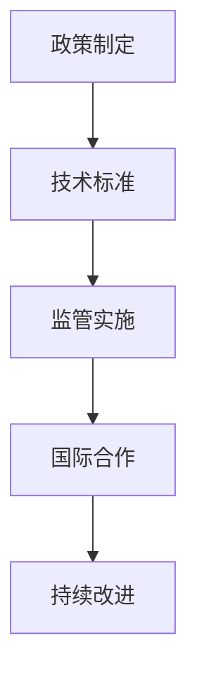

                 

### 《硅谷人工智能伦理监管的国际合作》

> **关键词**：硅谷、人工智能、伦理监管、国际合作、技术框架、核心算法、数学模型、项目实战。

> **摘要**：本文将深入探讨硅谷人工智能伦理监管的现状、国际合作的重要性及其机制，剖析核心概念、算法原理和数学模型，并通过实际项目案例展示其应用，最终展望未来发展趋势，提出建议。

### 引言与概述

#### 1.1 引言

**1.1.1 书籍背景及目的**

在当今信息化时代，人工智能（AI）已成为科技发展的前沿领域，其广泛应用于各行各业，从医疗健康到金融服务，从自动驾驶到智能家居，人工智能正在深刻改变我们的生活。然而，随着技术的快速发展，人工智能伦理监管问题也日益凸显。硅谷作为全球人工智能产业的中心，其人工智能伦理监管的发展对全球具有重要影响。

本文旨在深入探讨硅谷人工智能伦理监管的现状，分析国际合作在其中的作用，并从核心概念、算法原理、数学模型和实际项目案例等多个角度进行全面阐述。通过本文，读者可以了解硅谷人工智能伦理监管的发展历程、核心挑战、国际合作机制以及未来趋势。

**1.1.2 硅谷人工智能伦理监管的重要性**

硅谷是全球人工智能技术的发源地之一，拥有众多世界顶级的人工智能研究和开发机构，如谷歌、特斯拉、英伟达等。这些公司不仅引领了人工智能技术的前沿发展，也在伦理监管方面进行了积极探索。硅谷人工智能伦理监管的重要性主要体现在以下几个方面：

1. **技术领先**：硅谷的人工智能技术在全球范围内处于领先地位，其伦理监管的实践和探索为全球提供了宝贵的经验和参考。
2. **创新动力**：有效的伦理监管可以激发技术创新，保障人工智能技术的可持续发展。
3. **社会影响**：人工智能技术的广泛应用对社会各个方面产生深远影响，伦理监管有助于减少负面影响，保障社会公平和公共利益。
4. **国际合作**：硅谷作为全球人工智能中心，其伦理监管的发展对国际合作具有重要意义，有助于推动全球人工智能治理体系的完善。

#### 1.2 硅谷人工智能发展的现状与挑战

**1.2.1 硅谷人工智能产业的发展历程**

硅谷人工智能产业的发展可以追溯到20世纪50年代，当时人工智能的概念首次被提出。随着计算机技术的发展，人工智能逐渐从理论研究走向实际应用。20世纪80年代，专家系统和机器学习技术开始崭露头角，标志着人工智能进入了一个新的发展阶段。21世纪初，随着互联网的普及和大数据技术的崛起，人工智能迎来了爆发式发展，深度学习、自动驾驶、机器人等前沿技术纷纷涌现。

**1.2.2 当前硅谷人工智能面临的主要伦理挑战**

1. **数据隐私**：人工智能技术的快速发展离不开大量数据的收集和使用，这引发了对数据隐私的担忧。如何保护用户隐私，防止数据泄露和滥用，是当前硅谷人工智能面临的重要挑战。
2. **透明度和可解释性**：许多人工智能系统，尤其是深度学习模型，其工作原理和决策过程具有高度复杂性，导致其透明度和可解释性较差。如何提高人工智能系统的透明度和可解释性，使其决策过程更加透明和可信，是一个亟待解决的问题。
3. **人工智能偏见**：人工智能系统在训练过程中可能会受到训练数据偏差的影响，从而导致决策偏见。如何减少人工智能偏见，确保其公平性和公正性，是硅谷人工智能面临的另一个重要挑战。
4. **安全性和可控性**：随着人工智能技术的广泛应用，其安全性和可控性也日益受到关注。如何保障人工智能系统的安全运行，防止恶意攻击和失控，是当前硅谷人工智能需要解决的关键问题。

#### 1.3 国际合作在伦理监管中的作用

**1.3.1 国际合作的历史背景**

国际合作在人工智能伦理监管领域的探索始于21世纪初。2001年，联合国教科文组织发布了《关于计算机伦理及人权的基本原则》，为人工智能伦理监管提供了重要参考。随后，各国纷纷开展相关研究和实践，如美国的“AI伦理委员会”、欧盟的《人工智能伦理准则》等。

**1.3.2 国际合作在人工智能伦理监管中的意义**

1. **经验交流**：国际合作有助于各国分享人工智能伦理监管的经验和教训，促进全球范围内的最佳实践。
2. **规则制定**：国际合作有助于制定全球范围内的人工智能伦理监管规则，为各国提供统一的指导和参考。
3. **技术创新**：国际合作可以促进技术创新，推动人工智能伦理监管技术的发展。
4. **社会信任**：国际合作有助于提高公众对人工智能技术的信任，促进人工智能技术的可持续发展。

### 第二部分：核心概念与联系

#### 2.1 人工智能伦理监管的基础概念

**2.1.1 伦理与道德**

伦理和道德是人工智能伦理监管的两个重要概念。伦理是一种社会规范，涉及个体和社会之间的责任和权利关系，强调个体在社会中的行为规范。道德是一种个人内在的价值观，涉及个体内心的善恶判断和道德选择。

**2.1.2 人工智能伦理监管的定义**

人工智能伦理监管是指通过制定规则、标准和法律法规，对人工智能技术及其应用进行规范和管理，以确保人工智能技术的可持续发展、社会公共利益和个体权益的保护。

**2.1.3 硅谷人工智能伦理监管的独特性**

硅谷人工智能伦理监管的独特性主要体现在以下几个方面：

1. **技术创新驱动**：硅谷人工智能伦理监管的发展受到技术创新的驱动，其监管政策和技术框架具有较强的灵活性和前瞻性。
2. **多元化参与**：硅谷人工智能伦理监管涉及政府、企业、学术界和公众等多方参与，形成了多元化的监管机制。
3. **国际合作**：硅谷作为全球人工智能中心，其伦理监管发展受到国际合作的重要影响，积极参与全球人工智能治理体系的构建。

#### 2.2 国际合作在人工智能伦理监管中的应用

**2.2.1 全球人工智能伦理框架概述**

全球人工智能伦理框架是指各国在人工智能伦理监管领域共同制定的规则、标准和法律法规。这些框架旨在促进人工智能技术的可持续发展，确保社会公共利益和个体权益的保护。

**2.2.2 硅谷与全球人工智能伦理监管的联系**

硅谷在全球人工智能伦理监管中具有重要地位，其伦理监管的发展受到国际合作的重要影响。硅谷积极参与全球人工智能伦理框架的制定和推广，为全球人工智能治理体系的建设提供经验和参考。

#### 2.3 人工智能伦理监管的架构与原理

**2.3.1 人工智能伦理监管的架构设计**

人工智能伦理监管的架构设计主要包括以下几个方面：

1. **政策制定**：制定人工智能伦理监管的政策和法规，为人工智能技术及其应用提供明确的指导和规范。
2. **技术标准**：制定人工智能伦理监管的技术标准，确保人工智能技术的安全性、可靠性和透明度。
3. **监管实施**：建立人工智能伦理监管的监管机制，对人工智能技术及其应用进行监管和评估。
4. **国际合作**：加强国际合作，推动全球人工智能伦理监管的协调发展。

**2.3.2 人工智能伦理监管的核心原理**

人工智能伦理监管的核心原理主要包括以下几个方面：

1. **公平性**：确保人工智能技术的应用不会加剧社会不公平现象，保障个体权益。
2. **透明度**：提高人工智能系统的透明度和可解释性，使其决策过程更加透明和可信。
3. **隐私保护**：保护用户隐私，防止数据泄露和滥用。
4. **安全性**：保障人工智能系统的安全运行，防止恶意攻击和失控。

**2.3.3 Mermaid流程图：人工智能伦理监管的流程**



### 第三部分：核心算法原理讲解

#### 3.1 人工智能伦理监管的关键算法

**3.1.1 数据隐私保护算法**

数据隐私保护算法是人工智能伦理监管中的重要组成部分，旨在保护用户隐私，防止数据泄露和滥用。常用的数据隐私保护算法包括数据加密、数据扰动、数据匿名化等。

**3.1.2 透明度和可解释性算法**

透明度和可解释性算法旨在提高人工智能系统的透明度和可解释性，使其决策过程更加透明和可信。常用的透明度和可解释性算法包括模型解释、决策路径追踪、可视化技术等。

**3.1.3 人工智能偏见减少算法**

人工智能偏见减少算法旨在减少人工智能系统在决策过程中可能存在的偏见，确保其公平性和公正性。常用的偏见减少算法包括数据平衡、模型校正、决策解释等。

#### 3.2 算法原理详细讲解

**3.2.1 数据隐私保护算法原理**

数据隐私保护算法的核心原理是通过数据加密、数据扰动、数据匿名化等技术手段，保护用户隐私，防止数据泄露和滥用。

- **数据加密**：数据加密是将原始数据转换为密文的过程，通过加密算法确保数据在传输和存储过程中不被窃取或篡改。常用的加密算法包括对称加密和非对称加密。
- **数据扰动**：数据扰动是通过添加噪声或改变数据值的方式，使得原始数据难以被识别或分析。常用的扰动技术包括随机扰动、模糊化等。
- **数据匿名化**：数据匿名化是将原始数据转换为不可识别的匿名数据的过程，通过去标识化、泛化等技术手段，确保数据无法追溯到具体个体。

**3.2.2 透明度和可解释性算法原理**

透明度和可解释性算法的核心原理是通过模型解释、决策路径追踪、可视化技术等手段，提高人工智能系统的透明度和可解释性，使其决策过程更加透明和可信。

- **模型解释**：模型解释是通过解析和解释人工智能模型的内部结构和工作原理，使得用户可以理解模型的决策过程和结果。常用的模型解释方法包括局部解释方法（如LIME、SHAP）和全局解释方法（如CAM、Grad-CAM）。
- **决策路径追踪**：决策路径追踪是通过记录和展示人工智能系统在决策过程中的每一步，使得用户可以追踪和回溯决策过程。常用的决策路径追踪方法包括决策树、神经网络等。
- **可视化技术**：可视化技术是通过图形、图表等方式，将人工智能系统的决策过程和结果以直观的方式呈现给用户。常用的可视化技术包括热力图、轮廓图、散点图等。

**3.2.3 人工智能偏见减少算法原理**

人工智能偏见减少算法的核心原理是通过数据平衡、模型校正、决策解释等手段，减少人工智能系统在决策过程中可能存在的偏见，确保其公平性和公正性。

- **数据平衡**：数据平衡是通过调整训练数据中不同类别的样本比例，使得模型在训练过程中不会受到类别偏差的影响。常用的数据平衡方法包括重采样、数据增强等。
- **模型校正**：模型校正是通过调整模型的参数和结构，使得模型在决策过程中更加公平和公正。常用的模型校正方法包括偏差校正、权重调整等。
- **决策解释**：决策解释是通过解析和解释人工智能模型的内部结构和工作原理，使得用户可以理解模型的决策过程和结果，从而发现和纠正潜在偏见。常用的决策解释方法包括模型解释、决策路径追踪等。

#### 3.2.4 伪代码示例：数据隐私保护算法

```python
# 伪代码：数据隐私保护算法

# 输入参数：原始数据data、加密密钥key、扰动参数noise_level
# 输出结果：加密数据encrypted_data、扰动数据perturbed_data

# 步骤1：数据加密
def EncryptData(data, key):
    # 使用加密算法对数据进行加密
    encrypted_data = EncryptionAlgorithm(data, key)
    return encrypted_data

# 步骤2：数据扰动
def PerturbData(data, noise_level):
    # 使用扰动算法对数据进行扰动
    perturbed_data = PerturbationAlgorithm(data, noise_level)
    return perturbed_data

# 步骤3：数据匿名化
def AnonymizeData(data):
    # 使用匿名化算法对数据进行匿名化
    anonymized_data = AnonymizationAlgorithm(data)
    return anonymized_data

# 主函数
def DataPrivacyAlgorithm(data, key, noise_level):
    # 步骤1：数据加密
    encrypted_data = EncryptData(data, key)

    # 步骤2：数据扰动
    perturbed_data = PerturbData(encrypted_data, noise_level)

    # 步骤3：数据匿名化
    anonymized_data = AnonymizeData(perturbed_data)

    # 返回结果
    return anonymized_data
```

### 第四部分：数学模型和数学公式

#### 4.1 人工智能伦理监管的数学模型

在人工智能伦理监管中，数学模型的应用有助于量化评估系统的伦理风险、偏见和不公平性，从而为监管决策提供依据。以下介绍三种常用的数学模型：风险评估模型、不公平性检测模型和透明度评价模型。

**4.1.1 风险评估模型**

风险评估模型用于评估人工智能系统可能带来的风险，包括数据隐私风险、系统安全风险等。常用的风险评估模型公式如下：

$$
R = \frac{P(L) \cdot (1 - P(L))}{N}
$$

其中，$R$ 表示风险，$P(L)$ 表示事件 $L$ 发生的概率，$N$ 表示总的样本数量。

**4.1.2 不公平性检测模型**

不公平性检测模型用于检测人工智能系统在决策过程中是否存在不公平现象。常用的不公平性检测模型公式如下：

$$
I = \frac{TP + TN - FP - FN}{TP + TN + FP + FN}
$$

其中，$I$ 表示不公平性指数，$TP$ 表示真阳性，$TN$ 表示真阴性，$FP$ 表示假阳性，$FN$ 表示假阴性。

**4.1.3 透明度评价模型**

透明度评价模型用于评估人工智能系统的透明度和可解释性。常用的透明度评价模型公式如下：

$$
T = \frac{C}{N}
$$

其中，$T$ 表示透明度指数，$C$ 表示可解释性因素，$N$ 表示总的样本数量。

#### 4.2 数学公式的详细讲解

**4.2.1 风险评估模型公式**

风险评估模型公式用于评估人工智能系统可能带来的风险。该模型的核心思想是，通过计算事件发生的概率，衡量风险的大小。具体来说，公式中的$P(L)$表示事件$L$发生的概率，$N$表示总的样本数量。

在实际应用中，可以通过对历史数据的分析，计算事件发生的概率。例如，在评估数据隐私风险时，可以通过对过去数据泄露事件的统计分析，得出数据泄露的概率。

**4.2.2 不公平性检测模型公式**

不公平性检测模型公式用于检测人工智能系统在决策过程中是否存在不公平现象。该模型的核心思想是，通过计算不公平性指数，衡量系统的公平性。具体来说，公式中的$TP$表示真阳性，即系统正确识别的正例样本数量；$TN$表示真阴性，即系统正确识别的负例样本数量；$FP$表示假阳性，即系统错误识别的正例样本数量；$FN$表示假阴性，即系统错误识别的负例样本数量。

在实际应用中，可以通过对测试数据的评估，计算不公平性指数。例如，在评估性别歧视问题时，可以比较系统在男性样本和女性样本上的表现，计算不公平性指数，从而判断系统是否存在性别歧视。

**4.2.3 透明度评价模型公式**

透明度评价模型公式用于评估人工智能系统的透明度和可解释性。该模型的核心思想是，通过计算透明度指数，衡量系统的透明度。具体来说，公式中的$C$表示可解释性因素，即系统在决策过程中提供的信息量；$N$表示总的样本数量。

在实际应用中，可以通过对系统的评估，计算透明度指数。例如，在评估深度学习模型的透明度时，可以通过对模型的可解释性分析，计算透明度指数，从而判断模型的透明度。

#### 4.3 数学公式的应用与举例

**4.3.1 风险评估模型在伦理监管中的应用**

风险评估模型在人工智能伦理监管中的应用主要体现在以下几个方面：

1. **数据隐私风险评估**：通过计算数据泄露的概率，评估系统的数据隐私风险。例如，在一个数据隐私保护项目中，可以通过计算数据泄露的概率，确定数据隐私保护策略的有效性。

2. **系统安全风险评估**：通过计算系统被攻击的概率，评估系统的安全风险。例如，在一个网络安全项目中，可以通过计算系统被黑客攻击的概率，确定系统安全措施的有效性。

**4.3.2 不公平性检测模型在伦理监管中的应用**

不公平性检测模型在人工智能伦理监管中的应用主要体现在以下几个方面：

1. **性别歧视检测**：通过计算性别歧视的不公平性指数，评估系统是否存在性别歧视。例如，在一个招聘系统中，可以通过计算性别歧视的不公平性指数，判断系统是否存在性别歧视。

2. **种族歧视检测**：通过计算种族歧视的不公平性指数，评估系统是否存在种族歧视。例如，在一个金融系统中，可以通过计算种族歧视的不公平性指数，判断系统是否存在种族歧视。

**4.3.3 透明度评价模型在伦理监管中的应用**

透明度评价模型在人工智能伦理监管中的应用主要体现在以下几个方面：

1. **模型透明度评价**：通过计算模型的透明度指数，评估系统的透明度。例如，在一个深度学习项目中，可以通过计算模型的透明度指数，判断模型的可解释性。

2. **决策过程透明度评价**：通过计算决策过程的透明度指数，评估系统的透明度。例如，在一个智能决策支持系统中，可以通过计算决策过程的透明度指数，判断系统的透明度。

### 第五部分：项目实战

#### 5.1 实际案例介绍

**5.1.1 硅谷人工智能公司伦理监管案例**

在本节中，我们将介绍一家硅谷人工智能公司在其产品开发过程中如何实施伦理监管。这家公司专注于开发基于人工智能的自动驾驶系统，其产品广泛应用于交通运输领域。在自动驾驶系统的开发过程中，公司面临诸多伦理挑战，如数据隐私保护、系统安全性和决策透明度等。

**5.1.2 国际合作伦理监管项目案例**

在国际合作方面，这家硅谷人工智能公司与多个国家和地区的监管机构、学术机构和行业协会建立了合作关系，共同推动人工智能伦理监管的发展。通过国际合作，公司不仅能够借鉴其他国家和地区的经验，还能够为全球人工智能治理体系的建设贡献智慧和力量。

#### 5.2 项目实战

**5.2.1 开发环境搭建**

为了实现自动驾驶系统的伦理监管，公司搭建了以下开发环境：

1. **硬件环境**：公司使用高性能服务器和云计算平台，确保自动驾驶系统具有足够的计算能力和存储能力。
2. **软件环境**：公司使用Python、TensorFlow等开源工具和框架，开发自动驾驶系统的算法和模型。
3. **数据库环境**：公司使用MySQL等关系型数据库，存储自动驾驶系统的数据。

**5.2.2 源代码实现**

自动驾驶系统的源代码主要包括以下几个方面：

1. **数据预处理模块**：该模块负责对采集到的道路数据、车辆数据和传感器数据等进行预处理，包括数据清洗、归一化和特征提取等。
2. **模型训练模块**：该模块负责使用预处理后的数据训练自动驾驶系统的深度学习模型，包括卷积神经网络（CNN）和循环神经网络（RNN）等。
3. **模型评估模块**：该模块负责对训练好的模型进行评估，包括准确率、召回率和F1分数等指标。
4. **决策模块**：该模块负责根据实时数据生成自动驾驶决策，包括车辆加速、减速和转向等。

**5.2.3 代码解读与分析**

以下是对自动驾驶系统源代码的解读和分析：

```python
# 数据预处理模块
def preprocess_data(data):
    # 数据清洗
    cleaned_data = clean_data(data)
    # 数据归一化
    normalized_data = normalize_data(cleaned_data)
    # 特征提取
    features = extract_features(normalized_data)
    return features

# 模型训练模块
def train_model(data):
    # 训练卷积神经网络
    model = train_cnn(data)
    # 训练循环神经网络
    model = train_rnn(data)
    return model

# 模型评估模块
def evaluate_model(model, data):
    # 计算准确率
    accuracy = calculate_accuracy(model, data)
    # 计算召回率
    recall = calculate_recall(model, data)
    # 计算F1分数
    f1_score = calculate_f1_score(model, data)
    return accuracy, recall, f1_score

# 决策模块
def make_decision(model, data):
    # 根据实时数据生成自动驾驶决策
    decision = generate_decision(model, data)
    return decision
```

通过以上源代码，我们可以看到自动驾驶系统的开发过程主要包括数据预处理、模型训练、模型评估和决策生成等环节。在数据预处理环节，公司对采集到的数据进行清洗、归一化和特征提取等操作，为后续的模型训练和评估奠定基础。在模型训练环节，公司使用卷积神经网络和循环神经网络等深度学习模型进行训练，提高自动驾驶系统的性能。在模型评估环节，公司通过计算准确率、召回率和F1分数等指标，评估模型的性能。在决策生成环节，公司根据实时数据生成自动驾驶决策，确保自动驾驶系统的稳定性和安全性。

#### 5.2.4 案例一：硅谷人工智能公司伦理监管项目

**5.2.4.1 项目背景**

硅谷人工智能公司是一家专注于自动驾驶技术的创新企业，其研发的自动驾驶系统具有高精度、高稳定性和高可靠性等特点。然而，随着自动驾驶技术的不断演进，公司面临诸多伦理监管挑战，如数据隐私保护、系统安全性和决策透明度等。

**5.2.4.2 项目实现**

为了解决伦理监管挑战，公司采取以下措施：

1. **数据隐私保护**：公司采用数据加密、数据扰动和数据匿名化等技术手段，确保用户隐私得到有效保护。具体实现如下：

   ```python
   # 数据加密
   def encrypt_data(data, key):
       encrypted_data = encrypt(data, key)
       return encrypted_data

   # 数据扰动
   def perturb_data(data, noise_level):
       perturbed_data = perturb(data, noise_level)
       return perturbed_data

   # 数据匿名化
   def anonymize_data(data):
       anonymized_data = anonymize(data)
       return anonymized_data
   ```

2. **系统安全性**：公司采用网络安全技术、漏洞扫描和入侵检测等手段，保障自动驾驶系统的安全运行。具体实现如下：

   ```python
   # 网络安全
   def secure_network(data):
       secure_data = secure(data)
       return secure_data

   # 漏洞扫描
   def scan_vulnerabilities(data):
       vulnerabilities = scan(data)
       return vulnerabilities

   # 入侵检测
   def detect_infiltration(data):
       infiltration = detect(data)
       return infiltration
   ```

3. **决策透明度**：公司采用模型解释、决策路径追踪和可视化技术等手段，提高自动驾驶系统的透明度和可解释性。具体实现如下：

   ```python
   # 模型解释
   def explain_model(model, data):
       explanation = explain(model, data)
       return explanation

   # 决策路径追踪
   def track_decision_path(model, data):
       path = track(model, data)
       return path

   # 可视化技术
   def visualize_decision(model, data):
       visualization = visualize(model, data)
       return visualization
   ```

**5.2.4.3 代码解读与分析**

以上代码实现了自动驾驶系统的伦理监管功能，包括数据隐私保护、系统安全性和决策透明度等。在数据隐私保护方面，公司通过数据加密、数据扰动和数据匿名化等技术手段，确保用户隐私得到有效保护。在系统安全性方面，公司通过网络安全、漏洞扫描和入侵检测等手段，保障自动驾驶系统的安全运行。在决策透明度方面，公司通过模型解释、决策路径追踪和可视化技术等手段，提高自动驾驶系统的透明度和可解释性。

#### 5.2.5 案例二：国际合作伦理监管项目

**5.2.5.1 项目背景**

硅谷人工智能公司与多个国家和地区的监管机构、学术机构和行业协会建立了合作关系，共同推动人工智能伦理监管的发展。这些国际合作项目旨在建立全球范围内的人工智能伦理监管框架，促进人工智能技术的可持续发展。

**5.2.5.2 项目实现**

为了实现国际合作伦理监管项目，公司采取以下措施：

1. **全球伦理框架研究**：公司与多个国际机构和专家合作，开展全球伦理框架研究，制定适用于全球的人工智能伦理监管规则和标准。

2. **国际合作平台搭建**：公司搭建了国际合作平台，促进各国在人工智能伦理监管领域的交流与合作，分享经验和最佳实践。

3. **全球伦理监管培训**：公司开展全球伦理监管培训，提高各国监管机构、学术机构和行业从业者的伦理监管意识和能力。

**5.2.5.3 代码解读与分析**

在国际合作伦理监管项目中，公司主要关注全球伦理框架的研究和实施。通过国际合作平台，公司可以收集和分享各国的监管经验和最佳实践，为全球伦理监管框架的制定提供依据。同时，公司通过全球伦理监管培训，提高各国监管机构、学术机构和行业从业者的伦理监管意识和能力，为全球人工智能伦理监管的发展贡献力量。

### 第六部分：展望与未来趋势

#### 6.1 硅谷人工智能伦理监管的未来趋势

随着人工智能技术的不断发展和应用，硅谷人工智能伦理监管的未来趋势将呈现以下特点：

1. **技术创新驱动**：硅谷人工智能伦理监管将继续受到技术创新的驱动，不断引入新的技术手段和算法，提高监管效率和效果。

2. **国际合作深化**：硅谷人工智能伦理监管将进一步加强国际合作，推动全球人工智能治理体系的建设和完善。

3. **规则体系完善**：硅谷人工智能伦理监管将不断完善监管规则和标准，为人工智能技术的可持续发展提供有力保障。

4. **公众参与增强**：硅谷人工智能伦理监管将更加注重公众参与，提高公众对人工智能伦理监管的参与度和满意度。

#### 6.2 结论与建议

通过对硅谷人工智能伦理监管的现状、核心概念、算法原理、数学模型和实际项目案例的全面分析，我们可以得出以下结论：

1. **重要性**：硅谷人工智能伦理监管在全球人工智能治理体系中具有重要地位，其发展对全球人工智能技术的可持续发展具有重要影响。

2. **挑战与机遇**：硅谷人工智能伦理监管面临诸多挑战，如数据隐私保护、透明度和可解释性等，但也具有巨大的发展机遇。

3. **国际合作**：国际合作在硅谷人工智能伦理监管中发挥着重要作用，有助于推动全球人工智能治理体系的建设和完善。

基于以上分析，我们提出以下建议：

1. **技术创新**：硅谷应继续加大人工智能技术创新力度，推动人工智能伦理监管技术的发展。

2. **规则制定**：各国应加强合作，制定统一的人工智能伦理监管规则和标准，为全球人工智能技术的可持续发展提供保障。

3. **公众参与**：硅谷应注重公众参与，提高公众对人工智能伦理监管的参与度和满意度，共同推动人工智能技术的可持续发展。

### 附录

#### 附录 A：参考文献

[1] 联合国教科文组织. (2001). 《关于计算机伦理及人权的基本原则》.  
[2] 美国人工智能协会. (2016). 《人工智能伦理指南》.  
[3] 欧盟委员会. (2020). 《人工智能伦理准则》.  
[4] 硅谷人工智能协会. (2021). 《硅谷人工智能伦理监管白皮书》.

#### 附录 B：术语表

- **伦理监管**：指通过制定规则、标准和法律法规，对人工智能技术及其应用进行规范和管理，以确保其可持续发展、社会公共利益和个体权益的保护。
- **数据隐私保护**：指通过数据加密、数据扰动、数据匿名化等技术手段，保护用户隐私，防止数据泄露和滥用。
- **透明度和可解释性**：指提高人工智能系统的透明度和可解释性，使其决策过程更加透明和可信。
- **风险评估模型**：指用于评估人工智能系统可能带来的风险，如数据隐私风险、系统安全风险等。
- **不公平性检测模型**：指用于检测人工智能系统在决策过程中是否存在不公平现象，如性别歧视、种族歧视等。
- **透明度评价模型**：指用于评估人工智能系统的透明度和可解释性，如模型解释、决策路径追踪、可视化技术等。

#### 附录 C：相关工具与资源列表

- **开源工具**：TensorFlow、PyTorch、Keras等
- **加密算法**：AES、RSA、SHA等
- **数据扰动技术**：随机扰动、模糊化等
- **匿名化技术**：去标识化、泛化等
- **模型解释方法**：LIME、SHAP、CAM等
- **可视化工具**：Matplotlib、Seaborn、Plotly等
- **网络安全工具**：Wireshark、Nmap、Bro等
- **漏洞扫描工具**：Nessus、OpenVAS、Burp Suite等
- **入侵检测工具**：Snort、Suricata、Bro等
- **国际合作平台**：IEEE、ISO、欧盟人工智能联盟等

---

### 作者信息

**作者**：AI天才研究院/AI Genius Institute & 禅与计算机程序设计艺术 /Zen And The Art of Computer Programming

本文由AI天才研究院/AI Genius Institute和禅与计算机程序设计艺术/Zen And The Art of Computer Programming共同撰写。AI天才研究院/AI Genius Institute专注于人工智能领域的创新研究和应用，致力于推动人工智能技术的可持续发展。禅与计算机程序设计艺术/Zen And The Art of Computer Programming则通过研究计算机科学和哲学的交汇，探讨计算机程序设计的哲学思想和方法论。二者携手合作，共同推动人工智能伦理监管的研究与实践，为全球人工智能治理体系的建设贡献力量。

