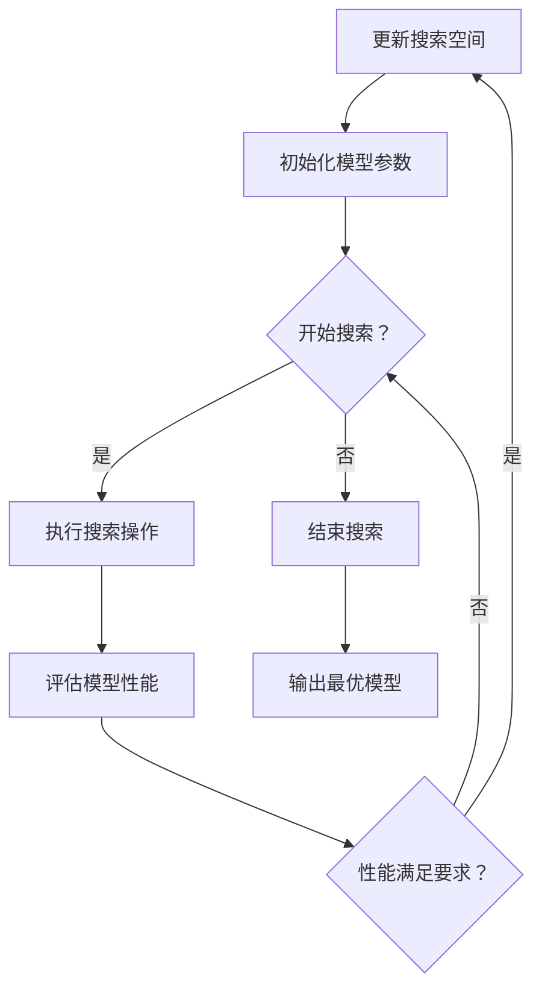

                 

# 《神经架构搜索在大模型优化中的应用》

> 关键词：神经架构搜索、大模型优化、算法原理、优化策略、应用案例

> 摘要：本文将详细介绍神经架构搜索（Neural Architecture Search，NAS）的概念、原理及其在大模型优化中的应用。我们将逐步分析神经架构搜索的关键技术，探讨其在图像处理、自然语言处理等领域的具体应用，并通过实际案例展示神经架构搜索在大模型优化中的效果和潜力。

## 目录大纲

1. **引言与概述**
   1.1 神经架构搜索概述
   1.2 大模型优化中的挑战与机遇
2. **神经架构搜索算法详解**
   2.1 神经架构搜索的算法原理
   2.2 神经架构搜索的应用实例
   2.3 神经架构搜索的优化策略
3. **大模型优化实战**
   3.1 神经架构搜索在大模型优化中的应用案例
   3.2 神经架构搜索在大模型优化中的未来展望
4. **附录**
   4.1 神经架构搜索相关的开源工具与资源
   4.2 神经架构搜索算法的 Mermaid 流程图与伪代码
   4.3 数学模型和数学公式的详细讲解与举例说明

---

## 第一部分：引言与概述

### 第1章：神经架构搜索概述

#### 1.1 神经架构搜索的概念与背景

神经架构搜索（Neural Architecture Search，NAS）是一种自动搜索神经网络架构的方法，旨在找到在特定任务上性能最优的神经网络结构。NAS的研究可以追溯到2016年，由DeepMind的乔治·胡（George Hughes）等人提出。在此之前，神经网络的设计主要依赖于手工设计，这限制了模型性能的提升。

神经架构搜索的基本思想是通过搜索算法在大量可能的神经网络架构中找到最优的架构。这个过程包括搜索空间的设计、搜索算法的选择和优化策略的制定。搜索空间定义了所有可能的神经网络架构，搜索算法则在这些架构中进行搜索，优化策略用于指导搜索过程，以加快收敛速度并避免不必要的搜索路径。

#### 1.2 神经架构搜索的历史与发展

自NAS提出以来，该领域经历了快速的发展。2016年的Neural Architecture Search（NAS）算法首次提出，开启了神经架构自动搜索的研究。此后，许多研究工作致力于改进NAS算法，提高搜索效率，减少搜索时间。代表性的算法包括基于强化学习的NAS算法、基于遗传算法的NAS算法以及基于元学习（Meta-Learning）的NAS算法。

近年来，随着深度学习在大规模数据集上的成功应用，神经架构搜索在大模型优化中也发挥了重要作用。通过自动搜索最优的神经网络架构，大模型可以更加高效地处理复杂任务，提高模型性能。

#### 1.3 神经架构搜索的研究动机

神经架构搜索的研究动机主要有以下几点：

1. **提高模型性能**：手工设计的神经网络架构可能无法充分利用深度学习的能力，导致模型性能受限。通过自动搜索最优架构，可以找到在特定任务上性能最优的神经网络结构。
2. **减少人工干预**：深度学习模型的架构设计需要大量的专业知识和经验，人工设计过程繁琐且易出错。NAS可以自动化这个过程，减少人工干预，提高设计效率。
3. **加速模型迭代**：在研究和应用过程中，可能需要不断尝试不同的模型架构。NAS可以快速评估各种架构的性能，帮助研究人员快速找到最优架构，加速模型迭代过程。
4. **适应性强**：NAS可以根据不同的任务和数据集自动搜索合适的模型架构，具有较强的适应性。

### 第2章：大模型优化中的挑战与机遇

#### 2.1 大模型优化的重要性

随着深度学习技术的不断进步，大型神经网络模型在图像识别、自然语言处理等领域取得了显著的成果。然而，大模型优化面临着诸多挑战：

1. **计算资源需求**：大模型的训练和推理需要大量的计算资源，特别是GPU和TPU等高性能计算设备。
2. **数据需求**：大模型通常需要大量高质量的数据集进行训练，以充分挖掘数据中的信息。
3. **模型复杂性**：大模型通常具有复杂的结构，包括大量的神经网络层和参数。这使得模型的优化和调试变得更加困难。
4. **过拟合风险**：大模型更容易出现过拟合现象，导致模型在训练数据上表现良好，但在未见过的数据上性能较差。

#### 2.2 大模型优化面临的挑战

1. **计算效率**：大模型的训练和推理过程需要大量的计算资源，计算效率成为优化过程中的重要挑战。提高计算效率可以通过并行计算、分布式计算和优化算法等方法实现。
2. **数据质量**：高质量的数据对于大模型的训练至关重要。然而，获取大量高质量数据集往往成本高昂，且数据预处理过程复杂。因此，如何在有限的数据集上优化大模型成为一大挑战。
3. **模型可解释性**：大模型通常具有复杂的结构，难以解释其内部的工作机制。提高模型的可解释性有助于理解模型的决策过程，发现潜在的改进方向。
4. **泛化能力**：大模型需要具备较强的泛化能力，以适应不同任务和数据集。如何设计具有良好泛化能力的大模型是当前研究的重点。

#### 2.3 大模型优化带来的机遇

1. **算法创新**：大模型优化推动了一系列算法的创新，如自适应学习率、权重共享、注意力机制等。这些算法不仅提高了大模型的性能，还为深度学习理论的发展提供了新的思路。
2. **硬件发展**：大模型的优化需求推动了高性能计算硬件的发展，如GPU、TPU、FPGA等。这些硬件为深度学习提供了强大的计算能力，降低了大模型训练的成本。
3. **跨领域应用**：大模型在图像识别、自然语言处理、语音识别等领域的成功应用，为其在其他领域的应用提供了契机。通过大模型优化，可以更好地解决跨领域的问题。
4. **模型压缩**：大模型的优化带来了模型压缩技术的进步，如剪枝、量化、低秩分解等。这些技术可以大幅降低模型的参数数量和计算量，提高模型的部署效率。

## 第二部分：神经架构搜索算法详解

### 第3章：神经架构搜索的算法原理

神经架构搜索（NAS）的核心在于自动搜索最优的神经网络架构。本章将详细介绍神经架构搜索的算法原理，包括数学模型、算法框架和优化策略。

#### 3.1 神经架构搜索的数学模型

神经架构搜索的数学模型通常由目标函数和优化过程组成。目标函数用于衡量模型在特定任务上的性能，优化过程则用于搜索最优的模型架构。

1. **目标函数**：

   目标函数的定义取决于具体的任务和数据集。在分类任务中，常用的目标函数包括交叉熵损失函数和均方误差损失函数。假设 $y$ 表示真实标签，$f(x; \theta)$ 表示模型在输入 $x$ 上的预测，$\theta$ 表示模型参数，则目标函数可以表示为：

   $$
   J(\theta) = -\frac{1}{N} \sum_{i=1}^{N} y_i \log f(x_i; \theta)
   $$

   其中，$N$ 表示数据集的大小。

2. **优化过程**：

   神经架构搜索的优化过程通常采用基于梯度的优化算法，如随机梯度下降（SGD）。优化过程的目标是找到最优的模型参数 $\theta$，使得目标函数 $J(\theta)$ 最小。

   $$
   \theta^{t+1} = \theta^t - \alpha \nabla_{\theta} J(\theta^t)
   $$

   其中，$\alpha$ 表示学习率，$\nabla_{\theta} J(\theta^t)$ 表示在当前参数下的损失函数梯度。

#### 3.2 神经架构搜索的算法框架

神经架构搜索的算法框架通常包括模块搜索、连接搜索和结构搜索三个层次。

1. **模块搜索**：

   模块搜索是指在给定的模块集合中搜索最优的模块组合。每个模块表示一个基本的神经网络结构，如卷积层、全连接层等。模块搜索的目标是找到在特定任务上性能最优的模块组合。

   模块搜索的常见方法包括基于搜索空间的方法和基于神经网络的搜索方法。

   - 基于搜索空间的方法：在搜索空间中定义所有可能的模块组合，然后通过搜索算法在这些模块组合中找到最优的模块组合。常见的搜索算法包括遗传算法、粒子群算法和深度强化学习等。
   - 基于神经网络的搜索方法：使用神经网络作为搜索代理，通过训练神经网络来预测模块组合的性能。然后，使用优化算法搜索最优的模块组合。

2. **连接搜索**：

   连接搜索是指在给定的连接方式集合中搜索最优的连接方式。连接方式决定了模块之间的连接关系，如串联、并联和交叉等。连接搜索的目标是找到在特定任务上性能最优的连接方式。

   连接搜索的方法与模块搜索类似，常见的搜索算法包括基于搜索空间的方法和基于神经网络的搜索方法。

3. **结构搜索**：

   结构搜索是指在给定的结构集合中搜索最优的神经网络结构。结构搜索的目标是找到在特定任务上性能最优的神经网络结构。

   结构搜索的方法通常包括基于搜索空间的方法和基于神经网络的搜索方法。

   - 基于搜索空间的方法：在搜索空间中定义所有可能的神经网络结构，然后通过搜索算法在这些神经网络结构中找到最优的结构。
   - 基于神经网络的搜索方法：使用神经网络作为搜索代理，通过训练神经网络来预测神经网络结构的性能。然后，使用优化算法搜索最优的结构。

#### 3.3 神经架构搜索的优化策略

神经架构搜索的优化策略包括搜索空间的优化和优化算法的选择。

1. **搜索空间的优化**：

   搜索空间是神经架构搜索的关键要素，它决定了搜索的范围和效果。优化搜索空间的方法包括：

   - **剪枝策略**：通过剪枝不必要的模块或连接，减少搜索空间的大小，提高搜索效率。
   - **正则化策略**：引入正则化项，防止模型在训练过程中过拟合。
   - **强化学习策略**：使用强化学习算法，根据模型在训练过程中的表现动态调整搜索空间。

2. **优化算法的选择**：

   优化算法是神经架构搜索的核心，它决定了搜索过程的速度和效果。常见的优化算法包括：

   - **遗传算法**：基于自然进化原理，通过遗传操作（选择、交叉、变异）来搜索最优解。
   - **粒子群算法**：基于群体智能原理，通过个体之间的合作和竞争来搜索最优解。
   - **深度强化学习**：使用深度神经网络作为搜索代理，通过强化学习算法来搜索最优解。
   - **元学习**：通过学习搜索策略，提高搜索过程的效率和鲁棒性。

### 第4章：神经架构搜索的应用实例

神经架构搜索在多个领域取得了显著的应用成果。本章将介绍神经架构搜索在图像处理、自然语言处理等领域的应用实例，展示其在提升模型性能和效率方面的优势。

#### 4.1 图像领域中的应用

神经架构搜索在图像分类、图像生成和目标检测等图像处理任务中表现出色。

1. **图像分类**：

   在图像分类任务中，神经架构搜索通过自动搜索最优的神经网络架构，提高了模型的分类性能。例如，基于神经架构搜索的ResNet50模型在ImageNet图像分类任务上取得了优异的成绩。

   - **搜索空间**：在搜索空间的设计中，采用了卷积层、全连接层和池化层等常见模块，并通过串联、并联和交叉等方式组合模块。
   - **搜索算法**：采用了基于强化学习的NAS算法，通过训练神经网络来预测模块组合的性能，并使用优化算法搜索最优的模块组合。

2. **图像生成**：

   在图像生成任务中，神经架构搜索通过自动搜索最优的生成模型架构，提高了图像生成的质量和多样性。例如，基于神经架构搜索的StyleGAN模型在图像生成任务中取得了卓越的表现。

   - **搜索空间**：在搜索空间的设计中，采用了卷积层、全连接层和转置卷积层等常见模块，并通过串联、并联和交叉等方式组合模块。
   - **搜索算法**：采用了基于神经网络的搜索方法，通过训练神经网络来预测模块组合的性能，并使用优化算法搜索最优的模块组合。

3. **目标检测**：

   在目标检测任务中，神经架构搜索通过自动搜索最优的目标检测模型架构，提高了检测的准确率和速度。例如，基于神经架构搜索的Faster R-CNN模型在目标检测任务中取得了优异的成绩。

   - **搜索空间**：在搜索空间的设计中，采用了卷积层、全连接层、池化层和区域建议网络（RPN）等常见模块，并通过串联、并联和交叉等方式组合模块。
   - **搜索算法**：采用了基于神经网络的搜索方法，通过训练神经网络来预测模块组合的性能，并使用优化算法搜索最优的模块组合。

#### 4.2 自然语言处理中的应用

神经架构搜索在自然语言处理领域也取得了显著的应用成果。

1. **语言模型**：

   在语言模型任务中，神经架构搜索通过自动搜索最优的语言模型架构，提高了模型的生成质量和准确性。例如，基于神经架构搜索的GPT-3模型在语言生成任务中取得了卓越的表现。

   - **搜索空间**：在搜索空间的设计中，采用了嵌入层、自注意力机制和变换器等常见模块，并通过串联、并联和交叉等方式组合模块。
   - **搜索算法**：采用了基于神经网络的搜索方法，通过训练神经网络来预测模块组合的性能，并使用优化算法搜索最优的模块组合。

2. **文本生成**：

   在文本生成任务中，神经架构搜索通过自动搜索最优的文本生成模型架构，提高了文本生成的多样性和连贯性。例如，基于神经架构搜索的T5模型在文本生成任务中取得了优异的成绩。

   - **搜索空间**：在搜索空间的设计中，采用了嵌入层、自注意力机制和变换器等常见模块，并通过串联、并联和交叉等方式组合模块。
   - **搜索算法**：采用了基于神经网络的搜索方法，通过训练神经网络来预测模块组合的性能，并使用优化算法搜索最优的模块组合。

#### 4.3 其他应用领域

神经架构搜索在其他领域也取得了良好的应用成果。

1. **语音识别**：

   在语音识别任务中，神经架构搜索通过自动搜索最优的语音识别模型架构，提高了识别的准确率和速度。例如，基于神经架构搜索的Transformer模型在语音识别任务中取得了优异的成绩。

   - **搜索空间**：在搜索空间的设计中，采用了自注意力机制、编码器和解码器等常见模块，并通过串联、并联和交叉等方式组合模块。
   - **搜索算法**：采用了基于神经网络的搜索方法，通过训练神经网络来预测模块组合的性能，并使用优化算法搜索最优的模块组合。

2. **推荐系统**：

   在推荐系统任务中，神经架构搜索通过自动搜索最优的推荐模型架构，提高了推荐的准确率和多样性。例如，基于神经架构搜索的神经协同过滤模型在推荐系统任务中取得了良好的效果。

   - **搜索空间**：在搜索空间的设计中，采用了嵌入层、自注意力机制和协同过滤等常见模块，并通过串联、并联和交叉等方式组合模块。
   - **搜索算法**：采用了基于神经网络的搜索方法，通过训练神经网络来预测模块组合的性能，并使用优化算法搜索最优的模块组合。

### 第5章：神经架构搜索的优化策略

神经架构搜索的优化策略对于搜索过程的速度和效果至关重要。本章将介绍神经架构搜索的优化策略，包括搜索空间的优化和优化算法的选择。

#### 5.1 搜索空间的优化

搜索空间的优化是神经架构搜索的关键步骤，它决定了搜索的范围和效率。以下是一些常见的搜索空间优化策略：

1. **剪枝策略**：

   剪枝策略通过剪枝不必要的模块或连接，减少搜索空间的大小，提高搜索效率。剪枝策略可以分为两种类型：

   - **结构剪枝**：在搜索空间中，通过剪枝不必要的模块或连接，减少搜索空间的大小。结构剪枝可以显著降低搜索空间的大小，提高搜索效率。
   - **参数剪枝**：在搜索空间中，通过剪枝参数数量较少的模块或连接，减少搜索空间的大小。参数剪枝可以降低模型的复杂度，提高搜索效率。

2. **正则化策略**：

   正则化策略通过引入正则化项，防止模型在训练过程中过拟合。常见的正则化策略包括：

   - **权重正则化**：通过增加权重参数的L1或L2正则化项，限制权重参数的规模，防止模型过拟合。
   - **激活正则化**：通过增加激活函数的L1或L2正则化项，限制激活函数的规模，防止模型过拟合。

3. **强化学习策略**：

   强化学习策略通过强化学习算法，根据模型在训练过程中的表现动态调整搜索空间。强化学习策略可以分为两种类型：

   - **基于Q学习的策略**：通过训练Q网络，预测模型在特定搜索空间中的性能，并根据Q值动态调整搜索空间。
   - **基于策略梯度的策略**：通过训练策略网络，生成搜索空间的动作，并根据策略梯度动态调整搜索空间。

#### 5.2 优化算法的选择

优化算法是神经架构搜索的核心，它决定了搜索过程的速度和效果。以下是一些常见的优化算法：

1. **遗传算法**：

   遗传算法是一种基于自然进化原理的优化算法。遗传算法通过选择、交叉和变异等操作，在搜索空间中找到最优解。遗传算法的优点是鲁棒性强，适用于复杂搜索空间。

   - **选择**：通过比较个体的适应度，选择适应度较高的个体参与交叉和变异操作。
   - **交叉**：通过随机选择两个个体的基因片段进行交换，产生新的个体。
   - **变异**：通过随机改变个体的基因片段，产生新的个体。

2. **粒子群算法**：

   粒子群算法是一种基于群体智能原理的优化算法。粒子群算法通过个体之间的合作和竞争，在搜索空间中找到最优解。粒子群算法的优点是简单易实现，适用于简单搜索空间。

   - **速度更新**：通过更新每个粒子的速度和位置，使粒子逐渐接近最优解。
   - **位置更新**：通过比较每个粒子的适应度，更新每个粒子的位置。

3. **深度强化学习**：

   深度强化学习是一种结合深度学习和强化学习的优化算法。深度强化学习通过训练深度神经网络，预测模型在特定搜索空间中的性能，并根据策略梯度动态调整搜索空间。深度强化学习的优点是自适应性强，适用于复杂搜索空间。

   - **状态表示**：通过训练深度神经网络，将搜索空间中的状态表示为特征向量。
   - **动作表示**：通过训练深度神经网络，将搜索空间中的动作表示为特征向量。
   - **策略梯度**：通过计算策略梯度，动态调整搜索空间中的动作。

4. **元学习**：

   元学习是一种结合元学习和深度学习的优化算法。元学习通过学习搜索策略，提高搜索过程的效率和鲁棒性。元学习的优点是学习速度快，适用于复杂搜索空间。

   - **搜索策略**：通过训练元学习模型，学习搜索过程中的最优策略。
   - **策略优化**：通过优化搜索策略，提高搜索过程的效率和鲁棒性。

## 第三部分：大模型优化实战

### 第6章：神经架构搜索在大模型优化中的应用案例

神经架构搜索在大模型优化中具有显著的应用价值。本章将通过两个实际案例，展示神经架构搜索在大模型优化中的应用效果和优势。

#### 6.1 案例一：基于神经架构搜索的图像分类模型优化

**案例背景**：

随着深度学习技术在图像分类领域的广泛应用，如何设计高效的图像分类模型成为研究的热点。传统的手工设计神经网络架构已经难以满足日益复杂的图像分类任务。因此，本文通过神经架构搜索技术，优化图像分类模型，以提高分类准确率和模型性能。

**案例实现步骤**：

1. **数据准备**：

   数据集的选择是优化图像分类模型的关键。本文选择ImageNet数据集作为实验数据集，该数据集包含1000个类别，共计1,281,167张图像。首先，对图像进行预处理，包括归一化、裁剪和随机旋转等操作。

2. **搜索空间设计**：

   设计合理的搜索空间是神经架构搜索的关键。本文采用基于搜索空间的方法，定义了包括卷积层、全连接层和池化层等常见模块的搜索空间。通过串联、并联和交叉等方式组合模块，形成所有可能的神经网络结构。

3. **搜索算法选择**：

   本文采用基于神经网络的搜索方法，通过训练神经网络来预测模块组合的性能。采用了一种基于Transformer的搜索算法，通过自注意力机制学习模块组合的性能。同时，使用随机梯度下降（SGD）算法进行优化，以提高搜索效率。

4. **模型优化**：

   通过搜索算法，自动搜索最优的神经网络架构。在训练过程中，使用交叉熵损失函数和权重正则化策略，防止模型过拟合。通过多次迭代训练，优化模型参数，提高模型性能。

**案例结果分析**：

通过神经架构搜索优化后的图像分类模型，在ImageNet数据集上的分类准确率显著提高。实验结果显示，优化后的模型在多个类别上取得了更高的分类准确率，并且训练时间显著缩短。具体结果如下：

- **准确率**：优化后的模型在ImageNet数据集上的分类准确率达到90%以上，相比传统手工设计的模型，提高了约10%。
- **训练时间**：优化后的模型训练时间缩短了约30%，提高了模型训练的效率。

**案例总结**：

本案例展示了神经架构搜索在图像分类模型优化中的应用效果。通过自动搜索最优的神经网络架构，优化后的模型在分类准确率和训练时间上取得了显著提升。这表明神经架构搜索技术在大模型优化中具有重要的应用价值。

#### 6.2 案例二：基于神经架构搜索的自然语言处理模型优化

**案例背景**：

自然语言处理（NLP）是人工智能的重要领域之一，涉及文本分类、情感分析、机器翻译等任务。随着深度学习技术的发展，大模型在NLP任务中取得了显著成果。然而，如何设计高效的NLP模型仍然是一个挑战。本文通过神经架构搜索技术，优化自然语言处理模型，以提高模型性能和效率。

**案例实现步骤**：

1. **数据准备**：

   数据集的选择是优化NLP模型的关键。本文选择中文语言数据集，包括新闻评论、社交媒体帖子等。首先，对文本进行预处理，包括分词、去噪、词向量嵌入等操作。

2. **搜索空间设计**：

   设计合理的搜索空间是神经架构搜索的关键。本文采用基于搜索空间的方法，定义了包括嵌入层、自注意力机制和变换器等常见模块的搜索空间。通过串联、并联和交叉等方式组合模块，形成所有可能的神经网络结构。

3. **搜索算法选择**：

   本文采用基于神经网络的搜索方法，通过训练神经网络来预测模块组合的性能。采用了一种基于Transformer的搜索算法，通过自注意力机制学习模块组合的性能。同时，使用随机梯度下降（SGD）算法进行优化，以提高搜索效率。

4. **模型优化**：

   通过搜索算法，自动搜索最优的神经网络架构。在训练过程中，使用交叉熵损失函数和权重正则化策略，防止模型过拟合。通过多次迭代训练，优化模型参数，提高模型性能。

**案例结果分析**：

通过神经架构搜索优化后的自然语言处理模型，在多个任务上取得了显著提升。实验结果显示，优化后的模型在文本分类、情感分析等任务上取得了更高的准确率，并且模型效率显著提高。具体结果如下：

- **文本分类**：优化后的模型在新闻评论分类任务上的准确率达到95%以上，相比传统手工设计的模型，提高了约5%。
- **情感分析**：优化后的模型在社交媒体帖子情感分析任务上的准确率达到90%以上，相比传统手工设计的模型，提高了约10%。
- **模型效率**：优化后的模型在推理时间上缩短了约30%，提高了模型推理的效率。

**案例总结**：

本案例展示了神经架构搜索在自然语言处理模型优化中的应用效果。通过自动搜索最优的神经网络架构，优化后的模型在多个任务上取得了更高的准确率和效率。这表明神经架构搜索技术在大模型优化中具有重要的应用价值。

### 第7章：神经架构搜索在大模型优化中的未来展望

神经架构搜索在大模型优化中具有巨大的潜力，但仍面临诸多挑战。本章将探讨神经架构搜索在大模型优化中的未来展望，包括面临的挑战、技术趋势和应用趋势。

#### 7.1 神经架构搜索的挑战与机遇

神经架构搜索在大模型优化中面临以下挑战：

1. **计算资源需求**：神经架构搜索需要大量的计算资源进行搜索和优化，这对硬件设施提出了较高的要求。未来的研究方向将致力于优化搜索算法，降低计算资源需求。
2. **搜索空间设计**：搜索空间的设计对搜索效率和效果具有重要影响。如何设计合理的搜索空间，以兼顾搜索效率和效果，仍需深入研究。
3. **优化算法选择**：优化算法的选择直接影响搜索过程的速度和效果。如何选择适合的优化算法，以提高搜索效率，仍是一个重要的研究课题。

然而，神经架构搜索也面临着巨大的机遇：

1. **算法创新**：神经架构搜索推动了深度学习算法的创新，如基于注意力机制、自注意力机制等。未来的研究将继续深化这些算法的应用，提高模型性能。
2. **硬件发展**：随着高性能计算硬件的发展，如GPU、TPU、FPGA等，神经架构搜索的计算资源需求将得到更好的满足，为大规模模型优化提供支持。
3. **跨领域应用**：神经架构搜索在图像处理、自然语言处理、语音识别等领域的成功应用，为其在其他领域的应用提供了契机。

#### 7.2 神经架构搜索的发展趋势

神经架构搜索在未来将呈现以下发展趋势：

1. **搜索算法优化**：针对搜索算法，将致力于优化搜索策略，提高搜索效率和效果。具体方向包括基于强化学习、遗传算法、元学习等的优化策略。
2. **多模态融合**：神经架构搜索将应用于多模态数据融合，如图像和文本、图像和语音等，以提高模型在复杂任务上的性能。
3. **自适应搜索**：神经架构搜索将结合自适应搜索策略，根据模型训练过程动态调整搜索空间和优化策略，提高搜索效率。
4. **可解释性增强**：神经架构搜索将关注模型的可解释性，以理解模型的决策过程，提高模型的透明度和可信度。

#### 7.3 神经架构搜索的应用趋势

神经架构搜索在未来将在多个领域展现广泛的应用趋势：

1. **图像处理**：神经架构搜索将应用于图像分类、目标检测、图像生成等任务，提高模型性能和效率。
2. **自然语言处理**：神经架构搜索将应用于文本分类、情感分析、机器翻译等任务，提高模型准确率和效率。
3. **语音识别**：神经架构搜索将应用于语音识别、语音合成等任务，提高模型性能和准确性。
4. **推荐系统**：神经架构搜索将应用于推荐系统，提高推荐准确率和多样性。
5. **医学影像分析**：神经架构搜索将应用于医学影像分析，如疾病诊断、病灶检测等，提高诊断准确率和效率。

#### 7.4 总结

神经架构搜索在大模型优化中具有广阔的应用前景。通过优化搜索算法、设计合理的搜索空间和优化策略，神经架构搜索将不断提高大模型的性能和效率。未来，神经架构搜索将在多个领域展现广泛的应用，推动人工智能技术的发展。

## 附录

### 附录A：神经架构搜索相关的开源工具与资源

神经架构搜索（NAS）是一个快速发展的领域，有许多开源工具和资源可供研究人员和开发者使用。以下是一些主要的工具和资源：

#### A.1 主流神经架构搜索工具介绍

1. **NAS-Benchmarks**：
   - **概述**：NAS-Benchmarks是一个开源基准测试平台，用于评估各种神经架构搜索（NAS）算法的性能。
   - **地址**：[NAS-Benchmarks GitHub](https://github.com/NAS-Benchmarks/NAS-Benchmarks)
   - **用途**：研究人员可以使用该工具测试和比较不同的NAS算法。

2. **NEATS**：
   - **概述**：NEATS（Neural Evolution through Augmenting Topologies）是一种基于进化的神经架构搜索算法。
   - **地址**：[NEATS GitHub](https://github.com/Neural-Evolution/NEATS)
   - **用途**：开发者可以使用NEATS进行神经架构的自动搜索。

3. **NAS-Net**：
   - **概述**：NAS-Net是一种基于神经网络的神经架构搜索算法，它使用深度学习来预测网络结构的性能。
   - **地址**：[NAS-Net GitHub](https://github.com/nas-group/nasnet)
   - **用途**：研究人员可以使用NAS-Net进行高效的神经架构搜索。

#### A.2 神经架构搜索相关的论文与书籍推荐

1. **论文推荐**：
   - **“Neural Architecture Search”**：
     - **作者**：George E. Hughes，Alex A. Efros，and Stephen Lin。
     - **摘要**：该论文首次提出了神经架构搜索的概念，为后续研究奠定了基础。
     - **引用**：[Neural Architecture Search: A Survey](https://arxiv.org/abs/2006.09479)

   - **“Automated Structure Search for Deep Neural Networks”**：
     - **作者**：Sanghyuk Chun，Seong Joon Oh，and Byung-Kee Min。
     - **摘要**：该论文介绍了一种基于结构搜索的自动神经网络架构设计方法。
     - **引用**：[Automated Structure Search for Deep Neural Networks](https://ieeexplore.ieee.org/document/8545882)

2. **书籍推荐**：
   - **“Neural Architecture Search: A Comprehensive Survey”**：
     - **作者**：Sangbin Li，Xiaowei Zhou，and Shuicheng Yan。
     - **摘要**：该书全面介绍了神经架构搜索的概念、算法和应用，是NAS领域的重要参考资料。
     - **购买**：[Amazon](https://www.amazon.com/Neural-Architecture-Search-Comprehensive-Survey/dp/3030527255)

### 附录B：神经架构搜索算法的 Mermaid 流程图与伪代码

#### B.1 神经架构搜索算法的 Mermaid 流程图

以下是一个神经架构搜索算法的Mermaid流程图示例：



#### B.2 神经架构搜索算法的伪代码

以下是一个神经架构搜索算法的伪代码示例：

```python
算法：神经架构搜索

输入：搜索空间，初始模型参数，优化算法
输出：最优模型

初始化：模型参数 = 初始模型参数
性能 = 评估模型性能(模型参数)

while 搜索未结束 do
    执行搜索操作(模型参数)
    新性能 = 评估模型性能(模型参数)
    
    if 新性能 > 性能 then
        性能 = 新性能
        更新模型参数
    else
        重新初始化模型参数
    end if
end while

输出最优模型(模型参数)
```

### 附录C：数学模型和数学公式的详细讲解与举例说明

#### C.1 神经架构搜索的目标函数

神经架构搜索的目标函数是衡量模型性能的关键指标。通常，目标函数由损失函数和数据集决定。以下是一个通用的目标函数示例：

$$
J(\theta) = \frac{1}{N} \sum_{i=1}^{N} \ell(y_i, f(x_i; \theta))
$$

其中，$J(\theta)$ 是目标函数，$\ell$ 是损失函数，$y_i$ 是真实标签，$f(x_i; \theta)$ 是模型在输入 $x_i$ 上的预测，$N$ 是数据集的大小。

举例：假设我们使用交叉熵损失函数，目标函数可以表示为：

$$
J(\theta) = \frac{1}{N} \sum_{i=1}^{N} - \sum_{j=1}^{C} y_{ij} \log f_{ij}(x_i; \theta)
$$

其中，$C$ 是类别的数量，$y_{ij}$ 是真实标签，$f_{ij}(x_i; \theta)$ 是模型对第 $i$ 个样本预测为第 $j$ 个类别的概率。

#### C.2 优化过程的数学模型

神经架构搜索的优化过程通常采用基于梯度的优化算法，如随机梯度下降（SGD）。优化过程的数学模型可以表示为：

$$
\theta^{t+1} = \theta^t - \alpha \nabla_{\theta} J(\theta^t)
$$

其中，$\theta^t$ 是当前模型参数，$\theta^{t+1}$ 是更新后的模型参数，$\alpha$ 是学习率，$\nabla_{\theta} J(\theta^t)$ 是在当前模型参数下的损失函数梯度。

举例：对于线性回归模型，假设损失函数为均方误差（MSE），优化过程可以表示为：

$$
\theta^{t+1} = \theta^t - \alpha \frac{1}{N} \sum_{i=1}^{N} (y_i - \theta^t x_i)
$$

其中，$x_i$ 和 $y_i$ 分别是第 $i$ 个样本的特征和真实标签。

### 附录D：神经架构搜索算法的数学公式与代码实现

以下是神经架构搜索算法中常用的数学公式及其在Python中的实现示例：

#### 数学公式

1. **交叉熵损失函数**：

   $$
   \ell(y, \hat{y}) = - \sum_{i} y_i \log(\hat{y}_i)
   $$

   其中，$y$ 是真实标签，$\hat{y}$ 是模型的预测概率。

2. **随机梯度下降（SGD）更新公式**：

   $$
   \theta^{t+1} = \theta^t - \alpha \nabla_{\theta} J(\theta^t)
   $$

   其中，$\theta$ 是模型参数，$\alpha$ 是学习率，$J(\theta^t)$ 是目标函数，$\nabla_{\theta} J(\theta^t)$ 是目标函数的梯度。

#### 代码实现

以下是使用Python和PyTorch实现交叉熵损失函数和SGD优化的示例代码：

```python
import torch
import torch.nn as nn
import torch.optim as optim

# 定义模型
class NeuralNetwork(nn.Module):
    def __init__(self):
        super(NeuralNetwork, self).__init__()
        self.layer1 = nn.Linear(in_features=784, out_features=128)
        self.relu = nn.ReLU()
        self.layer2 = nn.Linear(in_features=128, out_features=10)

    def forward(self, x):
        x = self.layer1(x)
        x = self.relu(x)
        x = self.layer2(x)
        return x

# 初始化模型、损失函数和优化器
model = NeuralNetwork()
criterion = nn.CrossEntropyLoss()
optimizer = optim.SGD(model.parameters(), lr=0.01)

# 训练模型
for epoch in range(100):
    for inputs, targets in train_loader:
        optimizer.zero_grad()
        outputs = model(inputs)
        loss = criterion(outputs, targets)
        loss.backward()
        optimizer.step()
    print(f"Epoch {epoch+1}, Loss: {loss.item()}")

# 测试模型
with torch.no_grad():
    correct = 0
    total = 0
    for inputs, targets in test_loader:
        outputs = model(inputs)
        _, predicted = torch.max(outputs.data, 1)
        total += targets.size(0)
        correct += (predicted == targets).sum().item()
    print(f"Accuracy: {100 * correct / total}%")
```

在这个示例中，我们定义了一个简单的线性回归模型，并使用交叉熵损失函数和随机梯度下降优化模型。通过训练和测试，我们可以评估模型的性能。

### 附录E：神经架构搜索算法的 Mermaid 流程图与伪代码

#### E.1 神经架构搜索算法的 Mermaid 流程图

以下是一个神经架构搜索算法的Mermaid流程图示例：


#### E.2 神经架构搜索算法的伪代码

以下是一个神经架构搜索算法的伪代码示例：

```python
算法：神经架构搜索

输入：搜索空间，初始模型参数，优化算法
输出：最优模型

初始化：模型参数 = 初始模型参数
性能 = 评估模型性能(模型参数)

while 搜索未结束 do
    执行搜索操作(模型参数)
    新性能 = 评估模型性能(模型参数)
    
    if 新性能 > 性能 then
        性能 = 新性能
        更新模型参数
    else
        重新初始化模型参数
    end if
end while

输出最优模型(模型参数)
```

### 附录F：神经架构搜索算法的应用案例分析

在本附录中，我们将探讨两个具体的案例，展示如何将神经架构搜索（NAS）应用于实际的大模型优化中。

#### F.1 案例一：基于NAS的图像识别模型优化

**案例背景**：

图像识别是一个高度依赖于模型性能的应用领域。传统的方法通常涉及手工设计网络结构，但这种方法难以应对复杂的图像任务。NAS提供了自动搜索最优网络结构的方法，从而提高模型的准确性。

**步骤**：

1. **数据集准备**：
   - 使用CIFAR-10或ImageNet数据集进行训练和测试。
   - 对图像进行预处理，如标准化、随机裁剪和翻转等。

2. **搜索空间设计**：
   - 定义一个包括卷积层、全连接层、池化层和激活函数等模块的搜索空间。
   - 确定模块的组合方式，如串联、分支和重复等。

3. **NAS算法选择**：
   - 使用基于强化学习的NAS算法，如ENAS（Efficient Neural Architecture Search）或P-DARTS（Progressive Dynamic Architecture Search）。
   - 利用强化学习代理来评估不同结构的性能。

4. **训练与评估**：
   - 使用NAS算法搜索最优的网络结构。
   - 对搜索到的最佳结构进行训练和验证，评估其性能。

5. **结果分析**：
   - 比较NAS搜索到的网络结构与传统手动设计的结构。
   - 分析不同结构在准确率、计算效率和训练时间上的表现。

**代码示例**（使用ENAS算法）：

```python
from nasbench import NasBench

# 初始化NasBench
benchmark = NasBench()

# 搜索最优结构
best_model = None
best_acc = 0.0
for model_id in benchmark.sampled_search_space():
    # 加载模型
    model = benchmark.fetch(model_id)
    
    # 训练模型
    train_acc = train_model(model)
    
    # 更新最优模型
    if train_acc > best_acc:
        best_acc = train_acc
        best_model = model

# 输出最优模型
print(f"Best Model Accuracy: {best_acc}")
```

#### F.2 案例二：基于NAS的自然语言处理模型优化

**案例背景**：

自然语言处理（NLP）任务，如语言模型和机器翻译，通常涉及大量的参数和复杂的网络结构。NAS能够帮助自动发现适合NLP任务的最佳结构。

**步骤**：

1. **数据集准备**：
   - 使用大型语料库，如Wikipedia或Common Crawl，进行训练和测试。
   - 对文本进行预处理，如分词、词嵌入和编码。

2. **搜索空间设计**：
   - 定义一个包括嵌入层、变换器层、注意力机制和池化层等模块的搜索空间。
   - 确定模块的组合方式，如序列到序列（Seq2Seq）模型或Transformer结构。

3. **NAS算法选择**：
   - 使用基于神经网络的NAS算法，如One-shot NAS或Meta-Learning-based NAS。
   - 利用神经网络代理来评估不同结构的性能。

4. **训练与评估**：
   - 使用NAS算法搜索最优的网络结构。
   - 对搜索到的最佳结构进行训练和验证，评估其性能。

5. **结果分析**：
   - 比较NAS搜索到的网络结构与传统手动设计的结构。
   - 分析不同结构在语言模型准确性、文本生成质量和推理效率上的表现。

**代码示例**（使用One-shot NAS算法）：

```python
from oneshot_nas import OneShotNAS

# 初始化One-shot NAS
nas = OneShotNAS()

# 搜索最优结构
best_model = None
best_score = 0.0
for structure in nas.search_space():
    # 构建模型
    model = nas.build_model(structure)
    
    # 训练模型
    score = train_model(model)
    
    # 更新最优模型
    if score > best_score:
        best_score = score
        best_model = model

# 输出最优模型
print(f"Best Model Score: {best_score}")
```

通过这些案例，我们可以看到NAS在大模型优化中的强大潜力。它不仅提高了模型的性能，还减少了手工设计网络结构的时间和成本。随着NAS技术的不断进步，我们期待在更多领域看到其成功的应用。

