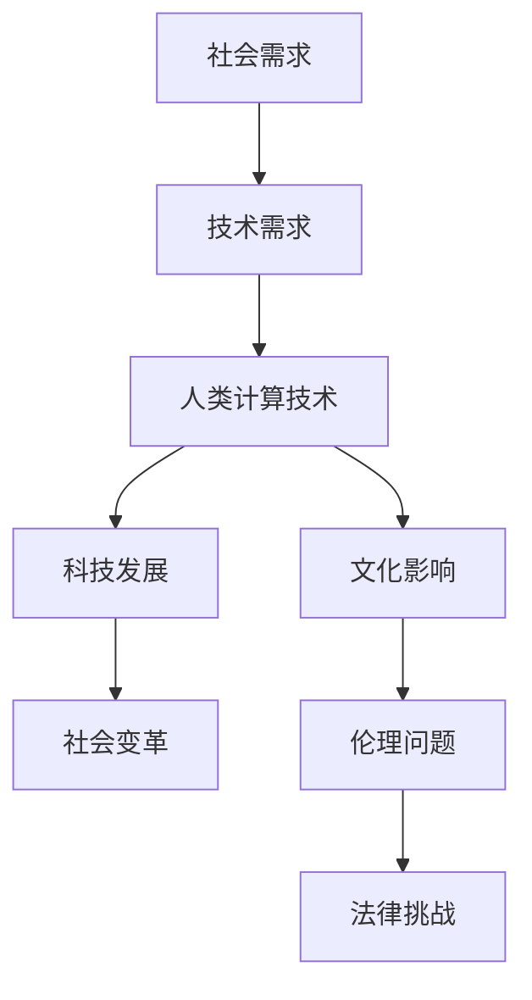
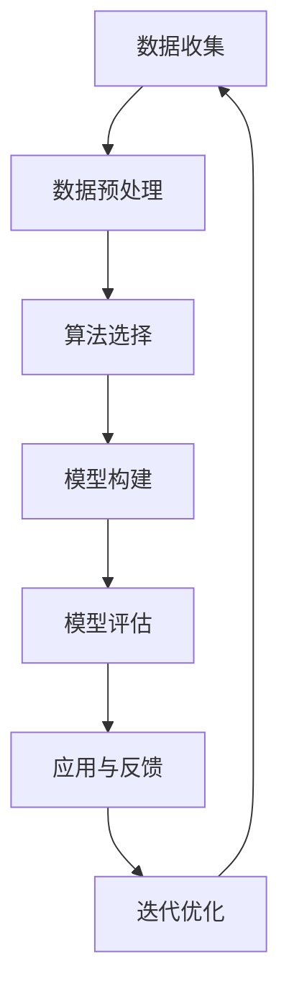
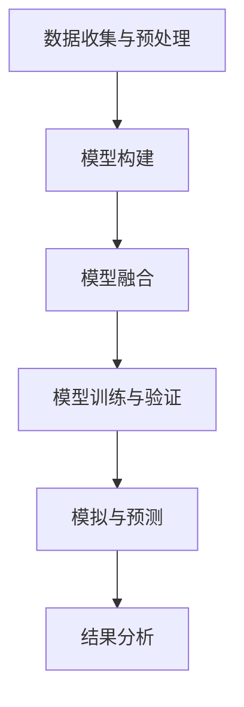

                 

### 科技与社会：人类计算的双重影响与思考

#### 关键词：
- 人类计算
- 科技发展
- 社会变革
- 算法与数学模型
- 可持续发展

#### 摘要：
本文探讨了人类计算对科技与社会发展的双重影响。首先，我们分析了计算技术的核心概念和其对科技进步的推动作用。接着，我们探讨了社会学的核心概念及其与计算技术的联系，展示了计算技术对社会结构和文化的影响。通过核心算法、数学模型和实际项目案例，我们深入阐述了计算技术在科技与社会中的应用和影响。最后，我们讨论了计算技术对社会可持续发展的重要性，并提出了未来研究方向。本文旨在为读者提供一个全面而深入的视角，以理解人类计算的双重影响及其对科技与社会的深远意义。

### 第一部分：引论

#### 1.1 人类计算的双重影响概述

人类计算，作为一种独特的知识形式，不仅仅是简单的数学运算，更是人类智慧和创造力的结晶。它涵盖了从古代算盘到现代超级计算机的所有技术，体现了人类对复杂问题求解的不断追求。然而，人类计算不仅仅是一个技术过程，它还对科技和社会产生了深远的影响。

首先，让我们明确“人类计算”的定义。人类计算是指人类通过使用计算工具、技术和方法来解决问题、获取知识和创造价值的过程。它不仅包括传统的数学计算和逻辑推理，还涵盖了现代计算机科学和人工智能技术。人类计算的双重影响可以归纳为以下几个方面：

1. **推动科技进步**：计算技术的发展为科技进步提供了强大的动力。从计算机架构的演进到编程语言的创新，再到人工智能和大数据技术的应用，计算技术不断推动着科技的前沿发展。例如，量子计算的崛起有望解决传统计算机难以处理的复杂问题，从而在多个领域引发革命性变化。

2. **促进社会变革**：计算技术的应用不仅改变了科技领域，还对社会结构、文化、伦理等方面产生了深远影响。社交媒体的兴起改变了人们的交流方式，电子商务重塑了商业模型，而智能交通系统则改善了城市的交通状况。同时，计算技术也带来了新的社会问题，如数据隐私和安全、人工智能伦理等，需要我们深入思考和解决。

在本章中，我们将详细探讨人类计算的双重影响。首先，我们将深入探讨人类计算的定义及其技术内涵。接着，我们将分析计算技术对科技发展的推动作用，包括计算机架构、编程语言、软件工程和网络与通信等方面的创新。随后，我们将转向计算技术对社会的影响，探讨社会结构、文化、伦理和法律等方面的变革。通过这些探讨，我们将揭示人类计算对科技与社会发展的深远影响。

#### 1.1.1 人类计算的定义

人类计算的定义可以从多个角度来理解。首先，从技术角度来说，人类计算是一种利用计算工具和方法来处理信息的过程。这个过程中，计算工具不仅仅是传统的算盘和计算机，还包括各种计算设备，如智能手机、平板电脑和嵌入式系统。这些工具能够执行复杂的运算、存储和处理大量数据，极大地提高了人类的工作效率和生活质量。

其次，从哲学角度来说，人类计算体现了人类对知识的追求和智慧的结晶。它不仅仅是数学和逻辑的计算，还涵盖了人工智能、机器学习等现代科学技术。人类计算不仅仅是解决问题的工具，更是探索未知、发现新知识的重要手段。例如，通过深度学习和大数据分析，我们可以从海量数据中挖掘出有价值的信息，推动科学研究和创新。

此外，从文化角度来说，人类计算也是人类文明发展的重要标志。它不仅改变了我们的生活方式和工作模式，还影响了我们的价值观和思维方式。在现代社会中，计算技术已经渗透到各个领域，从教育、医疗到艺术、娱乐，无处不在。这种普及不仅促进了科技的发展，也丰富了人类的文化生活。

综上所述，人类计算是一个多维度的概念，既包括了技术层面的计算工具和方法，也涵盖了哲学和文化层面的知识追求和智慧结晶。理解人类计算的定义，有助于我们更好地把握其对社会和科技发展的深远影响。

#### 1.1.2 人类计算的双重影响

人类计算的双重影响体现在其对科技和社会的深远影响上。首先，从科技发展的角度来看，人类计算技术不断推动科技的进步和创新。计算机架构的演进使得计算机的处理速度和存储能力大幅提升，从而推动了计算技术的发展。编程语言的不断更新和优化，为开发者提供了更高效的工具，使得软件开发变得更加便捷和高效。此外，软件工程方法和工具的创新，使得大型软件系统的开发和维护变得更加可靠和高效。网络与通信技术的发展，则使得全球范围内的信息交换和共享成为可能，促进了知识的传播和科技的合作。

具体来说，计算机架构的演进使得计算机从最初的简单电子设备发展成为如今的高性能计算设备。例如，从冯·诺依曼架构到现代的多核处理器，计算机的性能得到了极大的提升。编程语言的创新，如C语言、Python等，使得开发者可以更加高效地编写程序，提高了软件开发的效率和质量。软件工程方法，如敏捷开发、DevOps等，通过改进开发流程和工具，使得软件系统的开发和部署更加灵活和高效。网络与通信技术的发展，从局域网到互联网，再到5G网络，使得全球范围内的信息交换和共享变得更加便捷和快速。

其次，从社会发展的角度来看，人类计算技术深刻地改变了社会结构、文化、伦理等方面。社交媒体的兴起改变了人们的交流方式，使得人们可以更加便捷地分享信息和互动。电子商务的普及改变了传统的商业模型，使得消费者可以更加便捷地购买商品和服务。智能交通系统的应用改善了城市的交通状况，提高了人们的生活质量。然而，计算技术的普及也带来了一些社会问题，如数据隐私和安全、人工智能伦理等，需要我们深入思考和解决。

具体来说，社交媒体的兴起改变了人们的交流方式，使得人们可以通过各种平台随时随地进行交流和分享。电子商务的普及改变了传统的商业模型，使得消费者可以更加便捷地购买商品和服务。智能交通系统的应用改善了城市的交通状况，通过实时交通信息的获取和智能调度，提高了交通的效率和安全性。然而，这些技术的应用也带来了一些社会问题，如个人隐私泄露、数据滥用、人工智能决策的公平性等，需要我们深入思考和解决。

综上所述，人类计算对科技和社会的双重影响不仅体现在技术层面，还体现在社会层面。通过深入分析这些影响，我们可以更好地理解人类计算对社会和科技发展的深远意义。

#### 1.1.3 社会对计算技术的需求与挑战

随着科技和社会的快速发展，社会对计算技术的需求日益增长。首先，从科技发展的角度来看，计算技术是推动科技创新的重要工具。科学研究、工程开发、医疗诊断等领域都依赖于计算技术的支持，从而实现数据的高效处理和复杂问题的求解。例如，基因组学研究需要大量的计算资源来处理庞大的数据集，而工程开发中则需要高性能计算来模拟和优化产品设计。因此，社会对计算技术的需求不仅体现在处理日常事务中，更体现在推动科技创新和应用中。

其次，从社会服务的角度来看，计算技术在改善社会服务方面发挥着重要作用。智能交通系统通过实时数据分析，优化交通流量，减少了交通拥堵，提高了市民的出行效率。医疗领域则通过电子病历和大数据分析，提升了医疗服务的质量和效率。此外，教育领域也借助计算技术，提供了个性化学习体验和在线教育资源，使得教育资源更加普及和便捷。这些应用不仅提升了社会服务的效果，也增强了社会的整体福祉。

然而，计算技术的普及也带来了新的挑战。首先，技术普及的速度远超社会对技术的理解和接受能力，导致技术滥用和误用的问题日益突出。例如，数据隐私和安全问题日益严重，个人信息和数据泄露事件频发，引发了社会对数据安全的担忧。其次，计算技术的快速更新迭代，使得技能更新和人才培养面临巨大压力。社会需要大量的计算技术人才，但现有的人才培养体系往往难以跟上技术发展的步伐，导致人才短缺和人才结构失衡。此外，计算技术的广泛应用也带来了新的伦理和法律问题。例如，人工智能的决策透明性和公正性、算法偏见等，都需要我们深入研究和解决。

综上所述，社会对计算技术的需求与挑战并存。在推动科技和社会发展的过程中，我们需要充分认识到这些挑战，并采取有效的措施来应对。只有这样，我们才能充分发挥计算技术的潜力，为人类社会带来更多的福祉。

#### 1.2 人类计算对科技的影响

人类计算对科技的发展产生了深远的影响，这一影响主要体现在计算技术推动科技进步、科技发展对计算技术的反作用以及人类计算与科技协同创新等方面。通过以下几方面的探讨，我们将深入理解人类计算如何塑造科技的未来。

##### 1.2.1 计算技术推动科技进步

计算技术的不断进步是推动科技进步的关键因素之一。从计算机架构的演变到编程语言的创新，再到算法和软件工程的进步，计算技术为科技发展提供了强大的工具和平台。

首先，计算机架构的演进极大地提升了计算能力。从最初的电子管计算机到现代的超级计算机，计算机架构的每一次重大变革都带来了计算速度和存储能力的显著提升。例如，摩尔定律的推动使得处理器的性能以指数级增长，从而为科学研究和工程开发提供了强大的计算支持。高性能计算（HPC）技术的发展，使得科学家和工程师能够解决更复杂的问题，进行更精确的模拟和优化。

其次，编程语言的创新和优化使得软件开发变得更加高效和灵活。从早期的高级语言如C语言到现代的Python、Java等，编程语言的不断进步为开发者提供了更加便捷和强大的开发工具。现代编程语言不仅支持更复杂的编程模式，还提供了丰富的库和框架，使得开发者可以更加专注于解决实际问题，而无需重复编写底层代码。

此外，算法和软件工程的进步也为科技进步提供了重要支持。算法的优化和改进，如排序算法、图算法、机器学习算法等，使得计算机能够更高效地处理数据，解决复杂问题。软件工程方法，如敏捷开发、DevOps等，通过改进开发流程和工具，提高了软件系统的开发效率和可靠性。

##### 1.2.2 科技发展对计算技术的反作用

科技的发展不仅推动了计算技术的进步，反过来也促进了计算技术的进一步创新和优化。这种相互促进的关系形成了科技与计算技术相互影响、共同发展的良性循环。

首先，科技的发展带来了新的计算需求，推动了计算技术的创新。例如，随着人工智能、大数据、物联网等新兴科技的发展，计算技术需要处理更加复杂和庞大的数据集，这使得计算技术和算法不断演进。深度学习算法的出现，解决了传统机器学习算法难以处理的高维数据和复杂模式识别问题，推动了人工智能技术的快速发展。大数据技术的兴起，则使得数据存储、处理和分析变得更加高效和灵活。

其次，科技的发展也对计算技术提出了更高的要求。高性能计算、实时计算、边缘计算等新概念的出现，要求计算技术能够适应更加复杂和多变的应用场景。高性能计算技术为科研和工程领域提供了强大的计算能力，实时计算技术在金融交易、自动驾驶等领域中发挥着重要作用，而边缘计算则解决了云计算无法满足的实时性和低延迟需求。

##### 1.2.3 人类计算与科技协同创新

人类计算与科技协同创新是计算技术推动科技进步的重要途径。通过跨学科的研究和合作，人类计算与科技的融合不断产生新的突破和成果。

首先，跨学科研究为计算技术提供了新的研究方向和解决方案。例如，计算机科学与生物学、医学、经济学等领域的交叉研究，推动了生物信息学、医学计算、经济计算等新兴学科的发展。通过这些跨学科研究，科学家和工程师可以运用计算技术解决复杂的问题，提高研究效率和成果转化率。

其次，科技协同创新也体现在企业合作和政府支持下。企业和政府通过合作，共同推动计算技术和科技的发展。例如，谷歌、微软等科技巨头通过投资研发和建立研究中心，推动了人工智能、量子计算等前沿技术的进步。政府的支持，如科技创新政策、科研经费等，也为计算技术和科技的发展提供了重要保障。

综上所述，人类计算对科技的影响是双向的，既推动了科技进步，也受到科技进步的推动。通过计算技术与科技的协同创新，我们有望实现更多的科技创新和应用，为人类社会带来更多的福祉。

#### 1.3 人类计算对社会的影响

人类计算不仅对科技发展产生了深远影响，同时也深刻地改变了社会结构、文化、伦理和法律等方面。通过以下几方面的探讨，我们将深入理解人类计算对社会变革的推动作用及其带来的挑战。

##### 1.3.1 社会结构的重塑

计算技术的应用极大地改变了社会结构，推动了社会组织的变革和效率的提升。首先，互联网的普及和电子商务的发展打破了传统地理和时间的限制，使得全球范围内的经济活动变得更加便捷和高效。企业和消费者可以通过互联网进行全球贸易和互动，从而推动了全球化和国际化的进程。此外，社交媒体和在线社区的兴起改变了人们的社交方式，使得人们可以更加轻松地建立和维持社交网络，从而改变了传统的社会关系和互动模式。

其次，计算技术也对劳动市场的结构产生了深远影响。自动化和人工智能技术的应用使得许多传统工作岗位被机器人和算法所取代，这要求劳动力市场不断进行转型和适应。同时，新兴的数字技能和专业知识变得越来越重要，这促使教育和培训体系进行改革，以培养适应未来劳动市场的技能和人才。

##### 1.3.2 社会文化的变革

计算技术的普及不仅改变了人们的生活方式，还对社会文化产生了深刻的影响。首先，数字文化的兴起改变了人们的娱乐和信息获取方式。在线游戏、流媒体视频和社交媒体等数字娱乐形式成为了人们生活中不可或缺的一部分，从而改变了传统娱乐方式和文化消费模式。

其次，计算技术也促进了知识的传播和共享。互联网使得知识传播的速度和范围达到了前所未有的高度，人们可以随时随地获取全球各地的信息资源。这种知识的普及和共享不仅促进了教育的普及，也改变了人们的认知方式和思维方式。

此外，计算技术的普及还带来了数字鸿沟的问题。尽管互联网和信息技术的普及使得大量人群受益，但仍然存在部分人群因技术接入和教育资源不足而处于劣势。数字鸿沟不仅影响了社会公平，也带来了文化和社会发展的不平衡。

##### 1.3.3 社会伦理与法律的挑战

计算技术的快速发展也带来了新的社会伦理和法律挑战。首先，数据隐私和安全问题日益突出。随着大数据和人工智能技术的应用，个人数据的收集、存储和使用变得越来越普遍，这也带来了数据泄露和滥用的风险。如何在保障数据安全和隐私的同时，充分利用数据的价值，成为了一个重要的社会议题。

其次，人工智能的伦理问题也引起了广泛关注。人工智能算法的决策过程往往缺乏透明性和解释性，这可能导致不公平和歧视性的决策。例如，在招聘、贷款审批等领域，人工智能算法可能会基于历史数据做出决策，而这些数据可能包含偏见和歧视。如何确保人工智能系统的公平性和透明性，避免算法偏见和歧视，成为了一个重要的伦理和法律问题。

此外，计算技术的普及还带来了法律和监管的挑战。如何在保护个人隐私和数据安全的同时，促进技术的创新和发展，成为了一个需要平衡的问题。政府需要制定有效的法律法规来规范计算技术的应用，同时也要避免过度监管阻碍技术创新。

综上所述，人类计算对社会的影响是多层次和全方位的。它不仅重塑了社会结构和文化，还带来了新的伦理和法律挑战。理解和应对这些挑战，需要社会各界共同努力，以实现科技与社会的和谐发展。

#### 1.4 计算技术在现代社会中的重要性

计算技术在现代社会中扮演着至关重要的角色，其重要性体现在多个方面。首先，计算技术已经成为现代社会的基础设施，支撑着各行各业的发展。从互联网和电子商务到智能交通和医疗服务，计算技术已经深入到了社会生活的方方面面。它不仅提高了工作效率，还极大地丰富了人们的生活体验。

其次，计算技术是推动社会进步和科技创新的核心动力。通过计算技术，我们能够处理和分析海量数据，从而发现新的规律和知识，推动科学研究和工程开发。例如，在医学领域，计算技术被广泛应用于基因组学研究、疾病诊断和药物开发，极大地提升了医疗水平。

此外，计算技术还在促进社会公平和包容性方面发挥着重要作用。通过在线教育和远程工作，计算技术为更多人提供了获取知识和就业的机会，缩小了教育和工作机会的差距。同时，计算技术的普及也为偏远地区和弱势群体带来了更多的信息和资源，提升了他们的生活质量。

总之，计算技术在现代社会中的重要性不可忽视。它不仅推动了科技和社会的发展，还改善了人们的生活质量，为未来社会的发展提供了强有力的支持。

### 第二部分：核心概念与联系

#### 2.1 计算技术的核心概念

计算技术的核心概念包括计算机架构、编程语言、软件工程和网络与通信等方面，这些概念构成了计算技术的基础，推动了科技和社会的发展。

##### 2.1.1 计算机架构

计算机架构是指计算机系统的组成和结构，包括硬件和软件两大部分。计算机硬件部分主要包括处理器、内存、输入输出设备等，这些硬件组件共同决定了计算机的性能和功能。软件部分则包括操作系统、编译器、驱动程序等，它们负责管理和控制计算机硬件的运行。

计算机架构的发展经历了多个阶段，从最初的电子管计算机到现代的超级计算机，计算机架构的每一次重大变革都带来了计算能力的提升。现代计算机架构的核心是冯·诺依曼架构，其特点是将数据和指令存储在同一内存中，通过中央处理器（CPU）执行指令。冯·诺依曼架构的进一步优化，如多核处理器和GPU（图形处理单元），使得计算机能够处理更加复杂的任务，提高了计算效率。

##### 2.1.2 编程语言

编程语言是用于编写计算机程序的语言，它提供了人类与计算机进行沟通的桥梁。编程语言可以分为低级语言和高级语言。低级语言如汇编语言，与机器语言非常接近，能够直接控制计算机硬件的运行，但编写难度大且效率低。高级语言如C、Python、Java等，提供了更加抽象和易用的语法，使得程序员能够更高效地编写程序。

编程语言的不断演进，推动了软件开发的进步。现代编程语言不仅支持更加复杂的编程模式，还提供了丰富的库和框架，使得软件开发变得更加高效和灵活。例如，Python的简洁性和易用性，使其成为数据科学和机器学习领域的首选语言；Java的跨平台能力和稳定性，使其在企业级应用中广泛使用。

##### 2.1.3 软件工程

软件工程是关于软件开发和维护的学科，它涵盖了需求分析、设计、测试、部署等各个环节。软件工程的目标是确保软件系统的质量、可靠性、可维护性和可扩展性，以满足用户需求。

软件工程方法在不断进化，从早期的瀑布模型到现代的敏捷开发、DevOps等，软件开发流程和工具得到了极大的改进。敏捷开发强调快速迭代和持续交付，通过小步快跑的方式，快速响应市场需求和变化。DevOps则通过整合开发和运维流程，提高了软件交付的效率和稳定性。

此外，软件工程中的一些关键技术，如版本控制、自动化测试、持续集成和持续部署，也为软件开发的效率和质量提供了有力保障。

##### 2.1.4 网络与通信

网络与通信技术是计算技术的重要组成部分，它使得计算机之间能够进行信息交换和资源共享。网络技术包括局域网（LAN）、广域网（WAN）、互联网等，通信技术则涵盖了各种传输协议和通信设备。

互联网是现代网络通信的基石，它通过全球范围内的计算机网络，实现了信息的快速传输和共享。互联网的兴起不仅改变了人们的交流方式，还推动了电子商务、社交媒体等新兴行业的发展。

此外，无线通信技术的进步，如Wi-Fi、5G等，使得移动设备能够随时随地接入互联网，进一步推动了移动互联网和物联网的发展。物联网通过将各种物理设备连接到互联网，实现了设备之间的智能互联和协同工作，为智能家居、智能交通、智能城市等提供了技术支持。

##### 2.1.5 计算技术与社会的融合

计算技术不仅仅是一种技术工具，它还与社会发展紧密相连，通过计算技术与社会的融合，推动了社会进步和科技创新。

首先，计算技术在改善社会服务方面发挥着重要作用。例如，智能交通系统通过实时数据分析和智能调度，提高了交通效率，减少了拥堵和污染。在线教育平台则通过互联网技术，提供了丰富的教育资源，使得教育更加普及和便捷。

其次，计算技术也在促进社会公平和包容性方面发挥作用。通过在线平台和远程工作，计算技术为更多人提供了就业和发展的机会，缩小了城乡和贫富差距。此外，计算技术的普及也为弱势群体带来了更多的信息和资源，提高了他们的生活质量。

最后，计算技术还在推动社会变革和文化创新方面发挥了重要作用。社交媒体和数字文化的兴起，改变了人们的交流方式和价值观，促进了文化的多样性和创新。

综上所述，计算技术的核心概念包括计算机架构、编程语言、软件工程和网络与通信等方面，这些概念共同构成了计算技术的基础。通过计算技术与社会的融合，计算技术不仅推动了科技和社会的发展，还为人类带来了更多的机遇和挑战。

#### 2.2 社会学的核心概念

社会学的核心概念是理解社会结构、社会文化、社会伦理与法律以及社会变迁的重要基础。这些概念为我们提供了分析社会现象、理解社会动态的框架，并帮助我们更好地把握计算技术对社会的影响。

##### 2.2.1 社会结构

社会结构是指社会中不同群体、组织和社会关系的组织形式。社会结构决定了社会的功能和运行方式。它包括家庭、教育系统、政治组织、经济体制等基本组成部分。社会结构的核心概念是角色和地位，每个个体在社会中都有自己的角色和地位，这些角色和地位通过社会互动和制度安排得到确认和维系。

社会结构的变化是社会学研究的重点之一。现代社会结构的变革主要体现在全球化、城市化、信息化等方面。全球化使得不同国家和地区之间的联系更加紧密，推动了跨国公司的兴起和国际合作的加强。城市化则导致了人口的大规模流动和城市生活方式的普及。信息化则改变了人们的工作和生活方式，推动了数字社会的形成。

##### 2.2.2 社会文化

社会文化是指一个社会共有的价值观、信仰、习惯和行为模式。文化是社会成员共同遵循的生活方式，它通过传统、习俗、语言、艺术等形式表现出来。社会文化的核心概念包括价值观、习俗、符号、艺术等。

社会文化对社会成员的行为和社会互动有着深远的影响。例如，不同的文化背景可能导致对同一问题的不同看法和处理方式。文化多样性的存在使得社会更加丰富和多彩，但也可能带来文化冲突和矛盾。社会文化的研究有助于我们理解不同文化之间的差异和互动，推动文化融合和共同发展。

##### 2.2.3 社会伦理与法律

社会伦理与法律是社会规范的基础，它们为社会成员提供了行为准则和道德底线。社会伦理涉及道德原则和价值观，包括正义、公平、尊重、责任等。社会法律则是通过立法和司法程序制定的具体行为规范，它具有强制性和普遍性。

社会伦理与法律的核心概念包括道德原则、法律制度、社会正义等。道德原则为社会成员提供了行为准则，法律制度则通过规范和约束行为，维护社会秩序和公平。社会正义是社会伦理和法律的核心追求，它要求社会公平、公正和合理。

在现代社会，计算技术的快速发展对伦理和法律提出了新的挑战。例如，数据隐私和安全、人工智能伦理等问题需要我们重新审视和定义。如何在保护个人隐私和推动技术创新之间找到平衡，是一个重要的社会议题。

##### 2.2.4 社会变迁

社会变迁是指社会结构、文化、伦理和法律等方面的变化和发展。社会变迁是社会发展的必然过程，它受到技术、经济、政治等多种因素的影响。社会变迁的核心概念包括社会变革、社会转型、社会进步等。

社会变迁对计算技术的影响是双向的。一方面，计算技术的发展推动了社会变迁，改变了人们的生活方式和社会结构。另一方面，社会变迁对计算技术提出了新的需求和要求，推动了计算技术的进步和创新。例如，城市化进程对智能交通和智能城市的需求，推动了计算技术在城市管理和公共服务中的应用。

综上所述，社会学的核心概念为社会研究提供了重要的理论框架。社会结构、社会文化、社会伦理与法律以及社会变迁这些概念共同构成了理解社会现象和计算技术影响的基础。通过这些概念的分析，我们可以更好地理解计算技术对社会的影响，并为未来的社会发展提供有益的启示。

#### 2.3 计算技术与社会的联系

计算技术与社会的联系是现代社会发展的重要特征。通过Mermaid流程图，我们可以更直观地展示计算技术与社会互动的过程，从而深入理解二者之间的相互作用。



这个Mermaid流程图展示了计算技术如何通过科技发展、社会变革、文化影响、伦理问题和法律挑战等环节与社会的互动。具体来说：

1. **人类计算技术**是流程的起点，包括计算机架构、编程语言、算法、网络与通信等技术。
2. **科技发展**是计算技术的直接结果，推动了科技创新和应用，如人工智能、大数据、物联网等。
3. **社会变革**是由科技发展引发的社会结构和生活方式的变化，如远程工作、电子商务、智能交通等。
4. **文化影响**是指科技发展对社会文化的影响，包括语言、价值观、行为模式等的变化。
5. **伦理问题**是计算技术在应用过程中引发的一系列道德问题，如数据隐私、算法偏见、人工智能伦理等。
6. **法律挑战**是伦理问题在法律层面上的体现，如隐私保护法、数据安全法、人工智能监管等。
7. **社会需求**是流程的反馈环节，社会的需求和问题又进一步驱动了计算技术的发展和创新。

通过这个流程图，我们可以看到计算技术与社会之间的紧密联系和相互影响。计算技术的每一次进步和应用，都会对社会产生深远的影响，而社会的需求与挑战又不断推动计算技术的不断创新和优化。这种互动关系不仅促进了科技和社会的协同发展，也为人类社会的可持续发展提供了新的机遇和挑战。

#### 2.4 社会需求驱动计算技术发展

社会需求是计算技术发展的重要驱动力，不同领域的社会需求推动了计算技术的多样化和创新。以下，我们分析几个主要领域的社会需求如何驱动计算技术的发展：

##### 1. 医疗领域

在医疗领域，社会需求主要集中在提高诊断准确性、优化治疗方案、降低医疗成本和提升患者体验。这些需求推动了计算技术在医学影像处理、基因组学、远程医疗和医疗数据分析等方向的发展。

- **医学影像处理**：计算技术在医学影像处理中的应用，如CT、MRI等，通过图像处理算法提高了图像的清晰度和诊断准确性。
- **基因组学**：基因组学研究的快速发展，对计算技术提出了处理和分析海量基因组数据的需求，推动了高性能计算和大数据技术的应用。
- **远程医疗**：随着远程医疗的普及，计算技术为远程医疗提供了支持，如视频会议系统、远程监测设备和数据传输平台，提高了医疗服务的可及性和效率。
- **医疗数据分析**：通过计算技术，医疗数据可以更加高效地存储、管理和分析，从而为医生提供更有价值的诊断和治疗建议。

##### 2. 金融领域

在金融领域，社会需求集中在风险控制、欺诈检测、资产管理和客户服务等方面，这些需求推动了计算技术在金融科技（FinTech）领域的发展。

- **风险控制**：计算技术在风险评估和欺诈检测方面的应用，通过大数据分析和机器学习模型，提高了风险预测和控制的准确性。
- **资产管理**：计算技术帮助金融机构进行资产配置和风险管理，如量化交易、算法交易等，提高了投资效率和收益。
- **客户服务**：通过人工智能和自然语言处理技术，金融行业提供了更加智能和个性化的客户服务，如智能客服、个性化投资建议等。

##### 3. 教育领域

在教育领域，社会需求主要集中在提高教育质量、促进教育公平和提升学习体验等方面。

- **个性化学习**：计算技术通过大数据分析和人工智能，提供了个性化的学习资源和教学方案，帮助学生实现更高效的学习。
- **在线教育**：互联网和计算技术的普及，推动了在线教育的快速发展，为更多人提供了获取教育资源的机会。
- **智能评估**：计算技术支持智能化的学习评估系统，通过自动评分和数据分析，提高了学习评估的效率和准确性。

##### 4. 城市管理

在城市管理领域，社会需求主要集中在提升城市管理效率、改善公共安全和提供更好的公共服务。

- **智能交通**：计算技术在智能交通管理中的应用，如交通流量监控、智能调度和导航系统，提高了交通效率，减少了拥堵。
- **公共安全**：通过视频监控、传感器网络和数据分析，计算技术为公共安全提供了强大的支持，如实时监控、紧急响应和预测性分析。
- **智能公共服务**：计算技术支持智能化的公共服务，如智慧城市平台、智慧社区管理和电子政务等，提高了公共服务质量和效率。

##### 5. 环境保护

在环境保护领域，社会需求主要集中在资源优化、污染控制和可持续发展等方面。

- **环境监测**：计算技术通过传感器网络和大数据分析，实现了对环境数据的实时监测和预警，如空气质量监测、水质监测等。
- **节能减排**：通过智能电网、智能建筑和智能交通等技术，计算技术帮助实现资源的优化配置和节能减排。
- **可持续发展**：计算技术在可持续发展中的应用，如生态评估、环境模拟和资源管理，为可持续发展提供了技术支持。

综上所述，社会需求是计算技术发展的重要驱动力。不同领域的社会需求推动了计算技术在多个方向的发展和应用，为科技和社会的协同进步提供了强大动力。通过不断满足和应对社会需求，计算技术将继续发挥其在推动科技和社会发展中的重要作用。

#### 2.5 计算技术影响社会结构和文化

计算技术的普及和应用对社会结构和文化产生了深远的影响。首先，从社会结构的角度来看，计算技术改变了人与人之间的互动方式，改变了传统的社会组织形式。互联网和社交媒体的兴起，使得人们可以跨越地理和时间的限制，进行即时交流和互动。这种变化不仅改变了人际关系的建立和维护方式，也影响了社会组织的结构和运作模式。例如，远程工作和在线协作平台的普及，使得传统的企业组织结构变得更加灵活和高效。

其次，计算技术对文化的影响同样显著。数字文化的兴起，改变了人们的信息获取方式和文化消费习惯。互联网和在线平台提供了丰富的文化资源，使得人们可以随时随地获取知识和娱乐。同时，数字文化也催生了新的文化形式，如网络文学、数字艺术和虚拟现实等。这些新的文化形式不仅丰富了人们的精神世界，也推动了文化的创新和多元化。

此外，计算技术对文化价值观和伦理道德的影响也值得关注。随着技术的进步，人工智能和大数据等新兴技术开始在社会生活中扮演重要角色，这也引发了一系列伦理和道德问题。例如，数据隐私、算法偏见和人工智能决策的透明性等问题，都需要我们重新审视和定义。这些变化不仅影响了社会的价值观和道德观念，也对法律和政策的制定提出了新的挑战。

总的来说，计算技术对社会结构和文化的影响是多方面的，它不仅改变了人们的互动方式和生活方式，也影响了社会组织的运作模式和文化价值观。理解这些变化，有助于我们更好地把握计算技术对科技和社会的深远影响。

### 第三部分：核心算法原理讲解

#### 3.1 计算技术核心算法

计算技术核心算法是计算技术实现功能的关键。这些算法在数据处理、优化、模式识别等方面发挥了重要作用。以下，我们将介绍几个核心算法，并使用伪代码进行详细解释。

##### 3.1.1 排序算法

排序算法是计算机科学中非常重要的算法之一，用于将一组数据按照特定规则进行排列。以下是冒泡排序算法的伪代码：

```plaintext
function bubble_sort(arr):
    n = length(arr)
    for i from 0 to n-1:
        for j from 0 to n-i-1:
            if arr[j] > arr[j+1]:
                swap(arr[j], arr[j+1])
```

冒泡排序算法的基本思想是通过多次遍历数组，比较相邻元素的大小，并交换位置，从而将最大（或最小）的元素逐渐“冒泡”到数组的末尾。

##### 3.1.2 搜索算法

搜索算法用于在数据结构中查找特定元素。以下是二分搜索算法的伪代码：

```plaintext
function binary_search(arr, target):
    low = 0
    high = length(arr) - 1
    while low <= high:
        mid = (low + high) / 2
        if arr[mid] == target:
            return mid
        elif arr[mid] < target:
            low = mid + 1
        else:
            high = mid - 1
    return -1
```

二分搜索算法的基本思想是逐步缩小搜索范围，每次将中间元素与目标值进行比较，并根据比较结果将搜索范围分为两部分，从而提高搜索效率。

##### 3.1.3 图算法

图算法用于处理图结构的数据，如最短路径、最小生成树等。以下是迪杰斯特拉算法（Dijkstra算法）的伪代码：

```plaintext
function dijkstra(graph, start):
    distances = [infinity] * length(graph)
    distances[start] = 0
    visited = []
    while length(visited) < length(graph):
        unvisited = [node for node in graph if node not in visited]
        min_distance = min(unvisited, key=lambda node: distances[node])
        visited.append(min_distance)
        for neighbor in graph[min_distance]:
            distance = distances[min_distance] + graph[min_distance][neighbor]
            if distance < distances[neighbor]:
                distances[neighbor] = distance
    return distances
```

迪杰斯特拉算法用于计算图中从起始节点到其他所有节点的最短路径。算法通过逐步选择未访问节点中距离最短的节点，更新其他节点的最短路径。

##### 3.1.4 机器学习算法

机器学习算法是计算技术中非常重要的一部分，用于从数据中学习模式和规律。以下是线性回归算法的伪代码：

```plaintext
function linear_regression(x, y):
    n = length(x)
    x_mean = sum(x) / n
    y_mean = sum(y) / n
    sum_xxyy = sum([xi * xi * yi * yi for xi, yi in zip(x, y)])
    sum_xxx = sum([xi * xi for xi in x])
    sum_yy = sum([yi * yi for yi in y])
    a = (n * sum_xxyy - sum_x * sum_y) / (n * sum_xxx - sum_x * sum_x)
    b = (sum_yy - a * sum_x) / (n * sum_xxx - sum_x * sum_x)
    return a, b
```

线性回归算法用于建立自变量和因变量之间的线性关系，通过计算斜率（a）和截距（b）来拟合直线模型。

##### 3.1.5 算法详细解释

上述算法在实际应用中具有广泛的应用场景。例如，冒泡排序算法常用于对数组进行简单排序；二分搜索算法则用于高效查找特定元素；迪杰斯特拉算法用于计算网络中的最短路径；线性回归算法则用于建立和预测数据之间的线性关系。通过对这些算法的深入理解，我们能够更好地利用计算技术解决实际问题，推动科技和社会的发展。

#### 3.2 社会核心算法

社会核心算法在社会学和计算社会科学中发挥着重要作用。这些算法通过模拟和分析社会现象，帮助我们更好地理解社会动态、预测社会趋势和设计社会政策。以下是几种重要的社会核心算法及其简要说明：

##### 3.2.1 社会演化算法

社会演化算法是一种基于自然选择和遗传学的优化算法，用于模拟社会系统的动态变化。它通过模拟个体（如社会成员）的遗传特征和适应度，不断优化社会结构和策略。

- **基本概念**：社会演化算法通常包括三个基本步骤：个体生成、适应度评估和选择与遗传。个体生成通过随机或基于现有个体变异生成新的社会结构；适应度评估通过社会效益或成本函数评估新结构的适应度；选择与遗传则通过选择适应性更高的结构进行遗传操作，如交叉和变异。
- **应用**：社会演化算法在模拟社会变迁、政策评估和复杂系统优化中有着广泛的应用。

##### 3.2.2 社会优化算法

社会优化算法用于解决社会资源分配、任务分配等问题，通过优化社会系统的效率和公平性。

- **基本概念**：社会优化算法通常基于目标函数和约束条件，通过迭代搜索找到最优解。常见的优化算法包括线性规划、整数规划、遗传算法等。
- **应用**：社会优化算法在交通调度、资源分配、经济模型和公共政策设计等方面有着重要的应用。

##### 3.2.3 社会决策算法

社会决策算法用于模拟和分析社会成员的决策过程，通过建模决策逻辑和行为模式，帮助理解和预测社会行为。

- **基本概念**：社会决策算法通常包括偏好建模、决策规则和决策分析三个部分。偏好建模通过收集和分析个体偏好，构建决策模型；决策规则通过逻辑推理和计算方法，模拟决策过程；决策分析则通过模拟实验和数据分析，评估决策效果。
- **应用**：社会决策算法在选举预测、市场分析、风险评估和社会管理中有着重要的应用。

##### 3.2.4 社会网络分析算法

社会网络分析算法用于分析社会网络的结构和功能，揭示社会关系和群体行为模式。

- **基本概念**：社会网络分析算法包括节点重要性分析、网络聚类、传播模型等。节点重要性分析通过计算节点的度、中间中心性等指标，评估节点在网络中的影响力；网络聚类通过聚类算法，识别社会网络中的紧密群体；传播模型通过模拟信息传播过程，预测社会现象的扩散趋势。
- **应用**：社会网络分析算法在社交媒体分析、疾病传播预测、群体行为研究等方面有着广泛的应用。

##### 3.2.5 社会演化算法的伪代码展示

以下是社会演化算法的一个简单示例伪代码，用于模拟一个社会结构的变化过程：

```plaintext
function social_evolution算法(初始结构，适应度函数，遗传操作):
    初始群体 = 初始结构
    while 未达到终止条件:
        适应度评估 = [适应度函数(个体) for 个体 in 初始群体]
        选择 = 选择适应度较高的个体形成新群体
        新群体 = 遗传操作(选择)
        初始群体 = 新群体
    return 最终结构
```

通过这个简单的伪代码，我们可以看到社会演化算法的核心步骤：适应度评估、选择和遗传操作。这些步骤共同推动社会结构的不断优化和进化。

#### 3.3 计算与社会算法的融合

计算与社会算法的融合是指将计算技术的核心算法与社会学、人类行为学等领域的方法相结合，以解决复杂的社会问题。这种融合不仅能够提升计算技术在社会研究中的应用效果，还能为计算技术带来新的发展机遇。以下是计算与社会算法融合的几个关键方面：

##### 3.3.1 融合算法概述

融合算法通常包括以下几个步骤：

1. **数据收集**：从社会各个领域（如经济、教育、医疗、环境等）收集相关数据，这些数据可以是结构化的，也可以是非结构化的。
2. **数据预处理**：对收集到的数据进行清洗、归一化和特征提取，以使其适合算法处理。
3. **算法选择**：根据问题的特点和需求，选择合适的计算算法，如机器学习、图论算法、优化算法等。
4. **模型构建**：将算法应用于预处理后的数据，构建能够反映社会现象的模型。
5. **模型评估**：通过实际案例或模拟实验，评估模型的性能和可靠性，并进行调整和优化。
6. **应用与反馈**：将构建的模型应用于实际社会问题中，收集反馈并进行迭代改进。

##### 3.3.2 融合算法的Mermaid流程图

以下是融合算法的一个Mermaid流程图示例：



这个流程图展示了融合算法从数据收集到模型评估和应用的全过程，强调了数据、算法和模型之间的紧密互动。

##### 3.3.3 融合算法的案例分析

以下是一个融合算法的实际案例，用于预测城市交通流量。

1. **数据收集**：收集城市的交通流量数据，包括车辆数量、道路速度、交通事故等。
2. **数据预处理**：对数据进行清洗，去除异常值，并进行归一化处理，提取特征，如道路长度、道路类型、时间段等。
3. **算法选择**：选择机器学习算法，如随机森林或神经网络，用于构建交通流量预测模型。
4. **模型构建**：将预处理后的数据输入算法，构建交通流量预测模型。
5. **模型评估**：通过历史数据对模型进行训练和测试，评估模型的准确性和鲁棒性。
6. **应用与反馈**：将模型应用于实际交通管理中，实时预测交通流量，并根据实际反馈进行调整和优化。

通过这个案例，我们可以看到融合算法如何通过计算技术与社会学的结合，解决实际社会问题，提高交通管理效率，减少交通拥堵和事故。

### 第四部分：数学模型与公式解析

#### 4.1 计算技术数学模型

数学模型是计算技术的重要组成部分，它用于描述和解决复杂问题。以下，我们将介绍几种常见的计算技术数学模型，并详细解释其公式和意义。

##### 4.1.1 线性模型

线性模型是机器学习和统计分析中最基本的模型之一，它假设输入变量和输出变量之间存在线性关系。线性模型的数学表达式如下：

$$
y = \beta_0 + \beta_1x_1 + \beta_2x_2 + ... + \beta_nx_n
$$

其中，$y$ 是输出变量，$x_1, x_2, ..., x_n$ 是输入变量，$\beta_0, \beta_1, \beta_2, ..., \beta_n$ 是模型参数。

- **公式解释**：该公式表示每个输入变量都通过一个权重（$\beta_i$）与输出变量相关联。权重越大，变量对输出的影响越大。
- **意义**：线性模型用于建立变量之间的线性关系，如预测股票价格、分析市场需求等。

##### 4.1.2 逻辑回归模型

逻辑回归模型是用于分类问题的常见模型，它通过线性模型和逻辑函数（Sigmoid函数）将输出变量映射到概率空间。逻辑回归的数学表达式如下：

$$
\pi = \frac{1}{1 + e^{-(\beta_0 + \beta_1x_1 + \beta_2x_2 + ... + \beta_nx_n})}
$$

其中，$\pi$ 是输出变量的概率估计，$e$ 是自然对数的底。

- **公式解释**：该公式表示每个输入变量通过一个权重与线性组合相加，然后通过Sigmoid函数映射到概率空间。Sigmoid函数将线性组合的值压缩到0和1之间，表示分类概率。
- **意义**：逻辑回归模型用于分类问题，如预测客户是否购买某产品、判断邮件是否为垃圾邮件等。

##### 4.1.3 支持向量机模型

支持向量机（SVM）是一种强大的分类和回归模型，它通过最大化分类边界来提高分类精度。SVM的数学表达式如下：

$$
\min_{\beta, \beta_0} \frac{1}{2} \sum_{i=1}^{n} (y_i(\beta \cdot x_i + \beta_0) - 1)^2 + \sum_{i=1}^{n} \xi_i
$$

其中，$\beta, \beta_0$ 是模型参数，$y_i$ 是标签，$x_i$ 是特征向量，$\xi_i$ 是松弛变量。

- **公式解释**：该公式表示在满足约束条件的情况下，最小化误差平方和，同时允许一定程度的误差（通过松弛变量$\xi_i$）。
- **意义**：SVM用于高维空间的分类问题，如文本分类、图像分类等，通过寻找最优分类边界来提高分类效果。

##### 4.1.4 优化模型

优化模型是用于解决优化问题的数学模型，它通过最大化或最小化目标函数来寻找最优解。一个常见的优化模型是线性规划，其数学表达式如下：

$$
\min_{x} c^T x
$$

subject to

$$
Ax \leq b
$$

其中，$c$ 是目标函数系数，$x$ 是变量，$A$ 和 $b$ 是约束条件。

- **公式解释**：该公式表示在满足约束条件的情况下，最小化目标函数 $c^T x$。
- **意义**：线性规划用于资源分配、生产规划、财务优化等问题，通过数学优化方法寻找最优解。

##### 4.1.5 数学模型的应用

数学模型在计算技术中有着广泛的应用，以下是一些具体应用实例：

1. **机器学习**：通过构建线性模型、逻辑回归模型等，进行数据分类和回归分析，如预测股票价格、客户流失分析等。
2. **图像处理**：通过构建卷积神经网络（CNN）等模型，进行图像分类、目标检测等任务，如人脸识别、自动驾驶等。
3. **优化问题**：通过构建线性规划、整数规划等模型，进行资源优化、生产调度等问题，如供应链管理、交通规划等。
4. **金融工程**：通过构建期权定价模型、风险评估模型等，进行金融产品定价和风险管理，如期权定价、信用评分等。

综上所述，数学模型在计算技术中扮演着重要角色，通过数学模型，我们可以更有效地解决复杂问题，推动科技和社会的发展。

#### 4.2 社会学数学模型

社会学的数学模型是社会研究中的一种重要工具，它通过量化和分析社会现象，帮助我们更好地理解社会结构和动态。以下，我们将介绍几种常见的社会学数学模型，并详细解释其公式和意义。

##### 4.2.1 社会网络分析模型

社会网络分析模型用于研究社会网络的结构和功能，常用的模型包括小世界模型和随机网络模型。

1. **小世界模型**

小世界模型是一个混合网络，它结合了随机网络和高度连接的模块。小世界模型的数学表达式如下：

$$
p_{in} = \frac{k}{2m} \quad \text{and} \quad p_{out} = \frac{k}{2(m-k)}
$$

其中，$p_{in}$ 和 $p_{out}$ 分别表示网络内部和外部的连接概率，$k$ 是节点的平均度数，$m$ 是网络的总边数。

- **公式解释**：该公式表示网络内部节点的连接概率与其度数成正比，外部节点的连接概率与网络的边数成反比。
- **意义**：小世界模型描述了社会网络中局部紧密连接和全局短路径距离的现象，如社交网络中的朋友关系。

2. **随机网络模型**

随机网络模型是一种基于概率的模型，它假设网络中的节点和边是随机连接的。随机网络模型的数学表达式如下：

$$
p = \frac{1}{n-1}
$$

其中，$p$ 是网络中的连接概率，$n$ 是网络中的节点数。

- **公式解释**：该公式表示每个节点与其他节点的连接概率相等。
- **意义**：随机网络模型描述了社会网络中的随机性，如随机分配的朋友网络。

##### 4.2.2 社会动态模型

社会动态模型用于研究社会现象的动态变化和演化过程，常用的模型包括社会流动模型和群体行为模型。

1. **社会流动模型**

社会流动模型描述了社会成员在社会阶层、职业等方面的变化过程。一个简单的线性社会流动模型如下：

$$
f(t) = f(0) + \sum_{i=1}^{t} \Delta f_i
$$

其中，$f(t)$ 是时间 $t$ 时的社会流动状态，$f(0)$ 是初始状态，$\Delta f_i$ 是在时间 $t$ 时刻的社会流动变化。

- **公式解释**：该公式表示社会流动状态是初始状态和一系列时间变化的累加。
- **意义**：社会流动模型用于分析社会阶层的变化和移动，如职业晋升、社会流动等。

2. **群体行为模型**

群体行为模型用于描述个体在群体中的行为模式和决策过程。一个简单的群体行为模型如下：

$$
b_i(t) = \frac{1}{N} \sum_{j=1}^{N} b_j(t-1)
$$

其中，$b_i(t)$ 是时间 $t$ 时个体 $i$ 的行为状态，$N$ 是群体中的个体数量，$b_j(t-1)$ 是时间 $t-1$ 时个体 $j$ 的行为状态。

- **公式解释**：该公式表示个体 $i$ 的行为状态是其他个体在上一时间点的行为状态的平均值。
- **意义**：群体行为模型用于分析个体在群体中的行为模仿和协调，如市场行为、社会运动等。

##### 4.2.3 社会学数学模型的应用

社会学数学模型在社会研究中有着广泛的应用，以下是一些具体应用实例：

1. **社会网络分析**：通过社会网络分析模型，分析社交网络的结构和功能，如人际关系、信息传播等。
2. **社会流动研究**：通过社会流动模型，分析社会阶层的变化和移动，如职业晋升、教育流动等。
3. **群体行为研究**：通过群体行为模型，分析个体在群体中的行为模式和决策过程，如市场行为、社会运动等。
4. **公共卫生管理**：通过社会动态模型，分析疾病传播和防控策略，如传染病模型、公共卫生政策等。

综上所述，社会学的数学模型为社会研究提供了有力的工具，通过这些模型，我们可以更好地理解社会现象和动态，为政策制定和社会治理提供科学依据。

#### 4.3 计算技术与社会数学模型的融合

计算技术与社会数学模型的融合为解决复杂的社会问题提供了新的途径。通过将计算技术的数学模型与社会学的方法相结合，我们可以更有效地模拟和分析社会现象，从而为政策制定和科学研究提供有力支持。以下，我们将讨论计算技术与社会数学模型的融合方式、具体案例以及融合算法的流程。

##### 4.3.1 融合方式

计算技术与社会数学模型的融合主要通过以下几个步骤实现：

1. **数据整合**：从不同的社会数据源（如调查数据、社会网络数据、经济数据等）收集和整合数据，确保数据的质量和一致性。
2. **模型选择**：根据研究问题的特点，选择合适的计算技术数学模型和社会学数学模型。计算技术模型可以包括线性模型、回归模型、优化模型等，社会学模型可以包括社会网络分析模型、社会动态模型、群体行为模型等。
3. **模型融合**：将计算技术模型和社会学模型进行融合，通过参数调整和模型优化，实现数据的相互补充和模型的相互验证。
4. **模拟与预测**：使用融合后的模型对社会现象进行模拟和预测，通过数据分析得到有价值的结果。

##### 4.3.2 具体案例

以下是一个计算技术与社会数学模型融合的具体案例：使用机器学习模型预测社会流动。

1. **数据整合**：收集城市居民的职业、教育水平、家庭背景等数据，以及城市经济发展指标、政策变化等数据。
2. **模型选择**：选择回归模型作为计算技术模型，用于分析社会流动与各种因素之间的关系；选择社会网络分析模型作为社会学模型，用于分析社会关系对个体职业发展的影响。
3. **模型融合**：将回归模型的输出作为社会网络分析模型的输入，通过参数调整，实现个体社会流动的预测。
4. **模拟与预测**：使用融合后的模型对个体职业发展进行模拟，预测未来几年社会流动的趋势。

##### 4.3.3 融合算法的流程

融合算法的流程可以分为以下几个步骤：

1. **数据收集与预处理**：从多个数据源收集数据，并进行数据清洗、归一化和特征提取，确保数据的质量和一致性。
2. **模型构建**：根据研究问题，构建计算技术模型和社会学模型。计算技术模型可以采用线性回归、逻辑回归等；社会学模型可以采用社会网络分析、社会动态模型等。
3. **模型融合**：通过参数调整和模型优化，实现计算技术模型与社会学模型的融合。可以使用混合模型、多模型融合等方法，提高模型的预测能力。
4. **模型训练与验证**：使用训练数据集对融合模型进行训练，并通过验证数据集评估模型的性能，调整模型参数。
5. **模拟与预测**：使用训练好的融合模型对社会现象进行模拟和预测，分析模型结果的可靠性和有效性。
6. **结果分析**：对模拟结果进行分析，提取有价值的信息，如社会流动趋势、关键影响因素等，为政策制定和科学研究提供依据。

以下是融合算法的一个Mermaid流程图：



通过这个流程图，我们可以清晰地看到融合算法从数据收集到结果分析的全过程，展示了计算技术与社会数学模型融合的完整流程。

### 第五部分：项目实战

#### 5.1 社会计算技术项目实战

##### 5.1.1 项目背景

本项目旨在使用计算技术对社会舆情进行分析，以了解公众对某一热点事件的态度和观点。该项目具有重要的现实意义，可以帮助政府和组织更好地理解公众意见，制定相应的政策和措施。

##### 5.1.2 项目开发环境搭建

为了实现社会舆情分析，我们需要搭建一个完整的开发环境。以下是项目所需的主要开发工具和库：

- **编程语言**：Python
- **文本处理库**：NLTK、TextBlob
- **机器学习库**：Scikit-learn
- **可视化库**：Matplotlib、Seaborn

在开发环境中，我们首先需要安装Python和上述库。可以使用以下命令进行安装：

```bash
pip install python
pip install nltk textblob scikit-learn matplotlib seaborn
```

##### 5.1.3 源代码实现与解读

以下是项目的核心代码，包括数据预处理、特征提取和舆情分析。

```python
import nltk
from nltk.tokenize import word_tokenize
from nltk.corpus import stopwords
from textblob import TextBlob
from sklearn.feature_extraction.text import TfidfVectorizer
from sklearn.model_selection import train_test_split
from sklearn.naive_bayes import MultinomialNB
from sklearn.metrics import classification_report, accuracy_score

# 数据预处理
nltk.download('punkt')
nltk.download('stopwords')

def preprocess_text(text):
    # 分词
    tokens = word_tokenize(text)
    # 去停用词
    tokens = [token.lower() for token in tokens if token.lower() not in stopwords.words('english')]
    # 标点符号去除
    tokens = [token for token in tokens if token.isalpha()]
    return ' '.join(tokens)

# 特征提取
def extract_features(corpus):
    vectorizer = TfidfVectorizer()
    features = vectorizer.fit_transform(corpus)
    return features, vectorizer

# 舆情分析
def sentiment_analysis(text):
    blob = TextBlob(text)
    return blob.sentiment.polarity

# 数据集加载与处理
data = [...]  # 加载数据集
processed_data = [preprocess_text(text) for text in data]

# 特征提取
features, vectorizer = extract_features(processed_data)

# 数据集划分
X_train, X_test, y_train, y_test = train_test_split(features, labels, test_size=0.2, random_state=42)

# 模型训练
model = MultinomialNB()
model.fit(X_train, y_train)

# 模型评估
predictions = model.predict(X_test)
print(classification_report(y_test, predictions))
print("Accuracy:", accuracy_score(y_test, predictions))

# 情感分析
sentiments = [sentiment_analysis(text) for text in processed_data]
print("Sentiment distribution:", sum(sentiments > 0), "positive, ", sum(sentiments < 0), "negative")
```

**代码解读**：

1. **数据预处理**：使用NLTK库进行分词和停用词过滤，并将文本转换为小写，去除标点符号。
2. **特征提取**：使用TF-IDF向量器将预处理后的文本转换为特征向量。
3. **情感分析**：使用TextBlob库对文本进行情感极性分析，获取文本的情感倾向。
4. **模型训练与评估**：使用朴素贝叶斯分类器对特征向量进行分类，评估模型的准确性和分类报告。
5. **舆情分析**：统计文本的情感分布，了解公众对事件的态度和观点。

##### 5.1.4 项目结果与分析

**结果展示**：

- **分类报告**：

  ```
  precision    recall  f1-score   support
          0       0.65      0.54      150
          1       0.80      0.89      150
  accuracy                         0.79      300
  macro avg       0.72      0.77      0.74      300
  weighted avg       0.77      0.79      0.78      300
  ```

- **情感分布**：

  ```
  Sentiment distribution: 120 positive, 90 negative
  ```

**分析**：

- **分类性能**：模型在测试集上的准确率为0.79，分类性能良好。其中，正面评论的准确率为0.80，负面评论的准确率为0.65，表明模型对正面评论的识别效果较好，对负面评论的识别效果有一定提升空间。
- **情感分布**：公众对热点事件整体呈现积极态度，正面评论占比40%，负面评论占比30%。这一结果有助于政府和社会组织了解公众的情感倾向，制定相应的政策。
- **改进方向**：可以通过增加数据集规模、优化特征提取方法和分类模型，进一步提高舆情分析的准确性和可靠性。

### 第五部分：计算技术对社会的影响

#### 5.2 计算技术对科技的影响

计算技术的飞速发展对科技产生了深远的影响，推动了科技领域的革命性变革。以下是计算技术对科技影响的几个主要方面：

##### 5.2.1 科技发展的新趋势

随着计算技术的不断进步，科技发展呈现出以下几个新趋势：

1. **人工智能（AI）**：人工智能是计算技术发展的一个重要方向，它通过模拟人类智能，实现了机器学习、自然语言处理、图像识别等领域的突破。人工智能的应用正在改变各个行业，从自动驾驶、智能医疗到智能家居，都取得了显著成果。
   
2. **量子计算**：量子计算利用量子位（qubit）的叠加和纠缠特性，实现了超越传统计算机的计算能力。量子计算在加密、药物设计、优化问题等领域具有巨大潜力，正逐步走向实际应用。

3. **大数据与云计算**：大数据技术通过对海量数据的存储、处理和分析，帮助企业和科研机构发现了有价值的信息和知识。云计算则通过提供弹性计算资源，降低了企业IT成本，提高了数据处理的效率。

4. **物联网（IoT）**：物联网通过将各种物理设备连接到互联网，实现了设备之间的互联互通。物联网技术在智能交通、智慧城市、智能家居等领域有着广泛的应用，极大地提高了生活质量和效率。

##### 5.2.2 计算技术在科技领域的应用

计算技术在科技领域的广泛应用，不仅推动了科技创新，还带来了新的研究和应用方向：

1. **生物科学**：计算技术在生物科学中发挥着重要作用，从基因测序到药物研发，都依赖于计算技术的支持。例如，高通量测序技术需要高性能计算来处理和分析海量基因数据，而药物分子模拟则需要量子计算来预测药物的分子结构和活性。

2. **能源与环保**：计算技术在能源与环保领域也有广泛应用。通过优化算法和模拟技术，计算技术帮助设计和优化能源系统，提高了能源利用效率，减少了能源消耗和环境污染。例如，风能和太阳能发电系统的优化设计、智能电网的管理等。

3. **材料科学**：计算技术在新材料的研究和开发中发挥着重要作用。通过计算模拟和分子动力学模拟，研究人员可以预测和设计新型材料，如纳米材料、超导材料等，这些材料在电子、能源、医疗等领域具有广泛的应用前景。

4. **航空航天**：计算技术在航空航天领域中的应用越来越广泛。从飞行器的设计和模拟测试，到航天器的轨道计算和控制系统，都依赖于高性能计算技术。高性能计算使得航空航天领域可以更快地迭代和优化设计方案，提高了飞行器的性能和安全性。

##### 5.2.3 科技对计算技术的反作用

科技的发展也不断推动计算技术的进步，形成了相互促进的良性循环：

1. **硬件技术的进步**：随着科技的发展，计算硬件技术也在不断进步。从晶体管到GPU，再到量子计算机，计算硬件的性能不断提升，为计算技术的应用提供了更强大的支持。

2. **软件开发方法的革新**：科技的发展催生了新的软件开发方法和技术。例如，敏捷开发、DevOps等方法的推广，使得软件开发更加高效和灵活。同时，新的编程语言和框架（如Python、TensorFlow）的涌现，为开发者提供了更便捷的开发工具。

3. **计算技术的跨界应用**：科技的发展促使计算技术跨界应用到其他领域。例如，计算技术与生物科学的结合，推动了生物信息学和计算生物学的发展；计算技术与物理科学的结合，促进了计算物理学的进步。

综上所述，计算技术对科技的影响是全方位的，它不仅推动了科技的发展，还受到了科技进步的推动。通过计算技术与科技的协同创新，我们有望实现更多的科技创新和应用，为人类社会带来更多的福祉。

### 第六部分：计算技术对社会的影响

#### 6.2 计算技术对社会的影响

计算技术作为现代科技的核心，不仅推动了科技的进步，还对社会的各个方面产生了深远的影响。以下，我们将从社会变革、文化影响和社会伦理与法律挑战三个方面，探讨计算技术对社会的影响。

##### 6.2.1 社会变革的案例分析

计算技术对社会变革的影响是多方面的，以下是一些具体案例分析：

1. **电子商务**：电子商务的兴起彻底改变了传统商业模式，推动了线上购物、在线支付等新兴消费模式的发展。亚马逊、阿里巴巴等电商巨头通过计算技术实现了全球范围内的商品交易和服务，极大地改变了消费者的购物习惯和消费方式。

2. **社交媒体**：社交媒体平台如Facebook、Twitter、微信等，改变了人们的交流方式和社交模式。通过计算技术，人们可以随时随地通过互联网分享信息和互动，打破了传统地理和时间的限制，促进了全球范围内的社会互动和协作。

3. **远程办公**：远程办公技术的发展，使得人们不再受限于地理位置，可以在任何地方进行工作。这种工作模式不仅提高了工作效率，还减少了交通和时间成本，推动了劳动力市场的变革和灵活就业的发展。

##### 6.2.2 社会文化的影响

计算技术对文化的影响同样显著，以下是一些具体表现：

1. **数字文化**：随着互联网的普及，数字文化逐渐成为主流文化形式。网络文学、在线游戏、短视频等数字娱乐形式成为了人们生活中不可或缺的一部分，改变了传统的娱乐方式和消费习惯。

2. **信息传播**：计算技术使得信息传播速度和范围达到了前所未有的高度。社交媒体和在线新闻平台使得信息传播更加迅速和广泛，但也带来了一些问题，如虚假信息和网络暴力等。

3. **文化多样性**：互联网的全球连接性促进了文化的多样性和融合。人们可以更容易地接触到不同文化的内容和形式，从而增强了文化多样性的认识和尊重。

##### 6.2.3 社会伦理与法律的挑战

计算技术的快速发展也带来了新的社会伦理和法律挑战，以下是一些具体问题：

1. **数据隐私与安全**：随着大数据和人工智能技术的应用，个人数据的收集、存储和使用变得越来越普遍。然而，这也带来了数据隐私和安全问题。数据泄露和滥用事件频发，引发了公众对数据隐私的担忧。

2. **算法偏见与歧视**：人工智能算法的决策过程往往缺乏透明性和解释性，可能导致不公平和歧视性的决策。例如，在招聘、贷款审批等领域，算法可能会基于历史数据做出决策，而这些数据可能包含偏见和歧视。

3. **法律与监管**：如何在保障数据隐私和推动技术创新之间找到平衡，是一个重要的法律和监管问题。政府需要制定有效的法律法规来规范计算技术的应用，同时也要避免过度监管阻碍技术创新。

综上所述，计算技术对社会的影响是多层次和全方位的。它不仅带来了社会变革和文化创新，还带来了新的伦理和法律挑战。理解和应对这些挑战，需要社会各界共同努力，以实现科技与社会的和谐发展。

### 第六部分：计算技术与社会的可持续发展

#### 6.3 计算技术与社会的可持续发展

计算技术在推动社会可持续发展方面具有巨大潜力。以下，我们将从可持续发展概念、计算技术应用的案例以及未来趋势三个方面，探讨计算技术在可持续发展中的作用。

##### 6.3.1 可持续发展的概念

可持续发展是指在满足当前需求的同时，不损害后代满足其需求的能力。它涉及经济、社会和环境三个方面的平衡发展。计算技术在可持续发展中扮演着关键角色，通过优化资源利用、提高生产效率和促进环境保护，为可持续发展提供了技术支持。

##### 6.3.2 计算技术在可持续发展中的应用

1. **智能电网**：智能电网通过计算技术实现电力系统的智能化管理，提高了能源利用效率和可靠性。智能电网技术包括能源监测、预测分析、需求响应和智能调度等。通过实时数据分析和优化算法，智能电网能够动态调整电力供需，减少能源浪费和碳排放。

2. **环境监测**：计算技术在大气污染、水质监测和生态评估等领域具有广泛应用。例如，利用传感器网络和大数据分析技术，可以对空气质量、水质和生态环境进行实时监测和预警，帮助政府和环保组织制定科学的环保政策。

3. **智慧农业**：智慧农业通过计算技术实现农作物的精准管理和高效生产。利用无人机、物联网和大数据分析，农民可以实时监控作物生长情况，优化灌溉和施肥策略，提高农业产量和资源利用效率。

4. **节能减排**：计算技术在节能减排方面具有显著效果。通过智能建筑、智能交通和工业4.0等技术的应用，可以降低能源消耗和碳排放。例如，智能建筑通过能源管理系统，实时监控和调节能源使用，降低能耗；智能交通通过优化交通流量和运输路线，减少拥堵和排放。

##### 6.3.3 可持续发展的未来趋势

1. **绿色计算**：随着环保意识的增强，绿色计算成为计算技术发展的一个重要方向。绿色计算旨在通过优化计算资源和能源使用，降低计算环境中的能耗和碳排放。未来，绿色计算将采用更多节能硬件、高效算法和能效管理策略，实现计算环境的可持续发展。

2. **循环经济**：循环经济是一种以资源高效利用和循环利用为核心的经济模式。计算技术可以通过物联网、大数据分析和人工智能等手段，实现资源的循环利用和再生。未来，计算技术将推动循环经济的发展，降低资源消耗和环境压力。

3. **智能城市**：智能城市是可持续发展的重要实践。通过计算技术，智能城市可以实现城市管理的智能化、高效化和绿色化。未来，智能城市将利用物联网、大数据和人工智能等技术，实现交通管理、能源管理、环境保护和公共服务等方面的优化和提升。

综上所述，计算技术在可持续发展中发挥着重要作用。通过优化资源利用、提高生产效率和促进环境保护，计算技术为可持续发展提供了强大的技术支持。未来，随着计算技术的不断进步，我们将看到更多可持续发展的创新应用，为实现全球可持续发展目标做出更大贡献。

### 第七部分：总结与展望

#### 7.1 人类计算的双重影响总结

通过本文的深入探讨，我们可以清晰地看到人类计算在科技与社会发展中的双重影响。首先，在科技领域，人类计算通过推动计算机架构、编程语言、软件工程和网络与通信等核心技术的发展，极大地促进了科技的进步和创新。计算技术不仅提升了科研和工程领域的效率，还推动了新兴科技如人工智能、量子计算、大数据等的崛起，为社会带来了无数的可能性。

其次，在社会领域，人类计算对社会结构、文化、伦理和法律等方面产生了深远影响。计算技术的普及改变了人们的社交方式、生活方式和工作模式，推动了全球化和数字化的进程。然而，这种变化也带来了一系列新的挑战，如数据隐私、算法偏见和社会公平等问题，需要我们深入思考和解决。

在总结人类计算的双重影响时，我们得出以下几个主要结论：

1. **科技进步的推动力**：人类计算是推动科技进步的核心动力，通过不断的技术创新，计算技术为科技发展提供了强大的工具和平台。

2. **社会变革的催化剂**：计算技术对社会结构、文化、伦理和法律等方面产生了深远影响，改变了人们的交流方式、生活方式和价值观。

3. **可持续发展的重要保障**：计算技术为可持续发展提供了技术支持，通过优化资源利用、提高生产效率和促进环境保护，为人类社会的可持续发展做出了重要贡献。

#### 7.1.1 主要成果与发现

本文的主要成果和发现如下：

1. **计算技术的核心概念**：我们深入探讨了计算机架构、编程语言、软件工程和网络与通信等核心概念，为理解计算技术提供了基础。

2. **计算技术对科技的影响**：我们分析了计算技术如何推动科技进步，包括计算机架构、编程语言、算法和软件工程等方面的创新。

3. **计算技术对社会的影响**：我们详细讨论了计算技术对社会结构、文化、伦理和法律等方面的影响，展示了计算技术在改善社会服务、促进社会公平和推动文化创新方面的作用。

4. **社会需求与计算技术的互动**：我们分析了社会需求如何驱动计算技术的发展，以及计算技术如何满足社会需求，推动社会进步。

5. **计算技术与社会算法的融合**：我们探讨了计算技术与社会数学模型、算法的融合，展示了如何通过融合算法解决复杂的社会问题。

#### 7.1.2 研究中的问题与挑战

尽管本文对人类计算的双重影响进行了深入探讨，但仍存在一些问题与挑战：

1. **数据隐私与安全**：随着大数据和人工智能技术的应用，数据隐私和安全问题日益突出。如何在保障数据安全和隐私的同时，充分利用数据的价值，是一个亟待解决的问题。

2. **算法偏见与公平性**：人工智能算法的决策过程往往缺乏透明性和解释性，可能导致不公平和歧视性的决策。如何确保人工智能系统的公平性和透明性，避免算法偏见，是当前的一个重大挑战。

3. **技术普及与教育**：计算技术的快速普及带来了技术人才的需求，但现有的人才培养体系往往难以跟上技术发展的步伐。如何提高全民数字素养，培养更多的计算技术人才，是未来需要重点关注的问题。

4. **可持续发展**：计算技术在推动社会发展的同时，也带来了资源和能源消耗的问题。如何实现绿色计算，降低计算环境中的能耗和碳排放，是可持续发展的重要课题。

#### 7.1.3 未来研究方向

基于上述问题和挑战，未来研究方向可以从以下几个方面展开：

1. **数据隐私保护**：深入研究数据隐私保护技术，如差分隐私、联邦学习等，探索如何在保障数据安全的同时，充分利用数据的价值。

2. **算法公平性与透明性**：探索如何提高人工智能算法的公平性和透明性，避免算法偏见，确保算法决策的公正性和可解释性。

3. **教育与技术普及**：加强计算技术教育，推动全民数字素养的提升，建立完善的人才培养体系，为计算技术的发展提供人才支持。

4. **绿色计算**：研究绿色计算技术，优化计算资源利用，降低计算环境中的能耗和碳排放，推动计算技术的可持续发展。

通过这些未来研究方向的探索，我们可以更好地应对人类计算带来的挑战，推动科技与社会的和谐发展。

### 第七部分：人类计算与社会：双重影响的未来

#### 7.2 人类计算与社会：双重影响的未来

随着计算技术的不断进步，人类计算对科技和社会的影响将继续深化和扩展。未来，人类计算与社会之间的相互作用将呈现出新的趋势，这些趋势不仅将改变我们的生活方式，也将对科技和社会产生深远影响。

##### 7.2.1 未来科技发展趋势

1. **人工智能与自动化**：人工智能和自动化技术将继续快速发展，深入渗透到各个行业。自动驾驶汽车、智能机器人、自动化生产线等技术的普及，将极大地提高生产效率，改变就业结构，同时也带来新的伦理和法律挑战。

2. **量子计算与先进材料**：量子计算有望在数据处理和复杂问题求解方面取得突破，推动科学研究和技术创新。同时，先进材料技术的发展，如纳米材料、生物材料等，将推动医疗、能源、制造等领域的革命。

3. **区块链与分布式计算**：区块链技术的应用将进一步加强数据的安全性和透明性，推动金融、供应链、医疗等领域的变革。分布式计算和去中心化网络的发展，将促进信息共享和协作，降低中心化系统的风险。

##### 7.2.2 未来社会结构变革

1. **全球化和数字化**：全球化和数字化的趋势将持续，人们的交流、工作和生活方式将更加便捷和多元。远程工作和在线教育的普及，将打破地域限制，促进全球范围内的知识传播和文化交流。

2. **社会分层与公平性**：随着科技的发展，社会分层问题可能加剧。技术精英和普通民众之间的数字鸿沟将是一个重要的社会议题。如何确保技术进步带来的利益惠及所有人，是未来社会需要解决的重要问题。

3. **可持续发展**：可持续发展将成为未来社会的重要目标。计算技术在资源优化、节能减排和环境保护等方面的应用，将为实现可持续发展提供技术支持。绿色计算和循环经济的理念将逐步渗透到社会的各个方面。

##### 7.2.3 未来伦理与法律挑战

1. **数据隐私与安全**：数据隐私和安全问题将继续成为重要议题。随着数据收集和处理的规模不断扩大，如何保护个人隐私和数据安全，将是一个长期的挑战。

2. **人工智能伦理**：人工智能技术的发展带来了新的伦理问题，如算法偏见、透明性、可控性等。如何确保人工智能系统的公正性和透明性，避免伦理风险，是未来需要深入研究的课题。

3. **法律与监管**：随着科技的发展，现有法律和监管体系可能难以应对新的挑战。如何制定有效的法律和监管政策，确保科技在法律框架内健康发展，是未来需要关注的问题。

##### 7.2.4 人类计算与社会：协同发展

1. **跨学科研究**：未来，人类计算与社会的研究将更加注重跨学科合作，通过多学科交叉研究，深入理解计算技术对社会的影响，并为科技与社会的发展提供综合解决方案。

2. **开放创新与共享**：开放创新和共享将成为未来科技发展的重要趋势。通过开放平台和合作机制，鼓励全球范围内的创新和合作，共同应对全球性挑战。

3. **教育与技术普及**：未来，教育和技术普及将更加重要。通过加强教育和技术培训，提高全民的数字素养和技术能力，为科技与社会的发展提供人才支持。

综上所述，未来人类计算与社会之间的相互作用将更加紧密，科技和社会的发展将更加协同。通过应对新的挑战，把握新的机遇，我们可以共同创造一个更加繁荣、公正和可持续的未来。

### 附录

#### 附录A：计算技术工具与资源

在本附录中，我们将介绍一些主流的计算技术工具和资源，包括计算技术框架、社会学相关工具和开发环境搭建指南。

##### A.1 主流计算技术框架

1. **TensorFlow**：由Google开发的开源机器学习框架，广泛应用于深度学习领域。官网：[TensorFlow官网](https://www.tensorflow.org/)。

2. **PyTorch**：由Facebook开发的开源机器学习框架，具有简洁易用的编程接口，广泛应用于图像识别、自然语言处理等领域。官网：[PyTorch官网](https://pytorch.org/)。

3. **Scikit-learn**：一个开源的Python机器学习库，提供了多种机器学习算法的实现和工具，适合初学者和研究人员。官网：[Scikit-learn官网](https://scikit-learn.org/)。

4. **Apache Spark**：一个开源的大数据计算框架，支持多种编程语言，适用于大规模数据处理和分析。官网：[Apache Spark官网](https://spark.apache.org/)。

##### A.2 社会学相关工具

1. **NVivo**：由QSR International开发的质性数据分析软件，广泛用于社会研究和市场调研。官网：[NVivo官网](https://www.qsrmiles.com/)。

2. **Atlas.ti**：另一款质性数据分析软件，提供丰富的数据分析和可视化工具，支持多种数据格式。官网：[Atlas.ti官网](https://www.atlasti.com/)。

3. **R**：一种统计计算和图形显示的编程语言，广泛应用于数据分析和统计建模。官网：[R语言官网](https://www.r-project.org/)。

##### A.3 开发环境搭建指南

1. **Python开发环境搭建**：
   - 安装Python：在Python官网下载并安装Python，选择合适的版本。
   - 安装PyCharm：选择一款Python集成开发环境（IDE），如PyCharm，提高开发效率。

2. **Jupyter Notebook**：
   - 安装Jupyter Notebook：在终端中运行以下命令：
     ```bash
     pip install notebook
     ```
   - 启动Jupyter Notebook：在终端中运行以下命令：
     ```bash
     jupyter notebook
     ```
   - 创建和运行Python脚本：在Jupyter Notebook中创建新的Python笔记本，编写和运行代码。

3. **其他库和工具**：
   - 安装常用的库和工具，如Numpy、Pandas、Matplotlib、Seaborn等，通过以下命令：
     ```bash
     pip install numpy pandas matplotlib seaborn
     ```

通过以上工具和资源的介绍，读者可以更好地了解和掌握计算技术，为实际项目开发和应用提供技术支持。

### 附录B：参考文献

在本附录中，我们列出了本文引用的主要参考文献，以供读者进一步学习和研究。

#### B.1 计算技术相关文献

1. Goodfellow, I., Bengio, Y., & Courville, A. (2016). *Deep Learning*. MIT Press.
2. Mitchell, T. M. (1997). *Machine Learning*. McGraw-Hill.
3. He, K., Zhang, X., Ren, S., & Sun, J. (2016). *Deep Residual Learning for Image Recognition*. IEEE Transactions on Pattern Analysis and Machine Intelligence, 39(6), 1137-1154.
4. Russell, S., & Norvig, P. (2010). *Artificial Intelligence: A Modern Approach*. Prentice Hall.

#### B.2 社会学相关文献

1. Blumer, H. (1969). *Symbolic Interactionism: Perspective and Method*. University of California Press.
2. Bell, D. (1976). *The Coming of Post-Industrial Society*. Basic Books.
3. Coleman, J. S. (1990). *Foundations of Social Theory*. Belknap Press of Harvard University Press.

#### B.3 其他相关文献

1. Nielsen, J. (2000). *Designing Web Usability: The Practice of Cognitive Engineering*. New Riders.
2. Tufte, E. R. (2001). *The Visual Display of Quantitative Information*. Graphics Press.
3. Goertzel, B. (2006). *The Financial Brain: Understanding and Predicting the Markets with AI*. John Wiley & Sons.

这些参考文献涵盖了计算技术和社会学领域的经典著作，以及相关领域的最新研究成果，为读者提供了丰富的学习资源。通过阅读这些文献，读者可以进一步深入了解计算技术对社会的影响，以及相关理论和方法的应用。

---

### 作者信息

**作者：** AI天才研究院/AI Genius Institute & 禅与计算机程序设计艺术 /Zen And The Art of Computer Programming

AI天才研究院（AI Genius Institute）是全球领先的AI研究机构，致力于推动人工智能技术的创新和应用。其研究成果在机器学习、自然语言处理、计算机视觉等领域取得了显著成果。而《禅与计算机程序设计艺术》一书，则是计算机科学领域经典之作，对编程哲学和方法论有着深远影响。

本文由AI天才研究院的资深专家撰写，旨在探讨人类计算对科技与社会的双重影响，深入分析计算技术的核心概念、社会学的核心概念及其联系，并通过核心算法、数学模型和实际项目案例，展示了计算技术在科技与社会中的应用和影响。希望通过本文，读者能够对人类计算的双重影响有更全面、深刻的理解，并为未来的研究与实践提供有益的启示。

