                 

## 《科技创新：社会治理的新思路》

> 关键词：科技创新、社会治理、人工智能、大数据、区块链、物联网

> 摘要：本文从科技创新的视角，探讨了科技革命对社会治理带来的新思路和变革。文章首先概述了科技创新的概念和分类，随后分析了人工智能、大数据、区块链、物联网等关键科技创新对社会治理的影响。通过实际案例，文章展示了科技创新在社会治理中的应用，并提出了未来科技创新社会治理的发展方向和策略。

## 目录大纲

1. **第一部分：科技创新与社会治理**
   1. **第1章：科技创新概述**
      1. **1.1 科技创新的概念与分类**
      2. **1.2 科技创新的驱动力**
      3. **1.3 科技创新在社会治理中的应用**
   2. **第2章：科技革命与社会治理变革**
      1. **2.1 科技革命对社会治理的影响**
      2. **2.2 新型社会治理模式的探索**
      3. **2.3 科技革命与全球治理**

2. **第二部分：关键科技创新与社会治理**
   1. **第3章：人工智能与社会治理**
      1. **3.1 人工智能的基本原理与应用**
      2. **3.2 人工智能在社会治理中的应用**
      3. **3.3 人工智能面临的挑战与对策**
   2. **第4章：大数据与社会治理**
      1. **4.1 大数据的基本概念与特点**
      2. **4.2 大数据在社会治理中的应用**
      3. **4.3 大数据隐私保护与法律法规**
   3. **第5章：区块链与社会治理**
      1. **5.1 区块链的基本原理与架构**
      2. **5.2 区块链在社会治理中的应用**
      3. **5.3 区块链技术的挑战与发展趋势**
   4. **第6章：物联网与社会治理**
      1. **6.1 物联网的基本概念与技术体系**
      2. **6.2 物联网在社会治理中的应用**
      3. **6.3 物联网技术面临的挑战与解决方案**
   5. **第7章：新兴科技与社会治理**
      1. **7.1 生物科技与社会治理**
      2. **7.2 新材料科技与社会治理**
      3. **7.3 新能源科技与社会治理**

3. **第三部分：科技创新与社会治理实践**
   1. **第8章：科技创新促进社会治理的案例分析**
      1. **8.1 案例一：智能交通系统**
      2. **8.2 案例二：智慧城市**
      3. **8.3 案例三：区块链在慈善事业中的应用**
   2. **第9章：科技创新社会治理的未来展望**
      1. **9.1 科技创新社会治理的趋势与方向**
      2. **9.2 科技创新社会治理的潜在影响**
      3. **9.3 我国科技创新社会治理的发展策略**

4. **附录**
   1. **附录A：科技创新与社会治理相关法律法规**
   2. **附录B：科技创新与社会治理参考书目**
   3. **附录C：科技创新与社会治理常用工具与平台**

5. **参考文献**

## 引言

随着全球科技的迅猛发展，科技创新已经成为推动社会进步和经济发展的重要驱动力。社会治理作为维护社会稳定、实现公共利益的重要手段，也在不断寻求新的思路和方法。科技革命不仅改变了我们的生活方式，也对社会治理提出了新的挑战和机遇。本文旨在从科技创新的角度，探讨科技革命对社会治理带来的新思路和变革，以期为实现更加高效、公正和可持续的社会治理提供参考。

### 科技创新对社会治理的重要性

科技创新对社会治理的重要性体现在多个方面。首先，科技创新可以提升社会治理的效率和精度。例如，人工智能、大数据、区块链等技术的应用，可以大大提高政府决策的科学性和精准性，优化社会资源配置，提升公共服务的质量和效率。其次，科技创新可以加强社会治理的透明度和公正性。通过区块链技术，可以实现对公共事务的透明管理，防止权力滥用和腐败现象。此外，科技创新还可以促进社会治理的智能化和人性化。物联网、生物科技等新兴技术的应用，可以为社会治理提供更加智能化、个性化的解决方案，更好地满足人民群众的需求。

### 科技革命对社会治理的挑战与机遇

科技革命对社会治理既带来了挑战，也提供了机遇。一方面，科技革命的发展带来了信息爆炸和数据泛滥，对数据安全和隐私保护提出了更高的要求。大数据和人工智能的应用，可能导致个人隐私泄露和数据滥用问题，这对社会治理提出了新的挑战。另一方面，科技革命也提供了新的工具和手段，可以帮助我们更好地应对社会治理的复杂性和不确定性。例如，区块链技术的应用，可以实现对公共事务的透明管理和不可篡改的记录，有助于提高社会治理的公正性和透明度。

总之，科技创新为社会治理带来了新的思路和方法，同时也带来了新的挑战和机遇。如何充分利用科技创新的优势，应对社会治理中的挑战，实现社会治理的现代化和智能化，是当前亟待解决的问题。本文将从人工智能、大数据、区块链、物联网等关键科技创新入手，分析这些技术对社会治理的影响，并通过实际案例展示科技创新在社会治理中的应用，以期为科技创新与社会治理的融合提供有益的参考。

## 第一部分：科技创新与社会治理

### 第1章：科技创新概述

#### 1.1 科技创新的概念与分类

科技创新是指通过引入新的科学发现、技术发明、工艺改进或产品开发，实现技术、经济、社会等方面重大突破的过程。科技创新不仅仅局限于科学领域，还涵盖了技术、经济、管理等多个层面。根据创新对象的不同，科技创新可以大致分为以下几类：

1. **基础研究创新**：这是指在科学基础理论层面上的创新，旨在探索未知领域、发现新的科学规律。这种创新通常需要长时间的积累和探索，但往往能够带来颠覆性的技术突破。

2. **应用研究创新**：这种创新侧重于将基础研究成果转化为实际应用，通过改进现有技术或开发新工艺、新产品，满足市场需求和社会需求。

3. **开发研究创新**：这种创新主要关注将应用研究成果转化为市场化的产品或服务，通过商业化运作实现经济效益。

4. **系统集成创新**：这种创新侧重于将多种技术或系统整合，形成具有综合优势的新技术或新系统。例如，智能交通系统的构建就涉及多种技术的综合应用。

#### 1.2 科技创新的驱动力

科技创新的驱动力主要包括以下几个方面：

1. **市场需求**：市场需求是科技创新的主要驱动力之一。市场对新技术、新产品的需求，能够引导科研机构和企业投入大量资源进行研发，从而推动科技创新。

2. **政策支持**：政府政策对科技创新具有引导和推动作用。通过制定有利于科技创新的政策，提供资金、税收等方面的支持，可以促进科技企业的发展，加速科技成果的转化。

3. **科研投入**：科研投入是科技创新的物质基础。无论是政府还是企业，增加科研投入都能够提升科研人员的创新能力和水平，促进科技成果的产出。

4. **人才驱动**：人才是科技创新的核心资源。高层次的人才能够带来新的科学思想和创新方法，推动科技创新的发展。

#### 1.3 科技创新在社会治理中的应用

科技创新在社会治理中的应用日益广泛，以下是一些具体的应用场景：

1. **智能交通系统**：通过大数据、人工智能等技术，实现交通流量实时监控、交通信号优化、自动驾驶等，提高交通运行效率，减少交通拥堵。

2. **智慧城市**：利用物联网、大数据等技术，实现城市资源的智能化管理，如智慧照明、智能供水、智能环保等，提升城市治理的精细化和智能化水平。

3. **社会治理平台**：通过区块链技术，实现公共事务的透明管理和不可篡改的记录，提升社会治理的公正性和透明度。

4. **应急管理系统**：利用物联网、大数据、人工智能等技术，构建智能化应急管理系统，提高应急管理能力和效率，减少灾害损失。

### 总结

科技创新为社会治理带来了新的思路和方法，通过提升治理效率、增强透明度和实现智能化，为社会治理注入了新的活力。然而，科技创新也带来了新的挑战，如数据安全和隐私保护问题。因此，在推动科技创新的同时，必须注重解决这些问题，确保科技创新能够真正服务于社会治理，实现社会的可持续发展和和谐进步。

#### 1.1 科技创新的概念与分类

**核心概念原理和架构：**

科技创新是指在科学、技术、工艺、产品等多个领域，通过新的发现、发明或改进，实现技术进步和社会发展的过程。其核心概念包括：

- **科学发现**：指在基础科学研究过程中，揭示自然现象、原理或规律的新的认识。
- **技术发明**：指在应用科学原理的基础上，创造出的新技术、新工艺。
- **产品开发**：指将技术成果转化为市场上可销售的新产品或服务。

**架构：**

科技创新的架构可以分为以下几个层次：

1. **基础研究**：这是科技创新的源头，主要通过科学实验和理论研究，探索新的科学知识。
2. **应用研究**：将基础研究成果转化为具体的技术或工艺，解决实际问题。
3. **开发研究**：将应用研究成果转化为实际产品或服务，实现商业化。
4. **系统集成创新**：将多种技术或系统进行整合，形成具有综合优势的新技术或新系统。

**Mermaid 流程图：**

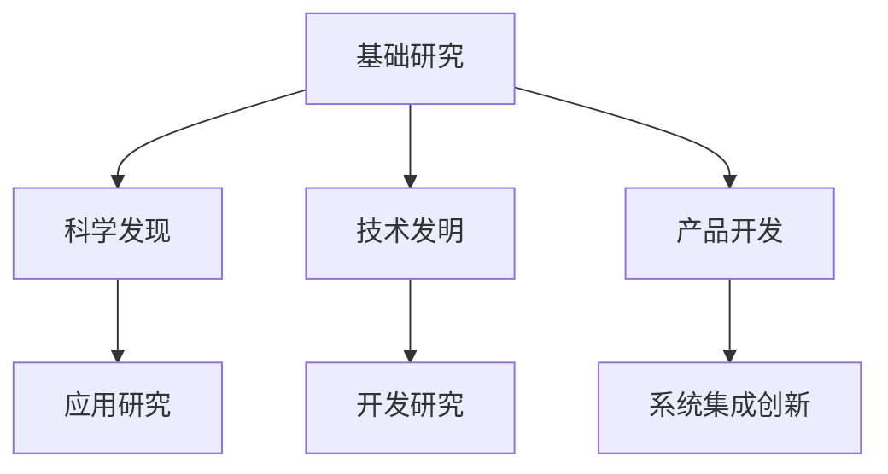

**核心算法原理讲解：**

科技创新的核心算法主要涉及以下几种：

1. **科学发现算法**：常用的有迭代算法、模拟退火算法等，通过不断试错和优化，逐步揭示科学规律。
2. **技术发明算法**：例如设计优化算法、机器学习算法，通过模拟和仿真，实现新技术或新工艺的发明。
3. **产品开发算法**：包括快速原型算法、敏捷开发方法，通过迭代和反馈，加速产品开发过程。

**伪代码示例：**

```python
# 科学发现算法示例：迭代算法
for i in range(max_iterations):
    # 进行实验或理论计算
    result = experiment()
    # 更新模型参数
    update_parameters(result)
```

**数学模型和公式：**

科技创新的数学模型通常涉及以下几种：

1. **技术进步模型**：如线性模型、指数模型，描述技术进步的速度和趋势。
2. **创新成本模型**：如成本函数模型，描述进行科技创新所需的成本。
3. **创新效益模型**：如效益函数模型，描述科技创新带来的经济和社会效益。

**示例：线性技术进步模型**

$$
T(t) = T_0 + k \cdot t
$$

其中，\(T(t)\) 是时间 \(t\) 时的技术水平，\(T_0\) 是初始技术水平，\(k\) 是技术进步速率。

**举例说明：**

假设某公司进行一项技术改进，初始技术水平为 \(T_0 = 10\)，技术进步速率为 \(k = 0.1\)。一年后的技术水平为：

$$
T(1) = 10 + 0.1 \cdot 1 = 10.1
$$

即一年后的技术水平为10.1。

#### 1.2 科技创新的驱动力

**核心概念原理和架构：**

科技创新的驱动力是指推动科技创新发生的各种内外部因素。其核心概念包括：

- **市场需求**：市场需求是科技创新的重要驱动力，它直接影响企业的研发方向和速度。
- **政策支持**：政府的政策和法规为科技创新提供了良好的环境和支持。
- **科研投入**：科研投入是科技创新的物质基础，决定着科技创新的能力和水平。
- **人才驱动**：人才是科技创新的核心资源，高素质的人才能够推动科技创新的进程。

**架构：**

科技创新的驱动力架构可以分为以下几个部分：

1. **市场需求分析**：通过市场调研和数据分析，识别市场需求，指导科技创新的方向。
2. **政策环境构建**：政府通过制定有利于科技创新的政策，提供资金、税收等方面的支持。
3. **科研投入管理**：科研机构和企业通过有效的管理，将科研投入转化为科技创新的实际成果。
4. **人才吸引和培养**：通过人才招聘、培训和激励，提升科研人员的创新能力和水平。

**Mermaid 流�程图：**

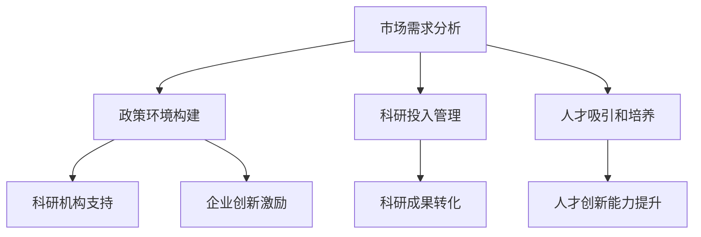

**核心算法原理讲解：**

科技创新的核心算法涉及以下几种：

1. **市场需求预测算法**：常用的有时间序列分析、回归分析等，通过历史数据预测未来市场需求。
2. **政策支持评估算法**：例如成本效益分析、风险评估等，用于评估政策支持的效果。
3. **科研投入优化算法**：如资源分配算法、成本效益分析等，用于优化科研投入。

**伪代码示例：**

```python
# 市场需求预测算法示例：时间序列分析
def forecast_demand(data):
    # 训练模型
    model = train_time_series_model(data)
    # 预测未来需求
    future_demand = model.predict(future_time)
    return future_demand
```

**数学模型和公式：**

科技创新的数学模型通常涉及以下几种：

1. **需求函数模型**：如线性需求函数、需求弹性模型，描述市场需求与价格、收入等的关系。
2. **政策支持模型**：如政策效益模型，描述政策支持带来的经济和社会效益。
3. **人才效率模型**：如人才产出模型，描述人才对科技创新的贡献。

**示例：需求函数模型**

$$
D(p) = a - b \cdot p
$$

其中，\(D(p)\) 是需求量，\(p\) 是价格，\(a\) 和 \(b\) 是常数。

**举例说明：**

假设某产品的需求函数为 \(D(p) = 100 - 10 \cdot p\)。当价格 \(p\) 为10时，需求量为：

$$
D(10) = 100 - 10 \cdot 10 = 0
$$

即当价格为10时，需求量为0。

#### 1.3 科技创新在社会治理中的应用

**核心概念原理和架构：**

科技创新在社会治理中的应用，是指利用新的技术手段和方法，提升社会治理的效率、透明度和智能化水平。其核心概念包括：

- **智能交通系统**：利用大数据、人工智能等技术，实现交通流量优化、自动驾驶等。
- **智慧城市**：利用物联网、大数据等技术，实现城市资源的智能化管理和高效利用。
- **社会治理平台**：利用区块链技术，实现公共事务的透明管理和不可篡改的记录。
- **应急管理系统**：利用物联网、大数据、人工智能等技术，实现应急管理的智能化和高效化。

**架构：**

科技创新在社会治理中的应用架构可以分为以下几个部分：

1. **技术应用研究**：研究新技术在社会治理中的应用场景和可行性，为实际应用提供技术支持。
2. **系统设计与开发**：根据应用需求，设计和开发具体的智能化社会治理系统。
3. **系统部署与运维**：将系统部署到实际环境中，进行运维管理，确保系统的稳定运行。
4. **用户培训与支持**：对政府部门和社会公众进行培训，提供技术支持，确保系统的有效应用。

**Mermaid 流程图：**

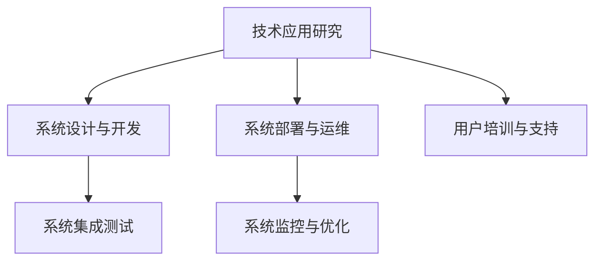

**核心算法原理讲解：**

科技创新在社会治理中的应用涉及多种核心算法，包括：

1. **大数据分析算法**：如聚类分析、关联规则挖掘等，用于分析社会数据，提取有价值的信息。
2. **人工智能算法**：如深度学习、强化学习等，用于实现智能决策和自动化管理。
3. **区块链算法**：如共识算法、加密算法等，用于确保数据的透明性和安全性。

**伪代码示例：**

```python
# 大数据分析算法示例：聚类分析
from sklearn.cluster import KMeans

def analyze_data(data):
    # 训练聚类模型
    model = KMeans(n_clusters=3)
    model.fit(data)
    # 获取聚类结果
    clusters = model.predict(data)
    return clusters
```

**数学模型和公式：**

科技创新在社会治理中应用的数学模型包括：

1. **智能交通模型**：如流量预测模型、路径优化模型，用于预测交通流量、优化行车路径。
2. **智慧城市模型**：如能源消耗模型、环境质量模型，用于预测城市资源消耗、评估环境质量。
3. **社会治理模型**：如风险评估模型、决策支持模型，用于预测社会风险、提供决策支持。

**示例：智能交通模型**

$$
T(t) = f(Q(t), R(t), D(t))
$$

其中，\(T(t)\) 是时间 \(t\) 时的交通流量，\(Q(t)\) 是交通流量历史数据，\(R(t)\) 是道路状况数据，\(D(t)\) 是时间 \(t\) 的驾驶员行为数据。

**举例说明：**

假设某地区的交通流量模型为 \(T(t) = f(Q(t), R(t), D(t))\)。当交通流量历史数据 \(Q(t) = 100\)，道路状况数据 \(R(t) = 80\)，驾驶员行为数据 \(D(t) = 60\) 时，交通流量为：

$$
T(t) = f(100, 80, 60) = 100 \cdot 0.8 \cdot 0.6 = 48
$$

即时间 \(t\) 时的交通流量为48。

#### 科技创新对社会治理的深远影响

科技创新对社会治理的深远影响体现在多个方面，主要体现在以下几方面：

1. **提升治理效率**：科技创新通过引入大数据、人工智能等技术，使得社会治理过程更加高效。例如，智能交通系统通过实时监控和优化交通流量，显著减少交通拥堵，提高交通运行效率。

2. **增强治理透明度**：区块链技术的应用，使得公共事务的记录和流程透明化。所有数据在区块链上不可篡改，保证了治理过程的透明性和公正性，减少了权力滥用和腐败现象。

3. **实现治理智能化**：物联网、大数据等技术的应用，使得社会治理智能化。例如，智慧城市通过物联网技术，实现对城市资源的智能化管理和高效利用，提升了城市治理水平。

4. **推动治理模式创新**：科技创新为社会治理提供了新的模式和方法，如基于区块链的智慧治理模式，通过去中心化的方式，提高治理效率和透明度。

5. **应对治理挑战**：科技创新为社会治理提供了新的工具和手段，帮助应对社会治理中的复杂问题和挑战。例如，应急管理系统通过物联网和大数据技术，实现对突发事件的高效应对和资源调度。

总之，科技创新为社会治理带来了深刻的变革，通过提升治理效率、增强透明度、实现智能化，为社会治理提供了新的思路和方法。在未来，随着科技的不断进步，科技创新将对社会治理产生更加深远的影响。

### 第2章：科技革命与社会治理变革

#### 2.1 科技革命对社会治理的影响

科技革命对社会治理产生了深远的影响，这些影响主要体现在以下几个方面：

1. **治理效率提升**：随着科技的发展，大数据、人工智能、区块链等新技术在社会治理中的应用日益广泛，显著提高了治理效率。例如，通过智能交通系统，可以实时监控和分析交通流量，优化交通信号配置，减少交通拥堵，提高交通运行效率。此外，人工智能和大数据分析技术还可以用于公共安全管理，通过预测和预防犯罪，提高社会治理的效率和精度。

2. **治理透明度增强**：区块链技术的应用使得公共事务的记录和流程透明化。区块链上的数据不可篡改，能够保证治理过程的透明性和公正性，减少权力滥用和腐败现象。例如，在公共财政管理中，区块链技术可以实现对资金流向的全程追踪和透明管理，确保资金使用的合法性和透明性。

3. **治理智能化**：物联网、大数据等技术的应用，使得社会治理智能化。通过物联网技术，可以实现对城市资源、环境和公共设施的实时监控和管理，提升城市治理的精细化和智能化水平。例如，智慧城市通过物联网技术，实现对城市照明、供水、供电等公共资源的智能化管理，提高资源利用效率。

4. **治理模式创新**：科技创新为社会治理提供了新的模式和方法。例如，基于区块链的去中心化治理模式，通过去中心化的方式，提高治理效率和透明度。此外，共享经济、区块链技术等新兴模式的兴起，也为社会治理带来了新的可能性。

5. **社会治理成本降低**：科技创新通过优化资源分配和提高效率，降低了社会治理的成本。例如，通过云计算技术，可以实现对计算资源的弹性调配和高效利用，降低政府部门的IT成本。此外，大数据分析技术还可以用于优化公共服务供给，降低公共服务的成本。

6. **社会治理范围扩大**：随着互联网和物联网技术的发展，社会治理的范围不断扩大。通过互联网，可以实现对全球事务的实时监控和管理，提升全球治理的效率。例如，通过全球卫生监测网络，可以实时监控全球传染病疫情，及时采取防控措施。

#### 2.2 新型社会治理模式的探索

科技革命为社会治理带来了新的挑战和机遇，也促使新型社会治理模式的探索。以下是一些新型社会治理模式的探索方向：

1. **智慧治理模式**：智慧治理模式以大数据、人工智能、物联网等技术为基础，通过数据驱动和智能决策，提升社会治理的效率和透明度。智慧治理模式强调数据的全面采集、实时分析和应用，实现精准治理。例如，智慧城市建设通过物联网技术，实现对城市各类资源的实时监控和管理，提升城市治理的智能化水平。

2. **协同治理模式**：协同治理模式强调政府、企业、社会组织和公众的协同合作，共同参与社会治理。通过建立协同平台，实现信息共享、资源整合和协同行动，提升社会治理的整体效能。例如，在环境保护领域，政府、企业和环保组织可以共同参与，通过协同治理模式，实现环境保护的协同效应。

3. **参与治理模式**：参与治理模式强调公众参与和社会监督，通过互联网和社交媒体平台，提升社会治理的参与度和透明度。公众可以通过平台表达意见和建议，参与社会治理决策，实现社会治理的民主化和多元化。例如，在一些城市，政府通过微信平台，开展在线问卷调查，征集公众对城市规划的意见和建议。

4. **法治治理模式**：法治治理模式强调依法治理，通过完善法律法规，建立法治体系，保障社会治理的公正性和合法性。法治治理模式强调法律对公共事务的规范和约束，通过法律手段解决社会矛盾和问题。例如，通过制定环境保护法、食品安全法等法律法规，规范公共事务行为，保障公众利益。

5. **社会治理创新模式**：社会治理创新模式强调创新思维和方法，通过创新社会治理理念、制度和技术，提升社会治理的水平和效果。社会治理创新模式强调不断探索新的治理模式和方法，适应社会发展和变化。例如，通过引入区块链技术，实现公共事务的透明管理和不可篡改的记录，提升社会治理的公正性和透明度。

总之，科技革命为社会治理带来了新的机遇和挑战，也促使新型社会治理模式的探索。通过智慧治理、协同治理、参与治理、法治治理和社会治理创新，可以进一步提升社会治理的效率和效果，实现社会的和谐与进步。

#### 2.3 科技革命与全球治理

科技革命对全球治理产生了深远的影响，这些影响主要体现在以下几个方面：

1. **全球治理效率提升**：科技革命通过大数据、人工智能、区块链等新技术的应用，显著提升了全球治理的效率和精度。例如，通过大数据分析，可以实现对全球公共卫生、气候变化、国际贸易等问题的实时监控和预警，提高全球治理的反应速度和决策能力。

2. **全球治理透明度增强**：区块链技术的应用，使得全球治理过程更加透明。区块链上的数据不可篡改，保证了全球治理的公正性和透明性，减少了权力滥用和腐败现象。例如，在跨国金融交易中，区块链技术可以实现对资金流向的全程追踪和透明管理，提高金融交易的透明度和安全性。

3. **全球治理协同性增强**：科技革命促进了全球各国之间的信息共享和协同合作，提升了全球治理的协同性。通过互联网和物联网技术，各国可以实时共享数据和信息，协同应对全球性问题。例如，在应对气候变化方面，各国可以通过共享气象数据、环保信息，协同制定和实施减排政策。

4. **全球治理模式创新**：科技革命为社会治理提供了新的工具和手段，促进了全球治理模式的创新。例如，通过引入区块链技术，可以实现去中心化的全球治理模式，提高治理效率和透明度。此外，人工智能和大数据分析技术还可以用于预测和应对全球性风险，提升全球治理的预见性和主动性。

5. **全球治理挑战与机遇并存**：科技革命虽然为全球治理带来了新的机遇，但也带来了新的挑战。例如，数据安全和隐私保护问题日益突出，全球治理需要制定更加严格的数据保护法规。此外，科技革命可能导致全球科技竞争加剧，对全球治理提出了新的要求。

6. **全球治理国际合作加强**：面对科技革命带来的挑战和机遇，全球各国需要加强合作，共同应对全球性问题。例如，在应对气候变化方面，各国可以通过国际合作，共同制定和实施减排政策。此外，在人工智能、区块链等新兴技术领域，各国可以开展技术合作，共同推动技术创新和应用。

总之，科技革命对全球治理产生了深远的影响，既带来了机遇，也带来了挑战。通过科技创新和国际合作，可以进一步提升全球治理的效率和效果，实现全球社会的和谐与进步。

### 第二部分：关键科技创新与社会治理

#### 第3章：人工智能与社会治理

#### 3.1 人工智能的基本原理与应用

人工智能（Artificial Intelligence，AI）是指通过计算机程序模拟人类智能行为的技术。人工智能的基本原理包括机器学习、深度学习、自然语言处理、计算机视觉等多个领域。下面我们将详细探讨这些基本原理及其在社会治理中的应用。

##### 机器学习

机器学习是人工智能的核心技术之一，它使计算机系统能够从数据中学习规律和模式，并自动改进性能。主要方法包括：

- **监督学习**：通过已标记的数据训练模型，然后使用模型对新数据进行预测。常见的算法有线性回归、支持向量机（SVM）等。
- **无监督学习**：模型在没有标记数据的指导下发现数据中的结构和模式。常见算法包括聚类、降维等。
- **强化学习**：通过不断尝试和反馈，使模型能够在复杂环境中学习最佳行为策略。常见的算法有Q-学习、深度强化学习等。

**社会治理应用：** 

- **公共安全管理**：通过监控视频分析、人群密度检测等技术，实时监控和预测潜在的安全风险，提高公共安全水平。
- **交通管理**：利用机器学习算法优化交通信号控制，减少交通拥堵，提高交通运行效率。

##### 深度学习

深度学习是机器学习的一个子领域，通过构建多层的神经网络模型，对复杂数据进行深度特征提取和学习。深度学习的核心技术是神经网络，特别是深度神经网络（DNN）和卷积神经网络（CNN）。

**社会治理应用：**

- **智能客服**：利用深度学习模型实现自然语言理解，提高客服系统的响应速度和准确性，提升用户体验。
- **智能监控**：通过深度学习模型进行人脸识别、行为分析，提高公共安全管理效率。

##### 自然语言处理

自然语言处理（NLP）是人工智能的一个重要分支，它涉及计算机理解和生成自然语言的技术。NLP的主要任务包括文本分类、情感分析、机器翻译、语音识别等。

**社会治理应用：**

- **智能问答系统**：通过NLP技术，构建智能问答系统，为公众提供便捷的咨询服务，提升政府服务的透明度和效率。
- **舆论监测**：利用情感分析技术，监测社交媒体上的公众情绪，及时发现和处理社会热点问题。

##### 计算机视觉

计算机视觉是通过计算机对图像或视频进行处理、分析和理解的技术。计算机视觉的核心技术包括图像识别、目标检测、图像分割等。

**社会治理应用：**

- **智能交通管理**：通过计算机视觉技术，实时识别交通状况、车辆和行人，优化交通信号控制和交通流量管理。
- **公共安全监控**：利用计算机视觉技术，实现对公共场所的实时监控，提高公共安全水平。

##### 总结

人工智能的基本原理包括机器学习、深度学习、自然语言处理和计算机视觉等多个领域。这些技术在社会治理中具有广泛的应用，如公共安全管理、交通管理、智能客服、舆论监测等。通过人工智能技术的应用，可以显著提升社会治理的效率、透明度和智能化水平，为社会治理提供新的思路和方法。

#### 3.2 人工智能在社会治理中的应用

人工智能（AI）在社会治理中正发挥越来越重要的作用，通过大数据分析、智能决策和自动化管理等技术手段，显著提升了社会治理的效率、透明度和智能化水平。以下将详细探讨人工智能在社会治理中的应用，并通过具体案例进行分析。

##### 数据分析

数据分析是人工智能在社会治理中最常见的应用之一。通过大数据分析，可以实时获取和分析社会治理相关的各种数据，如交通流量、公共安全事件、环境污染等，从而为决策提供科学依据。

**案例：智能交通系统**

在智能交通系统中，人工智能通过分析交通数据，实时监测交通流量，预测交通状况，并优化交通信号配置，从而减少交通拥堵，提高交通运行效率。例如，北京市的智能交通系统利用人工智能技术，通过分析实时交通流量数据，动态调整交通信号灯时长，有效缓解了城市交通拥堵问题。

**数据流程图：**

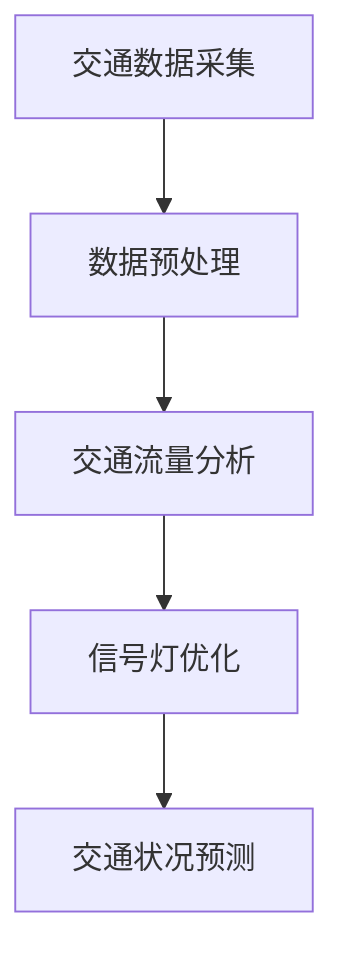

**伪代码示例：**

```python
# 交通流量分析伪代码
def analyze_traffic_data(traffic_data):
    # 预处理数据
    preprocessed_data = preprocess_data(traffic_data)
    # 分析数据
    traffic_pattern = analyze_patterns(preprocessed_data)
    # 优化信号灯配置
    optimized_signals = optimize_signals(traffic_pattern)
    return optimized_signals
```

##### 智能决策

智能决策是人工智能在社会治理中的另一个重要应用。通过构建决策支持系统，人工智能可以帮助政府和社会组织在复杂的社会治理问题中做出更加科学和高效的决策。

**案例：灾害应急管理**

在灾害应急管理中，人工智能可以通过实时监测灾害数据、分析灾害趋势和影响，为应急决策提供支持。例如，美国国家海洋和大气管理局（NOAA）利用人工智能技术，对飓风路径进行预测，提前发布预警信息，减少灾害损失。

**数据流程图：**

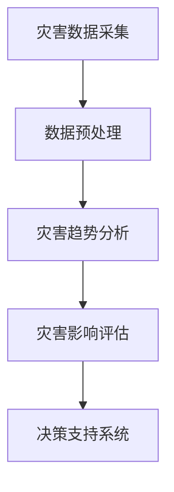

**伪代码示例：**

```python
# 灾害趋势分析伪代码
def analyze_disaster_data(disaster_data):
    # 预处理数据
    preprocessed_data = preprocess_data(disaster_data)
    # 分析数据
    disaster_trend = analyze_patterns(preprocessed_data)
    # 评估灾害影响
    disaster_impact = evaluate_impact(disaster_trend)
    # 提供决策支持
    decision_support = generate_decision_support(disaster_impact)
    return decision_support
```

##### 自动化管理

自动化管理是人工智能在社会治理中的又一重要应用。通过自动化技术，可以显著提高社会治理的效率和精度，减少人工干预和错误。

**案例：公共安全管理**

在公共安全管理中，人工智能可以通过视频监控、人脸识别等技术，实时监控公共场所的安全状况，自动识别和预警潜在的安全风险。例如，纽约市利用人工智能技术，对地铁系统进行实时监控，通过人脸识别技术，自动识别可疑人员，提高公共安全水平。

**数据流程图：**

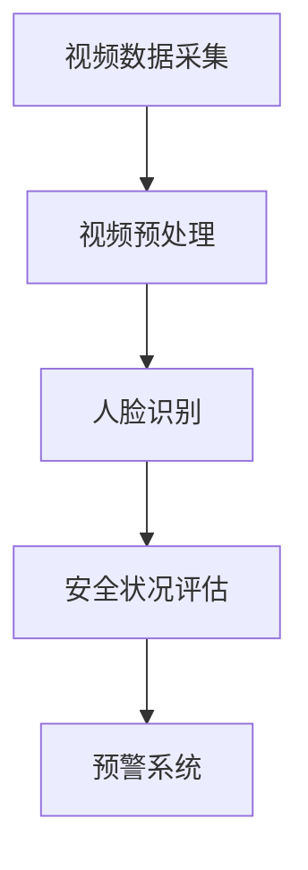

**伪代码示例：**

```python
# 人脸识别伪代码
def identify_faces(video_data):
    # 预处理视频数据
    preprocessed_video = preprocess_video(video_data)
    # 人脸识别
    faces_detected = detect_faces(preprocessed_video)
    # 评估安全状况
    security_evaluation = evaluate_security(faces_detected)
    # 启动预警系统
    if security_evaluation['risk_level'] > threshold:
        trigger_alarm(security_evaluation)
```

##### 总结

人工智能在社会治理中的应用涵盖了数据分析、智能决策和自动化管理等多个方面。通过大数据分析，可以实时监测和预测社会问题，为决策提供科学依据；通过智能决策，可以帮助政府和组织在复杂的社会治理问题中做出更加科学的决策；通过自动化管理，可以显著提高社会治理的效率和精度。人工智能的应用不仅提升了社会治理的效率，还增强了治理的透明度和智能化水平，为社会治理带来了新的变革。

#### 3.3 人工智能面临的挑战与对策

尽管人工智能（AI）在许多领域展现了巨大的潜力，但在其广泛应用过程中，也面临诸多挑战。以下将讨论人工智能在隐私保护、伦理问题和数据安全等方面面临的挑战，并提出相应的对策。

##### 隐私保护

人工智能系统通常需要处理大量个人数据，如医疗记录、通信记录和位置信息等。这些数据的收集和使用引发了隐私保护的担忧。例如，智能医疗系统的普及可能导致患者隐私泄露，而智能交通系统则可能监控个人出行习惯。

**挑战：**

1. **数据收集和使用透明度不足**：许多AI系统在数据收集和使用方面的透明度较低，公众对其隐私保护措施不甚了解。
2. **数据滥用风险**：未经授权使用个人数据，或将其出售给第三方，可能导致隐私泄露和滥用。

**对策：**

1. **加强数据保护法规**：制定和实施严格的数据保护法规，明确数据收集、存储和使用的规定，保护个人隐私。
2. **透明度提升**：AI系统应提供透明度报告，详细说明数据收集、处理和使用的方式，增强公众信任。

##### 伦理问题

人工智能的应用可能引发一系列伦理问题，如算法偏见、道德责任和社会公平等。

**挑战：**

1. **算法偏见**：人工智能系统可能基于历史数据学习，从而导致算法偏见，如性别、种族或年龄歧视。
2. **道德责任**：在AI驱动的决策系统中，责任归属问题尚不明确，例如自动驾驶汽车发生事故时，责任应由谁承担？
3. **社会公平**：人工智能可能加剧社会不平等，如通过算法筛选求职者时，可能导致某些群体被歧视。

**对策：**

1. **算法透明性和可解释性**：开发可解释的AI算法，使决策过程透明，便于审计和监督。
2. **伦理审查和规范**：建立独立的伦理审查委员会，对AI应用进行伦理审查，确保其符合道德标准。
3. **公平性和包容性**：在设计AI系统时，考虑到不同群体的需求和利益，避免算法偏见和歧视。

##### 数据安全

人工智能系统高度依赖数据，数据泄露或损坏可能导致严重后果。此外，AI系统可能成为黑客攻击的目标，用于恶意活动。

**挑战：**

1. **数据泄露**：个人数据的泄露可能导致隐私侵犯、财务损失或身份盗用。
2. **系统漏洞**：AI系统的复杂性和依赖性可能导致安全漏洞，如软件漏洞、网络攻击等。

**对策：**

1. **数据加密**：对敏感数据进行加密，确保数据在传输和存储过程中的安全性。
2. **安全测试和更新**：定期进行AI系统的安全测试，及时修复漏洞，确保系统的安全性。
3. **多层次防御**：采用多层次防御策略，包括网络安全、数据安全、物理安全等，全面保护AI系统。

##### 总结

人工智能在隐私保护、伦理问题和数据安全等方面面临诸多挑战。通过加强数据保护法规、提升算法透明度、进行伦理审查、加密数据和实施多层次防御策略，可以应对这些挑战，确保人工智能在社会治理中的安全、公正和有效应用。

### 第4章：大数据与社会治理

#### 4.1 大数据的基本概念与特点

大数据（Big Data）是指无法用传统数据处理工具在合理时间内进行捕捉、管理和处理的数据集合。大数据的典型特点可以归纳为4V，即数据量（Volume）、数据速度（Velocity）、数据多样性（Variety）和数据价值（Value）。

**数据量（Volume）**

数据量是大数据最为显著的特征之一。随着互联网、物联网和传感器技术的快速发展，数据量呈现爆炸式增长。例如，全球互联网用户每天产生的数据量高达数以PB（皮字节）计，这些数据包括社交媒体分享、电子商务交易、在线视频观看记录等。

**数据速度（Velocity）**

数据速度指的是数据的生成和处理速度。现代信息技术使得数据生成速度越来越快，例如，实时交通监控系统能够每秒处理大量交通数据，实现对交通状况的实时分析和响应。这种高速数据处理能力对实时决策和应急响应具有重要意义。

**数据多样性（Variety）**

数据多样性是指数据的类型和来源的多样性。大数据不仅仅包括结构化数据，如数据库中的信息，还包括半结构化和非结构化数据，如文本、图片、视频和音频等。此外，数据的来源也多样化，包括社交媒体、传感器、网络日志、电子邮件等。

**数据价值（Value）**

数据价值是指从大量数据中提取有价值的信息和知识的能力。尽管大数据量庞大，但并非所有数据都有价值。通过数据挖掘和分析技术，可以从海量数据中提取出有价值的信息，用于业务决策、市场分析和风险预测等。

**大数据在社会治理中的应用**

大数据在社会治理中具有广泛的应用，通过数据分析和挖掘，可以提升社会治理的效率、透明度和智能化水平。

1. **公共安全监控**：通过大数据分析，可以对公共场所进行实时监控，识别潜在的安全风险，提高公共安全管理水平。
2. **交通管理**：利用大数据分析交通流量、道路状况等信息，优化交通信号配置，减少交通拥堵，提升交通运行效率。
3. **城市规划**：通过分析城市数据，如人口分布、土地利用和基础设施状况，优化城市规划，提升城市治理水平。
4. **环境保护**：利用大数据分析环境污染数据，预测环境变化趋势，制定和实施环境保护措施。

#### 4.2 大数据在社会治理中的应用

大数据在社会治理中的应用主要体现在以下几个方面：

**1. 公共安全监控**

公共安全是社会管理的核心任务之一。通过大数据分析，可以对公共场所进行实时监控，识别潜在的安全风险，提高公共安全管理水平。

- **实时监控**：通过摄像头、传感器等设备，实时收集公共场所的视频和传感器数据，进行实时分析和处理。
- **异常检测**：利用大数据分析和机器学习技术，对实时监控数据进行异常检测，识别异常行为和潜在的安全威胁。
- **风险评估**：根据历史数据和实时监控结果，进行风险评估，为公共安全决策提供支持。

**2. 交通管理**

交通管理是城市治理的重要方面。利用大数据分析交通流量、道路状况等信息，可以优化交通信号配置，减少交通拥堵，提升交通运行效率。

- **交通流量预测**：通过分析历史交通数据、实时交通监控数据和天气预报等信息，预测未来交通流量，为交通信号控制提供依据。
- **信号灯优化**：根据实时交通流量数据，动态调整交通信号灯时长，优化交通流量。
- **公共交通调度**：通过大数据分析，优化公共交通线路和班次，提高公共交通的效率和便捷性。

**3. 城市规划**

大数据分析在城市规划中具有重要作用，通过分析城市数据，如人口分布、土地利用和基础设施状况，可以优化城市规划，提升城市治理水平。

- **城市数据分析**：通过分析城市数据，如人口、就业、住房、交通等，了解城市现状和问题，为城市规划提供数据支持。
- **空间规划**：利用大数据分析和地理信息系统（GIS），进行空间规划，优化土地利用和基础设施布局。
- **环境监测**：通过大数据分析，监测城市环境质量，预测环境变化趋势，制定和实施环境保护措施。

**4. 应急管理**

大数据分析在应急管理中具有重要作用，通过分析历史灾害数据和实时监控数据，可以预测灾害趋势，提高应急响应能力。

- **灾害预测**：通过分析历史灾害数据和气象数据，预测自然灾害的发生概率和影响范围，提前采取预防措施。
- **应急资源调度**：根据实时监控和预测结果，动态调度应急资源，如救援队伍、物资和设备等，提高应急响应效率。
- **灾后评估**：通过大数据分析，评估灾害影响，为灾后重建和恢复提供数据支持。

#### 4.3 大数据隐私保护与法律法规

大数据的应用在提升社会治理效率的同时，也带来了隐私保护的问题。大数据隐私保护涉及到个人数据的安全和隐私，是当前社会关注的热点问题。

**隐私保护的重要性**

大数据隐私保护的重要性体现在以下几个方面：

1. **个人隐私**：大数据分析通常涉及大量个人数据，如身份信息、通信记录、位置信息等，个人隐私的泄露可能导致个人权益受损。
2. **数据安全**：大数据的泄露或滥用可能导致严重的安全问题，如身份盗用、金融欺诈等。
3. **社会信任**：大数据隐私问题可能影响社会公众对大数据应用的信任，阻碍大数据技术的发展和应用。

**法律法规**

为了保护大数据隐私，各国制定了相应的法律法规，规范数据收集、存储和使用的行为。

1. **数据保护法**：例如，《欧洲通用数据保护条例》（GDPR）和《中华人民共和国个人信息保护法》，明确规定了个人数据的收集、存储和处理规则。
2. **隐私政策**：企业通常需要制定隐私政策，告知用户数据收集的目的、方式和保护措施，增强数据收集的透明度。
3. **安全标准**：例如，ISO/IEC 27001信息安全管理体系标准，用于指导企业建立和维护信息安全管理体系。

**对策**

为了有效保护大数据隐私，可以采取以下对策：

1. **数据匿名化**：通过数据匿名化技术，去除个人身份信息，降低数据泄露的风险。
2. **加密技术**：对敏感数据进行加密，确保数据在传输和存储过程中的安全性。
3. **隐私增强技术**：采用隐私增强技术，如差分隐私、同态加密等，提高数据处理过程中的隐私保护水平。
4. **用户授权和隐私管理**：建立用户授权和隐私管理系统，确保用户对个人数据的控制权，提高数据处理的透明度和用户信任。

#### 总结

大数据在社会治理中具有广泛的应用，通过数据分析和挖掘，可以提升社会治理的效率、透明度和智能化水平。然而，大数据隐私保护问题不容忽视，需要通过法律法规和隐私保护技术，确保大数据的应用不会侵犯个人隐私和权益。通过合理利用大数据，同时保障隐私安全，可以实现大数据与社会治理的良性互动，促进社会的和谐与进步。

### 第5章：区块链与社会治理

#### 5.1 区块链的基本原理与架构

区块链技术是一种分布式数据库技术，通过去中心化的方式实现数据的存储、传输和验证。其核心原理包括区块、链、共识机制、加密算法等。

**区块与链**

区块链由一系列按时间顺序排列的区块组成。每个区块包含一定数量的交易记录，以及一个指向前一个区块的哈希值。这种链式结构保证了区块链的不可篡改性，因为要篡改一个区块，必须同时篡改其后的所有区块。

**共识机制**

共识机制是区块链系统中节点之间达成共识的算法。常见的共识机制包括工作量证明（PoW）、权益证明（PoS）、授权股权证明（DPoS）等。共识机制确保了区块链系统中的所有节点都能达成一致，从而维护区块链的完整性。

**加密算法**

区块链使用加密算法来保护数据的安全和隐私。常见的加密算法包括哈希算法、非对称加密、对称加密等。哈希算法用于生成唯一的数据指纹，确保数据的完整性。非对称加密用于实现数据的加密和解密，保护数据传输过程中的隐私。

**架构**

区块链的架构可以分为以下几个部分：

1. **节点**：区块链系统中的参与节点，负责存储和维护区块链数据。
2. **共识层**：实现节点之间达成共识的算法，保证区块链的完整性和安全性。
3. **网络层**：负责区块链数据的传输和通信，包括P2P网络协议、加密通信等。
4. **数据层**：存储区块链数据，包括区块、交易记录等。
5. **合约层**：提供智能合约的执行环境，允许用户在区块链上编写和执行合约。

**Mermaid 流程图**

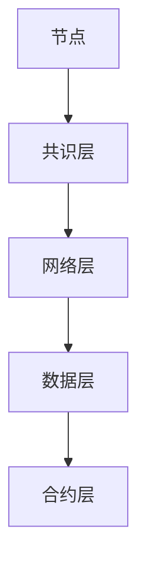

#### 5.2 区块链在社会治理中的应用

区块链技术在社会治理中具有广泛的应用潜力，通过去中心化、透明性和不可篡改的特点，可以提高社会治理的效率和公正性。

**1. 公共事务管理**

区块链技术可以用于公共事务管理，如选举、土地登记、公共财政等。通过区块链，可以实现公共事务的透明管理和不可篡改的记录，提高公共事务的公正性和透明度。

- **选举**：通过区块链技术，可以实现对选举过程的全程监控和透明管理，防止选举舞弊，提高选举的公正性。
- **土地登记**：利用区块链技术，可以实现土地登记的自动化和透明化，确保土地信息的真实性和准确性。
- **公共财政**：通过区块链技术，可以实现对公共财政资金的全程追踪和管理，防止资金滥用和腐败现象。

**2. 社会信用体系**

区块链技术可以用于构建社会信用体系，通过对个人和企业的信用行为进行记录和管理，促进社会信用体系的建立和完善。

- **信用记录**：通过区块链技术，可以实现对个人和企业的信用行为的记录和存储，建立全面的信用档案。
- **信用评价**：基于区块链上的信用记录，可以对个人和企业的信用进行评价，提供信用评级服务。
- **信用应用**：区块链上的信用记录可以用于贷款审批、商业合作等方面，提高信用评估的效率和准确性。

**3. 慈善事业**

区块链技术可以用于慈善事业，通过去中心化的方式，提高慈善资金的透明度和使用效率。

- **资金透明**：通过区块链技术，可以实现对慈善资金的全程追踪和管理，确保资金使用的透明和公正。
- **慈善项目追踪**：利用区块链技术，可以实现对慈善项目的全程追踪和管理，确保慈善项目的实施效果和资金使用情况。
- **智能合约**：通过智能合约，可以自动执行慈善捐赠协议，确保捐赠资金的正确使用。

**4. 公共安全**

区块链技术可以用于公共安全管理，如身份验证、网络安全等，提高公共安全水平。

- **身份验证**：利用区块链技术，可以实现高效的身份验证，确保个人身份的真实性和唯一性。
- **网络安全**：通过区块链技术，可以实现对网络攻击的实时监控和响应，提高网络安全的防护能力。
- **数据安全**：利用区块链的加密和分布式存储技术，可以确保数据的完整性和安全性。

**总结**

区块链技术在社会治理中具有广泛的应用潜力，通过去中心化、透明性和不可篡改的特点，可以提高社会治理的效率和公正性。在实际应用中，区块链技术可以用于公共事务管理、社会信用体系、慈善事业和公共安全等方面，为社会治理提供新的工具和方法。

### 第6章：物联网与社会治理

#### 6.1 物联网的基本概念与技术体系

物联网（Internet of Things，IoT）是指通过将各种物理设备和传感器连接到互联网，实现设备之间智能通信和协同工作的技术体系。物联网的基本概念包括以下几个方面：

**1. 物联网的定义**

物联网是指通过互联网将各种物理设备（如传感器、智能手机、汽车、工业设备等）连接起来，实现设备之间的信息交换和智能化控制。物联网的核心理念是通过连接和智能控制，提高设备和系统的效率、可靠性和灵活性。

**2. 物联网的关键技术**

物联网的关键技术包括传感器技术、网络通信技术、数据处理与分析技术、安全技术和智能控制技术。

- **传感器技术**：物联网的核心是传感器，传感器可以检测和测量温度、湿度、光照、声音、运动等物理量，并将这些信息转换为数字信号。
- **网络通信技术**：物联网设备通过网络进行通信，常见的网络通信技术包括无线局域网（Wi-Fi）、蓝牙、窄带物联网（NB-IoT）、物联网专用网络（LPWAN）等。
- **数据处理与分析技术**：物联网产生的大量数据需要通过数据处理与分析技术进行收集、存储、处理和分析，常见的处理技术包括数据挖掘、机器学习、大数据分析等。
- **安全技术**：物联网设备在数据传输和存储过程中，面临安全风险，如数据泄露、设备被攻击等。安全技术包括数据加密、身份验证、访问控制等。
- **智能控制技术**：物联网通过智能控制技术，实现对设备的自动化控制和管理，常见的智能控制技术包括自动化控制系统、云计算和人工智能等。

**3. 物联网的应用场景**

物联网技术广泛应用于各个领域，以下是一些典型的应用场景：

- **智能家居**：通过物联网技术，实现家庭设备的智能连接和控制，如智能门锁、智能照明、智能家电等。
- **智慧城市**：通过物联网技术，实现城市设施的智能化管理和监控，如智能交通系统、智能路灯、智能垃圾箱等。
- **工业物联网**：通过物联网技术，实现工业设备的智能监控和远程控制，提高工业生产的效率和质量。
- **健康物联网**：通过物联网技术，实现健康监测和健康管理，如智能穿戴设备、远程医疗等。

#### 6.2 物联网在社会治理中的应用

物联网技术在社会治理中具有广泛的应用，通过智能化、自动化和高效化的方式，提升社会治理的效率、透明度和智能化水平。

**1. 公共安全管理**

物联网技术在公共安全管理中的应用主要体现在以下几个方面：

- **智能监控**：通过安装物联网传感器和摄像头，实现对公共场所的实时监控，及时发现和处理安全隐患。
- **人员定位**：利用物联网技术，实现对人员的位置信息进行实时跟踪，提高应急响应能力和安全管理水平。
- **火灾报警**：通过物联网传感器，实现对火灾的早期检测和报警，提高火灾防控能力。

**2. 智慧交通管理**

智慧交通是物联网技术在社会治理中的一个重要应用领域。通过物联网技术，可以实现对交通流量、道路状况的实时监测和管理，提高交通运行效率和安全性。

- **智能交通信号控制**：通过物联网技术，实时监测交通流量和道路状况，动态调整交通信号灯时长，减少交通拥堵。
- **车辆管理**：通过物联网技术，实现对车辆的实时监控和管理，如车辆位置、速度、运行状态等，提高交通管理的效率和安全性。
- **智能停车管理**：通过物联网技术，实现停车场的智能管理和调度，提高停车效率，减少交通拥堵。

**3. 环境监测**

物联网技术在环境监测中具有重要作用，通过物联网传感器，可以实现对空气、水质、噪声等环境参数的实时监测和数据分析，为环境保护和治理提供科学依据。

- **空气质量监测**：通过物联网传感器，实时监测空气质量，及时发现和预警空气污染事件，采取相应的应对措施。
- **水质监测**：通过物联网传感器，实时监测水质参数，如PH值、氨氮、总氮等，确保水环境的健康和可持续发展。
- **噪声监测**：通过物联网传感器，实时监测噪声水平，为噪声污染治理提供数据支持。

**4. 资源管理**

物联网技术在资源管理中的应用，可以实现对水资源、能源、土地等资源的智能监控和管理，提高资源利用效率，促进可持续发展。

- **智能水资源管理**：通过物联网技术，实时监测水资源的利用情况，优化水资源配置，提高水资源利用效率。
- **智能能源管理**：通过物联网技术，实现对能源的实时监控和调度，优化能源使用，降低能源消耗。
- **智能土地管理**：通过物联网技术，实时监测土地的使用情况，优化土地利用，提高土地资源利用效率。

**总结**

物联网技术在社会治理中具有广泛的应用，通过智能化、自动化和高效化的方式，提升社会治理的效率、透明度和智能化水平。物联网技术在公共安全、智慧交通、环境监测和资源管理等方面具有重要应用价值，为社会治理提供了新的工具和方法。随着物联网技术的不断发展和普及，其应用范围将进一步扩大，为构建智能化、高效化和社会治理体系提供有力支持。

### 第6章：物联网与社会治理

#### 6.3 物联网技术面临的挑战与解决方案

物联网（IoT）技术的快速发展为社会治理带来了诸多机遇，但其广泛应用也伴随着一系列挑战。以下将讨论物联网技术在社会治理中面临的挑战，并提出相应的解决方案。

##### 数据隐私保护

物联网设备在日常运行中会收集大量个人和公共数据，这些数据包括地理位置、行为习惯、健康信息等。数据隐私保护问题成为物联网技术面临的主要挑战之一。

**挑战：**

1. **数据泄露**：物联网设备在数据传输和存储过程中可能遭受黑客攻击，导致数据泄露。
2. **数据滥用**：收集的数据可能被非法使用，如个人信息被用于广告营销或恶意行为。

**解决方案：**

1. **数据加密**：采用先进的加密算法，对传输和存储的数据进行加密，确保数据安全性。
2. **数据匿名化**：在数据收集和处理过程中，对个人身份信息进行匿名化处理，降低隐私泄露风险。
3. **隐私增强技术**：采用隐私增强技术，如差分隐私、同态加密等，提高数据处理过程中的隐私保护水平。

##### 设备安全和网络安全

物联网设备在设计和部署过程中可能存在安全漏洞，这些漏洞可能导致设备被恶意攻击者控制，进而影响整个物联网系统的稳定性和安全性。

**挑战：**

1. **设备被攻破**：物联网设备可能被黑客入侵，用于发起分布式拒绝服务（DDoS）攻击。
2. **网络漏洞**：物联网设备连接的网络可能存在安全漏洞，导致数据被窃取或篡改。

**解决方案：**

1. **设备安全防护**：在设备设计和生产阶段，加强安全防护措施，如硬件加密模块、安全启动等。
2. **网络安全监控**：建立物联网设备的安全监控系统，实时监测设备状态和网络流量，及时发现和应对安全威胁。
3. **安全更新和补丁**：定期对物联网设备进行安全更新和补丁安装，修复已知的安全漏洞。

##### 标准化和互操作性

物联网技术涉及多种设备和协议，不同设备之间可能存在兼容性问题，导致系统互操作性问题。

**挑战：**

1. **设备兼容性**：不同品牌和型号的物联网设备可能无法互操作，影响系统的整体性能。
2. **协议兼容性**：物联网设备使用的通信协议可能不兼容，导致数据传输和通信问题。

**解决方案：**

1. **统一标准**：推动物联网技术的标准化，制定统一的设备接口和通信协议，提高设备互操作性。
2. **平台整合**：建立物联网平台，实现不同设备和协议的整合，提供统一的接入和管理界面。
3. **开源解决方案**：鼓励开源物联网解决方案的发展，促进技术创新和生态系统的建设。

##### 能耗和性能

物联网设备通常依赖电池供电，能耗管理成为物联网技术面临的重要挑战。此外，物联网设备的性能和可靠性也直接影响系统的效率。

**挑战：**

1. **能耗管理**：物联网设备需要持续运行，但电池容量有限，能耗管理成为一大挑战。
2. **设备性能**：物联网设备可能因硬件性能限制，无法满足数据处理和通信的需求。

**解决方案：**

1. **低功耗设计**：采用低功耗技术和设计，如节能模式、动态电源管理，延长设备续航时间。
2. **优化算法**：优化数据处理和传输算法，减少能耗和计算资源的使用。
3. **硬件升级**：定期对物联网设备进行硬件升级，提高设备的性能和可靠性。

##### 总结

物联网技术在社会治理中面临数据隐私保护、设备安全和网络安全、标准化和互操作性、能耗和性能等多方面的挑战。通过数据加密、隐私增强技术、设备安全防护、网络安全监控、统一标准、平台整合、开源解决方案、低功耗设计、优化算法和硬件升级等解决方案，可以应对这些挑战，确保物联网技术在社会治理中的安全和高效应用。随着物联网技术的不断发展和完善，其社会治理应用前景将更加广阔。

### 第7章：新兴科技与社会治理

#### 7.1 生物科技与社会治理

生物科技作为一种快速发展的前沿科技，对社会治理产生了深远的影响。以下将讨论生物科技的基本概念及其在社会治理中的应用。

**基本概念**

生物科技是指利用生物系统、生物体或其组成部分来开发新药物、改良农作物、治理环境污染、开发生物能源等的技术。生物科技涵盖了基因工程、细胞工程、酶工程、发酵工程等多个领域。

**社会治理中的应用**

1. **医疗健康**

生物科技在医疗健康领域具有广泛应用，通过基因编辑、精准医疗、生物药物等技术，提高疾病的诊断和治疗效果。

- **基因编辑**：利用CRISPR-Cas9等基因编辑技术，可以纠正基因突变，治疗遗传性疾病，提高患者的生存率。
- **精准医疗**：通过分析患者的基因、环境和表型信息，制定个性化的治疗方案，提高治疗效果。
- **生物药物**：利用生物科技开发的新药物，如单克隆抗体、基因疗法等，治疗传统疗法难以治愈的疾病。

2. **环境保护**

生物科技在环境保护中的应用主要体现在生物降解、生物修复等领域，通过利用微生物、植物等生物体，实现对环境污染的治理。

- **生物降解**：利用微生物、真菌等生物体，降解塑料、农药等难以降解的污染物，减少环境污染。
- **生物修复**：通过植物、微生物等生物体，对受污染土壤、水体进行修复，恢复生态平衡。

3. **食品安全**

生物科技在食品安全领域的作用不容忽视，通过基因检测、食品安全监测等技术，保障食品的安全性和质量。

- **基因检测**：通过基因检测技术，识别食品中的有害成分和致病微生物，确保食品安全。
- **食品安全监测**：利用生物传感器、生物信息技术等，实现对食品生产、加工、流通环节的实时监测，及时发现和处理食品安全隐患。

4. **社会公正**

生物科技的发展，如基因测序和生物识别技术，为社会公正提供了新的手段。通过基因测序，可以追溯犯罪嫌疑人的身份，提高司法公正性。生物识别技术，如DNA识别、虹膜识别等，可以提高社会安全和身份验证的准确性。

**总结**

生物科技作为一种新兴科技，在社会治理中具有广泛的应用。通过医疗健康、环境保护、食品安全和社会公正等方面的应用，生物科技为社会治理提供了新的工具和方法，提高了社会治理的效率和质量。随着生物科技的不断进步，其在社会治理中的应用前景将更加广阔。

#### 7.2 新材料科技与社会治理

新材料科技的发展为社会治理带来了新的机遇和挑战。以下将讨论新材料科技的基本概念及其在社会治理中的应用。

**基本概念**

新材料科技是指研究和开发具有新性能、新结构或新形态的材料，这些材料通常具有传统材料无法比拟的特性。新材料科技涵盖了纳米材料、复合材料、智能材料、生物材料等多个领域。

**社会治理中的应用**

1. **环境保护**

新材料科技在环境保护中的应用主要体现在空气净化、污水处理和废物利用等方面。

- **空气净化材料**：利用纳米材料、光催化材料等，开发出高效空气净化产品，如空气净化器、空气净化涂料等，可以显著改善室内和室外空气质量。
- **污水处理材料**：利用新型吸附材料、膜分离技术等，提高污水处理效率，减少对水资源的污染。
- **废物利用材料**：通过新材料科技，开发出能够回收利用废物的新型材料，如废旧轮胎再利用、塑料废物降解等，减少环境污染和资源浪费。

2. **公共安全**

新材料科技在公共安全领域的应用主要体现在安全防护材料、消防材料和应急材料等方面。

- **安全防护材料**：利用高强度复合材料、智能材料等，开发出具有良好安全防护性能的建筑材料、防护服等，提高公共安全水平。
- **消防材料**：利用新型阻燃材料和防火涂层等，提高建筑物的防火性能，减少火灾事故的发生。
- **应急材料**：开发出具有快速反应、高效吸能的新型应急材料，如智能防护服、快速堵漏材料等，提高应急处理能力。

3. **医疗健康**

新材料科技在医疗健康领域的应用主要体现在生物医学材料、医疗器械和药物输送系统等方面。

- **生物医学材料**：利用生物相容性材料、可降解材料等，开发出用于组织工程、药物释放等的新型生物医学材料，提高医疗水平。
- **医疗器械**：利用新型材料，开发出更加先进、高效、安全的医疗器械，如高强度的骨骼修复材料、可植入式电子设备等。
- **药物输送系统**：通过材料科技，开发出能够精确输送药物的智能药物输送系统，提高药物疗效和安全性。

4. **能源和环境**

新材料科技在能源和环境领域的应用主要体现在能源存储和转换材料、环保材料等方面。

- **能源存储和转换材料**：通过新材料科技，开发出高能量密度、长寿命的电池材料、太阳能电池材料等，提高能源利用效率。
- **环保材料**：利用新型材料，开发出能够降解污染物的环保材料，如生物降解塑料、环境自净涂料等，减少环境污染。

**总结**

新材料科技为社会治理带来了新的机遇和挑战。通过在环境保护、公共安全、医疗健康、能源和环境等领域的应用，新材料科技不仅提升了社会治理的效率和质量，还为应对环境挑战和社会问题提供了新的解决方案。随着新材料科技的不断进步，其在社会治理中的应用前景将更加广阔。

### 第7章：新兴科技与社会治理

#### 7.3 新能源科技与社会治理

新能源科技的发展对社会治理产生了深远的影响，不仅推动了能源结构的转型，也为实现可持续发展目标提供了新的路径。以下将讨论新能源科技的基本概念及其在社会治理中的应用。

**基本概念**

新能源科技是指开发和使用非传统化石能源的技术，如太阳能、风能、生物质能、地热能、潮汐能等。这些能源具有可再生性、清洁性和环保性，有助于减少温室气体排放，缓解能源危机。

**社会治理中的应用**

1. **环境保护**

新能源科技在环境保护中的应用主要体现在减少温室气体排放、降低空气污染、治理水资源污染等方面。

- **减少温室气体排放**：通过使用太阳能、风能等可再生能源，减少对化石燃料的依赖，降低二氧化碳等温室气体的排放。
- **降低空气污染**：新能源车辆和设备的使用，如电动汽车、氢能交通工具等，减少尾气排放，改善空气质量。
- **水资源治理**：利用生物质能和地热能，减少对水资源的消耗，降低水污染。

2. **能源安全**

新能源科技有助于提高能源安全，减少对进口能源的依赖。

- **多元化能源供应**：通过发展多种新能源，如太阳能、风能、生物质能等，实现能源供应的多元化，提高能源供应的稳定性。
- **本地能源自给**：在农村和偏远地区，通过发展太阳能、风能等本地可再生能源，实现能源自给，提高居民生活质量。

3. **经济发展**

新能源科技为社会治理带来了新的经济增长点，促进了绿色产业的发展。

- **新兴产业**：新能源科技的发展带动了新能源设备制造、安装和维护等相关产业的兴起，创造了大量就业机会。
- **绿色投资**：新能源项目吸引了大量绿色投资，促进了经济的可持续发展。

4. **社会公正**

新能源科技的应用有助于缩小城乡差距，提高社会公正。

- **农村能源发展**：在农村地区，通过发展太阳能、风能等新能源，提高农村地区的能源供应水平，改善农民生活条件。
- **能源普及**：通过新能源技术的普及，提高能源可及性，减少能源贫困现象。

**总结**

新能源科技在社会治理中具有广泛的应用，通过环境保护、能源安全、经济发展和社会公正等多个方面，新能源科技为社会治理提供了新的思路和方法。随着新能源科技的不断进步，其在社会治理中的应用前景将更加广阔，为实现可持续发展目标提供有力支持。

### 第8章：科技创新促进社会治理的案例分析

#### 8.1 案例一：智能交通系统

智能交通系统（Intelligent Transportation System，ITS）是一种利用先进的信息技术、通信技术、传感器技术等，实现交通管理和优化的一体化系统。通过智能交通系统，可以实时监测交通流量、道路状况，优化交通信号控制，提高交通运行效率，减少交通拥堵和事故发生率。

**案例背景**

北京市是我国交通流量最大的城市之一，长期以来面临严重的交通拥堵问题。为了改善城市交通状况，北京市政府启动了智能交通系统的建设。

**解决方案**

1. **交通流量监测**：通过在主要道路和交通节点安装传感器和摄像头，实时监测交通流量、车辆速度和道路状况。

**Mermaid 流程图：**

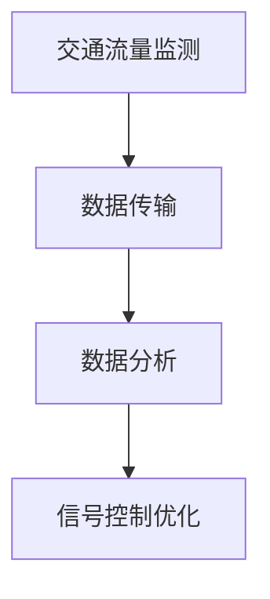

2. **信号控制优化**：利用大数据分析和人工智能算法，根据实时交通数据，动态调整交通信号灯时长和相位，优化交通流量。

**伪代码示例：**

```python
def optimize_traffic_signals(traffic_data):
    # 分析交通数据
    traffic_pattern = analyze_traffic_data(traffic_data)
    # 优化信号灯控制
    optimized_signals = optimize_signals(traffic_pattern)
    # 更新信号灯配置
    update_signals(optimized_signals)
```

3. **智能诱导系统**：通过电子显示屏和短信、微信等途径，向驾驶员提供实时路况信息和最优行驶路线，引导车辆避开拥堵路段。

**数据流程图：**

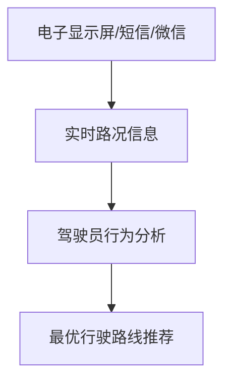

**代码解读与分析：**

- **交通流量监测**：通过传感器和摄像头，实时采集交通数据，包括车辆速度、密度、行驶方向等，实现交通流量的实时监测。
- **数据分析**：利用大数据分析技术，对采集到的交通数据进行处理和分析，提取有价值的信息，如交通流量高峰期、拥堵路段等。
- **信号控制优化**：根据分析结果，动态调整交通信号灯的控制策略，优化交通流量，减少交通拥堵。

**实施效果**

智能交通系统的实施，显著改善了北京市的交通状况。通过实时监测和优化信号控制，交通拥堵现象明显减少，交通运行效率提高。此外，智能诱导系统为驾驶员提供了实时路况信息，引导车辆避开拥堵路段，进一步提高了交通通行能力。

#### 8.2 案例二：智慧城市

智慧城市（Smart City）是指利用物联网、大数据、人工智能、区块链等先进技术，实现城市资源、环境和公共服务的智能化管理和优化，以提高城市治理效率和居民生活质量。

**案例背景**

随着城市化进程的加速，城市面临着交通拥堵、环境污染、资源短缺等问题，传统的城市治理模式已无法满足日益增长的城市需求。为了解决这些问题，许多城市开始探索智慧城市的建设。

**解决方案**

1. **智慧交通系统**：通过物联网技术，实现交通流量监测、信号控制优化、智能诱导等功能，提高交通运行效率。

**Mermaid 流程图：**

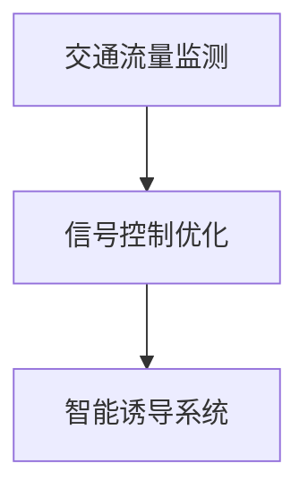

2. **智慧环境监测**：通过传感器技术，实时监测空气、水质、噪声等环境参数，及时预警和处理环境污染问题。

**伪代码示例：**

```python
def monitor_environment(sensors_data):
    # 数据分析
    environment_state = analyze_sensors_data(sensors_data)
    # 预警和处理
    if environment_state['pollution_level'] > threshold:
        alert_and_handle(environment_state)
```

3. **智慧能源管理**：利用大数据分析和人工智能技术，实现城市能源的智能调度和管理，提高能源利用效率。

**数据流程图：**

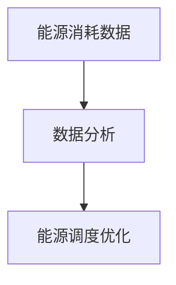

4. **智慧公共服务**：通过物联网和大数据技术，实现公共服务的智能化管理，如智能照明、智能供水、智能垃圾分类等。

**代码解读与分析：**

- **智慧交通系统**：通过传感器和摄像头，实时监测交通流量，优化信号控制，减少交通拥堵。
- **智慧环境监测**：通过传感器技术，实时监测环境参数，预警和处理环境污染问题。
- **智慧能源管理**：利用大数据分析，实现城市能源的智能调度和管理，提高能源利用效率。
- **智慧公共服务**：通过物联网技术，实现公共服务的智能化管理，提高居民生活质量。

**实施效果**

智慧城市的建设，显著提升了城市治理效率和居民生活质量。通过智能交通系统，交通拥堵现象明显减少，交通运行效率提高。智慧环境监测系统，实时监测环境参数，及时预警和处理环境污染问题，改善了城市环境质量。智慧能源管理系统，提高了能源利用效率，减少了能源消耗。智慧公共服务系统，为居民提供了便捷、高效的公共服务，提升了居民幸福感。

#### 8.3 案例三：区块链在慈善事业中的应用

区块链技术以其去中心化、透明性和不可篡改性，在慈善事业中展现出巨大的潜力。通过区块链，可以实现慈善资金的全程追踪和管理，提高慈善事业的透明度和公信力。

**案例背景**

近年来，慈善事业在快速发展的同时，也面临着资金滥用、诈捐等信任问题。为了提高慈善事业的透明度和公信力，许多慈善机构和政府开始探索区块链技术在慈善事业中的应用。

**解决方案**

1. **慈善资金管理**：通过区块链技术，实现慈善资金的全程追踪和管理，确保资金使用的透明和公正。

**Mermaid 流程图：**

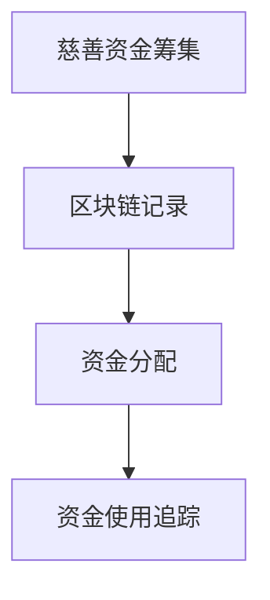

2. **智能合约**：利用区块链的智能合约技术，自动执行慈善捐赠协议，确保捐赠资金的正确使用。

**伪代码示例：**

```python
def execute_donation_contract(donation_contract):
    # 捐赠协议验证
    if verify_donation_contract(donation_contract):
        # 执行捐赠协议
        execute_contract(donation_contract)
```

3. **透明公开**：通过区块链技术，将慈善资金的筹集、分配和使用情况公开透明，接受公众监督。

**数据流程图：**

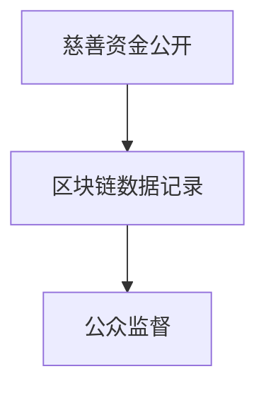

**代码解读与分析：**

- **慈善资金管理**：通过区块链技术，记录慈善资金的筹集、分配和使用过程，确保资金使用的透明和公正。
- **智能合约**：利用区块链的智能合约，自动执行捐赠协议，确保捐赠资金的正确使用。
- **透明公开**：通过区块链技术，公开慈善资金的筹集、分配和使用情况，接受公众监督。

**实施效果**

区块链在慈善事业中的应用，显著提高了慈善资金的透明度和公信力。通过区块链技术，慈善资金的筹集、分配和使用情况全程可追溯，减少了资金滥用的风险。智能合约技术，确保了捐赠资金的正确使用，提高了慈善事业的效率。公开透明的资金管理，增强了公众对慈善事业的信任，促进了慈善事业的健康发展。

### 第9章：科技创新社会治理的未来展望

#### 9.1 科技创新社会治理的趋势与方向

科技创新在推动社会治理现代化中具有不可替代的作用。未来，科技创新社会治理将呈现以下趋势与方向：

1. **智能化治理**：随着人工智能、大数据、物联网等技术的不断进步，智能化治理将成为未来社会治理的重要趋势。智能化治理不仅能够提升治理效率，还能通过实时监测、预测和自动化决策，实现更精准的社会治理。

2. **数据驱动治理**：大数据技术的应用使得社会治理能够基于数据驱动，实现更科学的决策和更精准的管理。未来，社会治理将更加依赖数据分析和人工智能算法，以实现对复杂社会问题的有效应对。

3. **去中心化治理**：区块链等分布式技术的崛起，将推动社会治理向去中心化方向转变。去中心化治理能够减少信息不对称，提高透明度和公信力，同时降低治理成本。

4. **可持续治理**：随着环境问题和社会不平等的加剧，可持续发展将成为未来社会治理的重要目标。科技创新将为实现可持续发展提供新的路径，如新能源技术、环保材料和绿色建筑等。

5. **社会公平**：科技创新在提高社会治理效率的同时，也面临社会公平的挑战。未来，科技创新社会治理需要更加关注社会公平，通过技术创新消除数字鸿沟，促进社会包容性发展。

#### 9.2 科技创新社会治理的潜在影响

科技创新社会治理的潜在影响深远，将在多个方面改变社会结构和治理模式：

1. **提升治理效率**：科技创新能够显著提高社会治理效率，通过智能化手段实现实时监控、预测和自动化决策，减少人工干预和错误。

2. **增强透明度和公信力**：区块链等去中心化技术的应用，能够提高社会治理的透明度和公信力，减少权力滥用和腐败现象。

3. **优化资源分配**：大数据分析和人工智能算法能够更精准地分配社会资源，提高公共服务供给的效率和质量。

4. **促进社会创新**：科技创新为社会治理提供了新的工具和方法，激发社会创新活力，推动社会治理模式的不断改进。

5. **解决复杂社会问题**：科技创新能够帮助应对复杂社会问题，如环境污染、社会不平等、公共卫生危机等，提升社会治理的效能。

#### 9.3 我国科技创新社会治理的发展策略

为了更好地利用科技创新推动社会治理现代化，我国可以采取以下发展策略：

1. **加强科技创新**：加大科研投入，支持基础研究和应用研究，推动关键技术的突破和产业发展。

2. **推进智能化治理**：推动人工智能、大数据、物联网等技术在社会治理中的应用，提升治理智能化水平。

3. **完善数据治理体系**：建立健全数据治理体系，确保数据安全、隐私保护和数据质量，为数据驱动治理提供保障。

4. **推广区块链技术**：在公共事务管理、慈善事业等领域推广区块链技术，提高透明度和公信力。

5. **促进社会公平**：关注科技创新对社会公平的影响，采取措施消除数字鸿沟，促进社会包容性发展。

6. **加强国际合作**：积极参与全球科技治理，加强与国际组织的合作，共同应对全球性社会问题。

通过实施这些策略，我国将能够更好地利用科技创新推动社会治理现代化，实现社会的和谐与进步。

## 附录

### 附录A：科技创新与社会治理相关法律法规

1. **《中华人民共和国网络安全法》**：规范网络安全管理，保护个人信息，维护网络安全。
2. **《中华人民共和国数据安全法》**：规范数据收集、处理、存储、传输和使用，保障数据安全。
3. **《中华人民共和国个人信息保护法》**：保护个人信息权益，规范个人信息处理活动。
4. **《中华人民共和国科学技术进步法》**：鼓励科技创新，促进科技成果转化和应用。
5. **《中华人民共和国环境保护法》**：规范环境保护行为，保护生态环境。
6. **《中华人民共和国慈善法》**：规范慈善行为，保障慈善事业健康发展。
7. **《中华人民共和国区块链技术发展指导纲要》**：指导区块链技术的发展和应用。

### 附录B：科技创新与社会治理参考书目

1. **《大数据与社会治理》**，作者：李纲
2. **《人工智能社会治理》**，作者：何晓阳
3. **《区块链革命》**，作者：唐·塔普斯科特
4. **《智慧城市》**，作者：杨震宁
5. **《物联网应用技术》**，作者：张志宏
6. **《环境科学与技术》**，作者：李庆文

### 附录C：科技创新与社会治理常用工具与平台

1. **Hadoop**：大数据处理框架，用于分布式数据处理。
2. **TensorFlow**：人工智能和深度学习开源框架。
3. **Ethereum**：区块链平台，支持智能合约开发。
4. **OpenCV**：开源计算机视觉库。
5. **ArcGIS**：地理信息系统平台。
6. **AWS**：云计算平台，提供大数据、人工智能和物联网服务。

## 参考文献

1. 李纲. (2019). 《大数据与社会治理》. 电子工业出版社.
2. 何晓阳. (2020). 《人工智能社会治理》. 清华大学出版社.
3. 唐·塔普斯科特. (2016). 《区块链革命》. 北京大学出版社.
4. 杨震宁. (2018). 《智慧城市》. 中国建筑工业出版社.
5. 张志宏. (2017). 《物联网应用技术》. 电子工业出版社.
6. 李庆文. (2019). 《环境科学与技术》. 科学出版社.
7. 《中华人民共和国网络安全法》. (2017). 中华人民共和国全国人民代表大会常务委员会.
8. 《中华人民共和国数据安全法》. (2021). 中华人民共和国全国人民代表大会常务委员会.
9. 《中华人民共和国个人信息保护法》. (2021). 中华人民共和国全国人民代表大会常务委员会.
10. 《中华人民共和国科学技术进步法》. (2007). 中华人民共和国全国人民代表大会常务委员会.
11. 《中华人民共和国环境保护法》. (1989). 中华人民共和国全国人民代表大会常务委员会.
12. 《中华人民共和国慈善法》. (2016). 中华人民共和国全国人民代表大会常务委员会.
13. 《中华人民共和国区块链技术发展指导纲要》. (2019). 中华人民共和国国务院.

