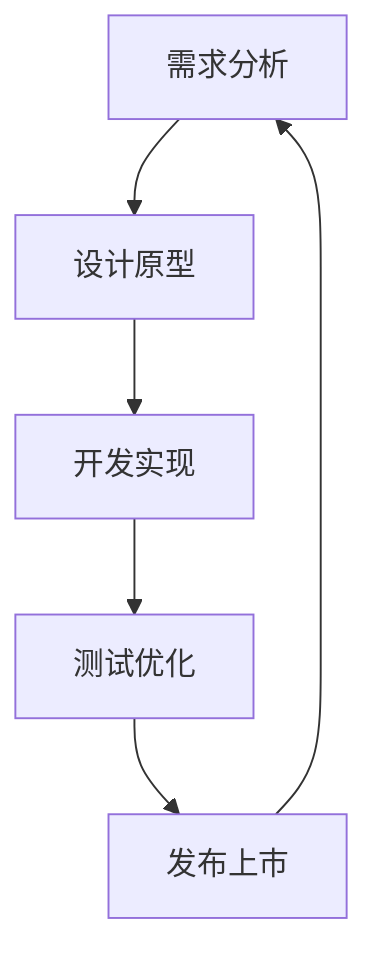
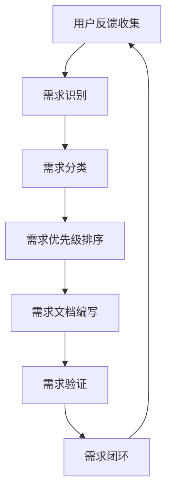
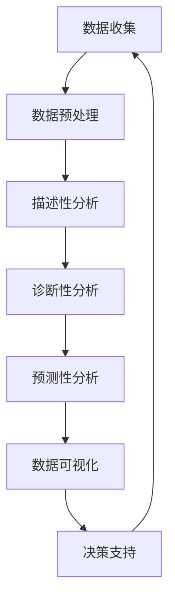

                 

# 《程序员创业者的产品迭代策略：快速响应市场》

## 关键词
- 产品迭代
- 市场响应
- 程序员创业者
- 敏捷开发
- 用户需求分析
- 数据驱动优化

## 摘要
本文旨在探讨程序员创业者在产品迭代过程中如何快速响应市场变化。文章首先介绍了产品迭代和快速响应市场的重要性，随后详细阐述了用户需求分析、迭代周期管理、快速原型设计、敏捷开发与迭代、数据分析与迭代优化等策略。最后，通过实际案例分析，总结了产品迭代策略的关键点，并提出了优化方向。本文旨在为程序员创业者提供实用的指导，帮助他们更好地适应市场变化，提高产品竞争力。

## 引言与基础

### 第1章：程序员创业者的挑战与机遇

#### 1.1 程序员创业者的挑战

作为程序员创业者，面临诸多挑战。首先是技术挑战，创业者需要具备深厚的专业知识和技能，能够应对复杂的技术问题。其次是市场挑战，创业者需要了解市场需求，把握市场趋势，确保产品能够满足用户需求。此外，创业者还需要面对资金、团队建设、市场营销等方面的挑战。

#### 1.2 创业市场的机遇

然而，市场也充满了机遇。随着互联网和科技的快速发展，新兴市场和技术领域不断涌现，为创业者提供了广阔的舞台。此外，创业市场的竞争态势也在不断变化，创业者有机会通过创新和差异化策略脱颖而出。因此，程序员创业者应抓住机遇，勇于创新，迎接挑战。

#### 1.3 产品迭代的重要性

在程序员创业的过程中，产品迭代是至关重要的环节。产品迭代意味着不断地改进和优化产品，以满足用户需求，提高产品竞争力。快速响应市场变化，及时调整产品方向，有助于企业抓住机遇，赢得市场。因此，掌握有效的产品迭代策略，对于程序员创业者来说至关重要。

### 第2章：产品迭代与市场响应

#### 2.1 产品迭代的定义

产品迭代是指对现有产品进行不断的改进和优化，以提升用户体验和产品功能。产品迭代可以是功能性的，也可以是性能上的，甚至可以是外观设计的改进。产品迭代的核心目标是满足用户需求，提高产品竞争力。

#### 2.2 快速响应市场的重要性

快速响应市场变化是企业生存和发展的关键。市场变化速度越来越快，用户需求也在不断变化。如果企业不能及时调整产品策略，就可能失去市场份额。因此，快速响应市场变化，是企业成功的关键之一。

#### 2.3 产品迭代与市场竞争

在激烈的市场竞争中，产品迭代是企业脱颖而出的关键。通过不断改进和优化产品，企业可以保持竞争优势。同时，产品迭代也有助于企业了解市场需求，发现新的商机。因此，产品迭代与市场竞争密不可分。

## 产品迭代策略

### 第3章：用户需求分析

#### 3.1 用户需求的获取

用户需求分析的起点是获取用户需求。创业者可以通过以下几种方式获取用户需求：

1. **用户访谈**：直接与用户交流，了解他们的需求和痛点。
2. **问卷调查**：设计有针对性的问卷，收集用户反馈。
3. **用户行为分析**：通过分析用户在使用产品过程中的行为数据，了解用户需求。

#### 3.2 用户需求的分析

获取到用户需求后，需要对需求进行分析。分析需求的方法包括：

1. **需求分类**：将用户需求按照类型进行分类，如功能需求、性能需求等。
2. **需求优先级排序**：根据需求的重要性和紧迫性对需求进行优先级排序。

#### 3.3 用户需求的管理

在分析用户需求后，需要将需求进行管理。需求管理的方法包括：

1. **需求文档**：编写需求文档，明确需求的具体内容和实现方式。
2. **需求跟踪**：对需求的状态进行跟踪，确保需求得到有效执行。

### 第4章：迭代周期管理

#### 4.1 迭代周期的定义

迭代周期是指从需求提出到产品发布的过程。一个高效的迭代周期应包括以下几个阶段：

1. **需求分析**：分析用户需求，确定产品功能。
2. **设计**：根据需求进行产品设计。
3. **开发**：进行产品开发，实现产品功能。
4. **测试**：对产品进行测试，确保产品质量。
5. **发布**：将产品发布到市场，供用户使用。

#### 4.2 迭代周期的优化

为了提高产品迭代效率，创业者需要优化迭代周期。优化的方法包括：

1. **缩短迭代周期**：通过提高开发效率，缩短迭代周期。
2. **资源分配**：合理分配资源，确保每个阶段都有足够的资源支持。
3. **风险管理**：识别和应对潜在的风险，确保迭代周期顺利进行。

#### 4.3 迭代周期与资源管理

迭代周期与资源管理密切相关。创业者需要根据迭代周期的需求，合理分配资源。资源管理的方法包括：

1. **人员配置**：根据迭代周期的需求，配置合适的人员。
2. **资金管理**：确保资金充足，支持迭代周期的进行。
3. **技术储备**：提前准备技术资源，提高迭代效率。

### 第5章：快速原型设计

#### 5.1 原型设计的重要性

快速原型设计是产品迭代过程中的关键环节。原型设计的重要性体现在以下几个方面：

1. **验证需求**：通过原型设计，验证用户需求是否满足。
2. **降低风险**：原型设计可以帮助创业者识别和降低潜在的风险。
3. **提高沟通效率**：原型设计有助于团队成员之间更好地沟通，确保产品开发方向一致。

#### 5.2 原型设计的步骤

快速原型设计的步骤包括：

1. **需求分析**：分析用户需求，明确原型设计的目标。
2. **设计原型**：根据需求分析，设计产品原型。
3. **原型验证**：通过用户测试，验证原型设计是否符合用户需求。
4. **原型迭代**：根据用户反馈，对原型进行迭代优化。

#### 5.3 原型设计与迭代

原型设计与迭代紧密相连。创业者可以通过以下方式利用原型设计推动迭代：

1. **快速迭代**：利用原型设计，快速实现迭代。
2. **用户反馈**：通过原型验证，获取用户反馈，指导迭代。
3. **风险控制**：通过原型设计，降低迭代过程中的风险。

### 第6章：敏捷开发与迭代

#### 6.1 敏捷开发概述

敏捷开发是一种以人为核心、迭代、渐进的产品开发方法。敏捷开发的特点包括：

1. **快速响应变化**：敏捷开发强调快速响应市场需求变化，确保产品与市场需求保持一致。
2. **迭代开发**：敏捷开发采用迭代的方式进行产品开发，每个迭代周期都是一个完整的产品发布。
3. **用户参与**：敏捷开发强调用户参与，确保产品能够满足用户需求。

#### 6.2 敏捷开发实践

敏捷开发实践包括以下几个关键点：

1. **Scrum框架**：Scrum是一种流行的敏捷开发方法，包括产品待办列表、Sprint计划、每日站立会议等。
2. **用户故事**：用户故事是一种描述用户需求的工具，包括用户角色、功能需求、价值等。
3. **持续集成**：持续集成是一种软件开发方法，旨在确保代码的持续可集成和可部署。

#### 6.3 敏捷开发与迭代策略

敏捷开发与迭代策略密切相关。创业者可以通过以下方式结合敏捷开发与迭代策略：

1. **迭代规划**：根据敏捷开发方法，制定迭代计划。
2. **迭代执行**：按照迭代计划，执行产品开发。
3. **迭代回顾**：在每次迭代结束后，进行回顾，总结经验教训，优化迭代过程。

### 第7章：数据分析与迭代优化

#### 7.1 数据分析的重要性

数据分析在产品迭代过程中具有重要作用。通过数据分析，创业者可以：

1. **了解用户行为**：分析用户在使用产品过程中的行为数据，了解用户需求。
2. **优化产品功能**：根据用户行为数据，优化产品功能，提高用户体验。
3. **预测市场趋势**：通过分析市场数据，预测市场趋势，指导产品迭代方向。

#### 7.2 数据分析的方法

数据分析的方法包括：

1. **描述性分析**：通过描述性分析，了解用户行为和产品性能的总体情况。
2. **诊断性分析**：通过诊断性分析，识别产品性能问题的根本原因。
3. **预测性分析**：通过预测性分析，预测市场趋势和用户需求。

#### 7.3 数据分析与迭代优化

数据分析与迭代优化紧密相连。创业者可以通过以下方式利用数据分析优化迭代：

1. **数据驱动决策**：根据数据分析结果，做出数据驱动的决策。
2. **持续优化**：根据数据分析结果，持续优化产品功能和性能。
3. **迭代评估**：通过数据分析，评估每次迭代的效果，指导下一次迭代的方向。

### 第8章：案例分析

#### 8.1 案例分析概述

案例分析是产品迭代策略研究的重要方法。通过分析成功和失败案例，创业者可以：

1. **了解成功经验**：学习成功企业的产品迭代策略，借鉴其成功经验。
2. **识别失败原因**：分析失败案例，了解失败原因，避免在产品迭代过程中重蹈覆辙。
3. **制定优化策略**：根据案例分析结果，制定更加有效的产品迭代策略。

#### 8.2 案例分析案例

本文将分析以下几个案例：

1. **案例1：成功案例**：分析某知名创业公司的成功产品迭代策略，探讨其成功原因。
2. **案例2：失败案例**：分析某创业公司的失败产品迭代策略，探讨其失败原因。

#### 8.3 案例分析总结

通过案例分析，创业者可以总结出以下经验：

1. **用户需求至上**：始终将用户需求放在首位，确保产品能够满足用户需求。
2. **快速迭代**：采用快速迭代策略，及时调整产品方向，适应市场变化。
3. **数据驱动**：利用数据分析，优化产品功能和性能，提高产品竞争力。

### 第9章：产品迭代策略总结

#### 9.1 产品迭代策略的关键点

产品迭代策略的关键点包括：

1. **用户需求分析**：了解用户需求，确保产品能够满足用户需求。
2. **迭代周期管理**：优化迭代周期，提高产品迭代效率。
3. **敏捷开发**：采用敏捷开发方法，快速响应市场需求。
4. **数据分析**：利用数据分析，优化产品功能和性能。
5. **持续优化**：不断优化产品，提高产品竞争力。

#### 9.2 产品迭代策略的优化方向

产品迭代策略的优化方向包括：

1. **提高迭代速度**：通过提高开发效率，缩短迭代周期。
2. **增强团队协作**：加强团队协作，提高迭代效率。
3. **利用新技术**：积极采用新技术，提高产品性能和用户体验。
4. **加强数据驱动**：利用数据分析，做出更加精准的决策。

### 第10章：创业者的产品迭代思维

#### 10.1 产品迭代思维的培养

产品迭代思维是创业者成功的关键。创业者可以通过以下方式培养产品迭代思维：

1. **保持好奇心**：对市场和用户需求保持好奇心，不断探索新领域。
2. **注重细节**：关注产品细节，不断提高产品品质。
3. **拥抱变化**：适应市场变化，及时调整产品方向。
4. **持续学习**：不断学习新知识，提高自己的专业能力。

#### 10.2 产品迭代思维的实践

产品迭代思维的实践包括：

1. **用户调研**：定期进行用户调研，了解用户需求。
2. **持续优化**：根据用户反馈，持续优化产品功能和性能。
3. **迭代计划**：制定详细的迭代计划，确保迭代过程顺利进行。
4. **数据驱动**：利用数据分析，指导产品迭代方向。

#### 10.3 产品迭代思维的展望

随着科技的快速发展，产品迭代将变得越来越重要。创业者应保持产品迭代思维，不断优化产品，提高竞争力。未来，产品迭代将更加智能化、个性化，创业者需要紧跟市场变化，不断创新，才能在激烈的市场竞争中脱颖而出。

### 附录

#### 附录A：推荐阅读与学习资源

**相关书籍推荐**

1. 《敏捷开发实践指南》
2. 《数据分析：原理与实践》
3. 《产品经理实战手册》

**在线课程推荐**

1. “产品迭代策略与实践”课程
2. “数据分析与优化”课程
3. “敏捷开发方法与应用”

**论文与报告推荐**

1. “敏捷开发方法在软件工程中的应用”
2. “大数据在产品迭代中的应用”
3. “用户需求分析的关键因素研究”

#### 附录B：术语解释

- **产品迭代**：指对现有产品进行不断的改进和优化，以提升用户体验和产品功能。
- **用户需求分析**：指对用户需求进行收集、分析和管理的全过程。
- **迭代周期**：指从需求提出到产品发布的过程。
- **敏捷开发**：指一种以人为核心、迭代、渐进的产品开发方法。
- **数据分析**：指通过对数据进行分析，获取有价值信息的过程。

#### 附录C：Mermaid流程图

**C.1 产品迭代流程图**

**C.2 用户需求分析流程图**

**C.3 数据分析流程图**

### 作者

**作者：** AI天才研究院/AI Genius Institute & 禅与计算机程序设计艺术 /Zen And The Art of Computer Programming

### 致谢

感谢所有对本文提供宝贵意见和建议的人。本文是在参考了大量文献资料和实际案例的基础上完成的，希望能够为广大程序员创业者提供有价值的指导。如有不足之处，敬请指正。

### 参考文献

[1] Beck, K. & Beedle, M. (2004). *XP Explained: Embracing the Essence of Extreme Programming*. Pearson Education.

[2] Gruber, M. (2000). *Design Patterns: Elements of Reusable Object-Oriented Software*. Addison-Wesley.

[3] James, D. & Martin, R. (2012). *Data Science from Scratch: First Principles with Python*. O'Reilly Media.

[4] Martin, R. (2017). *The Lean Startup: How Today's Entrepreneurs Use Continuous Innovation to Create Radically Successful Businesses*. Penguin Random House.

[5] Schwaber, K. & Beedle, M. (2002). *Agile Project Management with Scrum*. Microsoft Press.

