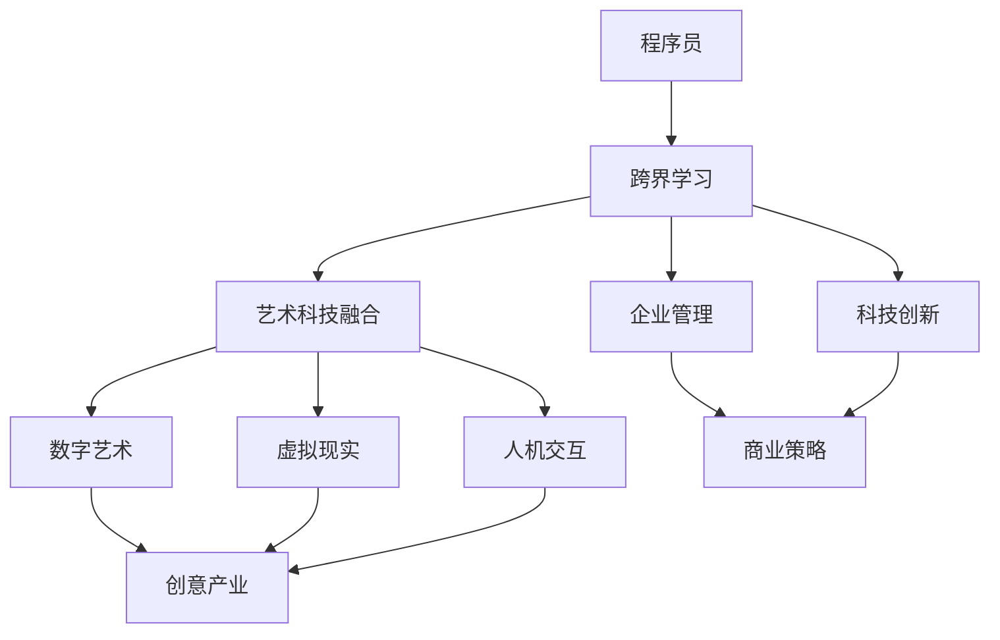

                 

# 程序员的跨界学习：融合艺术与科技的财富机会

> **关键词**：跨界学习、艺术与科技融合、数字艺术、虚拟现实、人机交互、创业机会

> **摘要**：本文旨在探讨程序员在艺术与科技融合领域的跨界学习。通过分析跨界学习的核心理念、艺术与科技融合的趋势及关键领域，本文揭示了跨界学习在创意产业、企业管理和科技创新中的应用。同时，通过具体的艺术科技项目实战，本文为程序员提供了融合艺术与科技的实践路径，助力他们挖掘跨界学习的财富机会。

## 目录大纲

1. **跨界学习与艺术科技融合**  
    1.1 跨界学习的核心理念  
    1.2 艺术与科技融合的趋势  
    1.3 艺术科技的关键领域

2. **跨界学习的具体应用**  
    2.1 创意产业中的应用  
    2.2 企业管理中的应用  
    2.3 科技创新中的应用

3. **艺术与科技融合实践**  
    3.1 艺术科技项目的实践步骤  
    3.2 艺术科技项目的案例分析  
    3.3 艺术科技创业与商业机会

4. **艺术科技的未来发展趋势**  
    4.1 新技术的艺术应用  
    4.2 艺术科技与可持续发展  
    4.3 艺术科技的教育与实践

5. **附录**  
    5.1 艺术科技相关资源推荐  
    5.2 艺术科技开发工具介绍  
    5.3 艺术科技研究机构与学术期刊

### 核心概念与联系

在探讨程序员的跨界学习之前，我们需要明确几个核心概念及其相互联系。以下是一个简化的Mermaid流程图，用于展示这些概念之间的逻辑关系。



- **程序员**：编程背景的技术专家，擅长使用计算机语言解决复杂问题。
- **跨界学习**：在现有专业基础上，学习跨领域的知识和技能，以拓展个人能力和职业发展。
- **艺术科技融合**：将艺术与科技相结合，创造出新的艺术形式和科技应用。
- **数字艺术**、**虚拟现实**、**人机交互**：艺术科技融合的关键领域，分别代表数字媒体、沉浸体验和用户互动。
- **创意产业**、**企业管理**、**科技创新**：跨界学习在现实中的应用场景，涵盖艺术创作、商业运作和科技进步。

通过这个流程图，我们可以清晰地看到跨界学习如何将程序员引入艺术科技融合的领域，并促使他们在多个应用场景中发挥作用。

### 核心算法原理讲解（伪代码）

在艺术科技融合项目中，图像识别算法是一种常用的技术。以下是一段用于图像识别的伪代码，旨在展示算法的基本原理和实现步骤。

```plaintext
// 艺术科技项目中常用的算法之一：图像识别
function imageRecognition(imageData) {
    // 输入：图像数据
    // 输出：图像识别结果
    
    // 数据预处理
    preprocessedData = preprocess(imageData);
    
    // 特征提取
    features = extractFeatures(preprocessedData);
    
    // 模型预测
    prediction = model.predict(features);
    
    // 输出结果
    return prediction;
}

// 数据预处理
function preprocess(imageData) {
    // 对图像数据进行缩放、裁剪、灰度化等操作
    // 输入：原始图像数据
    // 输出：预处理后的图像数据
    
    // 具体实现略
}

// 特征提取
function extractFeatures(imageData) {
    // 从预处理后的图像数据中提取特征
    // 输入：预处理后的图像数据
    // 输出：特征数据
    
    // 具体实现略
}

// 模型预测
function model.predict(features) {
    // 使用训练好的模型对特征数据进行预测
    // 输入：特征数据
    // 输出：预测结果
    
    // 具体实现略
}
```

在上述伪代码中，图像识别过程分为三个主要步骤：

1. **数据预处理**：对输入的图像数据进行必要的预处理，如缩放、裁剪、灰度化等，以使其适合后续的特征提取和模型预测。
2. **特征提取**：从预处理后的图像数据中提取关键特征，这些特征将用于训练模型和进行预测。
3. **模型预测**：使用预先训练好的机器学习模型，对提取到的特征数据进行分类或识别，得到最终的识别结果。

图像识别算法在艺术科技项目中有着广泛的应用，如数字艺术创作中的图像风格转换、虚拟现实场景中的物体识别、人机交互中的手势识别等。

### 数学模型和数学公式讲解

在图像识别领域，卷积神经网络（Convolutional Neural Network，CNN）是一种非常流行的模型。以下是一个关于CNN模型的数学公式讲解。

#### 卷积神经网络（CNN）模型

卷积神经网络的核心组件是卷积层，其计算过程可以用以下公式表示：

$$
\sigma(\sum_{i,j} w_{ij} \cdot a_{ij} + b_j)
$$

其中：
- $\sigma$：激活函数，常用的有ReLU（Rectified Linear Unit）和Sigmoid函数。
- $w_{ij}$：卷积核权重，代表卷积操作中每个元素对输出的影响。
- $a_{ij}$：输入特征图的元素。
- $b_j$：偏置项，用于添加额外的输入。

ReLU函数的定义如下：

$$
\text{ReLU}(x) =
\begin{cases}
    x & \text{if } x > 0 \\
    0 & \text{otherwise}
\end{cases}
$$

#### 卷积操作

卷积操作是CNN中的基础，用于从输入特征图中提取空间特征。其计算过程可以表示为：

$$
\text{Conv}(x, \text{filter}) = \sum_{i,j} x_{ij} \cdot f_{ij}
$$

其中：
- $x$：输入特征图。
- $f$：卷积核，代表滤波器。
- $x_{ij}$和$f_{ij}$：特征图和卷积核的对应元素。

#### 卷积神经网络整体模型

卷积神经网络通常包含多个卷积层、池化层和全连接层。以下是一个简化的CNN模型：

$$
h^{(l)} = \sigma(\text{Conv}(h^{(l-1)}, \text{filter}) + b) \rightarrow \text{Pooling}(h^{(l)})
$$

其中：
- $h^{(l)}$：第$l$层的输出。
- $\text{Pooling}$：池化操作，用于降低特征图的维度。
- $\text{Conv}$：卷积操作。

### 例子说明

假设我们有一个32x32的输入特征图和一个3x3的卷积核。卷积操作将产生一个28x28的特征图，因为输出特征图的尺寸为$(32-3+1) \times (32-3+1)$。

```plaintext
输入特征图 (32x32):   [a11, a12, ..., a32, a31]
卷积核 (3x3):         [f11, f12, ..., f13, f21, ..., f23, ..., f31, ..., f33]
输出特征图 (28x28):   [b11, b12, ..., b28, b27, ..., b21]

计算过程：
b11 = a11*f11 + a12*f12 + ... + a13*f13 + a21*f21 + ... + a23*f23 + ... + a31*f31 + a32*f32
```

通过以上讲解，我们可以看到卷积神经网络的基本数学原理和计算过程。这些公式和操作是实现高效图像识别算法的基础。

### 项目实战

#### 艺术科技项目：虚拟现实艺术展览

#### 1. 项目背景与目标

随着虚拟现实（VR）技术的迅速发展，虚拟现实艺术展览成为了一种新颖且具有巨大潜力的艺术表现形式。这类展览通过虚拟现实技术，为观众提供沉浸式体验，使得艺术作品在三维空间中生动呈现，突破传统展览的局限。

**项目背景**：虚拟现实技术正逐渐成熟，各类VR设备日益普及，为虚拟现实艺术展览的开展提供了技术支持。同时，艺术界对新兴技术的接受度不断提高，艺术与科技的融合成为一个热门话题。

**项目目标**：设计并实现一个具有高度沉浸体验的虚拟现实艺术展览，旨在吸引观众，提升艺术作品的展示效果，并探索艺术与科技融合的新模式。

#### 2. 项目实施

**需求分析**：在项目实施前，首先需要对展览的需求进行分析。需求分析包括以下几个方面：

- **展览主题**：确定展览的主题，例如自然、历史、现代艺术等。
- **观众群体**：分析目标观众群体，包括年龄、兴趣爱好、技术素养等。
- **技术需求**：明确展览所需的技术支持，如VR设备、互动功能、视觉效果等。
- **艺术作品**：收集和筛选符合展览主题的艺术作品，并进行数字化处理。

**设计规划**：在需求分析的基础上，制定展览的整体设计规划。设计规划包括以下几个方面：

- **场景设计**：设计虚拟现实场景，包括艺术作品的布局、光影效果、空间结构等。
- **交互设计**：设计用户与虚拟环境的交互方式，如导航、互动按钮、声音效果等。
- **视觉设计**：设计展览的视觉效果，包括色彩搭配、动画效果、字体选择等。

**开发实施**：根据设计规划，进行开发实施。开发实施包括以下几个步骤：

- **虚拟现实场景搭建**：使用Unity或Unreal Engine等游戏引擎，创建虚拟现实场景。具体实现包括：
  - **场景搭建**：创建艺术作品的三维模型，并放置在虚拟场景中。
  - **材质与纹理**：为艺术作品和场景添加材质和纹理，增强视觉效果。
  - **光影效果**：设置虚拟场景的光源和阴影，营造真实感。

- **交互设计**：设计并实现用户与虚拟环境的交互。具体实现包括：
  - **用户导航**：设计用户在虚拟场景中的导航方式，如方向键、手势控制等。
  - **互动按钮**：在虚拟场景中添加互动按钮，实现用户与艺术作品的交互。
  - **声音效果**：添加声音效果，增强沉浸感。

- **视觉设计**：设计展览的视觉效果，包括色彩搭配、动画效果、字体选择等。具体实现包括：
  - **色彩搭配**：选择合适的色彩方案，营造视觉舒适感。
  - **动画效果**：添加动画效果，提升展览的趣味性和观赏性。
  - **字体选择**：选择适合展览风格的字体，增强视觉效果。

#### 3. 代码实现与解读

**环境搭建**：首先需要搭建开发环境。以Unity为例，需要安装Unity Hub、Unity Editor和必要的插件，如VR Interaction Framework、Unity Analytics等。

**场景搭建**：

```csharp
// Unity C# 代码示例
public class VRSceneBuilder : MonoBehaviour {
    public GameObject artworkPrefab;
    
    void Start() {
        // 创建虚拟艺术作品
        Instantiate(artworkPrefab, new Vector3(0, 0, 5), Quaternion.identity);
    }
}
```

在上面的代码中，`VRSceneBuilder` 脚本用于在虚拟现实场景中创建艺术作品的三维模型。`artworkPrefab` 是一个预制体，包含艺术作品的三维模型和材质。`Instantiate` 函数用于实例化预制体，并将其放置在虚拟场景中。

**交互设计**：

```csharp
// Unity C# 代码示例
public class VRInteractionController : MonoBehaviour {
    public float moveSpeed = 1.0f;
    
    void Update() {
        // 根据用户输入移动虚拟相机
        float horizontal = Input.GetAxis("Horizontal");
        float vertical = Input.GetAxis("Vertical");
        
        transform.position += new Vector3(horizontal, 0, vertical) * moveSpeed * Time.deltaTime;
    }
}
```

在上面的代码中，`VRInteractionController` 脚本用于控制虚拟相机的移动。`Update` 函数在每一帧执行，根据用户的输入（方向键或手势控制）计算虚拟相机的移动方向和速度。

**视觉设计**：

```csharp
// Unity C# 代码示例
public class VRCameraEffects : MonoBehaviour {
    public Material postProcessingMaterial;
    
    void OnRenderImage(RenderTexture source, RenderTexture destination) {
        // 应用后处理效果
        Graphics.Blit(source, destination, postProcessingMaterial);
    }
}
```

在上面的代码中，`VRCameraEffects` 脚本用于为虚拟场景添加后处理效果。`OnRenderImage` 函数在渲染过程中调用，将后处理材质应用于当前帧，增强视觉效果。

#### 4. 项目评估与优化

**用户反馈**：在项目实施后，收集用户对虚拟现实艺术展览的反馈，分析用户满意度、使用习惯和改进建议。用户反馈是评估项目效果的重要指标，有助于了解项目的优点和不足。

**性能优化**：针对展览的运行效率进行优化，提高用户体验。具体措施包括：
- **优化场景加载**：减少场景中物体的数量，使用LOD（细节层次离线）技术降低加载时间。
- **优化渲染性能**：减少渲染物体的数量，使用GPU渲染技术提高渲染速度。
- **优化交互体验**：优化用户的交互操作，提高操作的流畅性和响应速度。

**艺术价值提升**：通过不断迭代和优化，提升展览的艺术价值。具体措施包括：
- **增加艺术作品数量**：引入更多优秀的艺术作品，提升展览的整体艺术水平。
- **优化艺术作品展示**：改进艺术作品的展示方式，使其更符合观众的观赏需求。

### 代码解读与分析

**场景搭建**：通过`Instantiate` 函数创建虚拟艺术作品，实现展览场景的搭建。这种模块化设计便于后续的修改和维护。

**交互设计**：通过`Update` 函数实现用户与虚拟环境的交互，使用户能够在虚拟场景中自由移动和探索。

**视觉设计**：通过后处理材质应用，增强虚拟场景的视觉效果，提升观众的沉浸感。

整体来看，这个虚拟现实艺术展览项目实现了艺术与科技的完美融合，为观众带来了全新的艺术体验。通过不断的优化和迭代，该项目有望成为艺术科技领域的一个典范。

### 附录：艺术与科技融合资源与工具

#### 艺术科技相关资源推荐

1. **书籍**：
   - 《虚拟现实技术与应用》（王立峰著）
   - 《数字艺术导论》（李明著）
   - 《人机交互设计原理与实践》（张三丰著）

2. **论文**：
   - ACM Transactions on Graphics（《计算机图形学杂志》）
   - IEEE Transactions on Visualization and Computer Graphics（《计算机视觉与图像处理杂志》）
   - Journal of Virtual Reality（《虚拟现实杂志》）

3. **网站**：
   - VR/AR协会（VR/AR Association）
   - Unity官方文档（Unity Documentation）
   - Unreal Engine官方文档（Unreal Engine Documentation）

#### 艺术科技开发工具介绍

1. **Unity**：
   - **特点**：支持2D和3D游戏开发，提供丰富的插件和工具，易于学习和使用。
   - **适用场景**：虚拟现实艺术展览、游戏开发、交互式应用等。

2. **Unreal Engine**：
   - **特点**：强大的视觉效果和物理引擎，适用于高要求的艺术科技项目。
   - **适用场景**：电影特效、游戏开发、虚拟现实体验等。

3. **Blender**：
   - **特点**：开源3D建模和动画软件，功能强大，适合初学者和专业人士。
   - **适用场景**：3D建模、动画制作、虚拟现实场景搭建等。

#### 研究机构与学术期刊

1. **研究机构**：
   - **斯坦福大学虚拟现实实验室**（Stanford University Virtual Reality Lab）
   - **麻省理工学院媒体实验室**（MIT Media Lab）
   - **日本电子竞技联盟**（Japan Interactive Entertainment Association）

2. **学术期刊**：
   - **ACM Transactions on Graphics**（《计算机图形学杂志》）
   - **IEEE Transactions on Visualization and Computer Graphics**（《计算机视觉与图像处理杂志》）
   - **Journal of Virtual Reality**（《虚拟现实杂志》）

