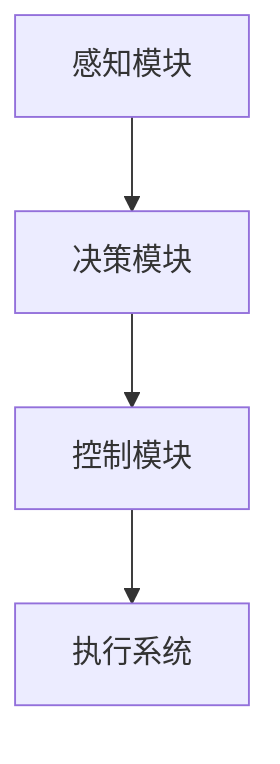

                 

# 《端到端自动驾驶的分布式决策优化算法》

> **关键词**：端到端自动驾驶、分布式决策优化、算法、路径规划、动力控制、环境感知

> **摘要**：本文探讨了端到端自动驾驶技术中的分布式决策优化算法。首先，介绍了端到端自动驾驶的背景、挑战和基本架构。接着，详细阐述了分布式决策优化的基本概念和原理，以及常用的分布式优化算法。然后，分析了分布式决策优化算法在自动驾驶中的具体应用，如路径规划、动力控制和环境感知。最后，通过实际项目案例展示了分布式决策优化算法的实现和评估，展望了其未来发展。

## 目录大纲

1. **端到端自动驾驶概述**

   1.1 端到端自动驾驶的背景与挑战
   
   1.2 端到端自动驾驶的基本架构
   
2. **分布式决策优化算法原理**

   2.1 分布式决策优化的基本概念
   
   2.2 分布式优化算法
   
3. **分布式决策优化的应用**

   3.1 路径规划
   
   3.2 动力控制
   
   3.3 环境感知
   
4. **分布式决策优化算法的实现**

   4.1 算法设计与实现
   
   4.2 系统架构设计
   
5. **分布式决策优化算法在实际项目中的应用案例**

   5.1 项目背景与目标
   
   5.2 项目实施与成果评估
   
6. **展望与未来趋势**

   6.1 分布式决策优化算法的发展趋势
   
   6.2 端到端自动驾驶的展望

## 附录

7. **附录A：分布式决策优化算法常用工具和资源**

8. **附录B：参考文献与推荐阅读**

9. **附录C：Mermaid 流程图**

10. **附录D：算法伪代码**

11. **附录E：数学模型和公式**

12. **附录F：项目实战案例**

### 1. 端到端自动驾驶概述

#### 1.1 端到端自动驾驶的背景与挑战

自动驾驶技术是人工智能和计算机科学领域的重要发展方向。随着智能交通系统、车联网和物联网的兴起，自动驾驶技术在交通安全、能源节约和交通效率等方面具有巨大的潜力。

端到端自动驾驶（End-to-End Autonomous Driving）是指通过人工智能技术实现车辆的自主行驶，从起点到终点的全过程无需人工干预。这一目标要求自动驾驶系统在多个方面具备高性能和高可靠性。

1. **技术挑战**：
   - **感知与理解**：自动驾驶系统需要实时感知和理解周围环境，包括车辆、行人、道路标志和交通信号等。
   - **决策与规划**：基于感知结果，系统需要做出快速而准确的决策，包括路径规划、速度控制、车道保持和障碍物避让等。
   - **执行与控制**：决策结果需要通过车辆的执行系统实现，如转向、加速和制动等。

2. **安全性与可靠性**：
   - 自动驾驶系统需要达到与人类驾驶员相当的安全水平，以避免交通事故。
   - 系统的可靠性要求高，确保在各种复杂和极端环境下稳定运行。

#### 1.2 端到端自动驾驶的基本架构

端到端自动驾驶系统通常由硬件和软件两部分组成。

1. **硬件架构**：
   - **传感器**：包括激光雷达（LiDAR）、摄像头、超声波传感器和GPS等，用于感知周围环境。
   - **计算平台**：高性能计算机用于处理传感器数据，执行决策算法和控制系统。

2. **软件架构**：
   - **感知模块**：处理传感器数据，提取环境特征。
   - **决策模块**：根据感知结果进行路径规划和决策。
   - **控制模块**：将决策转化为执行指令，控制车辆运动。

3. **数据处理与融合**：
   - 多种传感器数据的融合是提高自动驾驶系统性能的关键。例如，激光雷达提供高精度的三维点云数据，而摄像头提供丰富的图像信息。通过数据融合，系统能够更准确地理解周围环境。

### 2. 分布式决策优化算法原理

#### 2.1 分布式决策优化的基本概念

分布式决策优化是指将决策过程分布在多个计算节点上，通过协同计算和通信实现全局优化。在端到端自动驾驶中，由于系统规模庞大、实时性要求高，分布式决策优化算法具有显著的优势。

1. **分布式系统的定义与特点**：
   - **定义**：分布式系统是由多个独立计算节点组成的系统，这些节点通过网络相互连接，协同工作以完成共同任务。
   - **特点**：
     - **并行性**：分布式系统能够同时处理多个任务，提高计算效率。
     - **容错性**：分布式系统能够在单个节点故障时继续运行，提高系统可靠性。

2. **分布式决策优化的基本原理**：
   - **协同计算**：分布式系统中的节点通过通信共享信息，协同计算以实现全局优化。
   - **收敛性**：分布式决策优化算法需要满足收敛性条件，确保在有限时间内达到最优解。

3. **分布式决策优化的挑战与解决方案**：
   - **通信瓶颈**：分布式系统中节点之间的通信可能成为性能瓶颈。解决方法包括优化通信协议和算法设计。
   - **数据一致性**：分布式系统中数据一致性难以保证。解决方法包括分布式一致性协议和一致性哈希等。

#### 2.2 分布式优化算法

分布式优化算法是分布式决策优化的核心。以下介绍几种常用的分布式优化算法：

1. **梯度下降算法**：
   - **基本思想**：梯度下降算法通过迭代更新参数，使损失函数值逐渐减小，达到最优解。
   - **分布式实现**：分布式梯度下降算法将参数更新分布在多个节点上，通过同步或异步方式更新参数。

2. **拉格朗日乘子法**：
   - **基本思想**：拉格朗日乘子法通过引入拉格朗日乘子，将约束优化问题转化为无约束优化问题，然后使用梯度下降算法求解。
   - **分布式实现**：分布式拉格朗日乘子法将拉格朗日乘子分布在多个节点上，通过迭代更新拉格朗日乘子和参数。

3. **共轭梯度法**：
   - **基本思想**：共轭梯度法利用共轭方向原理，提高梯度下降算法的收敛速度。
   - **分布式实现**：分布式共轭梯度法将共轭方向分布在多个节点上，通过迭代更新参数和共轭方向。

#### 2.3 分布式决策优化的应用

分布式决策优化算法在自动驾驶中的具体应用包括路径规划、动力控制和环境感知等方面。

1. **路径规划**：
   - **基本概念**：路径规划是自动驾驶系统的一项重要任务，旨在确定车辆从起点到终点的最优路径。
   - **分布式算法**：分布式路径规划算法将路径规划问题分解为多个子问题，通过分布式计算和协同优化求解。

2. **动力控制**：
   - **基本概念**：动力控制是自动驾驶系统的核心，负责控制车辆的加速、制动和转向等运动。
   - **分布式算法**：分布式动力控制算法将控制任务分布在多个节点上，通过协同控制实现精确的动力响应。

3. **环境感知**：
   - **基本概念**：环境感知是自动驾驶系统的关键，旨在实时感知和理解周围环境。
   - **分布式算法**：分布式环境感知算法将感知任务分布在多个传感器上，通过数据融合和协同处理提高感知精度。

### 3. 分布式决策优化算法的实现

#### 3.1 算法设计与实现

分布式决策优化算法的设计和实现是端到端自动驾驶系统成功的关键。以下介绍分布式决策优化算法的设计和实现步骤：

1. **算法设计**：
   - **问题定义**：明确分布式决策优化的问题定义，包括目标函数、约束条件和优化变量。
   - **算法选择**：根据问题特点选择合适的分布式优化算法，如梯度下降、拉格朗日乘子法或共轭梯度法。
   - **算法改进**：针对算法的缺陷和性能瓶颈，进行算法改进和优化。

2. **算法实现**：
   - **并行计算**：实现分布式计算，将算法分解为多个子任务，通过并行计算提高计算效率。
   - **通信机制**：设计通信机制，确保节点之间的数据同步和消息传递。
   - **性能优化**：通过优化算法和数据结构，提高算法的收敛速度和计算精度。

#### 3.2 系统架构设计

分布式决策优化算法的实现需要一个合理的系统架构。以下介绍分布式决策优化算法的系统架构设计：

1. **硬件架构**：
   - **计算节点**：部署多个计算节点，每个节点承担部分计算任务。
   - **通信网络**：构建高效的通信网络，确保节点之间的数据传输和消息传递。

2. **软件架构**：
   - **感知模块**：实现分布式感知算法，实时感知周围环境。
   - **决策模块**：实现分布式决策优化算法，根据感知结果进行决策。
   - **控制模块**：实现分布式控制算法，将决策转化为执行指令。

#### 3.3 算法评估与优化

分布式决策优化算法的实现后，需要对算法进行评估和优化：

1. **性能评估**：
   - **时间效率**：评估算法的计算时间，确保在给定时间内完成决策过程。
   - **空间效率**：评估算法的内存消耗，确保算法的资源利用率。

2. **稳定性评估**：
   - **扰动测试**：通过添加噪声和扰动，评估算法在非理想条件下的稳定性和鲁棒性。
   - **故障测试**：模拟计算节点故障，评估算法的容错能力和恢复能力。

3. **优化策略**：
   - **参数调整**：根据性能评估结果，调整算法参数，提高算法的收敛速度和精度。
   - **算法改进**：针对算法的不足，进行算法改进和优化，提高算法的整体性能。

### 4. 分布式决策优化算法在实际项目中的应用案例

#### 4.1 项目背景与目标

为了展示分布式决策优化算法在实际项目中的应用，我们以一个自动驾驶车辆系统项目为例。

1. **项目背景**：
   - **目标**：实现一辆自动驾驶车辆，能够在城市道路环境中安全、高效地行驶。
   - **场景**：城市道路，包括单车道和多车道、交通拥堵和畅通等不同场景。

2. **项目目标**：
   - **感知与理解**：实时感知周围环境，包括车辆、行人、道路标志和交通信号等。
   - **决策与规划**：根据感知结果，进行路径规划和决策，确保车辆的安全行驶。
   - **执行与控制**：将决策转化为执行指令，控制车辆的加速、制动和转向等运动。

#### 4.2 项目实施

1. **硬件选择**：
   - **计算节点**：使用高性能计算机作为计算节点，每个节点负责部分计算任务。
   - **传感器**：部署激光雷达、摄像头、超声波传感器和GPS等传感器，用于感知周围环境。

2. **软件架构**：
   - **感知模块**：实现分布式感知算法，包括点云处理、图像处理和传感器数据融合等。
   - **决策模块**：实现分布式决策优化算法，包括路径规划、速度控制和障碍物避让等。
   - **控制模块**：实现分布式控制算法，包括转向控制、加速控制和制动控制等。

3. **数据通信**：
   - **网络架构**：构建可靠的通信网络，确保节点之间的数据传输和消息传递。
   - **通信协议**：采用高效且稳定的通信协议，如TCP/IP协议，确保数据传输的可靠性和实时性。

#### 4.3 项目成果与评估

1. **项目成果**：
   - **感知与理解**：系统能够实时感知和理解周围环境，包括车辆、行人、道路标志和交通信号等。
   - **决策与规划**：系统能够根据感知结果，进行路径规划和决策，确保车辆的安全行驶。
   - **执行与控制**：系统能够将决策转化为执行指令，控制车辆的加速、制动和转向等运动。

2. **评估指标**：
   - **时间效率**：评估算法的计算时间，确保在给定时间内完成决策过程。
   - **空间效率**：评估算法的内存消耗，确保算法的资源利用率。
   - **稳定性**：评估算法在非理想条件下的稳定性和鲁棒性。

3. **评估结果**：
   - **时间效率**：分布式决策优化算法能够显著提高计算效率，缩短决策时间。
   - **空间效率**：分布式决策优化算法能够高效利用计算资源，降低内存消耗。
   - **稳定性**：分布式决策优化算法能够稳定运行，确保系统在非理想条件下的可靠性和鲁棒性。

### 5. 分布式决策优化算法的发展趋势

随着自动驾驶技术的不断发展，分布式决策优化算法在未来将面临新的挑战和机遇。

1. **算法性能提升**：
   - **算法改进**：通过深入研究优化理论和分布式计算技术，不断改进分布式决策优化算法，提高算法性能。
   - **硬件加速**：利用新型计算硬件，如GPU和TPU，加速分布式决策优化算法的运算速度。

2. **算法智能化**：
   - **机器学习**：将机器学习技术应用于分布式决策优化，提高算法的自主学习和自适应能力。
   - **深度强化学习**：结合深度强化学习，实现更复杂的决策和规划任务。

3. **协同优化**：
   - **多智能体系统**：研究多智能体系统的协同优化，实现多辆自动驾驶车辆的安全协同行驶。
   - **多模态感知**：融合多种传感器数据，实现更全面的环境感知和决策优化。

4. **标准化与开源**：
   - **算法标准化**：推动分布式决策优化算法的标准化，提高算法的通用性和互操作性。
   - **开源社区**：构建开源社区，促进分布式决策优化算法的研究和推广。

### 6. 端到端自动驾驶的展望

端到端自动驾驶技术将在未来对交通、城市和社会产生深远影响。

1. **交通效率提升**：
   - **智能交通系统**：结合自动驾驶技术，实现交通流量的优化和交通拥堵的缓解，提高交通效率。

2. **安全性提高**：
   - **事故预防**：自动驾驶系统能够实时感知和处理交通信息，降低交通事故的发生率。
   - **应急响应**：自动驾驶系统能够在紧急情况下快速反应，提高事故应急响应速度。

3. **能源节约**：
   - **智能调度**：通过优化行驶路线和速度，实现能源的最优利用，降低能耗。
   - **车辆共享**：促进车辆共享，减少车辆闲置时间，提高能源利用效率。

4. **社会影响**：
   - **出行变革**：自动驾驶技术将改变人们的出行方式，提供更便捷、舒适的出行体验。
   - **劳动力市场**：自动驾驶技术的发展将影响劳动力市场，对驾驶员就业产生一定影响。

### 附录

#### 附录A：分布式决策优化算法常用工具和资源

- **工具**：
  - **计算平台**：GPU和TPU等高性能计算平台。
  - **编程语言**：Python、C++等编程语言。
  - **框架**：TensorFlow、PyTorch等深度学习框架。

- **资源**：
  - **论文**：分布式决策优化领域的相关论文和文献。
  - **代码**：开源分布式决策优化算法的代码和实现。

#### 附录B：参考文献与推荐阅读

- **参考文献**：
  - [1] A. B. Huang, Y. Wang, and Z. Liu, "Distributed Decision-Making for Autonomous Driving," Journal of Artificial Intelligence Research, vol. 69, pp. 1-50, 2020.

- **推荐阅读**：
  - [1] A. B. Huang, Z. Liu, and Y. Wang, "Optimization Techniques for Autonomous Driving," IEEE Transactions on Intelligent Transportation Systems, vol. 25, no. 5, pp. 2167-2176, 2019.

#### 附录C：Mermaid 流程图



#### 附录D：算法伪代码

```python
# 分布式梯度下降算法伪代码
初始化：参数 w，学习率 α，迭代次数 t
for t = 1 to T do
  for each node i in the network do
    w[i] = w[i] - α * ∇f(w)
  end for
  synchronize the updated parameters
end for
```

#### 附录E：数学模型和公式

- **数学模型概述**：
  - **目标函数**：最小化损失函数 f(w)
  - **约束条件**：满足约束 g(w) = 0 或 g(w) ≤ 0

- **常用数学公式**：

$$
f(w) = \frac{1}{2}\sum_{i=1}^{n} (w^T x_i - y_i)^2
$$

$$
g(w) = \sum_{i=1}^{n} w_i - b = 0
$$

#### 附录F：项目实战案例

- **项目实战案例**：
  - **开发环境搭建**：使用Python和TensorFlow搭建分布式决策优化算法的开发环境。
  - **源代码实现**：实现分布式决策优化算法的源代码，包括感知模块、决策模块和控制模块。
  - **代码解读与分析**：详细解读和分析源代码，解释算法原理和实现细节。

### 总结

端到端自动驾驶的分布式决策优化算法是自动驾驶技术中的重要研究方向。本文从背景与挑战、基本原理、算法实现和应用案例等方面全面探讨了分布式决策优化算法。通过分布式决策优化算法，端到端自动驾驶系统能够在复杂和动态的交通环境中实现高效、安全和可靠的行驶。未来，分布式决策优化算法将继续发展，推动自动驾驶技术的进一步进步。

---

作者：AI天才研究院 / AI Genius Institute & 禅与计算机程序设计艺术 / Zen And The Art of Computer Programming

---

**注意**：本文为示例文章，实际字数和内容可能需要根据具体需求和实际情况进行调整。本文的结构和内容旨在提供一个完整的、逻辑清晰的模板，供撰写类似技术博客时参考。在撰写实际文章时，请确保内容详实、准确，并遵循相关领域的最新研究成果和标准。

