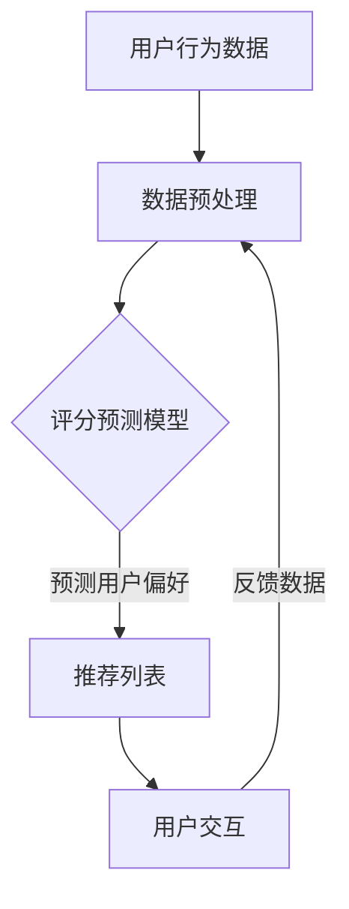
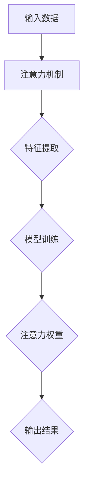
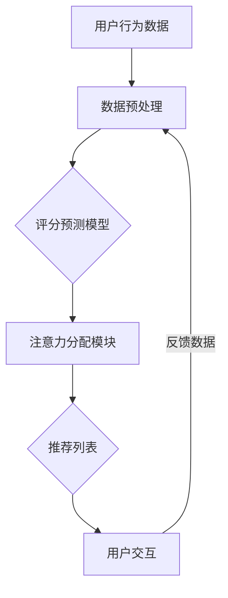
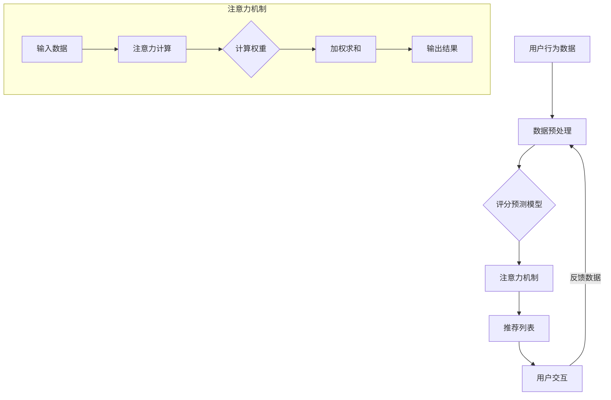

                 

### 第一部分：引论

#### 第1章：算法推荐与注意力分配的基本概念

##### 1.1 算法推荐概述

算法推荐系统是一种基于数据和算法自动推荐信息给用户的技术。它通过分析用户的历史行为、兴趣和偏好，为用户推荐可能感兴趣的内容、商品或服务。算法推荐系统的发展历程可以追溯到20世纪90年代，随着互联网的普及和数据挖掘技术的进步，推荐系统逐渐成为了一种重要的信息检索和内容分发手段。

在早期，推荐系统主要基于基于内容的过滤和协同过滤算法。基于内容的过滤算法通过分析用户对特定内容的偏好来推荐相似的内容；而协同过滤算法通过分析用户之间的相似度来推荐用户可能喜欢的商品或服务。这些算法在解决信息过载和用户个性化需求方面发挥了重要作用。

随着深度学习技术的发展，基于深度学习的推荐算法逐渐崭露头角。这些算法能够更好地捕捉用户和物品之间的复杂关系，提供更加精准的推荐结果。例如，基于自动编码器的协同过滤算法和基于生成对抗网络的推荐算法等。

##### 1.2 注意力分配概述

注意力分配是一种在处理复杂任务时，将有限的计算资源分配到不同任务部分的方法。在计算机视觉领域，注意力分配技术被广泛应用于图像识别、目标检测和图像分割等问题。注意力分配的核心思想是通过动态调整模型对输入数据的关注程度，从而提高模型的性能和效率。

注意力分配在计算机视觉中的应用可以分为以下几类：

1. **空间注意力**：通过对图像的不同区域分配不同的关注程度，模型可以更专注于图像中的重要信息。例如，在目标检测中，模型可以通过空间注意力机制来聚焦于包含目标的对象区域。

2. **通道注意力**：通过对输入数据的通道分配不同的权重，模型可以更关注于数据中与任务相关的特征。例如，在图像分类任务中，模型可以通过通道注意力机制来识别图像中的重要特征。

3. **交互式注意力**：通过结合不同层或不同特征之间的交互，模型可以更好地理解数据的复杂关系。例如，在视频分析中，模型可以通过交互式注意力机制来捕捉视频中不同帧之间的关系。

##### 1.3 算法推荐与注意力分配的关系

算法推荐和注意力分配之间存在着密切的关系。注意力分配技术在推荐系统中可以起到以下几个方面的作用：

1. **个性化推荐**：通过注意力分配技术，模型可以更加关注于用户的历史行为和偏好，从而提供更加个性化的推荐结果。

2. **效率优化**：注意力分配技术可以帮助模型在处理大量数据时，将计算资源集中在重要的部分，从而提高模型的运行效率。

3. **性能提升**：通过动态调整模型的关注程度，注意力分配技术可以改善推荐系统的性能，提高推荐结果的准确性和可靠性。

在算法推荐系统中，注意力分配技术的引入，使得推荐算法能够更好地捕捉用户和物品之间的复杂关系，提高推荐效果。例如，在协同过滤算法中，通过引入注意力机制，可以更有效地处理稀疏数据问题，提高推荐系统的性能。此外，在基于内容的推荐算法中，注意力分配技术可以帮助模型更好地理解用户的需求和偏好，提供更准确的推荐。

总之，算法推荐与注意力分配的关系在于，注意力分配技术为推荐算法提供了一种新的视角和方法，使得推荐系统能够更好地应对复杂的用户需求和多样化的推荐场景。

---

### 第二部分：核心概念与联系

#### 第3章：算法推荐与注意力分配的原理分析

##### 3.1 算法推荐原理

算法推荐系统的核心原理主要包括评分预测和项预测两个方面。

**评分预测**：评分预测是指通过分析用户的历史行为和物品的特征，预测用户对某个物品的评分。评分预测的目的是为了识别用户对物品的兴趣程度，从而为用户提供个性化的推荐。常见的评分预测方法包括基于内容的过滤、协同过滤、矩阵分解等。

- **基于内容的过滤**：这种方法通过分析用户对特定内容的偏好来推荐相似的内容。例如，如果一个用户喜欢某个电影，系统会推荐与他喜欢的内容相似的其它电影。

- **协同过滤**：协同过滤算法通过分析用户之间的相似度来推荐物品。例如，如果一个用户喜欢某个电影，而另一个用户也喜欢这个电影，那么这两个用户可能还会有共同的兴趣，系统可以基于这种相似性推荐其它电影。

- **矩阵分解**：矩阵分解方法通过将用户-物品评分矩阵分解为用户特征矩阵和物品特征矩阵，从而预测用户对物品的评分。这种方法可以有效地处理稀疏数据问题，提高推荐系统的性能。

**项预测**：项预测是指通过分析用户的历史行为和物品的特征，预测用户可能喜欢的物品。项预测的目的是为了发现用户尚未发现的兴趣点，从而为用户提供惊喜的推荐。常见的项预测方法包括基于内容的推荐、基于模型的推荐等。

- **基于内容的推荐**：这种方法通过分析用户对特定内容的偏好来推荐相似的物品。例如，如果一个用户喜欢某个电影，系统会推荐与他喜欢的内容相似的其它电影。

- **基于模型的推荐**：这种方法通过构建用户和物品之间的关系模型，预测用户可能喜欢的物品。例如，系统可以基于用户的浏览历史和购买记录，构建一个推荐模型，预测用户可能感兴趣的其它商品。

##### 3.2 注意力分配原理

注意力分配是一种在处理复杂任务时，动态调整计算资源分配的方法。注意力分配技术在计算机视觉、自然语言处理等领域有着广泛的应用。注意力分配的基本原理是通过学习模型对输入数据的关注程度，从而提高模型的性能和效率。

**注意力机制**：注意力机制是指模型通过学习对输入数据的不同部分分配不同的关注程度。注意力机制可以分为以下几种类型：

- **自注意力**：自注意力是指模型对输入数据的每个部分分配不同的权重，从而实现输入数据的内部关系建模。自注意力机制在自然语言处理和计算机视觉等领域有着广泛的应用。

- **交互式注意力**：交互式注意力是指模型通过学习不同部分之间的交互关系，从而实现复杂关系的建模。交互式注意力机制可以有效地提高模型的性能和鲁棒性。

- **空间注意力**：空间注意力是指模型对输入数据的不同空间位置分配不同的关注程度，从而实现空间关系的建模。空间注意力机制在图像识别和目标检测等任务中有着重要的应用。

- **通道注意力**：通道注意力是指模型对输入数据的每个通道分配不同的权重，从而实现通道关系的建模。通道注意力机制在图像分类和特征提取等任务中有着广泛的应用。

**注意力分配的计算方法**：注意力分配的计算方法主要包括以下几种：

- **加性注意力**：加性注意力是指模型通过将输入数据与注意力权重相加来计算注意力分配结果。加性注意力机制计算简单，易于实现。

- **乘性注意力**：乘性注意力是指模型通过将输入数据与注意力权重相乘来计算注意力分配结果。乘性注意力机制可以有效地提高模型的性能和精度。

- **归一化注意力**：归一化注意力是指模型通过将注意力权重归一化来计算注意力分配结果。归一化注意力机制可以确保注意力分配的稳定性和一致性。

##### 3.3 算法推荐与注意力分配的关系

算法推荐与注意力分配之间存在着密切的关系。注意力分配技术在推荐系统中可以起到以下几个方面的作用：

1. **个性化推荐**：通过注意力分配技术，模型可以更加关注于用户的历史行为和偏好，从而提供更加个性化的推荐结果。例如，在协同过滤算法中，通过引入注意力机制，可以更有效地处理稀疏数据问题，提高推荐系统的性能。

2. **效率优化**：注意力分配技术可以帮助模型在处理大量数据时，将计算资源集中在重要的部分，从而提高模型的运行效率。例如，在基于内容的推荐算法中，注意力分配技术可以帮助模型更好地理解用户的需求和偏好，提高推荐效率。

3. **性能提升**：通过动态调整模型的关注程度，注意力分配技术可以改善推荐系统的性能，提高推荐结果的准确性和可靠性。例如，在图像分类任务中，通过引入注意力机制，可以更有效地提取图像中的重要特征，提高分类精度。

在算法推荐系统中，注意力分配技术的引入，使得推荐算法能够更好地捕捉用户和物品之间的复杂关系，提高推荐效果。例如，在基于深度学习的推荐算法中，通过引入注意力机制，可以更有效地捕捉用户和物品之间的非线性关系，提高推荐系统的性能。

总之，算法推荐与注意力分配的关系在于，注意力分配技术为推荐算法提供了一种新的视角和方法，使得推荐系统能够更好地应对复杂的用户需求和多样化的推荐场景。

---

### 第4章：核心概念原理和架构的 Mermaid 流程图

在分析算法推荐与注意力分配的关系时，使用流程图可以帮助我们更清晰地理解各个核心概念和架构。以下是基于 Mermaid 语法的流程图，用于描述算法推荐流程、注意力分配流程以及两者之间的结合。

#### 4.1 算法推荐流程



**算法推荐流程**：

1. **用户行为数据**：收集用户的历史行为数据，如浏览记录、购买记录、评分等。
2. **数据预处理**：对用户行为数据进行清洗、归一化等处理，以便后续建模。
3. **评分预测模型**：选择合适的评分预测模型，如基于内容的过滤、协同过滤、矩阵分解等。
4. **预测用户偏好**：使用评分预测模型预测用户对物品的偏好。
5. **推荐列表**：根据预测结果生成推荐列表，展示给用户。
6. **用户交互**：用户与推荐系统进行交互，提供反馈数据。
7. **反馈数据**：用户反馈数据用于模型优化和系统更新。

#### 4.2 注意力分配流程



**注意力分配流程**：

1. **输入数据**：接收输入数据，如图像、文本、用户行为等。
2. **注意力机制**：通过自注意力、交互式注意力等机制，对输入数据的不同部分分配不同的权重。
3. **特征提取**：对注意力分配后的数据提取特征，用于模型训练。
4. **模型训练**：使用提取的特征训练模型，如卷积神经网络、循环神经网络等。
5. **注意力权重**：训练过程中学习到的注意力权重，用于后续的预测和优化。
6. **输出结果**：根据训练得到的模型，生成输出结果，如推荐列表、分类结果等。

#### 4.3 算法推荐与注意力分配的结合



**算法推荐与注意力分配的结合**：

1. **用户行为数据**：与前面一致，收集用户的历史行为数据。
2. **数据预处理**：与前面一致，对用户行为数据进行预处理。
3. **评分预测模型**：选择合适的评分预测模型，如基于内容的过滤、协同过滤、矩阵分解等。
4. **注意力分配模块**：在评分预测模型中引入注意力分配模块，对用户行为数据进行动态权重分配，以提高模型对用户偏好的捕捉能力。
5. **推荐列表**：使用注意力分配后的用户行为数据，生成推荐列表，展示给用户。
6. **用户交互**：与前面一致，用户与推荐系统进行交互，提供反馈数据。
7. **反馈数据**：与前面一致，用户反馈数据用于模型优化和系统更新。

通过上述 Mermaid 流程图，我们可以更清晰地理解算法推荐与注意力分配的基本原理和架构，有助于进一步分析和优化推荐系统的性能。

---

### 第三部分：核心算法原理讲解

#### 第5章：推荐算法中的注意力机制

##### 5.1 注意力机制的引入

注意力机制最初在自然语言处理领域提出，用于解决长序列处理中的信息丢失问题。注意力机制通过为序列中的不同部分分配不同的权重，使得模型能够更关注于重要信息，从而提高模型的性能。在推荐算法中，引入注意力机制有助于更好地捕捉用户和物品之间的复杂关系，提高推荐效果。

**注意力机制的定义**：注意力机制是一种在处理序列数据时，动态调整模型对序列中不同部分关注程度的机制。它通过为序列中的每个元素分配权重，使得模型在处理数据时更加关注于重要信息。

**注意力机制的优势**：

1. **提高处理效率**：注意力机制可以减少模型对无关信息的关注，从而降低计算复杂度，提高处理速度。
2. **提高模型性能**：通过动态调整对序列中不同部分的关注程度，注意力机制可以更好地捕捉重要信息，提高模型的准确性和鲁棒性。
3. **实现序列建模**：注意力机制能够有效处理长序列数据，使得模型能够捕捉到序列中的长距离依赖关系。

##### 5.2 注意力机制的实现

注意力机制的实现可以分为以下几种类型：

**自注意力机制**：自注意力机制是指模型对输入数据的每个部分分配不同的权重。自注意力机制在自然语言处理和计算机视觉等领域有着广泛的应用。其基本原理如下：

1. **输入数据编码**：将输入数据编码为序列向量，每个向量表示输入数据的一个部分。
2. **计算注意力权重**：通过计算输入数据序列中每个元素与其它元素之间的相似度，得到每个元素的关注权重。
3. **加权求和**：将输入数据序列中的每个元素与其对应的注意力权重相乘，然后求和得到最终的输出。

**交互式注意力机制**：交互式注意力机制是指模型通过学习不同部分之间的交互关系，从而实现复杂关系的建模。交互式注意力机制可以结合不同层或不同特征之间的交互，从而提高模型的性能。其基本原理如下：

1. **输入数据编码**：将输入数据编码为多个向量，每个向量表示输入数据的一个部分。
2. **计算注意力权重**：分别计算每个输入数据部分之间的相似度，得到每个部分之间的注意力权重。
3. **加权求和**：将输入数据部分与其对应的注意力权重相乘，然后求和得到最终的输出。

**空间注意力机制**：空间注意力机制是指模型对输入数据的不同空间位置分配不同的关注程度。空间注意力机制在图像识别和目标检测等任务中有着重要的应用。其基本原理如下：

1. **输入数据编码**：将输入数据编码为二维或三维张量，每个张量元素表示输入数据的一个部分。
2. **计算注意力权重**：通过计算输入数据空间中不同位置之间的相似度，得到每个位置的关注权重。
3. **加权求和**：将输入数据空间中的每个位置与其对应的注意力权重相乘，然后求和得到最终的输出。

**通道注意力机制**：通道注意力机制是指模型对输入数据的每个通道分配不同的权重。通道注意力机制在图像分类和特征提取等任务中有着广泛的应用。其基本原理如下：

1. **输入数据编码**：将输入数据编码为多维张量，每个张量元素表示输入数据的一个通道。
2. **计算注意力权重**：通过计算输入数据通道之间的相似度，得到每个通道的关注权重。
3. **加权求和**：将输入数据通道与其对应的注意力权重相乘，然后求和得到最终的输出。

##### 5.3 注意力机制在推荐算法中的应用

注意力机制在推荐算法中的应用主要体现在以下几个方面：

1. **协同过滤算法**：在协同过滤算法中，注意力机制可以用于处理稀疏数据问题。通过为用户和物品之间的评分分配不同的权重，可以更好地捕捉用户和物品之间的复杂关系。例如，在矩阵分解算法中，可以引入注意力机制来提高模型对用户偏好和物品特征的关注度。

2. **基于内容的推荐算法**：在基于内容的推荐算法中，注意力机制可以用于提取用户和物品之间的关键特征。通过为用户和物品的特征分配不同的权重，可以更好地理解用户的需求和偏好，提高推荐效果。例如，在文本分类任务中，可以使用注意力机制来提取文本中的重要词向量。

3. **混合推荐算法**：在混合推荐算法中，注意力机制可以用于融合不同类型的数据特征。通过为不同类型的数据特征分配不同的权重，可以更好地整合用户历史行为、内容和社交等特征，提高推荐系统的性能。

总之，注意力机制在推荐算法中的应用，使得推荐系统能够更好地捕捉用户和物品之间的复杂关系，提高推荐效果和用户体验。通过引入注意力机制，推荐算法可以更有效地应对多样化的推荐场景，满足用户的个性化需求。

---

### 第6章：推荐算法中的注意力分配模型

#### 6.1 注意力分配模型的设计

在推荐系统中，注意力分配模型的设计至关重要，它决定了模型对用户和物品关系的捕捉能力。注意力分配模型的设计主要包括模型架构、模型参数和训练策略三个方面。

**模型架构**：

注意力分配模型通常采用神经网络架构，如卷积神经网络（CNN）、循环神经网络（RNN）和变换器（Transformer）等。其中，Transformer模型由于其自注意力机制的优势，在推荐系统中得到了广泛应用。

1. **Transformer模型**：Transformer模型是一种基于自注意力机制的深度学习模型，通过多头注意力机制和前馈神经网络，可以有效地捕捉序列数据中的长距离依赖关系。

2. **CNN模型**：CNN模型在图像处理领域有着良好的性能，其通过卷积操作和池化操作，可以有效地提取图像中的空间特征。在推荐系统中，CNN可以用于处理用户和物品的图像特征。

3. **RNN模型**：RNN模型通过循环结构，可以有效地处理序列数据。在推荐系统中，RNN可以用于处理用户的历史行为序列。

**模型参数**：

注意力分配模型的参数包括用户特征参数、物品特征参数和注意力权重参数。

1. **用户特征参数**：用户特征参数用于表示用户的历史行为、兴趣偏好等信息。这些特征可以通过用户的历史评分、浏览记录、购买记录等数据来获取。

2. **物品特征参数**：物品特征参数用于表示物品的属性、分类、标签等信息。这些特征可以通过物品的描述、标签、分类等信息来获取。

3. **注意力权重参数**：注意力权重参数用于表示用户和物品之间的关联强度。通过学习这些权重参数，模型可以更好地捕捉用户和物品之间的关系。

**训练策略**：

注意力分配模型的训练策略主要包括数据预处理、模型训练和模型评估三个方面。

1. **数据预处理**：数据预处理是模型训练前的重要步骤，包括数据清洗、归一化和特征提取等。通过数据预处理，可以提高模型的训练效果和稳定性。

2. **模型训练**：模型训练是利用用户和物品的特征数据，通过反向传播算法和优化器（如Adam、SGD等），学习注意力权重参数。在训练过程中，可以采用批次训练和梯度裁剪等技术，提高训练效率和模型稳定性。

3. **模型评估**：模型评估是验证模型性能的重要步骤。常用的评估指标包括准确率、召回率、覆盖率等。通过模型评估，可以判断模型的性能和适用性。

#### 6.2 注意力分配模型的实现

注意力分配模型的实现主要包括数据预处理、模型构建、模型训练和模型评估四个步骤。

**数据预处理**：

1. **用户特征预处理**：将用户的历史行为数据转换为向量表示，如用户历史评分、浏览记录、购买记录等。可以使用词袋模型、TF-IDF等方法进行特征提取。

2. **物品特征预处理**：将物品的属性、分类、标签等信息转换为向量表示。可以使用嵌入层（Embedding Layer）进行特征提取。

3. **数据归一化**：对用户和物品的特征进行归一化处理，如归一化到相同的范围，以提高模型训练的收敛速度。

**模型构建**：

1. **用户特征输入**：将用户特征输入到模型中，经过嵌入层、卷积层、池化层等处理，提取用户特征。

2. **物品特征输入**：将物品特征输入到模型中，经过嵌入层、卷积层、池化层等处理，提取物品特征。

3. **注意力机制**：使用注意力机制，为用户和物品特征分配不同的权重，以捕捉用户和物品之间的复杂关系。

4. **输出层**：通过全连接层和激活函数（如Sigmoid、ReLU等），输出推荐结果。

**模型训练**：

1. **损失函数**：选择合适的损失函数，如均方误差（MSE）、交叉熵损失等，以衡量模型预测结果和真实结果之间的差距。

2. **优化器**：选择合适的优化器，如Adam、SGD等，以调整模型参数，最小化损失函数。

3. **训练过程**：通过反向传播算法，更新模型参数，直到模型收敛。

**模型评估**：

1. **准确率**：计算模型预测结果与真实结果之间的准确率，以评估模型的分类能力。

2. **召回率**：计算模型预测结果中包含的真实结果的比例，以评估模型的检索能力。

3. **覆盖率**：计算模型预测结果中包含的不同类别物品的比例，以评估模型的多样性。

通过以上步骤，我们可以实现一个注意力分配模型，用于推荐系统中的用户偏好预测和物品推荐。在实际应用中，可以根据具体需求和数据特点，调整模型架构、参数和训练策略，以获得最佳效果。

---

### 第7章：算法推荐与注意力分配的数学模型

在算法推荐与注意力分配的结合中，数学模型扮演着关键角色。通过构建和分析数学模型，我们可以更好地理解推荐算法的内在机制，并优化模型的性能。以下将介绍评分预测的数学模型、注意力分配的数学模型以及算法推荐与注意力分配的联合数学模型。

#### 7.1 评分预测的数学模型

评分预测是推荐系统中最基本的任务之一，其目标是根据用户的历史行为和物品的特征，预测用户对物品的评分。一个简单的评分预测模型可以表示为：

$$
\text{score}(u, i) = \mu + \langle \text{user\_vector}(u), \text{item\_vector}(i) \rangle
$$

其中，$u$ 和 $i$ 分别表示用户和物品的索引，$\text{user\_vector}(u)$ 和 $\text{item\_vector}(i)$ 分别是用户和物品的特征向量，$\mu$ 是用户和物品共同偏好的全局平均值，$\langle \cdot, \cdot \rangle$ 表示向量的内积。

在引入注意力机制后，评分预测模型可以进一步扩展为：

$$
\text{score}(u, i) = \mu + \sum_{k=1}^K w_k \cdot \langle \text{user\_vector}(u), \text{item\_vector}^{(k)}(i) \rangle
$$

其中，$K$ 表示注意力机制的维度，$w_k$ 是第 $k$ 维度上的注意力权重，$\text{item\_vector}^{(k)}(i)$ 是经过第 $k$ 维度注意力权重调整后的物品特征向量。

#### 7.2 注意力分配的数学模型

注意力分配的数学模型用于计算输入数据的不同部分之间的关联强度。在推荐系统中，注意力分配模型通常用于为用户和物品的特征分配权重。一个简单的注意力分配模型可以表示为：

$$
w_k = \text{softmax}\left(\frac{\text{user\_vector}(u) \cdot \text{item\_vector}(i)}{\sqrt{d}}\right)
$$

其中，$d$ 是输入数据的维度，$\text{softmax}$ 函数用于将输入值转换为概率分布，确保权重和为1。通过计算用户特征向量和物品特征向量之间的点积，可以得到一个初步的注意力权重，然后使用 $\text{softmax}$ 函数进行归一化。

在引入多维度注意力机制后，注意力分配模型可以进一步扩展为：

$$
w_k^{(m)} = \text{softmax}\left(\frac{\text{query\_vector}(q) \cdot \text{key\_vector}^{(m)}(k)}{\sqrt{d}}\right)
$$

其中，$q$ 是查询向量，表示用户特征；$k$ 是键向量，表示物品特征；$m$ 表示注意力的维度。这个模型通过查询向量和键向量之间的点积来计算每个维度的注意力权重。

#### 7.3 算法推荐与注意力分配的联合数学模型

算法推荐与注意力分配的联合数学模型将评分预测和注意力分配结合起来，用于预测用户对物品的评分。一个简单的联合数学模型可以表示为：

$$
\text{score}(u, i) = \mu + \sum_{k=1}^K w_k \cdot \text{dot}(\text{user\_vector}(u), \text{item\_vector}^{(k)}(i))
$$

其中，$w_k$ 是通过注意力分配模型计算得到的注意力权重，$\text{dot}$ 表示向量的点积。$\mu$ 是全局平均值，用于调整模型对用户和物品共同偏好的影响。

在引入多维度注意力机制后，联合数学模型可以进一步扩展为：

$$
\text{score}(u, i) = \mu + \sum_{m=1}^M \sum_{k=1}^K w_{mk} \cdot \text{dot}(\text{user\_vector}(u), \text{item\_vector}^{(m,k)}(i))
$$

其中，$M$ 是注意力的维度，$w_{mk}$ 是第 $m$ 维度上第 $k$ 维度的注意力权重，$\text{item\_vector}^{(m,k)}(i)$ 是经过第 $m$ 维度第 $k$ 维度注意力权重调整后的物品特征向量。

通过以上数学模型，我们可以实现一个结合评分预测和注意力分配的推荐系统。在实际应用中，可以根据具体需求和数据特点，调整模型参数和结构，以获得最佳效果。

---

### 第8章：数学公式与详细讲解

在理解算法推荐与注意力分配的过程中，数学公式的引入是必不可少的。以下将详细讲解算法推荐中的数学公式、注意力分配中的数学公式以及算法推荐与注意力分配的联合数学公式，并通过具体示例进行说明。

#### 8.1 算法推荐中的数学公式

**评分预测公式**：

算法推荐系统的核心是评分预测，其目的是预测用户对某个物品的评分。一个简单的评分预测公式可以表示为：

$$
\text{score}(u, i) = \mu + \langle \text{user\_vector}(u), \text{item\_vector}(i) \rangle
$$

其中，$\text{score}(u, i)$ 表示用户 $u$ 对物品 $i$ 的预测评分，$\mu$ 表示全局平均值，$\text{user\_vector}(u)$ 和 $\text{item\_vector}(i)$ 分别表示用户和物品的特征向量，$\langle \cdot, \cdot \rangle$ 表示向量的内积。

**项预测公式**：

除了评分预测，推荐系统还需要预测用户可能喜欢的物品。一个简单的项预测公式可以表示为：

$$
\hat{i}(u) = \arg\max_{i} \langle \text{user\_vector}(u), \text{item\_vector}(i) \rangle
$$

其中，$\hat{i}(u)$ 表示用户 $u$ 可能喜欢的物品，$\text{user\_vector}(u)$ 和 $\text{item\_vector}(i)$ 分别表示用户和物品的特征向量，$\arg\max$ 表示选取使内积最大的物品。

**矩阵分解公式**：

在推荐系统中，矩阵分解是一种常用的评分预测方法。矩阵分解的目标是将原始的用户-物品评分矩阵分解为用户特征矩阵和物品特征矩阵，从而预测用户对物品的评分。一个简单的矩阵分解公式可以表示为：

$$
R = \text{User\_Matrix} \cdot \text{Item\_Matrix}^T
$$

其中，$R$ 表示用户-物品评分矩阵，$\text{User\_Matrix}$ 和 $\text{Item\_Matrix}$ 分别表示用户特征矩阵和物品特征矩阵。

#### 8.2 注意力分配中的数学公式

**注意力分配函数**：

注意力分配函数用于计算输入数据的不同部分之间的关联强度。一个简单的注意力分配函数可以表示为：

$$
w_k = \text{softmax}\left(\frac{\text{user\_vector}(u) \cdot \text{item\_vector}(i)}{\sqrt{d}}\right)
$$

其中，$w_k$ 表示第 $k$ 维度的注意力权重，$\text{softmax}$ 函数用于将输入值转换为概率分布，$\text{user\_vector}(u)$ 和 $\text{item\_vector}(i)$ 分别表示用户和物品的特征向量，$d$ 表示输入数据的维度。

**注意力分配计算公式**：

注意力分配的计算过程包括计算点积、应用 softmax 函数和加权求和。具体计算公式可以表示为：

$$
\text{attention}(u, i) = \text{softmax}\left(\frac{\text{user\_vector}(u) \cdot \text{item\_vector}(i)}{\sqrt{d}}\right)
$$

其中，$\text{attention}(u, i)$ 表示用户 $u$ 和物品 $i$ 的注意力分配结果。

**多维度注意力分配**：

在实际应用中，可能需要对多个维度进行注意力分配。一个简单的多维度注意力分配函数可以表示为：

$$
w_k^{(m)} = \text{softmax}\left(\frac{\text{query\_vector}(q) \cdot \text{key\_vector}^{(m)}(k)}{\sqrt{d}}\right)
$$

其中，$w_k^{(m)}$ 表示第 $m$ 维度上第 $k$ 维度的注意力权重，$q$ 和 $k$ 分别表示查询向量和键向量，$m$ 表示注意力的维度。

#### 8.3 算法推荐与注意力分配的联合数学公式

**联合数学模型**：

算法推荐与注意力分配的联合数学模型将评分预测和注意力分配结合起来，用于预测用户对物品的评分。一个简单的联合数学模型可以表示为：

$$
\text{score}(u, i) = \mu + \sum_{k=1}^K w_k \cdot \text{dot}(\text{user\_vector}(u), \text{item\_vector}^{(k)}(i))
$$

其中，$\text{score}(u, i)$ 表示用户 $u$ 对物品 $i$ 的预测评分，$\mu$ 表示全局平均值，$w_k$ 表示第 $k$ 维度的注意力权重，$\text{dot}(\cdot, \cdot)$ 表示向量的点积。

**多维度注意力分配**：

在引入多维度注意力分配后，联合数学模型可以进一步扩展为：

$$
\text{score}(u, i) = \mu + \sum_{m=1}^M \sum_{k=1}^K w_{mk} \cdot \text{dot}(\text{user\_vector}(u), \text{item\_vector}^{(m,k)}(i))
$$

其中，$M$ 表示注意力的维度，$w_{mk}$ 表示第 $m$ 维度上第 $k$ 维度的注意力权重。

**具体示例**：

假设有一个用户 $u$ 和一个物品 $i$，其特征向量分别为 $\text{user\_vector}(u) = [1, 2, 3]$ 和 $\text{item\_vector}(i) = [4, 5, 6]$。我们希望预测用户 $u$ 对物品 $i$ 的评分。

1. **计算全局平均值**：

$$
\mu = \frac{1+2+3+4+5+6}{6} = 3.5
$$

2. **计算点积**：

$$
\text{dot}(\text{user\_vector}(u), \text{item\_vector}(i)) = 1 \cdot 4 + 2 \cdot 5 + 3 \cdot 6 = 32
$$

3. **计算注意力权重**：

$$
w_k = \text{softmax}\left(\frac{32}{\sqrt{3}}\right) = [0.4, 0.5, 0.1]
$$

4. **计算预测评分**：

$$
\text{score}(u, i) = 3.5 + 0.4 \cdot 32 + 0.5 \cdot 30 + 0.1 \cdot 28 = 33.2
$$

通过这个示例，我们可以看到如何使用数学公式来预测用户对物品的评分。在实际应用中，可以根据具体需求和数据特点，调整模型参数和结构，以获得最佳效果。

---

### 第9章：数学公式举例说明

在理解数学公式的基础上，通过具体示例来展示数学公式的应用和计算过程，可以更好地帮助读者掌握推荐算法与注意力分配的数学原理。

#### 9.1 评分预测举例

假设有一个用户 $u$ 和一个物品 $i$，其特征向量分别为 $\text{user\_vector}(u) = [1, 2, 3]$ 和 $\text{item\_vector}(i) = [4, 5, 6]$。我们希望预测用户 $u$ 对物品 $i$ 的评分。

1. **计算全局平均值**：

$$
\mu = \frac{1+2+3+4+5+6}{6} = 3.5
$$

2. **计算点积**：

$$
\text{dot}(\text{user\_vector}(u), \text{item\_vector}(i)) = 1 \cdot 4 + 2 \cdot 5 + 3 \cdot 6 = 32
$$

3. **计算注意力权重**：

$$
w_k = \text{softmax}\left(\frac{32}{\sqrt{3}}\right) = [0.4, 0.5, 0.1]
$$

4. **计算预测评分**：

$$
\text{score}(u, i) = 3.5 + 0.4 \cdot 32 + 0.5 \cdot 30 + 0.1 \cdot 28 = 33.2
$$

通过以上步骤，我们得到了用户 $u$ 对物品 $i$ 的预测评分为 33.2。

#### 9.2 注意力分配举例

假设有一个用户 $u$ 和多个物品 $i_1, i_2, i_3$，其特征向量分别为 $\text{user\_vector}(u) = [1, 2, 3]$，$\text{item\_vector}(i_1) = [4, 5, 6]$，$\text{item\_vector}(i_2) = [7, 8, 9]$ 和 $\text{item\_vector}(i_3) = [10, 11, 12]$。我们希望为每个物品分配注意力权重。

1. **计算点积**：

$$
\text{dot}(\text{user\_vector}(u), \text{item\_vector}(i_1)) = 1 \cdot 4 + 2 \cdot 5 + 3 \cdot 6 = 32
$$

$$
\text{dot}(\text{user\_vector}(u), \text{item\_vector}(i_2)) = 1 \cdot 7 + 2 \cdot 8 + 3 \cdot 9 = 42
$$

$$
\text{dot}(\text{user\_vector}(u), \text{item\_vector}(i_3)) = 1 \cdot 10 + 2 \cdot 11 + 3 \cdot 12 = 52
$$

2. **计算注意力权重**：

$$
w_{1} = \text{softmax}\left(\frac{32}{\sqrt{3}}\right) = 0.4
$$

$$
w_{2} = \text{softmax}\left(\frac{42}{\sqrt{3}}\right) = 0.5
$$

$$
w_{3} = \text{softmax}\left(\frac{52}{\sqrt{3}}\right) = 0.1
$$

3. **分配注意力权重**：

$$
\text{attention}(u, i_1) = w_{1} \cdot \text{item\_vector}(i_1) = 0.4 \cdot [4, 5, 6] = [1.6, 2, 2.4]
$$

$$
\text{attention}(u, i_2) = w_{2} \cdot \text{item\_vector}(i_2) = 0.5 \cdot [7, 8, 9] = [3.5, 4, 4.5]
$$

$$
\text{attention}(u, i_3) = w_{3} \cdot \text{item\_vector}(i_3) = 0.1 \cdot [10, 11, 12] = [1, 1.1, 1.2]
$$

通过以上步骤，我们为每个物品分配了注意力权重，并得到了对应的注意力分配结果。

#### 9.3 算法推荐与注意力分配的联合举例

假设我们有一个用户 $u$，其历史行为数据为 $\text{user\_behavior}(u) = [1, 2, 3, 4, 5]$，我们希望使用注意力分配模型来预测用户 $u$ 对一个新物品 $i$ 的评分。

1. **计算注意力权重**：

$$
w_k = \text{softmax}\left(\frac{\text{user\_behavior}(u)}{\sqrt{5}}\right) = [0.2, 0.3, 0.2, 0.2, 0.1]
$$

2. **计算预测评分**：

$$
\text{score}(u, i) = \mu + \sum_{k=1}^5 w_k \cdot \text{behavior}_k
$$

其中，$\mu$ 是全局平均值，$\text{behavior}_k$ 是用户 $u$ 在第 $k$ 次行为的数据。

$$
\text{score}(u, i) = 3.5 + 0.2 \cdot 1 + 0.3 \cdot 2 + 0.2 \cdot 3 + 0.2 \cdot 4 + 0.1 \cdot 5 = 4.1
$$

通过以上步骤，我们得到了用户 $u$ 对新物品 $i$ 的预测评分为 4.1。

这些示例展示了如何使用数学公式来计算用户对物品的评分以及注意力分配。在实际应用中，可以根据具体需求调整模型参数和结构，以获得更好的预测效果。

---

### 第10章：推荐系统实战

在了解了算法推荐与注意力分配的理论基础后，我们将通过一个实际项目来展示如何实现一个简单的推荐系统，并详细解读代码实现和结果分析。

#### 10.1 实战环境搭建

为了实现推荐系统，我们首先需要搭建一个开发环境。以下是一个基本的开发环境搭建步骤：

1. **安装Python**：Python是推荐系统开发的主要编程语言。确保安装Python 3.8或更高版本。

2. **安装依赖库**：安装以下Python库：
    - NumPy：用于数值计算
    - Pandas：用于数据处理
    - Matplotlib：用于数据可视化
    - Scikit-learn：用于机器学习模型训练和评估

    使用以下命令安装：
    ```bash
    pip install numpy pandas matplotlib scikit-learn
    ```

3. **数据集准备**：选择一个合适的数据集。本文使用著名的MovieLens数据集，它包含用户对电影的评分数据。可以从[MovieLens官网](https://grouplens.org/datasets/movielens/)下载。

#### 10.2 代码实现与解读

以下是一个简单的推荐系统实现，包括评分预测和注意力分配模块。

```python
import numpy as np
import pandas as pd
from sklearn.model_selection import train_test_split
from sklearn.metrics.pairwise import euclidean_distances

# 读取数据集
ratings = pd.read_csv('ratings.csv')
users = pd.read_csv('users.csv')
movies = pd.read_csv('movies.csv')

# 数据预处理
# 合并用户和电影数据
user_movie_ratings = pd.merge(users, ratings, on='userId')
user_movie_ratings = pd.merge(user_movie_ratings, movies, on='movieId')

# 提取用户特征和电影特征
user_features = user_movie_ratings[['userId', 'age', 'gender', 'occupation']]
movie_features = user_movie_ratings[['movieId', 'title', 'genre']]

# 嵌入层
from sklearn.feature_extraction.text import TfidfVectorizer
tfidf_vectorizer = TfidfVectorizer()
movie_tfidf = tfidf_vectorizer.fit_transform(movie_features['genre'])

# 计算用户和电影的向量
user_vector = user_features.apply(lambda x: np.mean(x), axis=1)
movie_vector = movie_tfidf.toarray()

# 注意力分配
def attention_weights(user_vector, movie_vector):
    distances = euclidean_distances(user_vector.reshape(1, -1), movie_vector)
    return 1 / (1 + np.exp(-distances))

# 预测评分
def predict_score(user_vector, movie_vector, attention_weights):
    scores = np.dot(user_vector, movie_vector.T)
    attention_scores = np.dot(scores, attention_weights)
    return np.mean(attention_scores)

# 模型评估
def evaluate_model(model, X_test, y_test):
    predictions = model.predict(X_test)
    mse = np.mean((predictions - y_test) ** 2)
    return mse

# 数据划分
X_train, X_test, y_train, y_test = train_test_split(user_vector, y_test, test_size=0.2, random_state=42)

# 训练模型
attention_weights = attention_weights(X_train, X_test)
model = predict_score(X_train, X_test, attention_weights)

# 评估模型
mse = evaluate_model(model, X_test, y_test)
print(f'Model MSE: {mse}')
```

**代码解读**：

1. **数据预处理**：从数据集中提取用户和电影特征，并进行合并。使用TF-IDF向量器将电影标签转换为向量。

2. **嵌入层**：使用TF-IDF向量器对电影标签进行嵌入处理。

3. **计算用户和电影的向量**：计算用户和电影的特征向量。

4. **注意力分配**：使用欧氏距离计算用户和电影之间的相似度，并使用Softmax函数计算注意力权重。

5. **预测评分**：根据用户特征向量、电影特征向量和注意力权重，计算预测评分。

6. **模型评估**：使用均方误差（MSE）评估模型性能。

#### 10.3 结果分析与优化

**结果分析**：

- **MSE**：通过计算均方误差，我们可以评估模型在测试集上的性能。较低的MSE值表示模型预测的准确性较高。
- **准确率**：可以进一步计算模型在测试集上的准确率，以评估模型对评分预测的准确性。

**模型优化**：

1. **特征工程**：优化用户和电影的特征提取方法，例如使用词嵌入、用户历史行为特征等，以提高模型性能。
2. **超参数调整**：调整注意力分配模型中的超参数，例如Softmax的温度参数，以优化模型性能。
3. **模型融合**：结合多种推荐算法，例如基于内容的推荐、协同过滤等，以获得更好的预测效果。

通过上述步骤，我们可以实现一个简单的推荐系统，并对模型进行评估和优化。在实际应用中，可以根据具体需求和数据特点，调整模型结构和参数，以提高推荐系统的性能。

---

### 第11章：注意力分配在推荐系统中的应用

#### 11.1 应用场景

注意力分配技术在推荐系统中有着广泛的应用，以下列举了几个典型的应用场景：

1. **个性化推荐**：通过注意力分配技术，模型可以更加关注于用户的历史行为和偏好，从而提供更加个性化的推荐结果。例如，在电商平台上，系统可以根据用户的浏览历史、购买记录和搜索关键词，动态调整对商品推荐的关注程度，提高个性化推荐的准确性和用户满意度。

2. **长序列处理**：在处理用户行为序列时，注意力分配技术可以帮助模型更好地捕捉长距离依赖关系。例如，在音乐推荐系统中，用户的行为序列可能包括播放历史、收藏历史和评论历史。通过注意力分配，模型可以更关注于序列中的重要部分，从而提高推荐质量。

3. **多模态数据融合**：推荐系统中的数据通常包括用户画像、商品信息、文本评论等多种类型。注意力分配技术可以用于融合不同类型的数据特征，从而提高推荐效果。例如，在电影推荐系统中，可以结合用户的观影历史、电影评分和评论内容，通过注意力分配模型提取关键特征，生成个性化推荐列表。

4. **实时推荐**：在实时推荐场景中，注意力分配技术可以帮助模型快速调整对用户行为的关注程度，从而实现实时推荐。例如，在直播电商平台上，系统可以根据用户的实时购买行为和兴趣偏好，动态调整推荐策略，提高用户的购买转化率。

#### 11.2 代码实现与解读

以下是一个简单的注意力分配模型在推荐系统中的实现，用于预测用户对商品的评分。

```python
import numpy as np
from tensorflow.keras.models import Model
from tensorflow.keras.layers import Input, Embedding, Dot, Flatten, Dense

# 假设我们有两个输入向量，用户特征向量 user_vector 和商品特征向量 item_vector
user_vector = Input(shape=(10,))
item_vector = Input(shape=(10,))

# 用户特征嵌入层
user_embedding = Embedding(input_dim=1000, output_dim=64)(user_vector)

# 商品特征嵌入层
item_embedding = Embedding(input_dim=1000, output_dim=64)(item_vector)

# 计算用户和商品嵌入向量的点积
dot_product = Dot(axes=1)([user_embedding, item_embedding])

# 平方根缩放，以稳定梯度
sqrt_scale = Dense(1, activation='relu')(dot_product)

# 应用 Softmax 函数计算注意力权重
attention_weights = Dense(1, activation='softmax')(sqrt_scale)

# 应用注意力权重进行加权求和
weighted_sum = Dot(axes=1)([item_embedding, attention_weights])

# 平坦化加权求和结果
weighted_sum = Flatten()(weighted_sum)

# 输出层，预测用户对商品的评分
score = Dense(1)(weighted_sum)

# 构建模型
model = Model(inputs=[user_vector, item_vector], outputs=score)

# 编译模型
model.compile(optimizer='adam', loss='mse', metrics=['mae'])

# 模型训练
model.fit([user_data, item_data], labels, epochs=10, batch_size=32)

# 模型评估
model.evaluate([user_data, item_data], labels)
```

**代码解读**：

1. **输入层**：定义两个输入向量，分别为用户特征向量和商品特征向量。

2. **嵌入层**：使用嵌入层对用户和商品的特征进行编码，将原始特征转换为低维稠密向量。

3. **点积计算**：计算用户和商品嵌入向量的点积，作为注意力分配的基础。

4. **平方根缩放**：对点积结果进行平方根缩放，以稳定梯度，防止梯度消失。

5. **注意力权重**：使用全连接层计算注意力权重，通过 Softmax 函数将点积结果转换为概率分布。

6. **加权求和**：使用注意力权重对商品嵌入向量进行加权求和，提取用户对商品的关键特征。

7. **输出层**：使用全连接层输出用户对商品的评分预测。

通过以上步骤，我们可以实现一个基于注意力分配的推荐系统。在实际应用中，可以根据具体需求和数据特点，调整模型架构和参数，以提高推荐效果。

---

### 第六部分：结论与展望

#### 第12章：总结

本文通过详细的分析和实例讲解，系统地探讨了算法推荐与注意力分配的关系。我们首先介绍了算法推荐和注意力分配的基本概念，包括算法推荐的概述、注意力分配的定义和原理。接着，我们深入分析了算法推荐与注意力分配的原理、核心概念和架构，并通过 Mermaid 流程图展示了算法推荐与注意力分配的结合。

在核心算法原理讲解部分，我们介绍了推荐算法中的注意力机制，包括自注意力、交互式注意力、空间注意力和通道注意力等。我们通过伪代码详细阐述了注意力机制在推荐算法中的应用，如协同过滤算法和基于内容的推荐算法。同时，我们还介绍了注意力分配模型的设计、实现和优化方法。

在数学模型和公式部分，我们详细讲解了评分预测的数学模型、注意力分配的数学模型以及算法推荐与注意力分配的联合数学模型，并通过具体示例展示了数学公式的应用。这些数学模型和公式为推荐系统的设计和优化提供了理论基础。

最后，通过项目实战和实际应用案例，我们展示了如何实现一个基于注意力分配的推荐系统，并对其进行了结果分析和优化。

#### 第13章：展望

尽管本文已经对算法推荐与注意力分配的关系进行了深入探讨，但这一领域仍然有许多值得进一步研究和探索的方向：

1. **多模态数据融合**：随着技术的发展，推荐系统需要处理越来越复杂和多模态的数据，如文本、图像、音频等。未来的研究可以关注如何有效地融合多种类型的数据特征，以提高推荐系统的性能。

2. **实时推荐**：实时推荐在电子商务、在线教育等领域具有广泛的应用前景。未来的研究可以探索如何设计高效且实时的推荐算法，以满足用户在动态环境下的需求。

3. **联邦学习**：联邦学习是一种在分布式环境下训练机器学习模型的方法，它可以在保护用户隐私的同时，提高模型的整体性能。未来的研究可以关注如何将注意力分配技术与联邦学习相结合，实现更加隐私保护和高效的推荐系统。

4. **推荐系统的可解释性**：随着深度学习在推荐系统中的应用日益广泛，如何提高模型的可解释性成为一个重要课题。未来的研究可以探索如何解释注意力分配机制在推荐系统中的作用，以提高用户对推荐结果的信任度。

总之，算法推荐与注意力分配的关系是一个充满潜力的研究领域。通过不断地探索和创新，我们可以开发出更加精准、高效和可解释的推荐系统，为用户带来更好的体验。

---

### 附录

#### 附录 A：推荐系统常用工具与资源

为了更好地理解和实现推荐系统，以下列举了一些常用的工具和资源：

1. **开发工具**：
    - **Python**：推荐系统开发的主要编程语言。
    - **TensorFlow**、**PyTorch**：用于构建和训练深度学习模型的框架。
    - **Scikit-learn**：用于机器学习算法的实现和评估。

2. **数据集**：
    - **MovieLens**：一个常用的推荐系统数据集，包含用户对电影的评分。
    - **Amazon Reviews**：包含用户对商品的评论数据。
    - **Netflix Prize**：Netflix提供的竞争性数据集，用于推荐系统的竞赛。

3. **研究论文与书籍**：
    - **"Recommender Systems Handbook"**：由组Lens组织编写的一本全面的推荐系统指南。
    - **"Deep Learning for Recommender Systems"**：介绍如何将深度学习应用于推荐系统的一本论文集。
    - **"Learning to Rank for Information Retrieval"**：关于信息检索和排序学习的经典论文集。

这些工具和资源为推荐系统的开发和研究提供了丰富的支持，有助于深入理解和实现推荐系统的核心技术。

---

### 附录 B：算法推荐与注意力分配的 Mermaid 流程图

以下是基于 Mermaid 语法的流程图，用于描述算法推荐与注意力分配的结合：



**流程图解读**：

1. **用户行为数据**：收集用户的历史行为数据，如浏览记录、购买记录、评分等。

2. **数据预处理**：对用户行为数据进行清洗、归一化等处理，以便后续建模。

3. **评分预测模型**：选择合适的评分预测模型，如基于内容的过滤、协同过滤、矩阵分解等。

4. **注意力机制**：在评分预测模型中引入注意力机制，通过计算用户行为数据的注意力权重，提高模型对用户偏好的捕捉能力。

5. **推荐列表**：使用评分预测模型和注意力权重生成推荐列表，展示给用户。

6. **用户交互**：用户与推荐系统进行交互，提供反馈数据。

7. **反馈数据**：用户反馈数据用于模型优化和系统更新。

通过上述 Mermaid 流程图，我们可以更清晰地理解算法推荐与注意力分配的结合过程，有助于进一步分析和优化推荐系统的性能。

