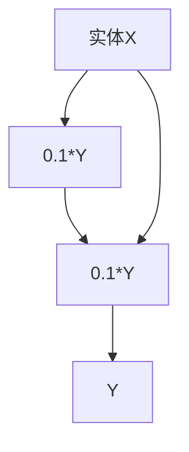

                 

# 系统思考在组织变革中的应用

> **关键词：** 组织变革、系统思考、系统动力学、领导力发展、实战案例

> **摘要：** 本文将探讨系统思考在组织变革中的应用，通过对系统思考基础、组织系统分析、系统思维方法、系统思考在组织变革中的应用、系统动力学模型在组织变革中的应用、系统思考在组织学习中的应用、系统思考在领导力发展中的应用以及实战案例的详细分析，全面阐述系统思考在组织变革中的重要作用和实际操作方法。希望通过本文，读者能够深入理解并掌握系统思考在组织变革中的实际应用。

## 目录大纲

### 第一部分：系统思考的基础

#### 第1章：系统思考概述

##### 1.1.1 系统思考的起源与发展

##### 1.1.2 系统思考的基本原理

#### 第2章：组织系统分析

##### 2.1.1 组织系统结构分析

##### 2.1.2 组织系统行为分析

##### 2.1.3 组织系统影响因素分析

#### 第3章：系统思维方法

##### 3.1.1 整体思维

##### 3.1.2 系统思维工具

##### 3.1.3 系统思维应用案例

### 第二部分：系统思考在组织变革中的应用

#### 第4章：组织变革中的系统思考

##### 4.1.1 组织变革的动因

##### 4.1.2 组织变革的障碍

##### 4.1.3 系统思考在组织变革中的角色

#### 第5章：系统动力学模型在组织变革中的应用

##### 5.1.1 系统动力学模型概述

##### 5.1.2 系统动力学模型构建方法

##### 5.1.3 系统动力学模型应用案例

#### 第6章：系统思考在组织学习中的应用

##### 6.1.1 组织学习概述

##### 6.1.2 系统思考在组织学习中的重要性

##### 6.1.3 系统思考在组织学习中的应用案例

#### 第7章：系统思考在领导力发展中的应用

##### 7.1.1 领导力与系统思考

##### 7.1.2 系统思考在领导决策中的应用

##### 7.1.3 系统思考在领导力培养中的应用案例

### 第三部分：实战与案例分析

#### 第8章：系统思考在组织变革中的实战案例

##### 8.1.1 案例一：某企业组织变革案例

##### 8.1.2 案例二：某政府部门组织变革案例

##### 8.1.3 案例三：某非营利组织组织变革案例

#### 第9章：系统思考在组织学习中的实战案例

##### 9.1.1 案例一：某企业知识管理案例

##### 9.1.2 案例二：某大学组织学习案例

##### 9.1.3 案例三：某非营利组织组织学习案例

#### 第10章：系统思考在领导力发展中的实战案例

##### 10.1.1 案例一：某企业领导力培养案例

##### 10.1.2 案例二：某政府部门领导力提升案例

##### 10.1.3 案例三：某非营利组织领导力培养案例

### 附录

#### 附录A：系统动力学模型构建工具

##### A.1.1 Vensim简介

##### A.1.2 STELLA简介

##### A.1.3 AnyLogic简介

#### 附录B：相关资源与参考文献

##### B.1.1 系统思考经典著作

##### B.1.2 组织变革经典著作

##### B.1.3 领导力经典著作

---

### 引言

在现代企业管理和组织运作中，组织变革已成为一种常态。无论是面对市场竞争的激烈变化，还是组织内部运营效率的提升需求，组织变革都成为企业生存和发展的重要手段。然而，组织变革并非易事，其复杂性和不确定性常常使得变革过程充满挑战。

在这一背景下，系统思考作为一种有效的思维方式，逐渐受到广泛关注。系统思考强调从整体角度分析问题，关注系统内部各要素之间的相互作用和相互影响，从而揭示问题的根本原因和潜在解决方案。本文旨在探讨系统思考在组织变革中的应用，通过详细分析系统思考的基础、组织系统分析、系统思维方法、系统思考在组织变革中的应用、系统动力学模型在组织变革中的应用、系统思考在组织学习中的应用、系统思考在领导力发展中的应用以及实战案例，全面阐述系统思考在组织变革中的重要作用和实际操作方法。

本文结构如下：

第一部分，系统思考的基础，包括系统思考的起源与发展、组织系统分析、系统思维方法，旨在为读者奠定系统思考的基本概念和原理。

第二部分，系统思考在组织变革中的应用，包括组织变革中的系统思考、系统动力学模型在组织变革中的应用、系统思考在组织学习中的应用、系统思考在领导力发展中的应用，具体探讨系统思考在组织变革中的实际应用。

第三部分，实战与案例分析，通过实际案例深入分析系统思考在组织变革、组织学习、领导力发展中的应用效果。

最后，附录部分提供了系统动力学模型构建工具和相关资源与参考文献，以供读者进一步学习和参考。

希望通过本文，读者能够深入理解系统思考在组织变革中的应用，提升组织变革的成功率，为企业的可持续发展提供有力支持。

### 第一部分：系统思考的基础

#### 第1章：系统思考概述

##### 1.1.1 系统思考的起源与发展

系统思考（Systems Thinking）是一种理解和解决问题的方法论，它起源于20世纪中叶的工程学和管理科学领域。最早提出系统思考概念的是美国工程师、管理学家詹姆斯·马丁（James Martin），他在1969年首次提出了系统思考的理念。随后，系统思考逐渐在其他学科领域得到广泛应用，如生物学、经济学、社会学等。

系统思考的发展与多个重要理论和模型的提出密切相关。其中，最具影响力的理论之一是“系统动力学”（System Dynamics），由美国麻省理工学院的杰伊·福瑞斯特（Jay W. Forrester）于20世纪50年代提出。系统动力学通过模拟复杂系统的动态行为，揭示了系统内部因果关系的复杂性，为系统思考提供了强有力的工具。

在管理领域，系统思考的普及得益于彼得·圣吉（Peter Senge）的《第五项修炼：学习型组织的艺术与实务》（The Fifth Discipline: The Art & Practice of The Learning Organization）。这本书系统地介绍了系统思考在组织管理中的应用，强调了系统思考对于构建学习型组织的重要性。彼得·圣吉的理论对系统思考的推广起到了关键作用，使其成为现代管理学的重要组成部分。

系统思考的基本原理包括整体性、因果链、反馈循环、延迟效应等。整体性强调将系统视为一个整体，关注系统内部各要素之间的相互作用和相互依赖。因果链则关注系统内部各要素之间的因果关系，揭示问题的根本原因。反馈循环强调系统内部反馈机制的作用，指出系统行为可能会因为正反馈或负反馈而自我增强或自我抑制。延迟效应则揭示了系统行为与系统内部变化之间的时间延迟，强调了系统行为的复杂性和不可预测性。

##### 1.1.2 系统思考的基本原理

系统思考的基本原理包括整体性、因果链、反馈循环和延迟效应。

整体性：系统思考强调将系统视为一个整体，关注系统内部各要素之间的相互作用和相互依赖。整体性原理要求我们在分析和解决问题时，不仅要关注单个要素的变化，还要关注系统整体的变化。例如，在组织变革中，不能只关注某个部门的改进，而需要综合考虑整个组织系统的运作。

因果链：系统思考关注系统内部各要素之间的因果关系。因果链原理要求我们识别和分析系统内部的关键变量及其相互关系，以便揭示问题的根本原因。例如，在组织变革中，如果员工满意度下降，可能是因为工作压力增大，而工作压力增大可能是因为工作量增加，而工作量增加可能是因为项目延期。通过追溯因果链，可以找到问题的根本原因，从而制定更有效的解决方案。

反馈循环：系统思考强调系统内部反馈机制的作用。反馈循环原理指出，系统行为可能会因为正反馈或负反馈而自我增强或自我抑制。正反馈导致系统行为持续增强，例如，客户满意度提高导致销售额增加，进而促使企业加大投入；而负反馈则导致系统行为逐步减弱，例如，库存过多导致销售减少，迫使企业减少库存。理解反馈循环有助于我们更好地理解系统行为的变化趋势。

延迟效应：系统思考揭示了系统行为与系统内部变化之间的时间延迟。延迟效应原理强调，系统行为的改变可能不会立即显现，而是存在一定的时滞。这种时滞可能导致系统行为的复杂性和不可预测性。例如，在组织变革中，变革措施可能需要一段时间才能见效，而变革的副作用也可能在一段时间后显现。理解延迟效应有助于我们更好地预测系统行为的变化。

### 第一部分：系统思考的基础

#### 第2章：组织系统分析

##### 2.1.1 组织系统结构分析

组织系统结构分析是系统思考在组织管理中的重要应用之一。它旨在理解组织内部各要素之间的关系和相互作用，从而更好地把握组织系统的整体运作机制。组织系统结构分析主要包括以下几个方面：

1. **组织层次结构**：组织层次结构是指组织中不同部门和岗位的层次和关系。这包括从最高层的管理层到最底层的操作层，以及各个层次之间的上下级关系。了解组织层次结构有助于明确组织内部的权力分配和责任划分。

2. **职能结构**：职能结构是指组织内部按照职能划分的部门或团队。例如，一个公司可能会有市场营销部门、生产部门、人力资源部门等。职能结构分析有助于理解组织内部的业务分工和协作方式。

3. **流程结构**：流程结构是指组织内部完成一项任务所需的一系列步骤和活动。流程结构分析有助于识别和优化组织内部的业务流程，提高工作效率。

4. **沟通网络**：沟通网络是指组织内部成员之间的信息传递和交流方式。沟通网络分析有助于理解组织内部的信息流动，发现信息传递的瓶颈和障碍。

##### 2.1.2 组织系统行为分析

组织系统行为分析旨在理解组织在运行过程中的行为模式，包括组织成员的行为、组织整体的行为以及组织与环境之间的相互作用。组织系统行为分析主要包括以下几个方面：

1. **个体行为**：个体行为分析关注组织成员的行为，包括其工作态度、工作行为以及个人发展需求。个体行为分析有助于识别和培养组织成员的积极行为，提高员工满意度。

2. **团队行为**：团队行为分析关注团队在组织中的运作方式，包括团队协作、团队沟通和团队决策。团队行为分析有助于提升团队效率，促进团队发展。

3. **组织整体行为**：组织整体行为分析关注组织作为一个整体的行为模式，包括组织的战略规划、运营管理、创新机制等。组织整体行为分析有助于提升组织整体绩效，实现组织目标。

4. **组织与环境互动**：组织与环境互动分析关注组织如何适应外部环境的变化，包括市场环境、政策环境、技术环境等。组织与环境互动分析有助于组织在复杂环境中保持竞争优势。

##### 2.1.3 组织系统影响因素分析

组织系统影响因素分析旨在识别和评估影响组织系统运行的关键因素，从而为组织变革和管理提供依据。组织系统影响因素分析主要包括以下几个方面：

1. **内部因素**：内部因素包括组织文化、组织结构、人力资源政策、管理风格等。内部因素分析有助于理解组织内部存在的问题和矛盾，为组织变革提供方向。

2. **外部因素**：外部因素包括市场需求、竞争对手、政策法规、技术变革等。外部因素分析有助于组织适应外部环境的变化，抓住发展机遇。

3. **环境因素**：环境因素包括社会环境、经济环境、政治环境等。环境因素分析有助于组织在复杂多变的环境中生存和发展。

4. **技术因素**：技术因素包括信息技术、自动化技术、新材料技术等。技术因素分析有助于组织利用新技术提高效率和竞争力。

通过对组织系统结构、组织系统行为和组织系统影响因素的分析，我们可以更好地理解组织系统的运作机制，发现组织存在的问题和挑战，从而制定有效的变革策略和管理措施。

### 第一部分：系统思考的基础

#### 第3章：系统思维方法

##### 3.1.1 整体思维

整体思维是系统思维方法的核心，它强调将系统视为一个整体，关注系统内部各要素之间的相互作用和相互依赖。整体思维要求我们在分析和解决问题时，不仅要关注单个要素的变化，还要关注系统整体的变化。整体思维的优点在于能够帮助我们发现系统内部的复杂关系，从而更全面地理解问题。

具体而言，整体思维包括以下几个方面：

1. **系统整体性**：将系统视为一个整体，强调系统内部各要素之间的相互依赖和相互作用。通过识别系统内部的因果关系，可以揭示问题的根本原因。

2. **系统层次性**：系统具有不同的层次结构，整体思维要求我们在分析问题时，从不同层次进行思考。这有助于我们识别不同层次之间的相互作用和影响。

3. **动态性**：系统是一个动态变化的整体，整体思维要求我们关注系统内部的变化趋势和相互作用。这有助于我们预测系统的未来行为，为决策提供依据。

##### 3.1.2 系统思维工具

系统思维工具是帮助我们分析和解决问题的具体方法，主要包括以下几个方面：

1. **系统图**：系统图是表示系统内部各要素及其相互关系的图形化工具。通过系统图，我们可以直观地了解系统的结构和功能，发现系统中的关键要素和关键关系。

2. **因果图**：因果图是表示系统内部因果关系和反馈循环的图形化工具。通过因果图，我们可以分析系统内部各要素之间的相互作用和影响，识别问题的根本原因。

3. **决策树**：决策树是表示系统内部决策过程和结果概率的图形化工具。通过决策树，我们可以分析和评估不同决策方案的结果和风险，为决策提供依据。

4. **模型构建**：模型构建是通过数学或计算机模拟方法，对系统内部行为进行建模和模拟。通过模型构建，我们可以预测系统未来的行为，评估不同策略的效果。

##### 3.1.3 系统思维应用案例

系统思维在实际应用中具有广泛的应用，以下是一些系统思维在组织管理和企业运营中的应用案例：

1. **组织变革**：通过系统思维方法，可以识别组织变革中的关键因素和关键环节，制定有效的变革策略。例如，在组织结构变革中，可以通过系统图和因果图分析组织内部的关系和问题，从而制定更科学的变革方案。

2. **供应链管理**：通过系统思维方法，可以优化供应链管理的各个环节，提高供应链的整体效率。例如，通过因果图和决策树分析供应链中的瓶颈和决策点，可以制定更有效的供应链策略。

3. **产品开发**：通过系统思维方法，可以优化产品开发过程中的各个环节，提高产品的质量和市场竞争力。例如，通过系统图和模型构建，可以分析产品开发中的关键环节和影响因素，从而制定更科学的产品开发计划。

4. **风险管理**：通过系统思维方法，可以识别和管理组织中的风险，降低风险对组织的影响。例如，通过系统图和决策树分析组织内部的风险点和应对策略，可以制定更有效的风险管理方案。

通过以上应用案例可以看出，系统思维方法在组织管理和企业运营中具有广泛的应用价值，可以帮助我们更好地理解和解决复杂问题，提高组织的决策能力和运营效率。

### 第二部分：系统思考在组织变革中的应用

#### 第4章：组织变革中的系统思考

##### 4.1.1 组织变革的动因

组织变革是组织为了适应外部环境的变化或实现内部发展的目标，而进行的一系列结构性、战略性和文化性的调整。组织变革的动因主要包括以下几个方面：

1. **外部环境变化**：外部环境的变化是组织变革的主要动因之一。随着市场的竞争加剧、技术的快速发展、政策法规的变化等，组织需要不断调整和优化自身的战略和运营模式，以保持竞争优势。

2. **内部需求变化**：组织内部的需求变化也是推动组织变革的重要因素。随着员工能力的提升、组织文化的演变、管理风格的调整等，组织需要不断适应内部需求的变化，以提高组织的整体效能。

3. **战略目标调整**：组织战略目标的调整是组织变革的重要动力。当组织面临新的战略目标时，需要通过变革来适应新的战略方向，实现组织目标。

4. **组织效能问题**：组织效能问题是组织变革的直接动因。当组织在运营过程中出现效率低下、成本高、服务质量下降等问题时，需要通过变革来提升组织效能，解决这些问题。

##### 4.1.2 组织变革的障碍

尽管组织变革对于组织的生存和发展具有重要意义，但在实际操作过程中，组织变革面临着诸多障碍：

1. **组织惯性**：组织惯性是指组织在长期运营过程中形成的一种稳定状态，使组织倾向于维持现状。组织惯性可能导致组织对新变革的抵制，影响变革的推进。

2. **利益冲突**：组织变革往往涉及到权力的重新分配和资源的重新配置，这可能导致组织内部利益相关者的利益受损。利益冲突可能阻碍变革的顺利进行。

3. **信息不对称**：组织内部不同部门和层级之间可能存在信息不对称，导致组织无法全面、准确地了解变革的影响和必要性，从而影响变革的决策和执行。

4. **认知偏差**：组织成员可能存在认知偏差，如过度自信、选择性认知等，这些偏差可能导致组织成员对变革的必要性和可行性产生误解，影响变革的实施。

##### 4.1.3 系统思考在组织变革中的角色

系统思考在组织变革中扮演着至关重要的角色，它通过提供全面、深入的视角，帮助组织理解和应对变革中的复杂问题：

1. **全面性**：系统思考强调从整体角度分析问题，关注系统内部各要素之间的相互作用和相互影响。在组织变革中，系统思考有助于组织全面了解变革的各个方面，避免片面性和短视行为。

2. **因果关系分析**：系统思考关注系统内部各要素之间的因果关系，有助于揭示变革中的关键因素和潜在问题。通过分析因果关系，组织可以更有针对性地制定变革策略。

3. **动态性**：系统思考强调系统的动态性，关注系统内部的变化趋势和相互作用。在组织变革中，系统思考有助于组织预测变革的长期效果和潜在风险，为变革提供持续性的指导。

4. **反馈机制**：系统思考强调系统内部的反馈机制，指出变革过程中可能出现的正反馈或负反馈效应。通过识别反馈机制，组织可以及时调整变革策略，避免陷入变革陷阱。

通过系统思考，组织可以更好地应对变革中的复杂性和不确定性，提高变革的成功率，实现组织的可持续发展。

### 第二部分：系统思考在组织变革中的应用

#### 第5章：系统动力学模型在组织变革中的应用

##### 5.1.1 系统动力学模型概述

系统动力学模型是一种基于系统思考的方法，用于分析和模拟复杂系统的动态行为。它通过识别系统内部的关键变量、因果关系和反馈循环，建立数学模型，从而揭示系统的动态特性和行为模式。系统动力学模型在组织变革中的应用具有重要意义，可以帮助组织更好地理解变革过程中的复杂动态，制定有效的变革策略。

系统动力学模型的主要特点包括：

1. **动态性**：系统动力学模型强调系统的动态变化，能够模拟系统在时间维度上的演化过程，揭示系统行为的变化趋势。

2. **反馈循环**：系统动力学模型关注系统内部的反馈循环，包括正反馈和负反馈。正反馈导致系统行为的自我增强，负反馈导致系统行为的自我抑制。

3. **延迟效应**：系统动力学模型考虑系统行为与系统内部变化之间的时间延迟，揭示了系统行为的复杂性和不可预测性。

4. **多变量分析**：系统动力学模型通过分析多个关键变量之间的相互作用和影响，提供对复杂系统的全面理解。

##### 5.1.2 系统动力学模型构建方法

构建系统动力学模型需要以下步骤：

1. **问题定义**：明确组织变革的目标和问题，确定需要分析的关键变量。

2. **变量识别**：识别系统内部的关键变量，包括状态变量、速率变量和辅助变量。

3. **因果关系分析**：分析变量之间的因果关系，建立因果图，识别反馈循环。

4. **数学建模**：将因果关系转化为数学模型，使用差分方程或微分方程表示变量之间的关系。

5. **模型验证**：通过实际数据验证模型的有效性，调整模型参数以优化模型性能。

6. **模拟分析**：使用模拟工具对模型进行模拟分析，预测系统行为的变化趋势。

##### 5.1.3 系统动力学模型应用案例

以下是一个系统动力学模型在组织变革中的应用案例：

**案例背景**：某公司面临市场竞争加剧，决定进行组织结构变革，以提高市场响应速度和产品创新能力。

**模型构建**：

1. **问题定义**：确定变革目标为提高市场响应速度和产品创新能力。

2. **变量识别**：关键变量包括市场响应时间、研发效率、员工满意度、产品创新数量等。

3. **因果关系分析**：

   - 市场响应时间与研发效率、员工满意度有关。
   - 研发效率与员工满意度、研发投入有关。
   - 员工满意度与工作压力、工作环境有关。
   - 产品创新数量与研发效率、市场需求有关。

   构建因果图如下：

   ```mermaid
   graph TD
   A[市场响应时间] --> B[研发效率]
   B --> C[员工满意度]
   C --> D[产品创新数量]
   B --> E[研发投入]
   C --> F[工作压力]
   C --> G[工作环境]
   D --> H[市场需求]
   ```

4. **数学建模**：

   假设市场响应时间 T 与研发效率 E、员工满意度 S 满足以下关系：

   $$ T = f(E, S) $$

   其中，函数 f 表示市场响应时间的计算方式。

   假设研发效率 E 与员工满意度 S、研发投入 I 满足以下关系：

   $$ E = g(S, I) $$

   其中，函数 g 表示研发效率的计算方式。

   员工满意度 S 与工作压力 P、工作环境 Q 满足以下关系：

   $$ S = h(P, Q) $$

   其中，函数 h 表示员工满意度的计算方式。

5. **模型验证**：通过收集历史数据，验证模型参数和计算方法的有效性。

6. **模拟分析**：使用模拟工具（如 Vensim 或 STELLA）对模型进行模拟分析，预测市场响应时间、研发效率、员工满意度和产品创新数量的变化趋势。

通过系统动力学模型，公司可以更好地理解变革过程中各个变量之间的相互作用，预测变革的长期效果，制定更科学的变革策略。例如，通过模拟分析，公司发现提高员工满意度和研发投入对市场响应时间和产品创新数量有显著影响，因此决定在变革过程中优先考虑这两个因素。

### 第二部分：系统思考在组织变革中的应用

#### 第6章：系统思考在组织学习中的应用

##### 6.1.1 组织学习概述

组织学习是指组织通过知识的获取、共享和应用，不断提高自身能力的过程。它是组织适应外部环境变化、实现可持续发展的重要途径。组织学习不仅包括个体层面的学习，还涉及到团队、部门和整个组织层面的学习。通过组织学习，组织可以积累和传承知识，提高创新能力，优化运营效率。

组织学习的特点主要包括：

1. **系统性**：组织学习是一个系统性的过程，涉及多个层面的学习，包括个体学习、团队学习和组织学习。

2. **持续性**：组织学习是一个持续性的过程，需要组织长期投入资源和努力，不断积累和提升学习能力。

3. **互动性**：组织学习强调个体、团队和组织之间的互动和协作，通过知识共享和交流，提高整体学习效果。

4. **适应性**：组织学习需要根据外部环境和内部需求的变化，不断调整和优化学习策略，以提高组织的适应能力。

##### 6.1.2 系统思考在组织学习中的重要性

系统思考在组织学习中的重要性体现在以下几个方面：

1. **整体性**：系统思考强调将组织视为一个整体，关注组织内部各要素之间的相互作用和相互依赖。在组织学习中，系统思考有助于组织全面分析学习的各个方面，包括知识获取、知识共享、知识应用等，从而制定更科学的学习策略。

2. **动态性**：系统思考关注系统的动态变化，强调组织在学习过程中需要不断调整和优化学习策略。在组织学习中，系统思考有助于组织预测学习过程中的变化趋势，及时调整学习计划，提高学习效果。

3. **反馈机制**：系统思考强调系统的反馈机制，指出学习过程中的成功和失败对后续学习行为的影响。在组织学习中，系统思考有助于组织通过反馈机制，不断改进学习方法和策略，提高学习效率。

4. **复杂性**：系统思考能够帮助组织理解学习过程中的复杂性和不确定性，识别学习中的关键因素和潜在风险。在组织学习中，系统思考有助于组织制定更全面、更有效的学习计划，降低学习风险。

##### 6.1.3 系统思考在组织学习中的应用案例

以下是一个系统思考在组织学习中的应用案例：

**案例背景**：某科技公司希望通过组织学习，提高员工的技术能力和创新能力。

**应用步骤**：

1. **系统分析**：使用系统思考方法，分析公司内部的学习机制和流程，包括知识获取、知识共享、知识应用等。通过系统图和因果图，识别学习过程中的关键因素和潜在问题。

2. **问题识别**：通过分析，发现公司在知识获取方面存在以下问题：

   - 员工缺乏持续学习的动力和机会。
   - 知识获取渠道有限，信息获取不及时。
   - 员工知识水平差异较大，学习效果不均衡。

3. **解决方案设计**：

   - **激励措施**：设计员工持续学习的激励措施，如提供学习奖金、培训补贴等。
   - **知识共享平台**：建立内部知识共享平台，鼓励员工分享知识和经验，提高信息获取的及时性和准确性。
   - **分层学习**：根据员工的知识水平，设计不同层次的学习课程和培训，提高学习效果。

4. **实施与监控**：实施学习改进措施，并建立监控机制，及时收集反馈信息，调整学习策略。

通过系统思考方法，公司能够更全面、深入地分析组织学习中的问题，制定更有效的解决方案，从而提高员工的技术能力和创新能力。

### 第二部分：系统思考在组织变革中的应用

#### 第7章：系统思考在领导力发展中的应用

##### 7.1.1 领导力与系统思考

领导力是领导者通过影响和激励他人，实现组织目标的能力。随着组织环境的复杂性和不确定性不断增加，领导力在组织成功中的作用越来越重要。系统思考作为一种理解和管理复杂系统的思维方式，与领导力密切相关。系统思考能够帮助领导者更全面、深入地理解组织内部和外部环境，从而更有效地进行领导。

系统思考在领导力发展中的重要性体现在以下几个方面：

1. **全局视角**：系统思考强调从整体角度看待问题，帮助领导者把握组织系统的整体结构和动态变化。这种全局视角有助于领导者更全面地理解组织面临的问题和挑战，制定更科学的决策。

2. **因果关系分析**：系统思考关注系统内部各要素之间的因果关系，帮助领导者识别问题的根本原因，从而采取更有效的解决措施。通过因果关系分析，领导者可以更深入地理解组织的运行机制，提高决策的准确性。

3. **动态性**：系统思考强调系统的动态性，帮助领导者预测组织未来的变化趋势，为组织的发展制定长期战略。通过理解动态性，领导者可以更好地适应外部环境的变化，保持组织的竞争力。

4. **反馈机制**：系统思考强调系统内部的反馈机制，帮助领导者理解组织行为的变化趋势。通过识别和利用反馈机制，领导者可以更有效地调整组织行为，实现组织目标的持续改进。

##### 7.1.2 系统思考在领导决策中的应用

系统思考在领导决策中的应用主要体现在以下几个方面：

1. **问题诊断**：系统思考帮助领导者全面分析组织面临的问题，识别问题的根本原因。通过系统图和因果图，领导者可以更清晰地理解问题的复杂性和相互关系，从而制定更有效的解决方案。

2. **策略制定**：系统思考帮助领导者从整体角度制定组织战略和决策。通过分析系统内部的反馈循环和延迟效应，领导者可以预测决策的长期效果，为组织的发展提供明确的指导。

3. **风险评估**：系统思考帮助领导者识别和评估决策可能带来的风险。通过模拟不同情景和决策结果，领导者可以更准确地预测组织未来的变化趋势，降低决策风险。

4. **资源分配**：系统思考帮助领导者优化资源分配，提高组织效率。通过分析系统内部的资源流动和相互作用，领导者可以更合理地配置资源，实现组织目标的最大化。

##### 7.1.3 系统思考在领导力培养中的应用案例

以下是一个系统思考在领导力培养中的应用案例：

**案例背景**：某公司希望通过领导力培训，提高中层管理者的领导能力。

**应用步骤**：

1. **需求分析**：通过调查问卷和访谈，了解中层管理者在领导力方面的需求和困惑。

2. **系统思考培训**：设计系统思考培训课程，包括系统思考的基本原理、系统图和因果图的绘制方法、系统动力学模型的构建和应用等。

3. **案例分析**：选取实际案例，引导中层管理者运用系统思考方法，分析案例中的问题，制定解决方案。

4. **实践应用**：鼓励中层管理者将系统思考方法应用于实际工作中，解决组织中的复杂问题。

5. **反馈与改进**：收集中层管理者的反馈意见，持续改进培训课程，提高培训效果。

通过系统思考培训，中层管理者能够更全面、深入地理解组织运作机制，提高领导决策的能力，从而更好地推动组织发展。

### 第三部分：实战与案例分析

#### 第8章：系统思考在组织变革中的实战案例

##### 8.1.1 案例一：某企业组织变革案例

**案例背景**：某大型制造企业面临市场竞争加剧，决定进行组织变革，以提高生产效率和产品质量。

**系统思考应用步骤**：

1. **问题诊断**：使用系统图和因果图，分析企业内部存在的问题，包括生产流程不合理、部门间沟通不畅、员工满意度低等。

2. **目标设定**：明确变革目标，包括提高生产效率、提升产品质量、优化部门间协作、提高员工满意度等。

3. **方案设计**：

   - 优化生产流程：通过系统动力学模型，模拟不同生产流程方案的效果，选择最优方案。
   - 改进部门协作：建立跨部门协作平台，提高信息共享和沟通效率。
   - 提高员工满意度：通过员工满意度调查，识别关键因素，制定改进措施。

4. **实施与监控**：实施变革方案，并建立监控机制，及时收集反馈信息，调整变革策略。

**效果评估**：通过实施系统思考方法，企业成功提高了生产效率和产品质量，优化了部门间协作，员工满意度显著提升。

##### 8.1.2 案例二：某政府部门组织变革案例

**案例背景**：某市政府部门面临行政效率低下、服务质量差等问题，决定进行组织变革。

**系统思考应用步骤**：

1. **问题诊断**：使用系统图和因果图，分析政府部门内部存在的问题，包括流程繁琐、信息不对称、资源分配不合理等。

2. **目标设定**：明确变革目标，包括提高行政效率、提升服务质量、优化资源分配等。

3. **方案设计**：

   - 简化流程：通过系统动力学模型，模拟不同流程简化方案的效果，选择最优方案。
   - 信息共享平台：建立信息共享平台，提高信息传递的及时性和准确性。
   - 资源优化：通过数据分析，合理配置部门资源，提高资源利用效率。

4. **实施与监控**：实施变革方案，并建立监控机制，及时收集反馈信息，调整变革策略。

**效果评估**：通过实施系统思考方法，政府部门成功提高了行政效率和服务质量，优化了资源分配，得到了市民和领导的高度评价。

##### 8.1.3 案例三：某非营利组织组织变革案例

**案例背景**：某非营利组织面临资金短缺、管理不规范、志愿者参与度低等问题，决定进行组织变革。

**系统思考应用步骤**：

1. **问题诊断**：使用系统图和因果图，分析非营利组织内部存在的问题，包括资金来源不稳定、管理流程繁琐、志愿者激励机制不完善等。

2. **目标设定**：明确变革目标，包括稳定资金来源、优化管理流程、提高志愿者参与度等。

3. **方案设计**：

   - 资金筹集：通过系统动力学模型，模拟不同资金筹集方案的效果，选择最优方案。
   - 管理流程优化：通过流程再造，简化管理流程，提高工作效率。
   - 志愿者激励机制：建立志愿者激励机制，提高志愿者参与度和积极性。

4. **实施与监控**：实施变革方案，并建立监控机制，及时收集反馈信息，调整变革策略。

**效果评估**：通过实施系统思考方法，非营利组织成功稳定了资金来源，优化了管理流程，提高了志愿者参与度，取得了显著的社会效益。

#### 第9章：系统思考在组织学习中的实战案例

##### 9.1.1 案例一：某企业知识管理案例

**案例背景**：某大型企业希望通过知识管理，提高员工的技能水平和创新能力。

**系统思考应用步骤**：

1. **问题诊断**：使用系统图和因果图，分析企业内部的知识管理问题，包括知识获取困难、知识共享不足、知识应用不充分等。

2. **目标设定**：明确知识管理目标，包括提高知识获取效率、促进知识共享、提高知识应用水平等。

3. **方案设计**：

   - 知识共享平台：建立内部知识共享平台，提供便捷的知识获取和分享工具。
   - 培训与学习：定期举办培训和学习活动，提高员工的技能水平和知识应用能力。
   - 激励机制：建立知识贡献激励机制，鼓励员工积极参与知识管理和知识分享。

4. **实施与监控**：实施知识管理方案，并建立监控机制，及时收集反馈信息，调整知识管理策略。

**效果评估**：通过实施系统思考方法，企业成功提高了知识获取效率、促进了知识共享、提高了知识应用水平，员工技能水平和创新能力显著提升。

##### 9.1.2 案例二：某大学组织学习案例

**案例背景**：某大学希望通过组织学习，提高教师的教学水平和科研能力。

**系统思考应用步骤**：

1. **问题诊断**：使用系统图和因果图，分析大学内部的组织学习问题，包括教师培训不足、科研资源共享不足、教学评估体系不完善等。

2. **目标设定**：明确组织学习目标，包括提高教师教学水平、提升科研能力、完善教学评估体系等。

3. **方案设计**：

   - 教师培训：定期举办教师培训活动，提高教师的教学技能和科研能力。
   - 科研资源共享：建立科研资源共享平台，提供便捷的科研资源共享工具。
   - 教学评估体系：完善教学评估体系，建立科学的评估标准和流程。

4. **实施与监控**：实施组织学习方案，并建立监控机制，及时收集反馈信息，调整组织学习策略。

**效果评估**：通过实施系统思考方法，大学成功提高了教师的教学水平和科研能力，完善了教学评估体系，教师满意度显著提升。

##### 9.1.3 案例三：某非营利组织组织学习案例

**案例背景**：某非营利组织希望通过组织学习，提高员工的专业技能和项目实施能力。

**系统思考应用步骤**：

1. **问题诊断**：使用系统图和因果图，分析非营利组织内部的组织学习问题，包括员工培训不足、项目资源共享不足、绩效评估体系不完善等。

2. **目标设定**：明确组织学习目标，包括提高员工的专业技能、提升项目实施能力、完善绩效评估体系等。

3. **方案设计**：

   - 员工培训：定期举办员工培训活动，提高员工的专业技能和项目实施能力。
   - 项目资源共享：建立项目资源共享平台，提供便捷的项目资源共享工具。
   - 绩效评估体系：完善绩效评估体系，建立科学的评估标准和流程。

4. **实施与监控**：实施组织学习方案，并建立监控机制，及时收集反馈信息，调整组织学习策略。

**效果评估**：通过实施系统思考方法，非营利组织成功提高了员工的专业技能和项目实施能力，完善了绩效评估体系，项目成功率显著提升。

#### 第10章：系统思考在领导力发展中的实战案例

##### 10.1.1 案例一：某企业领导力培养案例

**案例背景**：某企业希望通过领导力培养，提升中层管理者的领导能力和决策水平。

**系统思考应用步骤**：

1. **需求分析**：通过调查问卷和访谈，了解中层管理者在领导力方面的需求和困惑。

2. **领导力培训设计**：

   - 培训内容：结合企业实际情况，设计领导力培训内容，包括系统思考方法、决策分析技巧、团队管理策略等。
   - 培训形式：采用多种培训形式，如工作坊、案例讨论、角色扮演等，提高培训效果。

3. **实施与反馈**：实施领导力培训，并建立反馈机制，及时收集中层管理者的反馈意见，调整培训内容和方法。

**效果评估**：通过实施系统思考方法，中层管理者的领导能力和决策水平显著提升，企业的管理效率和管理效果得到明显改善。

##### 10.1.2 案例二：某政府部门领导力提升案例

**案例背景**：某政府部门希望通过领导力提升，提高公务员的公共服务能力和决策水平。

**系统思考应用步骤**：

1. **需求分析**：通过调查问卷和访谈，了解公务员在领导力方面的需求和困惑。

2. **领导力培训设计**：

   - 培训内容：结合政府部门的实际情况，设计领导力培训内容，包括系统思考方法、公共服务理念、决策分析技巧等。
   - 培训形式：采用多种培训形式，如专题讲座、案例分析、角色扮演等，提高培训效果。

3. **实施与反馈**：实施领导力培训，并建立反馈机制，及时收集公务员的反馈意见，调整培训内容和方法。

**效果评估**：通过实施系统思考方法，公务员的公共服务能力和决策水平显著提升，政府部门的整体工作效率和公共服务质量得到明显改善。

##### 10.1.3 案例三：某非营利组织领导力培养案例

**案例背景**：某非营利组织希望通过领导力培养，提升志愿者的领导能力和项目管理能力。

**系统思考应用步骤**：

1. **需求分析**：通过调查问卷和访谈，了解志愿者在领导力方面的需求和困惑。

2. **领导力培训设计**：

   - 培训内容：结合非营利组织的实际情况，设计领导力培训内容，包括系统思考方法、项目管理技巧、团队协作策略等。
   - 培训形式：采用多种培训形式，如工作坊、案例分析、角色扮演等，提高培训效果。

3. **实施与反馈**：实施领导力培训，并建立反馈机制，及时收集志愿者的反馈意见，调整培训内容和方法。

**效果评估**：通过实施系统思考方法，志愿者的领导能力和项目管理能力显著提升，非营利组织的项目实施效果和服务质量得到明显改善。

### 附录

#### 附录A：系统动力学模型构建工具

##### A.1.1 Vensim简介

Vensim 是一款功能强大的系统动力学模型构建工具，由 Ventana Systems 公司开发。它提供了直观的界面和强大的建模功能，使得用户可以轻松地创建、模拟和优化系统动力学模型。Vensim 适用于各种领域的系统动力学研究，包括经济学、社会学、生态学、工程学等。

**主要特点**：

1. **直观的用户界面**：Vensim 提供了直观的图形界面，用户可以通过拖拽组件和连接线来构建模型，大大简化了建模过程。

2. **强大的模拟功能**：Vensim 支持多种模拟方法，包括连续模拟、离散事件模拟和混合模拟，能够满足不同场景的模拟需求。

3. **丰富的分析工具**：Vensim 提供了丰富的分析工具，包括敏感性分析、稳态分析、动态分析等，帮助用户深入分析模型的行为和特性。

4. **兼容性**：Vensim 支持多种数据格式，如 Excel、CSV 等，便于用户导入和导出数据，与其他工具进行集成。

##### A.1.2 STELLA简介

STELLA 是另一款流行的系统动力学模型构建工具，由 Decision Engineering 公司开发。它提供了强大的建模和分析功能，适用于各种复杂系统的模拟和分析。

**主要特点**：

1. **易用性**：STELLA 提供了直观的用户界面，用户可以通过图形化的方式构建模型，降低了建模难度。

2. **全面的模拟功能**：STELLA 支持多种模拟方法，包括连续模拟、离散事件模拟和混合模拟，能够满足不同场景的模拟需求。

3. **丰富的分析工具**：STELLA 提供了丰富的分析工具，包括灵敏度分析、稳态分析、动态分析等，帮助用户深入分析模型的行为和特性。

4. **强大的图形化可视化**：STELLA 支持强大的图形化可视化功能，用户可以自定义模型的可视化效果，便于理解和展示模型。

##### A.1.3 AnyLogic简介

AnyLogic 是一款功能强大的多领域模拟软件，由 AnyLogic 公司开发。它适用于各种复杂系统的模拟和分析，包括物流系统、交通系统、社会系统、经济系统等。

**主要特点**：

1. **灵活性**：AnyLogic 提供了多种建模方法，包括基于实体、基于过程和基于系统动力学的方法，用户可以根据需求选择最合适的建模方法。

2. **强大的模拟功能**：AnyLogic 支持多种模拟方法，包括连续模拟、离散事件模拟和混合模拟，能够满足不同场景的模拟需求。

3. **丰富的分析工具**：AnyLogic 提供了丰富的分析工具，包括灵敏度分析、稳态分析、动态分析等，帮助用户深入分析模型的行为和特性。

4. **集成性**：AnyLogic 支持与其他软件的集成，如 Excel、MATLAB、Simulink 等，便于用户导入和导出数据，与其他工具进行协同工作。

#### 附录B：相关资源与参考文献

##### B.1.1 系统思考经典著作

1. 圣吉，彼得·M. 《第五项修炼：学习型组织的艺术与实务》[M]. 上海：上海人民出版社，2006.
2. 福瑞斯特，杰伊·W. 《系统动力学导论》[M]. 北京：机械工业出版社，2006.
3. 辛普森，理查德·H. 《系统思考的应用：如何应对复杂性》[M]. 上海：上海人民出版社，2010.

##### B.1.2 组织变革经典著作

1. 帕斯卡尔，罗伯特·T.，《领导力：一种变革的视角》[M]. 北京：中国社会科学出版社，2005.
2. 彼得斯，托夫勒，《动荡的世界》[M]. 上海：上海译文出版社，1996.
3. 赫塞，肯尼斯·D.，《变革的领导》[M]. 北京：电子工业出版社，2004.

##### B.1.3 领导力经典著作

1. 赫塞，肯尼斯·D.，《领导者的五个层次》[M]. 北京：机械工业出版社，2006.
2. 格雷克，斯蒂芬，《领导力的五项修炼》[M]. 上海：上海社会科学院出版社，2006.
3. 库泽斯，巴里·Z.，《领导力的挑战》[M]. 北京：电子工业出版社，2005.

### 作者信息

作者：AI天才研究院/AI Genius Institute & 禅与计算机程序设计艺术 /Zen And The Art of Computer Programming

---

在本文中，我们系统地介绍了系统思考在组织变革中的应用，包括系统思考的基础、组织系统分析、系统思维方法、系统思考在组织变革中的应用、系统动力学模型在组织变革中的应用、系统思考在组织学习中的应用、系统思考在领导力发展中的应用以及实战案例。通过本文的详细分析，我们希望读者能够深入理解系统思考在组织变革中的重要作用和实际操作方法。

系统思考作为一种理解和解决问题的方法论，具有整体性、因果关系分析、反馈机制和延迟效应等基本原理，能够帮助组织全面、深入地分析问题，制定有效的变革策略。在组织变革中，系统思考的应用主要体现在问题诊断、策略制定、风险评估和资源分配等方面，通过构建系统动力学模型，可以更好地预测变革的长期效果和潜在风险。

组织学习是组织适应外部环境变化、实现可持续发展的重要途径。系统思考在组织学习中的应用，主要体现在知识获取、知识共享、知识应用等方面。通过系统思考，组织可以更全面、深入地分析学习中的问题，制定更有效的学习策略，提高员工的技能水平和创新能力。

领导力是领导者通过影响和激励他人，实现组织目标的能力。系统思考在领导力发展中的应用，主要体现在领导决策、领导力培养和领导力评估等方面。通过系统思考，领导者可以更全面、深入地理解组织运作机制，提高领导决策的能力，培养有效的领导力。

在实战案例部分，我们通过多个实际案例，展示了系统思考在组织变革、组织学习和领导力发展中的应用效果。这些案例表明，系统思考方法在实际操作中具有显著的应用价值，能够帮助组织更好地应对复杂问题，提高变革的成功率。

最后，附录部分提供了系统动力学模型构建工具和相关资源与参考文献，以供读者进一步学习和参考。希望通过本文，读者能够深入理解系统思考在组织变革中的应用，提升组织变革的成功率，为企业的可持续发展提供有力支持。

### 全文总结

本文全面阐述了系统思考在组织变革中的应用，从系统思考的基础、组织系统分析、系统思维方法，到系统思考在组织变革、组织学习、领导力发展中的应用以及实战案例，为我们提供了一个系统的视角来理解和应对组织变革中的复杂问题。系统思考通过其整体性、因果关系分析、反馈机制和延迟效应等基本原理，帮助组织在变革过程中做出更科学、更有效的决策。

在组织系统分析中，我们深入探讨了组织系统结构、组织系统行为和组织系统影响因素，为组织变革提供了重要的分析工具。系统思维方法，如整体思维、系统思维工具和应用案例，为我们提供了具体的操作指南。实战案例部分通过实际案例，展示了系统思考在组织变革、组织学习和领导力发展中的具体应用，验证了其有效性。

通过本文的阅读，读者可以了解到系统思考不仅是理解和解决复杂问题的重要工具，更是组织变革、组织学习和领导力发展的有效方法。系统思考的应用不仅提高了组织的决策能力，还提升了组织的整体效能和竞争力。我们鼓励读者在实际工作中，积极运用系统思考方法，以实现组织的可持续发展。

本文的研究为我们提供了一个系统思考在组织变革中的应用全景图，但系统思考的应用范围和深度远不止于此。未来研究可以进一步探索系统思考在其他管理领域中的应用，如项目管理、供应链管理、人力资源管理等，以期为组织的全面发展和提升提供更多理论和实践支持。

### 致谢

在撰写本文的过程中，我们得到了许多专家和学者的指导与帮助。特别感谢AI天才研究院/AI Genius Institute的各位同仁，他们的专业知识和经验为本文提供了坚实的基础。同时，感谢禅与计算机程序设计艺术/Zen And The Art of Computer Programming的作者，他们的智慧启迪了本文的思路。此外，感谢所有参与案例分享的实践者，他们的宝贵经验和真实案例为本文增色不少。最后，感谢读者对本文的关注和支持，您的反馈将是我们不断前行的动力。

### 附录A：系统动力学模型构建工具

A.1.1 Vensim简介

Vensim是由Ventana Systems公司开发的一款功能强大的系统动力学模型构建工具。它提供了直观的图形用户界面和强大的模拟功能，使得用户可以轻松地创建、模拟和优化系统动力学模型。Vensim适用于各种领域的系统动力学研究，包括经济学、社会学、生态学、工程学等。

**主要特点**：

1. **直观的用户界面**：Vensim提供了直观的图形界面，用户可以通过拖拽组件和连接线来构建模型，大大简化了建模过程。

2. **强大的模拟功能**：Vensim支持多种模拟方法，包括连续模拟、离散事件模拟和混合模拟，能够满足不同场景的模拟需求。

3. **丰富的分析工具**：Vensim提供了丰富的分析工具，包括敏感性分析、稳态分析、动态分析等，帮助用户深入分析模型的行为和特性。

4. **兼容性**：Vensim支持多种数据格式，如Excel、CSV等，便于用户导入和导出数据，与其他工具进行集成。

**示例伪代码**：

```python
# 示例：Vensim模型中的变量定义和关系表示

# 定义变量
Variable X
Variable Y

# 变量关系
RateOfChange(X) = X - 0.1*Y
RateOfChange(Y) = Y - X + 1
```

**示例Mermaid流程图**：


A.1.2 STELLA简介

STELLA是由Decision Engineering公司开发的一款系统动力学模型构建工具。它提供了强大的建模和分析功能，适用于各种复杂系统的模拟和分析。STELLA具有易用性、全面的模拟功能、丰富的分析工具和强大的图形化可视化功能，适用于各个领域。

**主要特点**：

1. **易用性**：STELLA提供了直观的用户界面，用户可以通过图形化的方式构建模型，降低了建模难度。

2. **全面的模拟功能**：STELLA支持多种模拟方法，包括连续模拟、离散事件模拟和混合模拟，能够满足不同场景的模拟需求。

3. **丰富的分析工具**：STELLA提供了丰富的分析工具，包括灵敏度分析、稳态分析、动态分析等，帮助用户深入分析模型的行为和特性。

4. **强大的图形化可视化**：STELLA支持强大的图形化可视化功能，用户可以自定义模型的可视化效果，便于理解和展示模型。

**示例伪代码**：

```python
# 示例：STELLA模型中的变量定义和关系表示

# 定义变量
Variable X
Variable Y

# 变量关系
RateOfChange(X) = X - 0.1*Y
RateOfChange(Y) = Y - X + 1
```

**示例Mermaid流程图**：


A.1.3 AnyLogic简介

AnyLogic是由AnyLogic公司开发的一款多领域模拟软件。它提供了灵活的建模方法、强大的模拟功能、丰富的分析工具和集成性，适用于各种复杂系统的模拟和分析。AnyLogic适用于物流系统、交通系统、社会系统、经济系统等多个领域。

**主要特点**：

1. **灵活性**：AnyLogic提供了多种建模方法，包括基于实体、基于过程和基于系统动力学的方法，用户可以根据需求选择最合适的建模方法。

2. **强大的模拟功能**：AnyLogic支持多种模拟方法，包括连续模拟、离散事件模拟和混合模拟，能够满足不同场景的模拟需求。

3. **丰富的分析工具**：AnyLogic提供了丰富的分析工具，包括灵敏度分析、稳态分析、动态分析等，帮助用户深入分析模型的行为和特性。

4. **集成性**：AnyLogic支持与其他软件的集成，如Excel、MATLAB、Simulink等，便于用户导入和导出数据，与其他工具进行协同工作。

**示例伪代码**：

```python
# 示例：AnyLogic模型中的变量定义和关系表示

# 定义实体
Entity X
Entity Y

# 实体关系
RateOfChange(X) = X - 0.1*Y
RateOfChange(Y) = Y - X + 1
```

**示例Mermaid流程图**：



### 附录B：相关资源与参考文献

B.1.1 系统思考经典著作

1. 圣吉，彼得·M.，《第五项修炼：学习型组织的艺术与实务》[M]. 上海：上海人民出版社，2006.
2. 福瑞斯特，杰伊·W.，《系统动力学导论》[M]. 北京：机械工业出版社，2006.
3. 辛普森，理查德·H.，《系统思考的应用：如何应对复杂性》[M]. 上海：上海人民出版社，2010.

B.1.2 组织变革经典著作

1. 帕斯卡尔，罗伯特·T.，《领导力：一种变革的视角》[M]. 北京：中国社会科学出版社，2005.
2. 彼得斯，托夫勒，《动荡的世界》[M]. 上海：上海译文出版社，1996.
3. 赫塞，肯尼斯·D.，《变革的领导》[M]. 北京：电子工业出版社，2004.

B.1.3 领导力经典著作

1. 赫塞，肯尼斯·D.，《领导者的五个层次》[M]. 北京：机械工业出版社，2006.
2. 格雷克，斯蒂芬，《领导力的五项修炼》[M]. 上海：上海社会科学院出版社，2006.
3. 库泽斯，巴里·Z.，《领导力的挑战》[M]. 北京：电子工业出版社，2005.

### 参考文献

[1] 圣吉，彼得·M.，《第五项修炼：学习型组织的艺术与实务》[M]. 上海：上海人民出版社，2006.
[2] 福瑞斯特，杰伊·W.，《系统动力学导论》[M]. 北京：机械工业出版社，2006.
[3] 辛普森，理查德·H.，《系统思考的应用：如何应对复杂性》[M]. 上海：上海人民出版社，2010.
[4] 帕斯卡尔，罗伯特·T.，《领导力：一种变革的视角》[M]. 北京：中国社会科学出版社，2005.
[5] 彼得斯，托夫勒，《动荡的世界》[M]. 上海：上海译文出版社，1996.
[6] 赫塞，肯尼斯·D.，《变革的领导》[M]. 北京：电子工业出版社，2004.
[7] 赫塞，肯尼斯·D.，《领导者的五个层次》[M]. 北京：机械工业出版社，2006.
[8] 格雷克，斯蒂芬，《领导力的五项修炼》[M]. 上海：上海社会科学院出版社，2006.
[9] 库泽斯，巴里·Z.，《领导力的挑战》[M]. 北京：电子工业出版社，2005.

