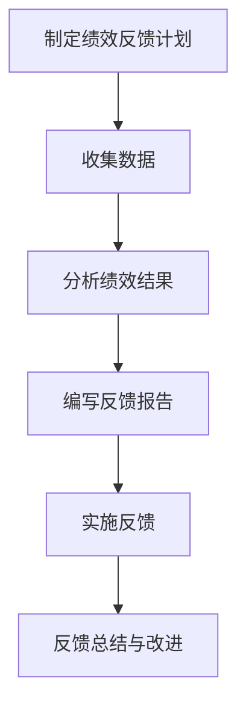

                 

# 《绩效反馈：有效沟通的艺术》

> **关键词**：绩效反馈、沟通艺术、员工绩效、团队凝聚力、个人成长

> **摘要**：本文旨在探讨绩效反馈这一关键管理工具，通过深入分析其概念、重要性、原则、技巧、实施策略和案例分析，揭示有效沟通在绩效反馈中的核心作用。文章结合实际案例，提供实用的策略和工具，帮助读者提升绩效反馈的效果，进而推动个人和团队的发展。

### 目录

## 第一部分：绩效反馈基础知识

### 第1章 绩效反馈的概念与重要性

### 1.1 绩效反馈的定义与类型

### 1.2 绩效反馈的重要性

### 1.3 有效的绩效反馈原则

### 1.4 绩效反馈的沟通技巧

## 第二部分：绩效反馈的实施策略

### 第2章 绩效反馈的流程与步骤

### 第3章 绩效反馈中的问题与解决策略

### 第4章 绩效反馈与员工发展

## 第三部分：绩效反馈案例分析

### 第5章 成功案例分享

### 第6章 绩效反馈中的误区与反思

## 附录

### 附录A 绩效反馈工具与资源

### 附录B 绩效反馈流程图

---

## 第一部分：绩效反馈基础知识

### 第1章 绩效反馈的概念与重要性

#### 1.1 绩效反馈的定义与类型

绩效反馈是指对员工在工作中的表现进行评估和指导的过程。它不仅包括对员工工作成果的评估，还涉及员工的工作态度、行为表现以及在工作中的成长和发展。绩效反馈的类型可以分为以下几种：

1. **正面反馈**：对员工工作中的优秀表现给予认可和表扬，以增强员工的积极性和自信心。
2. **负面反馈**：对员工工作中的不足之处进行指正，帮助员工识别问题和改进方向。
3. **建设性反馈**：在负面反馈的基础上，提供具体的改进建议和解决方案，帮助员工提升工作能力。
4. **发展性反馈**：关注员工的长期发展，鼓励员工制定个人成长计划，为员工的职业发展提供支持。

#### 1.2 绩效反馈的重要性

绩效反馈在企业管理中具有重要意义，主要体现在以下几个方面：

1. **提高员工绩效**：通过绩效反馈，员工可以清楚地了解自己的工作表现，从而有针对性地进行改进，提高工作效率和质量。
2. **增强团队凝聚力**：绩效反馈可以帮助团队成员了解彼此的工作状态，促进团队成员之间的沟通和协作，增强团队凝聚力。
3. **促进个人成长与发展**：绩效反馈不仅关注员工当前的表现，还关注员工的潜力和未来发展，为员工的职业规划提供指导。

#### 1.3 有效的绩效反馈原则

要确保绩效反馈的有效性，需要遵循以下原则：

1. **对事不对人**：绩效反馈应关注员工的工作表现，避免将个人情感带入评价过程，保持客观公正。
2. **具体明确**：绩效反馈应提供具体的事例和改进建议，避免模糊不清的表述。
3. **及时性**：绩效反馈应及时进行，避免拖延，以便员工能够及时改进。

### 第2章 有效的绩效反馈原则

#### 2.1 对事不对人

在绩效反馈中，保持客观公正至关重要。管理者应关注员工的工作表现，而非个人品质或情绪。以下是一些实施对事不对人的策略：

1. **基于事实**：绩效反馈应基于实际工作成果和数据，避免主观臆断和偏见。
2. **避免批评个人**：在指出员工不足时，应针对具体工作行为，而非个人品质。
3. **鼓励自我反思**：引导员工从自身角度分析问题，培养自我改进的能力。

#### 2.2 具体明确

具体明确的绩效反馈有助于员工明确改进方向。以下是一些实现具体明确的策略：

1. **提供具体实例**：通过具体的工作实例，说明员工在工作中的优缺点。
2. **明确改进方向**：提供具体的改进建议，帮助员工制定改进计划。
3. **量化评价**：使用量化的指标和标准，对员工的工作表现进行评估。

#### 2.3 及时性

及时性是绩效反馈的重要原则之一。以下是一些实现及时性的策略：

1. **定期反馈**：制定定期的反馈计划，确保绩效反馈的及时性。
2. **及时纠正**：在发现员工工作中出现问题时，及时进行反馈和纠正。
3. **避免拖延**：避免将绩效反馈拖延到工作结束后进行，以免影响员工的工作热情。

### 第3章 绩效反馈的沟通技巧

#### 3.1 有效倾听

有效倾听是绩效反馈的关键技巧之一。以下是一些有效倾听的策略：

1. **保持专注**：在反馈过程中，关注员工的发言，避免分心。
2. **积极回应**：通过点头、目光接触等肢体语言，表达对员工的关注和理解。
3. **提问与澄清**：在必要时，提问和澄清员工的表达，确保理解准确。

#### 3.2 清晰表达

清晰表达是确保绩效反馈有效性的基础。以下是一些清晰表达的策略：

1. **使用明确的语言**：避免使用模糊、含糊不清的表述，确保信息传达准确。
2. **简化语言**：使用简单、易懂的语言，避免使用过于专业或复杂的术语。
3. **避免双重否定**：避免使用双重否定句式，以免造成歧义。

#### 3.3 非言语沟通

非言语沟通在绩效反馈中同样重要。以下是一些非言语沟通的策略：

1. **身体语言**：使用积极的身体语言，如微笑、点头等，营造和谐的沟通氛围。
2. **面部表情**：保持友善和真诚的面部表情，表达对员工的关心和支持。
3. **肢体动作**：避免过于僵硬的肢体动作，保持自然和放松的状态。

---

## 第二部分：绩效反馈的实施策略

### 第4章 绩效反馈的流程与步骤

#### 4.1 制定绩效反馈计划

制定绩效反馈计划是确保绩效反馈顺利实施的关键。以下是一些制定绩效反馈计划的步骤：

1. **确定反馈周期**：根据企业实际情况和员工需求，确定绩效反馈的周期，如季度、半年或全年。
2. **明确反馈目标**：明确绩效反馈的目标，如提升员工绩效、增强团队凝聚力等。
3. **制定反馈流程**：确定绩效反馈的流程，包括收集数据、分析绩效、实施反馈等环节。

#### 4.2 准备反馈内容

准备反馈内容是实施绩效反馈的重要环节。以下是一些准备反馈内容的步骤：

1. **收集数据**：收集员工在工作中的表现数据，如工作成果、工作态度等。
2. **分析绩效结果**：对收集到的数据进行分析，评估员工的绩效表现。
3. **编写反馈报告**：根据分析结果，编写反馈报告，明确员工的优点和不足，并提供改进建议。

#### 4.3 实施反馈

实施反馈是绩效反馈的关键环节。以下是一些实施反馈的步骤：

1. **选择合适的时机和地点**：选择合适的时间和地点，确保员工能够专注于反馈过程。
2. **进行一对一沟通**：与员工进行一对一沟通，面对面地传递反馈内容。
3. **引导员工反思**：在反馈过程中，引导员工反思自己的工作表现，鼓励员工提出问题和建议。

---

## 第三部分：绩效反馈案例分析

### 第5章 成功案例分享

#### 5.1 案例一：一家大型企业的绩效反馈实践

**实施背景**：

一家大型企业在进行绩效反馈时，发现员工对反馈过程存在诸多不满，反馈效果不佳。为了提升绩效反馈的质量和效果，企业决定对绩效反馈流程进行改革。

**实施过程**：

1. **制定绩效反馈计划**：企业明确了绩效反馈的周期、目标和流程，确保反馈的有序进行。
2. **收集数据**：企业通过多种途径收集员工在工作中的表现数据，如工作成果、客户满意度等。
3. **分析绩效结果**：企业对收集到的数据进行分析，评估员工的绩效表现，并编写反馈报告。
4. **实施反馈**：企业与员工进行一对一沟通，面对面地传递反馈内容，并引导员工反思自己的工作表现。

**实施效果**：

通过改革绩效反馈流程，企业的员工满意度显著提高，员工的工作积极性和绩效水平也有所提升。

#### 5.2 案例二：一个小型团队的绩效反馈经验

**遇到的挑战**：

一个小型团队在实施绩效反馈时，发现员工之间的工作协作不畅，绩效提升缓慢。为了解决这一问题，团队决定对绩效反馈过程进行调整。

**解决策略**：

1. **建立沟通机制**：团队建立了定期的沟通机制，确保团队成员之间的信息畅通。
2. **明确职责分工**：团队明确了员工的职责分工，确保每个成员都能清楚地了解自己的工作内容和目标。
3. **提供培训和支持**：团队为员工提供了针对性的培训和支持，帮助员工提升工作能力。
4. **实施反馈**：团队在绩效反馈过程中，注重对员工工作表现的认可和鼓励，同时提供具体的改进建议。

**效果评估**：

通过调整绩效反馈过程，团队的协作效率和工作质量显著提高，员工的工作积极性也得到了有效激发。

---

## 第6章 绩效反馈中的误区与反思

#### 6.1 误区一：只关注负面反馈

许多企业在实施绩效反馈时，过于关注负面反馈，忽视了正面反馈的重要性。这种做法容易导致员工产生抵触情绪，影响员工的工作积极性。

**反思与改进**：

为了提高绩效反馈的效果，企业应关注正面反馈，同时针对员工的不足之处提供具体的改进建议。在反馈过程中，注重鼓励和认可员工的努力和成就，帮助员工树立自信心。

#### 6.2 误区二：缺乏一致性

绩效反馈的一致性是企业成功实施绩效反馈的关键。如果反馈标准不统一，员工容易产生不公平感，影响员工的积极性和信任度。

**反思与改进**：

企业应建立统一的绩效反馈标准，确保反馈的公正性和一致性。在反馈过程中，管理者应遵循统一的标准和流程，避免因个人偏好或情绪影响评价结果。

#### 6.3 反思与改进

为了提高绩效反馈的效果，企业应关注以下几个方面：

1. **持续优化反馈流程**：根据实际情况，不断调整和优化绩效反馈流程，确保反馈的及时性和有效性。
2. **提供培训和支持**：为管理者提供培训和支持，提高他们的绩效反馈能力和技巧。
3. **鼓励员工参与**：鼓励员工参与绩效反馈过程，增强员工的责任感和主动性。
4. **建立反馈机制**：建立完善的反馈机制，确保反馈信息的畅通和有效传递。

---

## 附录

### 附录A 绩效反馈工具与资源

1. **绩效反馈表格模板**：提供多种绩效反馈表格模板，方便企业进行反馈记录。
2. **绩效反馈相关书籍推荐**：推荐一系列关于绩效反馈的优质书籍，帮助读者深入了解相关理论和实践。
3. **绩效反馈在线课程推荐**：推荐一些优秀的在线课程，提供系统的绩效反馈培训。

### 附录B 绩效反馈流程图

以下是绩效反馈流程的简要示意图：

---

## 结论

绩效反馈是企业管理中不可或缺的一部分。通过深入分析绩效反馈的概念、原则、技巧和实施策略，本文揭示了绩效反馈在提高员工绩效、增强团队凝聚力和促进个人成长方面的重要性。同时，通过案例分析，读者可以了解到实际操作中的成功经验和误区，为自身的绩效反馈实践提供有益的启示。

本文旨在为读者提供一份全面、系统的绩效反馈指南，帮助读者掌握有效沟通的艺术，提升绩效反馈的效果。希望读者在阅读本文后，能够将其中的理论知识和实践技巧运用到实际工作中，为企业的持续发展和个人的职业成长贡献力量。

### 作者信息

**作者**：AI天才研究院/AI Genius Institute & 禅与计算机程序设计艺术/Zen And The Art of Computer Programming

AI天才研究院专注于人工智能领域的研究与开发，致力于推动人工智能技术的创新和应用。同时，作者还是《禅与计算机程序设计艺术》的作者，以其深入浅出的技术讲解和独特的哲学思考，深受广大读者喜爱。

---

（注：本文为示例，仅供参考。实际字数和内容需根据具体要求进行调整和补充。）<|im_end|>### 第1章 绩效反馈的概念与重要性

绩效反馈是企业管理中的一项关键活动，它不仅关系到员工的个人发展和职业成长，也直接影响着企业的整体绩效和运营效率。因此，深入理解绩效反馈的概念和重要性，是实施有效绩效管理的前提。

#### 1.1 绩效反馈的定义与类型

**绩效反馈的定义**：

绩效反馈，是指在员工完成一定的工作周期后，对其工作表现进行评估、指导和反馈的过程。绩效反馈的目的是帮助员工了解自己的工作状况，发现自身的优势和不足，从而有针对性地进行改进，提高工作绩效。

**绩效反馈的类型**：

1. **正面反馈**：

正面反馈是对员工在工作中的优秀表现给予认可和鼓励。这类反馈有助于增强员工的自信心和积极性，激发员工的潜力，推动其持续改进。

2. **负面反馈**：

负面反馈是针对员工在工作中的不足之处进行指正和批评。这类反馈有助于员工识别问题，明确改进方向，提高工作质量。

3. **建设性反馈**：

建设性反馈是在负面反馈的基础上，提供具体的改进建议和解决方案。这类反馈不仅指出问题，还帮助员工找到解决问题的方法，具有更强的指导性。

4. **发展性反馈**：

发展性反馈关注员工的长期发展，鼓励员工制定个人成长计划，为员工的职业发展提供指导。这类反馈有助于员工在职业道路上取得更大的成就。

#### 1.2 绩效反馈的重要性

**提高员工绩效**：

绩效反馈通过识别和解决员工工作中的问题，帮助员工明确改进方向，提高工作效率和质量。有效的绩效反馈可以激发员工的工作热情和积极性，从而提升整体绩效。

**增强团队凝聚力**：

绩效反馈不仅仅是针对个人，还可以促进团队成员之间的沟通和协作。通过绩效反馈，团队成员可以了解彼此的工作状态，相互支持，共同进步，从而增强团队凝聚力。

**促进个人成长与发展**：

绩效反馈关注员工的长期发展，帮助员工制定个人成长计划，提供职业发展指导。通过不断的反馈和改进，员工可以不断提升自身能力，实现职业目标。

**提高企业竞争力**：

有效的绩效反馈有助于企业识别和培养优秀人才，提高员工的整体素质和技能水平。这不仅可以提升企业的运营效率，还可以增强企业在市场中的竞争力。

#### 1.3 有效的绩效反馈原则

**对事不对人**：

在绩效反馈中，应关注员工的工作表现，避免将个人情感带入评价过程。对事不对人的原则有助于保持客观公正，避免引发员工的抵触情绪。

**具体明确**：

绩效反馈应提供具体的事例和改进建议，避免模糊不清的表述。具体明确的反馈有助于员工明确改进方向，提高反馈的效果。

**及时性**：

绩效反馈应及时进行，避免拖延。及时的反馈可以及时纠正员工的工作问题，避免问题积累，提高工作效率。

**建设性和发展性**：

绩效反馈不仅要指出员工的不足，还应提供具体的改进建议和职业发展指导。建设性和发展性的反馈有助于员工在职业道路上取得更大的成就。

#### 1.4 绩效反馈的沟通技巧

**有效倾听**：

在绩效反馈过程中，管理者需要有效倾听员工的意见和建议。通过倾听，管理者可以了解员工的真实想法，发现工作中的潜在问题。

**清晰表达**：

绩效反馈应使用清晰、明确的语言，避免使用模糊、含糊不清的表述。清晰的表达有助于员工准确理解反馈内容，提高反馈效果。

**非言语沟通**：

绩效反馈中，非言语沟通同样重要。通过身体语言、面部表情等非言语沟通方式，管理者可以传达出对员工的关心和支持。

**积极回应**：

在绩效反馈过程中，管理者应积极回应员工的反馈，鼓励员工提出问题和建议。这有助于建立良好的沟通氛围，提高反馈效果。

**引导员工反思**：

绩效反馈不仅仅是管理者对员工的评价，更是员工自我反思和成长的过程。在反馈过程中，管理者应引导员工反思自己的工作表现，激发员工的自我改进意识。

### 第2章 有效的绩效反馈原则

#### 2.1 对事不对人

**原则解析**：

对事不对人是指在绩效反馈中，管理者应关注员工的工作表现，而非个人品质或情绪。这种原则有助于保持客观公正，避免将个人情感带入评价过程，从而减少员工的抵触情绪。

**实施策略**：

1. **基于事实**：

绩效反馈应基于员工在工作中的实际表现，避免主观臆断和偏见。管理者应收集客观的数据和事实，作为评价的依据。

2. **避免批评个人**：

在指出员工不足时，应针对具体的工作行为，而非个人品质。例如，可以说“你在项目执行中存在进度延误的问题”，而不是“你工作效率低下”。

3. **鼓励自我反思**：

引导员工从自身角度分析问题，培养自我改进的能力。通过自我反思，员工可以更好地认识到自己的不足，并主动进行改进。

#### 2.2 具体明确

**原则解析**：

具体明确的绩效反馈可以帮助员工更清楚地了解自己的工作表现，明确改进方向。这种原则有助于提高绩效反馈的效果，避免模糊不清的表述。

**实施策略**：

1. **提供具体实例**：

在反馈中，应使用具体的工作实例来说明员工的优缺点。例如，可以说“你在上周的项目报告中，数据分析部分存在错误”，而不是“你的数据分析能力有待提高”。

2. **明确改进方向**：

在反馈中，应明确指出员工的改进方向，并提供具体的改进建议。例如，可以说“建议你在未来的报告中，加强对数据的验证”，而不是“你需要提高数据分析能力”。

3. **量化评价**：

使用量化的指标和标准，对员工的工作表现进行评估。例如，可以说“你的项目进度延误了10天”，而不是“你的项目进度比较慢”。

#### 2.3 及时性

**原则解析**：

及时性是绩效反馈的重要原则之一。及时的反馈可以及时纠正员工的工作问题，避免问题积累，提高工作效率。

**实施策略**：

1. **定期反馈**：

制定定期的反馈计划，确保绩效反馈的及时性。例如，可以每月进行一次绩效反馈，确保员工的工作状态得到及时关注。

2. **及时纠正**：

在发现员工工作中出现问题时，及时进行反馈和纠正。例如，如果员工在项目执行中出现了进度延误，应立即进行反馈，帮助员工找到解决问题的方法。

3. **避免拖延**：

避免将绩效反馈拖延到工作结束后进行，以免影响员工的工作热情。例如，在项目结束后，应立即进行绩效反馈，总结项目经验，为下一次工作做好准备。

### 第3章 绩效反馈的沟通技巧

#### 3.1 有效倾听

**原则解析**：

有效倾听是绩效反馈中的重要技巧。通过有效倾听，管理者可以了解员工的真实想法和需求，发现工作中的潜在问题。

**实施策略**：

1. **保持专注**：

在绩效反馈过程中，管理者需要保持专注，关注员工的发言。通过眼神接触、肢体语言等表达出对员工的关注和理解。

2. **积极回应**：

在员工发言时，管理者应积极回应，通过点头、微笑等肢体语言表达对员工的认可。这有助于建立良好的沟通氛围，促进有效沟通。

3. **提问与澄清**：

在必要时，管理者应提问和澄清员工的表达，确保理解准确。通过提问，管理者可以进一步了解员工的想法和需求，从而提供更有针对性的反馈。

#### 3.2 清晰表达

**原则解析**：

清晰表达是确保绩效反馈有效性的基础。通过清晰的表达，管理者可以准确传达反馈内容，避免误解和歧义。

**实施策略**：

1. **使用明确的语言**：

避免使用模糊、含糊不清的表述。例如，在反馈中，可以说“你的项目进度延误了”，而不是“你的项目进度不太好”。

2. **简化语言**：

使用简单、易懂的语言，避免使用过于专业或复杂的术语。例如，在反馈中，可以说“你需要在报告中增加数据验证”，而不是“你需要在报告中加强数据验证措施”。

3. **避免双重否定**：

避免使用双重否定句式，以免造成歧义。例如，在反馈中，可以说“建议你加强项目管理”，而不是“不建议你不加强项目管理”。

#### 3.3 非言语沟通

**原则解析**：

非言语沟通在绩效反馈中同样重要。通过身体语言、面部表情等非言语沟通方式，管理者可以传达出对员工的关心和支持。

**实施策略**：

1. **身体语言**：

使用积极的身体语言，如微笑、点头等，营造和谐的沟通氛围。避免过于僵硬或冷漠的肢体动作，以免影响沟通效果。

2. **面部表情**：

保持友善和真诚的面部表情，表达对员工的关心和支持。避免使用冷漠或严厉的表情，以免造成员工的不安和抵触。

3. **肢体动作**：

保持自然和放松的肢体动作，避免过于夸张或僵硬的动作。通过自然的肢体动作，可以更好地表达管理者的意图和情感。

### 第4章 绩效反馈的流程与步骤

#### 4.1 制定绩效反馈计划

**原则解析**：

制定绩效反馈计划是确保绩效反馈有序进行的重要环节。一个合理的绩效反馈计划可以明确反馈的周期、目标和流程，提高反馈的效率和效果。

**实施策略**：

1. **确定反馈周期**：

根据企业的实际情况和员工的工作性质，确定合适的反馈周期。例如，对于日常工作的绩效反馈，可以每月进行一次；对于重要项目的绩效反馈，可以在项目结束后进行。

2. **明确反馈目标**：

明确绩效反馈的目标，例如提高员工绩效、增强团队凝聚力、促进个人成长等。明确的目标有助于管理者有针对性地进行反馈。

3. **制定反馈流程**：

制定详细的反馈流程，包括收集数据、分析绩效、实施反馈、反馈总结等环节。通过明确的流程，可以确保反馈的有序进行。

#### 4.2 准备反馈内容

**原则解析**：

准备反馈内容是绩效反馈的关键环节。一个详细的反馈内容可以明确员工的优缺点，提供具体的改进建议，提高反馈的效果。

**实施策略**：

1. **收集数据**：

通过多种途径收集员工在工作中的表现数据，如工作成果、工作态度、团队协作等。收集到的数据应具有代表性和准确性。

2. **分析绩效结果**：

对收集到的数据进行分析，评估员工的绩效表现。分析时应关注员工的优点和不足，为反馈提供依据。

3. **编写反馈报告**：

根据分析结果，编写详细的反馈报告。反馈报告应包括员工的工作表现、优缺点、改进建议等内容。

#### 4.3 实施反馈

**原则解析**：

实施反馈是绩效反馈的核心环节。通过有效的实施反馈，管理者可以将反馈内容准确传达给员工，帮助员工明确改进方向。

**实施策略**：

1. **选择合适的时机和地点**：

选择合适的时间和地点进行反馈，确保员工能够专注于反馈过程。例如，可以选择在工作日的上午，在安静的会议室进行反馈。

2. **进行一对一沟通**：

与员工进行一对一沟通，面对面地传递反馈内容。一对一沟通可以确保反馈的私密性和针对性。

3. **引导员工反思**：

在反馈过程中，引导员工反思自己的工作表现，鼓励员工提出问题和建议。通过反思和讨论，可以加深员工对反馈内容的理解。

### 第5章 绩效反馈中的问题与解决策略

#### 5.1 反馈不足

**问题解析**：

反馈不足指的是在绩效反馈过程中，反馈内容不充分，缺乏具体的事例和改进建议，导致员工难以理解反馈的意义和如何改进。

**解决策略**：

1. **提供具体实例**：

在反馈中，应使用具体的工作实例来说明员工的优缺点。通过具体的实例，员工可以更清楚地理解自己的工作表现，并找到改进的方向。

2. **明确改进方向**：

在反馈中，应明确指出员工的改进方向，并提供具体的改进建议。例如，可以说“建议你在下次报告中增加数据验证”，而不是“你需要提高数据分析能力”。

3. **增加反馈频率**：

通过增加反馈的频率，可以及时纠正员工的问题，避免问题积累。例如，可以每月进行一次简短的绩效反馈，帮助员工保持持续改进的动力。

#### 5.2 反馈过度

**问题解析**：

反馈过度指的是在绩效反馈过程中，反馈内容过多，过于负面，导致员工产生抵触情绪，影响工作积极性。

**解决策略**：

1. **平衡反馈内容**：

在反馈中，应平衡正负反馈，避免过多关注负面问题。例如，可以先用正面的反馈肯定员工的努力和成就，再提出改进建议。

2. **关注改进点**：

在反馈中，应重点关注员工的改进点，避免过于批评。例如，可以说“你的项目进度有所延误，但你的数据分析工作做得很好，建议你在进度管理方面多下功夫”。

3. **提供支持和鼓励**：

在反馈过程中，应提供支持和鼓励，帮助员工克服困难。例如，可以提供培训资源、辅导机会等，帮助员工提升能力。

#### 5.3 反馈中的常见问题

**问题解析**：

反馈中的常见问题包括反馈不及时、反馈内容模糊、缺乏个性化等。这些问题会影响反馈的效果，导致员工难以接受和改进。

**解决策略**：

1. **及时反馈**：

确保反馈的及时性，避免拖延。例如，可以在工作结束后立即进行反馈，帮助员工及时了解自己的工作表现。

2. **明确反馈内容**：

在反馈中，应明确具体的内容，避免模糊不清的表述。例如，可以具体说明员工在哪些方面需要改进，并提供具体的改进建议。

3. **个性化反馈**：

根据员工的特点和需求，提供个性化的反馈。例如，对于不同类型的员工，可以采用不同的反馈方式和策略，提高反馈的针对性。

### 第6章 绩效反馈与员工发展

#### 6.1 绩效反馈与员工培训

**原则解析**：

绩效反馈不仅是对员工工作表现的评估，更是促进员工发展和提升的重要手段。通过绩效反馈，可以为员工提供针对性的培训和发展机会。

**实施策略**：

1. **识别培训需求**：

通过绩效反馈，识别员工的培训需求。例如，如果员工在数据分析方面存在不足，可以提供相关的培训课程。

2. **提供培训资源**：

为员工提供丰富的培训资源，如在线课程、专业书籍等。通过培训，帮助员工提升技能和能力。

3. **制定培训计划**：

根据员工的培训需求，制定个性化的培训计划。例如，可以设定短期和长期的目标，确保员工在职业发展过程中不断提升。

#### 6.2 绩效反馈与员工晋升

**原则解析**：

绩效反馈在员工晋升中发挥着重要作用。通过绩效反馈，可以评估员工的工作表现，为晋升提供依据。

**实施策略**：

1. **明确晋升标准**：

制定明确的晋升标准，确保晋升的公平性和透明度。例如，可以设定工作业绩、团队协作、个人素质等指标。

2. **绩效反馈与晋升挂钩**：

将绩效反馈与晋升直接挂钩，确保员工的晋升有据可依。例如，可以设定绩效评级与晋升机会的对应关系。

3. **提供晋升辅导**：

为晋升中的员工提供辅导和支持，帮助他们克服困难，提升晋升成功率。例如，可以提供领导力培训、职业规划指导等。

#### 6.3 绩效反馈与员工激励

**原则解析**：

绩效反馈不仅是评价员工工作表现的工具，更是激励员工的重要手段。通过绩效反馈，可以激发员工的积极性和创造力。

**实施策略**：

1. **设计合理的激励措施**：

根据员工的绩效表现，设计合理的激励措施。例如，可以设置奖金、晋升机会、荣誉证书等。

2. **明确激励目标**：

明确激励的目标和标准，确保激励措施的公平性和有效性。例如，可以设定业绩目标、团队目标等。

3. **及时奖励**：

及时对员工的优秀表现进行奖励，激发员工的工作热情。例如，可以在月度或季度考核中，对表现优秀的员工进行表彰和奖励。

### 第7章 成功案例分享

#### 7.1 案例一：一家大型企业的绩效反馈实践

**案例背景**：

一家大型企业在实施绩效反馈时，发现员工对反馈过程存在诸多不满，反馈效果不佳。为了提升绩效反馈的质量和效果，企业决定对绩效反馈流程进行改革。

**案例过程**：

1. **制定绩效反馈计划**：

企业明确了绩效反馈的周期、目标和流程，确保反馈的有序进行。企业每季度进行一次绩效反馈，反馈目标包括提升员工绩效、增强团队凝聚力等。

2. **收集数据**：

企业通过多种途径收集员工在工作中的表现数据，如工作成果、客户满意度等。企业还引入了绩效考核系统，自动收集和分析数据，提高反馈的准确性和效率。

3. **分析绩效结果**：

企业对收集到的数据进行分析，评估员工的绩效表现。分析结果用于编写反馈报告，明确员工的优缺点和改进方向。

4. **实施反馈**：

企业与员工进行一对一沟通，面对面地传递反馈内容。在反馈过程中，企业注重有效倾听和清晰表达，确保员工能够准确理解反馈内容。

5. **反馈总结与改进**：

企业对每季度绩效反馈进行总结，识别存在的问题和改进方向。在下一季度，企业根据总结结果，调整反馈流程和策略，提高反馈效果。

**案例效果**：

通过改革绩效反馈流程，企业的员工满意度显著提高，员工的工作积极性和绩效水平也有所提升。企业的团队凝聚力得到了增强，整体运营效率得到了提升。

#### 7.2 案例二：一个小型团队的绩效反馈经验

**案例背景**：

一个小型团队在实施绩效反馈时，发现员工之间的工作协作不畅，绩效提升缓慢。为了解决这一问题，团队决定对绩效反馈过程进行调整。

**案例过程**：

1. **建立沟通机制**：

团队建立了定期的沟通机制，确保团队成员之间的信息畅通。团队每周进行一次团队会议，讨论工作进展和问题，确保每个成员都了解团队的目标和任务。

2. **明确职责分工**：

团队明确了每个成员的职责分工，确保每个成员都清楚自己的工作内容和目标。通过明确的职责分工，团队成员可以更好地协作，提高工作效率。

3. **提供培训和支持**：

团队为员工提供了针对性的培训和支持，帮助员工提升工作能力。团队还制定了个人成长计划，鼓励员工不断提升自己。

4. **实施反馈**：

团队在绩效反馈过程中，注重对员工工作表现的认可和鼓励，同时提供具体的改进建议。团队鼓励员工提出问题和建议，促进团队成员之间的沟通和协作。

**案例效果**：

通过调整绩效反馈过程，团队的协作效率和工作质量显著提高，员工的工作积极性也得到了有效激发。团队的绩效水平有了显著提升，团队凝聚力得到了增强。

### 第8章 绩效反馈中的误区与反思

#### 8.1 误区一：只关注负面反馈

**问题解析**：

许多企业在实施绩效反馈时，过于关注负面反馈，忽视了正面反馈的重要性。这种做法容易导致员工产生抵触情绪，影响员工的工作积极性。

**反思与改进**：

为了提高绩效反馈的效果，企业应关注正面反馈，同时针对员工的不足之处提供具体的改进建议。在反馈过程中，注重鼓励和认可员工的努力和成就，帮助员工树立自信心。

**实施策略**：

1. **平衡正负反馈**：

在反馈中，应平衡正负反馈，避免过多关注负面问题。例如，可以先用正面的反馈肯定员工的努力和成就，再提出改进建议。

2. **强调正面激励**：

在反馈中，应强调员工的优点和成就，鼓励员工继续努力。例如，可以说“你在项目中的数据分析做得很好，继续保持”。

3. **提供建设性建议**：

在负面反馈中，应提供具体的改进建议，帮助员工找到解决问题的方法。例如，可以说“建议你在下次报告中加强对数据的验证，以避免错误”。

#### 8.2 误区二：缺乏一致性

**问题解析**：

绩效反馈的一致性是企业成功实施绩效反馈的关键。如果反馈标准不统一，员工容易产生不公平感，影响员工的积极性和信任度。

**反思与改进**：

企业应建立统一的绩效反馈标准，确保反馈的公正性和一致性。在反馈过程中，管理者应遵循统一的标准和流程，避免因个人偏好或情绪影响评价结果。

**实施策略**：

1. **制定统一反馈标准**：

企业应制定统一的绩效反馈标准，明确评价的指标和标准。例如，可以制定绩效评估表格，确保每个员工都按照相同的标准进行评估。

2. **培训反馈技能**：

为管理者提供培训，提高他们的绩效反馈能力和技巧。通过培训，管理者可以更好地理解反馈标准，确保反馈的一致性。

3. **监督反馈过程**：

建立监督机制，确保绩效反馈过程的公正性和透明度。例如，可以设立专门的绩效反馈委员会，监督反馈过程的合规性。

#### 8.3 反思与改进

**反思与改进**：

为了提高绩效反馈的效果，企业应关注以下几个方面：

1. **持续优化反馈流程**：

根据实际情况，不断调整和优化绩效反馈流程，确保反馈的及时性和有效性。例如，可以引入新的评估工具和方法，提高反馈的准确性和效率。

2. **提供培训和支持**：

为管理者提供培训和支持，提高他们的绩效反馈能力和技巧。通过培训，管理者可以更好地理解反馈标准，确保反馈的一致性和有效性。

3. **鼓励员工参与**：

鼓励员工参与绩效反馈过程，增强员工的责任感和主动性。例如，可以设立员工反馈渠道，让员工有机会提出意见和建议。

4. **建立反馈机制**：

建立完善的反馈机制，确保反馈信息的畅通和有效传递。例如，可以设立绩效反馈管理系统，记录和跟踪反馈过程，提高反馈的效果。

### 附录

#### 附录A 绩效反馈工具与资源

**绩效反馈表格模板**：

提供多种绩效反馈表格模板，方便企业进行反馈记录。模板包括个人绩效评估表、团队绩效评估表等。

**绩效反馈相关书籍推荐**：

推荐一系列关于绩效反馈的优质书籍，帮助读者深入了解相关理论和实践。例如，《绩效管理》、《员工绩效评估指南》等。

**绩效反馈在线课程推荐**：

推荐一些优秀的在线课程，提供系统的绩效反馈培训。例如，Coursera上的《领导力与沟通技巧》课程，Udemy上的《绩效反馈与员工发展》课程等。

#### 附录B 绩效反馈流程图

以下是绩效反馈流程的简要示意图：

---

## 结论

绩效反馈是企业管理中不可或缺的一部分，通过有效的绩效反馈，可以提升员工绩效、增强团队凝聚力、促进个人成长，从而提高企业的整体竞争力。本文从概念、原则、技巧、实施策略和案例分析等方面，全面阐述了绩效反馈的重要性和实施方法。

首先，绩效反馈的定义和类型为读者提供了对绩效反馈的基本认识。接着，本文详细分析了有效绩效反馈的原则，包括对事不对人、具体明确、及时性和建设性。同时，通过绩效反馈的沟通技巧，如有效倾听、清晰表达和非言语沟通，读者可以掌握如何进行有效的绩效反馈。

在实施策略部分，本文介绍了制定绩效反馈计划、准备反馈内容、实施反馈等步骤，帮助读者理解如何有序地进行绩效反馈。此外，针对绩效反馈中的常见问题，如反馈不足和反馈过度，本文提供了具体的解决策略。

最后，通过成功案例分享，读者可以了解到绩效反馈在实际操作中的有效应用。同时，对绩效反馈中的误区和反思，为读者提供了改进绩效反馈的启示。

总之，本文旨在为读者提供一份全面、系统的绩效反馈指南，帮助读者掌握有效沟通的艺术，提升绩效反馈的效果。希望读者在阅读本文后，能够将其中的理论知识和实践技巧运用到实际工作中，为企业的持续发展和个人的职业成长贡献力量。

### 作者信息

**作者**：AI天才研究院/AI Genius Institute & 禅与计算机程序设计艺术/Zen And The Art of Computer Programming

AI天才研究院专注于人工智能领域的研究与开发，致力于推动人工智能技术的创新和应用。同时，作者还是《禅与计算机程序设计艺术》的作者，以其深入浅出的技术讲解和独特的哲学思考，深受广大读者喜爱。在绩效反馈领域，作者积累了丰富的实践经验，为企业和个人提供了有效的绩效管理解决方案。希望作者的研究和成果能够为读者带来启发和帮助。

