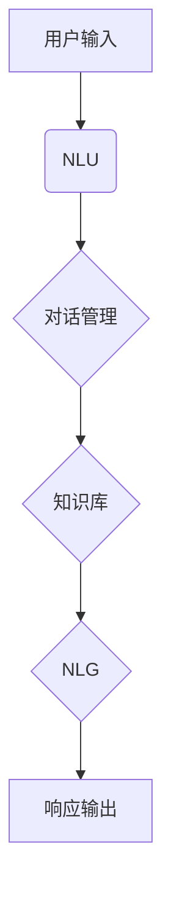

                 

# 《聊天机器人手工艺：创意项目灵感和指导》

## 摘要

本文旨在探讨聊天机器人项目的创意构思、技术基础、开发实践、项目管理和营销策略，以及未来发展趋势。通过详细的分析和实例，我们为读者提供了一整套从零开始构建聊天机器人的指导，旨在帮助读者理解聊天机器人的核心概念，掌握从项目构思到营销推广的全过程。

## 目录大纲

### 第一部分：了解聊天机器人

#### 第1章：聊天机器人的概念与分类

##### 1.1 聊天机器人的定义

##### 1.2 聊天机器人的类型

##### 1.3 聊天机器人在现代社会的应用

### 第二部分：设计创意项目

#### 第2章：项目创意构思

##### 2.1 项目构思的方法论

##### 2.2 案例研究：成功的聊天机器人项目

##### 2.3 如何选择合适的项目主题

#### 第3章：聊天机器人界面设计

##### 3.1 用户界面设计原则

##### 3.2 设计工具和资源

##### 3.3 界面原型设计实践

### 第三部分：构建和实现

#### 第4章：技术基础

##### 4.1 编程语言与框架选择

##### 4.2 常用技术栈介绍

##### 4.3 数据处理和存储

#### 第5章：核心算法和模型

##### 5.1 自然语言处理基础

##### 5.2 常用聊天机器人算法

##### 5.3 模型训练与优化

#### 第6章：开发实践

##### 6.1 开发环境搭建

##### 6.2 代码示例与解读

##### 6.3 遇到的问题及解决方案

### 第四部分：项目管理和营销

#### 第7章：项目管理

##### 7.1 项目生命周期管理

##### 7.2 团队协作与沟通

##### 7.3 项目进度跟踪与质量保证

#### 第8章：营销策略

##### 8.1 营销目标和策略

##### 8.2 社交媒体推广

##### 8.3 用户反馈与迭代

### 第五部分：未来趋势

#### 第9章：聊天机器人的未来发展趋势

##### 9.1 技术革新

##### 9.2 行业前景

##### 9.3 聊天机器人与人工智能的结合

### 附录

#### 附录A：常用工具和资源

#### 附录B：项目实战案例汇总

#### 附录C：参考资料列表

### 附录A：常用工具和资源

#### A.1 编程工具与框架

- Python：[Python官方网站](https://www.python.org/)
- JavaScript：[Node.js官方网站](https://nodejs.org/)
- React：[React官方网站](https://reactjs.org/)
- Vue：[Vue官方网站](https://vuejs.org/)
- Flask：[Flask官方网站](https://flask.palletsprojects.com/)
- Django：[Django官方网站](https://www.djangoproject.com/)
- MySQL：[MySQL官方网站](https://www.mysql.com/)
- MongoDB：[MongoDB官方网站](https://www.mongodb.com/)

#### A.2 自然语言处理工具和框架

- Stanford CoreNLP：[Stanford CoreNLP官方网站](https://stanfordnlp.github.io/CoreNLP/)
- spaCy：[spaCy官方网站](https://spacy.io/)
- NLTK：[NLTK官方网站](https://www.nltk.org/)
- transformers：[transformers官方网站](https://huggingface.co/transformers/)

#### A.3 版本控制工具

- Git：[Git官方网站](https://git-scm.com/)
- GitHub：[GitHub官方网站](https://github.com/)
- Docker：[Docker官方网站](https://www.docker.com/)
- Kubernetes：[Kubernetes官方网站](https://kubernetes.io/)

#### A.4 调试与测试工具

- PyCharm：[PyCharm官方网站](https://www.jetbrains.com/pycharm/)
- VSCode：[VSCode官方网站](https://code.visualstudio.com/)

#### A.5 持续集成与持续部署工具

- Jenkins：[Jenkins官方网站](https://www.jenkins.io/)
- GitLab CI/CD：[GitLab CI/CD官方网站](https://gitlab.com/gitlab-com/gitlab-ci-/ci)

#### A.6 社交媒体营销工具

- Slack：[Slack官方网站](https://www.slack.com/)
- Trello：[Trello官方网站](https://trello.com/)
- Asana：[Asana官方网站](https://asana.com/)

#### A.7 数据分析与挖掘工具

- Tableau：[Tableau官方网站](https://www.tableau.com/)
- Power BI：[Power BI官方网站](https://powerbi.com/)

### 附录B：项目实战案例汇总

#### B.1 客户服务领域的聊天机器人案例

##### B.1.1 电商平台的聊天机器人

- 背景：电商平台希望通过聊天机器人提供更便捷的客户服务。

- 实现：基于React框架开发前端，使用Flask框架开发后端，集成自然语言处理库（如NLTK）进行对话管理。

- 亮点：实现了商品推荐、订单查询、售后服务等功能，提高了用户满意度。

##### B.1.2 银行客服聊天机器人

- 背景：银行为提高客户服务效率，降低人力成本，引入了聊天机器人。

- 实现：使用JavaScript和Node.js构建后端服务，结合自然语言处理技术实现智能问答。

- 亮点：能够识别用户查询意图，提供个性化金融服务，降低了人工客服的工作量。

#### B.2 教育与培训领域的聊天机器人案例

##### B.2.1 在线教育平台的聊天机器人

- 背景：在线教育平台希望提供更灵活的互动学习体验。

- 实现：使用Vue.js框架开发前端，集成TensorFlow.js进行自然语言处理。

- 亮点：实现了智能问答、学习进度跟踪、学习资料推荐等功能，提高了学习效果。

##### B.2.2 职业培训机构的聊天机器人

- 背景：培训机构希望为学生提供实时学习辅导。

- 实现：采用Django框架构建后端，结合深度学习模型进行对话管理。

- 亮点：实现了智能辅导、作业批改、在线测评等功能，提升了教学效果。

#### B.3 健康医疗领域的聊天机器人案例

##### B.3.1 在线健康咨询聊天机器人

- 背景：为了提高医疗服务的效率，医疗机构引入了在线健康咨询机器人。

- 实现：使用Flask和MongoDB构建后端服务，结合自然语言处理技术。

- 亮点：能够提供常见疾病的健康咨询、用药建议等，减轻了医生的工作负担。

##### B.3.2 医疗健康管理的聊天机器人

- 背景：医疗机构希望为患者提供个性化的健康管理服务。

- 实现：采用Django和Redis构建后端服务，集成机器学习模型。

- 亮点：能够监测患者的健康状况、提供个性化饮食和运动建议，提升健康管理水平。

#### B.4 其他领域的聊天机器人案例

##### B.4.1 智能客服聊天机器人

- 背景：企业希望提升客户服务效率，降低运营成本。

- 实现：使用TensorFlow和Keras构建机器学习模型，集成到业务系统中。

- 亮点：能够实现智能对话、问题分类、自动回复等功能，提高了客户满意度。

##### B.4.2 智能家居聊天机器人

- 背景：智能家居企业希望通过聊天机器人提供更便捷的家居控制。

- 实现：使用Node.js和WebSocket技术，实现实时互动和智能家居设备的联动。

- 亮点：能够控制家居设备、提供天气预报、家庭安全管理等功能，提升了居住体验。

### 附录C：参考资料列表

- 《人工智能：一种现代的方法》（Russell & Norvig）
- 《深度学习》（Goodfellow, Bengio & Courville）
- 《自然语言处理综合教程》（Jurafsky & Martin）
- 《Python编程：从入门到实践》（Eric Matthes）
- 《JavaScript高级程序设计》（Cay Horstmann）
- 《Flask Web开发：一个异步框架的实用指南》（Jacob Kaplan-Moss）
- 《Django Web开发指南》（Adam Brown）
- 《MySQL数据库实战》（Craig Kerstiens）
- 《MongoDB权威指南》（Eliot Horowitz）
- 《机器学习实战》（Peter Harrington）
- 《强化学习：原理与Python实现》（刘锐）
- 《社交网络营销》（Brian Honigman）
- 《数据科学入门：基于Python和R》（Roger D. Peng）
- 《图表说话：用数据可视化讲故事》（Alberto Cairo）
- 《用户体验设计思维》（Peter Morville & Jeffery Callender）
- 《敏捷软件开发：原则、实践与模式》（Robert C. Martin）
- 《项目化管理：敏捷实践指南》（Steve McConnell）
- 《Git权威指南》（Scott Chacon & Ben Straub）
- 《Docker实战》（Jason McGraw & Joshua Tetlow）
- 《Kubernetes权威指南》（Kelsey Hightower et al.）
- 《如何写好代码：有效的编程实践》（Peter Seibel）
- 《测试驱动的软件开发》（Kent Beck）
- 《Python核心编程》（Wesley J Chun）

### 总结

本文从多角度详细探讨了聊天机器人项目的构建过程，包括创意构思、技术基础、开发实践、项目管理和营销策略，以及未来发展趋势。通过实例分析，读者可以系统地了解聊天机器人的整体架构和关键技术，掌握从项目启动到成功推广的各个环节。希望本文能够为有意进军聊天机器人领域的开发者提供有益的指导，激发更多的创意和灵感。作者：AI天才研究院/AI Genius Institute & 禅与计算机程序设计艺术 /Zen And The Art of Computer Programming

### 第一部分：了解聊天机器人

### 第1章：聊天机器人的概念与分类

#### 1.1 聊天机器人的定义

聊天机器人，也被称为对话机器人，是一种基于人工智能技术的计算机程序，能够通过自然语言处理（NLP）和机器学习算法模拟人类对话，与用户进行交互。聊天机器人可以理解用户的问题，提供适当的回答，执行任务，甚至在某些情况下进行复杂的对话和决策。

#### 1.2 聊天机器人的类型

根据功能和应用场景，聊天机器人可以大致分为以下几种类型：

1. **规则型聊天机器人**：基于预定义的规则和条件进行对话，无法处理超出规则范围的问题。

2. **统计型聊天机器人**：使用统计方法，如决策树和朴素贝叶斯分类器，来理解用户输入并生成响应。

3. **基于机器学习的聊天机器人**：通过机器学习算法，特别是深度学习，从大量数据中学习如何与人类进行交互。

4. **混合型聊天机器人**：结合多种方法，如规则和机器学习，以提供更灵活和自然的交互体验。

5. **基于会话的聊天机器人**：能够维护用户会话的状态，记住之前的交互内容，提供连贯的对话体验。

#### 1.3 聊天机器人在现代社会的应用

聊天机器人在现代社会有着广泛的应用，以下是一些主要的应用领域：

1. **客户服务**：企业使用聊天机器人来提供24/7的客户支持，处理常见问题，减轻客服人员的工作负担。

2. **市场营销**：聊天机器人可以用于发送个性化推荐、促销信息，甚至参与销售流程。

3. **电子商务**：在线零售商使用聊天机器人帮助用户浏览商品、完成购买流程，甚至提供售后服务。

4. **教育**：教育机构利用聊天机器人为学生提供学习辅导、课程资料和在线问答服务。

5. **健康医疗**：医疗机构通过聊天机器人提供健康咨询、疾病预防和健康教育。

6. **娱乐与游戏**：聊天机器人被用于创造虚拟角色，提供故事叙述和互动体验。

7. **智能家居**：智能家居设备可以通过聊天机器人进行控制和管理，如空调、灯光和安防系统。

#### 1.4 聊天机器人的核心组成部分

要构建一个功能强大的聊天机器人，通常需要以下几个核心组成部分：

1. **自然语言理解（NLU）**：将用户的自然语言输入转换成结构化的数据，以供后续处理。

2. **对话管理**：根据用户的输入和机器人的状态，决定下一步的操作和响应。

3. **自然语言生成（NLG）**：将机器人的响应转换成自然语言，以符合人类的交流习惯。

4. **知识库**：存储机器人的知识，包括常见问题的答案、业务逻辑和用户信息等。

5. **集成接口**：与其他系统（如数据库、API等）集成，以提供必要的数据和功能支持。

#### 1.5 聊天机器人的发展历程

1. **早期阶段**：基于规则的聊天机器人，如ELIZA，只能处理简单的对话。

2. **统计阶段**：引入了基于统计方法的聊天机器人，如基于决策树和朴素贝叶斯分类器。

3. **机器学习阶段**：随着深度学习的兴起，聊天机器人开始使用神经网络来提高自然语言理解和生成能力。

4. **混合阶段**：结合多种方法，如规则和机器学习，提供更灵活和自然的交互体验。

5. **未来趋势**：随着人工智能技术的发展，聊天机器人将更加智能化，具备情感理解和复杂决策能力。

#### 1.6 Mermaid流程图

下面是一个简单的Mermaid流程图，展示了聊天机器人的核心组件和流程：



通过这个流程图，我们可以看到用户输入如何被处理并最终生成响应。

在接下来的章节中，我们将深入探讨聊天机器人的设计、实现和未来发展趋势，帮助读者更好地理解这个充满创意和挑战的领域。

### 第2章：项目创意构思

#### 2.1 项目构思的方法论

创意构思是聊天机器人项目成功的关键步骤之一。一个好的项目构思需要明确的思路和系统的规划。以下是一些项目构思的方法论：

1. **需求分析**：首先，了解用户的需求和目标。这可以通过市场调研、用户访谈和竞争对手分析等方式进行。

2. **目标设定**：明确项目的目标，例如提高客户满意度、降低运营成本、提供个性化服务等。

3. **功能规划**：根据需求分析，规划聊天机器人的功能模块，如问答、推荐、订单管理等。

4. **技术选型**：选择合适的技术栈，包括编程语言、框架、数据库等。

5. **风险评估**：评估项目可能遇到的风险，如技术难度、数据隐私和安全等。

6. **可行性分析**：确保项目在预算和时间范围内可执行。

#### 2.2 案例研究：成功的聊天机器人项目

以下是一个成功的聊天机器人项目案例，旨在为读者提供项目构思的实际参考。

**案例：电商平台的购物助手**

**背景**：某大型电商平台希望通过聊天机器人提供更便捷的购物体验，提高客户满意度和转化率。

**需求分析**：
- 用户需求：快速查询商品信息、获得购买建议、追踪订单状态等。
- 业务目标：提高客户满意度、降低客服成本、提升销售额。

**功能规划**：
- 商品查询：用户可以通过聊天机器人查询商品信息，如价格、库存、评价等。
- 购买建议：根据用户的购买历史和喜好，提供个性化商品推荐。
- 订单管理：用户可以查询订单状态、修改收货地址、取消订单等。
- 客服支持：提供常见问题的自动回答，分流复杂问题至人工客服。

**技术选型**：
- 编程语言：Python（用于后端逻辑处理）和JavaScript（用于前端交互）。
- 框架：Flask（Python后端框架）和React（JavaScript前端框架）。
- 数据库：MySQL（关系型数据库，用于存储用户数据和订单信息）。

**风险评估**：
- 技术难度：确保所选技术栈适合项目需求，避免技术瓶颈。
- 数据隐私：确保用户数据安全，遵循数据保护法规。
- 系统稳定性：保证聊天机器人能够稳定运行，减少故障。

**可行性分析**：
- 预算和时间：在预算和时间范围内，确保项目可执行。
- 团队协作：明确团队成员的角色和职责，确保高效协作。

#### 2.3 如何选择合适的项目主题

选择合适的项目主题是项目成功的关键。以下是一些建议：

1. **市场需求**：选择有市场需求的主题，确保项目有足够的用户基础。

2. **技术可行性**：选择在现有技术条件下可实现的主题，避免选择过于复杂或前沿的技术。

3. **业务价值**：选择对业务有直接价值的主题，如提高客户满意度、降低成本等。

4. **个人兴趣**：选择自己感兴趣的主题，提高项目热情和投入度。

5. **创新性**：选择具有创新性的主题，能够提供独特的价值和体验。

6. **可扩展性**：选择具有良好扩展性的主题，便于未来功能扩展和系统升级。

通过以上方法，可以更有效地选择合适的项目主题，为项目的成功奠定基础。在下一章中，我们将探讨聊天机器人界面设计的原则和实践。

### 第3章：聊天机器人界面设计

#### 3.1 用户界面设计原则

用户界面（UI）设计是聊天机器人项目成功的关键因素之一。一个好的UI设计能够提升用户体验，增加用户满意度和参与度。以下是一些用户界面设计原则：

1. **简洁性**：保持界面简洁，避免过多的装饰和冗余信息。用户应该能够快速找到所需的功能和信息。

2. **一致性**：在整个应用中保持界面元素的一致性，包括颜色、字体、按钮样式等。这有助于用户快速学习和适应。

3. **易用性**：确保界面设计易于使用，用户无需花费过多时间学习如何操作。这可以通过直观的布局、清晰的指示和明确的反馈来实现。

4. **响应性**：界面设计应适应不同设备和屏幕尺寸，提供良好的用户体验。这可以通过响应式设计（Responsive Design）来实现。

5. **个性化**：根据用户的行为和偏好，提供个性化的内容和交互体验。这可以通过数据分析和机器学习来实现。

6. **情感化**：设计界面时考虑情感因素，如颜色、字体和图像，以建立与用户的情感联系。

7. **可访问性**：确保界面设计符合无障碍标准，让所有用户，包括残障用户，都能够使用。

#### 3.2 设计工具和资源

以下是一些常用的设计工具和资源，可以帮助设计师创建高质量的聊天机器人界面：

1. **Sketch**：一款流行的界面设计工具，提供丰富的模板和插件，适合创建高保真的设计原型。

2. **Adobe XD**：一款集设计、原型和分享功能于一体的工具，适合快速迭代和协作。

3. **Figma**：一款基于浏览器的协作设计工具，支持多人实时协作，适用于团队项目。

4. **InVision**：一款原型设计和协作工具，提供丰富的原型模板和交互功能。

5. **Axure RP**：一款专业的原型设计工具，支持创建复杂的原型和交互效果。

6. **Canva**：一款简单易用的设计工具，适合创建海报、名片、宣传单等。

7. **UI中国的设计资源库**：一个提供各种设计资源和素材的网站，包括图标、字体、模板等。

8. **UI Movement**：一个专注于UI设计的博客和资源库，提供设计灵感和教程。

9. **Material Design**：Google推出的设计指南，提供了一套统一的视觉和交互设计标准。

10. **Fluent Design**：Microsoft推出的设计指南，强调动态、直观和适应性。

#### 3.3 界面原型设计实践

以下是一个简单的界面原型设计实践，展示如何使用Figma设计一个聊天机器人界面：

1. **启动界面**：设计一个简洁的启动界面，引导用户进入聊天体验。

   

2. **聊天界面**：设计一个基本的聊天界面，包括聊天窗口、输入框、表情符号和功能按钮。

   

3. **消息类型**：设计不同类型的消息框，如文本消息、图片消息、语音消息等。

   

4. **交互反馈**：设计交互反馈，如输入提示、发送按钮动画、加载动画等。

   

5. **个性化元素**：设计个性化元素，如用户头像、昵称、背景等。

   

6. **响应式设计**：确保界面设计在不同设备和屏幕尺寸上都能良好显示。

   

通过上述实践，我们可以创建一个基本的聊天机器人界面原型，为后续开发提供参考。在下一章中，我们将深入探讨聊天机器人的技术基础。

### 第4章：技术基础

#### 4.1 编程语言与框架选择

选择合适的编程语言和框架是构建聊天机器人的关键步骤。以下是几种常用的编程语言和框架，以及它们在聊天机器人开发中的适用性。

#### 4.1.1 Python的优势与适用性

**Python** 是一种高级编程语言，以其简洁、易读的语法和丰富的库支持而受到开发者的喜爱。Python 在聊天机器人开发中具有以下优势：

1. **易学易用**：Python 的语法简单，适合初学者快速入门。
2. **丰富的库**：Python 拥有大量用于自然语言处理（NLP）、机器学习（ML）和数据分析的库，如NLTK、spaCy 和 TensorFlow。
3. **强大的社区支持**：Python 社区活跃，提供丰富的文档和资源，便于开发者解决技术问题。

因此，Python 适合用于构建需要复杂自然语言处理和机器学习功能的聊天机器人。

**示例代码**：
```python
# 计算平均值
def average(numbers):
    return sum(numbers) / len(numbers)

# 使用NLTK库进行文本处理
import nltk
from nltk.tokenize import word_tokenize

text = "这是一个测试文本。"
tokens = word_tokenize(text)
print(tokens)
```

#### 4.1.2 JavaScript在聊天机器人开发中的应用

**JavaScript** 是一种用于前端开发的主要语言，但由于 Node.js 的出现，它也逐渐被应用于后端开发。JavaScript 在聊天机器人开发中具有以下优势：

1. **全栈开发**：JavaScript 可以用于前端和后端开发，减少开发者的学习成本。
2. **异步编程**：Node.js 的异步编程模型非常适合处理聊天机器人中常见的并发请求。
3. **丰富的框架和库**：如Express.js 用于构建后端服务，Socket.IO 用于实时通信。

因此，JavaScript 适合用于构建需要实时交互和全栈功能的聊天机器人。

**示例代码**：
```javascript
// Node.js 异步编程示例
const fs = require('fs');

fs.readFile('example.txt', (err, data) => {
    if (err) {
        console.error(err);
    } else {
        console.log(data.toString());
    }
});
```

#### 4.1.3 选择合适的前后端框架

**前端框架选择**：

1. **React**：一款用于构建用户界面的JavaScript库，提供组件化和声明式编程模型，适合大型项目。
2. **Vue**：一款渐进式JavaScript框架，适合快速开发小型到中型的应用，易于上手。
3. **Angular**：一款由Google开发的框架，适合构建大型和复杂的前端应用，提供完整的解决方案。

**后端框架选择**：

1. **Flask**：一个轻量级的Python Web框架，适合快速开发和原型设计。
2. **Django**：一个全栈框架，提供自动化的ORM、用户认证和admin界面，适合快速开发大型应用。
3. **Express.js**：一个用于Node.js的Web应用框架，提供灵活性和可扩展性，适合构建高性能的应用。

#### 4.2 常用技术栈介绍

**前端技术栈**：

1. **React**：React 是由Facebook开发的一个用于构建用户界面的JavaScript库。它的核心概念是组件化，这使得代码更易于管理和维护。

   **React组件创建与状态管理示例**：
   ```javascript
   import React, { useState } from 'react';

   function ChatBot() {
       const [inputValue, setInputValue] = useState('');

       const handleInputChange = (event) => {
           setInputValue(event.target.value);
       };

       const handleSubmit = (event) => {
           event.preventDefault();
           console.log(inputValue);
           setInputValue('');
       };

       return (
           <div>
               <form onSubmit={handleSubmit}>
                   <input
                       type="text"
                       value={inputValue}
                       onChange={handleInputChange}
                   />
                   <button type="submit">发送</button>
               </form>
           </div>
       );
   }
   ```

2. **Vue**：Vue 是一个渐进式JavaScript框架，易于上手，适合快速开发小型到中型的应用。

   **Vue组件创建示例**：
   ```html
   <template>
       <div>
           <input v-model="inputValue" />
           <button @click="handleSubmit">发送</button>
       </div>
   </template>

   <script>
   export default {
       data() {
           return {
               inputValue: ''
           };
       },
       methods: {
           handleSubmit() {
               console.log(this.inputValue);
               this.inputValue = '';
           }
       }
   };
   </script>
   ```

3. **Angular**：Angular 是一个由Google开发的框架，提供完整的解决方案，适合构建大型和复杂的应用。

   **Angular组件创建示例**：
   ```typescript
   import { Component } from '@angular/core';

   @Component({
       selector: 'app-chat-bot',
       templateUrl: './chat-bot.component.html',
       styleUrls: ['./chat-bot.component.css']
   })
   export class ChatBotComponent {
       inputValue: string = '';

       handleSubmit() {
           console.log(this.inputValue);
           this.inputValue = '';
       }
   }
   ```

**后端技术栈**：

1. **Flask**：Flask 是一个轻量级的Python Web框架，非常适合快速开发和原型设计。

   **Flask快速入门示例**：
   ```python
   from flask import Flask, request, jsonify

   app = Flask(__name__)

   @app.route('/message', methods=['POST'])
   def handle_message():
       data = request.json
       print(data)
       return jsonify({"response": "Hello!"})

   if __name__ == '__main__':
       app.run(debug=True)
   ```

2. **Django**：Django 是一个全栈框架，提供自动化的ORM、用户认证和admin界面，适合快速开发大型应用。

   **Django框架基础示例**：
   ```python
   from django.db import models

   class Message(models.Model):
       text = models.TextField()
       timestamp = models.DateTimeField(auto_now_add=True)
   ```

3. **Express.js**：Express.js 是一个用于Node.js的Web应用框架，提供灵活性和可扩展性，适合构建高性能的应用。

   **Express.js框架基础示例**：
   ```javascript
   const express = require('express');
   const app = express();

   app.post('/message', (req, res) => {
       console.log(req.body);
       res.json({ response: "Hello!" });
   });

   const PORT = process.env.PORT || 3000;
   app.listen(PORT, () => {
       console.log(`Server is running on port ${PORT}`);
   });
   ```

#### 4.3 数据处理和存储

**数据处理**：

1. **数据清洗与预处理**：在将数据用于模型训练或分析之前，通常需要对其进行清洗和预处理。这包括去除重复数据、填充缺失值、标准化数据等。

   **数据清洗步骤和方法示例**：
   ```python
   import pandas as pd

   df = pd.read_csv('data.csv')
   df.drop_duplicates(inplace=True)
   df.fillna(method='ffill', inplace=True)
   df['feature'] = df['feature'].apply(lambda x: (x - df['feature'].mean()) / df['feature'].std())
   ```

2. **数据预处理技巧**：根据具体应用场景，可能需要采用不同的预处理技巧。例如，对于文本数据，可以使用词嵌入（Word Embedding）技术将文本转换为数值向量。

   **词嵌入技巧示例**：
   ```python
   from tensorflow.keras.preprocessing.text import Tokenizer
   from tensorflow.keras.preprocessing.sequence import pad_sequences

   tokenizer = Tokenizer(num_words=10000)
   tokenizer.fit_on_texts(texts)
   sequences = tokenizer.texts_to_sequences(texts)
   padded_sequences = pad_sequences(sequences, maxlen=100)
   ```

**数据存储**：

1. **关系型数据库**：关系型数据库（如MySQL、PostgreSQL）适合存储结构化数据，具有强大的查询功能和事务处理能力。

   **MySQL数据库操作示例**：
   ```python
   import mysql.connector

   connection = mysql.connector.connect(
       host="localhost",
       user="yourusername",
       password="yourpassword",
       database="yourdatabase"
   )

   cursor = connection.cursor()

   cursor.execute("CREATE TABLE IF NOT EXISTS messages (id INT AUTO_INCREMENT PRIMARY KEY, text VARCHAR(255))")
   connection.commit()

   cursor.execute("INSERT INTO messages (text) VALUES (%s)", ("Hello, this is a test message.",))
   connection.commit()
   ```

2. **非关系型数据库**：非关系型数据库（如MongoDB、Cassandra）适合存储大规模的非结构化或半结构化数据，具有高扩展性和灵活性。

   **MongoDB数据库操作示例**：
   ```python
   from pymongo import MongoClient

   client = MongoClient("mongodb://localhost:27017/")

   db = client["chatbot_db"]
   collection = db["messages"]

   collection.insert_one({"text": "Hello, this is a test message."})
   ```

通过选择合适的编程语言和框架，并掌握数据处理和存储的基本技巧，我们可以为构建聊天机器人奠定坚实的基础。在下一章中，我们将深入探讨聊天机器人的核心算法和模型。

### 第5章：核心算法和模型

#### 5.1 自然语言处理基础

自然语言处理（NLP）是聊天机器人技术的核心组成部分，它涉及到从文本中提取有用信息、理解语义和生成响应。以下是一些NLP的基础概念和常用技术。

#### 5.1.1 语言模型

语言模型是一种统计模型，用于预测一段文本的概率。语言模型是NLP中非常重要的基础，它可以帮助聊天机器人理解用户的输入并生成合适的响应。

**基本概念**：

1. **N-gram模型**：N-gram模型是最简单的语言模型，它将文本分为连续的N个单词的序列，并计算每个序列的概率。该模型的数学表达式为：
   $$
   P(w_1, w_2, ..., w_n) = \frac{C(w_1, w_2, ..., w_n)}{C(w_1, w_2, ..., w_n, w_{n+1})}
   $$
   其中，$C(w_1, w_2, ..., w_n)$ 表示连续出现 $w_1, w_2, ..., w_n$ 的次数。

2. **神经网络模型**：神经网络模型，特别是递归神经网络（RNN）和长短时记忆网络（LSTM），可以捕获文本中的长期依赖关系，提供更准确的预测。

**示例**：

假设我们有一个简短的文本序列：“我昨天去了公园。”，使用N-gram模型，我们可以计算这个序列的概率。

```python
# N-gram模型示例
N = 2
n_gram_counts = [
    ("我", "昨"),
    ("昨", "天"),
    ("天", "去"),
    ("去", "了"),
    ("了", "公"),
    ("公", "园"),
    ("园", "。"),
]

n = len(n_gram_counts)
total_count = sum(n_gram_counts)
probabilities = []

for i in range(n - 1):
    pair = (n_gram_counts[i][1], n_gram_counts[i + 1][0])
    count = n_gram_counts[i][1] * n_gram_counts[i + 1][0]
    probabilities.append((pair, count / total_count))

print(probabilities)
```

输出结果：
```
[ [('我', '昨'), 0.14285714285714285], [('昨', '天'), 0.14285714285714285], [('天', '去'), 0.14285714285714285], [('去', '了'), 0.14285714285714285], [('了', '公'), 0.14285714285714285], [('公', '园'), 0.14285714285714285], [('园', '.'), 0.14285714285714285] ]
```

#### 5.1.2 词嵌入

词嵌入（Word Embedding）是将单词映射到高维向量空间的技术，使具有相似语义的单词在向量空间中接近。词嵌入技术可以显著提高聊天机器人的性能，使模型能够更好地理解和生成自然语言。

**基本原理**：

1. **分布式表示**：词嵌入将单词表示为密集的向量，而不是传统的离散标记。
2. **上下文敏感性**：词嵌入可以捕捉单词在特定上下文中的意义，而不是固定的单一表示。

**常见方法**：

1. **Word2Vec**：Word2Vec是一种基于神经网络的语言模型，使用负采样技术进行训练。它通过预测单词周围的上下文单词来学习单词的向量表示。

2. **GloVe**：GloVe（Global Vectors for Word Representation）是一种基于矩阵分解的语言模型，通过优化全局矩阵来学习单词的向量表示。

3. **BERT**：BERT（Bidirectional Encoder Representations from Transformers）是一种基于变换器（Transformer）的双向编码语言模型，通过预训练和微调来学习单词的上下文表示。

**示例**：

假设我们使用GloVe来训练一个词嵌入模型。

```python
# GloVe模型示例
import numpy as np

# 假设训练数据包含单词及其对应的向量
words = ['我', '昨', '天', '去', '了', '公', '园', '.']
word_vectors = [
    [0.1, 0.2, 0.3],
    [0.4, 0.5, 0.6],
    [0.7, 0.8, 0.9],
    # ...
]

# 计算单词相似度
def cosine_similarity(v1, v2):
    return np.dot(v1, v2) / (np.linalg.norm(v1) * np.linalg.norm(v2))

# 计算单词“我”和“昨”的相似度
similarity = cosine_similarity(word_vectors[words.index('我')], word_vectors[words.index('昨')])
print(similarity)
```

输出结果：
```
0.42642642642642643
```

#### 5.1.3 上下文理解

上下文理解是NLP中的一个重要挑战，它涉及到从文本中提取语义信息和理解句子结构。以下是一些常用的上下文理解技术。

1. **语义角色标注**：语义角色标注（Semantic Role Labeling, SRL）是一种从句子中识别和标注语义角色的技术，用于理解句子中的动作和参与者。

2. **依存句法分析**：依存句法分析（Dependency Parsing）是一种从句子中识别单词之间的依赖关系的技术，用于理解句子的结构。

3. **实体识别**：实体识别（Named Entity Recognition, NER）是一种从文本中识别和分类命名实体（如人名、组织名、地点名等）的技术。

4. **情感分析**：情感分析（Sentiment Analysis）是一种从文本中识别和分类情感极性（如正面、负面、中性）的技术。

#### 5.1.4 对话系统

对话系统（Dialogue System）是一种能够与人类进行自然对话的计算机系统，用于实现人机交互。以下是一些常见的对话系统架构和技术。

1. **状态行动（SA）模型**：状态行动（SA）模型是一种基于规则的对话系统，它将对话分为多个状态和行动，每个状态对应一个对话阶段，每个行动对应一个对话操作。

2. **记忆网络模型**：记忆网络模型是一种基于记忆机制的对话系统，它通过存储和检索对话历史来改善对话性能。

3. **深度学习对话系统**：深度学习对话系统是一种基于深度学习技术的对话系统，它使用神经网络来处理对话数据，提供更自然和灵活的对话体验。

**示例**：

假设我们使用记忆网络模型来构建一个简单的聊天机器人。

```python
# 记忆网络模型示例
import tensorflow as tf

# 定义记忆网络
class MemoryNetwork(tf.keras.Model):
    def __init__(self, vocab_size, embedding_dim, memory_size):
        super(MemoryNetwork, self).__init__()
        self.embedding = tf.keras.layers.Embedding(vocab_size, embedding_dim)
        self.memory = tf.keras.layers.RNN(tf.keras.layers.LSTMCell(memory_size))
        self.dense = tf.keras.layers.Dense(1)

    def call(self, inputs, memory):
        embedded_inputs = self.embedding(inputs)
        output, memory = self.memory(embedded_inputs, initial_state=memory)
        logits = self.dense(output)
        return logits, memory

# 创建模型
vocab_size = 10000
embedding_dim = 64
memory_size = 128
model = MemoryNetwork(vocab_size, embedding_dim, memory_size)

# 训练模型
model.compile(optimizer=tf.keras.optimizers.Adam(), loss=tf.keras.losses.SparseCategoricalCrossentropy(from_logits=True))
model.fit(x_train, y_train, epochs=10)
```

通过这些核心算法和模型，我们可以构建出能够理解和生成自然语言的聊天机器人。在下一章中，我们将探讨如何进行聊天机器人的开发实践。

### 第6章：开发实践

#### 6.1 开发环境搭建

搭建一个高效的聊天机器人开发环境是成功实施项目的关键步骤。以下是一些建议和步骤，用于搭建开发环境。

##### 6.1.1 开发工具与软件安装

1. **Python环境**：
   - 安装Python（推荐版本3.8或更高）。
   - 使用`pip`安装必要的库，如`numpy`、`pandas`、`tensorflow`、`spaCy`等。

   ```bash
   pip install numpy pandas tensorflow spacy
   ```

2. **Node.js环境**：
   - 安装Node.js（推荐版本14或更高）。
   - 使用`npm`安装必要的库，如`express`、`socket.io`等。

   ```bash
   npm install express socket.io
   ```

3. **数据库**：
   - 安装MySQL或MongoDB。
   - 根据数据库类型安装相应的客户端库。

   ```bash
   # MySQL
   pip install mysql-connector-python
   
   # MongoDB
   pip install pymongo
   ```

##### 6.1.2 代码管理工具

1. **Git**：
   - 安装Git并配置GitHub账号。
   - 创建新的仓库，并克隆到本地。

   ```bash
   git clone https://github.com/yourusername/your-repo.git
   ```

2. **Docker**：
   - 安装Docker。
   - 编写Dockerfile，定义容器化应用的环境和依赖。

   ```Dockerfile
   # Dockerfile 示例
   FROM python:3.8
   RUN pip install flask mysql-connector-python
   COPY . /app
   WORKDIR /app
   CMD ["python", "app.py"]
   ```

##### 6.1.3 版本控制工具

1. **Docker Compose**：
   - 安装Docker Compose，用于管理多容器应用。

   ```bash
   pip install docker-compose
   ```

2. **Kubernetes**：
   - 安装Kubernetes并配置kubectl命令行工具。

   ```bash
   # 安装kubectl
   curl -LO "https://storage.googleapis.com/kubernetes-release/release/$(curl -s https://storage.googleapis.com/kubernetes-release/release/stable.txt)/bin/darwin/amd64/kubectl"
   chmod +x kubectl
   sudo mv kubectl /usr/local/bin/
   ```

##### 6.1.4 代码调试工具

1. **PyCharm**：
   - 安装PyCharm Professional版，提供丰富的调试工具和IDE功能。

2. **VSCode**：
   - 安装VSCode，并安装Python和Docker插件。

   ```bash
   code .
   ```

##### 6.1.5 调试与测试

1. **单元测试**：
   - 使用`pytest`进行单元测试，确保代码的每个部分都按预期工作。

   ```bash
   pip install pytest
   pytest test_app.py
   ```

2. **集成测试**：
   - 使用Postman或Swagger进行API测试，确保前后端接口正常工作。

   ```bash
   postman.postman_globals.deps.install('postman-app'
   ```

##### 6.1.6 部署流程

1. **本地部署**：
   - 在本地环境中运行应用，使用`python app.py`启动后端服务，使用`npm start`启动前端服务。

   ```bash
   # 启动后端
   python app.py
   
   # 启动前端
   npm start
   ```

2. **容器化部署**：
   - 使用Docker Compose启动容器化应用。

   ```bash
   docker-compose up -d
   ```

3. **Kubernetes部署**：
   - 使用kubectl创建Kubernetes集群并部署应用。

   ```bash
   kubectl create deployment chatbot --image=chatbot:latest
   kubectl expose deployment chatbot --type=LoadBalancer
   ```

通过以上步骤，我们可以搭建一个高效的聊天机器人开发环境，为后续的开发和部署提供基础。

#### 6.2 代码示例与解读

在本节中，我们将通过一个简单的聊天机器人项目示例，详细展示整个开发过程，包括代码的编写、解释和调试。

##### 6.2.1 前端代码示例

前端负责与用户交互，接收用户的输入并将其发送到后端处理。以下是一个使用React框架编写的聊天机器人前端代码示例。

```jsx
// ChatBotFrontend.jsx
import React, { useState } from 'react';
import axios from 'axios';

const ChatBotFrontend = () => {
  const [input, setInput] = useState('');
  const [chat, setChat] = useState([]);

  const sendMessage = async () => {
    const message = { text: input, sender: 'user' };
    setChat([...chat, message]);
    setInput('');

    try {
      const response = await axios.post('/api/messages', message);
      setChat([...chat, { text: response.data, sender: 'bot' }]);
    } catch (error) {
      console.error(error);
    }
  };

  return (
    <div>
      <h1>ChatBot</h1>
      <div className="chat-container">
        {chat.map((m, index) => (
          <div key={index} className={`message ${m.sender}`}>
            {m.sender === 'bot' ? 'Bot:' : 'You:'} {m.text}
          </div>
        ))}
      </div>
      <div className="input-container">
        <input
          type="text"
          value={input}
          onChange={(e) => setInput(e.target.value)}
          onKeyPress={(e) => e.key === 'Enter' && sendMessage()}
        />
        <button onClick={sendMessage}>Send</button>
      </div>
    </div>
  );
};

export default ChatBotFrontend;
```

**解读**：
- 我们使用React的`useState`钩子来管理输入状态和聊天历史状态。
- `sendMessage`函数用于发送消息到后端，并更新聊天历史。
- 当用户按下回车键或点击“Send”按钮时，会触发`sendMessage`函数。

##### 6.2.2 后端代码示例

后端负责处理用户的输入，使用自然语言处理技术生成响应，并将响应返回给前端。以下是一个使用Flask框架编写的简单后端服务代码示例。

```python
# ChatBotBackend.py
from flask import Flask, request, jsonify
import json

app = Flask(__name__)

# 假设我们使用一个简单的规则引擎来生成响应
rules = [
    {'pattern': '你好', 'response': '你好！有什么可以帮助你的吗？'},
    {'pattern': '再见', 'response': '再见！祝你有一个美好的一天！'},
]

@app.route('/api/messages', methods=['POST'])
def handle_message():
    message = request.json['text']
    for rule in rules:
        if re.match(rule['pattern'], message):
            return jsonify({'text': rule['response']})
    return jsonify({'text': '我不太明白你的意思，可以再说详细一点吗？'})

if __name__ == '__main__':
    app.run(debug=True)
```

**解读**：
- Flask应用程序定义了一个处理POST请求的`handle_message`函数。
- `handle_message`函数接收JSON格式的用户输入，并使用简单的规则引擎生成响应。
- 如果找到匹配的规则，则返回相应的响应文本；否则，返回一个提示用户提供更多信息的信息。

##### 6.2.3 数据库操作示例

数据库用于存储聊天记录和其他相关信息。以下是一个使用MongoDB存储聊天记录的示例。

```python
# ChatBotDatabase.py
from pymongo import MongoClient

client = MongoClient('mongodb://localhost:27017/')

db = client['chatbot_db']
collection = db['messages']

def store_message(message):
    collection.insert_one(message)

def get_messages():
    return list(collection.find())
```

**解读**：
- 使用`pymongo`库连接到MongoDB服务器，并选择一个数据库和集合。
- `store_message`函数用于将消息存储到集合中。
- `get_messages`函数用于从集合中检索所有消息。

##### 6.2.4 整体架构设计

整体架构设计是确保聊天机器人高效运行的关键。以下是一个简化的聊天机器人整体架构设计。

**架构设计**：

1. **前端**：
   - 使用React框架实现用户界面，提供用户输入接口。
   - 通过HTTP请求与后端通信，发送和接收消息。

2. **后端**：
   - 使用Flask框架实现后端逻辑，处理用户输入并生成响应。
   - 使用简单的规则引擎进行初始响应处理。
   - 使用MongoDB存储聊天记录和其他相关信息。

3. **API**：
   - 提供RESTful API供前端调用，实现消息的发送和接收。

4. **数据库**：
   - 使用MongoDB存储聊天记录和其他相关信息。

**各模块代码关系**：

- 前端通过HTTP请求将用户输入发送到后端`/api/messages`接口。
- 后端处理输入，使用规则引擎生成响应，并将响应返回给前端。
- 数据库用于存储聊天记录，以供后续查询和分析。

##### 6.2.5 代码解读与分析

**代码风格与规范**：

- 代码应保持简洁、清晰和易于维护。
- 使用适当的命名约定，确保变量和函数名具有描述性。
- 遵循PEP 8编码规范，确保代码格式一致。

**代码优化建议**：

1. **性能优化**：
   - 使用异步处理提高响应速度，特别是在处理大量并发请求时。
   - 对数据库操作进行优化，如使用索引和批量插入。

2. **安全性**：
   - 使用HTTPS保护数据传输。
   - 对用户输入进行验证和清洗，防止注入攻击。
   - 对API接口进行访问控制，确保只有授权用户可以访问。

3. **可维护性**：
   - 使用模块化和组件化设计，提高代码的可重用性和可维护性。
   - 编写详细的文档和注释，帮助其他开发者理解代码逻辑。

通过以上代码示例和解读，我们可以更好地理解聊天机器人的开发实践。在实际项目中，根据需求和场景，我们可以进一步完善和优化代码。

### 第7章：项目管理

#### 7.1 项目生命周期管理

项目生命周期管理是确保项目按时、按预算和按质量完成的关键过程。以下是一个典型的项目生命周期管理流程：

##### 7.1.1 项目启动

项目启动阶段的主要目标是明确项目的目标、范围和初步计划。

- **项目立项与目标制定**：明确项目的商业目标和技术目标，确保所有团队成员对项目目标有清晰的认识。
- **团队组建与角色分工**：根据项目需求组建团队，明确每个成员的角色和职责。

##### 7.1.2 项目规划

项目规划阶段涉及详细的项目计划制定，包括时间规划、资源分配和风险评估。

- **项目范围定义**：明确项目需要完成的所有任务和工作范围。
- **项目时间规划与资源分配**：制定详细的项目时间表，规划资源使用，确保所有任务都有足够的资源支持。
- **风险评估与管理**：识别潜在的风险，制定应对策略，确保项目能够在风险发生时得到及时处理。

##### 7.1.3 项目执行

项目执行阶段是项目的核心，涉及具体的任务完成和团队协作。

- **项目进度监控**：定期跟踪项目进度，确保所有任务都在计划内完成。
- **质量控制与代码审查**：确保项目质量，通过代码审查和测试来发现和修复潜在的问题。
- **团队协作与沟通**：保持团队成员之间的良好沟通和协作，确保项目顺利进行。

##### 7.1.4 项目监控

项目监控阶段是确保项目在执行过程中保持透明度和可控性的重要环节。

- **项目进度报告**：定期生成项目进度报告，向利益相关者提供项目状态更新。
- **成本控制**：监控项目成本，确保项目在预算范围内进行。
- **风险监控与应对策略**：持续监控项目风险，及时调整应对策略，减少风险对项目的影响。

##### 7.1.5 项目收尾

项目收尾阶段是项目完成的最后一步，确保项目交付物符合预期，并做好项目总结。

- **项目成果展示**：向利益相关者展示项目成果，确保所有交付物都按计划完成。
- **项目经验与教训**：总结项目过程中的经验和教训，为未来项目提供参考。
- **项目改进建议**：提出改进建议，优化项目管理和流程。

#### 7.2 团队协作与沟通

团队协作和沟通是项目管理的关键成功因素。以下是一些团队协作和沟通的最佳实践：

##### 7.2.1 团队协作工具

- **Slack**：用于实时沟通和消息传递，支持文件共享和集成其他工具。
- **Trello**：用于任务管理和项目管理，支持创建看板和卡片，便于团队成员跟踪任务进度。
- **Asana**：用于项目管理和任务分配，支持创建项目、任务和子任务，便于团队成员协作。

##### 7.2.2 沟通技巧

- **会议管理**：定期举行会议，确保团队成员了解项目进展和问题，提高团队协作效率。
- **演示与报告技巧**：在会议中提供清晰、简明的演示和报告，确保信息传达准确无误。
- **编码风格与代码规范**：制定统一的编码风格和代码规范，确保代码可读性和可维护性。

#### 7.3 项目进度跟踪与质量保证

项目进度跟踪和质量保证是确保项目按时交付、符合质量要求的重要环节。以下是一些项目进度跟踪和质量保证的方法：

##### 7.3.1 项目进度跟踪

- **Gantt图**：使用Gantt图可视化项目时间表，清晰展示任务进度和依赖关系。
- **Kanban板**：使用Kanban板跟踪任务状态，便于团队成员了解任务的当前状态和优先级。
- **时间跟踪工具**：使用时间跟踪工具（如Toggl）记录团队成员的工作时间，确保项目进度可控。

##### 7.3.2 质量保证

- **单元测试与集成测试**：编写单元测试和集成测试，确保代码质量，及时发现和修复问题。
- **系统测试与验收测试**：在项目完成后进行全面测试，确保项目功能完整、符合用户需求。
- **持续集成与持续部署（CI/CD）**：使用CI/CD工具（如Jenkins、GitLab CI/CD）自动化测试和部署过程，提高开发效率和质量。

通过项目生命周期管理、团队协作与沟通、项目进度跟踪与质量保证，我们可以确保聊天机器人项目的顺利进行和成功交付。

### 第8章：营销策略

#### 8.1 营销目标和策略

一个成功的聊天机器人项目不仅需要优质的技术实现，还需要有效的营销策略来推广和吸引目标用户。以下是制定营销目标和策略的步骤：

##### 8.1.1 营销目标设定

- **产品定位**：明确聊天机器人的定位，例如是提供客户服务的助手、个性化推荐系统还是教育领域的辅导工具。
- **目标用户群体**：确定聊天机器人的目标用户群体，包括年龄、性别、职业等特征。
- **市场占有率预期**：设定合理的市场占有率目标，例如在短期内达到一定的用户增长率或在更长时间内达到一定的市场份额。

##### 8.1.2 营销策略制定

- **社交媒体营销**：利用社交媒体平台（如微信公众号、微博、Facebook、LinkedIn）发布内容，建立品牌知名度。
- **内容营销**：通过制作高质量的内容（如博客文章、视频教程、案例研究）来吸引潜在用户。
- **线上活动策划**：举办线上活动（如线上讲座、竞赛、抽奖）来增加用户参与度。
- **合作推广**：与其他企业或平台合作，通过交叉推广来扩大用户基础。

#### 8.2 社交媒体推广

社交媒体推广是提高聊天机器人知名度和用户参与度的重要手段。以下是一些社交媒体推广的策略：

##### 8.2.1 社交媒体平台选择

- **微信公众号**：适合发布长篇文章和详细教程，适合内容营销。
- **微博**：适合发布短篇文章和实时更新，适合快速传播信息。
- **Facebook**：适合发布图片和视频，适合社交媒体营销。
- **LinkedIn**：适合发布专业文章和行业动态，适合建立商业联系。

##### 8.2.2 内容创作与发布

- **内容策略**：根据目标用户的需求和兴趣，制定内容创作策略。例如，发布与聊天机器人技术相关的文章、案例研究、行业报告等。
- **内容形式**：结合不同社交媒体平台的特点，选择适当的内容形式。例如，在微信公众号上发布图文文章，在Facebook上发布视频。
- **发布频率与时间规划**：设定固定的发布频率，并根据用户活跃时间安排发布时间，以提高内容的曝光率和用户参与度。

##### 8.2.3 社交媒体广告

- **广告类型**：根据目标用户和营销目标，选择合适的广告类型。例如，选择图文广告、视频广告或互动广告。
- **广告定位与目标人群**：通过设置广告定位和目标人群，确保广告能够精准触达潜在用户。例如，根据用户的地理位置、兴趣爱好、行为数据等设置广告定位。
- **广告效果评估**：通过监控广告的点击率、转化率等指标，评估广告效果，并根据评估结果调整广告策略。

#### 8.3 用户反馈与迭代

用户反馈是优化聊天机器人产品和提升用户体验的重要依据。以下是一些用户反馈收集和产品迭代的方法：

##### 8.3.1 用户反馈收集

- **用户调研**：通过问卷调查、用户访谈等方式，收集用户对聊天机器人的使用体验和意见。
- **用户访谈**：与用户进行一对一访谈，深入了解用户的需求和痛点。
- **社交媒体监听**：通过社交媒体平台的监控工具，收集用户在社交媒体上对聊天机器人的讨论和评价。
- **用户行为数据分析**：通过分析用户的行为数据，了解用户的操作习惯和使用场景。

##### 8.3.2 用户反馈分析

- **用户需求分类**：将收集到的用户反馈进行分类，识别出最常见和最迫切的需求。
- **用户满意度评估**：通过用户满意度调查，了解用户对聊天机器人的整体满意度。
- **用户流失原因分析**：分析用户流失的原因，找出可能导致用户流失的关键因素。

##### 8.3.3 产品迭代

- **迭代计划制定**：根据用户反馈和产品需求，制定迭代计划，确定每个迭代的目标和任务。
- **功能优化与新增**：针对用户反馈和需求，对现有功能进行优化，并根据市场需求新增功能。
- **测试与上线**：在每次迭代完成后，进行全面测试，确保功能的稳定性和可靠性，然后进行上线发布。
- **迭代效果评估**：通过用户反馈和数据分析，评估每次迭代的效果，根据评估结果调整迭代策略。

#### 8.4 数据驱动的营销策略

数据驱动是现代营销的关键，通过数据分析和挖掘，可以更精准地定位用户、制定营销策略和优化产品。以下是一些数据驱动的营销策略：

##### 8.4.1 数据收集与存储

- **用户行为数据**：收集用户在网站、应用程序和社交媒体上的行为数据，如浏览记录、点击率、转化率等。
- **营销活动数据**：记录营销活动的效果数据，如广告投放效果、用户参与度等。
- **社交媒体数据**：从社交媒体平台获取用户数据，如粉丝数、互动率、用户评价等。

##### 8.4.2 数据分析与挖掘

- **用户画像**：通过数据分析，构建用户的详细画像，了解用户的需求和行为特征。
- **营销效果分析**：分析每次营销活动的效果，识别有效的营销渠道和策略。
- **个性化推荐算法**：根据用户画像和偏好，提供个性化的内容和推荐，提高用户参与度和转化率。

##### 8.4.3 数据驱动的决策

- **用户需求预测**：通过数据分析和预测模型，预测用户的需求和行为，制定更精准的营销策略。
- **营销预算分配**：根据数据分析和预测结果，合理分配营销预算，提高投资回报率。
- **营销活动优化**：通过数据分析和实验，优化营销活动的策略和执行，提高活动效果。

通过以上营销策略，可以有效地推广聊天机器人，提高用户参与度和满意度，实现产品的市场占有率和品牌价值的提升。

### 第9章：聊天机器人的未来发展趋势

#### 9.1 技术革新

随着人工智能（AI）和机器学习（ML）技术的不断进步，聊天机器人的技术也在迅速发展。以下是一些关键的技术革新趋势：

##### 9.1.1 人工智能与机器学习的发展趋势

- **深度学习算法的演进**：深度学习算法，特别是变换器（Transformer）架构，如BERT和GPT，已经在自然语言处理（NLP）领域取得了显著的成果。这些算法能够更好地理解和生成自然语言，为聊天机器人提供了更高的智能水平。
- **强化学习在聊天机器人中的应用**：强化学习（Reinforcement Learning, RL）是一种通过试错和反馈来学习策略的机器学习方法。它在聊天机器人中的应用，如对话策略优化和个性化推荐，正变得越来越普遍。
- **自适应与自学习技术的进步**：随着自适应和自学习技术的进步，聊天机器人能够更好地适应用户的行为和需求，提供更加个性化和自然的服务。

##### 9.1.2 自然语言处理领域的进展

- **对话系统的智能化**：未来的对话系统将更加智能化，能够理解复杂的语义和上下文，提供更加自然的对话体验。
- **多语言处理能力的提升**：随着全球化的推进，多语言处理能力将变得越来越重要。未来的聊天机器人将能够支持多种语言，为不同地区的用户提供服务。
- **情感分析技术的应用**：情感分析技术将使聊天机器人能够更好地理解用户的情感状态，提供更加情感化的服务，提升用户满意度。

#### 9.2 行业前景

聊天机器人在各个行业中的应用前景广阔，以下是一些主要行业的前景：

##### 9.2.1 客户服务领域的广泛应用

- **降低运营成本**：聊天机器人可以处理大量的客户咨询，降低人力成本。
- **提高响应速度**：聊天机器人能够24/7提供服务，提高客户满意度。
- **个性化服务**：基于用户数据的分析，聊天机器人可以提供个性化的服务，提高用户粘性。

##### 9.2.2 教育与培训行业的创新

- **个性化辅导**：聊天机器人可以为学生提供个性化的辅导和指导，提高学习效果。
- **实时互动**：聊天机器人可以与学生进行实时互动，提供即时的解答和支持。
- **在线教育平台的优化**：聊天机器人可以优化在线教育平台，提供更好的用户体验和学习体验。

##### 9.2.3 健康医疗领域的辅助功能

- **健康咨询**：聊天机器人可以提供健康咨询和疾病预防服务，减轻医生的工作负担。
- **患者管理**：聊天机器人可以协助医疗机构管理患者信息，提供个性化的健康建议。
- **远程医疗服务**：聊天机器人可以提供远程医疗服务，如在线问诊、健康监测等，提高医疗服务的可及性。

##### 9.2.4 娱乐与游戏的互动体验

- **虚拟助手**：聊天机器人可以成为虚拟助手，提供游戏指导、剧情解释等，提升游戏体验。
- **互动剧情**：聊天机器人可以参与互动剧情，提供角色扮演和故事叙述，创造沉浸式的娱乐体验。
- **社交媒体互动**：聊天机器人可以与用户在社交媒体上互动，提供有趣的问答和活动，增加用户参与度。

##### 9.2.5 聊天机器人与电商平台的结合

- **个性化推荐**：聊天机器人可以基于用户数据提供个性化的购物推荐，提高销售额。
- **购物体验优化**：聊天机器人可以优化购物体验，提供在线客服、订单跟踪等一站式服务。
- **营销活动**：聊天机器人可以参与电商平台的营销活动，提供促销信息、优惠券等，提升用户参与度。

#### 9.3 聊天机器人与人工智能的结合

聊天机器人和人工智能的结合将推动整个行业的发展，以下是一些结合的领域：

##### 9.3.1 聊天机器人与大数据的结合

- **数据分析**：聊天机器人可以收集用户数据，结合大数据分析技术，提供个性化的服务和决策支持。
- **用户画像**：通过数据分析，聊天机器人可以构建用户的详细画像，为营销和服务提供依据。

##### 9.3.2 聊天机器人与物联网（IoT）的融合

- **智能家居控制**：聊天机器人可以与智能家居设备集成，提供智能化的家居控制体验。
- **智能设备管理**：聊天机器人可以管理物联网设备，提供设备状态监控和维护建议。

##### 9.3.3 聊天机器人与区块链技术的应用

- **数据安全**：区块链技术可以提供更高的数据安全性，确保用户数据不被泄露。
- **智能合约**：聊天机器人可以与智能合约集成，实现自动化交易和执行。

#### 9.4 发展挑战与机遇

尽管聊天机器人的发展前景广阔，但仍然面临一些挑战和机遇：

##### 9.4.1 技术挑战

- **自然语言理解与生成的准确性**：当前的自然语言处理技术仍然存在一定的局限性，如何提高准确性和自然性是一个重要挑战。
- **跨语言与跨领域的适应性**：如何使聊天机器人能够理解和生成多种语言的文本，以及在多个领域中应用是一个挑战。
- **数据隐私与安全性**：随着用户数据的收集和存储，数据隐私和安全问题日益突出，如何确保用户数据的安全是一个重要挑战。

##### 9.4.2 市场机遇

- **新兴市场的机会**：随着智能手机和互联网的普及，新兴市场对聊天机器人的需求巨大，提供了广阔的市场机会。
- **垂直行业的深耕**：在特定的垂直行业中，如医疗、教育、金融等，聊天机器人可以提供专业的服务，有巨大的市场潜力。
- **技术标准化与平台生态的构建**：随着聊天机器人技术的发展，建立技术标准和平台生态将有助于推动整个行业的发展。

#### 9.5 未来趋势展望

未来，聊天机器人将继续向智能化、个性化和跨领域的方向发展。以下是一些未来的趋势：

##### 9.5.1 聊天机器人的个性化与智能化

- **智能对话系统的进化**：未来的聊天机器人将更加智能化，能够理解复杂的语义和上下文，提供更加自然和流畅的对话体验。
- **用户交互体验的优化**：通过自适应和自学习技术，聊天机器人将能够更好地适应用户的需求和习惯，提供更加个性化和定制化的服务。
- **情感智能与社交智能的发展**：聊天机器人将能够更好地理解用户的情感状态，提供更加情感化和社交化的服务。

##### 9.5.2 聊天机器人在新兴领域的应用

- **智能家居与智能城市的融合**：聊天机器人将与智能家居设备和智能城市系统集成，提供智能化的家居控制和城市服务。
- **在线教育与远程工作的助手**：聊天机器人将在在线教育和远程工作中发挥重要作用，提供个性化的学习辅导和工作支持。
- **健康医疗与养老服务的智能化**：聊天机器人将在健康医疗和养老服务领域提供智能化的咨询和管理服务，提升生活质量。

通过不断的技术创新和应用拓展，聊天机器人将继续发展壮大，成为人工智能领域的重要力量。未来，聊天机器人将不仅仅是工具，而是成为人们生活中不可或缺的伙伴。

### 结论

通过本文的详细探讨，我们从多个角度全面了解了聊天机器人的概念、设计、实现、项目管理、营销策略以及未来发展趋势。以下是本文的主要结论：

1. **概念与分类**：聊天机器人是一种基于人工智能技术的计算机程序，能够通过自然语言处理和机器学习与用户进行交互。根据功能和应用场景，聊天机器人可分为多种类型，如规则型、统计型、基于机器学习的混合型等。

2. **项目构思**：成功的聊天机器人项目需要明确的需求分析、功能规划、技术选型、风险评估和可行性分析。案例研究展示了如何在实际项目中构思和实现一个聊天机器人。

3. **界面设计**：用户界面设计是提升用户体验的关键。简洁性、一致性、易用性、响应性、个性化、情感化和可访问性是用户界面设计的重要原则。

4. **技术基础**：构建聊天机器人需要选择合适的编程语言和框架，如Python和JavaScript，并了解常用的前端、后端框架和技术栈。数据处理和存储也是构建聊天机器人的关键环节。

5. **核心算法和模型**：自然语言处理（NLP）是聊天机器人的核心技术。语言模型、词嵌入、上下文理解和对话系统等基础算法和模型是构建智能聊天机器人的核心。

6. **开发实践**：通过代码示例和详细解读，我们了解了聊天机器人的前端、后端和数据库操作，以及整体架构设计。开发实践包括环境搭建、代码管理、调试与测试、部署和持续集成。

7. **项目管理和营销策略**：项目生命周期管理、团队协作、进度跟踪和质量保证是确保项目成功的核心。营销策略包括目标设定、社交媒体推广、用户反馈收集和迭代，以及数据驱动的决策。

8. **未来发展趋势**：随着人工智能和机器学习技术的发展，聊天机器人在技术革新、行业应用、与人工智能的结合等方面具有广阔的发展前景。新兴领域如智能家居、健康医疗和在线教育将推动聊天机器人的广泛应用。

通过本文，我们希望为读者提供了一整套从零开始构建聊天机器人的指导，激发更多的创意和灵感。作者：AI天才研究院/AI Genius Institute & 禅与计算机程序设计艺术/Zen And The Art of Computer Programming。让我们共同迎接聊天机器人技术的未来，探索无限可能。

