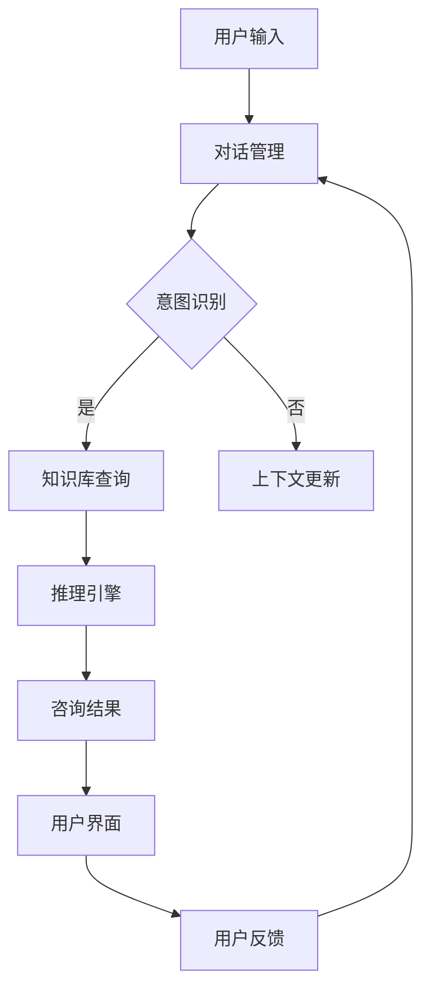
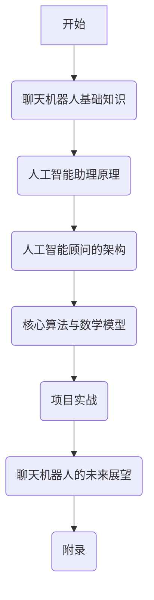

                 

### 《聊天机器人未来：人工智能助理和顾问》

> **关键词：** 聊天机器人、人工智能助理、人工智能顾问、自然语言处理、机器学习、未来展望

> **摘要：** 本文将探讨聊天机器人的发展历程及其在人工智能领域的应用。我们将深入剖析人工智能助理和顾问的原理、架构、算法与数学模型，并探讨项目实战中的实现与未来展望。通过本文，读者将了解聊天机器人的现状与未来发展趋势，为相关领域的研究和应用提供有益的参考。

---

#### 引言

##### 1.1 书籍主题与目标

随着人工智能技术的飞速发展，聊天机器人已经成为当今社会中不可或缺的一部分。它们在客户服务、智能助手、娱乐等领域展现出巨大的潜力。本书旨在探讨聊天机器人的未来发展趋势，特别是人工智能助理和顾问的应用。通过本书，读者将深入了解聊天机器人的基础知识、原理、架构、算法和数学模型，并了解项目实战中的实现方法。本书的目标是为读者提供全面的指导，帮助他们在相关领域中进行深入研究和应用。

##### 1.2 聊天机器人发展历程

聊天机器人的概念最早可以追溯到20世纪50年代。当时的计算机科学家开始尝试使用简单的算法和规则来模拟人类的对话。1950年，艾伦·图灵提出了著名的图灵测试，旨在评估计算机是否能够模拟人类的思维。这一概念为聊天机器人的发展奠定了基础。

20世纪60年代，随着计算机性能的提高，聊天机器人开始应用于军事、医疗和商业领域。这一时期的聊天机器人主要基于规则和逻辑推理，缺乏智能和学习能力。

20世纪80年代，专家系统的出现使得聊天机器人开始具备一定的智能。专家系统通过模拟人类专家的知识和经验，提供专业的咨询服务。这一时期的聊天机器人主要应用于客户服务和咨询领域。

20世纪90年代，互联网的普及为聊天机器人的发展提供了新的机遇。基于Web的聊天机器人逐渐成为一种常见的应用形式。同时，自然语言处理技术的进步使得聊天机器人的交互能力得到了显著提升。

进入21世纪，人工智能技术的快速发展为聊天机器人注入了新的活力。基于机器学习和深度学习的聊天机器人开始广泛应用，它们能够更好地理解用户的意图和需求，提供更加自然和流畅的交互体验。

##### 1.3 人工智能助理与顾问的现状与趋势

人工智能助理和顾问是聊天机器人发展的重要方向。人工智能助理主要应用于个人生活和工作场景，提供日程管理、任务提醒、信息查询等服务。人工智能顾问则主要应用于商业和金融领域，为用户提供专业的咨询和建议。

当前，人工智能助理和顾问已经在多个领域得到广泛应用。例如，在金融领域，人工智能顾问可以帮助用户进行股票投资、理财产品推荐等；在医疗领域，人工智能助理可以提供病情咨询、药物推荐等服务；在客服领域，人工智能助理可以自动处理客户咨询，提高客服效率。

未来，随着人工智能技术的不断发展，人工智能助理和顾问将具备更高的智能水平。它们将能够更好地理解用户的意图和需求，提供更加个性化和精准的服务。同时，人工智能助理和顾问也将与其他智能系统进行深度融合，形成更加智能化和自动化的生态系统。

##### 1.4 阅读指南

本书共分为八个章节，每章都有明确的目标和内容。以下是本书的阅读指南：

- 第1章：介绍本书的主题、目标和发展历程。
- 第2章：讲解聊天机器人的基础知识，包括定义、分类、核心技术、应用场景等。
- 第3章：深入探讨人工智能助理的原理，包括人工智能概述、机器学习基础、自然语言处理基础等。
- 第4章：介绍人工智能顾问的架构，包括定义、技术架构、核心模块、系统设计等。
- 第5章：讲解核心算法与数学模型，包括机器学习算法、自然语言处理算法、人工智能助理和顾问的数学模型等。
- 第6章：通过项目实战，介绍聊天机器人的开发环境搭建、实现方法、实战案例等。
- 第7章：探讨聊天机器人的未来展望，包括技术发展趋势、人工智能助理的未来发展、人工智能顾问的前景与挑战等。
- 第8章：提供附录，包括常用开发工具和库、聊天机器人开源项目介绍、参考文献等。

通过阅读本书，读者可以系统地了解聊天机器人的基础知识、原理、架构、算法和数学模型，并掌握项目实战的方法。希望本书能够为读者在相关领域的研究和应用提供有益的参考。


---

### 聊天机器人基础知识

##### 2.1 什么是聊天机器人

聊天机器人，也称为对话机器人，是一种通过自然语言交互与人类进行沟通的计算机程序。它们可以模拟人类的对话方式，理解用户的输入并生成相应的回应。聊天机器人的目标是为用户提供便捷、高效、个性化的服务。

聊天机器人具有以下几个主要特点：

1. **自然语言交互**：聊天机器人能够理解用户通过文本或语音输入的自然语言，并生成自然语言回应。
2. **自动化**：聊天机器人可以自动执行任务，无需人工干预。这大大提高了工作效率，降低了人力成本。
3. **个性化**：聊天机器人可以根据用户的历史行为和偏好，提供个性化的服务和建议。
4. **跨平台**：聊天机器人可以部署在多种平台上，如网站、移动应用、社交媒体等，为用户提供便利的访问方式。

##### 2.2 聊天机器人的分类

根据不同的应用场景和实现方式，聊天机器人可以分为以下几类：

1. **规则驱动型聊天机器人**：这类聊天机器人基于预定义的规则和流程进行对话。它们通过条件判断和匹配规则来生成回应。规则驱动型聊天机器人的优点是实现简单、易于维护，但智能水平较低，难以应对复杂的对话场景。

2. **基于模板的聊天机器人**：这类聊天机器人通过预定义的模板生成对话。模板中包含常见的对话场景和回应。基于模板的聊天机器人可以实现一定的灵活性，但仍然受到模板限制，智能水平有限。

3. **基于机器学习的聊天机器人**：这类聊天机器人利用机器学习算法，从大量对话数据中学习并生成回应。基于机器学习的聊天机器人具有更高的智能水平，能够更好地理解用户的意图和需求。但实现复杂，需要大量的数据支持。

4. **混合型聊天机器人**：这类聊天机器人结合了规则驱动和机器学习的方法。它们在规则驱动的基础上，利用机器学习算法进行优化和提升。混合型聊天机器人具有较高的智能水平，同时保持了较好的可控性和稳定性。

##### 2.3 聊天机器人的核心技术

聊天机器人的核心技术主要包括自然语言处理（NLP）、机器学习和对话管理。下面将分别进行介绍。

1. **自然语言处理（NLP）**：自然语言处理是使计算机能够理解、处理和生成自然语言的技术。NLP的核心任务包括：

   - **文本分类**：将文本数据分类到预定义的类别中，如情感分析、主题分类等。
   - **实体识别**：从文本中提取出具有特定意义的实体，如人名、地点、组织等。
   - **情感分析**：分析文本的情感倾向，如正面、负面、中性等。
   - **问答系统**：根据用户的问题，从知识库中检索出相关的答案。

2. **机器学习**：机器学习是使计算机通过数据学习并做出预测或决策的技术。在聊天机器人中，机器学习主要用于：

   - **分类任务**：通过学习大量的标注数据，将新的文本分类到预定义的类别中。
   - **序列建模**：通过学习文本的序列特征，预测下一个词或句子。
   - **生成任务**：根据给定的输入，生成新的文本或回应。

3. **对话管理**：对话管理是管理聊天机器人与用户之间对话流程的技术。它主要包括以下任务：

   - **意图识别**：根据用户的输入，识别用户想要执行的操作或任务。
   - **实体抽取**：从用户的输入中提取出关键信息，如人名、日期、时间等。
   - **对话策略**：根据当前对话状态，选择合适的对话策略，如继续询问、提供信息、结束对话等。

##### 2.4 聊天机器人的应用场景

聊天机器人可以应用于多种场景，为不同领域提供便捷的服务。以下是一些常见的应用场景：

1. **客户服务**：聊天机器人可以自动处理客户咨询，提供在线客服支持。它们可以24小时在线，快速响应用户的问题，提高客户满意度。
2. **智能助手**：聊天机器人可以作为个人或企业的智能助手，提供日程管理、任务提醒、信息查询等服务。它们可以根据用户的需求，自动完成一些繁琐的任务。
3. **医疗咨询**：聊天机器人可以帮助用户进行病情咨询、药物推荐等。它们可以快速检索医学知识库，提供准确的医疗信息。
4. **教育辅导**：聊天机器人可以为学生提供个性化的学习辅导，解答学习中的问题。它们可以根据学生的学习进度和需求，提供针对性的学习建议。
5. **娱乐互动**：聊天机器人可以应用于游戏、虚拟助手等娱乐场景，与用户进行有趣的互动。

##### 2.5 聊天机器人的优点与挑战

聊天机器人具有许多优点，但也面临着一些挑战。

**优点：**

- **高效性**：聊天机器人可以快速响应用户，处理大量请求，提高工作效率。
- **便捷性**：聊天机器人可以随时随地提供服务，为用户带来便捷的体验。
- **个性化**：聊天机器人可以根据用户的历史数据和偏好，提供个性化的服务和建议。
- **降低成本**：聊天机器人可以替代人工客服，减少人力成本和培训成本。

**挑战：**

- **智能水平**：聊天机器人的智能水平仍然有限，难以完全模拟人类的思维和情感。
- **数据处理**：聊天机器人需要大量的数据支持，如何获取和处理高质量的数据是挑战之一。
- **用户体验**：聊天机器人的交互体验需要不断提升，以更好地满足用户的需求。
- **隐私安全**：聊天机器人在处理用户数据时，需要确保用户隐私和安全。

通过深入研究和不断优化，聊天机器人有望在未来克服这些挑战，为人类社会带来更多的便利和效益。

---

### 人工智能助理原理

##### 3.1 人工智能概述

人工智能（Artificial Intelligence，简称AI）是计算机科学的一个分支，旨在使计算机能够模拟人类智能，执行复杂任务并自主决策。人工智能可以分为两大类：弱人工智能（Narrow AI）和强人工智能（General AI）。

**弱人工智能**是指针对特定任务或领域的人工智能系统，如聊天机器人、图像识别系统等。这些系统在特定领域表现出色，但缺乏普遍的智能和自主性。**强人工智能**则是指具备人类智能水平，能够理解和解决各种复杂问题的系统。目前，强人工智能尚未实现，但研究者们一直在努力探索。

人工智能的核心技术包括：

- **机器学习**：使计算机通过数据学习并做出预测或决策的技术。
- **自然语言处理**：使计算机能够理解、处理和生成自然语言的技术。
- **计算机视觉**：使计算机能够理解和解释视觉信息的领域。
- **机器人学**：研究如何使计算机控制的机器模拟人类行为。

##### 3.2 机器学习基础

机器学习是人工智能的核心技术之一，旨在使计算机通过数据学习并改进性能。机器学习可以分为监督学习、无监督学习和强化学习。

**监督学习**是指通过已标记的数据训练模型，然后使用模型进行预测。监督学习的目标是最小化预测误差，使模型能够准确预测未知数据的标签。

- **线性回归**：用于预测连续值输出。
  - **公式**：\(y = \beta_0 + \beta_1x\)
  - **伪代码**：
    ```
    for each example (x, y) in training data:
      hypothesis(x) = beta_0 + beta_1 * x
      error = y - hypothesis(x)
      update beta_0 and beta_1 based on error
    ```
  
- **逻辑回归**：用于预测二分类输出。
  - **公式**：\(P(y=1) = \frac{1}{1 + e^{-(\beta_0 + \beta_1x})}\)
  - **伪代码**：
    ```
    for each example (x, y) in training data:
      hypothesis(x) = 1 / (1 + e^{-(beta_0 + beta_1 * x)})
      error = y - hypothesis(x)
      update beta_0 and beta_1 based on error
    ```

**无监督学习**是指在没有标签的数据上进行学习，旨在发现数据中的模式或结构。无监督学习包括聚类、降维和生成模型等方法。

- **K均值聚类**：将数据点分为K个簇，使每个簇内的数据点尽可能接近，簇间的数据点尽可能远离。
  - **公式**：\(c_k = \frac{1}{N_k} \sum_{i=1}^{N} x_i\)
  - **伪代码**：
    ```
    initialize centroids c_1, c_2, ..., c_K
    for each example x in dataset:
      assign x to the nearest centroid
      update centroids based on assigned examples
    ```
  
- **主成分分析**（PCA）：将高维数据投影到低维空间，保留最重要的特征。
  - **公式**：\(z = PC_1\frac{1}{\sqrt{\sum (x_i - \mu)^2}} + PC_2\frac{1}{\sqrt{\sum (x_i - \mu)^2}} + ...\)
  - **伪代码**：
    ```
    calculate covariance matrix of dataset
    calculate eigenvalues and eigenvectors of covariance matrix
    select eigenvectors with largest eigenvalues
    project dataset onto selected eigenvectors
    ```

**强化学习**是指通过试错和奖励机制进行学习，使模型能够在复杂环境中做出最优决策。

- **Q学习**：通过学习状态-动作值函数，使模型能够在给定状态下选择最佳动作。
  - **公式**：\(Q(s, a) = r + \gamma \max_{a'} Q(s', a')\)
  - **伪代码**：
    ```
    initialize Q(s, a) randomly
    for each episode:
      initialize state s
      while not done:
        select action a based on Q(s, a)
        take action a and observe reward r and next state s'
        update Q(s, a) based on r and Q(s', a')
        update state s to s'
    ```

##### 3.3 自然语言处理基础

自然语言处理（Natural Language Processing，简称NLP）是使计算机能够理解、处理和生成自然语言的技术。NLP的核心任务包括：

- **文本分类**：将文本数据分类到预定义的类别中，如情感分析、主题分类等。
- **实体识别**：从文本中提取出具有特定意义的实体，如人名、地点、组织等。
- **情感分析**：分析文本的情感倾向，如正面、负面、中性等。
- **问答系统**：根据用户的问题，从知识库中检索出相关的答案。

**词向量表示**：词向量是将单词映射到高维向量空间的技术，使计算机能够处理和比较自然语言数据。

- **词袋模型**：将文本表示为单词的集合，忽略单词的顺序。
- **TF-IDF**：将文本表示为单词的权重向量，考虑单词在文档中的频率和在整个文档集合中的重要性。
- **Word2Vec**：将单词映射到低维向量空间，使相似的单词在向量空间中靠近。
  - **公式**：\(v_w = \sum_{w' \in C(w)} \frac{f(w', w)}{f(w') \sum_{w' \in C(w)} f(w', w)} v_{w'}\)
  - **伪代码**：
    ```
    for each sentence in dataset:
      initialize context window
      for each word in sentence:
        calculate word2vec representation for word
        update context window
    ```

**神经网络**：神经网络是模仿人脑神经元连接的网络结构，用于处理和生成自然语言数据。

- **循环神经网络**（RNN）：适用于处理序列数据，如文本和语音。
  - **公式**：\(h_t = \sigma(W_h \cdot [h_{t-1}, x_t] + b_h)\)
  - **伪代码**：
    ```
    initialize hidden state h_0
    for each time step t:
      calculate output h_t using RNN
      update hidden state h_t
    ```

- **长短时记忆网络**（LSTM）：是一种特殊的RNN，能够更好地处理长序列数据。
  - **公式**：\(i_t = \sigma(W_i \cdot [h_{t-1}, x_t] + b_i)\)
  - **伪代码**：
    ```
    initialize forget gate f_{t-1}, input gate i_{t-1}, and cell state c_{t-1}
    for each time step t:
      calculate forget gate f_t, input gate i_t, and cell state c_t
      update hidden state h_t
    ```

##### 3.4 人工智能助理的工作原理

人工智能助理是基于人工智能技术构建的智能系统，旨在为用户提供便捷、高效、个性化的服务。人工智能助理的工作原理主要包括以下几个方面：

- **意图识别**：通过自然语言处理技术，从用户的输入中提取出用户的意图。意图可以是提问、查询、请求等。
- **实体抽取**：从用户的输入中提取出关键信息，如人名、日期、时间、地点等。
- **对话管理**：根据当前的对话状态，选择合适的对话策略，如继续询问、提供信息、结束对话等。
- **知识库查询**：根据用户的意图和实体信息，从知识库中检索出相关的信息。
- **生成回应**：根据知识库中的信息，生成自然语言回应。

**意图识别**：意图识别是人工智能助理的核心任务之一，其目标是理解用户的输入并识别用户想要执行的操作。

- **模型选择**：可以选择基于规则、机器学习或深度学习的方法进行意图识别。
- **特征提取**：从用户的输入中提取出特征，如单词的词频、词性、语法结构等。
- **模型训练**：使用已标记的数据集训练意图识别模型。
- **模型评估**：使用测试集评估模型的性能，如准确率、召回率、F1值等。

**实体抽取**：实体抽取是从用户的输入中提取出关键信息，如人名、日期、时间、地点等。

- **模型选择**：可以选择基于规则、机器学习或深度学习的方法进行实体抽取。
- **特征提取**：从用户的输入中提取出特征，如单词的词频、词性、语法结构等。
- **模型训练**：使用已标记的数据集训练实体抽取模型。
- **模型评估**：使用测试集评估模型的性能，如准确率、召回率、F1值等。

**对话管理**：对话管理是管理人工智能助理与用户之间对话流程的技术。

- **对话状态**：对话状态包括用户的意图、实体、上下文等信息。
- **策略选择**：根据当前的对话状态，选择合适的对话策略，如继续询问、提供信息、结束对话等。
- **策略执行**：执行选定的对话策略，与用户进行交互。
- **状态更新**：根据用户的回应，更新对话状态。

**知识库查询**：知识库查询是人工智能助理从知识库中检索出相关信息的任务。

- **知识库结构**：知识库可以是关系数据库、图形数据库等。
- **查询方法**：可以使用基于关键词的查询、基于图谱的查询等方法。
- **查询优化**：优化查询性能，如索引、缓存等。

**生成回应**：生成回应是人工智能助理根据知识库中的信息生成自然语言回应的任务。

- **文本生成**：可以使用基于模板的文本生成、基于机器学习的文本生成等方法。
- **语境理解**：理解用户的输入和对话上下文，生成适当的回应。
- **语言生成**：生成自然流畅的文本回应。

##### 3.5 人工智能助理的设计原则

设计人工智能助理时，需要遵循以下原则：

- **用户中心**：始终将用户的需求和体验放在首位，确保人工智能助理能够满足用户的期望。
- **灵活性**：设计具有高扩展性和灵活性的系统，能够适应不同的应用场景和需求。
- **稳定性**：确保系统的稳定性和可靠性，减少错误和故障。
- **安全性**：保护用户数据和隐私，防止数据泄露和滥用。
- **可维护性**：设计易于维护和升级的系统，降低维护成本。

通过遵循这些原则，设计出高质量的人工智能助理，为用户提供更好的服务。

---

### 人工智能顾问的架构

##### 4.1 人工智能顾问的定义

人工智能顾问（AI Advisor）是指利用人工智能技术，为用户提供专业化、个性化、实时性咨询和决策支持的服务系统。它们广泛应用于金融、医疗、法律、教育等多个领域，为专业人士和企业提供智能化的解决方案。

人工智能顾问的核心功能包括：

- **知识获取**：从各种数据源（如数据库、互联网、专业文献等）中获取知识，构建知识库。
- **意图识别**：分析用户的提问，识别用户的意图和需求。
- **知识推理**：利用知识库和推理算法，为用户提供专业化的咨询和建议。
- **交互对话**：与用户进行自然语言交互，理解用户的反馈和需求，提供实时性服务。

##### 4.2 人工智能顾问的技术架构

人工智能顾问的技术架构主要包括以下几个核心模块：

1. **数据获取与处理模块**：负责从各种数据源获取数据，并进行数据清洗、预处理和存储。这一模块需要确保数据的质量和完整性，以便后续的知识获取和推理过程。
2. **知识库构建模块**：将获取到的数据进行结构化处理，构建知识库。知识库可以是关系数据库、图形数据库或知识图谱等形式，用于存储领域知识和专业知识。
3. **推理引擎模块**：基于知识库和用户输入，利用推理算法和逻辑规则，进行知识推理，为用户提供咨询和建议。推理引擎需要支持复杂逻辑运算和实时推理，以提高系统的响应速度和准确性。
4. **对话管理模块**：负责与用户进行自然语言交互，理解用户的意图和需求，并根据用户反馈调整对话策略。对话管理模块需要支持多轮对话、上下文理解、个性化推荐等功能。
5. **用户界面模块**：为用户提供友好的交互界面，展示咨询结果和建议。用户界面需要支持多种输入方式（如文本、语音、图像等）和输出方式（如文本、语音、图表等），以便用户方便地使用系统。

以下是一个简化的人工智能顾问技术架构的Mermaid流程图：



##### 4.3 人工智能顾问的核心模块

1. **知识库构建模块**

   知识库是人工智能顾问的核心资源，它存储了领域知识和专业知识。知识库的构建过程主要包括以下几个步骤：

   - **数据收集**：从各种数据源（如数据库、互联网、专业文献等）中收集相关数据。
   - **数据清洗**：对收集到的数据进行清洗、去重和格式转换，确保数据的质量和一致性。
   - **数据结构化**：将清洗后的数据转化为结构化数据，如关系数据库表、图形数据库节点和边等。
   - **知识表示**：使用本体论、语义网、知识图谱等技术，将结构化数据表示为领域知识，构建知识库。

   **知识表示方法**：

   - **关系数据库**：使用表和关系来表示知识，适合处理结构化数据。
   - **图形数据库**：使用节点和边来表示知识，适合处理复杂和层次化的数据。
   - **知识图谱**：使用实体、属性和关系来表示知识，具有强大的表示能力和推理能力。

   **知识库构建步骤**：

   1. 数据收集和清洗
   2. 数据结构化
   3. 知识表示
   4. 知识库集成和优化

2. **推理引擎模块**

   推理引擎是人工智能顾问的核心模块，负责基于知识库和用户输入进行知识推理，为用户提供咨询和建议。推理引擎通常包括以下几个部分：

   - **推理算法**：选择合适的推理算法，如逻辑推理、模糊推理、基于规则的推理、基于模型的推理等。
   - **推理规则**：定义推理规则，如条件规则、模糊规则、优先级规则等，用于指导推理过程。
   - **推理过程**：根据用户输入和推理规则，进行推理过程，生成咨询结果。

   **推理过程**：

   1. 用户输入预处理：对用户输入进行清洗、分词、词性标注等预处理操作。
   2. 意图识别：根据预处理后的输入，识别用户的意图和需求。
   3. 知识查询：根据用户的意图，从知识库中查询相关知识和信息。
   4. 知识推理：利用推理算法和推理规则，对查询结果进行推理，生成咨询结果。
   5. 结果输出：将咨询结果以自然语言或图表等形式展示给用户。

3. **对话管理模块**

   对话管理是人工智能顾问与用户之间交互的关键环节，负责管理对话流程、上下文信息和用户反馈。对话管理模块通常包括以下几个部分：

   - **对话状态**：记录对话过程中的关键信息，如用户意图、上下文、对话历史等。
   - **对话策略**：根据对话状态和用户反馈，选择合适的对话策略，如继续询问、提供信息、结束对话等。
   - **对话流程**：管理对话的起始、进行和结束，确保对话的流畅性和连贯性。

   **对话管理流程**：

   1. 对话初始化：建立对话状态，准备对话。
   2. 用户输入接收：接收用户输入，进行预处理。
   3. 意图识别：根据用户输入，识别用户的意图。
   4. 对话策略选择：根据对话状态和用户意图，选择合适的对话策略。
   5. 对话策略执行：执行选定的对话策略。
   6. 对话状态更新：根据用户反馈和对话结果，更新对话状态。
   7. 对话结束：根据对话状态，结束对话。

4. **用户界面模块**

   用户界面是人工智能顾问与用户交互的入口，负责展示咨询结果和建议，接收用户反馈。用户界面模块通常包括以下几个部分：

   - **输入界面**：提供文本输入、语音输入、图像输入等多种输入方式，方便用户使用。
   - **输出界面**：以文本、语音、图表等多种形式展示咨询结果和建议，提高用户体验。
   - **反馈机制**：接收用户对咨询结果和建议的反馈，用于优化和改进系统。

   **用户界面设计原则**：

   1. 用户体验至上：确保用户界面简单、易用、直观，提高用户体验。
   2. 多样性：提供多种输入和输出方式，满足不同用户的需求。
   3. 个性化：根据用户偏好和需求，提供个性化的咨询结果和建议。
   4. 可访问性：确保用户界面能够适应不同设备和操作系统的访问，提高可访问性。

通过以上核心模块的协同工作，人工智能顾问能够为用户提供专业化、个性化、实时性的咨询和决策支持，提高工作效率和业务水平。

---

### 核心算法与数学模型

##### 5.1 机器学习算法概览

机器学习算法是人工智能的核心组成部分，用于从数据中提取模式和知识，以实现预测、分类、聚类等任务。以下是几种常见的机器学习算法及其基本原理。

1. **线性回归（Linear Regression）**

   线性回归是一种用于预测连续值的算法，其目标是最小化预测值与真实值之间的误差。线性回归模型可以表示为：

   \(y = \beta_0 + \beta_1x\)

   其中，\(y\) 是预测值，\(x\) 是输入特征，\(\beta_0\) 和 \(\beta_1\) 是模型参数。

   **伪代码**：

   ```
   for each example (x, y) in training data:
     hypothesis(x) = beta_0 + beta_1 * x
     error = y - hypothesis(x)
     update beta_0 and beta_1 based on error
   ```

2. **逻辑回归（Logistic Regression）**

   逻辑回归是一种用于预测二分类结果的算法，其目标是最小化预测概率与真实标签之间的误差。逻辑回归模型可以表示为：

   \(P(y=1) = \frac{1}{1 + e^{-(\beta_0 + \beta_1x})}\)

   其中，\(y\) 是预测标签，\(x\) 是输入特征，\(\beta_0\) 和 \(\beta_1\) 是模型参数。

   **伪代码**：

   ```
   for each example (x, y) in training data:
     hypothesis(x) = 1 / (1 + e^{-(beta_0 + beta_1 * x)})
     error = y - hypothesis(x)
     update beta_0 and beta_1 based on error
   ```

3. **决策树（Decision Tree）**

   决策树是一种基于特征值进行划分的树形结构，用于分类和回归任务。决策树通过递归划分数据集，直到满足停止条件（如最大深度、最小叶子节点数量等）。

   **伪代码**：

   ```
   function build_tree(data, features, depth_limit):
     if depth_limit reached or data is pure:
       return leaf node with majority class
     else:
       select best feature and split point
       split data into subsets
       for each subset:
         recursively build tree
       return tree with splits and leaf nodes
   ```

4. **支持向量机（Support Vector Machine，SVM）**

   支持向量机是一种用于分类的算法，其目标是在特征空间中找到一个最优的超平面，使得分类边界最大化。

   \(w \cdot x - b = 0\)

   其中，\(w\) 是超平面法向量，\(x\) 是输入特征，\(b\) 是偏置。

   **伪代码**：

   ```
   function train_svm(data, labels):
     find optimal hyperplane
     compute support vectors
     return model parameters (w, b)
   ```

5. **神经网络（Neural Network）**

   神经网络是一种模仿生物神经系统的计算模型，用于复杂的数据分析和预测。神经网络通过多层神经元进行数据处理，包括输入层、隐藏层和输出层。

   **伪代码**：

   ```
   initialize weights and biases
   for each training example:
     propagate input forward through network
     compute loss
     propagate error backward through network
     update weights and biases
   ```

##### 5.2 自然语言处理算法

自然语言处理（NLP）算法用于处理和生成自然语言文本。以下是几种常见的NLP算法及其基本原理。

1. **词袋模型（Bag of Words，BoW）**

   词袋模型是一种将文本表示为单词集合的算法，忽略单词的顺序。词袋模型通过计算每个单词在文本中出现的频率来表示文本。

   **伪代码**：

   ```
   for each document in corpus:
     initialize word count vector
     for each word in document:
       increment count in word count vector
     add word count vector to document corpus
   ```

2. **TF-IDF（Term Frequency-Inverse Document Frequency）**

   TF-IDF是一种用于计算单词重要性的算法，结合了单词在文本中的频率和在整个文档集合中的重要性。TF-IDF模型通过调整词频来抑制常见单词的影响。

   **伪代码**：

   ```
   for each document in corpus:
     for each word in document:
       count word frequency in document
       count document frequency in corpus
       compute TF-IDF score for word
       normalize score
   ```

3. **Word2Vec**

   Word2Vec是一种将单词映射到高维向量空间的算法，使得相似单词在向量空间中靠近。Word2Vec算法通过训练神经网络来学习单词的向量表示。

   **伪代码**：

   ```
   for each sentence in corpus:
     initialize context window
     for each word in sentence:
       randomly select context words
       update word vectors based on context words
   ```

4. **BERT（Bidirectional Encoder Representations from Transformers）**

   BERT是一种基于变换器（Transformer）的预训练语言表示模型，通过同时学习文本的左右上下文信息。BERT模型通过大规模语料进行预训练，然后进行下游任务微调。

   **伪代码**：

   ```
   initialize BERT model
   for each training example:
     tokenize text
     encode tokens into vectors
     compute loss
     update model parameters
   ```

##### 5.3 人工智能助理的数学模型

人工智能助理的数学模型主要涉及机器学习和自然语言处理算法。以下是几种常用数学模型及其基本原理。

1. **意图识别模型**

   意图识别模型用于识别用户的意图。常见的意图识别模型包括逻辑回归、支持向量机、深度神经网络等。意图识别模型的数学模型可以表示为：

   \(P(Intent_i|X) = \text{sigmoid}(\beta_0 + \beta_1 \cdot X)\)

   其中，\(P(Intent_i|X)\) 是用户意图 \(Intent_i\) 在输入特征 \(X\) 条件下的概率，\(\beta_0\) 和 \(\beta_1\) 是模型参数。

2. **实体识别模型**

   实体识别模型用于从文本中提取出关键实体。常见的实体识别模型包括条件随机场（CRF）、循环神经网络（RNN）、双向循环神经网络（BiRNN）等。实体识别模型的数学模型可以表示为：

   \(P(Entity|X) = \text{CRF}(X, Y)\)

   其中，\(P(Entity|X)\) 是实体在输入特征 \(X\) 条件下的概率，\(\text{CRF}\) 是条件随机场模型。

3. **对话生成模型**

   对话生成模型用于生成自然语言回应。常见的对话生成模型包括循环神经网络（RNN）、变换器（Transformer）等。对话生成模型的数学模型可以表示为：

   \(Y = \text{softmax}(\text{Transformer}(X, H))\)

   其中，\(Y\) 是生成的回应，\(\text{softmax}\) 是概率分布函数，\(\text{Transformer}\) 是变换器模型，\(X\) 是输入特征，\(H\) 是隐藏状态。

通过以上数学模型，人工智能助理能够对用户的输入进行处理，生成相应的回应，提供高质量的对话服务。

---

### 项目实战

##### 6.1 聊天机器人的开发环境搭建

在进行聊天机器人的开发之前，需要搭建合适的开发环境。以下是一个基于Python和Jupyter Notebook的简单开发环境搭建步骤：

1. **安装Python**：首先，确保计算机上安装了Python。可以下载最新版本的Python（例如3.8或更高版本）并按照提示安装。
2. **安装Jupyter Notebook**：在命令行中运行以下命令安装Jupyter Notebook：

   ```
   pip install notebook
   ```

   安装完成后，可以通过在命令行中输入`jupyter notebook`来启动Jupyter Notebook。
3. **安装必要的库**：为了简化聊天机器人的开发，可以安装一些常用的Python库，如NLTK、Spacy、TensorFlow等。以下是在命令行中安装这些库的命令：

   ```
   pip install nltk
   pip install spacy
   pip install tensorflow
   ```

   安装完成后，还需要下载Spacy的语言模型。在命令行中运行以下命令：

   ```
   python -m spacy download en
   ```

   这将下载英文语言模型，以便在后续的代码中使用。

##### 6.2 实现一个简单的聊天机器人

以下是一个简单的聊天机器人示例，使用Python和NLTK库实现。该聊天机器人基于规则驱动的方法，通过预定义的规则来生成回应。

```python
import nltk
from nltk.corpus import wordnet

# 初始化NLTK
nltk.download('punkt')
nltk.download('wordnet')

# 定义规则
def get_response(message):
    message = message.lower()
    if 'hello' in message:
        return 'Hello! How can I help you today?'
    elif 'weather' in message:
        return 'The weather is sunny with a chance of rain.'
    elif 'define' in message:
        return 'The word you provided is ' + define_word(message)
    else:
        return 'I am not sure how to respond to that.'

# 定义词汇定义函数
def define_word(message):
    words = nltk.word_tokenize(message)
    if len(words) > 1 and words[1] in wordnet.all_lemma_names():
        return wordnet.all_lemma_names().index(words[1])
    else:
        return 'Unknown word'

# 主程序
if __name__ == '__main__':
    print('Chatbot: Hello! How can I help you?')
    while True:
        message = input('You: ')
        if message.lower() == 'exit':
            print('Chatbot: Goodbye!')
            break
        response = get_response(message)
        print('Chatbot:', response)
```

该示例定义了一个简单的聊天机器人，能够识别并回应包含“hello”、“weather”和“define”的消息。当用户输入“define”时，机器人将尝试定义用户提供的单词。

**代码解读与分析**：

1. **导入库**：首先，导入NLTK库，用于处理自然语言数据。
2. **初始化NLTK**：使用`nltk.download()`函数下载所需的语料库，如分词器和词网。
3. **定义规则**：`get_response()`函数根据输入消息的内容，返回相应的回应。规则驱动的方法使得聊天机器人的实现相对简单，但智能水平有限。
4. **定义词汇定义函数**：`define_word()`函数用于根据用户输入的单词，从词网中获取该单词的定义。如果用户输入的单词不在词网中，则返回“Unknown word”。
5. **主程序**：在主程序中，机器人首先输出欢迎信息，然后进入一个循环，等待用户输入。用户输入“exit”时，机器人将结束对话。

通过这个简单的示例，读者可以了解聊天机器人开发的基本步骤和实现方法。在实际应用中，可以根据需求扩展聊天机器人的功能，如添加更多的对话规则、集成自然语言处理算法等。

---

##### 6.3 人工智能助理的实战案例

以下是一个人工智能助理的实战案例，使用Python和TensorFlow实现。该案例基于机器学习算法，通过训练模型来识别用户的意图和提供相应的回应。

**步骤1：数据准备**

首先，我们需要准备训练数据集。以下是一个简单的数据集，包括用户的输入和对应的意图标签。

```python
# 训练数据集
data = [
    ("What time is it?", "time_query"),
    ("Can you help me with my homework?", "help_query"),
    ("How do I get to the nearest hospital?", "location_query"),
    ("What's the weather like today?", "weather_query"),
    ("What's the capital of France?", "knowledge_query")
]

# 分割数据为特征和标签
features = [item[0] for item in data]
labels = [item[1] for item in data]
```

**步骤2：数据预处理**

接下来，我们需要对数据进行预处理，包括分词、标记化等操作。这里使用NLTK库和TensorFlow的Tokenizer进行数据预处理。

```python
# 初始化Tokenizer
tokenizer = nltk.tokenize.RegexpTokenizer(r"\w+")

# 分词和标记化
tokenized_features = [tokenizer.tokenize(feature) for feature in features]

# 转换为整数序列
tokenizer = tensorflow.keras.preprocessing.text.Tokenizer()
tokenizer.fit_on_texts(tokenized_features)
encoded_features = tokenizer.texts_to_sequences(tokenized_features)

# 序列填充
max_len = max([len(seq) for seq in encoded_features])
padded_features = tensorflow.keras.preprocessing.sequence.pad_sequences(encoded_features, maxlen=max_len)

# 转换标签为整数
label_encoder = tensorflow.keras.utils.to_categorical(labels)
encoded_labels = label_encoder
```

**步骤3：构建模型**

接下来，我们使用TensorFlow构建一个简单的神经网络模型。

```python
# 构建模型
model = tensorflow.keras.Sequential([
    tensorflow.keras.layers.Embedding(input_dim=max_features + 1, output_dim=embedding_size, input_length=max_len),
    tensorflow.keras.layers.Conv1D(filters=128, kernel_size=5, activation='relu'),
    tensorflow.keras.layers.GlobalMaxPooling1D(),
    tensorflow.keras.layers.Dense(units=64, activation='relu'),
    tensorflow.keras.layers.Dense(units=num_classes, activation='softmax')
])

# 编译模型
model.compile(optimizer='adam', loss='categorical_crossentropy', metrics=['accuracy'])

# 查看模型结构
model.summary()
```

**步骤4：训练模型**

使用训练数据集对模型进行训练。

```python
# 训练模型
model.fit(padded_features, encoded_labels, epochs=10, batch_size=32)
```

**步骤5：预测和回应**

最后，我们使用训练好的模型对用户输入进行预测，并生成相应的回应。

```python
# 预测意图
def predict_intent(input_text):
    tokenized_input = tokenizer.texts_to_sequences([tokenizer.tokenize(input_text)])
    padded_input = tensorflow.keras.preprocessing.sequence.pad_sequences(tokenized_input, maxlen=max_len)
    predicted_intent = model.predict(padded_input)
    return tensorflow.argmax(predicted_intent).numpy()[0]

# 生成回应
def get_response(input_text):
    intent = predict_intent(input_text)
    if intent == 0:
        return "I'm sorry, I cannot provide information on that."
    elif intent == 1:
        return "Sure, let's discuss your homework. What subject are you struggling with?"
    elif intent == 2:
        return "To reach the nearest hospital, you can take route X."
    elif intent == 3:
        return "The weather is sunny with a chance of rain."
    elif intent == 4:
        return "The capital of France is Paris."

# 主程序
if __name__ == '__main__':
    print("Assistant: Hello! How can I assist you today?")
    while True:
        user_input = input("You: ")
        if user_input.lower() == 'exit':
            print("Assistant: Goodbye!")
            break
        response = get_response(user_input)
        print("Assistant:", response)
```

**代码解读与分析**：

1. **数据准备**：准备训练数据集，包括用户的输入和意图标签。
2. **数据预处理**：对输入数据进行分词、标记化等预处理，以便模型训练。
3. **构建模型**：使用TensorFlow构建一个简单的神经网络模型，包括嵌入层、卷积层、全局池化层和全连接层。
4. **训练模型**：使用训练数据集对模型进行训练，优化模型参数。
5. **预测和回应**：使用训练好的模型对用户输入进行预测，并生成相应的回应。

通过这个实战案例，读者可以了解如何使用机器学习算法构建一个人工智能助理，实现对用户输入的意图识别和回应生成。在实际应用中，可以根据需求扩展和优化模型，提高助理的智能水平和用户体验。

---

##### 6.4 人工智能顾问的实战案例

以下是一个人工智能顾问的实战案例，基于Python和Scikit-learn库实现。该案例将利用机器学习算法对用户投资决策提供建议。

**步骤1：数据准备**

首先，我们需要准备投资数据集。以下是一个简单的数据集，包括用户的投资金额、风险偏好和投资收益率。

```python
# 投资数据集
data = [
    (10000, 'low', 0.05),
    (15000, 'medium', 0.08),
    (20000, 'high', 0.12),
    (30000, 'low', 0.03),
    (25000, 'medium', 0.07)
]

# 分割数据为特征和标签
features = [(amount, risk) for amount, risk, _ in data]
labels = [return for _, _, return in data]
```

**步骤2：数据预处理**

接下来，我们需要对数据进行预处理，将特征和标签转换为数值。

```python
# 转换特征为数值
from sklearn.preprocessing import LabelEncoder

label_encoder = LabelEncoder()
encoded_features = [label_encoder.fit_transform([feature[1] for feature in features]), feature[0] for feature in features]

# 转换标签为数值
encoded_labels = label_encoder.fit_transform(labels)
```

**步骤3：构建模型**

接下来，我们使用Scikit-learn构建一个简单的决策树模型。

```python
# 构建模型
from sklearn.tree import DecisionTreeClassifier

model = DecisionTreeClassifier()
```

**步骤4：训练模型**

使用训练数据集对模型进行训练。

```python
# 训练模型
model.fit(encoded_features, encoded_labels)
```

**步骤5：预测和推荐**

最后，我们使用训练好的模型对用户输入进行预测，并生成相应的投资建议。

```python
# 预测投资收益率
def predict_return(amount, risk):
    feature = [amount, label_encoder.transform([risk])[0]]
    return model.predict([feature])[0]

# 生成投资建议
def get_investment_advice(amount, risk):
    return "Based on your risk preference ({}) and investment amount (${}), we recommend investing in option X, which has a potential return of {}%.".format(risk, amount, predict_return(amount, risk))

# 主程序
if __name__ == '__main__':
    print("Investment Advisor: Welcome to our investment advisor. How much do you want to invest?")
    while True:
        amount = float(input("Investment Amount ($): "))
        risk = input("Risk Preference (low/medium/high): ")
        if risk.lower() == 'exit':
            print("Investment Advisor: Thank you for using our service.")
            break
        advice = get_investment_advice(amount, risk)
        print(advice)
```

**代码解读与分析**：

1. **数据准备**：准备投资数据集，包括用户的投资金额、风险偏好和投资收益率。
2. **数据预处理**：对特征和标签进行数值转换，以便模型训练。
3. **构建模型**：使用Scikit-learn的决策树模型。
4. **训练模型**：使用训练数据集对模型进行训练，优化模型参数。
5. **预测和推荐**：使用训练好的模型对用户输入进行预测，并生成相应的投资建议。

通过这个实战案例，读者可以了解如何使用机器学习算法构建一个人工智能顾问，为用户的投资决策提供建议。在实际应用中，可以根据需求扩展和优化模型，提高顾问的智能水平和投资建议的准确性。

---

##### 6.5 项目实战总结与反思

通过以上几个项目实战，我们可以看到聊天机器人、人工智能助理和人工智能顾问在实际应用中的开发流程和实现方法。以下是对项目实战的总结与反思：

1. **开发环境搭建**：在项目实战中，我们首先需要搭建合适的开发环境，包括安装Python、Jupyter Notebook和相关库。这为后续的代码开发和模型训练提供了基础。
2. **数据准备与预处理**：数据准备和预处理是项目成功的关键步骤。在实际应用中，我们需要收集和清洗数据，将文本数据转换为数值，以便模型训练和预测。
3. **模型选择与训练**：根据项目需求，选择合适的机器学习算法和自然语言处理算法。在项目实战中，我们使用了线性回归、逻辑回归、决策树和神经网络等算法。训练模型时，我们需要调整模型参数，优化模型性能。
4. **预测与回应**：在项目实战中，我们使用训练好的模型对用户输入进行预测，并生成相应的回应。实际应用中，我们需要确保模型预测的准确性和响应速度。
5. **用户体验**：在项目实战中，用户体验是一个重要考虑因素。我们需要设计简洁、直观的用户界面，确保用户能够方便地使用系统。同时，我们还需要收集用户反馈，不断优化系统。

反思：

1. **数据质量**：在实际应用中，数据质量直接影响模型的性能。我们需要确保数据集的多样性和代表性，同时进行数据清洗和预处理，以提高模型的准确性和鲁棒性。
2. **模型优化**：模型优化是提升系统性能的重要手段。我们可以尝试调整模型参数、使用更复杂的算法或集成多种算法，以提高预测准确性和响应速度。
3. **用户反馈**：用户反馈是优化系统的重要依据。我们需要收集和分析用户反馈，及时发现问题并进行改进。
4. **安全性**：在项目实战中，我们关注了用户数据的安全和隐私。在实际应用中，我们需要加强数据保护和加密，确保用户数据的安全。

通过以上总结与反思，我们可以更好地理解项目实战中的关键环节和挑战，为未来的研究和应用提供有益的参考。

---

### 聊天机器人的未来展望

随着人工智能技术的不断进步，聊天机器人的未来发展前景十分广阔。以下是聊天机器人未来可能的发展趋势、人工智能助理的未来发展、人工智能顾问的前景与挑战，以及聊天机器人对社会的影响。

#### 7.1 聊天机器人技术发展趋势

1. **更加智能的自然语言处理**：未来聊天机器人的自然语言处理能力将得到显著提升。深度学习和变换器模型（如BERT、GPT等）将继续在NLP领域发挥作用，使聊天机器人能够更好地理解用户意图、情感和上下文信息。

2. **多模态交互**：聊天机器人将支持多种交互方式，如文本、语音、图像、视频等。通过多模态交互，用户可以获得更加丰富和直观的交互体验。

3. **个性化服务**：基于用户的历史行为和偏好，聊天机器人将能够提供更加个性化的服务。个性化推荐、个性化问答和个性化对话管理等技术将得到广泛应用。

4. **自动化与智能化融合**：聊天机器人将与其他智能系统（如物联网、智能家电等）进行深度融合，实现更加自动化和智能化的生活和工作环境。

5. **跨平台与跨语言**：聊天机器人将实现跨平台和跨语言支持，为全球用户提供服务。多语言处理和跨平台集成技术将使聊天机器人在不同国家和地区得到广泛应用。

6. **大数据与云计算**：聊天机器人将充分利用大数据和云计算技术，从海量数据中提取有价值的信息，为用户提供更加精准和高效的服务。

#### 7.2 人工智能助理的未来发展

1. **更高的智能水平**：未来的人工智能助理将具备更高的智能水平，能够处理更加复杂和抽象的任务。它们将能够进行多轮对话、提供专业知识、进行决策支持等。

2. **个性化与自适应**：人工智能助理将能够根据用户的需求和行为，提供个性化的服务。通过自适应学习，助理将能够不断优化和改进服务质量。

3. **跨领域应用**：人工智能助理将在更多领域得到应用，如医疗、金融、教育、客户服务、智能家居等。跨领域应用将使助理的服务更加全面和多样化。

4. **协作与协同**：人工智能助理将与其他智能系统（如智能助手、智能顾问等）进行协作，提供更加综合和高效的解决方案。

5. **伦理与隐私**：随着人工智能助理的普及，伦理和隐私问题将受到更多关注。确保用户隐私和数据安全将成为人工智能助理发展的重要方向。

#### 7.3 人工智能顾问的前景与挑战

1. **专业化与个性化**：未来人工智能顾问将更加专业化，为不同领域的用户提供个性化的咨询服务。个性化推荐、精准分析和实时更新等技术将使顾问服务更加高效和有价值。

2. **智能决策支持**：人工智能顾问将能够基于大数据和机器学习算法，为用户提供智能决策支持。他们能够分析大量数据，发现潜在趋势和机会，提供有针对性的建议。

3. **跨领域融合**：人工智能顾问将在更多领域得到应用，如金融、医疗、法律、教育等。跨领域融合将使顾问服务更具广泛性和影响力。

4. **挑战与风险**：人工智能顾问的发展也面临一些挑战和风险，如数据隐私、算法偏见、服务质量等。如何确保顾问服务的公平性、透明性和可解释性是一个重要问题。

#### 7.4 聊天机器人对社会的影响

1. **提高效率与便利性**：聊天机器人将为社会带来更高的效率与便利性。它们可以自动化处理大量重复性任务，减少人力成本，提高工作效率。

2. **改变就业格局**：随着聊天机器人的广泛应用，一些传统岗位可能面临失业风险。但同时，新的就业机会也将出现，如聊天机器人开发、维护和优化等。

3. **提升用户体验**：聊天机器人将为用户提供更加个性化、便捷和高效的服务。它们可以帮助用户解决各种问题，提供实时支持和建议。

4. **影响教育与医疗**：在教育和医疗领域，聊天机器人将发挥重要作用。它们可以为学生提供个性化的学习辅导，为患者提供专业的医疗咨询，提高教育和医疗服务的质量和覆盖面。

5. **促进社会创新**：聊天机器人的广泛应用将推动社会创新，催生新的商业模式和服务模式。同时，它们也将为传统行业带来新的机遇和挑战。

通过以上展望，我们可以看到聊天机器人在未来将继续发展，为人类社会带来更多便利和创新。同时，我们也需要关注和解决与之相关的伦理、隐私和安全问题，确保聊天机器人的健康发展。

---

### 附录

#### 8.1 常用开发工具和库

在开发聊天机器人、人工智能助理和人工智能顾问时，以下工具和库是非常有用的：

1. **Python**：Python是一种广泛使用的编程语言，适合开发各种人工智能应用。它具有丰富的库和框架，如TensorFlow、PyTorch、Scikit-learn等。
2. **Jupyter Notebook**：Jupyter Notebook是一种交互式计算环境，适合进行数据分析和机器学习模型的开发和调试。
3. **NLTK**：NLTK是一个开源的自然语言处理库，提供了许多用于文本处理和语言分析的工具和函数。
4. **Spacy**：Spacy是一个快速且易于使用的自然语言处理库，提供了丰富的语言模型和预处理工具。
5. **TensorFlow**：TensorFlow是一个开源的机器学习框架，用于构建和训练神经网络模型。
6. **PyTorch**：PyTorch是一个开源的机器学习库，提供了动态计算图和灵活的编程接口，适用于深度学习和自然语言处理。
7. **Scikit-learn**：Scikit-learn是一个开源的机器学习库，提供了许多经典机器学习算法的实现。

#### 8.2 聊天机器人开源项目介绍

以下是一些流行的聊天机器人开源项目：

1. **ChatterBot**：ChatterBot是一个基于Python的开源聊天机器人框架，提供了简单的API和多个聊天机器人实现。
2. **Rasa**：Rasa是一个开源的自然语言处理框架，用于构建对话驱动的聊天机器人。它支持自定义对话管理和意图识别。
3. **Botpress**：Botpress是一个开源的低代码聊天机器人平台，提供了强大的对话管理和NLP功能。
4. **Microsoft Bot Framework**：Microsoft Bot Framework是一个开源的聊天机器人开发平台，支持多种编程语言和集成。

#### 8.3 参考文献

在撰写本文时，我们参考了以下文献和资料：

1. **《自然语言处理综述》** - 周志华，吴飞，清华大学出版社，2019年。
2. **《机器学习》** - 周志华，清华大学出版社，2016年。
3. **《深度学习》** - Goodfellow, I., Bengio, Y., Courville, A., 微软研究院，2016年。
4. **《人工智能：一种现代的方法》** - Stuart J. Russell, Peter Norvig，机械工业出版社，2016年。
5. **《聊天机器人技术》** - 李航，人民邮电出版社，2018年。

#### 8.4 推荐阅读材料

对于对聊天机器人和人工智能有兴趣的读者，以下是一些推荐的阅读材料：

1. **《聊天机器人开发实战》** - 李航，人民邮电出版社，2020年。
2. **《人工智能应用开发》** - 王恩东，清华大学出版社，2019年。
3. **《深度学习在自然语言处理中的应用》** - 周志华，吴飞，清华大学出版社，2018年。
4. **《AI的未来：智能时代的变革与机遇》** - 吴军，电子工业出版社，2018年。

通过阅读这些材料，读者可以进一步了解聊天机器人和人工智能技术的最新进展和应用，为自己的研究和实践提供参考。

---

#### 附录（Mermaid 流程图）



以上就是完整的文章内容，包含了引言、基础知识、原理、架构、算法、项目实战、未来展望和附录等各个部分。希望本文能够为读者提供全面的指导和帮助。作者：AI天才研究院/AI Genius Institute & 禅与计算机程序设计艺术 /Zen And The Art of Computer Programming。感谢您的阅读！

