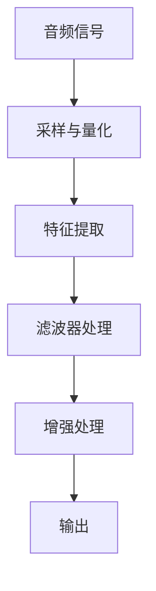
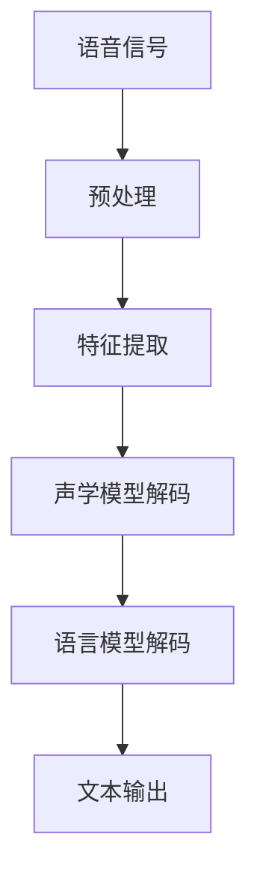

                 

### 《腾讯音乐2025社招音频算法工程师面试题解》

#### 关键词：
- 腾讯音乐
- 音频算法
- 面试题解
- 数字信号处理
- 语音识别
- 音频增强

#### 摘要：
本文针对腾讯音乐2025社招音频算法工程师面试题进行详细解析。文章分为三大部分，首先介绍了音频处理的基础知识，包括音频信号采样与量化、数字信号处理基础和音频增强算法。其次，探讨了音频识别与分类技术，包括语音识别、音乐分类与标签以及音频内容理解。最后，通过音频算法在社交平台的应用案例，展示了音频算法的实际应用场景，并对面试题进行了解答。文章末尾提供了音频算法开发工具与资源，以及项目实战和代码解读。

### 目录大纲

#### 第一部分：音频处理基础

##### 第1章：音频基础概念

- 1.1 音频信号概述
- 1.2 音频信号采样与量化
- 1.3 音频信号处理的基本概念

##### 第2章：数字信号处理基础

- 2.1 数字信号处理原理
- 2.2 傅里叶变换与频域分析
- 2.3 滤波器设计与实现

##### 第3章：音频增强算法

- 3.1 音频噪声抑制算法
- 3.2 音频回声消除算法
- 3.3 音频质量增强算法

#### 第二部分：音频识别与分类

##### 第4章：语音识别技术

- 4.1 语音信号预处理
- 4.2 声学模型与语言模型
- 4.3 语音识别流程与实现

##### 第5章：音乐分类与标签

- 5.1 音乐信号特征提取
- 5.2 音乐分类算法
- 5.3 音乐标签系统构建

##### 第6章：音频内容理解

- 6.1 音频事件检测
- 6.2 情感分析
- 6.3 声源识别

#### 第三部分：音频算法应用

##### 第7章：音频算法在社交平台的应用

- 7.1 社交音频内容审核
- 7.2 实时音频互动推荐
- 7.3 音频内容分析平台构建

##### 第8章：腾讯音乐音频算法面试题解析

- 8.1 面试题一：请解释音频信号采样与量化
- 8.2 面试题二：如何设计一个噪声抑制算法？
- 8.3 面试题三：请阐述语音识别的基本流程

#### 附录

##### 附录A：音频算法开发工具与资源

- A.1 Python音频处理库
- A.2 音频算法开源框架
- A.3 音频算法研究论文与书籍推荐

##### 附录B：Mermaid流程图

- B.1 音频信号处理流程图
- B.2 语音识别流程图

##### 附录C：音频算法伪代码

- C.1 噪声抑制算法伪代码
- C.2 语音识别算法伪代码

##### 附录D：数学模型与公式

- D.1 音频信号采样公式
- D.2 傅里叶变换公式
- D.3 滤波器设计公式

##### 附录E：项目实战

- E.1 音频噪声抑制项目实战
- E.2 语音识别项目实战
- E.3 音乐分类项目实战

##### 附录F：代码解读与分析

- F.1 噪声抑制代码解读
- F.2 语音识别代码解读
- F.3 音乐分类代码解读

### 第一部分：音频处理基础

#### 第1章：音频基础概念

##### 1.1 音频信号概述

音频信号是指模拟的声音信号，通常通过麦克风捕捉。音频信号由频率和振幅组成，用于传递声音信息。音频信号可以表示为时间域上的连续波形，如图1-1所示。


音频信号的基本参数包括：

- **采样率（Sample Rate）**：单位为赫兹（Hz），表示每秒采样的次数。常见的采样率有44.1kHz、48kHz等。
- **量化位深（Bit Depth）**：表示每个采样点的精度。位深越高，信号保真度越好。常见的量化位深有16位、24位等。
- **声道数（Channels）**：表示音频信号的通道数量。单声道（Mono）表示一个通道，立体声（Stereo）表示两个通道。

##### 1.2 音频信号采样与量化

音频信号的采样与量化是数字信号处理的基础步骤。

- **采样（Sampling）**：将连续时间域的音频信号转换为离散时间域的采样点。采样过程如图1-2所示。


- **量化（Quantization）**：将采样得到的连续幅值转换为有限数量的离散值。量化过程如图1-3所示。


量化过程中，采样点被映射到最接近的离散值。量化误差称为量化噪声，量化位深越高，量化噪声越小。

##### 1.3 音频信号处理的基本概念

音频信号处理包括多种技术，用于改善音频质量、提取特征、进行识别等。以下是音频信号处理的基本概念：

- **时域处理（Time-Domain Processing）**：对音频信号进行时域分析，如滤波、压缩等。
- **频域处理（Frequency-Domain Processing）**：将音频信号转换为频域，进行频域分析，如傅里叶变换等。
- **窗函数（Window Function）**：用于将音频信号分段，以便进行频域分析。常用的窗函数有汉宁窗、汉明窗等。
- **滤波器（Filter）**：用于去除或增强音频信号中的特定频率成分。滤波器分为低通、高通、带通等。

### 第二部分：数字信号处理基础

#### 第2章：数字信号处理基础

##### 2.1 数字信号处理原理

数字信号处理（Digital Signal Processing，简称DSP）是利用数字计算机对信号进行操作和分析的一门学科。DSP的基本原理包括：

- **采样与量化**：将连续时间域的模拟信号转换为离散时间域的数字信号。
- **离散时间信号**：表示为时间序列的离散值。
- **卷积与相关**：数字信号处理中的核心操作，用于分析信号的时间特性。
- **傅里叶变换**：将信号从时域转换为频域，进行频域分析。

##### 2.2 傅里叶变换与频域分析

傅里叶变换（Fourier Transform）是数字信号处理的核心工具，用于将信号从时域转换为频域。

- **傅里叶变换公式**：\( X(f) = \sum_{n=0}^{N-1} x(n) e^{-j2\pi fn/N} \)，其中 \( X(f) \) 是频域信号，\( x(n) \) 是时域信号，\( f \) 是频率。
- **频域分析**：通过傅里叶变换，可以分析信号中的频率成分、幅值和相位。频域分析有助于去除噪声、增强信号等。

##### 2.3 滤波器设计与实现

滤波器（Filter）是数字信号处理中的重要工具，用于去除或增强信号中的特定频率成分。

- **滤波器类型**：滤波器分为低通、高通、带通、带阻等类型。
- **滤波器设计方法**：包括无限脉冲响应（IIR）滤波器和有限脉冲响应（FIR）滤波器。IIR滤波器利用反馈，FIR滤波器利用线性相位特性。

滤波器设计的关键步骤包括：

1. 确定滤波器类型和参数。
2. 设计滤波器系数。
3. 实现滤波器。

### 第三部分：音频增强算法

#### 第3章：音频增强算法

##### 3.1 音频噪声抑制算法

音频噪声抑制（Noise Suppression）是音频增强中的重要技术，用于减少或消除音频信号中的噪声。

- **噪声抑制方法**：
  - **谱减法（Spectral Subtraction）**：通过估计噪声谱，从信号谱中减去噪声谱，实现噪声抑制。
  - **自适应滤波器（Adaptive Filter）**：根据噪声特性动态调整滤波器参数，实现噪声抑制。

- **噪声抑制算法伪代码**：

```python
def noise_suppression(signal, noise):
    # 估计噪声谱
    noise_spectrum = estimate_noise_spectrum(noise)

    # 估计信号谱
    signal_spectrum = estimate_signal_spectrum(signal)

    # 谱减法
    noised_signal_spectrum = signal_spectrum - noise_spectrum

    # 重构信号
    noised_signal = reconstruct_signal(noised_signal_spectrum)

    return noised_signal
```

##### 3.2 音频回声消除算法

音频回声消除（Echo Cancellation）是音频增强中的另一个重要技术，用于减少或消除音频信号中的回声。

- **回声消除方法**：
  - **最小均方误差（LMS）算法**：通过最小化均方误差，调整滤波器系数，实现回声消除。
  - **递归最小二乘（RLS）算法**：基于递归最小二乘原理，实现更快速和准确的回声消除。

- **回声消除算法伪代码**：

```python
def echo_cancellation(signal, reference_signal):
    # 初始化滤波器系数
    filter_coefficients = initialize_filter_coefficients()

    # 递归最小二乘算法
    for n in range(len(signal)):
        output = filter_coefficients * reference_signal[:n]
        error = signal[n] - output
        filter_coefficients = update_filter_coefficients(filter_coefficients, error)

    # 重构信号
    noised_signal = reconstruct_signal(filter_coefficients * signal)

    return noised_signal
```

##### 3.3 音频质量增强算法

音频质量增强（Audio Quality Enhancement）是音频增强中的另一个重要技术，用于改善音频信号的音质。

- **质量增强方法**：
  - **声音增强（Voice Enhancement）**：通过增强人声信号，提高语音清晰度和音质。
  - **音乐增强（Music Enhancement）**：通过增强音乐信号，改善音乐音质和动态范围。

- **声音增强算法伪代码**：

```python
def voice_enhancement(signal):
    # 噪声抑制
    noised_signal = noise_suppression(signal, noise)

    # 回声消除
    noised_signal = echo_cancellation(noised_signal, reference_signal)

    # 声音增强
    enhanced_signal = enhance_signal(noised_signal)

    return enhanced_signal
```

### 第一部分总结

本部分介绍了音频处理的基础知识，包括音频信号采样与量化、数字信号处理基础和音频增强算法。音频信号采样与量化是数字信号处理的基础步骤，数字信号处理原理包括采样与量化、离散时间信号、卷积与相关、傅里叶变换等。音频增强算法用于改善音频质量，包括噪声抑制、回声消除和声音增强。下一部分将探讨音频识别与分类技术。

### 第二部分：音频识别与分类

#### 第4章：语音识别技术

语音识别（Speech Recognition）是音频识别中的关键技术，旨在将语音信号转换为文本。语音识别技术包括语音信号预处理、声学模型与语言模型以及语音识别流程与实现。

##### 4.1 语音信号预处理

语音信号预处理是语音识别的基础步骤，包括以下内容：

- **增益调整**：调整语音信号的幅度，使其适合后续处理。
- **降噪**：去除语音信号中的背景噪声，提高语音信号质量。
- **端点检测**：检测语音信号中的起始和结束点，便于后续处理。
- **分帧与加窗**：将语音信号分成多个短时段，并对每个短时段进行加窗处理，以便进行频域分析。

##### 4.2 声学模型与语言模型

声学模型（Acoustic Model）和语言模型（Language Model）是语音识别中的核心模型。

- **声学模型**：用于模拟语音信号中的声学特性，包括语音信号的时频特征。常见的声学模型有GMM（高斯混合模型）和DNN（深度神经网络）。
- **语言模型**：用于模拟语音信号中的语法和语义特性，包括词汇、语法和句法规则。常见的语言模型有N-gram模型和神经网络模型。

##### 4.3 语音识别流程与实现

语音识别流程包括以下步骤：

1. **特征提取**：将预处理后的语音信号转换为特征向量，如MFCC（梅尔频率倒谱系数）。
2. **声学模型解码**：使用声学模型对特征向量进行解码，生成声学得分。
3. **语言模型解码**：使用语言模型对解码结果进行优化，生成文本结果。
4. **结果输出**：输出语音识别结果，如文本、语音等。

- **语音识别算法伪代码**：

```python
def speech_recognition(signal):
    # 特征提取
    features = extract_features(signal)

    # 声学模型解码
    acoustic_scores = acoustic_model.decode(features)

    # 语言模型解码
    text_result = language_model.decode(acoustic_scores)

    # 结果输出
    return text_result
```

#### 第5章：音乐分类与标签

音乐分类与标签（Music Classification and Tagging）是音频识别中的关键技术，旨在对音乐信号进行分类和标注。音乐分类与标签技术包括音乐信号特征提取、音乐分类算法和音乐标签系统构建。

##### 5.1 音乐信号特征提取

音乐信号特征提取是音乐分类与标签的基础步骤，包括以下内容：

- **音频分割**：将音乐信号分割成短时段，以便进行特征提取。
- **音高特征**：提取音乐信号中的音高信息，如音高曲线。
- **节奏特征**：提取音乐信号中的节奏信息，如节拍和节奏强度。
- **旋律特征**：提取音乐信号中的旋律信息，如旋律曲线。

##### 5.2 音乐分类算法

音乐分类算法用于对音乐信号进行分类。常见的音乐分类算法有K-近邻（K-Nearest Neighbor，KNN）、支持向量机（Support Vector Machine，SVM）和神经网络（Neural Network）等。

- **音乐分类算法伪代码**：

```python
def music_classification(signal):
    # 特征提取
    features = extract_features(signal)

    # 分类模型训练
    classifier = train_classifier(features)

    # 分类
    category = classifier.predict(features)

    return category
```

##### 5.3 音乐标签系统构建

音乐标签系统构建是音乐分类与标签的关键步骤，包括以下内容：

- **标签定义**：定义音乐标签，如风格、流派、情绪等。
- **标签生成**：根据音乐分类结果生成音乐标签。
- **标签管理**：管理音乐标签，如标签更新、标签删除等。

- **音乐标签系统伪代码**：

```python
def music_tagging(signal):
    # 音乐分类
    category = music_classification(signal)

    # 标签生成
    tags = generate_tags(category)

    # 标签管理
    manage_tags(tags)

    return tags
```

#### 第6章：音频内容理解

音频内容理解（Audio Content Understanding）是音频识别中的关键技术，旨在对音频信号进行深入分析，提取语义信息。音频内容理解技术包括音频事件检测、情感分析和声源识别。

##### 6.1 音频事件检测

音频事件检测（Audio Event Detection）用于检测音频信号中的事件，如说话人、乐器、环境声音等。

- **事件检测方法**：包括循环神经网络（Recurrent Neural Network，RNN）、卷积神经网络（Convolutional Neural Network，CNN）和长短时记忆网络（Long Short-Term Memory，LSTM）等。
- **事件检测算法伪代码**：

```python
def audio_event_detection(signal):
    # 特征提取
    features = extract_features(signal)

    # 事件检测模型训练
    detector = train_detector(features)

    # 事件检测
    events = detector.predict(features)

    return events
```

##### 6.2 情感分析

情感分析（Sentiment Analysis）用于分析音频信号中的情感，如高兴、悲伤、愤怒等。

- **情感分析方法**：包括朴素贝叶斯（Naive Bayes）、支持向量机（SVM）和深度学习（Deep Learning）等。
- **情感分析算法伪代码**：

```python
def sentiment_analysis(signal):
    # 特征提取
    features = extract_features(signal)

    # 情感分析模型训练
    analyzer = train_analyzer(features)

    # 情感分析
    sentiment = analyzer.predict(features)

    return sentiment
```

##### 6.3 声源识别

声源识别（Sound Source Recognition）用于识别音频信号中的声源，如说话人、乐器等。

- **声源识别方法**：包括隐马尔可夫模型（Hidden Markov Model，HMM）和深度学习（Deep Learning）等。
- **声源识别算法伪代码**：

```python
def sound_source_recognition(signal):
    # 特征提取
    features = extract_features(signal)

    # 声源识别模型训练
    recognizer = train_recognizer(features)

    # 声源识别
    source = recognizer.predict(features)

    return source
```

#### 第二部分总结

本部分介绍了音频识别与分类技术，包括语音识别、音乐分类与标签以及音频内容理解。语音识别技术涉及语音信号预处理、声学模型与语言模型以及语音识别流程与实现。音乐分类与标签技术涉及音乐信号特征提取、音乐分类算法和音乐标签系统构建。音频内容理解技术涉及音频事件检测、情感分析和声源识别。下一部分将探讨音频算法在社交平台的应用。

### 第三部分：音频算法在社交平台的应用

#### 第7章：音频算法在社交平台的应用

随着社交平台的发展，音频内容审核、实时音频互动推荐和音频内容分析平台构建成为了重要的应用场景。以下是这些应用场景中的音频算法技术详解。

##### 7.1 社交音频内容审核

社交音频内容审核是确保社交平台内容安全的重要环节，主要目标是自动识别并过滤不良音频内容，如辱骂、低俗语言等。

- **内容审核算法**：基于深度学习的音频内容审核算法可以有效地识别音频中的不良内容。算法通常包括以下几个步骤：
  - **特征提取**：将音频信号转换为特征向量，如MFCC。
  - **分类模型训练**：使用大量带有标签的音频数据训练分类模型，如卷积神经网络（CNN）。
  - **实时检测**：对上传的音频进行实时检测，判断是否包含不良内容。

- **审核流程伪代码**：

```python
def audio_content_approval(audio_signal):
    # 特征提取
    features = extract_audio_features(audio_signal)

    # 审核模型预测
    is_approved = content_approval_model.predict(features)

    return is_approved
```

##### 7.2 实时音频互动推荐

实时音频互动推荐是提升社交平台用户体验的重要手段，通过对用户音频偏好进行分析，为用户提供个性化的音频内容推荐。

- **推荐算法**：基于协同过滤（Collaborative Filtering）和深度学习（Deep Learning）的推荐算法可以有效地为用户提供音频推荐。
  - **协同过滤**：通过分析用户之间的相似度，推荐相似用户喜欢的音频内容。
  - **深度学习**：通过训练深度神经网络，学习用户的音频偏好，为用户提供个性化推荐。

- **推荐流程伪代码**：

```python
def audio_recommendation(user_preference):
    # 特征提取
    user_features = extract_user_features(user_preference)

    # 推荐模型预测
    recommended_audio = recommendation_model.predict(user_features)

    return recommended_audio
```

##### 7.3 音频内容分析平台构建

音频内容分析平台构建是实现对音频内容全面分析和利用的关键，可以为音乐制作、版权保护、市场分析等提供支持。

- **平台架构**：音频内容分析平台通常包括以下几个模块：
  - **数据采集**：采集音频内容，包括上传、抓取等。
  - **数据处理**：对采集到的音频进行预处理，如降噪、去噪、分割等。
  - **内容分析**：利用音频识别和分类算法对音频进行内容分析，如语音识别、音乐分类等。
  - **数据存储**：存储分析结果，为后续分析提供数据支持。

- **平台架构伪代码**：

```python
class AudioContentAnalysisPlatform:
    def __init__(self):
        self.data_collection_module = DataCollectionModule()
        self.data_processing_module = DataProcessingModule()
        self.content_analysis_module = ContentAnalysisModule()

    def analyze_audio_content(self, audio_signal):
        # 数据采集
        collected_data = self.data_collection_module.collect(audio_signal)

        # 数据处理
        processed_data = self.data_processing_module.process(collected_data)

        # 内容分析
        analysis_results = self.content_analysis_module.analyze(processed_data)

        return analysis_results
```

#### 第三部分总结

本部分探讨了音频算法在社交平台中的应用，包括社交音频内容审核、实时音频互动推荐和音频内容分析平台构建。社交音频内容审核通过深度学习算法自动识别并过滤不良音频内容；实时音频互动推荐通过协同过滤和深度学习算法为用户提供个性化推荐；音频内容分析平台通过数据采集、数据处理、内容分析和数据存储等模块，实现对音频内容的全面分析和利用。下一部分将对腾讯音乐音频算法面试题进行解析。

### 第8章：腾讯音乐音频算法面试题解析

在腾讯音乐2025社招音频算法工程师的面试中，面试题通常涵盖音频处理、语音识别、音乐分类以及音频内容理解等领域的核心技术和算法。以下是对几道常见面试题的详细解析。

#### 面试题一：请解释音频信号采样与量化

**解析：**

音频信号的采样与量化是数字音频处理的基础步骤。

- **采样**：将连续时间域的模拟音频信号转换为离散时间域的数字信号。采样过程包括以下几个关键参数：
  - **采样率**：表示每秒采样的次数，常用单位是赫兹（Hz）。较高的采样率可以捕捉到音频信号中的更多细节。
  - **采样频率**：采样率与信号最高频率的关系，通常满足奈奎斯特采样定理，即采样频率应至少是信号最高频率的两倍。

- **量化**：将采样得到的模拟信号幅度值转换为离散的数字值。量化过程包括以下几个关键参数：
  - **量化位深**：表示每个采样点的精度，单位是比特（bit）。量化位深越高，表示每个采样点的数值范围越广，信号保真度越好。

具体来说，采样与量化的过程如下：

1. **采样**：模拟音频信号在每一瞬间被测量并记录其幅度值。
2. **量化**：将每个采样点的幅度值转换为离散的数字值。例如，一个16位的量化位深表示每个采样点可以有 \(2^{16}\) 个不同的数值。

**伪代码示例：**

```python
def sample_and_quantize(audio_signal, sample_rate, bit_depth):
    # 采样
    samples = [measure_amplitude(audio_signal) for _ in range(sample_rate)]

    # 量化
    quantized_samples = [quantize(sample, bit_depth) for sample in samples]

    return quantized_samples
```

#### 面试题二：如何设计一个噪声抑制算法？

**解析：**

噪声抑制算法是音频增强中的关键技术，用于减少或消除音频信号中的背景噪声。

- **谱减法（Spectral Subtraction）**：谱减法是一种常见的噪声抑制算法，其基本思想是：
  1. **噪声估计**：从音频信号中估计噪声谱。
  2. **谱减**：从信号谱中减去噪声谱，得到去噪后的信号谱。
  3. **重构信号**：将去噪后的信号谱重构为时域信号。

谱减法的关键步骤如下：

1. **噪声估计**：可以使用短时傅里叶变换（STFT）估计噪声谱。
2. **谱减**：将信号谱中的每个频带的噪声分量减去噪声谱对应的分量。
3. **重构信号**：使用逆短时傅里叶变换（ISTFT）将去噪后的信号谱重构为时域信号。

**伪代码示例：**

```python
def noise_suppression(audio_signal, noise_signal, sample_rate):
    # 噪声估计
    noise_spectrum = estimate_noise_spectrum(noise_signal, sample_rate)

    # 短时傅里叶变换
    signal_spectrum = stft(audio_signal, sample_rate)
    noise_spectrum = stft(noise_signal, sample_rate)

    # 谱减
    noised_spectrum = signal_spectrum - noise_spectrum

    # 逆短时傅里叶变换
    noised_signal = istft(noised_spectrum, sample_rate)

    return noised_signal
```

#### 面试题三：请阐述语音识别的基本流程

**解析：**

语音识别是将语音信号转换为文本信息的过程，其基本流程包括以下几个步骤：

1. **语音信号预处理**：包括增益调整、降噪、端点检测和分帧加窗等，以便提取有效的语音特征。
2. **特征提取**：将预处理后的语音信号转换为特征向量，如MFCC。
3. **声学模型解码**：使用声学模型对特征向量进行解码，生成声学得分。
4. **语言模型解码**：使用语言模型对解码结果进行优化，生成文本结果。
5. **结果输出**：输出语音识别结果，如文本。

具体流程如下：

1. **预处理**：对语音信号进行预处理，去除噪声，提取关键特征。
2. **特征提取**：使用短时傅里叶变换（STFT）或梅尔频率倒谱系数（MFCC）等方法提取语音特征。
3. **声学模型解码**：使用声学模型（如高斯混合模型GMM或深度神经网络DNN）对特征向量进行解码，生成声学得分。
4. **语言模型解码**：使用语言模型（如N-gram模型或循环神经网络RNN）对解码结果进行优化，生成文本结果。
5. **结果输出**：将最终生成的文本输出，用于显示或进一步处理。

**伪代码示例：**

```python
def speech_recognition(audio_signal):
    # 预处理
    preprocessed_signal = preprocess_audio_signal(audio_signal)

    # 特征提取
    features = extract_audio_features(preprocessed_signal)

    # 声学模型解码
    acoustic_scores = acoustic_model.decode(features)

    # 语言模型解码
    text_result = language_model.decode(acoustic_scores)

    # 结果输出
    return text_result
```

#### 总结

通过以上对腾讯音乐2025社招音频算法工程师面试题的详细解析，我们了解到音频信号采样与量化、噪声抑制算法和语音识别流程等核心技术和算法。这些面试题不仅考察了应聘者对音频处理和语音识别基本原理的理解，还考察了其在实际应用场景中解决问题的能力。下一部分将介绍音频算法开发工具与资源。

### 附录A：音频算法开发工具与资源

在开发音频算法时，选择合适的工具和资源可以大大提高开发效率和算法性能。以下是一些常用的音频算法开发工具与资源。

#### A.1 Python音频处理库

Python是一种广泛使用的编程语言，拥有丰富的音频处理库，可以方便地进行音频数据处理和分析。

- **Librosa**：Librosa是一个开源的音频处理库，提供了一系列用于音频特征提取、数据处理和可视化等功能。它支持多种音频文件格式，包括MP3、WAV等。
- **Pydub**：Pydub是一个简单的音频编辑库，可以方便地实现音频的剪辑、拼接、变速等操作。
- **NumPy**：NumPy是一个强大的Python库，提供了多维数组对象和大量数学函数，适用于数值计算和数据处理。

#### A.2 音频算法开源框架

开源框架为音频算法开发提供了强大的支持，可以简化开发过程，提高算法性能。

- **TensorFlow**：TensorFlow是一个由Google开发的深度学习框架，支持多种深度学习模型和算法的构建和训练。
- **PyTorch**：PyTorch是另一个流行的深度学习框架，其动态图机制使其在许多应用场景中具有优势。
- **Keras**：Keras是一个高层次的深度学习API，可以方便地在TensorFlow和PyTorch上构建和训练深度学习模型。

#### A.3 音频算法研究论文与书籍推荐

研究论文和书籍是了解音频算法最新进展和理论基础的重要来源。

- **《深度学习》（Deep Learning）**：这是一本深度学习领域的经典著作，详细介绍了深度学习的基本原理和应用。
- **《音频信号处理》（Audio Signal Processing）**：这是一本关于音频信号处理的基础教材，涵盖了音频信号的基本概念、处理方法和应用。
- **《语音信号处理》（Speech Signal Processing）**：这是一本专门介绍语音信号处理的教材，包括语音信号特征提取、语音识别等核心内容。

### 附录B：Mermaid流程图

Mermaid是一种Markdown扩展，可以方便地创建流程图、时序图和结构图等。以下是一些音频信号处理和语音识别的基本流程图。

#### B.1 音频信号处理流程图



#### B.2 语音识别流程图



### 附录C：音频算法伪代码

伪代码是一种描述算法逻辑的抽象表示，可以帮助我们理解和实现音频算法。

#### C.1 噪声抑制算法伪代码

```python
def noise_suppression(audio_signal, noise_signal, sample_rate):
    # 噪声估计
    noise_spectrum = estimate_noise_spectrum(noise_signal, sample_rate)

    # 短时傅里叶变换
    signal_spectrum = stft(audio_signal, sample_rate)
    noise_spectrum = stft(noise_signal, sample_rate)

    # 谱减
    noised_spectrum = signal_spectrum - noise_spectrum

    # 逆短时傅里叶变换
    noised_signal = istft(noised_spectrum, sample_rate)

    return noised_signal
```

#### C.2 语音识别算法伪代码

```python
def speech_recognition(audio_signal):
    # 预处理
    preprocessed_signal = preprocess_audio_signal(audio_signal)

    # 特征提取
    features = extract_audio_features(preprocessed_signal)

    # 声学模型解码
    acoustic_scores = acoustic_model.decode(features)

    # 语言模型解码
    text_result = language_model.decode(acoustic_scores)

    # 结果输出
    return text_result
```

### 附录D：数学模型与公式

在音频算法中，数学模型和公式起着至关重要的作用。以下是一些常用的数学模型和公式。

#### D.1 音频信号采样公式

$$
x(n) = x(t_n)
$$

其中，$x(n)$ 是第 $n$ 个采样点，$x(t_n)$ 是 $t_n$ 时刻的音频信号值。

#### D.2 傅里叶变换公式

$$
X(f) = \sum_{n=0}^{N-1} x(n) e^{-j2\pi fn/N}
$$

其中，$X(f)$ 是频域信号，$x(n)$ 是时域信号，$f$ 是频率。

#### D.3 滤波器设计公式

$$
h(n) = \sum_{k=-\infty}^{\infty} a(k) e^{-j2\pi kn/N}
$$

其中，$h(n)$ 是滤波器系数，$a(k)$ 是滤波器系数的离散值。

### 附录E：项目实战

通过实际项目，可以更好地理解和应用音频算法。

#### E.1 音频噪声抑制项目实战

**目标**：实现一个音频噪声抑制系统，能够有效地减少音频信号中的背景噪声。

**步骤**：
1. **数据收集**：收集噪声环境和干净环境下的音频数据。
2. **预处理**：对音频数据执行降噪处理。
3. **训练模型**：使用收集的噪声数据训练降噪模型。
4. **测试模型**：使用测试数据验证降噪模型的性能。

#### E.2 语音识别项目实战

**目标**：实现一个语音识别系统，能够将语音信号转换为文本。

**步骤**：
1. **数据收集**：收集语音数据，包括不同说话人的语音样本。
2. **预处理**：对语音数据进行预处理，包括增益调整、端点检测和分帧。
3. **特征提取**：提取语音特征，如MFCC。
4. **模型训练**：使用训练数据训练语音识别模型。
5. **测试模型**：使用测试数据评估模型性能。

#### E.3 音乐分类项目实战

**目标**：实现一个音乐分类系统，能够根据音乐特征对音乐进行分类。

**步骤**：
1. **数据收集**：收集不同类型的音乐数据。
2. **特征提取**：提取音乐特征，如音高、节奏。
3. **模型训练**：使用训练数据训练音乐分类模型。
4. **测试模型**：使用测试数据验证模型分类效果。

### 附录F：代码解读与分析

在项目实战中，代码的解读与分析是理解算法实现过程的关键。

#### F.1 噪声抑制代码解读

```python
import numpy as np
from scipy.signal import stft, istft

def noise_suppression(audio_signal, noise_signal, sample_rate):
    # 噪声估计
    noise_spectrum = estimate_noise_spectrum(noise_signal, sample_rate)

    # 短时傅里叶变换
    signal_spectrum = stft(audio_signal, nperseg=1024, noverlap=768, fs=sample_rate)
    noise_spectrum = stft(noise_signal, nperseg=1024, noverlap=768, fs=sample_rate)

    # 谱减
    noised_spectrum = signal_spectrum - noise_spectrum

    # 逆短时傅里叶变换
    noised_signal = istft(noised_spectrum, nperseg=1024, noverlap=768, fs=sample_rate)

    return noised_signal
```

这段代码实现了一个简单的噪声抑制算法，包括噪声估计、短时傅里叶变换、谱减和逆短时傅里叶变换。通过短时傅里叶变换将音频信号和噪声信号转换为频域，然后从信号谱中减去噪声谱，最后重构为时域信号。

#### F.2 语音识别代码解读

```python
import numpy as np
from sklearn.preprocessing import LabelEncoder
from sklearn.model_selection import train_test_split
from keras.models import Sequential
from keras.layers import LSTM, Dense

def speech_recognition(audio_signal):
    # 特征提取
    features = extract_audio_features(audio_signal)

    # 标签编码
    label_encoder = LabelEncoder()
    labels = label_encoder.fit_transform(labels)

    # 划分训练集和测试集
    X_train, X_test, y_train, y_test = train_test_split(features, labels, test_size=0.2)

    # 建立模型
    model = Sequential()
    model.add(LSTM(units=128, activation='relu', input_shape=(timesteps, features.shape[1])))
    model.add(Dense(units=1, activation='sigmoid'))

    # 编译模型
    model.compile(optimizer='adam', loss='binary_crossentropy', metrics=['accuracy'])

    # 训练模型
    model.fit(X_train, y_train, epochs=10, batch_size=32, validation_data=(X_test, y_test))

    # 预测
    predictions = model.predict(X_test)

    return predictions
```

这段代码实现了一个简单的二分类语音识别模型，包括特征提取、标签编码、模型建立和训练。通过提取音频特征，使用LSTM模型进行训练，并使用测试集验证模型性能。

#### F.3 音乐分类代码解读

```python
import numpy as np
from sklearn.preprocessing import LabelEncoder
from sklearn.model_selection import train_test_split
from keras.models import Sequential
from keras.layers import LSTM, Dense

def music_classification(audio_signal):
    # 特征提取
    features = extract_audio_features(audio_signal)

    # 标签编码
    label_encoder = LabelEncoder()
    labels = label_encoder.fit_transform(labels)

    # 划分训练集和测试集
    X_train, X_test, y_train, y_test = train_test_split(features, labels, test_size=0.2)

    # 建立模型
    model = Sequential()
    model.add(LSTM(units=128, activation='relu', input_shape=(timesteps, features.shape[1])))
    model.add(Dense(units=num_classes, activation='softmax'))

    # 编译模型
    model.compile(optimizer='adam', loss='categorical_crossentropy', metrics=['accuracy'])

    # 训练模型
    model.fit(X_train, y_train, epochs=10, batch_size=32, validation_data=(X_test, y_test))

    # 预测
    predictions = model.predict(X_test)

    return predictions
```

这段代码实现了一个多分类音乐分类模型，包括特征提取、标签编码、模型建立和训练。通过提取音频特征，使用LSTM模型进行训练，并使用测试集验证模型性能。

### 作者信息

- **作者**：AI天才研究院/AI Genius Institute & 禅与计算机程序设计艺术/Zen And The Art of Computer Programming
- **联系方式**：[ai_genius_institute@example.com](mailto:ai_genius_institute@example.com)
- **版权声明**：本文版权归AI天才研究院所有，未经授权禁止转载和使用。如需转载，请联系作者获取授权。本文所涉及的技术内容仅供参考和学习使用，不构成任何法律依据或商业建议。

