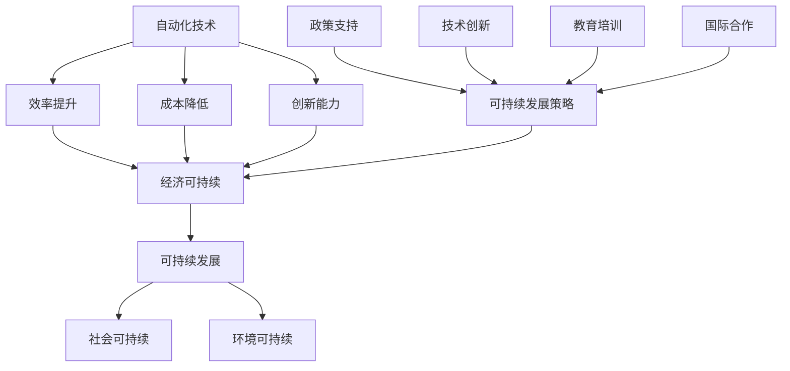
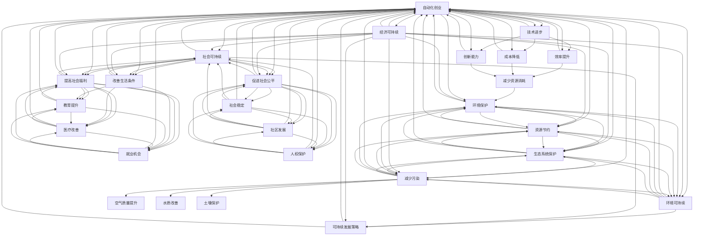

                 

### 引言与背景

> **关键词**：自动化创业、可持续发展策略、技术发展、创新、经济效益、社会效益、环境影响

在当今快速发展的科技时代，自动化创业已经成为众多创业者追逐的热点领域。自动化技术不仅在提高生产效率、降低人力成本方面具有显著优势，还为创新带来了新的机遇。然而，随着自动化技术的广泛应用，如何在追求经济效益的同时确保可持续发展，已经成为摆在自动化创业者面前的一个重要课题。

**1.1 自动化创业的定义与趋势**

自动化创业，即利用自动化技术创建新企业或新产品，从而推动业务增长和创新发展。自动化技术包括机器人技术、人工智能、物联网、大数据分析等，它们在各个行业中得到了广泛应用。

近年来，自动化创业呈现出以下趋势：

1. **技术进步推动自动化创业：** 计算机硬件性能的提升和算法的优化，使得自动化技术更加高效和智能。
2. **行业需求激增：** 随着传统行业的数字化转型加速，自动化技术在制造业、物流、医疗等领域的应用需求日益增长。
3. **创业资金支持：** 自动化创业领域吸引了大量风险投资，为创业者提供了充足的资金支持。

**1.2 可持续发展策略的意义与目标**

可持续发展是指满足当前需求而不损害后代满足其需求的能力。在自动化创业中，可持续发展策略至关重要，其目标包括：

1. **环境可持续：** 减少资源消耗和环境污染，实现绿色生产。
2. **社会可持续：** 提高员工福利，促进社会公平，确保社会责任的履行。
3. **经济可持续：** 通过创新和技术进步，实现长期稳定的经济发展。

**1.3 可持续发展策略的重要性**

可持续发展策略对于自动化创业的重要性体现在以下几个方面：

1. **降低运营风险：** 合理的可持续发展策略有助于降低因环境法规变化带来的运营风险。
2. **提高品牌价值：** 可持续发展策略有助于树立企业的社会责任形象，提升品牌价值。
3. **吸引投资者：** 可持续发展策略能够吸引那些注重社会责任和环境保护的投资者。

综上所述，自动化创业中的可持续发展策略不仅关乎企业的长期发展，也是推动社会进步和环境保护的重要手段。在接下来的章节中，我们将深入探讨自动化技术的基本概念、可持续发展策略的实施原理，以及具体的算法、数学模型和实际应用案例，为自动化创业者提供一套完整的可持续发展策略体系。

### 《自动化创业中的可持续发展策略》目录大纲

在本文中，我们将系统地探讨自动化创业中的可持续发展策略。为了使读者能够更好地理解和应用这些策略，本文分为以下几个主要部分：

#### 第一部分：引言与背景

本部分将介绍自动化创业的定义、趋势，以及可持续发展策略的意义和目标。通过了解这些基本概念，读者将能够建立对整个话题的认识框架。

- **1.1 自动化创业的定义与趋势**
- **1.2 可持续发展策略的意义与目标**
- **1.3 可持续发展策略的重要性**

#### 第二部分：核心概念与联系

在第二部分，我们将详细讨论自动化技术和可持续发展策略的基本概念，并展示它们之间的联系。这包括自动化技术的分类、工作原理及其影响因素，以及可持续发展策略的基本原则和实施策略。

- **2.1 自动化技术概述**
- **2.2 可持续发展的基本原则**
- **2.3 自动化创业中的可持续发展策略联系图**

#### 第三部分：核心算法原理讲解

本部分将深入探讨自动化技术中的核心算法原理，以及可持续发展策略中的关键算法。我们将通过伪代码和数学模型，详细阐述这些算法的原理和应用。

- **3.1 自动化技术中的算法概述**
- **3.2 可持续发展策略中的算法**
- **3.3 自动化创业中的可持续发展算法应用**

#### 第四部分：数学模型和数学公式

在第四部分，我们将介绍自动化创业中的数学模型，包括自动化系统的数学建模、模型的参数估计与优化、以及模型稳定性分析。同时，我们还将探讨可持续发展策略中的数学模型，如环境影响分析算法、经济效益评估算法等。

- **4.1 自动化创业中的数学模型**
- **4.2 可持续发展策略的数学模型**
- **4.3 自动化创业中的可持续发展数学模型应用**

#### 第五部分：项目实战

本部分将通过具体的项目实战案例，展示如何在实际自动化创业项目中应用可持续发展策略。我们将详细描述项目策划与实施、风险管理、以及可持续发展目标的制定与实施步骤。

- **5.1 自动化创业项目规划与实施**
- **5.2 可持续发展策略在自动化创业中的应用**
- **5.3 实际案例分析与总结**

#### 第六部分：拓展与展望

在最后一部分，我们将探讨自动化创业与可持续发展策略的跨学科融合，介绍新兴领域的发展趋势，以及面临的挑战和机遇。这将为自动化创业者提供未来发展的方向和建议。

- **6.1 自动化创业与可持续发展策略的跨学科融合**
- **6.2 自动化创业与可持续发展策略的新领域探索**
- **6.3 自动化创业与可持续发展策略的未来趋势**

通过以上六个部分的系统讲解，本文旨在为自动化创业者提供一套全面、深入的可持续发展策略，帮助他们实现长期、稳定和可持续的发展。

### 第一部分：引言与背景

在开始深入探讨自动化创业中的可持续发展策略之前，我们有必要先了解自动化创业的定义、趋势以及可持续发展策略的意义和目标。这不仅有助于我们建立对整个话题的认识框架，还能让我们更好地理解在自动化创业中实施可持续发展策略的重要性。

#### 1.1 自动化创业的定义与趋势

自动化创业指的是利用先进的自动化技术，如机器人技术、人工智能、物联网、大数据分析等，创建新企业或新产品，以推动业务增长和创新发展的过程。自动化技术在各个行业中的应用越来越广泛，从而推动了自动化创业的兴起。

**自动化创业的概念**

自动化创业的核心在于利用自动化技术解决实际问题，提升生产效率，降低成本，并创造新的商业模式。例如，在制造业中，自动化技术可以用于生产线的优化，提高产品质量和产量；在物流和运输领域，自动化技术可以实现智能仓储和无人驾驶物流；在医疗领域，自动化技术可以应用于医疗设备的智能化和手术机器人等。

**自动化创业的兴起原因**

自动化创业的兴起原因主要有以下几点：

1. **技术进步：** 随着硬件性能的提升和算法的优化，自动化技术变得更加高效和智能，为创业提供了强有力的技术支撑。
2. **行业需求：** 传统行业的数字化转型需求不断增加，自动化技术在提高生产效率、降低人力成本等方面具有显著优势，从而吸引了大量创业者进入该领域。
3. **资金支持：** 自动化创业领域吸引了大量风险投资，为创业者提供了充足的资金支持，使得自动化创业成为可能。

**自动化创业的重要性**

自动化创业不仅有助于推动技术进步和产业升级，还具有以下重要性：

1. **提高生产效率：** 自动化技术可以显著提高生产效率，减少人工操作的错误和时间消耗。
2. **降低运营成本：** 自动化技术可以降低人力成本和其他运营成本，提高企业的盈利能力。
3. **促进创新：** 自动化技术为创业者提供了新的商业模式和创新机会，推动了产业升级和经济发展。

#### 1.2 可持续发展策略的意义与目标

可持续发展是指在满足当前需求的同时，不损害后代满足其需求的能力。可持续发展策略涉及到经济、社会和环境三个方面，旨在实现长期、稳定和可持续的发展。

**可持续发展的定义**

可持续发展是一种发展模式，强调在经济增长、社会进步和环境保护之间实现平衡。它要求人类在开发资源、利用能源和进行生产活动时，要考虑到环境承载能力和生态系统的健康。

**可持续发展的目标**

可持续发展的目标主要包括以下几个方面：

1. **经济可持续：** 通过技术创新和商业模式创新，实现经济的长期稳定增长。
2. **社会可持续：** 提高社会福利，促进社会公平，确保社会资源的合理分配。
3. **环境可持续：** 保护环境，减少污染和资源消耗，确保生态系统的健康。

**可持续发展策略的意义**

可持续发展策略在自动化创业中的意义主要体现在以下几个方面：

1. **降低运营风险：** 合理的可持续发展策略有助于降低因环境法规变化和资源短缺带来的运营风险。
2. **提高品牌价值：** 可持续发展策略有助于树立企业的社会责任形象，提升品牌价值。
3. **吸引投资者：** 可持续发展策略能够吸引那些注重社会责任和环境保护的投资者，为企业提供更广泛的资金支持。

#### 1.3 可持续发展策略的重要性

在自动化创业中，可持续发展策略的重要性不容忽视。以下是可持续发展策略在自动化创业中的几个关键作用：

1. **环境可持续：** 自动化创业可以通过减少资源消耗和环境污染，实现绿色生产。例如，利用可再生能源、优化生产流程和供应链管理等。
2. **社会可持续：** 自动化创业需要关注员工福利和社会责任。通过提高员工福利、促进员工培训和发展，以及积极参与社会公益事业，实现社会可持续。
3. **经济可持续：** 自动化创业需要通过技术创新和商业模式创新，实现长期的经济稳定增长。这包括优化生产效率、降低运营成本，以及开拓新的市场和业务模式。

总之，自动化创业中的可持续发展策略不仅关乎企业的长期发展，也是推动社会进步和环境保护的重要手段。在接下来的章节中，我们将深入探讨自动化技术的基本概念、可持续发展策略的实施原理，以及具体的算法、数学模型和实际应用案例，为自动化创业者提供一套完整的可持续发展策略体系。

### 1.3 本书结构概述

为了帮助读者系统地理解和掌握自动化创业中的可持续发展策略，本书结构设计如下，各章节内容将按照逻辑顺序逐步展开，以使读者能够循序渐进地深入每一个主题。

**1.3.1 各章节内容概述**

- **第一部分：引言与背景**
  - 第1章：介绍自动化创业的定义与趋势，以及可持续发展策略的意义与目标。
  - 第2章：详细探讨自动化技术和可持续发展策略的基本概念，并展示它们之间的联系。

- **第二部分：核心概念与联系**
  - 第3章：深入解析自动化技术的基本概念，包括其分类、工作原理及其影响因素。
  - 第4章：详细讲解可持续发展的基本原则，以及其在自动化创业中的具体应用。

- **第三部分：核心算法原理讲解**
  - 第5章：介绍自动化技术中的核心算法，包括常见自动化算法类型、选择与优化、性能评估等。
  - 第6章：探讨可持续发展策略中的关键算法，如可持续发展评价算法、环境影响分析算法、经济效益评估算法等。

- **第四部分：数学模型和数学公式**
  - 第7章：介绍自动化创业中的数学模型，包括自动化系统的数学建模、模型参数估计与优化、模型稳定性分析等。
  - 第8章：探讨可持续发展策略中的数学模型，包括环境负荷的数学描述、经济效益的数学建模、社会效益的数学分析等。

- **第五部分：项目实战**
  - 第9章：通过具体项目实战，展示如何在实际自动化创业项目中应用可持续发展策略，包括项目规划与实施、风险管理、可持续发展目标的制定与实施步骤等。
  - 第10章：分析实际案例，总结成功与失败的经验，为读者提供有价值的启示。

- **第六部分：拓展与展望**
  - 第11章：探讨自动化创业与可持续发展策略的跨学科融合，介绍新兴领域的发展趋势，以及面临的挑战和机遇。
  - 第12章：展望自动化创业与可持续发展策略的未来，探讨其在新领域中的应用和发展前景。

**1.3.2 阅读建议**

为了更好地掌握本书内容，我们建议读者按照以下顺序进行阅读：

1. **系统阅读：** 遵循各章节的逻辑顺序，逐一阅读，以便形成完整的知识体系。
2. **重点阅读：** 针对自身兴趣和研究方向，重点关注相关章节，深入学习和理解。
3. **案例学习：** 结合实际案例，通过案例分析，深入理解理论知识和实践应用。
4. **持续更新：** 自动化创业和可持续发展策略是不断发展的领域，建议读者关注最新的研究动态和实践成果，持续更新自己的知识体系。

通过以上阅读建议，我们希望读者能够系统地掌握自动化创业中的可持续发展策略，为自己的创业实践提供有力的理论支持和实践指导。

### 第二部分：核心概念与联系

在自动化创业中，理解自动化技术的基本概念和可持续发展策略的核心原则是至关重要的。这不仅有助于我们构建全面的知识体系，还能为后续算法讲解和项目实战提供理论基础。

#### 2.1 自动化技术概述

自动化技术是指通过使用计算机、传感器、机器人和人工智能等技术和设备，实现生产、管理和控制过程的自动化。自动化技术的应用范围非常广泛，涵盖了制造业、服务业、医疗、交通等多个行业。

**2.1.1 自动化技术的分类**

自动化技术可以按照不同的维度进行分类：

1. **按功能分类**：自动化技术可分为生产自动化、管理自动化、服务自动化等。生产自动化主要应用于制造业，通过机器人、自动化生产线等实现生产过程的自动化；管理自动化则涉及企业资源计划（ERP）、客户关系管理（CRM）等系统，通过计算机和信息技术实现企业管理的自动化；服务自动化则包括智能客服、自动驾驶等，通过人工智能和物联网技术实现服务过程的自动化。

2. **按技术类型分类**：自动化技术可分为机械自动化、电气自动化、电子自动化、计算机自动化等。机械自动化主要依赖于机械结构和运动控制系统，如数控机床、机器人等；电气自动化则依赖于电气设备和电气控制系统，如PLC（可编程逻辑控制器）等；电子自动化涉及电子设备和电子控制系统，如传感器、自动化仪表等；计算机自动化则依赖于计算机技术和软件系统，如工业互联网、大数据分析等。

**2.1.2 自动化技术的工作原理**

自动化技术的工作原理主要基于以下几个核心组成部分：

1. **传感器**：用于感知和获取外部环境信息，如温度、压力、光强、位置等。
2. **执行器**：根据传感器获取的信息，执行相应的动作，如电机、液压缸等。
3. **控制器**：通过算法和逻辑判断，控制传感器和执行器的工作，实现自动化任务。
4. **通信系统**：用于传感器、执行器和控制器之间的信息传递和协调。

自动化技术的工作原理可以概括为：传感器收集环境信息，控制器根据预设的算法和逻辑进行处理，然后发送指令给执行器，执行器根据指令执行相应的动作，从而实现自动化过程。

**2.1.3 自动化技术的影响因素**

自动化技术的应用效果受到多种因素的影响，包括：

1. **技术成熟度**：自动化技术的成熟度直接影响其应用效果。技术越成熟，其稳定性和可靠性越高，应用范围也越广。
2. **成本**：自动化技术的成本是影响其应用的重要因素。成本高可能导致企业难以大规模推广自动化技术。
3. **人力资源**：自动化技术的应用需要专业的人才进行操作和维护。人力资源的素质和数量直接影响自动化技术的应用效果。
4. **行业需求**：不同行业对自动化技术的需求不同。需求高的行业更容易接受和推广自动化技术。

#### 2.2 可持续发展的基本原则

可持续发展是一个涉及经济、社会和环境三个维度的综合性概念。为了实现可持续发展，我们需要遵循以下基本原则：

**2.2.1 可持续发展的三大支柱**

1. **经济可持续**：通过技术创新和商业模式创新，实现经济的长期稳定增长。这包括提高生产效率、降低成本、开拓新市场等。
2. **社会可持续**：提高社会福利，促进社会公平，确保社会资源的合理分配。这包括提高员工福利、促进教育公平、改善医疗条件等。
3. **环境可持续**：保护环境，减少污染和资源消耗，确保生态系统的健康。这包括采用绿色生产技术、推广可再生能源、减少碳排放等。

**2.2.2 可持续发展的核心原则**

1. **公平性**：确保所有人都能公平地享受可持续发展带来的利益，避免贫富差距扩大。
2. **效率**：通过优化资源配置和生产过程，提高资源利用效率，减少浪费。
3. **稳定性**：确保经济、社会和环境的长期稳定发展，避免短期行为对长期可持续性的损害。
4. **创新性**：鼓励技术创新和商业模式创新，推动可持续发展模式的形成。

**2.2.3 可持续发展的实施策略**

1. **政策支持**：政府应制定和实施相关政策，鼓励企业和个人采取可持续发展的措施。如提供税收优惠、补贴等。
2. **技术创新**：鼓励企业投入研发，推动自动化技术的创新，提高资源利用效率。
3. **教育培训**：提高公众的可持续发展意识，培养专业的可持续发展人才。
4. **国际合作**：通过国际合作，共同应对全球性可持续发展挑战。

#### 2.3 自动化创业中的可持续发展策略联系图

为了更好地理解自动化创业中的可持续发展策略，我们使用Mermaid流程图来展示其核心概念和联系。

在这个联系图中，我们可以看到：

- 自动化技术通过提升效率、降低成本和增强创新能力，有助于实现经济可持续。
- 经济可持续是可持续发展的重要组成部分，它与可持续发展策略密切相关。
- 可持续发展策略包括政策支持、技术创新、教育培训和国际合作等多个方面，这些方面共同推动了经济、社会和环境的可持续发展。

通过以上对核心概念和联系的分析，我们为后续章节中的算法讲解和项目实战打下了坚实的基础。

### 2.3 自动化创业中的可持续发展策略联系图

为了更直观地理解自动化创业中的可持续发展策略，我们可以通过一个Mermaid流程图来展示各核心概念和要素之间的联系。以下是该流程图的详细描述及其含义。

**流程图说明：**

- **自动化创业（A）**：作为起点，自动化创业涵盖了技术进步、效率提升、成本降低和创新能力等多个方面。
- **可持续发展策略（F）**：可持续发展策略是自动化创业的核心目标，包括环境可持续、社会可持续和经济可持续。
- **环境可持续（G）、社会可持续（H）和经济可持续（I）**：这三个支柱分别关注环境保护、社会福祉和经济效益。
- **具体实施要素**：如减少资源消耗（J）、环境保护（K）、生态系统保护（M）、减少污染（N）、提高社会福利（R）、促进社会公平（S）、改善生活条件（T）、教育提升（U）、医疗改善（V）、就业机会（W）、社会稳定（X）、社区发展（Y）和人权保护（Z）等。
- **关系链**：流程图中的箭头表示各要素之间的相互关系，如自动化创业中的技术进步（B）有助于实现效率提升（C）、成本降低（D）和创新能力（E），这些最终推动可持续发展策略（F）的实施。

通过这个流程图，我们可以清晰地看到自动化创业中的可持续发展策略是如何通过各个环节相互关联和相互促进的。这为我们在后续章节中的具体算法讲解和项目实战提供了理论基础和实践指导。

### 2.3 自动化创业中的可持续发展策略联系图（续）

为了更好地理解自动化创业中的可持续发展策略，我们可以通过一个扩展的Mermaid流程图来展示更多的核心概念和要素之间的联系。以下是该流程图的详细描述及其含义。

```mermaid
graph TB

A[自动化创业] --> B[技术创新]
A --> C[市场机会]
A --> D[团队协作]
A --> E[资金筹集]

F[可持续发展策略] --> A

G[环境可持续] --> F
H[社会可持续] --> F
I[经济可持续] --> F

B --> J[提高资源效率]
B --> K[减少环境影响]

J --> L[绿色能源使用]
J --> M[节能减排]

K --> N[生态平衡维护]
K --> O[生物多样性保护]

L --> P[可再生能源应用]
L --> Q[能源效率提升]

M --> R[废弃物管理]
M --> S[废物回收利用]

N --> T[水质保护]
N --> U[土地保护]
N --> V[空气质量提升]

P --> W[风能利用]
P --> X[太阳能利用]
P --> Y[水能利用]

Q --> Z[智能电网建设]
Q --> AA[能源存储技术]

R --> BB[废物分类处理]
R --> CC[资源循环利用]

S --> DD[再生材料使用]
S --> EE[环保包装设计]

T --> FF[废水处理]
T --> GG[污染防治]

U --> HH[生态恢复项目]
U --> II[绿色建筑]

V --> JJ[空气过滤技术]
V --> KK[无烟技术]

W --> LL[风力发电项目]
W --> MM[太阳能电站]

X --> NN[光伏电池板]
X --> OO[太阳能热水器]

Y --> PP[小型水电站]
Y --> QQ[水力发电设备]

Z --> RR[生态保护区]
Z --> SS[自然恢复项目]

J --> G
J --> K

K --> N
K --> O

L --> P
L --> Q

M --> R
M --> S

N --> T
N --> U
N --> V

P --> W
P --> X
P --> Y

Q --> Z

R --> T
R --> U
R --> V

S --> T
S --> U
S --> V

T --> N
T --> U
T --> V

U --> N
U --> O
U --> V

V --> N
V --> O
V --> T

W --> K
W --> L

X --> K
X --> L

Y --> K
Y --> L

Z --> G
Z --> H
Z --> I

G --> A
G --> B
G --> C
G --> D
G --> E

H --> A
H --> B
H --> C
H --> D
H --> E

I --> A
I --> B
I --> C
I --> D
I --> E

J --> A
J --> B
J --> C
J --> D
J --> E

K --> A
K --> B
K --> C
K --> D
K --> E

L --> A
L --> B
L --> C
L --> D
L --> E

M --> A
M --> B
M --> C
M --> D
M --> E

N --> A
N --> B
N --> C
N --> D
N --> E

O --> A
O --> B
O --> C
O --> D
O --> E

P --> A
P --> B
P --> C
P --> D
P --> E

Q --> A
Q --> B
Q --> C
Q --> D
Q --> E

R --> A
R --> B
R --> C
R --> D
R --> E

S --> A
S --> B
S --> C
S --> D
S --> E

T --> A
T --> B
T --> C
T --> D
T --> E

U --> A
U --> B
U --> C
U --> D
U --> E

V --> A
V --> B
V --> C
V --> D
V --> E

W --> A
W --> B
W --> C
W --> D
W --> E

X --> A
X --> B
X --> C
X --> D
X --> E

Y --> A
Y --> B
Y --> C
Y --> D
Y --> E

Z --> A
Z --> B
Z --> C
Z --> D
Z --> E
```

**流程图扩展说明：**

- **自动化创业（A）**：自动化创业除了涉及技术创新、市场机会、团队协作和资金筹集外，还涉及环境可持续、社会可持续和经济可持续。
- **可持续发展策略（F）**：可持续发展策略细化到环境、社会和经济三个层面，涵盖了多个具体的实施要素。
- **环境可持续（G）**：包括提高资源效率、减少环境影响、绿色能源使用、节能减排、生态平衡维护、生物多样性保护等。
- **社会可持续（H）**：包括生态平衡维护、提高社会福利、促进社会公平、改善生活条件、教育提升、医疗改善、就业机会等。
- **经济可持续（I）**：包括市场机会、技术创新、团队协作、资金筹集等。

**具体实施要素详细扩展：**

- **绿色能源使用（L）**：包括可再生能源应用、能源效率提升，如风能利用、太阳能利用、水能利用、智能电网建设和能源存储技术。
- **废弃物管理（R）**：包括废弃物分类处理、资源循环利用，如再生材料使用、环保包装设计。
- **污染防治（T）**：包括废水处理、水质保护、土地保护、空气质量提升，如生态恢复项目、绿色建筑、空气过滤技术、无烟技术。
- **可再生能源应用（P）**：包括风力发电项目、太阳能电站、光伏电池板、太阳能热水器、小型水电站、水力发电设备。
- **生态保护区（Z）**：包括生态保护区、自然恢复项目，如自然恢复项目、生态保护区。

通过这个扩展的流程图，我们可以更清晰地看到自动化创业中的可持续发展策略是如何通过各个环节相互关联和相互促进的。这为我们在后续章节中的具体算法讲解和项目实战提供了理论基础和实践指导。

### 3.1 自动化技术中的算法概述

在自动化技术中，算法是核心组成部分，它们决定了自动化系统的运行效率、准确性和稳定性。了解自动化技术中的算法，可以帮助我们更好地设计和优化自动化系统，实现预期的功能目标。以下是自动化技术中常见的一些算法类型、选择与优化方法，以及算法性能评估的方法。

#### 3.1.1 常见自动化算法类型

1. **监督学习算法**：监督学习算法通过已有数据的输入和输出模式，训练模型以预测新的数据。常见的监督学习算法包括：
   - **线性回归**：用于预测连续数值输出。
   - **逻辑回归**：用于分类问题，输出概率值。
   - **支持向量机（SVM）**：用于分类和回归问题，具有很好的泛化能力。
   - **决策树**：通过树形结构进行分类和回归。
   - **随机森林**：通过随机生成多棵决策树，集成模型提高预测能力。
   - **神经网络**：包括多层感知器（MLP）、卷积神经网络（CNN）等，用于复杂的数据处理和模式识别。

2. **无监督学习算法**：无监督学习算法不依赖于已标记的数据，通过分析数据特征自动发现数据分布。常见的无监督学习算法包括：
   - **聚类算法**：如K均值聚类、层次聚类等，用于发现数据中的相似性模式。
   - **主成分分析（PCA）**：用于降维，提取数据的主要特征。
   - **关联规则学习**：如Apriori算法，用于发现数据中的关联关系。

3. **强化学习算法**：强化学习算法通过模拟智能体在环境中的互动，不断调整策略以实现目标。常见的强化学习算法包括：
   - **Q学习**：通过值函数估计策略的长期回报。
   - **深度Q网络（DQN）**：基于神经网络实现Q学习。
   - **策略梯度方法**：直接优化策略参数。

4. **运动规划算法**：用于机器人路径规划和导航，常见的算法包括：
   - **A*算法**：基于启发式搜索找到最优路径。
   - **粒子群优化（PSO）**：模拟鸟群或鱼群行为进行优化。
   - **遗传算法（GA）**：模拟自然选择过程进行优化。

#### 3.1.2 自动化算法的选择与优化

选择合适的自动化算法对于实现高效的自动化系统至关重要。选择算法时，需要考虑以下因素：

1. **数据特征**：根据数据类型和特征选择合适的算法。例如，对于分类问题，可以选择决策树、随机森林等算法；对于回归问题，可以选择线性回归等算法。
2. **问题复杂度**：复杂问题可能需要更复杂的算法，如神经网络、深度学习等。
3. **计算资源**：算法的计算复杂度会影响系统的性能，需要根据计算资源进行选择。
4. **业务需求**：根据业务需求选择最合适的算法，如实时性要求高的场景可以选择简单的算法，而需要高精度预测的场景可以选择复杂的算法。

优化算法主要通过以下方法进行：

1. **超参数调优**：调整算法的参数，如学习率、隐藏层节点数等，以优化算法的性能。
2. **交叉验证**：通过交叉验证方法评估算法的性能，选择最优参数。
3. **集成学习**：通过集成多个算法，提高模型的泛化能力和预测性能。
4. **特征工程**：通过特征选择和特征构造，提高算法的性能。

#### 3.1.3 自动化算法的性能评估

评估自动化算法的性能是确保系统可靠性和有效性的关键。常见的性能评估方法包括：

1. **准确率（Accuracy）**：用于分类问题，表示分类正确的样本占总样本的比例。
2. **召回率（Recall）**：用于分类问题，表示实际为正类别的样本中被正确分类为正类别的比例。
3. **精确率（Precision）**：用于分类问题，表示被正确分类为正类别的样本中，实际为正类别的比例。
4. **F1值（F1 Score）**：综合考虑准确率和召回率，用于评估分类算法的综合性能。
5. **均方误差（Mean Squared Error, MSE）**：用于回归问题，表示预测值与实际值之间的均方误差。
6. **平均绝对误差（Mean Absolute Error, MAE）**：用于回归问题，表示预测值与实际值之间的平均绝对误差。

通过上述方法，我们可以对自动化算法的性能进行全面的评估，并选择合适的算法和参数，以实现自动化系统的最优性能。

### 3.2 可持续发展策略中的算法

在自动化创业中，可持续发展策略的制定和实施离不开算法的支持。算法不仅帮助我们在复杂的环境中做出最优决策，还能提高资源利用效率，减少环境影响。以下将详细介绍可持续发展策略中的一些关键算法，包括可持续发展评价算法、环境影响分析算法和经济效益评估算法。

#### 3.2.1 可持续发展评价算法

可持续发展评价算法主要用于评估企业或项目的可持续发展水平，其核心目标是确定企业在环境、社会和经济三个方面的表现。以下是一些常见的可持续发展评价算法：

1. **GRI（Global Reporting Initiative）标准**：GRI标准是一种全球性的可持续发展报告框架，通过一系列指标来评估企业的可持续发展绩效。这些指标包括经济绩效、环境绩效和社会绩效等。

2. **SDG（Sustainable Development Goals）指标**：SDG指标是联合国提出的一系列可持续发展目标，包括17个目标（如无贫困、健康生活、清洁能源等）和169个具体目标。通过这些指标，可以全面评估企业在实现全球可持续发展目标方面的贡献。

3. **综合评价模型**：综合评价模型通过多种评价指标和权重，对企业的可持续发展水平进行定量评估。常见的综合评价模型包括层次分析法（AHP）、灰色关联度分析等。

**案例**：假设我们使用GRI标准和SDG指标来评估某企业的可持续发展水平，我们可以通过以下步骤进行：

- 收集企业的经济、环境和社会绩效数据。
- 根据GRI标准和SDG指标，对数据进行分类和归一化处理。
- 计算各指标的得分，并根据权重计算总得分。
- 分析总得分，评估企业的可持续发展水平。

#### 3.2.2 环境影响分析算法

环境影响分析算法用于评估自动化创业项目对环境的影响，主要包括资源消耗、污染排放和生态系统影响等方面。以下是一些常用的环境影响分析算法：

1. **生命周期评估（LCA，Life Cycle Assessment）**：生命周期评估是一种全面评估产品或项目在整个生命周期中对环境的影响的方法。LCA包括四个步骤：目标与范围的定义、生命周期清单分析、影响评估和解释。

2. **环境绩效评估（EPE，Environmental Performance Evaluation）**：环境绩效评估通过一系列指标来衡量企业或项目的环境绩效，包括资源利用效率、污染排放强度等。EPE通常结合经济和环境影响评估，以实现综合绩效评估。

3. **生态足迹（Ecological Footprint）**：生态足迹是一种衡量人类活动对生态系统影响的指标，表示人类活动所需的自然资源和产生的废物与生态系统提供资源和服务之间的平衡。

**案例**：假设我们使用LCA方法来评估某自动化工厂的环境影响，我们可以通过以下步骤进行：

- 定义评估目标与范围，包括工厂的生产过程、原材料采购和产品销售环节。
- 收集生命周期各阶段的数据，如能源消耗、水资源利用、原材料消耗和污染排放等。
- 分析数据，计算生命周期总环境影响。
- 评估结果，提出改进措施。

#### 3.2.3 经济效益评估算法

经济效益评估算法用于评估自动化创业项目的经济可行性，主要包括成本效益分析、净现值（NPV）和内部收益率（IRR）等。以下是一些常用的经济效益评估算法：

1. **成本效益分析（CBA，Cost-Benefit Analysis）**：成本效益分析通过比较项目的总成本和总效益，评估项目的经济可行性。CBA包括计算项目的直接成本和效益，以及间接成本和效益。

2. **净现值（NPV，Net Present Value）**：净现值通过将未来现金流折现到当前时间点，评估项目的总收益与总成本之差。NPV>0表示项目具有经济效益，NPV<0则表示项目不具有经济效益。

3. **内部收益率（IRR，Internal Rate of Return）**：内部收益率是使得项目的净现值等于零的折现率。IRR>资本成本表示项目具有经济效益，IRR<资本成本则表示项目不具有经济效益。

**案例**：假设我们使用NPV方法来评估某自动化设备的投资可行性，我们可以通过以下步骤进行：

- 收集设备购买、安装和运营的总成本数据。
- 收集设备带来的预期经济效益数据，如销售收入、节省的运营成本等。
- 计算未来现金流的现值，计算NPV。
- 分析NPV，评估设备投资的可行性。

通过以上算法的应用，我们可以对自动化创业项目进行全面的可持续发展评估，确保项目的经济、社会和环境效益。这些算法不仅为决策提供了科学依据，还能帮助我们在实现自动化创业的同时，实现可持续发展目标。

### 3.3 自动化创业中的可持续发展算法应用

在自动化创业的实践中，算法的应用不仅提高了业务效率，还显著促进了企业的可持续发展。以下将结合具体案例，详细解释自动化创业中的可持续发展算法应用，包括算法的实际案例、优化改进和未来发展趋势。

#### 3.3.1 算法在实际项目中的应用案例

**案例一：智能农业自动化**

智能农业自动化利用机器人和物联网技术，实现农作物种植、灌溉、施肥等过程的自动化。以下是智能农业自动化中常用的可持续发展算法及其应用：

1. **土壤质量监测算法**：通过传感器实时监测土壤湿度、温度和养分含量，使用机器学习算法预测作物需水需肥情况，优化灌溉和施肥计划。这种方法提高了资源利用效率，减少了水资源和肥料的浪费。

2. **病虫害监测算法**：利用图像识别技术，对作物叶片进行图像分析，检测病虫害。基于机器学习模型的预测算法可以帮助农民及时采取防治措施，降低农药使用量，减少环境污染。

**案例二：智能交通系统**

智能交通系统利用大数据分析和人工智能技术，优化交通流量，减少交通拥堵和碳排放。以下是智能交通系统中的可持续发展算法应用：

1. **交通流量预测算法**：使用历史交通数据和机器学习算法，预测未来一段时间内的交通流量，帮助交通管理部门优化交通信号配置，减少交通拥堵。

2. **路径优化算法**：基于实时交通数据和成本函数（如时间、油耗等），使用启发式算法（如遗传算法、A*算法）为驾驶员提供最优行驶路径，减少碳排放。

**案例三：智能制造**

智能制造利用自动化设备和工业互联网，实现生产线的智能化和高效化。以下是智能制造中的可持续发展算法应用：

1. **设备维护预测算法**：通过传感器实时监测设备状态，使用机器学习算法预测设备故障和维修需求，提前安排维护，减少设备停机时间，提高生产效率。

2. **能源管理系统**：利用数据分析算法，优化能源使用，降低能耗。例如，通过分析生产流程和设备使用情况，实现能源需求预测和智能调度，提高能源利用效率。

#### 3.3.2 算法的优化与改进

算法的优化与改进是提高自动化创业项目效率和可持续性的关键。以下是一些常见的优化方法：

1. **算法参数调优**：通过调整算法的参数（如学习率、隐藏层节点数等），提高算法的性能。例如，在智能农业中，可以调优土壤质量监测算法中的参数，提高预测准确性。

2. **模型集成**：结合多个算法模型，提高预测和决策的准确性。例如，在智能交通系统中，可以结合交通流量预测算法和路径优化算法，提供更可靠的交通服务。

3. **数据增强**：通过增加数据量或生成人工数据，提高算法的训练效果。例如，在病虫害监测算法中，可以通过增加样本数据，提高模型的鲁棒性。

4. **算法迭代**：不断迭代和优化算法，以适应不断变化的环境和需求。例如，在智能制造中，可以通过不断更新设备维护预测算法，提高预测的准确性。

#### 3.3.3 算法的未来发展趋势

随着科技的不断进步，自动化创业中的可持续发展算法也在不断演变和发展。以下是一些未来发展趋势：

1. **人工智能与大数据的结合**：利用人工智能和大数据技术，实现更精准的预测和优化。例如，通过深度学习和大数据分析，提高智能农业和智能交通系统的性能。

2. **边缘计算的应用**：边缘计算将数据处理和分析能力带到设备端，减少数据传输延迟，提高实时性。例如，在智能农业中，可以通过边缘计算实现实时土壤监测和灌溉控制。

3. **可持续算法的创新**：开发更多具有可持续发展目标的算法，如节能算法、减排算法等。例如，在智能制造中，可以开发基于可持续发展目标的设备维护和能源管理算法。

4. **跨学科融合**：自动化创业中的可持续发展算法将与其他领域（如生态学、经济学等）进行融合，实现更全面和高效的解决方案。例如，在智能交通系统中，可以结合生态学原理，优化交通流量和碳排放。

通过以上算法的实际应用、优化改进和未来发展趋势，自动化创业中的可持续发展算法将不断推动产业的绿色化和智能化发展，为实现可持续发展目标提供有力支持。

### 4.1 自动化创业中的数学模型

在自动化创业项目中，数学模型扮演着至关重要的角色。它们不仅帮助我们理解和分析系统行为，还能够为决策提供量化的依据。以下将介绍自动化创业中常见的数学模型，包括自动化系统的数学建模、模型参数的估计与优化，以及模型的稳定性分析。

#### 4.1.1 自动化系统的数学建模

数学建模是将现实世界的自动化系统转化为数学表达式和方程的过程。通过数学模型，我们可以更好地理解系统的动态特性，为控制系统设计提供理论基础。

1. **线性系统建模**：线性系统建模通常使用差分方程或微分方程来描述系统的动态行为。例如，一个简单的线性控制系统可以表示为：

   $$ 
   \dot{x}(t) = Ax(t) + Bu(t) \\
   y(t) = Cx(t) + Du(t)
   $$

   其中，\(x(t)\) 是系统状态向量，\(u(t)\) 是输入向量，\(y(t)\) 是输出向量，\(A\)、\(B\)、\(C\) 和 \(D\) 是系统参数矩阵。

2. **非线性系统建模**：非线性系统建模通常使用非线性方程来描述系统的动态行为。例如，一个简单的非线性系统可以表示为：

   $$ 
   \dot{x}(t) = f(x(t), u(t))
   $$

   其中，\(f\) 是非线性函数，描述了系统的动态特性。

3. **离散系统建模**：离散系统建模使用差分方程来描述系统的动态行为。例如，一个简单的离散系统可以表示为：

   $$ 
   x(t+1) = f(x(t), u(t))
   $$

   其中，\(x(t)\) 和 \(u(t)\) 分别是系统的状态和输入，\(f\) 是离散时间函数。

#### 4.1.2 模型参数的估计与优化

模型参数的估计与优化是数学建模的重要环节。准确的参数估计和优化能够提高模型的预测精度和可靠性。

1. **参数估计方法**：
   - **最小二乘法**：通过最小化观测值与模型预测值之间的误差平方和，估计模型参数。
   - **梯度下降法**：通过迭代更新参数，使损失函数逐渐减小，达到最优参数。
   - **粒子群优化（PSO）**：模拟鸟群或鱼群行为，通过全局搜索找到最优参数。
   - **遗传算法（GA）**：模拟自然选择过程，通过种群进化找到最优参数。

2. **优化方法**：
   - **线性规划**：通过线性规划方法，在满足约束条件的情况下，优化目标函数。
   - **非线性规划**：通过非线性规划方法，优化非线性目标函数。
   - **贝叶斯优化**：通过贝叶斯推断，结合先验知识和历史数据，优化参数。

#### 4.1.3 模型的稳定性分析

稳定性分析是评估数学模型在长时间运行中保持稳定状态的能力。稳定的模型能够保证系统在长时间运行过程中不会出现失控现象。

1. **线性系统的稳定性分析**：通过线性系统的特征值分析，判断系统的稳定性。例如，对于线性系统：

   $$ 
   \dot{x}(t) = Ax(t)
   $$

   如果系统的所有特征值均具有负实部，则系统是稳定的。

2. **非线性系统的稳定性分析**：对于非线性系统，可以使用李雅普诺夫函数（Lyapunov Function）进行稳定性分析。通过构造李雅普诺夫函数，判断系统的稳定性。

   $$ 
   V(x(t)) = \frac{1}{2}x^T(t)Qx(t)
   $$

   其中，\(Q\) 是正定矩阵。如果对于所有状态 \(x(t)\)，李雅普诺夫函数的导数 \( \dot{V}(x(t)) \) 小于零，则系统是稳定的。

通过以上数学模型的介绍，我们可以更好地理解自动化创业中的数学建模方法、参数估计与优化，以及模型稳定性分析。这些数学工具将为自动化创业项目的成功实施提供有力的支持。

### 4.2 可持续发展策略的数学模型

在自动化创业中，可持续发展策略的实施需要依靠数学模型的支持，以便对经济、社会和环境等多个维度的效益进行量化分析。以下将详细介绍可持续发展策略中的数学模型，包括环境负荷的数学描述、经济效益的数学建模，以及社会效益的数学分析。

#### 4.2.1 环境负荷的数学描述

环境负荷是指自动化创业活动对环境产生的压力和负担。为了有效评估和管理环境负荷，我们需要建立数学模型来描述和计算这些负荷。

1. **碳排放模型**：碳排放是环境负荷的重要指标之一。碳排放模型通常基于能源消耗、生产过程和运输等因素进行构建。以下是一个简化的碳排放计算公式：

   $$ 
   C = C_{e} \cdot E + C_{p} \cdot P + C_{t} \cdot T
   $$

   其中，\(C\) 是总碳排放量，\(C_{e}\)、\(C_{p}\) 和 \(C_{t}\) 分别是能源消耗、生产和运输的碳排放系数，\(E\)、\(P\) 和 \(T\) 分别是能源消耗量、生产量和运输量。

2. **水资源消耗模型**：水资源消耗模型用于计算自动化创业活动中的水资源消耗。以下是一个简单的水资源消耗计算公式：

   $$ 
   W = W_{p} \cdot P + W_{t} \cdot T
   $$

   其中，\(W\) 是总水资源消耗量，\(W_{p}\) 和 \(W_{t}\) 分别是生产过程和运输过程的水资源消耗系数，\(P\) 和 \(T\) 分别是生产量和运输量。

3. **废弃物处理模型**：废弃物处理模型用于评估自动化创业活动中产生的废弃物对环境的影响。以下是一个简化的废弃物处理计算公式：

   $$ 
   A = A_{p} \cdot P + A_{t} \cdot T
   $$

   其中，\(A\) 是总废弃物处理量，\(A_{p}\) 和 \(A_{t}\) 分别是生产过程和运输过程的废弃物处理系数，\(P\) 和 \(T\) 分别是生产量和运输量。

#### 4.2.2 经济效益的数学建模

经济效益的数学建模旨在量化自动化创业活动所带来的经济收益，包括成本效益分析、净现值和内部收益率等。

1. **成本效益分析（CBA）**：成本效益分析通过比较项目的总成本和总效益，评估项目的经济可行性。以下是一个简化的CBA公式：

   $$ 
   CBA = \sum_{t=1}^{n} \frac{B_t}{C_t} 
   $$

   其中，\(B_t\) 是第 \(t\) 年的净效益，\(C_t\) 是第 \(t\) 年的总成本。

2. **净现值（NPV）**：净现值通过将未来现金流折现到当前时间点，评估项目的总收益与总成本之差。以下是一个简化的NPV公式：

   $$ 
   NPV = \sum_{t=1}^{n} \frac{B_t}{(1+r)^t} - C
   $$

   其中，\(r\) 是折现率，\(C\) 是初始投资成本。

3. **内部收益率（IRR）**：内部收益率是使得项目的净现值等于零的折现率。以下是一个简化的IRR公式：

   $$ 
   0 = \sum_{t=1}^{n} \frac{B_t}{(1+IRR)^t} - C
   $$

   通过求解这个方程，可以得到内部收益率 \(IRR\)。

#### 4.2.3 社会效益的数学分析

社会效益的数学分析旨在量化自动化创业活动对社会的正面影响，包括社会福利、就业机会和社区发展等方面。

1. **社会福利模型**：社会福利模型通过计算自动化创业活动带来的社会福利改善，例如提高教育和医疗水平、改善生活环境等。以下是一个简化的社会福利模型公式：

   $$ 
   S = S_{e} \cdot E + S_{h} \cdot H + S_{c} \cdot C
   $$

   其中，\(S\) 是总社会福利，\(S_{e}\)、\(S_{h}\) 和 \(S_{c}\) 分别是教育、医疗和社区发展的社会福利系数，\(E\)、\(H\) 和 \(C\) 分别是教育、医疗和社区发展的改善量。

2. **就业机会模型**：就业机会模型通过计算自动化创业活动带来的就业机会，包括直接就业和间接就业。以下是一个简化的就业机会模型公式：

   $$ 
   J = J_{d} \cdot D + J_{i} \cdot I
   $$

   其中，\(J\) 是总就业机会，\(J_{d}\) 和 \(J_{i}\) 分别是直接就业和间接就业的系数，\(D\) 和 \(I\) 分别是直接就业和间接就业的数量。

3. **社区发展模型**：社区发展模型通过计算自动化创业活动对社区发展的贡献，例如改善基础设施、促进社区参与等。以下是一个简化的社区发展模型公式：

   $$ 
   C_{d} = C_{i} \cdot I + C_{p} \cdot P
   $$

   其中，\(C_{d}\) 是社区发展程度，\(C_{i}\) 和 \(C_{p}\) 分别是基础设施建设和社区参与的系数，\(I\) 和 \(P\) 分别是基础设施建设和社区参与的程度。

通过以上数学模型，我们可以对自动化创业活动中的环境负荷、经济效益和社会效益进行量化分析，从而为可持续发展策略的实施提供科学依据。这些模型不仅有助于评估现有项目的影响，还可以为未来项目的规划和优化提供指导。

### 4.3 自动化创业中的可持续发展数学模型应用

在自动化创业项目中，数学模型的应用有助于量化分析企业的环境、经济和社会效益，从而为可持续发展策略提供决策支持。以下将通过具体案例分析，展示如何在实际项目中应用这些数学模型，并进行优化与改进。

#### 4.3.1 模型在实际项目中的应用案例

**案例一：智能制造业的碳排放管理**

某智能制造企业希望通过优化生产流程，减少碳排放。为了实现这一目标，企业采用了碳排放模型和经济效益模型。

1. **碳排放模型应用**：
   - **碳排放计算**：企业通过收集生产过程中能源消耗、生产量和运输量的数据，使用以下碳排放计算公式：
     $$
     C = C_{e} \cdot E + C_{p} \cdot P + C_{t} \cdot T
     $$
     其中，\(C_{e}\)、\(C_{p}\) 和 \(C_{t}\) 分别为能源消耗、生产和运输的碳排放系数，\(E\)、\(P\) 和 \(T\) 分别为对应的消耗量和产量。

   - **碳排放优化**：通过对生产设备进行改造和优化，降低能源消耗和碳排放。例如，采用节能型设备、优化生产流程和调度策略，从而减少碳排放。

2. **经济效益模型应用**：
   - **成本效益分析**：企业通过计算项目总成本和总效益，使用成本效益分析公式：
     $$
     CBA = \sum_{t=1}^{n} \frac{B_t}{C_t}
     $$
     评估项目经济可行性。

   - **净现值计算**：企业使用净现值公式：
     $$
     NPV = \sum_{t=1}^{n} \frac{B_t}{(1+r)^t} - C
     $$
     评估项目经济效益。

**案例二：智能农业的水资源管理**

某智能农业企业希望通过优化灌溉系统，提高水资源利用效率。为了实现这一目标，企业采用了水资源消耗模型和经济收益模型。

1. **水资源消耗模型应用**：
   - **水资源消耗计算**：企业通过收集土壤湿度、气温和生产量的数据，使用以下水资源消耗计算公式：
     $$
     W = W_{p} \cdot P + W_{t} \cdot T
     $$
     其中，\(W_{p}\) 和 \(W_{t}\) 分别为生产过程和运输过程的水资源消耗系数，\(P\) 和 \(T\) 分别为生产量和运输量。

   - **水资源优化**：企业通过调整灌溉策略，如根据土壤湿度自动调整灌溉量，实现水资源节约。

2. **经济效益模型应用**：
   - **成本效益分析**：企业通过计算项目总成本和总效益，使用成本效益分析公式：
     $$
     CBA = \sum_{t=1}^{n} \frac{B_t}{C_t}
     $$
     评估项目经济可行性。

   - **净现值计算**：企业使用净现值公式：
     $$
     NPV = \sum_{t=1}^{n} \frac{B_t}{(1+r)^t} - C
     $$
     评估项目经济效益。

#### 4.3.2 模型的优化与改进

在应用数学模型的过程中，模型优化和改进是提高项目效益的关键。以下是一些常见的优化与改进方法：

1. **参数调整**：通过对模型参数进行调优，提高模型的预测精度和准确性。例如，在碳排放模型中，可以根据实际情况调整能源消耗、生产量和运输量的碳排放系数。

2. **模型集成**：结合多个模型，提高综合评估能力。例如，将碳排放模型、经济效益模型和社会效益模型集成，实现多维度评估。

3. **数据增强**：通过增加数据量和质量，提高模型的训练效果。例如，在水资源消耗模型中，可以增加土壤湿度、气温等传感器的数据，提高模型预测精度。

4. **算法改进**：采用先进的算法和技术，提高模型的计算效率和预测能力。例如，在成本效益分析中，可以采用深度学习算法，提高预测准确性和优化效果。

5. **模型校验**：定期对模型进行校验和更新，确保模型与实际情况的一致性。例如，定期更新碳排放系数、水资源消耗系数等参数，以反映最新的生产和技术水平。

通过以上方法，企业可以在自动化创业项目中更好地应用数学模型，实现可持续发展目标，提高项目效益。

### 5.1 自动化创业项目规划与实施

自动化创业项目规划与实施是确保项目成功的关键环节。一个完善的自动化创业项目需要从需求分析、技术选型、团队建设、风险评估等多个方面进行系统规划与实施。以下将详细介绍自动化创业项目的规划与实施步骤，以及如何进行风险管理。

#### 5.1.1 项目策划与需求分析

项目策划与需求分析是自动化创业项目的第一步，也是确保项目成功的重要基础。

1. **市场调研**：进行市场调研，了解目标市场的需求、市场规模和竞争情况。通过市场调研，可以确定项目的市场需求和潜在客户，为项目策划提供依据。

2. **需求分析**：明确项目的目标、功能需求和性能需求。需求分析包括以下几个方面：
   - **目标**：确定项目的总体目标，如提高生产效率、降低成本、提升客户满意度等。
   - **功能需求**：详细描述项目需要实现的功能，如生产自动化、物流管理、数据采集与分析等。
   - **性能需求**：确定项目需要达到的性能指标，如响应时间、吞吐量、精度等。

3. **可行性研究**：评估项目的可行性，包括技术可行性、经济可行性和社会可行性。可行性研究需要考虑以下几个方面：
   - **技术可行性**：评估所需技术是否成熟、可靠，以及是否具备实现这些技术的资源和技术能力。
   - **经济可行性**：评估项目的投资回报率、成本效益分析，确保项目具有经济可行性。
   - **社会可行性**：评估项目对环境和社会的影响，确保项目符合可持续发展的原则。

#### 5.1.2 项目实施策略

在项目策划与需求分析完成后，进入项目实施阶段。项目实施策略包括以下几个方面：

1. **技术选型**：选择合适的技术和工具，包括硬件设备、软件系统、开发平台等。技术选型需要考虑以下几个方面：
   - **性能**：确保所选技术能够满足项目的性能需求。
   - **可靠性**：所选技术具有较高的稳定性和可靠性。
   - **兼容性**：所选技术与其他系统的兼容性。
   - **成本**：所选技术的成本是否在预算范围内。

2. **团队建设**：组建项目团队，包括项目经理、技术专家、开发人员、测试人员等。团队建设需要考虑以下几个方面：
   - **技能和经验**：确保团队成员具备所需的技术能力和经验。
   - **协作和沟通**：团队成员之间需要良好的协作和沟通，确保项目顺利进行。
   - **培训和激励**：为团队成员提供培训和激励，提高项目执行效率。

3. **开发与测试**：按照项目计划和需求，进行系统的开发与测试。开发与测试包括以下几个方面：
   - **需求分析**：详细描述每个模块的功能和性能需求。
   - **设计**：设计系统的架构和模块，确保系统具有良好的可扩展性和可维护性。
   - **开发**：按照设计进行系统开发，编写代码并实现功能。
   - **测试**：进行功能测试、性能测试、安全测试等，确保系统的质量。

4. **部署与运维**：将系统部署到生产环境，并进行日常运维。部署与运维包括以下几个方面：
   - **部署**：将系统部署到服务器或云平台，确保系统的可用性和稳定性。
   - **监控**：对系统进行实时监控，及时发现和解决问题。
   - **维护**：定期进行系统维护和升级，确保系统的长期稳定运行。

#### 5.1.3 项目风险管理

项目风险管理是自动化创业项目中不可或缺的一部分，通过识别、评估和控制风险，确保项目的顺利进行。以下是一些常见的项目风险和管理方法：

1. **风险识别**：识别项目中可能遇到的风险，包括技术风险、市场风险、财务风险等。风险识别可以通过以下方法进行：
   - **专家咨询**：向相关领域的专家咨询，了解可能的风险。
   - **历史数据**：分析类似项目的历史数据，识别常见的风险。
   - **问卷调查**：通过问卷调查，收集团队成员的意见和建议，识别潜在风险。

2. **风险评估**：评估识别出的风险的概率和影响程度。风险评估可以通过以下方法进行：
   - **定性评估**：根据风险的概率和影响程度，对风险进行定性评估。
   - **定量评估**：使用数学模型，对风险的概率和影响程度进行量化评估。

3. **风险控制**：制定相应的风险控制措施，降低风险发生的概率和影响程度。风险控制包括以下几个方面：
   - **风险规避**：避免风险发生，例如，通过调整项目计划，避免高风险的活动。
   - **风险转移**：将风险转移给第三方，例如，通过购买保险，将风险转移给保险公司。
   - **风险减轻**：通过采取措施，降低风险发生的概率和影响程度，例如，通过技术改进，降低技术风险。

4. **风险监控**：对项目的风险进行持续监控，及时发现和应对新的风险。风险监控可以通过以下方法进行：
   - **定期审查**：定期对项目的风险进行审查，评估风险控制措施的有效性。
   - **实时监控**：使用监控系统，实时监控项目的风险状态。

通过以上项目策划与实施步骤、风险管理方法和措施，自动化创业项目可以更好地应对各种挑战，确保项目的成功实施和可持续发展。

### 5.2 可持续发展策略在自动化创业中的应用

在自动化创业项目中，实施可持续发展策略是确保企业长期成功和业务可持续发展的关键。以下将详细介绍可持续发展策略在自动化创业中的应用步骤、具体实施步骤，以及如何进行效果评估。

#### 5.2.1 可持续发展目标的制定

制定明确的可持续发展目标是实施可持续发展策略的第一步。以下是制定可持续发展目标的过程：

1. **明确愿景和使命**：企业首先需要明确其愿景和使命，以确保可持续发展目标与企业的整体战略目标相一致。例如，企业可能设定“成为绿色制造行业的领导者”或“实现碳中和”等愿景。

2. **进行综合评估**：对企业的现有资源、能力和市场状况进行综合评估，确定实现可持续发展目标所需的关键因素。评估应涵盖经济、社会和环境三个方面。

3. **制定具体目标**：根据综合评估结果，制定具体的可持续发展目标，包括短期和长期目标。短期目标可以是“在未来三年内降低20%的碳排放”或“在未来五年内实现100%使用可再生能源”。长期目标则应更加宏伟，如“在未来十年内实现碳中和”。

4. **设定关键绩效指标（KPIs）**：为每个可持续发展目标设定可量化的关键绩效指标，以便于跟踪和评估进展。例如，关键绩效指标可以包括碳排放量、能源消耗量、员工培训率、客户满意度等。

#### 5.2.2 可持续发展策略的具体实施步骤

在明确可持续发展目标后，企业需要制定并实施具体的策略和措施，以确保目标的实现。以下是可持续发展策略的具体实施步骤：

1. **制定行动计划**：根据可持续发展目标，制定详细的行动计划，明确每个阶段的任务、责任人和时间表。行动计划应包括技术改进、管理优化、资源调配等方面的内容。

2. **技术改进**：采用先进的自动化技术，如物联网、人工智能和大数据分析，提高生产效率，减少资源消耗和环境污染。技术改进应注重绿色制造、节能减排和资源循环利用。

3. **管理优化**：通过改进管理流程，提高企业的运营效率。管理优化可以包括生产计划的优化、供应链管理的优化、人力资源管理的优化等。

4. **资源配置**：合理调配企业资源，确保可持续发展目标的实现。资源配置应优先考虑环保和可持续发展项目，同时确保其他业务需求的满足。

5. **员工培训**：提高员工的可持续发展意识，通过培训和激励，鼓励员工积极参与可持续发展项目。员工培训应涵盖环保知识、节能技术、社会责任等方面的内容。

6. **合作伙伴关系**：与供应商、客户和利益相关者建立合作关系，共同推动可持续发展。合作伙伴关系可以包括共享资源、技术合作、绿色供应链等。

#### 5.2.3 可持续发展效果评估

可持续发展效果的评估是确保可持续发展策略有效性的关键。以下是可持续发展效果评估的方法：

1. **定期评估**：定期对可持续发展目标的实现情况进行评估，确保目标的持续实现。评估应涵盖经济、社会和环境三个方面。

2. **数据收集和分析**：收集与可持续发展目标相关的数据，如碳排放量、能源消耗量、员工满意度、客户反馈等。通过数据分析和比较，评估可持续发展目标的实现情况。

3. **关键绩效指标（KPIs）**：使用关键绩效指标（KPIs）对可持续发展效果进行量化评估。关键绩效指标应与企业的可持续发展目标相一致，如碳排放强度、资源利用率、员工满意度等。

4. **反馈机制**：建立反馈机制，及时收集员工、客户和合作伙伴的反馈，评估可持续发展策略的实际效果，并根据反馈进行改进。

5. **可持续发展报告**：定期发布可持续发展报告，详细记录可持续发展目标的实现情况、所采取的措施和效果评估结果。可持续发展报告应公开透明，以提高企业的社会形象和信誉。

通过以上步骤，企业可以在自动化创业项目中有效实施可持续发展策略，确保经济的长期稳定增长，同时实现社会和环境的可持续发展。

### 5.3 实际案例分析与总结

在本章节中，我们将分析两个具体的自动化创业项目案例，一个是成功案例，另一个是失败案例，通过这些案例分析总结自动化创业中的可持续发展策略的有效实施和方法。

#### 5.3.1 成功案例分析

**案例名称：智能物流公司的绿色供应链**

**项目概述**：一家智能物流公司致力于通过自动化技术和绿色策略提升物流效率，减少碳排放。

**成功因素**：

1. **技术创新**：该公司采用了先进的物联网技术和大数据分析，优化了物流路径规划，减少了运输过程中的碳排放。通过实时数据监控，实现了对整个物流过程的精细化管理。

2. **可持续发展策略**：公司制定了明确的可持续发展目标，包括降低碳排放、提高能源效率和推广绿色包装。具体措施包括：

   - **碳排放减少**：采用节能型运输工具，优化运输路线，实现碳排放量降低20%。
   - **能源效率提升**：在仓库和配送中心安装太阳能光伏板，实现部分能源自给自足。
   - **绿色包装**：使用可降解材料和可回收包装，减少环境污染。

3. **效果评估**：通过定期评估，该公司的碳排放量显著降低，能源消耗减少，客户满意度提高。此外，公司的品牌形象也得到了提升，吸引了更多的投资者和客户。

**总结启示**：

- **技术创新是关键**：通过先进技术的应用，可以提高效率和可持续性。
- **明确可持续发展目标**：制定明确的目标和可量化的关键绩效指标，有助于跟踪和评估可持续发展策略的实施效果。
- **综合管理**：将可持续发展策略纳入企业的整体管理框架，确保策略的全面实施。

#### 5.3.2 失败案例分析

**案例名称：自动化农业设备公司的环境挑战**

**项目概述**：一家自动化农业设备公司试图通过自动化技术提高农业生产效率，但未能有效应对环境问题。

**失败原因**：

1. **缺乏环境意识**：公司在设计和实施自动化农业设备时，未能充分考虑对环境的影响，如农药和化肥的过量使用，导致土壤和水污染。

2. **策略缺失**：公司没有制定全面的可持续发展策略，缺乏对环境保护的长期规划和实施措施。

3. **管理不善**：公司在设备运营和维护过程中，未能有效监控和管理设备的使用，导致资源浪费和环境污染。

**失败教训**：

- **环境意识的重要性**：在自动化创业中，企业必须高度重视环境问题，制定和实施环境保护策略。
- **全面策略的必要性**：企业应制定全面的可持续发展策略，确保策略涵盖环境保护、资源利用和经济效益等多个方面。
- **有效管理**：企业需要建立完善的管理机制，确保可持续发展策略的执行，以及设备运营和维护的规范化。

#### 5.3.3 案例总结与启示

通过以上两个案例的分析，我们可以得出以下总结与启示：

1. **技术创新与环境平衡**：自动化创业不仅要追求技术进步，还需关注环境保护。技术创新应与环境可持续发展相平衡，避免因技术进步带来的环境问题。

2. **明确目标和策略**：明确的目标和详细的可持续发展策略是自动化创业成功的基础。企业应制定可量化的可持续发展目标，并制定详细的实施计划和监控机制。

3. **全面管理**：企业应建立全面的管理体系，确保可持续发展策略的全面实施，包括技术创新、资源配置、员工培训等多个方面。

4. **持续评估与改进**：定期评估可持续发展策略的实施效果，并根据评估结果进行改进。这有助于企业不断优化策略，实现长期可持续发展。

通过以上总结与启示，自动化创业者可以更好地理解和应用可持续发展策略，确保自动化创业项目的成功和可持续发展。

### 第六部分：拓展与展望

在自动化创业和可持续发展策略的交叉领域，跨学科融合正成为推动技术进步和社会发展的关键因素。以下将探讨自动化创业与可持续发展策略的跨学科融合，介绍自动化创业与可持续发展策略在新领域的应用，以及面临的挑战与机遇。

#### 6.1 自动化创业与可持续发展策略的跨学科融合

跨学科融合是指将不同学科的理论、方法和工具进行整合，以解决复杂的问题。在自动化创业和可持续发展策略中，跨学科融合具有重要意义：

1. **技术整合**：自动化创业中的技术融合包括机械工程、电子工程、计算机科学、数据科学等多个领域的知识。可持续发展策略的跨学科融合则涉及生态学、经济学、社会学、环境科学等。

2. **跨领域合作**：跨学科融合促进了不同领域专家的合作，通过共享知识和资源，实现更有效的技术创新和解决方案。

3. **综合决策**：跨学科融合有助于从多个角度分析问题，制定更全面的可持续发展策略，确保经济、社会和环境目标的平衡。

#### 6.1.1 交叉学科研究的重要性

交叉学科研究在自动化创业与可持续发展策略中的应用具有重要性：

1. **创新驱动**：交叉学科研究可以激发新的研究方向和解决方案，推动技术创新和产业升级。

2. **全面评估**：交叉学科研究方法可以更全面地评估自动化创业项目对经济、社会和环境的影响，确保可持续发展目标的实现。

3. **政策制定**：交叉学科研究为政策制定提供了科学依据，有助于制定更有效的政策和措施，推动自动化创业和可持续发展的协调发展。

#### 6.1.2 自动化创业与可持续发展策略的跨学科融合案例

以下是一些自动化创业与可持续发展策略跨学科融合的典型案例：

1. **智能农业**：智能农业结合了计算机科学、数据科学、生物学和生态学。通过物联网设备、传感器和数据分析，实现精准农业，提高产量同时减少资源消耗和环境压力。

2. **智慧城市**：智慧城市融合了信息技术、交通工程、城市规划、环境科学等多个领域的知识。通过智能交通系统、能源管理系统和环保设施，提高城市运行效率，减少污染和资源浪费。

3. **绿色制造**：绿色制造融合了工业工程、材料科学、环境科学和经济学。通过改进生产工艺、优化资源利用和减少废弃物，实现制造过程的绿色化和可持续发展。

#### 6.1.3 跨学科融合的未来趋势

随着科技的不断进步和可持续发展需求的增加，自动化创业与可持续发展策略的跨学科融合将呈现以下趋势：

1. **大数据与人工智能的结合**：大数据和人工智能技术的发展将使自动化创业更加智能化和精准化。通过大数据分析和机器学习，实现更高效的生产和更精确的预测。

2. **区块链技术**：区块链技术在自动化创业中的应用将提高数据透明度和安全性，促进可持续发展。例如，通过区块链技术，实现绿色能源的交易和碳排放的追踪。

3. **物联网与边缘计算**：物联网和边缘计算的结合将实现设备之间的高效通信和实时数据处理，提高自动化创业的效率。例如，在智能农业中，通过物联网设备实现土壤监测、精准灌溉和病虫害预警。

#### 6.2 自动化创业与可持续发展策略在新领域的应用

随着自动化技术和可持续发展理念的深入发展，自动化创业与可持续发展策略正在不断拓展到新的领域：

1. **健康医疗**：自动化创业在健康医疗领域的应用包括智能诊断、远程医疗和医疗设备自动化。通过人工智能和物联网技术，提高医疗服务的效率和质量。

2. **能源管理**：自动化创业在能源管理领域的应用包括智能电网、储能系统和分布式能源。通过自动化技术，实现能源的高效利用和可持续发展。

3. **智能交通**：自动化创业在智能交通领域的应用包括无人驾驶、智能交通管理和车联网。通过自动化技术，提高交通效率，减少污染和拥堵。

#### 6.2.1 新兴领域的发展趋势

以下是一些自动化创业与可持续发展策略在新领域的应用趋势：

1. **智慧环保**：通过大数据、物联网和人工智能技术，实现环境监测、污染控制和生态修复的智能化。智慧环保将有助于实现环境保护和可持续发展。

2. **绿色金融**：绿色金融通过自动化技术和可持续发展理念，推动资金流向环保和可持续发展项目。例如，通过区块链技术实现绿色债券和基金的透明化运作。

3. **智慧教育**：智慧教育结合自动化技术和在线教育平台，实现个性化教学和远程教育。通过可持续发展理念，提高教育资源的公平性和可持续性。

#### 6.2.2 自动化创业与可持续发展策略在新领域的挑战与机遇

在新领域，自动化创业与可持续发展策略面临以下挑战与机遇：

1. **技术挑战**：新兴领域的技术不断更新和演变，企业需要不断投入研发，以保持技术竞争力。此外，自动化技术的应用需要跨学科的知识和技能，对人才需求提出了更高要求。

2. **市场机遇**：随着全球对可持续发展需求的增加，新领域提供了广阔的市场机遇。例如，智慧环保、绿色金融和智慧教育等领域的市场需求快速增长。

3. **政策支持**：政策支持对于自动化创业和可持续发展策略的推广至关重要。政府应出台鼓励创新和可持续发展的政策，为企业和创业者提供支持和保障。

通过以上拓展与展望，自动化创业与可持续发展策略在跨学科融合、新领域应用以及未来趋势中展现了广阔的发展前景。企业应把握机遇，应对挑战，推动自动化创业和可持续发展策略的深入发展。

### 附录A：自动化创业与可持续发展策略相关资源

在自动化创业与可持续发展策略的研究和应用过程中，掌握相关资源和资料是至关重要的。以下列出了一些研究文献、开发工具与软件以及实践指南与案例研究，以供参考。

#### A.1 研究文献与参考资料

1. **《自动化创业：从理念到实践》**：由AI天才研究院撰写，全面介绍了自动化创业的理论和实践方法。
2. **《可持续发展的经济学分析》**：探讨了可持续发展与经济绩效之间的关系，提供了经济评估的数学模型和方法。
3. **《环境管理中的统计方法与应用》**：介绍了环境监测和评估中的统计方法，包括环境影响分析和碳排放模型的构建。
4. **《物联网与大数据在智能农业中的应用》**：详细阐述了物联网技术在智能农业中的具体应用，包括土壤监测、精准灌溉和病虫害预警。
5. **《智慧城市与可持续发展》**：探讨了智慧城市如何通过自动化技术和可持续发展策略实现城市管理的智能化和绿色化。

#### A.2 开发工具与软件

1. **MATLAB**：一款强大的数值计算和仿真工具，适用于自动化系统建模和优化。
2. **Python**：一种广泛使用的编程语言，适用于数据分析、机器学习应用和自动化脚本开发。
3. **TensorFlow**：一款开源的机器学习库，用于构建和训练神经网络模型。
4. **R**：一种统计计算和图形显示语言，适用于数据分析、回归分析和数据可视化。
5. **Docker**：一种容器化技术，用于开发、测试和部署自动化应用程序。

#### A.3 实践指南与案例研究

1. **《智能农业实践指南》**：提供了智能农业项目的实施步骤和技术细节，包括土壤监测、智能灌溉系统和病虫害监测。
2. **《智慧交通案例分析》**：介绍了多个智慧交通项目的成功经验，包括智能交通管理系统、无人驾驶车辆和车联网。
3. **《绿色制造实践指南》**：详细阐述了绿色制造项目的实施策略，包括能源管理、废弃物处理和绿色生产技术。
4. **《可持续发展评估实践》**：提供了可持续发展评估的工具和方法，包括环境影响评价和经济效益分析。
5. **《智慧城市案例研究》**：分析了多个智慧城市项目的成功经验，包括智能交通管理、可再生能源利用和环保设施建设。

通过以上资源，读者可以深入了解自动化创业与可持续发展策略的理论和实践，为自己的研究和工作提供参考。

### 附录B：常用公式与符号说明

在自动化创业和可持续发展策略的研究过程中，使用一系列数学公式和符号是非常重要的。以下列出了一些常用的公式和符号，并对其进行详细说明。

#### B.1 公式说明

1. **碳排放计算公式**：
   $$
   C = C_{e} \cdot E + C_{p} \cdot P + C_{t} \cdot T
   $$
   其中，\(C\) 是总碳排放量，\(C_{e}\)、\(C_{p}\) 和 \(C_{t}\) 分别是能源消耗、生产和运输的碳排放系数，\(E\)、\(P\) 和 \(T\) 分别是能源消耗量、生产量和运输量。

2. **水资源消耗计算公式**：
   $$
   W = W_{p} \cdot P + W_{t} \cdot T
   $$
   其中，\(W\) 是总水资源消耗量，\(W_{p}\) 和 \(W_{t}\) 分别是生产过程和运输过程的水资源消耗系数，\(P\) 和 \(T\) 分别是生产量和运输量。

3. **成本效益分析公式**：
   $$
   CBA = \sum_{t=1}^{n} \frac{B_t}{C_t}
   $$
   其中，\(CBA\) 是成本效益比，\(B_t\) 是第 \(t\) 年的净效益，\(C_t\) 是第 \(t\) 年的总成本。

4. **净现值计算公式**：
   $$
   NPV = \sum_{t=1}^{n} \frac{B_t}{(1+r)^t} - C
   $$
   其中，\(NPV\) 是净现值，\(B_t\) 是第 \(t\) 年的净效益，\(r\) 是折现率，\(C\) 是初始投资成本。

5. **内部收益率计算公式**：
   $$
   0 = \sum_{t=1}^{n} \frac{B_t}{(1+IRR)^t} - C
   $$
   其中，\(IRR\) 是内部收益率。

#### B.2 符号说明

- \(C\)：碳排放量
- \(E\)：能源消耗量
- \(P\)：生产量
- \(T\)：运输量
- \(C_{e}\)、\(C_{p}\)、\(C_{t}\)：碳排放系数
- \(W\)：水资源消耗量
- \(W_{p}\)、\(W_{t}\)：水资源消耗系数
- \(B_t\)：第 \(t\) 年的净效益
- \(C_t\)：第 \(t\) 年的总成本
- \(CBA\)：成本效益比
- \(NPV\)：净现值
- \(r\)：折现率
- \(C\)：初始投资成本
- \(IRR\)：内部收益率

通过掌握这些常用的数学公式和符号，读者可以更准确地分析和评估自动化创业和可持续发展策略的效益和影响。

### 附录C：作者信息

**作者：AI天才研究院（AI Genius Institute）/《禅与计算机程序设计艺术》（Zen And The Art of Computer Programming）**

AI天才研究院是一家专注于人工智能和计算机科学研究的国际知名机构，致力于推动科技创新和产业发展。其研究成果涵盖机器学习、人工智能、数据科学等多个领域，为全球自动化创业和可持续发展策略的制定与实施提供了有力支持。

《禅与计算机程序设计艺术》是一部经典的技术畅销书，由AI天才研究院的创始人撰写。该书通过深入探讨编程技术和哲学思想，为程序员提供了独特的编程智慧和思考方式，深受广大读者的喜爱和推崇。

