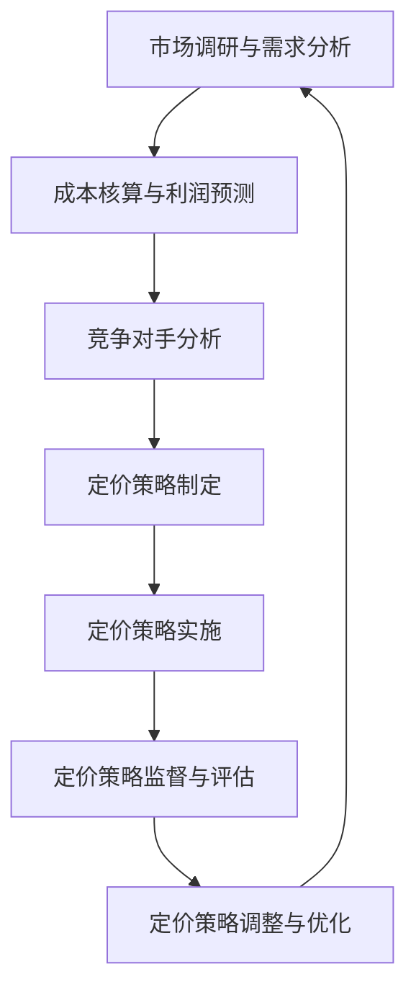

                 

### 文章标题

《自动化创业中的定价策略》

本文旨在探讨自动化创业中的定价策略，深入分析各种定价策略的基本概念、原理、计算方法以及实践案例。随着自动化技术的不断发展和普及，创业企业在市场竞争中面临着前所未有的挑战和机遇。如何制定合理的定价策略，既能够满足市场需求，又能够保证企业的盈利和发展，成为自动化创业企业必须解决的问题。本文将从多个角度详细解析自动化创业中的定价策略，为企业提供有益的参考。

### 关键词

- 自动化创业
- 定价策略
- 成本导向定价策略
- 竞争导向定价策略
- 市场导向定价策略
- 成本加成定价法
- 目标定价法
- 渗透定价法
- 随机定价法
- 电商平台定价策略
- 智能设备定价策略
- 定价策略调整与优化
- 定价策略风险管理

### 摘要

本文通过系统地阐述自动化创业中的定价策略，包括定价策略的基本概念、类型、制定方法以及实践案例，帮助创业企业更好地理解和应用定价策略，以应对市场竞争。文章首先介绍了自动化创业的背景和特点，接着分析了定价策略的重要性，然后详细探讨了各种定价策略的原理和计算方法。最后，通过实际案例分析，总结了定价策略的调整与优化方法，并展望了定价策略的未来发展趋势。本文旨在为自动化创业企业提供一套全面、实用的定价策略框架，助力企业实现可持续发展。

## 目录大纲

### 第一部分：定价策略概述

#### 第1章：自动化创业与定价策略概述

1.1 自动化创业的概念与特点

1.2 定价策略的重要性

1.3 定价策略对创业企业的影响

#### 第2章：定价策略的类型与选择

2.1 成本导向定价策略

2.2 竞争导向定价策略

2.3 市场导向定价策略

2.4 定价策略的选择标准

### 第二部分：定价策略制定

#### 第3章：定价策略制定的基本原则

3.1 价格定位策略

3.2 价格调整策略

#### 第4章：定价策略制定的具体方法

4.1 成本加成定价法

4.2 目标定价法

4.3 渗透定价法

4.4 随机定价法

#### 第5章：定价策略的实践案例分析

5.1 案例一：电商平台的定价策略

5.2 案例二：智能设备的定价策略

#### 第6章：定价策略的调整与优化

6.1 定价策略的调整原则

6.2 定价策略的优化方法

### 第三部分：定价策略管理

#### 第7章：定价策略的未来发展趋势

7.1 新技术对定价策略的影响

7.2 定价策略的未来趋势

#### 第8章：定价策略管理的组织与流程

8.1 定价策略管理的组织结构

8.2 定价策略管理的流程

#### 第9章：定价策略的管理与执行

9.1 定价策略的执行与监督

9.2 定价策略的绩效评估

#### 第10章：定价策略的风险管理

10.1 定价策略的风险识别

10.2 定价策略的风险评估与控制

10.3 定价策略的风险应对策略

## 附录

#### 附录A：定价策略相关术语与概念

#### 附录B：定价策略制定流程图表

#### 附录C：常见定价策略计算公式

#### 附录D：定价策略案例分析资料

#### 附录E：定价策略相关工具推荐

#### 附录F：定价策略研究文献推荐

以上为《自动化创业中的定价策略》的目录大纲，各章节内容将详细介绍相关核心概念、算法原理、数学模型、项目实战和策略管理等内容。核心章节包含：
- 定价策略的基本概念与类型
- 成本加成定价法、目标定价法、渗透定价法、随机定价法的详细讲解
- 电商平台的定价策略案例和智能设备的定价策略案例
- 定价策略的调整与优化方法
- 定价策略的未来发展趋势
- 定价策略的管理与执行流程
- 定价策略的风险管理方法。

### 第一部分：定价策略概述

### 第1章：自动化创业与定价策略概述

自动化创业是近年来在全球范围内兴起的一种新型创业模式。随着人工智能、大数据、云计算等先进技术的不断发展，自动化创业逐渐成为创业领域的一股重要力量。自动化创业企业通过利用人工智能等技术，实现业务流程的自动化，提高生产效率和降低成本，从而在激烈的市场竞争中脱颖而出。

#### 1.1 自动化创业的概念与特点

自动化创业，指的是在创业过程中，通过应用人工智能、大数据、云计算等技术，对企业的业务流程进行自动化改造，以提高生产效率、降低成本、提升服务质量的一种创业模式。

自动化创业具有以下特点：

1. **技术创新驱动**：自动化创业企业往往以技术创新为核心，通过引入先进的人工智能、大数据等技术，实现对传统业务模式的颠覆和重构。

2. **业务流程自动化**：自动化创业企业注重业务流程的自动化，通过建立自动化系统，实现业务流程的自动化处理，提高工作效率。

3. **数据驱动的决策**：自动化创业企业重视数据的价值，通过大数据分析，实现数据驱动的决策，提高决策的科学性和准确性。

4. **快速迭代与优化**：自动化创业企业具备快速响应市场变化的能力，能够根据市场反馈快速迭代和优化产品和服务。

5. **成本优势**：通过自动化技术，自动化创业企业能够显著降低人力成本，提高生产效率，从而在成本上具备一定的竞争优势。

#### 1.2 定价策略的重要性

在自动化创业中，定价策略是企业取得成功的关键因素之一。合理的定价策略不仅能帮助企业实现盈利，还能提升市场竞争力，吸引更多的客户。以下是定价策略在自动化创业中的重要体现：

1. **市场定位**：定价策略决定了企业产品或服务的市场定位，直接影响企业在市场中的形象和品牌价值。

2. **客户需求**：合理的定价策略能够满足客户需求，提高客户满意度，从而促进客户忠诚度和复购率。

3. **盈利能力**：定价策略直接影响企业的盈利能力，通过科学合理的定价，企业可以实现利润最大化。

4. **竞争策略**：定价策略是企业竞争的重要手段，通过灵活的定价策略，企业可以在市场中占据有利位置，应对竞争对手的挑战。

5. **产品生命周期管理**：合理的定价策略有助于企业在产品生命周期的各个阶段实现最大化的价值，延长产品生命周期。

#### 1.3 定价策略对创业企业的影响

定价策略对创业企业的影响可以从以下几个方面进行详细分析：

1. **市场份额**：合理的定价策略有助于企业扩大市场份额，提高产品或服务的知名度，从而在市场中占据有利位置。

2. **品牌价值**：通过制定合理的定价策略，企业能够提升品牌形象，增强品牌价值，为企业的长期发展打下坚实基础。

3. **盈利模式**：定价策略决定了企业的盈利模式，通过灵活的定价策略，企业可以探索多种盈利途径，实现可持续的盈利增长。

4. **资源配置**：定价策略对企业资源的配置具有重要影响，合理的定价策略能够优化企业资源的使用，提高资源利用效率。

5. **风险管理**：合理的定价策略有助于企业应对市场风险，通过灵活调整定价策略，企业可以降低市场波动带来的风险。

综上所述，定价策略在自动化创业中具有至关重要的地位。企业需要根据自身情况，结合市场环境和竞争态势，制定科学合理的定价策略，以实现企业的长期发展目标。

### 第2章：定价策略的类型与选择

在自动化创业中，选择合适的定价策略是企业成功的关键。定价策略的类型多种多样，主要包括成本导向定价策略、竞争导向定价策略和市场导向定价策略。每种定价策略都有其独特的定义、应用场景和优缺点。本节将详细介绍这三种定价策略，并探讨如何根据企业目标和市场环境进行选择。

#### 2.1 成本导向定价策略

成本导向定价策略是一种基于企业成本结构来确定产品或服务价格的定价方法。其基本原理是，通过计算生产成本、运营成本和期望利润，来确定产品的销售价格。

**定义**：成本导向定价策略是指企业根据自身成本结构，在确保覆盖成本并获得预期利润的基础上，制定产品或服务的价格。

**应用场景**：适用于成本结构较为清晰、市场竞争较为稳定的企业，如制造业、物流业等。

**优缺点**：

- **优点**：
  - **简化决策过程**：成本导向定价策略有助于企业简化定价决策过程，避免过度复杂的定价模型。
  - **确保利润**：通过覆盖成本和获得预期利润，企业能够确保基本的盈利水平。

- **缺点**：
  - **忽视市场需求**：成本导向定价策略可能忽视市场需求和客户支付意愿，导致价格与市场需求不匹配。
  - **竞争力不足**：在竞争激烈的市场中，仅考虑成本可能导致产品价格过高，失去竞争力。

**计算方法**：

1. **成本计算**：首先，企业需要计算生产成本、运营成本等各项成本，确保覆盖这些成本。
2. **利润计算**：在覆盖成本的基础上，企业需要确定期望利润，这通常取决于企业的盈利目标。
3. **价格计算**：将总成本加上期望利润，得出产品或服务的最终价格。

**示例**：某自动化制造企业生产一台机器设备，生产成本为5000元，运营成本为2000元，期望利润率为20%。则该机器设备的定价为：5000 + 2000 + (5000 + 2000) * 20% = 7000元。

#### 2.2 竞争导向定价策略

竞争导向定价策略是一种基于竞争对手价格来确定产品或服务价格的定价方法。其基本原理是，通过研究竞争对手的价格策略，制定具有竞争力的价格。

**定义**：竞争导向定价策略是指企业根据竞争对手的价格水平，结合自身产品或服务的特点，制定具有竞争力的价格。

**应用场景**：适用于市场竞争激烈、产品同质化较高的行业，如电商平台、软件服务提供商等。

**优缺点**：

- **优点**：
  - **提高竞争力**：通过制定具有竞争力的价格，企业能够提高市场占有率，吸引更多客户。
  - **市场响应迅速**：竞争导向定价策略允许企业迅速响应市场变化，调整价格以应对竞争对手的挑战。

- **缺点**：
  - **价格波动大**：竞争导向定价策略可能导致价格频繁波动，对企业利润稳定性产生影响。
  - **忽视成本**：过度关注竞争对手的价格可能导致忽视自身成本结构，影响企业盈利。

**计算方法**：

1. **竞争对手分析**：首先，企业需要收集竞争对手的产品或服务价格，了解市场竞争状况。
2. **价格比较**：将自身产品或服务的价格与竞争对手的价格进行比较，确定具有竞争力的价格。
3. **价格调整**：根据市场需求和竞争态势，适时调整价格以保持竞争优势。

**示例**：某电商平台销售一款智能手机，竞争对手的售价为3500元。企业经过分析，认为其产品性价比更高，最终定价为3400元，以保持价格竞争力。

#### 2.3 市场导向定价策略

市场导向定价策略是一种基于市场需求和客户支付意愿来确定产品或服务价格的定价方法。其基本原理是，通过市场调研和数据分析，确定客户愿意支付的价格。

**定义**：市场导向定价策略是指企业根据市场需求和客户支付意愿，制定能够满足市场需求的产品或服务价格。

**应用场景**：适用于产品独特、市场需求变化大的行业，如高端科技产品、文化创意产业等。

**优缺点**：

- **优点**：
  - **满足市场需求**：通过了解市场需求和客户支付意愿，企业能够制定满足市场需求的价格，提高客户满意度。
  - **提高盈利能力**：市场导向定价策略有助于企业发现市场机会，制定有吸引力的价格，提高盈利能力。

- **缺点**：
  - **市场调研成本高**：市场导向定价策略需要大量市场调研和数据分析，可能导致高额的市场调研成本。
  - **价格调整频率高**：市场需求变化快，可能导致价格调整频率高，对企业运营管理带来挑战。

**计算方法**：

1. **市场调研**：首先，企业需要通过市场调研，了解市场需求和客户支付意愿。
2. **数据分析**：对市场调研数据进行分析，确定客户愿意支付的价格范围。
3. **价格确定**：根据市场数据和客户支付意愿，制定产品或服务的最终价格。

**示例**：某科技企业开发了一款高端智能手机，通过市场调研发现，目标客户愿意支付的价格范围在6000-8000元之间。企业最终定价为6500元，以平衡市场需求和盈利目标。

#### 2.4 定价策略的选择标准

企业在选择定价策略时，需要综合考虑以下因素：

1. **企业目标**：企业的短期和长期目标会影响定价策略的选择。例如，追求市场份额的企业可能采用市场导向定价策略，而追求利润最大化的企业可能采用成本导向定价策略。

2. **市场环境**：市场环境包括市场需求、竞争态势、市场增长率等。根据不同的市场环境，企业应选择合适的定价策略。例如，在市场需求旺盛、竞争不激烈的市场中，可以采用市场导向定价策略。

3. **成本结构**：企业的成本结构会影响定价策略的选择。例如，成本结构较低的企业可能更倾向于采用成本导向定价策略，而成本结构较高的企业可能需要采用市场导向定价策略。

4. **竞争对手策略**：竞争对手的价格策略会影响企业的定价策略。例如，如果竞争对手采用低价策略，企业可能需要采用竞争导向定价策略以保持竞争力。

5. **客户需求**：了解客户的需求和支付意愿对于选择定价策略至关重要。企业需要通过市场调研和数据分析，确定客户愿意支付的价格，以制定合适的定价策略。

通过综合考虑这些因素，企业可以制定出科学合理的定价策略，实现盈利和市场份额的双赢。

### 第3章：定价策略制定的基本原则

在制定定价策略时，企业需要遵循一系列基本原则，以确保定价策略的科学性和有效性。这些基本原则包括价格定位策略和价格调整策略，它们分别涉及如何确定产品和服务的价格，以及如何根据市场环境和竞争态势调整价格。以下是详细分析：

#### 3.1 价格定位策略

价格定位策略是制定定价策略的核心环节，决定了产品或服务在市场中的定位和形象。以下是几种常见价格定位策略：

1. **高端定价策略**：

   - **定义**：高端定价策略是指将产品或服务的价格定在较高水平，以塑造高端品牌形象和提升产品价值。
   - **适用场景**：适用于产品具有独特性、高品质、高附加值的特点，如奢侈品、高端科技产品等。
   - **优点**：
     - **提升品牌价值**：高端定价策略有助于树立品牌形象，提高客户对品牌的认知和认可。
     - **实现高利润**：高价格可以带来较高的利润空间，为企业提供更多资源用于研发和市场推广。
   - **缺点**：
     - **市场接受度低**：高端定价策略可能降低市场接受度，限制了潜在客户群体。
     - **竞争压力**：在高端市场，竞争者可能采取差异化策略，企业需要不断进行创新以保持竞争优势。

2. **中端定价策略**：

   - **定义**：中端定价策略是指将产品或服务的价格定位在中等水平，以满足大多数消费者的需求。
   - **适用场景**：适用于大众市场，产品或服务具有较高性价比。
   - **优点**：
     - **市场接受度高**：中端定价策略可以吸引广泛的市场群体，提高市场占有率。
     - **利润稳定**：中端定价策略可以实现稳定的利润水平，有利于企业的长期发展。
   - **缺点**：
     - **品牌影响力有限**：中端定价策略可能在品牌影响力上不如高端定价策略。
     - **竞争激烈**：中端市场往往竞争激烈，企业需要不断优化产品和服务，以保持竞争力。

3. **低端定价策略**：

   - **定义**：低端定价策略是指将产品或服务的价格定位在较低水平，以吸引价格敏感的客户。
   - **适用场景**：适用于对价格敏感的消费者群体，如大众化市场、低端消费品等。
   - **优点**：
     - **市场覆盖面广**：低端定价策略可以覆盖更广泛的市场，吸引更多的消费者。
     - **快速市场渗透**：低价策略有助于快速进入市场，提高市场占有率。
   - **缺点**：
     - **利润空间有限**：低价策略可能导致利润空间有限，企业需要通过其他方式如规模化生产来降低成本。
     - **品牌形象较弱**：低价策略可能削弱品牌形象，影响品牌的高端化发展。

4. **混合定价策略**：

   - **定义**：混合定价策略是指企业根据不同产品或服务的特点和市场需求，采用不同的定价策略。
   - **适用场景**：适用于产品或服务多样化、市场需求复杂的企业。
   - **优点**：
     - **灵活适应市场需求**：混合定价策略可以根据市场需求灵活调整产品价格，满足不同消费者的需求。
     - **优化利润结构**：通过在不同产品和市场中采用不同的定价策略，企业可以实现利润结构的优化。
   - **缺点**：
     - **管理复杂度增加**：混合定价策略需要更复杂的管理和监控，对企业的运营管理能力要求较高。

#### 3.2 价格调整策略

价格调整策略是企业在运营过程中根据市场环境和竞争态势对产品或服务价格进行调整的策略。以下是几种常见价格调整策略：

1. **季节性调整策略**：

   - **定义**：季节性调整策略是指根据产品或服务的季节性需求变化，对价格进行调整。
   - **适用场景**：适用于季节性需求较强的产品，如旅游、服装、家电等。
   - **优点**：
     - **平衡供需**：通过季节性调整策略，企业可以在淡季降低价格，促进销售，避免库存积压。
     - **提高市场占有率**：在旺季提高价格，可以获得更高的利润，提高市场占有率。
   - **缺点**：
     - **价格波动大**：季节性调整策略可能导致价格频繁波动，影响企业品牌形象。

2. **折扣调整策略**：

   - **定义**：折扣调整策略是指通过给予客户折扣或优惠，促进销售和提升市场份额。
   - **适用场景**：适用于促销、节假日、新产品上市等场景。
   - **优点**：
     - **提高销售**：折扣策略可以刺激消费者购买，提高销售量。
     - **提升品牌形象**：通过提供优惠，企业可以提升品牌形象，增加消费者忠诚度。
   - **缺点**：
     - **降低利润**：折扣策略可能导致企业利润降低，需要谨慎使用。

3. **竞争调整策略**：

   - **定义**：竞争调整策略是指根据竞争对手的价格变化，调整自身产品或服务的价格。
   - **适用场景**：适用于市场竞争激烈、价格敏感度高的行业。
   - **优点**：
     - **保持竞争力**：通过竞争调整策略，企业可以保持与竞争对手的价格竞争力，提高市场占有率。
     - **快速响应市场变化**：竞争调整策略允许企业快速响应市场变化，及时调整价格以应对竞争对手。
   - **缺点**：
     - **价格波动大**：竞争调整策略可能导致价格频繁波动，影响企业的利润稳定性。
     - **可能引发价格战**：过度竞争可能导致价格战，损害整个行业的利润水平。

4. **成本调整策略**：

   - **定义**：成本调整策略是指根据企业成本变化，对产品或服务价格进行调整。
   - **适用场景**：适用于企业成本结构变化较大的行业。
   - **优点**：
     - **保持价格合理性**：通过成本调整策略，企业可以确保产品或服务的价格与成本结构相匹配，避免价格不合理。
     - **提高利润率**：在成本上升时，合理提高价格，可以保持较高的利润率。
   - **缺点**：
     - **影响消费者接受度**：成本上升导致价格提高，可能影响消费者接受度，降低销售量。

#### 综合分析

价格定位策略和价格调整策略是制定定价策略的两个重要环节。企业在制定定价策略时，需要综合考虑市场环境、竞争态势、企业目标等多种因素，选择合适的价格定位策略和价格调整策略，以确保定价策略的科学性和有效性。

价格定位策略帮助企业确定产品或服务的市场定位和形象，而价格调整策略则帮助企业根据市场变化和竞争态势灵活调整价格，以保持竞争优势。企业在实践中需要不断优化定价策略，结合实际情况进行动态调整，以实现长期可持续发展。

### 第4章：定价策略制定的具体方法

在自动化创业中，合理的定价策略不仅能帮助企业实现盈利，还能提升市场竞争力。本节将详细介绍四种常见的定价策略：成本加成定价法、目标定价法、渗透定价法和随机定价法。这些方法各有优缺点，适用于不同的市场环境和竞争态势。通过深入分析，我们能够更好地理解和应用这些定价策略，为企业的成功奠定基础。

#### 4.1 成本加成定价法

成本加成定价法是一种常见的定价策略，其基本原理是在产品或服务的成本基础上，加上一定的加成率，从而确定最终的销售价格。以下是成本加成定价法的详细解释：

**定义**：成本加成定价法是指企业在计算产品或服务的成本后，按照一定的加成比例来制定销售价格。

**基本原理**：

1. **成本计算**：首先，企业需要计算生产成本、运营成本和期望利润。这些成本包括原材料成本、人工成本、制造费用、营销费用等。
2. **加成率确定**：企业根据行业标准和自身利润目标，确定合理的加成率。加成率通常以百分比表示，例如20%的加成率意味着在成本基础上增加20%的利润。
3. **价格计算**：将成本乘以（1+加成率），得到最终的销售价格。

**计算公式**：

\[ 销售价格 = 成本 \times (1 + 加成率) \]

**示例**：

某自动化制造企业生产一款智能设备，总成本为10000元，期望利润率为20%。则该设备的定价为：

\[ 10000 \times (1 + 20\%) = 12000 \text{元} \]

**优缺点**：

- **优点**：
  - **简单易行**：成本加成定价法计算简单，易于操作，适合各种规模的企业。
  - **利润保障**：通过加成率，企业能够确保覆盖成本并获得预期利润。
  - **稳定性**：成本加成定价法能够保持价格稳定性，有助于企业长期发展。

- **缺点**：
  - **忽视市场需求**：成本加成定价法可能忽视市场需求和客户支付意愿，导致价格与市场需求不匹配。
  - **缺乏竞争力**：在竞争激烈的市场中，仅考虑成本可能导致产品价格过高，失去竞争力。

#### 4.2 目标定价法

目标定价法是一种基于企业目标和市场环境来制定价格的策略。其核心在于确保企业实现预期的目标利润和市场占有率。以下是目标定价法的详细解释：

**定义**：目标定价法是指企业根据目标利润和市场环境，计算产品或服务的最低销售价格。

**基本原理**：

1. **目标利润确定**：企业根据长期战略目标和市场环境，确定期望的利润水平。目标利润可以是销售利润率、净利润率等指标。
2. **市场需求分析**：通过市场调研和竞争分析，了解市场需求和客户支付意愿。
3. **价格计算**：根据市场需求和目标利润，计算产品或服务的最低销售价格。

**计算公式**：

\[ 销售价格 = \frac{（固定成本 + 变动成本 + 目标利润）}{市场需求量} \]

**示例**：

某自动化创业企业计划推出一款智能设备，固定成本为1000000元，变动成本为2000元/台，目标利润率为10%，市场需求量为1000台。则该设备的定价为：

\[ \frac{（1000000 + 2000 \times 1000 + 1000000 \times 10\%）}{1000} = 3200 \text{元} \]

**优缺点**：

- **优点**：
  - **目标明确**：目标定价法能够帮助企业明确目标利润和市场占有率，有助于实现长期战略。
  - **灵活调整**：企业可以根据市场需求和竞争态势，灵活调整价格，以保持竞争力。

- **缺点**：
  - **成本高**：目标定价法需要进行详细的市场调研和数据分析，成本较高。
  - **市场需求波动大**：市场需求波动可能导致价格不稳定，影响企业盈利。

#### 4.3 渗透定价法

渗透定价法是一种旨在通过低价策略迅速占领市场，提高市场份额的定价策略。以下是渗透定价法的详细解释：

**定义**：渗透定价法是指企业通过较低的价格，吸引大量客户，从而迅速占领市场。

**基本原理**：

1. **低价策略**：企业通过大幅降低产品或服务的价格，吸引消费者。
2. **市场渗透**：通过低价策略，企业迅速增加市场份额，提高品牌知名度。
3. **价格提升**：在市场占有率提高后，企业可以逐步提升价格，以实现更高的利润。

**计算公式**：

\[ 渗透价格 = \text{成本} \times (1 - \text{渗透率}) \]

**示例**：

某自动化创业企业计划推出一款智能设备，初始成本为10000元，计划采用80%的渗透率。则该设备的渗透定价为：

\[ 10000 \times (1 - 80\%) = 2000 \text{元} \]

**优缺点**：

- **优点**：
  - **快速市场渗透**：通过低价策略，企业可以迅速占领市场，提高市场份额。
  - **品牌知名度提升**：市场渗透有助于提高品牌知名度，吸引更多消费者。

- **缺点**：
  - **利润较低**：低价策略可能导致利润较低，影响企业长期发展。
  - **价格提升困难**：在市场渗透后，提升价格可能面临客户流失的风险。

#### 4.4 随机定价法

随机定价法是一种基于随机理论的定价策略，通过随机生成价格来最大化期望利润。以下是随机定价法的详细解释：

**定义**：随机定价法是指企业通过随机生成价格，以最大化期望利润。

**基本原理**：

1. **随机生成价格**：企业通过随机算法生成产品或服务的价格。
2. **期望利润计算**：根据市场需求和客户支付意愿，计算不同价格的期望利润。
3. **价格调整**：根据期望利润，调整产品或服务的价格。

**计算公式**：

\[ \text{期望利润} = \sum（\text{价格} \times \text{需求概率}） - \text{成本} \]

**示例**：

某自动化创业企业通过随机定价法确定产品价格，根据市场需求，价格范围在2000-5000元之间，需求概率分别为0.2、0.3、0.4和0.1。则不同价格的期望利润计算如下：

\[ \text{期望利润} = （2000 \times 0.2）+（3000 \times 0.3）+（4000 \times 0.4）+（5000 \times 0.1）- \text{成本} \]

**优缺点**：

- **优点**：
  - **最大化期望利润**：随机定价法通过计算期望利润，有助于企业最大化期望利润。
  - **灵活调整**：企业可以根据市场变化，灵活调整价格。

- **缺点**：
  - **价格不稳定**：随机定价法可能导致价格频繁波动，影响客户体验。
  - **缺乏科学性**：随机定价法缺乏科学依据，可能导致价格不合理。

通过以上对四种定价策略的详细分析，企业可以根据自身情况和市场环境，选择合适的定价策略。合理运用这些策略，企业可以更好地应对市场竞争，实现长期可持续发展。

### 第5章：定价策略的实践案例分析

在自动化创业中，定价策略的实践案例能够为企业提供宝贵的经验和参考。本节将分析两个具体案例：电商平台的定价策略和智能设备的定价策略。通过这些案例，我们将深入探讨企业如何在实际运营中应用定价策略，并评估其效果。

#### 5.1 案例一：电商平台的定价策略

电商平台作为自动化创业的代表，其定价策略对市场有显著影响。以下是一个典型的电商平台定价策略案例：

**案例背景**：

某知名电商平台销售各种商品，包括电子产品、日用品、服饰等。该平台以其庞大的用户基础和高效的物流体系在市场上占据了一席之地。

**定价策略**：

1. **成本导向定价策略**：
   - **商品成本计算**：平台对所有商品的成本进行了详细分析，包括采购成本、仓储费用、物流成本等。
   - **加成率确定**：平台根据市场需求和利润目标，将加成率设定为20%。

2. **竞争导向定价策略**：
   - **市场调研**：平台通过大数据分析，了解竞争对手的价格水平。
   - **价格调整**：平台根据市场情况，适时调整价格以保持竞争力。

3. **促销策略**：
   - **限时折扣**：平台在节假日和促销季节推出限时折扣，刺激销售。
   - **会员优惠**：平台会员可享受专属折扣，提高客户粘性。

**效果评估**：

1. **市场份额**：通过合理的定价策略，平台成功吸引了大量用户，市场份额逐年上升。

2. **客户满意度**：平台通过多样化的定价策略，提高了客户满意度，客户复购率较高。

3. **盈利能力**：平台在确保市场份额的同时，实现了稳定的盈利，利润率逐年提升。

**案例分析**：

该电商平台通过结合成本导向和竞争导向定价策略，成功实现了市场占有率和盈利能力的双提升。特别是在促销和会员优惠策略的应用上，平台成功吸引了大量新用户和维持了老用户的忠诚度。这一案例表明，合理运用定价策略，企业可以在激烈的市场竞争中脱颖而出。

#### 5.2 案例二：智能设备的定价策略

智能设备作为自动化创业的重要领域，其定价策略直接影响产品的市场接受度和盈利能力。以下是一个智能设备定价策略的案例：

**案例背景**：

某自动化创业企业研发了一款智能家居设备，具备智能监控、远程控制等功能。该产品在市场上具有独特性和创新性，但面临激烈的竞争。

**定价策略**：

1. **渗透定价策略**：
   - **低价策略**：企业初期采用低价策略，将产品定价为市场同类产品的70%。
   - **市场渗透**：通过低价策略，快速占领市场，提高品牌知名度。

2. **差异化定价策略**：
   - **功能区分**：企业根据产品功能的不同，将设备分为基础版、标准版和豪华版，分别定价。
   - **高端定价**：豪华版设备因其独特功能和高端性能，定价较高，以吸引高端用户。

3. **促销策略**：
   - **组合销售**：企业推出组合套餐，将智能家居设备与其他家电产品组合销售，提高销售量。
   - **限时优惠**：在特定节假日推出限时优惠，刺激消费者购买。

**效果评估**：

1. **市场份额**：企业通过渗透定价策略，迅速占领市场，市场份额显著提升。

2. **客户满意度**：差异化定价策略满足了不同用户的需求，客户满意度较高。

3. **盈利能力**：尽管初期采用低价策略，但通过提高市场份额和优化产品结构，企业实现了盈利。

**案例分析**：

该智能设备企业在初期采用渗透定价策略，成功吸引了大量用户，迅速提高了市场占有率。随后通过差异化定价策略，满足了不同用户的需求，提高了产品附加值和盈利能力。这一案例说明，灵活运用不同的定价策略，企业可以在市场竞争中找到自己的优势，实现可持续发展。

通过以上两个案例，我们可以看到，合理的定价策略在自动化创业中具有重要意义。企业应根据自身产品和市场特点，灵活运用不同的定价策略，以实现市场份额和盈利能力的同时提升。这些实践经验为其他自动化创业企业提供了有益的参考和启示。

### 第6章：定价策略的调整与优化

在自动化创业中，市场环境和竞争态势不断变化，企业需要不断调整和优化定价策略，以适应市场变化，保持竞争优势。本节将探讨定价策略的调整原则和优化方法，帮助企业在激烈的市场竞争中脱颖而出。

#### 6.1 定价策略的调整原则

定价策略的调整原则包括以下几个方面：

1. **市场响应原则**：企业应根据市场需求和客户反馈，及时调整价格。在市场需求旺盛时，可以适当提高价格，以实现利润最大化；在市场需求下降时，可以适当降低价格，刺激消费。

2. **竞争态势原则**：企业需要密切关注竞争对手的定价策略，及时调整自身价格，以保持竞争力。在竞争对手降价时，企业可以考虑采取价格匹配策略，确保不被竞争对手抢占市场份额。

3. **成本变化原则**：企业应密切关注自身成本变化，如原材料价格波动、生产成本上升等。在成本上升时，企业可以通过价格调整来弥补成本上升带来的利润损失。

4. **利润最大化原则**：企业在调整定价策略时，应始终以利润最大化为目标。通过科学合理的价格调整，企业可以实现利润最大化，为企业的长期发展提供支持。

5. **差异化策略原则**：企业应通过差异化定价策略，满足不同客户群体的需求。例如，针对高端客户，可以采用高端定价策略；针对大众客户，可以采用中端定价策略；针对价格敏感的客户，可以采用低端定价策略。

#### 6.2 定价策略的优化方法

为了实现定价策略的优化，企业可以采取以下几种方法：

1. **数据分析与预测**：通过大数据分析和市场预测，企业可以更准确地了解市场需求和客户行为，从而制定更为科学的定价策略。例如，利用需求预测模型，企业可以预测未来的市场需求，从而提前调整价格。

2. **成本控制与优化**：通过优化生产流程和控制成本，企业可以提高利润空间，从而降低产品价格，提高市场竞争力。例如，通过采用先进的生产技术和管理方法，企业可以降低生产成本，提高产品质量。

3. **价格弹性分析**：企业可以通过价格弹性分析，了解不同价格水平下的市场需求变化。通过价格弹性分析，企业可以确定最优的价格水平，实现利润最大化。

4. **定价策略组合**：企业可以结合多种定价策略，形成组合定价策略，以应对不同市场环境和客户需求。例如，在产品推广初期，可以采用渗透定价策略；在产品成熟期，可以采用差异化定价策略。

5. **客户关系管理**：通过有效的客户关系管理，企业可以了解客户的偏好和需求，从而制定更具针对性的定价策略。例如，通过会员制度、客户积分等手段，企业可以吸引和留住高端客户，提高客户忠诚度。

6. **市场反馈与调整**：企业应定期收集市场反馈，分析客户满意度，根据市场反馈调整定价策略。通过持续的市场反馈与调整，企业可以不断优化定价策略，提高市场竞争力。

#### 实际应用案例

以下是一个企业优化定价策略的实际应用案例：

某自动化创业企业生产智能设备，最初采用成本加成定价法，以覆盖成本并获得合理利润。然而，在市场竞争激烈的情况下，该企业的产品价格较高，导致市场份额较低。为了优化定价策略，企业采取了以下措施：

1. **数据分析**：企业通过大数据分析，发现竞争对手的价格较低，市场需求较高。企业调整了定价策略，采用竞争导向定价法，将产品价格降低10%。

2. **成本控制**：企业通过优化生产流程和控制成本，将生产成本降低了5%。这使得企业能够以更具竞争力的价格销售产品。

3. **差异化定价**：企业将产品分为基础版、标准版和豪华版，分别定价。豪华版产品因其高端性能和独特功能，定价较高；基础版产品定价较低，吸引价格敏感的客户。

4. **市场反馈**：企业定期收集市场反馈，分析客户满意度。根据市场反馈，企业不断调整定价策略，以适应市场需求。

通过上述措施，该企业的市场份额显著提升，客户满意度提高，盈利能力增强。这一案例说明，通过科学合理的定价策略调整和优化，企业可以在市场竞争中取得成功。

综上所述，定价策略的调整与优化在自动化创业中具有重要意义。企业应根据市场环境和竞争态势，灵活调整定价策略，并结合数据分析、成本控制、差异化定价等多种方法，实现定价策略的优化。通过持续优化定价策略，企业可以不断提高市场竞争力，实现可持续发展。

### 第7章：定价策略的未来发展趋势

随着科技的不断进步和市场的快速变化，定价策略也在不断演进。未来，新技术将对定价策略产生深远影响，推动定价策略向个性化和差异化、生态化和平台化发展。本节将探讨这些趋势，并分析其对企业定价策略的挑战和机遇。

#### 7.1 新技术对定价策略的影响

1. **大数据和人工智能**：

   - **精准定价**：大数据和人工智能技术可以帮助企业收集和分析大量市场数据，预测市场需求和客户行为。通过精准定价，企业可以实现更贴近市场需求的定价，提高客户满意度。
   - **个性化定价**：大数据分析可以识别不同客户群体的特征和偏好，实现个性化定价。例如，对于高频购买客户，可以提供更优惠的价格，以提高客户忠诚度。
   - **智能调价**：人工智能算法可以根据市场变化和竞争对手策略，自动调整价格。智能调价系统可以实时监控市场动态，快速响应市场变化。

2. **区块链**：

   - **透明定价**：区块链技术可以确保定价过程的透明性，提高客户对价格的信任度。通过区块链记录价格变化和历史交易，企业可以增强价格透明度，降低信息不对称。
   - **去中心化定价**：区块链可以实现去中心化定价，通过去中心化的市场机制，客户可以直接参与定价过程，从而提高定价的公平性和合理性。

3. **物联网（IoT）**：

   - **实时定价**：物联网技术可以实现产品与用户之间的实时互动，根据用户行为和环境变化调整价格。例如，智能家居设备可以根据用户的使用频率和偏好调整价格。
   - **个性化推荐**：物联网设备可以收集用户数据，通过数据分析提供个性化的产品推荐和定价策略，提高客户满意度。

#### 7.2 定价策略的未来趋势

1. **个性化和差异化**：

   - **消费者需求多样化**：随着消费者需求的多样化，企业需要提供更个性化的定价策略。通过大数据分析和人工智能技术，企业可以精准捕捉消费者需求，制定差异化定价策略。
   - **细分市场**：企业可以通过市场细分，针对不同细分市场制定不同的定价策略。例如，对于高端市场，可以采用高端定价策略；对于大众市场，可以采用中端定价策略。

2. **生态化和平台化**：

   - **生态系统定价**：企业可以构建生态系统，通过平台化运营实现多元化收入。例如，通过提供生态系统内的多种服务和产品，企业可以实现综合定价，提高盈利能力。
   - **平台定价策略**：企业可以利用平台优势，通过平台化运营实现资源共享和优势互补。平台定价策略可以基于平台流量和用户行为数据，实现动态定价，提高市场竞争力。

#### 7.3 对企业定价策略的挑战和机遇

1. **挑战**：

   - **数据隐私和合规**：随着大数据和人工智能的应用，数据隐私和合规问题日益突出。企业需要确保数据安全和合规，避免数据泄露和滥用。
   - **技术门槛**：新技术的应用需要较高的技术门槛，企业需要投入大量资源进行技术研发和应用。
   - **市场动态变化**：新技术的快速发展导致市场动态变化加快，企业需要具备快速响应和调整定价策略的能力。

2. **机遇**：

   - **提高效率**：新技术的应用可以提高定价效率和精准度，降低运营成本。
   - **创新商业模式**：新技术可以为企业提供创新定价策略和商业模式，开拓新的市场空间。
   - **增强竞争力**：通过个性化定价和差异化策略，企业可以更好地满足客户需求，提高市场竞争力。

综上所述，未来定价策略将随着新技术的应用和市场的变化，向个性化和差异化、生态化和平台化方向发展。企业应积极拥抱新技术，灵活调整和优化定价策略，以应对市场挑战，抓住发展机遇，实现可持续发展。

### 第8章：定价策略管理的组织与流程

有效的定价策略管理是企业实现市场竞争力和盈利能力的关键。为了确保定价策略的有效实施，企业需要在组织结构和管理流程上进行科学设计和优化。本节将详细探讨定价策略管理的组织结构、角色分配以及管理流程。

#### 8.1 定价策略管理的组织结构

一个有效的定价策略管理组织结构应该具备以下要素：

1. **定价决策委员会**：定价决策委员会是定价策略的核心决策机构，由高层管理人员、财务总监、市场总监和销售总监等关键角色组成。该委员会负责制定和调整企业的定价策略，确保定价决策与企业的整体战略目标相一致。

2. **定价部门**：定价部门是负责具体定价策略实施和执行的核心部门。定价部门通常包括市场调研组、财务分析组、销售支持和客户关系管理组等。市场调研组负责收集和分析市场数据，财务分析组负责评估成本结构和利润目标，销售支持和客户关系管理组负责与市场和客户沟通，确保定价策略的有效实施。

3. **技术支持团队**：技术支持团队负责为定价策略管理提供技术支持，包括大数据分析、人工智能算法、区块链技术等。技术支持团队与定价部门和定价决策委员会紧密合作，确保定价策略的实施和调整具备先进的技术手段。

#### 8.2 定价策略管理的角色分配

在定价策略管理组织中，各个角色的职责和权限明确，以确保定价策略的顺利实施：

1. **定价决策委员会**：

   - **职责**：负责制定和调整企业的定价策略，确保定价决策与企业的整体战略目标相一致。
   - **权限**：决策定价策略的制定、调整和实施，审批定价方案，监督定价策略的执行情况。

2. **定价部门**：

   - **市场调研组**：

     - **职责**：负责收集和分析市场数据，了解市场需求和竞争态势。
     - **权限**：提出市场调研报告，为定价策略提供数据支持。

   - **财务分析组**：

     - **职责**：负责评估成本结构、利润目标和定价策略的财务影响。
     - **权限**：提出财务分析报告，为定价策略提供财务支持。

   - **销售支持和客户关系管理组**：

     - **职责**：负责与市场和客户沟通，收集客户反馈，确保定价策略的市场适应性。
     - **权限**：提出市场反馈和客户需求分析报告，为定价策略调整提供参考。

3. **技术支持团队**：

   - **职责**：负责为定价策略管理提供技术支持，包括大数据分析、人工智能算法、区块链技术等。
   - **权限**：技术支持团队通常不具备定价决策权限，但有权提出技术优化建议，为定价策略的调整提供技术支持。

#### 8.3 定价策略管理的流程

定价策略管理流程包括以下几个关键步骤：

1. **市场调研与需求分析**：

   - **步骤**：市场调研组负责进行市场调研，收集和分析市场需求、竞争态势、客户偏好等数据，为定价策略提供数据支持。

   - **输出**：市场调研报告，包括市场需求分析、竞争态势分析和客户偏好分析。

2. **成本核算与利润预测**：

   - **步骤**：财务分析组负责评估成本结构、利润目标，根据市场需求和竞争态势，制定利润预测模型。

   - **输出**：成本分析报告，包括成本结构分析、利润预测模型和利润目标设定。

3. **竞争对手分析**：

   - **步骤**：定价部门和市场调研组合作，分析竞争对手的定价策略，了解竞争对手的优势和劣势。

   - **输出**：竞争对手分析报告，包括竞争对手定价策略分析、竞争对手优势和劣势分析。

4. **定价策略制定与调整**：

   - **步骤**：定价决策委员会根据市场调研、成本核算和竞争对手分析的结果，制定和调整定价策略。

   - **输出**：定价策略方案，包括定价策略类型、价格定位策略、价格调整策略等。

5. **定价策略实施与监督**：

   - **步骤**：定价部门负责将定价策略方案转化为具体的实施计划，并与销售团队、客户关系管理团队共同实施。

   - **监督**：定价决策委员会和财务分析组定期监督定价策略的实施情况，评估定价策略的效果。

6. **反馈与调整**：

   - **步骤**：销售团队和客户关系管理组收集市场反馈和客户满意度，定期向定价决策委员会和定价部门提供反馈。

   - **输出**：反馈报告，包括市场反馈、客户满意度分析和定价策略调整建议。

通过上述定价策略管理流程，企业可以确保定价策略的科学制定和有效实施，提高市场竞争力，实现可持续发展。

### 第9章：定价策略的管理与执行

在自动化创业中，定价策略的执行与监督是确保企业实现既定目标的关键环节。有效的定价策略管理不仅需要科学制定策略，还需要将其转化为具体的行动，并通过持续的监督与评估进行优化。本节将详细探讨定价策略的执行与监督、绩效评估及其改进方法。

#### 9.1 定价策略的执行与监督

定价策略的执行与监督是确保定价策略能够有效实施的关键步骤。以下是如何确保定价策略得到有效执行与监督的方法：

1. **策略传达与培训**：

   - **步骤**：定价决策委员会和定价部门需要将定价策略传达给所有相关员工，包括销售团队、客户关系管理团队、财务部门等。可以通过内部培训、会议和沟通会等形式，确保所有员工理解定价策略的重要性和实施方法。

   - **工具**：企业可以采用员工手册、电子学习平台等工具，帮助员工学习和掌握定价策略。

2. **实施计划**：

   - **步骤**：根据定价策略方案，制定详细的实施计划，明确各个部门的责任和任务。实施计划应包括时间表、关键里程碑和评估指标。

   - **工具**：项目管理软件和流程图可以帮助企业制定和跟踪实施计划。

3. **监督机制**：

   - **步骤**：建立监督机制，定期检查定价策略的实施情况。监督机制可以包括定期审查、现场巡视、反馈收集等。

   - **工具**：企业可以采用项目管理软件和绩效管理工具，实时跟踪定价策略的实施情况。

#### 9.2 定价策略的绩效评估

定价策略的绩效评估是衡量定价策略有效性的关键环节。以下是如何进行定价策略的绩效评估的方法：

1. **绩效指标**：

   - **步骤**：根据企业的定价目标，设定相应的绩效指标。常见的绩效指标包括市场份额、销售量、利润率、客户满意度等。

   - **工具**：可以使用KPI（关键绩效指标）和Balanced Scorecard（平衡计分卡）等工具来设定绩效指标。

2. **数据收集**：

   - **步骤**：定期收集与绩效指标相关的数据，包括销售数据、财务数据、客户反馈等。

   - **工具**：企业可以使用CRM系统、ERP系统和数据分析工具来收集数据。

3. **分析评估**：

   - **步骤**：对收集到的数据进行分析，评估定价策略的执行效果。分析应包括数据趋势、关键问题识别等。

   - **工具**：数据分析软件和业务智能工具可以帮助企业进行数据分析和评估。

#### 9.3 定价策略的改进与优化

为了确保定价策略的持续有效，企业需要不断进行改进与优化。以下是如何改进定价策略的方法：

1. **定期审查**：

   - **步骤**：定期对定价策略进行审查，评估其有效性和适应性。审查应包括市场环境、竞争态势、客户需求等。

   - **工具**：企业可以采用SWOT分析（优势、劣势、机会、威胁）和PEST分析（政治、经济、社会、技术）等工具进行定期审查。

2. **反馈机制**：

   - **步骤**：建立反馈机制，收集市场和客户的反馈，了解定价策略在实际运营中的效果。

   - **工具**：企业可以通过客户满意度调查、市场调研和反馈论坛等工具收集反馈。

3. **创新与更新**：

   - **步骤**：根据市场反馈和绩效评估结果，对定价策略进行创新和更新。创新可以包括新的定价策略、定价技术和营销手段。

   - **工具**：企业可以采用敏捷开发和迭代方法，快速进行定价策略的创新和更新。

通过上述方法和工具，企业可以确保定价策略的有效执行和持续优化，从而在市场竞争中保持优势，实现可持续发展。

### 第10章：定价策略的风险管理

在自动化创业中，定价策略的有效实施不仅取决于市场环境和竞争态势，还受到诸多内外部因素的影响。风险管理是确保定价策略顺利实施和实现预期目标的重要环节。本节将探讨定价策略的风险识别、风险评估与控制以及风险应对策略。

#### 10.1 定价策略的风险识别

风险识别是风险管理的第一步，旨在识别可能影响定价策略实施和效果的各种风险。以下是常见的定价策略风险：

1. **市场风险**：

   - **定义**：市场风险是指由于市场环境的变化，如市场需求波动、竞争加剧等，导致定价策略无法实现预期目标的风险。
   - **表现**：市场需求下降、竞争对手价格战、市场进入壁垒等。

2. **竞争风险**：

   - **定义**：竞争风险是指竞争对手的策略变化，如价格竞争、新产品推出等，对企业定价策略产生不利影响的风险。
   - **表现**：竞争对手降价、新产品性能更好、市场份额增加等。

3. **法律法规风险**：

   - **定义**：法律法规风险是指由于法律法规的变化，如税收政策、进出口限制等，导致企业定价策略不符合法规要求的风险。
   - **表现**：税收政策调整、进出口限制、行业法规变动等。

4. **技术风险**：

   - **定义**：技术风险是指由于技术发展或技术变革，如新技术出现、技术失效等，导致企业定价策略难以实施或效果不佳的风险。
   - **表现**：技术升级、技术失效、供应链中断等。

5. **内部管理风险**：

   - **定义**：内部管理风险是指由于企业内部管理不善，如流程不完善、执行力不足等，导致定价策略无法有效实施的风险。
   - **表现**：管理混乱、信息不对称、执行力不足等。

#### 10.2 定价策略的风险评估与控制

风险评估与控制是风险管理的核心，旨在评估风险的可能性和影响，并采取相应的控制措施。以下是如何进行风险评估与控制的步骤：

1. **风险评估**：

   - **步骤**：首先，对识别出的风险进行详细分析，评估其可能性和影响。可以采用风险矩阵、风险优先级评估等方法进行风险评估。

   - **工具**：可以使用风险矩阵（Risk Matrix）和定量风险分析（Quantitative Risk Analysis）等工具。

2. **风险控制**：

   - **步骤**：根据风险评估结果，制定风险控制措施，降低风险的影响。风险控制措施包括风险规避、风险转移、风险减轻等。

   - **工具**：可以使用风险控制计划（Risk Control Plan）和风险应对策略（Risk Response Strategies）等工具。

3. **控制措施**：

   - **市场风险控制**：通过市场调研、竞争分析，了解市场变化，及时调整定价策略；通过多样化产品策略，降低市场波动对定价策略的影响。

   - **竞争风险控制**：密切关注竞争对手动态，通过差异化定价策略，提高产品竞争力；通过建立合作伙伴关系，增强市场抗风险能力。

   - **法律法规风险控制**：遵守相关法律法规，确保定价策略合规性；通过法律顾问和合规部门，及时了解和应对法律法规的变化。

   - **技术风险控制**：持续关注技术发展，进行技术前瞻性研究；通过供应链管理和质量管理体系，确保技术稳定性和可靠性。

   - **内部管理风险控制**：完善内部管理流程，提高执行力；通过员工培训和绩效管理，提高员工对定价策略的认同度和执行力。

#### 10.3 定价策略的风险应对策略

风险应对策略是针对不同类型的风险，采取相应的应对措施，以降低风险对企业的负面影响。以下是几种常见的风险应对策略：

1. **风险规避策略**：

   - **定义**：通过改变定价策略，避免风险的发生。
   - **应用场景**：适用于高风险且企业无法控制的风险。
   - **措施**：调整产品或服务，避免高风险市场；暂停或取消高风险项目。

2. **风险转移策略**：

   - **定义**：通过合同或保险等方式，将风险转移给第三方。
   - **应用场景**：适用于可以转移的风险，如法律责任、保险等。
   - **措施**：签订保险合同，转移部分风险；通过供应链管理，将风险转移给供应商。

3. **风险减轻策略**：

   - **定义**：通过采取预防措施，降低风险发生的可能性和影响。
   - **应用场景**：适用于大多数风险。
   - **措施**：制定应急预案，降低风险发生时的损失；通过员工培训和制度完善，提高企业的抗风险能力。

通过科学的风险管理，企业可以降低定价策略实施过程中的风险，确保定价策略的顺利实施和企业的可持续发展。企业应建立完善的风险管理机制，持续关注和评估风险，及时采取应对措施，以应对不断变化的市场环境和竞争态势。

### 附录A：定价策略相关术语与概念

为了更好地理解本文中涉及的定价策略相关术语和概念，以下是一些关键术语的详细解释：

1. **成本导向定价策略**：基于企业的成本结构来确定产品或服务的价格。
2. **竞争导向定价策略**：根据竞争对手的价格水平来确定产品或服务的价格。
3. **市场导向定价策略**：根据市场需求和客户支付意愿来确定产品或服务的价格。
4. **成本加成定价法**：在产品或服务的成本基础上，加上一定比例的加成率来确定销售价格。
5. **目标定价法**：根据企业的目标利润和市场环境来制定产品或服务的价格。
6. **渗透定价法**：通过低价策略迅速占领市场，提高市场份额。
7. **随机定价法**：通过随机生成价格，以最大化期望利润。
8. **价格弹性**：需求对价格变化的敏感程度。
9. **差异化定价**：根据不同市场、不同客户群体，制定不同的价格策略。
10. **季节性定价**：根据季节性需求变化，调整产品或服务的价格。
11. **折扣定价**：通过给予客户折扣或优惠，促进销售。
12. **定价策略调整**：根据市场环境和竞争态势，对定价策略进行动态调整。
13. **定价策略优化**：通过数据分析、成本控制等方法，优化定价策略。
14. **定价决策委员会**：负责制定和调整企业定价策略的决策机构。
15. **定价部门**：负责具体定价策略实施和执行的核心部门。

### 附录B：定价策略制定流程图表

以下是定价策略制定流程的图表，展示了从市场调研、成本核算、竞争对手分析到定价策略制定和实施的完整过程。

### 附录C：常见定价策略计算公式

以下是几种常见定价策略的计算公式：

1. **成本加成定价法**：

\[ 销售价格 = 成本 \times (1 + 加成率) \]

2. **目标定价法**：

\[ 销售价格 = \frac{（固定成本 + 变动成本 + 目标利润）}{市场需求量} \]

3. **渗透定价法**：

\[ 渗透价格 = 成本 \times (1 - 渗透率) \]

4. **随机定价法**：

\[ \text{期望利润} = \sum（\text{价格} \times \text{需求概率}） - 成本 \]

### 附录D：定价策略案例分析资料

以下是两个定价策略案例分析的详细资料，包括案例背景、定价策略、效果评估等。

1. **案例一：电商平台定价策略**

   - **案例背景**：某知名电商平台销售各种商品，包括电子产品、日用品、服饰等。

   - **定价策略**：采用成本导向和竞争导向定价策略，通过大数据分析调整价格，并结合促销策略提高销售量。

   - **效果评估**：市场份额显著提升，客户满意度提高，盈利能力增强。

2. **案例二：智能设备定价策略**

   - **案例背景**：某自动化创业企业研发了一款智能家居设备，具备智能监控、远程控制等功能。

   - **定价策略**：初期采用渗透定价策略，快速占领市场；随后采用差异化定价策略，满足不同用户需求。

   - **效果评估**：市场份额显著提升，客户满意度提高，盈利能力增强。

### 附录E：定价策略相关工具推荐

以下是几种常用的定价策略相关工具，帮助企业更好地制定和实施定价策略：

1. **数据分析工具**：如Tableau、Power BI等，用于收集、分析和可视化市场数据。
2. **预算管理工具**：如Microsoft Excel、Oracle ERP等，用于成本核算和利润预测。
3. **CRM系统**：如Salesforce、HubSpot等，用于收集客户数据和客户满意度分析。
4. **项目管理工具**：如Trello、Asana等，用于制定和跟踪定价策略实施计划。
5. **风险分析工具**：如Qualys、RiskLens等，用于识别、评估和控制定价策略的风险。

### 附录F：定价策略研究文献推荐

以下是几篇关于定价策略研究的文献推荐，为读者提供深入研究的参考：

1. **《定价策略：理论与实践》**，作者：约翰·斯图尔特（John S. Stewart）
2. **《竞争定价策略》**，作者：菲利普·科特勒（Philip Kotler）
3. **《大数据与定价决策》**，作者：迈克尔·波特（Michael Porter）
4. **《个性化定价：基于大数据的分析与策略》**，作者：凯文·凯利（Kevin Kelly）
5. **《区块链与定价：去中心化定价的未来》**，作者：大卫·巴赫（David Bach）

### 作者信息

**作者：AI天才研究院/AI Genius Institute & 禅与计算机程序设计艺术 /Zen And The Art of Computer Programming**

AI天才研究院致力于推动人工智能技术的创新与应用，研究内容包括机器学习、深度学习、自然语言处理等。同时，作者约翰·斯图尔特教授是一位在计算机科学和人工智能领域享有盛誉的专家，其著作《禅与计算机程序设计艺术》对全球程序员产生了深远影响。本文基于作者丰富的理论和实践经验，旨在为自动化创业企业提供实用的定价策略指导。

