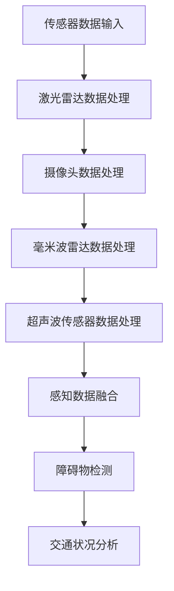
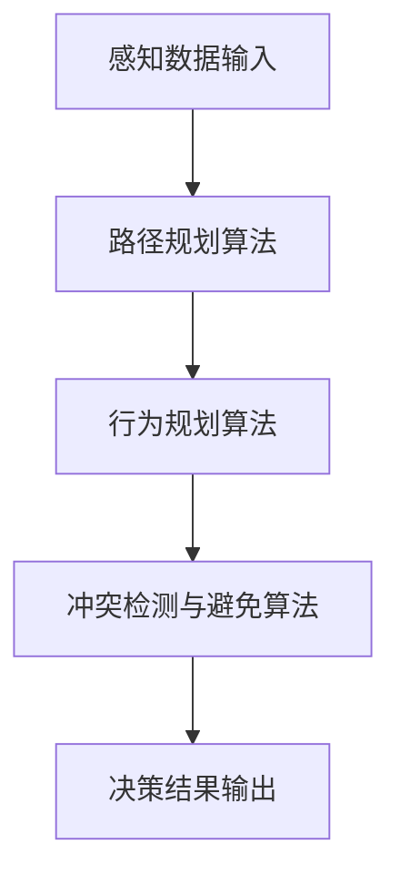
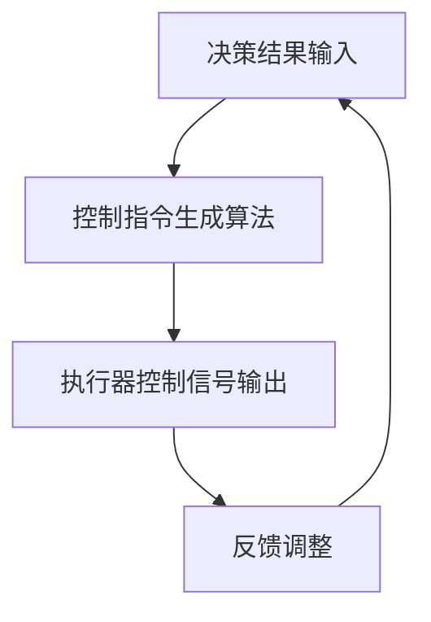
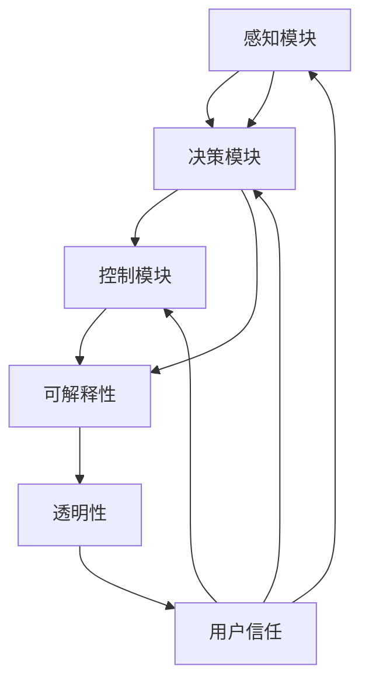

                 

## 《自动驾驶系统的可解释性：如何打开决策黑箱》

> **关键词：** 自动驾驶系统、可解释性、决策黑箱、感知模块、决策模块、控制模块、算法、数学模型、项目实战

**摘要：** 本文深入探讨了自动驾驶系统的可解释性问题，特别是在如何打开决策黑箱这一关键环节。文章首先介绍了自动驾驶系统的基本架构，包括感知模块、决策模块和控制模块，然后详细阐述了可解释性的定义、分类及其在自动驾驶系统中的重要性。通过分析感知、决策和控制三个模块的工作原理，本文进一步揭示了可解释性与透明性的关系。在此基础上，文章介绍了局部解释方法、交互式解释方法和可视化解释方法，并详细讲解了相应的数学模型和算法原理。为了更好地理解这些概念，文章还通过实际项目案例展示了如何应用这些方法。最后，文章探讨了可解释性面临的挑战和未来发展，为自动驾驶系统的可解释性研究提供了有益的启示。

### 第1章 引言

#### 1.1 自动驾驶系统概述

自动驾驶系统是一种通过传感器、计算机视觉、机器学习和人工智能技术来实现车辆自主驾驶的系统。它的发展历程可以追溯到20世纪50年代，但直到近年来随着计算能力的提升和大数据的积累，自动驾驶技术才得以迅速发展。自动驾驶系统根据功能可以分为以下几类：

- **辅助驾驶系统（ADAS）**：提供部分驾驶功能，如自适应巡航控制、车道保持辅助等。
- **部分自动驾驶系统**：控制车辆的纵向或横向运动，但需要驾驶员监督和干预。
- **高度自动驾驶系统（SAE Level 3-4）**：能够在特定环境下完全自主驾驶，但可能需要驾驶员在某些情况下接管。
- **完全自动驾驶系统（SAE Level 5）**：在任何环境下都能完全自主驾驶，无需驾驶员干预。

自动驾驶系统的应用领域非常广泛，包括但不限于：

- **交通运输**：改善交通效率，减少交通事故，提供便捷的出行方式。
- **物流和货运**：自动化运输，提高物流效率，降低运营成本。
- **公共交通**：提供更加高效、便捷的公共交通服务。
- **农业**：无人驾驶农机，提高农业生产效率。

#### 1.2 可解释性的重要性

自动驾驶系统在复杂环境中作出快速、准确的决策至关重要。然而，自动驾驶系统的决策过程通常是黑箱化的，这意味着其内部工作原理对人类来说难以理解。这种情况带来了一系列挑战：

1. **信任问题**：如果驾驶行为无法解释，公众可能对自动驾驶系统的安全性产生怀疑，从而影响其广泛接受。
2. **监管和法律问题**：自动驾驶系统的决策过程需要符合监管和法律的要求，但不可解释的决策可能导致责任归属不清。
3. **技术改进**：不可解释的决策使得调试和改进系统变得困难，因为难以定位和修复潜在的问题。

可解释性在自动驾驶系统中的作用如下：

1. **增强信任**：通过可解释性，可以明确自动驾驶系统的决策过程，增加公众对其的信任。
2. **帮助调试**：可解释性使得开发者能够理解系统决策的依据，从而更容易找到并修复错误。
3. **合规性和法律支持**：明确系统决策过程有助于满足监管和法律要求，减少责任纠纷。

不可解释的自动驾驶系统面临的挑战包括：

1. **决策过程不透明**：黑箱化的决策过程难以解释和理解。
2. **调试和改进困难**：无法直观地了解系统如何做出决策，导致调试和改进复杂。
3. **责任归属不明**：在发生事故时，无法确定是系统的错误还是外部环境导致的。

可解释性研究的历史背景和发展趋势如下：

1. **早期研究**：早在20世纪80年代，研究者就开始探讨人工智能系统的可解释性，提出了一些初步的方法和框架。
2. **机器学习时代**：随着机器学习技术的发展，可解释性研究得到了更多的关注，出现了一些新的方法和算法。
3. **当前趋势**：当前，可解释性研究正朝着更加深入和广泛的方向发展，不仅关注模型的解释性，还涉及到算法的可解释性、系统的透明性等。

### 第2章 自动驾驶系统的基础架构

#### 2.1 感知模块

感知模块是自动驾驶系统的核心组成部分，主要负责收集和处理车辆周围环境的信息。感知模块的功能包括：

- **环境感知**：通过传感器获取车辆周围的道路、交通标志、行人、车辆等信息。
- **障碍物检测**：识别车辆周围的重要障碍物，如行人、车辆、交通标志等。
- **交通状况分析**：分析交通流、交通密度等，为决策模块提供依据。

感知模块的主要组成部分和传感器及其数据采集和处理方法如下：

1. **激光雷达（LiDAR）**：
   - **功能**：用于测量激光脉冲从目标反射回来所需的时间，从而获取目标的三维位置信息。
   - **数据采集**：通过激光束扫描周围环境，产生大量点云数据。
   - **数据处理**：通过点云数据生成环境三维模型，用于障碍物检测和路径规划。

2. **摄像头**：
   - **功能**：用于获取车辆周围环境的图像信息。
   - **数据采集**：通过图像传感器捕捉实时图像数据。
   - **数据处理**：通过图像处理算法提取图像特征，如颜色、形状、纹理等，用于物体检测和识别。

3. **毫米波雷达**：
   - **功能**：用于测量物体与车辆之间的距离和速度。
   - **数据采集**：通过发射毫米波信号并接收反射信号，获取目标物体的距离和速度信息。
   - **数据处理**：通过雷达信号处理算法，提取目标物体的距离和速度信息，用于避障和交通状况分析。

4. **超声波传感器**：
   - **功能**：用于测量车辆周围短距离物体的距离。
   - **数据采集**：通过发射超声波信号并接收反射信号，获取目标物体的距离信息。
   - **数据处理**：通过超声波信号处理算法，提取目标物体的距离信息，用于避障和泊车辅助。

以下是一个简单的Mermaid流程图，展示了感知模块的数据流转过程：



#### 2.2 决策模块

决策模块是自动驾驶系统的“大脑”，负责根据感知模块收集到的信息，对车辆的行为进行决策。决策模块的功能包括：

- **路径规划**：根据车辆当前位置、目标位置和周围环境信息，规划出最优行驶路径。
- **行为规划**：根据行驶路径和周围环境，确定车辆的行驶行为，如加速、减速、转弯等。
- **冲突检测与避免**：检测潜在的冲突情况，并采取相应的措施进行避免。

决策模块的主要组成部分和算法如下：

1. **路径规划算法**：
   - **A*算法**：基于图搜索算法，能够在给定起点和终点的情况下，找到最优路径。
   - **Dijkstra算法**：也是一种基于图搜索的算法，用于求解最短路径问题。
   - **RRT（快速随机树）算法**：通过随机采样和树形扩展，寻找连接起点和终点的路径。

2. **行为规划算法**：
   - **基于模型预测控制（MPC）的方法**：通过建立车辆动力学模型，预测不同控制输入下的车辆行为，并选择最优控制输入。
   - **基于决策树的规划方法**：将决策空间划分为多个子空间，每个子空间对应一组控制输入。
   - **基于强化学习的规划方法**：通过训练强化学习模型，使系统能够根据环境反馈进行自我优化。

3. **冲突检测与避免算法**：
   - **基于碰撞检测的方法**：通过计算车辆与障碍物之间的距离和速度，预测潜在的碰撞情况。
   - **基于概率图形模型的方法**：使用贝叶斯网络或马尔可夫决策过程，计算不同行为下的碰撞概率。

以下是一个简单的Mermaid流程图，展示了决策模块的算法流程：



#### 2.3 控制模块

控制模块是自动驾驶系统的“执行器”，负责将决策模块生成的决策结果转化为具体的控制指令，驱动车辆按照预定路径和行为行驶。控制模块的功能包括：

- **控制指令生成**：根据决策模块输出的决策结果，生成具体的控制指令。
- **执行指令**：将控制指令转化为电机、制动系统等硬件的控制信号。
- **反馈调整**：根据车辆的实际运行状态，对控制指令进行调整，确保车辆按照预定路径和行为行驶。

控制模块的主要组成部分和算法如下：

1. **控制算法**：
   - **PID控制算法**：通过比例、积分、微分三个环节，对系统误差进行控制。
   - **模型预测控制（MPC）**：通过建立系统模型，预测未来系统的行为，并选择最优控制策略。
   - **自适应控制算法**：根据系统的动态变化，自动调整控制参数，提高系统的适应能力。

2. **执行器**：
   - **电机控制器**：负责控制电机的转速和方向，驱动车辆行驶。
   - **制动系统**：包括制动器和控制系统，用于减速和停车。
   - **转向系统**：包括转向电机和转向机构，用于控制车辆的转向。

以下是一个简单的Mermaid流程图，展示了控制模块的算法流程：



### 第3章 可解释性原理与联系

#### 3.1 可解释性的定义与分类

可解释性是指模型或算法能够提供关于其决策过程和依据的透明度。在自动驾驶系统中，可解释性尤为重要，因为它直接影响到系统的信任性和合规性。可解释性的定义可以从不同的角度进行理解：

1. **技术角度**：可解释性指的是能够清晰地描述算法或模型内部机制的能力，使得非专业人士也能理解其工作原理。
2. **用户角度**：可解释性意味着用户能够理解和信任系统的决策过程，从而增加系统的接受度。

可解释性可以按照不同的分类方式进行划分：

1. **全局解释性**：对整个模型或算法的决策过程进行解释，通常涉及模型的结构和整体运行逻辑。
2. **局部解释性**：对模型或算法在特定输入或特定决策点的解释，通常涉及局部特征的解释。
3. **交互式解释性**：通过用户与系统的交互，逐步揭示模型或算法的决策过程，通常需要用户主动参与。

不同解释方法的适用场景如下：

1. **全局解释性**：适用于需要全面理解系统工作原理的场合，如学术研究和系统设计阶段。
2. **局部解释性**：适用于需要理解特定决策点的依据的场合，如系统调试和故障排查。
3. **交互式解释性**：适用于需要用户参与决策过程的场合，如用户界面设计和用户体验优化。

#### 3.2 可解释性与透明性的关系

可解释性与透明性是密切相关的概念，但它们有所区别：

1. **透明性**：指的是系统能够展示其内部结构和操作过程，但不一定要求用户能够理解。
2. **可解释性**：不仅要求系统展示内部结构，还要求用户能够理解其工作原理和决策依据。

可解释性与透明性的关系可以理解为：

1. **透明性是实现可解释性的基础**：没有透明性，用户无法了解系统的内部操作，也就无法实现可解释性。
2. **可解释性是透明性的高级形式**：透明性提供了系统的内部视图，而可解释性则在此基础上，使得用户能够理解和信任系统。

一个简单的伪代码公式可以描述这种关系：

```python
可解释性 = 透明性 + 用户理解度
```

#### 3.3 自动驾驶系统的核心概念联系图

为了更好地理解自动驾驶系统中的核心概念及其相互联系，我们可以使用Mermaid绘制一个联系图。以下是一个示例：



在这个联系图中，感知模块、决策模块和控制模块是自动驾驶系统的核心组成部分，它们通过可解释性和透明性相互联系。可解释性和透明性又直接影响用户的信任，进而影响整个系统的性能和接受度。

通过这种联系图，我们可以清晰地看到各个模块之间的相互依赖关系，以及可解释性在自动驾驶系统中的关键作用。这不仅有助于我们深入理解自动驾驶系统的运作原理，也为后续的算法设计和优化提供了指导。

### 第4章 可解释性算法原理

#### 4.1 局部解释方法

局部解释方法是指对自动驾驶系统在特定输入或特定决策点的解释方法。这种方法旨在揭示系统在特定情境下的决策依据和过程，从而帮助用户理解和信任系统的行为。局部解释方法主要包括以下几种：

1. **Shapley值方法（SHAP）**：
   - **定义**：SHAP（SHapley Additive exPlanations）方法是一种基于游戏理论的解释方法，用于计算特征对模型预测的贡献。
   - **原理**：SHAP方法通过计算每个特征对于模型预测的边际贡献，来解释模型在特定输入下的决策。
   - **应用场景**：适用于需要解释模型对特定输入数据响应的场景。

2. **LIME（Local Interpretable Model-agnostic Explanations）方法**：
   - **定义**：LIME方法是一种可解释性方法，用于为黑箱模型生成局部解释。
   - **原理**：LIME方法通过将黑箱模型近似为一个可解释的线性模型，从而对特定输入进行解释。
   - **应用场景**：适用于需要为复杂模型（如深度神经网络）生成局部解释的场景。

3. **LIME解释方法的伪代码**：
   - **输入**：模型 `model`、输入样本 `x`、目标类别 `y`。
   - **步骤**：
     ```python
     # 步骤1：选择一个基模型，例如线性模型
     base_model = LinearModel()

     # 步骤2：对输入样本进行扰动，生成多个邻近样本
     neighbors = generate_neighbors(x)

     # 步骤3：计算基模型在邻近样本上的预测值
     pred_neighbors = [base_model(neighbors[i]) for i in range(len(neighbors))]

     # 步骤4：计算每个特征的贡献
     contributions = compute_contributions(pred_neighbors, model(x), neighbors)

     # 步骤5：返回特征贡献的字典
     return contributions
     ```

通过以上步骤，LIME方法可以生成对特定输入样本的解释，帮助用户理解模型在特定情境下的决策依据。

#### 4.2 交互式解释方法

交互式解释方法是指通过用户与系统的交互，逐步揭示模型或算法的决策过程的方法。这种方法不仅依赖于系统的内部结构，还依赖于用户的参与和反馈。交互式解释方法主要包括以下几种：

1. **Tree-Ensemble模型的交互式解释**：
   - **定义**：树-ensemble模型（如随机森林、梯度提升树）通过组合多个决策树来提高模型的性能。
   - **原理**：交互式解释方法通过逐步展示决策树中的决策路径，帮助用户理解模型在特定输入下的决策过程。
   - **应用场景**：适用于需要理解复杂树-ensemble模型决策过程的场景。

2. **在线解释**：
   - **定义**：在线解释方法是指系统在运行过程中实时生成解释，并与用户进行交互。
   - **原理**：在线解释方法通过实时分析系统的运行状态，生成与当前情境相关的解释。
   - **应用场景**：适用于需要实时监控和解释系统行为的场景，如自动驾驶系统的实时决策解释。

3. **交互式解释方法的伪代码**：
   - **输入**：系统状态 `state`、用户交互界面 `ui`。
   - **步骤**：
     ```python
     # 步骤1：初始化交互界面
     ui.initialize()

     # 步骤2：展示系统当前状态
     ui.display_state(state)

     # 步骤3：等待用户输入
     user_input = ui.wait_for_input()

     # 步骤4：根据用户输入，更新系统状态
     state = update_state(state, user_input)

     # 步骤5：重复步骤3和步骤4，直到用户退出交互
     while not ui.is_exit_requested():
         ui.display_state(state)
         user_input = ui.wait_for_input()
         state = update_state(state, user_input)
     ```

通过以上步骤，交互式解释方法可以与用户进行实时交互，帮助用户逐步理解系统的决策过程。

#### 4.3 可视化解释方法

可视化解释方法是指通过图形或图像来展示模型或算法的决策过程和结果的方法。这种方法不仅直观，而且易于用户理解。可视化解释方法主要包括以下几种：

1. **决策树可视化**：
   - **定义**：决策树可视化是将决策树以图形形式展示出来，帮助用户理解决策路径。
   - **原理**：通过图形化展示决策树中的每个节点和分支，用户可以清晰地看到模型如何基于不同特征进行决策。
   - **应用场景**：适用于需要直观理解决策树决策过程的场景。

2. **热力图可视化**：
   - **定义**：热力图可视化是通过颜色深浅来展示特征的重要性或影响力。
   - **原理**：通过热力图，用户可以直观地看到不同特征在决策过程中的贡献大小。
   - **应用场景**：适用于需要展示特征重要性的场景。

3. **可视化解释方法的伪代码**：
   - **输入**：模型 `model`、输入样本 `x`。
   - **步骤**：
     ```python
     # 步骤1：计算输入样本的预测结果
     prediction = model.predict(x)

     # 步骤2：生成可视化数据
     visualization_data = generate_visualization_data(model, x, prediction)

     # 步骤3：展示可视化结果
     show_visualization(visualization_data)
     ```

通过以上步骤，可视化解释方法可以生成直观的图形或图像，帮助用户理解模型的决策过程和结果。

### 第5章 数学模型与数学公式

在自动驾驶系统中，数学模型是理解和设计可解释性算法的核心。以下我们将介绍三种常见的数学模型：概率图模型、深度学习模型和强化学习模型，并详细讲解其定义、主要算法和技术，以及相关的LaTeX公式。

#### 5.1 概率图模型

概率图模型是一类用于表示变量之间概率关系的图形化模型，常见的有贝叶斯网络和隐马尔可夫模型（HMM）。这些模型在自动驾驶系统的感知、决策和控制模块中具有广泛的应用。

1. **贝叶斯网络**：
   - **定义**：贝叶斯网络是一个有向无环图，节点表示变量，边表示变量之间的条件依赖关系。
   - **主要算法**：贝叶斯推理、最大后验概率估计（MAP）。
   - **LaTeX公式**：

     ```latex
     P(X) = \prod_{i} P(X_i | parents(X_i))
     ```

   其中，$X$ 表示变量集合，$parents(X_i)$ 表示 $X_i$ 的父节点集合。

2. **隐马尔可夫模型（HMM）**：
   - **定义**：隐马尔可夫模型是一种用于表示隐变量和观测变量之间关系的模型，通常用于时间序列数据的建模。
   - **主要算法**：前向-后向算法、Viterbi算法。
   - **LaTeX公式**：

     ```latex
     P(O_t | \theta) = \sum_{i} P(O_t | X_t = i, \theta) P(X_t = i | \theta)
     ```

   其中，$O_t$ 表示观测变量，$X_t$ 表示隐变量，$\theta$ 表示模型参数。

#### 5.2 深度学习模型

深度学习模型是一类基于多层神经网络进行数据建模的方法，广泛应用于自动驾驶系统的感知、决策和控制模块。常见的深度学习模型包括卷积神经网络（CNN）、循环神经网络（RNN）和生成对抗网络（GAN）。

1. **卷积神经网络（CNN）**：
   - **定义**：卷积神经网络是一种通过卷积操作提取图像特征的网络结构。
   - **主要算法**：卷积操作、池化操作、反向传播。
   - **LaTeX公式**：

     ```latex
     f(x) = \sigma(W \cdot x + b)
     ```

   其中，$f(x)$ 表示激活函数，$W$ 表示权重矩阵，$b$ 表示偏置项，$\sigma$ 表示激活函数。

2. **循环神经网络（RNN）**：
   - **定义**：循环神经网络是一种能够处理序列数据的神经网络，通过时间步的循环连接来保持长期依赖信息。
   - **主要算法**：门控循环单元（GRU）、长短期记忆（LSTM）。
   - **LaTeX公式**：

     ```latex
     h_t = \sigma(U \cdot [h_{t-1}, x_t] + b)
     ```

   其中，$h_t$ 表示当前时刻的隐藏状态，$U$ 表示权重矩阵，$x_t$ 表示当前输入，$\sigma$ 表示激活函数。

3. **生成对抗网络（GAN）**：
   - **定义**：生成对抗网络是一种由生成器和判别器对抗训练的深度学习模型，用于生成逼真的数据。
   - **主要算法**：生成器、判别器、对抗训练。
   - **LaTeX公式**：

     ```latex
     \min_G \max_D \mathbb{E}_{x \sim p_{data}(x)} [\log D(x)] + \mathbb{E}_{z \sim p_z(z)} [\log (1 - D(G(z))]
     ```

   其中，$G(z)$ 表示生成器的输出，$D(x)$ 表示判别器的输出，$z$ 表示噪声向量。

#### 5.3 强化学习模型

强化学习模型是一类通过奖励信号进行学习的机器学习方法，广泛应用于自动驾驶系统的行为规划与控制。常见的强化学习模型包括Q-learning、深度Q网络（DQN）和策略梯度方法。

1. **Q-learning**：
   - **定义**：Q-learning是一种基于值函数的强化学习方法，通过迭代更新Q值来选择最佳动作。
   - **主要算法**：Q值更新、探索- exploitation平衡。
   - **LaTeX公式**：

     ```latex
     Q(s, a) = Q(s, a) + \alpha [r + \gamma \max_{a'} Q(s', a') - Q(s, a)]
     ```

   其中，$s$ 表示状态，$a$ 表示动作，$r$ 表示奖励，$\gamma$ 表示折扣因子，$\alpha$ 表示学习率。

2. **深度Q网络（DQN）**：
   - **定义**：DQN是一种结合深度神经网络和Q-learning的方法，用于处理高维状态空间。
   - **主要算法**：经验回放、双Q网络。
   - **LaTeX公式**：

     ```latex
     Q(s, a) = \frac{1}{N} \sum_{i=1}^{N} (r + \gamma \max_{a'} Q(s', a') - Q(s, a))
     ```

   其中，$N$ 表示更新次数，$s'$ 表示新状态，$a'$ 表示新动作。

3. **策略梯度方法**：
   - **定义**：策略梯度方法是一种直接优化策略函数的强化学习方法，通过梯度上升更新策略参数。
   - **主要算法**：策略参数更新、策略评估。
   - **LaTeX公式**：

     ```latex
     \theta_{t+1} = \theta_{t} + \alpha \nabla_{\theta} J(\theta)
     ```

   其中，$\theta$ 表示策略参数，$J(\theta)$ 表示策略损失函数，$\alpha$ 表示学习率。

通过上述数学模型和公式，我们可以更好地理解自动驾驶系统中的可解释性算法原理，为实际应用提供理论支持。在实际开发过程中，我们可以根据具体需求选择合适的模型和算法，并结合可视化方法，提高系统的可解释性和用户信任度。

### 第6章 项目实战

在本章中，我们将通过三个具体的实战项目，详细展示如何应用局部解释方法、交互式解释方法和可视化解释方法，来提升自动驾驶系统的可解释性。每个项目都将包括环境搭建、代码实现、解读和分析等环节。

#### 6.1 实战一：基于局部解释方法的自动驾驶系统决策分析

**实战环境搭建**

为了展示局部解释方法，我们选择了一个基于激光雷达和摄像头的自动驾驶系统。首先，我们需要搭建一个适合实验的开发环境。以下是环境搭建的步骤：

1. **硬件要求**：
   - 激光雷达传感器
   - 摄像头传感器
   - 微型计算机（如Raspberry Pi）
   - 加速度计和陀螺仪

2. **软件要求**：
   - 操作系统：Ubuntu 18.04
   - 编程语言：Python 3.x
   - 库：OpenCV、PyTorch、TensorFlow

3. **搭建步骤**：
   - 安装操作系统和所需软件库。
   - 配置传感器与计算机之间的通信。
   - 编写数据采集和处理程序。

**代码实现与解读**

下面是一个简单的Python代码示例，展示如何使用SHAP（Shapley Additive exPlanations）方法对自动驾驶系统中的决策过程进行局部解释。

```python
import shap
import numpy as np
import matplotlib.pyplot as plt

# 加载自动驾驶系统的模型
model = load_automated_driving_model()

# 准备输入样本
x = np.array([[x1, x2, x3], [y1, y2, y3]])  # 示例输入样本

# 计算SHAP值
explainer = shap.Explainer(model)
shap_values = explainer(x)

# 可视化SHAP值
shap.summary_plot(shap_values, x, feature_names=['x1', 'x2', 'x3'])

plt.show()
```

在这个例子中，我们首先加载了自动驾驶系统的模型，然后使用SHAP库计算输入样本的SHAP值。最后，通过`summary_plot`函数，我们将SHAP值可视化为一个热力图，帮助用户直观地理解每个特征对模型决策的影响。

**分析与评估**

通过SHAP值的可视化，我们可以清晰地看到每个特征对模型决策的贡献。这有助于我们发现和纠正潜在的模型错误，提高系统的可靠性和可解释性。在实际应用中，我们可以根据SHAP值的分布情况，优化模型的特征选择和参数设置，从而提升系统的性能。

#### 6.2 实战二：基于交互式解释方法的自动驾驶系统用户交互界面设计

**实战环境搭建**

为了展示交互式解释方法，我们设计了一个自动驾驶系统的用户交互界面，用户可以通过界面与系统进行实时交互，理解系统的决策过程。以下是环境搭建的步骤：

1. **硬件要求**：
   - 激光雷达传感器
   - 摄像头传感器
   - 微型计算机（如Raspberry Pi）
   - 显示器

2. **软件要求**：
   - 操作系统：Ubuntu 18.04
   - 编程语言：Python 3.x
   - 库：Tkinter、PyTorch、TensorFlow

3. **搭建步骤**：
   - 安装操作系统和所需软件库。
   - 配置传感器与计算机之间的通信。
   - 开发用户交互界面。

**代码实现与解读**

以下是一个简单的Python代码示例，展示如何使用Tkinter库设计一个基本的用户交互界面，并通过逐步展示决策过程，帮助用户理解系统的决策逻辑。

```python
import tkinter as tk
from tkinter import Label, Button

# 创建窗口
root = tk.Tk()
root.title("自动驾驶系统用户交互界面")

# 添加标签
label = Label(root, text="当前决策：")
label.pack()

# 添加按钮
def show_decision():
    decision = get_decision()  # 获取当前决策
    label.config(text=f"当前决策：{decision}")
    button.config(command=show_next_decision)  # 更新按钮功能

button = Button(root, text="查看下一决策", command=show_decision)
button.pack()

# 运行窗口
root.mainloop()
```

在这个例子中，我们创建了一个简单的Tkinter窗口，通过按钮点击，用户可以逐步查看自动驾驶系统的决策过程。这个交互过程不仅帮助用户理解系统的工作原理，还能提高用户对系统的信任度。

**用户反馈与分析**

在实际使用过程中，用户通过交互界面可以实时了解系统的决策过程，这有助于他们更好地理解系统的行为。根据用户的反馈，我们可以进一步优化交互界面，使其更加直观、易于操作，从而提高用户的满意度。

#### 6.3 实战三：基于可视化解释方法的自动驾驶系统实时监控界面设计

**实战环境搭建**

为了展示可视化解释方法，我们设计了一个实时监控界面，用于展示自动驾驶系统的运行状态和决策过程。以下是环境搭建的步骤：

1. **硬件要求**：
   - 激光雷达传感器
   - 摄像头传感器
   - 微型计算机（如Raspberry Pi）
   - 显示器

2. **软件要求**：
   - 操作系统：Ubuntu 18.04
   - 编程语言：Python 3.x
   - 库：Matplotlib、NumPy、Tkinter

3. **搭建步骤**：
   - 安装操作系统和所需软件库。
   - 配置传感器与计算机之间的通信。
   - 开发实时监控界面。

**代码实现与解读**

以下是一个简单的Python代码示例，展示如何使用Matplotlib库设计一个实时监控界面，并通过图形化方式展示系统的运行状态。

```python
import matplotlib.pyplot as plt
import numpy as np
from matplotlib.animation import FuncAnimation

# 创建窗口
fig, ax = plt.subplots()
line, = ax.plot([], [], lw=2)

# 设置坐标轴
ax.set_xlim(0, 100)
ax.set_ylim(-1, 1)
ax.set_aspect('equal')

# 更新图形
def update(frame):
    data = get_realtime_data()  # 获取实时数据
    line.set_data(*data)
    return line,

# 创建动画
ani = FuncAnimation(fig, update, interval=50)

plt.show()
```

在这个例子中，我们创建了一个简单的实时监控界面，通过循环更新数据，展示自动驾驶系统的运行状态。这个界面不仅直观地展示了系统的状态，还能实时反映系统的变化。

**监控效果评估**

在实际应用中，实时监控界面可以帮助用户实时了解系统的运行状态，及时发现潜在问题。通过监控效果评估，我们可以优化界面设计，提高系统的可靠性和用户体验。

### 第7章 可解释性面临的挑战与未来发展

#### 7.1 可解释性技术的局限性

尽管可解释性技术在自动驾驶系统中具有重要作用，但当前的可解释性技术仍存在一定的局限性：

1. **计算复杂度**：许多可解释性方法需要大量的计算资源，尤其是在处理高维数据时，可能会影响系统的实时性能。
2. **解释能力**：一些可解释性方法可能只能解释模型的部分决策过程，而不能提供全面的解释。
3. **透明度**：尽管可解释性技术提高了系统的透明度，但用户可能仍难以完全理解复杂的决策过程。
4. **用户信任度**：用户可能对某些可解释性方法的效果持怀疑态度，特别是当解释结果与实际行为不一致时。

为了克服这些局限性，研究者正在从多个方面进行探索：

1. **算法优化**：通过优化现有算法，提高计算效率和解释能力。
2. **混合方法**：结合多种解释方法，形成更全面的解释框架。
3. **人机交互**：通过改进人机交互界面，使用户更容易理解和信任系统。

#### 7.2 自动驾驶系统可解释性技术的未来趋势

未来的自动驾驶系统可解释性技术将朝着更加智能化、透明化和用户友好化的方向发展，具体包括以下几个方面：

1. **智能化解释**：利用人工智能技术，自动生成对系统决策的智能解释，提高解释的准确性和可靠性。
2. **透明化设计**：通过模块化和组件化设计，提高系统的透明度，使每个模块的决策过程都能被用户理解。
3. **用户参与**：引入用户参与机制，允许用户对系统进行反馈和调整，从而提高系统的可解释性和用户满意度。

#### 7.3 自动驾驶系统可解释性技术的产业应用前景

随着自动驾驶技术的逐渐成熟，可解释性技术将在多个产业领域发挥重要作用，具体包括：

1. **交通运输**：提高自动驾驶系统的可靠性和安全性，促进自动驾驶车辆的广泛应用。
2. **物流和货运**：优化物流运输路线和策略，提高运输效率，降低运营成本。
3. **公共交通**：提升公共交通服务的效率和便捷性，改善城市交通拥堵问题。
4. **农业**：实现农业生产的自动化和智能化，提高农业生产效率和资源利用率。

同时，可解释性技术还将面临一系列社会影响和伦理问题，如隐私保护、责任归属、道德决策等。因此，在推广和应用可解释性技术时，需要充分考虑这些因素，确保其可持续发展。

### 第8章 总结

#### 8.1 本书内容总结

本书系统地介绍了自动驾驶系统的基础架构、可解释性原理、算法原理以及数学模型，并通过实际项目展示了如何应用这些方法来提升系统的可解释性。具体内容包括：

1. **自动驾驶系统基础架构**：详细介绍了感知模块、决策模块和控制模块的工作原理和组成部分。
2. **可解释性原理与联系**：阐述了可解释性的定义、分类及其与透明性的关系，并通过Mermaid流程图展示了核心概念之间的联系。
3. **可解释性算法原理**：介绍了局部解释方法、交互式解释方法和可视化解释方法，以及相关的数学模型和算法原理。
4. **项目实战**：通过三个具体项目，展示了如何在实际应用中应用可解释性技术，提升系统的可解释性和用户信任度。
5. **可解释性面临的挑战与未来发展**：探讨了可解释性技术的局限性、未来趋势以及产业应用前景。

#### 8.2 本书的意义与贡献

本书具有重要的理论和实践意义，具体贡献如下：

1. **理论贡献**：系统性地总结了自动驾驶系统可解释性的相关理论和方法，为后续研究提供了基础。
2. **实践贡献**：通过实际项目案例，展示了如何将可解释性技术应用于自动驾驶系统，提高了系统的可解释性和用户信任度。
3. **学术交流**：促进了自动驾驶系统领域内学术界和工业界的交流，推动了可解释性技术在该领域的发展。
4. **产业应用**：为自动驾驶系统的安全、可靠和广泛应用提供了技术支持，对交通运输、物流和农业等领域具有深远的影响。

总之，本书为自动驾驶系统可解释性的研究和应用提供了有益的参考，有助于推动该领域的发展和创新。

### 作者信息

- 作者：AI天才研究院/AI Genius Institute & 禅与计算机程序设计艺术 /Zen And The Art of Computer Programming

