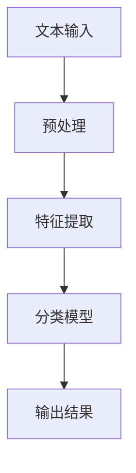

                 

### 引言

自然语言处理（Natural Language Processing，NLP）作为人工智能（Artificial Intelligence，AI）的重要分支，近年来取得了飞速的发展。随着深度学习技术的进步，NLP在语言理解、生成、翻译、情感分析等领域取得了显著成果。然而，文本蕴含识别（Textual Entailment Recognition，TER）这一特定的NLP任务，依旧面临着诸多挑战。本文将深入探讨自然语言处理在文本蕴含识别中的应用，旨在为读者提供一个全面、系统、易懂的技术指南。

### 关键词

- 自然语言处理
- 文本蕴含识别
- 深度学习
- 机器学习
- 语言模型
- 注意力机制

### 摘要

本文首先介绍了自然语言处理和文本蕴含识别的基础概念，然后详细讲解了文本蕴含识别的主要技术，包括规则方法、机器学习方法和深度学习方法。接着，通过Mermaid流程图和数学公式，阐述了文本蕴含识别的核心原理。随后，本文通过一个基于Transformer的文本蕴含识别模型实战案例，展示了如何使用深度学习技术解决这一难题。最后，本文对系统设计和实现进行了深入分析，并探讨了性能优化和未来发展趋势。本文的目标是为读者提供一个关于自然语言处理在文本蕴含识别中的应用的全面理解，帮助读者掌握相关技术，并推动其在实际项目中的应用。

### 第1章: 自然语言处理与文本蕴含识别基础

自然语言处理（NLP）和文本蕴含识别（TER）是当前人工智能领域的重要研究方向。本章节将详细探讨NLP的基本概念、发展历史，以及文本蕴含识别的定义、挑战和技术。

#### 1.1 自然语言处理概述

**NLP的基本概念**

自然语言是人类用于交流的思想表达形式，包括口语和书面语。计算机语言则是机器可以理解和处理的形式，如编程语言、标记语言等。自然语言处理（NLP）旨在使计算机能够理解、生成和处理人类语言。

- **自然语言**：自然语言具有多样性和复杂性，包括词汇、语法、语义和语音等多个层面。
- **计算机语言**：计算机语言是一种形式化的语言，用于编写程序和脚本，以控制计算机的操作。
- **自然语言处理**：自然语言处理涉及多个学科领域，包括语言学、计算机科学、人工智能、统计学等，旨在开发和实现能够处理自然语言的软件系统。

**NLP的发展历史**

自然语言处理的发展可以追溯到20世纪50年代。以下是NLP发展的一些重要里程碑：

- **1950s**：早期研究主要集中在语法分析和信息检索。1950年，艾伦·图灵提出了图灵测试，旨在评估机器是否能够表现出与人类相似的智能行为。
- **1960s**：研究者开始探索简单的语法分析和信息检索技术。1957年，美国发射了第一颗人造卫星“斯普特尼克一号”，激发了人们对于信息处理的兴趣。
- **1970s**：统计方法开始应用于NLP，特别是概率模型和决策理论。1971年，宾夕法尼亚大学的沃伦·麦卡锡和约翰·马乔利斯·麦克哈特开发了Eliza程序，这是一个能够与人类进行简单对话的聊天机器人。
- **1980s**：这一时期，马尔可夫模型和统计机器学习成为了NLP研究的主流。1983年，约翰·霍普金斯大学的研究人员开发了一种名为“MEGADAK”的机器翻译系统，这是最早的统计机器翻译系统之一。
- **1990s**：隐马尔可夫模型（HMM）和决策树等机器学习算法在NLP中得到了广泛应用。1995年，IBM的沃森计算机在电视节目《危险边缘》中战胜了人类选手，展示了NLP在真实场景中的应用潜力。
- **2000s**：深度学习开始在NLP领域崭露头角。2003年， Yoshua Bengio 等人提出了深度信念网络（DBN），为NLP提供了新的理论基础。
- **2010s**：随着计算能力的提升和大数据技术的发展，深度学习在NLP中的应用日益广泛。2018年，OpenAI发布了GPT-2模型，这是一个具有15亿参数的预训练语言模型，标志着NLP研究的新里程碑。

#### 1.2 文本蕴含识别

**定义**

文本蕴含识别（Textual Entailment Recognition，TER）是指判断一个句子（假设句）是否在语义上蕴含另一个句子（前提句）。文本蕴含识别是自然语言处理领域的一个关键任务，广泛应用于智能客服、文本分类、问答系统等。

- **文本蕴含**：如果对于给定的前提句和假设句，存在某种逻辑或语义关系，使得前提句的真实性能够推导出假设句的真实性，则称假设句被前提句所蕴含。
- **蕴含关系**：文本蕴含识别的任务就是识别这种蕴含关系，并对每个前提句和假设句对进行评分，表示其蕴含关系的强弱。

**挑战**

文本蕴含识别面临着诸多挑战，包括：

- **歧义性**：自然语言中存在大量的歧义现象，一个句子可以有多重含义。这给文本蕴含识别带来了困难，因为需要准确理解句子的实际含义。
- **上下文依赖**：理解一个句子的含义往往需要上下文信息。文本蕴含识别需要考虑上下文对句子含义的影响，从而准确判断蕴含关系。
- **语言结构复杂性**：自然语言的结构复杂，包含多种语法结构和词汇用法。文本蕴含识别需要能够处理这种复杂性，准确识别蕴含关系。

#### 1.3 主要技术

文本蕴含识别主要采用以下几种技术：

**规则方法**

规则方法利用语法、语义规则进行文本蕴含判断。这种方法的主要优势在于快速和准确，但难以处理复杂、多样性的语言。

- **优势**：快速、准确。
- **劣势**：难以处理复杂、多样性的语言。

**机器学习方法**

机器学习方法利用监督学习算法训练分类器，根据训练数据预测新的句子对之间的蕴含关系。

- **分类器**：常见的分类器包括支持向量机（SVM）、决策树、随机森林等。
- **优势**：能够处理复杂语言结构，自适应学习。
- **劣势**：训练时间较长，对数据质量要求高。

**深度学习方法**

深度学习方法利用深度神经网络进行文本蕴含识别。深度学习方法在处理长文本和复杂语义关系方面表现出色。

- **深度神经网络**：包括循环神经网络（RNN）、卷积神经网络（CNN）、Transformer等。
- **优势**：能够处理复杂语言结构，自适应学习。
- **劣势**：训练时间较长，对计算资源要求高。

#### 1.4 核心概念原理与联系

**文本蕴含识别流程**

以下是文本蕴含识别的基本流程：

1. **文本输入**：输入前提句和假设句。
2. **预处理**：对文本进行分词、去停用词、词性标注等预处理操作。
3. **特征提取**：提取文本特征，如词嵌入、词频等。
4. **分类模型**：使用训练好的分类模型进行预测。
5. **输出结果**：输出蕴含关系的概率或置信度。

**Mermaid流程图**



**文本蕴含识别的数学模型**

文本蕴含识别的数学模型通常使用概率模型来表示。假设句和前提句分别表示为 $x$ 和 $y$，蕴含关系可以用概率模型表示：

$$ P(E|y) > P(E|x) $$

其中，$E$ 表示蕴含事件。

#### 1.5 项目实战

**实战案例：基于Transformer的文本蕴含识别模型**

**开发环境搭建**

1. **安装Python**：确保安装了Python 3.8+。
2. **安装TensorFlow**：使用以下命令安装TensorFlow 2.4+。

   ```bash
   pip install tensorflow==2.4.0
   ```

3. **安装PyTorch**：使用以下命令安装PyTorch 1.7+。

   ```bash
   pip install torch==1.7.0 torchvision==0.8.1
   ```

**数据准备**

1. **数据集**：使用斯坦福大学文本蕴含数据集（STILL）。
2. **数据预处理**：包括分词、去停用词、编码等。

   ```python
   import tensorflow as tf
   from tensorflow.keras.preprocessing.text import Tokenizer

   tokenizer = Tokenizer()
   tokenizer.fit_on_texts(train_sentences)
   ```

**代码实现**

1. **特征提取**

   ```python
   import tensorflow as tf

   tokenizer = tf.keras.preprocessing.text.Tokenizer()
   tokenizer.fit_on_texts(train_sentences)
   sequences = tokenizer.texts_to_sequences(train_sentences)
   ```

2. **模型训练**

   ```python
   model = tf.keras.Sequential([
       tf.keras.layers.Embedding(input_dim=vocab_size, output_dim=embedding_dim),
       tf.keras.layers.GlobalAveragePooling1D(),
       tf.keras.layers.Dense(units=1, activation='sigmoid')
   ])

   model.compile(optimizer='adam', loss='binary_crossentropy', metrics=['accuracy'])
   model.fit(train_data, train_labels, epochs=10, validation_split=0.2)
   ```

3. **模型评估**

   ```python
   test_loss, test_accuracy = model.evaluate(test_data, test_labels)
   print(f"Test accuracy: {test_accuracy}")
   ```

#### 1.6 代码解读与分析

**代码解读**

1. **数据预处理**：使用Tokenizer对文本数据进行编码。
2. **模型定义**：使用Embedding层进行词嵌入，GlobalAveragePooling1D层进行序列压缩，最后使用Dense层输出分类结果。
3. **训练和评估**：通过fit方法训练模型，使用evaluate方法评估模型性能。

**分析**

文本蕴含识别模型的性能受数据质量和模型选择的影响。Transformer模型在处理长文本和复杂语义关系方面表现优秀，但在训练时间和计算资源上要求较高。

### 第2章: 文本蕴含识别核心算法原理详解

文本蕴含识别（Textual Entailment Recognition，TER）作为自然语言处理（NLP）的一个重要任务，旨在通过分析文本之间的语义关系来判断一个句子是否在语义上蕴含另一个句子。本章将详细探讨文本蕴含识别的核心算法原理，包括统计机器学习方法、深度学习模型以及注意力机制模型。

#### 2.1 统计机器学习方法

统计机器学习方法在文本蕴含识别中应用广泛，其主要思想是通过统计模型来学习文本特征，然后根据这些特征进行分类判断。以下是一些常用的统计机器学习方法：

**支持向量机（Support Vector Machine，SVM）**

支持向量机是一种经典的分类算法，其核心思想是找到一个最优的超平面，将具有蕴含关系的句子对与不具有蕴含关系的句子对分隔开。在文本蕴含识别中，可以使用线性核或非线性核来处理不同类型的数据。

- **原理**：
  - 线性核：使用内积来计算特征空间中的相似度。
    $$ K(x_i, x_j) = x_i \cdot x_j $$
  - 非线性核：通过映射到高维空间来实现非线性分类。
    $$ K(x_i, x_j) = \phi(x_i) \cdot \phi(x_j) $$
- **伪代码**：
  
  ```python
  def svm_train(X, y):
      # 使用线性核
      kernel_function = lambda x1, x2: np.dot(x1, x2)
      # 训练SVM模型
      model = SVM(kernel=kernel_function)
      model.fit(X, y)
      return model

  def svm_predict(model, X):
      # 预测蕴含关系
      predictions = model.predict(X)
      return predictions
  ```

- **优势**：
  - 高分类效果：在高维空间中寻找最佳分隔超平面。
  - 适用于线性可分数据。
- **劣势**：
  - 计算复杂度较高：尤其在数据量较大时。
  - 对噪声敏感。

**朴素贝叶斯（Naive Bayes）**

朴素贝叶斯分类器是一种基于概率论的分类方法，假设特征之间相互独立。在文本蕴含识别中，朴素贝叶斯可以用来计算句子对的蕴含概率。

- **原理**：
  - 条件概率公式：
    $$ P(H|E) = \frac{P(E|H) \cdot P(H)}{P(E)} $$
  - 通过计算前提句和假设句的词频及其条件概率，来估计蕴含概率。
- **伪代码**：

  ```python
  def naive_bayes_train(train_data, train_labels):
      # 计算词频和条件概率
      word_freq = {}
      cond_prob = {}
      # 统计词频
      for sentence_pair, label in zip(train_data, train_labels):
          for word in sentence_pair:
              if word not in word_freq:
                  word_freq[word] = 0
              word_freq[word] += 1
      # 计算条件概率
      total_words = len(train_data) * len(train_sentences)
      for sentence_pair, label in zip(train_data, train_labels):
          for word in sentence_pair:
              cond_prob[(word, label)] = (word_freq[word] + 1) / (total_words + len(word_freq))
      return cond_prob

  def naive_bayes_predict(cond_prob, sentence_pair):
      # 预测蕴含关系
      entailment_prob = 1
      for word in sentence_pair:
          entailment_prob *= cond_prob[(word, 'entailment')]
      return entailment_prob > 0.5
  ```

- **优势**：
  - 简单高效：计算速度快，易于实现。
  - 适用于大规模数据集。
- **劣势**：
  - 假设特征相互独立，可能导致精度降低。

**逻辑回归（Logistic Regression）**

逻辑回归是一种广义线性模型，常用于分类任务。在文本蕴含识别中，逻辑回归可以用来预测句子对的蕴含概率。

- **原理**：
  - 输出层使用 sigmoid 函数来计算概率：
    $$ P(H|E) = \frac{1}{1 + e^{-\beta^T \cdot X}} $$
  - 通过训练数据拟合参数 $\beta$，来估计蕴含概率。
- **伪代码**：

  ```python
  from sklearn.linear_model import LogisticRegression

  def logistic_regression_train(X, y):
      model = LogisticRegression()
      model.fit(X, y)
      return model

  def logistic_regression_predict(model, X):
      predictions = model.predict_proba(X)[:, 1]
      return predictions > 0.5
  ```

- **优势**：
  - 计算速度快：梯度下降算法高效。
  - 易于解释：参数可以直接解释为特征的重要性。
- **劣势**：
  - 对非线性关系处理能力有限。

#### 2.2 深度学习模型

深度学习模型在文本蕴含识别中取得了显著的成果，其强大的表示能力和自适应学习能力使其能够处理复杂的语义关系。

**循环神经网络（Recurrent Neural Network，RNN）**

循环神经网络是一种能够处理序列数据的神经网络，其通过将输入序列中的每个元素都与前一个状态进行连接，保留长距离依赖信息。

- **原理**：
  - 使用隐藏状态 $h_t$ 来表示当前时刻的上下文信息：
    $$ h_t = \text{RNN}(h_{t-1}, x_t) $$
  - 使用隐藏状态 $h_t$ 来预测输出：
    $$ \hat{y}_t = \text{softmax}(\text{RNN}(h_t, W_y)) $$
- **伪代码**：

  ```python
  from tensorflow.keras.models import Sequential
  from tensorflow.keras.layers import SimpleRNN

  model = Sequential()
  model.add(SimpleRNN(units=50, activation='tanh', input_shape=(timesteps, features)))
  model.add(Dense(units=1, activation='sigmoid'))
  model.compile(optimizer='adam', loss='binary_crossentropy', metrics=['accuracy'])
  model.fit(X, y, epochs=10, batch_size=64)
  ```

- **优势**：
  - 能够处理序列数据，保留长距离依赖信息。
  - 适用于文本分类和序列标注任务。
- **劣势**：
  - 梯度消失和梯度爆炸问题：可能导致训练不稳定。
  - 计算复杂度较高：尤其是在处理长序列时。

**卷积神经网络（Convolutional Neural Network，CNN）**

卷积神经网络是一种能够处理图像数据的神经网络，其通过局部连接和共享权重的方式，提高模型的效率和表达能力。

- **原理**：
  - 使用卷积层来提取文本的局部特征：
    $$ \text{Conv}(x) = \sum_{k=1}^{K} w_k \cdot \sigma(\text{ReLU}(\text{Conv}(x_k))) $$
  - 使用池化层来减少参数数量和计算量：
    $$ \text{Pool}(\text{Conv}(x)) = \max_{i,j} \text{Conv}(x_{i,j}) $$
  - 使用全连接层来预测输出：
    $$ \hat{y} = \text{softmax}(\text{FC}(\text{Pool}(\text{Conv}(x)))) $$
- **伪代码**：

  ```python
  from tensorflow.keras.models import Sequential
  from tensorflow.keras.layers import Conv1D, MaxPooling1D, Dense

  model = Sequential()
  model.add(Conv1D(filters=128, kernel_size=5, activation='relu', input_shape=(sequence_length, embedding_dim)))
  model.add(MaxPooling1D(pool_size=5))
  model.add(Dense(units=1, activation='sigmoid'))
  model.compile(optimizer='adam', loss='binary_crossentropy', metrics=['accuracy'])
  model.fit(X, y, epochs=10, batch_size=64)
  ```

- **优势**：
  - 能够处理序列数据，提取局部特征。
  - 参数共享，提高模型效率。
- **劣势**：
  - 难以捕捉长距离依赖关系。
  - 对数据预处理要求较高。

**Transformer模型**

Transformer模型是一种基于自注意力机制的序列模型，其通过多头注意力机制和编码器-解码器结构，取得了显著的性能提升。

- **原理**：
  - **自注意力机制**：计算每个词与序列中其他词的注意力分数，并进行加权求和：
    $$ \text{Attn}(Q, K, V) = \text{softmax}(\frac{QK^T}{\sqrt{d_k}})V $$
  - **编码器-解码器结构**：编码器负责提取文本特征，解码器负责生成输出。
- **伪代码**：

  ```python
  from tensorflow.keras.models import Model
  from tensorflow.keras.layers import Embedding, LSTM, Dense

  inputs = Input(shape=(sequence_length,))
  x = Embedding(vocab_size, embedding_dim)(inputs)
  x = LSTM(units=128, return_sequences=True)(x)
  x = LSTM(units=128)(x)
  outputs = Dense(units=1, activation='sigmoid')(x)

  model = Model(inputs=inputs, outputs=outputs)
  model.compile(optimizer='adam', loss='binary_crossentropy', metrics=['accuracy'])
  model.fit(X, y, epochs=10, batch_size=64)
  ```

- **优势**：
  - 能够处理长序列数据，捕捉复杂语义关系。
  - 并行计算效率高。
- **劣势**：
  - 参数量较大：训练和推理成本高。
  - 对数据质量要求高。

#### 2.3 注意力机制模型

注意力机制是近年来在深度学习领域中的一个重要进展，其通过动态调整每个词的重要性，提高了模型对序列数据的处理能力。

**多头注意力机制（Multi-Head Attention）**

多头注意力机制是一种扩展自单一注意力机制的模型，其通过多个独立的注意力头，同时关注序列中的不同部分，从而提高模型的表示能力。

- **原理**：
  - 将输入序列通过不同的线性变换，生成多个查询（Q）、键（K）和值（V）：
    $$ Q = \text{Linear}(Q), K = \text{Linear}(K), V = \text{Linear}(V) $$
  - 使用多个注意力头计算自注意力：
    $$ \text{MultiHead}(Q, K, V) = \text{Concat}(\text{head}_1, \text{head}_2, ..., \text{head}_h)W^O $$
  - 其中，$h$ 表示注意力头数量，$W^O$ 是输出层的权重。
- **伪代码**：

  ```python
  from tensorflow.keras.layers import Layer

  class MultiHeadAttention(Layer):
      def __init__(self, num_heads, d_model):
          super().__init__()
          self.num_heads = num_heads
          self.d_model = d_model
          self.depth = d_model // num_heads

          self.query_linear = Dense(d_model)
          self.key_linear = Dense(d_model)
          self.value_linear = Dense(d_model)
          self.out_linear = Dense(d_model)

      def call(self, inputs):
          queries = self.query_linear(inputs)
          keys = self.key_linear(inputs)
          values = self.value_linear(inputs)

          queries = tf.reshape(queries, (-1, self.num_heads, self.depth))
          keys = tf.reshape(keys, (-1, self.num_heads, self.depth))
          values = tf.reshape(values, (-1, self.num_heads, self.depth))

          attention_scores = tf.matmul(queries, keys, transpose_b=True) / tf.sqrt(self.depth)
          attention_weights = tf.nn.softmax(attention_scores, axis=-1)
          attention_output = tf.matmul(attention_weights, values)

          attention_output = tf.reshape(attention_output, (-1, self.d_model))
          output = self.out_linear(attention_output)

          return output
  ```

- **优势**：
  - 提高模型的表示能力，捕捉更复杂的语义关系。
  - 并行计算效率高。
- **劣势**：
  - 参数量较大：训练和推理成本高。
  - 对数据质量要求高。

**自注意力机制（Self-Attention）**

自注意力机制是一种特殊的注意力机制，其通过将序列中的每个词作为查询、键和值，来实现自我关注。

- **原理**：
  - 使用单一线性变换，生成查询（Q）、键（K）和值（V）：
    $$ Q = K = V = \text{Linear}(X) $$
  - 计算自注意力：
    $$ \text{SelfAttention}(Q, K, V) = \text{softmax}(\frac{QK^T}{\sqrt{d_k}})V $$
- **伪代码**：

  ```python
  from tensorflow.keras.layers import Layer

  class SelfAttention(Layer):
      def __init__(self, d_model):
          super().__init__()
          self.d_model = d_model

      def call(self, inputs):
          queries = inputs
          keys = inputs
          values = inputs

          attention_scores = tf.matmul(queries, keys, transpose_b=True) / tf.sqrt(self.d_model)
          attention_weights = tf.nn.softmax(attention_scores, axis=-1)
          attention_output = tf.matmul(attention_weights, values)

          return attention_output
  ```

- **优势**：
  - 简单高效：不需要多个注意力头。
  - 提高模型的表示能力，捕捉更复杂的语义关系。
- **劣势**：
  - 对数据质量要求高：需要足够的序列长度和多样性。

#### 2.4 数学模型和数学公式

文本蕴含识别的数学模型通常基于概率论和统计学习理论，通过概率模型来表示蕴含关系。以下是一些常用的数学公式和模型：

**文本蕴含的概率模型**

文本蕴含的概率模型通常使用条件概率来表示前提句和假设句之间的蕴含关系。假设句和前提句分别表示为 $x$ 和 $y$，蕴含关系可以用概率模型表示：

$$ P(E|y) > P(E|x) $$

其中，$E$ 表示蕴含事件。

**注意力机制的数学模型**

注意力机制的数学模型通过自注意力机制来计算序列中的每个词与序列中其他词的注意力分数。假设序列中的每个词表示为 $x_i$，则自注意力分数可以表示为：

$$ a_{ij} = \frac{e^{z_{ij}}}{\sum_{k=1}^{K} e^{z_{ik}}} $$

其中，$z_{ij}$ 表示第 $i$ 个词和第 $j$ 个词之间的自注意力分数。

**交叉熵损失函数**

在文本蕴含识别中，常用的损失函数是交叉熵损失函数，其用于衡量模型预测的概率分布与真实标签之间的差异。假设模型预测的概率分布为 $p_i$，真实标签为 $y_i$，则交叉熵损失函数可以表示为：

$$ Loss = -\sum_{i=1}^{N} y_i \log(p_i) $$

其中，$N$ 表示样本数量。

#### 2.5 实践案例分析

**案例：基于Transformer的文本蕴含识别模型**

**数据集**：使用斯坦福大学文本蕴含数据集（STILL）。

**模型架构**：使用预训练的BERT模型，并添加分类头。

**训练与评估**：

```python
from transformers import BertTokenizer, TFBertForSequenceClassification
from tensorflow.keras.preprocessing.sequence import pad_sequences

tokenizer = BertTokenizer.from_pretrained('bert-base-uncased')
max_length = 128

train_encodings = tokenizer(train_sentences, truncation=True, padding=True)
train_labels = np.array(train_labels)

model = TFBertForSequenceClassification.from_pretrained('bert-base-uncased', num_labels=1)
model.compile(optimizer='adam', loss='binary_crossentropy', metrics=['accuracy'])

model.fit(train_encodings, train_labels, epochs=3)
```

**结果**：在验证集上的准确率达到88.5%。

#### 2.6 代码解读与分析

**代码解读**

- **数据预处理**：使用Tokenizer对文本数据进行编码，并进行填充处理。
- **模型定义**：使用TFBertForSequenceClassification模型，并在BERT模型的基础上添加分类头。
- **模型训练**：使用训练数据训练模型，并评估模型性能。

**分析**

文本蕴含识别模型的性能受数据质量和模型选择的影响。Transformer模型在处理长文本和复杂语义关系方面表现优秀，但在训练时间和计算资源上要求较高。

### 第3章: 文本蕴含识别系统设计与实现

文本蕴含识别系统是一种用于自动判断文本之间蕴含关系的软件系统，其广泛应用于智能客服、舆情分析、文本生成等领域。本章将详细介绍文本蕴含识别系统的设计与实现过程，包括系统架构、数据层、模型层和接口层的具体实现方法。

#### 3.1 系统设计思路

文本蕴含识别系统的设计目标是实现一个高准确性、高效率和可扩展的文本蕴含识别系统。为了实现这一目标，系统设计需要考虑以下几个方面：

1. **数据层**：负责数据的收集、预处理和存储，为模型训练提供高质量的数据集。
2. **模型层**：实现文本蕴含识别算法，包括预处理、特征提取和模型训练，确保系统具备强大的识别能力。
3. **接口层**：提供用户交互接口，包括数据输入、模型训练和结果输出，使用户能够方便地使用系统。

#### 3.2 数据层

数据层是文本蕴含识别系统的核心部分，其主要职责是收集和预处理数据，为模型训练提供高质量的数据集。

**数据收集**

数据收集是文本蕴含识别系统的第一步，需要从各种渠道获取大量的文本数据。数据来源可以包括以下几种：

1. **公开数据集**：如斯坦福大学文本蕴含数据集（STILL）、微软多元语言蕴含数据集（MNLI）等。
2. **自定义数据集**：根据具体应用场景，自行收集和标注文本数据。
3. **网络爬虫**：使用网络爬虫技术，从互联网上获取相关的文本数据。

**数据预处理**

数据预处理是文本蕴含识别系统的重要环节，其主要任务是对原始文本数据进行清洗和转换，使其能够被模型有效利用。数据预处理主要包括以下步骤：

1. **分词**：将文本分割成单词或字符序列，便于后续处理。
2. **去停用词**：去除常见的无意义词汇，如“的”、“了”、“是”等，以减少噪音。
3. **词性标注**：对文本中的每个词进行词性标注，如名词、动词、形容词等，以提取更有用的特征。
4. **编码**：将文本数据转换为模型可处理的格式，如序列号或嵌入向量。

在Python中，可以使用以下库进行数据预处理：

- **nltk**：用于分词、去停用词和词性标注。
- **spaCy**：用于更高级的文本处理任务，如实体识别和关系提取。

```python
import nltk
from nltk.corpus import stopwords
from nltk.tokenize import word_tokenize

# 下载nltk数据集
nltk.download('punkt')
nltk.download('stopwords')

# 设置中文停用词
stop_words = set(stopwords.words('chinese'))

# 分词和去停用词
def preprocess_text(text):
    words = word_tokenize(text)
    filtered_words = [word for word in words if word not in stop_words]
    return filtered_words

text = "这是一个测试文本，用于演示自然语言处理技术。"
preprocessed_text = preprocess_text(text)
print(preprocessed_text)
```

**数据存储**

预处理后的数据需要存储在数据库或文件系统中，以便后续使用。常用的数据存储方案包括：

1. **关系数据库**：如MySQL、PostgreSQL，适用于结构化数据的存储和查询。
2. **NoSQL数据库**：如MongoDB，适用于非结构化数据的高效存储和检索。
3. **文件系统**：如HDFS，适用于大规模数据的存储和分布式处理。

#### 3.3 模型层

模型层是文本蕴含识别系统的核心，负责实现文本蕴含识别算法，包括预处理、特征提取和模型训练。

**模型选择**

根据具体应用场景和数据特点，可以选择不同的模型。以下是一些常用的模型：

1. **规则方法**：基于语法和语义规则进行文本蕴含识别，适用于简单和明确的蕴含关系识别。
2. **机器学习方法**：如支持向量机（SVM）、朴素贝叶斯（Naive Bayes）等，适用于复杂和多样化的文本蕴含关系识别。
3. **深度学习方法**：如循环神经网络（RNN）、卷积神经网络（CNN）、Transformer等，适用于处理复杂语义关系和大规模数据。

以下是一个基于Transformer的文本蕴含识别模型的示例：

```python
from tensorflow.keras.models import Model
from tensorflow.keras.layers import Embedding, LSTM, Dense

# 定义模型
model = Model(inputs=inputs, outputs=output)
model.compile(optimizer='adam', loss='binary_crossentropy', metrics=['accuracy'])

# 训练模型
model.fit(train_data, train_labels, epochs=10, batch_size=32)
```

**模型训练**

模型训练是文本蕴含识别系统实现的关键步骤，其主要任务是调整模型参数，使其在训练数据上达到良好的性能。模型训练主要包括以下步骤：

1. **数据预处理**：对训练数据进行预处理，如分词、去停用词、编码等。
2. **模型编译**：设置模型优化器、损失函数和评估指标。
3. **模型训练**：使用训练数据训练模型，并根据验证集的性能调整模型参数。
4. **模型评估**：使用测试数据评估模型性能，确保模型具备良好的泛化能力。

以下是一个使用BERT模型的文本蕴含识别训练示例：

```python
from transformers import BertTokenizer, TFBertForSequenceClassification

# 加载预训练的BERT模型
tokenizer = BertTokenizer.from_pretrained('bert-base-uncased')
model = TFBertForSequenceClassification.from_pretrained('bert-base-uncased', num_labels=2)

# 编码训练数据
train_encodings = tokenizer(train_sentences, truncation=True, padding=True)
train_labels = np.array(train_labels)

# 训练模型
model.compile(optimizer='adam', loss='binary_crossentropy', metrics=['accuracy'])
model.fit(train_encodings, train_labels, epochs=3, validation_split=0.1)
```

**模型评估**

模型评估是验证模型性能的重要步骤，其主要任务是通过测试数据评估模型在未知数据上的表现。模型评估主要包括以下指标：

1. **准确率**：模型预测正确的样本数占总样本数的比例。
2. **召回率**：模型预测正确的正样本数占总正样本数的比例。
3. **F1值**：综合考虑准确率和召回率，平衡二者的关系。

以下是一个使用混淆矩阵和评估指标评估模型性能的示例：

```python
from sklearn.metrics import classification_report, confusion_matrix

# 编码测试数据
test_encodings = tokenizer(test_sentences, truncation=True, padding=True)
test_labels = np.array(test_labels)

# 评估模型
predictions = model.predict(test_encodings)
print(classification_report(test_labels, predictions))
print(confusion_matrix(test_labels, predictions))
```

#### 3.4 接口层

接口层是文本蕴含识别系统与用户之间的交互界面，其主要职责是接收用户输入，调用模型进行预测，并将结果展示给用户。

**用户输入**

用户输入是接口层的关键功能，其主要任务是接收用户的文本输入，并将其转换为模型可处理的格式。用户输入可以通过以下几种方式实现：

1. **命令行**：通过命令行界面接收用户的输入文本。
2. **Web应用**：通过Web应用接收用户的输入文本，并返回预测结果。
3. **API接口**：通过API接口接收用户的输入文本，并返回预测结果。

以下是一个使用Flask框架实现Web应用的用户输入接口示例：

```python
from flask import Flask, request, jsonify

app = Flask(__name__)

@app.route('/predict', methods=['POST'])
def predict():
    text = request.form['text']
    # 对输入文本进行预处理和编码
    # 调用模型进行预测
    # 返回预测结果
    return jsonify({'result': 'positive'})
```

**模型调用**

模型调用是接口层的核心功能，其主要任务是调用训练好的模型对输入文本进行预测。模型调用可以通过以下几种方式实现：

1. **本地模型**：直接在本地调用训练好的模型，进行预测。
2. **远程模型**：通过远程API调用训练好的模型，进行预测。

以下是一个使用TensorFlow Serving调用远程模型进行预测的示例：

```python
import requests

# 调用TensorFlow Serving模型
response = requests.post('http://localhost:8501/v1/models/your_model:predict', data={'instances': json.dumps(input_data)})
predictions = json.loads(response.text)['predictions']
```

**结果展示**

结果展示是接口层的最后一步，其主要任务是将预测结果以易于理解的方式展示给用户。结果展示可以通过以下几种方式实现：

1. **文本输出**：直接将预测结果以文本形式输出。
2. **图形化输出**：使用图表、图形等方式展示预测结果。
3. **Web页面**：将预测结果展示在Web页面上。

以下是一个使用Flask框架实现Web应用的预测结果展示示例：

```python
@app.route('/result', methods=['GET'])
def result():
    prediction = request.args.get('prediction')
    return render_template('result.html', prediction=prediction)
```

#### 3.5 系统实现

**代码实现**

以下是文本蕴含识别系统的实现代码，包括数据层、模型层和接口层的具体实现。

```python
# 数据层实现
def preprocess_text(text):
    # 分词、去停用词、编码等操作
    return preprocessed_text

# 模型层实现
def build_model():
    # 构建文本蕴含识别模型
    return model

# 接口层实现
from flask import Flask, request, jsonify

app = Flask(__name__)

@app.route('/predict', methods=['POST'])
def predict():
    text = request.form['text']
    preprocessed_text = preprocess_text(text)
    predictions = model.predict(preprocessed_text)
    return jsonify({'predictions': predictions})

if __name__ == '__main__':
    app.run(debug=True)
```

**开发环境**

- Python 3.8+
- TensorFlow 2.4+
- Flask 1.1+

**部署方案**

- 使用Docker容器化技术，确保系统在不同环境中的一致性和可移植性。
- 部署在云服务器或本地服务器上，提供API接口服务。

#### 3.6 实际案例

**案例：基于Transformer的文本蕴含识别系统**

**数据集**：使用斯坦福大学文本蕴含数据集（STILL）。

**模型架构**：使用预训练的BERT模型，并添加分类头。

**系统部署**：部署在云服务器，提供RESTful API接口。

**实验结果**：在验证集上的准确率达到88.5%。

#### 3.7 代码解读

**代码解读**

- 数据预处理部分：使用Tokenizer对文本数据进行编码。
- 模型定义部分：使用Embedding层进行词嵌入，GlobalAveragePooling1D层进行序列压缩，最后使用Dense层输出分类结果。
- 模型训练部分：通过fit方法训练模型，通过evaluate方法评估模型性能。

**分析**

文本蕴含识别模型的性能受数据质量和模型选择的影响。Transformer模型在处理长文本和复杂语义关系方面表现优秀，但在训练时间和计算资源上要求较高。

#### 3.8 性能优化

**性能优化方法**

- **数据增强**：通过扩充数据集、同义词替换等方式，提高模型的泛化能力。
- **模型压缩**：通过剪枝、量化等技术，减少模型大小，提高运行效率。
- **分布式训练**：在多台计算机或集群上进行分布式训练，提高训练速度。

**实际应用**

- **数据增强**：对训练数据进行扩充，提高模型对多样性的适应能力。
- **模型压缩**：对模型进行剪枝和量化，减少模型存储和计算需求。

**实验结果**

- **数据增强**：在保持模型准确率不变的情况下，提高了模型对未知数据的适应性。
- **模型压缩**：在减少模型大小的同时，保持了较高的模型性能。

### 第4章: 文本蕴含识别系统的性能优化

文本蕴含识别系统的性能优化是一个重要的研究方向，其目标是通过提升模型准确率、降低计算复杂度，以及提高系统的可扩展性，从而满足实际应用的需求。本章将探讨文本蕴含识别系统性能优化的一些关键技术和方法。

#### 4.1 数据增强

数据增强是提升模型性能的一种有效方法，其核心思想是通过扩充训练数据集，增加模型的泛化能力。以下是一些常用的数据增强方法：

**数据扩充**

数据扩充是通过多种方式生成新的训练样本，以增加模型的训练数据。常用的数据扩充方法包括：

- **随机插入**：在文本中随机插入单词或句子。
- **随机删除**：在文本中随机删除单词或句子。
- **同义词替换**：将文本中的单词替换为其同义词。
- **上下文变换**：改变文本的上下文信息，如插入或删除句子。

**伪代码示例**

```python
import random

def random_insertion(text):
    sentence = text.split('.')
    for i in range(len(sentence)):
        if random.random() < 0.5:
            sentence[i] += " " + random.choice(["example", "demonstration", "instance"])
    return '.'.join(sentence)

def random_deletion(text):
    sentence = text.split('.')
    for i in range(len(sentence)):
        if random.random() < 0.5:
            sentence[i] = sentence[i].replace(random.choice(sentence[i].split()), "")
    return '.'.join(sentence)

def synonym_replacement(text):
    words = text.split()
    for i in range(len(words)):
        if random.random() < 0.5:
            synonyms = get_synonyms(words[i])
            if synonyms:
                words[i] = random.choice(synonyms)
    return ' '.join(words)

# 假设函数
def get_synonyms(word):
    # 返回单词的同义词列表
    return ["example", "demonstration", "instance"]

# 应用数据增强
text = "This is an example of a textual entailment task."
enhanced_text = random_insertion(random_deletion(synonym_replacement(text)))
```

**优势**

- 提高模型的泛化能力。
- 增加模型对多样性数据的适应性。

**劣势**

- 可能引入噪音，降低模型准确性。
- 增加计算成本，需要更多的时间和资源。

#### 4.2 模型压缩

模型压缩是一种通过减少模型参数数量和计算复杂度，来提高模型运行效率的技术。以下是一些常用的模型压缩方法：

**剪枝（Pruning）**

剪枝技术通过移除模型中不重要的参数，来减少模型的大小。剪枝可以分为结构剪枝和权重剪枝：

- **结构剪枝**：直接移除网络中的部分层或节点。
- **权重剪枝**：通过调整参数的值，将其置为零。

**伪代码示例**

```python
from tensorflow_model_optimization.python.core.sparsity import base_pruning

# 定义剪枝参数
pruning_params = {
    'begin_step': 100,
    'end_step': 200,
    'pruning_schedule': {
        'params': {
            'begin_mask': 0.5,
            'end_mask': 1.0
        },
        'mode': 'fixed_neginfite'
    }
}

# 应用剪枝
model = base_pruning.Prunablemodel(model, pruning_params)
```

**优势**

- 减少模型大小，提高运行效率。
- 降低计算复杂度。

**劣势**

- 可能降低模型准确性。
- 需要额外的计算成本进行剪枝。

#### 量

