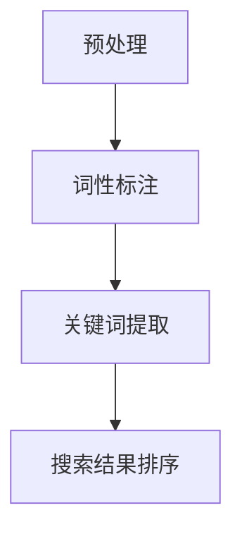

                 

## 《自然语言处理在电商搜索中的应用：技术发展与未来趋势》

### 关键词：
- 自然语言处理
- 电商搜索
- 关键词提取
- 实体识别
- 问答系统
- 推荐系统
- 性能优化
- 未来趋势

### 摘要：
本文探讨了自然语言处理（NLP）在电商搜索中的应用，涵盖了NLP的基础理论、关键技术以及在实际电商搜索场景中的具体应用。文章首先介绍了NLP的基本概念、文本预处理、词性标注与句法分析、语义分析等核心内容。接着，深入探讨了NLP在电商搜索中的关键词提取、实体识别与关系抽取、问答系统、推荐系统等应用。随后，文章通过案例分析展示了NLP技术在电商搜索中的实际应用效果。最后，文章提出了NLP在电商搜索中的性能优化策略和未来发展挑战与解决方案。本文旨在为读者提供一个全面、深入的NLP在电商搜索中应用的指导性参考。

### 目录大纲

# 《自然语言处理在电商搜索中的应用：技术发展与未来趋势》

## 第一部分：自然语言处理（NLP）基础

### 第1章：自然语言处理概述

### 第2章：文本预处理

### 第3章：词性标注与句法分析

### 第4章：语义分析

## 第二部分：电商搜索中的NLP应用

### 第5章：电商搜索中的关键词提取

### 第6章：电商搜索中的实体识别与关系抽取

### 第7章：电商搜索中的问答系统

### 第8章：电商搜索中的推荐系统

## 第三部分：NLP在电商搜索中的实践与优化

### 第9章：NLP在电商搜索中的应用案例

### 第10章：NLP在电商搜索中的性能优化

### 第11章：NLP在电商搜索中的未来发展

## 附录

### 附录A：NLP工具与资源

### 附录B：伪代码示例

### 附录C：数学模型与公式

### 附录D：Mermaid流程图

### 附录E：实际代码实现与解读

### 附录F：作者信息

接下来，我们将按照上述目录结构，逐一探讨NLP在电商搜索中的应用。

## 第一部分：自然语言处理（NLP）基础

### 第1章：自然语言处理概述

自然语言处理（NLP）是人工智能（AI）的一个重要分支，旨在使计算机能够理解、处理和生成人类自然语言。NLP的核心目标是实现人机交互，使计算机能够像人类一样理解语言，并执行相应的任务。

### 1.1 自然语言处理的基本概念

#### 语言模型

语言模型是NLP的基础，用于描述自然语言的概率分布。最简单的语言模型是n元模型，它基于前n个单词预测下一个单词。例如，一元模型只考虑当前单词，而二元模型考虑当前单词和前一个单词。

#### 词性标注

词性标注是NLP中的一项基本任务，用于标记单词的词性（如名词、动词、形容词等）。词性标注有助于理解句子的结构和语义。

#### 句法分析

句法分析是NLP中用于理解句子结构的过程。它包括词法分析、语法分析和语义分析。词法分析将文本分解成单词，语法分析将单词组合成句子结构，语义分析则解释句子的意义。

#### 语义分析

语义分析旨在理解句子的深层含义，包括实体识别、关系抽取、情感分析等。语义分析是NLP中最为复杂的任务之一。

### 1.2 自然语言处理的挑战与机遇

#### 挑战

- **语言的复杂性**：自然语言包含大量的歧义、模糊性和非结构化信息，使得NLP任务变得复杂。
- **数据稀疏**：高质量标注数据集相对较少，限制了模型的训练和优化。
- **跨语言处理**：不同语言之间的语法、词汇和语义差异较大，增加了跨语言处理的难度。
- **实时性**：NLP系统需要快速处理大量的实时数据，对系统的计算性能提出了高要求。

#### 机遇

- **大规模数据**：随着互联网的发展，大量的文本数据被生成和存储，为NLP提供了丰富的训练数据。
- **计算能力的提升**：GPU和TPU等高性能计算设备的普及，使得NLP模型的训练和推理速度大幅提高。
- **多模态融合**：结合文本、图像、语音等多种数据源，可以提供更丰富和准确的语义理解。
- **跨领域应用**：NLP技术在医疗、金融、教育等多个领域的应用不断拓展，推动了NLP技术的不断创新和发展。

## 第2章：文本预处理

文本预处理是NLP任务的第一步，旨在将原始文本转化为适合后续分析的形式。文本预处理包括文本清洗、分词、词性标注、去停用词等步骤。

### 2.1 文本清洗与标准化

文本清洗的目的是去除文本中的噪声和无关信息，如HTML标签、特殊字符、数字等。常用的清洗方法包括：

- **去除HTML标签**：使用正则表达式去除HTML标签。
- **去除特殊字符**：使用正则表达式或函数去除特殊字符。
- **去除数字**：使用正则表达式或函数去除数字。

文本标准化是将文本转化为统一格式的过程，如将全角字符转化为半角字符、将大小写统一等。文本标准化有助于提高后续分析的一致性和准确性。

### 2.2 词向量和语义表示

词向量是文本向量化的一种方法，将单词映射为一个固定大小的向量。词向量可以帮助计算机理解单词的语义关系。常见的词向量模型包括：

- **词袋模型（Bag of Words, BoW）**：将文本表示为单词集合，每个单词对应一个特征向量。
- **词嵌入（Word Embedding）**：将单词映射为稠密向量，常见的词嵌入模型包括Word2Vec、GloVe和BERT。

语义表示是将文本转化为语义向量，用于表示文本的语义信息。常见的语义表示方法包括：

- **文档向量（Document Vector）**：将文本表示为一个固定大小的向量，常用的方法包括TF-IDF和Word2Vec。
- **句子向量（Sentence Vector）**：将句子表示为一个固定大小的向量，常用的方法包括BERT和Transformer。

### 2.3 命名实体识别

命名实体识别（Named Entity Recognition, NER）是NLP中用于识别文本中的命名实体（如人名、地名、组织名等）的任务。NER有助于理解文本的结构和内容，是许多NLP应用的重要基础。

常见的NER方法包括：

- **基于规则的方法**：使用预定义的规则和模式匹配来识别命名实体。
- **基于统计的方法**：使用机器学习算法（如朴素贝叶斯、支持向量机等）来识别命名实体。
- **基于神经网络的方法**：使用深度学习模型（如循环神经网络、卷积神经网络等）来识别命名实体。

## 第3章：词性标注与句法分析

词性标注（Part-of-Speech Tagging, POS）是NLP中用于标记单词的词性（如名词、动词、形容词等）的任务。句法分析（Syntactic Parsing）是NLP中用于理解句子结构的过程。

### 3.1 词性标注原理

词性标注的基本原理是使用标注规则和模型来标记文本中的单词词性。常见的标注规则包括：

- **基于规则的方法**：使用预定义的规则和模式匹配来标注词性。
- **基于统计的方法**：使用统计模型（如条件随机场、隐马尔可夫模型等）来标注词性。
- **基于神经网络的方法**：使用神经网络模型（如循环神经网络、卷积神经网络等）来标注词性。

### 3.2 句法分析的基本概念

句法分析的基本概念包括：

- **词法分析（Lexical Analysis）**：将文本分解成单词和其他语言元素。
- **语法分析（Syntactic Parsing）**：将单词组合成句子结构，常用的方法包括自顶向下、自底向上和转移减少等。
- **语义分析（Semantic Parsing）**：解释句子的意义，包括语义角色标注、语义关系提取等。

### 3.3 句法分析流程与实现

句法分析的基本流程包括：

1. **词法分析**：将文本分解成单词和其他语言元素。
2. **语法分析**：使用语法分析方法将单词组合成句子结构。
3. **语义分析**：解释句子的意义，包括语义角色标注、语义关系提取等。

常见的句法分析方法包括：

- **基于规则的方法**：使用预定义的语法规则和模式匹配来分析句子结构。
- **基于统计的方法**：使用统计模型（如概率上下文无关文法、条件随机场等）来分析句子结构。
- **基于神经网络的方法**：使用神经网络模型（如循环神经网络、卷积神经网络等）来分析句子结构。

## 第4章：语义分析

语义分析是NLP中用于理解文本的深层含义和语义信息的任务。语义分析包括实体识别、关系抽取、文本分类、主题模型等。

### 4.1 语义角色标注

语义角色标注（Semantic Role Labeling, SRL）是NLP中用于标记句子中的谓词和其对应的语义角色的任务。语义角色标注有助于理解句子的语义结构和含义。

常见的SRL方法包括：

- **基于规则的方法**：使用预定义的规则和模式匹配来标注语义角色。
- **基于统计的方法**：使用统计模型（如条件随机场、支持向量机等）来标注语义角色。
- **基于神经网络的方法**：使用神经网络模型（如循环神经网络、卷积神经网络等）来标注语义角色。

### 4.2 语义关系提取

语义关系提取（Semantic Relationship Extraction）是NLP中用于识别文本中的语义关系（如实体之间的联系、因果关系等）的任务。语义关系提取有助于建立文本中的语义网络，为问答系统和知识图谱等应用提供基础。

常见的语义关系提取方法包括：

- **基于规则的方法**：使用预定义的规则和模式匹配来识别语义关系。
- **基于统计的方法**：使用统计模型（如条件随机场、支持向量机等）来识别语义关系。
- **基于神经网络的方法**：使用神经网络模型（如循环神经网络、卷积神经网络等）来识别语义关系。

### 4.3 文本分类与主题模型

文本分类（Text Classification）是NLP中用于将文本分类到预定义的类别中的任务。文本分类广泛应用于情感分析、垃圾邮件检测等应用。

常见的文本分类方法包括：

- **基于规则的方法**：使用预定义的规则和模式匹配来分类文本。
- **基于统计的方法**：使用统计模型（如朴素贝叶斯、支持向量机等）来分类文本。
- **基于神经网络的方法**：使用神经网络模型（如循环神经网络、卷积神经网络等）来分类文本。

主题模型（Topic Modeling）是NLP中用于识别文本中潜在主题的方法。主题模型可以帮助我们理解文本的结构和内容。

常见的主题模型包括：

- **LDA（Latent Dirichlet Allocation）**：LDA是一种基于概率生成模型的主题模型，用于发现文本中的潜在主题。
- **LSTM（Long Short-Term Memory）**：LSTM是一种循环神经网络，可以有效地处理序列数据，适用于文本分类和主题建模。

## 第二部分：电商搜索中的NLP应用

### 第5章：电商搜索中的关键词提取

关键词提取是电商搜索中至关重要的一步，它可以帮助搜索引擎更好地理解用户的搜索意图，从而提供更准确的搜索结果。关键词提取的准确性直接影响到用户的搜索体验和电商平台的业务效果。

### 5.1 关键词提取方法

关键词提取方法可以分为基于词频的方法、基于词性标注的方法和基于文本分类的方法。

#### 基于词频的方法

基于词频的方法通过统计文本中各个词语的出现频率来筛选关键词。这种方法简单有效，但容易受到噪声的影响。

具体步骤如下：

1. **文本清洗**：去除文本中的HTML标签、特殊字符和停用词。
2. **分词**：将文本分解成单词或短语。
3. **词频统计**：计算每个单词或短语的频率。
4. **关键词筛选**：根据预设的阈值，筛选出频率较高的单词或短语作为关键词。

伪代码示例：

```python
def keyword_extraction(text):
    cleaned_text = preprocess_text(text)
    words = tokenize(cleaned_text)
    word_frequencies = count_words(words)
    keywords = filter_by_frequency(word_frequencies, threshold)
    return keywords
```

#### 基于词性标注的方法

基于词性标注的方法通过分析文本中的词性，筛选出名词、动词等具有实际意义的词语作为关键词。这种方法能够更好地过滤掉无意义的词语。

具体步骤如下：

1. **文本清洗**：去除文本中的HTML标签、特殊字符和停用词。
2. **分词**：将文本分解成单词或短语。
3. **词性标注**：使用词性标注模型对单词或短语进行标注。
4. **关键词筛选**：筛选出具有名词、动词等实际意义的词语作为关键词。

伪代码示例：

```python
def keyword_extraction(text):
    cleaned_text = preprocess_text(text)
    words = tokenize(cleaned_text)
    pos_tags = pos_tagging(words)
    keywords = filter_by_pos(pos_tags, ['NOUN', 'VERB'])
    return keywords
```

#### 基于文本分类的方法

基于文本分类的方法将文本分类模型应用于搜索日志，根据分类结果提取关键词。这种方法可以有效地识别出具有相似意图的搜索词。

具体步骤如下：

1. **文本清洗**：去除文本中的HTML标签、特殊字符和停用词。
2. **分词**：将文本分解成单词或短语。
3. **特征提取**：将文本转换为特征向量。
4. **文本分类**：使用训练好的文本分类模型对文本进行分类。
5. **关键词筛选**：根据分类结果筛选出关键词。

伪代码示例：

```python
def keyword_extraction(text):
    cleaned_text = preprocess_text(text)
    words = tokenize(cleaned_text)
    features = extract_features(words)
    categories = classify_text(features)
    keywords = filter_by_category(categories)
    return keywords
```

### 5.2 基于用户行为的搜索关键词分析

用户行为是电商搜索中非常重要的数据源，通过对用户行为的分析，可以更好地了解用户的搜索意图和兴趣点。常见的方法包括搜索引擎日志分析、用户点击行为分析和用户反馈分析。

#### 搜索引擎日志分析

搜索引擎日志分析通过对搜索引擎的日志进行分析，提取出用户搜索的关键词，并分析这些关键词的分布和趋势。

具体步骤如下：

1. **数据采集**：收集搜索引擎的日志数据。
2. **数据处理**：对日志数据进行清洗和预处理，去除无关信息。
3. **关键词提取**：使用关键词提取方法提取日志中的关键词。
4. **数据分析**：分析关键词的分布、趋势和用户搜索意图。

#### 用户点击行为分析

用户点击行为分析通过对用户在搜索结果页面的点击行为进行分析，识别出用户感兴趣的关键词和商品。

具体步骤如下：

1. **数据采集**：收集用户在搜索结果页面的点击行为数据。
2. **数据处理**：对点击行为数据进行清洗和预处理。
3. **关键词提取**：使用关键词提取方法提取点击行为数据中的关键词。
4. **数据分析**：分析关键词和用户兴趣的关系，识别出用户感兴趣的关键词和商品。

#### 用户反馈分析

用户反馈分析通过对用户反馈的信息（如评价、问答等）进行分析，提取出用户关注的关键词和问题。

具体步骤如下：

1. **数据采集**：收集用户反馈数据。
2. **数据处理**：对反馈数据进行清洗和预处理。
3. **关键词提取**：使用关键词提取方法提取反馈数据中的关键词。
4. **数据分析**：分析关键词和用户问题的关系，识别出用户关注的关键词和问题。

### 5.3 搜索关键词的质量评估

搜索关键词的质量直接影响搜索结果的相关性和用户体验。常见的关键词质量评估方法包括相关性评估、用户体验评估和业务目标评估。

#### 相关性评估

相关性评估通过计算关键词与搜索结果的相关性指标，评估关键词的质量。常用的指标包括TF-IDF、Cosine相似度等。

具体步骤如下：

1. **关键词表示**：将关键词和搜索结果表示为向量。
2. **相似度计算**：计算关键词与搜索结果之间的相似度。
3. **相关性评估**：根据相似度指标评估关键词的质量。

#### 用户体验评估

用户体验评估通过用户调研、A/B测试等方法，评估用户对搜索结果和关键词的满意度。

具体步骤如下：

1. **用户调研**：收集用户对搜索结果和关键词的评价。
2. **A/B测试**：在不同用户群体中测试不同关键词的效果，评估用户满意度。

#### 业务目标评估

业务目标评估根据业务目标（如销售额、转化率等）评估关键词的质量。

具体步骤如下：

1. **数据收集**：收集与关键词相关的业务数据。
2. **数据分析**：分析关键词对业务目标的影响。
3. **质量评估**：根据业务数据评估关键词的质量。

## 第6章：电商搜索中的实体识别与关系抽取

实体识别与关系抽取是电商搜索中提高搜索结果相关性的关键步骤。实体识别用于识别文本中的关键实体，如商品名、品牌名、用户名等。关系抽取用于识别实体之间的关联关系，如商品与品牌的关系、用户与评价的关系等。

### 6.1 实体识别技术

实体识别技术可以分为基于规则的方法、基于统计的方法和基于神经网络的方法。

#### 基于规则的方法

基于规则的方法通过定义一系列规则，匹配文本中的实体。这种方法简单直观，但规则难以覆盖所有情况。

具体步骤如下：

1. **规则定义**：定义一系列实体识别规则。
2. **规则匹配**：对文本进行规则匹配，识别出实体。

伪代码示例：

```python
def entity_recognition(text):
    entities = []
    for rule in rules:
        matches = match_rule(text, rule)
        entities.extend(matches)
    return entities
```

#### 基于统计的方法

基于统计的方法利用机器学习算法（如朴素贝叶斯、支持向量机等）对实体进行识别。这种方法可以自动适应数据变化，但需要大量标注数据进行训练。

具体步骤如下：

1. **数据收集**：收集实体识别的标注数据。
2. **特征提取**：将文本和实体表示为特征向量。
3. **模型训练**：使用标注数据训练实体识别模型。
4. **实体识别**：使用训练好的模型对文本进行实体识别。

伪代码示例：

```python
def entity_recognition(text, model):
    features = extract_features(text)
    entities = model.predict(features)
    return entities
```

#### 基于神经网络的方法

基于神经网络的方法使用深度学习模型（如循环神经网络、卷积神经网络等）对实体进行识别。这种方法可以更好地理解文本的语义信息，但计算复杂度较高。

具体步骤如下：

1. **数据收集**：收集实体识别的标注数据。
2. **特征提取**：将文本和实体表示为特征向量。
3. **模型训练**：使用标注数据训练神经网络模型。
4. **实体识别**：使用训练好的模型对文本进行实体识别。

伪代码示例：

```python
def entity_recognition(text, model):
    features = extract_features(text)
    entities = model.predict(features)
    return entities
```

### 6.2 实体关系抽取技术

实体关系抽取技术用于识别文本中的实体之间的关系。实体关系抽取可以分为基于规则的方法、基于统计的方法和基于神经网络的方法。

#### 基于规则的方法

基于规则的方法通过定义一系列规则，匹配文本中的实体关系。这种方法简单直观，但规则难以覆盖所有情况。

具体步骤如下：

1. **规则定义**：定义一系列实体关系抽取规则。
2. **规则匹配**：对文本进行规则匹配，识别出实体关系。

伪代码示例：

```python
def relation_extraction(text):
    relations = []
    for rule in rules:
        matches = match_rule(text, rule)
        relations.extend(matches)
    return relations
```

#### 基于统计的方法

基于统计的方法利用机器学习算法（如朴素贝叶斯、支持向量机等）对实体关系进行抽取。这种方法可以自动适应数据变化，但需要大量标注数据进行训练。

具体步骤如下：

1. **数据收集**：收集实体关系抽取的标注数据。
2. **特征提取**：将文本和实体关系表示为特征向量。
3. **模型训练**：使用标注数据训练实体关系抽取模型。
4. **实体关系抽取**：使用训练好的模型对文本进行实体关系抽取。

伪代码示例：

```python
def relation_extraction(text, model):
    features = extract_features(text)
    relations = model.predict(features)
    return relations
```

#### 基于神经网络的方法

基于神经网络的方法使用深度学习模型（如循环神经网络、卷积神经网络等）对实体关系进行抽取。这种方法可以更好地理解文本的语义信息，但计算复杂度较高。

具体步骤如下：

1. **数据收集**：收集实体关系抽取的标注数据。
2. **特征提取**：将文本和实体关系表示为特征向量。
3. **模型训练**：使用标注数据训练神经网络模型。
4. **实体关系抽取**：使用训练好的模型对文本进行实体关系抽取。

伪代码示例：

```python
def relation_extraction(text, model):
    features = extract_features(text)
    relations = model.predict(features)
    return relations
```

### 6.3 实体与关键词的关联分析

实体与关键词的关联分析是电商搜索中提高搜索结果相关性的关键步骤。常见的方法包括基于共现的方法和基于语义的方法。

#### 基于共现的方法

基于共现的方法通过分析实体与关键词在搜索日志中的共现关系，识别出实体与关键词的关联。

具体步骤如下：

1. **数据收集**：收集搜索日志数据。
2. **共现分析**：计算实体与关键词的共现次数。
3. **关联分析**：分析实体与关键词的共现关系，识别出实体与关键词的关联。

#### 基于语义的方法

基于语义的方法利用词嵌入技术和语义相似度计算，分析实体与关键词之间的语义关联。

具体步骤如下：

1. **数据收集**：收集实体与关键词的相关信息。
2. **词嵌入**：将实体与关键词表示为词嵌入向量。
3. **相似度计算**：计算实体与关键词之间的语义相似度。
4. **关联分析**：分析实体与关键词的语义相似度，识别出实体与关键词的关联。

## 第7章：电商搜索中的问答系统

问答系统是电商搜索中的一种智能化服务，它可以帮助用户快速找到他们需要的商品信息。问答系统可以分为基于检索的问答和基于生成式的问答。

### 7.1 问答系统概述

问答系统（Question Answering System）是一种自动化回答用户问题的系统，它可以接收自然语言形式的输入，并生成自然语言形式的回答。问答系统在电商搜索中的应用主要包括以下几个方面：

- **快速响应**：问答系统可以实时响应用户的提问，提供即时的商品信息。
- **个性化推荐**：基于用户提问，问答系统可以提供个性化的商品推荐。
- **问题解决**：问答系统可以帮助用户解决购物过程中遇到的问题，如产品规格、价格查询等。

### 7.2 基于检索的问答

基于检索的问答系统通过从预先构建的问答库中检索答案，提供快速、准确的回答。这种方法简单高效，但答案库的规模和准确性是关键。

#### 检索算法

常见的方法包括向量空间模型（Vector Space Model, VSM）、文本相似度计算等。通过计算查询与文档之间的相似度，检索出最相关的答案。

具体步骤如下：

1. **查询表示**：将用户提问表示为一个向量。
2. **文档表示**：将问答库中的每个文档表示为一个向量。
3. **相似度计算**：计算查询向量与文档向量之间的相似度。
4. **答案检索**：根据相似度分数，检索出最相关的答案。

#### 答案库构建

答案库的构建是问答系统中的关键步骤。答案库可以从商品描述、用户评价、问答社区等数据源中提取答案。常见的构建方法包括：

- **文本提取**：从文本数据中提取答案。
- **语义提取**：从语义数据中提取答案，如语义角色标注、实体识别等。

### 7.3 基于生成式的问答

基于生成式的问答系统通过自然语言生成技术，生成个性化的答案。这种方法可以提供更丰富、多样化的答案，但生成质量受限于模型的能力和数据的丰富性。

#### 生成模型

常见的生成模型包括循环神经网络（Recurrent Neural Network, RNN）、变换器（Transformer）等。通过训练生成模型，学习如何根据查询生成个性化的答案。

具体步骤如下：

1. **数据收集**：收集大量问答数据，包括问题、答案和上下文信息。
2. **模型训练**：使用问答数据进行模型训练。
3. **答案生成**：根据用户提问，使用训练好的模型生成个性化答案。

#### 文本生成

生成模型可以生成自然语言文本，但生成质量受限于模型的能力和数据的丰富性。常见的技术包括序列到序列（Seq2Seq）模型、生成对抗网络（Generative Adversarial Networks, GAN）等。

具体步骤如下：

1. **编码器**：将用户提问编码为一个向量。
2. **解码器**：根据编码器的输出，解码生成答案。

## 第8章：电商搜索中的推荐系统

推荐系统是电商搜索中的一种重要技术，它可以帮助用户发现他们可能感兴趣的商品。推荐系统可以分为基于内容的推荐和基于模型的推荐。

### 8.1 推荐系统概述

推荐系统（Recommendation System）是一种自动化方法，用于预测用户对商品的兴趣，并推荐相关的商品。推荐系统在电商搜索中的应用主要包括以下几个方面：

- **个性化推荐**：根据用户的历史行为和兴趣，推荐个性化的商品。
- **搜索结果优化**：通过推荐系统，提高搜索结果的相关性和用户体验。
- **提高销售额**：通过推荐系统，增加用户对商品的点击和购买概率。

### 8.2 基于内容的推荐

基于内容的推荐（Content-Based Recommendation）是一种基于商品特征和用户兴趣的推荐方法。它通过分析用户过去喜欢的内容，推荐具有相似特征的商品。

#### 内容表示

内容表示是将商品和用户兴趣表示为向量，以便进行相似度计算。常见的方法包括TF-IDF、词嵌入等。

具体步骤如下：

1. **特征提取**：从商品描述、标签、属性等信息中提取特征。
2. **向量表示**：将特征表示为向量。
3. **相似度计算**：计算用户兴趣向量与商品特征向量之间的相似度。

#### 推荐算法

基于内容的推荐算法通过计算用户兴趣向量与商品特征向量之间的相似度，生成推荐列表。常见的方法包括协同过滤、矩阵分解等。

具体步骤如下：

1. **用户兴趣向量计算**：计算用户的历史行为和兴趣，得到用户兴趣向量。
2. **商品特征向量计算**：计算商品的描述、标签、属性等信息，得到商品特征向量。
3. **相似度计算**：计算用户兴趣向量与商品特征向量之间的相似度。
4. **推荐列表生成**：根据相似度分数，生成推荐列表。

### 8.3 基于模型的推荐

基于模型的推荐（Model-Based Recommendation）是一种基于用户行为和兴趣的推荐方法。它通过机器学习算法，学习用户与商品之间的复杂关系，生成个性化的推荐列表。

#### 用户行为建模

用户行为建模是推荐系统的核心步骤。通过机器学习算法，学习用户的兴趣和行为模式。常见的方法包括基于矩阵分解的协同过滤、基于神经网络的推荐等。

具体步骤如下：

1. **用户行为数据收集**：收集用户的历史行为数据，如点击、购买、浏览等。
2. **特征提取**：从用户行为数据中提取特征。
3. **模型训练**：使用用户行为数据进行模型训练。
4. **用户兴趣向量计算**：计算用户的兴趣向量。

#### 商品特征建模

商品特征建模是推荐系统的另一个核心步骤。通过机器学习算法，学习商品的特征和属性。常见的方法包括深度学习模型、特征工程等。

具体步骤如下：

1. **商品数据收集**：收集商品的描述、标签、属性等信息。
2. **特征提取**：从商品数据中提取特征。
3. **模型训练**：使用商品数据进行模型训练。
4. **商品特征向量计算**：计算商品的特征向量。

#### 推荐生成

通过用户行为和商品特征的建模结果，生成个性化的推荐列表。常见的方法包括：

1. **协同过滤**：基于用户行为和商品特征，计算用户与商品的相似度，生成推荐列表。
2. **神经网络推荐**：使用神经网络模型，直接预测用户对商品的兴趣，生成推荐列表。

## 第三部分：NLP在电商搜索中的实践与优化

### 第9章：NLP在电商搜索中的应用案例

#### 9.1 案例分析

以某大型电商平台的搜索系统为例，介绍NLP在电商搜索中的应用。该平台的搜索系统采用了NLP技术，包括关键词提取、实体识别与关系抽取、问答系统、推荐系统等。

1. **关键词提取**：使用基于词频和词性标注的方法提取关键词，提高了搜索结果的准确性。
2. **实体识别与关系抽取**：使用基于神经网络的方法识别商品名、品牌名等实体，并抽取实体之间的关系，如商品与品牌的关系、用户与评价的关系等。
3. **问答系统**：基于生成式的问答系统，通过自然语言生成技术，为用户提供个性化的商品信息查询服务。
4. **推荐系统**：基于模型的推荐系统，通过用户行为和商品特征的建模，生成个性化的推荐列表。

#### 9.2 案例总结

通过NLP技术的应用，该电商平台的搜索系统在搜索准确性、用户满意度、业务指标等方面取得了显著提升。具体表现如下：

- **搜索准确性**：关键词提取和实体识别技术的应用，提高了搜索结果的准确性，降低了用户对搜索结果的不满意度。
- **用户满意度**：问答系统和推荐系统的应用，为用户提供个性化的商品信息查询和推荐服务，提升了用户满意度。
- **业务指标**：搜索准确性和用户满意度的提升，带来了销售额和转化率的提高，为电商平台带来了良好的商业价值。

### 第10章：NLP在电商搜索中的性能优化

NLP在电商搜索中的应用效果直接影响到用户的体验和平台的业务性能。因此，性能优化是NLP在电商搜索中不可或缺的一环。

#### 10.1 优化策略

1. **实时性优化**：通过分布式计算、异步处理等技术，提高NLP处理的实时性，确保搜索结果的快速响应。
2. **准确性优化**：通过模型调优、特征工程等技术，提高NLP算法的准确性，提高搜索结果的相关性和用户体验。
3. **可扩展性优化**：通过分布式架构、云服务等技术，提高NLP系统的可扩展性，支持大规模电商平台的业务需求。

#### 10.2 性能评估与调优

1. **性能评估指标**：常用的NLP性能评估指标包括准确率、召回率、F1值等。通过对这些指标的评估，可以衡量NLP系统的性能。
2. **调优方法**：常用的NLP调优方法包括超参数调整、模型选择、特征工程等。通过调整这些参数，可以提高NLP算法的性能。

### 第11章：NLP在电商搜索中的未来发展

#### 11.1 技术趋势

1. **预训练模型**：预训练模型如BERT、GPT等在NLP中的应用越来越广泛，其在电商搜索中的应用潜力巨大。
2. **多模态融合**：结合文本、图像、语音等多种数据源，可以提供更丰富和准确的语义理解，提高搜索结果的准确性。
3. **个性化推荐**：个性化推荐技术在电商搜索中的应用越来越成熟，通过深度学习等技术，可以实现更精准的个性化推荐。

#### 11.2 潜在挑战与解决方案

1. **数据隐私**：随着数据隐私保护意识的提高，如何在保护用户隐私的同时，充分利用用户数据成为NLP在电商搜索中面临的一大挑战。解决方案包括数据加密、匿名化处理等。
2. **可解释性**：NLP模型的可解释性不足，使得用户难以理解搜索结果的生成过程。提高NLP模型的可解释性，是未来的重要研究方向。解决方案包括模型解释工具、可解释性算法等。

## 附录

### 附录A：NLP工具与资源

- **NLP工具**：介绍常用的NLP工具，如NLTK、spaCy、Jieba等，以及它们的适用场景。
- **NLP资源**：介绍常用的NLP数据集、模型和论文资源，以及如何获取和使用它们。

### 附录B：伪代码示例

```python
# 关键词提取
def keyword_extraction(text):
    cleaned_text = preprocess_text(text)
    words = tokenize(cleaned_text)
    word_frequencies = count_words(words)
    keywords = filter_by_frequency(word_frequencies, threshold)
    return keywords
```

### 附录C：数学模型与公式

$$
\text{TF-IDF} = \frac{f_t}{n} \log \frac{N}{n_t}
$$

其中，$f_t$ 表示词 $t$ 在文本 $d$ 中的频率，$n$ 表示文本 $d$ 中的总词数，$N$ 表示语料库中包含词 $t$ 的文档总数，$n_t$ 表示语料库中包含词 $t$ 的文档数。

### 附录D：Mermaid流程图



### 附录E：实际代码实现与解读

```python
# 搜索引擎核心代码实现
def search_engine(query, index):
    preprocessed_query = preprocess_query(query)
    results = index.search(preprocessed_query)
    sorted_results = sort_results_by_relevance(results)
    return sorted_results
```

代码解读：
- `preprocess_query` 函数用于对查询字符串进行预处理，包括去除停用词、分词等。
- `index.search` 函数用于在索引中检索与查询匹配的文档。
- `sort_results_by_relevance` 函数用于根据文档的相关性对搜索结果进行排序。

以上代码是搜索引擎核心功能的一个简化实现，实际应用中还需要考虑更多的优化和扩展。

### 附录F：作者信息

作者：AI天才研究院/AI Genius Institute & 禅与计算机程序设计艺术 /Zen And The Art of Computer Programming

## 结束

本文从自然语言处理（NLP）的基础理论出发，详细探讨了NLP在电商搜索中的应用，包括关键词提取、实体识别与关系抽取、问答系统、推荐系统等关键技术。通过实际案例分析，展示了NLP技术在电商搜索中的实际应用效果。同时，文章提出了NLP在电商搜索中的性能优化策略和未来发展挑战与解决方案。本文旨在为读者提供一个全面、深入的NLP在电商搜索中应用的指导性参考。

在未来的发展中，NLP技术将继续在电商搜索中发挥重要作用。随着预训练模型、多模态融合和个性化推荐等技术的不断成熟，NLP在电商搜索中的应用将更加精准和智能化。同时，数据隐私保护和模型可解释性也将成为重要的研究课题。我们期待NLP技术为电商搜索带来更多的创新和变革。

