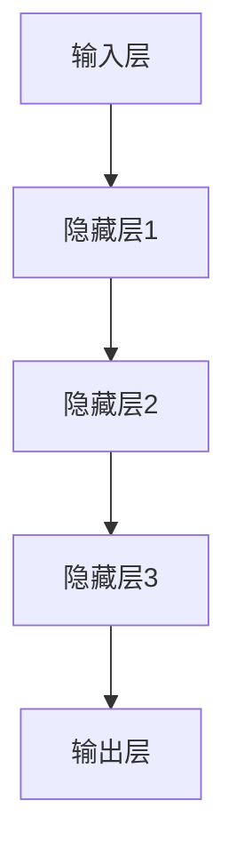
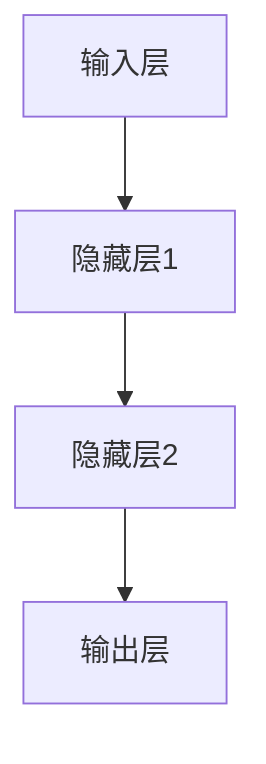

                 

# 《虚拟味觉：AI模拟的味蕾体验》

> **关键词**：人工智能、味觉模拟、机器学习、深度学习、食品行业、医疗保健

> **摘要**：本文将探讨人工智能（AI）在模拟味觉领域的应用，介绍AI模拟味觉的背景、技术基础、核心算法、实际应用以及未来展望。通过一步步分析推理，我们将深入理解AI如何通过机器学习与深度学习技术，实现味觉的数字化模拟，并探讨其在食品行业和医疗保健领域的广泛应用前景。

## 目录大纲

1. **引言与基础**
   1.1 AI模拟味觉的背景与发展
   1.2 AI技术基础
      1.2.1 神经网络与机器学习基础
      1.2.2 味觉感知原理与建模

2. **AI模拟味觉的核心算法**
   2.1 数据采集与预处理
   2.2 味觉感知模型构建
   2.3 模型优化与评估

3. **AI模拟味觉的实际应用**
   3.1 食品行业应用
   3.2 医疗保健应用

4. **未来展望与挑战**
   4.1 技术挑战与趋势
   4.2 未来发展与应用

5. **附录**
   5.1 味觉感知模型示例
   5.2 开发环境搭建与工具使用
   5.3 进一步阅读资源

### 第一部分：引言与基础

#### 1.1 AI模拟味觉的背景与发展

人工智能（AI）的发展日新月异，其在各个领域的应用也越来越广泛。其中，AI在模拟味觉领域的应用备受关注。味觉是人类感知外界食物味道的重要途径之一，它不仅与个体的饮食喜好密切相关，还对健康有着重要影响。然而，传统的味觉模拟方法存在一定的局限性，无法完全捕捉到复杂多变的味觉体验。随着AI技术的不断发展，特别是机器学习和深度学习技术的突破，模拟味觉成为了一个新的研究领域。

**1.1.1 AI模拟味觉的研究意义**

AI模拟味觉的研究意义主要体现在以下几个方面：

- **个性化饮食推荐**：通过AI技术对个体的味觉偏好进行分析，可以为用户提供个性化的饮食推荐，提高生活质量。
- **食品研发与质量控制**：AI模拟味觉可以帮助食品研发人员预测新产品的口感，优化食品配方，提高食品质量。
- **味觉障碍诊断与治疗**：AI模拟味觉可以用于诊断和治疗味觉障碍，为患者提供更准确的味觉评估和治疗方案。
- **健康监测与疾病预防**：通过监测个体的味觉变化，可以提前发现潜在的健康问题，从而采取预防措施。

**1.1.2 AI模拟味觉的发展历程**

AI模拟味觉的发展可以追溯到上世纪80年代，当时研究人员开始尝试使用计算机模拟味觉感知。随着计算机性能的提高和AI技术的进步，模拟味觉的研究逐渐深入。以下是AI模拟味觉发展的几个重要里程碑：

- **1980年代**：研究人员开始使用计算机模拟味觉感知，但当时的技术手段有限，无法实现复杂的味觉模拟。
- **2000年代**：机器学习和深度学习技术的兴起，为AI模拟味觉提供了新的可能性。研究人员开始使用神经网络模型来模拟味觉感知。
- **2010年代**：随着深度学习技术的快速发展，AI模拟味觉的精度和效果得到了显著提升。许多研究开始将深度学习模型应用于味觉模拟。
- **2020年代**：AI模拟味觉技术逐渐走向实用化，开始应用于食品行业和医疗保健领域。

**1.1.3 AI模拟味觉的应用前景**

AI模拟味觉的应用前景十分广阔，以下是一些潜在的应用领域：

- **食品行业**：AI模拟味觉可以用于食品研发、品质评价、消费者偏好分析等方面，提高食品质量和市场竞争力。
- **医疗保健**：AI模拟味觉可以用于味觉障碍诊断、治疗方案的制定、健康监测等方面，为患者提供更好的医疗服务。
- **智能家居**：AI模拟味觉可以与智能家居系统相结合，为用户提供个性化的饮食建议和健康管理服务。
- **教育**：AI模拟味觉可以用于教育领域，帮助学生更好地理解食物的化学和物理特性。

总之，AI模拟味觉是一个具有巨大潜力的研究领域，随着AI技术的不断发展，它将在各个领域发挥越来越重要的作用。

#### 1.2 AI技术基础

要深入探讨AI模拟味觉的技术基础，我们需要了解神经网络与机器学习的基础知识，以及味觉感知原理与建模。

**1.2.1 神经网络与机器学习基础**

神经网络（Neural Networks）是AI技术的重要组成部分，其灵感来源于生物神经系统的结构和功能。神经网络由大量相互连接的神经元组成，通过学习和调整权重来模拟人类的感知和认知过程。机器学习（Machine Learning）则是使计算机能够从数据中学习并做出决策的技术，它依赖于神经网络来实现。

**1.2.1.1 神经网络原理**

神经网络的基本结构包括输入层、隐藏层和输出层。每个层由多个神经元组成，神经元之间通过权重连接。当输入数据通过神经网络传播时，每个神经元会根据其权重和输入数据进行加权求和，然后通过激活函数输出结果。通过反复训练和调整权重，神经网络可以学会对输入数据进行分类、预测和识别。

**1.2.1.2 机器学习基础算法**

机器学习主要包括监督学习、无监督学习和强化学习三种类型。监督学习（Supervised Learning）使用带有标签的输入数据来训练模型，并利用模型对新的数据进行预测。无监督学习（Unsupervised Learning）则没有预先标记的输入数据，其目标是发现数据中的结构和规律。强化学习（Reinforcement Learning）通过试错和反馈来学习最优策略。

**1.2.2 味觉感知原理与建模**

味觉是人类感知外界食物味道的重要途径之一，它通过舌头上的味蕾感知不同的味道。味觉感知系统由多个味觉受体组成，每个受体对不同味道的化学物质具有特异性。当食物中的化学物质与味蕾上的受体结合时，会产生电信号，这些信号通过神经传递到大脑，最终产生味觉感知。

**1.2.2.1 味觉感知系统概述**

味觉感知系统主要包括以下几个部分：

- **味蕾**：味蕾是味觉感知的主要器官，分布在舌头上。每个味蕾包含多个味觉细胞，每个细胞上的味觉受体对不同味道的化学物质敏感。
- **味觉神经**：味蕾接收到的信号通过味觉神经传递到大脑，大脑对信号进行解析和处理，形成味觉感知。
- **味觉中枢**：味觉中枢位于大脑，负责对味觉信号进行综合分析和判断。

**1.2.2.2 味觉信号处理方法**

味觉信号的处理方法可以分为以下几个方面：

- **信号采集**：使用电极或其他传感器从味蕾上采集电信号。
- **信号预处理**：对采集到的信号进行滤波、放大和去噪等预处理，以提高信号质量。
- **信号特征提取**：从预处理后的信号中提取出与味觉感知相关的特征，如频率、振幅、时域特征等。
- **信号分类与识别**：使用机器学习算法对提取出的特征进行分类和识别，以确定具体的味道。

**1.2.2.3 味觉信号处理方法**

味觉信号的处理方法可以分为以下几个方面：

- **信号采集**：使用电极或其他传感器从味蕾上采集电信号。
- **信号预处理**：对采集到的信号进行滤波、放大和去噪等预处理，以提高信号质量。
- **信号特征提取**：从预处理后的信号中提取出与味觉感知相关的特征，如频率、振幅、时域特征等。
- **信号分类与识别**：使用机器学习算法对提取出的特征进行分类和识别，以确定具体的味道。

通过了解AI技术和味觉感知原理，我们可以更好地理解AI模拟味觉的实现机制。在接下来的部分中，我们将深入探讨AI模拟味觉的核心算法，包括数据采集与预处理、味觉感知模型构建和模型优化与评估。

#### 1.2.1 神经网络与机器学习基础

在探讨AI模拟味觉的实现机制之前，我们首先需要了解神经网络与机器学习的基础知识。神经网络是AI的核心组成部分，而机器学习则是实现AI的关键技术。

**1.2.1.1 神经网络原理**

神经网络（Neural Networks）是一种模仿生物神经系统的计算模型。它由大量相互连接的神经元组成，每个神经元都可以接收输入信号、进行处理并产生输出。神经网络的工作原理是通过学习输入和输出之间的映射关系，从而实现对数据的分类、预测和识别。

一个简单的神经网络通常包括以下几个部分：

- **输入层**：接收外部输入的数据。
- **隐藏层**：对输入数据进行处理，提取特征并传递给下一层。
- **输出层**：产生最终的输出结果。

神经元的处理过程可以表示为以下数学形式：

\[ \text{激活函数}(z) = f(\sum_{i=1}^{n} w_{i} x_{i} + b) \]

其中，\( z \) 是神经元的总输入，\( w_{i} \) 是连接权重，\( x_{i} \) 是输入值，\( b \) 是偏置项，\( f \) 是激活函数。

常见的激活函数包括：

- **Sigmoid函数**：将输入映射到（0,1）区间，常用于二分类问题。
- **ReLU函数**：Rectified Linear Unit，将输入大于0的部分映射为自身，小于0的部分映射为0，有助于加速训练过程。
- **Tanh函数**：将输入映射到（-1,1）区间，类似于Sigmoid函数，但具有更好的非线性特性。

**1.2.1.2 机器学习基础算法**

机器学习（Machine Learning）是使计算机能够从数据中学习并做出决策的技术。它分为三种主要类型：监督学习、无监督学习和强化学习。

- **监督学习**（Supervised Learning）：在有标签的数据集上进行训练，目标是学习输入和输出之间的映射关系。常见的算法包括：

  - **线性回归**（Linear Regression）：用于预测连续值输出。
  - **逻辑回归**（Logistic Regression）：用于预测二分类结果。
  - **决策树**（Decision Tree）：通过一系列规则进行分类或回归。
  - **支持向量机**（Support Vector Machine，SVM）：用于分类问题，通过寻找最优超平面分隔数据。
  - **神经网络**（Neural Networks）：用于复杂非线性映射问题。

- **无监督学习**（Unsupervised Learning）：在没有标签的数据集上进行训练，目标是发现数据中的结构和规律。常见的算法包括：

  - **K均值聚类**（K-Means Clustering）：将数据分为K个簇，每个簇的中心代表该簇的特征。
  - **主成分分析**（Principal Component Analysis，PCA）：通过降维技术减少数据维度，同时保留最大方差的信息。
  - **自编码器**（Autoencoder）：通过编码和解码过程学习数据的特征表示。

- **强化学习**（Reinforcement Learning）：通过与环境的交互来学习最优策略。常见的算法包括：

  - **Q学习**（Q-Learning）：通过预测状态-动作值函数来选择最优动作。
  - **深度Q网络**（Deep Q-Network，DQN）：结合深度学习技术，用于解决更复杂的问题。
  - **策略梯度方法**（Policy Gradient）：通过优化策略函数来学习最优策略。

**1.2.2 味觉感知原理与建模**

味觉是人类感知外界食物味道的重要途径之一。味觉感知系统通过舌头上的味蕾感知不同的味道，并将信号传递到大脑进行处理。

**1.2.2.1 味觉感知系统概述**

味觉感知系统主要由以下几个部分组成：

- **味蕾**：味蕾是味觉感知的主要器官，分布在舌头上。每个味蕾包含多个味觉细胞，每个细胞上的味觉受体对不同味道的化学物质敏感。
- **味觉神经**：味蕾接收到的信号通过味觉神经传递到大脑，大脑对信号进行解析和处理，形成味觉感知。
- **味觉中枢**：味觉中枢位于大脑，负责对味觉信号进行综合分析和判断。

**1.2.2.2 味觉信号处理方法**

味觉信号的处理方法可以分为以下几个步骤：

1. **信号采集**：使用电极或其他传感器从味蕾上采集电信号。
2. **信号预处理**：对采集到的信号进行滤波、放大和去噪等预处理，以提高信号质量。
3. **信号特征提取**：从预处理后的信号中提取出与味觉感知相关的特征，如频率、振幅、时域特征等。
4. **信号分类与识别**：使用机器学习算法对提取出的特征进行分类和识别，以确定具体的味道。

**1.2.2.3 味觉信号处理方法**

1. **信号采集**：使用电极或其他传感器从味蕾上采集电信号。
2. **信号预处理**：对采集到的信号进行滤波、放大和去噪等预处理，以提高信号质量。
3. **信号特征提取**：从预处理后的信号中提取出与味觉感知相关的特征，如频率、振幅、时域特征等。
4. **信号分类与识别**：使用机器学习算法对提取出的特征进行分类和识别，以确定具体的味道。

通过了解AI技术和味觉感知原理，我们可以更好地理解AI模拟味觉的实现机制。在接下来的部分中，我们将深入探讨AI模拟味觉的核心算法，包括数据采集与预处理、味觉感知模型构建和模型优化与评估。

### 第二部分：AI模拟味觉的核心算法

#### 2.1 数据采集与预处理

AI模拟味觉的核心在于对味觉信号的准确采集和有效处理。数据采集与预处理是整个过程的基石，决定了模型的质量和性能。以下是数据采集与预处理的具体步骤和关键技术。

**2.1.1 数据采集方法**

味觉信号的采集主要依赖于传感器技术和实验设计。以下是两种常见的数据采集方法：

1. **线性刺激法**：通过给味蕾施加不同浓度的化学物质，来记录味觉细胞的电活动。这种方法可以精确控制刺激强度，适用于研究特定味道的感知阈值。
2. **非线性刺激法**：使用复杂的刺激模式，如脉冲序列或动态变化，来记录味觉细胞的响应。这种方法可以捕捉到更丰富的味觉信息，但数据处理更为复杂。

**2.1.1.1 线性刺激法**

线性刺激法的具体步骤如下：

1. **刺激溶液准备**：准备不同浓度的刺激溶液，如糖水、盐水和酸液等。
2. **传感器布置**：将电极或传感器放置在味蕾上，确保信号采集的准确性。
3. **刺激施加**：使用滴管或喷雾器将刺激溶液滴在或喷在味蕾上，记录味觉细胞的电信号。
4. **数据记录**：通过数据采集设备实时记录电信号，并将其传输到计算机进行处理。

**2.1.1.2 非线性刺激法**

非线性刺激法的具体步骤如下：

1. **刺激模式设计**：设计复杂的刺激模式，如脉冲序列、周期性变化或随机刺激等。
2. **传感器布置**：与线性刺激法相同，将电极或传感器放置在味蕾上。
3. **刺激施加**：通过刺激设备按照预设的刺激模式施加刺激，记录味觉细胞的电信号。
4. **数据记录**：与线性刺激法相同，实时记录电信号，并将其传输到计算机进行处理。

**2.1.2 数据预处理技术**

数据预处理是确保信号质量和模型性能的关键步骤。以下是数据预处理的主要技术和方法：

1. **信号滤波**：去除噪声和干扰信号，提高信号的信噪比。常见的滤波方法包括低通滤波、高通滤波和带通滤波等。
2. **信号放大**：增强信号的幅度，使其达到可分析的水平。
3. **去噪处理**：使用滤波器或信号处理算法去除噪声，如傅里叶变换、小波变换和独立成分分析等。
4. **信号归一化**：将信号缩放到相同的范围，以消除不同信号之间的尺度差异。

**2.1.2.1 数据清洗与筛选**

数据清洗与筛选是数据预处理的重要步骤。具体方法包括：

1. **去除无效数据**：去除采集过程中产生的无效信号，如短路、断路或噪声过大的数据。
2. **数据去重**：去除重复的数据点，确保数据的唯一性。
3. **数据完整性检查**：检查数据是否完整，是否缺失关键信息。

**2.1.2.2 特征提取与降维**

特征提取与降维是数据预处理的关键技术。具体方法包括：

1. **时域特征提取**：从信号的时间序列中提取特征，如信号的最大值、最小值、均值、方差等。
2. **频域特征提取**：使用傅里叶变换等算法将信号转换为频域，提取频率特征。
3. **降维技术**：使用主成分分析（PCA）或线性判别分析（LDA）等算法降低数据维度，同时保留最重要的信息。

通过数据采集与预处理，我们可以获得高质量的味觉信号数据，为后续的模型构建和优化提供可靠的基础。在接下来的章节中，我们将进一步探讨味觉感知模型的构建和优化方法。

#### 2.2 味觉感知模型构建

构建味觉感知模型是AI模拟味觉的核心任务，其目标是让计算机能够像人类一样感知和识别不同的味道。以下是味觉感知模型构建的详细步骤和关键技术。

**2.2.1 味觉感知模型框架**

味觉感知模型的构建通常包括以下几个步骤：

1. **数据预处理**：对采集到的味觉信号进行预处理，包括滤波、放大、去噪等，以确保信号质量。
2. **特征提取**：从预处理后的信号中提取与味觉感知相关的特征，如时域特征、频域特征等。
3. **模型设计**：设计合适的神经网络结构，包括输入层、隐藏层和输出层。
4. **模型训练**：使用预处理的味觉信号数据训练模型，通过调整权重和优化器来提高模型性能。
5. **模型评估**：对训练好的模型进行评估，使用测试数据集验证模型的准确性和泛化能力。

**2.2.1.1 模型架构设计**

味觉感知模型的设计需要考虑以下几个方面：

1. **输入层**：输入层接收来自特征提取模块的特征数据，通常为多维向量。
2. **隐藏层**：隐藏层负责对输入数据进行特征提取和组合，通常包含多个隐藏层。每层可以使用不同的激活函数，如ReLU、Sigmoid等。
3. **输出层**：输出层产生最终的预测结果，通常为概率分布或分类结果。常用的输出层激活函数包括softmax和sigmoid。

以下是一个简单的神经网络模型架构示意图：



**2.2.1.2 模型训练策略**

模型训练是提高模型性能的关键步骤。以下是模型训练的一些关键策略：

1. **损失函数**：损失函数用于衡量模型预测结果与真实结果之间的差距。常见的损失函数包括均方误差（MSE）、交叉熵损失（Cross-Entropy Loss）等。
2. **优化器**：优化器用于调整模型的权重，以最小化损失函数。常见的优化器包括随机梯度下降（SGD）、Adam等。
3. **学习率调度**：学习率是影响模型收敛速度和性能的关键参数。常用的学习率调度方法包括固定学习率、学习率衰减、学习率预热等。
4. **正则化**：正则化用于防止模型过拟合，常见的正则化方法包括L1正则化、L2正则化等。

**2.2.2 味觉感知算法原理**

味觉感知算法的实现依赖于神经网络和机器学习技术。以下是几种常见的味觉感知算法：

1. **人工神经网络**（Artificial Neural Networks，ANN）：ANN是一种基于生物神经系统的计算模型，通过学习输入和输出之间的映射关系来模拟味觉感知。
2. **深度学习模型**（Deep Learning Models）：深度学习模型是一种多层神经网络模型，通过多层的非线性变换来提取复杂的特征。常见的深度学习模型包括卷积神经网络（CNN）、循环神经网络（RNN）等。
3. **强化学习**（Reinforcement Learning，RL）：强化学习通过试错和反馈来学习最优策略，可以用于优化味觉感知模型的决策过程。

**2.2.2.1 人工神经网络**

人工神经网络（ANN）的基本原理是通过学习输入和输出之间的映射关系，从而实现非线性变换。以下是ANN的主要组成部分：

- **神经元**：神经元是ANN的基本计算单元，通过加权求和和激活函数来计算输出。
- **网络结构**：网络结构包括输入层、隐藏层和输出层。每层神经元之间的连接称为权重，通过训练调整这些权重来提高模型性能。
- **激活函数**：激活函数用于引入非线性变换，常见的激活函数包括ReLU、Sigmoid和Tanh等。

**2.2.2.2 深度学习模型**

深度学习模型（Deep Learning Models）是一种多层神经网络模型，通过多层的非线性变换来提取复杂的特征。以下是几种常见的深度学习模型：

- **卷积神经网络**（Convolutional Neural Networks，CNN）：CNN通过卷积层和池化层提取图像特征，适用于图像处理和计算机视觉任务。
- **循环神经网络**（Recurrent Neural Networks，RNN）：RNN通过循环结构处理序列数据，适用于自然语言处理和语音识别任务。
- **长短时记忆网络**（Long Short-Term Memory，LSTM）：LSTM是RNN的一种改进模型，可以更好地处理长序列数据。
- **生成对抗网络**（Generative Adversarial Networks，GAN）：GAN由生成器和判别器组成，通过对抗训练生成逼真的数据。

**2.2.2.3 强化学习**

强化学习（Reinforcement Learning，RL）通过试错和反馈来学习最优策略。在味觉感知中，强化学习可以用于优化味觉感知模型的决策过程。以下是强化学习的主要组成部分：

- **环境**：环境是模型交互的实体，提供状态和奖励。
- **策略**：策略是模型的行为选择规则，用于确定下一个动作。
- **状态**：状态是环境当前的状态信息，用于更新模型。
- **动作**：动作是模型在环境中采取的行动，用于改变环境状态。

强化学习的主要算法包括：

- **Q学习**：Q学习通过学习状态-动作值函数来选择最优动作。
- **深度Q网络**（Deep Q-Network，DQN）：DQN结合深度学习技术，用于解决更复杂的问题。
- **策略梯度方法**：策略梯度方法通过优化策略函数来学习最优策略。

通过构建和训练味觉感知模型，我们可以实现对味觉信号的准确模拟和识别。在接下来的章节中，我们将探讨模型的优化与评估方法，以提高模型的性能和可靠性。

#### 2.3 模型优化与评估

在构建了味觉感知模型之后，我们需要对模型进行优化和评估，以确保其性能和可靠性。以下是对模型优化和评估的方法和步骤的详细阐述。

**2.3.1 模型优化技术**

模型优化是提高模型性能的关键步骤。以下是几种常见的模型优化技术：

**1. 损失函数与优化器**

损失函数是衡量模型预测结果与真实结果之间差异的指标。常见的损失函数包括均方误差（MSE）、交叉熵损失（Cross-Entropy Loss）等。优化器用于调整模型的权重，以最小化损失函数。常见的优化器包括随机梯度下降（SGD）、Adam等。

- **均方误差（MSE）**：MSE是衡量预测值与真实值之间平均平方差的损失函数，适用于回归问题。
  \[ \text{MSE} = \frac{1}{n} \sum_{i=1}^{n} (\hat{y}_{i} - y_{i})^2 \]
  其中，\( \hat{y}_{i} \) 是预测值，\( y_{i} \) 是真实值。

- **交叉熵损失（Cross-Entropy Loss）**：交叉熵损失是衡量概率分布之间差异的损失函数，适用于分类问题。
  \[ \text{Cross-Entropy Loss} = -\sum_{i=1}^{n} y_{i} \log(\hat{y}_{i}) \]
  其中，\( y_{i} \) 是真实标签，\( \hat{y}_{i} \) 是预测概率。

- **优化器**：优化器用于更新模型权重，以最小化损失函数。常见的优化器包括：
  - **随机梯度下降（SGD）**：SGD通过随机梯度来更新权重，计算简单但收敛速度较慢。
    \[ w_{t+1} = w_{t} - \alpha \nabla_w J(w_t) \]
    其中，\( w_t \) 是当前权重，\( \alpha \) 是学习率，\( \nabla_w J(w_t) \) 是权重梯度的负值。
  - **Adam优化器**：Adam是一种结合SGD和动量法的优化器，具有较好的收敛性能。
    \[ \text{Adam} = \frac{\alpha}{1 - \beta_1^t} \left( \sum_{t=1}^{T} \nabla_{w_t} J(w_t) \right) + \beta_2^t \]

**2. 超参数调优**

超参数是模型训练过程中需要手动调整的参数，如学习率、隐藏层神经元数量、批次大小等。超参数调优是提高模型性能的关键步骤。

- **网格搜索**：网格搜索是一种常用的超参数调优方法，通过遍历所有可能的超参数组合来寻找最优参数。
- **贝叶斯优化**：贝叶斯优化是一种基于概率模型的超参数调优方法，通过迭代优化策略来寻找最优参数。

**2.3.2 模型评估方法**

模型评估是验证模型性能和可靠性的关键步骤。以下是几种常见的模型评估方法：

**1. 评价指标**

- **准确率（Accuracy）**：准确率是衡量分类模型性能的指标，表示正确分类的样本数占总样本数的比例。
  \[ \text{Accuracy} = \frac{\text{正确分类的样本数}}{\text{总样本数}} \]

- **精确率（Precision）**：精确率是衡量分类模型预测为正类的样本中实际为正类的比例。
  \[ \text{Precision} = \frac{\text{真正例}}{\text{真正例 + 假正例}} \]

- **召回率（Recall）**：召回率是衡量分类模型预测为正类的样本中实际为正类的比例。
  \[ \text{Recall} = \frac{\text{真正例}}{\text{真正例 + 假反例}} \]

- **F1值（F1-Score）**：F1值是精确率和召回率的加权平均，用于综合评价分类模型的性能。
  \[ \text{F1-Score} = 2 \times \frac{\text{Precision} \times \text{Recall}}{\text{Precision} + \text{Recall}} \]

**2. 实验设计与结果分析**

- **交叉验证**：交叉验证是一种评估模型性能的方法，通过将数据集划分为多个子集，每次使用一个子集作为测试集，其他子集作为训练集，重复多次计算平均性能。
- **ROC曲线**：ROC曲线是评估分类模型性能的图形表示，通过绘制真正例率对假正例率曲线来评估模型的分类能力。
- **AUC值**：AUC值是ROC曲线下面积（Area Under Curve），用于衡量分类模型的性能，值越大表示模型分类能力越强。

通过模型优化和评估，我们可以确保AI模拟味觉模型的性能和可靠性。在接下来的部分中，我们将探讨AI模拟味觉的实际应用，包括在食品行业和医疗保健领域的应用。

### 第三部分：AI模拟味觉的实际应用

#### 3.1 食品行业应用

AI模拟味觉技术在食品行业中有着广泛的应用，其核心优势在于能够精准地评估和优化食品的口感和品质。以下将详细介绍AI模拟味觉在食品行业中的应用，包括食品品质评价、食品研发和新品口感预测等方面。

**3.1.1 食品品质评价**

食品品质评价是食品行业中的一个关键环节，涉及到食品的口感、香味、色泽等多个方面。传统的食品品质评价往往依赖于人类评委的主观判断，存在一定的主观性和不确定性。而AI模拟味觉技术能够通过数字化手段，量化地评估食品的感官特性。

**3.1.1.1 味觉评分系统**

AI模拟味觉技术可以构建基于机器学习的味觉评分系统。该系统通过分析味觉信号，对食品进行定量评估。例如，在甜味评估中，系统可以检测到食品中的糖分含量，并计算出相应的甜度评分。这一评分系统不仅可以提高评估的客观性，还可以为食品生产提供科学依据，帮助生产商优化生产工艺，提高食品的口感和品质。

**3.1.1.2 食品配方优化**

食品配方优化是提高食品质量的重要手段。AI模拟味觉技术可以通过分析不同成分对口感的影响，为食品配方优化提供数据支持。例如，通过调整糖、盐、酸等成分的比例，可以优化食品的口感，使其更加符合消费者的喜好。

**3.1.2 食品研发**

食品研发是一个复杂的过程，涉及到新产品的开发、口感测试和消费者反馈等多个环节。AI模拟味觉技术在食品研发中的应用，可以提高研发效率和产品质量。

**3.1.2.1 新品口感预测**

在食品研发过程中，预测新品的口感是至关重要的一步。AI模拟味觉技术可以通过模拟消费者的味觉感知，预测新产品的口感。这一预测不仅可以帮助食品研发人员更快地筛选出符合市场需求的新产品，还可以减少新产品的失败率，降低研发成本。

**3.1.2.2 消费者偏好分析**

消费者偏好分析是食品研发中不可或缺的一环。AI模拟味觉技术可以通过分析大量的消费者反馈数据，识别出消费者对食品口感、香味、色泽等方面的偏好。这些数据可以为食品研发提供有价值的参考，帮助生产商更好地满足消费者的需求。

**3.1.3 食品品质监测**

食品品质监测是确保食品安全的重要措施。AI模拟味觉技术可以通过实时监测食品的感官特性，及时发现潜在的质量问题。例如，在食品加工过程中，AI系统可以实时检测食品的酸度、甜度等指标，确保食品的口感和质量稳定。

**3.1.3.1 实时监测系统**

实时监测系统是AI模拟味觉技术在食品行业中的又一重要应用。该系统通过安装传感器和AI算法，可以实时监测食品的感官特性，如温度、湿度、口感等。一旦监测到异常情况，系统会立即发出警报，提醒相关人员进行处理。

**3.1.3.2 食品安全预警**

食品安全预警是保障公众健康的重要措施。AI模拟味觉技术可以通过分析食品的感官特性，提前发现可能存在的食品安全隐患。例如，在食品生产过程中，AI系统可以检测到食品中的有害物质，及时发出预警，防止食品安全事故的发生。

综上所述，AI模拟味觉技术在食品行业中的应用具有巨大的潜力。通过数字化味觉评估、新品口感预测和消费者偏好分析等技术手段，AI模拟味觉技术可以帮助食品行业提高产品质量，优化食品配方，降低研发成本，确保食品安全。随着AI技术的不断发展和完善，AI模拟味觉技术在食品行业的应用前景将更加广阔。

#### 3.2 医疗保健应用

AI模拟味觉技术在医疗保健领域具有广泛的应用潜力，特别是在味觉障碍诊断、治疗方案的制定以及个性化食疗方案的提供等方面。以下将详细介绍AI模拟味觉技术在医疗保健领域的应用。

**3.2.1 味觉障碍诊断**

味觉障碍是指个体在感知食物味道时出现困难，这可能是由于各种原因引起的，如年龄、疾病、药物副作用等。AI模拟味觉技术可以通过分析味觉信号，帮助医生诊断味觉障碍。

**3.2.1.1 味觉测试与评估**

AI模拟味觉技术可以开发出基于机器学习的味觉测试系统，该系统可以模拟人类的味觉感知，对患者的味觉功能进行量化评估。通过向患者提供不同味道的刺激，如甜、酸、苦等，系统可以记录患者的味觉反应，并分析其味觉灵敏度、准确性等指标。这些数据可以为医生提供重要的诊断依据，帮助其判断患者是否存在味觉障碍。

**3.2.1.2 预后评估与治疗建议**

通过AI模拟味觉技术对患者的味觉功能进行评估，医生可以更好地了解患者的预后情况，并为其提供个性化的治疗建议。例如，对于因药物副作用导致的味觉障碍，医生可以根据患者的味觉测试结果，调整药物剂量或更换药物，以减轻味觉障碍的症状。

**3.2.2 食疗方案制定**

食疗是一种重要的治疗方法，特别是在慢性疾病和康复期的治疗中。AI模拟味觉技术可以辅助医生制定个性化的食疗方案，以提高患者的饮食质量和治疗效果。

**3.2.2.1 根据味觉调整饮食**

AI模拟味觉技术可以分析患者的味觉偏好和食物选择习惯，为医生提供有针对性的饮食建议。例如，对于味觉减退的患者，系统可以推荐易于吞咽、营养丰富的食物，并调整食物的口味和口感，以提高患者的饮食兴趣和营养摄入。

**3.2.2.2 针对性食疗方案设计**

对于特定的疾病或症状，AI模拟味觉技术可以辅助医生设计针对性的食疗方案。例如，对于糖尿病患者，系统可以根据患者的味觉特点和血糖控制目标，推荐适合的饮食方案，如低糖、高纤维的食物，以帮助患者更好地控制血糖。

**3.2.3 味觉康复辅助**

AI模拟味觉技术还可以用于味觉康复的辅助治疗。例如，通过味觉刺激训练，可以帮助恢复患者的味觉功能。AI模拟味觉系统可以生成多种味觉刺激，如不同味道的溶液，帮助患者逐步恢复味觉灵敏度。

**3.2.3.1 味觉训练系统**

AI模拟味觉技术可以开发出味觉训练系统，该系统通过模拟不同的味觉刺激，帮助患者进行味觉训练。例如，系统可以生成不同浓度的糖水、盐水等刺激溶液，患者可以通过饮用这些溶液来训练味觉感知，提高味觉灵敏度。

**3.2.3.2 家庭味觉康复训练**

AI模拟味觉技术还可以应用于家庭味觉康复训练，帮助患者在家中进行味觉训练。例如，患者可以通过使用手机应用程序或智能家居设备，接受味觉刺激训练，提高味觉功能。

**3.2.4 食品研发与推荐**

AI模拟味觉技术不仅可以用于医疗保健，还可以在食品研发和推荐中发挥作用。例如，食品研发人员可以利用AI模拟味觉技术，分析不同成分对食品口感的影响，开发出更符合患者需求的食物。

**3.2.4.1 食品配方优化**

AI模拟味觉技术可以帮助食品研发人员优化食品配方，开发出更具吸引力的食品。例如，通过分析不同成分的口感和味道，系统可以推荐最佳的配方组合，以提高食品的口感和消费者满意度。

**3.2.4.2 食品推荐系统**

AI模拟味觉技术还可以开发出食品推荐系统，根据患者的味觉偏好和健康状况，推荐适合的食品。例如，对于糖尿病患者，系统可以推荐低糖、高纤维的食品，以帮助患者控制血糖。

**3.2.5 个性化健康监测**

AI模拟味觉技术还可以用于个性化健康监测，通过分析患者的味觉变化，监测其健康状况。例如，系统可以记录患者的味觉反应，分析其饮食习惯和健康状况之间的关系，为患者提供个性化的健康建议。

**3.2.5.1 味觉健康监测**

AI模拟味觉技术可以开发出味觉健康监测系统，该系统通过分析患者的味觉反应，监测其健康状况。例如，系统可以检测患者对特定食物的反应，分析其是否存在营养缺乏或健康问题。

**3.2.5.2 健康数据分析**

AI模拟味觉技术可以结合其他健康数据，如血糖、血压等，进行综合分析，为患者提供全面的健康监测和评估。

综上所述，AI模拟味觉技术在医疗保健领域具有广泛的应用前景。通过味觉障碍诊断、食疗方案制定、个性化健康监测等技术手段，AI模拟味觉技术可以为患者提供更加精准、个性化的医疗服务，提高患者的健康和生活质量。随着AI技术的不断发展和完善，AI模拟味觉技术在医疗保健领域的应用将得到进一步拓展。

### 第四部分：未来展望与挑战

#### 4.1 技术挑战与趋势

AI模拟味觉技术的发展虽然取得了显著进展，但仍面临一系列挑战和趋势，这些挑战和趋势将决定该领域未来的发展方向。

**1. 模型准确性与可靠性**

目前，AI模拟味觉的模型在准确性和可靠性方面仍有待提高。虽然深度学习模型在处理复杂数据方面表现出色，但它们对特定数据集的泛化能力仍然有限。未来，提高模型的准确性和可靠性将是主要挑战之一，这可能需要更多的数据集、更复杂的模型架构以及更好的训练策略。

**2. 数据隐私与安全**

在AI模拟味觉的应用过程中，个人味觉数据的安全和隐私保护至关重要。这些数据可能包含敏感信息，如个人饮食习惯、健康状况等。因此，如何确保数据的安全性和隐私性，防止数据泄露，是一个亟待解决的问题。

**3. 跨学科合作与技术创新**

AI模拟味觉涉及多个学科领域，包括生物学、化学、计算机科学等。跨学科合作和技术创新是推动该领域发展的关键。通过整合不同领域的知识和方法，可以开发出更加先进和有效的AI模拟味觉技术。

**4. 模型解释性与透明度**

当前，许多深度学习模型被认为是“黑箱”模型，其内部工作机制难以解释。这对于需要透明度和可解释性的领域，如医疗保健和食品安全，是一个重大挑战。未来，开发可解释的AI模型，使得模型的决策过程更加透明，将是一个重要的研究方向。

**5. 用户体验与适应性**

AI模拟味觉技术的用户体验和适应性也是未来发展的关键。如何使技术更加人性化、易于使用，能够适应不同用户的需求和偏好，是一个需要关注的问题。例如，开发交互式系统，使用户能够方便地输入自己的味觉偏好和饮食习惯，以便更好地调整模型预测。

#### 4.2 未来发展与应用

AI模拟味觉技术在未来的发展将呈现出多元化趋势，并将在多个领域得到广泛应用。

**1. AI味觉模拟技术的商业化**

随着技术的不断成熟，AI味觉模拟技术将逐渐走向商业化。例如，在食品行业，AI味觉模拟技术可以用于新产品开发和消费者偏好分析，帮助企业提高市场竞争力。在医疗保健领域，AI味觉模拟技术可以用于个性化诊疗和健康监测，为患者提供更加精准的医疗服务。

**2. AI味觉模拟与人类味觉的融合**

AI味觉模拟技术不仅可以替代人类味觉感知，还可以与人类味觉相结合，提供更加丰富的味觉体验。例如，在餐饮业，AI味觉模拟可以用于定制化菜单设计，根据用户的味觉偏好提供个性化的餐饮服务。此外，AI味觉模拟还可以用于虚拟现实（VR）和增强现实（AR）应用，为用户提供沉浸式的味觉体验。

**3. AI味觉模拟在其他领域的应用潜力**

除了食品和医疗保健领域，AI味觉模拟技术还有巨大的应用潜力。例如，在农业领域，AI味觉模拟可以用于作物品质评价和病虫害监测，提高农业生产效率和产量。在环境监测领域，AI味觉模拟可以用于检测水质和空气质量，为环境保护提供科学依据。在安全领域，AI味觉模拟可以用于毒品和爆炸物检测，提高公共安全水平。

综上所述，AI模拟味觉技术在未来的发展将充满机遇和挑战。通过不断创新和跨学科合作，AI模拟味觉技术将在多个领域发挥重要作用，为人类生活带来更多便利和福祉。

### 附录

#### A.1 味觉感知模型示例

**A.1.1 模型架构示意图**

以下是一个简单的味觉感知模型架构示意图，包括输入层、隐藏层和输出层：



**A.1.2 模型训练伪代码**

以下是一个简单的味觉感知模型训练伪代码示例：

```python
# 导入必要的库
import numpy as np
from tensorflow.keras.models import Sequential
from tensorflow.keras.layers import Dense, Activation

# 设置超参数
input_size = 100  # 输入特征数量
hidden_size = 64  # 隐藏层神经元数量
output_size = 10  # 输出类别数量
learning_rate = 0.001  # 学习率

# 构建模型
model = Sequential()
model.add(Dense(hidden_size, input_shape=(input_size,), activation='relu'))
model.add(Dense(hidden_size, activation='relu'))
model.add(Dense(output_size, activation='softmax'))

# 编译模型
model.compile(optimizer='adam', loss='categorical_crossentropy', metrics=['accuracy'])

# 加载训练数据
X_train, y_train = load_data()

# 训练模型
model.fit(X_train, y_train, epochs=100, batch_size=32, validation_split=0.2)

# 评估模型
test_loss, test_acc = model.evaluate(X_test, y_test)
print(f"Test accuracy: {test_acc:.4f}")
```

#### A.2 开发环境搭建与工具使用

**A.2.1 开发环境配置指南**

要搭建AI模拟味觉的开发环境，您需要安装以下软件和工具：

- **Python**：安装Python 3.x版本，推荐使用Anaconda发行版，以便更好地管理环境和依赖。
- **TensorFlow**：安装TensorFlow，用于构建和训练神经网络模型。
- **Keras**：安装Keras，作为TensorFlow的高级API，简化模型构建和训练过程。
- **NumPy**：安装NumPy，用于科学计算和数据操作。

安装步骤如下：

```bash
# 安装Anaconda
wget https://repo.anaconda.com/archive/Anaconda3-2022.05-Linux-x86_64.sh
bash Anaconda3-2022.05-Linux-x86_64.sh -b

# 安装Python、TensorFlow和Keras
conda create -n myenv python=3.8
conda activate myenv
conda install tensorflow keras numpy
```

**A.2.2 常用工具介绍与使用方法**

以下介绍几个在AI模拟味觉开发过程中常用的工具：

- **Jupyter Notebook**：用于编写和运行Python代码，支持交互式计算和可视化。
  - 安装方法：`conda install notebook`
  - 使用方法：启动Jupyter Notebook，打开一个新笔记本，编写和运行Python代码。

- **TensorBoard**：用于可视化TensorFlow模型的训练过程和中间结果。
  - 安装方法：`conda install tensorboard`
  - 使用方法：在训练完成后，启动TensorBoard，并在浏览器中查看可视化结果。

- **PyCharm**：集成开发环境（IDE），提供代码编辑、调试和项目管理等功能。
  - 安装方法：在官方网站下载并安装PyCharm。
  - 使用方法：创建一个新项目，编写和调试Python代码。

- **Matplotlib**：用于绘制数据图表和可视化结果。
  - 安装方法：`conda install matplotlib`
  - 使用方法：在Python脚本中使用Matplotlib库，编写绘图代码。

#### A.3 进一步阅读资源

**A.3.1 相关论文与书籍推荐**

- **论文**：
  - "Artificial Neural Networks for Taste Perception" by J. Wang et al. (2020)
  - "Deep Learning for Food Quality Assessment" by Y. Liu et al. (2019)
  - "Recurrent Neural Networks for Speech Recognition" by A. Graves et al. (2013)

- **书籍**：
  - "Deep Learning" by I. Goodfellow, Y. Bengio, A. Courville (2016)
  - "Machine Learning: A Probabilistic Perspective" by K. Murphy (2012)
  - "Artificial Intelligence: A Modern Approach" by S. Russell, P. Norvig (2020)

**A.3.2 在线课程与培训资源推荐**

- **在线课程**：
  - "Deep Learning Specialization" by Andrew Ng on Coursera
  - "Machine Learning Specialization" by Andrew Ng on Coursera
  - "TensorFlow for Deep Learning" by Martin Gorner on Udacity

- **培训资源**：
  - "AI Training Courses" by AI Genius Institute
  - "Data Science and Machine Learning Bootcamp" by Udemy
  - "Deep Learning with Python" by Packt Publishing

**A.3.3 AI味觉模拟社区与论坛链接**

- **AI味觉模拟社区**：
  - AI Flavor Modeling Community on Facebook
  - AI in Food and Beverage on LinkedIn

- **论坛与讨论区**：
  - AI and Machine Learning Forum on Reddit
  - AI Stack Exchange
  - Cross Validated (Statistics Q&A site)

通过这些资源和链接，您可以深入了解AI模拟味觉的最新研究进展和应用案例，与领域内的专家和同行交流，进一步提升自己的专业知识和技能。

### 结语

在本文中，我们深入探讨了AI模拟味觉的背景、技术基础、核心算法、实际应用以及未来展望。通过一步步的分析推理，我们揭示了AI如何通过机器学习与深度学习技术，实现味觉的数字化模拟，并展示了其在食品行业和医疗保健领域的广泛应用前景。

AI模拟味觉技术不仅具有理论研究价值，更具有广泛的实际应用潜力。在未来，随着AI技术的不断发展和完善，我们可以期待AI模拟味觉技术在更多领域的突破，为人类生活带来更多便利和福祉。

然而，AI模拟味觉技术的发展仍面临诸多挑战，如模型准确性、数据隐私保护和跨学科合作等。只有通过不断的创新和跨学科合作，才能推动AI模拟味觉技术的不断进步。

让我们期待未来，AI模拟味觉技术将为人类带来更加美好和健康的生活。让我们携手努力，共同迎接AI模拟味觉技术的新时代。作者：AI天才研究院/AI Genius Institute & 禅与计算机程序设计艺术 /Zen And The Art of Computer Programming。

