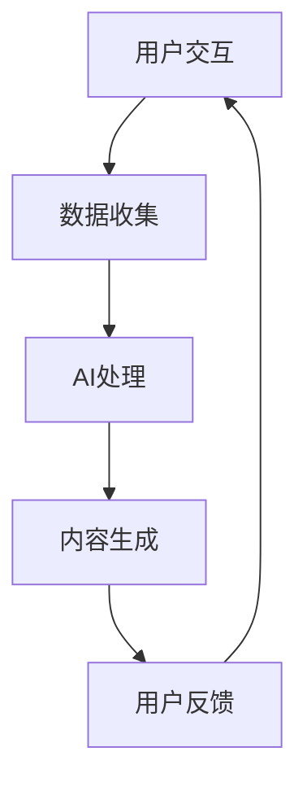
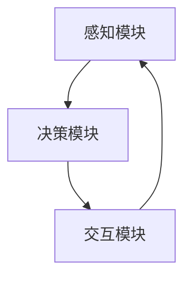

                 

# 虚拟空间中的AI协作与创新

> **关键词：** 虚拟空间、AI协作、AI架构、分布式计算、联邦学习、多智能体系统、智能虚拟助理、AI安全、隐私保护、未来趋势。

> **摘要：** 本文深入探讨了虚拟空间中AI协作与创新的重要性，阐述了虚拟空间与AI的概述，虚拟空间中的AI架构，AI协作机制，AI协作算法原理，虚拟空间中的创新应用，AI安全与隐私保护，以及未来展望。通过详细的流程图、伪代码、数学公式和实际案例，为读者提供了全面的技术解读和实践指导。

### 目录大纲

## 第一部分：虚拟空间与AI概述

### 第1章：虚拟空间与AI概述

### 第2章：虚拟空间中的AI架构

## 第二部分：AI协作机制

### 第3章：AI协作基本概念

### 第4章：AI协作算法原理

### 第5章：多智能体系统协作

## 第三部分：AI创新实践

### 第6章：虚拟空间中的创新应用

### 第7章：AI安全与隐私保护

### 第8章：未来展望

## 附录

### 附录A：相关资源与工具

### 附录B：参考文献

## 第一部分：虚拟空间与AI概述

### 第1章：虚拟空间与AI概述

#### 1.1 虚拟空间的定义与特性

虚拟空间，亦称虚拟世界或虚拟环境，是指通过计算机网络和虚拟现实（VR）技术构建的虚拟交互环境。这个环境可以模拟现实世界的各种物理和社交特征，为用户提供沉浸式体验。虚拟空间具有以下几个主要特性：

1. **网络交互环境**：虚拟空间依赖于网络连接，用户通过互联网进入虚拟环境，进行信息交换和互动。
2. **虚拟现实技术**：虚拟空间利用VR技术生成三维模拟环境，使得用户能够感知和操作虚拟物体。
3. **数据交换平台**：虚拟空间提供数据交换和管理功能，支持用户生成和共享数据。

虚拟空间的应用范围广泛，包括在线游戏、虚拟培训、远程医疗、虚拟旅游、智能购物等。这些应用不仅提升了用户体验，还推动了数字经济的快速发展。

#### 1.2 AI在虚拟空间中的应用

人工智能（AI）在虚拟空间中扮演着重要角色，其主要应用包括以下几个方面：

1. **数据挖掘**：AI能够处理和分析大量虚拟空间中的数据，提取有价值的信息，用于改进服务和个性化推荐。
2. **智能交互**：通过自然语言处理和语音识别技术，AI可以实现与用户的智能对话和互动，提升用户体验。
3. **内容生成**：AI可以自动生成文本、图像和视频内容，用于虚拟空间中的内容创作和传播。
4. **安全监控**：AI可以监控虚拟空间的安全状况，检测和防范网络攻击和滥用行为。

AI在虚拟空间中的应用不仅提高了效率，还推动了创新的商业模式和用户体验的升级。

### 第2章：虚拟空间中的AI架构

#### 2.1 虚拟空间架构概述

虚拟空间的架构通常可以分为三个主要层次：用户界面层、服务层和数据层。

1. **用户界面层**：这是虚拟空间与用户交互的界面，包括Web应用、桌面应用和移动应用等。用户通过这些界面进入虚拟空间，进行各种操作和互动。
2. **服务层**：服务层提供核心功能，包括虚拟环境的渲染、数据存储和传输、智能交互等。这一层是虚拟空间的核心，负责处理用户的请求和数据操作。
3. **数据层**：数据层是虚拟空间的数据存储和管理部分，包括数据库、缓存和数据仓库等。这一层负责存储和检索用户数据，为服务层提供数据支持。

虚拟空间架构的三个层次相互协作，共同构建了一个完整的虚拟交互环境。

#### 2.2 AI在虚拟空间架构中的实现

AI在虚拟空间架构中的实现主要涉及以下几个方面：

1. **机器学习模型部署**：在服务层部署机器学习模型，用于数据分析和智能交互。这些模型可以是分类模型、聚类模型或回归模型等。
2. **深度学习框架集成**：深度学习框架如TensorFlow和PyTorch可以集成到虚拟空间中，用于训练和部署复杂的神经网络模型。
3. **神经网络架构优化**：通过优化神经网络架构，可以提高模型的性能和效率，满足虚拟空间对实时性和资源消耗的需求。

AI在虚拟空间架构中的实现，为虚拟空间提供了强大的智能支持，提升了用户体验和服务质量。

## 第二部分：AI协作机制

### 第3章：AI协作基本概念

#### 3.1 协作网络的定义

协作网络是指多个智能体（如计算机程序、机器人或人）通过网络进行通信和合作，共同完成任务的系统。在协作网络中，每个智能体都有自己的能力和目标，通过协作可以实现更高的效率和更好的结果。

协作网络的基本概念包括节点、边和协作规则：

1. **节点**：节点是协作网络中的基本单位，代表智能体的实体。
2. **边**：边是节点之间的连接，表示智能体之间的交互和通信。
3. **协作规则**：协作规则定义了智能体之间的协作方式和策略，确保整个网络能够高效地完成任务。

#### 3.2 AI协作机制

AI协作机制是指通过人工智能技术实现智能体之间的协作和合作。常见的AI协作机制包括分布式计算、联邦学习和多智能体系统。

1. **分布式计算**：分布式计算是将任务分解为多个子任务，在多个计算节点上并行执行，然后汇总结果。分布式计算可以提高计算效率和扩展性。
2. **联邦学习**：联邦学习是一种分布式机器学习技术，多个参与方共享数据，但在本地训练模型，并通过加密通信更新全局模型。联邦学习保护了数据的隐私，同时实现了模型协同优化。
3. **多智能体系统**：多智能体系统是指多个智能体在共同的环境中交互和合作，共同实现目标。多智能体系统可以应用于无人驾驶、智能物流和协同工作等领域。

### 第4章：AI协作算法原理

#### 4.1 分布式计算原理

分布式计算是一种将计算任务分布到多个计算节点上执行的技术。其基本原理如下：

1. **数据分区**：将原始数据集划分为多个子集，每个子集分配给不同的计算节点。
2. **并行计算**：每个计算节点独立处理分配到的子集数据，训练本地模型。
3. **汇总更新**：将所有计算节点的更新结果汇总，更新全局模型。
4. **模型更新**：使用汇总的更新结果更新全局模型。

分布式计算伪代码如下：

```python
def distributed_computation(data, model):
    # 1. 数据分区
    partitioned_data = partition(data)
    # 2. 并行计算
    local_updates = []
    for partition in partitioned_data:
        local_updates.append(update_model(model, partition))
    # 3. 汇总更新
    global_update = aggregate_updates(local_updates)
    # 4. 更新模型
    model = update_model(model, global_update)
    return model
```

#### 4.2 联邦学习原理

联邦学习是一种分布式机器学习技术，旨在保护数据隐私的同时实现模型协同优化。其基本原理如下：

1. **模型分发**：服务器将全局模型分发到各个客户端。
2. **本地训练**：客户端使用本地数据训练本地模型。
3. **更新全局模型**：客户端将本地模型更新发送给服务器，服务器汇总更新并更新全局模型。

联邦学习伪代码如下：

```python
def federated_learning(client_models, global_model, server):
    # 1. 模型分发
    local_models = server.distribute_global_model(global_model)
    # 2. 本地训练
    for client_model in local_models:
        client_model.train(data)
    # 3. 更新全局模型
    global_model.update(server.aggregate_local_updates(local_models))
    return global_model
```

#### 4.3 多智能体系统协作算法

多智能体系统协作算法涉及多个智能体在共同环境中的交互和合作。其基本原理如下：

1. **智能体行动**：每个智能体根据当前环境状态执行局部行动。
2. **环境更新**：执行所有智能体的行动，更新环境状态。
3. **智能体通信与协作**：智能体之间通过通信共享信息，制定协作策略。
4. **智能体策略更新**：根据环境状态和协作策略，更新智能体的策略。

多智能体系统协作算法伪代码如下：

```python
def multi_agent_collaboration(agents, environment):
    while not environment.is_终止:
        # 1. 每个智能体执行局部行动
        actions = [agent.act(environment) for agent in agents]
        # 2. 更新环境状态
        environment.update(actions)
        # 3. 智能体间通信与协作
        for agent in agents:
            agent.communicate_with_agents(agents)
        # 4. 更新智能体策略
        for agent in agents:
            agent.update_strategy(environment)
    return environment
```

## 第三部分：AI创新实践

### 第6章：虚拟空间中的创新应用

#### 6.1 虚拟现实与AI融合

虚拟现实（VR）与人工智能（AI）的融合为虚拟空间带来了新的创新应用。VR技术提供了沉浸式的虚拟环境，而AI技术则赋予虚拟环境智能化的功能。

#### 6.1.1 VR与AI融合流程

VR与AI融合的流程通常包括以下几个步骤：

1. **用户交互**：用户通过VR设备进入虚拟环境，进行交互操作。
2. **数据收集**：虚拟环境收集用户交互数据，包括动作、语音和表情等。
3. **AI处理**：AI模型对收集的数据进行处理，提取有价值的信息。
4. **内容生成**：基于处理结果，AI生成新的虚拟内容，如场景、角色和互动等。
5. **用户反馈**：用户对生成的虚拟内容进行反馈，用于优化AI模型。

#### 6.1.2 VR与AI融合的应用场景

VR与AI融合的应用场景广泛，包括但不限于：

1. **虚拟旅游**：用户可以在虚拟环境中体验真实的旅游景点，无需实际出行。
2. **智能购物**：用户可以通过VR购物体验，实时查看商品细节，提高购买决策效率。
3. **远程医疗**：医生可以通过VR技术进行远程诊断和治疗，提高医疗服务的效率和质量。
4. **教育培训**：教师可以通过VR技术创建沉浸式的教学环境，提高学生的学习兴趣和效果。

#### 6.1.3 VR与AI融合的实现方法

VR与AI融合的实现方法主要包括：

1. **虚拟环境搭建**：使用VR开发工具，如Unity和Unreal Engine，构建虚拟环境。
2. **AI模型训练**：使用机器学习和深度学习技术，训练AI模型，用于数据处理和内容生成。
3. **系统集成**：将VR系统和AI系统进行集成，实现实时交互和智能反馈。

VR与AI融合的实现流程图如下：



#### 6.2 智能虚拟助理

智能虚拟助理（IVA）是一种结合了AI技术和虚拟现实技术的虚拟助手，能够为用户提供智能化的服务和交互体验。

#### 6.2.1 智能虚拟助理架构

智能虚拟助理的架构通常包括以下几个模块：

1. **感知模块**：负责收集用户输入，包括语音、文本和手势等。
2. **决策模块**：根据用户输入，利用自然语言处理和推理技术，生成合适的响应。
3. **交互模块**：负责将决策模块生成的响应输出给用户，包括语音、文本和动作等。

智能虚拟助理架构如图所示：



#### 6.2.2 智能虚拟助理的应用场景

智能虚拟助理的应用场景广泛，包括但不限于：

1. **客户服务**：智能虚拟助理可以模拟客服代表，为用户提供在线咨询和解答疑问。
2. **教育培训**：智能虚拟助理可以为学生提供个性化的学习指导和支持。
3. **虚拟导游**：智能虚拟助理可以为用户提供虚拟旅游讲解和推荐。
4. **医疗咨询**：智能虚拟助理可以提供基本的医疗咨询和健康指导。

### 第7章：AI安全与隐私保护

#### 7.1 AI安全挑战

在虚拟空间中，AI安全面临着一系列挑战，包括模型泄漏、攻击抵抗和隐私保护等。

#### 7.1.1 模型泄漏

模型泄漏是指恶意用户通过攻击AI模型，获取模型参数和训练数据。一旦模型泄漏，攻击者可以模仿或篡改模型行为，导致严重的安全问题。

#### 7.1.2 攻击抵抗

攻击抵抗是指AI系统对抗恶意攻击的能力。恶意攻击包括模型篡改、数据注入和梯度泄露等，攻击者试图干扰或破坏AI系统的正常运行。

#### 7.1.3 隐私保护

在虚拟空间中，AI系统处理大量用户数据，隐私保护成为关键挑战。隐私保护的目标是防止用户数据被泄露、滥用或盗用。

#### 7.2 AI安全解决方案

针对AI安全挑战，有多种解决方案，包括联邦学习、差分隐私和可信执行环境等。

#### 7.2.1 联邦学习

联邦学习（Federated Learning）是一种分布式机器学习技术，通过在多个客户端训练模型，实现数据隐私保护。联邦学习的基本原理如下：

1. **模型初始化**：服务器初始化全局模型，并将其分发到各个客户端。
2. **本地训练**：客户端使用本地数据训练模型，并生成本地更新。
3. **模型聚合**：服务器汇总所有客户端的本地更新，更新全局模型。
4. **模型反馈**：服务器将更新后的全局模型反馈给客户端。

联邦学习保护了数据隐私，避免了数据在传输过程中的泄露风险。

#### 7.2.2 差分隐私

差分隐私（Differential Privacy）是一种隐私保护技术，通过添加噪声来掩盖数据中的敏感信息。差分隐私的基本原理如下：

1. **隐私机制设计**：为每个查询设计一个隐私机制，如拉普拉斯机制或指数机制。
2. **噪声添加**：对查询结果添加噪声，确保结果不依赖于单个数据点。
3. **隐私保证**：通过隐私机制的设计和噪声添加，保证查询结果的隐私性。

差分隐私在保护用户隐私的同时，确保了数据分析和模型训练的准确性。

#### 7.2.3 可信执行环境

可信执行环境（Trusted Execution Environment，简称TEE）是一种安全隔离技术，为AI系统提供了一个安全的执行环境。可信执行环境的基本原理如下：

1. **硬件支持**：TEE依赖于硬件安全模块（如TPM或SGX），提供安全存储和执行环境。
2. **安全启动**：TEE在系统启动时加载，确保整个执行过程在安全环境中进行。
3. **隔离保护**：TEE通过隔离机制，防止恶意代码和攻击者访问敏感数据。

可信执行环境确保了AI系统的安全性和可信性，防止数据泄露和恶意攻击。

### 第8章：未来展望

#### 8.1 AI协作与创新的未来趋势

随着虚拟空间和AI技术的不断发展，AI协作与创新呈现出以下未来趋势：

#### 8.1.1 跨领域融合

AI协作与创新将跨领域融合，与物联网、区块链、生物技术等领域相结合，形成新的应用场景和商业模式。

#### 8.1.2 自主决策

未来的AI系统将具备更强的自主决策能力，通过多智能体系统和强化学习等技术，实现更高效和智能的协作。

#### 8.1.3 智能生态

AI协作与创新将构建智能生态，通过共享数据、资源和算法，实现跨平台、跨领域的协作与共享，提升整体效率。

### 附录

#### 附录A：相关资源与工具

#### A.1 虚拟空间与AI开发工具

1. **Unity**：Unity是一款流行的游戏开发引擎，支持虚拟现实和人工智能开发。
2. **Unreal Engine**：Unreal Engine是一款功能强大的游戏开发引擎，广泛应用于虚拟现实和人工智能应用。
3. **TensorFlow**：TensorFlow是一款开源机器学习框架，支持深度学习和自然语言处理。
4. **PyTorch**：PyTorch是一款开源机器学习框架，支持动态计算图和自动微分。

#### A.2 AI协作与安全框架

1. **TensorFlow Federated**：TensorFlow Federated是一款用于联邦学习的开源框架，支持分布式机器学习。
2. **PySyft**：PySyft是一款用于联邦学习和差分隐私的开源框架，提供安全的机器学习库。
3. **SecureML**：SecureML是一款用于差分隐私和联邦学习的开源框架，提供安全的机器学习算法和工具。

## 参考文献

1. Goodfellow, I., Bengio, Y., & Courville, A. (2016). *Deep Learning*. MIT Press.
2. Russell, S., & Norvig, P. (2020). *Artificial Intelligence: A Modern Approach*. Prentice Hall.
3. Kurniawan, A., & Widjaja, I. (2020). *Virtual Reality and Artificial Intelligence: A Comprehensive Guide*. Springer.
4. Konečný, J., McMahan, H. B., Yu, F. X., Richtárik, P., Suresh, A. T., & Bacon, D. (2016). Federated Learning: Strategies for Improving Communication Efficiency. *arXiv preprint arXiv:1610.05492*.
5. Dwork, C. (2008). Differential Privacy: A Survey of Results. *International Conference on Theory and Applications of Models of Computation*.
6. Seemann, T., & Voigt, T. (2019). Trusted Execution Environment: From Theory to Practice. *IEEE Software*, 36(3), 34-40.
7. Chen, P. Y., & Chuang, C. I. (2017). A Comprehensive Survey on Virtual Reality. *ACM Computing Surveys (CSUR)*, 50(3), 38.

