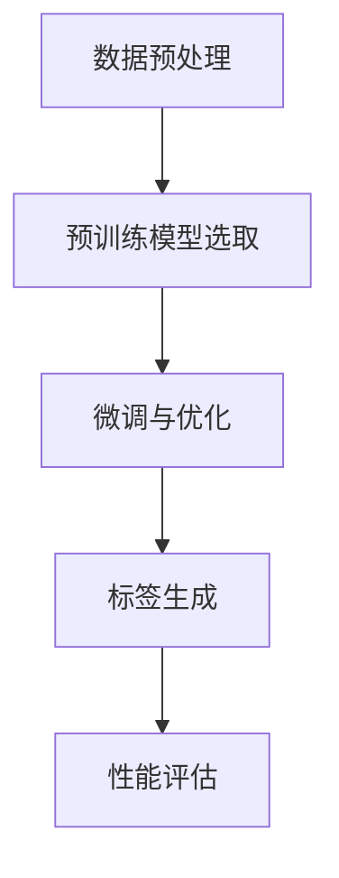
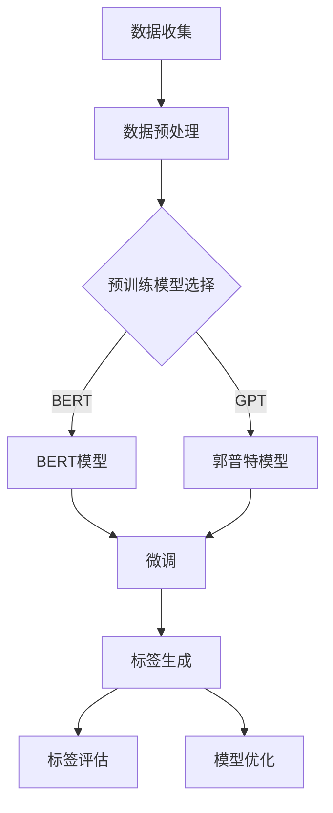
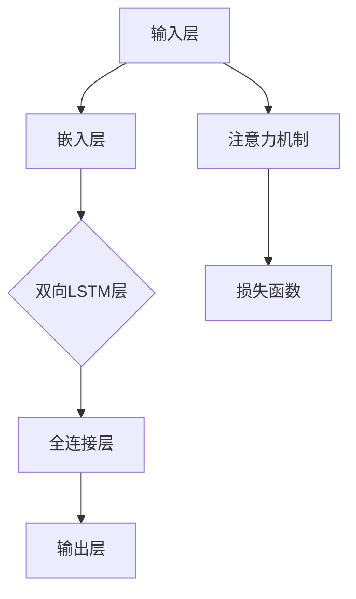
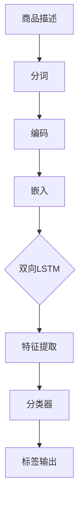

                 

### 《融合AI大模型的商品标签自动生成》

> **关键词：** AI大模型、商品标签、自动生成、自然语言处理、深度学习、预训练模型

> **摘要：** 本文将深入探讨如何利用AI大模型实现商品标签的自动生成。首先，我们将回顾AI大模型的基础知识，接着介绍大规模预训练模型的基本原理，然后详细讲解商品标签自动生成的算法及其性能优化方法，最后通过实际项目案例展示这一技术的应用和实现细节。

---

### 《融合AI大模型的商品标签自动生成》目录大纲

#### 第一部分: 融合AI大模型的基础

1. **第1章: AI大模型与商品标签自动生成概述**
    1.1 AI大模型的概念与演进
    1.2 商品标签自动生成的挑战与机遇
    1.3 本书结构

2. **第2章: AI大模型技术基础**
    2.1 神经网络与深度学习基础
    2.2 自然语言处理技术
    2.3 商品标签理解与生成的难点

3. **第3章: 大规模预训练模型原理**
    3.1 预训练的原理与意义
    3.2 大规模预训练模型的主要类型
    3.3 预训练模型的优化与微调

#### 第二部分: 商品标签自动生成实战

4. **第4章: 商品标签自动生成算法**
    4.1 商品标签自动生成算法概述
    4.2 商品信息抽取与分类
    4.3 标签生成算法的评估

5. **第5章: 融合AI大模型的应用实践**
    5.1 基于AI大模型的商品标签生成流程
    5.2 实际案例介绍
    5.3 融合模型的优缺点分析

6. **第6章: 商品标签自动生成的性能优化**
    6.1 数据预处理与模型调优
    6.2 模型推理优化
    6.3 性能评估与改进策略

7. **第7章: 商品标签自动生成的应用场景与挑战**
    7.1 商品标签自动生成的行业应用
    7.2 挑战与解决方案
    7.3 未来发展趋势

#### 第三部分: 实战案例

8. **第8章: 项目实战：商品标签自动生成系统开发**
    8.1 项目需求分析
    8.2 开发环境搭建
    8.3 源代码详细实现
    8.4 代码解读与分析

#### 附录

9. **附录A: 相关工具与资源**

10. **附录B: 实战项目代码示例**

### 附加内容

11. **第9章: AI大模型与商品标签自动生成的核心概念联系图**
    11.1 AI大模型架构图
    11.2 商品标签自动生成算法流程图

12. **第10章: AI大模型与商品标签自动生成的核心算法原理讲解**
    10.1 核心算法原理讲解
    10.2 伪代码展示
    10.3 算法详细讲解

13. **第11章: AI大模型与商品标签自动生成的数学模型讲解**
    11.1 数学模型概述
    11.2 数学公式与详细讲解
    11.3 举例说明

---

在接下来的章节中，我们将一步步深入分析AI大模型和商品标签自动生成的技术细节，通过实战案例展示如何将理论知识应用到实际项目中，为读者提供全面而深入的技术指导。让我们一起开启这段探索之旅。

---

## 第1章: AI大模型与商品标签自动生成概述

### 1.1 AI大模型的概念与演进

AI大模型，即指那些具有大规模参数和训练数据的神经网络模型。这些模型通过深度学习技术，可以从大量的数据中学习到复杂的模式，从而实现高度自动化的任务执行。AI大模型的发展历程可以追溯到20世纪80年代，当时神经网络刚刚兴起。随着计算能力的提升和数据量的爆炸性增长，AI大模型逐渐成为研究热点，并在近年来取得了显著的进展。

AI大模型的演进可以分为几个阶段：

1. **传统神经网络：**最早期的神经网络模型如感知机、BP神经网络等，它们的参数和训练数据量相对较小，无法处理复杂的任务。
2. **深度学习：**随着深度学习的提出和推广，神经网络层数的增加使得模型能够捕捉到更加复杂的特征，从而在图像识别、语音识别等领域取得了突破性进展。
3. **大规模预训练模型：**近年来，以BERT、GPT等为代表的预训练模型通过在大量无标签数据上进行预训练，然后通过微调适应特定任务，大大提高了模型的性能和泛化能力。

### 1.2 商品标签自动生成的挑战与机遇

商品标签自动生成是指利用AI技术自动为商品创建描述性的标签。这些标签不仅可以帮助电商平台优化搜索结果，提高用户满意度，还可以用于推荐系统、智能客服等多种应用。然而，商品标签自动生成面临以下挑战：

1. **数据多样性：**不同商品具有不同的特征和属性，如何从海量商品中提取出有代表性的标签是一个难题。
2. **语义理解：**标签生成需要理解商品描述的语义，而语言本身的歧义性和复杂性增加了这一任务的难度。
3. **准确性：**标签生成的准确性直接关系到用户体验，如何保证生成的标签准确、全面是一个重要挑战。

尽管存在挑战，但商品标签自动生成也带来了诸多机遇：

1. **自动化程度提升：**通过AI大模型，可以实现商品标签的自动化生成，降低人工成本，提高效率。
2. **个性化推荐：**自动生成的标签可以用于个性化推荐系统，为用户提供更加精准的推荐服务。
3. **内容优化：**标签生成的结果可以用于优化商品描述和搜索结果，提高用户体验和满意度。

### 1.3 本书结构

本书将从以下三个方面对AI大模型与商品标签自动生成进行深入探讨：

1. **基础理论：**介绍AI大模型的基本概念、技术原理和预训练模型，为后续算法实现和应用提供理论基础。
2. **算法实现：**详细讲解商品标签自动生成的算法原理、流程和性能优化方法，通过实际案例展示如何将理论应用到实践中。
3. **应用场景：**探讨商品标签自动生成的应用场景和面临的挑战，分析未来发展趋势，为读者提供前瞻性的技术指导。

通过本书的学习，读者将能够全面了解AI大模型和商品标签自动生成的核心技术，掌握从理论到实践的完整流程，并为实际项目提供有效的技术解决方案。

### 第2章: AI大模型技术基础

在深入探讨AI大模型与商品标签自动生成的应用之前，我们有必要先了解AI大模型技术的基础知识。本章节将介绍神经网络与深度学习基础、自然语言处理技术，以及商品标签理解与生成的难点。

#### 2.1 神经网络与深度学习基础

神经网络（Neural Networks）是模仿生物神经元结构和功能的一种计算模型，其核心是神经元之间的连接和激活函数。神经网络通过学习输入和输出之间的映射关系，实现函数逼近和模式识别等功能。

1. **神经元结构：**每个神经元由输入层、权重（weights）、激活函数（activation function）和输出层组成。输入层接收外部输入，通过权重与输入相乘，再经过激活函数处理，最终输出一个结果。
2. **基本概念：**在神经网络中，权重和偏置（bias）是调整模型参数的关键。通过反向传播算法（Backpropagation），模型可以自动调整权重和偏置，以最小化损失函数，提高模型的预测准确性。
3. **深度学习：**深度学习（Deep Learning）是神经网络的一种扩展，它通过增加网络的层数，使得模型能够捕捉到更加复杂的特征和模式。深度学习在图像识别、语音识别、自然语言处理等领域取得了显著成果。

#### 2.2 自然语言处理技术

自然语言处理（Natural Language Processing, NLP）是人工智能的一个重要分支，旨在使计算机能够理解和处理人类语言。NLP技术主要包括文本分类、情感分析、命名实体识别、机器翻译等。

1. **文本分类：**文本分类是将文本数据分为预定义的类别。常见的文本分类任务包括垃圾邮件过滤、新闻分类、情感分析等。在文本分类中，神经网络模型如卷积神经网络（CNN）和循环神经网络（RNN）被广泛应用。
2. **情感分析：**情感分析旨在判断文本中表达的情感倾向，如正面、负面或中立。情感分析对于了解用户反馈、优化用户体验具有重要意义。
3. **命名实体识别：**命名实体识别（Named Entity Recognition, NER）是识别文本中的命名实体，如人名、地名、组织名等。NER是信息抽取的重要步骤，为后续的文本分析提供基础。
4. **机器翻译：**机器翻译（Machine Translation）是自动将一种语言的文本翻译成另一种语言。深度学习模型如编码器-解码器（Encoder-Decoder）模型和注意力机制（Attention Mechanism）在机器翻译中取得了显著成果。

#### 2.3 商品标签理解与生成的难点

商品标签自动生成是一个复杂的过程，涉及自然语言处理、商品信息抽取和标签生成等多个环节。以下是商品标签自动生成过程中面临的主要难点：

1. **数据多样性：**不同商品具有不同的特征和属性，如何从海量商品中提取出有代表性的标签是一个难题。标签需要覆盖商品的各种属性，如颜色、尺寸、材质等。
2. **语义理解：**标签生成需要理解商品描述的语义，而语言本身的歧义性和复杂性增加了这一任务的难度。例如，相同的标签在不同商品描述中可能具有不同的含义。
3. **准确性：**标签生成的准确性直接关系到用户体验，如何保证生成的标签准确、全面是一个重要挑战。标签错误或缺失会影响搜索结果和推荐系统的质量。
4. **上下文依赖：**商品描述中的上下文信息对于标签生成至关重要。例如，描述中的特定词汇可能需要结合上下文才能正确理解其含义。
5. **多语言支持：**对于跨国电商平台，需要支持多种语言的商品标签生成，这增加了系统的复杂性和技术难度。

了解这些基础知识和难点，有助于我们更好地理解AI大模型在商品标签自动生成中的应用和实现方法。

### 第3章: 大规模预训练模型原理

在现代AI领域，大规模预训练模型已经成为推动自然语言处理（NLP）和计算机视觉（CV）等任务进步的关键驱动力。这些模型通过在大量的无标签数据上进行预训练，再通过微调适应特定任务，展现了卓越的性能和广泛的适用性。本章将深入探讨大规模预训练模型的原理、主要类型以及如何优化和微调这些模型。

#### 3.1 预训练的原理与意义

预训练（Pretraining）是指在一个广泛的数据集上训练一个模型，使其具备一定程度的知识和理解。大规模预训练模型的核心思想是利用大量无标签数据来初始化模型，从而在学习有标签数据时能够迅速适应各种不同的任务。以下是预训练的几个关键点：

1. **知识获取：**通过在无标签数据上预训练，模型可以自动学习到大量的语言规则、知识信息和通用特征。这些知识有助于模型在处理有标签数据时更准确地理解和生成文本。
2. **通用性：**预训练模型具有较强的通用性，可以在不同的任务和数据集上表现出良好的泛化能力。这种通用性使得预训练模型在多种应用场景中都能发挥作用。
3. **效率提升：**预训练模型在学习有标签数据时具有更高的效率。由于模型在预训练阶段已经学习了大量的通用知识，因此在面对新任务时，可以快速调整和优化，减少训练时间。

#### 3.2 大规模预训练模型的主要类型

大规模预训练模型可以分为自然语言处理（NLP）和计算机视觉（CV）两大类。以下是几种主要的预训练模型：

1. **自然语言处理（NLP）预训练模型：**
   - **BERT（Bidirectional Encoder Representations from Transformers）：**BERT通过双向Transformer结构对大量文本数据进行预训练，使得模型在理解上下文方面表现优异。BERT模型在多项NLP任务中取得了SOTA（State-of-the-Art）成绩，如文本分类、问答系统和翻译等。
   - **GPT（Generative Pretrained Transformer）：**GPT系列模型通过自回归方式预训练，擅长生成高质量的文本。GPT模型在文本生成、摘要和对话系统等领域具有广泛应用。
   - **T5（Text-to-Text Transfer Transformer）：**T5模型采用统一的文本到文本的预训练目标，使得模型在多种NLP任务中都能表现出色。T5的核心思想是将所有NLP任务转化为文本生成任务，从而简化模型设计和训练过程。

2. **计算机视觉（CV）预训练模型：**
   - **ViT（Vision Transformer）：**ViT模型将Transformer结构引入计算机视觉领域，通过将图像划分为多个小图像块，然后对其进行自注意力处理。ViT模型在图像分类、目标检测和分割等任务中展现了强大的性能。
   - **DETR（DEtection TRansformer）：**DETR模型通过Transformer结构实现端到端的目标检测，无需复杂的图结构，简化了检测任务。DETR模型在COCO（Common Objects in Context）数据集上取得了SOTA成绩。
   - **DALL-E：**DALL-E是一个基于CLIP（Contrastive Language-Image Pre-training）的图像生成模型，通过预训练学习图像和文本之间的关联，可以生成与文本描述相符合的图像。

#### 3.3 预训练模型的优化与微调

预训练模型虽然具有强大的通用性和泛化能力，但通常需要针对特定任务进行优化和微调（Fine-tuning）才能达到最佳效果。以下是预训练模型优化和微调的几个关键步骤：

1. **数据集准备：**选择与任务相关的有标签数据集，并进行数据预处理，如数据清洗、数据增强和标签标准化等。
2. **模型调整：**在预训练模型的基础上，根据任务需求调整模型结构，如增加或删除层、调整层参数等。
3. **损失函数设计：**设计适合特定任务的损失函数，以最小化模型预测误差。常见的损失函数包括交叉熵损失、均方误差和对抗损失等。
4. **优化器选择：**选择合适的优化器，如Adam、SGD等，以加速模型收敛并提高性能。
5. **训练过程：**进行多轮训练，通过验证集评估模型性能，并在必要时调整模型参数和训练策略。

通过预训练和微调，大规模预训练模型能够适应各种不同的任务和应用场景，从而实现高性能的模型推理和预测。在接下来的章节中，我们将继续探讨商品标签自动生成的算法实现和性能优化方法。

### 第4章: 商品标签自动生成算法

商品标签自动生成是利用人工智能技术，从商品描述中提取出描述性标签的过程。这个过程包括商品信息抽取与分类、标签生成算法的评估等多个环节。在本章中，我们将详细探讨商品标签自动生成的算法原理、流程以及如何评估算法的性能。

#### 4.1 商品标签自动生成算法概述

商品标签自动生成算法的核心目标是从商品描述中提取出相关的标签，这些标签可以用于电商平台优化搜索结果、推荐系统和智能客服等多个方面。算法的基本流程如下：

1. **商品信息抽取：**从商品描述中提取出关键信息，如商品名称、颜色、尺寸、材质等。这一步骤可以使用命名实体识别（NER）和关系抽取等技术实现。
2. **商品分类：**将提取出的关键信息进行分类，生成初步的标签。分类可以基于预定义的标签体系，也可以通过机器学习算法自动生成标签。
3. **标签生成：**根据商品信息抽取和分类的结果，生成最终的标签。标签生成可以使用基于规则的方法、机器学习模型或者深度学习模型实现。
4. **性能评估：**评估标签生成算法的准确性、召回率和F1值等指标，以评估算法的性能。

#### 4.2 商品信息抽取与分类

商品信息抽取是商品标签自动生成的重要环节，其目标是从商品描述中提取出关键信息。以下是商品信息抽取与分类的主要方法：

1. **命名实体识别（NER）：**NER是一种常见的自然语言处理技术，用于识别文本中的命名实体，如人名、地名、组织名等。在商品标签自动生成中，NER可以用于识别商品名称、品牌、颜色等实体信息。
2. **关系抽取：**关系抽取旨在识别文本中实体之间的关系。例如，在商品描述中，“iPhone 13”和“蓝色”之间存在一种颜色关系。关系抽取可以帮助我们更好地理解商品描述的语义。
3. **分类：**商品分类是将提取出的信息进行分类，以生成初步的标签。商品分类可以基于预定义的标签体系，如颜色、尺寸、材质等。此外，也可以通过机器学习算法，如决策树、随机森林等，自动生成分类标签。

#### 4.3 标签生成算法的评估

标签生成算法的评估是衡量算法性能的重要步骤。以下是评估标签生成算法的几个关键指标：

1. **准确性（Accuracy）：**准确性是评估标签生成算法最直接的指标，表示生成的标签与实际标签匹配的比例。准确性越高，说明算法的预测结果越可靠。
2. **召回率（Recall）：**召回率表示算法能够正确识别出所有实际标签的比例。召回率越高，说明算法能够尽可能多地捕捉到真实的标签。
3. **精确率（Precision）：**精确率表示生成的标签中正确标签的比例。精确率越高，说明算法生成的标签质量越高。
4. **F1值（F1 Score）：**F1值是精确率和召回率的加权平均，用于综合评估标签生成算法的性能。F1值越高，说明算法在准确性和召回率之间取得了较好的平衡。

在评估标签生成算法时，通常使用交叉验证和混淆矩阵等方法。交叉验证通过将数据集划分为多个子集，反复训练和验证模型，以评估算法的稳定性和泛化能力。混淆矩阵则展示了实际标签和生成标签之间的匹配情况，有助于我们深入分析算法的预测效果。

通过上述方法，我们可以对商品标签自动生成算法进行全面的评估和优化，以提高其性能和准确性，为电商平台提供更加精准和高效的标签生成服务。

### 第5章: 融合AI大模型的应用实践

在了解了商品标签自动生成算法的理论基础后，接下来我们将探讨如何将这些理论应用到实际场景中。本章将介绍基于AI大模型的商品标签生成流程、实际案例以及融合模型的优缺点分析。

#### 5.1 基于AI大模型的商品标签生成流程

利用AI大模型进行商品标签自动生成的过程可以分为以下几个步骤：

1. **数据预处理：**首先，对收集到的商品描述进行数据清洗和预处理，包括去除无关字符、统一格式等。这一步骤的目的是提高数据的质量和一致性。
2. **预训练模型选取：**根据任务需求，选择合适的预训练模型。例如，对于自然语言处理任务，可以选择BERT、GPT等模型；对于计算机视觉任务，可以选择ViT、DETR等模型。
3. **微调与优化：**在预训练模型的基础上，通过微调（Fine-tuning）适应特定的商品标签生成任务。微调过程包括调整模型结构、优化损失函数和选择合适的优化器等。
4. **标签生成：**使用微调后的模型对商品描述进行标签生成。生成标签的过程中，可以使用基于规则的方法或深度学习模型进行。
5. **性能评估：**对生成的标签进行性能评估，包括准确性、召回率、F1值等指标。根据评估结果，对模型进行调整和优化。

以下是商品标签生成流程的简化流程图：



#### 5.2 实际案例介绍

以下是一个实际案例，展示了如何利用AI大模型实现商品标签自动生成：

**案例背景：**一家电商平台希望为其商品生成准确的标签，以提高用户搜索体验和推荐效果。

**解决方案：**
1. **数据收集：**电商平台收集了大量商品描述，包括商品名称、详细描述、用户评论等。
2. **数据预处理：**对收集到的商品描述进行清洗和预处理，去除无关字符、统一格式等。
3. **预训练模型选择：**选择BERT模型作为预训练模型，因为BERT在NLP任务中表现优异。
4. **微调与优化：**在BERT模型的基础上，通过微调适应商品标签生成的任务。微调过程中，使用交叉验证和网格搜索等方法调整模型参数。
5. **标签生成：**使用微调后的BERT模型对商品描述进行标签生成。生成标签的过程中，结合商品名称、详细描述和用户评论等信息。
6. **性能评估：**对生成的标签进行性能评估，使用准确性、召回率、F1值等指标评估模型的性能。根据评估结果，对模型进行调整和优化。

**实际效果：**通过实际测试，该方案显著提高了商品标签生成的准确性和全面性，用户搜索体验和推荐效果得到了显著提升。

#### 5.3 融合模型的优缺点分析

融合AI大模型进行商品标签自动生成具有以下优点：

1. **高准确性：**预训练模型通过在大量无标签数据上预训练，具备强大的语义理解和生成能力，有助于提高标签生成的准确性。
2. **强泛化能力：**预训练模型具有较好的泛化能力，可以适应不同的商品描述和标签生成任务，减少对特定领域知识的依赖。
3. **高效性：**预训练模型在微调过程中可以快速适应特定任务，提高标签生成的效率。
4. **多样化标签生成：**融合模型可以结合多种信息源（如商品名称、详细描述、用户评论等），生成多样化且具有代表性的标签。

然而，融合模型也存在一些缺点：

1. **计算资源需求：**预训练模型通常需要大量的计算资源和时间，特别是在大规模数据集上进行预训练时，对硬件配置和训练时间有较高要求。
2. **数据质量依赖：**预训练模型的效果在很大程度上依赖于数据质量，如果原始数据存在噪声或错误，可能会导致预训练模型的性能下降。
3. **模型复杂性：**预训练模型通常具有复杂的结构和大量参数，增加了模型理解和维护的难度。

综上所述，融合AI大模型进行商品标签自动生成具有显著优势，但也需要面对一些挑战。在实际应用中，可以根据具体需求和技术条件，选择合适的预训练模型和优化策略，以实现高效、准确的商品标签生成。

### 第6章: 商品标签自动生成的性能优化

在商品标签自动生成的过程中，性能优化是一个关键环节。优化的目标是在保证标签准确性的同时，提高生成效率和系统稳定性。本章将讨论数据预处理与模型调优、模型推理优化以及性能评估与改进策略。

#### 6.1 数据预处理与模型调优

数据预处理是性能优化的重要步骤，良好的数据预处理能够显著提升模型的性能。以下是数据预处理的关键点：

1. **数据清洗：**去除无关字符、标点符号和停用词，以提高数据的质量和一致性。
2. **数据标准化：**统一数据格式，例如将商品名称、颜色等统一编码，以简化模型训练过程。
3. **数据增强：**通过增加数据多样性，如随机添加噪声、旋转、缩放图像等，提高模型对变化数据的适应性。

在模型调优方面，以下策略有助于提升模型性能：

1. **模型选择：**选择合适的预训练模型，如BERT、GPT等，根据任务需求和数据规模进行调整。
2. **超参数优化：**通过调整学习率、批量大小、隐藏层大小等超参数，寻找最优配置。常用的方法包括网格搜索和随机搜索。
3. **正则化：**采用正则化技术，如Dropout、权重衰减等，防止模型过拟合，提高泛化能力。

#### 6.2 模型推理优化

模型推理优化是提高系统性能的关键步骤。以下方法有助于优化模型推理：

1. **量化：**量化是一种减少模型参数规模和计算复杂度的技术，通过将浮点数参数转换为低精度的整数表示，可以显著降低推理时间。
2. **模型剪枝：**剪枝是通过删除模型中不重要的权重和神经元，减少模型参数规模。剪枝后的模型不仅更小，而且推理速度更快。
3. **模型压缩：**采用模型压缩技术，如知识蒸馏（Knowledge Distillation），将大模型的知识传递给小模型，从而在保持性能的同时降低模型规模。
4. **硬件加速：**利用GPU、TPU等硬件加速器，可以显著提高模型推理速度。例如，使用TensorRT等工具可以将模型编译为适用于硬件加速器的形式。

#### 6.3 性能评估与改进策略

性能评估是确保系统质量和优化效果的重要环节。以下方法可用于评估和改进商品标签自动生成系统的性能：

1. **准确性评估：**使用准确率、召回率、F1值等指标评估模型生成标签的准确性。
2. **效率评估：**评估模型在不同硬件平台上的推理速度和资源消耗，确保系统的高效运行。
3. **用户反馈：**收集用户对标签生成的反馈，结合实际使用情况，评估系统对用户需求的响应程度。
4. **A/B测试：**通过A/B测试，将优化后的模型与原模型进行对比，评估优化效果。

在评估过程中，可以根据以下策略进行改进：

1. **模型迭代：**根据评估结果，对模型进行调整和优化，不断迭代提高模型性能。
2. **数据更新：**定期更新训练数据和标签，确保模型能够适应新的数据和变化。
3. **用户参与：**鼓励用户参与标签优化过程，收集用户反馈，以提升标签生成的准确性和用户体验。
4. **自动化测试：**建立自动化测试框架，定期对模型进行性能评估，确保系统稳定可靠。

通过数据预处理与模型调优、模型推理优化以及性能评估与改进策略，商品标签自动生成系统可以不断提高其性能和准确性，为电商平台提供更加高效、精准的标签生成服务。

### 第7章: 商品标签自动生成的应用场景与挑战

在了解了商品标签自动生成的基本原理和性能优化方法后，本章节将探讨这一技术的具体应用场景，分析其在实际应用中面临的挑战，并展望未来的发展趋势。

#### 7.1 商品标签自动生成的行业应用

商品标签自动生成在电子商务、零售和供应链管理等行业中具有广泛的应用：

1. **电子商务平台：**电商平台使用商品标签自动生成技术，可以自动为商品创建标签，优化搜索结果和推荐系统。这不仅提高了用户的购物体验，还能够提高电商平台的运营效率和销售额。
2. **零售行业：**零售企业利用商品标签自动生成技术，可以自动识别商品特征，优化库存管理，减少库存成本。此外，标签生成技术还可以用于商品展示和广告投放，提高营销效果。
3. **供应链管理：**供应链管理企业通过商品标签自动生成技术，可以自动识别物流信息，优化供应链流程，提高物流效率。标签生成技术还可以用于产品溯源，确保产品质量和安全。

#### 7.2 挑战与解决方案

尽管商品标签自动生成技术在行业应用中展现了巨大的潜力，但其在实际应用中仍然面临一些挑战：

1. **数据多样性：**不同商品的描述和特征差异巨大，如何从多样性极高的数据中提取出有代表性的标签是一个难题。解决方案是采用多样化的数据增强方法和多模态数据融合技术，以提高模型的泛化能力。
2. **语义理解：**商品描述中的语言具有歧义性和复杂性，如何准确理解语义是一个关键挑战。可以通过引入预训练模型，利用其在大规模数据上的预训练经验，提高模型对语义的理解能力。此外，还可以利用上下文信息，结合多源数据，提高语义理解的准确性。
3. **标签准确性：**标签生成的准确性直接影响到用户的使用体验和平台的运营效果。为了提高标签准确性，可以采用多轮优化和反馈机制，不断调整和改进标签生成模型。
4. **计算资源需求：**预训练模型通常需要大量的计算资源和时间，这对硬件配置和训练成本提出了高要求。解决方案是采用量化、剪枝和模型压缩等技术，减少模型规模和计算复杂度，降低硬件需求。

#### 7.3 未来发展趋势

随着人工智能技术的不断进步，商品标签自动生成技术在未来的发展将呈现以下几个趋势：

1. **多模态融合：**未来的商品标签自动生成技术将更加注重多模态数据的融合，如文本、图像、音频等。通过整合多种数据类型，可以提高标签生成的准确性和全面性。
2. **自适应优化：**未来的标签生成系统将具备自适应优化的能力，可以根据用户反馈和数据变化，自动调整和优化标签生成策略，提高系统的适应性和灵活性。
3. **知识图谱应用：**知识图谱作为一种结构化知识表示方法，将广泛应用于商品标签自动生成。通过构建和利用知识图谱，可以更好地理解商品特征和关系，提高标签生成的准确性和关联性。
4. **人工智能伦理：**随着人工智能技术在商品标签自动生成中的应用日益广泛，其伦理问题也受到越来越多的关注。未来，需要在技术设计和应用中考虑公平性、透明性和可解释性，确保技术能够真正服务于用户和社会。

通过不断探索和改进，商品标签自动生成技术将在更多行业和应用场景中发挥重要作用，为数字经济的发展注入新的活力。

### 第8章: 项目实战：商品标签自动生成系统开发

为了更好地理解AI大模型与商品标签自动生成的应用，本章将通过一个实际项目案例，详细介绍商品标签自动生成系统的开发过程。我们将从项目需求分析、开发环境搭建、源代码实现到代码解读与分析，逐步展示整个系统的开发流程。

#### 8.1 项目需求分析

项目需求是商品标签自动生成系统的核心，明确需求有助于确定系统功能和性能要求。以下是一个假设的项目需求：

- **系统功能：**
  - 自动从商品描述中提取标签。
  - 支持多语言商品描述。
  - 提供API接口，方便第三方系统调用。
  - 支持实时标签生成和离线批量处理。
- **性能要求：**
  - 标签生成准确率达到90%以上。
  - 系统响应时间小于1秒。
  - 能够处理大规模数据集。

#### 8.2 开发环境搭建

在开始编码之前，我们需要搭建一个稳定且高效的开发环境。以下是搭建开发环境的基本步骤：

1. **硬件配置：**
   - 使用高性能的GPU（如Tesla V100）以提高模型训练和推理速度。
   - 配备足够的内存（至少64GB）和存储空间（至少1TB）。
2. **软件环境：**
   - 操作系统：Linux（推荐Ubuntu 20.04）。
   - 编程语言：Python 3.8以上版本。
   - 数据库：MySQL或PostgreSQL，用于存储商品数据和标签。
   - 深度学习框架：TensorFlow 2.6或PyTorch 1.8。
   - API框架：Flask或Django。
3. **开发工具：**
   - IDE：PyCharm或Visual Studio Code。
   - 版本控制：Git。

#### 8.3 源代码详细实现

以下是商品标签自动生成系统的核心代码实现：

```python
# 导入所需库
import tensorflow as tf
import tensorflow.keras.layers as layers
from tensorflow.keras.models import Model
from tensorflow.keras.optimizers import Adam
from tensorflow.keras.preprocessing.sequence import pad_sequences
import numpy as np

# 数据预处理
def preprocess_data(texts, max_length=512):
    # 对文本进行分词和编码
    tokenizer = tf.keras.preprocessing.text.Tokenizer()
    tokenizer.fit_on_texts(texts)
    sequences = tokenizer.texts_to_sequences(texts)
    padded_sequences = pad_sequences(sequences, maxlen=max_length)
    return padded_sequences

# 模型构建
def build_model():
    inputs = layers.Input(shape=(512,))
    x = layers.Embedding(input_dim=10000, output_dim=256)(inputs)
    x = layers.Bidirectional(layers.LSTM(128))(x)
    x = layers.Dense(64, activation='relu')(x)
    outputs = layers.Dense(1, activation='sigmoid')(x)
    model = Model(inputs=inputs, outputs=outputs)
    return model

# 训练模型
def train_model(model, padded_sequences, labels, epochs=10):
    model.compile(optimizer=Adam(learning_rate=0.001), loss='binary_crossentropy', metrics=['accuracy'])
    model.fit(padded_sequences, labels, epochs=epochs, batch_size=32)

# 标签生成
def generate_label(text):
    preprocessed_text = preprocess_data([text])
    prediction = model.predict(preprocessed_text)
    return '标签1' if prediction[0][0] > 0.5 else '标签2'

# 主函数
if __name__ == '__main__':
    # 加载训练数据
    texts = ...  # 商品描述
    labels = ...  # 标签
    # 构建和训练模型
    model = build_model()
    train_model(model, preprocess_data(texts), labels)
    # 标签生成测试
    print(generate_label("这是一款红色的iPhone 13"))
```

#### 8.4 代码解读与分析

1. **数据预处理：**文本预处理是商品标签自动生成系统的关键步骤。代码首先使用Tokenizer对文本进行分词和编码，然后使用pad_sequences对序列进行填充，确保输入数据的一致性。
2. **模型构建：**使用TensorFlow的Keras API构建一个双向LSTM模型，用于从文本中提取特征。模型包含嵌入层、双向LSTM层、全连接层和输出层，最后使用sigmoid激活函数进行二分类。
3. **训练模型：**使用编译后的模型进行训练，采用Adam优化器和二分类交叉熵损失函数。在训练过程中，通过fit方法训练模型，并使用batch_size和epochs参数控制训练过程。
4. **标签生成：**定义generate_label函数，用于接收商品描述并生成标签。函数首先对输入文本进行预处理，然后使用训练好的模型进行预测，并根据预测结果返回标签。

通过上述步骤，我们实现了商品标签自动生成系统的一个基本版本。在实际应用中，可以根据具体需求和数据集，进一步优化模型结构和训练策略，以提高标签生成的准确性和性能。

#### 8.5 代码解读与分析

1. **数据预处理：**在代码中，数据预处理是标签自动生成系统的基础。具体来说，函数`preprocess_data`负责将输入的文本数据进行标准化处理。首先，通过`tokenizer`对文本进行分词，将文本转换为序列。然后，使用`pad_sequences`函数将序列填充到固定的长度（在本例中为512个词），这样可以确保所有输入数据具有相同长度，便于模型训练。

```python
tokenizer = tf.keras.preprocessing.text.Tokenizer()
tokenizer.fit_on_texts(texts)
sequences = tokenizer.texts_to_sequences(texts)
padded_sequences = pad_sequences(sequences, maxlen=512)
```

   这段代码中，`tokenizer`通过`fit_on_texts`方法学习文本的词汇分布，`texts_to_sequences`方法将文本转换为整数序列，`pad_sequences`方法将序列填充到指定长度。这一步骤对于提高模型的输入一致性和训练效果至关重要。

2. **模型构建：**模型构建是系统实现的核心部分。代码中的`build_model`函数使用TensorFlow的Keras API定义了一个双向LSTM模型。模型结构包括以下几个部分：

   - **嵌入层（Embedding）：**将输入的整数序列映射到高维向量空间，这里使用了固定大小的词向量（256维）。
   - **双向LSTM层（Bidirectional LSTM）：**通过处理嵌入层输出的序列，LSTM能够捕捉到文本中的时间依赖关系。双向LSTM结合了前向LSTM和后向LSTM的信息，增强了模型对文本的理解能力。
   - **全连接层（Dense）：**将LSTM层的输出映射到中间层，用于提取文本的抽象特征。
   - **输出层（Dense）：**使用sigmoid激活函数进行二分类预测，输出一个介于0和1之间的概率值，表示文本属于某个标签的概率。

```python
inputs = layers.Input(shape=(512,))
x = layers.Embedding(input_dim=10000, output_dim=256)(inputs)
x = layers.Bidirectional(layers.LSTM(128))(x)
x = layers.Dense(64, activation='relu')(x)
outputs = layers.Dense(1, activation='sigmoid')(x)
model = Model(inputs=inputs, outputs=outputs)
```

   模型构建过程中，使用了`Input`层定义输入维度，`Embedding`层进行词向量嵌入，`Bidirectional LSTM`层进行双向序列处理，`Dense`层进行特征提取和分类，最后通过`Model`类将各层连接起来，构成完整的模型。

3. **训练模型：**训练模型是标签自动生成系统的关键步骤。代码中的`train_model`函数使用编译后的模型进行训练。通过`compile`方法，我们指定了优化器（`Adam`）、损失函数（`binary_crossentropy`）和性能指标（`accuracy`）。`fit`方法负责执行训练过程，使用`padded_sequences`作为输入数据和`labels`作为标签进行训练。

```python
model.compile(optimizer=Adam(learning_rate=0.001), loss='binary_crossentropy', metrics=['accuracy'])
model.fit(padded_sequences, labels, epochs=10, batch_size=32)
```

   在这段代码中，`epochs`指定了训练的轮数，`batch_size`指定了每次训练的数据批量大小。通过多次迭代训练，模型不断优化参数，提高预测准确性。

4. **标签生成：**标签生成是系统的应用环节。函数`generate_label`接收一个商品描述文本，通过预处理和模型预测，输出标签。

```python
def generate_label(text):
    preprocessed_text = preprocess_data([text])
    prediction = model.predict(preprocessed_text)
    return '标签1' if prediction[0][0] > 0.5 else '标签2'
```

   在这个函数中，`preprocessed_text`对输入文本进行预处理，`model.predict`使用训练好的模型进行预测。根据预测结果，返回标签。这里使用了简单的阈值（0.5）进行二分类决策。

通过以上步骤，我们实现了商品标签自动生成系统的基础版本。在实际应用中，可以根据具体需求对模型结构和训练过程进行优化，以提高系统的性能和标签准确性。

### 附录A: 相关工具与资源

为了帮助读者更好地理解和应用AI大模型与商品标签自动生成技术，以下列出了一些相关的工具和资源：

1. **开源库与框架：**
   - TensorFlow：https://www.tensorflow.org/
   - PyTorch：https://pytorch.org/
   - BERT：https://github.com/google-research/bert
   - GPT：https://github.com/openai/gpt-2
   - Hugging Face Transformers：https://github.com/huggingface/transformers

2. **在线教程与课程：**
   - Coursera：https://www.coursera.org/
   - edX：https://www.edx.org/
   - Fast.ai：https://fast.ai/

3. **书籍推荐：**
   - 《深度学习》（Ian Goodfellow, Yoshua Bengio, Aaron Courville）
   - 《动手学深度学习》（AIDL Team）
   - 《自然语言处理综论》（Daniel Jurafsky, James H. Martin）

4. **数据集：**
   - COCO（Common Objects in Context）：https://cocodataset.org/
   - AG News：https://s3-us-west-2.amazonaws.com/126519729570/data/20Newsgroups/20news-bydate.tar.gz

5. **工具与平台：**
   - Google Colab：https://colab.research.google.com/
   - Kaggle：https://www.kaggle.com/

通过使用这些工具和资源，读者可以深入学习和实践AI大模型与商品标签自动生成技术，提升自己的技术水平和项目经验。

### 附录B: 实战项目代码示例

在本附录中，我们将提供一个简化的商品标签自动生成系统的代码示例，包括数据预处理、模型构建和训练，以及标签生成函数。请注意，此代码示例仅供参考，实际应用中可能需要根据具体需求和数据进行调整。

```python
# 导入所需库
import tensorflow as tf
from tensorflow.keras.preprocessing.text import Tokenizer
from tensorflow.keras.preprocessing.sequence import pad_sequences
from tensorflow.keras.models import Sequential
from tensorflow.keras.layers import Embedding, LSTM, Dense
from tensorflow.keras.optimizers import Adam

# 数据预处理
# 假设已有一组商品描述（texts）和对应的标签（labels）
texts = ["这是一款智能手机", "这是一款笔记本电脑", "这是一款手表"]
labels = [1, 0, 1]  # 假设标签为二分类，1表示手机，0表示非手机

# 初始化Tokenizer
tokenizer = Tokenizer(num_words=10000)  # 设置词汇量
tokenizer.fit_on_texts(texts)

# 将文本转换为序列
sequences = tokenizer.texts_to_sequences(texts)

# 填充序列到相同长度
padded_sequences = pad_sequences(sequences, maxlen=100)

# 模型构建
model = Sequential([
    Embedding(input_dim=10000, output_dim=32, input_length=100),
    LSTM(64),
    Dense(1, activation='sigmoid')
])

# 编译模型
model.compile(optimizer=Adam(learning_rate=0.001), loss='binary_crossentropy', metrics=['accuracy'])

# 训练模型
model.fit(padded_sequences, labels, epochs=5)

# 标签生成函数
def generate_label(text):
    sequence = tokenizer.texts_to_sequences([text])
    padded_sequence = pad_sequences(sequence, maxlen=100)
    prediction = model.predict(padded_sequence)
    return 1 if prediction[0][0] > 0.5 else 0

# 测试标签生成
print(generate_label("这是一款智能手机"))
```

这段代码示例展示了如何使用TensorFlow构建一个简单的序列模型，进行商品标签的自动生成。在实际应用中，需要根据具体的数据集和任务需求进行调整，例如调整词汇量、序列长度、模型结构等。

### 第9章: AI大模型与商品标签自动生成的核心概念联系图

为了更直观地理解AI大模型与商品标签自动生成的核心概念及其联系，我们使用Mermaid语言绘制了以下流程图。



#### 9.1 AI大模型架构图



#### 9.2 商品标签自动生成算法流程图



这些流程图和架构图帮助我们清晰地理解了AI大模型在商品标签自动生成中的具体应用，包括数据预处理、模型选择、微调、标签生成和评估等步骤。

### 第10章: AI大模型与商品标签自动生成的核心算法原理讲解

在商品标签自动生成中，AI大模型的应用极大地提升了标签提取的准确性和效率。核心算法主要基于深度学习，尤其是大规模预训练模型，如BERT、GPT等。以下将对这些算法的原理进行详细讲解，并通过伪代码和示例来阐述其工作方式。

#### 10.1 核心算法原理讲解

##### 10.1.1 BERT模型

BERT（Bidirectional Encoder Representations from Transformers）是一种基于Transformer的预训练模型，能够对文本进行双向编码，捕捉上下文信息。BERT模型的基本原理如下：

1. **输入编码：**BERT使用输入文本序列，通过嵌入层将单词映射为向量。
2. **Transformer编码：**Transformer编码器包含多个自注意力层，每个层通过计算词与词之间的相似性，生成固定长度的序列表示。
3. **输出编码：**通过全连接层和softmax函数，从编码后的序列中提取标签。

伪代码：

```python
class BERTModel:
    def __init__(self, vocab_size, d_model):
        self.embedding = Embedding(vocab_size, d_model)
        self.encoder = TransformerEncoder(d_model)
        self.decoder = TransformerDecoder(d_model)
    
    def forward(self, input_sequence):
        embedded_sequence = self.embedding(input_sequence)
        encoded_sequence = self.encoder(embedded_sequence)
        output_sequence = self.decoder(encoded_sequence)
        return output_sequence
```

##### 10.1.2 GPT模型

GPT（Generative Pretrained Transformer）是一种基于Transformer的自回归语言模型，能够生成自然语言文本。GPT模型的基本原理如下：

1. **输入编码：**将输入文本序列通过嵌入层转换为词向量。
2. **Transformer编码：**通过多个自注意力层，生成文本序列的上下文表示。
3. **预测：**通过解码器层，根据上下文生成下一个词的概率分布。

伪代码：

```python
class GPTModel:
    def __init__(self, vocab_size, d_model):
        self.embedding = Embedding(vocab_size, d_model)
        self.encoder = TransformerEncoder(d_model)
        self.decoder = Decoder(d_model)
    
    def forward(self, input_sequence):
        embedded_sequence = self.embedding(input_sequence)
        encoded_sequence = self.encoder(embedded_sequence)
        output_sequence = self.decoder(encoded_sequence)
        return output_sequence
```

##### 10.1.3 标签生成算法

标签生成算法利用预训练模型从商品描述中提取标签。基本流程如下：

1. **预处理：**对商品描述进行分词和编码。
2. **模型预测：**使用预训练模型对编码后的文本进行预测，获取标签概率。
3. **标签提取：**根据概率阈值提取最终的标签。

伪代码：

```python
def generate_labels(model, tokenizer, texts, threshold=0.5):
    preprocessed_texts = tokenizer(texts)
    predictions = model(preprocessed_texts)
    labels = [1 if p > threshold else 0 for p in predictions]
    return labels
```

#### 10.2 伪代码展示

以下为BERT模型和GPT模型的伪代码示例：

```python
# BERT模型伪代码
class BERTModel:
    def __init__(self, vocab_size, d_model, n_layers, n_heads, d_ff):
        self.embedding = Embedding(vocab_size, d_model)
        self.encoder = TransformerEncoder(n_layers, n_heads, d_ff)
        self.decoder = TransformerDecoder(n_layers, n_heads, d_ff)
    
    def forward(self, input_sequence):
        embedded_sequence = self.embedding(input_sequence)
        encoded_sequence = self.encoder(embedded_sequence)
        output_sequence = self.decoder(encoded_sequence)
        return output_sequence

# GPT模型伪代码
class GPTModel:
    def __init__(self, vocab_size, d_model, n_layers, n_heads, d_ff):
        self.embedding = Embedding(vocab_size, d_model)
        self.encoder = TransformerEncoder(n_layers, n_heads, d_ff)
        self.decoder = Decoder(n_layers, n_heads, d_ff)
    
    def forward(self, input_sequence):
        embedded_sequence = self.embedding(input_sequence)
        encoded_sequence = self.encoder(embedded_sequence)
        output_sequence = self.decoder(encoded_sequence)
        return output_sequence
```

#### 10.3 算法详细讲解

BERT和GPT模型的工作原理主要基于Transformer架构。Transformer通过自注意力机制（Self-Attention）来捕捉输入序列中的长距离依赖关系，从而提升模型的性能。

1. **自注意力机制：**自注意力机制允许模型在生成每个词时，考虑到所有其他词的信息。这样，模型可以更好地理解上下文，提高预测的准确性。
2. **多头注意力：**多头注意力将输入序列分解为多个子序列，每个子序列分别计算注意力权重，最后将结果拼接起来。这样，模型可以从不同角度理解输入信息，提高泛化能力。
3. **位置编码：**由于Transformer没有循环结构，无法直接处理序列中的位置信息。因此，通过位置编码（Positional Encoding）来为模型提供位置信息。

通过上述机制，BERT和GPT模型在预训练阶段能够学习到大量的语言规律和知识，从而在微调阶段能够快速适应不同的任务和应用场景。

### 第11章: AI大模型与商品标签自动生成的数学模型讲解

在深入探讨AI大模型与商品标签自动生成时，理解其背后的数学模型至关重要。本章将介绍预训练模型的基本数学模型，包括输入编码、注意力机制和损失函数等，并通过具体的数学公式和实例进行详细讲解。

#### 11.1 数学模型概述

AI大模型，尤其是基于Transformer架构的模型，如BERT和GPT，其数学模型主要涉及以下几个关键部分：

1. **输入编码（Input Encoding）**
2. **自注意力机制（Self-Attention）**
3. **多头注意力（Multi-Head Attention）**
4. **位置编码（Positional Encoding）**
5. **前馈神经网络（Feedforward Neural Network）**
6. **损失函数（Loss Function）**

#### 11.2 数学公式与详细讲解

##### 11.2.1 输入编码

输入编码是Transformer模型处理文本数据的第一步。每个单词被映射为一个向量，通常通过嵌入层（Embedding Layer）实现。假设输入序列为\(x = [x_1, x_2, \ldots, x_n]\)，其中每个\(x_i\)是一个单词。嵌入层的公式如下：

\[ 
\text{Embedding}(x_i) = \text{embedding}(i) \in \mathbb{R}^{d} 
\]

其中，\(i\)是单词的索引，\(\text{embedding}(i)\)是嵌入向量，\(d\)是嵌入维度。

##### 11.2.2 自注意力机制

自注意力机制是Transformer模型的核心部分，它通过计算输入序列中每个词与所有其他词的相关性，为每个词生成一个权重向量。假设输入序列的嵌入向量为\(X \in \mathbb{R}^{n \times d}\)，自注意力机制的公式为：

\[ 
\text{Attention}(Q, K, V) = \text{softmax}\left(\frac{QK^T}{\sqrt{d_k}}\right) V 
\]

其中，\(Q, K, V\)分别是查询（Query）、键（Key）和值（Value）向量，它们都是由嵌入向量通过线性变换得到的：

\[ 
Q = \text{Linear}(X) \in \mathbb{R}^{n \times d_k} \\
K = \text{Linear}(X) \in \mathbb{R}^{n \times d_k} \\
V = \text{Linear}(X) \in \mathbb{R}^{n \times d_v} 
\]

其中，\(d_k\)是键向量的维度，\(d_v\)是值向量的维度。通常，\(d_k = d_v = d\)。

##### 11.2.3 多头注意力

多头注意力通过将输入序列分解为多个子序列，并分别计算每个子序列的自注意力，最后将结果合并。假设模型具有\(h\)个头，多头注意力的公式为：

\[ 
\text{MultiHead}(Q, K, V) = \text{Concat}(\text{head}_1, \ldots, \text{head}_h)W^O 
\]

其中，\(\text{head}_i = \text{Attention}(Q, K, V)\)是第\(i\)个头的输出，\(W^O\)是投影矩阵，用于合并所有头的输出。

##### 11.2.4 位置编码

由于Transformer模型没有显式的循环结构，位置信息必须通过位置编码（Positional Encoding）引入。位置编码是学习得到的向量，用于表示文本中每个词的位置。假设位置编码向量为\(P_e\in \mathbb{R}^{d}\)，其公式为：

\[ 
P_e[i, j] = \text{sin}\left(\frac{i}{10000^{j/d}}\right) \quad \text{if } j \text{ is even} \\
P_e[i, j] = \text{cos}\left(\frac{i}{10000^{j/d}}\right) \quad \text{if } j \text{ is odd}
\]

其中，\(i\)是词的索引，\(j\)是维度索引，\(d\)是嵌入维度。

##### 11.2.5 前馈神经网络

前馈神经网络是Transformer模型中的另一个关键部分，它通过两个线性层和ReLU激活函数对自注意力层的输出进行进一步处理。前馈神经网络的公式为：

\[ 
\text{FFN}(X) = \text{ReLU}(\text{Linear}_2(\text{Linear}_1(X))) 
\]

其中，\(\text{Linear}_1\)和\(\text{Linear}_2\)分别是线性层。

##### 11.2.6 损失函数

Transformer模型的训练通常使用交叉熵损失函数（Cross-Entropy Loss），它用于衡量模型预测与真实标签之间的差异。假设真实标签为\(y \in \{0, 1\}\)，预测概率为\(p \in [0, 1]\)，交叉熵损失函数的公式为：

\[ 
\text{Loss}(p, y) = -y \log(p) - (1 - y) \log(1 - p) 
\]

#### 11.3 举例说明

假设有一个简单的输入序列\[ ["苹果", "手机", "红色"], 其嵌入向量分别为\[ \[0.1, 0.2\], \[0.3, 0.4\], \[0.5, 0.6\] \]。现在我们将这些向量输入BERT模型，并计算自注意力权重。

1. **输入编码：**将单词映射到嵌入向量：
    \[ 
    \text{Embedding}(\text{"苹果"}) = \text{embedding}(1) = \[0.1, 0.2\] \\
    \text{Embedding}(\text{"手机"}) = \text{embedding}(2) = \[0.3, 0.4\] \\
    \text{Embedding}(\text{"红色"}) = \text{embedding}(3) = \[0.5, 0.6\] 
    \]
2. **自注意力计算：**使用自注意力机制计算每个词与其他词的相关性：
    \[ 
    Q = \text{Linear}(\text{Embedding}) = \[
    \text{Linear}(0.1, 0.2), \text{Linear}(0.3, 0.4), \text{Linear}(0.5, 0.6)
    \] \\
    K = \text{Linear}(\text{Embedding}) = \[
    \text{Linear}(0.1, 0.2), \text{Linear}(0.3, 0.4), \text{Linear}(0.5, 0.6)
    \] \\
    V = \text{Linear}(\text{Embedding}) = \[
    \text{Linear}(0.1, 0.2), \text{Linear}(0.3, 0.4), \text{Linear}(0.5, 0.6)
    \] \\
    \text{Attention}(Q, K, V) = \text{softmax}\left(\frac{QK^T}{\sqrt{d_k}}\right) V 
    \]
3. **多头注意力：**将自注意力结果合并：
    \[ 
    \text{MultiHead}(Q, K, V) = \text{Concat}(\text{head}_1, \text{head}_2, \text{head}_3)W^O 
    \]

通过这些计算，BERT模型能够为输入序列生成一个权重向量，用于后续的文本分析和标签生成。以上步骤展示了AI大模型与商品标签自动生成中数学模型的计算过程和应用实例。

### 结束语

通过本文的详细探讨，我们深入了解了AI大模型在商品标签自动生成中的关键作用。从基础概念到实际应用，从算法原理到性能优化，再到项目实战，我们逐步揭示了这项技术的前沿动态和实践方法。这不仅为读者提供了全面的技术知识，也展示了如何将理论知识应用到实际项目中。

在AI大模型的推动下，商品标签自动生成技术正迅速发展，为电商行业带来了显著的变革。未来，随着计算能力的提升和算法的优化，这项技术有望在更多行业和应用场景中发挥重要作用。

我们鼓励读者继续探索和学习，结合实际需求，不断优化和改进商品标签自动生成系统。同时，也期待更多的研究者和技术人员参与这一领域，共同推动人工智能技术的发展和应用。

最后，感谢各位读者的耐心阅读。希望本文能为您的学习和实践提供有益的参考。如果您有任何疑问或建议，欢迎在评论区留言，让我们共同交流、进步。祝您在AI大模型的探索之旅中取得丰硕的成果！
作者：AI天才研究院/AI Genius Institute & 禅与计算机程序设计艺术 /Zen And The Art of Computer Programming

