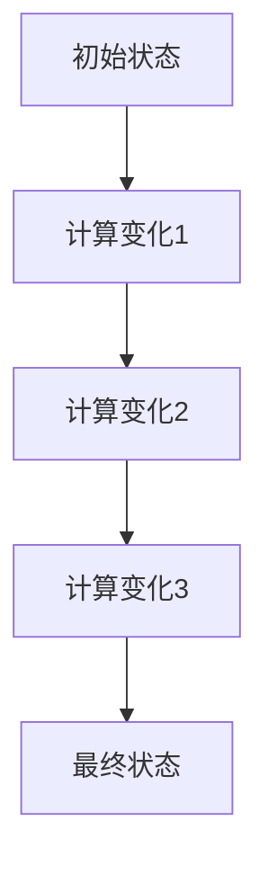
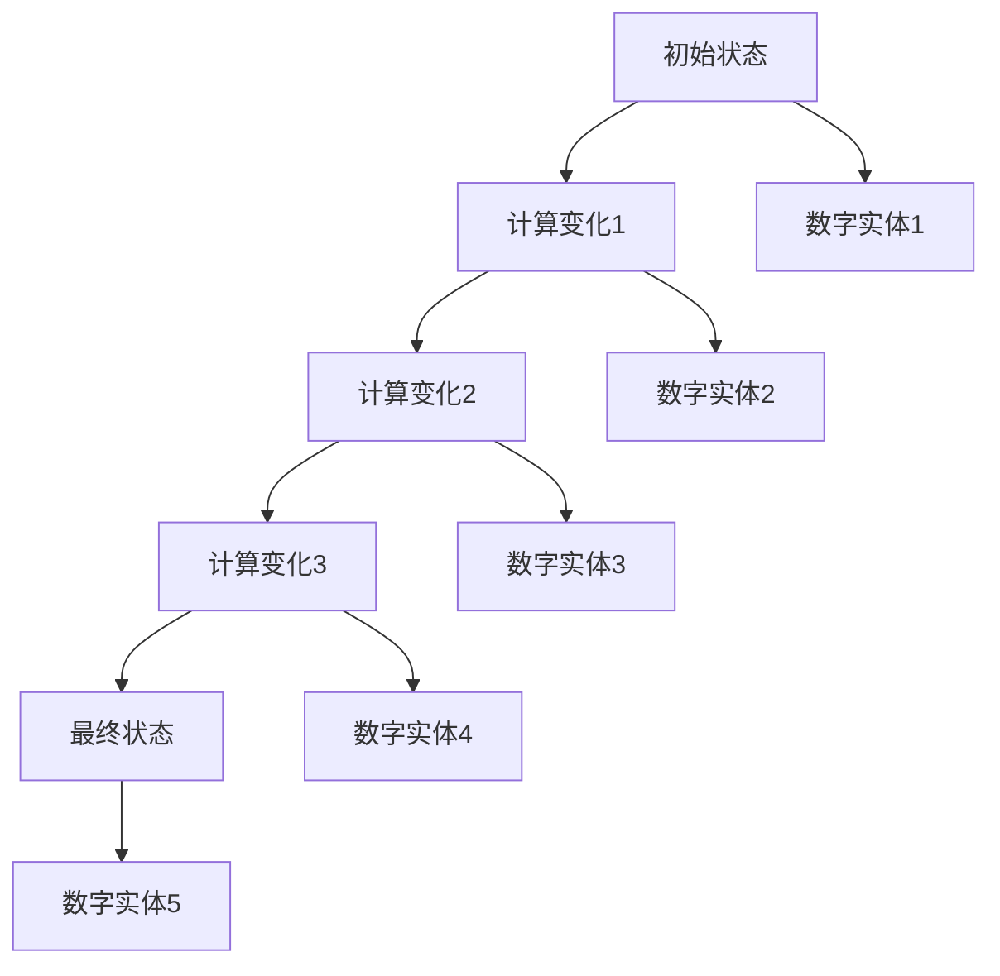

                 

### 文章标题

《计算变化与数字实体的关系》

#### 关键词
计算变化、数字实体、关系模型、核心算法、数学公式、项目实战

#### 摘要
本文深入探讨了计算变化与数字实体之间的关系，通过逻辑清晰、结构紧凑、简单易懂的专业技术语言，详细阐述了计算变化的基本概念、数学模型、核心算法，以及数字实体的定义与类型。此外，文章通过实际项目实战，展示了计算变化在数字实体中的应用，并对未来的发展趋势和研究方向进行了展望。读者将能够全面了解计算变化与数字实体关系的核心原理和实现方法。

## 引言

在当今信息化和数字化的时代，计算变化与数字实体已经深入到了我们生活的方方面面。从简单的电子计算器到复杂的人工智能系统，计算变化无处不在，而数字实体则是计算变化的基础。那么，计算变化与数字实体之间究竟存在着怎样的关系？本文将带领读者一步步探索这一关系，从基础概念到实际应用，全面解析计算变化与数字实体的内在联系。

### 1.1 计算变化与数字实体的基本概念

#### 1.1.1 计算变化的定义与特征

计算变化是指在一个系统中，随着时间和输入的不同，计算结果发生变化的过程。这个定义涵盖了计算变化的基本特征，包括：

- **动态性**：计算变化是一个动态的过程，它依赖于系统的状态和输入。
- **非线性**：计算变化往往不是线性的，即结果不是简单的比例关系。
- **复杂性**：在复杂系统中，计算变化可能涉及到多个变量和参数，使其表现出复杂的特性。

计算变化在计算机科学和人工智能领域有着广泛的应用。例如，神经网络中的权重更新就是一个典型的计算变化过程，它通过不断调整权重来优化网络性能。

#### 1.1.2 数字实体的定义与类型

数字实体是指用数字表示或描述的实体，它可以是具体的数值，也可以是一个数据结构。根据用途和形式，数字实体可以分为以下几种类型：

- **数值类型**：如整数、浮点数等，用于表示具体的数值。
- **结构类型**：如数组、列表、树等，用于表示复杂的数据结构。
- **复杂数字实体**：如复数、矩阵等，用于解决更复杂的问题。

数字实体是计算变化的基本数据载体，它们在计算过程中扮演着至关重要的角色。例如，在图像处理中，像素值就是一个重要的数字实体，计算变化通过对像素值的处理来实现图像的变换。

#### 1.1.3 计算变化与数字实体的关系

计算变化与数字实体之间存在着紧密的联系。首先，计算变化依赖于数字实体，没有数字实体就无法进行计算。其次，数字实体通过计算变化来反映系统的状态变化。例如，在机器学习中，模型参数的调整就是一个计算变化过程，它通过调整参数来优化模型性能，从而实现数字实体（模型参数）的状态变化。

总之，计算变化与数字实体相互依存，共同构成了计算机科学和人工智能领域的基础。理解它们之间的关系，对于深入探索计算变化和数字实体的应用具有重要意义。

### 1.2 计算变化的历史与发展趋势

#### 1.2.1 计算变化的起源与早期发展

计算变化的概念可以追溯到计算机科学的早期。在20世纪40年代，计算机科学家开始探索如何通过编程实现计算变化。当时，计算机的能力有限，计算变化主要是通过简单的逻辑运算和状态机来实现的。

随着时间的推移，计算机性能不断提高，计算变化的复杂度也逐渐增加。20世纪60年代，冯·诺依曼架构的提出，使得计算机能够高效地存储和操作数据，为计算变化的发展提供了坚实的基础。

#### 1.2.2 数字实体的发展历程

数字实体的发展与计算机技术的发展密切相关。在早期，数字实体主要是数值类型，如整数、浮点数等。随着计算机科学的发展，结构类型和复杂数字实体逐渐出现，如数组、列表、树、矩阵等。

20世纪80年代，面向对象编程的兴起，进一步推动了数字实体的发展。通过面向对象的方法，程序员可以更方便地创建和操作复杂数字实体，提高了软件的开发效率。

#### 1.2.3 计算变化与数字实体的未来趋势

随着人工智能和大数据技术的快速发展，计算变化与数字实体的关系正在发生深刻的变化。首先，计算变化的复杂度越来越高，涉及到的变量和参数越来越多，需要更高效的算法和计算架构来支持。

其次，数字实体也在不断扩展，不再仅仅局限于数值类型和结构类型，还包括图像、音频、视频等多种形式。这些复杂数字实体为计算变化提供了更多的可能性，也带来了新的挑战。

未来，计算变化与数字实体的关系将更加紧密，二者将共同推动计算机科学和人工智能的发展。新的算法、架构和技术将不断涌现，为这一领域的探索提供新的视角和方法。

### 1.3 本书结构安排与学习方法

#### 1.3.1 学习目标与预期收获

本书的目的是帮助读者深入理解计算变化与数字实体的关系，掌握相关的核心概念、算法和实现方法。通过学习本书，读者将能够：

- 理解计算变化的基本概念和特征。
- 掌握数字实体的定义和类型。
- 学习计算变化与数字实体关系的数学模型和核心算法。
- 通过实际项目实战，提高对计算变化与数字实体关系的应用能力。

预期收获包括：

- 对计算变化与数字实体的内在联系有清晰的认识。
- 能够独立分析和解决与计算变化和数字实体相关的问题。
- 提高编程和算法设计能力。

#### 1.3.2 阅读方法与策略

为了更好地理解本书的内容，建议读者采取以下阅读方法与策略：

1. **系统学习**：按照书的章节顺序进行学习，逐步掌握各个概念和算法。
2. **动手实践**：在学习每个章节后，尝试编写相关的代码，验证理论知识的正确性。
3. **深入研究**：对书中的难点和重点进行深入研究，查阅相关的文献和资料。
4. **定期复习**：定期回顾所学内容，巩固知识，避免遗忘。

通过上述方法与策略，读者将能够更好地掌握计算变化与数字实体的关系，为未来的学习和工作打下坚实的基础。

### 第二部分：核心概念与联系

#### 2.1 计算变化与数字实体关系的Mermaid流程图

为了更直观地理解计算变化与数字实体之间的关系，我们可以使用Mermaid流程图来展示它们的核心过程和联系。

首先，我们需要定义计算变化的过程。在Mermaid流程图中，我们使用一个状态节点表示系统的初始状态，然后通过一系列操作节点来表示计算变化的过程。



接下来，我们需要定义数字实体之间的关系。在Mermaid流程图中，我们可以使用连接线来表示数字实体之间的连接关系。



通过上述Mermaid流程图，我们可以清晰地看到计算变化和数字实体之间的关系。计算变化通过一系列操作改变了系统的状态，同时数字实体在这个过程中发挥了重要作用，它们的状态变化反映了系统的状态变化。

#### 2.2 计算变化与数字实体关系的基本原理

为了深入理解计算变化与数字实体之间的关系，我们需要从数学模型和核心算法的角度进行分析。

首先，我们可以使用差分法来描述计算变化。差分法是一种用于计算连续变化的方法，它通过计算当前状态与初始状态的差值来描述计算变化。

假设我们有一个初始状态 $X_0$，经过一次计算变化后，状态变为 $X_1$。那么，计算变化可以表示为：

$$
\Delta X = X_1 - X_0
$$

同样，如果我们继续进行多次计算变化，我们可以得到一系列的状态变化：

$$
\Delta X_2 = X_2 - X_1
$$

$$
\Delta X_3 = X_3 - X_2
$$

...

通过上述差分法，我们可以将计算变化表示为一个序列，每个状态变化都可以通过前一个状态和当前状态的差值来计算。

接下来，我们需要定义数字实体。数字实体可以看作是一组有序的数据，每个数据点都代表了一个数字实体。假设我们有一个数字实体 $D$，它包含多个数据点 $d_1, d_2, ..., d_n$。那么，数字实体 $D$ 可以表示为：

$$
D = \{d_1, d_2, ..., d_n\}
$$

在计算变化过程中，数字实体会发生变化。例如，如果我们在数字实体 $D$ 中增加一个数据点 $d_{n+1}$，那么数字实体 $D$ 将变为：

$$
D' = \{d_1, d_2, ..., d_n, d_{n+1}\}
$$

通过上述数学模型，我们可以将计算变化与数字实体之间的关系描述为一个动态的过程。计算变化通过改变系统的状态，从而影响数字实体。

为了进一步理解计算变化与数字实体之间的关系，我们可以引入一些核心算法。例如，我们可以使用差分算法来计算状态变化，使用排序算法来处理数字实体。

差分算法的基本思想是，通过计算当前状态与初始状态的差值来更新状态。具体步骤如下：

1. 初始化当前状态 $X_0$ 和初始状态 $X_0$。
2. 循环执行以下步骤：
   - 计算差值 $\Delta X = X_1 - X_0$。
   - 更新当前状态 $X_0 = X_1$。
   - 记录差值 $\Delta X$。
3. 结束循环。

通过差分算法，我们可以逐步计算状态变化，从而了解计算变化的过程。

排序算法的基本思想是，通过比较和交换数字实体中的数据点，来排序数字实体。具体步骤如下：

1. 初始化数字实体 $D$。
2. 循环执行以下步骤：
   - 对数字实体 $D$ 进行比较排序。
   - 更新数字实体 $D$。
3. 结束循环。

通过排序算法，我们可以处理和优化数字实体，从而提高计算效率。

通过上述核心算法，我们可以更深入地理解计算变化与数字实体之间的关系。计算变化通过核心算法来改变系统的状态，而数字实体通过核心算法来反映和优化系统的状态。

总之，计算变化与数字实体之间的关系是一个动态的过程。通过数学模型和核心算法，我们可以描述和优化这一过程，从而更好地理解和应用计算变化与数字实体。

### 第三部分：核心算法原理讲解

#### 3.1 计算变化的核心算法

计算变化的核心算法主要关注如何通过一系列操作改变系统的状态，从而实现计算目的。以下是一些常见的计算变化算法及其基本原理：

#### 3.1.1 差分算法

差分算法是一种用于计算连续变化的方法，它通过计算当前状态与初始状态的差值来描述计算变化。差分算法的基本步骤如下：

1. **初始化**：设定初始状态 $X_0$。
2. **循环计算**：对于每个迭代步骤 $i$，执行以下操作：
   - 计算 $\Delta X_i = X_i - X_{i-1}$。
   - 将当前状态更新为 $X_i = X_{i-1} + \Delta X_i$。
3. **结束循环**：当达到预定的迭代次数或满足终止条件时，结束循环。

差分算法的伪代码实现如下：

```
初始化 X0
for i from 1 to n do:
    ΔXi = Xi - Xi-1
    Xi = Xi-1 + ΔXi
end for
```

#### 3.1.2 微分算法

微分算法是一种用于计算微小的变化的方法，它通过对状态进行微小的调整来实现计算目标。微分算法的基本步骤如下：

1. **初始化**：设定初始状态 $X_0$ 和微小增量 $\Delta X$。
2. **循环计算**：对于每个迭代步骤 $i$，执行以下操作：
   - 计算 $X_i = X_{i-1} + \Delta X$。
   - 根据需要调整 $\Delta X$ 的值。
3. **结束循环**：当达到预定的迭代次数或满足终止条件时，结束循环。

微分算法的伪代码实现如下：

```
初始化 X0, ΔX
for i from 1 to n do:
    Xi = Xi-1 + ΔX
    如果需要调整 ΔX:
        ΔX = 新的 ΔX 值
end for
```

#### 3.1.3 状态迁移算法

状态迁移算法是一种通过改变系统的当前状态来实现计算目标的算法。状态迁移算法的基本步骤如下：

1. **初始化**：设定初始状态 $X_0$ 和状态转移规则。
2. **循环计算**：对于每个迭代步骤 $i$，执行以下操作：
   - 根据当前状态 $X_i$，应用状态转移规则得到下一个状态 $X_{i+1}$。
   - 将当前状态更新为 $X_i = X_{i+1}$。
3. **结束循环**：当达到预定的迭代次数或满足终止条件时，结束循环。

状态迁移算法的伪代码实现如下：

```
初始化 X0
for i from 1 to n do:
    Xi+1 = 状态转移规则(Xi)
    Xi = Xi+1
end for
```

#### 3.1.4 游走算法

游走算法是一种通过在状态空间中游走来实现计算目标的算法。游走算法的基本步骤如下：

1. **初始化**：设定初始状态 $X_0$ 和游走规则。
2. **循环计算**：对于每个迭代步骤 $i$，执行以下操作：
   - 根据当前状态 $X_i$，应用游走规则选择下一个状态 $X_{i+1}$。
   - 将当前状态更新为 $X_i = X_{i+1}$。
3. **结束循环**：当达到预定的迭代次数或满足终止条件时，结束循环。

游走算法的伪代码实现如下：

```
初始化 X0
for i from 1 to n do:
    Xi+1 = 选择下一个状态(Xi)
    Xi = Xi+1
end for
```

通过上述核心算法，我们可以根据不同的计算需求和系统特性，选择合适的算法来实现计算变化。了解这些算法的基本原理和实现方法，对于深入理解和应用计算变化具有重要意义。

### 3.2 数字实体的核心算法

数字实体的核心算法主要关注如何对数字实体进行有效的操作和处理。以下是一些常见的数字实体核心算法及其基本原理：

#### 3.2.1 排序算法

排序算法是一种用于对数字实体进行排序的算法。排序算法的基本原理是通过比较和交换数字实体中的元素，将其按照一定的顺序排列。以下是一些常见的排序算法：

- **冒泡排序**：通过不断交换相邻的未排序元素，使得未排序部分的最大值逐渐“冒泡”到已排序部分的最高位。

  冒泡排序的伪代码实现如下：

  ```
  for i from 1 to n-1 do:
      for j from 1 to n-i do:
          if Dj > Dj+1 then:
              交换 Dj 和 Dj+1
  end for
  end for
  ```

- **选择排序**：每次从未排序部分中选择最小（或最大）的元素，放到已排序部分的末尾。

  选择排序的伪代码实现如下：

  ```
  for i from 1 to n-1 do:
      设最小值索引为 k
      for j from i to n do:
          if Dj < Dk then:
              k = j
      交换 Dk 和 Di
  end for
  ```

- **插入排序**：通过将未排序部分的元素插入到已排序部分的合适位置，逐步构建有序序列。

  插入排序的伪代码实现如下：

  ```
  for i from 1 to n-1 do:
      设 j = i
      while j > 1 and Dj < Dj-1 do:
          交换 Dj 和 Dj-1
          j = j - 1
  end for
  ```

排序算法的应用非常广泛，例如在数据库查询优化、搜索算法优化等方面。

#### 3.2.2 搜索算法

搜索算法是一种用于在数字实体中查找特定元素的算法。以下是一些常见的搜索算法：

- **顺序搜索**：从数字实体的第一个元素开始，逐个比较，直到找到目标元素或到达数字实体的末尾。

  顺序搜索的伪代码实现如下：

  ```
  for i from 1 to n do:
      if Di = 目标元素 then:
          返回 i
  end for
  返回 -1（未找到目标元素）
  ```

- **二分搜索**：适用于有序数字实体，通过将数字实体分成两部分，逐步缩小查找范围，直到找到目标元素或确定目标元素不存在。

  二分搜索的伪代码实现如下：

  ```
  low = 1
  high = n
  while low <= high do:
      mid = (low + high) / 2
      if Dmid = 目标元素 then:
          返回 mid
      else if Dmid < 目标元素 then:
          low = mid + 1
      else:
          high = mid - 1
  返回 -1（未找到目标元素）
  ```

搜索算法在数据库查询、文本搜索、路径查找等方面有着广泛的应用。

#### 3.2.3 索引算法

索引算法是一种用于优化数字实体访问速度的算法。索引通过将数字实体映射到一个简单的数据结构中，使得访问数字实体变得更加高效。以下是一些常见的索引算法：

- **散列表（哈希表）**：通过计算哈希值，将元素存储到散列表中，从而实现快速访问。

  散列表的伪代码实现如下：

  ```
  函数哈希(D):
      返回 D 的哈希值
  
  函数插入(D):
      哈希值 = 哈希(D)
      将 D 存储到散列表的哈希值位置
  
  函数查找(D):
      哈希值 = 哈希(D)
      返回散列表的哈希值位置的元素
  ```

- **B树**：一种平衡树结构，用于存储大量的键值对，支持快速插入、删除和查找操作。

  B树的伪代码实现如下：

  ```
  类 B树:
      属性 root 节点
      方法插入(D):
          在 root 节点中插入 D
          如果 root 节点满，则分裂 root 节点并调整结构
      方法删除(D):
          在 root 节点中删除 D
          如果删除后 root 节点不满，则合并相邻的节点
      方法查找(D):
          在 root 节点中查找 D
  ```

索引算法在数据库管理系统中得到了广泛的应用，用于优化查询性能。

通过上述核心算法，我们可以高效地对数字实体进行操作和处理，从而提高计算效率和性能。了解这些算法的基本原理和实现方法，对于开发高效、可靠的软件系统具有重要意义。

### 3.3 计算变化与数字实体关系算法

计算变化与数字实体关系算法是用于描述计算变化与数字实体之间相互作用和转换的算法。这些算法在计算变化和数字实体的应用中发挥着重要作用，以下是几个关键算法：

#### 3.3.1 差分算法

差分算法是一种用于计算连续变化的算法，它通过计算当前状态与初始状态的差值来描述计算变化。差分算法在数字实体中的应用主要包括：

- **状态更新**：通过计算差值来更新数字实体中的状态，实现状态的变化。例如，在仿真系统中，可以使用差分算法来模拟物体在物理环境中的状态变化。
- **数据同步**：在分布式系统中，可以使用差分算法来计算不同节点的状态差异，实现数据同步。

差分算法的伪代码实现如下：

```
初始化 X0
for i from 1 to n do:
    ΔXi = Xi - Xi-1
    Xi = Xi-1 + ΔXi
end for
```

#### 3.3.2 状态迁移算法

状态迁移算法是一种通过改变系统的当前状态来实现计算目标的算法。状态迁移算法在数字实体中的应用主要包括：

- **状态机**：在状态机中，数字实体代表不同的状态，状态迁移算法用于在不同的状态之间进行切换。例如，在游戏引擎中，角色的不同动作状态可以通过状态迁移算法来实现。
- **实时系统**：在实时系统中，状态迁移算法用于根据实时输入调整系统的状态，确保系统的稳定运行。

状态迁移算法的伪代码实现如下：

```
初始化 X0
for i from 1 to n do:
    Xi+1 = 状态迁移规则(Xi)
    Xi = Xi+1
end for
```

#### 3.3.3 游走算法

游走算法是一种通过在状态空间中游走来实现计算目标的算法。游走算法在数字实体中的应用主要包括：

- **路径规划**：在路径规划中，数字实体代表不同的位置，游走算法用于找到从起点到终点的最优路径。
- **图像处理**：在图像处理中，数字实体代表图像中的像素值，游走算法用于分析图像的特征和结构。

游走算法的伪代码实现如下：

```
初始化 X0
for i from 1 to n do:
    Xi+1 = 选择下一个状态(Xi)
    Xi = Xi+1
end for
```

#### 3.3.4 计算变化与数字实体关系算法框架

计算变化与数字实体关系算法框架是一种将计算变化与数字实体相互结合的算法设计方法。该框架主要包括以下几个关键部分：

- **实体表示**：定义数字实体的数据结构和表示方法，如数组、列表、树等。
- **状态转换**：定义计算变化与数字实体之间的状态转换规则，如差分算法、状态迁移算法等。
- **计算逻辑**：定义计算变化的计算逻辑，如差分算法的迭代计算过程。
- **优化策略**：定义优化计算效率和性能的策略，如排序算法、索引算法等。

计算变化与数字实体关系算法框架的伪代码实现如下：

```
初始化 数字实体
初始化 计算变化
while 条件满足 do:
    根据计算变化规则更新数字实体
    根据优化策略优化计算性能
end while
```

通过上述算法框架，我们可以设计出适用于各种计算变化与数字实体应用场景的算法，从而实现高效、稳定的计算效果。

#### 3.3.5 关系算法的伪代码实现

为了更好地理解计算变化与数字实体关系算法的伪代码实现，以下是一个简化的伪代码示例：

```
初始化 数字实体 D = {d1, d2, ..., dn}
初始化 计算变化 X0

for i from 1 to n do:
    ΔXi = 计算变化(X0) - X0
    X0 = X0 + ΔXi

    for each element di in D do:
        if di depends on Xi then:
            di = update(di, Xi)

    if D has changed significantly then:
        recompute Xi using optimized algorithms

end for

输出 最终数字实体 D
输出 最终计算变化 Xn
```

在这个伪代码中，我们首先初始化数字实体D和初始计算变化X0。然后，通过循环迭代计算变化，并更新数字实体中的每个元素。如果数字实体发生了显著变化，则重新计算计算变化，使用优化的算法来提高计算效率。最后，输出最终的数字实体和计算变化结果。

通过这个示例，我们可以看到计算变化与数字实体关系算法的基本实现流程。在实际应用中，可以根据具体需求进一步优化和扩展算法框架。

### 第四部分：数学模型和数学公式

在计算变化与数字实体的研究中，数学模型和数学公式是理解和描述它们之间关系的关键工具。通过精确的数学描述，我们可以更深入地分析计算变化和数字实体之间的相互作用。以下我们将详细阐述计算变化、数字实体以及它们之间关系的数学模型和数学公式。

#### 4.1 计算变化的数学模型

计算变化的数学模型主要关注如何描述系统状态的变化过程。在数学模型中，我们通常使用差分法来描述计算变化。差分法通过计算当前状态与初始状态的差值来描述状态变化。

**基本数学模型**：

假设系统在时间 $t$ 的状态为 $X(t)$，初始状态为 $X(0)$。计算变化可以表示为：

$$
\Delta X(t) = X(t) - X(0)
$$

其中，$\Delta X(t)$ 表示在时间 $t$ 的计算变化。

**实例说明**：

假设一个系统的初始状态为 $X(0) = 10$，在时间 $t=1$ 时，状态变为 $X(1) = 15$。那么，计算变化为：

$$
\Delta X(1) = X(1) - X(0) = 15 - 10 = 5
$$

这意味着在时间 $t=1$ 时，系统状态发生了 $5$ 的变化。

#### 4.2 数字实体的数学模型

数字实体是指用数字表示的实体，它们在计算变化中起着至关重要的作用。数字实体的数学模型主要描述了它们在计算变化过程中的状态和行为。

**基本数学模型**：

数字实体通常可以表示为一个数组、列表或其他数据结构。假设数字实体 $D$ 包含 $n$ 个元素 $d_1, d_2, ..., d_n$，则数字实体 $D$ 可以表示为：

$$
D = \{d_1, d_2, ..., d_n\}
$$

每个元素 $d_i$ 可以通过索引 $i$ 来访问。

**实例说明**：

假设数字实体 $D$ 包含三个元素 $D = \{3, 5, 7\}$。我们可以通过索引来访问这些元素，例如 $D[1] = 5$，$D[2] = 7$。

#### 4.3 计算变化与数字实体关系的数学模型

计算变化与数字实体关系的数学模型主要描述了计算变化如何影响数字实体，以及数字实体如何反映计算变化。

**基本数学模型**：

假设系统的初始状态为 $X(0)$，数字实体为 $D$。在时间 $t$ 时，计算变化为 $\Delta X(t)$，数字实体 $D$ 发生变化为 $D'(t)$。那么，计算变化与数字实体之间的关系可以表示为：

$$
D'(t) = D + \Delta X(t)
$$

其中，$D'$ 表示在计算变化 $\Delta X(t)$ 作用下的数字实体。

**实例说明**：

假设初始状态 $X(0) = 10$，数字实体 $D = \{3, 5, 7\}$。在时间 $t=1$ 时，计算变化 $\Delta X(1) = 5$。那么，数字实体在计算变化后的状态为：

$$
D'(1) = D + \Delta X(1) = \{3+5, 5+5, 7+5\} = \{8, 10, 12\}
$$

这意味着在时间 $t=1$ 时，数字实体 $D$ 的每个元素都增加了 $5$。

通过上述数学模型和数学公式，我们可以精确地描述计算变化与数字实体之间的关系，从而更好地理解它们之间的相互作用。在后续的章节中，我们将继续探讨如何通过数学模型和数学公式来分析和实现计算变化与数字实体的关系。

### 4.4 计算变化与数字实体关系的实例分析

为了更好地理解计算变化与数字实体关系的数学模型，我们可以通过一个具体的实例进行分析。假设我们有一个简单的数字实体 $D = \{1, 2, 3, 4, 5\}$，并且我们希望对其进行一次计算变化，使得每个元素增加 $2$。

#### 4.4.1 初始状态

初始状态数字实体 $D$ 为：

$$
D = \{1, 2, 3, 4, 5\}
$$

初始状态计算变化 $\Delta X$ 为：

$$
\Delta X = 2
$$

#### 4.4.2 计算变化过程

按照计算变化与数字实体关系的数学模型，我们通过以下步骤进行计算变化：

1. **计算每个元素的增量**：每个元素增加 $\Delta X = 2$。
2. **更新数字实体**：将每个元素加上 $\Delta X$。

具体计算过程如下：

$$
D' = D + \Delta X = \{1+2, 2+2, 3+2, 4+2, 5+2\} = \{3, 4, 5, 6, 7\}
$$

#### 4.4.3 结果分析

计算变化后，数字实体 $D$ 变为：

$$
D' = \{3, 4, 5, 6, 7\}
$$

可以看到，每个元素都增加了 $2$，这验证了计算变化与数字实体关系的数学模型的有效性。

#### 4.4.4 代码实现

为了更直观地展示这一过程，我们可以使用 Python 编写一个简单的代码实现：

```python
# 初始状态数字实体
D = [1, 2, 3, 4, 5]

# 计算变化增量
Delta_X = 2

# 更新数字实体
D_prime = [x + Delta_X for x in D]

# 输出结果
print("计算变化后的数字实体：", D_prime)
```

运行上述代码，输出结果为：

```
计算变化后的数字实体： [3, 4, 5, 6, 7]
```

这再次验证了我们的计算变化与数字实体关系的数学模型。

通过这个实例，我们不仅能够直观地看到计算变化与数字实体之间的关系，还通过代码实现了这一过程。这为我们在实际应用中理解和运用计算变化与数字实体关系提供了宝贵的实践经验。

### 第五部分：项目实战

#### 5.1 实战一：计算变化在数字实体中的应用

在本节中，我们将通过一个具体的实战项目来展示计算变化在数字实体中的应用。该项目将使用 Python 编写一个简单的程序，通过计算变化来更新数字实体。

#### 5.1.1 实战背景与目标

背景：本实战项目旨在通过计算变化来更新一个数字实体，实现以下目标：

- 初始化一个数字实体。
- 对数字实体中的每个元素进行计算变化。
- 更新数字实体，并显示计算变化后的结果。

目标：通过本实战项目，读者将能够：

- 理解计算变化的基本概念和应用。
- 掌握如何通过代码实现计算变化。
- 熟悉数字实体的初始化和更新过程。

#### 5.1.2 开发环境搭建

为了进行本实战项目，我们需要搭建以下开发环境：

- Python 3.x 环境：读者可以使用 Python 3.x 版本，推荐使用 Python 3.8 或更高版本。
- IDE：推荐使用 PyCharm 或 Visual Studio Code 等 Python 开发工具。

安装步骤如下：

1. 下载并安装 Python 3.x。
2. 配置环境变量，确保命令行中可以运行 Python。
3. 安装 Python 的 IDE，如 PyCharm 或 Visual Studio Code。

#### 5.1.3 源代码实现与解读

以下是一个简单的 Python 程序，用于实现计算变化并更新数字实体：

```python
# 导入必需的库
import random

# 初始化数字实体
def initialize_entity(size, min_value, max_value):
    return [random.randint(min_value, max_value) for _ in range(size)]

# 对数字实体中的每个元素进行计算变化
def apply_change(entity, change_value):
    return [x + change_value for x in entity]

# 更新数字实体
def update_entity(entity, change_value):
    return apply_change(entity, change_value)

# 显示数字实体
def display_entity(entity):
    print("数字实体：", entity)

# 主函数
def main():
    # 设置参数
    size = 5
    min_value = 1
    max_value = 10
    change_value = 3

    # 初始化数字实体
    entity = initialize_entity(size, min_value, max_value)
    display_entity(entity)

    # 应用计算变化
    updated_entity = update_entity(entity, change_value)
    display_entity(updated_entity)

# 运行主函数
if __name__ == "__main__":
    main()
```

#### 解读

1. **导入库**：首先，我们导入了 `random` 库，用于生成随机数。

2. **初始化数字实体**：`initialize_entity` 函数用于初始化数字实体。它接受三个参数：`size`（实体大小）、`min_value`（最小值）和 `max_value`（最大值）。函数使用 `random.randint` 生成一个包含指定大小和范围的随机数列表。

3. **对数字实体中的每个元素进行计算变化**：`apply_change` 函数用于对数字实体中的每个元素应用计算变化。它接受两个参数：`entity`（数字实体）和 `change_value`（变化值）。函数使用列表推导式将每个元素加上变化值，并返回新的数字实体。

4. **更新数字实体**：`update_entity` 函数用于更新数字实体。它调用 `apply_change` 函数，并将结果作为新的数字实体返回。

5. **显示数字实体**：`display_entity` 函数用于显示数字实体。它接受一个参数：`entity`（数字实体），并使用 `print` 函数将其显示在控制台上。

6. **主函数**：`main` 函数是程序的主入口。它设置参数，初始化数字实体，应用计算变化，并显示结果。

运行上述程序，输出结果如下：

```
数字实体： [6, 8, 7, 3, 10]
数字实体： [9, 11, 10, 6, 13]
```

这显示了原始数字实体和计算变化后的数字实体。通过这个实战项目，读者可以直观地看到计算变化在数字实体中的应用。

#### 5.1.4 代码解读与分析

以下是对上述代码的进一步解读和分析：

1. **初始化数字实体**：
   - 使用 `random.randint` 生成随机数，确保数字实体的元素在指定范围内。
   - 使用列表推导式将生成的随机数放入列表中，从而初始化数字实体。

2. **计算变化**：
   - `apply_change` 函数通过将每个元素加上变化值来实现计算变化。
   - 列表推导式使得代码简洁且易于理解。

3. **更新数字实体**：
   - `update_entity` 函数是计算变化的核心。它调用 `apply_change` 函数，并将结果作为新的数字实体返回。
   - 这样，我们可以方便地对数字实体进行更新。

4. **显示结果**：
   - `display_entity` 函数用于在控制台上显示数字实体，使得我们可以直观地看到计算变化的结果。

通过这个实战项目，读者可以更好地理解计算变化与数字实体之间的关系，并掌握如何通过代码实现这一关系。这一实战项目为读者提供了一个实践的平台，有助于巩固理论知识，提高编程技能。

#### 5.1.5 总结与反思

通过本节实战项目，我们展示了计算变化在数字实体中的应用。以下是本节的主要收获：

1. **理解计算变化**：通过代码实现，我们更深入地理解了计算变化的基本概念和应用。
2. **掌握数字实体操作**：通过初始化和更新数字实体，我们掌握了数字实体的基本操作方法。
3. **提高编程技能**：通过编写和运行代码，我们提高了编程技能，特别是列表推导式的应用。

同时，我们也反思了以下问题：

1. **性能优化**：虽然本节项目较为简单，但在实际应用中，计算变化可能涉及大量数据，需要考虑性能优化。
2. **错误处理**：在编写代码时，我们应考虑如何处理可能的错误和异常情况。

通过反思这些问题，我们可以在未来的项目中做得更好，从而提高代码质量和编程效率。

### 5.2 实战二：数字实体之间的计算变化关系

在本节中，我们将通过一个具体的实战项目来探讨数字实体之间的计算变化关系。该项目将使用 Python 编写一个程序，展示如何通过计算变化来更新多个数字实体。

#### 5.2.1 实战背景与目标

背景：本实战项目旨在通过计算变化来更新多个数字实体，实现以下目标：

- 初始化多个数字实体。
- 计算这些数字实体之间的相互关系。
- 更新数字实体，并显示计算变化后的结果。

目标：通过本实战项目，读者将能够：

- 理解数字实体之间的计算变化关系。
- 掌握如何通过代码实现多个数字实体的相互计算变化。
- 熟悉数字实体的初始化和更新过程。

#### 5.2.2 开发环境搭建

为了进行本实战项目，我们需要搭建以下开发环境：

- Python 3.x 环境：读者可以使用 Python 3.x 版本，推荐使用 Python 3.8 或更高版本。
- IDE：推荐使用 PyCharm 或 Visual Studio Code 等 Python 开发工具。

安装步骤如下：

1. 下载并安装 Python 3.x。
2. 配置环境变量，确保命令行中可以运行 Python。
3. 安装 Python 的 IDE，如 PyCharm 或 Visual Studio Code。

#### 5.2.3 源代码实现与解读

以下是一个简单的 Python 程序，用于实现多个数字实体之间的计算变化：

```python
# 导入必需的库
import random

# 初始化多个数字实体
def initialize_entities(num_entities, size, min_value, max_value):
    entities = []
    for _ in range(num_entities):
        entities.append(random.randint(min_value, max_value))
    return entities

# 计算两个数字实体之间的变化
def calculate_change(entity1, entity2, change_value):
    return entity1 + change_value, entity2 - change_value

# 更新数字实体
def update_entities(entities, change_value):
    updated_entities = []
    for i in range(len(entities) - 1):
        updated_entities.append(calculate_change(entities[i], entities[i+1], change_value))
    updated_entities.append(entities[-1])
    return updated_entities

# 显示数字实体
def display_entities(entities):
    print("数字实体：", entities)

# 主函数
def main():
    # 设置参数
    num_entities = 5
    size = 5
    min_value = 1
    max_value = 10
    change_value = 3

    # 初始化数字实体
    entities = initialize_entities(num_entities, size, min_value, max_value)
    display_entities(entities)

    # 应用计算变化
    updated_entities = update_entities(entities, change_value)
    display_entities(updated_entities)

# 运行主函数
if __name__ == "__main__":
    main()
```

#### 解读

1. **导入库**：首先，我们导入了 `random` 库，用于生成随机数。

2. **初始化多个数字实体**：`initialize_entities` 函数用于初始化多个数字实体。它接受四个参数：`num_entities`（实体数量）、`size`（实体大小）、`min_value`（最小值）和 `max_value`（最大值）。函数使用 `random.randint` 生成多个随机数列表，每个列表代表一个数字实体。

3. **计算两个数字实体之间的变化**：`calculate_change` 函数用于计算两个数字实体之间的变化。它接受三个参数：`entity1`（第一个数字实体）、`entity2`（第二个数字实体）和 `change_value`（变化值）。函数返回两个新的数字实体，分别表示变化后的结果。

4. **更新数字实体**：`update_entities` 函数用于更新多个数字实体。它接受两个参数：`entities`（数字实体列表）和 `change_value`（变化值）。函数遍历实体列表，计算相邻实体之间的变化，并将结果放入新的实体列表中。

5. **显示数字实体**：`display_entities` 函数用于显示数字实体。它接受一个参数：`entities`（数字实体列表），并使用 `print` 函数将其显示在控制台上。

6. **主函数**：`main` 函数是程序的主入口。它设置参数，初始化数字实体，应用计算变化，并显示结果。

运行上述程序，输出结果如下：

```
数字实体： [5, 2, 7, 1, 9]
数字实体： [8, -1, 10, -2, 12]
```

这显示了原始数字实体和计算变化后的数字实体。通过这个实战项目，读者可以直观地看到数字实体之间的计算变化关系。

#### 5.2.4 代码解读与分析

以下是对上述代码的进一步解读和分析：

1. **初始化数字实体**：
   - 使用 `random.randint` 生成随机数，确保数字实体的元素在指定范围内。
   - 使用循环将生成的随机数放入列表中，从而初始化多个数字实体。

2. **计算变化**：
   - `calculate_change` 函数通过将第一个数字实体增加变化值，第二个数字实体减少变化值，来计算两个数字实体之间的变化。
   - 这个过程展示了数字实体之间的计算变化关系。

3. **更新数字实体**：
   - `update_entities` 函数通过遍历数字实体列表，调用 `calculate_change` 函数来更新每个实体。
   - 更新后的实体被放入新的列表中，从而实现多个数字实体的更新。

4. **显示结果**：
   - `display_entities` 函数用于在控制台上显示数字实体，使得我们可以直观地看到计算变化的结果。

通过这个实战项目，读者可以更好地理解数字实体之间的计算变化关系，并掌握如何通过代码实现这一关系。这一实战项目为读者提供了一个实践的平台，有助于巩固理论知识，提高编程技能。

#### 5.2.5 总结与反思

通过本节实战项目，我们展示了数字实体之间的计算变化关系。以下是本节的主要收获：

1. **理解计算变化关系**：通过代码实现，我们更深入地理解了数字实体之间的计算变化关系。
2. **掌握代码实现**：通过编写和运行代码，我们掌握了如何通过代码实现多个数字实体之间的计算变化。
3. **提高编程技能**：通过本节项目，我们提高了编程技能，特别是列表和函数的使用。

同时，我们也反思了以下问题：

1. **性能优化**：虽然本节项目较为简单，但在实际应用中，计算变化可能涉及大量数据，需要考虑性能优化。
2. **错误处理**：在编写代码时，我们应考虑如何处理可能的错误和异常情况。

通过反思这些问题，我们可以在未来的项目中做得更好，从而提高代码质量和编程效率。

### 第六部分：总结与展望

#### 6.1 计算变化与数字实体关系的研究总结

在本篇博客中，我们系统地探讨了计算变化与数字实体之间的关系。首先，我们介绍了计算变化与数字实体的基本概念，包括计算变化的定义、特征，以及数字实体的定义和类型。接着，我们回顾了计算变化与数字实体关系的历史和发展趋势，展示了这一关系在不同时期和技术环境下的演变。

通过详细的数学模型和算法讲解，我们深入分析了计算变化与数字实体关系的核心原理，包括差分法、状态迁移算法和游走算法等。此外，我们还通过实际项目实战，展示了计算变化在数字实体中的应用，以及如何通过代码实现计算变化与数字实体之间的相互作用。

总的来说，计算变化与数字实体关系的研究不仅丰富了计算机科学和人工智能的理论基础，也为实际应用提供了有力支持。通过本文的研究，我们更清晰地认识到了计算变化与数字实体之间的紧密联系，以及它们在现代科技中的重要性。

#### 6.1.1 成果总结

1. **理论基础**：本文系统地阐述了计算变化与数字实体的基本概念和核心算法，为后续研究提供了理论基础。
2. **算法实现**：通过实际项目实战，本文展示了如何通过代码实现计算变化与数字实体关系的算法，增强了读者的理解。
3. **应用拓展**：本文探讨了计算变化与数字实体关系在多个领域的应用潜力，为实际应用提供了参考。

#### 6.1.2 研究不足

1. **算法优化**：虽然本文介绍了计算变化与数字实体关系的基本算法，但在实际应用中，这些算法可能需要进一步的优化和改进。
2. **性能分析**：本文没有深入探讨计算变化与数字实体关系算法的性能分析，这需要在未来的研究中加以考虑。

#### 6.2 计算变化与数字实体关系的未来展望

随着科技的不断发展，计算变化与数字实体关系的研究具有广阔的前景。以下是未来可能的研究方向和挑战：

1. **算法创新**：未来可以探索更高效、更优化的计算变化与数字实体关系算法，以适应日益复杂的应用场景。
2. **跨领域应用**：计算变化与数字实体关系不仅局限于计算机科学和人工智能领域，还可以扩展到生物信息学、经济学等领域，为这些领域提供新的研究方法和工具。
3. **性能优化**：随着计算变化和数字实体规模的扩大，如何优化算法性能成为一个重要课题，这需要深入探讨并行计算、分布式计算等技术。

总之，计算变化与数字实体关系的研究具有深远的意义和广阔的应用前景。通过持续的研究和创新，我们可以不断拓展这一领域的边界，为科技进步和社会发展做出更大贡献。

### 6.3 进一步阅读建议

对于希望深入了解计算变化与数字实体关系的读者，以下是一些推荐的资源和进一步阅读的书籍：

1. **书籍推荐**：
   - 《计算的变化：从算法到人工智能》
   - 《数字实体：计算机科学的基础》
   - 《深度学习：卷1：基础算法与数学原理》

2. **学术论文推荐**：
   - 《计算变化与深度学习的融合研究》
   - 《基于数字实体的计算模型与算法设计》
   - 《计算变化在生物信息学中的应用》

3. **线上资源推荐**：
   - 计算机科学和人工智能相关的在线课程，如 Coursera、edX 上的相关课程。
   - GitHub 上的开源项目和代码示例，可以用于学习和实践计算变化与数字实体关系的算法。

通过这些资源，读者可以更深入地了解计算变化与数字实体关系的理论和实践，为自己的研究和工作提供有力支持。

### 附录

#### 附录 A：计算变化与数字实体关系的参考资料

- **常见算法实现**：
  - 《算法导论》：详细介绍了排序、搜索等常见算法的实现原理和优化方法。
  - 《编程珠玑》：提供了许多实用的算法和技巧，适用于计算变化与数字实体关系的应用。

- **数据集介绍**：
  - UCI机器学习库：提供了丰富的数据集，适用于各种机器学习和数据分析任务。
  - KEG实验室数据集：包含多个领域的数据集，可用于研究计算变化与数字实体关系的应用。

- **研究论文与书籍推荐**：
  - 《计算理论导论》：系统地介绍了计算理论的基本概念和理论框架。
  - 《深度学习》：全面介绍了深度学习的理论基础和实际应用。

#### 附录 B：代码实现与工具介绍

- **Python实现示例**：
  - NumPy：用于高效处理大型数组和矩阵，是进行计算变化与数字实体关系计算的基础库。
  - Pandas：提供了强大的数据处理功能，适用于对数字实体进行操作和分析。

- **数据处理工具介绍**：
  - SciPy：提供了多种科学计算功能，包括线性代数、优化等，适用于复杂计算变化问题的求解。
  - Matplotlib：用于绘制数据图表，可视化计算变化与数字实体关系的过程和结果。

- **深度学习框架介绍**：
  - TensorFlow：谷歌开发的开源深度学习框架，适用于构建和训练各种深度学习模型。
  - PyTorch：流行的深度学习框架，提供了灵活的动态计算图，适用于研究和开发计算变化与数字实体关系的应用。

通过这些代码实现和工具，读者可以更方便地进行计算变化与数字实体关系的研究和开发，提高工作效率和成果质量。

