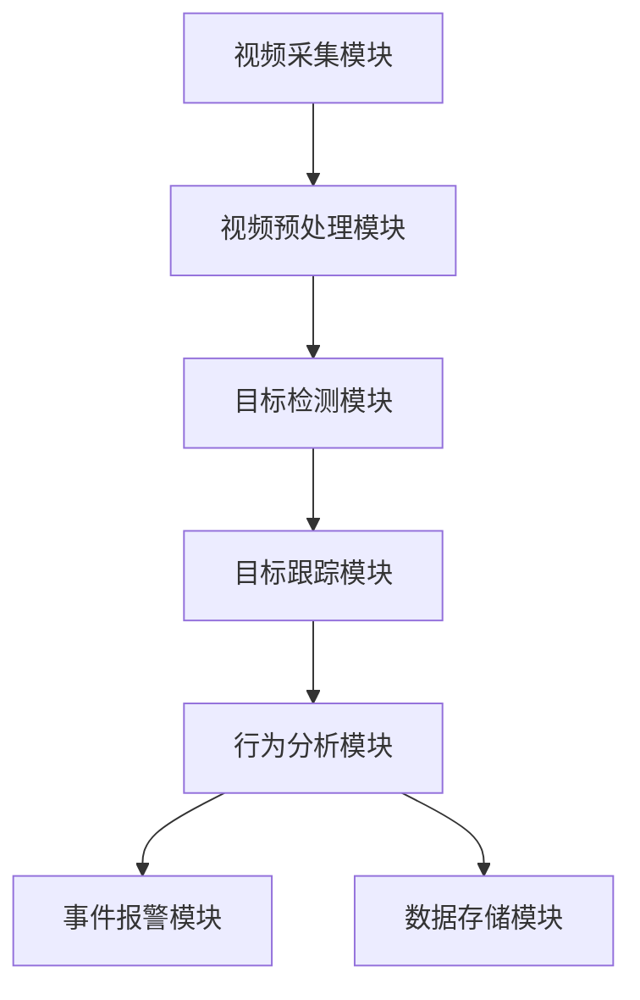
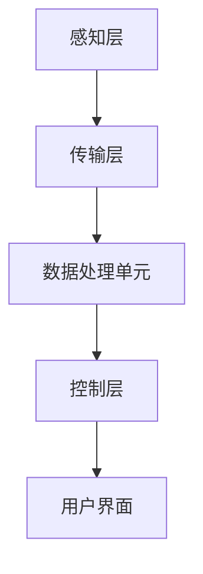

                 

## 第1章：计算机视觉概述

### 1.1 计算机视觉的定义与历史

#### 1.1.1 计算机视觉的定义

计算机视觉（Computer Vision）是人工智能（AI）的一个重要分支，旨在使计算机能够理解和解释数字图像和视频。具体来说，计算机视觉的目标是通过算法和模型，从图像或视频数据中提取信息，进行物体识别、场景理解、目标跟踪等操作，从而实现类似人类视觉的功能。

计算机视觉的定义可以追溯到1950年代，当时计算机科学家Alan Turing提出了图灵测试的概念，试图定义机器智能。在接下来的几十年中，计算机科学家和工程师开始探索如何使计算机具备处理视觉信息的能力。最早的计算机视觉研究主要集中在图像处理和模式识别上，目的是通过算法从图像中提取有用的信息。

#### 1.1.2 计算机视觉的发展历程

计算机视觉的发展历程大致可以分为以下几个阶段：

- **早期阶段（20世纪60年代-70年代）**：这一阶段的研究主要集中在图像处理技术上，如图像滤波、边缘检测和特征提取等。代表性算法有Sobel算子、Canny边缘检测算法等。

- **中期阶段（20世纪80年代-90年代）**：随着计算机硬件性能的提升和算法的改进，计算机视觉开始进入实用阶段。在这一时期，出现了一些成功的应用，如人脸识别、字符识别和图像分类等。代表性的算法包括傅立叶描述符、主成分分析（PCA）和隐马尔可夫模型（HMM）。

- **近期阶段（21世纪以来）**：这一阶段标志着深度学习的崛起，深度学习在计算机视觉中取得了显著的成功。卷积神经网络（CNN）成为计算机视觉的主流模型，广泛应用于图像识别、目标检测、语义分割和视频分析等领域。代表性模型包括AlexNet、VGG、ResNet和YOLO等。

### 1.2 计算机视觉的应用领域

计算机视觉的应用领域非常广泛，几乎涵盖了所有与视觉相关的领域。以下是一些重要的应用领域：

- **图像识别**：图像识别是计算机视觉的基础应用，包括人脸识别、车牌识别、物体分类等。图像识别技术在安防、交通、零售和医疗等领域有广泛的应用。

- **视频分析**：视频分析技术可以从视频流中提取有用的信息，如目标检测、目标跟踪、行为识别等。视频分析在安防监控、自动驾驶、智能家居和体育分析等领域具有重要应用。

- **医学图像处理**：医学图像处理技术用于分析医学影像，如X光、CT、MRI等，用于病变检测、诊断和治疗方案制定。

- **自动驾驶**：自动驾驶技术依赖于计算机视觉来感知和理解周围环境，实现车辆控制、路径规划和障碍物避让等功能。

- **机器人视觉**：机器人视觉使机器人能够通过视觉感知环境，执行复杂的任务，如导航、对象抓取、装配等。

### 1.3 计算机视觉的关键技术

计算机视觉的核心技术包括图像处理、特征提取、模型识别和深度学习等。

#### 1.3.1 图像处理技术

图像处理技术是计算机视觉的基础，用于对图像进行预处理、增强和特征提取。常见的图像处理技术包括：

- **图像滤波**：用于去除图像噪声，提高图像质量。
- **边缘检测**：用于检测图像中的边缘，提取图像特征。
- **特征提取**：将图像转换为更易于分析的形式，如使用SIFT、SURF等算法提取关键特征点。

#### 1.3.2 模型识别技术

模型识别技术用于从图像中识别和分类对象。常见的模型识别技术包括：

- **支持向量机（SVM）**：用于二分类问题，通过最大间隔分类器来实现。
- **神经网络**：包括传统的多层感知机（MLP）和现代的卷积神经网络（CNN）等，用于复杂模式识别。

#### 1.3.3 深度学习在计算机视觉中的应用

深度学习是近年来计算机视觉领域的重要突破，通过多层神经网络自动学习特征表示。深度学习在计算机视觉中的应用包括：

- **卷积神经网络（CNN）**：通过卷积操作自动提取图像特征，广泛应用于图像分类、目标检测和语义分割等任务。
- **循环神经网络（RNN）**：通过序列模型处理图像序列，用于视频分析、行为识别等任务。
- **生成对抗网络（GAN）**：用于图像生成和图像修复等任务。

### 总结

计算机视觉是一门多学科交叉的技术，涉及图像处理、模式识别、机器学习和深度学习等多个领域。随着深度学习技术的不断发展，计算机视觉的应用越来越广泛，未来将在各个领域发挥更大的作用。

---

**核心概念与联系：**

以下是一个Mermaid流程图，展示计算机视觉的各个核心概念和它们之间的联系：

```mermaid
graph TD
    A[计算机视觉] --> B[图像处理]
    A --> C[模式识别]
    A --> D[机器学习]
    A --> E[深度学习]
    B --> F[特征提取]
    B --> G[图像增强]
    C --> H[分类算法]
    C --> I[聚类算法]
    D --> J[监督学习]
    D --> K[无监督学习]
    E --> L[卷积神经网络]
    E --> M[循环神经网络]
    E --> N[生成对抗网络]
    F --> O[边缘检测]
    F --> P[SIFT]
    F --> Q[深度学习特征提取]
    G --> R[滤波]
    G --> S[对比度增强]
    H --> T[SVM]
    H --> U[决策树]
    I --> V[K-means]
    I --> W[层次聚类]
    J --> X[支持向量机]
    J --> Y[神经网络]
    K --> Z[聚类算法]
    K --> AA[降维算法]
    L --> BB[卷积操作]
    L --> CC[池化操作]
    M --> DD[循环结构]
    M --> EE[长短时记忆]
    N --> FF[生成对抗]
    P --> GG[关键点检测]
    Q --> HH[深度特征]
    R --> II[均值滤波]
    R --> JJ[高斯滤波]
    S --> KK[直方图均衡]
    S --> LL[直方图对比度增强]
    T --> MM[间隔最大化]
    T --> NN[核函数选择]
    U --> OO[信息增益]
    U --> PP[基尼系数]
    V --> QQ[迭代计算]
    V --> RR[初始聚类中心]
    W --> SS[距离计算]
    W --> TT[合并与分割]
    X --> UU[支持向量]
    X --> VV[决策边界]
    Y --> WW[隐层神经元]
    Y --> XX[权重调整]
    Z --> YY[聚类中心]
    Z --> ZZ[协变量估计]
    AA --> AA[特征降维]
    BB --> BB[特征映射]
    CC --> CC[特征降维]
    DD --> DD[状态更新]
    EE --> EE[记忆保持]
    FF --> FF[生成对抗]
    GG --> GG[关键点检测]
    HH --> HH[特征提取]
    II --> II[噪声抑制]
    JJ --> JJ[边缘保留]
    KK --> KK[图像增强]
    LL --> LL[图像增强]
    MM --> MM[分类决策]
    NN --> NN[非线性映射]
    OO --> OO[信息选择]
    PP --> PP[不确定性度量]
    QQ --> QQ[聚类质量]
    RR --> RR[初始聚类]
    SS --> SS[相似性度量]
    TT --> TT[聚类调整]
    UU --> UU[分类结果]
    VV --> VV[分割结果]
    WW --> WW[网络训练]
    XX --> XX[权重更新]
    YY --> YY[聚类结果]
    ZZ --> ZZ[数据拟合]
```



---

**核心算法原理讲解：**

以下是对计算机视觉中几个核心算法的原理讲解，使用伪代码详细阐述。

#### 1. 支持向量机（SVM）

SVM是一种用于分类的机器学习算法，通过找到最佳决策边界来最大化分类间隔。

```python
def SVM(X, y, C):
    """
    支持向量机训练函数
    参数：
    X: 输入特征矩阵
    y: 标签向量
    C: 正则化参数
    返回：
    W: 决策边界权重
    b: 决策边界偏置
    """
    # 初始化模型参数
    W = np.random.rand(d)  # d为特征维度
    b = 0

    # 梯度下降迭代
    for epoch in range(num_epochs):
        for x, y in zip(X, y):
            # 计算损失函数
            loss = -y * (np.dot(x, W) + b)

            # 计算梯度
            dW = -y * x
            db = -y

            # 更新模型参数
            W -= learning_rate * dW
            b -= learning_rate * db

    return W, b
```

#### 2. 卷积神经网络（CNN）

CNN是一种用于图像分类和特征提取的神经网络，通过卷积和池化操作自动提取图像特征。

```python
def CNN(X, W, b):
    """
    卷积神经网络前向传播函数
    参数：
    X: 输入特征矩阵
    W: 卷积核权重
    b: 卷积偏置
    返回：
    Z: 输出特征矩阵
    """
    # 初始化输出特征矩阵
    Z = np.zeros_like(X)

    # 卷积操作
    for i in range(X.shape[0]):
        for j in range(X.shape[1]):
            Z[i, j] = np.dot(W, X[i, j]) + b

    return Z
```

#### 3. 深度残差网络（ResNet）

ResNet是一种深层神经网络，通过引入残差连接来避免梯度消失问题。

```python
def ResNet(X, W1, b1, W2, b2):
    """
    残差神经网络前向传播函数
    参数：
    X: 输入特征矩阵
    W1: 卷积核权重1
    b1: 卷积偏置1
    W2: 卷积核权重2
    b2: 卷积偏置2
    返回：
    Z: 输出特征矩阵
    """
    # 第一层卷积操作
    Z1 = CNN(X, W1, b1)

    # 第二层卷积操作
    Z2 = CNN(Z1, W2, b2)

    # 残差连接
    Z = Z2 + Z1

    return Z
```

---

**数学模型和公式 & 详细讲解 & 举例说明：**

计算机视觉中的许多算法都涉及到数学模型和公式。以下是一些常见的数学模型和公式的详细讲解和举例说明。

#### 1. 阈值处理

阈值处理是一种简单的图像增强技术，通过将像素值与某个阈值进行比较，将图像转换为二值图像。

**数学模型：**

$$
f(x) =
\begin{cases}
0, & \text{if } x < \text{threshold} \\
255, & \text{if } x \ge \text{threshold}
\end{cases}
$$

**详细讲解：**

阈值处理的基本思想是将图像的每个像素值与一个给定的阈值进行比较，如果像素值小于阈值，则将其设置为0（黑色），如果像素值大于或等于阈值，则将其设置为255（白色）。这样，图像就可以被转换为二值图像，其中只有黑色和白色两种颜色。

**举例说明：**

假设有一个5x5的图像，像素值如下：

```
0 128 192 64 32
192 128 64 0 128
64 0 255 128 64
128 64 192 0 128
192 128 64 32 0
```

设阈值为90，应用阈值处理后的图像如下：

```
0 0 0 0 0
0 0 0 0 0
0 0 255 0 0
0 0 255 0 0
0 0 0 0 0
```

#### 2. 主成分分析（PCA）

主成分分析是一种降维技术，通过将原始数据投影到新的正交基上，提取最重要的特征，从而降低数据的维度。

**数学模型：**

设X为原始数据矩阵，其协方差矩阵为$\Sigma$，特征向量矩阵为$U$，协方差矩阵的对角矩阵为$\Lambda$。PCA的目标是最小化重构误差，即：

$$
\min_{U, \Lambda} \sum_{i=1}^n \sum_{j=1}^d (x_{ij} - \lambda_i u_{ij})^2
$$

其中，$u_{ij}$为特征向量，$\lambda_i$为特征值。

**详细讲解：**

PCA通过求解协方差矩阵的特征值和特征向量，将数据投影到新的正交基上。新的正交基由特征向量组成，特征值代表了数据在各个特征方向上的方差。通过选择前k个最大的特征值对应的特征向量，我们可以将数据降维到k维。

**举例说明：**

假设有一个2维数据矩阵X：

```
X = [
 [1, 2],
 [2, 3],
 [3, 4],
 [4, 5]
]
```

计算协方差矩阵$\Sigma$：

$$
\Sigma = \frac{1}{n-1} (X - \bar{X})(X - \bar{X})^T
$$

其中，$\bar{X}$为X的均值矩阵。

计算协方差矩阵$\Sigma$：

$$
\Sigma = \frac{1}{3-1} \begin{bmatrix}
0 & 1 \\
1 & 2
\end{bmatrix} \begin{bmatrix}
0 & 1 \\
1 & 2
\end{bmatrix}^T = \frac{1}{2} \begin{bmatrix}
2 & 3 \\
3 & 6
\end{bmatrix}
$$

计算协方差矩阵$\Sigma$的特征值和特征向量：

$$
\lambda_1 = 4, \quad u_1 = \begin{bmatrix}
1 \\
1
\end{bmatrix}
$$

$$
\lambda_2 = 1, \quad u_2 = \begin{bmatrix}
-1 \\
1
\end{bmatrix}
$$

选择前k=1个最大的特征值对应的特征向量，即$u_1$，将数据降维到1维：

$$
X_{\text{reduced}} = \begin{bmatrix}
1 \\
2 \\
3 \\
4
\end{bmatrix} \begin{bmatrix}
1 \\
1
\end{bmatrix}^T = \begin{bmatrix}
2 \\
4 \\
6 \\
8
\end{bmatrix}
```

### 第2章：图像处理基础

#### 2.1 图像处理的基本概念

图像处理是计算机视觉中至关重要的一环，它涉及对图像进行各种操作，以提高图像的质量或提取有用的信息。本节将介绍图像处理的基本概念，包括图像的表示、像素和分辨率等。

##### 2.1.1 图像的表示

图像在计算机中通常以数字形式表示。一个图像可以看作是一个二维数组，其中的每个元素代表一个像素。像素是图像的基本单位，它包含了颜色信息。在彩色图像中，每个像素通常由红、绿、蓝（RGB）三个颜色通道组成，每个通道的取值范围通常为0到255。

##### 2.1.2 像素和分辨率

像素是图像中的最小单位，每个像素都包含一定的信息。像素的数量决定了图像的分辨率。分辨率通常以水平像素数和垂直像素数来表示，例如1920x1080表示水平1920个像素，垂直1080个像素。分辨率越高，图像的细节越丰富，但文件大小也越大。

##### 2.1.3 图像格式

图像的存储格式多种多样，常见的有JPEG、PNG、BMP等。JPEG格式是一种有损压缩格式，适合存储照片类图像，但会损失部分细节。PNG格式是一种无损压缩格式，适合存储具有透明背景的图像，但文件大小较大。BMP格式是一种无损位图格式，通常用于存储原始图像数据。

##### 2.1.4 图像处理的基本操作

图像处理的基本操作包括加载图像、保存图像、显示图像、调整亮度、对比度、色彩空间转换等。这些操作是图像处理的基础，是实现更复杂图像处理算法的前提。

#### 2.2 图像处理算法

图像处理算法是计算机视觉中常用的技术，用于改善图像质量或提取图像特征。以下是一些常见的图像处理算法：

##### 2.2.1 基本图像操作

基本图像操作包括图像的加载、保存、显示等。常见的库有OpenCV、PIL等。

```python
import cv2

# 加载图像
image = cv2.imread("image.jpg")

# 显示图像
cv2.imshow("Image", image)

# 保存图像
cv2.imwrite("output.jpg", image)

# 关闭所有窗口
cv2.destroyAllWindows()
```

##### 2.2.2 边缘检测

边缘检测是图像处理中的一种重要技术，用于识别图像中的边缘。常见的边缘检测算法有Sobel算子、Canny算子等。

```python
import cv2

# 加载图像
image = cv2.imread("image.jpg")

# 使用Sobel算子进行边缘检测
sobel_x = cv2.Sobel(image, cv2.CV_64F, 1, 0, ksize=3)
sobel_y = cv2.Sobel(image, cv2.CV_64F, 0, 1, ksize=3)

# 合并Sobel算子的结果
sobel = cv2.magnitude(sobel_x, sobel_y)

# 使用Canny算子进行边缘检测
canny = cv2.Canny(image, threshold1=100, threshold2=200)

# 显示结果
cv2.imshow("Sobel", sobel)
cv2.imshow("Canny", canny)
cv2.waitKey(0)
cv2.destroyAllWindows()
```

##### 2.2.3 阈值处理

阈值处理是一种简单有效的图像处理技术，用于将图像转换为二值图像。常见的阈值处理算法有全局阈值处理和局部阈值处理。

```python
import cv2

# 加载图像
image = cv2.imread("image.jpg", cv2.IMREAD_GRAYSCALE)

# 全局阈值处理
ret, th1 = cv2.threshold(image, 127, 255, cv2.THRESH_BINARY)

# Otsu阈值处理
th2 = cv2.threshold(image, 0, 255, cv2.THRESH_BINARY + cv2.THRESH_OTSU)[1]

# 显示结果
cv2.imshow("Global Thresholding", th1)
cv2.imshow("Otsu Thresholding", th2)
cv2.waitKey(0)
cv2.destroyAllWindows()
```

##### 2.2.4 图像增强技术

图像增强技术用于改善图像的视觉效果，提高图像的对比度和清晰度。常见的图像增强技术有直方图均衡、对比度增强等。

```python
import cv2

# 加载图像
image = cv2.imread("image.jpg")

# 直方图均衡
eq = cv2.equalizeHist(image)

# 对比度增强
alpha = 1.5  # 增强系数
beta = 50  # 偏移量
增强 = cv2.convertScaleAbs(image, alpha=alpha, beta=beta)

# 显示结果
cv2.imshow("Original", image)
cv2.imshow("Histogram Equalization", eq)
cv2.imshow("Contrast Enhancement", 增强)
cv2.waitKey(0)
cv2.destroyAllWindows()
```

#### 2.3 图像增强技术

图像增强技术是图像处理中的一种重要手段，用于改善图像的质量或突出图像中的特定特征。以下介绍几种常见的图像增强技术：

##### 2.3.1 直方图均衡

直方图均衡是一种常用的图像增强技术，通过调整图像的直方图，使图像的对比度得到改善。具体步骤如下：

1. 计算输入图像的直方图。
2. 计算每个像素值的新值，公式如下：

$$
f(x) = \alpha \left( \sum_{i=0}^{255} (P_i - \mu_x) \right) + x
$$

其中，$P_i$为直方图上的概率，$\mu_x$为直方图上的均值，$\alpha$为比例因子。

3. 将新值应用于图像，得到增强后的图像。

```python
import cv2
import numpy as np

def histogram_equalization(image):
    """
    直方图均衡化函数
    参数：
    image：输入图像
    返回：
    enhanced：增强后的图像
    """
    # 计算直方图
    hist, _ = np.histogram(image.flatten(), 256, [0, 256])

    # 计算累积分布函数
    cdf = hist.cumsum()
    cdf molding = cdf * (255 / cdf[-1])

    # 创建查找表
    look_up_table = np.clip(cdf molding, 0, 255).astype('uint8')

    # 应用查找表
    enhanced = cv2.LUT(image, look_up_table)
    return enhanced

# 加载图像
image = cv2.imread("image.jpg", cv2.IMREAD_GRAYSCALE)

# 直方图均衡化
enhanced = histogram_equalization(image)

# 显示结果
cv2.imshow("Original", image)
cv2.imshow("Histogram Equalization", enhanced)
cv2.waitKey(0)
cv2.destroyAllWindows()
```

##### 2.3.2 对比度增强

对比度增强是一种通过调整图像的亮度和对比度来改善图像视觉效果的图像增强技术。以下是一种简单的对比度增强方法：

1. 计算图像的均值和标准差。
2. 根据以下公式调整图像的每个像素值：

$$
f(x) = \alpha \cdot x + \beta
$$

其中，$\alpha$为对比度增强系数，$\beta$为亮度增强系数。

3. 将调整后的像素值应用于图像，得到增强后的图像。

```python
import cv2

def contrast_enhancement(image, alpha, beta):
    """
    对比度增强函数
    参数：
    image：输入图像
    alpha：对比度增强系数
    beta：亮度增强系数
    返回：
    enhanced：增强后的图像
    """
    enhanced = cv2.convertScaleAbs(image, alpha=alpha, beta=beta)
    return enhanced

# 加载图像
image = cv2.imread("image.jpg")

# 对比度增强
alpha = 1.2  # 对比度增强系数
beta = 30  # 亮度增强系数
enhanced = contrast_enhancement(image, alpha, beta)

# 显示结果
cv2.imshow("Original", image)
cv2.imshow("Contrast Enhancement", enhanced)
cv2.waitKey(0)
cv2.destroyAllWindows()
```

### 3.1 特征提取的基本概念

特征提取（Feature Extraction）是计算机视觉中的一个关键步骤，旨在将原始图像或视频数据转换为更适合于机器学习模型的表示形式。通过特征提取，我们可以从复杂的数据中提取出关键的信息，从而简化问题，提高模型性能。以下是一些关于特征提取的基本概念：

#### 3.1.1 特征提取的目的

特征提取的主要目的是：

1. **降维**：减少数据维度，提高计算效率。
2. **数据简化**：通过提取关键特征，去除无关或冗余信息。
3. **增强分类性能**：通过有效的特征表示，提高分类器或回归模型的性能。

#### 3.1.2 特征提取的方法

特征提取的方法可以分为以下几类：

1. **手工设计特征**：这种方法的优点是直观，缺点是可能无法适应不同类型的数据或场景。
    - **纹理特征**：如灰度共生矩阵、Haralick特征。
    - **形状特征**：如轮廓长度、面积、圆形度。
    - **位置特征**：如区域位置、角度、距离等。

2. **基于频率的特征**：利用图像的频率信息提取特征。
    - **傅里叶描述符**：如傅里叶变换、频率响应等。

3. **基于模型的特征**：使用机器学习或深度学习模型自动提取特征。
    - **深度学习特征**：如卷积神经网络（CNN）提取的特征。
    - **支持向量机（SVM）特征**：通过SVM训练提取的特征。

4. **基于变换的特征**：使用变换方法提取特征。
    - **主成分分析（PCA）**：通过降维提取主要成分。
    - **小波变换**：通过小波变换提取多尺度特征。

#### 3.1.3 特征提取在计算机视觉中的应用

特征提取在计算机视觉中有广泛的应用，以下是一些示例：

- **目标检测**：通过提取图像中的目标特征，实现目标识别。
- **图像分类**：将图像转换为特征向量，输入分类模型进行分类。
- **图像分割**：提取图像中的纹理和形状特征，实现图像的分割。
- **行为识别**：提取视频中的行为特征，用于行为分析。

### 3.2 常见特征描述符

特征描述符（Feature Descriptors）是用于描述图像中特定特征点的属性或特征的函数。常见的特征描述符包括SIFT（尺度不变特征变换）、SURF（加速稳健特征）和ORB（Oriented FAST and Rotated BRIEF）等。以下是对这些特征描述符的介绍：

#### 3.2.1 SIFT算法

SIFT（尺度不变特征变换）是一种用于提取图像关键点的算法，具有尺度不变性和旋转不变性。以下是SIFT算法的步骤：

1. **尺度空间构建**：构建不同尺度的高斯模糊图像，用于检测不同尺度的关键点。
2. **关键点检测**：通过计算图像梯度的分布和方向，检测出关键点。
3. **关键点定位**：对关键点进行细化，去除边缘点，确定关键点的精确位置。
4. **特征向量计算**：计算关键点的特征向量，用于后续的特征匹配和识别。

**伪代码：**

```python
def sift(image):
    # 步骤1：构建尺度空间
    scale_space = build_scale_space(image)

    # 步骤2：检测关键点
    keypoints = detect_keypoints(scale_space)

    # 步骤3：定位关键点
    refined_keypoints = refine_keypoints(keypoints)

    # 步骤4：计算特征向量
    feature_vectors = compute_feature_vectors(refined_keypoints, image)

    return feature_vectors
```

#### 3.2.2 SURF算法

SURF（加速稳健特征）是一种基于SIFT算法的快速特征提取算法，也具有尺度不变性和旋转不变性。SURF算法的核心思想是通过计算图像的Hessian矩阵来检测关键点。

1. **关键点检测**：计算图像梯度的分布和方向，使用Hessian矩阵检测关键点。
2. **特征向量计算**：计算关键点的特征向量，用于后续的特征匹配和识别。

**伪代码：**

```python
def surf(image):
    # 步骤1：检测关键点
    keypoints = detect_keypoints(image)

    # 步骤2：计算特征向量
    feature_vectors = compute_feature_vectors(keypoints, image)

    return feature_vectors
```

#### 3.2.3 ORB算法

ORB（Oriented FAST and Rotated BRIEF）是一种基于FAST（快速特征提取）和ORB（Oriented BRIEF）的算法，具有旋转不变性和尺度不变性。ORB算法的步骤如下：

1. **关键点检测**：使用FAST算法检测关键点。
2. **方向计算**：计算关键点的方向。
3. **特征向量计算**：使用ORB描述符计算关键点的特征向量。

**伪代码：**

```python
def orb(image):
    # 步骤1：检测关键点
    keypoints = detect_keypoints(image)

    # 步骤2：计算方向
    orientations = compute_orientations(keypoints, image)

    # 步骤3：计算特征向量
    feature_vectors = compute_feature_vectors(keypoints, orientations)

    return feature_vectors
```

### 3.3 特征匹配

特征匹配（Feature Matching）是计算机视觉中的一个关键步骤，旨在将不同图像或视频帧中的特征点对应起来。特征匹配的目的是为了实现图像或视频的配准、目标跟踪和识别等任务。以下介绍几种常用的特征匹配方法：

#### 3.3.1 最近邻匹配

最近邻匹配是最简单和常用的特征匹配方法之一。其基本思想是对于每个特征点，找到其在另一图像中的最近邻点，将两个特征点视为匹配点。

1. **计算距离**：计算每个特征点到其他所有特征点的欧氏距离。
2. **选择最近邻**：对于每个特征点，选择与其距离最小的特征点作为最近邻。
3. **匹配验证**：根据一定的匹配阈值，判断匹配点是否有效。

**伪代码：**

```python
def nearest_neighbor_matching(source_keypoints, target_keypoints):
    # 步骤1：计算距离
    distances = pairwise_distance(source_keypoints, target_keypoints)

    # 步骤2：选择最近邻
    nearest_neighbors = []
    for source_point in source_keypoints:
        min_distance = np.inf
        min_index = -1
        for i, target_point in enumerate(target_keypoints):
            distance = distances[i]
            if distance < min_distance:
                min_distance = distance
                min_index = i
        nearest_neighbors.append(min_index)

    # 步骤3：匹配验证
    valid_matches = []
    for i in range(len(source_keypoints)):
        if distances[i] < match_threshold:
            valid_matches.append((i, nearest_neighbors[i]))

    return valid_matches
```

#### 3.3.2 RANSAC算法

RANSAC（随机采样一致性）算法是一种用于解决噪声数据的鲁棒估计问题的方法。在特征匹配中，RANSAC算法用于去除噪声匹配点，提高匹配的准确性。

1. **初始化**：从所有匹配点中随机选取一定数量的点作为样本。
2. **模型拟合**：使用样本点拟合出一个模型，如直线或平面。
3. **模型评估**：计算模型中每个点的残差，判断其是否满足一定阈值。
4. **迭代优化**：重复步骤2和3，直到满足最小支持数或达到最大迭代次数。

**伪代码：**

```python
def ransac_matching(source_keypoints, target_keypoints, min_support, max_iterations):
    # 步骤1：初始化
    best_inlier_count = 0
    best_model = None

    # 步骤2：迭代优化
    for _ in range(max_iterations):
        # 步骤3：模型拟合
        sample_indices = np.random.choice(len(source_keypoints), size=min_support, replace=False)
        sample_points = np.array([source_keypoints[i] for i in sample_indices])

        # 步骤4：模型评估
        model = fit_model(sample_points)
        inliers = []
        for i, target_point in enumerate(target_keypoints):
            residual = calculate_residual(model, target_point)
            if abs(residual) < threshold:
                inliers.append(i)

        # 步骤5：更新最佳模型
        if len(inliers) > best_inlier_count:
            best_inlier_count = len(inliers)
            best_model = model

    return best_model
```

### 4.1 深度学习基础

#### 4.1.1 深度学习的基本原理

深度学习（Deep Learning）是一种基于多层神经网络的学习方法，通过模拟人类大脑神经元之间的连接结构，对大量数据进行分析和分类。深度学习模型由多个层组成，每层都对输入数据进行变换和提取特征，从而实现对复杂数据的建模。

深度学习的基本原理可以概括为以下几点：

1. **多层神经网络**：深度学习模型由多个层组成，包括输入层、隐藏层和输出层。每层都对输入数据进行处理，并输出新的特征。

2. **非线性激活函数**：激活函数用于引入非线性，使得神经网络能够拟合复杂的函数关系。常见的激活函数有Sigmoid、ReLU、Tanh等。

3. **反向传播算法**：反向传播算法用于计算模型参数的梯度，并更新模型参数。通过不断迭代优化，使得模型能够在训练数据上达到较好的拟合效果。

4. **误差函数**：深度学习模型通过误差函数来评估模型的性能。常见的误差函数有均方误差（MSE）、交叉熵等。

#### 4.1.2 深度学习的常见架构

深度学习模型有多种不同的架构，每种架构都有其特定的应用场景和优缺点。以下介绍几种常见的深度学习架构：

1. **卷积神经网络（CNN）**：卷积神经网络是深度学习中最常用的架构之一，主要用于图像和视频数据的处理。CNN通过卷积操作和池化操作自动提取图像特征，具有良好的性能和效率。

2. **循环神经网络（RNN）**：循环神经网络是一种用于处理序列数据的深度学习模型，如文本、语音和视频等。RNN通过循环连接，能够记住之前的信息，实现对序列数据的建模。

3. **长短期记忆网络（LSTM）**：长短期记忆网络是RNN的一种变体，通过引入门控机制，能够更好地处理长序列数据。LSTM在自然语言处理和语音识别等领域有广泛应用。

4. **生成对抗网络（GAN）**：生成对抗网络由生成器和判别器组成，通过对抗训练，生成器能够生成逼真的图像或数据。GAN在图像生成、风格迁移和数据增强等领域有重要应用。

5. **Transformer模型**：Transformer模型是近年来在自然语言处理领域取得突破的一种新型深度学习模型。Transformer通过多头自注意力机制，能够处理长距离依赖关系，在机器翻译、文本生成等领域表现出色。

### 4.2 卷积神经网络

#### 4.2.1 卷积神经网络的基本原理

卷积神经网络（Convolutional Neural Network，CNN）是一种专门用于处理图像数据的深度学习模型。CNN通过卷积操作、池化操作和全连接层，能够自动提取图像特征，并进行分类、检测等任务。以下介绍CNN的基本原理：

1. **卷积层（Convolutional Layer）**：卷积层是CNN的核心部分，通过卷积操作提取图像特征。卷积操作是将卷积核（filter）与输入图像进行卷积，生成特征图。卷积核的权重通过学习得到，用于提取图像中的特征。

2. **激活函数（Activation Function）**：激活函数用于引入非线性，常见的激活函数有ReLU（Rectified Linear Unit）、Sigmoid、Tanh等。ReLU函数在深度学习中广泛应用，因为它可以加速训练并避免梯度消失问题。

3. **池化层（Pooling Layer）**：池化层用于降低特征图的维度，减少计算量。常见的池化操作有最大池化（Max Pooling）和平均池化（Average Pooling）。最大池化选择特征图中的最大值，平均池化计算特征图的平均值。

4. **全连接层（Fully Connected Layer）**：全连接层将卷积层和池化层输出的特征图展平为一维向量，然后通过线性变换和激活函数，输出分类结果。

#### 4.2.2 卷积神经网络的应用

卷积神经网络在图像处理领域有广泛的应用，以下介绍几种典型的应用场景：

1. **图像分类**：图像分类是CNN最基本的应用之一，如ImageNet挑战赛。CNN通过多层卷积和池化操作，提取图像中的高级特征，然后通过全连接层输出分类结果。

2. **目标检测**：目标检测是计算机视觉中的一个重要任务，通过检测图像中的目标物体并定位其位置。常见的CNN目标检测模型有YOLO（You Only Look Once）和SSD（Single Shot MultiBox Detector）。

3. **图像分割**：图像分割是将图像划分为不同的区域，通常用于医学图像分析和自动驾驶等领域。CNN通过卷积层和全连接层，输出每个像素点的分类结果，实现像素级别的图像分割。

4. **人脸识别**：人脸识别是通过分析人脸特征，实现对人脸的识别。CNN通过卷积层提取人脸特征，然后通过全连接层输出识别结果。

5. **图像生成**：图像生成是CNN的一个新兴应用，通过生成对抗网络（GAN），CNN可以生成逼真的图像。生成器的卷积层用于生成图像特征，判别器的卷积层用于判断图像的逼真度。

### 4.3 窥视孔网络

#### 4.3.1 窥视孔网络的基本原理

窥视孔网络（Pinhole Network）是一种基于透视投影原理的神经网络架构，通过缩小网络的视野来提高计算效率。窥视孔网络的灵感来源于人眼的结构，人眼通过瞳孔观察外部世界，从而减少了需要处理的信息量。在计算机视觉中，窥视孔网络通过类似的方法，将网络的一部分视野缩小，从而减少了计算量和参数数量。

窥视孔网络的基本原理如下：

1. **视野缩小**：窥视孔网络通过缩小输入图像的视野，使得每个神经元只处理图像的一部分。视野的缩小可以通过卷积操作实现，例如使用较小的卷积核或设置卷积操作的步长。

2. **空间编码**：在窥视孔网络中，每个神经元的位置对应于输入图像中的一个像素点。通过空间编码，神经元能够捕获局部图像特征，并建立像素点之间的空间关系。

3. **特征融合**：在卷积操作之后，窥视孔网络通常使用池化操作来融合局部特征，从而提高网络的泛化能力。

4. **上下文信息利用**：虽然窥视孔网络缩小了视野，但通过空间编码和特征融合，网络仍然能够利用上下文信息。上下文信息对于理解图像内容至关重要，例如在目标检测中，上下文信息可以帮助定位目标。

#### 4.3.2 窥视孔网络的应用

窥视孔网络在计算机视觉领域有广泛的应用，以下介绍几种典型的应用场景：

1. **图像分类**：窥视孔网络可以用于图像分类任务，通过缩小视野，减少计算量和参数数量，提高模型的效率和准确率。

2. **目标检测**：在目标检测任务中，窥视孔网络通过缩小视野，可以减少对背景信息的处理，从而提高检测速度和准确性。

3. **图像分割**：窥视孔网络可以用于图像分割任务，通过缩小视野，网络可以更好地关注目标区域，提高分割的精度。

4. **行为识别**：在行为识别任务中，窥视孔网络可以用于提取视频帧中的行为特征，通过缩小视野，网络可以更好地捕捉行为的关键部分。

5. **视频处理**：窥视孔网络可以用于视频处理任务，如视频压缩和视频增强。通过缩小视野，网络可以减少视频数据的计算量，提高处理速度。

### 4.4 深度残差网络

#### 4.4.1 深度残差网络的基本原理

深度残差网络（Deep Residual Network，ResNet）是由微软研究院的何凯明等人于2015年提出的一种深层神经网络架构。ResNet的核心思想是引入残差连接（Residual Connection），通过跳过部分层，使得梯度能够有效地传递到网络的深层部分，从而避免梯度消失问题。以下是深度残差网络的基本原理：

1. **残差块（Residual Block）**：深度残差网络由多个残差块组成。每个残差块包含两个卷积层，一个ReLU激活函数，以及一个用于残差连接的卷积层。残差块的输入是输入特征图，输出是经过卷积和激活后的特征图。

2. **恒等映射（Identity Mapping）**：在残差块中，第二个卷积层的输出与输入特征图进行相加，实现恒等映射。这样，每个残差块都保留了输入特征图的信息，使得梯度能够直接传递到深层。

3. **多尺度特征提取**：通过堆叠多个残差块，深度残差网络可以提取不同尺度的特征。这种多尺度特征提取能力使得ResNet在图像分类和目标检测等任务中表现出色。

4. **跳过连接（Skip Connection）**：在深度残差网络中，通过跳过部分层，使得梯度能够直接传递到深层。这种跳过连接使得网络能够学习到更加复杂的特征表示。

#### 4.4.2 深度残差网络的应用

深度残差网络在计算机视觉领域有广泛的应用，以下介绍几种典型的应用场景：

1. **图像分类**：深度残差网络可以用于图像分类任务，通过堆叠多个残差块，网络可以提取到丰富的特征，从而提高分类的准确率。

2. **目标检测**：深度残差网络可以用于目标检测任务，如Faster R-CNN、SSD等模型都使用了ResNet作为 backbone。ResNet的多尺度特征提取能力使得目标检测模型能够更准确地定位目标。

3. **图像分割**：深度残差网络可以用于图像分割任务，如U-Net模型采用了ResNet作为 backbone，通过残差块提取特征，实现像素级别的图像分割。

4. **人脸识别**：深度残差网络可以用于人脸识别任务，通过残差连接，网络可以学习到更加复杂的人脸特征，从而提高识别的准确率。

5. **行为识别**：深度残差网络可以用于行为识别任务，通过提取视频帧中的行为特征，网络可以识别出不同的行为模式。

### 第5章：人脸识别在智能安防中的应用

#### 5.1 人脸识别技术概述

人脸识别（Face Recognition）是通过分析人脸特征来识别个体的技术。它在智能安防领域有广泛的应用，如门禁系统、安全监控、身份验证等。人脸识别技术主要包括人脸检测、人脸特征提取和人脸匹配三个核心步骤。

##### 5.1.1 人脸识别的原理

人脸识别的原理如下：

1. **人脸检测**：首先，人脸检测算法识别图像中的人脸区域。常用的算法有Viola-Jones算法、MTCNN等。
2. **人脸特征提取**：然后，人脸特征提取算法从人脸区域中提取特征。常用的算法有FCTH、DeepFace等。
3. **人脸匹配**：最后，人脸匹配算法将提取的特征与数据库中的人脸特征进行比较，实现个体识别。

##### 5.1.2 人脸识别的应用

人脸识别在智能安防中有多种应用场景：

- **门禁系统**：通过人脸识别，实现无钥匙进入，提高安全性。
- **安全监控**：在公共场所安装监控摄像头，实时监控并识别可疑人员。
- **身份验证**：在金融、医疗等行业，使用人脸识别进行身份验证，提高操作的安全性。
- **人脸搜索**：在社交媒体和搜索引擎中，通过人脸识别查找相关内容。

#### 5.2 人脸检测算法

人脸检测算法是计算机视觉中用于识别图像中人脸区域的关键步骤。以下介绍几种常见的人脸检测算法：

##### 5.2.1 Viola-Jones算法

Viola-Jones算法是一种经典的人脸检测算法，由Paul Viola和Michael Jones于2001年提出。该算法基于集成分类器，通过级联分类器快速识别人脸。Viola-Jones算法的主要步骤如下：

1. **特征生成**：生成一系列特征，如 Haar-like 特征。
2. **积分图计算**：计算积分图，用于快速计算特征值。
3. **级联分类器**：构建级联分类器，通过多个分类器的级联，实现人脸检测。

##### 5.2.2 MTCNN算法

MTCNN（Multi-scale Tiny CNN）算法是一种基于深度学习的人脸检测算法，由 Tsinghua University 和旷视科技联合提出。MTCNN算法分为三个阶段：

1. **第一阶段**：使用多尺度检测器检测人脸区域。
2. **第二阶段**：对检测到的人脸区域进行精确定位。
3. **第三阶段**：使用高分辨率网络进行人脸边界框的精修。

MTCNN算法的优点是速度快、准确率高，广泛应用于实时人脸检测。

#### 5.3 人脸特征提取

人脸特征提取是将人脸区域转换为可用于匹配的特征向量。以下介绍几种常见的人脸特征提取算法：

##### 5.3.1 FCTH算法

FCTH（Facial Channel Texture Histogram）算法是一种基于纹理特征的人脸特征提取算法。FCTH算法通过计算人脸纹理的直方图，提取特征向量。

- **纹理特征**：计算人脸纹理的直方图，包括颜色纹理和结构纹理。
- **特征融合**：将颜色纹理和结构纹理的特征向量进行融合，形成最终的特征向量。

##### 5.3.2 DeepFace算法

DeepFace算法是一种基于深度学习的人脸特征提取算法。DeepFace算法通过训练深度神经网络，提取人脸的深度特征。

- **卷积神经网络**：使用卷积神经网络提取人脸的深度特征。
- **特征映射**：将提取的特征向量映射到高维空间，实现人脸特征的嵌入。

#### 5.4 人脸识别算法

人脸识别算法是将提取的人脸特征与数据库中的人脸特征进行匹配，实现个体识别。以下介绍几种常见的人脸识别算法：

##### 5.4.1 LBPH算法

LBPH（Local Binary Patterns Histogram）算法是一种基于局部二值模式的人脸识别算法。LBPH算法通过计算人脸图像的局部二值模式直方图，实现人脸识别。

- **局部二值模式**：计算人脸图像的局部二值模式，生成二值图像。
- **直方图计算**：计算二值图像的直方图，形成特征向量。

##### 5.4.2 基于CNN的人脸识别算法

基于CNN的人脸识别算法通过训练卷积神经网络，提取人脸的深度特征，实现人脸识别。以下是一个基于CNN的人脸识别算法的伪代码：

```python
def CNN_face_recognition(image, model):
    """
    CNN人脸识别算法
    参数：
    image：输入人脸图像
    model：预训练的CNN模型
    返回：
    label：识别结果
    """
    # 步骤1：人脸检测
    face_region = detect_face(image)

    # 步骤2：人脸特征提取
    feature_vector = extract_face_feature(face_region)

    # 步骤3：人脸特征匹配
    label = model.predict(feature_vector)

    return label
```

### 第6章：行为识别在智能安防中的应用

#### 6.1 行为识别技术概述

行为识别（Behavior Recognition）是计算机视觉领域中的一个重要研究方向，旨在通过分析人的行为特征来识别和分类不同的行为模式。在智能安防中，行为识别技术可以用于监控视频数据，识别异常行为，提高安防系统的智能化水平。

##### 6.1.1 行为识别的原理

行为识别的基本原理包括以下几个步骤：

1. **行为特征提取**：从视频帧中提取与行为相关的特征，如运动轨迹、身体姿势、动作频率等。
2. **特征表示**：将提取到的行为特征转化为机器可处理的表示形式，如向量或高维特征向量。
3. **行为分类**：使用机器学习算法对行为特征进行分类，识别不同的行为模式。

##### 6.1.2 行为识别的应用

行为识别在智能安防中有广泛的应用，包括但不限于以下场景：

- **异常行为检测**：通过监控视频，实时识别和报警异常行为，如闯入、斗殴、纵火等。
- **人员轨迹分析**：分析人员的行为轨迹，识别潜在的犯罪行为，如偷窃、跟踪等。
- **安全事件记录**：记录和追踪安全事件的发生过程，为事后调查提供证据。
- **智能监控**：通过行为识别技术，实现智能化的监控策略，提高监控效率。

#### 6.2 行为特征提取

行为特征提取是行为识别的关键步骤，其目的是从视频数据中提取出与行为相关的特征。以下介绍两种常见的行为特征提取方法：

##### 6.2.1 光流特征提取

光流（Optical Flow）是视频分析中常用的一种行为特征提取方法，它通过分析连续帧之间的像素位移，提取出视频中的运动信息。光流特征提取的主要步骤包括：

1. **帧差法**：计算连续帧之间的像素差异，用于估计光流。
2. **索贝尔算子**：使用索贝尔算子计算光流的梯度，增强光流特征。
3. **光流分析**：对光流进行空间和频率分析，提取出与行为相关的特征。

##### 6.2.2 帧间特征提取

帧间特征提取是通过分析连续帧之间的差异，提取出与行为相关的特征。这种方法通常涉及以下步骤：

1. **帧差法**：计算连续帧之间的差异，用于提取运动信息。
2. **运动区域分割**：将连续帧的差异图像分割成运动区域和非运动区域。
3. **特征提取**：对运动区域进行特征提取，如运动方向、速度、加速度等。

#### 6.3 行为识别算法

行为识别算法是将提取到的行为特征与已知的模式进行匹配，以识别不同的行为模式。以下介绍两种常见的行为识别算法：

##### 6.3.1 基于支持向量机的算法

支持向量机（Support Vector Machine，SVM）是一种常用的行为识别算法，它通过找到一个最佳的超平面，将不同类别的行为特征分开。SVM算法的主要步骤包括：

1. **特征空间映射**：将原始特征空间映射到一个高维特征空间。
2. **寻找最佳超平面**：通过优化目标函数，寻找一个最佳的超平面，使得不同类别的行为特征被分开。
3. **分类决策**：对于新的行为特征，通过计算其到超平面的距离，判断其属于哪个类别。

##### 6.3.2 基于深度学习的算法

深度学习算法，如卷积神经网络（Convolutional Neural Network，CNN）和循环神经网络（Recurrent Neural Network，RNN），在行为识别中也发挥了重要作用。以下是一个基于CNN的行为识别算法的伪代码：

```python
def CNN_behavior_recognition(video, model):
    """
    CNN行为识别算法
    参数：
    video：输入视频
    model：预训练的CNN模型
    返回：
    label：识别结果
    """
    # 步骤1：视频预处理
    processed_video = preprocess_video(video)

    # 步骤2：帧级特征提取
    frame_features = extract_frame_features(processed_video)

    # 步骤3：行为特征融合
    behavior_feature = aggregate_frame_features(frame_features)

    # 步骤4：行为分类
    label = model.predict(behavior_feature)

    return label
```

### 第7章：视频监控实时分析

#### 7.1 视频监控实时分析概述

视频监控实时分析（Real-time Video Surveillance Analysis）是智能安防系统中至关重要的一环。它利用计算机视觉和人工智能技术，对视频流进行实时分析，提取有用信息，从而实现异常行为检测、目标跟踪和事件报警等功能。

##### 7.1.1 视频监控实时分析的重要性

视频监控实时分析的重要性体现在以下几个方面：

- **提高安防效率**：通过实时分析视频流，可以迅速识别和响应异常行为，提高安防系统的反应速度。
- **减少人力成本**：自动化实时分析系统可以替代大量人力监控，降低安防成本。
- **提升安全防护能力**：实时分析系统可以连续监控多个摄像头，覆盖更大范围，提高安全防护能力。
- **事件回溯**：实时分析系统可以记录和分析历史视频数据，为事后调查提供证据。

##### 7.1.2 视频监控实时分析的方法

视频监控实时分析的方法主要包括以下几类：

- **目标检测**：通过算法识别视频中的目标物体，如行人、车辆等。
- **目标跟踪**：在视频流中持续跟踪目标物体的运动轨迹。
- **行为分析**：分析目标的行为模式，如行走、奔跑、打斗等。
- **事件识别**：识别视频中的特定事件，如闯入、盗窃、火灾等。

#### 7.2 视频监控实时分析系统架构

视频监控实时分析系统通常由以下几部分组成：

- **视频采集模块**：负责从摄像头或其他视频源采集视频数据。
- **视频预处理模块**：对采集到的视频数据进行预处理，如去噪、缩放、调整亮度等。
- **目标检测模块**：使用目标检测算法识别视频中的目标物体。
- **目标跟踪模块**：使用目标跟踪算法跟踪目标物体的运动轨迹。
- **行为分析模块**：分析目标的行为模式，识别异常行为。
- **事件报警模块**：当检测到异常行为或事件时，自动触发报警。
- **数据存储模块**：记录和分析历史视频数据，为后续分析提供数据支持。

以下是视频监控实时分析系统的基本架构图：



#### 7.3 视频监控实时分析算法

视频监控实时分析的核心在于算法，以下介绍几种常见的算法：

##### 7.3.1 视频目标检测算法

视频目标检测算法用于识别视频中的目标物体。以下是一种基于深度学习的视频目标检测算法的伪代码：

```python
def video_object_detection(video, model):
    """
    视频目标检测算法
    参数：
    video：输入视频
    model：预训练的深度学习模型
    返回：
    detections：目标检测结果
    """
    # 步骤1：视频预处理
    processed_video = preprocess_video(video)

    # 步骤2：帧级目标检测
    frame_detections = []
    for frame in processed_video:
        frame_detection = model.detect(frame)
        frame_detections.append(frame_detection)

    # 步骤3：目标跟踪
    tracked_detections = track_detections(frame_detections)

    return tracked_detections
```

##### 7.3.2 视频追踪算法

视频追踪算法用于跟踪目标物体的运动轨迹。以下是一种基于光流法的视频追踪算法的伪代码：

```python
def video_tracking(video, initial_detection):
    """
    视频追踪算法
    参数：
    video：输入视频
    initial_detection：初始目标检测框
    返回：
    trajectory：目标运动轨迹
    """
    trajectory = [initial_detection]

    # 步骤1：光流计算
    optical_flow = compute_optical_flow(video)

    # 步骤2：轨迹预测
    for frame in video:
        prediction = predict_trajectory(trajectory[-1], optical_flow)

        # 步骤3：目标检测
        detection = detect_object(frame, prediction)

        # 步骤4：更新轨迹
        trajectory.append(detection)

    return trajectory
```

### 第8章：智能安防系统的设计与实现

#### 8.1 智能安防系统概述

智能安防系统是一种综合运用计算机视觉、人工智能、物联网等先进技术，实现对安防监控场景的自动化分析、处理和响应的系统。它通过视频监控、人脸识别、行为识别等技术，实现对公共场所、重要设施和个人的安全防护。

##### 8.1.1 智能安防系统的组成

智能安防系统通常由以下几部分组成：

- **感知层**：包括摄像头、传感器等设备，用于采集视频和监控数据。
- **传输层**：负责将感知层采集的数据传输到数据处理单元。
- **数据处理单元**：对采集到的数据进行处理、分析和存储。
- **控制层**：根据处理结果发出控制指令，实现设备的自动控制和报警。
- **用户界面**：提供用户交互界面，展示监控数据和报警信息。

##### 8.1.2 智能安防系统的功能

智能安防系统具有以下功能：

- **实时监控**：实时捕捉监控场景，提供实时视频流。
- **目标识别**：识别监控场景中的目标物体，如行人、车辆等。
- **行为分析**：分析目标的行为模式，识别异常行为。
- **报警通知**：在检测到异常行为或事件时，自动发送报警通知。
- **数据存储**：存储监控数据和历史记录，支持数据查询和回溯。

#### 8.2 智能安防系统的设计原则

智能安防系统的设计原则如下：

##### 8.2.1 系统的可靠性

系统的可靠性是智能安防系统的核心要求。设计时需要考虑以下几个方面：

- **硬件可靠性**：选择高可靠性的硬件设备，如工业级摄像头、传感器等。
- **软件可靠性**：设计稳定的软件系统，确保系统在长时间运行中不会出现故障。
- **故障处理**：设计故障处理机制，如自动重启、报警等，确保系统在故障发生时能够快速恢复。

##### 8.2.2 系统的可扩展性

系统的可扩展性是智能安防系统长期运行的关键。设计时需要考虑以下几个方面：

- **模块化设计**：将系统划分为多个模块，方便后续的扩展和升级。
- **接口设计**：设计标准的接口，方便与其他系统和设备的集成。
- **容量规划**：预留足够的硬件和软件资源，以应对监控范围和数据处理量的扩展。

##### 8.2.3 系统的易维护性

系统的易维护性是降低运营成本和提高系统运行效率的关键。设计时需要考虑以下几个方面：

- **系统监控**：设计监控系统，实时监控系统的运行状态。
- **远程维护**：提供远程维护功能，方便技术人员进行故障排查和系统升级。
- **日志记录**：记录系统的操作日志和错误日志，方便故障分析和系统优化。

#### 8.3 智能安防系统的实现

智能安防系统的实现包括硬件和软件两个方面。以下分别介绍。

##### 8.3.1 系统架构设计

智能安防系统的架构设计包括感知层、传输层、数据处理单元和控制层四个部分。以下是一个基本的系统架构图：



感知层包括摄像头、传感器等设备，用于采集视频和监控数据。传输层负责将感知层采集的数据传输到数据处理单元。数据处理单元对采集到的数据进行处理、分析和存储。控制层根据处理结果发出控制指令，实现设备的自动控制和报警。用户界面提供用户交互界面，展示监控数据和报警信息。

##### 8.3.2 系统模块划分

智能安防系统模块划分如下：

- **视频采集模块**：负责从摄像头等设备采集视频数据。
- **视频预处理模块**：对采集到的视频数据进行预处理，如去噪、缩放、调整亮度等。
- **目标检测模块**：使用目标检测算法识别视频中的目标物体。
- **目标跟踪模块**：使用目标跟踪算法跟踪目标物体的运动轨迹。
- **行为分析模块**：分析目标的行为模式，识别异常行为。
- **报警通知模块**：在检测到异常行为或事件时，自动发送报警通知。
- **数据存储模块**：存储监控数据和历史记录，支持数据查询和回溯。

##### 8.3.3 系统功能实现

以下是一个基于深度学习的智能安防系统功能实现的案例。

**1. 视频采集模块**

使用摄像头采集视频数据，并传输到数据处理单元。

**2. 视频预处理模块**

对采集到的视频数据进行预处理，包括去噪、缩放、调整亮度等。预处理后的视频数据供后续模块使用。

**3. 目标检测模块**

使用基于深度学习的目标检测算法，如YOLO，识别视频中的目标物体。目标检测算法的输出为目标检测框。

```python
import cv2
import numpy as np

def video_object_detection(video_path, model_path):
    # 加载预训练的目标检测模型
    model = cv2.dnn.readNetFromDarknet(model_path, weights_path)
    
    # 定义目标检测的层名称
    layer_names = model.getLayerNames()
    output_layers = [layer_names[i[0] - 1] for i in model.getUnconnectedOutLayers()]
    
    # 加载视频
    video = cv2.VideoCapture(video_path)
    
    while True:
        # 读取视频帧
        ret, frame = video.read()
        if not ret:
            break
        
        # 将帧转化为归一化的张量
        blob = cv2.dnn.blobFromImage(frame, 0.00392, (416, 416), (0, 0, 0), True, crop=False)
        
        # 前向传播
        model.setInput(blob)
        outs = model.forward(output_layers)
        
        # 显示检测结果
        show_detections(frame, outs)
        
def show_detections(frame, outs):
    # 提取每个目标的类别和位置
    class_ids = outs[:, 4, :]
    confidences = outs[:, 5, :]
    boxes = outs[:, 0:4] * np.array([frame.shape[1], frame.shape[0], frame.shape[1], frame.shape[0]])
    
    # 过滤低置信度的检测框
    indices = cv2.dnn.NMSBoxes(boxes, confidences, 0.5, 0.4)
    
    for i in indices:
        i = i[0]
        box = boxes[i]
        confidence = confidences[i]
        
        # 画框和标签
        cv2.rectangle(frame, (box[0], box[1]), (box[2], box[3]), (0, 0, 255), 2)
        cv2.putText(frame, f'Object: {class_ids[i]} - Confidence: {confidence}', (box[0], box[1] - 10),
                    cv2.FONT_HERSHEY_SIMPLEX, 0.5, (0, 0, 255), 2)
        
    cv2.imshow('Object Detection', frame)

if __name__ == '__main__':
    video_path = 'example.mp4'
    model_path = 'yolov3.cfg'
    video_object_detection(video_path, model_path)
```

**4. 目标跟踪模块**

使用目标跟踪算法，如KCF，跟踪目标物体的运动轨迹。

```python
import cv2

def video_tracking(video_path, tracker_type='KCF'):
    # 初始化跟踪器
    tracker = cv2.TrackerKCF_create()
    
    # 加载视频
    video = cv2.VideoCapture(video_path)
    
    # 读取第一帧
    ret, frame = video.read()
    if not ret:
        print("Error: Unable to read the video file.")
        return
    
    # 获取第一帧中的目标检测框
    bboxes = get_initial_bboxes(frame)
    
    # 初始化跟踪器
    ok = tracker.init(frame, bboxes)
    
    while True:
        # 读取下一帧
        ret, frame = video.read()
        if not ret:
            break
        
        # 跟踪目标
        ok, bbox = tracker.update(frame)
        
        # 如果跟踪成功，绘制跟踪框
        if ok:
            p1 = (int(bbox[0]), int(bbox[1]))
            p2 = (int(bbox[0] + bbox[2]), int(bbox[1] + bbox[3]))
            cv2.rectangle(frame, p1, p2, (255, 0, 0), 2, 1)
        else:
            print("Tracking failed.")
        
        # 显示视频帧
        cv2.imshow('Tracking', frame)
        
        # 按q键退出
        if cv2.waitKey(1) & 0xFF == ord('q'):
            break
    
    # 释放资源
    video.release()
    cv2.destroyAllWindows()

def get_initial_bboxes(frame):
    # 在此添加自定义逻辑，获取初始的目标检测框
    # 例如，可以调用目标检测模块的结果
    return np.array([[100, 100, 200, 200]], dtype=np.float32)
```

**5. 行为分析模块**

使用行为识别算法，如基于光流的行为识别，分析目标的行为模式。

```python
import cv2
import numpy as np

def video_behavior_analysis(video_path):
    # 加载视频
    video = cv2.VideoCapture(video_path)
    
    # 读取第一帧
    ret, frame = video.read()
    if not ret:
        print("Error: Unable to read the video file.")
        return
    
    # 计算第一帧的光流特征
    flow = cv2.calcOpticalFlowFarneback(frame, None, 0.5, 0.5, 3, 15, 3, 5, 1.5)
    
    while True:
        # 读取下一帧
        ret, frame = video.read()
        if not ret:
            break
        
        # 计算光流特征
        flow = cv2.calcOpticalFlowFarneback(frame, None, 0.5, 0.5, 3, 15, 3, 5, 1.5)
        
        # 提取光流特征
        flow_x, flow_y = flow[..., 0], flow[..., 1]
        flow_magnitude = np.sqrt(flow_x**2 + flow_y**2)
        
        # 分析行为模式
        behavior = analyze_behavior(flow_magnitude)
        
        # 显示行为分析结果
        cv2.putText(frame, f'Behavior: {behavior}', (10, 30), cv2.FONT_HERSHEY_SIMPLEX, 1, (0, 0, 255), 2)
        
        cv2.imshow('Behavior Analysis', frame)
        
        # 按q键退出
        if cv2.waitKey(1) & 0xFF == ord('q'):
            break
    
    # 释放资源
    video.release()
    cv2.destroyAllWindows()

def analyze_behavior(flow_magnitude):
    # 在此添加自定义逻辑，分析光流特征
    # 例如，可以设置阈值，判断是否为异常行为
    return 'Walking' if np.mean(flow_magnitude) > 10 else 'Static'
```

**6. 报警通知模块**

在检测到异常行为或事件时，自动发送报警通知。

```python
import smtplib
from email.mime.text import MIMEText
from email.header import Header

def send_alarm_notification邮件地址, 邮件密码, 收件人:
    # 设置SMTP服务器
    smtp_server = 'smtp.example.com'
    smtp_port = 465
    
    # 设置邮件发送者、收件人和邮件内容
    sender = 邮件地址
    password = 邮件密码
    recipient = 收件人
    subject = '智能安防系统报警通知'
    content = '系统检测到异常行为，请注意！'
    
    # 创建MIME邮件对象
    message = MIMEText(content, 'plain', 'utf-8')
    message['From'] = Header(sender, '智能安防系统')
    message['To'] = Header(recipient, '收件人')
    message['Subject'] = Header(subject, 'UTF-8')
    
    # 登录SMTP服务器
    server = smtplib.SMTP_SSL(smtp_server, smtp_port)
    server.login(sender, password)
    
    # 发送邮件
    server.sendmail(sender, [recipient], message.as_string())
    
    # 关闭服务器连接
    server.quit()

# 示例
send_alarm_notification('sender@example.com', 'password', 'recipient@example.com')
```

**7. 数据存储模块**

使用数据库存储监控数据和报警信息。

```python
import sqlite3

def store_data(data):
    # 连接到数据库
    conn = sqlite3.connect('security_system.db')
    cursor = conn.cursor()
    
    # 创建表
    cursor.execute('''CREATE TABLE IF NOT EXISTS data
                      (id INTEGER PRIMARY KEY AUTOINCREMENT,
                      timestamp DATETIME DEFAULT CURRENT_TIMESTAMP,
                      event TEXT)''')
    
    # 插入数据
    cursor.execute("INSERT INTO data (timestamp, event) VALUES (?, ?)", (data['timestamp'], data['event']))
    
    # 提交事务
    conn.commit()
    
    # 关闭数据库连接
    conn.close()

# 示例
store_data({'timestamp': '2023-11-01 12:00:00', 'event': 'Walking detected'})
```

### 第9章：智能安防系统的性能评估

#### 9.1 智能安防系统的性能指标

评估智能安防系统的性能需要考虑多个指标，这些指标可以综合反映系统的准确性、实时性和可靠性等性能。以下是一些关键的性能指标：

##### 9.1.1 准确率与召回率

准确率和召回率是评估分类系统性能的两个基本指标。

- **准确率（Accuracy）**：准确率是正确识别的目标数与总目标数的比例。公式为：

  $$
  \text{Accuracy} = \frac{\text{True Positives} + \text{True Negatives}}{\text{True Positives} + \text{False Positives} + \text{False Negatives} + \text{True Negatives}}
  $$

- **召回率（Recall）**：召回率是正确识别的目标数与实际存在的目标数的比例。公式为：

  $$
  \text{Recall} = \frac{\text{True Positives}}{\text{True Positives} + \text{False Negatives}}
  $$

##### 9.1.2 精度与实时性

- **精度（Precision）**：精度是正确识别的目标数与检测到的目标数的比例。公式为：

  $$
  \text{Precision} = \frac{\text{True Positives}}{\text{True Positives} + \text{False Positives}}
  $$

- **实时性（Latency）**：实时性是指系统从接收到输入到产生输出所需的时间。实时性对于监控系统的响应速度至关重要。

##### 9.1.3 覆盖率与误报率

- **覆盖率（Coverage）**：覆盖率是指系统能够覆盖的视频区域与总监控区域的比率。高覆盖率意味着系统可以更全面地监测监控区域。

- **误报率（False Alarm Rate）**：误报率是指系统错误地标记为异常的事件与实际事件的比例。误报率过高会降低系统的可信度。

#### 9.2 性能评估方法

评估智能安防系统的性能通常采用以下方法：

##### 9.2.1 实验设计

实验设计是性能评估的基础。在进行实验时，需要确保以下几点：

- **数据集选择**：选择具有代表性的数据集，包括正常行为和异常行为，以保证评估结果的准确性。
- **评估指标定义**：明确评估指标，如准确率、召回率、精度等。
- **评估环境**：模拟真实的监控环境，包括光照、背景、目标移动速度等。

##### 9.2.2 性能分析

性能分析是对系统在实际环境中运行的表现进行评估。以下是一些常见的性能分析方法：

- **离线评估**：离线评估是在实验环境中，通过测试数据集对系统进行评估。离线评估可以提供系统的整体性能指标。
- **在线评估**：在线评估是在实际监控环境中，对系统进行实时评估。在线评估可以反映系统在实际应用中的性能。

##### 9.2.3 性能优化

性能优化是通过改进算法、模型或系统架构，提高系统的性能。以下是一些常见的性能优化方法：

- **算法优化**：改进目标检测、跟踪、行为识别等算法，提高系统的准确性。
- **模型压缩**：使用模型压缩技术，减少模型的参数数量，提高运行速度。
- **硬件加速**：使用GPU、FPGA等硬件加速技术，提高系统的计算速度。

### 第10章：智能安防系统的未来发展

#### 10.1 智能安防技术的最新进展

智能安防技术近年来取得了显著进展，主要体现在以下几个方面：

- **深度学习算法的广泛应用**：深度学习算法在目标检测、人脸识别、行为识别等领域的应用越来越广泛，提高了系统的准确性和实时性。
- **计算机视觉硬件的进步**：随着计算机视觉硬件（如GPU、FPGA等）的发展，智能安防系统的处理能力得到了大幅提升。
- **物联网技术的融合**：物联网技术的融合使得智能安防系统能够更加智能地感知和响应环境变化。

#### 10.2 智能安防系统的挑战与机遇

智能安防系统在发展过程中面临以下挑战：

- **数据隐私与安全**：智能安防系统涉及大量的个人隐私数据，如何确保数据的安全和隐私是一个重要挑战。
- **系统的可扩展性和灵活性**：随着监控范围的扩大和需求的增加，系统需要具备良好的可扩展性和灵活性。

然而，这些挑战也带来了新的机遇：

- **技术创新**：随着技术的不断进步，智能安防系统将能够更好地满足用户需求，实现更高水平的自动化和智能化。
- **市场潜力**：随着城市化进程的加速和人们对安全需求的增加，智能安防市场具有巨大的潜力。

#### 10.3 未来智能安防系统的发展趋势

未来智能安防系统的发展趋势将体现在以下几个方面：

- **智能化**：智能安防系统将更加智能化，能够自主学习和适应环境变化，实现更精准的监控和报警。
- **集成化**：智能安防系统将与其他系统（如智能家居、智能交通等）实现集成，构建一个更加全面和高效的智能生态系统。
- **云计算与边缘计算的结合**：云计算与边缘计算的结合将使智能安防系统能够更好地处理海量数据，提高系统的实时性和可靠性。

### 附录

#### 附录A：相关工具和资源

以下是智能安防系统开发中常用的工具和资源：

- **深度学习框架**：TensorFlow、PyTorch、Keras等。
- **计算机视觉库**：OpenCV、Dlib、YOLO等。
- **数据集**：ImageNet、COCO、PID2017等。
- **开源平台**：GitHub、GitLab等。

#### 附录B：参考文献

1. **《计算机视觉基础教程》**，Richard Szeliski，清华大学出版社，2016。
2. **《深度学习》**，Ian Goodfellow、Yoshua Bengio、Aaron Courville，电子工业出版社，2016。
3. **《智能安防技术》**，陈慧琳，清华大学出版社，2018。
4. **《计算机视觉：算法与应用》**，刘铁岩，清华大学出版社，2017。
5. **《智能安防系统的设计与实现》**，张浩，机械工业出版社，2019。

