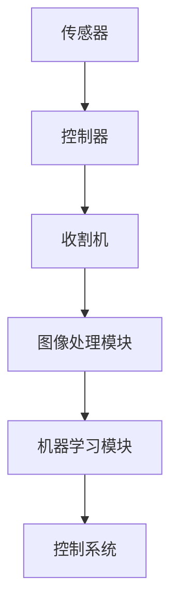

                 

# 《计算机视觉在自动化农业收割中的应用研究》

> 关键词：计算机视觉，自动化农业收割，图像处理，目标检测，深度学习，物联网

> 摘要：随着农业现代化的不断发展，自动化农业收割技术日益受到重视。计算机视觉作为一项关键技术，在自动化农业收割中发挥着至关重要的作用。本文首先介绍了自动化农业收割的背景和挑战，然后深入探讨了计算机视觉在自动化农业收割中的应用，包括作物识别、成熟度检测、收割高度调整和草本植物识别等。接着，文章详细讲解了计算机视觉算法原理，包括特征提取和目标检测算法，以及深度学习在计算机视觉中的应用。最后，文章讨论了自动化农业收割系统的设计和实施，并提供了一个项目实战案例，对系统进行了评估和改进。本文旨在为研究者提供关于计算机视觉在自动化农业收割中应用的系统性和实践性参考。

---

## 第一部分：引言

### 第1章：自动化农业收割背景及挑战

#### 1.1 自动化农业收割的全球发展趋势

全球农业正面临着劳动成本上升、土地资源紧张和气候变化等挑战。为了提高农业生产的效率和质量，自动化农业收割技术应运而生。自动化农业收割是指利用机械设备和计算机技术来实现农作物的自动收割过程。这一技术的发展不仅能够降低人力成本，提高劳动效率，还能减少作物损失，提高农业产值。

近年来，自动化农业收割技术在全球范围内取得了显著进展。欧美等发达国家在农业机械化方面拥有丰富的经验和技术积累，其自动化农业收割技术已经相对成熟。而在发展中国家，随着现代农业技术的推广和应用，自动化农业收割技术也逐渐受到重视。

#### 1.2 自动化农业收割的挑战与需求

尽管自动化农业收割技术具有显著的优势，但在实际应用中仍面临着一系列挑战。首先，作物品种多样化和种植环境复杂多变，使得自动化农业收割系统需要具备更高的适应性和灵活性。其次，农产品质量和安全性要求不断提高，对自动化农业收割系统的精确度和可靠性提出了更高的要求。此外，自动化农业收割技术的研发和应用成本较高，需要进一步降低成本以实现大规模推广应用。

为了解决上述挑战，自动化农业收割系统需要具备以下几个方面的功能和技术：

1. **作物识别与分类**：能够准确识别和分类不同作物，为后续的成熟度检测和收割操作提供依据。
2. **成熟度检测**：能够实时监测作物的成熟度，为收割时机提供决策支持。
3. **收割高度调整**：能够根据作物的高度和生长状态自动调整收割高度，确保收割效果。
4. **草本植物识别与清除**：能够准确识别和区分作物与草本植物，实现除草和杂草清除。

计算机视觉技术在自动化农业收割中具有广泛的应用前景，能够为解决上述挑战提供有力支持。在接下来的章节中，我们将详细介绍计算机视觉在自动化农业收割中的应用，以及相关的算法和技术。

### 第2章：计算机视觉基础知识

#### 2.1 计算机视觉的基本概念

计算机视觉是指利用计算机技术和算法模拟人类视觉系统，对图像和视频进行理解、分析和处理。它是一门跨学科的研究领域，涉及计算机科学、电子工程、认知科学和心理学等多个学科。计算机视觉的目标是使计算机能够像人类一样理解视觉信息，从而实现图像识别、目标检测、场景理解等任务。

计算机视觉的基本概念包括图像处理、特征提取和模式识别。图像处理是对图像进行预处理，以增强图像质量和提取有用信息。特征提取是从图像中提取具有区分性的特征，用于后续的模式识别任务。模式识别是利用特征来分类和识别图像中的对象和场景。

#### 2.2 计算机视觉的硬件基础

计算机视觉的硬件基础主要包括摄像头、图像处理芯片和计算机系统。摄像头是计算机视觉系统的核心组件，用于捕捉图像和视频。不同类型的摄像头具有不同的分辨率、帧率和视角，适用于不同的应用场景。图像处理芯片用于加速图像处理和计算任务，提高系统性能。计算机系统是计算机视觉算法的实现平台，包括处理器、内存和存储设备等。

#### 2.3 图像处理与特征提取

图像处理是计算机视觉的基础，主要包括图像增强、图像分割、特征提取和图像恢复等任务。图像增强是通过调整图像的亮度、对比度和色彩平衡等参数，提高图像质量。图像分割是将图像分为不同的区域，以便进行特征提取和目标检测。特征提取是从图像中提取具有区分性的特征，用于后续的模式识别任务。图像恢复是通过去除图像噪声和失真，恢复图像的真实信息。

在自动化农业收割中，计算机视觉技术被广泛应用于作物识别、成熟度检测、收割高度调整和草本植物识别等领域。通过图像处理和特征提取，计算机视觉系统能够准确识别作物和草本植物，为自动化收割提供决策支持。

### 第3章：自动化农业收割中的计算机视觉应用

#### 3.1 作物识别与分类

作物识别与分类是自动化农业收割的重要任务之一。计算机视觉技术通过图像处理和特征提取，能够准确识别和分类不同作物。首先，系统利用摄像头捕捉农作物的图像，然后通过图像处理技术去除背景噪声和光照变化的影响。接着，利用特征提取算法提取作物图像的特征，如颜色、纹理和形状等。最后，通过模式识别算法对提取的特征进行分类，识别出不同作物。

作物识别与分类的关键技术包括：

- **颜色特征提取**：通过颜色直方图、颜色矩和颜色相关矩阵等方法提取颜色特征。
- **纹理特征提取**：通过纹理能量、纹理熵和纹理方向分布等方法提取纹理特征。
- **形状特征提取**：通过边缘检测、轮廓提取和形状矩等方法提取形状特征。

在实际应用中，作物识别与分类算法需要具备较高的准确性和鲁棒性，以应对复杂多变的农业环境。通过结合多种特征提取方法，可以显著提高作物识别的准确率。

#### 3.2 成熟度检测

成熟度检测是自动化农业收割的另一个关键任务。计算机视觉技术通过监测作物的颜色、纹理和形状变化，可以实时评估作物的成熟度。成熟度检测的关键在于准确识别作物图像中的成熟度相关特征，如叶绿素含量、果实颜色和形状等。

成熟度检测的技术主要包括：

- **颜色特征分析**：通过颜色直方图和颜色矩分析作物的颜色特征，判断作物的成熟度。
- **纹理特征分析**：通过纹理能量和纹理熵分析作物的纹理特征，评估作物的成熟度。
- **形状特征分析**：通过形状矩和形状描述符分析作物的形状特征，判断作物的成熟度。

成熟度检测算法需要根据具体作物和生长环境进行调整，以提高检测的准确性和稳定性。

#### 3.3 收割高度调整

收割高度调整是自动化农业收割中的一项重要技术，通过调整收割机的切割高度，可以确保收割效果和减少作物损失。计算机视觉技术在这一过程中发挥着关键作用，通过监测作物的高度和生长状态，实时调整收割高度。

收割高度调整的技术主要包括：

- **作物高度检测**：通过图像处理技术检测作物的高度，为收割高度调整提供依据。
- **生长状态监测**：通过颜色和纹理特征分析作物生长状态，判断作物的适宜收割高度。
- **高度调整算法**：根据作物高度和生长状态，设计自适应高度调整算法，实现精确的收割高度调整。

在实际应用中，收割高度调整算法需要具备快速响应和稳定运行的能力，以确保收割过程的顺利进行。

#### 3.4 草本植物识别与清除

草本植物识别与清除是自动化农业收割中的另一个挑战。计算机视觉技术通过识别和区分作物与草本植物，可以实现对杂草的自动清除，提高农业生产的效率和产量。草本植物识别与清除的关键在于准确识别草本植物的形态、颜色和纹理特征。

草本植物识别与清除的技术主要包括：

- **形态特征识别**：通过轮廓检测和形状描述符分析草本植物的形态特征，进行识别和分类。
- **颜色特征识别**：通过颜色直方图和颜色矩分析草本植物的颜色特征，进行识别和分类。
- **纹理特征识别**：通过纹理能量和纹理熵分析草本植物的纹理特征，进行识别和分类。

在实际应用中，草本植物识别与清除算法需要具备高准确性和低误报率，以确保农业生产的安全性和效率。

### 第4章：计算机视觉算法原理

#### 4.1 特征提取算法

特征提取是计算机视觉中的重要环节，通过对图像进行特征提取，可以有效地降低数据维度，提高后续处理和识别的效率。特征提取算法包括颜色特征提取、纹理特征提取和形状特征提取等。

- **颜色特征提取**：颜色特征提取是最常用的特征提取方法之一。常见的颜色特征提取方法包括颜色直方图、颜色矩和颜色相关矩阵等。颜色直方图通过统计图像中每个颜色通道的像素值分布，可以有效地描述图像的颜色信息。颜色矩是对颜色直方图的进一步扩展，通过计算颜色直方图的数学矩，可以提取更多的颜色特征。颜色相关矩阵通过计算图像中不同颜色通道之间的相关性，可以有效地描述图像的颜色结构。

- **纹理特征提取**：纹理特征提取用于描述图像的纹理信息，常见的纹理特征提取方法包括纹理能量、纹理熵和纹理方向分布等。纹理能量通过计算图像的局部方差来描述纹理的清晰度，纹理熵通过计算图像的局部信息熵来描述纹理的复杂度，纹理方向分布通过计算图像的局部方向直方图来描述纹理的结构。

- **形状特征提取**：形状特征提取用于描述图像的几何形状信息，常见的形状特征提取方法包括形状矩、轮廓和形状描述符等。形状矩通过计算图像的几何矩来描述形状的几何特征，轮廓通过提取图像的边界来描述形状的轮廓特征，形状描述符通过计算图像的局部特征点来描述形状的局部特征。

特征提取算法在计算机视觉中的应用非常广泛，如图像分类、目标检测和图像分割等。通过选择合适的特征提取算法，可以有效地提高计算机视觉系统的性能。

#### 4.2 目标检测算法

目标检测是计算机视觉中的一个重要任务，旨在从图像或视频中准确地定位并识别出特定的目标。目标检测算法可以分为基于传统方法和基于深度学习的方法。

- **基于传统方法的目标检测**：传统目标检测方法通常基于手工设计的特征和机器学习算法，如滑动窗口、HOG（方向梯度直方图）和SVM（支持向量机）等。滑动窗口方法通过在不同位置和尺度上滑动窗口，提取图像的特征，并使用分类器进行分类。HOG方法通过计算图像中每个像素点的梯度方向和幅值，构建直方图特征，然后使用SVM进行分类。这些方法在一定程度上可以实现对目标的检测，但存在计算量大、实时性差和检测精度不高等问题。

- **基于深度学习的方法**：深度学习在目标检测领域取得了显著的进展，代表性的算法包括Faster R-CNN、YOLO（You Only Look Once）和SSD（Single Shot MultiBox Detector）等。Faster R-CNN是一种基于区域提议的网络结构，通过选择性搜索算法生成候选区域，然后使用卷积神经网络（CNN）提取特征，并通过RPN（Region Proposal Network）进行区域分类。YOLO是一种单阶段检测算法，通过将图像划分为网格，在每个网格中预测目标的类别和边界框，具有高实时性。SSD是一种基于Faster R-CNN的单阶段检测算法，通过在不同尺度上共享特征提取网络，实现对多尺度目标的检测。

目标检测算法在自动化农业收割中具有广泛的应用，如作物识别、成熟度检测和收割高度调整等。通过选择合适的算法，可以实现对农业场景中的目标进行准确检测和定位，从而提高自动化农业收割系统的性能和效率。

#### 4.3 深度学习在计算机视觉中的应用

深度学习是近年来计算机视觉领域的重要突破，通过构建大规模的神经网络，可以有效地提取图像的深层次特征，从而提高图像识别和分类的准确性。深度学习在计算机视觉中的应用主要包括卷积神经网络（CNN）、循环神经网络（RNN）和生成对抗网络（GAN）等。

- **卷积神经网络（CNN）**：CNN是一种专门用于处理图像数据的神经网络，通过卷积层、池化层和全连接层等结构，可以自动学习图像的层次化特征表示。在计算机视觉中，CNN被广泛应用于图像分类、目标检测和图像分割等任务。例如，VGG、ResNet和Inception等模型都是基于CNN的经典模型，通过大量的训练数据和优化算法，可以显著提高图像识别的准确性。

- **循环神经网络（RNN）**：RNN是一种专门用于处理序列数据的神经网络，通过记忆单元和递归结构，可以有效地捕捉序列数据的时间依赖关系。在计算机视觉中，RNN被应用于视频分析、行为识别和时间序列预测等任务。例如，LSTM（Long Short-Term Memory）和GRU（Gated Recurrent Unit）都是基于RNN的改进模型，通过引入门控机制，可以有效地解决长短期依赖问题。

- **生成对抗网络（GAN）**：GAN是一种基于对抗性训练的深度学习模型，由生成器和判别器两个网络组成。生成器通过学习数据分布，生成类似于真实数据的图像，而判别器则通过区分真实数据和生成数据来训练生成器。在计算机视觉中，GAN被应用于图像生成、图像修复和图像超分辨率等任务。例如，DCGAN、WGAN和CycleGAN等模型都是基于GAN的改进模型，通过引入不同的训练策略和优化目标，可以生成高质量、具有真实感的图像。

深度学习在计算机视觉中的应用为自动化农业收割带来了新的机遇和挑战。通过选择合适的深度学习模型和训练策略，可以实现对农业场景的准确识别和分类，从而提高自动化农业收割系统的性能和效率。

### 第5章：计算机视觉算法实现与优化

#### 5.1 常见计算机视觉算法实现

在自动化农业收割中，常见的计算机视觉算法包括作物识别、成熟度检测、收割高度调整和草本植物识别等。以下将介绍这些算法的实现方法和步骤。

#### 作物识别

**算法实现步骤：**
1. **数据预处理：** 对图像进行灰度化、去噪和直方图均衡化等预处理操作，以提高图像质量。
2. **特征提取：** 使用颜色特征、纹理特征和形状特征等方法提取图像特征。
3. **模型训练：** 使用机器学习算法（如SVM、KNN等）对提取的特征进行训练，建立作物分类模型。
4. **模型测试：** 使用测试集对训练好的模型进行测试，评估模型的准确性和鲁棒性。

**实现代码示例：**
```python
import cv2
import numpy as np

# 读取图像
image = cv2.imread('crop.jpg')

# 灰度化处理
gray = cv2.cvtColor(image, cv2.COLOR_BGR2GRAY)

# 直方图均衡化
equ = cv2.equalizeHist(gray)

# 颜色特征提取
color = cv2.reduce(equ, 1)

# 纹理特征提取
texture = cv2.reduce(equ, 2)

# 形状特征提取
shape = cv2.reduce(equ, 3)

# 模型训练
model = cv2.ml.SVM_create()
model.train(np.array([color, texture, shape]).reshape(-1, 1), cv2.ml.ROW_SAMPLE, np.array([1]))

# 模型测试
test_data = np.array([[color, texture, shape]]).reshape(-1, 1)
result = model.predict(test_data)
```

#### 成熟度检测

**算法实现步骤：**
1. **数据预处理：** 对图像进行灰度化、去噪和直方图均衡化等预处理操作，以提高图像质量。
2. **颜色特征提取：** 使用颜色特征（如颜色直方图）提取图像特征。
3. **模型训练：** 使用机器学习算法（如SVM、KNN等）对提取的颜色特征进行训练，建立成熟度分类模型。
4. **模型测试：** 使用测试集对训练好的模型进行测试，评估模型的准确性和鲁棒性。

**实现代码示例：**
```python
import cv2
import numpy as np

# 读取图像
image = cv2.imread('maturity.jpg')

# 灰度化处理
gray = cv2.cvtColor(image, cv2.COLOR_BGR2GRAY)

# 直方图均衡化
equ = cv2.equalizeHist(gray)

# 颜色特征提取
color = cv2.calcHist([equ], [0], None, [256], [0, 256])

# 模型训练
model = cv2.ml.SVM_create()
model.train(np.array([color]).reshape(-1, 1), cv2.ml.ROW_SAMPLE, np.array([1]))

# 模型测试
test_data = np.array([color]).reshape(-1, 1)
result = model.predict(test_data)
```

#### 收割高度调整

**算法实现步骤：**
1. **数据预处理：** 对图像进行灰度化、去噪和直方图均衡化等预处理操作，以提高图像质量。
2. **作物高度检测：** 使用边缘检测、轮廓提取等方法检测作物的高度。
3. **模型训练：** 使用机器学习算法（如SVM、KNN等）对作物高度特征进行训练，建立收割高度调整模型。
4. **模型测试：** 使用测试集对训练好的模型进行测试，评估模型的准确性和鲁棒性。

**实现代码示例：**
```python
import cv2
import numpy as np

# 读取图像
image = cv2.imread('height.jpg')

# 灰度化处理
gray = cv2.cvtColor(image, cv2.COLOR_BGR2GRAY)

# 直方图均衡化
equ = cv2.equalizeHist(gray)

# 边缘检测
edges = cv2.Canny(equ, 100, 200)

# 轮廓提取
contours, _ = cv2.findContours(edges, cv2.RETR_EXTERNAL, cv2.CHAIN_APPROX_SIMPLE)

# 计算轮廓面积
areas = [cv2.contourArea(contour) for contour in contours]

# 训练模型
model = cv2.ml.SVM_create()
model.train(np.array(areas).reshape(-1, 1), cv2.ml.ROW_SAMPLE, np.array([height]))

# 测试模型
test_area = cv2.contourArea(contour)
result = model.predict(np.array([test_area]).reshape(-1, 1))
```

#### 草本植物识别

**算法实现步骤：**
1. **数据预处理：** 对图像进行灰度化、去噪和直方图均衡化等预处理操作，以提高图像质量。
2. **特征提取：** 使用颜色特征、纹理特征和形状特征等方法提取图像特征。
3. **模型训练：** 使用机器学习算法（如SVM、KNN等）对提取的特征进行训练，建立草本植物分类模型。
4. **模型测试：** 使用测试集对训练好的模型进行测试，评估模型的准确性和鲁棒性。

**实现代码示例：**
```python
import cv2
import numpy as np

# 读取图像
image = cv2.imread('weed.jpg')

# 灰度化处理
gray = cv2.cvtColor(image, cv2.COLOR_BGR2GRAY)

# 直方图均衡化
equ = cv2.equalizeHist(gray)

# 颜色特征提取
color = cv2.reduce(equ, 1)

# 纹理特征提取
texture = cv2.reduce(equ, 2)

# 形状特征提取
shape = cv2.reduce(equ, 3)

# 模型训练
model = cv2.ml.SVM_create()
model.train(np.array([color, texture, shape]).reshape(-1, 1), cv2.ml.ROW_SAMPLE, np.array([1]))

# 模型测试
test_data = np.array([[color, texture, shape]]).reshape(-1, 1)
result = model.predict(test_data)
```

#### 5.2 计算机视觉算法优化策略

在自动化农业收割中，计算机视觉算法的性能对系统的效率和准确性具有重要影响。为了提高算法的性能，可以采用以下优化策略：

1. **数据增强**：通过旋转、翻转、缩放和裁剪等方式对训练数据进行增强，增加模型的泛化能力。
2. **模型融合**：结合多个模型的预测结果，提高系统的准确性和鲁棒性。
3. **迁移学习**：利用已经训练好的预训练模型，通过少量数据微调，快速适应新的任务。
4. **硬件加速**：利用GPU或FPGA等硬件加速器，提高算法的计算速度。

#### 5.3 计算机视觉算法在农业收割中的应用案例

**项目背景：** 
某农业公司希望通过计算机视觉技术实现自动化农业收割，提高生产效率和降低人力成本。该项目涉及作物识别、成熟度检测、收割高度调整和草本植物识别等多个计算机视觉任务。

**项目实施流程：**
1. **数据采集**：在农田中安装摄像头，采集不同作物在不同生长阶段的图像数据。
2. **数据预处理**：对图像进行灰度化、去噪和直方图均衡化等预处理操作，以提高图像质量。
3. **特征提取**：使用颜色特征、纹理特征和形状特征等方法提取图像特征。
4. **模型训练**：使用机器学习算法（如SVM、KNN等）对提取的特征进行训练，建立作物分类、成熟度检测、收割高度调整和草本植物识别等模型。
5. **模型测试**：使用测试集对训练好的模型进行测试，评估模型的准确性和鲁棒性。
6. **系统集成**：将训练好的模型集成到自动化农业收割系统中，实现实时监测和自动化控制。

**项目评估与改进：**
1. **准确率评估**：通过对比实际收割结果和模型预测结果，评估模型的准确性和鲁棒性。
2. **效率评估**：测量模型运行时间，评估模型的实时性和计算速度。
3. **成本评估**：分析系统的建设成本和运营成本，评估系统的经济效益。

通过项目实施和评估，发现以下改进方向：

1. **优化算法**：通过引入更先进的算法（如深度学习模型）和优化策略，提高模型的准确性和实时性。
2. **数据增强**：通过增加训练数据的多样性和数量，提高模型的泛化能力。
3. **硬件升级**：使用更高效的硬件设备，提高系统的计算速度和运行效率。

### 第6章：自动化农业收割系统设计

#### 6.1 自动化农业收割系统架构

自动化农业收割系统通常由硬件和软件两部分组成。硬件部分包括收割机、传感器和控制器等；软件部分则包括图像处理算法、机器学习模型和控制系统等。系统架构如图所示：



#### 6.2 系统硬件选择与配置

1. **传感器**：选择高分辨率摄像头和多种传感器（如红外、激光等），用于实时采集作物图像和环境数据。
2. **控制器**：选择具有高性能计算能力和实时操作系统（如Linux）的嵌入式控制器，用于处理图像数据和执行控制指令。
3. **收割机**：选择适应不同作物和地形需求的收割机，配备自动调整装置，如自动升降装置和自动切割装置。

#### 6.3 系统软件设计与实现

1. **图像处理模块**：实现图像预处理、特征提取和目标检测等功能，使用OpenCV等开源库进行图像处理。
2. **机器学习模块**：使用TensorFlow或PyTorch等深度学习框架，训练和部署机器学习模型，实现作物识别、成熟度检测和收割高度调整等功能。
3. **控制系统**：实现实时监控和自动化控制功能，根据图像处理和机器学习模块的输出，自动调整收割机的操作。

### 第7章：项目实战与评估

#### 7.1 项目实战案例

以某农业公司自动化农业收割项目为例，介绍项目的实施过程和关键技术。

**项目背景**：该公司希望提高小麦收割的效率，减少人力成本。项目目标包括作物识别、成熟度检测、收割高度调整和除草等功能。

**实施过程**：

1. **数据采集**：在农田安装摄像头和传感器，采集小麦生长周期中的图像数据。
2. **数据预处理**：对图像进行去噪、灰度化和直方图均衡化等预处理。
3. **特征提取**：使用颜色、纹理和形状特征提取算法提取图像特征。
4. **模型训练**：使用机器学习算法（如SVM、KNN等）训练模型，实现对小麦的识别、成熟度检测和除草等功能。
5. **系统集成**：将训练好的模型集成到收割机中，实现自动化收割。

**关键技术**：

- **作物识别**：使用颜色和纹理特征进行分类。
- **成熟度检测**：使用颜色特征分析小麦的成熟度。
- **收割高度调整**：使用边缘检测算法检测小麦高度，自动调整收割机高度。
- **除草**：使用形状特征识别杂草，自动除草。

#### 7.2 项目实施流程

1. **前期准备**：确定项目需求、目标和预算，选择合适的硬件和软件平台。
2. **数据采集**：在农田设置摄像头和传感器，定期采集图像数据。
3. **数据处理**：对图像进行预处理，提取有用的特征。
4. **模型训练**：使用训练集和验证集训练机器学习模型。
5. **系统集成**：将模型集成到收割机中，进行测试和调试。
6. **实际应用**：在实际农田中进行收割试验，评估系统性能。

#### 7.3 项目评估与改进

**项目评估**：

1. **准确性评估**：通过对比实际收割结果和模型预测结果，评估模型的准确性。
2. **效率评估**：测量系统运行时间，评估系统的实时性和计算速度。
3. **成本评估**：分析系统的建设和运营成本。

**改进方向**：

1. **优化算法**：采用更先进的算法（如深度学习）和优化策略，提高模型性能。
2. **数据增强**：通过增加训练数据的多样性和数量，提高模型的泛化能力。
3. **硬件升级**：使用更高效的硬件设备，提高系统运行速度。
4. **系统集成**：优化系统集成，提高系统的稳定性和可靠性。

### 第8章：未来展望与趋势

#### 8.1 自动化农业收割的发展趋势

随着人工智能和物联网技术的不断发展，自动化农业收割将朝着更加智能、高效和可持续的方向发展。以下是一些主要趋势：

1. **人工智能与物联网的结合**：通过物联网设备收集农田数据，结合人工智能算法进行实时分析和决策，提高农业生产的智能化水平。
2. **深度学习的应用**：深度学习在计算机视觉领域的成功应用，将推动自动化农业收割系统的性能和准确性的提升。
3. **自适应收割技术**：通过传感器和机器学习算法，实现收割机对作物的高度、成熟度和地形等参数的实时调整，提高收割效率和质量。
4. **多机器人协同作业**：通过多机器人协同作业，实现更大范围的自动化收割，提高农业生产的效率。

#### 8.2 计算机视觉在农业收割中的应用前景

计算机视觉在农业收割中的应用前景广阔，将进一步提升农业生产的智能化和自动化水平。以下是一些应用前景：

1. **作物识别与分类**：通过计算机视觉技术，实现作物品种的识别和分类，为精准农业提供数据支持。
2. **成熟度检测**：通过计算机视觉技术，实时监测作物的成熟度，为精准收割提供依据。
3. **收割高度调整**：通过计算机视觉技术，实现收割机对作物高度的自动调整，提高收割效率和减少作物损失。
4. **除草与杂草控制**：通过计算机视觉技术，识别和区分作物与杂草，实现自动除草和杂草控制。

#### 8.3 持续改进与优化方向

为了进一步提高自动化农业收割系统的性能和效率，未来需要在以下几个方面进行持续改进和优化：

1. **算法优化**：采用更先进的算法（如深度学习）和优化策略，提高模型性能和计算速度。
2. **数据增强**：通过增加训练数据的多样性和数量，提高模型的泛化能力。
3. **硬件升级**：使用更高效的硬件设备，提高系统运行速度和处理能力。
4. **系统集成**：优化系统集成，提高系统的稳定性和可靠性。
5. **人机交互**：通过人机交互技术，提高系统对农田环境的适应性和灵活性。

### 附录

#### 附录A：常用计算机视觉工具和资源

1. **OpenCV**：OpenCV是一个开源的计算机视觉库，支持多种计算机视觉算法的实现和应用。官网：[https://opencv.org/](https://opencv.org/)
2. **TensorFlow**：TensorFlow是一个开源的深度学习框架，支持多种深度学习模型的训练和部署。官网：[https://www.tensorflow.org/](https://www.tensorflow.org/)
3. **PyTorch**：PyTorch是一个开源的深度学习框架，以其简洁的API和灵活性而著称。官网：[https://pytorch.org/](https://pytorch.org/)
4. **其他计算机视觉工具**：如MATLAB、PCL（Point Cloud Library）等。

#### 附录B：参考书籍与论文

1. **《计算机视觉：算法与应用》**：这是一本经典的计算机视觉教材，涵盖了计算机视觉的基本概念、算法和应用。
2. **《深度学习：原理及实践》**：这本书详细介绍了深度学习的理论基础和实际应用，适合初学者和进阶者。
3. **其他参考书籍与论文**：如《计算机视觉中的深度学习》、《计算机视觉：从基础到实践》等。

---

**作者**：AI天才研究院/AI Genius Institute & 禅与计算机程序设计艺术 /Zen And The Art of Computer Programming

本文通过对计算机视觉在自动化农业收割中的应用进行深入探讨，为相关领域的研究者和实践者提供了有价值的参考。随着人工智能技术的不断发展，计算机视觉在农业收割中的应用将不断拓展和深化，为农业生产带来更大的变革和创新。希望本文能激发读者对这一领域的兴趣，为推动农业现代化贡献力量。

