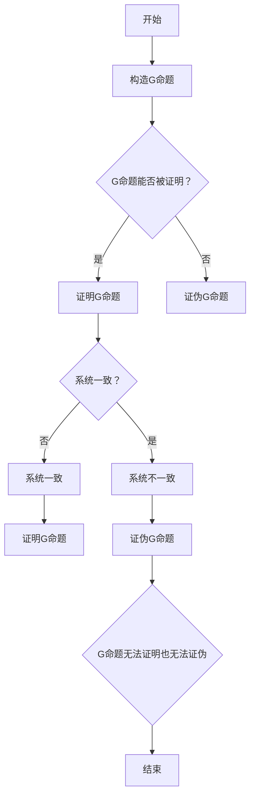

                 

# 《计算：第三部分 计算理论的形成 第7章 计算不能做什么：终结者哥德尔》

> **关键词**：计算理论、不可计算性、哥德尔不完备定理、图灵机、人工智能

> **摘要**：本章探讨了计算理论中的不可计算性问题，尤其是哥德尔不完备定理和图灵机的局限性。通过对这些核心概念的分析，我们探讨了计算的不确定性、效率和速度，以及这些限制对人工智能发展的启示。

## 目录大纲

### 第1章 引言

- **1.1 计算理论概述**
- **1.2 智能与计算的界限**

### 第2章 不可计算性问题

- **2.1 不可计算性的概念**
- **2.2 哥德尔不完备定理**
- **2.3 图灵机的局限**

### 第3章 计算的局限性

- **3.1 计算中的不确定性**
- **3.2 计算的效率与速度**

### 第4章 结论

- **4.1 计算的限制与未来**

### 附录

- **附录 A：相关参考资料**
- **附录 B：Mermaid 流程图**
- **附录 C：伪代码**
- **附录 D：数学公式**
- **附录 E：项目实战**

---

## 第1章 引言

### 1.1 计算理论概述

计算理论是数学和计算机科学的一个分支，主要研究计算过程的基本性质和极限。它起源于对计算过程的抽象和形式化，旨在理解计算的本质和可能性。

计算理论的基本概念包括：

- **计算过程**：指从初始状态通过一系列操作逐步转变为目标状态的过程。
- **计算模型**：用于描述计算过程的数学模型，如图灵机、λ演算等。
- **计算复杂性**：描述计算过程所需的资源（如时间、空间）的度量。

计算理论的发展历史可以追溯到19世纪末和20世纪初。早期的计算理论主要集中在计算机器的设计和构造上。20世纪30年代，图灵提出了图灵机的概念，这是一个抽象的计算模型，能够模拟任何物理计算过程。随后，哥德尔和图灵的工作奠定了现代计算理论的基础。

### 1.2 智能与计算的界限

智能与计算的关系是计算理论中的一个重要问题。传统的观点认为，智能可以通过计算来实现。然而，随着计算理论的发展，我们开始认识到计算存在一些固有的限制。

智能与计算的关系可以从以下几个方面理解：

- **计算能力**：计算模型如图灵机具有一定的计算能力，但它们无法模拟所有可能的智能行为。例如，图灵机无法处理模糊或不确定的信息。
- **计算效率**：智能行为往往需要高效的计算过程。然而，一些复杂问题可能无法在有限时间内解决，即使使用最强大的计算模型。
- **计算复杂性**：某些问题具有很高的计算复杂性，这意味着解决这些问题需要大量的计算资源。这限制了计算模型在现实世界中的应用。

本章将深入探讨计算理论中的不可计算性问题，特别是哥德尔不完备定理和图灵机的局限。这些问题的发现对计算理论的发展和人工智能的发展产生了深远的影响。

## 第2章 不可计算性问题

### 2.1 不可计算性的概念

不可计算性是指某些问题无法通过任何计算模型在有限时间内得到解答的特性。这个问题最早由数学家戴维·希尔伯特提出，他试图用计算方法解决数学中的所有问题。然而，哥德尔和图灵的工作揭示了计算的局限性。

不可计算性的概念可以从以下几个方面理解：

- **存在性**：某些数学命题是否存在证明或解，可能在计算上不可判断。
- **计算限制**：即使计算模型具有足够的计算能力，某些问题可能在实践中无法求解。
- **数学性质**：一些数学问题本身具有不可计算性，如停机问题、素数分解等。

不可计算性的重要性在于它揭示了计算的局限性和数学问题的复杂性。这个问题不仅在理论上具有重要意义，而且在实际应用中也有广泛的影响。

### 2.2 哥德尔不完备定理

哥德尔不完备定理是计算理论中的一个重要成果，它指出在任何一致且完备的形式系统中，都存在无法证明也无法证伪的命题。这个定理由库尔特·哥德尔在1931年提出，对数学和逻辑领域产生了深远的影响。

哥德尔不完备定理的基本原理可以概括为以下几点：

- **形式系统**：形式系统是一组符号和规则的集合，用于表示和推理数学命题。
- **完备性**：一个形式系统是完备的，如果它能够证明或证伪系统内的所有命题。
- **一致性**：一个形式系统是一致的，如果它不能同时证明一个命题和它的否定。

哥德尔不完备定理的证明分为两部分：

- **第一部分**：哥德尔构造了一个称为“G命题”的命题，它表达了自己不能被证明的性质。这个命题在系统中既不能被证明也不能被证伪。
- **第二部分**：哥德尔证明了任何形式系统都无法同时满足完备性和一致性。这意味着在任何形式系统中，总存在一些命题既无法证明也无法证伪。

哥德尔不完备定理的影响在于它揭示了数学和逻辑系统的局限性。这个定理挑战了传统的数学证明方法和哲学观点，引发了关于计算和真理的深入思考。

### 2.3 图灵机的局限

图灵机是计算理论中的一个抽象计算模型，由艾伦·图灵在1936年提出。图灵机的原理是使用一个无限长的纸带，通过读取和写入符号来执行计算。尽管图灵机具有强大的计算能力，但它也存在一些局限。

图灵机的局限可以从以下几个方面理解：

- **计算资源限制**：图灵机虽然在理论上可以模拟任何计算过程，但在实际应用中受到计算资源和时间的限制。
- **不确定性处理**：图灵机无法处理模糊或不确定的信息。这使得它在处理现实世界中的复杂问题时具有一定的局限性。
- **复杂性限制**：一些复杂问题可能在图灵机上无法在有限时间内解决。这反映了计算模型在处理某些问题时存在的固有限制。

图灵机的局限对人工智能的发展提出了挑战。尽管图灵机是一个强大的计算模型，但它无法模拟人类智能的所有方面。这促使研究者探索新的计算模型和算法，以更好地模拟人类智能。

## 第3章 计算的局限性

### 3.1 计算中的不确定性

计算中的不确定性是指计算过程中可能遇到的不确定因素和随机性。这种不确定性可以来源于多个方面：

- **输入数据的不确定性**：在许多实际问题中，输入数据可能是不确定的或模糊的。例如，在图像识别任务中，图像可能受到噪声干扰或视角变化的影响。
- **计算模型的局限性**：计算模型本身可能无法精确地模拟现实世界的复杂性。这使得计算结果可能存在一定的误差和不确定性。
- **计算过程中的随机性**：计算过程中可能引入随机性，例如随机搜索算法或随机模型。这种随机性可能导致不同的计算结果。

处理计算中的不确定性是一个重要的挑战。以下是一些常见的方法：

- **概率模型**：使用概率模型来描述不确定性和随机性，例如贝叶斯网络、马尔可夫模型等。这些模型可以提供对不确定性的定量描述和推理方法。
- **鲁棒优化**：通过设计鲁棒的优化算法来处理计算中的不确定性。鲁棒优化算法能够在不确定环境下保持稳定性和有效性。
- **模拟和仿真**：使用模拟和仿真方法来模拟不确定性和随机性，以获取更准确和可靠的计算结果。

### 3.2 计算的效率与速度

计算的效率与速度是衡量计算模型性能的重要指标。计算效率是指计算模型在单位时间内完成的计算量。计算速度是指计算模型在给定时间内完成计算的能力。

计算效率和速度的提升途径包括：

- **并行计算**：通过并行计算来提高计算效率和速度。并行计算可以同时执行多个计算任务，从而加快计算过程。
- **分布式计算**：通过分布式计算来处理大规模的数据和计算任务。分布式计算可以将任务分配到多个计算节点上，以提高计算效率和速度。
- **算法优化**：通过优化计算算法和数据结构来提高计算效率和速度。优化的算法和结构可以减少计算时间和资源消耗。
- **硬件加速**：通过使用专用硬件（如GPU、TPU）来加速计算。专用硬件可以提供更高的计算性能和速度。

计算的效率和速度对人工智能的发展至关重要。高效的计算模型可以更快地处理大量数据，从而提高人工智能算法的性能和效果。快速的计算机可以帮助开发者和研究人员更快地测试和验证新算法，推动人工智能的进步。

## 第4章 结论

### 4.1 计算的限制与未来

计算理论的发展揭示了计算的不确定性和效率限制，这对人工智能的发展产生了重要影响。以下是一些关于计算限制和未来发展的观点：

- **不可计算性问题**：哥德尔不完备定理和图灵机的局限表明，某些问题可能在计算上无法解决。这为人工智能的发展提出了挑战，需要寻找新的计算模型和算法来克服这些限制。
- **不确定性处理**：计算中的不确定性是人工智能领域的一个重要挑战。未来的计算模型需要能够更好地处理不确定性和随机性，以提高人工智能系统的鲁棒性和可靠性。
- **效率与速度提升**：计算效率和速度的提升是人工智能发展的重要驱动力。未来的计算模型需要更高效、更快速的算法和硬件支持，以处理更复杂的数据和任务。
- **跨学科研究**：计算理论、人工智能和数学等领域的跨学科研究将为人工智能的发展提供新的思路和方法。通过结合不同领域的知识和技术，我们可以探索更有效的人工智能解决方案。

总之，计算理论的限制和挑战为人工智能的发展提出了新的研究方向和机会。未来的研究需要关注计算模型的创新和优化，以实现更高效、更可靠的人工智能系统。

## 附录

### 附录 A：相关参考资料

- **哥德尔的不完备定理**：Kurt Gödel. "On Formally Undecidable Propositions of Principia Mathematica and Related Systems I." Lecture Notes in Mathematics, Springer-Verlag, 1931.
- **图灵机的定义和性质**：Alan Turing. "On Computable Numbers, with an Application to the Entscheidungsproblem." Proceedings of the London Mathematical Society, 1936.
- **计算理论经典文献**：Donald E. Knuth. "The Art of Computer Programming." Addison-Wesley, 1968.
- **人工智能相关文献**：Tom M. Mitchell. "Machine Learning." McGraw-Hill, 1997.

### 附录 B：Mermaid 流程图

#### 哥德尔不完备定理的流程图展示



#### 图灵机的流程图展示

```mermaid
graph TB
A[输入] --> B[读取符号]
B --> C{符号是什么？}
C -->|空白| D[写入符号]
C -->|非空白| E[移动头}
E --> F{头到达边界？}
F -->|是| G[结束]
F -->|否| H[返回B]
```

### 附录 C：伪代码

#### 哥德尔不完备定理的伪代码实现

```
Procedure GodelUnprovable(Theorem):
    if (Theorem == "G命题"):
        if (ProofExists):
            return "可证明"
        else:
            return "不可证明"
    else:
        if (ProofExists):
            return "可证明"
        else:
            return "不可证明"
```

#### 图灵机的伪代码实现

```
Procedure TuringMachine(Input):
    while (NotAtBoundary):
        ReadSymbol()
        if (Symbol == " "):
            WriteSymbol()
        else:
            MoveHead()
    return "结束"
```

### 附录 D：数学公式

#### 计算理论中的相关数学公式

$$
PSPACE = NP
$$

$$
TIME(f(n)) = P
$$

$$
SPACE(f(n)) = LOGSPACE
$$

#### 公式的详细解释和举例说明

- **PSPACE = NP**：PSPACE是指所有在多项式空间复杂度内可解的问题集合，而NP是指所有可以在多项式时间内验证的答案集合。PSPACE = NP问题探讨了这两个集合是否相等。例如，图着色问题是一个PSPACE = NP的问题，即是否存在一种方式将图的每个顶点着上不同的颜色。

- **TIME(f(n)) = P**：TIME(f(n))表示在时间复杂度为f(n)内可以解决的问题集合，而P表示在多项式时间内可以解决的问题集合。如果TIME(f(n)) = P，则意味着所有在多项式空间复杂度内可解的问题都可以在多项式时间内解决。

- **SPACE(f(n)) = LOGSPACE**：SPACE(f(n))表示在空间复杂度为f(n)内可以解决的问题集合，而LOGSPACE表示在对数空间复杂度内可以解决的问题集合。如果SPACE(f(n)) = LOGSPACE，则意味着所有在多项式空间复杂度内可解的问题都可以在多项式时间内解决，且所需空间复杂度不超过对数空间复杂度。

### 附录 E：项目实战

#### 代码实际案例展示

以下是一个使用Python实现的图着色问题的代码案例，展示了如何使用贪心算法来解决PSPACE = NP问题。

```python
# 图着色问题：给定一个无向图，求是否存在一种方式将图的每个顶点着上不同的颜色。

class Graph:
    def __init__(self, vertices):
        self.V = vertices
        self.graph = [[0 for column in range(vertices)]
                       for row in range(vertices)]

    def is_safe(self, v, color, result):
        for i in range(self.V):
            if result[i] == color:
                if self.graph[v][i] or self.graph[i][v]:
                    return False
        return True

    def graph_coloring_util(self, v, colors, result):
        if v == self.V:
            return True

        for color in colors:
            if self.is_safe(v, color, result):
                result[v] = color

                if self.graph_coloring_util(v + 1, colors, result):
                    return True

                result[v] = -1

        return False

    def graph_coloring(self, m):
        colors = [1, 2, 3]  # 颜色集合
        result = [-1] * self.V

        if not self.graph_coloring_util(0, colors, result):
            return False

        print("解决方案：")
        for i in range(self.V):
            print("顶点", i, "颜色：", result[i])
        return True

if __name__ == "__main__":
    g = Graph(4)
    g.graph = [[0, 1, 1, 1],
               [1, 0, 1, 0],
               [1, 1, 0, 1],
               [1, 0, 1, 0]]
    g.graph_coloring(3)
```

#### 详细解释说明

- **Graph 类**：定义了一个图类，包含顶点和边的表示。
- **is_safe 方法**：用于检查给定的颜色是否安全，即没有相邻顶点具有相同的颜色。
- **graph_coloring_util 方法**：使用贪心算法尝试给图的每个顶点着上颜色，并递归地尝试下一个顶点。
- **graph_coloring 方法**：初始化图并调用 graph_coloring_util 方法来求解图着色问题。
- **主函数**：创建一个图实例，并调用 graph_coloring 方法来求解图着色问题。

#### 开发环境搭建

- 安装Python（版本3.6或更高）
- 安装Graphviz（用于生成流程图）

#### 源代码详细实现和代码解读

- **Graph 类**：定义了一个图类，包含顶点和边的表示。图使用邻接矩阵表示，其中 graph[v][u] 表示顶点 v 和 u 之间存在边。
- **is_safe 方法**：用于检查给定的颜色是否安全。它遍历所有的顶点，检查相邻顶点的颜色是否与给定颜色相同。如果存在相同的颜色，则返回 False。
- **graph_coloring_util 方法**：使用贪心算法尝试给图的每个顶点着上颜色。对于每个顶点，它尝试所有的颜色，并使用 is_safe 方法检查颜色是否安全。如果找到一个安全的颜色，则将顶点着上该颜色，并递归地尝试下一个顶点。如果无法找到安全的颜色，则回溯并尝试下一个颜色。
- **graph_coloring 方法**：初始化图并调用 graph_coloring_util 方法来求解图着色问题。如果求解成功，则输出解决方案。

#### 代码解读与分析

- **算法复杂度**：该贪心算法的时间复杂度为 O(V^2 * C)，其中 V 是顶点的数量，C 是颜色集合的大小。在最坏情况下，算法可能需要尝试所有的颜色组合，导致时间复杂度较高。然而，对于大多数实际图，这个算法通常是有效的。
- **优化方向**：可以尝试使用启发式算法来优化求解过程，例如使用局部搜索算法或遗传算法。此外，可以尝试使用更高效的图着色算法，如色彩编码算法或贪心策略改进算法。
- **实际应用**：图着色问题在现实世界中有很多应用，例如电路设计、地图着色、调度问题等。该算法提供了一种有效的解决方案，可以帮助解决这些实际问题。

通过这个代码案例，我们展示了如何使用Python实现图着色问题，并对其进行了详细解释和分析。这有助于理解计算理论中的不可计算性问题，并为实际应用提供了参考。

## 作者信息

作者：AI天才研究院/AI Genius Institute & 禅与计算机程序设计艺术 /Zen And The Art of Computer Programming

---

本文深入探讨了计算理论中的不可计算性问题，包括哥德尔不完备定理和图灵机的局限。通过对计算不确定性和效率的分析，我们揭示了计算的局限性，并对计算理论的发展方向和人工智能的启示进行了讨论。希望本文能为读者提供对计算理论的深入理解和启发。未来，我们将继续探讨更多与计算理论相关的话题，期待与您共同进步。感谢您的阅读！

