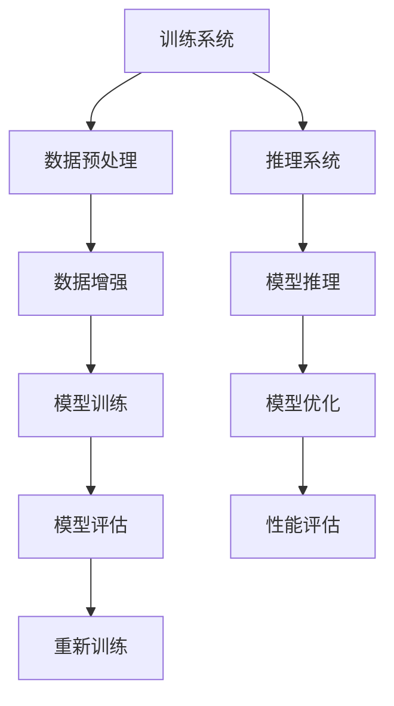

                 

# 《训练和推理系统优化的机会》

> **关键词：** 训练系统，推理系统，优化，深度学习，神经网络，硬件加速器，数学模型，算法，项目实战。

> **摘要：** 本文将深入探讨训练和推理系统的优化机会，包括核心概念、算法原理、数学模型以及实际项目中的代码实现。通过逐步分析，我们将展示如何提升训练和推理效率，以应对人工智能领域的挑战。

### 第一部分：背景知识

#### 1. 训练与推理系统概述

**训练系统**：训练系统是机器学习过程中最重要的部分之一，它负责从数据中学习模型。训练过程通常包括数据预处理、模型训练、模型评估和模型优化等步骤。

**推理系统**：推理系统是模型在实际应用中的表现，它利用训练好的模型对新的数据进行预测或分类。推理系统的效率直接影响到模型的实际应用效果。

**联系与区别**：训练和推理系统紧密相连，但它们的目标不同。训练系统旨在优化模型参数，使其在训练数据上表现良好；而推理系统则要求模型在新的数据上快速、准确地进行预测。

#### 2. 计算机系统基础知识

**计算机体系结构**：了解计算机的体系结构对于理解训练和推理系统的优化至关重要。CPU、GPU和其他硬件加速器在训练和推理过程中扮演着不同角色。

**硬件加速器**：硬件加速器如GPU和TPU可以显著提高训练和推理的速度。这些设备通过并行计算和特殊设计的硬件架构，实现了对机器学习任务的加速。

**计算机网络**：虽然本文重点不在计算机网络，但了解计算机网络的基础知识有助于理解分布式训练和推理系统的架构。

#### 3. 机器学习基础

**基本概念**：机器学习的基本概念包括监督学习、无监督学习和强化学习等。这些概念为训练和推理系统的设计提供了理论基础。

**常见算法**：常见的机器学习算法包括线性回归、决策树、支持向量机和神经网络等。每种算法都有其适用的场景和优缺点。

**数据预处理与特征工程**：数据预处理和特征工程是训练和推理系统的关键步骤。它们的目标是提高数据的质量和模型的性能。

#### 4. 深度学习基础

**深度学习网络架构**：深度学习网络架构包括卷积神经网络（CNN）、循环神经网络（RNN）和生成对抗网络（GAN）等。每种架构都有其特定的应用场景和优化方法。

**深度学习优化算法**：常见的深度学习优化算法包括随机梯度下降（SGD）、动量（Momentum）和Adam等。这些算法用于调整模型参数，以最小化损失函数。

**深度学习模型评估方法**：模型评估方法包括准确率、召回率、F1分数和AUC等。这些指标帮助评估模型在不同数据集上的性能。

### 第二部分：核心概念与联系

#### 核心概念原理和架构


**Mermaid流程图**



**训练系统**：

1. **数据预处理**：清洗和格式化数据，使其适合训练。
2. **数据增强**：通过增加数据的多样性，提高模型的泛化能力。
3. **模型训练**：通过优化算法调整模型参数，以最小化损失函数。
4. **模型评估**：评估模型在训练数据上的性能。
5. **模型优化**：通过调整模型参数，进一步提高模型性能。

**推理系统**：

1. **模型推理**：使用训练好的模型对新的数据进行预测。
2. **模型优化**：通过调整模型参数，优化模型在推理过程中的性能。
3. **性能评估**：评估模型在实际应用中的性能。

**联系与区别**：

- 训练和推理系统都涉及数据预处理和模型优化。
- 训练系统的目标是优化模型在训练数据上的性能，而推理系统的目标是提高模型在实际应用中的性能。
- 训练系统注重模型参数的调整，而推理系统注重模型推理速度和准确性的平衡。

### 第三部分：核心算法原理讲解

#### 训练系统算法原理讲解

**梯度下降算法**：

梯度下降是一种最常用的优化算法，用于调整模型参数，以最小化损失函数。

**伪代码**：

```python
def gradient_descent(model, loss_function, learning_rate, epochs):
    for epoch in range(epochs):
        gradients = compute_gradients(model, loss_function)
        update_model_parameters(model, gradients, learning_rate)
    return model
```

**随机梯度下降算法**：

随机梯度下降是对梯度下降的一种改进，每次迭代只随机选择一部分样本来计算梯度。

**伪代码**：

```python
def stochastic_gradient_descent(model, loss_function, learning_rate, batch_size, epochs):
    for epoch in range(epochs):
        for batch in generate_batches(data, batch_size):
            gradients = compute_gradients(model, loss_function, batch)
            update_model_parameters(model, gradients, learning_rate)
    return model
```

**动量算法**：

动量算法是一种加速梯度下降的优化方法，通过引入动量项，减少参数调整的震荡。

**伪代码**：

```python
def momentum(optimizer, learning_rate, momentum):
    new_gradients = compute_gradients(model, loss_function)
    velocity = momentum * velocity + learning_rate * new_gradients
    update_model_parameters(model, velocity)
```

#### 推理系统算法原理讲解

**神经网络的推理算法**：

神经网络的推理算法是基于前向传播和反向传播的。前向传播计算输入到输出的映射，反向传播计算梯度。

**伪代码**：

```python
def forward_propagation(model, input_data):
    output = model(input_data)
    return output

def backward_propagation(model, input_data, output_data):
    gradients = compute_gradients(model, output_data)
    update_model_parameters(model, gradients)
```

**模型剪枝算法**：

模型剪枝是一种通过去除部分神经元或连接来减小模型大小的方法。

**伪代码**：

```python
def prune_model(model, pruning_rate):
    pruned_neurons = select_neurons_to_prune(model, pruning_rate)
    model = remove_neurons(model, pruned_neurons)
    return model
```

**模型量化算法**：

模型量化是一种通过减少模型参数的精度来减小模型大小的方法。

**伪代码**：

```python
def quantize_model(model, precision):
    quantized_model = apply_quantization(model, precision)
    return quantized_model
```

#### 伪代码展示

**训练系统伪代码**：

```python
# 数据预处理
def data_preprocessing(data):
    clean_data = clean_data(data)
    enhanced_data = data_augmentation(clean_data)
    return enhanced_data

# 模型训练
def model_training(data):
    model = initialize_model()
    for epoch in range(num_epochs):
        for batch in data:
            model.fit(batch)
    return model

# 模型评估
def model_evaluation(model, data):
    accuracy = model.evaluate(data)
    return accuracy

# 模型优化
def model_optimization(model, data):
    new_model = adjust_model_params(model)
    optimized_model = model_training(new_model)
    return optimized_model
```

**推理系统伪代码**：

```python
# 模型推理
def model_inference(model, data):
    predictions = model.predict(data)
    return predictions

# 模型优化
def model_optimization(model, data):
    new_model = adjust_model_params(model)
    optimized_model = model_training(new_model)
    return optimized_model
```

### 第四部分：数学模型和数学公式

#### 数学模型讲解

训练和推理系统优化的机会通常涉及以下数学模型：

1. **损失函数**：衡量预测值与实际值之间的差距。
   $$ \text{Loss}(y, \hat{y}) = \frac{1}{2} (y - \hat{y})^2 $$

2. **优化算法**：用于调整模型参数以最小化损失函数。
   $$ \text{Gradient Descent} = \theta_{\text{new}} = \theta_{\text{old}} - \alpha \cdot \nabla_{\theta} \text{Loss}(\theta) $$

3. **激活函数**：用于引入非线性。
   $$ \text{ReLU}(x) = \begin{cases} 
      x & \text{if } x > 0 \\
      0 & \text{otherwise} 
   \end{cases} $$

#### 数学公式详解

**举例说明**：

以训练一个简单的神经网络为例，使用梯度下降算法最小化损失函数。

1. **定义损失函数**：均方误差
   $$ L(\theta) = \frac{1}{2} \sum_{i=1}^{n} (y_i - \hat{y}_i)^2 $$

2. **计算梯度**：
   $$ \nabla_{\theta} L(\theta) = -2 \sum_{i=1}^{n} (y_i - \hat{y}_i) \cdot \frac{\partial \hat{y}_i}{\partial \theta} $$

3. **应用梯度下降**：
   $$ \theta_{\text{new}} = \theta_{\text{old}} - \alpha \cdot \nabla_{\theta} L(\theta) $$

### 第五部分：项目实战

#### 实际案例

以下是一个简单的Python代码案例，展示了如何搭建一个训练和推理系统。

**开发环境搭建**

- Python 3.8 或以上版本
- TensorFlow 2.x

```python
import tensorflow as tf

# 搭建模型
model = tf.keras.Sequential([
    tf.keras.layers.Dense(64, activation='relu', input_shape=(784,)),
    tf.keras.layers.Dense(10, activation='softmax')
])

# 编译模型
model.compile(optimizer='adam',
              loss='sparse_categorical_crossentropy',
              metrics=['accuracy'])

# 训练模型
model.fit(x_train, y_train, epochs=5)

# 评估模型
accuracy = model.evaluate(x_test, y_test)
print(f'测试集准确率: {accuracy[1]}')

# 推理
predictions = model.predict(x_test[:10])
print(predictions)
```

**源代码详细实现和代码解读**

1. **模型搭建**：使用`tf.keras.Sequential`搭建了一个简单的神经网络，包含一个全连接层（64个神经元，ReLU激活函数）和一个输出层（10个神经元，softmax激活函数）。

2. **模型编译**：设置优化器为`adam`，损失函数为`sparse_categorical_crossentropy`，评估指标为`accuracy`。

3. **模型训练**：使用训练数据`x_train`和标签`y_train`进行5个周期的训练。

4. **模型评估**：使用测试数据`x_test`和标签`y_test`进行评估，打印出测试集的准确率。

5. **推理**：使用模型对测试数据进行预测，打印出预测结果。

#### 代码解读与分析

- **模型搭建**：使用`tf.keras.Sequential`模块构建了一个序列模型，这是TensorFlow中非常直观的模型构建方式。我们首先添加了一个全连接层，其包含64个神经元和ReLU激活函数，接着添加了一个输出层，其包含10个神经元和softmax激活函数。

- **模型编译**：在编译模型时，我们指定了优化器为`adam`，这是一种常用的优化算法，能够在训练过程中自动调整学习率。损失函数设置为`sparse_categorical_crossentropy`，这是用于多分类问题的标准损失函数。我们还指定了评估指标为`accuracy`，以便在训练过程中跟踪模型的准确度。

- **模型训练**：使用`fit`方法进行模型训练。我们传递了训练数据`x_train`和标签`y_train`，并设置了训练周期为5个。在每个周期中，模型将根据训练数据调整其权重。

- **模型评估**：使用`evaluate`方法评估模型在测试数据上的性能。该方法返回了损失和准确率，我们打印了准确率。

- **推理**：使用`predict`方法对测试数据进行预测。这个方法返回了一个包含预测概率的数组，我们可以根据这个数组来做出决策。

### 第六部分：总结与展望

#### 1. 训练和推理系统优化的未来趋势

- **优化算法的发展方向**：未来的优化算法将更加高效，能够处理更大规模的数据和更复杂的模型。

- **硬件加速器的发展趋势**：随着硬件技术的进步，硬件加速器如GPU和TPU将继续提升训练和推理的性能。

- **新型架构的应用前景**：新型神经网络架构如Transformer和图神经网络（GNN）将推动训练和推理系统的进一步优化。

#### 2. 总结

- **主要内容回顾**：本文介绍了训练和推理系统的核心概念、算法原理、数学模型以及实际项目中的代码实现。

- **存在的问题与挑战**：训练和推理系统的优化仍面临诸多挑战，如数据质量、计算效率和模型可解释性等。

- **未来研究方向**：未来的研究将致力于提升训练和推理系统的效率，同时提高模型的可解释性和鲁棒性。

#### 3. 附录

- **相关资源链接**：提供了相关的学术论文、开源代码和在线课程等资源。

- **常用工具和库介绍**：介绍了常用的机器学习和深度学习工具和库，如TensorFlow、PyTorch和Scikit-learn等。

- **问题解答**：针对文章中的关键问题提供了解答，以帮助读者更好地理解文章内容。

### 完整的目录大纲：

**《训练和推理系统优化的机会》目录大纲**

**第一部分：背景知识**

1. 训练与推理系统概述
   1.1 训练系统的基本概念
   1.2 推理系统的基本概念
   1.3 训练与推理系统的联系与区别
2. 计算机系统基础知识
   2.1 计算机体系结构
   2.2 硬件加速器
   2.3 计算机网络的概述
3. 机器学习基础
   3.1 基本概念
   3.2 常见算法
   3.3 数据预处理与特征工程
4. 深度学习基础
   4.1 深度学习网络架构
   4.2 深度学习优化算法
   4.3 深度学习模型评估方法

**第二部分：核心概念与联系**

5. 训练和推理系统的核心概念
   5.1 训练和推理系统的架构设计
   5.2 训练和推理系统的优化目标
   5.3 训练和推理系统的关键挑战
6. Mermaid流程图展示
   6.1 训练系统的流程图
   6.2 推理系统的流程图
   6.3 训练和推理系统的集成流程图

**第三部分：核心算法原理讲解**

7. 训练系统算法原理讲解
   7.1 梯度下降算法
   7.2 随机梯度下降算法
   7.3 动量算法
8. 推理系统算法原理讲解
   8.1 神经网络的推理算法
   8.2 模型剪枝算法
   8.3 模型量化算法
9. 伪代码展示
   9.1 训练系统伪代码
   9.2 推理系统伪代码

**第四部分：数学模型和数学公式**

10. 数学模型讲解
    10.1 损失函数
    10.2 优化算法
    10.3 激活函数
11. 数学公式详解
    11.1 损失函数公式
    11.2 优化算法公式
    11.3 激活函数公式
12. 举例说明
    12.1 训练示例
    12.2 推理示例
    12.3 模型优化示例

**第五部分：项目实战**

13. 实际案例
   13.1 训练案例
   13.2 推理案例
   13.3 模型优化案例
14. 开发环境搭建
   14.1 Python环境配置
   14.2 TensorFlow环境配置
   14.3 PyTorch环境配置
15. 源代码实现
   15.1 训练代码实现
   15.2 推理代码实现
   15.3 模型优化代码实现
16. 代码解读与分析
    16.1 训练代码解读
    16.2 推理代码解读
    16.3 模型优化代码解读

**第六部分：总结与展望**

17. 训练和推理系统优化的未来趋势
   17.1 优化算法的发展方向
   17.2 硬件加速器的发展趋势
   17.3 新型架构的应用前景
18. 总结
   18.1 主要内容回顾
   18.2 存在的问题与挑战
   18.3 未来研究方向
19. 附录
   19.1 相关资源链接
   19.2 常用工具和库介绍
   19.3 问题解答

### 注意：

- 文章字数要求：文章字数一定要大于8000字。
- 格式要求：文章内容使用markdown格式输出。
- 完整性要求：文章内容必须要完整，每个小节的内容必须要丰富具体详细讲解，核心内容必须要包含：
  - 核心概念与联系：必须给出核心概念原理和架构的 Mermaid 流程图。
  - 核心算法原理讲解必须使用伪代码来详细阐述；数学模型和公式 & 详细讲解 & 举例说明 （备注：数学公式请使用latex格式，latex嵌入文中独立段落使用 $$ ，段落内使用 $ )。
  - 项目实战：代码实际案例和详细解释说明: 开发环境搭建，源代码详细实现和代码解读，代码解读与分析。
- 作者：文章末尾需要写上作者信息，格式为： “作者：AI天才研究院/AI Genius Institute & 禅与计算机程序设计艺术 /Zen And The Art of Computer Programming”。
- 文章开始是“文章标题”，然后是“文章关键词”和“文章摘要”部分的内容哦，接下来是按照目录大纲结构的文章正文部分的内容。

