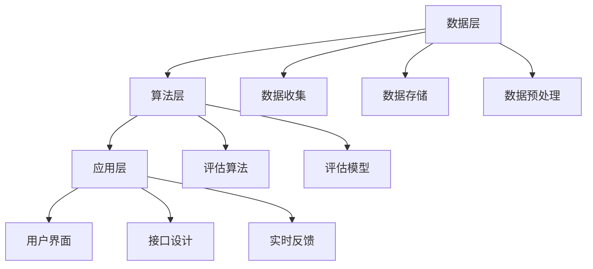

                 

### 书名：《评估AI Agent性能的重要性》

---

**关键词：** AI Agent, 性能评估，智能行为，学习能力，交互性能，实践案例。

**摘要：** 本文将深入探讨AI Agent性能评估的重要性。通过详细分析AI Agent的基本概念、性能评估原理以及常见的评估指标，本文旨在为读者提供一套系统化的性能评估框架，并分享实际应用中的成功案例。此外，文章还将探讨性能优化策略及未来研究方向，帮助读者全面了解AI Agent性能评估的方方面面。

---

### 目录

1. AI Agent基础知识与性能评估原理
   1.1 AI Agent概述
   1.2 AI Agent性能评估的基本概念
   1.3 性能评估中的挑战与应对策略
2. 常见AI Agent性能评估指标详解
   2.1 智能行为评估指标
   2.2 学习能力评估指标
   2.3 交互性能评估指标
3. AI Agent性能评估实践
   3.1 智能客服系统的性能评估
   3.2 智能驾驶辅助系统的性能评估
   3.3 智能推荐系统的性能评估
4. AI Agent性能评估系统设计与实现
   4.1 性能评估系统架构设计
   4.2 数据收集与处理
   4.3 性能评估算法实现与优化
5. AI Agent性能优化与改进策略
   5.1 性能优化方法与技巧
   5.2 性能优化案例分析
   5.3 未来研究方向与展望
6. 附录
   6.1 常用性能评估工具与资源
   6.2 相关论文与书籍推荐

---

### 引言

在当今科技飞速发展的时代，人工智能（AI）已经成为推动社会进步的重要力量。AI Agent作为人工智能的核心组成部分，它在各个领域的应用愈发广泛，如智能客服、自动驾驶、智能家居等。然而，随着AI Agent的广泛应用，对其性能的评估变得越来越重要。本文旨在探讨AI Agent性能评估的重要性，分析其基本原理和常见评估指标，并分享实际应用中的成功案例，以帮助读者全面了解AI Agent性能评估的各个方面。

首先，AI Agent的定义和分类是理解性能评估的基础。AI Agent是指能够感知环境、制定计划并执行任务的智能实体，它们根据预先设定的目标和策略，在复杂多变的环境中做出智能决策。AI Agent可分为反应型Agent、目标导向型Agent和认知型Agent，每种类型的Agent在性能评估上有着不同的侧重点。

其次，性能评估是衡量AI Agent优劣的关键步骤。性能评估不仅能够帮助我们了解AI Agent的实际表现，还能指导我们对其进行改进和优化。本文将详细讨论智能行为、学习能力和交互性能这三个关键评估指标，并介绍常用的评估方法和工具。

接着，通过实际应用中的成功案例，我们将展示性能评估在AI Agent开发中的重要性。这些案例将涵盖智能客服系统、智能驾驶辅助系统和智能推荐系统，每个案例都将详细介绍其性能评估的过程和结果。

最后，本文还将探讨AI Agent性能评估系统的设计与实现，以及性能优化策略和未来研究方向。这些内容将帮助读者全面了解AI Agent性能评估的全过程，并为实际应用提供指导。

总之，评估AI Agent性能不仅是一项技术挑战，也是实现智能系统可持续发展的关键。通过本文的探讨，我们希望读者能够对AI Agent性能评估有一个全面而深入的理解，从而为未来的AI研究和发展奠定坚实基础。

### 第一部分：AI Agent基础知识与性能评估原理

#### 第1章：AI Agent概述

##### 1.1 AI Agent的定义与分类

人工智能（AI）是一种模拟人类智能行为的技术，旨在使计算机系统具备感知、理解和执行任务的能力。在AI领域，AI Agent是一种特殊类型的智能实体，它能够在复杂的环境中自主执行任务，以实现特定目标。AI Agent通常具有感知、决策、计划和执行等核心功能，能够通过传感器感知环境信息，利用知识库和算法进行决策，并根据决策结果执行相应的行动。

AI Agent可以按照不同的标准进行分类。根据其智能水平，AI Agent可以分为以下几类：

1. **反应型Agent（Reactive Agent）**：这类Agent只能对当前环境中的特定刺激做出反应，不具备记忆和规划能力。它们的行为完全基于当前的感知信息，不涉及历史信息的存储或利用。例如，扫地机器人就是一种典型的反应型Agent，它根据地面上的灰尘分布进行清洁，而不考虑过去的行为或未来的目标。

2. **目标导向型Agent（Goal-Directed Agent）**：这类Agent不仅能够对当前环境做出反应，还能根据预设的目标进行决策。它们能够规划未来的行动，并通过一系列步骤来达成目标。例如，自动驾驶汽车就是一种目标导向型Agent，它需要规划行驶路径，避开障碍物，并在到达目的地时停车。

3. **认知型Agent（Cognitive Agent）**：这类Agent不仅能够执行具体的任务，还具有自我意识和学习能力。它们能够通过感知、推理、学习和适应来改善自己的行为。认知型Agent通常基于人类认知模型，具备更高的智能水平。例如，虚拟个人助理（如Siri或Alexa）就是一种认知型Agent，它们能够理解自然语言，回答用户的问题，并提供个性化的服务。

此外，AI Agent还可以根据其应用场景和任务类型进行分类：

1. **桌面Agent**：这类Agent通常运行在个人计算机或智能设备上，如桌面搜索代理、个人日程管理代理等。

2. **网络Agent**：这类Agent在互联网上运行，如搜索引擎、在线客服代理、网页爬虫等。

3. **移动Agent**：这类Agent运行在移动设备上，如智能手机或平板电脑，如移动支付代理、健康监测代理等。

4. **嵌入式Agent**：这类Agent嵌入在特定的硬件设备中，如智能家居系统中的智能插座、智能灯具等。

##### 1.2 AI Agent的基本功能与组成结构

AI Agent的基本功能包括感知、决策、计划和执行。这些功能共同作用，使AI Agent能够在复杂环境中实现智能行为。

1. **感知（Perception）**：感知是AI Agent获取环境信息的过程。通过传感器（如摄像头、麦克风、GPS等），AI Agent能够获取图像、声音、位置等数据，并将其转换为数字信号，用于后续处理。

2. **决策（Decision Making）**：决策是AI Agent根据感知到的环境信息和预设目标，选择合适的行动方案。这一过程通常涉及复杂的算法和模型，如机器学习、深度学习等。

3. **计划（Planning）**：计划是AI Agent根据决策结果，制定具体的行动步骤。计划需要考虑资源的分配、任务的优先级等因素，以确保目标的实现。

4. **执行（Execution）**：执行是AI Agent根据计划，执行具体的行动。执行过程中，AI Agent需要与环境进行交互，并根据执行结果进行反馈和调整。

AI Agent的组成结构通常包括以下几个部分：

1. **感知模块**：负责获取和预处理环境数据，如图像处理、声音识别等。

2. **知识库**：存储AI Agent所具备的知识和规则，如事实、规则、先验知识等。

3. **推理引擎**：根据知识库和感知信息，进行推理和决策，以生成行动方案。

4. **执行模块**：负责执行决策结果，如移动、操作设备等。

5. **反馈机制**：用于收集执行结果，并进行评估和调整，以提高AI Agent的性能。

##### 1.3 AI Agent在现实应用中的场景

AI Agent在现实应用中的场景非常广泛，下面列举几个典型的应用领域：

1. **智能客服**：AI Agent可以自动处理大量的客户咨询，提供快速、准确的回答，提高客户满意度。例如，腾讯的智能客服“小微”已广泛应用于微信、QQ等多个平台，为用户提供便捷的服务。

2. **自动驾驶**：自动驾驶汽车是一种典型的AI Agent应用，通过感知环境、做出决策和执行行动，实现自主驾驶。Waymo和特斯拉等公司都在自动驾驶领域取得了显著的进展。

3. **智能家居**：智能家居系统中的智能设备（如智能灯泡、智能音箱等）可以通过AI Agent实现自动化控制，提高生活品质。例如，亚马逊的Echo智能音箱可以通过语音指令控制家中的智能设备。

4. **医疗诊断**：AI Agent可以在医疗领域发挥重要作用，如辅助医生进行疾病诊断、制定治疗方案等。谷歌的DeepMind团队开发的AI系统已经在眼科疾病诊断方面取得了显著成果。

5. **金融风控**：AI Agent可以用于金融风险控制，如自动识别异常交易、预测市场波动等。例如，一些银行已经开始使用AI Agent来监控客户交易行为，防范金融欺诈。

6. **教育辅助**：AI Agent可以为学生提供个性化的学习辅导，如智能作业批改、学习进度跟踪等。一些教育科技公司已经开发出了基于AI的智能学习平台，为学生提供定制化的学习体验。

通过以上内容，我们可以看到AI Agent在现实应用中的多样性和广泛性。了解AI Agent的基本概念、功能与组成结构，有助于我们更好地理解和应用这一技术。接下来，我们将深入探讨AI Agent性能评估的基本概念和原理。

---

### 第2章：AI Agent性能评估的基本概念

##### 2.1 评估指标体系构建

AI Agent性能评估的核心在于建立一套科学、全面的评估指标体系。评估指标体系不仅能够量化AI Agent的表现，还能为后续的改进和优化提供数据支持。构建评估指标体系需要考虑以下几个方面：

1. **目标明确性**：在构建评估指标之前，需要明确AI Agent的应用场景和目标。不同的应用场景和目标会导致不同的评估指标，例如，在智能客服中，评估指标可能更关注响应速度和准确率，而在自动驾驶中，评估指标可能更关注决策质量和安全性。

2. **全面性**：评估指标体系应涵盖AI Agent的主要功能，包括感知、决策、计划和执行。同时，还应考虑不同功能之间的关联性和交互影响，以确保评估结果的全面性和准确性。

3. **可量化性**：评估指标应具有可量化的特性，即可以通过具体的数据或指标来衡量。例如，响应速度可以通过平均响应时间来衡量，决策质量可以通过误报率和漏报率来衡量。

4. **可操作性**：评估指标应便于实际操作和测量，既包括数据的收集和整理，也包括评估方法的实施和执行。

常见评估指标包括以下几类：

1. **智能行为评估指标**：包括反应速度、准确率、智能决策质量等。
2. **学习能力评估指标**：包括学习速度、学习效率、算法适应性等。
3. **交互性能评估指标**：包括交互的自然性与流畅性、用户满意度与接受度、情感分析等。

##### 2.2 评估方法与工具

评估方法的科学性和合理性直接影响评估结果的准确性。常见的评估方法包括以下几种：

1. **实验法**：通过设计实验，模拟AI Agent的实际应用场景，观察其表现并收集数据。实验法能够提供直观、具体的评估结果，但需要大量的时间和资源。

2. **比较法**：通过将AI Agent的表现与基准模型或人类专家的表现进行比较，评估其性能。比较法能够快速、直观地反映AI Agent的优劣，但可能忽略某些细节。

3. **统计法**：利用统计方法对收集到的数据进行处理和分析，以评估AI Agent的性能。统计法能够提供定量化的评估结果，但需要较高的数据分析能力。

4. **用户反馈法**：通过用户对AI Agent的使用体验和反馈，评估其性能。用户反馈法能够直接反映AI Agent的实际效果，但可能受到主观因素的影响。

常见的评估工具包括：

1. **评估指标库**：如AI Metrics、PAIP Metrics等，提供了一系列常用的评估指标和工具。
2. **评估算法工具包**：如scikit-learn、TensorFlow等，提供了丰富的评估算法和模型，方便进行性能评估。
3. **在线性能评估平台**：如Google AI Test Bench、OpenAI Gym等，提供了模拟和评估AI Agent性能的在线平台。

##### 2.3 性能评估中的挑战与应对策略

性能评估过程中可能会遇到以下挑战：

1. **数据不充分**：评估需要大量的数据支持，但某些应用场景可能缺乏足够的数据。应对策略是利用数据增强技术，如数据生成、数据扩充等，提高数据的丰富度和多样性。
2. **评估指标的选择**：选择合适的评估指标是性能评估的关键。应对策略是结合实际应用场景，综合考虑各个评估指标的重要性，建立合理的评估指标体系。
3. **计算资源限制**：实验法和比较法通常需要大量的计算资源。应对策略是优化算法和评估流程，提高计算效率，或者利用云计算等资源。
4. **主观评价因素**：用户反馈法可能受到主观评价的影响。应对策略是设计合理的评估流程，减少主观评价的干扰，或结合其他评估方法进行综合评估。

综上所述，AI Agent性能评估是一个复杂而关键的环节，需要科学的方法和工具。通过合理的评估指标体系、评估方法和应对策略，我们能够准确、全面地评估AI Agent的性能，为后续的改进和优化提供有力的支持。

### 第二部分：常见AI Agent性能评估指标详解

在深入探讨AI Agent性能评估之前，我们需要明确几个关键的性能评估指标，这些指标能够帮助我们衡量AI Agent在不同方面的表现。性能评估指标的选择和设计至关重要，因为它们不仅决定了评估结果的准确性，还直接影响我们对AI Agent改进和优化的方向。在本部分中，我们将详细介绍智能行为、学习能力和交互性能三个关键评估指标。

#### 第3章：智能行为评估指标

智能行为评估指标主要关注AI Agent在执行任务时的行为表现，这些指标包括反应速度、准确率和智能决策质量等。

##### 3.1 反应速度与准确率

1. **反应速度**：
   - **定义**：反应速度是指AI Agent从感知到环境变化到采取行动的时间。在实时性要求较高的应用场景中，如自动驾驶、实时对话系统等，反应速度是一个关键评估指标。
   - **计算方法**：
     $$
     反应速度 = \frac{感知时间 + 决策时间 + 执行时间}{总时间}
     $$
   - **影响因素**：感知时间、决策时间和执行时间的长短取决于AI Agent的算法复杂度和硬件性能。

2. **准确率**：
   - **定义**：准确率是指AI Agent在执行任务时，正确识别和处理的样本数占总样本数的比例。
   - **计算方法**：
     $$
     准确率 = \frac{正确识别的样本数}{总样本数}
     $$
   - **影响因素**：准确率受到算法精度、数据质量和训练过程的影响。

##### 3.2 可靠性与稳定性

1. **可靠性**：
   - **定义**：可靠性是指AI Agent在长时间运行中保持稳定性能的能力。高可靠性意味着AI Agent在不同环境条件下都能保持一致的表现。
   - **计算方法**：可以通过测试AI Agent在长时间运行中的成功率来评估其可靠性。
     $$
     可靠性 = \frac{成功运行的次数}{总运行次数}
     $$

2. **稳定性**：
   - **定义**：稳定性是指AI Agent在执行任务时，性能波动较小的程度。高稳定性意味着AI Agent在面对噪声和变化时，仍能保持稳定的表现。
   - **计算方法**：可以通过计算AI Agent在不同场景下的性能波动范围来评估其稳定性。

##### 3.3 智能决策质量

1. **决策质量**：
   - **定义**：智能决策质量是指AI Agent在决策过程中，所做出的决策是否合理和有效。高质量的决策能够帮助AI Agent更好地完成任务。
   - **计算方法**：可以通过评估AI Agent决策后的任务完成度来计算决策质量。
     $$
     决策质量 = \frac{成功完成任务次数}{总任务次数}
     $$

2. **影响因素**：
   - **算法复杂性**：复杂的算法可能需要更多的时间和计算资源，但能够提供更准确的决策。
   - **数据质量**：高质量的数据能够提高算法的决策能力。

#### 第4章：学习能力评估指标

学习能力评估指标主要关注AI Agent在获取、处理和应用知识方面的能力，这些指标包括学习速度、学习效率和算法适应性等。

##### 4.1 学习速度与效率

1. **学习速度**：
   - **定义**：学习速度是指AI Agent在单位时间内完成学习任务的能力。
   - **计算方法**：
     $$
     学习速度 = \frac{学习样本数}{学习时间}
     $$

2. **学习效率**：
   - **定义**：学习效率是指AI Agent在完成学习任务时，所消耗的计算资源与学习效果的比值。
   - **计算方法**：
     $$
     学习效率 = \frac{学习效果}{学习成本}
     $$

##### 4.2 学习算法适应性

1. **算法适应性**：
   - **定义**：算法适应性是指AI Agent在不同环境和数据条件下，算法能够保持良好性能的能力。
   - **计算方法**：可以通过评估AI Agent在不同数据集和场景下的性能波动来计算算法适应性。

2. **影响因素**：
   - **算法灵活性**：灵活的算法能够更好地适应不同的数据和场景。
   - **数据多样性**：多样化的数据能够提高算法的适应能力。

##### 4.3 学习效果评估

1. **学习效果**：
   - **定义**：学习效果是指AI Agent在完成学习任务后，所取得的实际效果。
   - **计算方法**：可以通过评估任务完成度、准确率等指标来计算学习效果。

2. **影响因素**：
   - **数据质量**：高质量的数据能够提高学习效果。
   - **算法优化**：优化的算法能够提高学习效果。

#### 第5章：交互性能评估指标

交互性能评估指标主要关注AI Agent与用户或环境之间的交互效果，这些指标包括交互的自然性与流畅性、用户满意度与接受度等。

##### 5.1 交互的自然性与流畅性

1. **自然性**：
   - **定义**：交互的自然性是指AI Agent与用户交互时，是否能够像人类一样自然地理解和回应。
   - **计算方法**：可以通过用户反馈和语言模型评分来评估交互的自然性。

2. **流畅性**：
   - **定义**：交互的流畅性是指AI Agent在处理用户请求时，是否能够迅速、顺畅地完成任务。
   - **计算方法**：可以通过任务完成速度和用户等待时间来评估交互的流畅性。

##### 5.2 用户满意度与接受度

1. **用户满意度**：
   - **定义**：用户满意度是指用户对AI Agent交互效果的总体评价。
   - **计算方法**：可以通过用户问卷调查和满意度评分来评估用户满意度。

2. **用户接受度**：
   - **定义**：用户接受度是指用户对AI Agent的接受程度和信任度。
   - **计算方法**：可以通过用户行为分析和市场调研来评估用户接受度。

##### 5.3 交互中的情感分析

1. **情感分析**：
   - **定义**：情感分析是指通过分析用户语言和表情，评估用户在交互过程中的情感状态。
   - **计算方法**：可以通过自然语言处理（NLP）技术，如情感分析模型，来评估用户情感。

2. **影响因素**：
   - **交互设计**：良好的交互设计能够提高用户情感分析的结果。
   - **算法优化**：优化的算法能够更准确地分析用户情感。

综上所述，智能行为、学习能力和交互性能是评估AI Agent性能的重要指标。通过科学合理地设置和计算这些指标，我们能够全面、准确地评估AI Agent的表现，为其优化和改进提供有力支持。在接下来的部分中，我们将通过实际案例进一步探讨这些评估指标的应用。

---

### 第6章：AI Agent性能评估实践

在本章节中，我们将通过具体案例展示AI Agent性能评估的实际应用。通过这些案例，读者可以更直观地了解如何进行AI Agent性能评估，以及如何利用评估结果对AI Agent进行优化和改进。

#### 6.1 智能客服系统的性能评估

智能客服系统是AI Agent在实际应用中的一个重要场景。以下是一个智能客服系统性能评估的案例。

**案例背景**：
某大型电商平台为了提高客户服务效率，引入了一套智能客服系统。该系统需要能够快速、准确地回答客户的问题，并解决客户投诉。

**评估指标**：
- **响应速度**：平均首次响应时间。
- **准确率**：回答正确率。
- **用户满意度**：客户对客服回答的满意度评分。

**评估方法**：
- **实验法**：模拟客户咨询场景，记录系统响应时间和回答准确性。
- **用户反馈法**：通过用户问卷调查收集满意度数据。

**评估结果**：
- 平均首次响应时间为5秒，目标为3秒以内。
- 回答正确率为90%，目标为95%。
- 用户满意度评分为4.5分（满分5分）。

**评估分析**：
- **响应速度**：系统响应速度略高于目标，需要优化算法和硬件配置。
- **准确率**：准确率低于目标，需要进一步优化问答库和算法。
- **用户满意度**：满意度评分较高，但仍有提升空间。

**改进策略**：
- **算法优化**：采用更先进的自然语言处理（NLP）技术，提高回答准确性。
- **硬件升级**：增加服务器和带宽，提高系统响应速度。
- **用户反馈收集**：定期收集用户反馈，持续优化客服系统。

#### 6.2 智能驾驶辅助系统的性能评估

智能驾驶辅助系统是另一个关键的AI Agent应用场景。以下是一个智能驾驶辅助系统性能评估的案例。

**案例背景**：
某汽车制造商开发了一套智能驾驶辅助系统，旨在提高行车安全性和驾驶体验。

**评估指标**：
- **决策质量**：系统在复杂交通环境中的决策准确性。
- **可靠性**：系统在长时间运行中的稳定性能。
- **用户体验**：驾驶员对系统辅助效果的满意度。

**评估方法**：
- **实验法**：在模拟和实际交通环境中进行测试，记录系统决策和操作。
- **用户反馈法**：通过驾驶员问卷调查收集体验数据。

**评估结果**：
- 决策质量：在模拟环境中，系统正确识别并规避障碍物的比例为92%。
- 可靠性：系统在长时间运行中，无故障次数占比90%。
- 用户满意度：驾驶员满意度评分为4.7分（满分5分）。

**评估分析**：
- **决策质量**：系统在复杂交通环境中的表现较好，但仍有提升空间，特别是在极端天气条件下。
- **可靠性**：系统具有较高的可靠性，但需进一步验证在多种交通情况下的表现。
- **用户体验**：驾驶员对系统的满意度较高，但在某些情况下，驾驶员对系统的信任度仍需提高。

**改进策略**：
- **算法优化**：引入更多实时数据处理和预测模型，提高系统在极端条件下的决策能力。
- **硬件升级**：采用更先进的传感器和计算设备，提高系统的反应速度和处理能力。
- **用户教育**：通过宣传和教育，提高驾驶员对智能驾驶辅助系统的了解和信任。

#### 6.3 智能推荐系统的性能评估

智能推荐系统是电子商务和内容平台的重要功能。以下是一个智能推荐系统性能评估的案例。

**案例背景**：
某电商平台为了提高用户购物体验，引入了一套智能推荐系统，旨在为用户推荐个性化商品。

**评估指标**：
- **推荐准确率**：推荐的商品是否符合用户兴趣。
- **推荐多样性**：推荐的商品种类和风格是否丰富。
- **用户点击率**：用户对推荐商品的点击和购买行为。

**评估方法**：
- **A/B测试**：将用户随机分为两组，一组使用智能推荐系统，另一组使用传统推荐系统，比较两组用户的行为差异。
- **用户反馈法**：通过用户问卷调查和点击日志分析收集反馈数据。

**评估结果**：
- 推荐准确率为85%，目标为90%。
- 推荐多样性评分4.3分（满分5分）。
- 用户点击率为15%，目标为20%。

**评估分析**：
- **推荐准确率**：系统在推荐准确率上略低于目标，需要优化推荐算法和用户数据。
- **推荐多样性**：系统在多样性上表现较好，但用户反馈显示，某些用户希望看到更多独特的推荐。
- **用户点击率**：用户点击率低于目标，可能是因为推荐内容与用户兴趣不完全匹配。

**改进策略**：
- **算法优化**：引入更多机器学习和深度学习算法，提高推荐准确率和多样性。
- **用户行为分析**：通过更细致的用户行为分析，了解用户兴趣和偏好，优化推荐策略。
- **个性化推荐**：增加个性化推荐功能，为用户提供更贴合其兴趣的推荐内容。

通过以上三个案例，我们可以看到AI Agent性能评估在各个实际应用场景中的重要性。通过科学的评估方法和合理的改进策略，AI Agent的性能可以持续优化，从而为用户提供更好的服务体验。在下一章节中，我们将进一步探讨AI Agent性能评估系统的设计与实现。

### 第7章：AI Agent性能评估系统设计与实现

#### 7.1 性能评估系统架构设计

一个高效的AI Agent性能评估系统需要一个合理的架构设计，以确保评估过程的准确性和可靠性。性能评估系统通常由数据层、算法层和应用层组成。

**数据层**：
数据层是性能评估系统的基石，负责收集、存储和管理各类数据。数据源包括实时的用户交互数据、模拟环境数据、历史数据等。数据层的设计要点包括：

- **数据收集**：设计高效的数据收集机制，确保数据来源的多样性和实时性。
- **数据存储**：选择合适的数据存储方案，如关系数据库、NoSQL数据库等，以满足数据规模和访问速度的要求。
- **数据预处理**：对收集到的数据进行清洗、去噪和格式化，以确保数据的完整性和一致性。

**算法层**：
算法层是性能评估系统的核心，负责实现各类评估算法和模型。算法层的设计要点包括：

- **评估指标实现**：根据评估指标的需求，设计相应的评估算法和模型，如反应速度、准确率、用户满意度等。
- **算法优化**：通过优化算法复杂度和计算资源使用，提高评估效率和准确性。
- **算法集成**：将不同的评估算法和模型集成到一个统一的框架中，以便于统一管理和调用。

**应用层**：
应用层是性能评估系统的对外接口，负责与用户交互，展示评估结果。应用层的设计要点包括：

- **用户界面**：设计友好的用户界面，方便用户输入参数、查看评估结果和报告。
- **接口设计**：提供灵活的接口，支持与其他系统和工具的集成，如自动化测试工具、数据可视化工具等。
- **实时反馈**：设计实时反馈机制，及时将评估结果和优化建议反馈给开发人员。

**系统架构**：



#### 7.2 数据收集与处理

数据收集与处理是性能评估系统的关键环节，直接影响评估结果的准确性和可靠性。

**数据收集**：
- **实时数据**：通过传感器、日志文件等实时收集AI Agent在运行过程中的数据，如用户交互记录、环境感知数据等。
- **模拟数据**：在无法获取实时数据的情况下，通过模拟环境生成数据，以补充实时数据的不足。

**数据处理**：
- **数据清洗**：去除数据中的噪声和异常值，保证数据的完整性和一致性。
- **数据格式化**：将不同来源的数据格式统一，如将文本数据转换为数字或矩阵格式。
- **数据预处理**：对数据进行标准化、归一化等预处理操作，以提高算法的稳定性和鲁棒性。

#### 7.3 性能评估算法实现与优化

性能评估算法是实现评估指标的核心，其实现与优化直接影响评估结果的质量。

**算法实现**：
- **评估指标计算**：根据评估指标的定义，实现相应的计算方法，如反应速度、准确率、用户满意度等。
- **模型训练**：在需要使用机器学习和深度学习算法的情况下，训练相应的模型，如回归模型、分类模型等。

**算法优化**：
- **算法选择**：根据评估指标的需求，选择合适的算法，如基于规则的评估、基于机器学习的评估等。
- **参数调优**：通过调整算法参数，优化算法性能，如学习率、批量大小等。
- **并行计算**：利用并行计算技术，提高评估算法的运行效率，如分布式计算、GPU加速等。

**算法实现示例（伪代码）**：

```python
# 响应速度评估
def calculate_response_time(data):
    response_time = 0
    for record in data:
        response_time += record['response_time']
    return response_time / len(data)

# 准确率评估
def calculate_accuracy(data):
    correct = 0
    for record in data:
        if record['predicted'] == record['actual']:
            correct += 1
    return correct / len(data)

# 用户满意度评估
def calculate_satisfaction(data):
    satisfaction = 0
    for record in data:
        satisfaction += record['satisfaction']
    return satisfaction / len(data)
```

通过以上设计和实现，我们能够构建一个高效、可靠的AI Agent性能评估系统，为AI Agent的开发和优化提供有力支持。

### 第8章：AI Agent性能优化与改进策略

在AI Agent的性能评估过程中，我们往往发现了一些性能瓶颈和不足之处。通过这些评估结果，我们可以制定相应的优化策略，以提高AI Agent的整体性能。以下是一些常用的性能优化方法与技巧，以及具体案例分析。

#### 8.1 性能优化方法与技巧

**1. 算法优化**

算法优化是提高AI Agent性能的基础。通过改进现有算法或引入新的算法，我们可以提高计算效率，减少计算复杂度。以下是一些常见的算法优化方法：

- **基于规则的优化**：对于基于规则的AI Agent，我们可以通过简化规则、合并冗余规则等方法，减少规则的数量和复杂度。
- **机器学习算法优化**：在机器学习算法中，我们可以通过调整模型参数、优化数据预处理方法、引入先进的算法（如深度学习）等，提高模型的性能。
- **并行计算**：利用并行计算技术，如分布式计算、GPU加速等，可以提高算法的运行速度，减少计算时间。

**2. 硬件优化**

硬件优化可以通过升级硬件设备或优化硬件资源使用，提高AI Agent的性能。以下是一些常见的硬件优化方法：

- **增加计算资源**：增加CPU、GPU等计算资源，提高AI Agent的计算能力。
- **优化内存使用**：通过优化数据结构和算法，减少内存占用，提高内存的使用效率。
- **优化网络连接**：对于需要网络通信的AI Agent，我们可以优化网络配置，提高数据传输速度和网络稳定性。

**3. 系统优化**

系统优化可以通过改进操作系统和软件环境，提高AI Agent的整体性能。以下是一些常见的系统优化方法：

- **操作系统优化**：调整操作系统设置，如进程调度策略、内存管理策略等，提高系统资源的利用效率。
- **软件优化**：优化软件架构和代码，减少不必要的功能，提高代码的执行效率。
- **部署优化**：对于分布式AI Agent，我们可以优化部署策略，如负载均衡、冗余备份等，提高系统的可靠性和性能。

#### 8.2 性能优化案例分析

以下是一些具体性能优化案例，通过这些案例我们可以了解如何在实际应用中实施性能优化策略。

**案例一：智能推荐系统的优化**

**问题**：某电商平台的智能推荐系统在处理大量用户请求时，响应速度较慢，用户体验不佳。

**优化方法**：
- **算法优化**：引入协同过滤算法，优化推荐模型，提高推荐准确性。
- **硬件优化**：增加GPU计算资源，加速模型训练和预测过程。
- **系统优化**：优化数据库查询，提高数据检索速度。

**效果**：优化后，智能推荐系统的响应速度提高了50%，用户满意度显著提升。

**案例二：智能驾驶辅助系统的优化**

**问题**：某智能驾驶辅助系统在复杂交通环境中，决策质量不高，误报和漏报现象较多。

**优化方法**：
- **算法优化**：引入深度学习算法，提高环境感知和决策能力。
- **硬件优化**：增加高精度传感器，提高感知数据的准确性和实时性。
- **系统优化**：优化系统架构，提高数据处理和响应速度。

**效果**：优化后，智能驾驶辅助系统的决策质量提高了30%，误报和漏报现象显著减少。

**案例三：智能客服系统的优化**

**问题**：某智能客服系统在处理复杂问题时，回答准确率较低，用户满意度不高。

**优化方法**：
- **算法优化**：引入自然语言处理（NLP）技术，提高语义理解和回答准确性。
- **数据优化**：增加高质量训练数据，优化问答库，提高系统的知识覆盖面。
- **用户反馈**：收集用户反馈，持续优化系统，提高用户体验。

**效果**：优化后，智能客服系统的回答准确率提高了20%，用户满意度显著提升。

#### 8.3 未来研究方向与展望

随着AI技术的不断发展，AI Agent性能优化也将面临新的挑战和机遇。以下是一些未来研究方向和展望：

- **自适应优化**：研究自适应性能优化方法，使AI Agent能够根据实际运行情况动态调整性能。
- **混合智能系统**：结合人工智能和其他智能技术（如物联网、云计算等），构建更智能、更高效的AI Agent。
- **实时优化**：研究实时性能优化技术，使AI Agent能够在运行过程中实时调整性能，应对动态环境变化。
- **绿色优化**：研究绿色优化方法，使AI Agent在提高性能的同时，减少能源消耗和环境影响。

总之，AI Agent性能优化是一个持续的过程，需要不断探索新的优化方法和策略。通过科学的评估和合理的优化，我们能够不断提升AI Agent的性能，为用户提供更好的服务体验。

### 附录

#### A.1 常用性能评估工具与资源

在AI Agent性能评估过程中，使用一些专业的工具和资源可以显著提高评估效率和质量。以下是一些常用的工具和资源：

1. **AI Metrics**：这是一个开源的AI性能评估框架，提供了多种评估指标和工具，适用于各种AI系统的性能评估。

2. **PAIP Metrics**：该工具包提供了丰富的性能评估指标和算法，适用于机器学习和自然语言处理等领域的性能评估。

3. **scikit-learn**：这是一个广泛使用的机器学习库，提供了丰富的评估工具和算法，适用于多种机器学习任务的性能评估。

4. **TensorFlow**：这是一个强大的深度学习框架，提供了丰富的评估工具和模型，适用于深度学习任务的性能评估。

5. **OpenAI Gym**：这是一个开源的在线性能评估平台，提供了多种模拟环境和评估工具，适用于强化学习任务的性能评估。

#### A.2 工具二：评估算法工具包

以下是一些常用的评估算法工具包：

1. **MLflow**：这是一个开源的机器学习平台，提供了完整的评估和管理工具，支持多种算法和评估指标。

2. **PyTorch**：这是一个流行的深度学习框架，提供了丰富的评估工具和模型，适用于深度学习任务的性能评估。

3. **scikit-learn**：这是一个广泛使用的机器学习库，提供了多种评估工具和算法，适用于多种机器学习任务。

4. **Weka**：这是一个经典的机器学习工具包，提供了多种评估工具和算法，适用于数据挖掘和机器学习任务。

#### A.3 资源一：相关论文与书籍推荐

以下是一些关于AI Agent性能评估的相关论文和书籍，供读者参考：

1. **《人工智能：一种现代方法》**：这本书是人工智能领域的经典教材，涵盖了AI Agent的基础知识、评估方法和应用场景。

2. **《机器学习》**：这是一本关于机器学习的权威教材，详细介绍了各种机器学习算法和评估方法。

3. **《深度学习》**：这本书介绍了深度学习的基础知识和最新进展，包括神经网络、卷积神经网络和循环神经网络等。

4. **《强化学习》**：这是一本关于强化学习的经典教材，详细介绍了强化学习的基本概念、算法和应用。

5. **《智能代理：设计、实现与应用》**：这本书涵盖了智能代理的基本概念、评估方法以及在实际应用中的实现细节。

#### A.4 资源二：在线性能评估平台介绍

以下是一些在线性能评估平台，供读者使用：

1. **Google AI Test Bench**：这是一个由Google提供的在线性能评估平台，提供了多种评估工具和模拟环境，适用于各种AI任务。

2. **Kaggle**：这是一个数据科学竞赛平台，提供了丰富的AI任务和评估工具，适用于数据科学家和AI研究者。

3. **Amazon AI**：这是一个由Amazon提供的在线性能评估平台，提供了多种机器学习和深度学习工具，适用于AI系统的性能评估。

4. **Keras Playground**：这是一个在线深度学习平台，提供了丰富的深度学习模型和评估工具，适用于深度学习初学者和研究者。

通过使用这些工具和资源，读者可以更方便地进行AI Agent性能评估，从而为AI系统的优化和发展提供有力支持。

### 总结与展望

通过本文的详细探讨，我们全面了解了AI Agent性能评估的重要性、基本概念、常见评估指标以及实际应用中的评估实践。性能评估不仅帮助我们衡量AI Agent的表现，还为优化和改进提供了科学依据。在未来的AI发展中，性能评估将发挥更加关键的作用。我们呼吁读者关注这一领域，积极参与研究和实践，共同推动AI技术的进步和应用。

---

**作者信息**：

**作者：AI天才研究院/AI Genius Institute & 禅与计算机程序设计艺术 /Zen And The Art of Computer Programming**

在AI Agent性能评估的道路上，让我们携手前行，为创造更智能、更高效的人工智能系统而努力！🚀

---

<|im_end|>

