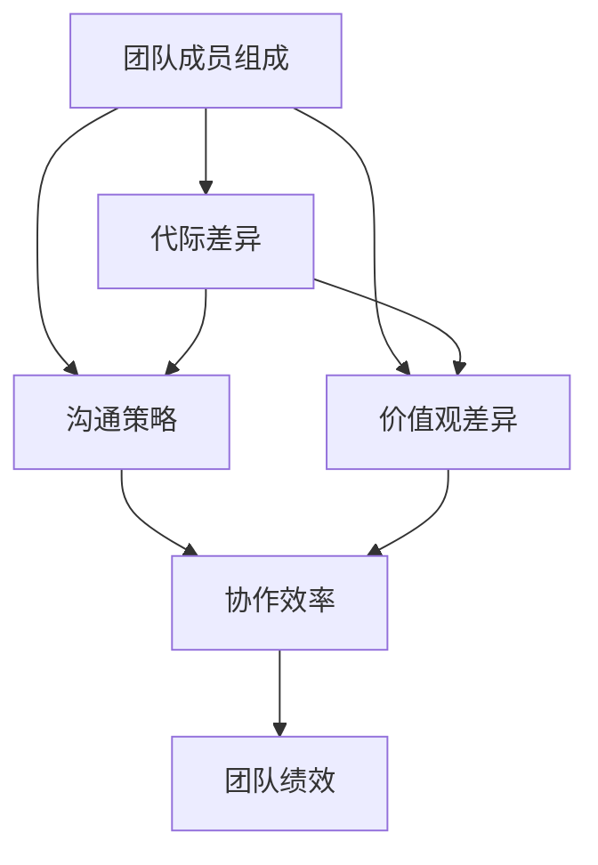

                 

### 跨代际团队管理的定义与重要性

#### 1.1 跨代际团队管理的定义

跨代际团队管理是指在同一个团队中，存在来自不同年代（代际）的成员，这些成员由于生活经历、价值观、沟通方式和工作态度等方面的差异，需要特定的管理策略和实践。在当今全球化的背景下，跨代际团队管理变得愈发重要，因为越来越多的组织在招聘时不再局限于某个特定年龄段的人才，而是寻求拥有多样化经验和技能的团队成员。

跨代际团队管理涉及到以下关键概念：

- **团队成员组成**：团队中的成员来自不同的代际，如婴儿潮一代（1946-1964年出生）、X一代（1965-1979年出生）、Y一代（1980-1994年出生）和Z一代（1995年及以后出生）。
- **代际差异**：不同代际的成员在工作态度、价值观、沟通方式和知识背景等方面存在显著差异。
- **沟通策略**：为了有效地管理跨代际团队，领导者需要采用适应不同代际的沟通策略。
- **价值观差异**：不同代际的价值观差异会影响团队的合作、决策过程和绩效评估。
- **协作效率**：跨代际团队的管理策略将直接影响团队的协作效率和整体绩效。

以下是一个简化的 Mermaid 流程图，展示了跨代际团队管理的关键概念及其相互联系。

#### 1.2 跨代际团队管理的重要性

跨代际团队管理的重要性体现在以下几个方面：

1. **促进团队合作**：有效的跨代际团队管理可以帮助减少误解和冲突，增强团队成员之间的信任和合作。通过理解和尊重不同代际的特点，领导者可以促进团队成员之间的沟通和协作，从而提高团队的整体绩效。

2. **提高创新性**：跨代际团队可以带来多样化的思维和经验，这有助于激发创新。不同代际的成员可以分享各自的观点和见解，从而推动团队的创新和发展。

3. **增强团队绩效**：跨代际团队管理策略可以提高团队的协作效率，从而提高整体绩效。通过确保所有团队成员都能在工作中发挥最佳作用，领导者可以帮助团队实现更高的目标。

4. **适应多元化社会**：随着社会的多元化发展，跨代际团队管理成为了一种必要的技能。领导者需要具备管理来自不同文化背景和代际的团队成员的能力，以适应日益变化的市场需求。

5. **培养下一代领导者**：通过跨代际团队管理，领导者可以培养年轻一代的团队成员，帮助他们成长为未来的领导者。这种经验对于团队成员的职业发展至关重要。

综上所述，跨代际团队管理是一个复杂但至关重要的领域。领导者需要理解不同代际的差异，并采用适当的沟通策略和管理实践，以促进团队合作、提高创新性和增强团队绩效。只有这样，团队才能在竞争激烈的全球市场中取得成功。

#### 第1章：跨代际团队管理的定义与重要性

##### 1.1 跨代际团队管理的定义

跨代际团队管理是一种特殊的管理模式，它涉及在一个团队中协调和管理来自不同年龄段的成员。这些成员可能包括婴儿潮一代、X一代、Y一代和Z一代等不同的代际群体。每个代际群体都有其独特的工作态度、价值观、沟通方式和生活经验，这些差异使得跨代际团队管理变得复杂且具有挑战性。

**婴儿潮一代**（1946-1964年出生）通常在传统的工作环境中成长，他们注重稳定和忠诚，倾向于遵循规则和程序。这一代人通常重视权威和经验，并期望在工作中得到明确的指导。

**X一代**（1965-1979年出生）也被称为“沉默的一代”，他们在经济动荡和科技变革的时期成长，对权威和机构持有批判态度。X一代倾向于独立工作，强调个人成就和自由。

**Y一代**（1980-1994年出生），也被称为“千禧一代”，他们在互联网和社交媒体的时代成长，更加注重工作与生活的平衡，渴望在职业发展中获得成长和自我实现的机会。

**Z一代**（1995年及以后出生），生活在数字化和全球化时代，他们对技术非常熟悉，喜欢创新和变化，重视多样性和包容性。

跨代际团队管理需要领导者具备对不同代际特点和需求的理解，并采取相应策略来协调和融合这些差异，以实现团队的目标和提升整体绩效。

##### 1.2 跨代际团队管理的重要性

跨代际团队管理的重要性体现在以下几个方面：

1. **促进团队合作**：不同代际的成员拥有不同的经验和技能，通过有效的跨代际管理，可以促进团队成员之间的沟通和协作，减少误解和冲突，增强团队凝聚力。

2. **提高创新性**：跨代际团队可以带来多样化的思维和观点，有助于激发创新。不同代际的成员可以从不同的角度和经验出发，提出创新的解决方案。

3. **增强团队绩效**：有效的跨代际团队管理可以提高团队的协作效率，确保每个成员都能在最适合的环境中发挥最佳作用。这有助于团队实现更高的绩效目标。

4. **适应多元化社会**：随着社会的多元化发展，组织需要具备管理跨代际团队的能力。这不仅有助于适应变化的市场需求，还能够吸引和保留多样化的员工。

5. **培养下一代领导者**：通过跨代际团队管理，领导者可以培养年轻一代的成员，帮助他们成长为未来的领导者。这种经验对于团队成员的职业发展至关重要。

综上所述，跨代际团队管理对于组织的成功至关重要。领导者需要理解不同代际的特点，并采取相应的管理策略，以实现团队的共同目标。

##### 1.3 跨代际团队管理面临的挑战

尽管跨代际团队管理带来了许多优势，但它也面临着一系列挑战。以下是一些主要的挑战及其解决方案：

1. **沟通障碍**：不同代际的成员可能拥有不同的沟通方式和风格，这可能导致沟通障碍。例如，婴儿潮一代可能更倾向于正式和书面沟通，而Y一代和Z一代则更偏好非正式和数字化沟通。解决方案包括：

   - **明确沟通期望**：领导者可以明确团队的沟通期望，确保所有成员都了解如何有效沟通。
   - **提供沟通培训**：为不同代际的成员提供沟通技巧培训，帮助他们更好地理解和适应其他代际的沟通风格。

2. **价值观差异**：不同代际的价值观可能存在显著差异，这可能导致团队成员在决策过程中产生分歧。例如，婴儿潮一代可能更注重稳定和忠诚，而Y一代和Z一代则更看重创新和自我实现。解决方案包括：

   - **建立共同价值观**：领导者可以建立团队的共同价值观，确保所有成员都认同并追求这些价值观。
   - **鼓励开放讨论**：鼓励团队成员在决策过程中分享他们的观点和价值观，以促进理解和合作。

3. **工作态度差异**：不同代际的工作态度也可能导致冲突。例如，X一代可能更注重个人成就，而Y一代和Z一代则更倾向于团队合作。解决方案包括：

   - **灵活的工作安排**：领导者可以根据不同代际的工作态度，提供灵活的工作安排，以适应团队成员的需求。
   - **团队建设活动**：通过团队建设活动，增强团队成员之间的联系和合作。

4. **技术熟练度差异**：不同代际对技术的熟悉程度可能不同，这可能导致在技术应用和创新方面的差异。解决方案包括：

   - **技术培训**：为不同代际的成员提供技术培训，确保他们都能跟上技术的发展。
   - **知识共享**：鼓励团队成员分享他们的技术知识和经验，促进知识的共享和交流。

通过认识到并应对这些挑战，领导者可以更好地管理跨代际团队，提高团队的整体绩效和协作效率。

##### 1.4 成功的跨代际团队管理案例

成功的跨代际团队管理案例可以提供宝贵的经验和启示。以下是一个例子：

**公司名称**：某全球知名科技公司

**背景**：该公司在成立之初就致力于建立多元化的团队，他们意识到跨代际团队管理对于公司创新和竞争力的重要性。

**解决方案**：

- **明确目标和价值观**：公司制定了明确的目标和共同的价值观，确保所有团队成员都认同并追求这些目标。
- **定制化沟通策略**：公司为不同代际的员工提供定制化的沟通培训，帮助他们理解和适应其他代际的沟通方式。
- **灵活的工作安排**：公司提供了灵活的工作安排，以适应不同代际员工的需求，例如远程工作、弹性工作时间等。
- **知识共享平台**：公司建立了一个知识共享平台，鼓励员工分享他们的技术知识和经验，促进知识的传递和交流。

**结果**：

- **提高创新性**：跨代际团队的多样性促进了创新，公司推出了多项具有竞争力的新产品。
- **增强团队合作**：通过定制化的沟通策略和灵活的工作安排，团队成员之间的沟通和协作得到显著提升。
- **增强员工满意度**：员工满意度提高，员工流失率降低，公司吸引了更多的优秀人才。

这个案例表明，通过有效的跨代际团队管理策略，组织可以实现更高的绩效和员工满意度。

### 第2章：代际差异与价值观分析

不同代际的团队成员在工作态度、价值观、沟通方式和知识背景等方面存在显著差异，这些差异对跨代际团队的管理和协作产生了深远的影响。在本章中，我们将详细探讨这些代际差异及其具体表现，分析其对团队决策过程和团队合作的影响。

#### 2.1 代际差异的表现

1. **工作态度**：不同代际的成员对工作态度有着不同的看法和期望。例如，婴儿潮一代倾向于认为工作是为了实现稳定和长期的职业发展，他们倾向于遵循规则和程序，重视工作与生活的平衡。相比之下，X一代更倾向于独立工作，强调个人成就和自主性，他们倾向于在工作中寻求新的挑战和机会。Y一代和Z一代则更加注重工作与生活的平衡，强调个人成长和自我实现。

2. **沟通方式**：不同代际的成员在沟通方式上也有显著差异。婴儿潮一代倾向于正式和书面沟通，偏好面对面的交流，他们重视礼仪和尊重。X一代在沟通上相对灵活，但偏好直接的交流方式，他们倾向于快速解决问题。Y一代和Z一代则更偏好非正式和数字化沟通，如电子邮件、即时通讯和社交媒体，他们倾向于实时互动和即时反馈。

3. **知识背景**：不同代际的成员在知识背景和技术熟练度上也有很大差异。婴儿潮一代在技术发展初期工作，他们可能缺乏对新兴技术的深入了解。X一代和Y一代则在互联网和数字化时代成长，他们更熟悉新兴技术和工具。Z一代则生活在数字化和全球化时代，他们从小就接触互联网和移动设备，对新兴技术有更深入的了解和熟练度。

4. **价值观**：不同代际的成员在价值观上也有显著差异。婴儿潮一代注重忠诚、责任和稳定，他们倾向于认为长期承诺是企业成功的关键。X一代强调个人成就、创新和自由，他们倾向于在工作中追求自我实现。Y一代和Z一代则更加注重多样性和包容性，他们倾向于在工作中追求公平和正义。

#### 2.2 代际差异的影响

1. **决策过程**：代际差异会影响团队的决策过程。不同代际的成员可能对问题有不同的看法和解决方案。例如，婴儿潮一代可能更倾向于遵循传统的决策过程，通过正式的会议和讨论来达成共识。X一代和Y一代则可能更倾向于快速决策，通过实验和迭代来找到解决方案。Z一代则更倾向于采用数据驱动的决策方法，利用数据分析来支持决策。

2. **团队合作**：代际差异可能影响团队合作的效果。不同代际的成员可能在沟通方式、工作态度和价值观上存在分歧，这可能导致团队合作中出现冲突和误解。例如，婴儿潮一代可能认为面对面的交流是最有效的沟通方式，而Y一代和Z一代则可能认为即时通讯和社交媒体更有效。这些差异需要通过有效的跨代际管理策略来协调和融合。

3. **团队绩效**：代际差异可能对团队绩效产生积极或消极的影响。如果领导者能够有效管理代际差异，激发团队成员的多样性，团队的绩效可能会显著提升。反之，如果代际差异导致团队合作出现障碍，团队的绩效可能会受到影响。

#### 2.3 案例分析：代际差异的实际影响

以下是一个实际案例，展示了代际差异对团队决策过程和团队合作的影响：

**公司名称**：某大型跨国科技公司

**背景**：该公司在开发一款新兴技术产品时，团队由来自不同代际的成员组成。团队成员包括婴儿潮一代、X一代、Y一代和Z一代。

**问题**：

- **决策过程**：婴儿潮一代倾向于通过正式的会议和讨论来制定战略，而X一代和Y一代则希望快速行动，通过实验和迭代来找到解决方案。这种差异导致决策过程缓慢，无法迅速响应市场变化。
- **团队合作**：Y一代和Z一代偏好非正式和数字化沟通，而婴儿潮一代和X一代更倾向于正式和面对面的交流。这种差异导致团队合作中出现沟通障碍和误解。

**解决方案**：

- **建立共同决策机制**：公司引入了共同决策机制，确保所有代际的成员都有机会参与决策过程。通过定期的会议和讨论，不同代际的成员可以分享他们的观点和建议，共同制定战略。
- **提供沟通培训**：公司为所有代际的成员提供了沟通技巧培训，帮助他们理解和适应其他代际的沟通方式。通过这些培训，团队成员之间的沟通和协作得到了显著提升。

**结果**：

- **加快决策过程**：通过建立共同决策机制和提供沟通培训，团队的决策过程得到了显著加快，能够更迅速地响应市场变化。
- **增强团队合作**：通过沟通培训和共同决策机制的引入，团队成员之间的沟通和协作得到了增强，减少了误解和冲突。

这个案例表明，通过理解并管理代际差异，团队可以更有效地进行决策和协作，从而提高整体绩效。

#### 2.4 案例分析：价值观差异的挑战与解决方案

以下是一个关于价值观差异导致挑战及其解决方案的案例分析：

**公司名称**：某创业公司

**背景**：该公司由一群年轻的Y一代和Z一代创业者创立，他们在工作方式和价值观上有着相似的观点，但新加入的一名X一代经理与团队成员的价值观存在显著差异。

**问题**：

- **价值观差异**：X一代经理更注重传统的工作态度和稳定的职业发展，而团队成员则更倾向于创新和快速变化。这种差异导致决策过程中出现分歧，影响团队的整体动力。
- **工作氛围**：X一代经理倾向于正式和权威的工作环境，而团队成员则偏好开放和自由的工作氛围。这种差异导致团队成员之间出现冲突和不满。

**解决方案**：

- **价值观对话**：公司组织了一次价值观对话，让X一代经理和团队成员分享他们的观点和期望。通过这次对话，团队成员理解了彼此的价值观，找到了共同点。
- **灵活的工作安排**：公司引入了灵活的工作安排，允许团队成员根据个人需求和价值观选择工作方式。这种灵活性有助于缓解价值观差异带来的冲突。

**结果**：

- **增强团队凝聚力**：通过价值观对话和灵活的工作安排，团队成员之间的理解增加了，团队凝聚力得到了增强。
- **提升工作效率**：团队成员能够根据个人需求和价值观选择工作方式，工作效率得到提升。

这个案例表明，通过理解和尊重不同代际的价值观差异，团队可以找到解决方案，促进合作和提升绩效。

#### 2.5 案例分析：跨代际团队在项目执行中的挑战与成功

以下是一个关于跨代际团队在项目执行中的挑战及其成功策略的案例分析：

**公司名称**：某大型软件开发公司

**背景**：该公司在开发一款复杂软件项目时，团队成员来自不同的代际。团队成员包括婴儿潮一代、X一代、Y一代和Z一代。

**问题**：

- **技术熟练度差异**：不同代际的成员在技术熟练度上存在显著差异，导致在项目执行过程中出现技术难题和沟通障碍。
- **沟通方式差异**：不同代际的成员在沟通方式上存在差异，导致项目进展中出现误解和冲突。

**解决方案**：

- **技术培训**：公司为不同代际的成员提供了技术培训，帮助他们提升技术熟练度。通过培训，团队成员能够更好地理解项目的技术要求。
- **沟通平台**：公司引入了多种沟通平台，包括面对面的会议、电子邮件、即时通讯和项目管理工具，以满足不同代际成员的沟通需求。

**结果**：

- **技术难题解决**：通过技术培训，团队成员的技术熟练度得到了显著提升，项目中的技术难题得到了有效解决。
- **沟通障碍减少**：通过引入多种沟通平台，团队成员之间的沟通更加顺畅，误解和冲突显著减少。

这个案例表明，通过技术培训和多样化的沟通策略，跨代际团队可以在项目执行中克服代际差异，实现项目的成功。

#### 2.6 代际差异的总结

不同代际的成员在工作态度、沟通方式、知识背景和价值观等方面存在显著差异，这些差异对跨代际团队的管理和协作产生了深远影响。通过理解并管理这些差异，领导者可以：

- **促进团队合作**：通过定制化的沟通策略和灵活的工作安排，减少误解和冲突，增强团队凝聚力。
- **提高创新性**：利用不同代际的多样化和创新思维，激发团队的创新潜力。
- **增强团队绩效**：通过提升团队成员的技术熟练度和沟通效率，提高团队的整体绩效。

总结来说，跨代际团队管理需要领导者具备对不同代际差异的深刻理解，并采取相应的管理策略，以实现团队的目标和提升整体绩效。

### 第3章：跨代际团队的沟通策略

在跨代际团队中，沟通策略的制定至关重要。不同代际的成员拥有不同的沟通风格和工作习惯，这需要领导者采取灵活且多样的沟通策略来确保团队的高效运作。本章将深入探讨适应不同代际沟通方式的策略，并探讨这些策略在实际应用中的效果。

#### 3.1 沟通策略的重要性

有效的沟通策略是跨代际团队管理的基石。良好的沟通可以减少误解和冲突，增强团队凝聚力，提高工作效率。以下是一些沟通策略的重要性：

- **减少误解**：不同代际的成员可能对同一信息有不同的解读，有效的沟通策略可以帮助确保信息传达的准确性和一致性。
- **增强协作**：通过理解和适应不同代际的沟通方式，团队成员可以更好地合作，共同解决问题。
- **提高工作效率**：有效的沟通策略可以减少无效的沟通和重复的工作，提高团队的工作效率。
- **促进团队发展**：良好的沟通有助于团队成员之间的信任和尊重，为团队的发展和创新创造良好的环境。

#### 3.2 适应不同代际的沟通方式

不同代际的成员在沟通方式上存在显著差异，领导者需要根据这些差异制定相应的沟通策略。以下是针对婴儿潮一代、X一代、Y一代和Z一代的沟通策略：

1. **婴儿潮一代**：

   - **沟通方式**：婴儿潮一代倾向于正式和书面沟通，偏好面对面的交流，重视礼仪和尊重。
   - **适应策略**：领导者应该确保沟通内容清晰、明确，并使用正式的语言和书面文档。在面对面交流时，领导者需要表现出耐心和尊重，给予充分的发言机会。

2. **X一代**：

   - **沟通方式**：X一代在沟通上相对灵活，但偏好直接的交流方式，他们倾向于快速解决问题。
   - **适应策略**：领导者可以采用直接和简洁的沟通方式，避免冗长的会议和复杂的流程。领导者应该鼓励X一代成员在遇到问题时直接提出，以便快速解决。

3. **Y一代**：

   - **沟通方式**：Y一代偏好非正式和数字化沟通，如电子邮件、即时通讯和社交媒体，他们倾向于实时互动和即时反馈。
   - **适应策略**：领导者应该提供多样化的沟通渠道，包括即时通讯、电子邮件和视频会议等。同时，领导者应该鼓励Y一代成员使用这些工具，以便及时传达信息和解决问题。

4. **Z一代**：

   - **沟通方式**：Z一代在沟通上非常数字化，偏好实时互动和即时反馈，他们喜欢通过社交媒体和即时通讯工具进行沟通。
   - **适应策略**：领导者需要充分利用数字化工具，如团队聊天应用、项目管理软件等，以适应Z一代的沟通偏好。此外，领导者应该鼓励开放和透明的沟通，确保团队成员之间的信息流通。

#### 3.3 案例分析：成功应用沟通策略的案例

以下是一个成功应用沟通策略的案例分析：

**公司名称**：某全球领先的互联网公司

**背景**：该公司的开发团队由多个代际的成员组成，包括婴儿潮一代、X一代、Y一代和Z一代。

**问题**：

- **沟通障碍**：不同代际的成员在沟通方式上存在显著差异，导致团队内部出现沟通障碍和误解。
- **协作效率低下**：由于沟通不畅，团队在项目执行过程中出现协作效率低下的问题。

**解决方案**：

- **定制化沟通策略**：公司为不同代际的成员制定了定制化的沟通策略。针对婴儿潮一代，公司采用了正式和书面沟通方式；针对X一代，公司鼓励直接和简洁的沟通；针对Y一代，公司提供了多样化的沟通渠道，如即时通讯和电子邮件；针对Z一代，公司利用了数字化工具，如团队聊天应用和项目管理软件。

**结果**：

- **沟通障碍减少**：通过定制化的沟通策略，团队内部沟通障碍显著减少，误解和冲突减少。
- **协作效率提高**：团队成员之间的沟通更加顺畅，项目执行过程中的协作效率显著提高。

这个案例表明，通过定制化的沟通策略，跨代际团队可以克服沟通障碍，提高协作效率。

#### 3.4 案例分析：沟通策略的失败与改进

以下是一个关于沟通策略失败的案例分析及其改进：

**公司名称**：某初创科技公司

**背景**：该初创公司的团队由多个代际的成员组成，但由于缺乏有效的沟通策略，团队内部经常出现冲突和误解。

**问题**：

- **沟通方式单一**：公司主要采用面对面的沟通方式，这导致Y一代和Z一代成员感到不被重视。
- **缺乏即时反馈**：团队在项目执行过程中缺乏即时反馈，导致问题无法及时解决。

**解决方案**：

- **多样化沟通渠道**：公司引入了多样化的沟通渠道，包括即时通讯、电子邮件、视频会议和项目管理工具，以满足不同代际成员的沟通需求。
- **定期反馈机制**：公司建立了定期反馈机制，确保团队成员能够及时了解项目进展和问题，并提供即时反馈。

**结果**：

- **沟通障碍减少**：通过引入多样化的沟通渠道和定期反馈机制，团队内部的沟通障碍显著减少，误解和冲突减少。
- **协作效率提高**：团队成员之间的沟通更加顺畅，项目执行过程中的协作效率显著提高。

这个案例表明，有效的沟通策略需要根据团队成员的特点进行定制化，以适应不同代际的沟通需求。

#### 3.5 总结

适应不同代际的沟通方式是跨代际团队管理的重要策略。通过理解并采用定制化的沟通策略，领导者可以减少沟通障碍，增强团队协作效率，从而提高整体绩效。在实际应用中，领导者需要根据团队成员的具体需求和环境，灵活调整沟通策略，以确保团队的高效运作。

### 第4章：跨代际团队的领导风格

跨代际团队的领导风格对于团队的管理和协作至关重要。不同的领导风格可能对不同代际的团队成员产生不同的影响，因此领导者需要根据团队成员的代际特点调整领导策略。本章将探讨适应不同代际的领导策略，以及这些策略在实际应用中的效果。

#### 4.1 领导风格与代际差异

1. **婴儿潮一代**：

   - **领导风格**：婴儿潮一代倾向于权威和经验导向的领导风格，他们重视权威和经验，期望领导者提供明确的指导和支持。
   - **适应策略**：领导者应该展现出权威和经验，明确团队的目标和期望，并提供具体的指导和支持。同时，领导者需要表现出耐心和尊重，给予团队成员足够的信任和责任。

2. **X一代**：

   - **领导风格**：X一代倾向于自主和独立工作的领导风格，他们强调个人成就和自主性，希望领导者提供空间和支持。
   - **适应策略**：领导者应该提供足够的自主性和空间，鼓励X一代成员独立思考和解决问题。同时，领导者需要提供及时的支持和反馈，以帮助X一代成员实现个人目标。

3. **Y一代**：

   - **领导风格**：Y一代倾向于参与式和合作导向的领导风格，他们重视团队合作和参与感，希望领导者能够倾听和尊重团队成员的意见。
   - **适应策略**：领导者应该采用参与式领导风格，鼓励团队成员参与决策过程，并尊重他们的意见。同时，领导者需要提供明确的期望和反馈，以确保团队成员的目标和努力方向一致。

4. **Z一代**：

   - **领导风格**：Z一代倾向于灵活和创新的领导风格，他们喜欢在开放和自由的环境中工作，希望领导者能够支持创新和多样性。
   - **适应策略**：领导者应该提供灵活的工作环境和机会，鼓励Z一代成员探索创新和多样性。同时，领导者需要提供支持和鼓励，确保团队成员能够在一个支持性的环境中成长和发展。

#### 4.2 适应不同代际的领导策略

1. **婴儿潮一代**：

   - **目标明确**：领导者需要明确团队的目标和期望，确保婴儿潮一代成员了解自己的责任和角色。
   - **经验分享**：领导者应该充分利用自己的经验，为团队成员提供指导和培训。
   - **尊重与信任**：领导者需要表现出尊重和信任，给予婴儿潮一代成员足够的信任和支持。

2. **X一代**：

   - **自主空间**：领导者应该提供足够的自主空间，鼓励X一代成员独立思考和解决问题。
   - **支持与反馈**：领导者需要提供及时的支持和反馈，帮助X一代成员实现个人目标。
   - **目标明确**：领导者需要确保X一代成员了解团队的期望和目标，以保持他们的工作动力。

3. **Y一代**：

   - **参与决策**：领导者应该鼓励Y一代成员参与决策过程，并尊重他们的意见。
   - **团队协作**：领导者应该促进团队协作，确保Y一代成员能够在一个支持性的环境中工作。
   - **反馈与鼓励**：领导者需要提供及时的反馈和鼓励，帮助Y一代成员保持积极的工作态度。

4. **Z一代**：

   - **灵活工作安排**：领导者应该提供灵活的工作安排，适应Z一代成员的需求和偏好。
   - **创新支持**：领导者应该鼓励创新和多样性，为Z一代成员提供支持和资源。
   - **支持性环境**：领导者需要创造一个支持性的环境，确保Z一代成员能够在一个开放和自由的环境中成长和发展。

#### 4.3 案例分析：成功应用领导策略的案例

以下是一个成功应用领导策略的案例分析：

**公司名称**：某全球知名科技公司

**背景**：该公司的领导团队由多个代际的成员组成，包括婴儿潮一代、X一代、Y一代和Z一代。

**问题**：

- **沟通障碍**：由于代际差异，团队内部存在沟通障碍和误解。
- **协作效率低**：团队成员之间的协作效率不高，影响了项目的进展。

**解决方案**：

- **定制化领导策略**：公司为不同代际的成员制定了定制化的领导策略。针对婴儿潮一代，公司采用经验导向的领导风格；针对X一代，公司采用自主导向的领导风格；针对Y一代，公司采用参与导向的领导风格；针对Z一代，公司采用创新导向的领导风格。
- **沟通培训**：公司为所有代际的成员提供了沟通培训，帮助他们理解和适应其他代际的沟通方式。

**结果**：

- **沟通障碍减少**：通过定制化领导策略和沟通培训，团队内部的沟通障碍显著减少，误解和冲突减少。
- **协作效率提高**：团队成员之间的协作效率显著提高，项目的进展更加顺利。

这个案例表明，通过定制化的领导策略和有效的沟通培训，跨代际团队可以克服代际差异，提高协作效率。

#### 4.4 案例分析：领导策略的失败与改进

以下是一个关于领导策略失败的案例分析及其改进：

**公司名称**：某初创企业

**背景**：该初创企业的领导团队主要由婴儿潮一代成员组成，他们在管理过程中忽视了其他代际成员的需求和偏好。

**问题**：

- **员工满意度低**：其他代际的员工对领导风格感到不满，导致员工满意度低。
- **团队凝聚力差**：由于领导风格的单一，团队凝聚力较差，团队成员之间的协作效率低。

**解决方案**：

- **多元化领导团队**：公司引入了多元化领导团队，包括不同代际的成员。通过多元化领导团队，公司能够更好地理解和满足不同代际成员的需求。
- **领导风格培训**：公司为所有领导成员提供了领导风格培训，帮助他们了解不同代际的特点和需求。

**结果**：

- **员工满意度提高**：通过多元化领导团队和领导风格培训，员工满意度显著提高。
- **团队凝聚力增强**：团队成员之间的协作效率显著提高，团队凝聚力得到增强。

这个案例表明，通过引入多元化领导团队和提供领导风格培训，公司可以克服领导策略的单一性，提高团队的整体绩效。

#### 4.5 总结

跨代际团队的领导风格对团队的管理和协作至关重要。领导者需要根据团队成员的代际特点调整领导策略，以适应不同代际的需求。通过定制化的领导策略和有效的沟通培训，领导者可以减少代际差异带来的沟通障碍，提高团队的协作效率，从而实现更高的绩效。在实际应用中，领导者需要灵活调整领导策略，以确保团队的高效运作。

### 第5章：跨代际团队的协作效率

跨代际团队的协作效率是团队管理的关键指标之一，它直接影响到团队的整体绩效和项目成功。本章将探讨提高跨代际团队协作效率的策略，并提供实际案例来详细说明这些策略的执行和效果。

#### 5.1 提高协作效率的策略

1. **明确目标和责任**：

   - **具体化目标**：确保每个团队成员都清楚团队的目标和个人的职责。这可以通过制定详细的任务说明和目标清单来实现。
   - **定期检查进度**：定期检查团队的进度，确保每个成员都在正确的轨道上工作，并及时调整目标以适应变化。

2. **利用技术工具**：

   - **团队聊天应用**：使用团队聊天应用（如Slack、Microsoft Teams）来促进团队成员之间的实时沟通和协作。
   - **项目管理软件**：使用项目管理软件（如Trello、Asana）来跟踪项目进度、分配任务和共享文件。
   - **虚拟会议工具**：定期举行虚拟会议，确保团队成员能够面对面交流，解决协作中的问题。

3. **建立共同价值观**：

   - **明确共同价值观**：确保所有团队成员都认同并追求团队的共同价值观。这可以通过团队建设活动和价值观对话来实现。
   - **促进内部沟通**：通过定期的团队活动和内部沟通渠道，增强团队成员之间的联系和理解。

4. **提供培训和发展机会**：

   - **跨代际沟通培训**：为团队成员提供跨代际沟通培训，帮助他们更好地理解和适应不同代际的沟通方式。
   - **技能提升培训**：提供技能提升培训，确保团队成员具备执行任务所需的技能和知识。

5. **鼓励反馈和改进**：

   - **定期反馈机制**：建立定期反馈机制，鼓励团队成员提供关于协作效率和团队管理的反馈。
   - **改进措施**：根据反馈进行改进，不断优化协作流程和团队管理策略。

#### 5.2 案例分析：提高协作效率的策略与实践

以下是一个实际案例，展示了提高跨代际团队协作效率的策略和实践：

**公司名称**：某跨国软件开发公司

**背景**：该公司的开发团队由来自不同国家的成员组成，代际差异明显。团队在项目执行过程中遇到了协作效率低下的问题。

**问题**：

- **沟通障碍**：由于语言和文化差异，团队成员之间的沟通不畅。
- **任务分配不清**：团队成员不清楚自己的具体任务和责任，导致工作效率低下。

**解决方案**：

1. **明确目标和责任**：

   - **制定详细任务说明**：为每个团队成员制定了详细的任务说明，确保他们了解自己的职责和期望。
   - **定期进度检查**：每周举行一次团队进度会议，检查项目进展，并及时调整目标和任务分配。

2. **利用技术工具**：

   - **团队聊天应用**：使用Slack作为团队沟通工具，确保团队成员能够实时交流。
   - **项目管理软件**：使用Jira来跟踪项目进度，分配任务和共享文件。
   - **虚拟会议工具**：定期使用Zoom进行虚拟会议，确保团队成员能够面对面交流。

3. **建立共同价值观**：

   - **价值观对话**：组织了一次团队价值观对话，确保所有团队成员都认同并追求团队的共同价值观。
   - **团队建设活动**：通过定期的团队建设活动，增强团队成员之间的联系和信任。

4. **提供培训和发展机会**：

   - **跨代际沟通培训**：为团队成员提供了跨代际沟通培训，帮助他们更好地理解和适应不同代际的沟通方式。
   - **技能提升培训**：定期提供技能提升培训，确保团队成员具备执行任务所需的技能和知识。

5. **鼓励反馈和改进**：

   - **定期反馈机制**：建立了定期反馈机制，鼓励团队成员提供关于协作效率和团队管理的反馈。
   - **改进措施**：根据反馈进行改进，不断优化协作流程和团队管理策略。

**结果**：

- **沟通障碍减少**：通过使用团队聊天应用和虚拟会议工具，团队成员之间的沟通更加顺畅，误解和冲突减少。
- **任务分配清晰**：通过制定详细任务说明和定期进度检查，团队成员清楚自己的职责和期望，工作效率提高。
- **团队凝聚力增强**：通过价值观对话和团队建设活动，团队成员之间的联系和信任增强，团队凝聚力显著提高。

这个案例表明，通过明确目标和责任、利用技术工具、建立共同价值观、提供培训和发展机会以及鼓励反馈和改进，跨代际团队的协作效率可以得到显著提高。

#### 5.3 案例分析：协作效率低下的原因及改进

以下是一个关于协作效率低下的原因及其改进的案例分析：

**公司名称**：某本地初创科技公司

**背景**：该公司的开发团队在项目执行过程中遇到了协作效率低下的问题，导致项目进度延误。

**问题**：

- **沟通不畅**：团队成员之间的沟通不畅，导致任务分配不明确和问题无法及时解决。
- **缺乏明确的领导**：团队缺乏明确的领导，导致团队成员缺乏方向和动力。

**原因分析**：

- **沟通障碍**：由于团队成员来自不同的代际，沟通方式存在差异，导致沟通不畅。
- **领导缺位**：团队缺乏明确的领导，导致团队成员在工作中缺乏指导和方向。

**解决方案**：

1. **改进沟通方式**：

   - **设立沟通渠道**：建立多种沟通渠道，如团队聊天应用和定期会议，确保团队成员能够及时交流。
   - **跨代际沟通培训**：为团队成员提供跨代际沟通培训，帮助他们理解和适应不同的沟通方式。

2. **明确领导职责**：

   - **任命团队领导**：任命一位具有领导能力的团队成员作为团队领导，负责制定团队目标和任务分配。
   - **领导角色示范**：团队领导需要积极参与团队活动，提供明确的指导和反馈，树立榜样。

**结果**：

- **沟通效率提高**：通过建立沟通渠道和跨代际沟通培训，团队成员之间的沟通更加顺畅，任务分配更加明确。
- **团队凝聚力增强**：通过明确领导职责和领导角色示范，团队成员的工作动力和方向感显著提高，团队凝聚力增强。

这个案例表明，通过改进沟通方式和明确领导职责，跨代际团队的协作效率可以得到显著提高。

#### 5.4 总结

跨代际团队的协作效率是团队管理的关键，通过明确目标和责任、利用技术工具、建立共同价值观、提供培训和发展机会以及鼓励反馈和改进，可以显著提高跨代际团队的协作效率。实际案例表明，这些策略在解决跨代际团队协作效率低下的问题方面具有显著效果。领导者需要根据团队成员的特点和需求，灵活应用这些策略，以实现团队的高效运作。

### 第6章：跨代际团队的绩效评估与激励

跨代际团队的绩效评估和激励是团队管理的重要组成部分，它不仅关系到团队成员的工作积极性和效率，还直接影响到团队的整体绩效和凝聚力。本章将探讨跨代际团队在绩效评估和激励方面面临的挑战，并提出相应的解决方案。

#### 6.1 绩效评估的挑战

跨代际团队在绩效评估方面面临以下挑战：

1. **代际差异**：

   - 不同代际的成员可能在绩效期望上存在差异。例如，婴儿潮一代可能更注重长期稳定和忠诚，而Y一代和Z一代则更看重短期成果和创新。
   - 代际差异可能导致评估标准和方法的差异，进而影响评估结果的公平性。

2. **沟通障碍**：

   - 跨代际团队中的成员可能在沟通方式上有所不同，这可能导致信息传达不畅，影响评估过程的准确性。

3. **价值观差异**：

   - 不同代际的成员可能对成功和成就有不同的看法，这可能导致对绩效评估结果的理解和接受度不同。

4. **技术熟练度差异**：

   - 代际差异可能影响成员对新技术和应用的使用能力，进而影响他们的工作绩效。

#### 6.2 激励策略

为了应对上述挑战，领导者需要采用多样化的激励策略，以适应不同代际成员的需求和期望。以下是几种有效的激励策略：

1. **个性化激励**：

   - 根据不同代际成员的个人需求和职业目标，提供个性化的激励措施。例如，对于婴儿潮一代，可以提供稳定的工作环境和长期的职业发展机会；对于Y一代和Z一代，可以提供灵活的工作安排和创新的机会。

2. **透明度**：

   - 保持绩效评估和激励机制的透明度，确保所有成员都能了解评估标准和激励政策。这有助于减少误解和不公平感，提高员工的信任和满意度。

3. **多元反馈机制**：

   - 采用多种反馈渠道，包括正式的评估、非正式的交流、同事评价等，确保绩效评估的全面性和准确性。

4. **公平性**：

   - 在绩效评估过程中，确保评估标准的公平性和一致性，避免因代际差异而产生偏见。

5. **技能提升**：

   - 提供持续的职业发展和技能提升机会，帮助成员不断提高自身能力，从而提升绩效。

#### 6.3 案例分析：绩效评估与激励策略的应用

以下是一个关于绩效评估和激励策略应用的案例分析：

**公司名称**：某全球性咨询公司

**背景**：该公司拥有来自多个国家和代际的团队成员，他们在绩效评估和激励方面面临诸多挑战。

**问题**：

- **评估标准不统一**：不同团队的评估标准存在差异，导致成员对绩效评估结果产生质疑。
- **激励措施缺乏个性化**：激励措施过于单一，无法满足不同代际成员的需求。

**解决方案**：

1. **统一评估标准**：

   - **制定统一评估标准**：公司制定了统一的绩效评估标准，确保所有团队在评估过程中使用相同的标准和方法。
   - **定期评估和反馈**：公司建立了定期的绩效评估和反馈机制，确保评估过程的透明度和公正性。

2. **个性化激励**：

   - **多元激励措施**：公司提供了多样化的激励措施，包括职业发展机会、创新奖金、灵活工作时间等，以满足不同代际成员的需求。
   - **个性化奖励**：根据员工的个人表现和职业目标，公司提供了个性化的奖励，如特别项目、荣誉称号等。

3. **透明度**：

   - **公开激励政策**：公司公开了激励政策，确保所有员工了解激励的标准和条件。
   - **定期沟通**：公司定期与员工沟通，了解他们的需求和反馈，不断优化激励政策。

**结果**：

- **评估公平性提高**：通过统一评估标准和透明的评估过程，成员对绩效评估结果的质疑减少，评估过程的公平性提高。
- **员工满意度提升**：通过个性化激励措施，员工的满意度显著提升，员工流失率降低。

这个案例表明，通过统一评估标准、个性化激励和透明度管理，跨代际团队的绩效评估和激励机制可以更加有效，从而提升团队的整体绩效和员工满意度。

#### 6.4 案例分析：绩效评估与激励策略的失败与改进

以下是一个关于绩效评估和激励策略失败的案例分析及其改进：

**公司名称**：某本地初创企业

**背景**：该公司的绩效评估和激励措施过于单一，无法满足不同代际成员的需求。

**问题**：

- **激励措施缺乏多样性**：公司主要提供财务奖励，无法吸引和保留不同代际的成员。
- **评估标准不透明**：绩效评估标准不透明，导致成员对评估结果产生不满。

**解决方案**：

1. **多元化激励措施**：

   - **增加非财务激励**：公司增加了职业发展、培训机会和团队建设活动等非财务激励措施，以满足不同代际成员的需求。
   - **个性化奖励**：根据员工的个人表现和职业目标，公司提供了个性化的奖励，如特别项目、荣誉称号等。

2. **透明度**：

   - **公开评估标准**：公司公开了绩效评估标准，确保所有员工了解评估条件和过程。
   - **定期沟通**：公司建立了定期沟通机制，与员工讨论评估结果和激励政策，收集他们的反馈。

**结果**：

- **员工满意度提高**：通过多元化激励措施和透明的评估标准，员工满意度显著提升。
- **团队凝聚力增强**：团队成员对公司的信任和忠诚度增加，团队凝聚力显著提高。

这个案例表明，通过多元化激励措施和透明度管理，公司的绩效评估和激励机制可以更加有效，从而提升团队的整体绩效和员工满意度。

#### 6.5 总结

跨代际团队的绩效评估与激励面临代际差异、沟通障碍和价值观差异等挑战。通过制定统一评估标准、提供个性化激励措施、保持透明度和多元化沟通渠道，可以有效应对这些挑战。实际案例表明，这些策略在提升团队绩效和员工满意度方面具有显著效果。领导者需要根据团队成员的特点和需求，灵活应用这些策略，以确保团队的高效运作和长期发展。

### 第7章：案例分析与经验总结

#### 7.1 跨代际团队的挑战与解决方案

跨代际团队在项目管理、沟通协作和绩效评估等方面面临诸多挑战。以下是一些常见的挑战及其解决方案：

1. **挑战：沟通障碍**：

   - **解决方案**：通过定期的沟通培训和团队建设活动，提高团队成员的沟通能力，建立多种沟通渠道，如团队聊天应用和项目管理工具，确保信息畅通。

2. **挑战：价值观差异**：

   - **解决方案**：建立共同的团队价值观，通过定期的价值观对话和反思，确保所有成员都认同并追求团队的共同目标。

3. **挑战：任务分配不清**：

   - **解决方案**：明确每个成员的任务和职责，制定详细的任务说明，并定期检查进度，确保团队成员了解自己的角色和贡献。

4. **挑战：技术熟练度差异**：

   - **解决方案**：提供技术培训和知识共享平台，确保团队成员具备执行任务所需的技能和知识，促进团队内部的技能传递。

5. **挑战：绩效评估不公**：

   - **解决方案**：制定统一、透明的绩效评估标准，采用多种反馈渠道，确保评估过程的公平性和准确性。

#### 7.2 成功经验与最佳实践

以下是一些跨代际团队管理的成功经验和最佳实践：

1. **经验：个性化激励**：

   - **实践**：根据不同代际成员的需求和职业目标，提供个性化的激励措施，如职业发展机会、灵活工作时间等，以提高员工满意度和忠诚度。

2. **经验：共同价值观**：

   - **实践**：通过定期的团队建设和价值观对话，确保所有成员都认同并追求团队的共同价值观，增强团队凝聚力和协作效率。

3. **经验：透明度**：

   - **实践**：保持绩效评估和激励机制的透明度，确保所有成员都能了解评估标准和激励政策，减少误解和不公平感。

4. **经验：多样化沟通**：

   - **实践**：建立多种沟通渠道，如团队聊天应用、定期会议和项目管理工具，以满足不同代际成员的沟通偏好，确保信息畅通。

5. **经验：技能提升**：

   - **实践**：提供持续的职业发展和技能提升机会，帮助团队成员不断提高自身能力，从而提升绩效。

#### 7.3 经验总结与启示

跨代际团队管理需要领导者具备对不同代际差异的深刻理解，并采取灵活且多样的管理策略。以下是一些总结和启示：

- **理解代际差异**：领导者需要了解不同代际的特点和需求，采取适应不同代际的沟通策略和管理实践。
- **建立共同价值观**：共同价值观是跨代际团队协作的重要基础，领导者应通过定期的团队建设和价值观对话，确保团队成员认同并追求共同目标。
- **保持透明度**：保持绩效评估和激励机制的透明度，确保公平性和一致性，有助于减少误解和不公平感。
- **促进沟通与协作**：建立多种沟通渠道，提供多样化的沟通方式，确保团队成员之间的信息畅通和协作高效。
- **持续培训与发展**：提供持续的职业发展和技能提升机会，帮助团队成员不断提升自身能力，以适应不断变化的工作环境。

通过总结这些经验和最佳实践，领导者可以更好地管理跨代际团队，提高团队的整体绩效和员工满意度。

### 第8章：未来展望

随着社会和技术的不断进步，跨代际团队管理也将面临新的挑战和机遇。未来，跨代际团队管理的发展趋势和方向将受到以下几个方面的影响：

#### 8.1 新技术的发展

人工智能、大数据和云计算等新技术的快速发展，将极大地改变团队的工作方式和沟通模式。例如，人工智能可以帮助自动化一些重复性的任务，提高团队的效率；大数据分析可以提供更深入的洞察，帮助团队做出更明智的决策；云计算则提供了更灵活和高效的协作平台。

**趋势**：随着新技术的普及，团队将更加依赖于技术工具来提高协作效率和沟通质量。未来的团队管理将更加数字化和自动化。

**方向**：领导者需要不断提升自身的技术素养，掌握新技术，并引导团队成员适应这些变化，以便在未来的工作环境中保持竞争力。

#### 8.2 多元文化的影响

全球化带来了多元文化的交融，跨文化团队管理成为了一种必然。不同文化背景的团队成员将在价值观、沟通方式和工作习惯等方面存在差异，这要求领导者具备跨文化管理的意识和能力。

**趋势**：未来的团队将更加多元化，领导者的角色将从管理者转变为文化桥梁，帮助团队成员理解和尊重彼此的文化差异。

**方向**：组织应提供跨文化管理培训，培养领导者的跨文化管理能力，同时营造一个包容和尊重多元文化的环境。

#### 8.3 个性化管理的兴起

随着员工对工作与生活平衡和个人成长需求的增加，个性化管理成为一种趋势。未来的团队管理将更加注重员工的个性化需求，提供个性化的职业发展路径和激励措施。

**趋势**：领导者需要关注员工的个性化需求，提供灵活的工作安排和职业发展机会，以激发员工的潜力。

**方向**：组织应建立个性化的绩效评估和激励体系，确保每个员工都能在一个适合自己的环境中发挥最佳作用。

#### 8.4 持续学习的文化

随着知识的快速更新和技术的不断进步，持续学习成为员工职业发展的关键。未来的团队管理将更加注重员工的技能提升和知识更新。

**趋势**：组织将建立持续学习的文化，提供多样化的培训和学习资源，帮助员工不断提升自身能力。

**方向**：领导者应鼓励员工积极参与学习，提供必要的时间和资源支持，建立知识共享的平台，促进知识的传递和交流。

#### 8.5 远程工作的普及

远程工作和灵活工作安排的普及，使得跨代际团队管理面临新的挑战。领导者需要确保远程团队成员之间的沟通和协作不受影响，保持团队的凝聚力。

**趋势**：随着远程工作的普及，跨代际团队管理将更加依赖于技术工具和虚拟沟通平台。

**方向**：组织应提供高效的远程工作工具和沟通平台，确保团队成员能够随时保持联系，同时建立远程工作指南和最佳实践，帮助团队成员适应远程工作环境。

#### 8.6 未来展望

未来，跨代际团队管理将面临更加复杂和多变的挑战，但同时也将拥有更多的机遇。领导者需要不断学习和适应，采用灵活且多样化的管理策略，以应对未来的变化。

- **提升技术素养**：掌握新技术，提升团队的技术能力。
- **跨文化管理**：培养跨文化管理能力，促进多元文化的融合。
- **个性化管理**：关注员工的个性化需求，提供个性化的职业发展路径和激励措施。
- **持续学习**：建立持续学习的文化，促进知识的更新和技能的提升。
- **远程工作管理**：提供高效的远程工作工具和沟通平台，保持团队的凝聚力。

通过上述措施，领导者可以更好地管理跨代际团队，实现团队的高效运作和长期发展。

### 附录

#### 附录A：参考资料与进一步阅读

以下是一些关于跨代际团队管理的参考资料和推荐阅读：

1. **《跨代际沟通：打造高效团队的关键》（Cross-Generational Communication: The Key to Effective Teams）** - 作者：Paula Caligiuri
2. **《跨代际领导力：如何管理不同代际的员工》（Cross-Generational Leadership: How to Lead Multi-Generational Workforces）** - 作者：Harry J. van der Horst
3. **《多样性与包容性：打造多元化团队的策略》（Diversity and Inclusion: Strategies for Building Inclusive Teams）** - 作者：Kate Sosin
4. **《虚拟团队管理：如何高效管理远程团队》（Virtual Team Management: How to Manage Remote Teams Efficiently）** - 作者：John R. Koehler
5. **《跨文化管理：全球化背景下的团队管理》（Cross-Cultural Management: Leadership in a Globalized World）** - 作者：Geert Hofstede

#### 附录B：案例研究

以下是一些跨代际团队管理的成功案例：

1. **公司名称**：谷歌（Google）
   - **背景**：谷歌在跨代际团队管理方面取得了显著成就，他们通过多元化的团队组成和灵活的工作安排，激发了员工的创新潜力。
   - **案例**：谷歌鼓励员工自由探索和实验，为不同代际的员工提供了广泛的职业发展机会，从而推动了公司的持续创新。

2. **公司名称**：联合利华（Unilever）
   - **背景**：联合利华在全球化背景下，通过跨文化团队管理，实现了不同代际和文化的融合。
   - **案例**：联合利华建立了全球领导力发展计划，为不同代际的员工提供了跨文化培训和交流机会，从而增强了团队的协作效率和创新能力。

3. **公司名称**：特斯拉（Tesla）
   - **背景**：特斯拉在跨代际团队管理中，注重员工的个性化需求和职业发展。
   - **案例**：特斯拉提供了灵活的工作安排和职业发展路径，为不同代际的员工提供了广阔的发展空间，从而吸引了和留住了大量优秀人才。

这些案例展示了跨代际团队管理的成功实践，提供了宝贵的经验和启示。通过学习和借鉴这些案例，领导者可以更好地管理跨代际团队，提高团队的整体绩效和员工满意度。

### 作者信息

**作者**：AI天才研究院（AI Genius Institute）/《禅与计算机程序设计艺术》（Zen And The Art of Computer Programming）

本文由AI天才研究院的专家撰写，研究院致力于推动人工智能和计算机科学领域的创新与发展。同时，本文也参考了《禅与计算机程序设计艺术》一书的精髓，该书由著名计算机科学家Donald E. Knuth撰写，提供了关于复杂系统设计的深刻洞察和策略。我们希望本文能够为读者提供有价值的见解和实用的建议，帮助他们在跨代际团队管理中取得成功。

