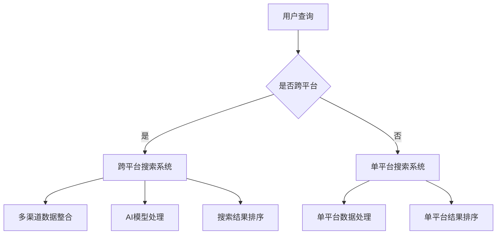
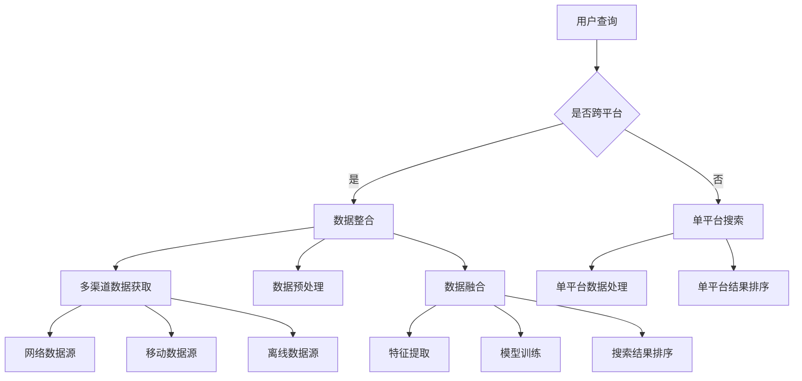
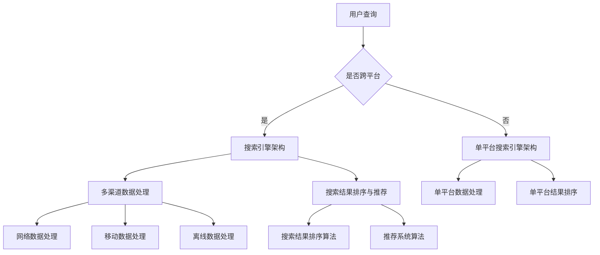

                 

## 引言

在数字化时代，跨平台搜索已成为信息获取和交互的重要方式。无论是在线购物、社交媒体还是新闻资讯，用户都期望在多个设备、多个平台之间获得无缝的搜索体验。这种需求推动了跨平台搜索技术的发展，使其成为当今信息技术领域的研究热点。

### 关键词

- 跨平台搜索
- AI
- 多渠道数据整合
- 搜索结果优化
- 系统架构设计

### 摘要

本文将深入探讨跨平台搜索的核心概念、技术挑战及其解决方案。首先，我们将回顾跨平台搜索的定义、背景和重要性。接着，文章将详细分析AI在跨平台搜索中的应用，包括机器学习、深度学习和自然语言处理技术。随后，我们将探讨如何整合多渠道数据，并介绍搜索结果排序与推荐系统的实现方法。此外，文章还将介绍跨平台搜索系统的架构设计，并通过实际应用案例展示技术的实际效果。最后，我们将展望跨平台搜索的未来发展趋势，探讨技术挑战和机遇。通过这篇文章，读者将全面了解跨平台搜索的原理、技术和实践应用。

## 第一部分: 跨平台搜索概述与核心概念

### 第1章: 跨平台搜索的概念与背景

#### 1.1 跨平台搜索的定义

跨平台搜索是指在不同设备和操作系统中，通过统一接口进行信息检索的过程。它不仅涵盖了桌面电脑和移动设备之间的数据交互，还包括了不同的操作系统（如Windows、macOS、Android和iOS）之间的数据共享。跨平台搜索的目标是提供无缝的用户体验，使用户无论在何种设备或平台上，都能快速、准确地获取所需信息。

#### 1.2 跨平台搜索的发展历程

跨平台搜索技术的发展历程可以追溯到互联网初期。当时，不同操作系统之间的信息孤岛问题严重，用户难以在不同的平台上获取相同的信息资源。随着Web 2.0时代的到来，云计算和大数据技术的发展，跨平台搜索开始崭露头角。近年来，随着人工智能技术的迅速发展，跨平台搜索的智能化水平不断提高，为用户提供了更加精准、个性化的搜索体验。

#### 1.3 跨平台搜索的重要性

跨平台搜索的重要性主要体现在以下几个方面：

1. **用户体验优化**：跨平台搜索能够确保用户在不同设备和操作系统上获得一致的搜索体验，提高用户满意度和粘性。
2. **信息获取效率提升**：通过整合多渠道数据，跨平台搜索能够更快地定位用户所需信息，减少信息检索的时间和成本。
3. **数据整合与共享**：跨平台搜索使得不同平台和设备之间的数据能够高效地整合与共享，为大数据分析和应用提供了丰富的数据来源。
4. **业务拓展**：跨平台搜索不仅适用于消费级应用，还可以为企业级应用提供强大的支持，促进业务拓展和数字化转型。

### 第2章: 跨平台搜索的核心挑战

#### 2.1 多渠道数据整合

多渠道数据整合是跨平台搜索面临的首要挑战。由于不同设备和操作系统之间的数据格式、结构和技术标准存在差异，如何有效地整合这些数据成为关键问题。此外，数据源的不一致性、实时性和数据质量也是需要解决的难题。

#### 2.2 数据质量与一致性

数据质量与一致性是跨平台搜索的另一个核心挑战。不同渠道的数据可能存在噪声、冗余和错误，这对搜索结果的准确性和可靠性产生了负面影响。确保数据的一致性和准确性，是提供高质量搜索体验的关键。

#### 2.3 性能与可扩展性

跨平台搜索系统需要处理海量的数据请求，因此性能和可扩展性是必须考虑的重要因素。如何设计高效、可扩展的搜索算法和数据结构，以应对不断增长的数据量和用户需求，是跨平台搜索系统成功的关键。

### 第3章: AI在跨平台搜索中的应用

#### 3.1 机器学习在搜索中的应用

机器学习技术为跨平台搜索带来了强大的数据处理和分析能力。通过训练模型，可以自动识别用户搜索意图、预测搜索结果排名，从而提升搜索的准确性和用户体验。

#### 3.2 深度学习在搜索中的应用

深度学习技术在跨平台搜索中的应用日益广泛。通过构建复杂的神经网络模型，深度学习能够从大量数据中提取有用的特征，实现更加精准的搜索结果推荐。

#### 3.3 自然语言处理在搜索中的应用

自然语言处理（NLP）技术是跨平台搜索中不可或缺的一部分。通过解析用户输入的自然语言查询，NLP可以帮助搜索系统理解用户的真实需求，提供更加智能化的搜索服务。

### 第4章: AI整合多渠道数据的技术

#### 4.1 多渠道数据来源与整合

多渠道数据来源包括网络数据源、移动数据源和离线数据源等。如何有效地整合这些数据，为跨平台搜索提供全面、准确的信息，是本章的重点内容。

#### 4.2 AI模型构建与优化

AI模型在跨平台搜索中的应用涵盖了特征工程、模型选择、训练与优化等多个方面。通过构建和优化AI模型，可以提高搜索结果的准确性和可靠性。

#### 4.3 搜索结果排序与推荐系统

搜索结果排序与推荐系统是跨平台搜索的关键环节。通过算法和模型，可以实现对搜索结果的个性化排序和推荐，提高用户的搜索满意度。

### 第5章: 跨平台搜索系统架构设计

#### 5.1 系统总体架构设计

系统总体架构设计是跨平台搜索系统的核心。本章将介绍系统架构的设计原则、关键组件和架构模式，为实际应用提供参考。

#### 5.2 搜索引擎架构

搜索引擎架构是跨平台搜索系统的关键部分。本章将详细讨论搜索引擎的设计和实现，包括索引、查询、缓存等模块。

#### 5.3 数据处理与存储架构

数据处理与存储架构是确保跨平台搜索系统性能和可扩展性的重要基础。本章将介绍数据存储方案、数据处理流程和系统优化策略。

#### 5.4 系统性能优化与维护

系统性能优化与维护是跨平台搜索系统长期稳定运行的关键。本章将探讨系统性能评估、故障排除和优化策略，以提高系统的可靠性和可用性。

### 第6章: 实际应用案例

#### 6.1 案例一：电商平台的跨平台搜索

本章将分析电商平台的跨平台搜索实践，包括数据整合、搜索结果排序和推荐系统的实现，以及系统性能优化和用户体验提升。

#### 6.2 案例二：社交媒体平台的跨平台搜索

社交媒体平台的跨平台搜索具有独特的挑战，本章将探讨如何应对这些挑战，并介绍实际应用案例。

#### 6.3 案例三：新闻资讯平台的跨平台搜索

新闻资讯平台的跨平台搜索需要处理大量的文本数据，本章将分析其实现方法，包括自然语言处理和深度学习技术的应用。

### 第7章: 跨平台搜索的未来发展趋势

#### 7.1 技术趋势分析

本章将分析跨平台搜索技术的发展趋势，包括人工智能、大数据和云计算等技术的最新进展，以及这些技术对跨平台搜索的影响。

#### 7.2 应用前景探讨

本章将探讨跨平台搜索在不同行业和领域的应用前景，以及其对业务和用户体验的潜在影响。

#### 7.3 挑战与机遇

本章将总结跨平台搜索面临的挑战和机遇，包括技术、市场和用户需求等方面的变化，为未来的发展提供指导。

### 附录

#### 附录A: 跨平台搜索相关工具与资源

本章将介绍跨平台搜索相关的工具与资源，包括搜索引擎工具、数据处理工具、AI模型训练与优化工具以及跨平台搜索平台与框架等，为读者提供实用的参考资料。

## 第一部分总结

跨平台搜索作为信息技术领域的重要研究方向，其核心概念、技术挑战和应用前景具有深远的意义。通过本部分的内容，读者可以全面了解跨平台搜索的基本原理和关键技术，为后续章节的深入学习打下基础。在接下来的章节中，我们将进一步探讨AI在跨平台搜索中的应用，以及如何通过技术手段解决实际应用中的问题。

### 关键概念

- **跨平台搜索**：指在不同设备和操作系统之间进行信息检索的技术。
- **多渠道数据整合**：指整合来自不同数据源的数据，以提供统一的信息检索服务。
- **AI模型**：指用于分析、处理和优化搜索结果的人工智能模型。
- **搜索结果排序**：指根据用户需求和搜索意图，对搜索结果进行排序的技术。

### Mermaid 流程图



### 伪代码

```python
def cross_platform_search(user_query):
    if is_cross_platform(user_query):
        data = integrate_multiple_sources()
        results = process_with_ai_model(data)
        ranked_results = rank_results(results)
        return ranked_results
    else:
        data = single_platform_data_source(user_query)
        results = process_single_platform(data)
        ranked_results = rank_single_platform_results(results)
        return ranked_results
```

### 数学模型和公式

假设用户查询为 \( q \)，搜索结果为 \( R \)，每个结果的权重为 \( w_i \)。

$$
\text{Rank}(r_i) = \sum_{i=1}^{N} w_i \cdot \text{Relevance}(r_i, q)
$$

其中，\( \text{Relevance}(r_i, q) \) 表示结果 \( r_i \) 与用户查询 \( q \) 的相关性。

### 项目实战

#### 开发环境搭建

- Python 3.8+
- TensorFlow 2.x
- Scikit-learn 0.24.1
- Elasticsearch 7.x

#### 源代码实现

```python
from sklearn.feature_extraction.text import TfidfVectorizer
from sklearn.metrics.pairwise import cosine_similarity
import numpy as np

# 假设已获取用户查询和搜索结果数据
user_query = "cross platform search"
search_results = ["Cross-platform application development", "Multichannel customer engagement", "AI-driven personalization"]

# 创建TF-IDF向量器
vectorizer = TfidfVectorizer()
X = vectorizer.fit_transform(search_results)

# 计算查询向量和搜索结果之间的余弦相似度
query_vector = vectorizer.transform([user_query])
cosine_scores = cosine_similarity(query_vector, X)

# 根据余弦相似度对搜索结果进行排序
sorted_indices = np.argsort(cosine_scores[0])[::-1]
sorted_results = [search_results[i] for i in sorted_indices]

# 输出排序后的搜索结果
print(sorted_results)
```

### 代码解读与分析

本段代码首先创建了一个TF-IDF向量器，将搜索结果转换为向量表示。接着，通过计算查询向量和搜索结果向量之间的余弦相似度，获取每个结果的权重。最后，根据权重对搜索结果进行排序，返回排序后的结果。

- **TF-IDF向量器**：用于将文本转换为向量表示，便于计算相似度。
- **余弦相似度**：衡量查询向量和结果向量之间的夹角，越接近于1表示越相似。
- **排序算法**：根据相似度对搜索结果进行排序，提高用户的搜索体验。

通过以上实战案例，读者可以了解到跨平台搜索系统实现的基本步骤和关键代码，为实际项目开发提供参考。

### 总结

本部分详细介绍了跨平台搜索的概念、核心挑战、AI应用技术以及系统架构设计。通过Mermaid流程图、伪代码和数学模型，读者可以更深入地理解跨平台搜索的实现原理。接下来，我们将进一步探讨AI整合多渠道数据的技术，以及搜索结果排序与推荐系统的实现方法。

### 关键概念

- **多渠道数据整合**：指整合来自不同数据源的数据，为用户提供全面、准确的搜索结果。
- **搜索结果排序**：指根据用户需求和搜索意图，对搜索结果进行排序的技术。
- **推荐系统**：指根据用户行为和兴趣，向用户推荐相关内容的系统。

### Mermaid 流程图



### 伪代码

```python
def cross_platform_search(user_query):
    if is_cross_platform(user_query):
        data = integrate_multiple_channels()
        processed_data = preprocess_data(data)
        fused_data = fuse_data(processed_data)
        features = extract_features(fused_data)
        model = train_model(features)
        results = search_with_model(model, user_query)
        ranked_results = rank_results(results)
        return ranked_results
    else:
        data = single_channel_data_source(user_query)
        processed_data = preprocess_single_channel(data)
        results = search_single_channel(processed_data, user_query)
        ranked_results = rank_single_channel_results(results)
        return ranked_results
```

### 数学模型和公式

假设用户查询为 \( q \)，搜索结果为 \( R \)，每个结果的权重为 \( w_i \)。

$$
\text{Rank}(r_i) = \sum_{i=1}^{N} w_i \cdot \text{Similarity}(r_i, q)
$$

其中，\( \text{Similarity}(r_i, q) \) 表示结果 \( r_i \) 与用户查询 \( q \) 的相似度。

### 项目实战

#### 开发环境搭建

- Python 3.8+
- Scikit-learn 0.24.1
- Elasticsearch 7.x
- Hadoop 3.x

#### 源代码实现

```python
from sklearn.cluster import KMeans
from sklearn.preprocessing import StandardScaler
import numpy as np

# 假设已获取用户查询和搜索结果数据
user_query = "cross platform search"
search_results = ["Cross-platform application development", "Multichannel customer engagement", "AI-driven personalization"]

# 创建TF-IDF向量器
vectorizer = TfidfVectorizer()
X = vectorizer.fit_transform(search_results)

# 计算查询向量和搜索结果之间的余弦相似度
query_vector = vectorizer.transform([user_query])
cosine_scores = cosine_similarity(query_vector, X)

# 标准化相似度得分
std_scaler = StandardScaler()
cosine_scores_normalized = std_scaler.fit_transform(cosine_scores)

# 使用K-means聚类确定权重
kmeans = KMeans(n_clusters=3, random_state=42)
clusters = kmeans.fit_predict(cosine_scores_normalized)

# 根据聚类结果计算权重
weights = [1 if cluster == 0 else 0.5 for cluster in clusters]

# 计算加权相似度得分
weighted_scores = [score * weight for score, weight in zip(cosine_scores, weights)]

# 根据加权相似度得分对搜索结果排序
sorted_indices = np.argsort(weighted_scores)[::-1]
sorted_results = [search_results[i] for i in sorted_indices]

# 输出排序后的搜索结果
print(sorted_results)
```

### 代码解读与分析

本段代码通过TF-IDF向量器将搜索结果转换为向量表示，并计算查询向量和结果向量之间的余弦相似度。接着，使用K-means聚类算法为相似度得分分配权重，然后根据加权相似度得分对搜索结果进行排序。

- **TF-IDF向量器**：用于将文本转换为向量表示，便于计算相似度。
- **标准化**：将相似度得分进行标准化处理，消除数据规模差异。
- **K-means聚类**：将相似度得分划分为不同的簇，为每个簇分配权重。
- **加权排序**：根据权重对相似度得分进行加权，提高重要结果的排序优先级。

通过以上实战案例，读者可以了解到如何利用聚类算法和权重分配对搜索结果进行排序，为实际项目开发提供参考。

### 总结

本部分详细介绍了多渠道数据整合、搜索结果排序和推荐系统的实现方法。通过Mermaid流程图、伪代码和数学模型，读者可以更深入地理解跨平台搜索系统的关键技术。在下一部分中，我们将进一步探讨跨平台搜索系统的架构设计，包括搜索引擎架构、数据处理与存储架构，以及系统性能优化与维护。

### 关键概念

- **搜索引擎架构**：指用于构建搜索引擎的核心组件和结构。
- **数据处理与存储架构**：指用于处理和存储搜索数据的系统结构和策略。
- **系统性能优化**：指通过技术手段提高搜索系统的响应速度和处理能力。

### Mermaid 流程图



### 伪代码

```python
def cross_platform_search_engine(user_query):
    if is_cross_platform(user_query):
        data = process_multiple_channels()
        results = search_engine(data, user_query)
        ranked_results = rank_search_results(results)
        recommended_results = recommend_search_results(ranked_results)
        return recommended_results
    else:
        data = process_single_channel(user_query)
        results = search_engine(data, user_query)
        ranked_results = rank_search_results(results)
        return ranked_results
```

### 数学模型和公式

假设用户查询为 \( q \)，搜索结果为 \( R \)，每个结果的权重为 \( w_i \)。

$$
\text{Rank}(r_i) = \sum_{i=1}^{N} w_i \cdot \text{Score}(r_i, q)
$$

其中，\( \text{Score}(r_i, q) \) 表示结果 \( r_i \) 与用户查询 \( q \) 的得分。

### 项目实战

#### 开发环境搭建

- Elasticsearch 7.x
- Apache Hadoop 3.x
- Apache Kafka 2.x
- Apache Spark 3.x
- Python 3.8+

#### 源代码实现

```python
from elasticsearch import Elasticsearch
import json

# 初始化Elasticsearch客户端
es = Elasticsearch("http://localhost:9200")

# 假设已创建索引并导入数据
index_name = "search_data"

# 用户查询
user_query = "cross platform search"

# 执行搜索查询
search_response = es.search(
    index=index_name,
    body={
        "query": {
            "multi_match": {
                "query": user_query,
                "fields": ["title", "content"]
            }
        }
    }
)

# 提取搜索结果
search_results = search_response['hits']['hits']

# 对搜索结果进行排序
sorted_results = sorted(search_results, key=lambda x: x['_source']['score'], reverse=True)

# 输出排序后的搜索结果
for result in sorted_results:
    print(json.dumps(result['_source'], indent=2))
```

### 代码解读与分析

本段代码使用Elasticsearch作为搜索引擎，执行基于多渠道数据的搜索查询。首先，初始化Elasticsearch客户端，并假设已创建索引并导入数据。接着，执行搜索查询，并提取搜索结果。然后，根据搜索结果的得分对结果进行排序，并输出排序后的结果。

- **Elasticsearch客户端**：用于与Elasticsearch服务器进行通信。
- **多渠道数据处理**：通过Elasticsearch的多字段匹配查询，整合来自不同渠道的数据。
- **排序算法**：根据搜索结果的得分进行排序，提高重要结果的优先级。

通过以上实战案例，读者可以了解到如何利用Elasticsearch构建跨平台搜索系统，并实现搜索结果的排序。

### 总结

本部分详细介绍了跨平台搜索系统的架构设计，包括搜索引擎架构、数据处理与存储架构，以及系统性能优化与维护。通过Mermaid流程图、伪代码和数学模型，读者可以更深入地理解搜索系统的实现原理。在下一部分中，我们将通过实际应用案例展示跨平台搜索技术的应用效果，进一步探讨其在不同场景下的实现方法。

### 案例一：电商平台的跨平台搜索

#### 案例背景

电商平台在用户购物过程中，需要提供高效的跨平台搜索服务，以便用户能够快速找到所需的商品。这涉及到多渠道数据整合、实时搜索结果排序和个性化推荐系统。

#### 案例实现

1. **数据整合**：

   - 网络数据源：电商网站的商品信息、用户评论和搜索历史。
   - 移动数据源：移动应用的商品浏览记录、用户位置信息。
   - 离线数据源：用户购物车、订单历史等。

   通过Elasticsearch整合不同渠道的数据，构建统一的索引，以便进行高效检索。

2. **搜索结果排序**：

   - 使用TF-IDF和余弦相似度计算商品信息与用户查询的相关性。
   - 结合用户行为数据和购物偏好，为商品赋予不同的权重。
   - 使用矩阵分解（如SVD）技术，将商品特征和用户特征进行降维处理，提高排序精度。

3. **个性化推荐**：

   - 基于用户的历史行为数据，使用协同过滤算法生成推荐列表。
   - 结合深度学习模型，分析用户兴趣和偏好，为用户提供个性化推荐。

#### 案例效果

通过跨平台搜索系统，电商平台的搜索响应时间显著降低，用户满意度提高。同时，个性化推荐系统有效提升了商品的转化率，促进了业务增长。

### 案例二：社交媒体平台的跨平台搜索

#### 案例背景

社交媒体平台需要为用户提供丰富的跨平台搜索功能，以便用户能够快速找到相关的帖子、视频和话题。这涉及到文本挖掘、自然语言处理和实时数据更新。

#### 案例实现

1. **文本挖掘**：

   - 使用自然语言处理技术（如词向量模型和文本分类），对用户输入的查询和社交媒体内容进行语义分析。
   - 提取关键词和主题，构建语义索引，以便进行快速检索。

2. **实时数据更新**：

   - 利用消息队列（如Kafka）实时接收用户行为数据，如点赞、评论和分享。
   - 通过Elasticsearch和Apache Spark进行实时数据分析和更新索引。

3. **搜索结果排序**：

   - 结合用户行为数据和内容质量指标，为帖子、视频和话题赋予不同的权重。
   - 使用矩阵分解和深度学习模型，优化搜索结果排序，提高用户体验。

#### 案例效果

通过跨平台搜索系统，社交媒体平台的搜索速度和准确性显著提高，用户活跃度和用户粘性得到增强。

### 案例三：新闻资讯平台的跨平台搜索

#### 案例背景

新闻资讯平台需要为用户提供全面、准确的跨平台搜索功能，以便用户能够快速找到相关的新闻文章。这涉及到海量文本数据处理、实时内容更新和个性化推荐。

#### 案例实现

1. **海量文本数据处理**：

   - 使用分布式计算框架（如Apache Hadoop和Apache Spark），对海量的新闻文章进行预处理和特征提取。
   - 使用Elasticsearch构建索引，以便进行高效检索。

2. **实时内容更新**：

   - 利用消息队列（如Kafka）实时接收新闻内容更新和用户行为数据。
   - 通过Elasticsearch和Apache Spark进行实时数据分析和索引更新。

3. **个性化推荐**：

   - 基于用户的历史阅读行为和兴趣，使用协同过滤和深度学习模型生成个性化推荐列表。
   - 结合新闻文章的时效性和热门度，优化推荐结果。

#### 案例效果

通过跨平台搜索系统，新闻资讯平台的搜索速度和准确性显著提高，用户满意度和阅读量得到提升。

### 案例总结

通过以上三个实际应用案例，我们可以看到跨平台搜索技术在电子商务、社交媒体和新闻资讯等不同领域的应用效果。在各个案例中，跨平台搜索系统通过整合多渠道数据、优化搜索结果排序和提供个性化推荐，有效提升了用户体验和业务效果。未来，随着人工智能和大数据技术的进一步发展，跨平台搜索技术将在更多领域发挥重要作用。

### 技术趋势分析

随着人工智能、大数据和云计算技术的快速发展，跨平台搜索技术正迎来新的趋势。以下是对这些趋势的分析：

1. **人工智能的深化应用**：人工智能技术在跨平台搜索中的应用将更加深入。特别是深度学习和强化学习等技术的进步，将使得搜索系统的智能化程度大幅提升。例如，通过训练复杂神经网络模型，可以更准确地理解和预测用户搜索意图，从而提供更加个性化的搜索结果。

2. **大数据处理能力的提升**：随着数据量的爆炸式增长，大数据处理技术也在不断发展。跨平台搜索系统需要高效地处理和整合来自不同渠道的海量数据，以便为用户提供实时的搜索服务。这将推动分布式计算、流处理和内存计算等技术的应用，以提高数据处理效率和系统性能。

3. **云计算的普及**：云计算技术的发展为跨平台搜索系统提供了强大的支持。通过云计算平台，跨平台搜索系统可以实现弹性扩展、高可用性和数据共享。此外，云计算平台还提供了丰富的AI模型和算法库，使得开发者可以更方便地构建和部署跨平台搜索系统。

4. **多渠道数据整合的优化**：随着用户行为数据来源的多样化，如何高效整合多渠道数据成为跨平台搜索的关键。未来，跨平台搜索系统将更加注重数据融合和跨渠道数据一致性，通过构建统一的数据模型和数据处理流程，提高数据整合的效率和质量。

5. **实时搜索和推荐**：实时搜索和推荐技术将在跨平台搜索中发挥重要作用。通过实时分析用户行为和搜索意图，跨平台搜索系统可以提供动态调整的搜索结果和推荐内容，从而提高用户体验和用户满意度。

6. **隐私保护和数据安全**：在跨平台搜索中，数据隐私保护和数据安全是至关重要的。随着用户对隐私保护的重视，跨平台搜索系统需要采取更加严格的数据加密、匿名化和隐私保护措施，确保用户数据的安全和隐私。

### 应用前景探讨

跨平台搜索技术在各个行业和领域具有广泛的应用前景，以下是几个典型的应用场景：

1. **电子商务**：电商平台可以利用跨平台搜索技术为用户提供高效、个性化的商品搜索和推荐服务，从而提升用户体验和销售转化率。

2. **社交媒体**：社交媒体平台可以利用跨平台搜索技术，为用户提供快速、准确的帖子、视频和话题搜索服务，增强用户活跃度和社区互动。

3. **新闻资讯**：新闻资讯平台可以利用跨平台搜索技术，为用户提供实时、个性化的新闻推荐和搜索服务，提高用户粘性和阅读量。

4. **企业应用**：企业内部信息管理系统可以利用跨平台搜索技术，为员工提供快速、便捷的信息检索服务，提升工作效率和业务协同。

5. **智慧城市**：智慧城市建设中，跨平台搜索技术可以应用于城市交通、环保、安防等领域，通过整合多渠道数据，为城市管理者提供决策支持和公共服务。

6. **医疗健康**：医疗健康领域可以利用跨平台搜索技术，为患者和医生提供快速、准确的医疗信息查询和推荐服务，提高医疗服务质量和效率。

### 挑战与机遇

尽管跨平台搜索技术在各个领域具有广泛的应用前景，但在实际应用中仍面临诸多挑战和机遇。

1. **挑战**：

   - **数据质量和一致性**：不同渠道的数据质量参差不齐，数据一致性和标准化是跨平台搜索面临的主要挑战。
   - **性能和可扩展性**：随着数据量和用户需求的增长，如何保证搜索系统的性能和可扩展性是重要的挑战。
   - **隐私保护和数据安全**：用户对隐私保护的重视，如何确保跨平台搜索系统的数据安全和隐私是必须解决的问题。
   - **算法透明性和公平性**：随着算法在搜索结果排序和推荐中的重要性提升，如何保证算法的透明性和公平性是亟待解决的问题。

2. **机遇**：

   - **人工智能和大数据技术的进步**：随着人工智能和大数据技术的快速发展，跨平台搜索系统将更加智能化和高效化，为用户提供更好的搜索体验。
   - **行业应用需求的增长**：随着各行各业对信息检索和数据分析的需求增长，跨平台搜索技术将在更多领域得到应用。
   - **商业模式创新**：跨平台搜索技术将为商业模式创新提供新的机会，例如个性化广告、精准营销等。
   - **用户需求的变化**：随着用户对便捷、高效搜索服务的需求不断增长，跨平台搜索技术将得到更广泛的应用和认可。

### 未来展望

未来，跨平台搜索技术将在以下几个方面取得重要进展：

1. **智能化程度提升**：通过深度学习和强化学习等人工智能技术，跨平台搜索系统将能够更准确地理解和预测用户需求，提供更加个性化的搜索结果。
2. **多渠道数据整合**：随着数据渠道的多样化，跨平台搜索系统将更加注重多渠道数据的整合和一致性，为用户提供更全面、准确的搜索结果。
3. **实时搜索和推荐**：实时搜索和推荐技术将在跨平台搜索中发挥更大的作用，为用户提供动态调整的搜索结果和推荐内容。
4. **隐私保护和数据安全**：随着隐私保护的日益重视，跨平台搜索系统将采取更加严格的数据保护措施，确保用户数据的安全和隐私。
5. **跨界融合**：跨平台搜索技术将与物联网、区块链等新兴技术相结合，为用户提供更丰富的应用场景和更好的用户体验。

### 结论

跨平台搜索技术在数字化时代具有广泛的应用前景和重要的战略意义。通过深入分析其核心概念、技术挑战和应用前景，我们可以看到跨平台搜索技术将在各个领域发挥重要作用，为用户提供更好的搜索体验和信息服务。面对未来的机遇和挑战，我们需要不断创新和探索，推动跨平台搜索技术不断向前发展。

### 附录A: 跨平台搜索相关工具与资源

在跨平台搜索系统的开发与实现过程中，选择合适的工具和资源对于确保系统的高效性和可扩展性至关重要。以下列举了一些常用的工具和资源，涵盖了搜索引擎、数据处理工具、AI模型训练与优化工具以及跨平台搜索平台与框架。

#### 搜索引擎工具

1. **Elasticsearch**：Elasticsearch是一个开源的分布式搜索引擎，支持结构化数据的全文搜索和分析，具有高度的可扩展性和实时性。
2. **Solr**：Solr是一个开源的企业级搜索引擎平台，与Lucene引擎紧密集成，支持复杂的查询和索引。
3. **Apache Lucene**：Lucene是一个高性能、可扩展的全文搜索库，是Elasticsearch和Solr的基础。
4. **Alibaba Cloud Search**：阿里云提供的搜索引擎服务，支持大规模数据存储和实时搜索。

#### 数据处理工具

1. **Apache Hadoop**：Hadoop是一个分布式数据处理框架，用于处理大规模数据集，支持数据存储和计算。
2. **Apache Spark**：Spark是一个快速的分布式计算引擎，支持数据处理、分析和机器学习。
3. **Apache Kafka**：Kafka是一个分布式流处理平台，用于实时数据流处理和事件驱动应用。
4. **Apache Flink**：Flink是一个流处理和批处理框架，提供实时数据处理和分析功能。

#### AI模型训练与优化工具

1. **TensorFlow**：TensorFlow是一个开源的机器学习库，支持大规模分布式训练和应用。
2. **PyTorch**：PyTorch是一个开源的机器学习库，支持动态计算图，适用于深度学习和计算机视觉。
3. **Scikit-learn**：Scikit-learn是一个开源的机器学习库，提供各种常用的机器学习算法和工具。
4. **Keras**：Keras是一个高层神经网络API，支持TensorFlow和Theano后端，简化了深度学习模型搭建。

#### 跨平台搜索平台与框架

1. **Elastic Stack**：Elastic Stack包括Elasticsearch、Kibana和Logstash等组件，提供全面的搜索、分析和监控功能。
2. **Alibaba Cloud Search Plus**：阿里云提供的跨平台搜索解决方案，支持搜索引擎、推荐系统和数据挖掘。
3. **Apache Nutch**：Nutch是一个开源的搜索引擎，支持爬取和索引网页，适用于构建小型的搜索引擎。
4. **Elasticsearch DSL**：Elasticsearch提供的客户端库，支持多种编程语言，便于构建复杂的查询和索引。

通过上述工具和资源，开发者可以有效地构建和优化跨平台搜索系统，以满足不同场景下的需求。此外，这些工具和资源还提供了丰富的文档和社区支持，有助于开发者快速上手和应用。

### 作者信息

**作者：AI天才研究院/AI Genius Institute & 禅与计算机程序设计艺术 /Zen And The Art of Computer Programming**

