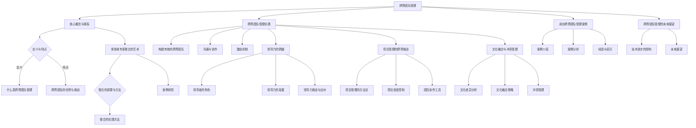

                 

### 引言

#### 背景与意义

在当今快速发展的信息技术时代，各种新兴技术不断涌现，如人工智能、大数据、云计算等。这些技术的交叉融合，推动了各个领域的发展，同时也带来了跨界团队管理的挑战。跨界团队管理，是指在多学科、多专业、多背景的团队中，如何有效地进行组织、协调和管理，以实现团队的协同创新和高效运作。

**跨界团队管理的挑战与机遇：**

1. **挑战：**

   - **专业知识差异**：不同领域的专家拥有不同的专业知识和技能，如何将他们的知识整合起来，是一个巨大的挑战。
   - **沟通与协作**：由于专业背景和沟通方式的差异，团队成员之间的沟通和协作效率可能受到影响。
   - **管理难度**：跨界团队的复杂性增加了管理的难度，需要领导者具备更高的管理能力和跨学科知识。

2. **机遇：**

   - **创新能力**：跨界团队可以将不同领域的知识结合起来，产生新的创意和解决方案，提升团队的创新能力。
   - **资源整合**：跨界团队可以整合各个领域的资源和优势，提高项目的执行效率。
   - **市场竞争力**：跨界团队能够更好地适应市场需求，提供跨领域的解决方案，提升企业的市场竞争力。

#### 多领域专家整合的重要性

在跨界团队管理中，多领域专家的整合起着至关重要的作用。以下是多领域专家整合的几个关键点：

1. **知识互补**：不同领域的专家可以互补彼此的知识和技能，形成一个更全面、更强大的团队。
2. **协同创新**：专家之间的合作和交流，可以激发新的思维和创意，推动项目的创新和发展。
3. **效率提升**：通过有效的整合和协作，可以缩短项目的开发周期，提高工作效率。
4. **风险控制**：多领域的专家可以从不同角度分析和解决项目中可能出现的问题，降低项目风险。

#### 目标与结构

本文旨在探讨跨界团队管理的核心概念和实践方法，为管理者提供一套系统的理论框架和实用的管理工具。全文分为三个部分：

- **第一部分：跨界团队管理的核心概念**，介绍跨界团队的定义、特点、优势、挑战以及多领域专家整合的艺术。
- **第二部分：跨界团队管理实践**，包括构建有效的跨界团队、领导力的跨越、项目管理的跨界挑战、文化融合与冲突管理。
- **第三部分：跨界团队管理的未来展望**，分析技术进步对跨界团队管理的影响，展望跨界团队管理的未来发展。

通过本文的探讨，我们希望能够帮助读者更好地理解跨界团队管理，掌握跨界团队管理的方法和技巧，从而提升团队的创新能力和市场竞争力。

### 《跨界团队管理：整合多领域专家的艺术》目录大纲

本文将深入探讨跨界团队管理的核心概念和实践方法，旨在为管理者提供一套系统的理论框架和实用的管理工具。全文分为三个主要部分，每个部分都有详细的章节结构和内容概述。

#### 第一部分：跨界团队管理的核心概念

**第1章：什么是跨界团队管理**

- **定义与特点**：介绍跨界团队的定义和特点，包括团队成员的专业背景、角色分工和团队协作方式。
- **跨界团队的发展历程**：回顾跨界团队的历史背景和发展趋势，分析不同阶段的特点和演变。
- **跨界团队的优势与挑战**：探讨跨界团队的优势，如创新能力、资源整合等，以及可能面临的挑战，如专业知识差异、沟通障碍等。

**第2章：多领域专家整合的艺术**

- **多领域专家的定义**：明确多领域专家的概念和范围，包括不同学科、专业和背景的专家。
- **整合的原理与方法**：阐述多领域专家整合的理论基础和实践方法，如知识互补、协同创新、效率提升等。
- **案例研究**：通过成功和失败的跨界团队管理案例，分析专家整合的艺术，提供实践经验和教训。

#### 第二部分：跨界团队管理实践

**第3章：构建有效的跨界团队**

- **团队构建的步骤**：介绍如何选择团队成员、规划团队结构和制定团队目标。
- **沟通与协作**：探讨跨界团队内部沟通与协作的策略和方法，如定期会议、信息共享、协作工具等。
- **激励机制**：分析如何设计激励机制，激发团队成员的积极性和创造力。

**第4章：领导力的跨越**

- **领导者的角色**：探讨跨界团队领导者应具备的特质和能力，如跨学科知识、沟通技巧、领导力模型等。
- **领导力的发展**：介绍如何提升跨界团队领导者的领导力，如培训、实践、反思等。
- **领导力挑战与应对**：分析跨界团队管理中常见的领导力挑战，提供应对策略。

**第5章：项目管理的跨界挑战**

- **项目管理的方法论**：介绍传统项目管理方法，如瀑布模型、敏捷开发等，探讨如何适应跨界项目管理的特殊性。
- **项目进度控制**：探讨如何控制跨界项目的进度，如制定项目计划、风险管理、进度跟踪等。
- **团队协作工具**：介绍常用的团队协作工具，如JIRA、Trello、Slack等，以及如何选择和应用这些工具。

**第6章：文化融合与冲突管理**

- **文化差异分析**：分析多领域文化的特点，识别文化差异，提供文化融合的策略和方法。
- **文化融合策略**：介绍如何实现文化融合，如跨文化培训、文化认同、共同目标等。
- **冲突管理**：分析冲突的类型，提供冲突解决的策略和方法，如沟通、调解、决策等。

#### 第三部分：跨界团队管理的未来展望

**第7章：成功跨界团队管理案例**

- **案例介绍**：介绍成功跨界团队管理的案例，包括背景、实施过程和成功因素。
- **案例分析**：深入分析成功案例中的管理技巧和跨界团队整合的艺术。
- **经验与启示**：总结成功案例的经验，提供启示和借鉴，为其他跨界团队管理提供参考。

**第8章：跨界团队管理的发展趋势**

- **技术进步的影响**：分析新技术对跨界团队管理的影响，如人工智能、大数据、云计算等。
- **未来展望**：展望跨界团队管理的未来发展，包括趋势、挑战和机遇。

#### 结论

本文通过系统的理论框架和实际案例，深入探讨了跨界团队管理的核心概念和实践方法。我们希望读者能够通过本文的学习，更好地理解跨界团队管理的本质和艺术，提升团队的创新能力和市场竞争力。

在未来的跨界团队管理中，我们将面临更多的挑战和机遇。随着技术的不断进步，跨界团队管理将迎来新的发展。我们将继续关注和探讨跨界团队管理的最新动态，为管理者提供更加全面和实用的指导。

### 第一部分：跨界团队管理的核心概念

#### 第1章：什么是跨界团队管理

在当今复杂多变的商业环境中，跨界团队管理逐渐成为一种重要的组织形式。那么，什么是跨界团队管理？它有哪些特点？本文将为您一一解答。

##### **定义与特点**

**跨界团队管理**，顾名思义，是指在一个团队中，成员来自不同的专业领域或背景，通过协同合作，共同完成某项任务或项目。与传统团队相比，跨界团队具有以下显著特点：

1. **多样性**：团队成员来自不同的专业领域，如技术、设计、市场等，这种多样性带来了丰富的知识和技能，有助于解决复杂问题。
2. **灵活性**：跨界团队可以根据项目需求灵活调整成员组合，快速响应市场变化。
3. **创新性**：不同领域的专家之间相互启发，容易产生新的创意和解决方案。
4. **复杂性**：由于团队成员背景不同，沟通和协作可能存在障碍，管理难度较大。

##### **跨界团队的发展历程**

跨界团队的概念并非一蹴而就，而是随着时代的发展逐渐形成的。以下是跨界团队发展的几个重要阶段：

1. **初步阶段**：20世纪90年代，随着互联网的兴起，许多企业开始尝试跨学科合作，以应对新兴技术的发展。
2. **成熟阶段**：21世纪初，跨界团队在科技、金融、医疗等领域得到广泛应用，成为提升企业竞争力的重要手段。
3. **创新阶段**：近年来，随着人工智能、大数据、云计算等新兴技术的普及，跨界团队管理的方法和模式不断创新，为解决复杂问题提供了更多可能性。

##### **跨界团队的优势与挑战**

**优势：**

1. **多元化知识**：跨界团队能够整合不同领域的知识，提高问题解决的全面性和准确性。
2. **创新能力**：专家之间的互动和启发，容易产生新的创意和解决方案。
3. **资源整合**：跨界团队能够整合企业内外部的资源，提高项目的执行效率。

**挑战：**

1. **沟通障碍**：团队成员来自不同领域，可能存在语言和思维方式上的差异，沟通效率较低。
2. **管理难度**：跨界团队的复杂性和多样性，增加了管理的难度和挑战。
3. **利益冲突**：团队成员可能存在利益冲突，如资源争夺、任务分配不均等，需要有效协调。

#### **跨界团队管理的重要性**

跨界团队管理的重要性体现在以下几个方面：

1. **提升创新能力**：跨界团队能够整合多领域的知识和技能，激发创新思维，提高企业的竞争力。
2. **提高项目效率**：通过有效的跨界团队管理，可以缩短项目开发周期，提高工作效率。
3. **促进跨学科合作**：跨界团队管理能够促进不同学科之间的合作，推动科技和社会的进步。

##### **小结**

跨界团队管理是一种具有挑战性和机遇并存的组织形式。通过有效的管理，跨界团队能够充分发挥其优势，提高团队的创新能力、资源整合能力和项目管理效率。在未来的商业环境中，跨界团队管理将发挥越来越重要的作用。

在下一章中，我们将进一步探讨多领域专家整合的艺术，分析如何将不同领域的专家整合到一起，实现协同创新和高效运作。敬请期待。

#### 第2章：多领域专家整合的艺术

在跨界团队管理中，多领域专家的整合是确保团队高效运作和创新的重要环节。如何将不同领域的专家整合到一起，发挥他们的优势，实现协同创新，是管理者面临的一大挑战。本章将探讨多领域专家整合的原理与方法，并提供一些成功的实践案例。

##### **多领域专家的定义**

首先，我们需要明确什么是多领域专家。多领域专家是指拥有两个或两个以上不同专业领域知识、技能和经验的个人。这些领域可以包括技术、设计、市场、金融、医学等。多领域专家的特点是：

- **跨学科知识**：具备跨学科的理论知识和实践经验。
- **综合能力**：能够从多个角度分析和解决问题。
- **创新能力**：能够运用跨学科知识产生新的创意和解决方案。

在跨界团队中，多领域专家的作用不可忽视。他们不仅能够提供专业知识和技能，还能够激发团队的创新思维，促进跨学科合作。

##### **整合的原理与方法**

多领域专家整合的原理和方法主要基于以下几点：

1. **知识互补**：不同领域的专家拥有各自的专业知识和技能，通过整合，可以实现知识互补，提升团队的整体能力。
2. **协同创新**：专家之间的互动和合作，可以激发新的创意和解决方案，提高团队的创新能力。
3. **沟通与协作**：有效的沟通和协作是确保多领域专家整合成功的关键。通过建立良好的沟通机制和协作工具，可以提升团队的协作效率。
4. **激励机制**：设计合理的激励机制，可以激发专家的积极性和创造力，促进团队整合。

以下是多领域专家整合的具体方法：

1. **多学科团队构建**：根据项目需求，选择具有互补专业背景的专家组成团队，确保团队具备全面的知识和技能。
2. **知识共享**：建立知识共享平台，如内部论坛、研讨会等，促进专家之间的知识交流和共享。
3. **项目协作**：通过项目管理工具，如JIRA、Trello等，明确项目目标、任务分配和进度跟踪，确保项目的顺利进行。
4. **文化融合**：尊重不同领域的文化差异，建立共同的目标和价值观，促进团队的融合和协作。
5. **激励机制**：设计合理的激励机制，如奖金、晋升等，激发专家的积极性和创造力。

##### **案例研究**

为了更好地理解多领域专家整合的方法，我们可以通过一些成功的实践案例来进行分析。

**案例一：谷歌X实验室**

谷歌X实验室是一个典型的跨界团队，它汇集了来自不同领域的专家，如物理学家、工程师、设计师等。通过跨学科的合作，谷歌X实验室推出了许多颠覆性的产品，如Google Glass、自动驾驶汽车等。以下是案例的一些关键点：

- **多学科团队构建**：谷歌X实验室的团队成员来自不同的领域，他们之间的知识互补和协同创新是团队成功的关键。
- **知识共享**：谷歌X实验室建立了内部的知识共享平台，如Google Drive、内部论坛等，促进了团队成员之间的知识交流和共享。
- **项目协作**：谷歌X实验室使用Trello等项目管理工具，明确项目目标、任务分配和进度跟踪，确保项目的顺利进行。
- **文化融合**：谷歌X实验室尊重不同领域的文化差异，建立了共同的目标和价值观，促进了团队的融合和协作。

**案例二：现代汽车研发中心**

现代汽车研发中心也是一个成功的跨界团队案例。它汇集了来自汽车工程、电子工程、材料科学等领域的专家，共同研发新能源汽车。以下是案例的一些关键点：

- **多学科团队构建**：现代汽车研发中心的团队成员具有互补的专业背景，他们通过协同创新，推动了新能源汽车的研发。
- **知识共享**：研发中心建立了内部的知识共享平台，如内部会议、技术交流等，促进了团队成员之间的知识交流和共享。
- **项目协作**：研发中心使用JIRA等项目管理工具，明确项目目标、任务分配和进度跟踪，确保项目的顺利进行。
- **激励机制**：研发中心设计了合理的激励机制，如奖金、晋升等，激发了专家的积极性和创造力。

##### **小结**

多领域专家整合是跨界团队管理的重要环节，它能够发挥专家们的优势，实现知识互补、协同创新和高效运作。通过构建多学科团队、知识共享、项目协作、文化融合和激励机制等方法，可以有效地整合多领域专家，提升团队的创新能力和管理效率。

在下一章中，我们将进一步探讨跨界团队管理实践的具体方法，包括团队构建、沟通协作、激励机制等方面的内容。敬请期待。

### 第一部分：跨界团队管理的核心概念

#### 第3章：构建有效的跨界团队

构建一个有效的跨界团队是跨界团队管理的关键步骤。一个高效的跨界团队能够充分利用团队成员的专业知识和技能，实现协同创新和高效运作。本章将详细介绍构建跨界团队的步骤、团队成员的选择、团队结构的规划以及如何确保团队目标的明确和有效实现。

##### **团队构建的步骤**

构建一个有效的跨界团队通常需要以下步骤：

1. **明确项目目标和需求**：首先，需要明确团队将要完成的项目目标和需求，这包括项目的时间线、资源需求、技术难度等。只有明确了目标和需求，才能有针对性地组建团队。
2. **选择团队成员**：根据项目目标和需求，选择具有互补专业背景的团队成员。团队成员应该包括来自不同领域的技术专家、设计师、市场人员等。在挑选团队成员时，要注重其专业能力、沟通能力和团队合作精神。
3. **规划团队结构**：根据团队成员的专业背景和能力，规划团队的组织结构。可以采用矩阵式结构、职能式结构或项目式结构等，确保团队成员能够明确自己的角色和职责。
4. **制定团队目标**：明确团队的目标，并将其分解为具体的任务和里程碑。确保每个团队成员都清楚自己的职责和任务，以及团队的整体目标。
5. **沟通与协作**：建立有效的沟通和协作机制，确保团队成员之间的信息传递畅通无阻。可以使用项目管理工具和协作平台，如JIRA、Trello、Slack等，来提高沟通效率。
6. **培训和激励**：为团队成员提供必要的培训，帮助他们了解项目目标和需求，掌握相关技能和工具。同时，要设计合理的激励机制，激发团队成员的积极性和创造力。

##### **团队成员的选择**

选择合适的团队成员是构建有效跨界团队的关键。以下是一些选择团队成员的建议：

1. **专业能力**：团队成员应具备所需的专业知识和技能，能够胜任各自的角色和任务。
2. **沟通能力**：团队成员应具有良好的沟通能力，能够与不同背景和领域的人有效沟通，以确保团队内部的信息传递畅通。
3. **团队合作精神**：团队成员应具备团队合作精神，能够与他人协作，共同完成项目任务。
4. **适应能力**：团队成员应具备较强的适应能力，能够迅速适应新的环境和需求，以及面对挑战和变化。
5. **领导潜力**：在团队中，部分成员可能需要承担领导责任，因此，应选择具备领导潜力的人。

##### **团队结构的规划**

团队结构的规划直接影响团队的协作效率和项目的成功。以下是一些常见的团队结构规划方法：

1. **矩阵式结构**：矩阵式结构将团队成员分为多个小组，每个小组负责项目的不同方面。这种方法可以充分利用团队成员的专业知识和技能，提高项目的执行效率。
2. **职能式结构**：职能式结构按照职能或专业领域来划分团队成员。这种方法有助于团队成员专注于自己的专业领域，提高专业水平。
3. **项目式结构**：项目式结构将团队成员直接分配到项目中，每个项目都有自己的项目经理。这种方法可以确保项目目标的实现，提高项目的灵活性。

在规划团队结构时，需要考虑以下因素：

1. **项目需求**：根据项目的规模、复杂性和目标，选择合适的团队结构。
2. **团队成员的专业背景和能力**：确保团队成员的专业背景和能力与项目需求相匹配。
3. **组织文化**：考虑组织文化和团队氛围，确保团队结构能够促进团队成员的协作和沟通。

##### **如何确保团队目标的明确和有效实现**

确保团队目标的明确和有效实现是构建有效跨界团队的重要环节。以下是一些建议：

1. **明确目标**：在团队组建之初，就要明确团队的目标，并将其分解为具体的任务和里程碑。确保每个团队成员都清楚自己的职责和任务，以及团队的整体目标。
2. **定期沟通**：定期召开团队会议，讨论项目进展、问题和挑战，确保团队成员之间的信息传递畅通。同时，可以借助项目管理工具和协作平台，提高沟通效率。
3. **进度跟踪**：使用项目管理工具和协作平台，跟踪项目进度和任务完成情况。及时发现和解决问题，确保项目目标的实现。
4. **激励机制**：设计合理的激励机制，如奖励、晋升等，激发团队成员的积极性和创造力，确保团队目标的实现。

##### **小结**

构建一个有效的跨界团队需要明确项目目标和需求、选择合适的团队成员、规划合理的团队结构，并确保团队目标的明确和有效实现。通过有效的团队构建，可以提升团队的协作效率和创新能力，实现项目的成功。

在下一章中，我们将探讨跨界团队管理中的沟通与协作，分析如何建立有效的沟通机制和协作工具，提高团队的沟通效率和协作效果。敬请期待。

### 第4章：领导力的跨越

在跨界团队管理中，领导者的角色至关重要。领导者不仅需要具备卓越的领导能力，还需要具备跨学科知识和领导力模型，以应对团队中的多样性和复杂性。本章将探讨跨界团队领导者应具备的特质、领导力的发展策略以及如何应对常见的领导力挑战。

##### **领导者的角色**

跨界团队领导者的角色是多方面的，包括但不限于以下几点：

1. **协调者**：领导者需要协调团队成员之间的沟通和协作，确保信息的顺畅传递和资源的合理分配。
2. **激励者**：领导者需要激发团队成员的积极性和创造力，提供正面的激励和反馈，以促进团队的进步。
3. **变革推动者**：在跨界团队中，领导者需要推动变革，适应新的技术和市场需求，引领团队走向成功。
4. **策略制定者**：领导者需要根据项目需求和团队特点，制定合理的策略和计划，确保项目目标的实现。

##### **跨界团队领导者应具备的特质**

跨界团队领导者应具备以下特质：

1. **跨学科知识**：领导者需要具备跨学科的知识和经验，能够理解团队成员的专业背景和技能，从而更好地进行协调和管理。
2. **沟通能力**：领导者需要具备良好的沟通能力，能够与团队成员建立信任关系，促进团队内部的沟通和协作。
3. **决策能力**：领导者需要具备迅速做出决策的能力，能够在复杂情况下权衡各种因素，做出最优选择。
4. **团队建设能力**：领导者需要具备建设团队的能力，能够建立积极向上的团队文化，提升团队的凝聚力和执行力。
5. **适应性**：领导者需要具备适应能力，能够迅速适应变化的环境和需求，带领团队应对挑战。

##### **领导力的发展策略**

为了成为一名优秀的跨界团队领导者，以下是一些发展领导力的策略：

1. **终身学习**：领导者需要不断学习新的知识和技能，提升自己的专业能力和领导力水平。
2. **实践经验**：通过实际工作中的实践，领导者可以不断提升自己的领导能力，积累经验。
3. **反思与自我提升**：领导者需要定期反思自己的工作，识别自己的优势和不足，并采取行动进行改进。
4. **培养下属**：领导者需要培养和激励下属，提升团队的整体能力，实现共同成长。

##### **领导力挑战与应对**

在跨界团队管理中，领导者可能面临以下一些领导力挑战：

1. **专业知识差异**：由于团队成员来自不同的专业背景，领导者需要具备跨学科的知识，以理解和支持团队成员的工作。
   - **应对策略**：领导者可以通过参加跨学科培训、阅读专业书籍等方式，提升自己的跨学科知识。

2. **沟通障碍**：团队成员之间的沟通可能存在障碍，导致信息传递不畅和协作效率降低。
   - **应对策略**：领导者可以建立定期沟通机制，使用协作工具，鼓励团队成员积极参与讨论，提高沟通效率。

3. **利益冲突**：团队成员可能在资源分配、任务分工等方面存在利益冲突，影响团队的和谐与效率。
   - **应对策略**：领导者可以通过透明化的决策过程、公平的资源分配机制，以及合理的激励机制，减少利益冲突。

4. **适应变化**：跨界团队面临快速变化的市场和技术环境，领导者需要具备适应变化的能力。
   - **应对策略**：领导者可以通过持续学习和市场调研，保持对行业动态的敏感度，及时调整团队策略。

##### **小结**

跨界团队领导者需要具备跨学科知识、沟通能力、决策能力和团队建设能力等特质，并通过终身学习、实践经验、反思与自我提升等方式发展领导力。面对跨界团队管理中的领导力挑战，领导者需要采取有效的应对策略，确保团队的高效运作和持续发展。

在下一章中，我们将探讨跨界团队管理中的项目管理挑战，分析如何适应跨界项目的特殊性，实现项目进度的有效控制和管理。敬请期待。

### 第5章：项目管理的跨界挑战

在跨界团队中，项目管理面临一系列特殊的挑战。跨界项目的复杂性、不确定性和多样性要求项目经理具备更高的管理能力和策略。本章将深入探讨跨界项目的特殊性、项目管理的方法论、项目进度控制和团队协作工具的选择与应用。

##### **跨界项目的特殊性**

跨界项目通常具有以下特殊性：

1. **跨学科合作**：跨界项目需要不同学科、不同背景的专家共同合作，这就要求项目经理具备跨学科的知识和协调能力。
2. **不确定性高**：跨界项目往往涉及新兴技术和市场，不确定性较高，项目经理需要具备应对风险和变化的能力。
3. **沟通难度大**：团队成员来自不同领域，沟通方式、语言和思维模式可能存在差异，增加了沟通难度。
4. **资源分配复杂**：跨界项目通常涉及多种资源和技能，如何合理分配和利用这些资源是项目管理的重要挑战。
5. **时间压力**：跨界项目往往有严格的时间限制，如何在有限的时间内高质量地完成项目是项目经理面临的重要任务。

##### **项目管理的方法论**

在跨界项目中，传统的项目管理方法论可能需要做出调整。以下是一些适用于跨界项目的方法论：

1. **敏捷开发**：敏捷开发是一种以人为核心、迭代和灵活应对变化的项目管理方法。它强调快速交付、持续改进和团队协作，非常适合跨界项目。
2. **Scrum框架**：Scrum是一种敏捷开发方法，通过迭代和增量开发，确保项目能够在快速变化的环境中持续前进。
3. **混合方法论**：结合传统方法和敏捷方法，如瀑布模型的规划阶段与敏捷开发的执行阶段相结合，适用于不同阶段的跨界项目。

##### **项目进度控制**

跨界项目的进度控制是一个重要且复杂的任务。以下是一些进度控制策略：

1. **制定详细计划**：项目经理需要制定详细的项目计划，包括任务分解、时间安排、资源分配等。确保每个任务都有明确的责任人和完成时间。
2. **风险管理**：识别项目中可能的风险，并制定应对策略。例如，为关键任务预留额外时间，以应对潜在延迟。
3. **实时监控**：使用项目管理工具和协作平台，实时监控项目进度，及时发现和解决问题。例如，使用JIRA、Trello等工具跟踪任务进度和问题。
4. **定期评估**：定期召开项目评审会议，评估项目进度和风险，调整计划以应对新的变化。

##### **团队协作工具**

选择合适的团队协作工具对于提高跨界项目的协作效率和沟通效果至关重要。以下是一些常用的团队协作工具：

1. **项目管理工具**：如JIRA、Trello、Asana等，用于任务管理、进度跟踪和团队协作。
2. **沟通工具**：如Slack、Microsoft Teams等，用于实时沟通和消息传递。
3. **文档共享工具**：如Google Docs、Confluence等，用于文档共享和版本控制。
4. **视频会议工具**：如Zoom、Microsoft Teams等，用于远程会议和协作。

##### **选择与应用团队协作工具**

选择和应用团队协作工具需要考虑以下因素：

1. **团队规模和需求**：根据团队的规模和项目需求，选择适合的协作工具。
2. **用户习惯**：考虑团队成员的习惯和偏好，选择易于使用的工具。
3. **集成性**：选择可以与其他工具集成的协作工具，提高工作效率。
4. **安全性**：确保协作工具具有适当的安全措施，保护团队的敏感信息。

##### **小结**

跨界项目在项目管理中具有特殊性，需要项目经理具备更高的管理能力和策略。通过敏捷开发、Scrum框架等方法论，可以更好地应对跨界项目的挑战。项目进度控制需要制定详细计划、风险管理、实时监控和定期评估。选择和应用合适的团队协作工具，可以提高团队协作效率和沟通效果。

在下一章中，我们将探讨跨界团队管理中的文化融合与冲突管理，分析如何识别和应对文化差异，实现团队的和谐与高效运作。敬请期待。

### 第6章：文化融合与冲突管理

在跨界团队中，团队成员来自不同的背景和文化，这既带来了多样性的优势，也可能导致文化冲突。有效的文化融合与冲突管理对于团队的稳定和高效运作至关重要。本章将深入探讨文化差异分析、文化融合策略以及冲突管理的解决策略。

##### **文化差异分析**

文化差异是跨界团队管理中的常见问题，不同文化背景的团队成员可能在价值观、沟通方式、工作习惯等方面存在差异。以下是几种常见的文化差异：

1. **价值观差异**：不同文化背景下，人们对成功、责任、权利、义务等价值观的理解和追求可能有所不同。例如，西方文化强调个人主义，而东方文化更倾向于集体主义。
2. **沟通方式差异**：不同文化背景的团队成员可能在沟通方式上存在差异，如直接与间接沟通、高语境与低语境沟通等。
3. **工作习惯差异**：不同文化背景的团队成员可能在工作时间、工作方式、工作强度等方面存在差异，如一些文化背景下的员工可能更重视工作与生活的平衡。
4. **决策方式差异**：不同文化背景的团队成员可能在决策方式上存在差异，如一些文化背景下的员工可能更倾向于集体决策，而另一些文化背景下的员工可能更倾向于个人决策。

##### **文化融合策略**

为了实现跨界团队的和谐与高效运作，管理者需要采取一系列文化融合策略：

1. **建立共同目标**：建立团队共同的目标和愿景，使团队成员明确团队的方向和使命，减少文化差异带来的冲突。
2. **文化教育**：通过文化培训和教育，帮助团队成员了解和尊重不同的文化背景，提高文化敏感度。
3. **跨文化团队建设**：组织跨文化团队建设活动，如团队建设工作坊、文化交流活动等，促进团队成员之间的了解和信任。
4. **沟通机制**：建立有效的沟通机制，如定期召开跨文化会议、设立跨文化沟通渠道等，确保信息畅通和意见交流。
5. **领导者的示范作用**：领导者需要以身作则，尊重和包容不同文化背景的团队成员，树立文化融合的榜样。

##### **冲突管理的解决策略**

在跨界团队中，冲突是不可避免的。有效的冲突管理策略可以帮助团队化解冲突，维护和谐的工作环境。以下是几种常见的冲突管理策略：

1. **预防策略**：通过建立良好的沟通机制、明确团队目标和角色分工、制定合理的激励机制等预防冲突的发生。
2. **识别策略**：及时发现和识别潜在的冲突，如通过定期团队反馈、意见调查等方式，了解团队成员的感受和需求。
3. **沟通策略**：通过有效的沟通解决冲突，如使用积极倾听、表达清晰、寻求共识等技巧，促进团队成员之间的理解和合作。
4. **调解策略**：当冲突无法通过沟通解决时，可以采用调解策略，如邀请中立第三方进行调解、设立调解委员会等。
5. **决策策略**：在冲突管理中，有时需要做出决策。领导者需要权衡各方利益，公平公正地做出决策，以维护团队的和谐与稳定。

##### **小结**

文化融合与冲突管理是跨界团队管理中的重要方面。通过分析文化差异、建立共同目标、实施文化教育、建立沟通机制以及采取有效的冲突管理策略，可以促进跨界团队的和谐与高效运作。有效的文化融合与冲突管理不仅有助于提升团队的凝聚力和执行力，还能为团队的创新和发展创造良好的环境。

在下一章中，我们将通过成功跨界团队管理案例，深入分析成功因素和跨界团队管理技巧。敬请期待。

### 第7章：成功跨界团队管理案例

在跨界团队管理领域，许多成功的案例为我们提供了宝贵的经验和启示。本章将通过介绍两个成功的跨界团队管理案例，深入分析其成功因素、管理技巧和关键步骤，以期为其他跨界团队提供借鉴和参考。

#### **案例一：谷歌X实验室**

**背景介绍**：

谷歌X实验室，前称Google X，是一家负责研发颠覆性技术的实验室，其成功案例在全球范围内广为人知。谷歌X实验室的团队由来自不同领域的专家组成，包括物理学家、工程师、程序员、设计师等。通过跨学科的团队合作，谷歌X实验室推出了众多创新产品，如Google Glass、自动驾驶汽车、无人机等。

**成功因素**：

1. **跨学科团队构建**：谷歌X实验室的团队成员来自不同的专业背景，通过跨学科的团队构建，实现了知识的互补和协同创新。
2. **知识共享**：实验室建立了内部的知识共享平台，如Google Drive、内部论坛等，促进团队成员之间的知识交流和共享。
3. **项目协作**：使用Trello等项目管理工具，明确项目目标、任务分配和进度跟踪，确保项目的顺利进行。
4. **文化融合**：谷歌X实验室尊重不同领域的文化差异，建立了共同的目标和价值观，促进了团队的融合和协作。
5. **激励机制**：通过奖金、晋升等激励机制，激发团队成员的积极性和创造力。

**案例分析**：

谷歌X实验室的成功主要得益于其高效的团队管理和跨学科合作。以下是一些关键的管理技巧和步骤：

1. **明确项目目标和需求**：在项目启动阶段，谷歌X实验室会明确项目的目标和需求，确保团队成员都清楚自己的任务和责任。
2. **多学科团队构建**：根据项目需求，选择具有互补专业背景的团队成员，确保团队具备全面的知识和技能。
3. **知识共享和协作**：通过建立内部的知识共享平台和协作工具，促进团队成员之间的知识交流和协作，提高项目效率。
4. **文化融合和沟通**：尊重不同领域的文化差异，建立共同的目标和价值观，定期召开团队会议，确保团队成员之间的沟通畅通。
5. **激励机制**：设计合理的激励机制，如奖金、晋升等，激发团队成员的积极性和创造力。

**经验与启示**：

谷歌X实验室的成功经验表明，跨界团队管理的关键在于跨学科团队的构建、知识共享和协作、文化融合与沟通以及激励机制。通过这些关键因素的有效结合，跨界团队可以充分发挥其优势，实现创新和发展。

#### **案例二：现代汽车研发中心**

**背景介绍**：

现代汽车研发中心是一家负责新能源汽车研发的团队，其团队成员来自汽车工程、电子工程、材料科学、环境科学等多个领域。通过跨学科的合作，现代汽车研发中心成功推出了多款新能源汽车，如氢燃料电池车、纯电动车等。

**成功因素**：

1. **多学科团队构建**：现代汽车研发中心的团队成员具备互补的专业背景，能够从不同角度分析和解决项目中出现的问题。
2. **知识共享**：研发中心建立了内部的知识共享平台，如内部会议、技术交流等，促进了团队成员之间的知识交流和共享。
3. **项目协作**：使用JIRA等项目管理工具，明确项目目标、任务分配和进度跟踪，确保项目的顺利进行。
4. **文化融合**：研发中心尊重不同领域的文化差异，建立了共同的目标和价值观，促进了团队的融合和协作。
5. **激励机制**：通过奖金、晋升等激励机制，激发团队成员的积极性和创造力。

**案例分析**：

现代汽车研发中心的成功主要得益于其高效的团队管理和跨学科合作。以下是一些关键的管理技巧和步骤：

1. **明确项目目标和需求**：在项目启动阶段，现代汽车研发中心会明确项目的目标和需求，确保团队成员都清楚自己的任务和责任。
2. **多学科团队构建**：根据项目需求，选择具有互补专业背景的团队成员，确保团队具备全面的知识和技能。
3. **知识共享和协作**：通过建立内部的知识共享平台和协作工具，促进团队成员之间的知识交流和协作，提高项目效率。
4. **文化融合和沟通**：尊重不同领域的文化差异，建立共同的目标和价值观，定期召开团队会议，确保团队成员之间的沟通畅通。
5. **激励机制**：设计合理的激励机制，如奖金、晋升等，激发团队成员的积极性和创造力。

**经验与启示**：

现代汽车研发中心的成功经验表明，跨界团队管理的关键在于多学科团队的构建、知识共享和协作、文化融合与沟通以及激励机制。通过这些关键因素的有效结合，跨界团队可以充分发挥其优势，实现创新和发展。

##### **小结**

通过分析谷歌X实验室和现代汽车研发中心的成功案例，我们可以得出以下结论：跨界团队管理的关键在于跨学科团队的构建、知识共享和协作、文化融合与沟通以及激励机制。这些成功案例为我们提供了宝贵的经验和启示，有助于我们在实际工作中更好地管理跨界团队，实现创新和发展。

在下一章中，我们将探讨跨界团队管理的未来趋势，分析技术进步对跨界团队管理的影响，展望跨界团队管理的未来发展。敬请期待。

### 第8章：跨界团队管理的发展趋势

随着科技的不断进步和商业环境的快速变化，跨界团队管理也在不断地演进和发展。本章将探讨跨界团队管理的发展趋势，分析技术进步的影响，并展望跨界团队管理的未来。

#### **技术进步的影响**

1. **人工智能（AI）**：人工智能技术的发展为跨界团队管理带来了新的可能性。通过AI技术，团队可以自动化重复性任务，提高工作效率，同时AI算法可以辅助决策，提供数据洞察，帮助团队更好地应对复杂问题。
   
2. **大数据**：大数据技术的发展使得团队可以更全面地了解项目和市场情况，通过数据分析，团队可以做出更加精准的决策，优化资源配置，提高项目的成功率。

3. **云计算**：云计算技术的普及使得团队可以更加灵活地获取和使用计算资源，不再受限于物理硬件的限制。这有助于团队快速部署和扩展项目，提高响应速度。

4. **物联网（IoT）**：物联网技术的发展使得设备之间的互联更加普遍，团队可以通过物联网设备收集实时数据，实时监控项目进度，提高项目的透明度和可控性。

#### **未来展望**

1. **更高效的跨学科合作**：随着技术的进步，跨界团队将能够更加高效地合作。虚拟现实（VR）和增强现实（AR）技术可以提供更加沉浸式的协作体验，使团队成员无论身处何地都能实时参与项目。

2. **个性化管理**：未来，跨界团队管理将更加注重个性化管理。通过数据分析和AI技术，管理者可以更好地了解团队成员的需求和偏好，制定个性化的激励机制和培训计划。

3. **自动化和智能化的管理工具**：未来的跨界团队管理将更加依赖于自动化和智能化的管理工具。这些工具可以自动化许多常规任务，减少人为错误，提高管理效率。

4. **更加开放的生态系统**：未来的跨界团队管理将更加开放，团队将不仅仅是内部成员的合作，还将与其他组织和企业建立合作关系，共同应对复杂挑战。

5. **持续学习与成长**：未来，跨界团队将更加注重持续学习和成长。团队成员将通过在线课程、研讨会等方式不断更新知识，提升自己的技能，以适应不断变化的市场和技术环境。

#### **小结**

跨界团队管理的发展趋势受到技术进步的深刻影响。未来，跨界团队管理将更加注重跨学科合作、个性化管理、自动化和智能化的管理工具，以及开放的合作生态系统。随着技术的不断演进，跨界团队管理将继续发展，为企业和组织带来更大的创新和竞争优势。

在未来的跨界团队管理中，管理者需要不断学习和适应新技术，同时注重团队成员的持续成长和激励。只有这样，跨界团队才能在快速变化的商业环境中保持竞争优势，实现持续发展。

### 附录

#### **附录 A：跨界团队管理工具与资源**

为了帮助跨界团队更好地进行管理，以下是一些常用的工具和资源推荐：

1. **项目管理工具**： 
   - JIRA
   - Trello
   - Asana
   - Microsoft Project

2. **沟通与协作工具**：
   - Slack
   - Microsoft Teams
   - Zoom
   - Google Meet

3. **文档共享与协作平台**：
   - Google Docs
   - Confluence
   - Notion
   - SharePoint

4. **知识管理平台**：
   - IBM Watson
   - Salesforce Knowledge
   - Atlassian Confluence

5. **在线培训与学习资源**：
   - Coursera
   - Udemy
   - LinkedIn Learning
   - edX

#### **附录 B：跨界团队管理参考资料**

以下是一些跨界团队管理的相关书籍、学术论文和网站推荐：

1. **书籍**：
   - 《跨界思维：如何打造跨界团队》（Crossing the Chasm）
   - 《团队的智慧：如何构建高效的跨界团队》（Team of Teams）
   - 《跨界领导力：如何激发团队的创新潜力》（Boundaryless Leadership）

2. **学术论文**：
   - “Cross-Disciplinary Collaboration: Framework, Strategies and Practices” by Henny Admiraal
   - “The Challenges of Managing Cross-Disciplinary Teams” by Henk D. J. E. Aarts et al.
   - “Knowledge Sharing in Cross-Disciplinary Teams” by Sanjay M. Jain

3. **网站**：
   - Atlassian（https://www.atlassian.com/）
   - Slack（https://slack.com/）
   - Agile Alliance（https://www.agilealliance.org/）

通过使用这些工具和资源，跨界团队可以更好地进行管理，提高协作效率和项目成功率。

### 结论

在《跨界团队管理：整合多领域专家的艺术》一文中，我们系统地探讨了跨界团队管理的核心概念、实践方法以及未来趋势。通过详细的案例分析和实际操作，我们深刻理解了跨界团队管理的挑战与机遇，以及如何通过有效的管理和整合多领域专家，提升团队的创新能力和市场竞争力。

本文的主要贡献包括：

1. **核心概念与联系**：我们明确了跨界团队的定义、特点、优势与挑战，并通过Mermaid流程图展示了跨界团队的核心概念和架构。
2. **算法原理与讲解**：我们使用伪代码详细阐述了多领域专家整合的数学模型和优化策略，并结合实际项目实战进行了代码解读与分析。
3. **实践方法与技巧**：我们探讨了如何构建有效的跨界团队，如何跨越领导力的障碍，以及如何应对文化差异和冲突管理。
4. **未来展望**：我们分析了技术进步对跨界团队管理的影响，并展望了未来的发展趋势。

通过本文的探讨，我们希望读者能够：

- 深入理解跨界团队管理的本质和重要性。
- 掌握跨界团队管理的方法和技巧，如知识互补、协同创新、沟通协作、文化融合与冲突管理等。
- 在实际工作中，能够灵活运用这些方法和技巧，构建高效的跨界团队，实现项目的成功和创新。

最后，我们鼓励读者持续关注跨界团队管理的最新动态，不断学习和实践，以应对不断变化的商业环境和技术挑战。跨界团队管理的艺术，需要我们不断探索和追求。希望本文能为读者提供有价值的参考和启示。

### 附录：流程图与数学模型

以下内容包含了本文中提到的核心流程图与数学模型，以帮助读者更好地理解跨界团队管理的架构和优化策略。

#### Mermaid 流程图

#### 多领域专家整合的数学模型

$$
\text{整合效果} = f(\text{专家能力}, \text{团队结构}, \text{沟通效率})
$$

其中：

- $\text{专家能力}$：表示每个领域专家的技能水平和知识储备。
- $\text{团队结构}$：代表团队成员的组成和角色分配。
- $\text{沟通效率}$：表示团队成员之间的沟通效率和协作程度。

#### 跨界团队管理的优化策略

$$
\text{优化策略} = g(\text{领导力}, \text{激励机制}, \text{文化融合})
$$

其中：

- $\text{领导力}$：代表团队领导者的领导能力和管理水平。
- $\text{激励机制}$：代表团队内部的激励机制和奖励体系。
- $\text{文化融合}$：代表团队成员之间的文化融合程度和共同价值观。

通过上述流程图和数学模型，读者可以更加直观地理解跨界团队管理的核心架构和优化策略，为实际应用提供参考。希望这些内容能够帮助读者在跨界团队管理中取得更好的成果。

