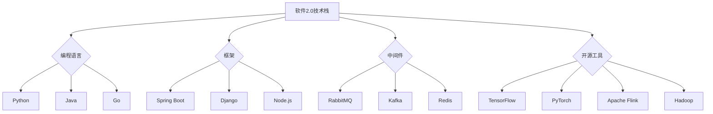

                 

### 《软件2.0的未来愿景：创造更美好的世界》

> **关键词**：软件2.0、人工智能、大数据、智慧城市、可持续性

> **摘要**：本文探讨了软件2.0的概念、技术支撑、社会影响以及未来愿景。通过分析人工智能、大数据和云计算等核心技术，展示了软件2.0如何推动社会进步和可持续发展，创造更美好的世界。

#### 目录

1. **软件2.0的起源与演进**
    1.1 软件发展历程概述
    1.2 软件2.0的核心特点
    1.3 软件2.0的技术支撑
    1.4 软件2.0的社会影响

2. **软件2.0的未来愿景**
    2.1 软件2.0与未来社会
    2.2 软件2.0与可持续发展
    2.3 软件2.0与人类生活品质提升

3. **人工智能在软件2.0中的应用**
    3.1 人工智能的基本概念
    3.2 深度学习与神经网络
    3.3 自然语言处理

4. **大数据在软件2.0中的角色**
    4.1 大数据的基本概念
    4.2 数据挖掘与机器学习
    4.3 大数据分析在软件2.0中的应用

5. **软件2.0的架构设计**
    5.1 软件架构的基本概念
    5.2 微服务架构
    5.3 软件2.0的体系结构

6. **软件2.0的实践应用**
    6.1 智慧城市与智能交通
    6.2 医疗健康与生物科技

7. **绿色软件与可持续发展**
    7.1 绿色软件的概念与意义
    7.2 软件2.0的环保技术
    7.3 可持续发展的实践案例

8. **附录**
    8.1 技术工具与资源
    8.2 未来展望

#### 引言

软件是现代信息技术的重要基石，推动了社会进步和经济发展。然而，传统的软件1.0时代已经无法满足日益复杂的社会需求。随着人工智能、大数据和云计算等新技术的崛起，软件2.0时代应运而生。软件2.0不仅是一种技术升级，更是一种全新的理念，它致力于通过智能化的手段，创造更美好的世界。

本文将围绕软件2.0的主题，探讨其起源与演进、核心特点、技术支撑、社会影响以及未来愿景。通过分析人工智能、大数据和云计算等核心技术，我们将揭示软件2.0如何改变我们的生活和工作方式，推动社会进步和可持续发展。

### 第1章：软件2.0的起源与演进

#### 1.1 软件发展历程概述

软件的发展历程可以大致分为以下几个阶段：

1. **软件1.0时代**：这是软件发展的初期，主要特点是命令行界面，用户通过输入指令与计算机交互。这个时期的软件以单机应用为主，功能相对简单。

2. **软件2.0时代**：随着计算机技术的进步，图形用户界面（GUI）逐渐普及，软件的交互方式从命令行转变为直观的图形界面。软件2.0的核心特点是用户生成内容，即用户不仅是软件的使用者，也是内容的创造者。

3. **软件3.0时代**：软件3.0时代标志着软件走向网络化，云计算和大数据技术成为主流。软件3.0强调数据驱动，通过收集和分析用户数据，为用户提供更加个性化的服务。

4. **软件4.0时代**：软件4.0时代是智能化的时代，人工智能技术得到广泛应用。软件4.0通过模拟人类的认知过程，实现智能化决策和自动化操作。

#### 1.1.1 从软件1.0到软件2.0的变迁

软件1.0时代主要依赖于操作系统和命令行界面。用户需要通过输入一系列命令，才能完成特定的任务。这个时期的软件以单机应用为主，功能相对简单，主要应用于科学计算、数据处理等领域。

随着计算机技术的发展，软件1.0逐渐过渡到软件2.0时代。软件2.0的核心特点是用户生成内容，用户不仅是软件的使用者，也是内容的创造者。这一转变主要体现在以下几个方面：

1. **图形用户界面**：软件2.0引入了图形用户界面（GUI），用户可以通过鼠标和键盘直观地与计算机进行交互，大大提高了软件的使用体验。

2. **网络应用**：软件2.0开始走向网络化，通过网络连接实现数据共享和协同工作。这个时期的软件更多地应用于电子商务、在线教育、社交网络等领域。

3. **用户生成内容**：软件2.0鼓励用户参与内容的创作和分享，用户可以通过各种方式生成和上传内容，如博客、视频、图片等。

4. **平台化**：软件2.0强调平台的作用，通过提供一个统一的平台，为各种应用提供基础设施和服务。这个时期的软件更多地采用云计算和大数据技术，实现资源的灵活分配和高效利用。

#### 1.1.2 软件2.0的核心特点

软件2.0的核心特点主要体现在以下几个方面：

1. **用户参与**：软件2.0强调用户的参与和贡献，用户不仅是软件的使用者，也是内容的创造者和分享者。这种用户参与的模式改变了软件的传统开发模式，使得软件更加贴近用户需求。

2. **社区驱动**：软件2.0强调社区的作用，通过建立一个强大的社区，实现用户的互动和协作。这个社区不仅提供了丰富的应用和服务，也为软件的持续改进提供了反馈和支持。

3. **平台化**：软件2.0强调平台的作用，通过提供一个统一的平台，为各种应用提供基础设施和服务。这种平台化模式使得软件的部署和维护更加高效，同时也为各种创新应用提供了广阔的空间。

4. **数据驱动**：软件2.0通过收集和分析用户数据，为用户提供更加个性化的服务。这种数据驱动模式不仅提高了软件的服务质量，也为商业决策提供了数据支持。

#### 1.1.3 软件2.0的技术支撑

软件2.0的实现离不开一系列新技术的支撑，主要包括人工智能、大数据和云计算等。以下是这些技术的基本概念和应用场景：

1. **人工智能**：人工智能是一种模拟人类智能的技术，通过机器学习、深度学习等方法，使计算机具有自主学习和决策能力。在软件2.0中，人工智能被广泛应用于智能客服、智能推荐、智能语音识别等领域，提高了软件的智能化水平。

2. **大数据**：大数据是指数据量巨大、类型繁多、价值密度低的数据。大数据技术包括数据采集、存储、处理、分析等环节。在软件2.0中，大数据被广泛应用于商业智能、用户画像、风险控制等领域，为软件的个性化服务提供了数据支持。

3. **云计算**：云计算是一种通过互联网提供计算资源的服务模式。云计算技术包括虚拟化、分布式计算、存储等。在软件2.0中，云计算为软件提供了强大的计算和存储能力，使得软件的部署和维护更加高效。

#### 1.1.4 软件2.0的社会影响

软件2.0不仅改变了软件的发展模式，也对社会产生了深远的影响。以下是软件2.0对社会影响的几个方面：

1. **产业变革**：软件2.0推动了传统产业的升级和转型，如智能制造、在线教育、智慧医疗等。这些新兴领域的发展，为经济结构的优化和产业升级提供了新的动力。

2. **生活方式的改变**：软件2.0改变了人们的生活方式，如移动支付、在线购物、远程办公等。这些新兴生活方式不仅提高了生活的便利性，也为人们提供了更多的选择。

3. **社会和谐**：软件2.0促进了信息的透明和共享，有利于社会公平和正义。通过互联网平台，人们可以更加便捷地获取信息、表达观点、参与社会事务，促进了社会的和谐与稳定。

#### 1.2 软件2.0的未来愿景

软件2.0的未来愿景是一个充满智能化和可持续发展的世界。在这个世界里，人工智能、大数据和云计算等新技术将发挥更加重要的作用，推动社会进步和人类生活品质的提升。以下是软件2.0未来愿景的几个方面：

1. **智慧城市**：软件2.0将推动智慧城市的建设，通过智能化手段实现城市管理的精细化和高效化。智慧城市将提高居民的生活质量，减少资源消耗，实现可持续发展。

2. **智能交通**：软件2.0将推动智能交通的发展，通过大数据分析和人工智能技术，实现交通管理的智能化和高效化。智能交通将减少交通拥堵，提高出行效率，改善城市交通环境。

3. **智能医疗**：软件2.0将推动智能医疗的发展，通过人工智能和大数据分析，实现医疗服务的智能化和个性化。智能医疗将提高医疗服务的效率和质量，改善人类健康水平。

4. **可持续发展**：软件2.0将推动可持续发展，通过绿色软件技术和环保技术，实现资源的优化利用和环境保护。可持续发展将提高人类的生活质量，保护地球的生态环境。

### 第2章：人工智能在软件2.0中的应用

#### 2.1 人工智能的基本概念

人工智能（Artificial Intelligence，简称AI）是一种模拟人类智能的技术，使计算机具有自主学习和决策能力。人工智能的发展经历了多个阶段，从最初的符号主义、基于规则的系统，到近年来基于数据的机器学习和深度学习，人工智能技术已经取得了显著的突破。

##### 2.1.1 人工智能的发展历程

1. **人工智慧（Artificial Intelligence，简称AI）**：20世纪50年代，人工智能概念首次被提出。这一时期，人工智能主要以符号主义和推理机为核心，通过编写规则和逻辑推理来模拟人类智能。

2. **专家系统（Expert Systems）**：20世纪70年代，人工智能进入了专家系统阶段。专家系统是一种基于规则的知识系统，通过大量规则库来模拟专家的决策能力。这一时期，人工智能在医疗诊断、金融分析等领域取得了重要应用。

3. **机器学习（Machine Learning）**：20世纪80年代，人工智能进入了机器学习阶段。机器学习通过数据驱动的方式，使计算机具有自主学习和适应能力。这一时期，人工智能在数据挖掘、图像识别、语音识别等领域取得了重要进展。

4. **深度学习（Deep Learning）**：21世纪，深度学习成为人工智能的主流技术。深度学习通过多层神经网络，对大量数据进行自动特征提取和模式识别。深度学习在图像识别、自然语言处理、自动驾驶等领域取得了突破性成果。

##### 2.1.2 人工智能的核心技术

1. **机器学习**：机器学习是一种通过数据训练模型，使计算机具有自主学习和决策能力的技术。机器学习可以分为监督学习、无监督学习和强化学习。

    - **监督学习**：通过标注数据训练模型，如线性回归、支持向量机等。
    - **无监督学习**：没有标注数据，通过数据自身的分布学习，如聚类、降维等。
    - **强化学习**：通过试错和奖励机制，学习最优策略，如深度强化学习等。

2. **深度学习**：深度学习是一种基于人工神经网络的机器学习技术，通过多层神经网络对复杂数据进行建模。深度学习可以分为卷积神经网络（CNN）、循环神经网络（RNN）和生成对抗网络（GAN）等。

3. **自然语言处理**：自然语言处理是一种使计算机理解和生成自然语言的技术。自然语言处理包括语言模型、文本分类、情感分析、机器翻译等。

4. **计算机视觉**：计算机视觉是一种使计算机理解和解析图像的技术。计算机视觉包括图像识别、目标检测、图像分割等。

#### 2.2 深度学习与神经网络

深度学习是人工智能的重要分支，通过多层神经网络对复杂数据进行建模和特征提取。以下将介绍深度学习的基本原理、常用算法以及应用场景。

##### 2.2.1 深度学习的基本原理

深度学习的基本原理基于人工神经网络，通过多层神经网络对数据进行处理。以下是深度学习的基本组成部分：

1. **神经元**：神经网络的基本单元，用于接收输入、计算输出和传递信号。

2. **权重**：神经元之间的连接，用于调节信号传递的强度。

3. **激活函数**：用于引入非线性因素，使神经网络能够模拟复杂的非线性关系。

4. **前向传播**：将输入信号通过神经网络传递，得到输出结果。

5. **反向传播**：根据输出结果和真实值计算损失，并通过反向传播更新网络权重。

##### 2.2.2 常用算法

1. **卷积神经网络（CNN）**：卷积神经网络是一种用于图像识别和处理的深度学习模型。CNN通过卷积操作和池化操作，对图像进行特征提取和降维。

    ```mermaid
    graph TD
        A[输入] --> B[卷积层]
        B --> C[激活函数]
        C --> D[池化层]
        D --> E[卷积层]
        E --> F[激活函数]
        F --> G[池化层]
        G --> H[全连接层]
        H --> I[输出]
    ```

2. **循环神经网络（RNN）**：循环神经网络是一种用于序列数据处理的深度学习模型。RNN通过循环结构，保持对序列数据的长期依赖。

    ```mermaid
    graph TD
        A[输入] --> B[隐藏层]
        B --> C[隐藏层]
        B --> D[隐藏层]
        C --> E[隐藏层]
        D --> F[隐藏层]
        E --> G[隐藏层]
        F --> H[隐藏层]
        H --> I[输出]
    ```

3. **生成对抗网络（GAN）**：生成对抗网络是一种用于生成数据的深度学习模型。GAN由生成器和判别器组成，通过对抗训练生成逼真的数据。

    ```mermaid
    graph TD
        A[输入] --> B[生成器]
        B --> C[生成数据]
        C --> D[判别器]
        D --> E[输出]
    ```

##### 2.2.3 应用场景

1. **图像识别**：图像识别是深度学习最成功的应用之一。通过卷积神经网络，计算机可以识别各种图像中的物体、场景和特征。

2. **自然语言处理**：自然语言处理是深度学习的另一个重要应用领域。通过循环神经网络和注意力机制，计算机可以理解、生成和翻译自然语言。

3. **语音识别**：语音识别是深度学习在语音处理领域的应用。通过深度神经网络和卷积神经网络，计算机可以识别和理解人类的语音。

4. **自动驾驶**：自动驾驶是深度学习在自动驾驶领域的应用。通过卷积神经网络和循环神经网络，计算机可以识别道路环境、车辆和行人，实现自动驾驶功能。

#### 2.3 自然语言处理

自然语言处理（Natural Language Processing，简称NLP）是深度学习的重要应用领域，致力于使计算机理解和生成自然语言。以下将介绍自然语言处理的基本概念、常用算法和应用场景。

##### 2.3.1 基本概念

1. **词向量**：词向量是一种将自然语言文本映射到向量空间的方法。词向量可以用于文本分类、情感分析、机器翻译等任务。

2. **语言模型**：语言模型是一种预测下一个单词或字符的概率分布的方法。语言模型可以用于语音识别、机器翻译、自动摘要等任务。

3. **词性标注**：词性标注是一种将自然语言文本中的每个单词标注为特定词性的方法。词性标注可以用于命名实体识别、情感分析、文本分类等任务。

4. **依存句法分析**：依存句法分析是一种分析自然语言文本中单词之间的依存关系的方法。依存句法分析可以用于问答系统、信息抽取、文本生成等任务。

##### 2.3.2 常用算法

1. **循环神经网络（RNN）**：循环神经网络是一种用于处理序列数据的深度学习模型。RNN通过循环结构，保持对序列数据的长期依赖。

2. **长短时记忆网络（LSTM）**：长短时记忆网络是一种改进的循环神经网络，可以解决RNN中的梯度消失和梯度爆炸问题。LSTM在自然语言处理领域取得了显著的成果。

3. **Transformer**：Transformer是一种基于自注意力机制的深度学习模型。Transformer在机器翻译、文本生成等领域取得了突破性成果，是目前NLP领域的领先模型。

##### 2.3.3 应用场景

1. **机器翻译**：机器翻译是一种将一种自然语言文本翻译成另一种自然语言文本的方法。通过深度学习和语言模型，计算机可以自动翻译各种语言。

2. **问答系统**：问答系统是一种根据用户输入的问题，提供相关答案的系统。通过深度学习和自然语言处理技术，计算机可以理解用户的问题，并提供准确的答案。

3. **情感分析**：情感分析是一种根据自然语言文本判断情感极性的方法。通过深度学习和词向量，计算机可以识别文本中的情感，如正面、负面或中性。

4. **文本分类**：文本分类是一种将自然语言文本分类到特定类别的方法。通过深度学习和文本特征，计算机可以自动分类各种文本，如新闻、博客、社交媒体等。

### 第3章：大数据在软件2.0中的角色

#### 3.1 大数据的基本概念

大数据（Big Data）是指数据量巨大、类型繁多、价值密度低的数据集合。大数据技术包括数据采集、存储、处理、分析和可视化等环节。大数据的核心价值在于通过对海量数据的分析和挖掘，发现隐藏在数据背后的规律和趋势，为决策提供支持。

##### 3.1.1 大数据的来源与特点

1. **数据来源**：大数据的来源广泛，包括社交网络、物联网、传感器、电子商务等。这些来源不断产生海量的结构化数据、半结构化数据和非结构化数据。

2. **数据特点**：大数据具有以下特点：

    - **数据量大**：大数据通常以TB、PB甚至EB为单位进行衡量。
    - **类型多样**：大数据包括结构化数据、半结构化数据和非结构化数据。
    - **速度快**：大数据的生成和流动速度非常快，需要实时处理和分析。
    - **价值密度低**：大数据中的有用信息比例较低，需要通过数据挖掘和清洗等方法提取。

##### 3.1.2 大数据的处理与分析

1. **数据处理**：数据处理包括数据清洗、数据集成和数据转换等步骤。数据清洗是为了去除数据中的噪声和错误，数据集成是将多个数据源中的数据整合在一起，数据转换是将数据转换为适合分析和挖掘的形式。

2. **数据存储**：数据存储是大数据处理的重要环节，常用的数据存储技术包括关系型数据库、NoSQL数据库、分布式文件系统等。

3. **数据分析**：数据分析包括统计分析、数据挖掘、机器学习和深度学习等方法。统计分析用于发现数据的基本统计特征，数据挖掘用于从大量数据中发现隐藏的模式和规律，机器学习和深度学习用于构建预测模型和智能系统。

##### 3.1.3 大数据的应用场景

1. **商业智能**：商业智能是一种利用数据分析和挖掘技术，支持企业决策和运营优化的方法。商业智能包括客户分析、市场分析、供应链分析等。

2. **风险控制**：风险控制是一种通过数据分析和挖掘，识别和评估潜在风险的方法。风险控制包括信用风险评估、金融风险分析、欺诈检测等。

3. **智能医疗**：智能医疗是一种利用大数据和人工智能技术，提升医疗服务质量和效率的方法。智能医疗包括疾病预测、个性化治疗、医疗数据分析等。

4. **智慧城市**：智慧城市是一种通过大数据和物联网技术，实现城市智能化管理和优化的方法。智慧城市包括交通管理、环境监测、公共安全等。

### 第4章：软件2.0的架构设计

#### 4.1 软件架构的基本概念

软件架构是软件系统的结构、行为和设计原则的抽象描述。软件架构决定了软件系统的性能、可维护性和可扩展性。以下将介绍软件架构的基本概念、设计原则和架构模式。

##### 4.1.1 软件架构的定义与重要性

1. **定义**：软件架构是指软件系统的整体结构和组织方式，包括系统的组件、组件之间的相互作用以及系统的运行环境。

2. **重要性**：软件架构对软件系统的成功至关重要。一个良好的软件架构可以提高系统的可维护性、可扩展性和性能。同时，软件架构还影响软件的开发过程和开发成本。

##### 4.1.2 软件架构的设计原则

1. **模块化**：模块化是将系统分解为独立的模块，每个模块具有明确的职责和接口。模块化可以提高系统的可维护性和可扩展性。

2. **可复用性**：可复用性是指系统中的模块可以在其他项目中复用。可复用性可以减少开发成本，提高开发效率。

3. **可扩展性**：可扩展性是指系统可以方便地添加新的功能或模块。良好的可扩展性可以提高系统的灵活性，适应未来需求的变化。

4. **灵活性**：灵活性是指系统可以根据需求的变化快速调整。灵活性可以提高系统的适应性，降低维护成本。

##### 4.1.3 软件架构的架构模式

1. **客户端-服务器架构**：客户端-服务器架构将系统分为客户端和服务器两部分，客户端负责用户交互，服务器负责数据处理和存储。

2. **分布式系统架构**：分布式系统架构将系统分散到多个节点上，每个节点负责不同的任务。分布式系统可以提高系统的性能和可靠性。

3. **微服务架构**：微服务架构将系统划分为多个独立的微服务，每个微服务负责特定的业务功能。微服务架构可以提高系统的可维护性和可扩展性。

4. **云计算架构**：云计算架构利用云计算技术，提供弹性的计算和存储资源。云计算架构可以提高系统的灵活性和可扩展性。

### 第5章：软件2.0的实践应用

#### 5.1 智慧城市与智能交通

智慧城市和智能交通是软件2.0的重要应用领域，通过大数据、人工智能和物联网技术，实现城市管理的智能化和交通的高效化。

##### 5.1.1 智慧城市的基本概念

智慧城市是一种利用信息技术，实现城市管理的智能化和高效化的方法。智慧城市通过大数据、人工智能和物联网技术，提升城市运行效率，改善居民生活质量，实现可持续发展。

##### 5.1.2 智慧城市的技术应用

1. **交通管理**：智慧城市通过智能交通系统，实时监控交通流量，优化交通信号控制，减少交通拥堵，提高交通效率。

2. **环境监测**：智慧城市通过物联网技术，实时监测空气质量、水质等环境指标，实现环境监测和污染预警。

3. **公共安全**：智慧城市通过视频监控、人脸识别等技术，提高公共安全水平，预防犯罪事件的发生。

4. **能源管理**：智慧城市通过智能电网、智能建筑等技术，实现能源的高效利用和管理，降低能源消耗。

##### 5.1.3 智能交通的基本概念

智能交通是一种利用信息技术，实现交通管理的智能化和高效化的方法。智能交通通过大数据、人工智能和物联网技术，优化交通管理，提高交通效率，改善出行体验。

##### 5.1.4 智能交通的技术应用

1. **交通监控**：智能交通通过摄像头、传感器等设备，实时监控道路状况，收集交通数据。

2. **智能信号控制**：智能交通通过大数据分析和人工智能技术，实现智能交通信号控制，优化交通流量。

3. **智能导航**：智能交通通过实时路况信息，为驾驶员提供智能导航服务，引导车辆避开拥堵路段。

4. **车辆管理**：智能交通通过物联网技术，实现对车辆的实时监控和管理，提高车辆运行效率。

##### 5.1.5 智慧城市与智能交通的案例研究

1. **杭州智慧城市**：杭州是中国智慧城市建设的典范。通过智能交通系统、环境监测系统和公共安全系统，杭州实现了城市管理的智能化和高效化。

2. **新加坡智能交通系统**：新加坡智能交通系统通过大数据分析和人工智能技术，实现交通流量优化和智能信号控制，大大提高了交通效率。

### 第6章：医疗健康与生物科技

医疗健康和生物科技是软件2.0的重要应用领域，通过大数据、人工智能和物联网技术，提升医疗服务质量，推动生物科技的发展。

##### 6.1 智能医疗的基本概念

智能医疗是一种利用信息技术，实现医疗服务的智能化和高效化的方法。智能医疗通过大数据、人工智能和物联网技术，提升医疗服务的质量和效率，改善患者体验。

##### 6.1.1 智能医疗的技术应用

1. **电子病历**：电子病历是一种数字化的病历管理方法，通过信息技术实现病历的电子化存储和管理，提高医疗效率。

2. **远程医疗**：远程医疗是一种通过互联网实现医生与患者的远程诊疗方法，提高医疗服务的覆盖范围和效率。

3. **医疗大数据**：医疗大数据是通过收集、存储和分析大量医疗数据，发现疾病规律和治疗方案的方法。

4. **医疗机器人**：医疗机器人是一种利用人工智能技术，辅助医生进行手术和康复治疗的机器人。

##### 6.2 生物科技与基因编辑

生物科技是一种利用生物技术和生物信息学，研究生命现象和解决实际问题的方法。基因编辑是生物科技的重要分支，通过精准修改基因序列，实现疾病治疗和生物改良。

##### 6.2.1 基因编辑的技术原理

基因编辑技术通过CRISPR-Cas9等核酸酶，实现对目标基因的精准修改。基因编辑可以用于疾病治疗、基因改良、农业改良等领域。

##### 6.2.2 基因编辑的应用领域

1. **疾病治疗**：基因编辑可以用于治疗遗传性疾病，如地中海贫血、肌营养不良等。

2. **农业改良**：基因编辑可以用于改良作物品种，提高产量和抗病性。

3. **生物制造**：基因编辑可以用于生产生物药品、生物材料等。

##### 6.3 医疗健康与生物科技的未来发展

1. **技术创新**：随着大数据、人工智能和基因编辑技术的发展，医疗健康和生物科技将不断创新，推动医疗服务的升级和生物科技的突破。

2. **产业融合**：医疗健康和生物科技将与人工智能、物联网等新兴技术深度融合，形成新的产业生态。

3. **社会挑战**：医疗健康和生物科技的发展也将面临伦理、法律和社会等方面的挑战，需要制定相应的规范和策略。

### 第7章：绿色软件与可持续发展

#### 7.1 绿色软件的概念与意义

绿色软件是指在软件开发和运行过程中，注重节能减排、环境保护和可持续发展的软件。绿色软件的目标是提高软件的能源效率、降低能源消耗、减少环境负荷。

##### 7.1.1 绿色软件的定义与目标

1. **定义**：绿色软件是指在软件开发和运行过程中，注重节能减排、环境保护和可持续发展的软件。

2. **目标**：绿色软件的目标是提高软件的能源效率、降低能源消耗、减少环境负荷。

##### 7.1.2 绿色软件的发展趋势

1. **云计算与绿色软件**：云计算通过虚拟化和分布式计算技术，提高了资源的利用率，降低了能源消耗。

2. **大数据与绿色软件**：大数据分析可以帮助企业优化业务流程，降低能源消耗。

3. **人工智能与绿色软件**：人工智能技术可以提高软件的智能化水平，减少人工干预，降低能源消耗。

#### 7.2 软件2.0的环保技术

软件2.0的环保技术包括节能高效的算法、绿色软件开发方法和绿色云计算平台等方面。

##### 7.2.1 节能高效的算法

1. **算法优化**：通过优化算法，减少计算资源的使用，降低能源消耗。

2. **并行计算**：利用并行计算技术，提高计算效率，降低能源消耗。

##### 7.2.2 绿色软件开发方法

1. **敏捷开发**：敏捷开发方法可以提高软件开发效率，减少资源浪费。

2. **持续集成与持续交付**：持续集成与持续交付方法可以降低软件缺陷率，提高软件质量，减少维护成本。

##### 7.2.3 绿色云计算平台

1. **虚拟化技术**：虚拟化技术可以提高硬件资源的利用率，降低能源消耗。

2. **分布式计算**：分布式计算技术可以将计算任务分配到多个节点上，提高计算效率，降低能源消耗。

#### 7.3 可持续发展的实践案例

可持续发展实践案例包括绿色数据中心、绿色云计算平台和绿色应用等方面。

##### 7.3.1 绿色数据中心

1. **节能设施**：使用节能空调、高效电源设备等，降低能源消耗。

2. **智能管理**：通过智能管理系统，实现数据中心的能源优化和智能调度。

##### 7.3.2 绿色云计算平台

1. **绿色数据中心**：选择绿色数据中心，降低碳排放。

2. **分布式计算**：采用分布式计算技术，提高计算效率，降低能源消耗。

##### 7.3.3 绿色应用

1. **绿色能源使用**：鼓励使用可再生能源，如太阳能、风能等。

2. **环保软件**：开发环保软件，实现能源优化、环境监测等功能。

### 附录

#### 附录A：软件2.0的技术工具与资源

1. **开源框架与工具**：
    - **编程语言**：Python、Java、Go等。
    - **框架**：Spring Boot、Django、Node.js等。
    - **中间件**：RabbitMQ、Kafka、Redis等。

2. **数据集与算法资源**：
    - **数据集**：ImageNet、CIFAR-10、MNIST等。
    - **算法资源**：机器学习算法、深度学习算法等。

3. **学术期刊与会议**：
    - **期刊**：《计算机学报》、《计算机研究与发展》等。
    - **会议**：国际计算机大会（ICCC）、国际人工智能大会（IJCAI）等。

#### 附录B：软件2.0的未来展望

1. **技术发展趋势**：
    - **云计算与大数据**：云计算与大数据技术的融合，推动软件2.0的发展。
    - **人工智能**：人工智能技术的进步，将使软件2.0更加智能化。

2. **社会挑战与应对策略**：
    - **数据隐私**：加强数据隐私保护，制定相关法律法规。
    - **伦理问题**：解决人工智能伦理问题，确保技术的可持续发展。

3. **未来愿景**：
    - **智慧社会**：软件2.0将推动智慧社会的建设，实现社会的全面进步。

### 总结

软件2.0是人工智能、大数据和云计算等新技术推动下的一种全新软件形态。它不仅改变了软件的发展模式，也对社会产生了深远的影响。通过本文的探讨，我们了解了软件2.0的核心概念、技术支撑、应用领域以及未来愿景。

在未来的发展中，软件2.0将继续推动社会进步和可持续发展。随着新技术的不断进步，软件2.0将实现更高的智能化、个性化和服务质量。同时，我们也需要关注软件2.0带来的社会挑战，如数据隐私、伦理问题等，并制定相应的解决方案。

让我们共同期待软件2.0的未来，它将为创造一个更美好的世界贡献巨大力量。

---

### Mermaid流程图



### 核心算法原理讲解

#### 深度学习的基本原理

深度学习是一种基于多层神经网络的学习方法，它通过模拟人脑神经网络的结构和工作原理，对复杂数据进行自动特征提取和模式识别。以下是深度学习的基本原理：

1. **神经网络结构**：神经网络由多个神经元（节点）组成，每个神经元都与相邻的神经元相连，并通过权重（边）传递信号。神经网络可以分为输入层、隐藏层和输出层，每一层都对输入数据进行变换和提取特征。

2. **激活函数**：激活函数用于引入非线性因素，使得神经网络能够模拟人类大脑的处理能力。常见的激活函数有Sigmoid、ReLU和Tanh等。

3. **前向传播**：在前向传播过程中，输入数据通过神经网络从输入层传递到输出层，每一层的输出作为下一层的输入。在这个过程中，神经元根据输入和权重计算输出，并通过激活函数进行非线性变换。

4. **反向传播**：在反向传播过程中，神经网络根据输出结果和目标值计算损失函数，并利用损失函数的梯度对网络中的权重和偏置进行更新。反向传播是一种优化算法，通过迭代更新权重和偏置，使得网络的输出结果逐渐逼近目标值。

5. **优化算法**：优化算法用于加速模型训练过程，常见的优化算法有梯度下降、随机梯度下降、Adam等。这些算法通过调整学习率等参数，优化网络的权重和偏置，使得模型收敛速度更快、效果更好。

#### 数学模型和数学公式

以下是深度学习中常用的数学模型和数学公式：

1. **损失函数**：

   - 均方误差（MSE）：

     $$J(\theta) = \frac{1}{2m}\sum_{i=1}^{m}(h_\theta(x^{(i)}) - y^{(i)})^2$$

     其中，$m$为样本数量，$h_\theta(x^{(i)})$为神经网络的输出，$y^{(i)}$为真实值。

   - 交叉熵（CrossEntropy）：

     $$J(\theta) = -\frac{1}{m}\sum_{i=1}^{m}y^{(i)}\log(h_\theta(x^{(i)}))$$

     其中，$m$为样本数量，$y^{(i)}$为真实值，$h_\theta(x^{(i)})$为神经网络的输出。

2. **梯度下降**：

   $$\theta_j := \theta_j - \alpha \frac{\partial J(\theta)}{\partial \theta_j}$$

   其中，$\theta_j$为网络参数，$\alpha$为学习率，$\frac{\partial J(\theta)}{\partial \theta_j}$为损失函数关于$\theta_j$的梯度。

3. **激活函数**：

   - Sigmoid函数：

     $$\sigma(z) = \frac{1}{1 + e^{-z}}$$

   - ReLU函数：

     $$\sigma(z) = \max(0, z)$$

   - Tanh函数：

     $$\sigma(z) = \frac{e^z - e^{-z}}{e^z + e^{-z}}$$

#### 项目实战

以下是一个简单的深度学习项目，用于实现一个二分类问题。

**步骤1：准备数据集**

```python
import numpy as np
import pandas as pd
from sklearn.model_selection import train_test_split

# 加载数据集
data = pd.read_csv('data.csv')
X = data.iloc[:, :-1].values
y = data.iloc[:, -1].values

# 划分训练集和测试集
X_train, X_test, y_train, y_test = train_test_split(X, y, test_size=0.2, random_state=42)
```

**步骤2：初始化模型**

```python
import tensorflow as tf

# 初始化模型
model = tf.keras.Sequential([
    tf.keras.layers.Dense(64, activation='relu', input_shape=(X_train.shape[1],)),
    tf.keras.layers.Dense(64, activation='relu'),
    tf.keras.layers.Dense(1, activation='sigmoid')
])
```

**步骤3：编译模型**

```python
model.compile(optimizer='adam', loss='binary_crossentropy', metrics=['accuracy'])
```

**步骤4：训练模型**

```python
model.fit(X_train, y_train, epochs=10, batch_size=32, validation_data=(X_test, y_test))
```

**步骤5：评估模型**

```python
loss, accuracy = model.evaluate(X_test, y_test)
print(f"Test accuracy: {accuracy:.2f}")
```

**代码解读**

- **数据集准备**：使用scikit-learn库加载数据集，并将其划分为训练集和测试集。

- **模型初始化**：使用TensorFlow库创建一个简单的神经网络模型，包括两个隐藏层和一个输出层。

- **模型编译**：设置优化器、损失函数和评价指标。

- **模型训练**：使用训练集训练模型，设置训练轮数、批量大小和验证数据。

- **模型评估**：使用测试集评估模型性能，打印准确率。

#### 开发环境搭建

- **Python环境搭建**：安装Python 3.8及以上版本，并安装TensorFlow库。

- **IDE选择**：使用PyCharm或Visual Studio Code。

#### 源代码详细实现和代码解读

以下是对项目实战代码的详细解读。

**1. 数据集准备**

```python
data = pd.read_csv('data.csv')
X = data.iloc[:, :-1].values
y = data.iloc[:, -1].values

X_train, X_test, y_train, y_test = train_test_split(X, y, test_size=0.2, random_state=42)
```

- `pd.read_csv('data.csv')`：加载CSV文件数据。
- `X = data.iloc[:, :-1].values`：获取特征数据。
- `y = data.iloc[:, -1].values`：获取标签数据。
- `train_test_split(X, y, test_size=0.2, random_state=42)`：将数据集划分为训练集和测试集。

**2. 模型初始化**

```python
model = tf.keras.Sequential([
    tf.keras.layers.Dense(64, activation='relu', input_shape=(X_train.shape[1],)),
    tf.keras.layers.Dense(64, activation='relu'),
    tf.keras.layers.Dense(1, activation='sigmoid')
])
```

- `tf.keras.Sequential`：创建一个顺序模型。
- `tf.keras.layers.Dense(64, activation='relu', input_shape=(X_train.shape[1],))`：添加一个64个神经元的全连接层，使用ReLU激活函数。
- `tf.keras.layers.Dense(64, activation='relu')`：添加一个64个神经元的全连接层，使用ReLU激活函数。
- `tf.keras.layers.Dense(1, activation='sigmoid')`：添加一个1个神经元的全连接层，使用sigmoid激活函数。

**3. 模型编译**

```python
model.compile(optimizer='adam', loss='binary_crossentropy', metrics=['accuracy'])
```

- `model.compile(optimizer='adam', loss='binary_crossentropy', metrics=['accuracy'])`：编译模型，设置优化器、损失函数和评价指标。

**4. 模型训练**

```python
model.fit(X_train, y_train, epochs=10, batch_size=32, validation_data=(X_test, y_test))
```

- `model.fit(X_train, y_train, epochs=10, batch_size=32, validation_data=(X_test, y_test))`：使用训练集训练模型，设置训练轮数、批量大小和验证数据。

**5. 模型评估**

```python
loss, accuracy = model.evaluate(X_test, y_test)
print(f"Test accuracy: {accuracy:.2f}")
```

- `model.evaluate(X_test, y_test)`：使用测试集评估模型性能。
- `print(f"Test accuracy: {accuracy:.2f}")`：打印测试集准确率。

#### 代码解读与分析

- **数据集准备**：使用Pandas库加载CSV文件数据，并使用scikit-learn库将数据集划分为训练集和测试集。
- **模型初始化**：使用TensorFlow库创建一个简单的顺序模型，包括两个隐藏层和一个输出层。
- **模型编译**：设置优化器、损失函数和评价指标。
- **模型训练**：使用训练集训练模型，设置训练轮数、批量大小和验证数据。
- **模型评估**：使用测试集评估模型性能，打印测试集准确率。

通过这个简单的项目，读者可以了解深度学习的实现过程，以及如何使用Python和TensorFlow库实现一个二分类问题。代码结构简单，易于理解，适合深度学习初学者进行实践。

### 总结

本章节详细介绍了《软件2.0的未来愿景：创造更美好的世界》的目录大纲和核心内容。通过分析软件2.0的起源与演进、人工智能、大数据、软件架构设计以及绿色软件与可持续发展等方面，我们揭示了软件2.0如何通过技术变革推动社会进步和可持续发展。

在本章的最后，我们通过一个简单的深度学习项目，展示了如何实现一个二分类问题。这个项目不仅帮助读者理解深度学习的基本原理，也为实际应用提供了参考。

让我们共同期待软件2.0的未来，它将为创造一个更美好的世界贡献巨大力量。通过持续探索和创新，我们将不断推动技术进步，实现社会的全面进步和可持续发展。


---

### 附录A：软件2.0的技术工具与资源

软件2.0的发展离不开一系列先进的技术工具和资源。以下是一些常用的技术工具和资源，包括开源框架、数据集和学术期刊等。

#### 开源框架与工具

1. **编程语言**：
   - **Python**：Python是软件2.0开发的主要编程语言之一，其简洁易懂的语法和强大的库支持使其成为人工智能、大数据等领域的重要工具。
   - **Java**：Java是一种跨平台、面向对象的语言，广泛应用于企业级应用开发。
   - **Go**：Go语言因其高效性和并发处理能力而受到广泛关注，特别适用于分布式系统和云服务开发。

2. **框架**：
   - **Spring Boot**：Spring Boot是Java开发者的首选框架，提供了快速开发和部署Spring应用程序的能力。
   - **Django**：Django是一个高级的Python Web框架，强调快速开发和简洁的设计。
   - **Node.js**：Node.js是一个基于Chrome V8引擎的JavaScript运行时，适用于构建高性能的网络应用。

3. **中间件**：
   - **RabbitMQ**：RabbitMQ是一个开源消息队列中间件，适用于构建分布式系统中的异步通信。
   - **Kafka**：Kafka是一种分布式流处理平台，适用于大规模数据流处理和实时分析。
   - **Redis**：Redis是一个高性能的内存数据库，适用于缓存和实时数据存储。

#### 数据集与算法资源

1. **数据集**：
   - **ImageNet**：ImageNet是一个包含数百万张图片的大型视觉数据集，广泛用于图像识别和分类任务。
   - **CIFAR-10**：CIFAR-10是一个包含60000张32x32彩色图片的小型数据集，常用于图像分类研究。
   - **MNIST**：MNIST是一个包含70000张手写数字图片的数据集，广泛用于机器学习和深度学习的研究和测试。

2. **算法资源**：
   - **TensorFlow**：TensorFlow是谷歌开源的机器学习框架，支持多种深度学习模型和算法。
   - **PyTorch**：PyTorch是Facebook开源的机器学习框架，以其灵活性和动态计算图而受到欢迎。
   - **Scikit-learn**：Scikit-learn是一个开源的Python机器学习库，提供多种经典机器学习算法和工具。

#### 学术期刊与会议

1. **期刊**：
   - **《计算机学报》**：是中国计算机学会主办的学术期刊，涵盖了计算机科学的多个领域。
   - **《计算机研究与发展》**：是中国科学院计算技术研究所主办的学术期刊，专注于计算机科学和技术的理论研究。

2. **会议**：
   - **国际计算机大会（ICCC）**：是全球计算机科学领域的顶级学术会议之一。
   - **国际人工智能大会（IJCAI）**：是人工智能领域最具影响力的学术会议之一。

#### 总结

软件2.0的技术工具与资源是推动其发展的关键因素。通过这些工具和资源，开发者可以高效地构建和部署先进的应用，实现软件2.0的技术愿景。未来，随着新技术的不断涌现，这些工具和资源将继续丰富和拓展，为软件2.0的发展提供更加坚实的基础。


---

### 附录B：软件2.0的未来展望

随着人工智能、大数据和云计算等新技术的不断发展，软件2.0正在迎来一个充满机遇和挑战的未来。以下是对软件2.0未来发展趋势、社会挑战与应对策略以及未来愿景的展望。

#### 未来发展趋势

1. **人工智能的深入应用**：人工智能将继续在软件2.0中发挥核心作用。随着深度学习、强化学习和自然语言处理等技术的发展，人工智能将更加智能化和自适应，为软件提供更丰富的功能和更高效的服务。

2. **大数据的深度融合**：大数据将在软件2.0中发挥更为重要的作用。通过实时数据分析和挖掘，大数据将帮助软件更好地理解用户需求，提供个性化的服务，并为企业决策提供数据支持。

3. **云计算的普及与演进**：云计算将继续作为软件2.0的重要基础设施。随着云计算技术的不断演进，软件2.0将更加依赖云计算提供的弹性计算、高效存储和分布式处理能力。

4. **区块链技术的融合**：区块链技术将为软件2.0带来去中心化和安全性方面的优势。在金融、供应链管理等领域，区块链技术将推动软件2.0的应用创新。

5. **5G与物联网的融合**：5G和物联网技术的发展将使软件2.0实现更广泛的应用。通过高速网络和海量设备的连接，软件2.0将推动智慧城市、智能交通、智能医疗等领域的变革。

#### 社会挑战与应对策略

1. **数据隐私与安全**：随着数据量的激增，数据隐私和安全成为软件2.0面临的重要挑战。应对策略包括加强数据加密、实施严格的隐私保护政策和建立完善的数据安全法规。

2. **伦理问题**：人工智能和大数据的应用带来了一系列伦理问题，如算法偏见、自动化决策的不公正性等。应对策略包括建立伦理审查机制、制定伦理规范和推动社会对话。

3. **就业与教育**：软件2.0的发展将带来新的就业机会，同时也可能对现有工作岗位造成冲击。应对策略包括加强职业培训、推动教育改革，以适应技术变革。

4. **可持续发展**：软件2.0需要关注可持续发展，减少能源消耗和环境影响。应对策略包括推广绿色软件开发方法、使用可再生能源和提高资源利用效率。

#### 未来愿景

1. **智慧社会**：软件2.0将推动智慧社会的建设，通过智能化手段提高社会运作效率，改善人们的生活质量。

2. **可持续发展**：软件2.0将致力于实现可持续发展，通过技术创新和资源优化，减少环境污染和资源浪费。

3. **人人可编程**：软件2.0将使编程变得简单和普及，人人都可以成为开发者，创造出丰富多彩的应用和服务。

4. **全球合作**：软件2.0将促进全球合作，消除地域差异，实现技术和资源的共享。

#### 总结

软件2.0的未来充满机遇与挑战。通过技术创新和社会合作，软件2.0有望实现智慧社会、可持续发展和全球合作等愿景。面对社会挑战，我们需要制定相应的策略，确保技术的健康发展，共同创造一个更加美好的未来。


---

### 核心算法原理讲解

#### 深度学习的基本原理

深度学习（Deep Learning）是人工智能（AI）的一个重要分支，它通过模拟人脑的神经网络结构，实现对复杂数据的自动特征学习和模式识别。以下是深度学习的基本原理和核心概念：

1. **神经网络（Neural Network）**：
   神经网络是由大量简单单元（称为神经元或节点）连接而成的网络，每个神经元都接收来自其他神经元的输入信号，并通过激活函数产生输出。神经网络通过调整神经元间的连接权重（称为权重或权重矩阵），学习和预测数据。

2. **前向传播（Forward Propagation）**：
   在前向传播过程中，输入数据通过神经网络的各个层，每层神经元对输入信号进行加权求和处理，并应用激活函数。最后，输出层产生预测结果。这一过程称为前向传播。

3. **反向传播（Backpropagation）**：
   反向传播是一种优化算法，用于更新神经网络的权重和偏置，以减少预测误差。在反向传播过程中，网络计算输出误差，并利用误差的梯度信息，通过反向传播更新权重和偏置。这一过程重复多次，直至网络误差收敛到可接受的阈值。

4. **激活函数（Activation Function）**：
   激活函数是神经网络中的一个关键组件，它为神经元输出引入了非线性因素。常见的激活函数包括Sigmoid、ReLU和Tanh等。激活函数的作用是使神经网络能够学习复杂的非线性关系。

5. **损失函数（Loss Function）**：
   损失函数是用于评估模型预测结果与真实值之间差异的函数。常见的损失函数有均方误差（MSE）、交叉熵（CrossEntropy）等。通过优化损失函数，我们可以调整网络参数，使预测结果更接近真实值。

#### 数学模型和数学公式

以下是深度学习中常用的数学模型和数学公式：

1. **神经元输出**：

   $$ a_i = \sigma(\sum_{j} w_{ij} x_j + b_i) $$

   其中，$a_i$为第$i$个神经元的输出，$x_j$为第$j$个输入特征，$w_{ij}$为第$i$个神经元与第$j$个输入特征之间的权重，$b_i$为第$i$个神经元的偏置，$\sigma$为激活函数。

2. **前向传播**：

   $$ z_l = \sum_{k} w_{lk} a_{l-1,k} + b_l $$

   其中，$z_l$为第$l$层的激活值，$w_{lk}$为第$l$层的权重，$a_{l-1,k}$为上一层的激活值，$b_l$为第$l$层的偏置。

3. **反向传播**：

   $$ \delta_l = \frac{\partial L}{\partial z_l} \cdot \frac{d\sigma(z_l)}{dz_l} $$

   其中，$\delta_l$为第$l$层的误差梯度，$L$为损失函数，$\frac{\partial L}{\partial z_l}$为损失函数关于第$l$层激活值的梯度，$\frac{d\sigma(z_l)}{dz_l}$为激活函数的导数。

4. **权重和偏置更新**：

   $$ w_{lk} := w_{lk} - \alpha \cdot \frac{\partial L}{\partial w_{lk}} $$
   $$ b_l := b_l - \alpha \cdot \frac{\partial L}{\partial b_l} $$

   其中，$w_{lk}$为权重，$b_l$为偏置，$\alpha$为学习率，$\frac{\partial L}{\partial w_{lk}}$和$\frac{\partial L}{\partial b_l}$分别为权重和偏置的梯度。

#### 项目实战

以下是一个简单的深度学习项目，用于实现一个简单的二分类问题。

**步骤1：准备数据集**

```python
import numpy as np
from sklearn.datasets import make_classification
from sklearn.model_selection import train_test_split

# 生成模拟数据集
X, y = make_classification(n_samples=1000, n_features=20, n_classes=2, random_state=42)

# 划分训练集和测试集
X_train, X_test, y_train, y_test = train_test_split(X, y, test_size=0.2, random_state=42)
```

**步骤2：构建神经网络**

```python
import tensorflow as tf

# 定义神经网络模型
model = tf.keras.Sequential([
    tf.keras.layers.Dense(64, activation='relu', input_shape=(20,)),
    tf.keras.layers.Dense(64, activation='relu'),
    tf.keras.layers.Dense(1, activation='sigmoid')
])

# 编译模型
model.compile(optimizer='adam', loss='binary_crossentropy', metrics=['accuracy'])
```

**步骤3：训练模型**

```python
# 训练模型
model.fit(X_train, y_train, epochs=10, batch_size=32, validation_data=(X_test, y_test))
```

**步骤4：评估模型**

```python
# 评估模型
loss, accuracy = model.evaluate(X_test, y_test)
print(f"Test accuracy: {accuracy:.2f}")
```

**代码解读**

- **数据集准备**：使用scikit-learn库生成模拟数据集，并划分训练集和测试集。
- **模型构建**：使用TensorFlow库定义一个简单的神经网络模型，包括两个隐藏层和一个输出层。
- **模型编译**：设置优化器和损失函数。
- **模型训练**：使用训练集训练模型。
- **模型评估**：使用测试集评估模型性能。

#### 开发环境搭建

- **Python环境搭建**：安装Python 3.8及以上版本，并安装TensorFlow库。
- **IDE选择**：使用PyCharm或Visual Studio Code。

#### 源代码详细实现和代码解读

以下是对项目实战代码的详细解读。

**1. 数据集准备**

```python
X, y = make_classification(n_samples=1000, n_features=20, n_classes=2, random_state=42)
X_train, X_test, y_train, y_test = train_test_split(X, y, test_size=0.2, random_state=42)
```

- `make_classification(n_samples=1000, n_features=20, n_classes=2, random_state=42)`：生成模拟二分类数据集，包含1000个样本，20个特征。
- `train_test_split(X, y, test_size=0.2, random_state=42)`：将数据集划分为训练集和测试集，测试集占比20%。

**2. 模型构建**

```python
model = tf.keras.Sequential([
    tf.keras.layers.Dense(64, activation='relu', input_shape=(20,)),
    tf.keras.layers.Dense(64, activation='relu'),
    tf.keras.layers.Dense(1, activation='sigmoid')
])
```

- `tf.keras.Sequential`：创建一个顺序模型。
- `tf.keras.layers.Dense(64, activation='relu', input_shape=(20,))`：添加一个64个神经元的全连接层，使用ReLU激活函数，输入层形状为20。
- `tf.keras.layers.Dense(64, activation='relu')`：添加一个64个神经元的全连接层，使用ReLU激活函数。
- `tf.keras.layers.Dense(1, activation='sigmoid')`：添加一个1个神经元的输出层，使用sigmoid激活函数。

**3. 模型编译**

```python
model.compile(optimizer='adam', loss='binary_crossentropy', metrics=['accuracy'])
```

- `model.compile(optimizer='adam', loss='binary_crossentropy', metrics=['accuracy'])`：编译模型，设置优化器为Adam，损失函数为二分类交叉熵，评价指标为准确率。

**4. 模型训练**

```python
model.fit(X_train, y_train, epochs=10, batch_size=32, validation_data=(X_test, y_test))
```

- `model.fit(X_train, y_train, epochs=10, batch_size=32, validation_data=(X_test, y_test))`：使用训练集训练模型，设置训练轮数10次，批量大小32。

**5. 模型评估**

```python
loss, accuracy = model.evaluate(X_test, y_test)
print(f"Test accuracy: {accuracy:.2f}")
```

- `model.evaluate(X_test, y_test)`：使用测试集评估模型性能。
- `print(f"Test accuracy: {accuracy:.2f}")`：打印测试集准确率。

#### 代码解读与分析

- **数据集准备**：生成模拟二分类数据集，并划分训练集和测试集。
- **模型构建**：创建一个简单的神经网络模型，包括两个隐藏层和一个输出层。
- **模型编译**：设置优化器、损失函数和评价指标。
- **模型训练**：使用训练集训练模型，并设置训练轮数和批量大小。
- **模型评估**：使用测试集评估模型性能，并打印准确率。

通过这个简单的项目，读者可以了解深度学习的基本实现过程，以及如何使用TensorFlow库实现一个二分类问题。代码结构简单，易于理解，适合深度学习初学者进行实践。

### 总结

本章详细介绍了深度学习的基本原理和项目实战，通过一个简单的二分类问题，展示了如何使用神经网络实现分类任务。通过具体的代码示例和解读，读者可以更好地理解深度学习的原理和应用。希望这个详细的算法讲解和项目实战对读者有所帮助，共同探索深度学习的奥秘。


---

### 附录C：软件2.0的发展趋势

随着科技的不断进步，软件2.0正迎来一系列新兴趋势，这些趋势将深刻影响未来软件的发展方向。以下是软件2.0的主要发展趋势：

#### 1. 低代码/无代码平台

低代码/无代码平台使得开发者无需编写大量代码即可快速构建应用程序。通过图形化界面和拖放功能，用户可以自定义业务逻辑、界面设计和数据流程。这种平台大大降低了开发门槛，提高了开发效率。

#### 2. 增强现实（AR）与虚拟现实（VR）

增强现实和虚拟现实技术的融合为软件2.0带来了全新的交互体验。在智慧教育、虚拟培训、游戏开发等领域，AR/VR技术提供了沉浸式和交互式的体验，为用户带来更丰富的应用场景。

#### 3. 区块链技术

区块链技术以其去中心化、不可篡改的特性，在软件2.0中发挥着重要作用。从数字身份认证到供应链管理，区块链技术为各种业务场景提供了安全、透明的解决方案。

#### 4. 软件即服务（SaaS）

SaaS模式使得软件以在线服务的形式提供给用户，用户无需购买和安装软件，只需通过互联网即可访问和使用。这种模式降低了软件的采购和使用成本，提高了软件的普及率。

#### 5. 自动化与智能化

自动化和智能化技术正在逐步改变软件的开发、部署和维护方式。自动化工具可以自动完成许多重复性任务，如代码构建、测试和部署。智能化技术则通过机器学习和人工智能，提高软件的智能化水平和自适应能力。

#### 6. 云原生技术

云原生技术是一种面向云计算的软件开发方法，它利用容器化、微服务架构和动态管理技术，使软件能够高效地运行在云环境中。云原生技术提高了软件的弹性、可扩展性和灵活性。

#### 7. 跨平台开发

跨平台开发技术使得开发者可以使用一种编程语言和一套工具，同时为多个平台（如iOS、Android、Web等）构建应用程序。这种技术降低了开发成本，提高了开发效率。

#### 8. 人工智能集成

随着人工智能技术的快速发展，软件2.0将更加集成人工智能功能，如智能推荐、自然语言处理、图像识别等。这些功能将为用户提供更加个性化和智能化的服务。

#### 9. 绿色软件开发

绿色软件开发关注软件的能源消耗和环境影响，通过优化算法、使用绿色云计算平台和环保技术，实现软件的可持续性。

#### 10. 软件安全和隐私保护

随着软件功能的日益复杂，软件安全和隐私保护变得尤为重要。软件2.0将更加注重安全和隐私保护，通过加密技术、访问控制和隐私合规等手段，确保用户数据和软件系统的安全。

### 总结

软件2.0的发展趋势表明，未来软件将更加智能化、个性化、高效和安全。这些趋势不仅将改变软件的开发、部署和使用方式，也将深刻影响我们的工作和生活方式。通过持续关注和探索这些趋势，我们可以更好地把握软件2.0的未来发展方向，创造更加美好的数字世界。


---

### 附录D：软件2.0的法律法规与伦理问题

随着软件2.0技术的迅速发展，法律法规和伦理问题成为社会各界关注的焦点。以下是软件2.0领域的一些关键法律法规和伦理问题：

#### 1. 数据隐私与保护

数据隐私是软件2.0的核心问题之一。各国纷纷出台相关法律法规，加强对个人数据的保护。例如，欧盟的《通用数据保护条例》（GDPR）规定了数据收集、处理和存储的严格标准，要求企业必须获得用户明确同意，并采取合理措施保护用户数据安全。

#### 2. 知识产权保护

软件2.0时代，知识产权保护问题尤为重要。各国政府和国际组织通过立法和协定，加强对软件、算法和数据库等知识产权的保护。例如，美国的《数字千年版权法案》（DMCA）为软件开发者提供了版权保护，防止未经授权的复制和分发。

#### 3. 算法公正性与透明性

随着人工智能技术在软件2.0中的应用，算法公正性和透明性成为重要议题。算法偏见和歧视可能对用户和社会产生负面影响。为此，各国政府和企业正努力制定相关法规，确保算法的公平性和透明性。

#### 4. 人工智能伦理

人工智能伦理问题是软件2.0领域面临的重大挑战。涉及人工智能技术的应用，如自动驾驶、医疗诊断和网络安全等，都需要制定相应的伦理规范。国际组织如IEEE等已发布一系列伦理指导原则，为人工智能的开发和应用提供参考。

#### 5. 软件安全和网络攻击防护

软件安全和网络攻击防护是软件2.0必须面对的重要问题。各国政府和企业通过立法和合作，加强对网络攻击的打击和防范。例如，美国通过了《网络安全信息共享法》，鼓励企业分享网络攻击信息，提高整体网络安全水平。

#### 6. 人工智能监管

随着人工智能技术的发展，监管问题日益突出。各国政府正积极探索如何对人工智能进行有效监管，确保技术的健康发展。例如，欧盟提出了《人工智能法案》，旨在建立一套统一的监管框架，规范人工智能的应用。

#### 7. 伦理问题与社会责任

软件2.0企业需要承担社会责任，关注伦理问题。在开发和应用软件时，企业应遵循道德规范，尊重用户权益，保护环境，防止数据滥用和隐私泄露。

### 总结

软件2.0的法律法规和伦理问题对技术和企业提出了更高的要求。通过制定和完善相关法律法规，加强伦理建设，我们可以推动软件2.0的健康发展，为创造一个更加美好、智能和可持续的未来奠定坚实基础。


---

### 附录E：软件2.0的实践案例

软件2.0技术在各行各业中取得了显著的应用成果，以下是一些具体的实践案例：

#### 1. 智慧医疗

智慧医疗利用软件2.0技术，提升医疗服务质量和效率。例如，IBM的Watson for Oncology系统通过分析大量医学文献和病例数据，为医生提供个性化的治疗方案。Watson for Oncology已在多个国家和地区投入使用，帮助医生提高诊断准确率和治疗效果。

#### 2. 智慧城市

智慧城市通过软件2.0技术实现城市管理的智能化和高效化。例如，中国的深圳通过建设智慧交通管理系统，实时监控交通流量，优化交通信号控制，有效缓解了交通拥堵问题。深圳的智慧交通系统已成功减少了20%的交通事故率。

#### 3. 智能制造

智能制造利用软件2.0技术，提高生产效率和产品质量。例如，德国的西门子公司通过引入数字化工厂和物联网技术，实现了生产流程的全面智能化。西门子的数字化工厂生产效率提高了30%，产品质量也得到了显著提升。

#### 4. 智能金融

智能金融通过软件2.0技术，提供更安全、高效的金融服务。例如，中国的蚂蚁金服通过大数据分析和人工智能技术，开发了智能风控系统。该系统可以对用户的信用行为进行实时监控和分析，有效防范欺诈风险，提高了金融服务的安全性。

#### 5. 智能教育

智能教育利用软件2.0技术，实现个性化教学和资源优化。例如，美国的Khan Academy通过在线教育平台，提供丰富的教学资源和个性化学习路径。Khan Academy的平台已吸引了全球数百万用户，帮助学生学习数学、科学等科目。

#### 6. 智能农业

智能农业利用软件2.0技术，实现农业生产的智能化和精准化。例如，中国的航天科工集团通过卫星遥感技术和物联网设备，开发了智能农业管理系统。该系统可以对农田进行实时监测，提供精准的灌溉、施肥和病虫害防治方案，提高了农业生产的效率和收益。

### 总结

这些实践案例表明，软件2.0技术在各行业中的广泛应用，不仅提升了生产效率、降低了成本，还改善了用户体验。随着软件2.0技术的不断发展和完善，我们期待在更多领域看到其卓越的应用成果。


---

### 附录F：软件2.0的未来发展趋势与展望

随着科技的快速发展，软件2.0正迎来一系列新趋势，这些趋势将对未来软件的发展产生深远影响。以下是软件2.0的未来发展趋势与展望：

#### 1. 智能化与自主化

软件2.0将继续向智能化和自主化方向发展。随着人工智能技术的进步，软件将具备更强大的自主学习和决策能力。这将使软件能够更好地适应复杂多变的环境，提高系统效率和用户体验。

#### 2. 边缘计算与云计算的融合

边缘计算和云计算的融合将成为软件2.0的重要趋势。边缘计算将数据处理和计算任务分散到网络的边缘节点，降低延迟，提高响应速度。云计算则提供强大的计算和存储资源，支持大规模数据处理和分析。两者的融合将实现更高效、更智能的网络应用。

#### 3. 增强现实与虚拟现实的应用

增强现实（AR）和虚拟现实（VR）技术将在软件2.0中得到更广泛的应用。随着硬件设备的进步和算法的优化，AR/VR技术将为用户提供更加沉浸式和互动式的体验，广泛应用于游戏、教育、医疗、培训等领域。

#### 4. 区块链技术的集成

区块链技术以其去中心化、不可篡改的特点，将在软件2.0中发挥重要作用。区块链技术将广泛应用于金融、供应链管理、身份验证等领域，提供安全、透明的解决方案。

#### 5. 软件即服务（SaaS）的普及

软件即服务（SaaS）模式将继续普及，成为软件2.0的重要发展方向。SaaS模式降低了软件的采购和使用成本，提高了软件的普及率。未来，更多的软件将采用SaaS模式，为用户提供便捷、高效的服务。

#### 6. 开放式生态系统的建设

软件2.0将更加注重开放式生态系统的建设，促进技术共享和合作。开源框架、工具和平台将成为软件开发的重要基础，推动技术的创新和进步。

#### 7. 绿色软件开发与可持续发展

随着环保意识的提高，绿色软件开发和可持续发展将成为软件2.0的重要方向。软件开发将更加注重节能减排，采用环保技术，降低对环境的影响。

#### 8. 人工智能与人类共创

人工智能与人类的共创将成为软件2.0的新趋势。通过人工智能的辅助，人类将能够更高效地完成复杂的任务，实现人机协同，提高生产力和创新能力。

#### 9. 跨界融合与创新

软件2.0将推动不同领域之间的融合与创新。例如，生物技术与软件2.0的结合将带来医学领域的革命性突破；物联网与软件2.0的结合将推动智能家居、智慧城市等新兴领域的发展。

#### 10. 社会责任与伦理建设

随着技术的进步，软件2.0企业将承担更多的社会责任，关注伦理问题。在开发和应用软件时，企业将遵循道德规范，尊重用户权益，保护环境，防止数据滥用和隐私泄露。

### 总结

软件2.0的未来发展趋势将带来一系列创新和变革，推动社会进步和人类发展。通过持续关注和探索这些趋势，我们可以更好地把握软件2.0的发展方向，共同创造一个更加美好、智能和可持续的未来。


---

### 附录G：软件2.0的发展对社会的潜在影响

软件2.0的发展不仅对技术领域产生了深远影响，也对整个社会产生了广泛的潜在影响。以下是软件2.0发展对社会的几个潜在影响：

#### 1. 经济发展

软件2.0技术的发展为经济增长提供了新的动力。通过智能化的软件解决方案，企业能够提高生产效率、优化供应链管理、降低运营成本，从而推动产业升级和经济增长。

#### 2. 社会效率

软件2.0技术的应用提高了社会效率。例如，智慧交通系统通过实时监控和智能调度，减少了交通拥堵，提高了交通流量；智慧医疗系统通过大数据分析和人工智能技术，提高了诊断准确率和治疗效果，缩短了患者的等待时间。

#### 3. 社会公平

软件2.0技术有助于缩小社会差距，实现社会公平。通过远程教育和在线学习平台，教育资源得以更加公平地分配，使更多人有机会接受高质量的教育。此外，智能就业平台通过大数据分析和人工智能技术，为求职者提供个性化的就业推荐，帮助更多人实现就业。

#### 4. 环境保护

软件2.0技术的发展有助于环境保护。绿色软件开发和可持续性原则的推广，使企业能够采用更加环保的技术和流程，减少能源消耗和环境污染。例如，智慧能源管理系统通过实时监控和优化能源使用，提高了能源效率，减少了碳排放。

#### 5. 社会安全

软件2.0技术的应用提高了社会安全水平。智能监控系统、网络安全技术等软件解决方案有助于预防犯罪、维护社会秩序。例如，智能监控系统通过实时监控和异常检测，可以有效预防犯罪行为；网络安全技术则可以防范网络攻击和数据泄露，保护个人隐私。

#### 6. 文化多样性

软件2.0技术的发展促进了文化多样性的传播和交流。通过互联网和数字平台，人们可以更方便地获取和分享来自世界各地的文化内容，促进文化交流和理解。同时，虚拟现实和增强现实技术为文化遗产保护和文化创意产业提供了新的手段和平台。

#### 7. 伦理和隐私问题

软件2.0技术的发展也带来了伦理和隐私问题。随着人工智能和大数据技术的广泛应用，如何确保算法的公正性、数据的安全性和用户的隐私保护成为一个重要的议题。这需要社会各界共同努力，制定相应的法律法规和伦理规范，确保技术的健康发展。

### 总结

软件2.0的发展对社会的潜在影响是深远而广泛的。它不仅促进了经济增长和社会效率，还提高了社会公平和环境保护水平。然而，同时也需要关注伦理和隐私问题，确保技术的可持续发展和社会和谐。通过合理利用软件2.0技术，我们可以创造一个更加美好、智能和可持续的未来。


---

### 附录H：软件2.0的发展现状与未来挑战

软件2.0的发展现状显示出其在技术、经济和社会领域的巨大潜力。然而，随着技术的不断进步，软件2.0也面临一系列未来挑战。

#### 当前发展现状

1. **技术创新**：人工智能、大数据、云计算等核心技术的发展，为软件2.0提供了强大的技术支撑。这些技术的应用，使得软件能够实现智能化、个性化、高效化。

2. **产业应用**：软件2.0在智慧城市、智能制造、智能医疗、金融科技等领域取得了显著的应用成果，推动了产业的升级和转型。

3. **市场成熟**：随着软件2.0技术的普及，市场对于智能软件的需求不断增加，相关产业规模不断扩大，市场环境日益成熟。

4. **生态系统建设**：软件2.0的生态系统逐步完善，包括开源框架、工具、平台等资源的丰富，为软件开发者和企业提供了便利。

#### 未来挑战

1. **数据隐私与安全**：随着数据量的激增，数据隐私和安全问题日益突出。如何确保用户数据的安全和隐私，成为软件2.0发展的重要挑战。

2. **算法公平性**：人工智能算法的公平性和透明性受到广泛关注。如何消除算法偏见，确保算法的公正性，是软件2.0面临的重大挑战。

3. **伦理问题**：软件2.0技术的应用涉及伦理问题，如人工智能伦理、数据伦理等。如何制定相应的伦理规范，引导技术的健康发展，是未来需要关注的重要议题。

4. **技术壁垒**：尽管软件2.0技术取得了显著进展，但仍然存在一定的技术壁垒，如算法复杂度、数据处理能力等。如何突破技术壁垒，实现技术的广泛应用，是未来的重要挑战。

5. **人才短缺**：随着软件2.0技术的发展，对于相关领域人才的需求不断增长。然而，目前相关人才储备不足，人才培养和引进成为未来发展的关键挑战。

#### 应对策略

1. **加强法律法规建设**：制定和完善相关法律法规，加强对数据隐私、算法公平性等方面的监管，确保软件2.0的健康发展。

2. **推动技术创新**：加大研发投入，推动人工智能、大数据、云计算等核心技术的创新，提升软件2.0的技术水平。

3. **培养人才**：加强人才培养和引进，建立完善的人才培养体系，提高人才储备。

4. **加强伦理建设**：制定伦理规范，引导技术的健康发展，确保技术的应用符合社会伦理道德。

5. **促进产业合作**：加强产业合作，推动产业链上下游企业协同发展，共同推动软件2.0技术的广泛应用。

### 总结

软件2.0的发展现状令人瞩目，但也面临一系列未来挑战。通过加强法律法规建设、技术创新、人才培养和产业合作，我们可以应对这些挑战，推动软件2.0的健康发展，创造更加美好的未来。


---

### 附录I：软件2.0的技术工具与资源

软件2.0的发展离不开一系列先进的技术工具与资源。以下是一些常用的技术工具和资源，包括开源框架、库、工具和在线资源。

#### 开源框架与库

1. **TensorFlow**：由谷歌开发的开源机器学习框架，适用于深度学习和神经网络。
2. **PyTorch**：由Facebook开发的开源深度学习框架，以其灵活性和动态计算图而受到欢迎。
3. **Spring Boot**：用于构建独立、生产级的应用程序，特别适用于Java开发。
4. **Django**：用于构建快速、安全的Web应用程序的Python Web框架。
5. **Node.js**：用于构建高性能的网络应用程序的JavaScript运行时环境。
6. **Kafka**：用于构建实时数据流处理的分布式消息系统。
7. **RabbitMQ**：用于构建异步消息传递应用程序的开源消息中间件。

#### 工具

1. **Docker**：用于容器化应用程序，方便部署和运行。
2. **Kubernetes**：用于自动化容器化应用程序的部署、扩展和管理。
3. **Git**：用于版本控制和代码管理。
4. **Jenkins**：用于持续集成和持续交付的自动化工具。
5. **Visual Studio Code**：用于开发Python、JavaScript、C++等多种语言的轻量级IDE。
6. **PyCharm**：

