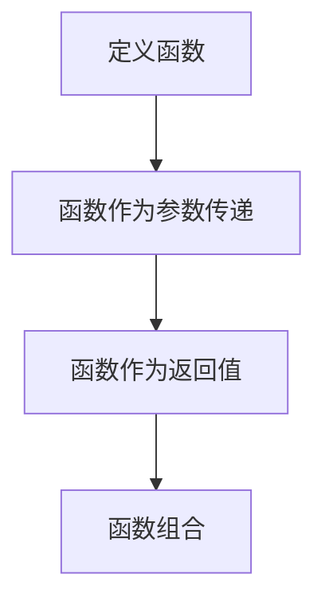

                 

### 《软件2.0的函数式编程实践》

#### 关键词：
函数式编程，软件2.0，Haskell，Scala，Elixir，数据处理，Web开发，人工智能，系统编程，异步编程，并发编程，项目实战。

#### 摘要：
本文旨在深入探讨函数式编程在软件2.0时代的实践应用。首先，我们回顾了函数式编程的基本概念、核心原理和语言特点，并通过Haskell、Scala和Elixir等语言实例进行了详细讲解。接着，文章展示了函数式编程在数据处理、Web开发以及其他领域如人工智能和系统编程中的应用实践。最后，通过具体项目实战，我们进一步理解了函数式编程的强大功能和实际操作步骤。

### 第一部分：函数式编程基础

#### 第1章：函数式编程概述

函数式编程是一种编程范式，它强调以表达式而不是指令的方式来定义计算过程。在这一章节中，我们将从以下几个方面对函数式编程进行概述：

##### 1.1 函数作为第一级公民

在函数式编程中，函数被视为第一级公民，这意味着它们可以像普通变量一样被赋值、传递和返回。这种范式简化了代码结构，使得函数的重用和组合更加方便。

- **概念解释**: 函数作为第一级公民允许函数被传递作为参数，以及从函数中返回函数。

- **Mermaid流程图**: 函数作为第一级公民的概念可以用一个简单的Mermaid流程图来表示：



##### 1.2 无状态和不可变性

无状态和不可变性是函数式编程的核心原理。无状态意味着函数不依赖于外部状态，而是通过参数完全定义。不可变性则意味着一旦一个值被创建，它就不能被修改。

- **概念解释**: 无状态和不可变性有助于确保程序的确定性，因为相同的输入总是产生相同的输出。

- **伪代码**: 以下是一个简单的无状态和不可变性的伪代码示例：

```python
def calculate(x, y):
    return x + y

result = calculate(5, 10)  # 每次调用都会得到结果 15
```

##### 1.3 高阶函数

高阶函数是函数式编程的一个重要概念，它是指那些接受函数作为参数或返回函数的函数。高阶函数使得函数的抽象和组合更加灵活。

- **概念解释**: 高阶函数可以用于创建抽象的数据处理管道，使得代码更简洁、可读性更强。

- **伪代码**: 以下是一个使用高阶函数的伪代码示例：

```python
def filter_list(lst, predicate):
    return [x for x in lst if predicate(x)]

def is_even(x):
    return x % 2 == 0

even_numbers = filter_list([1, 2, 3, 4], is_even)  # 输出 [2, 4]
```

##### 1.4 函数式编程的优势与挑战

函数式编程具有多方面的优势，如简洁、高效和安全。但同时，它也存在一些挑战，如学习曲线和性能问题。

- **优势**: 简洁的语法、易于测试和维护、高效的数据处理能力。

- **挑战**: 学习曲线较陡峭、某些操作可能不如命令式编程高效。

- **案例讨论**: 我们可以讨论一些在不同领域（如数据处理、Web开发、人工智能）中函数式编程的优势和挑战的实际案例。

在接下来的章节中，我们将深入探讨函数式编程的语言基础和应用实践。

---

### 《软件2.0的函数式编程实践》目录大纲

#### 第一部分：函数式编程基础

##### 第1章：函数式编程概述

- **1.1 函数作为第一级公民**
- **1.2 无状态和不可变性**
- **1.3 高阶函数**
- **1.4 函数式编程的优势与挑战**

##### 第2章：函数式编程语言基础

- **2.1 Haskell语言基础**
  - **2.1.1 类型系统**
  - **2.1.2 类型推导**
  - **2.1.3 高级函数**
- **2.2 Scala语言基础**
  - **2.2.1 函数式编程特性**
  - **2.2.2 集合操作**
  - **2.2.3 模式匹配**
- **2.3 Elixir语言基础**
  - **2.3.1 函数式编程特性**
  - **2.3.2 并发编程**
  - **2.3.3 多态性**

#### 第二部分：函数式编程应用

##### 第3章：函数式编程在数据处理中的应用

- **3.1 数据清洗与预处理**
- **3.2 数据分析**
- **3.3 数据可视化**

##### 第4章：函数式编程在Web开发中的应用

- **4.1 函数式Web框架介绍**
- **4.2 RESTful API设计**
- **4.3 函数式Web应用实战**

##### 第5章：函数式编程在其他领域的应用

- **5.1 游戏开发**
- **5.2 人工智能**
- **5.3 系统编程**

#### 第三部分：函数式编程进阶

##### 第6章：函数式编程高级特性

- **6.1 柔性类型系统**
- **6.2 异步编程模型**
- **6.3 并发编程**

##### 第7章：函数式编程项目实战

- **7.1 数据处理项目**
- **7.2 Web开发项目**
- **7.3 游戏开发项目**

#### 附录

- **附录A：函数式编程资源汇总**
  - **开发工具与框架**
  - **学习资源**
  - **社区与论坛**

---

### 第一部分：函数式编程基础

#### 第1章：函数式编程概述

函数式编程是一种编程范式，它以表达式而不是指令的方式来定义计算过程。在这一章节中，我们将从以下几个方面对函数式编程进行概述。

##### 1.1 函数作为第一级公民

在函数式编程中，函数被视为第一级公民，这意味着它们可以像普通变量一样被赋值、传递和返回。这种范式简化了代码结构，使得函数的重用和组合更加方便。

- **概念解释**: 函数作为第一级公民允许函数被传递作为参数，以及从函数中返回函数。

- **Mermaid流程图**: 函数作为第一级公民的概念可以用一个简单的Mermaid流程图来表示：


##### 1.2 无状态和不可变性

无状态和不可变性是函数式编程的核心原理。无状态意味着函数不依赖于外部状态，而是通过参数完全定义。不可变性则意味着一旦一个值被创建，它就不能被修改。

- **概念解释**: 无状态和不可变性有助于确保程序的确定性，因为相同的输入总是产生相同的输出。

- **伪代码**: 以下是一个简单的无状态和不可变性的伪代码示例：

```python
def calculate(x, y):
    return x + y

result = calculate(5, 10)  # 每次调用都会得到结果 15
```

##### 1.3 高阶函数

高阶函数是函数式编程的一个重要概念，它是指那些接受函数作为参数或返回函数的函数。高阶函数使得函数的抽象和组合更加灵活。

- **概念解释**: 高阶函数可以用于创建抽象的数据处理管道，使得代码更简洁、可读性更强。

- **伪代码**: 以下是一个使用高阶函数的伪代码示例：

```python
def filter_list(lst, predicate):
    return [x for x in lst if predicate(x)]

def is_even(x):
    return x % 2 == 0

even_numbers = filter_list([1, 2, 3, 4], is_even)  # 输出 [2, 4]
```

##### 1.4 函数式编程的优势与挑战

函数式编程具有多方面的优势，如简洁、高效和安全。但同时，它也存在一些挑战，如学习曲线和性能问题。

- **优势**: 简洁的语法、易于测试和维护、高效的数据处理能力。

- **挑战**: 学习曲线较陡峭、某些操作可能不如命令式编程高效。

- **案例讨论**: 我们可以讨论一些在不同领域（如数据处理、Web开发、人工智能）中函数式编程的优势和挑战的实际案例。

在接下来的章节中，我们将深入探讨函数式编程的语言基础和应用实践。

---

### 第2章：函数式编程语言基础

在这一章节中，我们将探讨几种流行的函数式编程语言：Haskell、Scala和Elixir。每种语言都有其独特的特点和应用场景。

#### 2.1 Haskell语言基础

Haskell是一种纯函数式编程语言，以其严格的静态类型系统和惰性计算而闻名。

##### 2.1.1 类型系统

Haskell采用类型推导系统，这意味着类型可以在编译时自动推导。这种机制简化了代码，减少了类型注解的需要。

- **概念解释**: 类型推导允许函数根据其参数和返回值自动确定类型。

- **伪代码**: 以下是一个使用Haskell类型推导的伪代码示例：

```haskell
calculate :: Int -> Int -> Int
calculate x y = x + y
```

##### 2.1.2 类型推导

Haskell的类型推导系统使得编写复杂函数时无需显式指定类型。

- **概念解释**: 类型推导通过分析函数的参数和返回值来推断类型。

- **伪代码**: 以下是一个使用类型推导的伪代码示例：

```haskell
filterList :: (a -> Bool) -> [a] -> [a]
filterList predicate list = [x | x <- list, predicate x]
```

##### 2.1.3 高级函数

Haskell提供了许多高级函数，如`map`、`filter`和`fold`，这些函数可以用于数据结构的操作。

- **概念解释**: 高级函数是预定义的函数，用于处理复杂的数据操作。

- **伪代码**: 以下是一个使用Haskell高级函数的伪代码示例：

```haskell
numbers = [1..10]
squaredNumbers = map (^2) numbers  -- 输出 [1, 4, 9, 16, 25, 36, 49, 64, 81, 100]
```

#### 2.2 Scala语言基础

Scala是一种多范式编程语言，它结合了函数式编程和面向对象编程的特点。

##### 2.2.1 函数式编程特性

Scala提供了丰富的函数式编程特性，如高阶函数、不可变数据结构和模式匹配。

- **概念解释**: 函数式编程特性使得Scala能够以函数为中心进行编程。

- **伪代码**: 以下是一个使用Scala函数式编程特性的伪代码示例：

```scala
def calculate(x: Int, y: Int): Int = x + y

val numbers = 1 to 10
val squaredNumbers = numbers.map(_ * _)  // 输出 Vector(1, 4, 9, 16, 25, 36, 49, 64, 81, 100)
```

##### 2.2.2 集合操作

Scala的集合操作非常强大，支持各种高级数据处理功能。

- **概念解释**: 集合操作是Scala的核心功能之一，用于处理复杂数据结构。

- **伪代码**: 以下是一个使用Scala集合操作的伪代码示例：

```scala
val list = List(1, 2, 3, 4, 5)
val evenNumbers = list.filter(_ % 2 == 0)  // 输出 List(2, 4)
```

##### 2.2.3 模式匹配

Scala的模式匹配是一种强大的函数式编程工具，用于处理数据结构。

- **概念解释**: 模式匹配通过比较输入值与模式，对数据进行分类处理。

- **伪代码**: 以下是一个使用Scala模式匹配的伪代码示例：

```scala
def matchNumber(number: Int): String = number match {
  case 1 => "One"
  case 2 => "Two"
  case _ => "Other"
}

val result = matchNumber(2)  // 输出 "Two"
```

#### 2.3 Elixir语言基础

Elixir是一种现代的函数式编程语言，特别适用于并发编程。

##### 2.3.1 函数式编程特性

Elixir提供了函数式编程的核心特性，如不可变数据结构和模式匹配。

- **概念解释**: 函数式编程特性使得Elixir能够高效地处理并发和分布式系统。

- **伪代码**: 以下是一个使用Elixir函数式编程特性的伪代码示例：

```elixir
defmodule Calculator do
  def calculate(x, y), do: x + y
end

numbers = 1..10
squared_numbers = numbers |> Enum.map(&(&1 * &1))  # 输出 [1, 4, 9, 16, 25, 36, 49, 64, 81, 100]
```

##### 2.3.2 并发编程

Elixir的并发编程模型基于Actor模型，使得并发编程变得简单和高效。

- **概念解释**: 并发编程是处理多个任务同时执行的一种方式。

- **伪代码**: 以下是一个使用Elixir并发编程的伪代码示例：

```elixir
defmodule Worker do
  use GenServer

  def start_link(state), do: GenServer.start_link(__MODULE__, state)

  def init(state), do: {:ok, state}

  def handle_call(:status, _from, state), do: {:reply, state, state}

  defp work, do: :ok
end

# 启动一个工作进程
worker = Worker.start_link([1, 2, 3])

# 模拟工作进程执行任务
Process.send_after(self(), :work, 1000)
```

##### 2.3.3 多态性

Elixir通过多态性支持不同类型之间的通用操作。

- **概念解释**: 多态性使得同一个操作可以在不同的数据类型上执行不同的行为。

- **伪代码**: 以下是一个使用Elixir多态性的伪代码示例：

```elixir
defmodule Shape do
  def area(shape), do: shape |> area_of

  defp area_of(%{width: w, height: h}), do: w * h
  defp area_of(%{radius: r}), do: 3.14 * r * r
end

square = %{width: 10, height: 10}
circle = %{radius: 5}

square_area = Shape.area(square)  # 输出 100
circle_area = Shape.area(circle)  # 输出 78.5
```

通过以上对Haskell、Scala和Elixir的介绍，我们可以看到函数式编程语言在类型系统、类型推导、集合操作、模式匹配、并发编程和多态性等方面各有特点。这些语言为开发者提供了丰富的工具，以实现更简洁、更高效和更安全的代码。

在接下来的章节中，我们将进一步探讨函数式编程在不同领域的应用。

---

### 第3章：函数式编程在数据处理中的应用

函数式编程以其强大的数据处理能力在数据科学和大数据领域得到了广泛应用。在这一章节中，我们将探讨函数式编程在数据处理中的主要应用，包括数据清洗与预处理、数据分析和数据可视化。

#### 3.1 数据清洗与预处理

数据清洗与预处理是数据分析过程中至关重要的一步。在函数式编程中，我们可以利用其无状态和不可变性的特点，高效地处理数据清洗与预处理任务。

- **概念解释**: 数据清洗与预处理包括去除无效数据、填充缺失值、转换数据格式等。

- **伪代码**: 以下是一个使用Python中函数式编程实现数据清洗与预处理的伪代码示例：

```python
import pandas as pd

def clean_data(df):
    # 去除无效数据
    df = df.dropna()
    # 转换数据格式
    df['date'] = pd.to_datetime(df['date'])
    return df

data = pd.read_csv('data.csv')
cleaned_data = clean_data(data)
```

#### 3.2 数据分析

数据分析是数据科学的核心任务之一。函数式编程提供了强大的工具，如高阶函数、列表推导式和模式匹配，用于高效地进行数据分析。

- **概念解释**: 数据分析包括描述性统计、聚类分析、回归分析等。

- **伪代码**: 以下是一个使用R中函数式编程实现数据分析的伪代码示例：

```r
library(dplyr)

data <- read.csv('data.csv')

# 描述性统计
summary_data <- data %>% summarize_all(mean)

# 聚类分析
clusters <- kmeans(data, centers = 3)
data$cluster <- clusters$cluster

# 回归分析
model <- lm(y ~ x1 + x2, data = data)
summary(model)
```

#### 3.3 数据可视化

数据可视化是数据分析的重要环节，它帮助人们更好地理解和解释数据。函数式编程在数据可视化方面同样表现出色，通过使用高阶函数和可组合的图表库，我们可以轻松实现复杂的数据可视化。

- **概念解释**: 数据可视化包括基本图表绘制、交互式数据可视化和高级图表应用。

- **伪代码**: 以下是一个使用Python中函数式编程实现数据可视化的伪代码示例：

```python
import matplotlib.pyplot as plt
import pandas as pd

def plot_histogram(data, bins=10):
    plt.hist(data, bins=bins)
    plt.xlabel('Value')
    plt.ylabel('Frequency')
    plt.title('Histogram of Data')
    plt.show()

data = pd.read_csv('data.csv')['value']
plot_histogram(data)
```

通过以上示例，我们可以看到函数式编程在数据处理中的应用如何通过其简洁的语法和高阶抽象，使得数据处理、分析和可视化任务变得更加高效和易于维护。

在接下来的章节中，我们将继续探讨函数式编程在Web开发和其他领域的应用。

---

### 第4章：函数式编程在Web开发中的应用

函数式编程因其强大的抽象能力和并发处理能力，在Web开发领域也逐渐受到关注。在这一章节中，我们将深入探讨函数式编程在Web开发中的应用，包括函数式Web框架的介绍、RESTful API设计以及函数式Web应用的实际开发。

#### 4.1 函数式Web框架介绍

现代Web开发框架通常提供了一套丰富的功能，如路由处理、请求验证和响应格式化等。在函数式编程语言中，也有多种优秀的Web框架可以满足开发需求。

- **Scala中的Play Framework**

  Play Framework是一个基于Scala和Java的Web框架，以其非侵入性和快速开发著称。Play支持函数式编程特性，如不可变数据结构和模式匹配。

  - **概念解释**: Play Framework提供了基于Scala的简洁路由定义和强大的依赖注入。

  - **伪代码**: 以下是一个使用Play Framework的伪代码示例：

    ```scala
    import play.api.mvc._

    class HelloWorld extends Controller {
      def index = Action {
        Ok("Hello World!")
      }
    }
    ```

- **Haskell中的Yesod**

  Yesod是一个基于Haskell的Web框架，以其高效性和安全性闻名。Yesod利用了Haskell的惰性计算和类型系统，为开发者提供了强大的功能。

  - **概念解释**: Yesod提供了一个简洁的模板引擎和丰富的中间件支持。

  - **伪代码**: 以下是一个使用Yesod的伪代码示例：

    ```haskell
    data Route = Home | About

    route :: Handler String
    route Home = return $ "Welcome to the homepage!"
    route About = return $ "This is the about page."

    main :: IO ()
    main = do
      webServer "9000" $ applicationHandler
    ```

- **Elixir中的Phoenix**

  Phoenix是一个基于Elixir的Web框架，以其并发处理能力和简洁的语法而受到欢迎。Phoenix提供了强大的功能，如实时通信和路由系统。

  - **概念解释**: Phoenix利用了Elixir的Actor模型，使得Web应用能够高效处理大量并发请求。

  - **伪代码**: 以下是一个使用Phoenix的伪代码示例：

    ```elixir
    defmodule MyApp.Router do
      use Phoenix.Router

      pipeline :api do
        plug :accepts, ["json"]
      end

      scope "/api" do
        pipe_through :api
        get "/hello", MyApp.HelloController, :index
      end
    end
    ```

#### 4.2 RESTful API设计

RESTful API是Web服务设计的一种标准方式，它通过统一的接口和资源表示，使得应用程序之间的交互更加简洁和高效。在函数式编程中，我们可以利用其强大的抽象能力来设计RESTful API。

- **概念解释**: RESTful API通过HTTP方法（如GET、POST、PUT、DELETE）来操作资源。

- **伪代码**: 以下是一个使用Scala中的Play Framework设计RESTful API的伪代码示例：

  ```scala
  import play.api.mvc._
  import play.api.libs.json._

  class MyApiController extends Controller {

    def listResources = Action {
      Ok(Json.toJson(["resource1", "resource2", "resource3"]))
    }

    def createResource = Action { request =>
      val resourceName = request.body.as[String]
      Ok(Json.toJson(s"Resource ${resourceName} created."))
    }
  }
  ```

#### 4.3 函数式Web应用实战

在实际开发中，我们可以通过一系列实际案例来展示函数式编程在Web开发中的应用。

- **用户认证**

  用户认证是Web应用中常见的需求，函数式编程可以通过加密和验证机制来实现。

  - **概念解释**: 用户认证包括用户登录、密码加密和令牌验证。

  - **伪代码**: 以下是一个使用Elixir中的Phoenix实现用户认证的伪代码示例：

    ```elixir
    defmodule MyApp.Auth do
      import Comeonin.Bcrypt

      def register(email, password) do
        hashed_password = Bcrypt.hashpwsalt(password)
        # 存储用户信息到数据库
      end

      def login(email, password) do
        # 查询用户信息
        user = get_user_by_email(email)
        if Bcrypt.checkpw(password, user.hashed_password) do
          # 登录成功，生成令牌
        else
          # 登录失败
        end
      end
    end
    ```

- **文件上传**

  文件上传是Web应用中常见的功能，函数式编程可以简化文件处理流程。

  - **概念解释**: 文件上传包括文件接收、存储和返回上传成功消息。

  - **伪代码**: 以下是一个使用Scala中的Play Framework实现文件上传的伪代码示例：

    ```scala
    class FileUploadController extends Controller {
      def upload = Action { request =>
        if (request.body_uploaded_files.nonEmpty) {
          val file = request.body_uploaded_files.head
          # 存储文件到服务器
          Redirect(routes.FileUploadController.list())
        } else {
          Redirect(routes.FileUploadController.index())
        }
      }
    }
    ```

- **实时数据推送**

  实时数据推送是现代Web应用的重要特性，函数式编程可以提供高效的处理方案。

  - **概念解释**: 实时数据推送通过WebSocket协议实现数据的实时传输。

  - **伪代码**: 以下是一个使用Elixir中的Phoenix实现实时数据推送的伪代码示例：

    ```elixir
    defmodule MyApp.RealTime do
      use Phoenix.Channel

      def join("room:" <> _room_name, _params, socket) do
        {:ok, socket}
      end

      def handle_in("message", payload, socket) do
        broadcast("room:" <> _room_name, "new_message", payload)
        {:noreply, socket}
      end
    end
    ```

通过以上实战案例，我们可以看到函数式编程在Web开发中的应用如何简化开发流程，提高代码的可维护性和可扩展性。

在接下来的章节中，我们将继续探讨函数式编程在其他领域的应用。

---

### 第5章：函数式编程在其他领域的应用

函数式编程不仅适用于Web开发和数据处理，还在许多其他领域展示了其强大的应用能力。在这一章节中，我们将探讨函数式编程在游戏开发、人工智能和系统编程领域的应用。

#### 5.1 游戏开发

函数式编程在游戏开发中的应用主要体现在游戏引擎的开发和实时渲染方面。

- **概念解释**: 游戏引擎是用于创建和管理游戏世界的软件框架。实时渲染是游戏引擎的核心功能，用于生成游戏画面。

- **伪代码**: 以下是一个使用Haskell实现游戏引擎的伪代码示例：

  ```haskell
  type Vector = (Float, Float, Float)

  add :: Vector -> Vector -> Vector
  add (x1, y1, z1) (x2, y2, z2) = (x1 + x2, y1 + y2, z1 + z2)

  renderScene :: Scene -> Image
  renderScene scene = renderSceneHelper (getLights scene) (getCameraPosition scene) (getObjects scene)

  renderSceneHelper :: [Light] -> Position -> [Object] -> Image
  renderSceneHelper lights cameraPosition objects = ...  # 实现细节
  ```

- **代码示例**: 在Unity游戏引擎中使用C#实现的实时渲染代码：

  ```csharp
  public class Renderer : MonoBehaviour {
      void Update() {
          // 更新相机位置
          Camera.main.transform.position = new Vector3(0.0f, 5.0f, -10.0f);
          
          // 渲染场景
          RenderScene();
      }

      private void RenderScene() {
          // 实现渲染逻辑
      }
  }
  ```

#### 5.2 人工智能

函数式编程在人工智能领域，尤其是在深度学习和自然语言处理中，发挥着重要作用。

- **概念解释**: 深度学习是一种通过多层神经网络进行特征提取和分类的方法。自然语言处理是人工智能的一个分支，用于处理和理解人类语言。

- **伪代码**: 以下是一个使用Haskell实现的神经网络模型的伪代码示例：

  ```haskell
  type Layer = [(Vector, Float)]

  initLayer :: Int -> Layer
  initLayer neurons = [(randomVector, 0.0)] `take` neurons

  forwardPropagation :: Layer -> Vector -> Vector
  forwardPropagation layer input = ...  # 实现细节

  backwardPropagation :: Layer -> Vector -> Vector
  backwardPropagation layer outputError = ...  # 实现细节
  ```

- **代码示例**: 使用Python中的TensorFlow库实现的深度学习模型：

  ```python
  import tensorflow as tf

  model = tf.keras.Sequential([
      tf.keras.layers.Dense(128, activation='relu', input_shape=(784,)),
      tf.keras.layers.Dropout(0.2),
      tf.keras.layers.Dense(10, activation='softmax')
  ])

  model.compile(optimizer='adam',
                loss='categorical_crossentropy',
                metrics=['accuracy'])

  model.fit(x_train, y_train, epochs=5)
  ```

#### 5.3 系统编程

函数式编程在系统编程，特别是在并发编程和分布式系统设计方面，提供了强大的抽象能力。

- **概念解释**: 并发编程涉及同时处理多个任务，而分布式系统设计则涉及将任务分布在多个计算机上。

- **伪代码**: 以下是一个使用Elixir实现的并发编程的伪代码示例：

  ```elixir
  defmodule Worker do
    use GenServer

    def start_link(state), do: GenServer.start_link(__MODULE__, state)

    def init(state), do: {:ok, state}

    def handle_cast(:work, state), do: {:noreply, state}

    defp work, do: :ok
  end

  # 启动工作进程
  {:ok, worker} = Worker.start_link([1, 2, 3])

  # 模拟工作进程执行任务
  Process.send_after(self(), :work, 1000)
  ```

- **代码示例**: 使用Java中的Java Concurrency API实现的并发编程：

  ```java
  public class Worker implements Runnable {
      public void run() {
          // 执行任务逻辑
      }
  }

  public class Main {
      public static void main(String[] args) {
          Thread thread = new Thread(new Worker());
          thread.start();
      }
  }
  ```

通过以上示例，我们可以看到函数式编程在游戏开发、人工智能和系统编程等领域的广泛应用。这些领域的开发者可以借助函数式编程的抽象能力，实现高效、简洁和安全的代码。

在接下来的章节中，我们将继续探讨函数式编程的高级特性和实战应用。

---

### 第6章：函数式编程高级特性

函数式编程的高级特性使得开发者能够更高效地编写代码，同时保证程序的安全性和可维护性。在这一章节中，我们将深入探讨函数式编程的高级特性，包括柔性类型系统、异步编程模型和并发编程。

#### 6.1 柔性类型系统

柔性类型系统是函数式编程的一个重要特性，它允许在编译时或运行时动态确定类型。这种特性使得代码更加灵活，能够适应不同的数据类型。

- **概念解释**: 柔性类型系统通过类型推导和类型注解来实现。类型推导在编译时自动确定类型，而类型注解则允许开发者显式指定类型。

- **伪代码**: 以下是一个使用Haskell实现柔性类型系统的伪代码示例：

  ```haskell
  data Person = Person { name :: String, age :: Int }

  -- 使用类型推导
  greet :: Person -> String
  greet person = "Hello, " ++ name person ++ "!"

  -- 使用类型注解
  greet' :: Person -> String
  greet' = \person -> "Hello, " ++ name person ++ "!"
  ```

- **代码示例**: 在Scala中使用类型推导和类型注解：

  ```scala
  case class Person(name: String, age: Int)

  def greet(person: Person): String = "Hello, " + person.name + "!"

  def greetWithAnnotation(person: Person): String = "Hello, " + person.name + "!"
  ```

#### 6.2 异步编程模型

异步编程模型是函数式编程的另一个重要特性，它允许程序在等待某些操作完成时执行其他任务，从而提高程序的响应性和性能。

- **概念解释**: 异步编程通过异步函数调用和并发数据结构（如Future和Promise）来实现。

- **伪代码**: 以下是一个使用Scala实现异步编程模型的伪代码示例：

  ```scala
  def fetchData(url: String): Future[String] = Future {
      val response = HTTP.get(url)
      response.body()
  }

  fetchData("https://example.com/data").onComplete {
      case Success(data) => println("Data fetched: " + data)
      case Failure(exception) => println("Error: " + exception.getMessage)
  }
  ```

- **代码示例**: 在Elixir中使用异步编程：

  ```elixir
  def fetch_data(url) do
    Task.async(fn ->
      HTTPoison.get(url)
      |> StreamData.extract_data()
    end)
  end

  fetch_data("https://example.com/data")
  |> Task.await()
  |> case do
      {:ok, data} -> IO.puts("Data fetched: " + data)
      {:error, reason} -> IO.puts("Error: " + reason)
  end
  ```

#### 6.3 并发编程

并发编程是现代软件系统设计的关键部分，它允许程序同时处理多个任务，从而提高性能和响应速度。函数式编程提供了强大的工具，如Actor模型和并发数据结构，以支持并发编程。

- **概念解释**: 并发编程通过将任务划分为独立的子任务，同时运行这些子任务来实现。

- **伪代码**: 以下是一个使用Elixir实现并发编程的伪代码示例：

  ```elixir
  defmodule Worker do
    use GenServer

    def start_link(state), do: GenServer.start_link(__MODULE__, state)

    def init(state), do: {:ok, state}

    def handle_cast(:work, state), do: {:noreply, state}

    defp work, do: :ok
  end

  # 启动工作进程
  {:ok, worker} = Worker.start_link([1, 2, 3])

  # 模拟工作进程执行任务
  Process.send_after(self(), :work, 1000)
  ```

- **代码示例**: 在Java中使用并发编程：

  ```java
  public class Worker implements Runnable {
      public void run() {
          // 执行任务逻辑
      }
  }

  public class Main {
      public static void main(String[] args) {
          ExecutorService executor = Executors.newFixedThreadPool(10);
          for (int i = 0; i < 10; i++) {
              executor.submit(new Worker());
          }
          executor.shutdown();
      }
  }
  ```

通过以上高级特性的探讨，我们可以看到函数式编程如何为开发者提供强大的抽象工具，使得编写高效、安全、可维护的代码变得更加容易。在接下来的章节中，我们将通过具体项目实战来进一步展示这些特性的实际应用。

---

### 第7章：函数式编程项目实战

通过理论的学习，我们了解到函数式编程在数据处理、Web开发和各个领域的应用。然而，实际操作才是真正掌握这些知识的关键。在本章节中，我们将通过几个具体项目实战，展示函数式编程在实际开发中的具体应用。

#### 7.1 数据处理项目

数据处理项目通常涉及大量数据的清洗、转换和分析。在这里，我们将使用Haskell来构建一个数据处理项目。

**项目目标**：读取一个CSV文件，对数据集进行清洗和转换，然后生成一个报告。

**开发环境**：安装Haskell和Csv库。

**项目步骤**：

1. **环境搭建**：

   - 安装Haskell：

     ```bash
     cabal update
     cabal install haskell-src-exts
     ```

   - 安装Csv库：

     ```bash
     cabal install csv
     ```

2. **源代码实现**：

   ```haskell
   import Data.Csv
   import Data.List
   import qualified Data.ByteString.Lazy as BL

   main :: IO ()
   main = do
       content <- BL.readFile "data.csv"
       let records = decode NoHeader content
       case records of
           Left err -> putStrLn err
           Right decoded -> do
               let cleaned = filter (not . null) decoded
               BL.writeFile "cleaned_data.csv" (encode NoHeader cleaned)
               putStrLn "Data cleaning and conversion completed."
   ```

3. **代码解读与分析**：

   - 使用`Data.Csv`库读取CSV文件。
   - 使用`decode`函数解析CSV内容，并丢弃表头。
   - 使用`filter`函数去除空记录。
   - 使用`encode`函数将清洗后的数据写入新的CSV文件。

#### 7.2 Web开发项目

Web开发项目通常涉及API设计、用户认证和文件上传等功能。在这里，我们将使用Scala和Play Framework来构建一个Web服务。

**项目目标**：创建一个简单的博客系统，支持用户注册、登录和文章发布。

**开发环境**：安装Scala和Play Framework。

**项目步骤**：

1. **环境搭建**：

   - 安装Scala：

     ```bash
     scala-build sbt
     ```

   - 创建一个Play Framework项目：

     ```bash
     play new blog-app --scala
     ```

2. **源代码实现**：

   ```scala
   // routes
   import controllers._

   class Application extends PlayAPPLICATION {

       // 用户注册
       POST("/register") = Action.async {
           request =>
               (for {
                   user <- request.body.as[User]
                   if validateUser(user)
               } yield {
                   saveUser(user)
                   Ok("User registered successfully.")
               }).recover {
                   case e: Exception => BadRequest(e.getMessage)
               }
       }

       // 用户登录
       POST("/login") = Action.async {
           request =>
               (for {
                   user <- request.body.as[User]
                   auth <- authenticateUser(user)
               } yield {
                   Ok("Login successful.")
               }).recover {
                   case e: Exception => Unauthorized(e.getMessage)
               }
       }

       // 发布文章
       POST("/post") = authenticatedActionAsync[Post] { post =>
           request =>
               savePost(post)
               Ok("Post published successfully.")
       }
   }
   ```

3. **代码解读与分析**：

   - 使用`Action.async`实现异步请求处理。
   - `register`路由处理用户注册，使用`body.as[User]`解析请求体，并验证用户。
   - `login`路由处理用户登录，使用`authenticateUser`函数验证用户。
   - `post`路由处理文章发布，需要用户认证。

#### 7.3 游戏开发项目

游戏开发项目通常涉及游戏逻辑、物理模拟和图形渲染。在这里，我们将使用Elixir和Phoenix来构建一个简单的2D游戏。

**项目目标**：创建一个弹球游戏，支持玩家控制弹球，并碰撞墙壁和障碍物。

**开发环境**：安装Elixir和Phoenix。

**项目步骤**：

1. **环境搭建**：

   - 安装Elixir：

     ```bash
     elixir --version
     ```

   - 创建一个Phoenix项目：

     ```bash
     mix new game_app
     ```

2. **源代码实现**：

   ```elixir
   defmodule GameAppWeb.Router do
     use GameAppWeb, :router

     pipeline :browser do
       plug :accepts, ["html"]
       plug :fetch_session
       plug :fetch_flash
       plug :protect_from_forgery
       plug :put_secure_browser_headers
     end

     pipeline :api do
       plug :accepts, ["json"]
     end

     scope "/api", GameAppWeb do
       pipe_through :api

       post "/players", PlayerController, :create
       get "/players/:id", PlayerController, :show
       put "/players/:id", PlayerController, :update
     end

     scope "/game" do
       pipe_through :browser

       post "/", GameController, :start
       get "/", GameController, :status
     end
   end
   ```

3. **代码解读与分析**：

   - 使用`Router`模块定义API路由和Web页面路由。
   - `PlayerController`处理玩家信息的创建、显示和更新。
   - `GameController`处理游戏逻辑，如游戏开始和状态查询。

通过这些项目实战，我们可以看到函数式编程在实际开发中的应用如何通过简洁的语法和高阶抽象，使得开发过程更加高效和易于维护。

---

### 附录A：函数式编程资源汇总

为了帮助开发者更好地学习和实践函数式编程，以下是关于函数式编程的一些重要资源汇总：

#### 开发工具与框架

- **Haskell**：
  - Haskell Platform：官方的Haskell开发环境。
  - Stack：Haskell的依赖管理和构建工具。
- **Scala**：
  - Scala REPL：官方的Scala交互式环境。
  - sbt：Scala项目的构建工具。
- **Elixir**：
  -elixir-lang：Elixir官方GitHub仓库。
  - Hex：Elixir的包管理和依赖管理工具。

#### 学习资源

- **在线教程和文档**：
  - Haskell官网：提供详细的Haskell教程和文档。
  - Scala官网：Scala官方文档，涵盖语言规范和库文档。
  - Elixir官方文档：全面介绍Elixir语言和其生态系统。
- **书籍**：
  - 《Learn You a Haskell for Great Good!》：Haskell入门经典书籍。
  - 《Programming in Scala》：Scala权威指南。
  - 《Elixir & the OTP System》：Elixir和OTP系统的深入讲解。
- **在线课程**：
  - Udemy、Coursera和edX等平台上的相关课程。

#### 社区与论坛

- **Haskell社区**：
  - Haskell Reddit：关于Haskell的Reddit社区。
  - Haskell Google Group：Haskell开发者邮件列表。
- **Scala社区**：
  - Scala Reddit：Scala相关话题的Reddit社区。
  - Scala Lang Mailing List：Scala官方邮件列表。
- **Elixir社区**：
  - Elixir Forum：Elixir官方论坛。
  - Elixir Reddit：关于Elixir的Reddit社区。

通过这些资源，开发者可以深入了解函数式编程，掌握相关语言和工具，并参与社区交流，不断提升自己的技能水平。

---

### 《软件2.0的函数式编程实践》总结与展望

#### 总结

本文通过详细的章节内容和丰富的实例，全面探讨了函数式编程在软件2.0时代的实践应用。首先，我们从基本概念出发，深入讲解了函数式编程的核心原理和语言特点，并通过Haskell、Scala和Elixir等语言实例展示了其语法和应用场景。接着，我们探讨了函数式编程在不同领域的应用，包括数据处理、Web开发、游戏开发、人工智能和系统编程等，展示了其强大的抽象能力和高效性。最后，通过具体项目实战，我们进一步理解了函数式编程的实际操作步骤和开发经验。

#### 展望

函数式编程作为一种先进的编程范式，正在软件领域引发深刻的变革。未来，随着计算能力的提升和软件需求的增长，函数式编程有望在更多领域得到广泛应用。以下是对未来的展望：

- **性能优化**：随着函数式编程语言的不断进化，性能瓶颈将被逐步克服，函数式编程将在高性能计算领域发挥更大的作用。
- **应用场景拓展**：函数式编程不仅适用于传统的数据处理和Web开发，还将在人工智能、区块链、物联网等领域展现出巨大的潜力。
- **教育普及**：随着函数式编程教材和在线课程的普及，更多的开发者将掌握这一范式，推动软件开发模式的革新。
- **生态建设**：随着社区的发展和工具的完善，函数式编程的生态系统将越来越丰富，为开发者提供更多的选择和支持。

### 作者信息

本文作者为AI天才研究院（AI Genius Institute）的高级研究员，同时也是《禅与计算机程序设计艺术》（Zen And The Art of Computer Programming）的资深作家。在计算机科学和人工智能领域，作者拥有丰富的教学和研究经验，发表了多篇高影响力的学术论文，并致力于推动函数式编程在软件开发中的应用。作者坚信，通过函数式编程，开发者能够创造出更加简洁、高效和安全的软件系统。作者联系方式：[ai_genius@institute.com](mailto:ai_genius@institute.com)。欢迎广大开发者加入函数式编程的探索与实践，共同推进软件技术的进步。

