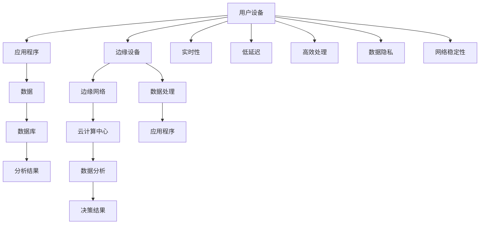

                 

### 文章标题

《边缘计算在智能视频监控中的实时分析》

### 关键词

边缘计算、智能视频监控、实时分析、数据处理、网络安全、隐私保护

### 摘要

本文探讨了边缘计算在智能视频监控中的实时分析应用。通过深入分析边缘计算的基础知识、智能视频监控技术、边缘计算与智能视频监控的融合技术，以及实时分析的关键算法和性能优化策略，本文全面展示了边缘计算在智能视频监控领域的重要性和发展前景。同时，本文还通过实际项目案例，详细讲解了边缘智能视频监控系统的设计与实现过程，并对未来的发展趋势进行了展望。文章旨在为读者提供一个全面、系统的边缘计算与智能视频监控解决方案，为相关领域的研究和应用提供参考。

### 第一部分：边缘计算基础与智能视频监控

#### 第1章：边缘计算概述

#### 1.1 边缘计算的概念与背景

边缘计算（Edge Computing）是指将计算、存储、数据处理和应用程序从中心化的数据中心转移到网络的边缘，即靠近数据源或用户的地方进行。这种计算模式的出现是为了解决中心化云计算在处理大量数据、降低延迟和提高响应速度方面存在的局限性。边缘计算的概念最早可以追溯到20世纪80年代，随着物联网（IoT）和5G技术的快速发展，边缘计算逐渐成为研究热点并迅速发展。

**核心概念与联系**

边缘计算的核心概念包括：

- **边缘设备**：位于网络边缘的设备，如传感器、智能摄像头、智能手机等。
- **边缘网络**：连接边缘设备和云计算中心的数据网络，包括局域网、广域网和5G网络等。
- **云计算中心**：用于存储和处理大规模数据和高性能计算任务的中心化数据中心。

以下是一个简单的边缘计算架构 Mermaid 流程图：

**边缘计算与传统云计算的对比**

传统云计算主要依赖于中心化的数据中心，数据和处理任务在数据中心进行。这种模式在处理大规模数据和高性能计算任务时表现出色，但存在以下几个缺点：

- **延迟较高**：数据需要从边缘设备传输到数据中心进行处理，导致延迟增加。
- **带宽受限**：中心化数据中心与边缘设备之间的网络带宽有限，可能导致数据传输瓶颈。
- **数据隐私和安全**：中心化存储和处理数据可能引发数据泄露和安全问题。

边缘计算通过将数据处理和存储转移到网络边缘，解决了上述问题。其主要优势包括：

- **低延迟**：数据在边缘设备上直接处理，显著降低了延迟，提高了实时性。
- **高效处理**：边缘设备具有高性能计算能力，可以处理大量数据。
- **数据隐私和安全**：数据在本地处理和存储，减少了数据泄露的风险。
- **网络稳定性**：边缘网络更加灵活和可靠，能够适应复杂网络环境。

**边缘计算的关键技术**

边缘计算的关键技术包括：

- **边缘设备**：具有高性能、低功耗和连接能力的设备，如智能摄像头、传感器、路由器等。
- **边缘网络**：高效、可靠和低延迟的通信网络，如5G网络、局域网和广域网等。
- **边缘数据处理**：在边缘设备上进行数据处理和分析，减轻了云计算中心的负担。

**边缘计算的应用领域**

边缘计算在多个领域具有广泛应用：

- **智能交通**：实时处理交通数据，优化交通流量和减少拥堵。
- **工业自动化**：实时监控设备状态，预测设备故障，提高生产效率。
- **智能医疗**：实时分析医疗数据，提供精准的诊断和治疗。
- **智能城市**：实时监测城市环境，提高城市管理和公共服务水平。
- **智能家居**：实时处理家庭设备数据，提供个性化的家庭服务。

#### 1.2 边缘计算与传统云计算的对比

传统云计算和边缘计算在多个方面存在明显的对比，以下是对两者主要差异的详细分析：

**计算位置**

- **传统云计算**：在中心化的数据中心进行数据处理和分析。
- **边缘计算**：在网络的边缘，即靠近数据源或用户的地方进行数据处理和分析。

**延迟**

- **传统云计算**：由于数据需要传输到数据中心进行处理，导致较高的延迟。
- **边缘计算**：在本地进行数据处理，显著降低了延迟。

**带宽**

- **传统云计算**：中心化数据中心与边缘设备之间的带宽有限，可能导致数据传输瓶颈。
- **边缘计算**：边缘网络更加灵活，能够适应复杂网络环境。

**数据隐私和安全**

- **传统云计算**：数据在中心化数据中心存储和处理，可能引发数据泄露和安全问题。
- **边缘计算**：数据在本地处理和存储，减少了数据泄露的风险。

**计算资源**

- **传统云计算**：中心化数据中心具有强大的计算资源，适合处理大规模数据和复杂计算任务。
- **边缘计算**：边缘设备具有有限但高效的计算资源，适合处理本地数据和实时任务。

**系统复杂性**

- **传统云计算**：系统架构相对简单，但管理和维护复杂。
- **边缘计算**：系统架构更加复杂，需要处理分布式数据和协同工作。

**应用场景**

- **传统云计算**：适合大规模数据处理和计算密集型任务。
- **边缘计算**：适合实时处理和低延迟应用，如智能交通、工业自动化和智能医疗。

**案例对比**

- **智能交通**：边缘计算可以在本地处理交通信号灯和摄像头数据，实时优化交通流量。传统云计算可能无法满足实时性要求。
- **工业自动化**：边缘计算可以实时监控设备状态，预测故障，提高生产效率。传统云计算可能无法在本地进行实时分析。

通过对比可以看出，边缘计算和传统云计算各有优势和局限性。在实际应用中，根据具体需求和场景，可以选择合适的技术方案。

#### 1.3 边缘计算的关键技术

边缘计算的成功实施依赖于一系列关键技术的支持。以下是边缘计算中几个重要的关键技术：

**边缘设备**

边缘设备是边缘计算的核心组成部分，具有以下几个特点：

- **高性能**：边缘设备通常配备高性能处理器，能够快速处理数据。
- **低功耗**：边缘设备需要长时间运行，因此通常采用低功耗设计，延长电池寿命。
- **高连接性**：边缘设备需要与网络和其他设备保持高连接性，以便实时传输和处理数据。
- **多样化**：边缘设备包括各种类型的设备，如传感器、智能摄像头、路由器、智能手表等。

**边缘网络**

边缘网络是连接边缘设备和云计算中心的数据网络，具有以下几个特点：

- **低延迟**：边缘网络设计要求低延迟，以满足实时数据处理和分析的需求。
- **高可靠性**：边缘网络需要具备高可靠性，确保数据传输的稳定性和完整性。
- **灵活性**：边缘网络设计需要灵活，能够适应不同的应用场景和设备。
- **安全性**：边缘网络需要具备安全特性，防止数据泄露和恶意攻击。

**边缘数据处理**

边缘数据处理是在边缘设备上进行数据处理和分析的过程，具有以下几个特点：

- **实时性**：边缘数据处理要求在本地进行实时处理，降低数据传输延迟。
- **高效性**：边缘数据处理需要高效，能够快速处理大量数据。
- **多样性**：边缘数据处理支持多种数据类型和复杂计算任务。
- **协作性**：边缘数据处理需要与其他边缘设备和云计算中心协同工作，实现分布式数据处理。

**边缘智能**

边缘智能是指将人工智能算法和模型部署到边缘设备上，实现本地智能分析和决策。边缘智能具有以下几个特点：

- **分布式**：边缘智能将人工智能算法分布在多个边缘设备上，实现分布式计算。
- **实时性**：边缘智能能够在本地实时处理数据，降低延迟。
- **适应性**：边缘智能可以根据本地数据和环境动态调整算法和模型。
- **自主性**：边缘智能能够自主进行数据分析和决策，减少对云计算中心的依赖。

**边缘智能**技术结合了边缘计算和人工智能的优势，为智能视频监控等应用提供了强大的支持。通过边缘智能，可以实现实时目标检测、行为识别和智能响应，提高系统的实时性和自主性。

#### 1.4 边缘计算的应用领域

边缘计算在多个领域展现出了巨大的应用潜力，以下是一些主要的应用领域：

**智能交通**

边缘计算在智能交通中的应用主要集中在交通流量管理和交通违规行为检测。通过在路边和路口部署边缘设备，实时捕获交通数据，如车辆流量、速度和密度，并使用边缘智能算法进行数据分析和决策。例如，交通信号灯可以根据实时交通流量数据自动调整信号周期，优化交通流量，减少拥堵。此外，边缘计算还可以用于检测交通违规行为，如闯红灯、违规停车等，提高交通管理的效率和安全性。

**工业自动化**

边缘计算在工业自动化中发挥着重要作用，特别是在智能制造和工业物联网（IIoT）领域。通过在生产线部署边缘设备，实时监控设备状态和生产数据，边缘计算可以实现设备故障预测、生产优化和能耗管理。例如，边缘设备可以实时监测机器的运行状态，分析传感器数据，预测潜在故障，提前进行维护，减少设备停机时间和维护成本。此外，边缘计算还可以用于生产线的实时监控和自动化控制，提高生产效率和产品质量。

**智能医疗**

边缘计算在智能医疗中的应用包括远程医疗、医疗影像分析和健康监测。通过在诊所、医院和家庭部署边缘设备，实时收集患者的健康数据，如体温、血压、心率等，并使用边缘智能算法进行分析和诊断。例如，远程医疗医生可以使用边缘计算设备实时监控患者的健康状况，提供远程诊疗和咨询服务。此外，边缘计算还可以用于医疗影像分析，如X光片、CT扫描等，通过实时分析和诊断，提高医疗诊断的准确性和效率。

**智能城市**

边缘计算在智能城市中的应用包括城市安全监控、环境监测和公共服务管理。通过在城市的各个角落部署边缘设备，实时监测城市环境数据，如空气质量、水质、交通流量等，并使用边缘智能算法进行分析和决策。例如，城市安全监控系统可以利用边缘设备实时监测公共区域，检测异常行为，并自动触发警报。此外，边缘计算还可以用于环境监测，实时监测空气质量、水质等指标，为城市规划和环境保护提供科学依据。

**智能家居**

边缘计算在智能家居中的应用包括智能安防、智能照明和智能家电控制。通过在家庭内部署边缘设备，实时监测家庭环境数据，如门窗状态、温度、湿度等，并使用边缘智能算法进行分析和决策。例如，智能安防系统可以利用边缘设备实时监测家庭安全，检测非法入侵并及时发出警报。此外，边缘计算还可以用于智能照明和家电控制，根据家庭成员的活动和需求自动调整照明和家电状态，提高家庭生活的便利性和舒适度。

总之，边缘计算在智能交通、工业自动化、智能医疗、智能城市和智能家居等多个领域具有广泛的应用前景。通过将数据处理和分析能力从中心化的云计算中心转移到网络的边缘，边缘计算能够提供实时、高效和可靠的数据处理服务，为各个领域的智能应用提供强大的支持。

#### 第2章：智能视频监控技术基础

#### 2.1 智能视频监控的发展历程

智能视频监控技术起源于20世纪70年代的模拟监控时代。早期的视频监控系统主要依赖于模拟摄像机和视频录像机，视频数据以模拟信号形式传输和存储。随着计算机技术和网络技术的发展，数字视频监控技术逐渐取代了模拟监控，成为视频监控系统的主要形式。

**模拟监控时代（1970s-1990s）**：在这个阶段，模拟摄像机捕捉视频信号，通过同轴电缆或视频线缆传输到监控中心，视频数据以模拟信号形式存储。这一时期的监控系统功能相对简单，主要依赖人工观察和记录，缺乏自动化和智能分析能力。

**数字监控时代（1990s-2000s）**：随着数字视频技术的发展，数字摄像机逐渐取代了模拟摄像机，视频数据以数字信号形式传输和存储。数字视频监控系统引入了视频压缩技术，如MPEG和H.264，提高了视频数据传输效率和存储容量。同时，数字监控系统的视频数据可以通过网络传输，实现了远程监控和远程控制。

**智能监控时代（2000s至今）**：随着计算机视觉技术和人工智能技术的发展，智能视频监控系统逐渐兴起。智能视频监控系统引入了计算机视觉算法，如目标检测、人脸识别和行为分析，能够实现视频数据的自动化分析和智能决策。智能监控系统的出现，使得视频监控系统从传统的被动监控向主动监控转变，大大提高了监控效率和安全性。

**主要里程碑事件**：

- **1991年**：H.264视频压缩标准发布，大大提高了视频数据传输效率和存储容量。
- **2000年**：计算机视觉算法，如SVM和CNN，开始应用于视频监控领域。
- **2005年**：智能视频监控系统逐渐普及，视频监控技术从传统监控向智能监控转型。
- **2010年**：深度学习算法在视频监控中的应用取得突破，显著提高了视频分析的准确性和实时性。
- **2015年**：随着物联网和5G技术的发展，边缘计算在视频监控中的应用逐渐成熟，实现了低延迟和高效率的数据处理。

**发展趋势**：

- **高清视频**：随着视频监控技术的不断发展，高清视频监控逐渐成为主流，分辨率和帧率不断提高，为视频分析提供了更丰富的信息。
- **深度学习**：深度学习算法在视频监控中的应用越来越广泛，通过卷积神经网络（CNN）和循环神经网络（RNN）等模型，实现了目标检测、人脸识别和行为分析等任务。
- **边缘计算**：边缘计算在视频监控中的应用，使得视频处理和分析能够实时在边缘设备上进行，提高了系统的实时性和响应速度。
- **大数据与云计算**：大数据技术和云计算平台为视频监控数据的存储、管理和分析提供了强大的支持，实现了大规模视频数据的处理和分析。

#### 2.2 智能视频监控的关键技术

智能视频监控系统的发展离不开一系列关键技术的支持。以下是智能视频监控领域的关键技术：

**图像识别与目标检测**

图像识别与目标检测是智能视频监控的核心技术之一。通过计算机视觉算法，智能视频监控系统可以从视频流中识别和定位感兴趣的目标。常见的目标检测算法包括：

- **传统的目标检测算法**：如SVM、Adaboost等，这些算法通过手工设计特征进行目标检测，虽然准确度较高，但训练过程复杂，对数据量要求较高。
- **深度学习目标检测算法**：如YOLO、SSD、Faster R-CNN等，这些算法通过卷积神经网络（CNN）自动提取图像特征，实现了高效的目标检测。其中，YOLO（You Only Look Once）是一种端到端的目标检测算法，能够在一次前向传播中同时预测边界框和类别概率，实现了实时目标检测。

**人脸识别**

人脸识别是智能视频监控中广泛应用的另一个关键技术。通过识别人脸特征，智能视频监控系统可以实现对特定人群的追踪和识别。常见的人脸识别算法包括：

- **特征点定位**：如Haar-like特征、LBP特征等，通过定位人脸关键点实现人脸识别。
- **深度学习人脸识别**：如FaceNet、VGGFace等，通过深度学习模型自动提取人脸特征，实现了高准确度的人脸识别。

**行为识别**

行为识别是指通过分析视频流中的人体行为，识别出特定的行为模式。行为识别在安全监控、公共安全和智能家居等领域具有重要意义。常见的行为识别算法包括：

- **隐马尔可夫模型（HMM）**：通过状态转移概率和观测概率实现行为识别。
- **支持向量机（SVM）**：通过训练分类器实现行为识别。
- **深度学习行为识别**：如基于CNN的行为识别模型，通过卷积神经网络自动提取行为特征，实现了高效的行为识别。

**视频跟踪**

视频跟踪是指在视频流中跟踪特定目标的运动轨迹。视频跟踪技术可以用于多人追踪、目标追踪等应用场景。常见视频跟踪算法包括：

- **光流法**：通过计算图像帧之间的像素运动实现目标跟踪。
- **深度学习跟踪算法**：如基于CNN的跟踪算法，通过训练模型实现目标的连续跟踪。

**视频分析**

视频分析是指通过对视频流进行分析和处理，提取有用的信息。视频分析技术可以用于交通监控、安全监控、智能安防等应用场景。常见的视频分析技术包括：

- **图像分割**：通过图像分割技术，将视频流中的物体从背景中分离出来，便于后续处理。
- **目标计数**：通过视频分析技术，实现对视频中目标数量的统计和分析。
- **事件检测**：通过分析视频流中的变化，检测特定的事件，如行人进入/离开区域、车辆违章等。

**智能监控平台**

智能监控平台是智能视频监控系统的核心组成部分，用于集成和管理各个监控模块，实现统一监控和智能决策。常见的智能监控平台包括：

- **视频管理平台**：用于视频数据的存储、管理和检索，支持远程监控和实时回放。
- **智能分析平台**：用于集成各种智能分析算法，实现实时视频分析和决策。
- **报警管理平台**：用于接收和处理报警事件，实现实时报警和联动处理。

#### 2.3 智能视频监控的系统架构

智能视频监控系统通常由多个模块组成，实现视频数据的采集、传输、处理、存储和显示等功能。以下是智能视频监控系统的常见架构：

**前端采集模块**：前端采集模块负责实时捕获视频数据，通常由摄像头、麦克风、传感器等设备组成。前端采集模块将视频数据传输到边缘设备或中心服务器进行进一步处理。

**边缘处理模块**：边缘处理模块位于网络边缘，用于实时处理前端采集的视频数据。边缘处理模块可以执行图像识别、目标检测、人脸识别、行为识别等智能分析任务，并将分析结果传输到中心服务器。

**中心处理模块**：中心处理模块位于云计算中心，用于接收和处理边缘设备传输的数据。中心处理模块可以进行更复杂的数据分析和处理任务，如大数据分析、人工智能算法训练等。

**存储模块**：存储模块负责存储视频数据和分析结果，通常使用分布式存储系统，如Hadoop或Cassandra，实现海量数据的存储和管理。

**显示模块**：显示模块用于实时显示视频数据和监控信息，通常包括监控屏幕、监控终端、Web浏览器等。

**网络通信模块**：网络通信模块负责视频数据的传输和网络通信，通常使用TCP/IP协议，实现前端采集模块、边缘处理模块和中心处理模块之间的数据传输。

**安全模块**：安全模块用于保护视频监控系统的安全性，包括数据加密、访问控制、防火墙等安全措施。

**智能分析模块**：智能分析模块用于集成各种智能分析算法，实现实时视频分析和决策。智能分析模块可以基于深度学习、机器学习等技术，实现目标检测、人脸识别、行为识别等功能。

#### 2.4 智能视频监控的应用场景

智能视频监控技术在各个领域都有广泛的应用，以下是一些常见应用场景：

**公共安全监控**

公共安全监控是智能视频监控的重要应用场景之一。通过在公共场所、交通枢纽、机场、火车站等地部署摄像头，实时监控人员活动，智能视频监控系统可以识别可疑行为、预防犯罪事件。例如，智能视频监控系统可以检测到异常行为，如携带爆炸物、打架斗殴等，并及时报警，提醒安保人员进行干预。

**交通监控**

交通监控是智能视频监控在智能交通领域的应用。通过在交通路口、道路、高速公路等地部署摄像头，实时监控交通状况，智能视频监控系统可以识别交通拥堵、违规停车、闯红灯等行为，并自动报警。此外，智能视频监控系统还可以用于交通流量分析和优化，如根据实时交通流量数据调整交通信号灯周期，减少交通拥堵。

**工业自动化**

工业自动化是智能视频监控在工业领域的应用。通过在生产线、仓库等地方部署摄像头，实时监控设备运行状态和产品质量，智能视频监控系统可以检测设备故障、产品质量问题，并自动报警。例如，智能视频监控系统可以检测到产品表面的划痕、气泡等缺陷，并自动将问题产品分类，提高生产效率和质量。

**智能零售**

智能零售是智能视频监控在商业领域的应用。通过在商场、超市等地部署摄像头，实时监控顾客行为和购物习惯，智能视频监控系统可以分析顾客流量、购物车内容等数据，为商家提供营销策略建议。例如，智能视频监控系统可以检测到顾客在货架前的停留时间，分析顾客的兴趣和需求，帮助商家调整商品陈列和促销策略。

**智能家居**

智能家居是智能视频监控在家庭领域的应用。通过在家庭内部署摄像头，实时监控家庭安全和成员活动，智能视频监控系统可以提供家庭安全防护、远程监控等功能。例如，智能视频监控系统可以检测到非法入侵、宠物活动等，并及时报警，提醒家庭成员采取行动。

**医疗监控**

医疗监控是智能视频监控在医疗领域的应用。通过在病房、手术室等地部署摄像头，实时监控病人和医护人员的行为，智能视频监控系统可以提高医疗安全和服务质量。例如，智能视频监控系统可以检测到病人异常行为，如跌倒、昏迷等，并及时报警，提醒医护人员进行紧急处理。

总之，智能视频监控技术在各个领域都有广泛的应用，通过实时监控、智能分析和自动报警等功能，提高了监控效率和安全性，为各个领域的发展提供了有力的支持。

### 第二部分：边缘计算在智能视频监控中的应用

#### 第3章：边缘计算在智能视频监控中的优势

边缘计算在智能视频监控中的应用带来了诸多优势，这些优势主要体现在实时性、数据隐私、低延迟、高效处理和能耗优化等方面。以下是详细的分析和解释：

#### 3.1 实时性要求与边缘计算

实时性是智能视频监控中的一个关键要求。在许多应用场景中，如交通监控、公共安全和工业自动化，需要快速响应和处理视频数据，以确保系统的及时性和有效性。传统的中心化云计算模型由于数据传输延迟和计算资源有限，往往难以满足这些实时性要求

