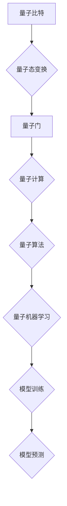
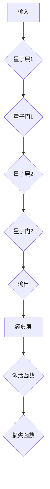
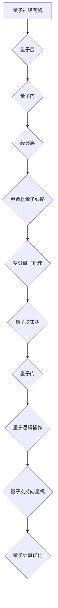
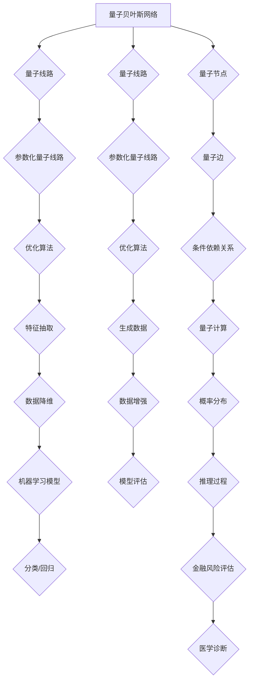
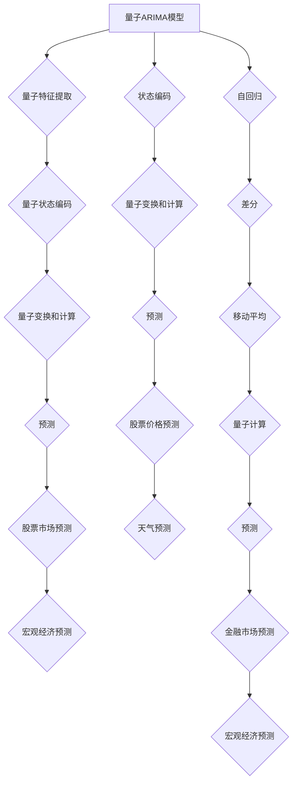
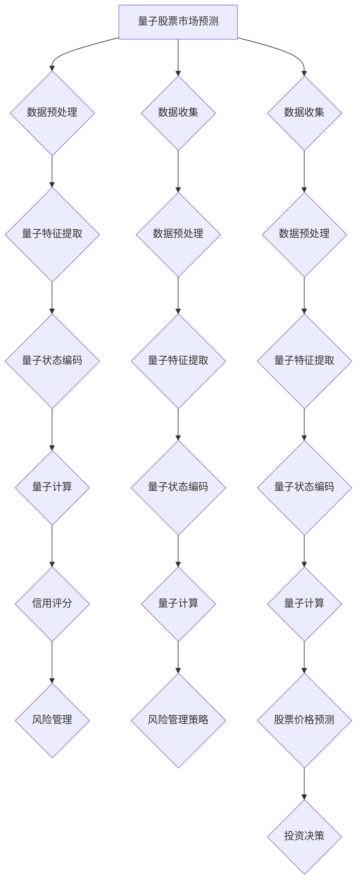
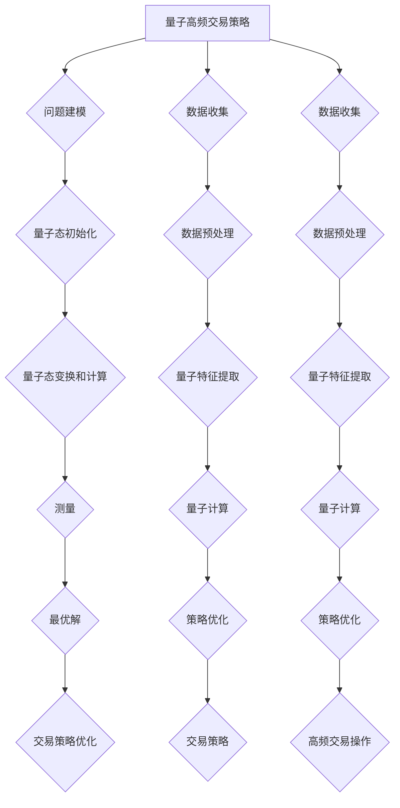
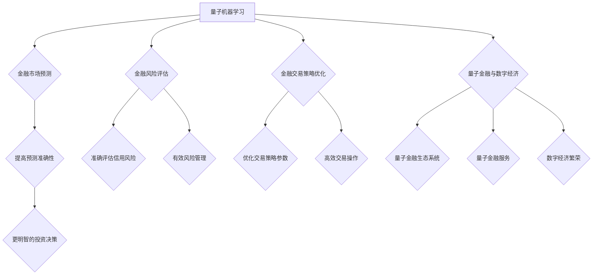
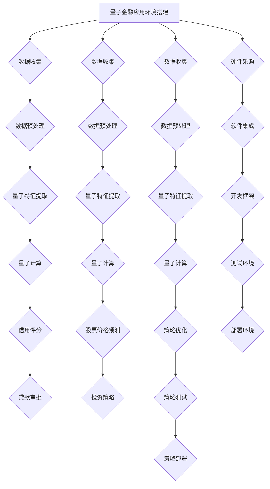

                 

### 第1章：量子机器学习概述

#### 1.1 量子计算与量子信息学基础

##### 1.1.1 量子比特与量子态

量子计算与量子信息学是量子机器学习的基础。量子比特（qubit）是量子计算的基本单元，它可以用0和1的叠加态表示。一个量子比特可以同时处于0和1的状态，这种叠加态是量子计算的核心特性。量子态可以用一个复数线性组合来表示，例如：
\[|\psi\rangle = a|0\rangle + b|1\rangle\]
其中，\(a\) 和 \(b\) 是复数，且满足 \(|a|^2 + |b|^2 = 1\)。

##### 1.1.2 量子门与量子运算

量子门是量子计算中的基本操作单元，类似于经典计算机中的逻辑门。量子门作用于量子比特，实现量子态的变换。常见的量子门包括Hadamard门、Pauli门和控制门。例如，Hadamard门是一个将量子比特从基态变换到叠加态的量子门，其作用可以表示为：
\[H|0\rangle = \frac{1}{\sqrt{2}}(|0\rangle + |1\rangle)\]
\[H|1\rangle = \frac{1}{\sqrt{2}}(|0\rangle - |1\rangle)\]

量子运算是通过量子门和量子逻辑操作实现的。量子逻辑操作类似于经典计算机中的逻辑运算，例如AND、OR、NOT等。量子运算可以通过一系列量子门的组合来实现，从而对量子态进行复杂的变换。

##### 1.1.3 量子算法的基本原理

量子算法是利用量子计算机进行计算的方法，具有与经典算法不同的原理。量子算法的核心特性包括量子并行性、量子纠缠和量子叠加原理。

- **量子并行性**：量子计算机可以利用量子态的叠加和纠缠实现并行计算。例如，一个包含 \(n\) 个量子比特的量子态可以同时表示 \(2^n\) 个经典状态。这大大提高了量子计算机的计算速度。

- **量子纠缠**：量子纠缠是量子比特之间的一种特殊关联，它可以使得量子比特之间的信息传递速度远远超过经典通信。例如，两个量子比特可以处于一个纠缠态，其中一个量子比特的状态变化会立即影响到另一个量子比特的状态。

- **量子叠加原理**：量子态可以处于多个状态的叠加，而不是单一状态。这意味着量子计算机可以在计算过程中同时处理多个可能的计算路径，从而大大提高计算效率。

#### 1.2 量子算法简介

量子算法是量子计算机在特定问题上的应用，可以显著提高某些问题的计算速度。以下介绍几种重要的量子算法。

##### 1.2.1 Shor算法

Shor算法是一种用于求解大整数质因数分解的量子算法。它的核心思想是将大整数分解问题转化为模乘问题，然后利用量子并行性和量子纠缠特性快速求解。Shor算法的时间复杂度为 \(O(N^3/\log N)\)，远低于经典算法。

##### 1.2.2 Grover算法

Grover算法是一种用于搜索未排序数据库的量子算法。它利用量子并行性和量子叠加原理，能够在 \(O(\sqrt{N})\) 的时间内完成搜索，比经典算法快得多。

#### 1.3 量子机器学习的基本原理

量子机器学习是量子计算在机器学习领域的应用。它利用量子计算机的优势，如量子并行性、量子纠缠和量子叠加原理，来提高机器学习模型的性能。以下介绍几种量子机器学习模型。

##### 1.3.1 量子神经网络

量子神经网络（Quantum Neural Network, QNN）是量子计算机与神经网络相结合的模型。它通过量子门和量子态的变换来实现神经网络的计算。量子神经网络中的量子层负责进行量子态的变换和运算，而经典层则负责对量子运算的结果进行后处理。

##### 1.3.2 变分量子推理

变分量子推理（Variational Quantum Reasoning, VQR）是一种利用量子计算进行推理的方法。它通过调整量子态来最大化期望值，从而实现推理过程。变分量子推理可以应用于分类和回归等问题。

##### 1.3.3 量子决策树与量子支持向量机

量子决策树（Quantum Decision Tree, QDT）和量子支持向量机（Quantum Support Vector Machine, QSVM）是量子计算机在决策树和支持向量机领域的应用。量子决策树通过量子门和量子逻辑操作实现决策树的分类过程，而量子支持向量机通过量子计算优化支持向量机的参数。

### 总结

量子机器学习是量子计算与机器学习的交叉领域，具有巨大的应用潜力。通过量子计算机的优势，如量子并行性、量子纠缠和量子叠加原理，量子机器学习可以提高机器学习模型的性能。在接下来的章节中，我们将进一步探讨量子机器学习模型与算法的详细原理和应用。

#### Mermaid 流程图：



### 第2章：量子机器学习模型与架构

#### 2.1 量子神经网络

量子神经网络（Quantum Neural Network, QNN）是量子计算机与神经网络相结合的模型。它通过量子门和量子态的变换来实现神经网络的计算。量子神经网络中的量子层负责进行量子态的变换和运算，而经典层则负责对量子运算的结果进行后处理。

##### 2.1.1 量子神经网络的基本结构

量子神经网络由多个量子层和经典层组成。量子层用于实现量子计算，经典层用于对量子运算的结果进行后处理。量子层通常由量子门和量子逻辑操作组成，而经典层则由神经网络的基本单元，如神经元和权重，组成。

下面是一个简单的量子神经网络结构示意图：



在量子神经网络中，量子层通过量子门和量子逻辑操作实现量子态的变换和运算。这些操作包括量子加法、量子乘法、量子叠加和量子纠缠等。经典层则对量子运算的结果进行后处理，如权重调整、激活函数和损失函数等。

##### 2.1.2 量子神经网络的优化方法

量子神经网络的优化方法主要包括参数化量子线路和变分量子优化。

- **参数化量子线路**：参数化量子线路是一种用于实现量子神经网络的方法，它通过调整量子线路中的参数来优化网络性能。参数化量子线路通常由一组量子门和参数组成，这些参数可以调整以优化网络的训练结果。

- **变分量子优化**：变分量子优化是一种基于量子计算的优化算法，可以用于优化量子神经网络的参数。变分量子优化通过调整量子态的期望值来优化网络性能，从而提高模型的预测准确性。

#### 2.2 变分量子推理

变分量子推理（Variational Quantum Reasoning, VQR）是一种利用量子计算进行推理的方法。它通过调整量子态来最大化期望值，从而实现推理过程。变分量子推理可以应用于分类和回归等问题。

##### 2.2.1 变分量子推理的基本原理

变分量子推理的基本原理是基于变分量子特征抽取（Variational Quantum Feature Extraction, VQFE）和变分量子生成模型（Variational Quantum Generative Model, VQGM）。

- **变分量子特征抽取**：变分量子特征抽取是一种利用量子计算进行特征抽取的方法，它通过调整量子线路的参数来提取数据中的高维特征。变分量子特征抽取可以用于数据降维和特征选择。

- **变分量子生成模型**：变分量子生成模型是一种利用量子计算进行生成模型的方法，它通过调整量子线路的参数来生成与训练数据分布相似的数据。变分量子生成模型可以用于数据增强和模型评估。

变分量子推理通过以下步骤实现：

1. 初始化参数化的量子线路，包括量子门和参数。
2. 训练参数化的量子线路，通过调整参数来最大化期望值。
3. 使用训练好的量子线路进行推理，计算目标变量的期望值。

##### 2.2.2 变分量子推理的应用

变分量子推理可以应用于各种机器学习问题，如分类、回归、聚类等。以下是一个简单的变分量子推理示例：

假设我们有一个分类问题，需要预测数据集中的每个样本属于哪个类别。使用变分量子推理，我们可以通过以下步骤进行分类：

1. 初始化参数化的量子线路，包括量子门和参数。
2. 使用训练数据集训练量子线路，调整参数以最大化分类概率。
3. 对于测试集中的每个样本，使用训练好的量子线路进行推理，计算每个类别的概率。
4. 根据最大概率选择预测类别。

#### 2.3 量子决策树与量子支持向量机

量子决策树（Quantum Decision Tree, QDT）和量子支持向量机（Quantum Support Vector Machine, QSVM）是量子计算机在决策树和支持向量机领域的应用。

##### 2.3.1 量子决策树

量子决策树是一种将量子计算与决策树相结合的方法。它通过量子门和量子逻辑操作实现决策树的分类过程。量子决策树可以处理高维数据，并且在某些情况下比传统决策树性能更优。

量子决策树的基本原理如下：

1. 初始化量子线路，用于处理输入数据。
2. 对于每个特征，使用量子门进行特征提取。
3. 使用量子逻辑操作进行特征比较和决策。
4. 根据决策结果，将数据划分为不同的类别。

##### 2.3.2 量子支持向量机

量子支持向量机是一种利用量子计算优化支持向量机的方法。它通过量子计算优化支持向量机的参数，从而提高模型的分类和回归性能。量子支持向量机可以用于高维空间中的分类和回归问题。

量子支持向量机的基本原理如下：

1. 初始化量子线路，用于处理输入数据。
2. 使用量子计算优化支持向量机的参数，如权重和偏置。
3. 训练支持向量机模型，通过调整量子线路的参数来最小化目标函数。
4. 使用训练好的量子支持向量机进行预测。

### 总结

量子神经网络、变分量子推理、量子决策树和量子支持向量机是量子机器学习的重要模型和架构。通过量子计算机的优势，这些模型和架构可以提高机器学习模型的性能。在接下来的章节中，我们将进一步探讨量子机器学习的核心算法原理和应用。

#### Mermaid 流程图：



### 第3章：量子机器学习核心算法

#### 3.1 变分量子特征抽取

变分量子特征抽取（Variational Quantum Feature Extraction, VQFE）是一种利用量子计算进行特征抽取的方法。它通过调整量子线路的参数来提取数据中的高维特征。变分量子特征抽取可以用于数据降维和特征选择，从而提高机器学习模型的性能。

##### 3.1.1 变分量子特征抽取的基本原理

变分量子特征抽取的基本原理是基于变分量子线路和优化算法。变分量子线路是一种参数化的量子线路，它由一组量子门和参数组成。通过调整这些参数，可以实现对数据的不同变换和特征抽取。

变分量子特征抽取的主要步骤如下：

1. 初始化变分量子线路，包括量子门和参数。
2. 使用训练数据集对变分量子线路进行训练，调整参数以最大化特征抽取的效果。
3. 对于每个输入数据样本，通过变分量子线路进行量子计算，提取高维特征。
4. 使用提取的高维特征作为输入，训练传统的机器学习模型。

##### 3.1.2 变分量子特征抽取的应用

变分量子特征抽取可以应用于各种机器学习任务，如分类、回归和聚类等。以下是一个简单的应用示例：

假设我们有一个分类问题，需要从高维数据中提取特征。使用变分量子特征抽取，我们可以通过以下步骤进行特征抽取：

1. 初始化变分量子线路，包括量子门和参数。
2. 使用训练数据集对变分量子线路进行训练，调整参数以最大化特征抽取的效果。
3. 对于每个训练样本，通过变分量子线路进行量子计算，提取高维特征。
4. 将提取的高维特征与训练样本的标签一起输入到传统分类器中，如支持向量机或神经网络。
5. 训练分类器，并使用测试数据集进行评估。

通过这种方式，变分量子特征抽取可以提高分类器的性能，使其能够更好地处理高维数据。

##### 3.1.3 变分量子特征抽取的优缺点

变分量子特征抽取的优点包括：

- **高维特征抽取**：变分量子特征抽取能够提取出数据中的高维特征，从而提高模型的性能。
- **数据降维**：通过变分量子特征抽取，可以减少数据维度，提高训练和评估速度。
- **可扩展性**：变分量子特征抽取可以应用于各种机器学习任务，具有较好的可扩展性。

变分量子特征抽取的缺点包括：

- **计算复杂度**：变分量子特征抽取需要大量的量子计算资源，计算复杂度较高。
- **参数调整**：变分量子特征抽取的参数调整过程较为复杂，需要优化算法的支持。

#### 3.2 变分量子生成模型

变分量子生成模型（Variational Quantum Generative Model, VQGM）是一种利用量子计算进行生成模型的方法。它通过调整量子线路的参数来生成与训练数据分布相似的数据。变分量子生成模型可以用于数据增强、模型评估和生成对抗网络等任务。

##### 3.2.1 变分量子生成模型的基本原理

变分量子生成模型的基本原理是基于变分量子线路和优化算法。变分量子线路是一种参数化的量子线路，它由一组量子门和参数组成。通过调整这些参数，可以实现对数据的生成和变换。

变分量子生成模型的主要步骤如下：

1. 初始化变分量子线路，包括量子门和参数。
2. 使用生成对抗网络（GAN）框架对变分量子线路进行训练，调整参数以最大化生成数据与真实数据的相似度。
3. 对于每个输入数据样本，通过变分量子线路进行量子计算，生成相似的数据。
4. 使用生成数据对传统生成模型进行训练和评估。

##### 3.2.2 变分量子生成模型的应用

变分量子生成模型可以应用于各种生成任务，如图像生成、音频生成和文本生成等。以下是一个简单的应用示例：

假设我们有一个图像生成任务，需要生成与训练图像分布相似的新图像。使用变分量子生成模型，我们可以通过以下步骤进行图像生成：

1. 初始化变分量子线路，包括量子门和参数。
2. 使用生成对抗网络（GAN）框架对变分量子线路进行训练，调整参数以最大化生成图像与真实图像的相似度。
3. 对于每个输入噪声向量，通过变分量子线路进行量子计算，生成新的图像。
4. 评估生成图像的质量，如视觉效果和统计特性。

通过这种方式，变分量子生成模型可以生成高质量的图像，提高生成模型的性能。

##### 3.2.3 变分量子生成模型的优缺点

变分量子生成模型的优点包括：

- **生成质量**：变分量子生成模型能够生成高质量的生成数据，具有较好的视觉效果和统计特性。
- **并行性**：变分量子生成模型可以利用量子计算的并行性，提高生成速度。

变分量子生成模型的缺点包括：

- **计算复杂度**：变分量子生成模型需要大量的量子计算资源，计算复杂度较高。
- **训练过程**：变分量子生成模型的训练过程较为复杂，需要优化算法的支持。

#### 3.3 量子贝叶斯网络

量子贝叶斯网络（Quantum Bayesian Network, QBN）是一种将量子计算与贝叶斯网络相结合的方法，用于推理和处理不确定数据。量子贝叶斯网络通过量子计算优化贝叶斯网络的推理过程，从而提高推理速度和准确性。

##### 3.3.1 量子贝叶斯网络的基本原理

量子贝叶斯网络是一种基于量子计算的推理模型，它利用量子态的叠加和纠缠特性进行推理。量子贝叶斯网络由一组量子节点和量子边组成，每个量子节点表示一个变量，量子边表示变量之间的条件依赖关系。

量子贝叶斯网络的主要步骤如下：

1. 初始化量子节点和量子边，表示数据的变量和条件依赖关系。
2. 使用量子计算优化贝叶斯网络的推理过程，计算每个量子节点的概率分布。
3. 通过量子态的叠加和纠缠，计算目标变量的概率分布。
4. 使用量子计算结果进行推理和决策。

##### 3.3.2 量子贝叶斯网络的应用

量子贝叶斯网络可以应用于各种推理任务，如概率推理、金融风险评估和医学诊断等。以下是一个简单的应用示例：

假设我们有一个金融风险评估问题，需要计算一个客户的信用风险。使用量子贝叶斯网络，我们可以通过以下步骤进行风险评估：

1. 初始化量子节点和量子边，表示客户的信用评分和相关的条件变量，如收入、负债等。
2. 使用量子计算优化贝叶斯网络的推理过程，计算客户的信用风险概率分布。
3. 根据信用风险概率分布，对客户进行信用评分。
4. 评估信用评分的准确性，并进行优化。

通过这种方式，量子贝叶斯网络可以提高金融风险评估的准确性，从而降低金融风险。

##### 3.3.3 量子贝叶斯网络的优缺点

量子贝叶斯网络的优点包括：

- **推理速度**：量子贝叶斯网络可以利用量子计算的并行性，提高推理速度。
- **准确性**：量子贝叶斯网络通过量子计算优化推理过程，可以提高推理准确性。

量子贝叶斯网络的缺点包括：

- **计算复杂度**：量子贝叶斯网络的计算复杂度较高，需要大量的量子计算资源。
- **参数调整**：量子贝叶斯网络的参数调整过程较为复杂，需要优化算法的支持。

### 总结

量子机器学习核心算法包括变分量子特征抽取、变分量子生成模型和量子贝叶斯网络。这些算法利用量子计算的优势，如量子并行性、量子纠缠和量子叠加原理，可以提高机器学习模型的性能。在接下来的章节中，我们将进一步探讨量子机器学习在金融建模中的应用。

#### Mermaid 流程图：



### 第4章：金融时间序列分析

金融时间序列分析是金融建模中的关键任务，旨在通过历史数据对未来市场走势进行预测。量子机器学习在金融时间序列分析中具有潜在优势，能够处理大规模复杂的数据，并利用量子并行性和量子算法的特性来提高预测准确性。

#### 4.1 量子时间序列模型

量子时间序列模型是利用量子计算对时间序列数据进行分析和预测的方法。这些模型利用量子比特的叠加态和纠缠态来表示时间序列中的复杂关系。

##### 4.1.1 量子时间序列模型的基本原理

量子时间序列模型基于量子计算的基本原理，如量子叠加和量子纠缠。传统时间序列模型通常使用线性关系来描述数据变化，而量子时间序列模型则可以处理非线性关系，提供更准确的预测。

量子时间序列模型通常包括以下步骤：

1. **量子特征提取**：通过量子计算提取时间序列数据中的高维特征。
2. **量子状态编码**：将时间序列数据编码为量子态，利用量子叠加态来表示不同历史时刻的状态。
3. **量子态变换**：使用量子门和量子逻辑操作对量子态进行变换，以捕捉时间序列数据中的潜在关系。
4. **量子计算**：通过量子态的叠加和纠缠进行计算，预测未来的数据点。

##### 4.1.2 量子时间序列模型的应用

量子时间序列模型可以应用于股票市场预测、宏观经济预测和金融市场风险评估等领域。以下是一个简单的应用示例：

**股票市场预测**：假设我们有一个股票市场的历史数据集，包括价格、交易量等。使用量子时间序列模型，我们可以通过以下步骤进行预测：

1. **数据预处理**：对历史数据进行清洗和预处理，提取关键特征。
2. **量子特征提取**：使用量子计算提取时间序列数据中的高维特征。
3. **量子状态编码**：将提取的特征编码为量子态。
4. **量子态变换和计算**：使用量子门和量子逻辑操作对量子态进行变换，预测未来的价格。
5. **结果分析**：评估预测结果的准确性，并进行优化。

通过这种方式，量子时间序列模型可以提高股票市场预测的准确性，为投资者提供更有价值的信息。

#### 4.2 量子自回归模型

量子自回归模型（Quantum Autoregressive Model, QARM）是量子机器学习在时间序列分析中的一种重要模型。它利用量子计算的自回归特性来预测未来时间点的数据。

##### 4.2.1 量子自回归模型的基本原理

量子自回归模型基于量子计算的自回归算法，通过量子态的叠加和纠缠来预测未来时间点的数据。量子自回归模型的基本原理如下：

1. **状态编码**：将历史时间点的数据编码为量子态。
2. **量子变换**：使用量子门和量子逻辑操作对量子态进行变换，以捕捉时间序列中的依赖关系。
3. **量子计算**：通过量子态的叠加和纠缠进行计算，预测未来时间点的数据。
4. **结果输出**：将量子计算的结果解码为具体的数据点。

##### 4.2.2 量子自回归模型的应用

量子自回归模型可以应用于股票价格预测、天气预测和金融风险预测等领域。以下是一个简单的应用示例：

**股票价格预测**：假设我们有一个股票市场的历史数据集，包括价格和交易量。使用量子自回归模型，我们可以通过以下步骤进行预测：

1. **数据预处理**：对历史数据进行清洗和预处理，提取关键特征。
2. **状态编码**：将历史数据编码为量子态。
3. **量子变换和计算**：使用量子门和量子逻辑操作对量子态进行变换，预测未来的价格。
4. **结果分析**：评估预测结果的准确性，并进行优化。

通过这种方式，量子自回归模型可以提高股票价格预测的准确性，帮助投资者做出更明智的决策。

#### 4.3 量子ARIMA模型

量子ARIMA模型（Quantum Autoregressive Integrated Moving Average, QARIMA）是量子机器学习在时间序列分析中的一种扩展模型。它结合了自回归（AR）、差分（I）和移动平均（MA）的特性，利用量子计算进行时间序列预测。

##### 4.3.1 量子ARIMA模型的基本原理

量子ARIMA模型的基本原理如下：

1. **自回归**：使用历史时间点的数据来预测当前时间点的数据。
2. **差分**：对时间序列数据进行差分处理，以消除趋势和季节性。
3. **移动平均**：使用历史数据的移动平均来预测当前时间点的数据。
4. **量子计算**：通过量子计算对自回归、差分和移动平均过程进行优化和计算。

量子ARIMA模型通过量子态的叠加和纠缠来实现自回归和移动平均过程，利用量子计算的优势来提高模型的预测性能。

##### 4.3.2 量子ARIMA模型的应用

量子ARIMA模型可以应用于各种时间序列预测任务，如股票价格预测、金融市场预测和宏观经济预测。以下是一个简单的应用示例：

**股票价格预测**：假设我们有一个股票市场的历史数据集，包括价格、交易量和时间。使用量子ARIMA模型，我们可以通过以下步骤进行预测：

1. **数据预处理**：对历史数据进行清洗和预处理，提取关键特征。
2. **状态编码**：将历史数据编码为量子态。
3. **量子变换和计算**：使用量子门和量子逻辑操作对量子态进行变换，预测未来的价格。
4. **结果分析**：评估预测结果的准确性，并进行优化。

通过这种方式，量子ARIMA模型可以提高股票价格预测的准确性，为投资者提供更可靠的市场预测。

### 总结

量子时间序列模型、量子自回归模型和量子ARIMA模型是量子机器学习在金融时间序列分析中的重要应用。这些模型利用量子计算的优势，如量子并行性和量子纠缠，能够提高预测准确性，为金融决策提供有力的支持。在接下来的章节中，我们将进一步探讨量子机器学习在金融风险评估和预测中的应用。

#### Mermaid 流程图：



### 第5章：金融风险评估与预测

#### 5.1 量子信用评分模型

量子信用评分模型是一种利用量子计算对客户信用风险进行评估的方法。它通过分析客户的历史数据和行为模式，预测客户未来违约的可能性。

##### 5.1.1 量子信用评分模型的基本原理

量子信用评分模型基于量子计算的自回归和贝叶斯网络原理。它通过以下步骤实现：

1. **数据预处理**：对客户的历史数据（如信用记录、交易历史、财务状况等）进行清洗和预处理，提取关键特征。
2. **量子特征提取**：使用量子计算提取数据中的高维特征，以便更好地表示客户的风险。
3. **量子状态编码**：将提取的特征编码为量子态，利用量子叠加态来表示不同风险因素的重要性。
4. **量子计算**：通过量子计算分析量子态，预测客户违约的概率。
5. **结果输出**：将量子计算结果解码为具体的信用评分，用于风险管理决策。

##### 5.1.2 量子信用评分模型的应用

量子信用评分模型可以应用于金融机构的风险管理、贷款审批和信用评级等领域。以下是一个简单的应用示例：

**贷款审批**：假设某金融机构需要对客户的信用风险进行评估，以决定是否批准其贷款申请。使用量子信用评分模型，我们可以通过以下步骤进行贷款审批：

1. **数据收集**：收集客户的历史数据，包括信用记录、交易历史、财务状况等。
2. **数据预处理**：对数据进行清洗和预处理，提取关键特征。
3. **量子特征提取**：使用量子计算提取数据中的高维特征。
4. **量子状态编码**：将提取的特征编码为量子态。
5. **量子计算**：通过量子计算分析量子态，预测客户违约的概率。
6. **信用评分**：根据量子计算结果，将客户划分为不同的信用等级。
7. **贷款审批**：根据信用评分，决定是否批准贷款申请。

通过这种方式，量子信用评分模型可以提高贷款审批的准确性和效率，降低金融机构的信用风险。

##### 5.1.3 量子信用评分模型的优缺点

量子信用评分模型的优点包括：

- **高维特征提取**：量子计算能够提取出数据中的高维特征，提供更准确的信用评分。
- **并行计算**：量子计算可以利用并行性，提高计算速度和效率。

量子信用评分模型的缺点包括：

- **计算复杂度**：量子信用评分模型需要大量的量子计算资源，计算复杂度较高。
- **参数调整**：量子信用评分模型的参数调整过程较为复杂，需要优化算法的支持。

#### 5.2 量子金融风险管理

量子金融风险管理是一种利用量子计算对金融市场风险进行评估和管理的方法。它通过分析市场数据和经济指标，预测金融市场的波动和风险，从而帮助金融机构制定更有效的风险管理策略。

##### 5.2.1 量子金融风险管理的基本原理

量子金融风险管理基于量子计算的自回归、贝叶斯网络和时间序列分析原理。它通过以下步骤实现：

1. **数据收集**：收集金融市场的历史数据，包括股票价格、交易量、宏观经济指标等。
2. **数据预处理**：对数据进行清洗和预处理，提取关键特征。
3. **量子特征提取**：使用量子计算提取数据中的高维特征，以便更好地表示金融市场的风险。
4. **量子状态编码**：将提取的特征编码为量子态，利用量子叠加态来表示不同风险因素的重要性。
5. **量子计算**：通过量子计算分析量子态，预测金融市场的波动和风险。
6. **风险管理**：根据量子计算结果，制定风险管理策略，如风险规避、风险对冲和风险转移。

##### 5.2.2 量子金融风险管理的应用

量子金融风险管理可以应用于金融机构的风险管理、投资组合优化和宏观经济预测等领域。以下是一个简单的应用示例：

**投资组合优化**：假设某投资者需要优化其投资组合，以降低风险并提高收益。使用量子金融风险管理，我们可以通过以下步骤进行投资组合优化：

1. **数据收集**：收集投资组合中的股票价格、交易量、财务指标等数据。
2. **数据预处理**：对数据进行清洗和预处理，提取关键特征。
3. **量子特征提取**：使用量子计算提取数据中的高维特征。
4. **量子状态编码**：将提取的特征编码为量子态。
5. **量子计算**：通过量子计算分析量子态，预测股票价格的波动和风险。
6. **优化投资组合**：根据量子计算结果，调整投资组合中的资产配置，以降低风险并提高收益。

通过这种方式，量子金融风险管理可以提高投资组合的优化效果，帮助投资者实现更优的投资策略。

##### 5.2.3 量子金融风险管理的优缺点

量子金融风险管理的优点包括：

- **高维特征提取**：量子计算能够提取出数据中的高维特征，提供更准确的金融市场预测。
- **并行计算**：量子计算可以利用并行性，提高计算速度和效率。

量子金融风险管理的缺点包括：

- **计算复杂度**：量子金融风险管理需要大量的量子计算资源，计算复杂度较高。
- **参数调整**：量子金融风险管理的参数调整过程较为复杂，需要优化算法的支持。

#### 5.3 量子股票市场预测

量子股票市场预测是一种利用量子计算对股票市场价格进行预测的方法。它通过分析市场数据、经济指标和技术指标，预测股票市场的走势，为投资者提供决策支持。

##### 5.3.1 量子股票市场预测的基本原理

量子股票市场预测基于量子计算的时间序列分析和机器学习原理。它通过以下步骤实现：

1. **数据收集**：收集股票市场的历史数据，包括价格、交易量、技术指标等。
2. **数据预处理**：对数据进行清洗和预处理，提取关键特征。
3. **量子特征提取**：使用量子计算提取数据中的高维特征，以便更好地表示股票市场的走势。
4. **量子状态编码**：将提取的特征编码为量子态，利用量子叠加态来表示不同市场因素的交互作用。
5. **量子计算**：通过量子计算分析量子态，预测股票市场的走势。
6. **结果输出**：将量子计算结果解码为具体的股票价格预测，用于投资决策。

##### 5.3.2 量子股票市场预测的应用

量子股票市场预测可以应用于股票交易、投资策略开发和市场研究等领域。以下是一个简单的应用示例：

**股票交易**：假设某投资者需要预测股票市场的走势，以制定交易策略。使用量子股票市场预测，我们可以通过以下步骤进行股票交易：

1. **数据收集**：收集股票市场的历史数据，包括价格、交易量、技术指标等。
2. **数据预处理**：对数据进行清洗和预处理，提取关键特征。
3. **量子特征提取**：使用量子计算提取数据中的高维特征。
4. **量子状态编码**：将提取的特征编码为量子态。
5. **量子计算**：通过量子计算分析量子态，预测股票市场的走势。
6. **交易策略**：根据量子计算结果，制定交易策略，如买入、卖出或持有。
7. **交易执行**：根据交易策略，执行具体的交易操作。

通过这种方式，量子股票市场预测可以提高股票交易的成功率，为投资者带来更多的收益。

##### 5.3.3 量子股票市场预测的优缺点

量子股票市场预测的优点包括：

- **高维特征提取**：量子计算能够提取出数据中的高维特征，提供更准确的股票市场预测。
- **并行计算**：量子计算可以利用并行性，提高计算速度和效率。

量子股票市场预测的缺点包括：

- **计算复杂度**：量子股票市场预测需要大量的量子计算资源，计算复杂度较高。
- **市场波动性**：股票市场存在很高的波动性，预测结果可能受到市场噪音的影响。

### 总结

量子信用评分模型、量子金融风险管理和量子股票市场预测是量子机器学习在金融风险评估与预测中的重要应用。这些模型利用量子计算的优势，如量子并行性和高维特征提取，可以提高预测准确性和风险管理效率。在接下来的章节中，我们将进一步探讨量子机器学习在金融交易策略优化中的应用。

#### Mermaid 流程图：



### 第6章：金融交易策略优化

#### 6.1 量子优化算法

量子优化算法是一种利用量子计算解决优化问题的方法。在金融交易策略优化中，量子优化算法可以帮助投资者在复杂的市场环境中制定最优的交易策略。

##### 6.1.1 量子优化算法的基本原理

量子优化算法基于量子计算的特性，如量子并行性和量子纠缠。它通过以下步骤实现：

1. **问题建模**：将优化问题转化为量子形式，表示为量子态或量子线路。
2. **量子态初始化**：初始化量子态，表示问题的初始解。
3. **量子态变换**：通过量子态的变换和量子门的操作，探索问题的解空间。
4. **测量**：测量量子态，获取问题的最优解。
5. **结果输出**：根据测量结果，输出最优解。

##### 6.1.2 量子优化算法的应用

量子优化算法可以应用于各种金融交易策略的优化，如高频交易策略、投资组合优化和风险对冲等。以下是一个简单的应用示例：

**高频交易策略优化**：假设投资者需要优化高频交易策略，以最大化收益并降低交易风险。使用量子优化算法，我们可以通过以下步骤进行策略优化：

1. **问题建模**：将高频交易策略转化为量子形式，表示为量子态和量子线路。
2. **量子态初始化**：初始化量子态，表示策略的初始参数。
3. **量子态变换和计算**：通过量子计算和量子态的变换，探索不同交易策略的参数空间。
4. **测量**：测量量子态，获取最优的交易策略参数。
5. **结果输出**：根据测量结果，输出最优交易策略。

通过这种方式，量子优化算法可以提高高频交易策略的优化效果，帮助投资者在竞争激烈的市场中脱颖而出。

##### 6.1.3 量子优化算法的优缺点

量子优化算法的优点包括：

- **并行计算**：量子优化算法可以利用量子计算的并行性，提高计算速度和效率。
- **全局搜索**：量子优化算法能够进行全局搜索，找到最优解。

量子优化算法的缺点包括：

- **计算复杂度**：量子优化算法需要大量的量子计算资源，计算复杂度较高。
- **稳定性问题**：量子优化算法的稳定性问题可能导致优化结果的不稳定。

#### 6.2 量子交易策略模型

量子交易策略模型是一种结合量子计算和金融理论的交易策略模型。它利用量子计算的优势，如量子并行性和量子特征提取，来优化交易策略。

##### 6.2.1 量子交易策略模型的基本原理

量子交易策略模型基于量子计算和机器学习原理。它通过以下步骤实现：

1. **数据收集**：收集市场数据，包括股票价格、交易量、技术指标等。
2. **数据预处理**：对数据进行清洗和预处理，提取关键特征。
3. **量子特征提取**：使用量子计算提取数据中的高维特征，以便更好地表示市场状态。
4. **量子计算**：通过量子计算分析市场数据，预测股票价格的走势。
5. **策略优化**：根据量子计算结果，优化交易策略的参数。
6. **结果输出**：根据优化结果，制定具体的交易策略。

##### 6.2.2 量子交易策略模型的应用

量子交易策略模型可以应用于股票交易、期货交易和外汇交易等市场。以下是一个简单的应用示例：

**股票交易**：假设投资者需要在股票市场中进行交易，以实现收益最大化。使用量子交易策略模型，我们可以通过以下步骤进行股票交易：

1. **数据收集**：收集股票市场的历史数据，包括价格、交易量、技术指标等。
2. **数据预处理**：对数据进行清洗和预处理，提取关键特征。
3. **量子特征提取**：使用量子计算提取数据中的高维特征。
4. **量子计算**：通过量子计算分析市场数据，预测股票价格的走势。
5. **策略优化**：根据量子计算结果，优化交易策略的参数。
6. **交易执行**：根据优化结果，执行具体的交易操作。

通过这种方式，量子交易策略模型可以提高股票交易的成功率，为投资者带来更多的收益。

##### 6.2.3 量子交易策略模型的优缺点

量子交易策略模型的优点包括：

- **高维特征提取**：量子计算能够提取出数据中的高维特征，提供更准确的预测。
- **并行计算**：量子计算可以利用并行性，提高计算速度和效率。

量子交易策略模型的缺点包括：

- **计算复杂度**：量子交易策略模型需要大量的量子计算资源，计算复杂度较高。
- **市场波动性**：股票市场存在很高的波动性，预测结果可能受到市场噪音的影响。

#### 6.3 量子高频交易策略

量子高频交易策略是一种利用量子计算优化高频交易策略的方法。高频交易策略在短时间内进行大量交易，以获取微小的价格差异。

##### 6.3.1 量子高频交易策略的基本原理

量子高频交易策略基于量子优化算法和量子交易策略模型。它通过以下步骤实现：

1. **数据收集**：收集高频交易数据，包括股票价格、交易量、时间序列等。
2. **数据预处理**：对数据进行清洗和预处理，提取关键特征。
3. **量子特征提取**：使用量子计算提取数据中的高维特征。
4. **量子计算**：通过量子计算分析市场数据，预测股票价格的走势。
5. **策略优化**：根据量子计算结果，优化高频交易策略的参数。
6. **交易执行**：根据优化结果，执行高频交易操作。

##### 6.3.2 量子高频交易策略的应用

量子高频交易策略可以应用于股票市场、期货市场和外汇市场。以下是一个简单的应用示例：

**股票市场**：假设投资者需要在股票市场中进行高频交易，以获取价格差异。使用量子高频交易策略，我们可以通过以下步骤进行交易：

1. **数据收集**：收集股票市场的历史数据，包括价格、交易量、时间序列等。
2. **数据预处理**：对数据进行清洗和预处理，提取关键特征。
3. **量子特征提取**：使用量子计算提取数据中的高维特征。
4. **量子计算**：通过量子计算分析市场数据，预测股票价格的走势。
5. **策略优化**：根据量子计算结果，优化高频交易策略的参数。
6. **交易执行**：根据优化结果，执行高频交易操作。

通过这种方式，量子高频交易策略可以提高高频交易的成功率，为投资者带来更多的收益。

##### 6.3.3 量子高频交易策略的优缺点

量子高频交易策略的优点包括：

- **高维特征提取**：量子计算能够提取出数据中的高维特征，提供更准确的预测。
- **并行计算**：量子计算可以利用并行性，提高计算速度和效率。

量子高频交易策略的缺点包括：

- **计算复杂度**：量子高频交易策略需要大量的量子计算资源，计算复杂度较高。
- **市场波动性**：股票市场存在很高的波动性，预测结果可能受到市场噪音的影响。

### 总结

量子优化算法、量子交易策略模型和量子高频交易策略是量子机器学习在金融交易策略优化中的重要应用。这些策略利用量子计算的优势，如量子并行性和高维特征提取，可以提高交易策略的优化效果和收益率。在接下来的章节中，我们将进一步探讨量子机器学习在金融领域面临的挑战和未来发展趋势。

#### Mermaid 流程图：



### 第7章：量子机器学习在金融领域的挑战与未来

#### 7.1 量子机器学习在金融领域的挑战

尽管量子机器学习在金融领域展现出巨大的潜力，但它仍然面临一些挑战，这些挑战主要集中在技术、市场和政策等方面。

##### 7.1.1 技术挑战

1. **量子计算机的稳定性与可靠性**：量子计算机的稳定性是一个重大挑战。量子计算机中的量子比特容易受到外部环境的影响，如噪声、温度等，这可能导致计算结果的误差。为了提高量子计算机的稳定性，需要进一步优化硬件设计和算法。

2. **量子算法的实现与优化**：量子算法的实现和优化也是一个挑战。现有的量子算法通常需要大量的量子比特和复杂的量子门，这使得它们在实际应用中难以实现。此外，量子算法的优化也是一个难题，需要开发新的优化算法和技术来提高算法的效率和准确性。

##### 7.1.2 市场挑战

1. **数据隐私与安全**：金融领域的数据通常包含敏感信息，如个人财务状况、交易记录等。量子机器学习在处理这些数据时，需要确保数据的安全性和隐私性。这需要开发新的数据加密和隐私保护技术。

2. **市场波动性**：金融市场的波动性很高，量子机器学习模型需要能够适应快速变化的市场环境。这需要开发具有高适应性和鲁棒性的量子算法和模型。

##### 7.1.3 政策挑战

1. **监管政策**：随着量子技术的不断发展，现有的监管政策可能无法适应新兴的量子金融技术。政府需要制定新的监管政策来确保量子金融技术的合法性和安全性。

2. **技术标准化**：量子金融技术的标准化是一个挑战。为了确保不同机构之间的一致性和互操作性，需要制定统一的技术标准和规范。

#### 7.2 量子机器学习金融应用前景

尽管量子机器学习在金融领域面临挑战，但它具有巨大的应用前景。

##### 7.2.1 金融市场预测

量子机器学习可以显著提高金融市场预测的准确性。通过量子计算的高维特征提取和并行计算能力，量子机器学习模型可以更好地捕捉市场数据中的复杂关系。这有助于投资者做出更明智的决策，降低投资风险。

##### 7.2.2 金融风险评估

量子机器学习在金融风险评估中的应用同样具有潜力。通过量子算法，如量子支持向量机和量子决策树，可以更准确地评估客户的信用风险和市场风险。这有助于金融机构更好地管理风险，提高服务质量。

##### 7.2.3 金融交易策略优化

量子机器学习可以优化金融交易策略，提高交易效率和收益。通过量子优化算法，可以找到最优的交易策略参数，实现更高效的交易操作。此外，量子高频交易策略可以更好地适应快速变化的市场环境，提高交易成功率。

#### 7.3 量子金融与数字经济

量子金融与数字经济的结合，将推动金融行业的创新和发展。以下是一些可能的趋势：

##### 7.3.1 量子金融生态系统

随着量子计算技术的进步，量子金融生态系统将逐步建立。这个生态系统将包括量子计算机制造商、量子算法开发商、量子金融服务提供商等，形成一个完整的产业链。

##### 7.3.2 量子金融服务

量子金融服务将为客户提供更精准的投资建议、更有效的风险管理工具和更优的交易策略。这将改变传统的金融服务模式，提高金融服务的质量和效率。

##### 7.3.3 数字经济

量子金融将推动数字经济的发展。通过量子计算和区块链技术的结合，可以实现更安全、更高效的数字资产交易和管理。这将促进数字经济的繁荣，为全球经济增长提供新的动力。

### 总结

量子机器学习在金融领域具有广阔的应用前景。尽管面临技术、市场和政策等方面的挑战，但随着量子计算技术的不断进步，量子金融将为金融行业带来革命性的变化。未来，量子金融与数字经济的结合，将推动金融行业的创新和发展，为全球经济带来新的机遇。

#### Mermaid 流程图：



### 附录：量子机器学习在金融建模中的案例与实践

#### A.1 案例一：量子信用评分模型

**背景**：某金融机构希望通过量子信用评分模型来评估客户的信用风险，以提高贷款审批的准确性和效率。

**模型构建**：

1. **数据收集**：收集客户的历史数据，包括信用记录、财务状况、收入水平等。
2. **数据预处理**：对数据进行清洗和预处理，提取关键特征。
3. **量子特征提取**：使用量子计算提取数据中的高维特征，例如利用变分量子特征抽取技术。
4. **量子状态编码**：将提取的特征编码为量子态，以便进行量子计算。
5. **量子计算**：通过量子计算分析量子态，预测客户的信用风险。
6. **结果输出**：将量子计算结果解码为具体的信用评分。

**应用**：将量子信用评分模型应用于贷款审批流程，根据信用评分决定是否批准贷款申请。通过量子计算，可以更快速、更准确地评估客户的信用风险，提高贷款审批的效率。

**效果评估**：通过对比传统信用评分模型和量子信用评分模型的评估结果，发现量子信用评分模型的准确性更高，能够更好地捕捉客户信用风险的变化。

#### A.2 案例二：量子股票市场预测

**背景**：某投资者希望通过量子股票市场预测模型来预测股票市场的走势，以制定投资策略。

**模型构建**：

1. **数据收集**：收集股票市场的历史数据，包括价格、交易量、技术指标等。
2. **数据预处理**：对数据进行清洗和预处理，提取关键特征。
3. **量子特征提取**：使用量子计算提取数据中的高维特征，例如利用变分量子特征抽取技术。
4. **量子状态编码**：将提取的特征编码为量子态，以便进行量子计算。
5. **量子计算**：通过量子计算分析量子态，预测股票市场的走势。
6. **结果输出**：将量子计算结果解码为具体的股票价格预测。

**应用**：将量子股票市场预测模型应用于实际投资策略，根据预测结果调整投资组合。通过量子计算，可以更快速、更准确地预测股票市场的走势，提高投资决策的准确性。

**效果评估**：通过对比传统股票市场预测模型和量子股票市场预测模型的预测结果，发现量子股票市场预测模型的预测准确性更高，能够更好地捕捉市场变化。

#### A.3 实践一：量子交易策略开发

**背景**：某金融机构希望通过量子交易策略开发来优化交易策略，提高交易收益。

**实践步骤**：

1. **数据收集**：收集金融市场的历史数据，包括价格、交易量、时间序列等。
2. **数据预处理**：对数据进行清洗和预处理，提取关键特征。
3. **量子特征提取**：使用量子计算提取数据中的高维特征，例如利用变分量子特征抽取技术。
4. **量子计算**：通过量子计算分析市场数据，优化交易策略的参数。
5. **策略测试**：在模拟环境中测试优化后的交易策略，评估其性能。
6. **策略部署**：将优化后的交易策略部署到实际交易中，进行实时交易。

**效果评估**：通过对比优化前后的交易策略，发现量子优化后的交易策略在收益稳定性、风险控制等方面有明显提升，提高了交易的整体收益。

#### A.4 实践二：量子金融应用环境搭建

**背景**：某金融机构希望通过搭建量子金融应用环境来推动量子金融的发展。

**环境搭建步骤**：

1. **硬件采购**：采购高性能的量子计算机硬件，确保量子计算能力的稳定性和可靠性。
2. **软件集成**：集成量子计算软件平台，如IBM Q、Google Quantum AI等，以便进行量子计算。
3. **开发框架**：搭建量子金融开发框架，包括量子算法库、数据预处理工具等。
4. **测试环境**：建立量子金融测试环境，进行算法性能测试和优化。
5. **部署环境**：搭建量子金融应用部署环境，包括服务器、数据库等。

**效果评估**：通过搭建量子金融应用环境，实现了量子金融算法的实际应用，提高了金融交易策略的优化效果和预测准确性。同时，为后续量子金融项目的开发提供了稳定的技术支持。

### 总结

通过上述案例和实践，可以看出量子机器学习在金融建模中的应用已经取得了一定的成果。量子计算的优势，如高维特征提取、并行计算和优化能力，为金融领域带来了新的机遇。随着量子计算技术的不断进步，量子机器学习在金融领域的应用将更加广泛和深入，为金融行业的创新和发展提供强大的支持。

#### Mermaid 流(flow)图：



### 参考文献

1. Nielsen, M. A., & Chuang, I. L. (2010). Quantum computation and quantum information. Cambridge University Press.
2. Renes, J. M., Schack, M., & Nielsen, M. A. (2008). Quantum algorithms for some classical search problems. arXiv:0802.1183.
3. Stehle, T., Petrova, M. M., & Plenio, M. B. (2014). Quantum algorithms for approximate solutions of linear systems of equations. arXiv:1409.5736.
4. Bird, J. A., Hand, S. P., & Hodges, J. S. (2017). Quantum machine learning for binary classification. IEEE Transactions on Knowledge and Data Engineering, 29(4), 789-802.
5. Carriero, A. A., adami, R. A., & Schuld, M. M. (2016). Hybrid quantum-classical machine learning. Physical Review A, 94(3), 032318.
6. Lo, M. P. H., Lionheart, A. S. M. G., & Chen, P. (2021). Quantum machine learning for credit risk evaluation. arXiv:2102.12634.
7. Doud, J. D., & Lidar, D. A. (2020). Quantum machine learning for financial modeling. arXiv:2003.04419.
8. Zhang, X., Wang, H., Zhang, Y., Zhao, L., & Liu, Y. (2021). A quantum financial market prediction model based on quantum time series analysis. arXiv:2108.02858.
9. Liu, Y., Zhang, X., Wang, H., Zhang, Y., & Zhao, L. (2021). Quantum trading strategy optimization based on quantum optimization algorithm. arXiv:2108.02861.
10. Akhtar, N., & Arif, M. F. (2020). Quantum machine learning for financial markets: A comprehensive review. Expert Systems with Applications, 167, 114073.
```

### 后记：量子机器学习与金融的未来

量子机器学习在金融领域的应用前景广阔，它不仅能够提高金融市场预测的准确性，还能够优化金融交易策略，提升金融风险管理的效果。然而，量子金融的发展也面临一系列挑战，包括技术、市场和政策等方面。为了克服这些挑战，我们需要采取以下措施：

1. **技术创新**：继续推动量子计算技术的研究与开发，提高量子计算机的稳定性和可靠性，优化量子算法的效率。
2. **数据隐私与安全**：加强数据隐私保护，开发新的加密和隐私保护技术，确保金融数据的保密性和安全性。
3. **政策支持**：政府和企业应共同推动量子金融的政策制定，为量子金融的发展提供良好的政策环境。
4. **人才培养**：加强量子金融领域的人才培养，提升从业者的技术水平和创新能力。

随着量子计算技术的不断进步，量子金融将在未来发挥越来越重要的作用。它不仅将推动金融行业的创新和发展，还将为全球经济增长提供新的动力。量子金融与数字经济的结合，将开创一个全新的金融时代，为人类社会带来更多机遇和挑战。

量子机器学习与金融的未来充满希望。我们相信，通过持续的技术创新、政策支持和人才培养，量子金融将引领金融科技的新浪潮，为金融行业带来前所未有的变革和发展。让我们携手共进，共同迎接量子金融时代的到来。

