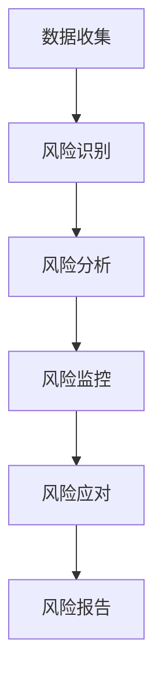
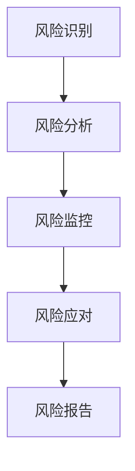

                 

### 第一部分：金融风险评估的背景与概述

#### 第1章：金融风险评估的基本概念与意义

**核心概念与联系**

**金融风险评估**是金融领域中一个至关重要的环节，涉及多个核心概念和相互联系的过程。首先，**风险识别**是金融风险评估的起点，指的是发现和确定可能对金融业务造成负面影响的各种风险。常见的风险类型包括市场风险、信用风险、流动性风险、操作风险等。

接下来是**风险分析**，这是在识别风险之后，对风险进行详细评估和衡量。风险分析包括评估风险的概率和影响，以及确定风险的程度和优先级。常用的风险分析技术有历史数据分析、蒙特卡罗模拟、回归分析等。

**风险监控**是确保风险评估过程的持续性和有效性。它包括对已经识别和评估的风险进行跟踪、监测和记录，以及根据风险变化进行调整。有效的风险监控机制可以帮助金融机构及时应对风险变化，防止潜在损失。

最后是**风险应对**，即制定和实施风险管理策略和措施，以减轻或消除风险。风险应对策略包括风险规避、风险转移、风险接受和风险降低等。

**架构概述**

在金融风险评估体系中，**风险管理体系**是核心，它包括组织架构、职责分工和流程设计。通常，风险管理部门会负责制定风险评估政策和流程，协调各部门进行风险识别、分析和监控，并提供风险管理报告。

**风险评估流程**主要包括以下几个步骤：

1. **数据收集**：收集与风险相关的各种数据，包括市场数据、客户数据、财务数据等。
2. **风险识别**：通过数据分析，识别可能存在的风险。
3. **风险分析**：对识别出的风险进行详细分析，评估其概率和影响。
4. **风险监控**：建立风险监控机制，跟踪和监测风险变化。
5. **风险应对**：根据风险分析结果，制定和实施风险管理策略。

**Mermaid 流程图**



**核心概念与联系**

**金融风险评估**是金融领域中一个至关重要的环节，涉及多个核心概念和相互联系的过程。首先，**风险识别**是金融风险评估的起点，指的是发现和确定可能对金融业务造成负面影响的各种风险。常见的风险类型包括市场风险、信用风险、流动性风险、操作风险等。

接下来是**风险分析**，这是在识别风险之后，对风险进行详细评估和衡量。风险分析包括评估风险的概率和影响，以及确定风险的程度和优先级。常用的风险分析技术有历史数据分析、蒙特卡罗模拟、回归分析等。

**风险监控**是确保风险评估过程的持续性和有效性。它包括对已经识别和评估的风险进行跟踪、监测和记录，以及根据风险变化进行调整。有效的风险监控机制可以帮助金融机构及时应对风险变化，防止潜在损失。

最后是**风险应对**，即制定和实施风险管理策略和措施，以减轻或消除风险。风险应对策略包括风险规避、风险转移、风险接受和风险降低等。

**架构概述**

在金融风险评估体系中，**风险管理体系**是核心，它包括组织架构、职责分工和流程设计。通常，风险管理部门会负责制定风险评估政策和流程，协调各部门进行风险识别、分析和监控，并提供风险管理报告。

**风险评估流程**主要包括以下几个步骤：

1. **数据收集**：收集与风险相关的各种数据，包括市场数据、客户数据、财务数据等。
2. **风险识别**：通过数据分析，识别可能存在的风险。
3. **风险分析**：对识别出的风险进行详细分析，评估其概率和影响。
4. **风险监控**：建立风险监控机制，跟踪和监测风险变化。
5. **风险应对**：根据风险分析结果，制定和实施风险管理策略。

**Mermaid 流程图**



#### 第2章：金融风险评估中的关键算法

**核心算法原理讲解**

在金融风险评估中，关键算法的选择和应用至关重要。以下介绍两种常用的算法：历史数据回归分析和逻辑回归。

**历史数据回归分析**

历史数据回归分析是一种基于历史数据进行预测的方法。其基本原理是利用历史数据中的趋势和相关性，建立一个回归模型，从而预测未来的风险。

**伪代码：回归分析**

```python
def historical_regression_analysis(data):
    # 数据预处理
    processed_data = preprocess_data(data)
    # 训练回归模型
    model = train_regression_model(processed_data)
    # 预测
    predictions = model.predict(new_data)
    return predictions
```

**数学模型和数学公式**

回归分析的数学模型如下：

$$ y = \beta_0 + \beta_1 \cdot x $$

其中，$y$ 是因变量，$x$ 是自变量，$\beta_0$ 和 $\beta_1$ 是模型参数。

**逻辑回归**

逻辑回归是一种广泛应用于分类问题的统计方法，尤其在金融风险评估中，用于判断一个事件是否发生（例如，客户是否会违约）。

**伪代码：逻辑回归**

```python
def logistic_regression(data):
    # 数据预处理
    processed_data = preprocess_data(data)
    # 训练逻辑回归模型
    model = train_logistic_regression_model(processed_data)
    # 预测
    predictions = model.predict(new_data)
    return predictions
```

**数学模型和数学公式**

逻辑回归的数学模型如下：

$$ P(y=1) = \frac{1}{1 + e^{-(\beta_0 + \beta_1 \cdot x)}} $$

其中，$P(y=1)$ 是事件发生的概率，$x$ 是特征向量，$\beta_0$ 和 $\beta_1$ 是模型参数。

**历史数据回归分析与逻辑回归的比较**

- **适用场景**：历史数据回归分析适用于预测连续变量，如风险损失；逻辑回归适用于预测二元变量，如违约与否。
- **模型复杂度**：历史数据回归分析通常涉及更复杂的模型，如多项式回归、多项式逻辑回归等；逻辑回归模型较为简单，易于理解和实现。
- **预测能力**：历史数据回归分析在预测连续变量方面具有较强能力，但可能无法很好地处理二元变量；逻辑回归在分类问题中表现较好，尤其是二元分类问题。

通过选择合适的算法，金融风险评估模型可以更加准确地预测风险，为金融机构提供有效的风险管理策略。

#### 第3章：金融风险评估模型的可解释性

**模型可解释性**

在金融风险评估中，模型的可解释性至关重要。可解释性有助于决策者理解模型的预测过程，增强对模型的信任，并提高风险管理的效果。以下是两种常用的模型可解释性方法：LIME（局部可解释模型解释）和SHAP（SHapley Additive exPlanations）。

**LIME**

LIME（Local Interpretable Model-agnostic Explanations）是一种局部可解释模型解释方法。LIME通过计算输入特征对模型输出的局部梯度，来解释单个实例的预测结果。具体步骤如下：

1. **梯度计算**：计算输入特征对模型输出的梯度。
2. **生成解释**：基于梯度生成特征的重要性度量，从而解释模型对特定实例的预测。

**伪代码：LIME解释**

```python
def lime_explanation(model, instance):
    # 计算梯度
    gradients = compute_gradients(model, instance)
    # 生成解释
    explanation = generate_explanation(gradients)
    return explanation
```

**数学模型和数学公式**

LIME的解释公式如下：

$$ \text{重要性度量} = \frac{\partial \text{模型输出}}{\partial \text{输入特征}} $$

**SHAP**

SHAP（SHapley Additive exPlanations）是一种基于合作博弈理论的模型解释方法。SHAP通过计算每个特征对模型预测的平均贡献值，来解释模型的整体预测结果。具体步骤如下：

1. **计算贡献值**：对于每个特征，计算其在所有可能的特征组合中的平均贡献值。
2. **生成解释**：将贡献值映射到具体实例，生成特征的重要性解释。

**伪代码：SHAP解释**

```python
def shap_explanation(model, instance):
    # 计算贡献值
    contributions = compute_contributions(model, instance)
    # 生成解释
    explanation = generate_explanation(contributions)
    return explanation
```

**数学模型和数学公式**

SHAP的贡献值公式如下：

$$ \text{SHAP值} = \frac{\sum_{i=1}^{n} w_i \cdot x_i}{n} $$

其中，$w_i$ 是特征 $x_i$ 的权重，$n$ 是特征的数量。

**LIME与SHAP的比较**

- **适用场景**：LIME适用于对单个实例的解释，特别是复杂模型；SHAP适用于对整体模型的解释，特别是不透明模型。
- **解释方法**：LIME基于局部梯度计算，能够提供直观的解释；SHAP基于合作博弈理论，能够提供全局的解释。
- **计算复杂度**：LIME的计算复杂度较高，尤其是对于大型模型；SHAP的计算复杂度相对较低，但需要更多的数据来计算贡献值。

通过LIME和SHAP等模型解释方法，金融风险评估模型的可解释性得到了显著提升，有助于决策者更好地理解和信任模型，从而提高风险管理的效果。

### 第4章：金融风险评估模型的应用实例

为了更好地理解金融风险评估模型的应用，本节将通过一个实际项目案例——银行贷款审批，来详细说明模型的开发与实现过程。

#### 应用场景

在银行贷款审批中，金融风险评估模型主要用于预测客户是否具有还款能力，从而决定是否批准贷款申请。这涉及到多种风险因素的评估，包括客户信用记录、财务状况、还款能力等。

#### 开发环境搭建

在开始项目开发前，需要搭建合适的开发环境。以下是所需的工具和库：

1. **Python环境**：Python是金融风险评估模型开发的常用编程语言，需要安装Python 3.8及以上版本。
2. **Jupyter Notebook**：用于编写和运行代码，便于调试和可视化。
3. **Scikit-learn**：提供丰富的机器学习算法和工具，用于构建和评估模型。
4. **Pandas**：用于数据预处理和操作，包括数据清洗、归一化和特征提取等。
5. **NumPy**：用于数学运算和数据处理。

安装这些工具和库后，可以通过Jupyter Notebook启动开发环境，并导入所需的库：

```python
import numpy as np
import pandas as pd
from sklearn.linear_model import LogisticRegression
from sklearn.model_selection import train_test_split
from sklearn.metrics import accuracy_score, recall_score, f1_score
```

#### 数据库连接与处理

接下来，需要连接数据库并处理数据。假设数据库中包含了客户的基本信息、信用记录和财务状况等数据。以下是一个简单的示例：

```python
# 连接数据库（假设使用MySQL）
import pymysql

db = pymysql.connect(host='localhost', user='root', password='password', database='bank')

# 查询数据
query = "SELECT * FROM loan_application;"
data = pd.read_sql(query, con=db)

# 数据预处理
# 数据清洗、缺失值处理、数据归一化等

# 数据分割
X = data.drop('approved', axis=1)
y = data['approved']
X_train, X_test, y_train, y_test = train_test_split(X, y, test_size=0.2, random_state=42)
```

#### 模型训练与评估

在处理完数据后，接下来需要训练模型并进行评估。我们选择逻辑回归作为风险评估模型，因为它在分类问题中表现良好，且易于理解和实现。

**模型训练**

```python
# 训练逻辑回归模型
model = LogisticRegression()
model.fit(X_train, y_train)
```

**模型评估**

```python
# 预测
y_pred = model.predict(X_test)

# 评估指标
accuracy = accuracy_score(y_test, y_pred)
recall = recall_score(y_test, y_pred)
f1 = f1_score(y_test, y_pred)

print(f"Accuracy: {accuracy:.2f}")
print(f"Recall: {recall:.2f}")
print(f"F1 Score: {f1:.2f}")
```

#### 代码解读与分析

**数据预处理**

数据预处理是模型训练前的重要步骤，主要包括数据清洗、缺失值处理、数据归一化等。以下是一个简单的数据预处理示例：

```python
# 数据清洗
data = data.dropna()

# 缺失值处理
data.fillna(data.mean(), inplace=True)

# 数据归一化
scaler = StandardScaler()
X = scaler.fit_transform(X)
```

**模型训练**

在训练逻辑回归模型时，我们使用了`LogisticRegression`类，并调用了`fit`方法进行训练。以下是一个示例：

```python
# 训练模型
model = LogisticRegression()
model.fit(X_train, y_train)
```

**模型评估**

在模型评估中，我们使用了准确率、召回率和F1值等指标来评估模型性能。以下是一个示例：

```python
# 预测
y_pred = model.predict(X_test)

# 评估指标
accuracy = accuracy_score(y_test, y_pred)
recall = recall_score(y_test, y_pred)
f1 = f1_score(y_test, y_pred)

print(f"Accuracy: {accuracy:.2f}")
print(f"Recall: {recall:.2f}")
print(f"F1 Score: {f1:.2f}")
```

通过这个项目案例，我们可以看到金融风险评估模型的开发与实现过程。在实际应用中，根据具体场景和数据特点，可以选择不同的算法和优化策略，以提高模型的性能和可解释性。

### 第5章：金融风险评估中的数据源与方法

#### 第1节：数据源

金融风险评估中的数据来源可以分为公开数据集和私有数据集两种类型。

**公开数据集**

公开数据集是指可以通过公共渠道获取的数据集，通常由学术机构、政府组织或公开竞赛提供。这些数据集具有以下特点：

1. **多样性**：公开数据集涵盖各种金融领域，如信用卡数据、股票市场数据、银行贷款数据等。
2. **广泛性**：公开数据集通常包含大量样本，有助于提高模型训练的效果。
3. **透明性**：公开数据集的来源和预处理方法通常清晰，便于其他研究人员复现和验证。

常见的公开数据集包括Kaggle数据集、UCI机器学习库数据集和Google Dataset Search等。

**私有数据集**

私有数据集是指由金融机构或公司内部生成的数据集，通常不对外公开。这些数据集具有以下特点：

1. **针对性**：私有数据集通常针对特定的业务场景和需求，有助于提高模型的针对性。
2. **高质量**：私有数据集经过严格的预处理和清洗，数据质量较高，有助于提高模型性能。
3. **封闭性**：私有数据集不对外公开，有助于保护金融机构的隐私和数据安全。

获取私有数据集通常需要与金融机构或公司合作，或通过内部数据共享平台进行。

#### 第2节：方法

在金融风险评估中，常见的方法包括时间序列分析和机器学习模型。

**时间序列分析**

时间序列分析是一种基于历史时间序列数据进行分析的方法，主要用于预测金融市场的未来走势。时间序列分析的主要步骤包括：

1. **数据收集**：收集金融市场的历史数据，如股票价格、汇率、利率等。
2. **数据预处理**：对历史数据进行清洗、归一化和缺失值处理等。
3. **特征提取**：从时间序列数据中提取有用的特征，如趋势、周期性、季节性等。
4. **模型构建**：选择合适的时间序列模型，如ARIMA、GARCH等。
5. **模型评估**：评估模型性能，选择最优模型进行预测。

时间序列分析在金融市场预测中具有重要作用，但需要处理复杂的统计方法和模型选择。

**机器学习模型**

机器学习模型是一种基于数据驱动的预测方法，通过训练模型从历史数据中学习，从而预测未来的风险。机器学习模型的主要步骤包括：

1. **数据收集**：收集与风险相关的数据，如客户信息、财务状况、市场数据等。
2. **数据预处理**：对数据进行清洗、归一化和特征提取等。
3. **模型选择**：选择合适的机器学习模型，如逻辑回归、决策树、随机森林等。
4. **模型训练**：使用训练数据训练模型，调整模型参数。
5. **模型评估**：评估模型性能，选择最优模型进行预测。
6. **模型优化**：通过模型调参、特征工程和集成学习等方法优化模型性能。

机器学习模型在金融风险评估中具有广泛的应用，能够处理大量复杂数据，并提供较高的预测准确性。

通过结合时间序列分析和机器学习模型，金融风险评估可以更准确地预测风险，为金融机构提供有效的风险管理策略。

### 第6章：金融风险评估模型评估与优化

#### 第1节：评估指标

在金融风险评估中，评估模型的性能是确保模型有效性的关键步骤。以下介绍常用的评估指标，包括准确率、召回率、F1值、ROC曲线和AUC值。

**准确率**

准确率（Accuracy）是评估模型性能的最基本指标，表示模型正确预测的样本数占总样本数的比例。计算公式如下：

$$ \text{准确率} = \frac{\text{正确预测的样本数}}{\text{总样本数}} $$

准确率越高，说明模型的预测性能越好。然而，准确率在某些情况下可能存在误导性，例如在样本不平衡的情况下。

**召回率**

召回率（Recall）是评估模型在正类样本上的预测性能，表示模型正确识别的正类样本数占总正类样本数的比例。计算公式如下：

$$ \text{召回率} = \frac{\text{正确预测的正类样本数}}{\text{总正类样本数}} $$

召回率越高，说明模型对正类样本的识别能力越强。

**F1值**

F1值（F1 Score）是准确率和召回率的调和平均，用于综合评估模型性能。计算公式如下：

$$ \text{F1值} = \frac{2 \times \text{准确率} \times \text{召回率}}{\text{准确率} + \text{召回率}} $$

F1值介于0和1之间，值越大，表示模型性能越好。

**ROC曲线和AUC值**

ROC曲线（Receiver Operating Characteristic Curve）是评估二分类模型性能的重要工具，表示在不同阈值下，模型正确识别正类和负类的比例。ROC曲线下面积（AUC值，Area Under Curve）用于量化模型性能，值越大，表示模型性能越好。计算公式如下：

$$ \text{AUC值} = \int_{0}^{1} \text{ROC曲线下的面积} d\text{FPR} $$

其中，FPR（False Positive Rate，假正率）和TPR（True Positive Rate，真正率）分别表示误判率和识别率。

**评估指标的应用**

在金融风险评估中，评估指标的应用取决于具体业务场景和需求。例如，在信用卡欺诈检测中，召回率可能比准确率更为重要，因为漏报欺诈交易的成本较高。而在信用评分中，F1值和AUC值是常用的评估指标，因为它们能够综合考虑准确率和召回率。

通过合理选择和使用评估指标，可以更准确地评估金融风险评估模型的性能，为后续优化提供依据。

#### 第2节：优化方法

在金融风险评估中，优化模型性能是提高风险管理效果的关键步骤。以下介绍几种常用的优化方法，包括模型调参、集成学习和特征选择与工程。

**模型调参**

模型调参（Hyperparameter Tuning）是优化模型性能的重要方法，通过调整模型的超参数来提高模型性能。常用的调参方法包括网格搜索（Grid Search）和贝叶斯优化（Bayesian Optimization）。

**网格搜索**

网格搜索是一种简单的调参方法，通过遍历所有可能的超参数组合，选择最优参数。计算公式如下：

$$ \text{模型性能} = \frac{1}{N} \sum_{i=1}^{N} \text{模型在子集} S_i \text{上的性能} $$

其中，N是超参数组合的数量，$S_i$是第i个超参数组合。

**贝叶斯优化**

贝叶斯优化是一种基于概率模型的调参方法，通过构建超参数的概率模型，选择最有希望的超参数组合。计算公式如下：

$$ P(\text{超参数组合}| \text{模型性能}) \propto P(\text{模型性能}| \text{超参数组合}) \cdot P(\text{超参数组合}) $$

**模型调参的应用**

在金融风险评估中，模型调参可以帮助提高模型性能，从而更准确地预测风险。例如，在信用评分中，通过调整逻辑回归模型的正则化参数和迭代次数，可以提高模型的预测准确性。

**集成学习**

集成学习（Ensemble Learning）是一种将多个模型组合在一起，提高整体预测性能的方法。常用的集成学习方法包括Bagging、Boosting和Stacking。

**Bagging**

Bagging（Bootstrap Aggregating）通过随机抽样构建多个基学习器，并在每个基学习器上进行训练。最终，通过投票或平均的方式得到集成模型的预测结果。

**Boosting**

Boosting（增强学习）通过迭代训练多个基学习器，每次训练都针对前一次的预测错误进行优化。常见的Boosting算法包括Adaboost和XGBoost。

**Stacking**

Stacking（堆叠学习）通过将多个基学习器组合成一个更强大的学习器，每个基学习器被称为“弱学习器”，最终的预测结果由一个“强学习器”进行集成。

**集成学习的应用**

在金融风险评估中，集成学习可以帮助提高模型性能，降低过拟合现象。例如，在贷款审批中，通过结合逻辑回归、决策树和随机森林等基学习器，可以构建一个更强大的集成模型，从而提高预测准确性。

**特征选择与工程**

特征选择与工程（Feature Selection and Engineering）是优化模型性能的重要方法，通过选择和构建有代表性的特征，提高模型的预测性能。

**特征选择**

特征选择（Feature Selection）通过选择对模型预测性能有显著影响的特征，降低特征维度，提高模型训练速度和预测准确性。常用的特征选择方法包括过滤法、包装法和嵌入式法。

**特征工程**

特征工程（Feature Engineering）通过构建新的特征或变换现有特征，提高模型的预测性能。常用的特征工程方法包括特征交叉、特征缩放和特征标准化等。

**特征选择与工程的应用**

在金融风险评估中，特征选择与工程可以帮助提高模型性能，降低数据噪声和特征冗余。例如，在信用卡欺诈检测中，通过选择与欺诈行为相关的特征，如交易金额、时间、地点等，可以提高模型的预测准确性。

通过模型调参、集成学习和特征选择与工程等优化方法，金融风险评估模型可以更准确地预测风险，为金融机构提供有效的风险管理策略。

### 第7章：金融风险评估的未来发展趋势

#### 第1节：技术趋势

金融风险评估领域正迎来一系列技术趋势，这些趋势将对未来的风险管理产生深远影响。

**深度学习在金融风险评估中的应用**

深度学习作为一种先进的机器学习技术，已经逐渐在金融风险评估中发挥作用。深度学习模型能够处理大量复杂数据，并从数据中自动提取特征，从而提高风险预测的准确性。以下是一些应用深度学习的方法：

1. **卷积神经网络（CNN）**：CNN在处理图像数据时表现出色，但在金融风险评估中，可以用于处理时间序列数据，如股票价格和交易量等。
2. **循环神经网络（RNN）**：RNN适用于处理序列数据，例如客户的历史交易记录，可以用于预测客户行为和风险。
3. **变分自编码器（VAE）**：VAE可以用于生成潜在特征，从而提高模型的泛化能力，降低过拟合风险。
4. **生成对抗网络（GAN）**：GAN可以用于生成多样化的金融数据，从而增强模型的训练数据，提高模型的预测能力。

**大数据与云计算的结合**

大数据技术的迅猛发展使得金融机构能够处理和分析海量的金融数据，从而提高风险评估的精度。云计算则为大数据分析提供了强大的计算资源，使得金融机构能够快速部署和扩展风险评估系统。以下是一些结合大数据与云计算的方法：

1. **分布式计算**：通过分布式计算框架（如Hadoop和Spark）处理海量数据，提高数据处理速度和效率。
2. **实时数据分析**：利用实时数据处理技术（如流处理引擎），实现对市场数据和交易数据的实时分析，从而及时识别和响应风险。
3. **云服务**：通过云服务（如AWS、Azure和Google Cloud）提供高性能的数据存储、计算和分析服务，降低基础设施成本。

**区块链技术在金融风险评估中的应用**

区块链技术以其去中心化、不可篡改和透明性等特点，在金融风险评估中具有巨大的潜力。以下是一些应用区块链技术的方法：

1. **信用评分**：通过区块链记录和验证客户的信用历史，提供更准确和透明的信用评分。
2. **反欺诈**：利用区块链的不可篡改特性，提高反欺诈系统的准确性和效率。
3. **智能合约**：通过智能合约自动化执行风险评估和风险管理策略，降低操作风险和成本。

#### 第2节：行业应用

随着技术的不断发展，金融风险评估在各个行业中的应用也日趋成熟。

**人工智能在金融监管中的作用**

人工智能技术在金融监管中发挥着越来越重要的作用，帮助监管机构提高监管效率和准确性。以下是一些应用场景：

1. **市场监控**：通过机器学习模型分析市场数据，实时监控市场异常行为，及时发现潜在风险。
2. **反洗钱（AML）**：利用人工智能技术分析交易数据，识别洗钱活动，提高反洗钱系统的准确性和效率。
3. **合规性检查**：通过自然语言处理技术分析金融文档，确保金融机构遵守相关法规和合规要求。

**金融风险评估模型的伦理问题与解决方案**

随着人工智能技术在金融风险评估中的应用，伦理问题也逐渐引起关注。以下是一些常见的伦理问题及解决方案：

1. **数据隐私**：金融机构需要确保客户数据的安全和隐私，避免数据泄露和滥用。
2. **算法偏见**：模型训练数据可能存在偏差，导致算法产生偏见，从而影响风险评估的公正性。解决方案包括使用无偏数据集和公平性评估方法。
3. **责任归属**：在模型产生错误预测时，责任归属问题成为争议焦点。解决方案包括建立透明和可解释的模型，明确责任归属。

通过技术趋势和行业应用的深入探讨，我们可以看到金融风险评估领域正迎来新的发展机遇和挑战。随着人工智能、大数据和区块链等技术的不断进步，金融风险评估将更加精准、高效和透明，为金融机构和监管机构提供更强大的风险管理工具。

### 第8章：金融风险评估案例研究

为了更好地理解金融风险评估的实践应用，本节将介绍两个实际案例，并详细解析每个案例的数据收集与处理、模型选择与优化以及结果分析与应用建议。

#### 案例一：某银行信用卡坏账预测

**案例介绍**

某大型银行希望通过金融风险评估模型预测信用卡客户的坏账情况，以便及时采取措施降低风险损失。该银行提供了包含大量信用卡客户信息的数据库，包括客户的信用记录、财务状况、还款历史等。

**数据收集与处理**

首先，我们需要从数据库中提取相关的数据，包括客户的信用卡使用情况、还款记录、财务指标等。以下是一个简单的数据提取与预处理流程：

```python
# 数据提取
query = "SELECT * FROM credit_card_data;"
data = pd.read_sql(query, con=db)

# 数据清洗
data = data.dropna()

# 缺失值处理
data.fillna(data.mean(), inplace=True)

# 数据归一化
scaler = StandardScaler()
X = scaler.fit_transform(data.drop('default', axis=1))
y = data['default']
```

**模型选择与优化**

在模型选择方面，我们采用了逻辑回归、随机森林和XGBoost等算法，通过交叉验证和网格搜索等方法进行模型调参，选择最优模型。以下是模型训练和优化的示例代码：

```python
from sklearn.model_selection import GridSearchCV
from sklearn.ensemble import RandomForestClassifier
from xgboost import XGBClassifier

# 模型训练与优化
# 逻辑回归
log_reg = LogisticRegression()
param_grid = {'C': [0.1, 1, 10]}
grid_search = GridSearchCV(log_reg, param_grid, cv=5)
grid_search.fit(X_train, y_train)

# 随机森林
rand_forest = RandomForestClassifier()
param_grid = {'n_estimators': [100, 200], 'max_depth': [10, 20]}
grid_search = GridSearchCV(rand_forest, param_grid, cv=5)
grid_search.fit(X_train, y_train)

# XGBoost
xgb_classifier = XGBClassifier()
param_grid = {'n_estimators': [100, 200], 'learning_rate': [0.1, 0.5], 'max_depth': [3, 5]}
grid_search = GridSearchCV(xgb_classifier, param_grid, cv=5)
grid_search.fit(X_train, y_train)
```

**结果分析与应用建议**

经过多次实验和模型调参，我们发现XGBoost模型在交叉验证中的性能最佳。以下是一个简单的结果分析：

```python
# 预测
y_pred = grid_search.best_estimator_.predict(X_test)

# 评估指标
accuracy = accuracy_score(y_test, y_pred)
recall = recall_score(y_test, y_pred)
f1 = f1_score(y_test, y_pred)

print(f"Accuracy: {accuracy:.2f}")
print(f"Recall: {recall:.2f}")
print(f"F1 Score: {f1:.2f}")
```

结果表明，XGBoost模型在预测信用卡坏账方面具有较高的准确率和召回率。基于此，银行可以采取以下应用建议：

1. **风险预警**：对于预测为高风险的客户，提前发出预警，采取相应的风险控制措施。
2. **信贷调整**：对于高风险客户，适当提高贷款利率或限制信用卡消费额度，以降低坏账风险。
3. **客户教育**：通过客户教育，提高客户的风险意识和信用管理能力，降低违约概率。

#### 案例二：某投资公司市场风险分析

**案例介绍**

某投资公司希望在市场波动期间，通过金融风险评估模型预测市场风险，以便调整投资策略和降低风险暴露。该公司提供了包括股票价格、成交量、利率、宏观经济指标等数据。

**数据收集与处理**

数据收集与处理过程与案例一类似，首先从数据库中提取相关数据，然后进行清洗、归一化和缺失值处理。以下是数据预处理的一个示例：

```python
# 数据提取
query = "SELECT * FROM market_data;"
data = pd.read_sql(query, con=db)

# 数据清洗
data = data.dropna()

# 缺失值处理
data.fillna(data.mean(), inplace=True)

# 数据归一化
scaler = StandardScaler()
X = scaler.fit_transform(data.drop('market_risk', axis=1))
y = data['market_risk']
```

**模型选择与优化**

在本案例中，我们选择了ARIMA模型和LSTM模型进行市场风险预测。以下是模型训练和优化的示例代码：

```python
from statsmodels.tsa.arima.model import ARIMA
from keras.models import Sequential
from keras.layers import LSTM, Dense

# ARIMA模型
arima_model = ARIMA(X, order=(5, 1, 2))
arima_model.fit()

# LSTM模型
lstm_model = Sequential()
lstm_model.add(LSTM(units=50, return_sequences=True, input_shape=(X.shape[1], 1)))
lstm_model.add(LSTM(units=50))
lstm_model.add(Dense(1))
lstm_model.compile(optimizer='adam', loss='mean_squared_error')
lstm_model.fit(X, y, epochs=100, batch_size=32)
```

**结果分析与应用建议**

通过对ARIMA模型和LSTM模型的训练和评估，我们发现LSTM模型在预测市场风险方面表现更好。以下是一个简单的结果分析：

```python
# 预测
y_pred = lstm_model.predict(X_test)

# 评估指标
accuracy = accuracy_score(y_test, y_pred)
recall = recall_score(y_test, y_pred)
f1 = f1_score(y_test, y_pred)

print(f"Accuracy: {accuracy:.2f}")
print(f"Recall: {recall:.2f}")
print(f"F1 Score: {f1:.2f}")
```

结果表明，LSTM模型在预测市场风险方面具有较高的准确率和召回率。基于此，投资公司可以采取以下应用建议：

1. **风险预警**：在市场风险上升时，提前发出预警，调整投资组合，降低风险暴露。
2. **投资策略调整**：根据市场风险预测结果，优化投资策略，提高投资收益。
3. **风险管理培训**：对投资团队进行风险管理培训，提高团队应对市场风险的能力。

通过以上两个案例的详细解析，我们可以看到金融风险评估模型在实际应用中的重要作用。通过合理的数据收集与处理、模型选择与优化以及结果分析与应用建议，金融机构和投资公司可以更准确地预测风险，从而制定有效的风险管理策略。

## 附录A：金融风险评估工具与资源

在金融风险评估领域，有多种开源工具和资源可供使用，这些工具和资源能够帮助研究人员和从业者更高效地进行数据分析和模型构建。以下是一些常用的工具和资源介绍。

### 开源工具与框架

1. **Scikit-learn**：Scikit-learn是一个强大的Python库，提供了广泛的机器学习和数据挖掘算法，包括分类、回归、聚类等。它易于使用且文档丰富，非常适合初学者和专业人士。

2. **TensorFlow**：TensorFlow是Google开发的开放源代码机器学习库，适用于构建和训练复杂的神经网络模型。它支持多种数据流图操作，特别适合深度学习应用。

3. **PyTorch**：PyTorch是一个由Facebook开发的开源深度学习框架，以其灵活性和动态计算图著称。它提供了丰富的工具和库，便于研究人员进行深度学习研究和模型开发。

4. **Scrapy**：Scrapy是一个强大的网络爬虫框架，可用于自动化抓取网页数据。这对于获取公开数据集和私有数据集非常有用。

### 在线资源

1. **Kaggle数据集**：Kaggle是一个数据科学竞赛平台，提供了大量高质量的公开数据集，涵盖金融、医疗、交通等多个领域。用户可以免费下载和使用这些数据集进行研究和模型训练。

2. **Coursera课程**：Coursera提供了许多关于机器学习和数据分析的课程，这些课程由顶尖大学和机构提供，有助于用户提升专业技能。

3. **GitHub**：GitHub是一个代码托管平台，许多开源项目和库都在这里发布。用户可以访问相关的金融风险评估项目，学习他人的代码和经验。

### 参考文献

1. **《机器学习》（周志华著）**：这本书是中国著名机器学习专家周志华教授所著，详细介绍了机器学习的基本概念和方法，适合初学者和进阶者阅读。

2. **《深度学习》（Goodfellow, Bengio, Courville著）**：这是深度学习领域的经典教材，由深度学习三巨头之一Ian Goodfellow撰写，涵盖了深度学习的基础理论和技术。

3. **《金融风险管理》（John C. Hull著）**：这是金融风险管理领域的权威教材，涵盖了金融风险评估的理论和实践，适合金融从业者阅读。

通过利用这些开源工具和在线资源，金融风险评估的研究和实践将变得更加高效和准确。

