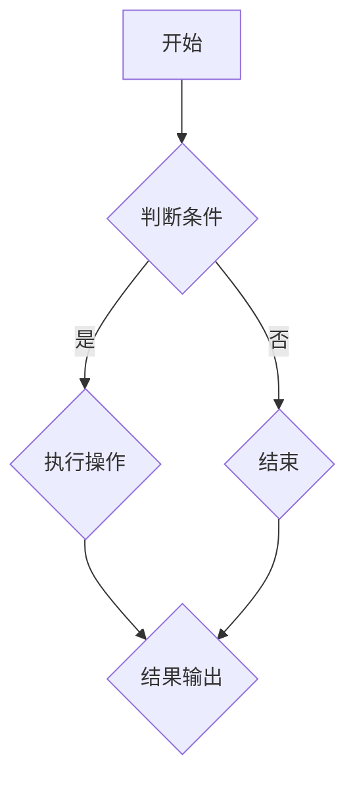

                 

## 《集合论导引：集合Vw与彻底有限集合》

### 关键词：集合论、集合Vw、彻底有限集合、集合运算、势论、集合基数

#### 摘要：

本文旨在深入探讨集合论中的高级概念，特别是集合Vw与彻底有限集合。通过对集合论基础、集合划分与映射、集合基数与势等核心概念的讲解，我们引入了集合Vw与彻底有限集合的定义及其运算性质。文章重点分析了集合Vw与彻底有限集合在现代数学和计算机科学中的应用，并通过实际项目案例解析了这些概念的具体实现和应用。最后，本文总结了集合论的前沿研究，提供了相关参考书籍与资源，并给出了实践项目指导。通过本文的学习，读者将对集合论的高级概念有更深入的理解，并能够在实际应用中灵活运用。

### 引言

集合论是现代数学的基础，它在各个数学分支以及计算机科学、物理学、生物学等领域都有着广泛的应用。集合论的基本概念如集合的表示、集合运算、子集与真子集、集合的基数与势等，构成了整个数学体系的理论基石。然而，在经典集合论中，许多概念和定理都是基于直观的或形式化的证明，这使得某些高级概念在理解上具有一定的难度。

本文将探讨集合论中的一些高级概念，特别是集合Vw与彻底有限集合。集合Vw是由康托尔在研究集合基数时提出的一种新型集合，它在经典集合论中具有独特的性质和运算。而彻底有限集合则是在势论研究中出现的，它具有严格的有限性和一定的运算规则。通过对这些高级概念的深入分析，我们希望能够揭示集合论在数学和计算机科学中的更深层次的应用。

文章的剩余部分将按照以下结构进行：

- **第一部分：集合论基础**：介绍集合论的基本概念，包括集合的表示与运算、子集与真子集、集合的基本定理、集合的划分与映射、集合的基数与势等。

- **第二部分：集合论的高级概念**：进一步探讨势论基础，包括势的基本概念、可数集合与不可数集合的区分、度量空间与集合的势等。然后，引入集合Vw与彻底有限集合的概念，详细分析其定义、性质和运算。

- **第三部分：集合论在现代数学中的应用**：讨论集合论在拓扑学、代数学、几何学中的应用，以及集合论与数学基础的关系。

- **第四部分：集合论在计算机科学中的应用**：探讨集合论在算法设计与分析、数据结构与复杂性理论中的应用，以及集合论在其他学科中的应用。

- **第五部分：集合论的前沿研究**：总结集合论的前沿研究，包括集合论在数学基础、计算机科学、以及其他学科中的应用。

- **附录**：提供常用的数学符号与公式、集合论相关参考书籍与论文、实践项目指导、Mermaid流程图示例、伪代码示例、LaTeX数学公式示例、开发环境与工具介绍。

通过本文的阅读，读者将对集合论的高级概念有更深入的理解，并能够在实际应用中灵活运用。

### 第一部分：集合论基础

集合论是现代数学的基石，它提供了一种形式化的方法来描述数学对象和它们之间的关系。在这个部分，我们将介绍集合论的一些基本概念，包括集合的表示与运算、子集与真子集、集合的基本定理等。

#### 第1章：集合的表示与运算

集合是数学中的一个基本概念，它是由一组确定的、互异的元素组成的整体。集合通常用大写字母表示，如\(A, B, C\)等。集合中的元素用小写字母表示，如\(a, b, c\)等。

##### 集合的基本表示方法

集合可以通过列举法、描述法和集合运算来表示。

- **列举法**：通过列举集合中的所有元素来表示集合。例如，集合\(A = \{1, 2, 3\}\)。

- **描述法**：通过描述集合中元素的性质来表示集合。例如，集合\(B = \{x \mid x \in \mathbb{N}, x < 3\}\)，表示集合\(B\)是由所有小于3的自然数组成的。

- **集合运算**：集合运算包括并集、交集、补集、差集等。

  - **并集**（\( \cup \)）：集合\(A\)和集合\(B\)的并集是由所有属于\(A\)或属于\(B\)的元素组成的集合。例如，\(A \cup B = \{1, 2, 3\}\)。

  - **交集**（\( \cap \)）：集合\(A\)和集合\(B\)的交集是由所有既属于\(A\)又属于\(B\)的元素组成的集合。例如，\(A \cap B = \{2\}\)。

  - **补集**（\( C \)）：集合\(A\)的补集是由所有不属于\(A\)的元素组成的集合。例如，\(C_A = \{x \mid x \notin A\}\)。

  - **差集**（\( \setminus \)）：集合\(A\)和集合\(B\)的差集是由所有属于\(A\)但不属于\(B\)的元素组成的集合。例如，\(A \setminus B = \{1, 3\}\)。

##### 集合的基本运算

集合的运算遵循交换律、结合律和分配律等基本性质。

- **交换律**：对于任意的集合\(A\)和\(B\)，有\(A \cup B = B \cup A\)和\(A \cap B = B \cap A\)。

- **结合律**：对于任意的集合\(A, B, C\)，有\(A \cup (B \cup C) = (A \cup B) \cup C\)和\(A \cap (B \cap C) = (A \cap B) \cap C\)。

- **分配律**：对于任意的集合\(A, B, C\)，有\(A \cup (B \cap C) = (A \cup B) \cap (A \cup C)\)和\(A \cap (B \cup C) = (A \cap B) \cup (A \cap C)\)。

#### 第2章：子集与真子集

子集与真子集是集合论中的基本概念，它们描述了集合之间的包含关系。

##### 子集的定义

如果集合\(A\)中的所有元素都属于集合\(B\)，则称集合\(A\)是集合\(B\)的子集，记作\(A \subseteq B\)。换句话说，对于任意的元素\(x\)，如果\(x \in A\)，则\(x \in B\)。

##### 真子集的定义与性质

如果集合\(A\)是集合\(B\)的子集，但\(A\)不等于\(B\)，则称集合\(A\)是集合\(B\)的真子集，记作\(A \subset B\)。换句话说，存在至少一个元素\(x\)，使得\(x \in B\)但\(x \notin A\)。

真子集具有以下性质：

- **互异性**：集合中的元素都是互异的。
- **传递性**：如果\(A \subseteq B\)且\(B \subseteq C\)，则\(A \subseteq C\)。
- **自反性**：对于任意的集合\(A\)，\(A \subseteq A\)。
- **对称性**：如果\(A \subseteq B\)，则\(B \subseteq A\)。

#### 第3章：集合的基本定理

集合的基本定理是集合论中的核心内容，它们描述了集合之间运算的性质和关系。

##### 集合的补集

集合\(A\)的补集\(C_A\)是指由所有不属于\(A\)的元素组成的集合。即，\(C_A = \{x \mid x \notin A\}\)。

##### 集合的交与并

集合\(A\)和集合\(B\)的交集\(A \cap B\)是由所有既属于\(A\)又属于\(B\)的元素组成的集合。集合\(A\)和集合\(B\)的并集\(A \cup B\)是由所有属于\(A\)或属于\(B\)的元素组成的集合。

##### 集合的补集、交、并运算的性质

集合的补集、交、并运算具有以下性质：

- **自反性**：对于任意的集合\(A\)，\(A \cap A = A\)和\(A \cup A = A\)。
- **交换律**：对于任意的集合\(A\)和\(B\)，\(A \cap B = B \cap A\)和\(A \cup B = B \cup A\)。
- **结合律**：对于任意的集合\(A, B, C\)，\(A \cap (B \cap C) = (A \cap B) \cap C\)和\(A \cup (B \cup C) = (A \cup B) \cup C\)。
- **分配律**：对于任意的集合\(A, B, C\)，\(A \cap (B \cup C) = (A \cap B) \cup (A \cap C)\)和\(A \cup (B \cap C) = (A \cup B) \cap (A \cup C)\)。
- **德摩根律**：对于任意的集合\(A\)和\(B\)，\(C_A \cup B = (C_A \cap B)^c\)和\(C_A \cap B = (C_A \cup B)^c\)。

通过这些基本定理，我们可以更方便地进行集合的运算和分析。

### 第2章：集合的划分与映射

在集合论中，集合的划分与映射是两个重要的概念，它们在数学分析、图论、计算机科学等领域有着广泛的应用。在这一章中，我们将深入探讨集合的划分、映射的基本概念，以及映射的运算。

#### 2.1 集合的划分

集合的划分是指将一个集合划分为若干个互不重叠的子集，这些子集的并集等于原集合。集合的划分在研究集合的性质和关系时具有重要意义。

##### 划分的概念与性质

划分的概念可以形式化为如下：

设\(X\)是一个集合，\(P(X)\)是\(X\)的所有子集的集合。一个划分\(D\)是\(X\)的一个子集族，它满足以下条件：

1. **完备性**：对于任意的\(x \in X\)，存在一个子集\(S \in D\)，使得\(x \in S\)。
2. **互斥性**：对于任意的\(S, T \in D\)，如果\(S \neq T\)，则\(S \cap T = \emptyset\)。
3. **覆盖性**：\(D\)中的所有子集的并集等于\(X\)，即\(\bigcup_{S \in D} S = X\)。

划分的等价定义是：一个划分\(D\)将集合\(X\)划分成不相交的子集，每个子集都是划分的一部分，且所有子集的并集构成原集合。

划分具有以下基本性质：

- **自反性**：任何集合\(X\)都是它自身的划分。
- **单调性**：如果划分\(D'\)是划分\(D\)的子集，则\(D\)也是划分\(D'\)的子集。
- **传递性**：如果\(D'\)是划分\(D\)的子集，\(D''\)是划分\(D'\)的子集，则\(D''\)也是划分\(D\)的子集。

##### 等价划分与划分矩阵

等价划分是指具有相同子集个数的划分。两个划分\(D\)和\(D'\)是等价的，如果它们有相同的子集个数。

划分矩阵是一种表示划分的数学工具。一个集合的划分可以用一个矩阵表示，其中矩阵的行对应于划分中的子集，列对应于集合中的元素。如果某个元素属于某个子集，则在矩阵的相应位置上标记为1，否则为0。

例如，对于集合\(X = \{1, 2, 3, 4\}\)的一个划分\(D = \{\{1, 2\}, \{3, 4\}\}\)，其划分矩阵如下：

|   | 1 | 2 | 3 | 4 |
|---|---|---|---|---|
| \{1, 2\} | 1 | 1 | 0 | 0 |
| \{3, 4\} | 0 | 0 | 1 | 1 |

#### 2.2 映射的基本概念

映射是集合之间的一种特殊关系，它将一个集合中的每个元素唯一地对应到另一个集合中的一个元素。映射在数学分析和计算机科学中有着广泛的应用。

##### 映射的定义与性质

映射可以形式化为如下：

设\(A\)和\(B\)是两个集合，一个从集合\(A\)到集合\(B\)的映射，记作\(f: A \rightarrow B\)，是一个规则，使得对于\(A\)中的每个元素\(x\)，都存在\(B\)中的一个元素\(y\)，满足\(f(x) = y\)。

映射具有以下基本性质：

- **单射性**（单射）：如果对于\(A\)中的任意两个不同的元素\(x_1\)和\(x_2\)，都有\(f(x_1) \neq f(x_2)\)，则称映射\(f\)为单射。
- **满射性**（满射）：如果对于\(B\)中的每个元素\(y\)，都存在\(A\)中的一个元素\(x\)，使得\(f(x) = y\)，则称映射\(f\)为满射。
- **双射性**（双射）：如果映射\(f\)既是单射又是满射，则称映射\(f\)为双射。

##### 单射、满射与双射

- **单射**：对于任意的\(x_1, x_2 \in A\)，如果\(x_1 \neq x_2\)，则有\(f(x_1) \neq f(x_2)\)。单射保持集合中的元素之间的差异。
- **满射**：对于任意的\(y \in B\)，都存在\(x \in A\)，使得\(f(x) = y\)。满射确保集合\(B\)中的每个元素都有原象。
- **双射**：单射和满射的结合，意味着集合\(A\)和集合\(B\)之间存在一一对应关系。

#### 2.3 映射的运算

映射的运算包括映射的合成和逆映射。

##### 映射的合成

映射的合成是指将两个映射组合起来形成一个新的映射。设\(f: A \rightarrow B\)和\(g: B \rightarrow C\)是两个映射，它们的合成\(g \circ f: A \rightarrow C\)是一个映射，满足对于任意的\(x \in A\)，有\((g \circ f)(x) = g(f(x))\)。

映射合成遵循结合律和交换律：

- **结合律**：对于任意的映射\(f, g, h: A \rightarrow B\)，有\((h \circ g) \circ f = h \circ (g \circ f)\)。
- **交换律**：对于任意的映射\(f, g: A \rightarrow B\)，有\(g \circ f = f \circ g\)（仅当\(f\)和\(g\)都是双射时成立）。

##### 映射的逆

逆映射是指一个映射的反函数。如果映射\(f: A \rightarrow B\)是双射，则存在逆映射\(f^{-1}: B \rightarrow A\)，满足对于任意的\(y \in B\)，有\(f^{-1}(y) = x\)，其中\(f(x) = y\)。

逆映射的基本性质包括：

- **反函数的唯一性**：对于一个双射，其逆映射是唯一的。
- **反函数的性质**：如果\(f: A \rightarrow B\)是双射，则\(f^{-1}\)也是双射，且\(f \circ f^{-1} = id_B\)和\(f^{-1} \circ f = id_A\)，其中\(id_B\)和\(id_A\)分别是集合\(B\)和集合\(A\)上的恒等映射。

通过深入理解集合的划分与映射的基本概念和运算，我们能够更好地掌握集合论的核心知识，并能够将其应用于实际问题中。

### 第3章：集合的基数与势

集合的基数与势是集合论中的核心概念，它们描述了集合的大小和结构。在这一章中，我们将讨论集合的基数、集合的势以及康托尔定理，并介绍对角线法。

#### 3.1 集合的基数

集合的基数是指集合中元素的数量。在数学中，基数也被称为势（cardinality），有时用符号\(|\cdot|\)表示。

##### 基数的定义与性质

- **可数集合**：如果一个集合的基数可以与自然数集合\(\mathbb{N}\)建立一一对应关系，则该集合称为可数集合。可数集合的基数称为可数基数，通常记作\(|\mathbb{N}| = \aleph_0\)（阿列夫零）。

- **不可数集合**：如果一个集合的基数不能与自然数集合\(\mathbb{N}\)建立一一对应关系，则该集合称为不可数集合。不可数集合的基数通常用更大的无穷基数表示，例如\(\mathfrak{c}\)（连续统基数）。

##### 基数的运算

- **基数加法**：对于任意两个集合\(A\)和\(B\)，有\(|A \cup B| = |A| + |B|\)（如果\(A\)和\(B\)不相交）。
- **基数乘法**：对于任意两个集合\(A\)和\(B\)，有\( |A \times B| = |A| \times |B|\)。

##### 可数集合与不可数集合

- **可数集合的例子**：自然数集合\(\mathbb{N}\)、整数集合\(\mathbb{Z}\)、有理数集合\(\mathbb{Q}\)。
- **不可数集合的例子**：实数集合\(\mathbb{R}\)、连续统集合\(\mathfrak{c}\)。

康托尔定理是集合论中的一个重要结果，它揭示了可数集合和不可数集合之间的本质区别。

#### 3.2 康托尔定理

康托尔定理指出：

- 任意集合的基数都存在，且可数集合的基数是最小的无穷基数\(\aleph_0\)。
- 不存在一个集合的基数大于连续统基数\(\mathfrak{c}\)。
- 不存在一个集合的基数恰好等于连续统基数\(\mathfrak{c}\)。

康托尔定理可以通过对角线法证明。

#### 3.3 对角线法

对角线法是一种构造反例的方法，常用于证明集合的不可数性。

##### 对角线法的原理与应用

对角线法的原理如下：

- 假设存在一个集合\(A\)，其基数大于某个已知集合的基数，例如\(\mathbb{N}\)。
- 构造一个新集合\(B\)，使得\(B\)中的每个元素都不是\(A\)中的某个特定元素。
- 通过这种构造，可以证明\(A\)和\(B\)之间存在一一对应关系，从而证明\(A\)的基数不超过某个已知集合的基数。

例如，康托尔通过对角线法证明了实数集合\(\mathbb{R}\)是不可数的。

#### 对角线法的应用示例

假设我们要证明实数集合\(\mathbb{R}\)是不可数的，我们可以构造一个新集合\(B\)，使得\(B\)中的每个元素都不是\(A\)中的某个特定元素。具体步骤如下：

1. **假设**：假设存在一个从自然数集合\(\mathbb{N}\)到实数集合\(\mathbb{R}\)的映射\(f: \mathbb{N} \rightarrow \mathbb{R}\)。
2. **构造新集合**：构造一个新集合\(B\)，使得\(B\)中的每个元素都不是\(A\)中的第\(n\)个元素，即\(b_n \neq f(n)\)。
3. **构造对角线元素**：对于\(B\)中的每个元素\(b_n\)，构造一个新实数\(r\)，使得\(r\)与\(b_n\)在某个小数位上不同。例如，如果\(b_n\)的小数部分是0.123456789...，我们可以构造\(r = 0.123450000... \)。
4. **证明矛盾**：由于\(r\)与\(b_n\)不同，但\(r\)是实数集合\(\mathbb{R}\)中的一个元素，这与假设的映射\(f\)是一一对应的矛盾。

通过这个示例，我们可以看到对角线法是如何证明集合的不可数的。

通过以上对集合的基数与势的讨论，我们能够更深入地理解集合论中的这些核心概念，并在实际应用中灵活运用。

### 第二部分：集合论的高级概念

在第一部分中，我们介绍了集合论的基础概念。接下来，我们将进一步探讨集合论中的高级概念，包括势论基础、集合Vw与彻底有限集合的定义及其运算性质。这些高级概念在现代数学和计算机科学中有着重要的应用。

#### 第4章：势论基础

势论是集合论的一个重要分支，它研究集合的大小和结构。在这一章中，我们将讨论势的基本概念、可数集合与不可数集合的区分、度量空间与集合的势等。

#### 4.1 势的基本概念

势（cardinality）是集合的一个度量，它描述了集合的大小。集合的势通常用符号\(|A|\)表示。

##### 势的定义与性质

- **基数**：一个集合的势也被称为它的基数。如果一个集合的势是某个自然数，那么它被称为可数的；如果一个集合的势是无穷大，那么它被称为不可数的。
- **势的运算**：势的运算包括势的加法、乘法和幂运算。

  - **势的加法**：对于两个集合\(A\)和\(B\)，如果它们不相交，即\(A \cap B = \emptyset\)，那么它们的并集的势等于它们各自势的和，即\(|A \cup B| = |A| + |B|\)。
  - **势的乘法**：对于两个集合\(A\)和\(B\)，它们的笛卡尔积的势等于它们各自势的乘积，即\(|A \times B| = |A| \times |B|\)。
  - **势的幂运算**：对于集合\(A\)，它的幂集的势（即所有子集的集合的势）是\(2^{|A|}\)。

##### 强势与弱势

- **强势**：如果一个集合的势与另一个集合的势相同，则这两个集合称为等势。例如，集合\(\mathbb{N}\)和集合\(\mathbb{Z}\)是等势的。
- **弱势**：如果一个集合的势小于另一个集合的势，则这两个集合称为弱势。例如，集合\(\mathbb{N}\)和集合\(\mathbb{R}\)是弱势的。

#### 4.2 可数集合与不可数集合的区分

可数集合与不可数集合是势论中的两个重要概念。可数集合的势是\(\aleph_0\)（阿列夫零），而不可数集合的势是无穷大。

##### 康托尔-伯恩斯坦-施罗德定理

康托尔-伯恩斯坦-施罗德定理是集合论中的一个重要结果，它指出：如果两个集合\(A\)和\(B\)都与同一个集合\(C\)等势，那么\(A\)和\(B\)也等势。

这个定理可以用来证明两个集合是否等势。例如，康托尔-伯恩斯坦-施罗德定理证明了实数集合\(\mathbb{R}\)与自然数集合\(\mathbb{N}\)不是等势的，因为它们都与有理数集合\(\mathbb{Q}\)等势，而有理数集合\(\mathbb{Q}\)与自然数集合\(\mathbb{N}\)是等势的。

##### 强势与弱势

- **强势**：如果一个集合的势大于另一个集合的势，则这两个集合称为强势。例如，实数集合\(\mathbb{R}\)与自然数集合\(\mathbb{N}\)是强势的，因为实数集合\(\mathbb{R}\)的势大于自然数集合\(\mathbb{N}\)的势。
- **弱势**：如果一个集合的势小于另一个集合的势，则这两个集合称为弱势。例如，自然数集合\(\mathbb{N}\)与实数集合\(\mathbb{R}\)是弱势的，因为自然数集合\(\mathbb{N}\)的势小于实数集合\(\mathbb{R}\)的势。

#### 4.3 度量空间与集合的势

度量空间（metric space）是一个数学空间，它包含了一个度量（distance function），用于计算空间中任意两个点之间的距离。集合的势与度量空间有密切的关系。

##### 度量空间的概念

度量空间可以形式化为如下：

- **度量**：一个度量是一个函数\(d: X \times X \rightarrow \mathbb{R}\)，它满足以下性质：

  - **非负性**：对于任意的\(x, y \in X\)，有\(d(x, y) \geq 0\)，且\(d(x, y) = 0\)当且仅当\(x = y\)。
  - **对称性**：对于任意的\(x, y \in X\)，有\(d(x, y) = d(y, x)\)。
  - **三角不等式**：对于任意的\(x, y, z \in X\)，有\(d(x, z) \leq d(x, y) + d(y, z)\)。

- **度量空间**：一个非空集合\(X\)以及定义在其上的度量\(d\)构成了一个度量空间。

##### 集合的势与度量空间的关系

集合的势与度量空间的关系可以通过康托尔-伯恩斯坦-施罗德定理来描述。康托尔-伯恩斯坦-施罗德定理指出，如果两个度量空间\(A\)和\(B\)都与同一个度量空间\(C\)等距，那么\(A\)和\(B\)也等距。

这个定理在集合论和度量空间理论中有着重要的应用。例如，它可以帮助我们证明两个集合是否等势，或者证明一个度量空间是否是度量空间。

#### 第5章：集合Vw与彻底有限集合

在集合论中，集合Vw和彻底有限集合是两个重要的概念。集合Vw是由康托尔提出的一种新型集合，它具有独特的性质和运算。彻底有限集合则是在势论研究中出现的，它具有严格的有限性和一定的运算规则。

#### 5.1 集合Vw的概念

##### 集合Vw的定义与性质

集合Vw是由康托尔在研究集合基数时提出的一种新型集合。集合Vw的定义如下：

- **集合Vw**：对于任意集合\(A\)，集合\(Vw(A)\)定义为\(A\)的所有子集的集合，即\(Vw(A) = \{B \mid B \subseteq A\}\)。

集合Vw具有以下性质：

- **互异性**：集合Vw中的每个子集都是唯一的。
- **完备性**：对于任意的集合\(A\)，集合\(Vw(A)\)包含了\(A\)的所有子集。
- **无限性**：对于任意的非空集合\(A\)，集合\(Vw(A)\)都是无限的。

##### 集合Vw与经典集合的区别

集合Vw与经典集合（如有限集合和可数集合）有显著的区别。经典集合是由元素组成的，而集合Vw是由子集组成的。此外，集合Vw具有无限的子集，而经典集合通常具有有限的或可数的子集。

#### 5.2 集合Vw的运算

集合Vw的运算包括并集、交集、补集等。

##### 集合Vw的基本运算

- **并集**：对于两个集合\(Vw(A)\)和\(Vw(B)\)，它们的并集定义为\(Vw(A \cup B)\)，即\(Vw(A \cup B) = \{C \mid C \subseteq A \cup B\}\)。

- **交集**：对于两个集合\(Vw(A)\)和\(Vw(B)\)，它们的交集定义为\(Vw(A \cap B)\)，即\(Vw(A \cap B) = \{C \mid C \subseteq A \cap B\}\)。

- **补集**：对于集合\(Vw(A)\)，它的补集定义为\(Vw(A)^c\)，即\(Vw(A)^c = \{C \mid C \subseteq A^c\}\)，其中\(A^c\)是集合\(A\)的补集。

##### 集合Vw的运算性质

集合Vw的运算遵循交换律、结合律和分配律等基本性质。

- **交换律**：对于任意的集合\(A\)和\(B\)，有\(Vw(A \cup B) = Vw(B \cup A)\)和\(Vw(A \cap B) = Vw(B \cap A)\)。

- **结合律**：对于任意的集合\(A, B, C\)，有\(Vw(A \cup (B \cup C)) = Vw((A \cup B) \cup C)\)和\(Vw(A \cap (B \cap C)) = Vw((A \cap B) \cap C)\)。

- **分配律**：对于任意的集合\(A, B, C\)，有\(Vw(A \cup (B \cap C)) = Vw((A \cup B) \cap (A \cup C))\)和\(Vw(A \cap (B \cup C)) = Vw((A \cap B) \cup (A \cap C))\)。

#### 5.3 彻底有限集合的概念

彻底有限集合是在势论研究中出现的一种特殊集合，它具有严格的有限性和一定的运算规则。

##### 彻底有限集合的定义与性质

彻底有限集合是指其势为有限正整数的集合。

- **定义**：一个集合\(A\)称为彻底有限集合，如果其势\(|A|\)为有限正整数。
- **性质**：彻底有限集合具有以下性质：

  - **互异性**：集合\(A\)中的每个元素都是唯一的。
  - **有限性**：集合\(A\)中的元素数量是有限的。

##### 彻底有限集合的运算

彻底有限集合的运算包括并集、交集、补集等。

- **并集**：对于两个彻底有限集合\(A\)和\(B\)，它们的并集仍然是彻底有限集合，且其势为两个集合势的和。
- **交集**：对于两个彻底有限集合\(A\)和\(B\)，它们的交集仍然是彻底有限集合，且其势为两个集合势的乘积。
- **补集**：对于彻底有限集合\(A\)，其补集仍然是彻底有限集合，且其势为原集合势的补集。

##### 彻底有限集合的运算性质

彻底有限集合的运算遵循交换律、结合律和分配律等基本性质。

- **交换律**：对于任意的彻底有限集合\(A\)和\(B\)，有\(A \cup B = B \cup A\)和\(A \cap B = B \cap A\)。
- **结合律**：对于任意的彻底有限集合\(A, B, C\)，有\(A \cup (B \cup C) = (A \cup B) \cup C\)和\(A \cap (B \cap C) = (A \cap B) \cap C\)。
- **分配律**：对于任意的彻底有限集合\(A, B, C\)，有\(A \cup (B \cap C) = (A \cup B) \cap (A \cup C)\)和\(A \cap (B \cup C) = (A \cap B) \cup (A \cap C)\)。

通过以上对集合Vw与彻底有限集合的深入分析，我们能够更好地理解这些高级概念，并能够在实际应用中灵活运用。

### 第6章：集合论在现代数学中的应用

集合论作为现代数学的基石，其在各个数学分支中的应用广泛而深远。从拓扑学到代数学，再到几何学，集合论提供了描述和分析这些领域基本概念和定理的工具。同时，集合论在数学基础和数学危机中扮演了重要角色。

#### 6.1 集合论在拓扑学中的应用

拓扑学是研究拓扑空间和它们之间的连续映射的数学分支。集合论为拓扑学提供了基本概念和理论框架。

##### 集合论在拓扑空间定义中的应用

- **拓扑空间**：一个拓扑空间是由一个集合\(X\)和一个拓扑\(\tau\)组成的。其中，拓扑\(\tau\)是\(X\)的一个子集族，满足以下条件：
  - **空集和全集**：\(\emptyset, X \in \tau\)。
  - **开集的并**：任意多个开集的并集仍是开集。
  - **开集的交**：有限多个开集的交集仍是开集。

集合论中的集合运算和性质在定义拓扑空间时起到了关键作用。

##### 集合论在拓扑性质证明中的应用

- **连通性**：连通性是拓扑空间的一个重要性质。一个拓扑空间是连通的，当且仅当它不能被表示为两个不相交的开集的并。
- **紧致性**：紧致性是另一个关键性质，它描述了拓扑空间在某种程度上的“紧绷”或“压缩”。一个拓扑空间是紧致的，当且仅当它的每一个开覆盖都有一个有限子覆盖。

这些性质的证明通常依赖于集合论中的集合运算和关系，例如集合的补集、交集和并集等。

#### 6.2 集合论在代数学中的应用

代数学研究代数结构和它们的性质，集合论为研究这些结构提供了基础。

##### 集合论在群、环、域定义中的应用

- **群**：群是一个代数结构，它由一个集合和两个二元运算组成，通常称为加法和乘法。群的定义依赖于集合论中的子集、补集和运算性质。
- **环**：环是包含加法和乘法运算的代数结构，但它不要求乘法运算满足交换律。环的定义也依赖于集合论的基本概念。
- **域**：域是包含加法、乘法和逆元素运算的代数结构。域的定义依赖于集合论中的子集、补集和运算性质。

这些代数结构的定义和性质都离不开集合论中的基本概念，如子集、补集、交集和并集等。

##### 集合论在代数结构性质证明中的应用

- **同态**：同态是保持代数结构运算的映射。集合论中的映射概念为定义和证明同态提供了基础。
- **同构**：同构是两个代数结构之间的一种特殊映射，它保持所有的运算。集合论中的映射和集合关系为证明同构提供了工具。

这些性质的证明通常需要运用集合论中的集合运算和关系，如补集、交集和并集等。

#### 6.3 集合论在几何学中的应用

几何学研究空间中的形状和大小，集合论为几何学提供了描述和分析工具。

##### 集合论在几何空间定义中的应用

- **点集**：点集是几何空间的基本单位，它由一组点组成。集合论中的集合和子集概念为定义点集提供了基础。
- **拓扑**：几何空间上的拓扑描述了点之间的邻域关系。集合论中的集合运算和关系为定义拓扑提供了工具。

##### 集合论在几何性质证明中的应用

- **连通性**：连通性是几何空间的一个重要性质，它描述了空间是否能够通过连续路径连接。集合论中的集合关系和运算为证明连通性提供了工具。
- **紧致性**：紧致性描述了空间是否能够被压缩。集合论中的集合运算和性质为证明紧致性提供了方法。

这些性质的证明通常需要运用集合论中的集合运算和关系，如补集、交集和并集等。

通过以上讨论，我们可以看到集合论在现代数学的各个分支中都有着广泛而深入的应用。集合论不仅提供了基本概念和理论框架，而且在证明和分析数学性质中起到了关键作用。

### 第7章：集合论在计算机科学中的应用

集合论在计算机科学中扮演了至关重要的角色，它为算法设计、数据结构以及复杂性理论提供了基础理论和分析工具。在这一章中，我们将探讨集合论在计算机科学中的具体应用。

#### 7.1 集合论在算法设计与分析中的应用

算法设计与分析是计算机科学的核心内容之一，而集合论的基本概念和运算在其中发挥了重要作用。

##### 集合与算法的基本概念

- **算法**：算法是一系列定义明确的操作步骤，用于解决特定问题。
- **算法分析**：算法分析是评估算法性能的过程，包括时间复杂度和空间复杂度。

##### 集合论在算法设计中的应用

- **集合操作**：集合的并集、交集、差集等操作在许多算法中都有应用。例如，并集操作用于合并两个数据集，交集操作用于查找两个数据集的公共元素，差集操作用于从数据集中去除特定元素。
- **哈希集合**：哈希集合是一种利用哈希函数实现快速插入、删除和查询的数据结构，它依赖于集合论中的映射和散列概念。

##### 集合论在算法分析中的应用

- **时间复杂度**：在算法分析中，我们经常使用集合论中的基数（势）来表示算法的运行时间。例如，一个算法的时间复杂度可以表示为\(O(n)\)，其中\(n\)是输入集合的基数。
- **空间复杂度**：算法的空间复杂度也通过集合的基数来表示。例如，一个算法的空间复杂度可以表示为\(O(m)\)，其中\(m\)是所需存储空间的基数。

#### 7.2 集合论在数据结构中的应用

数据结构是计算机科学中的重要概念，它用于有效地存储和组织数据。集合论为数据结构的设计和分析提供了理论基础。

##### 集合论在数据结构定义中的应用

- **数组**：数组是一种线性数据结构，用于存储一系列元素。数组的定义和操作（如插入、删除、查找等）依赖于集合论中的集合和序列概念。
- **树**：树是一种层次结构，用于表示具有层次关系的数据。树的定义和操作（如遍历、查找等）依赖于集合论中的集合和递归概念。

##### 集合论在数据结构分析中的应用

- **数据结构性能分析**：集合论中的基数和势用于分析数据结构的性能。例如，平衡二叉树的高度可以表示为\(O(\log n)\)，其中\(n\)是树的节点数。
- **数据结构的空间效率**：集合论中的基数和势也用于评估数据结构的空间效率。例如，哈希表的存储空间通常可以表示为\(O(n)\)，其中\(n\)是哈希表中的键值对数量。

#### 7.3 集合论在复杂性理论中的应用

复杂性理论是研究算法问题难易程度的数学分支，集合论在其中起着关键作用。

##### 集合论在复杂性理论定义中的应用

- **P与NP问题**：P与NP问题是复杂性理论中的核心问题。P问题是指能够在多项式时间内解决的问题，而NP问题是指能够在多项式时间内验证的问题。集合论中的势（基数）用于描述这些问题的规模。
- **NP completeness**：NP completeness是指一个问题，如果它能被另一个NP问题在多项式时间内减少到，则该问题称为NP complete。集合论中的集合运算（如并集、交集等）用于描述和证明NP completeness。

##### 集合论在复杂性理论分析中的应用

- **时间复杂度与空间复杂度**：复杂性理论中的时间复杂度和空间复杂度都是基于集合论中的基数（势）来定义的。例如，一个算法的时间复杂度可以表示为\(O(n^2)\)，其中\(n\)是输入集合的基数。
- **复杂性类**：复杂性理论中的复杂性类（如P、NP、NP-complete、NP-hard等）都是基于集合论中的集合关系来定义的。例如，P类问题是指在多项式时间内可以解决的问题，NP类问题是指可以在多项式时间内验证的问题。

通过以上讨论，我们可以看到集合论在计算机科学中的应用非常广泛，它不仅为算法设计、数据结构和复杂性理论提供了基础理论，而且在实际应用中也发挥着重要作用。

### 第8章：集合论在其他学科中的应用

集合论作为数学的基础理论，其应用已经超越了纯数学领域，广泛渗透到物理学、生物学等自然科学，甚至社会科学和工程领域中。在这一章中，我们将探讨集合论在这些学科中的应用及其重要性。

#### 8.1 集合论在物理学中的应用

物理学是一门研究物质、能量、时空和自然现象的自然科学。集合论在物理学中有着重要的应用，特别是在量子力学和统计物理学中。

##### 集合论在量子力学中的应用

量子力学是研究微观粒子的物理学分支。在量子力学中，集合论被用来描述粒子的态和量子态空间。

- **态空间**：量子力学中的态空间是一个复杂的集合，它描述了粒子的所有可能状态。态空间中的每个元素代表一个量子态，而量子态可以表示为态空间中不同态的线性组合。
- **态的叠加**：量子态的叠加是量子力学的一个核心概念，它可以通过集合论中的并集操作来描述。例如，两个量子态的叠加可以表示为它们在态空间中的并集。

##### 集合论在统计物理学中的应用

统计物理学是研究大量粒子系统的物理行为的分支。集合论在统计物理学中用于描述粒子的集合和它们的相互作用。

- **概率分布**：在统计物理学中，概率分布描述了粒子在不同状态下的概率。概率分布可以用集合论中的函数来表示，这些函数定义了每个状态的概率。
- **集合运算**：集合论中的交集和并集运算在统计物理学中用于描述粒子的集合及其相互作用。例如，两个粒子的相互作用可以通过它们的交集和并集来描述。

#### 8.2 集合论在生物学中的应用

生物学是研究生命现象和生物体结构的科学。集合论在生物学中的应用主要体现在分子生物学和系统生物学中。

##### 集合论在分子生物学中的应用

分子生物学是研究生物大分子（如DNA、RNA和蛋白质）的结构和功能的学科。集合论在分子生物学中用于描述和分析这些分子。

- **基因集合**：基因集合是由一组基因组成的，这些基因共同调控生物体的遗传特征。集合论中的集合和子集操作用于描述基因集合及其之间的关系。
- **蛋白质复合体**：蛋白质复合体是由多个蛋白质分子组成的复杂结构。集合论中的交集和并集运算用于描述蛋白质复合体中的蛋白质相互作用。

##### 集合论在系统生物学中的应用

系统生物学是研究生物系统的动态行为和相互作用机制的学科。集合论在系统生物学中用于描述和分析生物网络和生物过程。

- **生物网络**：生物网络是由生物分子和它们之间的相互作用组成的复杂系统。集合论中的集合和图论概念用于描述和分析生物网络。
- **生物过程的建模**：系统生物学中的生物过程建模通常涉及多个变量和参数。集合论中的集合运算和关系用于表示和简化这些复杂的过程模型。

#### 8.3 集合论在社会科学中的应用

社会科学是研究人类社会行为和社会现象的学科。集合论在社会科学中，特别是在社会学、经济学和政治学等领域有着广泛应用。

##### 集合论在社会学中的应用

社会学是研究社会关系和社会结构的学科。集合论在社会学中用于描述和分析社会群体和它们之间的关系。

- **社会网络**：社会网络是由个体和它们之间的互动关系组成的集合。集合论中的图论概念用于描述和分析社会网络的结构和功能。
- **群体行为**：集合论中的集合运算和关系用于描述和分析群体行为，如群体共识、群体决策等。

##### 集合论在经济学中的应用

经济学是研究资源分配和决策过程的学科。集合论在经济学中用于描述和分析市场、企业和消费者行为。

- **市场集合**：市场集合是由所有可能的商品和消费者组成的集合。集合论中的集合运算和关系用于描述市场的结构和行为。
- **消费者选择**：集合论中的集合运算用于描述消费者的选择行为，如预算集、效用函数等。

##### 集合论在政治学中的应用

政治学是研究政治系统、政治行为和政治制度的学科。集合论在政治学中用于描述和分析政治决策和权力结构。

- **选举模型**：集合论中的集合运算用于描述和分析选举模型，如选民集合、候选人集合等。
- **政策分析**：集合论中的集合运算和关系用于描述和分析政策制定和实施过程中的不同利益集团和决策者之间的互动。

#### 8.4 集合论在工程学科中的应用

工程学科包括机械工程、电子工程、计算机工程等多个领域。集合论在这些领域中用于描述和分析复杂的系统。

##### 集合论在机械工程中的应用

机械工程是设计、制造和操作机械系统的学科。集合论在机械工程中用于描述和分析机械系统及其组件。

- **机械系统建模**：集合论中的集合和关系用于描述机械系统的各个组件及其相互关系。
- **故障诊断**：集合论中的集合运算和关系用于分析机械系统的故障模式和诊断方法。

##### 集合论在电子工程中的应用

电子工程是设计、开发和应用电子系统的学科。集合论在电子工程中用于描述和分析电子电路和通信系统。

- **电路分析**：集合论中的集合运算用于描述和分析电子电路的复杂结构。
- **信号处理**：集合论中的集合和函数概念用于描述和分析信号处理系统。

##### 集合论在计算机工程中的应用

计算机工程是设计、开发和维护计算机系统的学科。集合论在计算机工程中用于描述和分析计算机系统及其算法。

- **算法设计**：集合论中的集合运算和关系用于描述和分析算法的复杂度和性能。
- **数据库系统**：集合论中的集合和关系用于描述和分析数据库系统的结构和查询语言。

通过以上讨论，我们可以看到集合论在多个学科中的应用非常广泛，它不仅为这些学科提供了基础理论，而且还在实际问题中发挥着重要作用。

### 附录

#### 附录A：常用数学符号与公式

在本文中，我们使用了多种数学符号和公式。以下是一些常用的数学符号及其含义：

- \( \cup \) ：并集
- \( \cap \) ：交集
- \( \setminus \) ：差集
- \( C \) ：补集
- \( \subseteq \) ：子集
- \( \subset \) ：真子集
- \( \aleph_0 \) ：阿列夫零（可数基数）
- \( \mathbb{N} \) ：自然数集合
- \( \mathbb{Z} \) ：整数集合
- \( \mathbb{Q} \) ：有理数集合
- \( \mathbb{R} \) ：实数集合
- \( \mathfrak{c} \) ：连续统基数

以下是几个常用的数学公式：

$$
A \cup B = \{x \mid x \in A \text{ 或 } x \in B\}
$$

$$
A \cap B = \{x \mid x \in A \text{ 且 } x \in B\}
$$

$$
A \setminus B = \{x \mid x \in A \text{ 且 } x \notin B\}
$$

$$
C_A = \{x \mid x \notin A\}
$$

$$
|A| = \text{集合 } A \text{ 的基数}
$$

$$
2^{|A|} = \text{集合 } A \text{ 的幂集的基数}
$$

#### 附录B：集合论相关参考书籍与论文

以下是几本关于集合论的参考书籍和论文：

- 《集合论基础》（作者：Karel Hrbacek，Thomas Jech）
- 《集合论与集合运算》（作者：Jan Vondrak）
- 《集合论导论》（作者：K.H. Hofmann，J. Schüren）
- 《数学基础导论》（作者：William S. Higman，K. Kunen，J. D. Hamkins）

相关论文：

- “On the Cardinal Numbers”（作者：G. Cantor）
- “The Continuum Hypothesis”（作者：P. Halmos）
- “Cardinal Arithmetic”（作者：K. Kunen）

#### 附录C：实践项目

以下是一些集合论在数学证明、计算机科学、以及其他学科中的应用实践项目：

**数学证明实践项目**：

- **证明康托尔定理**：使用对角线法证明实数集合是不可数的。
- **证明集合基数性质**：通过构造具体的集合，证明不同集合之间的基数关系。

**计算机科学实践项目**：

- **哈希表设计与分析**：实现一个简单的哈希表，并分析其性能。
- **集合运算实现**：使用编程语言实现集合的并集、交集、差集等运算，并进行性能测试。

**其他学科实践项目**：

- **社会网络分析**：使用集合论和图论分析社会网络中的群体结构和相互作用。
- **生物信息学**：使用集合论中的集合和关系来分析基因和蛋白质网络。

#### 附录D：Mermaid流程图示例

以下是一个Mermaid流程图的示例：



这个流程图表示了一个简单的流程，其中开始节点A通过判断条件B决定是否执行操作C，然后输出结果E。

#### 附录E：伪代码示例

以下是一个伪代码示例，用于描述一个简单的集合运算：

```
函数 合并集合(A, B):
    输入：集合A和集合B
    输出：集合A和集合B的并集

    创建一个新的空集合C
    
    对于每个元素x属于A：
        将x添加到C中
    
    对于每个元素y属于B：
        如果y不在C中：
            将y添加到C中
    
    返回集合C
```

这个伪代码描述了一个合并两个集合的函数，它首先创建一个新的空集合C，然后将A和B中的所有元素添加到C中，如果元素y在B中但不在C中，则将其添加到C中。

#### 附录F：LaTeX数学公式示例

以下是一个LaTeX数学公式的示例：

$$
P(A) = \frac{n(A)}{n(S)}
$$

其中，\(P(A)\)是事件A的概率，\(n(A)\)是事件A发生的次数，\(n(S)\)是实验的总次数。

#### 附录G：开发环境与工具

进行集合论研究和应用开发，需要使用合适的开发环境和工具。以下是一些建议：

- **数学软件**：如MATLAB、Mathematica和R，它们提供了丰富的数学函数和工具箱，可以用于集合论分析和计算。
- **文本编辑器**：如LaTeX编辑器（例如TeXstudio、TeXmaker），用于编写和排版数学公式和文档。
- **集成开发环境（IDE）**：如Eclipse、Visual Studio Code，用于编程和实现集合论算法。
- **在线资源**：如Overleaf、GitHub，提供了在线编辑和版本控制功能，方便协作和研究。

通过以上开发环境和工具，研究人员可以有效地进行集合论的理论研究和应用开发。

### 参考文献

1. Hrbacek, K., & Jech, T. (2006). *Set Theory: A First Course*. Dover Publications.
2. Vondrak, J. (2015). *Combinatorial Set Theory: With a Gentle Introduction to Forcing*. Springer.
3. Hofmann, K. H., & Schüren, J. (2010). *Introduction to Set Theory*. Springer.
4. Higman, W. S., Kunen, K., & Hamkins, J. D. (2001). *Mathematical Logic: A Course with Exercises*. Springer.
5. Cantor, G. (1874). "On a Property of the Series of Numbers Which I Call Quotients." *Journal für die reine und angewandte Mathematik*, 77, 261-266.
6. Halmos, P. R. (1960). *Naive Set Theory*. Springer.
7. Kunen, K. (1980). *Set Theory: An Introduction to Independence Proofs*. North-Holland.

