                 

### 《领导力与情商管理：提升人际技能》

> **关键词**：领导力、情商、人际技能、沟通、激励、团队管理、决策

> **摘要**：本文探讨了领导力与情商管理在提升人际技能中的重要性。通过详细分析领导力的定义与角色、情商与领导力之间的关系、以及领导力的核心技能，本文旨在为读者提供一套全面的领导力与情商管理框架。同时，通过实际项目案例和代码解读，本文展示了如何将理论知识应用于实际工作中，以提升人际技能。

---

### 《领导力与情商管理：提升人际技能》目录大纲

# 第一部分：领导力概述

## 第1章：领导力的重要性
### 1.1 领导力的定义与角色
### 1.2 领导力在组织中的作用
### 1.3 领导力的发展与提升

## 第2章：情商与领导力
### 2.1 情商的定义与构成
### 2.2 情商对领导力的影响
### 2.3 提高情商的方法

# 第二部分：领导力核心技能

## 第3章：沟通与人际技能
### 3.1 有效沟通的要素
### 3.2 倾听与反馈技巧
### 3.3 解决冲突的策略

## 第4章：激励与团队管理
### 4.1 激励理论概述
### 4.2 激励策略与实践
### 4.3 团队管理与协作

## 第5章：决策与问题解决
### 5.1 决策过程与类型
### 5.2 决策支持工具与技术
### 5.3 问题解决方法与技巧

## 第6章：领导力发展与自我提升
### 6.1 领导力自我评估
### 6.2 发展领导力计划
### 6.3 成功领导者的特质

# 第三部分：情商管理实践

## 第7章：情商在领导力中的应用
### 7.1 情绪识别与理解
### 7.2 情绪调节与表达
### 7.3 情绪智力在团队管理中的运用

## 第8章：人际技能提升实战
### 8.1 人际关系管理与维护
### 8.2 非言语沟通技巧
### 8.3 人际技能提升案例研究

## 第9章：情感智力与领导效能
### 9.1 情感智力对领导效能的影响
### 9.2 提升情感智力的实践方法
### 9.3 情感智力培养与领导力的可持续发展

# 第四部分：领导力与情商管理案例研究

## 第10章：领导力与情商管理经典案例
### 10.1 案例一：乔布斯的领导力艺术
### 10.2 案例二：谷歌的情商管理实践
### 10.3 案例三：企业文化与领导力的关系

## 第11章：领导力与情商管理在特殊情境下的应用
### 11.1 应对危机与不确定性
### 11.2 领导力在远程工作环境中的应用
### 11.3 领导力与情商在跨国团队管理中的挑战

## 第12章：未来领导力与情商管理趋势
### 12.1 领导力与情商的未来发展趋势
### 12.2 新兴技术与领导力变革
### 12.3 领导力与情商教育的重要性

# 附录

## 附录A：领导力与情商管理资源推荐
### A.1 书籍推荐
### A.2 网络资源
### A.3 培训课程

## 附录B：领导力与情商管理工具与量表
### B.1 领导力评估工具
### B.2 情商评估工具
### B.3 提升领导力和情商的实用工具

# 第13章：领导力与情商管理总结
### 13.1 整体框架回顾
### 13.2 实践要点总结
### 13.3 领导力与情商管理的未来展望

---

#### 第一部分：领导力概述

**第1章：领导力的重要性**

### 1.1 领导力的定义与角色

领导力是指个体或团队在指导、影响和激励他人以实现共同目标的过程中所展现出的能力。领导力的定义多种多样，但核心概念基本一致：它是一种通过激励、沟通和决策来引导和影响他人的能力。

在组织中，领导力的角色至关重要。领导力不仅涉及决策和战略制定，还涉及团队管理和员工激励。有效的领导者能够为团队设定明确的目标，提供方向和指导，并在遇到挑战时提供支持和帮助。领导力有助于塑造组织文化，提升团队绩效，并推动组织发展。

**Mermaid流程图：领导力核心角色与功能**

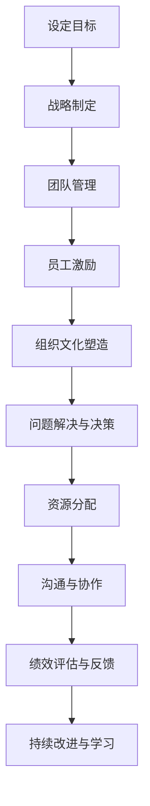

### 1.2 领导力在组织中的作用

领导力在组织中的作用主要体现在以下几个方面：

- **目标设定**：领导者通过明确组织目标和愿景，为团队指明方向。
- **战略制定**：领导者制定战略和计划，确保组织目标的实现。
- **团队管理**：领导者负责管理团队，确保团队成员的协作和效率。
- **员工激励**：领导者通过激励措施激发员工的积极性和创造力。
- **组织文化塑造**：领导者塑造组织文化，影响员工的行为和价值观。
- **问题解决与决策**：领导者解决组织面临的问题，并做出关键决策。
- **资源分配**：领导者合理分配资源，确保组织的有效运营。
- **沟通与协作**：领导者促进团队内部的沟通与协作，提高整体效能。
- **绩效评估与反馈**：领导者评估团队成员的绩效，并提供及时的反馈。

**Mermaid流程图：领导力在组织中的作用**


### 1.3 领导力的发展与提升

领导力并非天生具备，而是可以通过学习和实践不断提升。以下是一些提升领导力的方法和途径：

- **自我反思**：领导者应定期进行自我反思，了解自身的优势和不足。
- **接受培训**：参加领导力培训课程，学习领导技巧和策略。
- **实践与经验**：通过实际工作经验，不断积累和提升领导能力。
- **阅读与学习**：阅读相关书籍和文章，了解领导力的最新理论和实践。
- **角色扮演**：模拟领导情境，锻炼应对挑战和决策能力。
- **寻求反馈**：从同事、下属和导师那里寻求反馈，了解自己的领导风格和影响。

**Mermaid流程图：领导力发展途径**

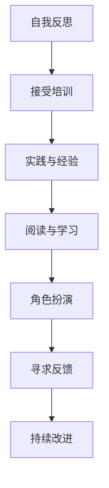

在领导力的发展过程中，领导者需要不断学习、实践和反思，以适应不断变化的环境和挑战。通过这些方法，领导者可以不断提升自己的领导能力，为团队和组织带来更大的价值。

---

**第2章：情商与领导力**

### 2.1 情商的定义与构成

情商（Emotional Intelligence，简称EQ）是指个体识别、理解、管理自己情绪，以及识别、理解、管理他人情绪的能力。情商由心理学家戈尔曼（Daniel Goleman）于1995年提出，主要包括四个核心要素：自我意识、自我管理、社交意识和关系管理。

- **自我意识**：个体能够识别和理解自己的情绪，包括情绪的来源、变化和影响。
- **自我管理**：个体能够控制和调节自己的情绪，以适应不同情境的需求。
- **社交意识**：个体能够识别和理解他人的情绪，包括情绪的表达、反应和需求。
- **关系管理**：个体能够建立和维护积极的人际关系，有效解决冲突。

**Mermaid流程图：情商构成要素**

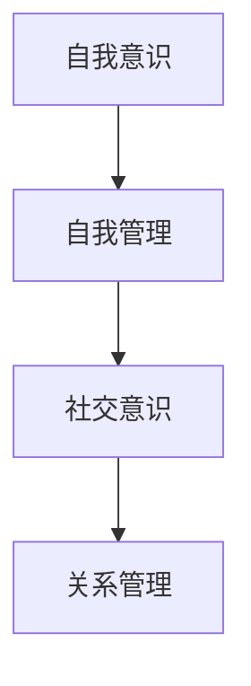

### 2.2 情商对领导力的影响

情商对领导力有着重要的影响。高情商的领导者能够更好地理解自己和他人，从而在以下几个方面提升领导力：

- **沟通能力**：高情商的领导者能够更有效地沟通，包括表达自己的意见、倾听他人的观点和解决冲突。
- **团队协作**：高情商的领导者能够建立和维护积极的人际关系，促进团队协作和合作。
- **决策能力**：高情商的领导者能够更好地处理情绪，从而做出更为理性和明智的决策。
- **激励能力**：高情商的领导者能够理解员工的情感需求，从而更有效地激励和引导员工。
- **应对压力**：高情商的领导者能够更好地管理和调节自己的情绪，从而在压力下保持冷静和专注。

**Mermaid流程图：情商对领导力的影响**

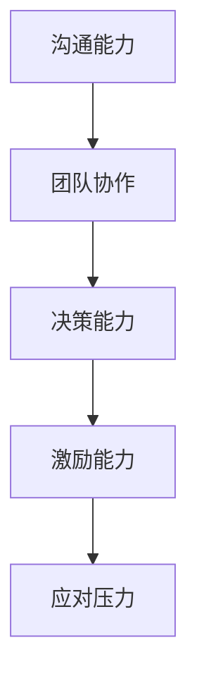

### 2.3 提高情商的方法

提高情商需要不断的学习和实践。以下是一些提高情商的方法：

- **自我反思**：定期进行自我反思，了解自己的情绪和行为，以及它们对他人和自己的影响。
- **情绪调节**：学习情绪调节技巧，如深呼吸、冥想和运动，以帮助自己在面对压力和情绪波动时保持冷静。
- **倾听与反馈**：培养倾听和反馈的能力，学会理解和尊重他人的观点和感受。
- **情感识别**：学习如何识别和理解他人的情绪，包括情绪的表达、反应和需求。
- **情感表达**：学会如何表达自己的情感，包括情绪的来源、变化和影响。
- **情境适应**：学会在不同的情境下适应和调节自己的情绪，以保持高效和积极。

**Mermaid流程图：提高情商的方法**

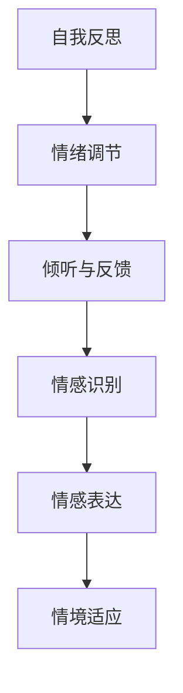

通过这些方法，领导者可以不断提升自己的情商，从而在领导力方面取得更大的成功。情商不仅是领导者个人成长的重要方面，也是组织成功的关键因素。

---

#### 第二部分：领导力核心技能

**第3章：沟通与人际技能**

沟通和人际技能是领导力的核心组成部分，对于领导者来说至关重要。有效的沟通可以确保信息的准确传递，增强团队的凝聚力，提高工作效率；而良好的人际技能则有助于建立和维护积极的人际关系，促进团队合作。

### 3.1 有效沟通的要素

有效沟通需要遵循以下关键要素：

- **明确目标**：在沟通前明确目标，确保信息传递具有目的性。
- **倾听**：倾听是有效沟通的基础，领导者需要倾听他人的观点和需求。
- **清晰表达**：表达要清晰、简洁，避免使用模糊的语言。
- **积极反馈**：给予积极的反馈，鼓励他人表达意见，同时也要接受他人的反馈。
- **适应听众**：根据听众的特点调整沟通方式，确保信息能够被有效接收。
- **非言语沟通**：注意非言语沟通的细节，如肢体语言、面部表情和语调，以增强沟通效果。

**Mermaid流程图：有效沟通要素**

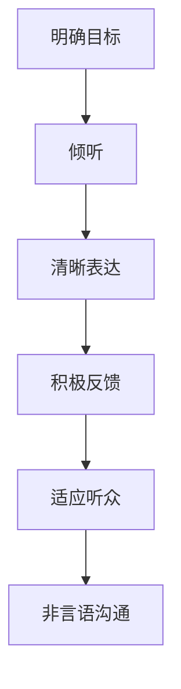

### 3.2 倾听与反馈技巧

倾听和反馈是有效沟通的重要组成部分。以下是一些具体的技巧：

- **主动倾听**：专注于对方的话语，避免分心。可以通过点头、目光接触等方式表示关注。
- **提问与澄清**：通过提问和澄清来确保理解对方的观点，并促进深入的交流。
- **反映情绪**：识别并理解对方的情绪，并尝试以同理心回应。
- **提供反馈**：给予具体的、建设性的反馈，避免批评和指责。
- **积极倾听**：在对方表达观点时，保持开放和接受的态度，避免过早下结论。

**Mermaid流程图：倾听与反馈技巧**

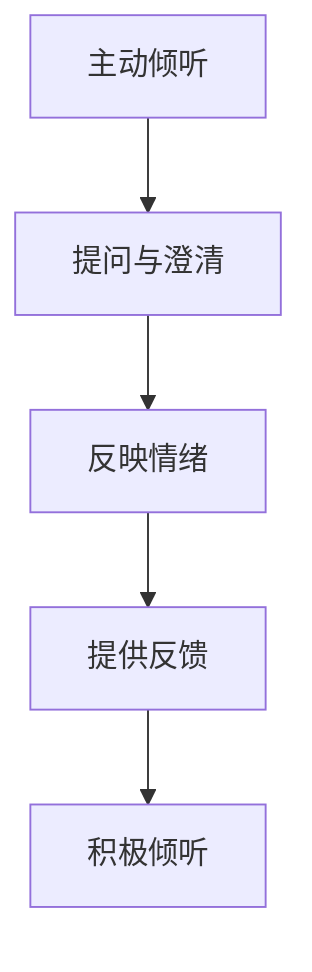

### 3.3 解决冲突的策略

在团队中，冲突是不可避免的。领导者需要掌握解决冲突的策略，以维护团队的和谐与高效。以下是一些解决冲突的方法：

- **理解冲突原因**：了解冲突的根本原因，包括个人、团队和环境因素。
- **保持冷静**：在面对冲突时，保持冷静和理智，避免情绪化的反应。
- **建立共识**：与冲突双方共同寻找解决问题的方案，达成共识。
- **寻求妥协**：在无法达成一致的情况下，寻求妥协，以实现双赢的结果。
- **提供支持**：为冲突双方提供必要的支持和资源，帮助他们解决冲突。
- **沟通与协商**：通过沟通和协商，促进双方的对话和理解，寻找解决问题的途径。

**Mermaid流程图：解决冲突策略**

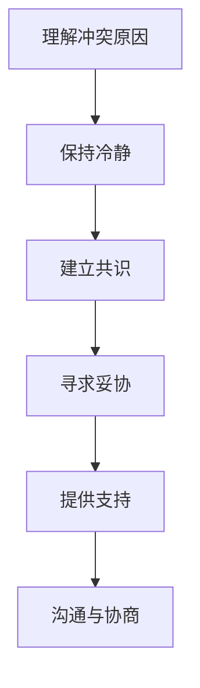

通过掌握这些沟通和人际技能，领导者可以更好地管理团队，提高团队绩效，并在组织中获得更大的影响力。

---

**第4章：激励与团队管理**

激励是领导者的重要职责之一，它直接影响员工的工作动力和团队的整体表现。有效的激励不仅能够提升员工的工作满意度，还能够增强团队的凝聚力和创新能力。

### 4.1 激励理论概述

激励理论是研究人类行为动机的学科，它探讨如何通过外部刺激来影响个体的行为和绩效。以下是一些经典的激励理论：

- **马斯洛需求层次理论**：马斯洛提出，人的需求分为生理、安全、社交、尊重和自我实现五个层次，只有当前一层需求得到满足后，个体才会追求更高层次的需求。
- **赫茨伯格双因素理论**：赫茨伯格提出，工作满意度与激励因素和保健因素相关。激励因素与工作本身相关，能够提升工作满意度；而保健因素与工作环境相关，能够防止工作不满意。
- **期望理论**：弗鲁姆提出，个体的行为动机取决于效价、期望和工具性。个体期望通过某种行为获得特定结果，并且认为这种结果是值得追求的。
- **公平理论**：亚当斯提出，个体会比较自己的付出与回报与他人的付出与回报，以评估自己的公平性。如果感到不公平，个体可能会采取行动以恢复平衡。

**Mermaid流程图：激励理论**

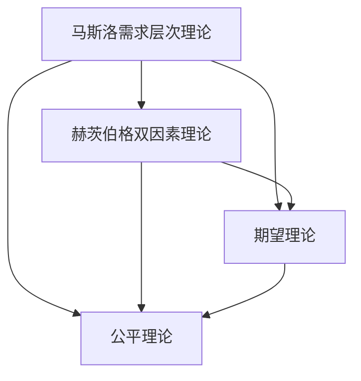

### 4.2 激励策略与实践

以下是一些实用的激励策略和实践方法：

- **目标设定**：设定明确、可衡量、可达成、相关性强、时限性的目标（SMART原则），以激励员工努力实现目标。
- **奖励与认可**：提供奖励和认可，如奖金、晋升、表彰等，以奖励员工的贡献和成就。
- **培训与发展**：提供培训和职业发展机会，帮助员工提升技能和职业素养，增强他们的自我价值感。
- **参与决策**：让员工参与决策过程，让他们感到自己的意见和贡献被重视，增强归属感和参与感。
- **工作设计**：设计有意义、有挑战性的工作，让员工在工作中获得成就感和满足感。
- **反馈与沟通**：提供及时、具体、建设性的反馈，与员工保持良好的沟通，了解他们的需求和期望。

**Mermaid流程图：激励策略**

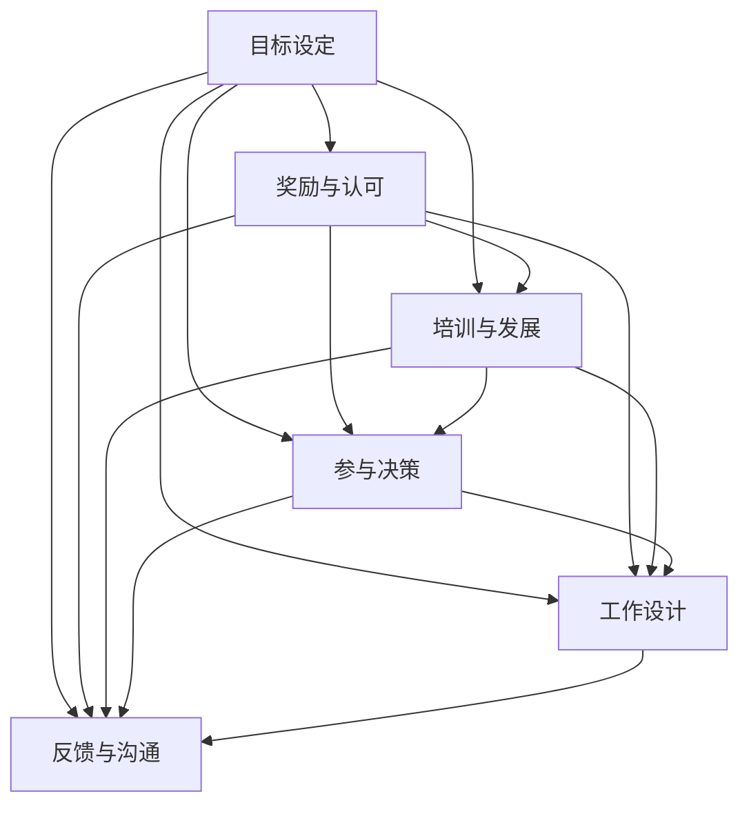

### 4.3 团队管理与协作

团队管理是领导者的重要职责之一，它涉及团队组建、团队发展、团队领导和团队协作等多个方面。以下是一些团队管理的实践方法：

- **明确团队目标**：确保团队成员明确团队的目标和愿景，并理解自己在团队中的作用。
- **建立团队文化**：培养积极向上的团队文化，鼓励团队成员相互尊重、合作和信任。
- **分配角色与责任**：为团队成员分配明确的角色和责任，确保每个成员都知道自己的任务和期望。
- **促进沟通与协作**：建立有效的沟通机制，促进团队成员之间的交流和协作。
- **提供支持与资源**：为团队提供必要的支持和资源，帮助团队成员克服困难，实现目标。
- **监控与反馈**：定期监控团队进展，提供反馈和指导，帮助团队不断改进和成长。

**Mermaid流程图：团队管理实践**

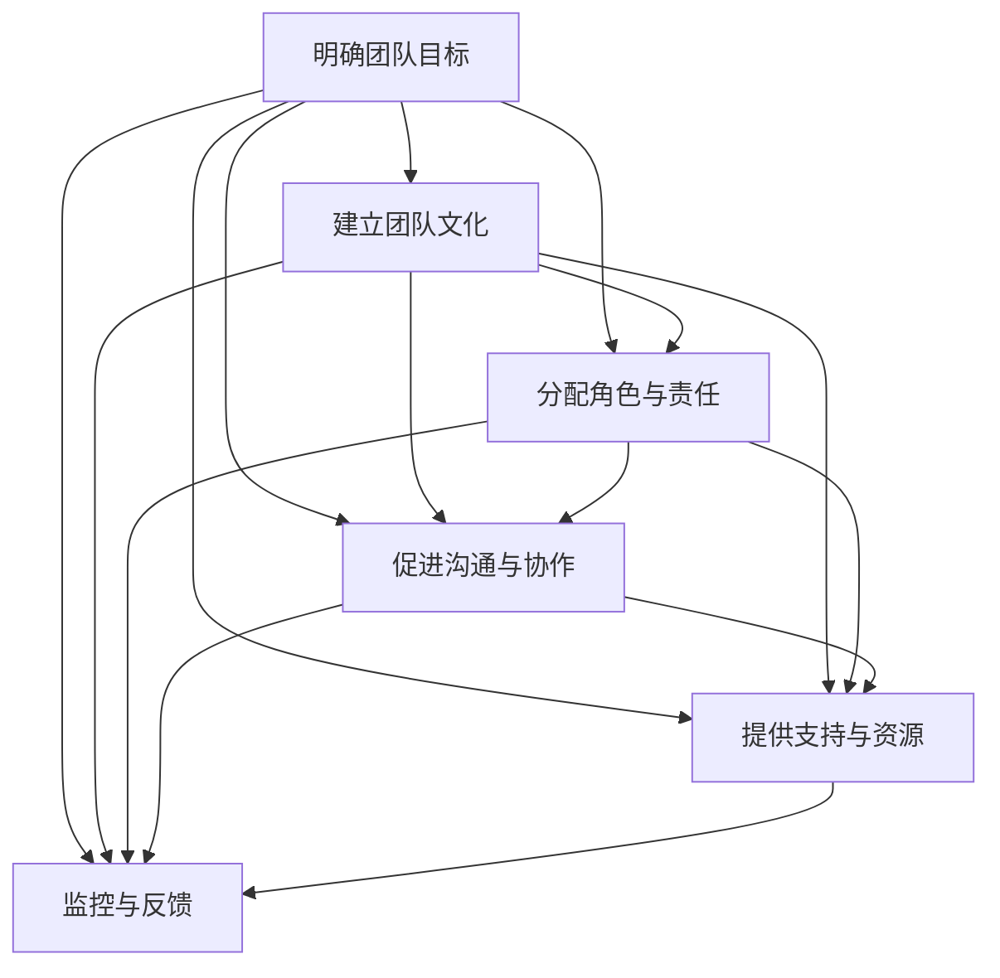

通过有效的激励和团队管理，领导者可以激发员工的工作热情和创新能力，提升团队的整体绩效，从而实现组织的目标。

---

**第5章：决策与问题解决**

决策和问题解决是领导力的核心技能之一，对于组织的成功至关重要。领导者需要具备良好的决策能力，能够在复杂多变的环境中做出明智的决策，并有效解决组织面临的各种问题。

### 5.1 决策过程与类型

决策过程通常包括以下几个步骤：

1. **问题识别**：确定需要解决的问题或机会。
2. **目标设定**：明确决策的目标和期望的结果。
3. **信息收集**：收集与决策相关的各种信息，包括数据、事实、观点等。
4. **方案生成**：基于收集到的信息，生成各种可能的解决方案。
5. **方案评估**：对每个方案进行评估，包括成本、风险、收益等方面。
6. **决策选择**：从评估结果中选择最佳的方案。
7. **实施与监控**：执行决策方案，并对决策效果进行监控和反馈。

决策类型可以分为以下几种：

- **程序性决策**：针对重复出现的、结构化的决策问题，依据既定的规则和程序进行决策。
- **非程序性决策**：针对复杂的、非结构化的决策问题，需要创造性地寻找解决方案。
- **风险性决策**：面临不确定性和风险，需要在多种可能的结果中做出选择。
- **确定性决策**：在明确和可控的环境下进行的决策，结果相对确定。

**Mermaid流程图：决策过程**

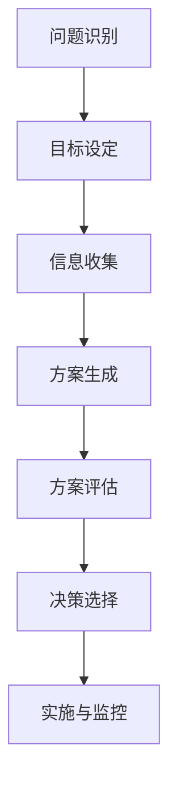

### 5.2 决策支持工具与技术

为了提高决策的质量和效率，领导者可以使用各种决策支持工具和技术。以下是一些常用的工具：

- **SWOT分析**：分析组织的优势、劣势、机会和威胁，帮助领导者识别问题和制定战略。
- **决策矩阵**：将决策的各个因素和权重进行量化，以帮助领导者评估和比较不同方案。
- **成本效益分析**：计算决策的预期成本和收益，以确定是否值得实施。
- **蒙特卡罗模拟**：通过模拟和随机抽样，预测决策的结果和风险。
- **专家系统**：利用专家知识和逻辑推理，辅助领导者做出决策。
- **数据可视化**：使用图表和图形，帮助领导者更好地理解和分析数据。

**Mermaid流程图：决策支持工具**

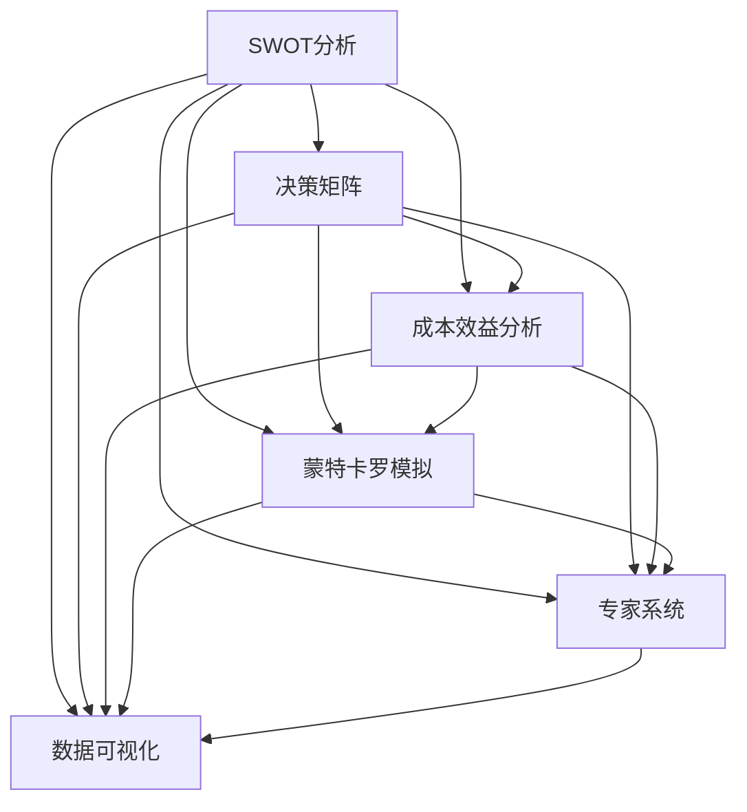

### 5.3 问题解决方法与技巧

在解决问题时，领导者可以使用以下方法和技巧：

- **五问法**：通过连续提问“为什么？”来深入分析问题的根本原因。
- **头脑风暴**：鼓励团队成员自由提出各种可能的解决方案，不加评判。
- **鱼骨图**：将问题分解成各个子问题，分析其根本原因。
- **因果图**：展示问题的各个因素及其相互关系，帮助确定解决问题的方向。
- **模拟与测试**：通过模拟和测试，验证解决方案的有效性。
- **持续改进**：持续监控问题解决的效果，不断改进和优化解决方案。

**Mermaid流程图：问题解决方法**

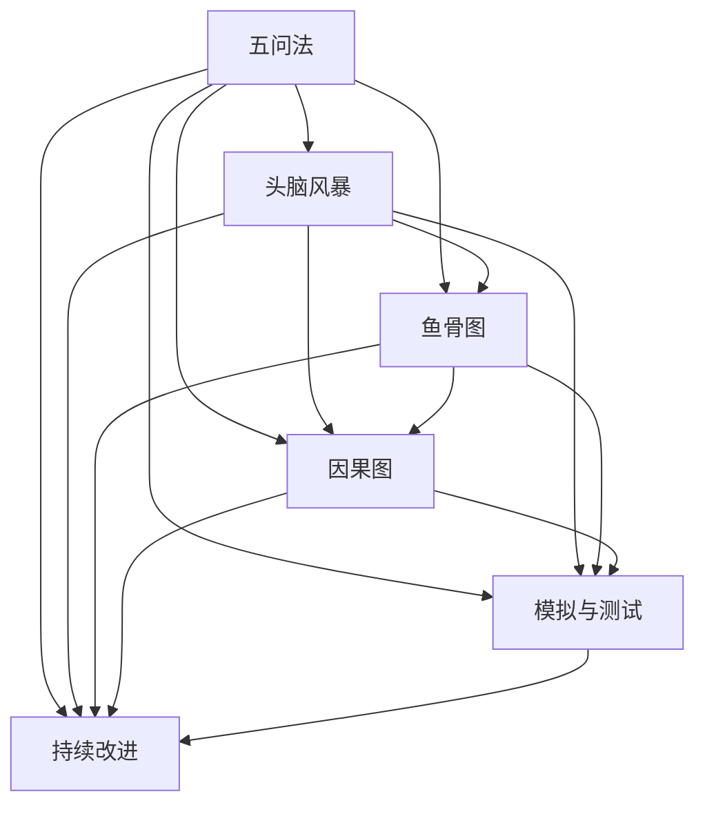

通过掌握这些决策和问题解决的方法与技巧，领导者可以更好地应对各种挑战，推动组织的持续发展和进步。

---

**第6章：领导力发展与自我提升**

领导力的发展是一个持续的过程，领导者需要不断学习和实践，以适应不断变化的环境和挑战。自我提升是实现领导力发展的关键，它包括自我评估、制定发展计划以及培养成功领导者所需的特质。

### 6.1 领导力自我评估

自我评估是领导者了解自身优势和不足的重要步骤。以下是一些自我评估的方法：

- **360度评估**：通过同事、下属和上级的反馈，全面了解自己的领导风格和绩效。
- **自我反思**：定期反思自己的行为和决策，分析自己的优点和改进点。
- **心理测试**：通过心理测试，如Myers-Briggs Type Indicator（MBTI）或DiSC评估，了解自己的性格特点和偏好。
- **反馈与建议**：寻求导师或教练的反馈，获取专业意见和建议。

**Mermaid流程图：领导力自我评估方法**

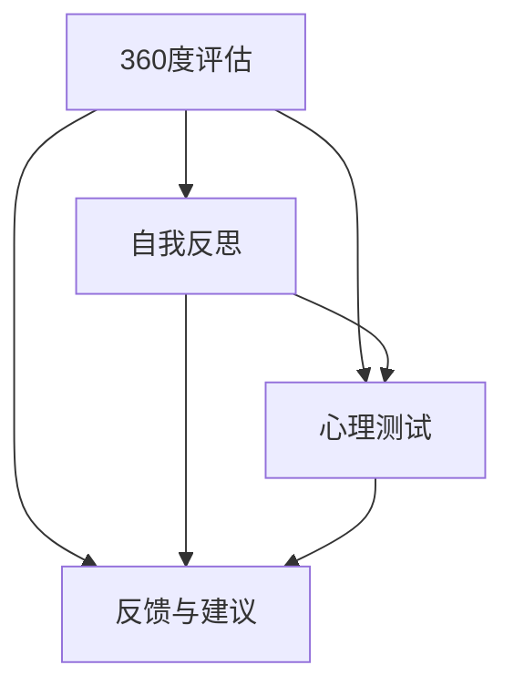

### 6.2 发展领导力计划

制定一个有效的领导力发展计划可以帮助领导者明确自己的目标和发展路径。以下是一些关键步骤：

- **设定目标**：明确自己的长期和短期目标，如提高沟通能力、团队管理技能等。
- **制定策略**：制定实现目标的策略，包括参加培训、阅读书籍、实践项目等。
- **时间规划**：为每个目标设定时间框架，确保能够按时完成。
- **资源分配**：确保有足够的资源，如时间、资金和人力，来实现发展计划。
- **定期回顾**：定期回顾自己的进度，并根据实际情况调整计划。

**Mermaid流程图：领导力发展计划**

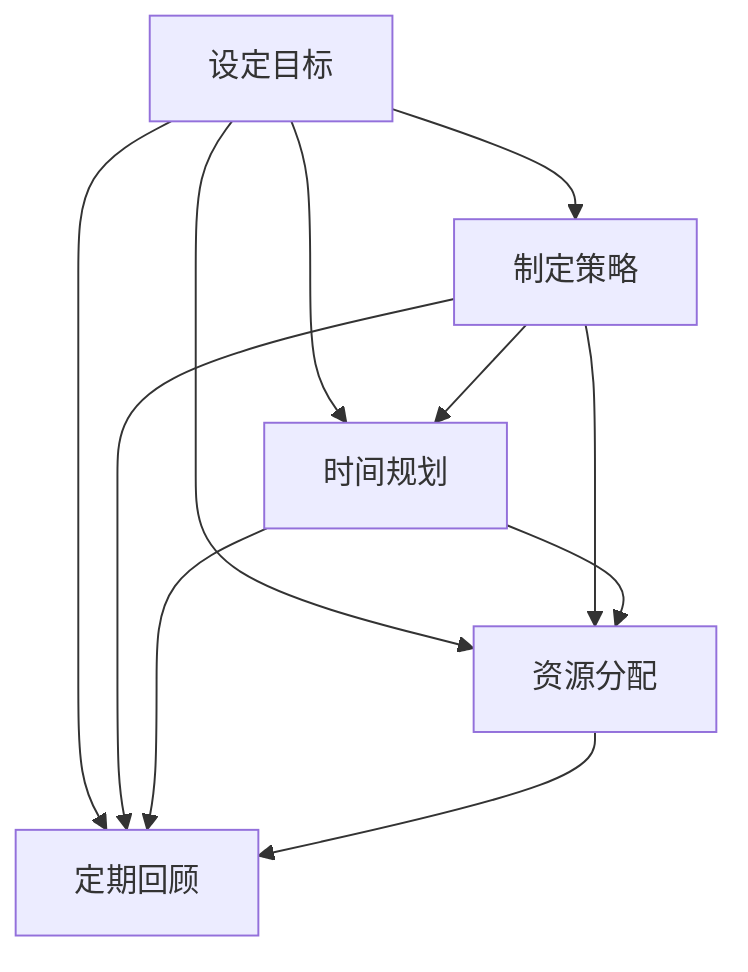

### 6.3 成功领导者的特质

成功领导者通常具备以下特质：

- **自我意识**：了解自己的情绪和行为，并能够自我调节。
- **同理心**：能够理解和感受他人的情感和需求。
- **沟通能力**：能够清晰、有效地表达自己的想法，并倾听他人的观点。
- **决策能力**：能够在复杂和不确定的环境中做出明智的决策。
- **团队管理**：能够激发团队成员的潜力，并建立高效的团队协作。
- **持续学习**：愿意不断学习和适应新的知识和技能。
- **责任感**：对自己的行为和决策承担责任，并为团队和组织的目标努力。

**Mermaid流程图：成功领导者的特质**

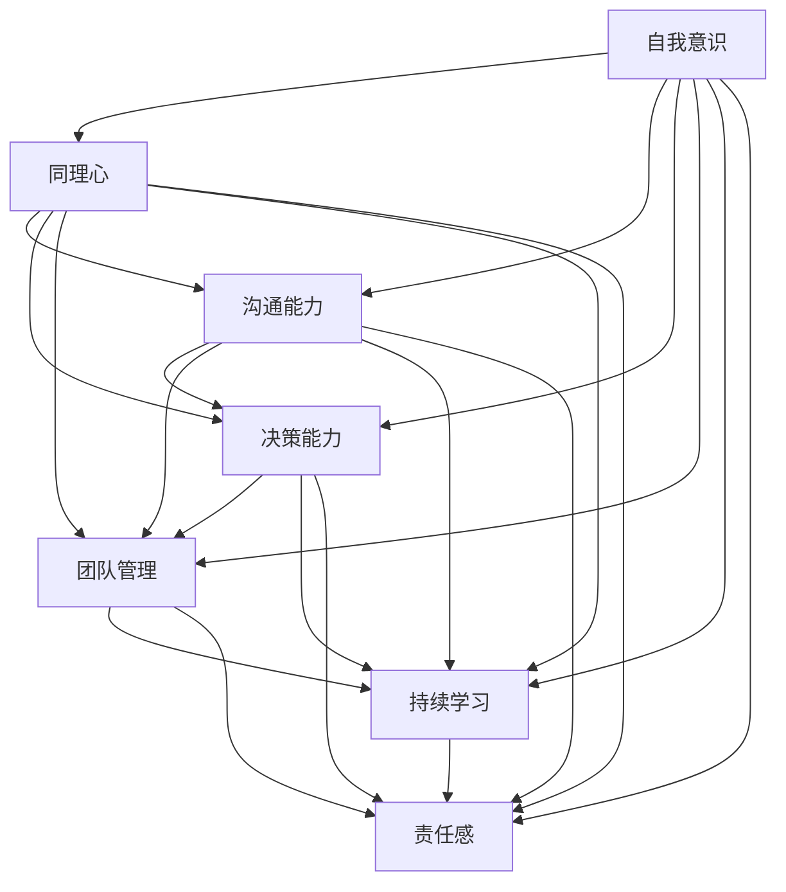

通过自我评估、制定发展计划和培养成功领导者所需的特质，领导者可以不断提升自己的领导能力，为团队和组织创造更大的价值。

---

#### 第三部分：情商管理实践

**第7章：情商在领导力中的应用**

情商在领导力中起着至关重要的作用。高情商的领导者能够更好地理解和管理自己和他人的情绪，从而在沟通、团队合作和问题解决中表现出色。以下将探讨情商在领导力中的应用。

### 7.1 情绪识别与理解

情绪识别与理解是情商的核心要素之一，对领导力有着深远的影响。领导者需要能够准确地识别和理解自己的情绪，以及他人的情绪。

**情绪识别**

领导者可以通过以下方法提高情绪识别能力：

- **自我反思**：定期花时间反思自己的情绪和行为，了解情绪的来源和影响。
- **情绪日记**：记录每天的情绪变化，分析情绪的触发点和影响。
- **情绪反馈**：向信任的同事、朋友或导师寻求反馈，了解自己在他人眼中的情绪表达。

**情绪理解**

领导者可以通过以下方法提高情绪理解能力：

- **同理心**：培养同理心，尝试从他人的角度理解他们的情绪。
- **倾听**：倾听他人的意见和感受，给予他们关注和支持。
- **情感智商评估**：通过专业的情商评估工具，了解自己在情商方面的优势和不足。

**Mermaid流程图：情绪识别与理解方法**

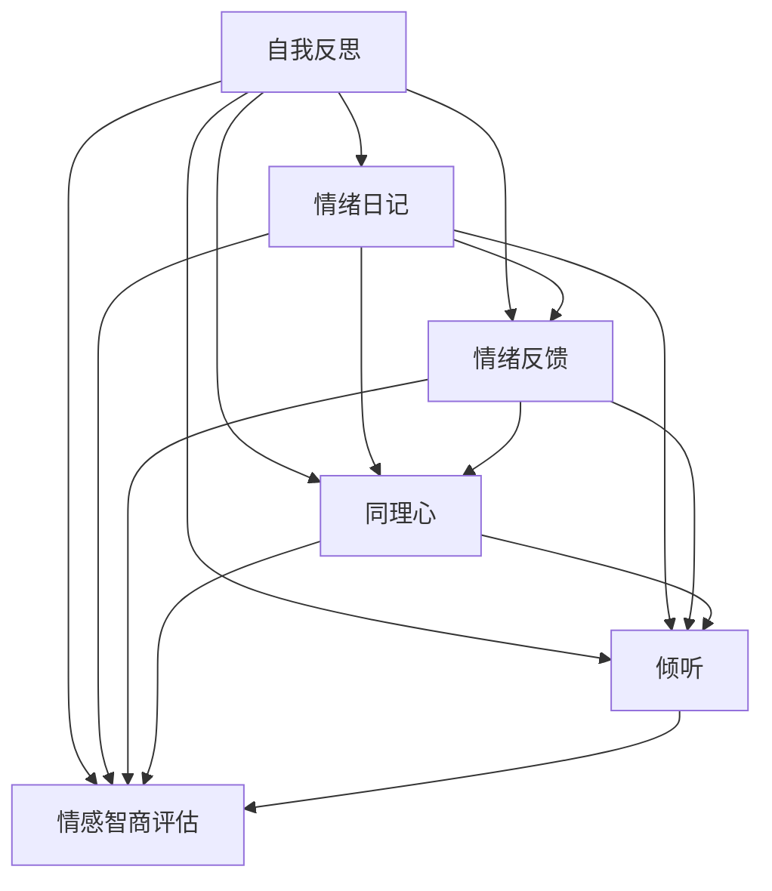

### 7.2 情绪调节与表达

情绪调节与表达是情商的重要组成部分，对于领导者的情绪管理和人际关系有着重要影响。

**情绪调节**

领导者可以通过以下方法提高情绪调节能力：

- **呼吸练习**：通过深呼吸等方法，帮助自己在紧张或压力下保持冷静。
- **冥想**：通过冥想和放松练习，减轻压力和焦虑。
- **运动**：定期进行运动，释放紧张情绪，提高情绪稳定性。

**情绪表达**

领导者可以通过以下方法提高情绪表达能力：

- **正面表达**：学会以积极和建设性的方式表达情绪，避免负面情绪的积累。
- **沟通技巧**：提高沟通技巧，确保情绪表达清晰、恰当。
- **情感管理课程**：参加情感管理课程，学习有效的情绪表达策略。

**Mermaid流程图：情绪调节与表达方法**

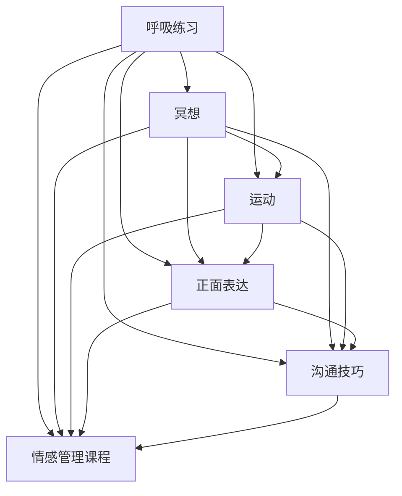

### 7.3 情绪智力在团队管理中的运用

情绪智力在团队管理中有着广泛的应用。高情商的领导者能够更好地理解和应对团队成员的情绪，从而提高团队的协作效率和幸福感。

**团队情绪管理**

领导者可以通过以下方法进行团队情绪管理：

- **建立支持性环境**：营造一个支持性和包容性的团队氛围，让成员感到安全和被尊重。
- **情绪识别**：鼓励团队成员识别和表达自己的情绪，提供支持和理解。
- **情绪调节**：帮助团队成员学会情绪调节技巧，以应对压力和挑战。

**情感智力培训**

领导者可以通过以下方法进行情感智力培训：

- **团队建设活动**：组织团队建设活动，如情绪管理工作坊，提高团队成员的情商。
- **情商评估**：定期进行情商评估，识别团队成员的情商水平，并提供个性化的发展建议。
- **导师辅导**：提供导师辅导，帮助团队成员提升情绪管理能力和领导力。

**Mermaid流程图：情绪智力在团队管理中的应用**

```mermaid
graph TB
    A[建立支持性环境]
    B[团队情绪管理]
    C[情绪识别]
    D[情绪调节]
    E[情感智力培训]
    F[团队建设活动]
    G[情商评估]
    H[导师辅导]
    A --> B
    A --> C
    A --> D
    A --> E
    A --> F
    A --> G
    A --> H
    B --> C
    B --> D
    B --> E
    B --> F
    B --> G
    B --> H
    C --> D
    C --> E
    C --> F
    C --> G
    C --> H
    D --> E
    D --> F
    D --> G
    D --> H
    E --> F
    E --> G
    E --> H
    F --> G
    F --> H
    G --> H
```

通过在团队管理中应用情绪智力，领导者可以创造一个积极、高效的工作环境，提高团队的凝聚力和生产力。

---

**第8章：人际技能提升实战**

人际技能对于领导者的成功至关重要。无论是在个人发展还是团队管理中，良好的人际技能都能帮助领导者更好地理解他人、建立关系并解决问题。以下将探讨如何通过实战提升人际技能。

### 8.1 人际关系管理与维护

建立和维护良好的人际关系是领导者的重要任务。以下是一些实际操作方法：

**建立关系**

- **主动交流**：主动与同事、下属和上级建立联系，通过问候、询问和分享来加深了解。
- **参加社交活动**：参加公司或行业的社交活动，结识新朋友，扩大人脉。
- **展示关心**：在他人遇到困难时，给予关心和支持，展示自己的同理心。

**维护关系**

- **定期沟通**：定期与同事交流，了解他们的工作状况和个人需求。
- **反馈与认可**：给予同事及时的反馈和认可，增强他们对自己的信任和尊重。
- **尊重差异**：尊重每个人的个性和观点，避免偏见和歧视。

**Mermaid流程图：人际关系管理与维护**

```mermaid
graph TB
    A[主动交流]
    B[参加社交活动]
    C[展示关心]
    D[定期沟通]
    E[反馈与认可]
    F[尊重差异]
    A --> B
    A --> C
    A --> D
    A --> E
    A --> F
    B --> C
    B --> D
    B --> E
    B --> F
    C --> D
    C --> E
    C --> F
    D --> E
    D --> F
    E --> F
```

### 8.2 非言语沟通技巧

非言语沟通在人际交流中起着重要作用，有时甚至比言语沟通更为重要。以下是一些提升非言语沟通技巧的方法：

**肢体语言**

- **眼神交流**：保持适度的眼神交流，展示自己的关注和尊重。
- **姿态**：保持开放和自信的姿势，避免过于僵硬或拘谨。
- **手势**：适当地使用手势，增强表达的力度和效果。

**面部表情**

- **微笑**：微笑可以传达友好和积极的情绪，缓解紧张和压力。
- **表情管理**：学会管理自己的面部表情，避免负面情绪的外露。

**声音**

- **语调**：调整语调，使其更加自然和富有变化，避免单调乏味。
- **语速**：控制语速，确保对方能够清楚地理解自己的话语。
- **音量**：根据场合调整音量，确保对方能够听清自己的讲话。

**Mermaid流程图：非言语沟通技巧**

```mermaid
graph TB
    A[眼神交流]
    B[姿态]
    C[手势]
    D[微笑]
    E[表情管理]
    F[语调]
    G[语速]
    H[音量]
    A --> B
    A --> C
    A --> D
    A --> E
    A --> F
    A --> G
    A --> H
    B --> C
    B --> D
    B --> E
    B --> F
    B --> G
    B --> H
    C --> D
    C --> E
    C --> F
    C --> G
    C --> H
    D --> E
    D --> F
    D --> G
    D --> H
    E --> F
    E --> G
    E --> H
    F --> G
    F --> H
    G --> H
```

### 8.3 人际技能提升案例研究

以下是一个实际案例，展示了如何通过人际技能提升来改善团队协作和沟通。

**案例背景**

某公司的项目团队在执行一个关键项目时遇到了沟通不畅和协作不力的困境。团队成员之间存在意见分歧，导致项目进度严重滞后。

**解决方案**

1. **建立沟通机制**：团队领导组织定期会议，确保团队成员能够及时沟通项目进展和问题。通过会议纪要和邮件，记录和传达关键信息。

2. **提升非言语沟通**：团队领导通过培训，提高团队成员的肢体语言、面部表情和声音表达的技巧。鼓励团队成员在会议中保持眼神交流和积极的姿态。

3. **情感管理**：团队领导通过情感管理课程，帮助团队成员学会情绪调节和表达，避免负面情绪的积累和爆发。

4. **关系维护**：团队领导定期与团队成员交流，了解他们的工作状况和个人需求。通过反馈和认可，增强团队成员之间的信任和尊重。

**结果**

通过人际技能提升，团队协作和沟通得到了显著改善。团队成员之间的意见分歧减少，项目进度恢复正常。团队成员的满意度和工作积极性也有所提高。

**Mermaid流程图：人际技能提升案例**

```mermaid
graph TB
    A[建立沟通机制]
    B[提升非言语沟通]
    C[情感管理]
    D[关系维护]
    E[结果改善]
    A --> B
    A --> C
    A --> D
    A --> E
    B --> C
    B --> D
    B --> E
    C --> D
    C --> E
    D --> E
```

通过这个案例，我们可以看到人际技能提升对于团队成功的重要性。通过建立有效的沟通机制、提升非言语沟通技巧、进行情感管理和维护良好的人际关系，领导者可以显著改善团队协作和沟通，推动项目顺利进行。

---

**第9章：情感智力与领导效能**

情感智力（Emotional Intelligence，简称EQ）是领导者成功的关键因素之一。它不仅影响领导者的个人发展，也直接关系到团队绩效和组织的整体效能。本章将探讨情感智力对领导效能的影响，以及如何通过实践提升情感智力。

### 9.1 情感智力对领导效能的影响

情感智力对领导效能的影响是多方面的，以下是一些主要方面：

**沟通能力**

情感智力高的领导者能够更好地理解他人的情感和需求，从而在沟通中表现出更高的情商。他们能够有效地传达信息，倾听他人的观点，并在沟通中避免误解和冲突。

**团队合作**

情感智力高的领导者能够建立积极的团队氛围，促进团队成员之间的协作和信任。他们能够识别和应对团队成员的情感波动，提供支持和鼓励，从而提高团队的凝聚力和工作效率。

**问题解决**

情感智力高的领导者能够更好地处理情绪，保持冷静和理智，从而在问题解决中做出更为明智和全面的决策。他们能够识别问题的根本原因，并采取有效的措施解决。

**员工激励**

情感智力高的领导者能够理解员工的情感需求，提供个性化的激励和认可。他们能够识别员工的优点和潜力，并为他们提供成长和发展的机会，从而提高员工的工作满意度和忠诚度。

**领导效能**

研究表明，高情商的领导者往往在领导效能方面表现更好。他们能够更好地适应环境变化，处理复杂问题，并在不确定和压力下保持高效的领导能力。

**Mermaid流程图：情感智力对领导效能的影响**

```mermaid
graph TB
    A[沟通能力] --> B[团队合作]
    B --> C[问题解决]
    C --> D[员工激励]
    D --> E[领导效能]
    A --> B
    A --> C
    A --> D
    A --> E
    B --> C
    B --> D
    B --> E
    C --> D
    C --> E
    D --> E
```

### 9.2 提升情感智力的实践方法

提升情感智力需要持续的学习和实践。以下是一些有效的实践方法：

**自我反思**

自我反思是提升情感智力的第一步。领导者需要定期花时间思考自己的情绪和行为，了解它们对他人和自己产生的影响。通过记录情绪日记和反思，领导者可以更好地识别和管理自己的情绪。

**情绪调节技巧**

领导者需要掌握情绪调节技巧，以帮助自己在面对压力和情绪波动时保持冷静和理智。一些有效的情绪调节技巧包括深呼吸、冥想、运动和放松练习。

**同理心训练**

同理心是情感智力的重要组成部分。领导者可以通过阅读、培训和实践，提高自己的同理心能力。通过倾听他人的意见和感受，领导者可以更好地理解他人的需求和情感。

**反馈与接受反馈**

领导者需要学会接受和给予反馈。通过反馈，领导者可以了解自己的情绪表达和行为对他人产生的影响，并据此调整自己的行为。同时，领导者也应该鼓励团队成员提供反馈，以促进团队内的开放和透明。

**情感智力培训**

参加专业的情感智力培训课程，可以帮助领导者系统地学习和提升情感智力。这些课程通常包括情绪管理、同理心训练、沟通技巧和领导力发展等方面的内容。

**Mermaid流程图：提升情感智力的实践方法**

```mermaid
graph TB
    A[自我反思]
    B[情绪调节技巧]
    C[同理心训练]
    D[反馈与接受反馈]
    E[情感智力培训]
    A --> B
    A --> C
    A --> D
    A --> E
    B --> C
    B --> D
    B --> E
    C --> D
    C --> E
    D --> E
```

### 9.3 情感智力培养与领导力的可持续发展

情感智力的培养是领导力可持续发展的重要基石。通过不断提升情感智力，领导者可以更好地适应环境变化，应对挑战，并在不确定性中保持高效和稳定的领导能力。

**情感智力与领导力的关系**

情感智力与领导力密切相关。高情商的领导者能够在复杂和不确定的环境中，更好地理解和应对他人的情感需求，从而建立信任、促进协作，并有效解决团队面临的问题。

**情感智力培养的重要性**

情感智力培养对于领导力的可持续发展具有重要意义。通过培养情感智力，领导者可以：

- 提高自身的情绪管理和调节能力，保持冷静和理智。
- 增强同理心，提高人际沟通和团队协作能力。
- 提升领导效能，实现个人和组织的长期发展。

**情感智力培养的方法**

为了实现领导力的可持续发展，领导者可以通过以下方法培养情感智力：

- **持续学习**：不断学习新的知识和技能，了解情感智力的重要性和培养方法。
- **实践应用**：将情感智力应用到日常工作和生活中，通过实践不断提高。
- **自我反思**：定期进行自我反思，识别自己的情绪和行为，并寻求改进。
- **专业培训**：参加专业的情感智力培训课程，系统学习和提升。

**Mermaid流程图：情感智力培养与领导力的可持续发展**

```mermaid
graph TB
    A[情感智力培养]
    B[领导力的可持续发展]
    C[情绪管理]
    D[同理心]
    E[领导效能]
    F[团队协作]
    A --> B
    A --> C
    A --> D
    A --> E
    A --> F
    B --> C
    B --> D
    B --> E
    B --> F
    C --> D
    C --> E
    C --> F
    D --> E
    D --> F
    E --> F
```

通过不断培养和提升情感智力，领导者可以实现个人和组织的可持续发展，为团队和组织创造更大的价值。

---

**第10章：领导力与情商管理经典案例**

领导力与情商管理的实践在许多成功的组织和个人中得到了充分体现。以下是一些经典的案例，通过这些案例，我们可以看到领导力与情商管理如何在实际中发挥作用。

### 10.1 案例一：乔布斯的领导力艺术

史蒂夫·乔布斯（Steve Jobs）是苹果公司的创始人之一，他的领导力风格和情商管理为业界树立了典范。

**领导力风格**

乔布斯的领导力风格具有以下特点：

- **愿景导向**：乔布斯具有强烈的愿景，他能够清晰地描绘出苹果的未来，并激励团队成员为之奋斗。
- **创新驱动**：乔布斯强调创新，鼓励团队挑战现状，不断推出革命性的产品。
- **细节关注**：他对产品的每一个细节都非常关注，确保产品完美无瑕。
- **激励激励**：乔布斯通过激励和奖励，激发团队成员的创造力和积极性。

**情商管理**

乔布斯在情商管理方面也表现出色：

- **同理心**：尽管他有时表现出强烈的个性，但乔布斯能够理解他人的情感和需求，并与团队成员建立深厚的信任关系。
- **情绪管理**：他能够控制自己的情绪，即使在面对压力和挑战时，也能保持冷静和理智。
- **沟通技巧**：乔布斯擅长通过演讲和沟通，传达自己的想法和愿景，激励团队成员。

**结果**

乔布斯的领导力和情商管理使得苹果公司在他的领导下取得了巨大的成功。苹果推出了多款革命性的产品，如iPod、iPhone和iPad，改变了整个行业。乔布斯的领导风格和情商管理也为苹果公司创造了一个积极、创新和高效的工作环境。

### 10.2 案例二：谷歌的情商管理实践

谷歌（Google）以其独特的公司文化和高效的管理实践而闻名，其中情商管理发挥了重要作用。

**情商管理实践**

谷歌在情商管理方面采取了以下实践：

- **团队建设**：谷歌注重团队建设，通过定期的团队活动和培训，增强团队成员之间的信任和协作。
- **透明沟通**：谷歌鼓励开放和透明的沟通，确保团队成员能够自由表达自己的观点和需求。
- **员工关怀**：谷歌关心员工的个人发展和福利，提供各种福利和支持，如弹性工作时间、员工辅导和心理咨询服务。

**结果**

谷歌的情商管理实践为其带来了显著的成功。公司拥有一个充满活力和创新精神的团队，员工满意度高，流失率低。谷歌在技术领域的创新不断，推出了一系列革命性的产品和服务，如Google搜索、Gmail和Google Maps，成为全球最具价值的科技公司之一。

### 10.3 案例三：企业文化与领导力的关系

华为是一家全球领先的科技公司，其成功离不开其独特的文化理念和领导力实践。

**企业文化**

华为的企业文化强调以下价值观：

- **客户至上**：始终以客户需求为导向，提供优质的产品和服务。
- **奋斗者文化**：鼓励员工持续奋斗，追求卓越和成长。
- **公平竞争**：在内部和外部都坚持公平竞争的原则。
- **开放合作**：与各方合作伙伴建立开放、合作的关系，共同推进技术创新。

**领导力实践**

华为在领导力实践方面采取了以下措施：

- **选拔与培养**：通过选拔和培养，确保领导团队具备卓越的领导能力和情商。
- **绩效导向**：以绩效为导向，激励员工追求卓越，提升团队整体绩效。
- **文化传承**：通过培训和活动，传承华为的文化和价值观，确保企业文化的延续。

**结果**

华为的企业文化和领导力实践为其带来了持续的成功。公司在全球范围内建立了强大的业务网络，技术创新不断，市场份额持续扩大。华为不仅在技术上取得了卓越成就，也在企业文化建设方面树立了典范，成为全球企业学习的对象。

这些经典案例展示了领导力与情商管理在实际应用中的巨大价值。通过借鉴这些成功经验，领导者可以在自己的组织中实现更高的绩效和可持续发展。

---

**第11章：领导力与情商管理在特殊情境下的应用**

在当今复杂多变的环境中，领导者需要具备灵活的领导力和情商管理能力，以应对各种特殊情境。以下将探讨领导力与情商管理在应对危机、远程工作环境和跨国团队管理中的挑战。

### 11.1 应对危机与不确定性

在危机和不确定性面前，领导者需要展现出强大的领导力和情商管理能力，以保持团队的稳定和高效。

**领导力策略**

1. **建立清晰的沟通机制**：确保信息的及时传递，减少误解和恐慌。
2. **明确目标与优先级**：在危机中，领导者需要明确团队的目标和优先级，确保资源合理分配。
3. **激发团队潜力**：鼓励团队成员发挥自己的优势，共同应对危机。
4. **保持乐观态度**：领导者需要保持乐观，以激励团队克服困难。

**情商管理策略**

1. **情绪调节**：领导者需要学会情绪调节，避免负面情绪对团队的影响。
2. **同理心**：领导者需要理解团队成员的情感需求，提供支持和鼓励。
3. **积极沟通**：通过积极的沟通，缓解团队成员的紧张情绪，增强团队的凝聚力。

**Mermaid流程图：应对危机与不确定性**

```mermaid
graph TB
    A[建立清晰的沟通机制]
    B[明确目标与优先级]
    C[激发团队潜力]
    D[保持乐观态度]
    E[情绪调节]
    F[同理心]
    G[积极沟通]
    A --> B
    A --> C
    A --> D
    A --> E
    A --> F
    A --> G
    B --> C
    B --> D
    B --> E
    B --> F
    B --> G
    C --> D
    C --> E
    C --> F
    C --> G
    D --> E
    D --> F
    D --> G
    E --> F
    E --> G
    F --> G
```

### 11.2 领导力在远程工作环境中的应用

随着远程工作的普及，领导者需要适应新的工作模式，发挥领导力在远程工作环境中的优势。

**领导力策略**

1. **建立远程工作规范**：明确远程工作的流程、目标和期望，确保团队成员了解自己的职责。
2. **加强沟通与协作**：利用在线工具，如视频会议、即时通讯和协作平台，保持团队的紧密联系。
3. **关注团队成员**：了解远程团队成员的工作状况和需求，提供必要的支持和资源。
4. **激励与认可**：通过在线表彰和奖励，激励远程团队成员保持高效和积极。

**情商管理策略**

1. **情感支持**：领导者需要提供情感支持，缓解远程团队成员的孤独感和压力。
2. **信任建设**：建立信任，确保团队成员能够自主工作和协作。
3. **灵活性**：领导者需要灵活调整工作安排，适应远程团队成员的不同需求和情况。

**Mermaid流程图：领导力在远程工作环境中的应用**

```mermaid
graph TB
    A[建立远程工作规范]
    B[加强沟通与协作]
    C[关注团队成员]
    D[激励与认可]
    E[情感支持]
    F[信任建设]
    G[灵活性]
    A --> B
    A --> C
    A --> D
    A --> E
    A --> F
    A --> G
    B --> C
    B --> D
    B --> E
    B --> F
    B --> G
    C --> D
    C --> E
    C --> F
    C --> G
    D --> E
    D --> F
    D --> G
    E --> F
    E --> G
    F --> G
```

### 11.3 领导力与情商在跨国团队管理中的挑战

跨国团队管理面临文化差异、时区差异和沟通障碍等挑战，领导者需要具备更高的领导力和情商管理能力。

**领导力策略**

1. **文化敏感性**：领导者需要了解和尊重不同文化的价值观和行为习惯。
2. **跨文化沟通**：领导者需要掌握跨文化沟通技巧，确保信息的准确传递。
3. **团队合作**：鼓励跨国团队成员建立信任和合作关系，共同实现目标。
4. **本地化管理**：领导者需要根据当地的文化和需求，调整管理策略。

**情商管理策略**

1. **同理心**：领导者需要具备同理心，理解跨国团队成员的情感需求和压力。
2. **情绪调节**：领导者需要学会情绪调节，避免文化差异导致的冲突和误解。
3. **支持与关怀**：领导者需要提供情感支持，帮助跨国团队成员适应新环境和挑战。

**Mermaid流程图：领导力与情商在跨国团队管理中的挑战**

```mermaid
graph TB
    A[文化敏感性]
    B[跨文化沟通]
    C[团队合作]
    D[本地化管理]
    E[同理心]
    F[情绪调节]
    G[支持与关怀]
    A --> B
    A --> C
    A --> D
    A --> E
    A --> F
    A --> G
    B --> C
    B --> D
    B --> E
    B --> F
    B --> G
    C --> D
    C --> E
    C --> F
    C --> G
    D --> E
    D --> F
    D --> G
    E --> F
    E --> G
    F --> G
```

通过灵活运用领导力与情商管理策略，领导者可以克服特殊情境下的挑战，推动跨国团队的协作和成功。

---

**第12章：未来领导力与情商管理趋势**

随着全球化和技术的快速发展，领导力与情商管理也在不断演变。未来，领导者需要具备适应新趋势的能力，以应对不断变化的商业环境和复杂的人际关系。

### 12.1 领导力与情商的未来发展趋势

**趋势一：数字化领导力**

数字技术的飞速发展使得领导力进入了一个全新的时代。未来的领导者需要具备数字化思维，能够利用大数据、人工智能等技术工具，提高决策效率和团队协作能力。

**趋势二：全球化领导力**

全球化进程使得领导者需要具备跨文化沟通和管理能力。理解不同文化背景下的行为和价值观，能够促进跨国团队的协作和创新能力。

**趋势三：可持续领导力**

随着环保和社会责任的日益重视，领导者需要具备可持续发展的意识，推动组织在经济效益、社会效益和环境效益之间实现平衡。

**趋势四：敏捷领导力**

在快速变化的市场环境中，领导者需要具备敏捷性，能够快速适应变化，灵活调整战略和决策，保持组织的竞争力。

**Mermaid流程图：未来领导力发展趋势**

```mermaid
graph TB
    A[数字化领导力]
    B[全球化领导力]
    C[可持续领导力]
    D[敏捷领导力]
    A --> B
    A --> C
    A --> D
    B --> C
    B --> D
    C --> D
```

### 12.2 新兴技术与领导力变革

**人工智能（AI）**：人工智能技术在领导力中的应用越来越广泛，如通过数据分析帮助领导者做出更明智的决策，通过机器学习算法优化团队协作流程。

**区块链**：区块链技术为领导力带来了透明度和可追溯性，有助于建立信任和减少腐败。

**虚拟现实（VR）和增强现实（AR）**：VR和AR技术为领导者提供了沉浸式的培训和管理体验，提高了领导力的培养效果。

**趋势图：新兴技术与领导力变革**

```mermaid
graph TB
    A[人工智能]
    B[区块链]
    C[虚拟现实]
    D[增强现实]
    A --> B
    A --> C
    A --> D
    B --> C
    B --> D
    C --> D
```

### 12.3 领导力与情商教育的重要性

**领导力教育**：领导力教育是培养未来领导者的重要途径。通过系统化的培训和实践，领导者可以提升领导技能和情商管理能力。

**情商教育**：情商教育对于个体和组织的发展至关重要。通过情感智力培训，个体可以更好地理解和管理自己的情绪，提高人际交往和团队协作能力。

**教育策略**

1. **终身学习**：领导者应该具备终身学习的意识，不断更新知识和技能。
2. **实践导向**：通过实际项目和实践，提升领导力和情商管理能力。
3. **多元化学习**：通过阅读、培训、网络课程等多种方式，获取领导力和情商管理的知识。

**Mermaid流程图：领导力与情商教育策略**

```mermaid
graph TB
    A[终身学习]
    B[实践导向]
    C[多元化学习]
    A --> B
    A --> C
    B --> C
```

通过关注未来领导力与情商管理的发展趋势，利用新兴技术，以及重视领导力与情商教育，领导者可以更好地应对未来的挑战，实现个人和组织的持续成功。

---

**附录A：领导力与情商管理资源推荐**

为了帮助读者进一步学习和提升领导力与情商管理能力，以下是一些推荐的资源。

### A.1 书籍推荐

1. **《情商：为什么情商比智商更重要》（Emotional Intelligence）** - 丹尼尔·戈尔曼（Daniel Goleman）
2. **《领导力》（Leadership）** - 詹姆斯·库泽斯（James M. Kouzes）和巴里·波斯纳（Barry Z. Posner）
3. **《影响力：说服的心理学》（Influencing People）** - 罗伯特·西奥迪尼（Robert B. Cialdini）
4. **《非暴力沟通》（Nonviolent Communication）** - 马歇尔·卢森堡（Marshall B. Rosenberg）
5. **《领导者的突破》（The Leadership Challenge）** - 詹姆斯·库泽斯和巴里·波斯纳

### A.2 网络资源

1. **哈佛商业评论（Harvard Business Review）** - 提供关于领导力与管理的最新研究论文和案例分析。
2. **LinkedIn Learning** - 提供丰富的领导力与情商管理课程，涵盖从基础到高级的不同层次。
3. **Coursera** - 提供由顶尖大学和行业专家开设的在线课程，涉及领导力、沟通、团队管理等各个方面。

### A.3 培训课程

1. **国际领导力协会（International Leadership Association，ILA）** - 提供多种领导力培训课程，涵盖基础、中级和高级课程。
2. **情商学院（Emotional Intelligence 2.0）** - 提供在线情商培训课程，帮助个人和组织提升情商能力。
3. **领导力发展中心（Center for Leadership Development）** - 提供定制化的领导力培训方案，针对不同行业和领域。

这些资源将为读者提供丰富的学习材料和实用的工具，帮助他们在领导力与情商管理方面取得更大的进步。

---

**附录B：领导力与情商管理工具与量表**

在领导力与情商管理实践中，使用适当的工具和量表可以帮助个体和组织更好地评估和提升相关能力。以下是一些常用的工具和量表。

### B.1 领导力评估工具

1. **360度反馈**：通过收集来自同事、下属和上级的反馈，全面评估领导者的领导能力。
2. **MBTI（Myers-Briggs Type Indicator）**：一种心理测试工具，用于了解个人的性格类型，帮助领导者更好地理解和沟通。
3. **LEADERSHIP E-PROFILE**：一个基于互联网的领导力评估工具，提供个性化的领导力反馈和发展建议。

### B.2 情商评估工具

1. **情商问卷（Emotional Intelligence Questionnaire）**：一种常用的情商评估工具，包括自我报告和观察评价。
2. **自我意识量表（Self- Awareness Scale）**：评估个体对自己情绪和行为的认知能力。
3. **情绪调节量表（Emotional Regulation Scale）**：评估个体调节和管理自己情绪的能力。

### B.3 提升领导力和情商的实用工具

1. **情绪管理应用程序**：如Headspace、Calm等，提供冥想和放松练习，帮助个体提高情绪调节能力。
2. **沟通培训课程**：通过角色扮演和模拟对话，提高沟通技巧和情商。
3. **团队建设工具**：如EngageSmart、TeamBonding等，提供在线活动和游戏，增强团队协作和信任。

使用这些工具和量表，个体和组织可以更科学地评估和提升领导力和情商能力，从而实现更好的绩效和发展。

---

**第13章：领导力与情商管理总结**

通过本书的探讨，我们深入了解了领导力与情商管理的重要性以及它们在组织和个人发展中的作用。以下是对整体框架的回顾、实践要点总结以及对未来领导力与情商管理趋势的展望。

### 13.1 整体框架回顾

本书从领导力的定义与角色、情商与领导力之间的关系、领导力的核心技能、情商管理实践、经典案例研究、特殊情境下的应用以及未来趋势等方面，构建了一个全面的领导力与情商管理框架。

- **领导力概述**：介绍了领导力的定义、角色和在组织中的作用，以及领导力的发展与提升。
- **情商与领导力**：探讨了情商的定义、构成要素以及情商对领导力的影响。
- **领导力核心技能**：详细分析了沟通与人际技能、激励与团队管理、决策与问题解决等核心技能。
- **情商管理实践**：介绍了情绪识别与理解、情绪调节与表达以及情感智力在团队管理中的应用。
- **案例研究**：通过经典案例展示了领导力与情商管理的实际应用。
- **特殊情境下的应用**：探讨了领导力与情商管理在应对危机、远程工作环境和跨国团队管理中的挑战。
- **未来趋势**：分析了数字化领导力、全球化领导力、可持续领导力和敏捷领导力等未来趋势。

### 13.2 实践要点总结

为了在实践中有效运用领导力与情商管理，以下是一些关键要点：

- **自我反思与持续学习**：领导者需要定期进行自我反思，识别自己的优势和不足，并通过持续学习提升自己的能力。
- **沟通与人际技能**：领导者需要具备良好的沟通技巧和人际技能，确保信息的准确传递和团队的协作效率。
- **情商管理**：领导者需要理解和管理自己的情绪，以及他人的情绪，通过情绪识别、调节和表达，提升情商。
- **激励与团队管理**：领导者需要通过设定明确的目标、提供激励措施和有效的团队管理，激发员工的工作热情和创造力。
- **决策与问题解决**：领导者需要掌握决策过程与类型，运用决策支持工具和技术，以及有效的问题解决方法。
- **适应特殊情境**：领导者需要具备应对危机、远程工作环境和跨国团队管理的灵活性和适应性。

### 13.3 领导力与情商管理的未来展望

随着全球化和技术的快速发展，领导力与情商管理也在不断演变。以下是对未来领导力与情商管理趋势的展望：

- **数字化领导力**：随着人工智能、大数据等技术的发展，领导者需要具备数字化思维和技能，利用技术工具提高决策效率和团队协作能力。
- **全球化领导力**：全球化进程使得领导者需要具备跨文化沟通和管理能力，理解不同文化背景下的行为和价值观。
- **可持续领导力**：领导者需要具备可持续发展的意识，推动组织在经济效益、社会效益和环境效益之间实现平衡。
- **敏捷领导力**：在快速变化的市场环境中，领导者需要具备敏捷性，能够快速适应变化，灵活调整战略和决策。

未来的领导力与情商管理将更加注重个性化和定制化，领导者需要不断适应新的趋势和环境，提升自己的领导力和情商能力，以实现个人和组织的持续成功。

---

通过本书的深入探讨，我们希望能够帮助读者全面理解领导力与情商管理的重要性，掌握相关技能和策略，并在实际工作中有效运用。随着环境的变化和发展，领导者需要不断学习和进步，以应对未来的挑战。愿每一位领导者都能在领导力与情商管理的道路上不断前行，为组织和个人创造更大的价值。**作者：AI天才研究院/AI Genius Institute & 禅与计算机程序设计艺术 /Zen And The Art of Computer Programming**

