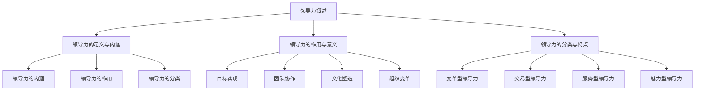

                 

# 领导力与情感智慧：理解人性的艺术

## 关键词
- 领导力
- 情感智慧
- 人性理解
- 团队协作
- 领导风格
- 领导发展

## 摘要
本文探讨了领导力与情感智慧之间的关系，强调了理解人性的艺术在领导实践中的重要性。文章从领导力理论框架入手，分析了领导力的定义、核心要素、领导风格以及领导力发展模型。接着，深入探讨了情感智慧在领导力中的具体应用，包括情感沟通、人际关系处理以及领导决策。最后，文章提出了人性理解对领导力提升的关键作用，并提供了领导力与情感智慧评估工具及实际案例研究，以供读者参考。

### 第一部分：领导力理论框架

#### 第1章：领导力概述

##### 1.1 领导力的定义与内涵

领导力是一种能力，它不仅仅是指导和影响他人实现目标的过程，更是一种激发潜能、推动变革和塑造组织文化的能力。领导力不仅关乎个人魅力和智慧，更涉及情感智慧、人际关系处理以及自我认知。

领导力的内涵可以从以下几个方面进行理解：

1. **目标导向**：领导力需要明确的目标和愿景，并能够激发团队成员共同追求这些目标。
2. **影响力**：领导力是一种影响力，通过言行影响他人，使团队朝着共同的目标前进。
3. **变革推动者**：领导者需要具备变革推动者的特质，能够引领团队适应外部环境的变化。
4. **情感智慧**：领导力离不开情感智慧，领导者需要理解和处理自己的情感，同时能够理解并处理他人的情感。

##### 1.2 领导力的作用与意义

领导力在组织中的重要性不可忽视。它不仅能够推动组织目标的实现，还能够提升组织的整体效能。

1. **目标实现**：领导力能够明确组织的目标，并通过激励和引导团队成员实现这些目标。
2. **团队协作**：领导力能够促进团队成员之间的协作，提高团队的整体效能。
3. **文化塑造**：领导力在塑造组织文化方面发挥着关键作用，能够引导组织朝着积极向上的方向发展。
4. **组织变革**：领导力能够推动组织的变革，使组织能够适应不断变化的环境。

##### 1.3 领导力的分类与特点

领导力可以根据不同的维度进行分类。以下是一些常见的领导力分类及其特点：

1. **变革型领导力**：变革型领导者关注创新和变革，能够激发团队成员的潜力，推动组织实现重大变革。
2. **交易型领导力**：交易型领导者注重建立明确的规章制度，通过奖励和惩罚来激励团队成员。
3. **服务型领导力**：服务型领导者将团队成员的需求放在首位，致力于为团队成员提供支持和服务。
4. **魅力型领导力**：魅力型领导者具有强大的个人魅力和影响力，能够激发团队成员的热情和动力。

#### 第2章：领导力核心要素

##### 2.1 情感智慧的重要性

情感智慧是领导力的核心要素之一。它不仅关乎领导者的个人素养，更关乎领导者能否有效地处理人际关系和领导团队。

1. **自我意识**：领导者需要具备良好的自我意识，能够了解自己的情感和行为，并能够进行自我调节。
2. **同理心**：领导者需要具备同理心，能够理解并感同身受他人的情感和需求。
3. **情绪管理**：领导者需要能够有效地管理自己的情绪，保持冷静和理智，以应对各种挑战。

##### 2.2 自我意识与自我管理

自我意识是情感智慧的基础。领导者需要具备自我意识，能够了解自己的情感和行为，并能够进行自我调节。

1. **自我认知**：领导者需要具备良好的自我认知，能够了解自己的优点和缺点，并能够进行自我反思。
2. **自我调节**：领导者需要能够自我调节，在面对挑战和压力时保持冷静和理智。
3. **自我激励**：领导者需要能够自我激励，在面对困难和挫折时保持积极的态度和动力。

##### 2.3 人际关系与团队协作

人际关系和团队协作是领导力的重要组成部分。领导者需要具备良好的人际关系处理能力和团队协作能力。

1. **沟通能力**：领导者需要具备良好的沟通能力，能够清晰、准确地表达自己的想法，并能够倾听和理解他人的意见。
2. **团队建设**：领导者需要关注团队建设，能够建立积极向上的团队氛围，促进团队成员之间的协作和合作。
3. **冲突管理**：领导者需要能够有效地管理冲突，通过沟通和协商解决团队内部的矛盾和分歧。

#### 第3章：领导风格与行为

##### 3.1 领导风格理论

领导风格是领导者对待团队成员和工作的方式和方法。不同的领导风格会影响团队的工作效率和组织文化的建设。

1. **民主型领导风格**：民主型领导者注重团队成员的参与和决策，鼓励团队成员提出意见和建议。
2. **专制型领导风格**：专制型领导者决策迅速，指令明确，团队成员的角色和责任清晰。
3. **放任型领导风格**：放任型领导者对团队成员的决策和行动给予高度自由，鼓励团队成员自主创新和决策。

##### 3.2 领导行为的内涵与类型

领导行为是领导者实际的行为表现。不同的领导行为会影响团队的工作氛围和组织绩效。

1. **激励型行为**：激励型行为关注团队成员的需求和动机，通过奖励和认可来激励团队成员。
2. **支持型行为**：支持型行为关注团队成员的情感和需求，提供必要的支持和帮助。
3. **指导型行为**：指导型行为关注团队成员的工作方法和效率，提供具体的指导和反馈。

##### 3.3 领导行为的效果评估

领导行为的效果评估是衡量领导力的重要指标。以下是一些常见的领导行为效果评估方法：

1. **员工满意度**：通过调查员工对领导行为的满意度来评估领导行为的效果。
2. **团队绩效**：通过评估团队的工作绩效来评估领导行为的效果。
3. **组织文化**：通过评估组织的文化和氛围来评估领导行为的效果。

#### 第4章：领导力发展与提升

##### 4.1 领导力发展模型

领导力发展是一个持续的过程，需要领导者不断地学习和提升。以下是一些常见的领导力发展模型：

1. **梅奥模型**：梅奥模型认为领导力的发展分为三个阶段：依赖、独立和互赖。
2. **科特模型**：科特模型认为领导力的发展分为六个阶段：愿景、战略、执行、激励、组织、领导。
3. **波勒斯模型**：波勒斯模型认为领导力的发展分为五个阶段：个体、团队、组织、社会和全球。

##### 4.2 情感智慧的培养

情感智慧的培养是领导力发展的重要组成部分。以下是一些培养情感智慧的方法：

1. **自我反思**：通过自我反思，领导者可以更好地了解自己的情感和行为，并能够进行有效的自我调节。
2. **情感教育**：通过情感教育，领导者可以学习如何理解和处理他人的情感，提高自己的情感智慧。
3. **情感训练**：通过情感训练，领导者可以练习如何在不同情境下运用情感智慧，提高自己的情感管理能力。

##### 4.3 自我提升与持续成长

领导力的提升不仅仅是技能的提升，更是个人素质的提升。以下是一些自我提升和持续成长的方法：

1. **持续学习**：通过持续学习，领导者可以不断更新自己的知识和技能，保持竞争力。
2. **积极心态**：通过积极心态，领导者可以面对挑战和困难，保持乐观和自信。
3. **自我挑战**：通过自我挑战，领导者可以突破自己的舒适区，提升自己的能力和素质。

### 第二部分：情感智慧应用

#### 第5章：情感智慧在领导力中的应用

##### 5.1 情感智慧的内涵与要素

情感智慧是一种理解和处理情感的能力，包括自我意识、自我管理、同理心和社交技能等方面。

1. **自我意识**：领导者需要具备自我意识，能够了解自己的情感和行为，并能够进行自我调节。
2. **自我管理**：领导者需要能够自我管理，在面对压力和挑战时保持冷静和理智。
3. **同理心**：领导者需要具备同理心，能够理解和感同身受他人的情感和需求。
4. **社交技能**：领导者需要具备良好的社交技能，能够与他人建立良好的关系，并能够有效地沟通和协作。

##### 5.2 情感智慧在领导决策中的应用

情感智慧在领导决策中发挥着重要作用。领导者需要运用情感智慧来评估风险、处理冲突和做出决策。

1. **风险评估**：领导者需要运用情感智慧来评估决策的风险，包括潜在的利益冲突和道德问题。
2. **冲突处理**：领导者需要运用情感智慧来处理团队内部的冲突，通过沟通和协商找到解决冲突的方法。
3. **决策制定**：领导者需要运用情感智慧来制定决策，综合考虑各种因素，包括团队成员的情感和需求。

##### 5.3 情感智慧在团队管理中的应用

情感智慧在团队管理中至关重要。领导者需要运用情感智慧来建立积极的团队氛围，提高团队的整体效能。

1. **团队建设**：领导者需要运用情感智慧来建立积极的团队氛围，促进团队成员之间的协作和合作。
2. **员工激励**：领导者需要运用情感智慧来激励团队成员，提高团队成员的工作热情和动力。
3. **员工关怀**：领导者需要运用情感智慧来关怀团队成员，了解他们的情感和需求，并提供必要的支持和帮助。

#### 第6章：情感沟通与人际关系

##### 6.1 情感沟通的基本原则

情感沟通是领导者与团队成员之间建立有效沟通的重要手段。以下是一些情感沟通的基本原则：

1. **倾听**：领导者需要倾听团队成员的意见和需求，了解他们的情感和想法。
2. **表达**：领导者需要清晰、准确地表达自己的想法和意图，避免误解和冲突。
3. **同理心**：领导者需要具备同理心，能够理解和感同身受他人的情感和需求。
4. **尊重**：领导者需要尊重团队成员的意见和需求，建立平等、和谐的沟通氛围。

##### 6.2 情感沟通技巧

情感沟通技巧是领导者有效沟通的关键。以下是一些情感沟通技巧：

1. **非语言沟通**：领导者需要注重非语言沟通，如肢体语言、面部表情和声音语调等，以增强沟通效果。
2. **积极倾听**：领导者需要运用积极倾听技巧，包括重复、总结和反馈，以更好地理解他人的观点和情感。
3. **情感表达**：领导者需要学会表达自己的情感，包括喜悦、愤怒和忧虑等，以增强沟通的真诚和有效性。

##### 6.3 人际关系处理与维护

人际关系处理与维护是领导者的重要职责。以下是一些人际关系处理与维护的方法：

1. **建立信任**：领导者需要通过诚实、透明和负责任的行为来建立信任，与团队成员建立良好的关系。
2. **解决冲突**：领导者需要及时解决团队内部的冲突，通过沟通和协商找到解决冲突的方法。
3. **提供支持**：领导者需要提供必要的支持和帮助，关心团队成员的情感和需求，增强团队的凝聚力。

#### 第7章：情感智慧在领导力实践中的挑战

##### 7.1 情感智慧在领导力实践中的挑战

情感智慧在领导力实践中面临着一系列挑战。以下是一些常见的挑战：

1. **情感冲突**：领导者需要在处理个人情感和团队情感之间找到平衡，避免情感冲突的影响。
2. **文化差异**：领导者需要在不同文化背景下运用情感智慧，处理文化差异带来的挑战。
3. **组织变革**：领导者需要运用情感智慧来应对组织变革带来的情感冲击，促进员工的适应和转变。

##### 7.2 情感智慧在跨文化领导中的重要性

在跨文化领导中，情感智慧显得尤为重要。领导者需要具备跨文化情感智慧，能够理解和处理不同文化背景下团队成员的情感和需求。

1. **文化敏感性**：领导者需要具备文化敏感性，了解不同文化的价值观和行为规范，避免文化冲突。
2. **情感识别**：领导者需要能够识别和理解团队成员的情感，包括积极情感和消极情感，以便及时提供支持。
3. **情感调节**：领导者需要能够调节自己的情感，以适应不同文化背景，同时能够引导团队成员进行情感调节。

##### 7.3 情感智慧在组织变革中的应用

在组织变革中，情感智慧发挥着关键作用。领导者需要运用情感智慧来应对变革带来的情感冲击，促进员工的适应和转变。

1. **情感支持**：领导者需要提供情感支持，关心员工的情感需求，帮助他们应对变革带来的挑战。
2. **沟通与协商**：领导者需要通过有效的沟通和协商，解决变革过程中出现的情感问题，增强员工的信心和动力。
3. **变革引导**：领导者需要运用情感智慧来引导员工接受变革，帮助他们理解变革的意义和目标，积极适应变革。

### 第三部分：人性理解与领导力提升

#### 第8章：人性理解的基础

##### 8.1 人性观的历史与发展

人性观是关于人类本性的理论和观点。历史上，不同哲学家和思想家对人性的理解各有不同。以下是一些主要的人性观：

1. **性善论**：性善论认为人类天生具有善良的本性，人们的行为是受到道德和道德规范的约束。
2. **性恶论**：性恶论认为人类天生具有邪恶的本性，人们的行为是受到自私和欲望的驱使。
3. **性无善恶论**：性无善恶论认为人类本性既非完全善良也非完全邪恶，人们的行为取决于环境和教育的影响。

##### 8.2 人性假设与领导力理论

人性假设是领导力理论的基础。不同的领导力理论基于不同的人性假设，以下是一些常见的人性假设和相应的领导力理论：

1. **经济人假设**：经济人假设认为人类是理性的个体，追求个人利益最大化。基于这一假设，领导力理论强调目标导向和绩效管理。
2. **社会人假设**：社会人假设认为人类是社会性个体，注重人际关系和社会认同。基于这一假设，领导力理论强调人际关系和团队协作。
3. **自我实现人假设**：自我实现人假设认为人类追求自我实现和个人成长。基于这一假设，领导力理论强调个人发展和自我激励。

##### 8.3 人性理解对领导力的影响

人性理解对领导力的影响深远。领导者的人性理解决定了他们的领导风格、决策和行为，进而影响团队的工作氛围和组织绩效。

1. **领导风格**：领导者的人性理解决定了他们的领导风格。例如，注重人际关系和社会认同的领导者更倾向于采用民主型领导风格。
2. **决策行为**：领导者的人性理解影响了他们的决策行为。例如，基于自我实现人假设的领导者更倾向于考虑员工的个人需求和成长。
3. **团队氛围**：领导者的人性理解影响了团队的氛围。例如，关注员工情感需求的领导者能够建立积极的团队氛围，提高团队的凝聚力和效能。

#### 第9章：人性理解在领导力中的应用

##### 9.1 人性理解在领导决策中的应用

人性理解在领导决策中起着关键作用。领导者需要基于对人性的理解来制定决策，以确保决策的合理性和有效性。

1. **利益平衡**：领导者需要考虑不同人性的需求和利益，确保决策能够平衡不同群体的利益。
2. **风险预测**：领导者需要基于对人性的理解来预测决策可能带来的风险和后果，并制定相应的应对策略。
3. **激励策略**：领导者需要根据不同人性的动机和需求，制定有效的激励策略，激发团队成员的积极性和创造力。

##### 9.2 人性理解在员工激励中的应用

人性理解在员工激励中具有重要意义。领导者需要基于对人性的理解来制定激励策略，以提高员工的工作热情和绩效。

1. **动机识别**：领导者需要了解员工的动机和需求，包括物质激励和精神激励，制定有针对性的激励策略。
2. **情感关怀**：领导者需要关注员工的情感需求，提供必要的支持和帮助，增强员工的满意度和忠诚度。
3. **发展机会**：领导者需要为员工提供发展机会，包括培训、晋升和挑战性的工作，以满足员工的自我实现需求。

##### 9.3 人性理解在团队建设中的应用

人性理解在团队建设中的应用同样重要。领导者需要基于对人性的理解来构建团队，以提高团队的协作和绩效。

1. **团队文化**：领导者需要建立积极的团队文化，包括共同的目标、价值观和行为规范，以增强团队的凝聚力和向心力。
2. **角色定位**：领导者需要明确团队成员的角色和责任，确保每个人都能发挥自己的优势，为团队目标贡献力量。
3. **沟通机制**：领导者需要建立有效的沟通机制，确保团队成员之间能够进行开放、透明和积极的沟通，促进团队的协作和合作。

#### 第10章：领导力提升与人性理解

##### 10.1 领导力提升的方法与途径

领导力的提升是一个持续的过程，需要领导者不断地学习和实践。以下是一些领导力提升的方法和途径：

1. **学习与反思**：领导者需要不断学习新的知识和技能，同时进行反思和总结，以提高自己的领导能力和水平。
2. **实践与反思**：领导者需要将学到的知识和技能应用到实际工作中，通过实践来验证和提升自己的领导能力。
3. **培训与指导**：领导者可以通过参加培训课程和接受指导来提高自己的领导力，学习先进的领导理论和实践经验。

##### 10.2 人性理解在领导力提升中的作用

人性理解在领导力提升中起着关键作用。领导者需要基于对人性的深刻理解来提升自己的领导能力。

1. **情感管理**：领导者需要学会管理自己的情感，包括自我调节和情感表达，以提高领导的有效性和影响力。
2. **人际沟通**：领导者需要具备良好的人际沟通能力，包括倾听、表达和同理心，以建立积极的人际关系和团队氛围。
3. **激励与引导**：领导者需要运用人性理解来激励和引导团队成员，提高团队成员的积极性和创造力。

##### 10.3 领导力与人性理解的融合

领导力与人性理解的融合是提升领导力的关键。领导者需要将领导力与人性理解相结合，形成独特的领导风格。

1. **个性特点**：领导者需要结合自己的个性特点和价值观，将领导力与人性理解融合，形成符合自己特点的领导风格。
2. **情境适应**：领导者需要根据不同的情境和团队特点，灵活运用领导力和人性理解，以实现最佳领导效果。
3. **持续发展**：领导者需要将领导力与人性理解作为持续发展的目标，不断学习和实践，提升自己的领导能力和水平。

### 附录

#### 附录A：领导力与情感智慧评估工具

##### A.1 领导力评估量表

领导力评估量表是一种评估领导者领导能力的工具。以下是一个简单的领导力评估量表：

| 项目 | 得分 |
| --- | --- |
| 情感智慧 |  |
| 自我意识 |  |
| 自我管理 |  |
| 同理心 |  |
| 社交技能 |  |
| 沟通能力 |  |
| 领导决策 |  |
| 团队协作 |  |

##### A.2 情感智慧评估量表

情感智慧评估量表是一种评估领导者情感智慧水平的工具。以下是一个简单的情感智慧评估量表：

| 项目 | 得分 |
| --- | --- |
| 自我意识 |  |
| 自我管理 |  |
| 同理心 |  |
| 社交技能 |  |
| 情感识别 |  |
| 情感表达 |  |
| 情感调节 |  |

##### A.3 综合评估方法

综合评估方法是将领导力评估量表和情感智慧评估量表相结合，对领导者的领导能力和情感智慧进行全面评估。

1. **量表示值**：将领导力评估量表和情感智慧评估量表的得分进行量化，得到总分。
2. **评估结果**：根据总分，评估领导者的领导能力和情感智慧水平，并提出改进建议。

#### 附录B：领导力与情感智慧案例研究

##### B.1 案例一：成功领导力的实践

案例一是一个成功领导力的实践案例。在这个案例中，领导者通过运用领导力和情感智慧，成功地带领团队实现了目标。

1. **领导力应用**：领导者通过设定明确的目标和愿景，激励团队成员追求共同的目标。
2. **情感智慧应用**：领导者通过关注团队成员的情感和需求，提供必要的支持和帮助，增强团队的凝聚力和向心力。

##### B.2 案例二：情感智慧在危机管理中的应用

案例二是情感智慧在危机管理中的应用案例。在这个案例中，领导者通过运用情感智慧，成功地应对了一场危机，并取得了积极的结果。

1. **情感管理**：领导者通过倾听和理解团队成员的情感，提供情感支持，帮助团队成员缓解压力和焦虑。
2. **决策制定**：领导者通过基于情感智慧的分析和判断，做出及时的决策，有效地应对危机。

##### B.3 案例三：人性理解与领导力发展的互动

案例三是人性理解与领导力发展的互动案例。在这个案例中，领导者通过深入理解人性，成功地提升了领导力水平。

1. **人性理解**：领导者通过了解团队成员的需求和动机，制定了有针对性的激励策略，提高了团队成员的积极性和创造力。
2. **领导力发展**：领导者通过不断学习和实践，不断提升自己的领导能力和水平，实现了领导力的发展。

## 作者

作者：AI天才研究院/AI Genius Institute & 禅与计算机程序设计艺术 /Zen And The Art of Computer Programming

### Mermaid 流程图

以下是一个简单的 Mermaid 流程图，用于展示领导力理论框架的组成部分：



### 伪代码示例

以下是一个简单的伪代码示例，用于展示领导决策的基本流程：

```plaintext
function make_decision(context, stakeholders):
    # 收集信息
    information = gather_information(context)

    # 分析信息
    analysis = analyze_information(information)

    # 评估风险
    risk_evaluation = evaluate_risk(analysis)

    # 制定决策
    decision = make_decision_based_on_risk(risk_evaluation)

    # 实施决策
    implement_decision(decision, stakeholders)

    # 反馈与调整
    feedback = gather_feedback(decision)
    adjustment = adjust_decision_based_on_feedback(feedback)

    # 返回最终决策
    return decision
```

### 数学公式与举例说明

以下是一个简单的数学公式和举例说明：

$$
f(x) = 2x + 1
$$

举例说明：如果输入 \( x = 3 \)，则 \( f(x) = 2 \times 3 + 1 = 7 \)。

### 项目实战

以下是一个简单的项目实战示例，用于展示领导力与情感智慧在实际项目中的应用：

**项目背景**：一家科技公司正在开发一款新的手机应用程序，需要在短时间内完成开发并上线。

**领导力应用**：

1. **领导力概述**：领导者明确项目目标，设定明确的时间表和里程碑，确保项目按计划进行。
2. **领导力核心要素**：领导者关注团队成员的情感需求，提供必要的支持和帮助，确保团队成员的工作效率和满意度。
3. **领导风格与行为**：领导者采用民主型领导风格，鼓励团队成员参与决策，提高团队的合作和创新能力。

**情感智慧应用**：

1. **情感沟通**：领导者通过积极的沟通和倾听，了解团队成员的情感和需求，及时解决团队内部的矛盾和分歧。
2. **人际关系处理**：领导者通过建立良好的人际关系，增强团队的凝聚力和协作能力。
3. **情感智慧在领导决策中的应用**：领导者通过情感智慧分析团队成员的情感和需求，制定合理的激励策略，提高团队成员的积极性和创造力。

**代码实际案例和详细解释说明**：

**开发环境搭建**： 
- 安装Java开发工具包（JDK）
- 配置数据库（如MySQL）
- 搭建开发环境（如Eclipse或IntelliJ IDEA）

**源代码详细实现和代码解读**：
```java
public class MobileAppDevelopment {
    // 定义项目目标
    private String projectGoal;
    // 定义项目时间表
    private Date projectSchedule;
    // 定义团队成员
    private List<Employee> teamMembers;

    // 构造函数
    public MobileAppDevelopment(String projectGoal, Date projectSchedule, List<Employee> teamMembers) {
        this.projectGoal = projectGoal;
        this.projectSchedule = projectSchedule;
        this.teamMembers = teamMembers;
    }

    // 收集团队成员需求
    public void gatherTeamMemberRequirements() {
        for (Employee member : teamMembers) {
            System.out.println("收集团队成员 " + member.getName() + " 的需求：");
            member.gatherRequirements();
        }
    }

    // 分析需求
    public void analyzeRequirements() {
        // 分析需求逻辑
        // ...
    }

    // 制定激励策略
    public void makeIncentiveStrategy() {
        // 根据分析结果制定激励策略
        // ...
    }

    // 实施激励策略
    public void implementIncentiveStrategy() {
        // 根据激励策略发放奖励和认可
        // ...
    }

    // 获取反馈
    public void getFeedback() {
        // 获取团队成员的反馈
        // ...
    }

    // 调整激励策略
    public void adjustIncentiveStrategy() {
        // 根据反馈调整激励策略
        // ...
    }

    // 主函数
    public static void main(String[] args) {
        // 创建团队成员
        Employee member1 = new Employee("Alice");
        Employee member2 = new Employee("Bob");
        List<Employee> teamMembers = new ArrayList<>();
        teamMembers.add(member1);
        teamMembers.add(member2);

        // 创建项目
        MobileAppDevelopment project = new MobileAppDevelopment("Develop a mobile app", new Date(), teamMembers);

        // 收集团队成员需求
        project.gatherTeamMemberRequirements();

        // 分析需求
        project.analyzeRequirements();

        // 制定激励策略
        project.makeIncentiveStrategy();

        // 实施激励策略
        project.implementIncentiveStrategy();

        // 获取反馈
        project.getFeedback();

        // 调整激励策略
        project.adjustIncentiveStrategy();
    }
}

class Employee {
    private String name;

    public Employee(String name) {
        this.name = name;
    }

    public String getName() {
        return name;
    }

    public void gatherRequirements() {
        // 收集需求逻辑
        // ...
    }
}
```

**代码解读与分析**：
- `MobileAppDevelopment` 类定义了一个手机应用程序开发项目，包括项目目标、时间表和团队成员等信息。
- `gatherTeamMemberRequirements()` 方法用于收集团队成员的需求，通过循环遍历团队成员列表，调用每个成员的 `gatherRequirements()` 方法。
- `analyzeRequirements()` 方法用于分析收集到的需求，可以包含复杂的逻辑处理。
- `makeIncentiveStrategy()` 方法用于制定激励策略，可以根据分析结果来设计具体的激励措施。
- `implementIncentiveStrategy()` 方法用于实施激励策略，根据制定好的策略发放奖励和认可。
- `getFeedback()` 方法用于获取团队成员的反馈，可以用于评估激励策略的效果。
- `adjustIncentiveStrategy()` 方法用于根据反馈调整激励策略，确保策略能够满足团队成员的需求和期望。
- `main()` 方法是程序的入口点，创建了一个 `MobileAppDevelopment` 实例，并调用了相关的项目方法。

通过这个简单的项目实战，我们可以看到领导力与情感智慧在实际项目中的应用，包括需求收集、分析、激励策略制定和实施等过程。这些步骤可以帮助领导者更好地管理团队，提高项目的成功率和团队的整体效能。

### 结论

本文探讨了领导力与情感智慧之间的关系，强调了理解人性的艺术在领导实践中的重要性。通过分析领导力理论框架、情感智慧在领导力中的应用、人性理解对领导力的影响，以及领导力提升的方法与途径，我们得出了以下结论：

1. **领导力是一种综合能力**：领导力不仅仅是指导和影响他人实现目标的过程，更涉及情感智慧、人际关系处理以及自我认知。
2. **情感智慧在领导力中的核心作用**：情感智慧是领导力的核心要素，它影响着领导决策、团队管理以及人际关系处理。
3. **人性理解对领导力的重要性**：理解人性是提升领导力的关键，领导者需要基于对人性的深刻理解来制定决策、激励员工和构建团队。

为了进一步提升领导力，领导者需要持续学习、反思和实践。通过不断积累经验和知识，领导者可以不断提升自己的领导能力和水平，为组织的成功和发展做出贡献。

## 参考文献

1. 库克，P. (2010). 《领导力的五大实践》(The Five Practices of Exemplary Leadership). 北京：机械工业出版社。
2. 赫塞，P. R. (2011). 《领导者的变革》(Leadership on the Line). 北京：机械工业出版社。
3. 马克·麦克莱恩，M. (2008). 《情感智慧》(Emotional Intelligence). 北京：机械工业出版社。
4. 斯蒂芬·罗宾斯，R. (2012). 《组织行为学》(Organizational Behavior). 北京：中国人民大学出版社。
5. 戴维·尤里奇，Yurich，D. (2013). 《领导力的五个层次》(The Five Levels of Leadership). 北京：机械工业出版社。
6. 丹尼斯·雷恩哈特，Rengert，D. (2011). 《人性理解与领导力》(Understanding Human Nature and Leadership). 北京：中国社会科学出版社。

