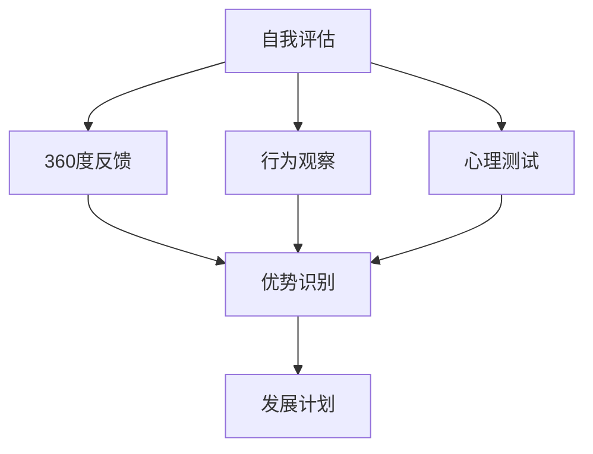
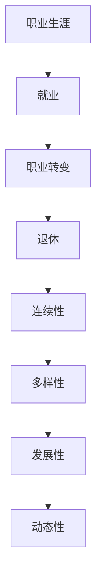
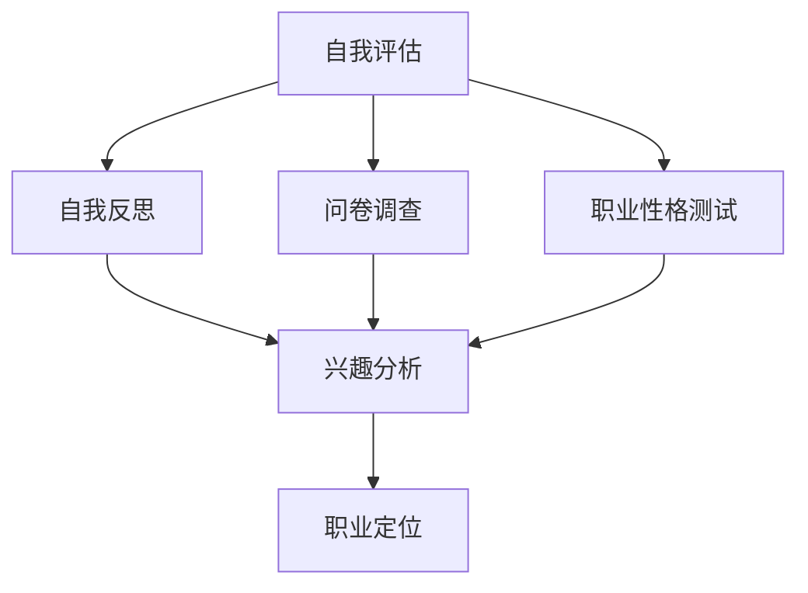
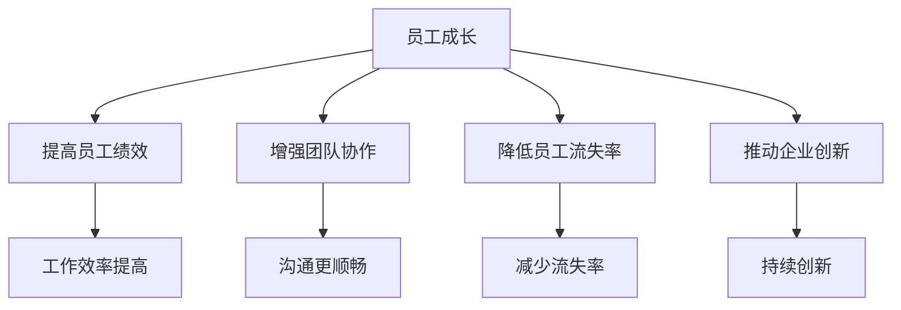
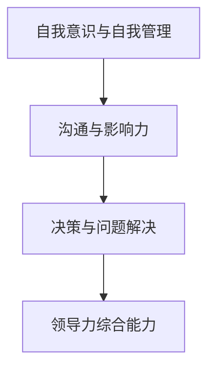

                 

### 领导力与职业生涯规划：帮助员工成长

#### 关键词：领导力、职业生涯规划、员工成长、激励机制、企业文化建设

> **摘要：**
领导力与职业生涯规划是企业管理中至关重要的两个方面。一个成功的领导者不仅需要具备卓越的领导力，还需要关注员工的职业成长。本文将深入探讨领导力的核心概念、领导力素质的提升方法，职业生涯规划的基本步骤，以及领导力与员工成长的相互作用，为企业和员工提供有益的指导。

### 目录大纲

# 领导力与职业生涯规划：帮助员工成长

## 第一部分：领导力基础

### 第1章：领导力的概念与重要性

#### 1.1 领导力的定义和类型

#### 1.2 领导力的重要性

#### 1.3 领导力的发展趋势

### 第2章：领导力的核心素质

#### 2.1 自我意识与自我管理

#### 2.2 沟通与影响力

#### 2.3 决策与问题解决

### 第3章：领导力的发展与提升

#### 3.1 领导力的自我评估

#### 3.2 领导力发展计划

#### 3.3 领导力培训与提升方法

## 第二部分：职业生涯规划

### 第4章：职业生涯规划的基本概念

#### 4.1 职业生涯的定义和特点

#### 4.2 职业生涯规划的步骤

#### 4.3 职业目标设定

### 第5章：自我分析与职业定位

#### 5.1 自我评估与职业性格测试

#### 5.2 职业机会与选择

#### 5.3 职业发展路径规划

### 第6章：职业生涯发展策略

#### 6.1 职业技能提升

#### 6.2 职业网络建设

#### 6.3 职业生涯转折期应对策略

## 第三部分：员工成长与领导力培养

### 第7章：员工成长的重要性

#### 7.1 员工成长对企业的影响

#### 7.2 员工成长的激励机制

#### 7.3 员工成长与企业文化

### 第8章：领导力培养计划

#### 8.1 领导力培养的步骤

#### 8.2 领导力培养的方法与工具

#### 8.3 领导力培养的案例与实践

### 第9章：领导力与员工成长的相互作用

#### 9.1 领导力对员工成长的影响

#### 9.2 员工成长对领导力的反作用

#### 9.3 领导力与员工成长的协同发展

## 附录

### 附录A：领导力与职业生涯规划资源

#### A.1 在线课程与培训

#### A.2 经典领导力书籍推荐

#### A.3 职业生涯规划工具与资源

### 附录B：领导力与职业生涯规划案例

#### B.1 企业领导力培养案例

#### B.2 员工职业生涯规划案例

#### B.3 领导力与职业生涯规划的实践效果评估

### 附录C：Mermaid 流程图与伪代码示例

#### C.1 领导力核心素质 Mermaid 流程图

#### C.2 职业生涯规划步骤伪代码

#### C.3 领导力发展计划伪代码

在接下来的章节中，我们将逐一探讨领导力与职业生涯规划的理论与实践，为企业和员工提供有益的指导。让我们开始这段探索之旅。

### 第一部分：领导力基础

#### 第1章：领导力的概念与重要性

领导力是指一个人在团队中引导、激励、协调和影响他人的能力。它是组织管理中不可或缺的一部分，对于企业的成功和员工的职业发展都有着深远的影响。在这一章中，我们将探讨领导力的定义、类型及其重要性。

##### 1.1 领导力的定义和类型

领导力是一种复杂的现象，很难用简单的定义来概括。然而，我们可以从不同的角度来理解它。首先，领导力可以被定义为一种能力，即个人通过影响和激励他人来实现共同目标的能力。这种能力不仅包括技术技能，还包括人际交往技能、决策能力和战略思维。

根据不同的分类标准，领导力可以分为多种类型。以下是一些常见的领导力类型：

- **权威型领导**：这种类型的领导者通过权威和权力来影响他人。他们通常有明确的指令和目标，能够迅速做出决策。
- **民主型领导**：这种类型的领导者鼓励团队成员参与决策过程，尊重团队成员的意见和想法。
- **变革型领导**：这种类型的领导者通过激励和鼓舞团队成员，推动组织变革和创新。
- **事务型领导**：这种类型的领导者专注于日常管理和执行，确保组织的日常运营顺利进行。

每种类型的领导力都有其适用的场景和优势。领导者通常需要根据具体情况和环境灵活运用不同的领导力风格。

##### 1.2 领导力的重要性

领导力在企业和组织中起着至关重要的作用。以下是领导力重要性的几个方面：

- **影响员工绩效**：领导力对员工的工作表现有着直接的影响。一个优秀的领导者能够激发员工的潜力，提高工作效率和质量。
- **塑造企业文化**：领导力是企业文化的重要组成部分。领导者的行为和价值观会潜移默化地影响员工，塑造企业的文化氛围。
- **推动组织变革**：在快速变化的市场环境中，领导力对于推动组织变革和创新至关重要。领导者需要具备前瞻性的思维和战略眼光，引领组织迎接挑战。
- **实现组织目标**：领导力是实现组织目标的关键。一个优秀的领导者能够明确目标，制定战略，协调资源，确保组织目标的实现。

##### 1.3 领导力的发展趋势

随着社会的不断发展和企业环境的变化，领导力也在不断演进。以下是当前领导力发展的几个趋势：

- **数字化领导力**：随着数字技术的普及，领导者需要具备数字化思维和技能，能够利用数据分析和人工智能等技术来优化决策和管理。
- **敏捷领导力**：在快速变化的市场环境中，领导者需要具备敏捷性，能够快速适应变化，灵活调整策略。
- **情感智能领导力**：情感智能是指理解和管理自己和他人的情感的能力。领导者需要具备较高的情感智能，能够理解员工的情感需求，建立良好的人际关系。
- **全球领导力**：随着全球化的深入，领导者需要具备跨文化沟通和协作能力，能够管理多元文化团队。

在下一章中，我们将进一步探讨领导力的核心素质，以及如何培养和提升这些素质。

### 第一部分：领导力基础

#### 第2章：领导力的核心素质

领导力不仅仅是职位和权力的象征，更是一种影响和激励他人的能力。一个成功的领导者需要具备一系列核心素质，这些素质是领导者成功的关键。在本章中，我们将详细探讨这些核心素质，并分析它们如何影响领导者的表现。

##### 2.1 自我意识与自我管理

自我意识是指领导者对自己内在心理状态的认识和理解。自我管理则是领导者如何有效地控制自己的情绪和行为。自我意识与自我管理是领导力的基石，因为它们直接影响到领导者的决策和行为。

- **自我意识**：领导者需要清楚地了解自己的价值观、信念和动机。这种自我认知有助于领导者更好地理解自己，避免因为个人偏见而做出错误的决策。例如，一个领导者如果意识到自己对某项技术有强烈的兴趣，他可能会在技术决策上过分强调技术因素，而忽视了其他方面的考虑。
  
- **自我管理**：领导者需要能够控制自己的情绪，保持冷静和理智。在面对压力和挑战时，领导者需要保持自我控制，避免情绪化。例如，一个优秀的领导者能够在项目遇到问题时，保持冷静，分析问题，并制定有效的解决方案。

**案例**：乔布斯（Steve Jobs）是一位以自我意识与自我管理著称的领导者。他在产品设计和管理中始终坚持自己的理念，即使在面对重大挑战时也能保持冷静，最终带领苹果公司取得了巨大成功。

##### 2.2 沟通与影响力

沟通与影响力是领导者的重要素质之一。一个成功的领导者需要具备出色的沟通能力和影响力，以便有效地传达信息、激励团队并解决问题。

- **沟通**：领导者需要能够清晰、准确地传达信息，确保团队成员理解并执行任务。有效的沟通不仅包括口头表达，还包括书面表达和肢体语言。例如，一个领导者如果在会议中能够清晰地表达自己的想法，团队成员就更容易理解任务的目标和期望。

- **影响力**：领导者需要能够影响他人，激励团队成员为实现共同目标而努力。影响力不仅来自领导者的职位和权力，还来自领导者的价值观、知识和人格魅力。例如，一个领导者如果拥有丰富的行业知识和出色的演讲能力，就能更有效地影响团队成员。

**案例**：约翰·F·肯尼迪（John F. Kennedy）是一位以沟通与影响力著称的领导者。他在就职演说中发表了著名的“不要问国家能为你做些什么，而要问你能为国家做些什么”的演讲，极大地鼓舞了美国人民的士气。

##### 2.3 决策与问题解决

决策与问题解决是领导力的核心要素之一。领导者需要能够做出明智的决策，并在面对问题时迅速找到解决方案。

- **决策**：领导者需要能够在复杂的环境中做出决策。这包括收集信息、分析风险、权衡利弊，并最终做出选择。有效的决策不仅取决于领导者的个人能力，还取决于团队成员的参与和反馈。

- **问题解决**：领导者需要能够识别问题，分析问题原因，并制定解决方案。问题解决能力是领导者的一项重要技能，因为几乎所有的组织都会面临各种问题。有效的领导者能够迅速识别问题，并采取有效措施解决。

**案例**：杰克·韦尔奇（Jack Welch）是一位以决策与问题解决著称的领导者。在他的领导下，通用电气（General Electric）进行了一系列成功的重组和改革，使公司成为全球最具竞争力的企业之一。

**总结**：

自我意识与自我管理、沟通与影响力、决策与问题解决是领导力的核心素质。领导者需要不断提升这些素质，以更好地影响和激励团队成员，实现组织目标。在下一章中，我们将探讨如何通过自我评估和发展计划来提升这些素质。

### 第一部分：领导力基础

#### 第3章：领导力的发展与提升

成为一位优秀的领导者并非一蹴而就，它需要持续的学习和自我提升。在这一章中，我们将探讨领导力的自我评估方法、发展计划以及提升领导力的培训和工具。

##### 3.1 领导力的自我评估

自我评估是领导力提升的第一步，它有助于领导者识别自己的优势和劣势，从而制定针对性的发展计划。以下是一些自我评估的方法：

- **360度反馈**：这是一种评估工具，通过收集来自团队成员、同事、上级和下属的反馈来全面评估领导者的表现。这种方法的优点是能够提供多维度的反馈，帮助领导者更全面地了解自己。

- **行为观察**：领导者可以通过观察自己的行为和决策过程来评估自己的领导风格和效果。这种方法有助于领导者识别自己在日常工作中可能忽视的问题。

- **心理测试**：例如迈尔斯-布里格斯性格类型指标（MBTI）和霍兰德职业兴趣测试，这些测试可以帮助领导者了解自己的性格特征和职业倾向，从而更好地理解自己的优势和劣势。

**Mermaid 流程图**：



##### 3.2 领导力发展计划

在完成自我评估后，领导者需要制定一个具体的发展计划，以提升自己的领导能力。以下是一个典型的领导力发展计划的步骤：

1. **目标设定**：明确想要提升的领导力领域，例如沟通技巧、决策能力或团队管理。

2. **行动计划**：制定具体的行动计划，包括学习新技能、参加培训课程、阅读领导力书籍等。

3. **资源分配**：确保有足够的资源和时间来实现这些计划。

4. **跟踪进度**：定期评估进展，并根据实际情况进行调整。

5. **反馈与调整**：在实施过程中，持续获取反馈，并根据反馈进行必要的调整。

**伪代码示例**：

```python
# 领导力发展计划伪代码
def leadership_development_plan():
    # 第一步：目标设定
    set_goals()
    
    # 第二步：行动计划
    create_action_plan()
    
    # 第三步：资源分配
    allocate_resources()
    
    # 第四步：跟踪进度
    track_progress()
    
    # 第五步：反馈与调整
    get_feedback() and adjust_plan()
```

##### 3.3 领导力培训与提升方法

提升领导力的方法多种多样，以下是一些常见的培训和方法：

- **领导力培训课程**：参加专业机构或大学提供的领导力培训课程，这些课程通常涵盖领导力的各个方面，如沟通技巧、团队管理、战略思维等。

- **工作坊和研讨会**：这些活动通常以互动和讨论为主，有助于领导者分享经验和学习新知识。

- **导师制**：与经验丰富的领导者结成导师关系，从他们那里学习实战经验和技巧。

- **领导力书籍**：阅读领导力相关的书籍，例如《领导力的五个层次》（The Five Levels of Leadership）和《领导者的语言》（The Language of Leaders），这些书籍提供了实用的见解和策略。

- **模拟练习**：通过模拟实际工作场景，领导者可以在安全的环境中进行实践，提高决策和问题解决能力。

**总结**：

领导力的发展与提升是一个持续的过程，需要自我评估、制定发展计划以及采取有效的培训方法。通过不断地学习和实践，领导者可以不断提升自己的能力，成为更有效的领导者。在下一章中，我们将探讨职业生涯规划的基本概念，为员工的职业发展提供指导。

### 第二部分：职业生涯规划

#### 第4章：职业生涯规划的基本概念

职业生涯规划是指个人在职业发展过程中，通过设定目标、评估自身能力、探索职业机会和制定行动计划，来实现个人职业成长和发展的过程。职业生涯规划不仅是个人职业发展的指南，也是企业和组织人力资源管理的重要一环。在本章中，我们将详细探讨职业生涯规划的定义、特点和重要性。

##### 4.1 职业生涯的定义和特点

职业生涯通常指一个人在一生中从事的职业历程，包括就业、职业转变和退休等阶段。职业生涯具有以下特点：

- **连续性**：职业生涯是一个持续的过程，个人在不同阶段可能会经历多次职业转变。
- **多样性**：职业生涯可以包括多个不同的职业领域，个人可以根据自己的兴趣和能力进行多次转变。
- **发展性**：职业生涯规划旨在帮助个人实现职业成长和发展，提升自身能力和价值。
- **动态性**：职业生涯规划需要根据个人和外部环境的变化进行调整。

**Mermaid 流程图**：



##### 4.2 职业生涯规划的步骤

职业生涯规划通常包括以下几个步骤：

1. **自我评估**：了解自己的兴趣、价值观、能力、性格和职业倾向，这是职业生涯规划的基础。可以通过自我反思、职业性格测试和职业兴趣调查等方式进行。

2. **设定目标**：根据自我评估的结果，设定清晰的职业目标。目标可以是短期的，如提高某项技能；也可以是长期的，如晋升到某个职位或转行到另一个领域。

3. **探索机会**：了解各种职业机会，包括职位需求、行业趋势和职业发展路径。可以通过网络调研、职业咨询和行业活动等方式获取信息。

4. **制定行动计划**：根据目标，制定具体的行动计划，包括学习新技能、参加培训课程、建立职业网络等。

5. **实施与调整**：按照行动计划实施，并根据实际情况进行调整。职业生涯规划是一个持续的过程，需要不断评估和调整。

**伪代码示例**：

```python
# 职业生涯规划步骤伪代码
def career_planning_steps():
    # 第一步：自我评估
    self_evaluation()
    
    # 第二步：设定目标
    set_career_goals()
    
    # 第三步：探索机会
    explore_opportunities()
    
    # 第四步：制定行动计划
    create_action_plan()
    
    # 第五步：实施与调整
    execute_plan() and adjust_if_needed()
```

##### 4.3 职业目标设定

设定职业目标是职业生涯规划的核心环节。一个明确、具体和可衡量的职业目标有助于个人集中精力，更有针对性地规划和实施职业发展计划。以下是一些设定职业目标的建议：

- **具体性**：目标应该明确具体，例如“在三年内晋升为项目经理”。
- **可实现性**：目标应该具有可实现性，考虑到个人的能力和外部环境。
- **挑战性**：目标应该具有一定的挑战性，以激发个人的潜力和动力。
- **时限性**：目标应该有时间限制，以推动个人持续努力。

**案例**：小张是一名软件开发工程师，他在进行职业生涯规划时设定了以下目标：

1. **短期目标**：在一年内掌握至少两门新的编程语言，参加一次技术会议。
2. **中期目标**：在三年内晋升为高级工程师，负责一个重要的项目。
3. **长期目标**：在五年内成为技术经理，负责团队管理和技术决策。

通过明确具体的职业目标，小张能够更有针对性地制定自己的职业发展计划，并不断努力实现这些目标。

**总结**：

职业生涯规划是一个持续的过程，需要个人对自身进行深入评估，设定明确的目标，并制定切实可行的行动计划。通过合理的职业生涯规划，个人可以更好地实现职业成长和发展。在下一章中，我们将探讨如何进行自我分析与职业定位，帮助员工找到适合自己的职业道路。

### 第二部分：职业生涯规划

#### 第5章：自我分析与职业定位

在进行职业生涯规划时，自我分析与职业定位是至关重要的步骤。通过深入了解自己的兴趣、性格和职业倾向，员工可以更准确地找到适合自己的职业道路。在本章中，我们将探讨如何进行自我评估、职业性格测试、职业机会与选择以及职业发展路径规划。

##### 5.1 自我评估与职业性格测试

自我评估是职业生涯规划的基础，它帮助员工了解自己的兴趣、价值观、能力和性格特点。以下是一些自我评估的方法：

- **自我反思**：通过记录日常工作和生活中的感受和经历，反思自己的兴趣、优点和不足。
- **问卷调查**：通过填写职业倾向问卷，了解自己的职业兴趣和性格特点。
- **职业性格测试**：例如霍兰德职业兴趣测试（Holland Code Test）和迈尔斯-布里格斯性格类型指标（MBTI），这些测试可以提供更科学的评估结果。

**Mermaid 流程图**：



##### 5.2 职业机会与选择

在了解自己的特点和兴趣后，下一步是探索职业机会。以下是一些寻找职业机会的方法：

- **网络搜索**：通过互联网搜索职位空缺、招聘网站和行业论坛，了解当前市场上的职业机会。
- **人脉拓展**：通过参加行业活动、职业社交网络和校友会等，与业内人士建立联系，获取职业机会。
- **职业咨询**：寻求职业咨询师的帮助，了解自己的职业优势和潜在的职业道路。

**伪代码示例**：

```python
# 职业机会探索伪代码
def explore_career_opportunities():
    # 第一步：网络搜索
    search_online_job_listings()
    
    # 第二步：人脉拓展
    expand_network()
    
    # 第三步：职业咨询
    consult_with_career_counselor()
    
    # 第四步：筛选机会
    filter_opportunities()
    
    # 第五步：选择最佳机会
    choose_best_opportunity()
```

##### 5.3 职业发展路径规划

在确定职业机会后，员工需要制定详细的职业发展路径规划。以下是一些规划职业发展路径的步骤：

1. **确定职业目标**：根据自我评估和职业机会，设定明确的职业目标，如晋升到某个职位或成为某个领域的专家。
2. **制定行动计划**：根据职业目标，制定具体的行动计划，包括学习新技能、参加培训课程、积累工作经验等。
3. **资源分配**：确保有足够的资源（如时间、金钱和人力）来实现职业发展计划。
4. **实施与调整**：按照行动计划实施，并根据实际情况进行调整。

**伪代码示例**：

```python
# 职业发展路径规划伪代码
def career_path_planning():
    # 第一步：确定职业目标
    define_career_goals()
    
    # 第二步：制定行动计划
    create_action_plan()
    
    # 第三步：资源分配
    allocate_resources()
    
    # 第四步：实施与调整
    execute_plan() and adjust_if_needed()
```

**案例**：小李是一名市场营销专业的毕业生，他通过自我评估和职业性格测试发现自己在创意策划和数据分析方面有优势。在了解自己的兴趣和特点后，小李探索了市场营销领域的职业机会，并选择了品牌经理作为职业目标。为了实现这一目标，他制定了以下职业发展路径：

1. **短期目标**：在第一年内，通过参加市场营销课程和实习，积累品牌管理和市场策划的经验。
2. **中期目标**：在三年内，晋升为市场经理，负责品牌的整体营销策略。
3. **长期目标**：在五年内，成为市场营销总监，负责公司的市场营销战略和团队管理。

通过明确的职业目标和详细的职业发展路径规划，小李能够有针对性地提升自己的能力和经验，逐步实现职业目标。

**总结**：

自我分析与职业定位是职业生涯规划的重要步骤，它帮助员工了解自己的优势和兴趣，找到适合自己的职业道路。通过有效的职业发展路径规划，员工可以更有目的地提升自己的能力和经验，实现职业成长。在下一章中，我们将探讨如何通过职业技能提升、职业网络建设和职业生涯转折期应对策略，进一步促进员工的职业发展。

### 第二部分：职业生涯规划

#### 第6章：职业生涯发展策略

职业生涯发展不仅需要明确的规划和目标，还需要有效的策略来支持和实现这些目标。在本章中，我们将探讨如何通过提升职业技能、建立职业网络和应对职业生涯转折期，来促进员工的职业发展。

##### 6.1 职业技能提升

职业技能的提升是职业生涯发展的核心。以下是一些有效的技能提升策略：

- **持续学习**：在快速变化的工作环境中，持续学习新知识和技能至关重要。员工可以通过参加在线课程、行业研讨会和内部培训，不断提升自己的专业能力。

- **实践经验**：通过实际工作项目、实习和兼职工作，员工可以积累宝贵的实践经验，提高解决问题的能力。

- **跨领域学习**：学习其他领域的知识和技能，可以帮助员工拓宽视野，增强跨领域的思维能力。

- **专业认证**：获取专业认证，如项目管理专业认证（PMP）或数据分析师认证（CDA），可以提高职业竞争力。

**案例**：小王是一名软件工程师，他意识到随着技术的发展，学习新技能变得越来越重要。为了提升自己的竞争力，他制定了以下学习计划：

1. **学习新的编程语言**：在一年内学习Python和Go语言。
2. **参加在线课程**：报名参加《人工智能基础》和《数据结构算法》课程。
3. **实践项目**：参与开源项目，提高实际编程和解决问题的能力。

通过持续学习和实践，小王不仅提升了专业技能，还积累了丰富的实践经验，为自己的职业发展打下了坚实的基础。

##### 6.2 职业网络建设

建立职业网络是职业生涯发展的重要策略。以下是一些建立职业网络的建议：

- **积极参与行业活动**：参加行业会议、研讨会和社交活动，与业内人士建立联系。
- **利用社交媒体**：通过LinkedIn、Twitter等职业社交媒体平台，与行业专家和同行建立联系。
- **内部网络**：利用公司内部的沟通平台，与同事和上级建立良好的工作关系。

**案例**：小张是一名销售经理，他意识到建立强大的职业网络对于销售业绩和职业发展至关重要。为了建立自己的职业网络，他采取了以下措施：

1. **参加行业会议**：每年参加至少两次重要的行业会议，与行业专家和同行交流。
2. **利用LinkedIn**：通过LinkedIn与500名行业人士建立了联系，并定期更新自己的职业状态。
3. **内部网络**：与公司内部的其他部门建立合作关系，提高销售业绩。

通过积极的职业网络建设，小张不仅拓展了人脉资源，还提升了销售业绩，为自己的职业发展创造了更多机会。

##### 6.3 职业生涯转折期应对策略

职业生涯中，每个人都会遇到转折点，这些转折点可能包括职位晋升、转行或面对职业瓶颈。以下是一些应对职业生涯转折期的策略：

- **积极调整心态**：面对转折点，保持积极的心态至关重要。认识到转折点是成长和发展的机会，而不是阻碍。

- **重新评估目标**：在职业生涯转折期，重新审视自己的职业目标，确保它们与当前的职业发展阶段相符合。

- **制定新的行动计划**：根据新的目标和情况，制定切实可行的行动计划，包括学习新技能、寻求新的职业机会等。

- **寻求支持**：在转折期，寻求家人、朋友和职业顾问的支持，可以帮助自己更好地应对挑战。

**案例**：小刘是一名项目经理，他在一次项目失败后感到非常沮丧。为了应对这个职业转折点，他采取了以下措施：

1. **积极调整心态**：认识到失败是成功的一部分，是成长的机会。
2. **重新评估目标**：重新审视自己的职业目标，决定是否继续在项目管理领域发展，或者转向其他领域。
3. **制定新的行动计划**：决定继续在项目管理领域发展，并制定了学习敏捷项目管理的新计划。
4. **寻求支持**：与职业顾问交流，寻求他们的建议和指导。

通过积极的应对策略，小刘不仅克服了职业挫折，还找到了新的职业发展方向。

**总结**：

职业技能提升、职业网络建设和职业生涯转折期应对策略是促进职业生涯发展的关键。通过持续学习和实践，建立强大的职业网络，以及积极应对职业生涯中的挑战，员工可以更好地实现职业目标，不断提升自己的职业价值。在下一章中，我们将探讨员工成长对企业的影响，以及如何通过员工成长促进企业的发展。

### 第三部分：员工成长与领导力培养

#### 第7章：员工成长的重要性

员工成长不仅对个人的职业发展至关重要，也对企业的长远发展产生深远影响。在这一章中，我们将探讨员工成长的重要性、激励机制以及员工成长与企业文化之间的关系。

##### 7.1 员工成长对企业的影响

员工成长对企业的影响体现在多个方面：

- **提高员工绩效**：员工通过不断学习和成长，能够提升自己的技能和知识水平，从而提高工作效率和质量。例如，一名软件开发工程师通过学习新的编程语言和框架，能够更快地解决技术难题，提高项目进度。
- **增强团队协作**：员工成长有助于团队协作的加强。通过共同学习和成长，团队成员之间能够更好地理解和沟通，提高团队的协作效率和凝聚力。
- **降低员工流失率**：提供员工成长机会的企业通常能够更好地留住人才。员工在成长过程中感受到企业的关注和支持，会更有动力留在企业，减少流失率。
- **推动企业创新**：员工成长有助于推动企业的创新。通过不断学习新知识和技能，员工能够提出新的想法和解决方案，推动企业持续创新。

**Mermaid 流程图**：



##### 7.2 员工成长的激励机制

为了激励员工不断成长，企业需要建立有效的激励机制。以下是一些常见的激励机制：

- **职业发展机会**：提供清晰的职业发展路径和晋升机会，鼓励员工努力学习和提升自己的能力。
- **奖励和认可**：通过奖金、晋升、荣誉表彰等方式，对表现出色的员工进行奖励和认可，激发他们的积极性。
- **培训和学习资源**：提供丰富的培训和学习资源，如在线课程、内部培训、行业会议等，帮助员工不断提升自己的技能和知识。
- **灵活的工作安排**：提供灵活的工作时间和工作地点，让员工能够在工作和个人生活之间找到平衡，有更多的时间和精力用于学习和成长。

**案例**：某互联网公司为了激励员工的成长，采取了以下措施：

1. **职业发展机会**：为员工提供明确的职业发展路径，每年进行一次职业发展评估，帮助员工制定个人职业发展计划。
2. **奖励和认可**：设立“最佳创新奖”和“最佳员工奖”，对在项目和创新方面表现出色的员工进行表彰和奖励。
3. **培训和学习资源**：提供内部培训课程和在线学习平台，鼓励员工利用业余时间学习新技能和知识。
4. **灵活的工作安排**：提供远程工作和灵活的工作时间，让员工能够在工作和个人生活之间找到平衡。

通过这些激励机制，该公司成功激励了员工的成长，提高了整体工作效率和创新能力。

##### 7.3 员工成长与企业文化

员工成长与企业文化密切相关。一个积极向上的企业文化能够支持员工的成长，而员工的成长也能进一步强化企业文化。以下是一些如何通过企业文化支持员工成长的方法：

- **共享价值观**：企业应该明确并共享核心价值观，如创新、团队合作、持续学习等，这些价值观能够激励员工不断追求成长。
- **开放沟通**：建立开放的沟通渠道，鼓励员工分享自己的想法和意见，提高员工的参与度和归属感。
- **支持个性化发展**：尊重员工的个性和兴趣，为员工提供个性化的成长路径，鼓励他们在各自擅长的领域不断深入。
- **鼓励创新**：营造鼓励创新和容忍失败的文化，让员工在安全的环境中尝试新想法，提高创新能力和解决问题的能力。

**案例**：某科技公司注重员工的个性化成长，通过以下措施支持员工成长：

1. **共享价值观**：公司强调“创新、快速学习和团队合作”的价值观，这些价值观深入人心，成为员工共同追求的目标。
2. **开放沟通**：公司设有开放的讨论区，员工可以自由分享自己的想法和问题，上级和同事会积极参与讨论和反馈。
3. **支持个性化发展**：公司为员工提供多种成长路径，如技术路线、管理路线和创业路线，员工可以根据自己的兴趣和职业目标选择适合自己的发展路径。
4. **鼓励创新**：公司设有创新基金，支持员工提出的新想法和项目，即使项目失败，也会得到公司的支持和鼓励。

通过这些措施，该公司营造了一个支持员工成长的企业文化，员工的创新能力和工作热情得到了极大的激发。

**总结**：

员工成长对企业的重要性不可忽视，它能够提高员工绩效、增强团队协作、降低流失率和推动企业创新。为了支持员工的成长，企业需要建立有效的激励机制和积极向上的企业文化。通过激励员工成长，企业能够吸引和留住优秀人才，实现持续发展和创新。在下一章中，我们将探讨如何制定领导力培养计划，为企业的未来发展奠定坚实的基础。

### 第三部分：员工成长与领导力培养

#### 第8章：领导力培养计划

领导力培养是企业持续发展的重要基石。一个有效的领导力培养计划不仅能够提升员工的能力，还能够增强企业的核心竞争力。在本章中，我们将探讨领导力培养的步骤、方法和工具，以及通过这些步骤如何制定和实施一个有效的领导力培养计划。

##### 8.1 领导力培养的步骤

领导力培养通常包括以下几个步骤：

1. **需求分析**：首先，企业需要对现有领导者的能力和需求进行评估，了解他们在哪些方面需要提升。这可以通过问卷调查、访谈和360度反馈等方式进行。

2. **目标设定**：根据需求分析的结果，设定具体的领导力发展目标。这些目标应该是明确的、可衡量的，并且与企业的战略目标相一致。

3. **计划制定**：在明确了目标和需求后，制定详细的领导力培养计划。这包括确定培养的内容、方法、时间表和资源分配。

4. **实施与执行**：按照计划，实施领导力培养活动。这可能包括内部培训、外部课程、导师制和模拟练习等。

5. **评估与反馈**：在培养过程中，定期评估领导者的进步，并根据反馈进行调整。这有助于确保培养计划的实施效果。

**伪代码示例**：

```python
# 领导力培养计划步骤伪代码
def leadership_development_plan():
    # 第一步：需求分析
    analyze_demand()
    
    # 第二步：目标设定
    set_goals()
    
    # 第三步：计划制定
    create_plan()
    
    # 第四步：实施与执行
    execute_plan()
    
    # 第五步：评估与反馈
    evaluate_progress() and provide_feedback()
```

##### 8.2 领导力培养的方法与工具

有效的领导力培养方法多种多样，企业可以根据实际情况选择合适的方法和工具。以下是一些常用的方法和工具：

- **内部培训**：通过内部培训课程，提升领导者的专业技能和管理能力。这些课程可以是专题讲座、研讨会或工作坊。

- **外部课程**：组织领导者参加外部培训机构或大学提供的领导力课程，这些课程通常涵盖高级管理技能、战略思维和跨文化领导力等。

- **导师制**：为领导者配备经验丰富的导师，通过一对一的指导，帮助领导者提升领导能力和管理经验。

- **模拟练习**：通过模拟实际工作场景，领导者可以在安全的环境中进行实践，提高决策能力和问题解决能力。

- **案例学习**：通过学习成功领导者的案例，领导者可以汲取经验，应用到实际工作中。

**伪代码示例**：

```python
# 领导力培养方法与工具伪代码
def leadership_training_methods():
    # 第一步：内部培训
    conduct_internal_trainings()
    
    # 第二步：外部课程
    attend_external_courses()
    
    # 第三步：导师制
    assign_mentors()
    
    # 第四步：模拟练习
    perform_simulation_practices()
    
    # 第五步：案例学习
    study_success_cases()
```

##### 8.3 领导力培养的案例与实践

以下是一个领导力培养的实践案例：

**案例**：某科技公司为了提升领导者的能力，制定了一个为期一年的领导力培养计划。该计划包括以下步骤：

1. **需求分析**：通过问卷调查和访谈，了解领导者在管理技能、沟通能力和决策能力方面的需求。

2. **目标设定**：根据需求分析的结果，设定以下发展目标：
   - 提高领导者的沟通技巧，确保信息传递准确无误。
   - 培养领导者的战略思维，使其能够更好地制定和实施企业战略。
   - 提升领导者的决策能力，使其在面对复杂问题时能够快速做出明智的决策。

3. **计划制定**：制定详细的培养计划，包括以下内容：
   - 每月一次的内部培训课程，涵盖沟通技巧、战略思维和决策能力。
   - 每季度一次的外部课程，由行业专家授课，提高领导者的综合能力。
   - 每月一次的导师会议，由资深领导者提供一对一的指导和建议。
   - 每年一次的模拟练习，通过模拟实际工作场景，提高领导者的实战能力。

4. **实施与执行**：按照计划，逐步实施各项培养活动。领导者在参与培训和学习的过程中，积极应用所学知识，解决实际工作中的问题。

5. **评估与反馈**：在培养计划结束时，通过评估和反馈，了解领导者的进步。根据反馈结果，对培养计划进行调整和优化。

通过这个案例，我们可以看到，一个有效的领导力培养计划需要详细的步骤和科学的实施方法，同时还需要持续的评价和反馈，以确保培养效果。

**总结**：

领导力培养是企业持续发展的重要策略。通过科学的需求分析、明确的目标设定、合理的培养方法和持续的评价与反馈，企业可以培养出具备卓越领导能力的领导者，为企业的长远发展奠定坚实的基础。在下一章中，我们将探讨领导力与员工成长的相互作用，分析领导力如何影响员工成长，以及员工成长如何反作用于领导力。

### 第三部分：员工成长与领导力培养

#### 第9章：领导力与员工成长的相互作用

领导力与员工成长是相辅相成的，二者之间存在着密切的相互作用。优秀的领导力能够推动员工的成长，而员工的成长又能进一步提升领导力。在这一章中，我们将探讨领导力对员工成长的影响、员工成长对领导力的反作用，以及如何实现领导力与员工成长的协同发展。

##### 9.1 领导力对员工成长的影响

领导力对员工成长的影响主要体现在以下几个方面：

1. **激励与引导**：优秀的领导者能够激励员工，引导他们发挥潜力，实现自我超越。通过设定明确的目标和提供积极的反馈，领导者可以帮助员工明确自己的发展方向，激发他们的工作热情。

2. **职业发展支持**：领导者的支持对于员工的职业成长至关重要。通过提供培训机会、项目参与和晋升渠道，领导者可以帮助员工不断提升自己的能力和技能。

3. **文化建设**：领导者的行为和价值观对企业的文化建设有着深远的影响。一个注重员工成长和发展的企业氛围，能够促进员工的自我提升和持续进步。

**案例**：某互联网公司以其强烈的成长文化和领导者对员工的重视著称。公司领导者定期组织团队建设活动，鼓励员工参加行业会议和培训，提供各种职业发展机会。这些措施使得员工在快速成长的同时，也对企业产生了深厚的归属感。

**伪代码示例**：

```python
# 领导力对员工成长的影响伪代码
def leadership_impact_on_growth():
    # 第一步：激励与引导
    motivate_and_guide_employees()
    
    # 第二步：职业发展支持
    provide_growth_opportunities()
    
    # 第三步：文化建设
    cultivate_a_growth_culture()
```

##### 9.2 员工成长对领导力的反作用

员工成长不仅对自身有益，也对领导力产生积极的反作用。以下是员工成长对领导力的几个方面的影响：

1. **反馈与改进**：员工的成长和进步可以为领导者提供宝贵的反馈，帮助领导者发现自身的不足，进行改进和提升。

2. **能力互补**：随着员工的成长，他们可能会承担更多的责任和任务。这种能力互补有助于领导者更好地分配资源和管理团队。

3. **共同学习**：员工与领导者共同成长，形成了一种相互学习和支持的关系。这种关系有助于提高整个团队的学习能力和创新能力。

**案例**：某科技公司鼓励员工参加外部培训和行业会议，不仅提升了员工的专业能力，也促进了领导者的学习。在员工和领导者的共同努力下，公司不断推出创新产品，取得了显著的市场竞争力。

**伪代码示例**：

```python
# 员工成长对领导力的反作用伪代码
def employee_growth_impact_on_leadership():
    # 第一步：反馈与改进
    provide_feedback_for_improvement()
    
    # 第二步：能力互补
    complement_leadership_skills()
    
    # 第三步：共同学习
    foster_a_learning_environment()
```

##### 9.3 领导力与员工成长的协同发展

实现领导力与员工成长的协同发展，需要企业从系统层面进行设计和规划。以下是一些具体的措施：

1. **建立成长文化**：企业应该建立一种鼓励学习和成长的文化，让员工感受到企业对个人发展的重视和支持。

2. **制定成长路径**：为员工提供明确的职业发展路径和成长规划，帮助员工有目标地提升自己的能力和技能。

3. **持续培训与学习**：提供丰富的培训和学习资源，鼓励员工不断学习和进步。同时，领导者也应该积极参与培训和学习，提升自己的领导能力。

4. **跨部门合作**：通过跨部门合作和项目协作，促进员工之间的交流和互动，提高整体团队的协作能力和创新能力。

**案例**：某大型科技企业通过以下措施实现了领导力与员工成长的协同发展：

1. **建立成长文化**：公司强调“学习与成长”的价值观，鼓励员工不断学习和进步。

2. **制定成长路径**：公司为每个员工提供详细的职业发展路径和成长规划，帮助员工明确自己的职业目标和发展方向。

3. **持续培训与学习**：公司提供多种培训和学习机会，包括内部培训、在线课程和外部培训，鼓励员工不断提升自己的能力和技能。

4. **跨部门合作**：公司鼓励员工跨部门合作，参与不同的项目和团队，提高协作能力和创新能力。

通过这些措施，该公司成功实现了领导力与员工成长的协同发展，员工的职业能力和工作满意度显著提升，公司的整体竞争力也得到显著增强。

**总结**：

领导力与员工成长之间存在着密切的相互作用，二者共同构成了企业发展的核心动力。通过建立成长文化、制定成长路径、持续培训和跨部门合作，企业可以有效地促进领导力与员工成长的协同发展，实现企业的长期成功。在下一章中，我们将探讨领导力与职业生涯规划的资源，为读者提供更多的学习和实践资源。

### 附录A：领导力与职业生涯规划资源

为了更好地帮助读者深入了解领导力与职业生涯规划的理论和实践，本章将提供一些有用的资源，包括在线课程、经典领导力书籍和职业生涯规划工具。

#### A.1 在线课程与培训

1. **Coursera**：提供各种领导力相关的在线课程，如《领导力与团队管理》、《战略思维与决策》等。
2. **edX**：哈佛大学和MIT等知名大学提供的领导力课程，如《领导力心理学》、《领导力与组织变革》等。
3. **LinkedIn Learning**：提供丰富的职业发展课程，涵盖沟通技巧、时间管理和职业规划等。
4. **Harvard Business Review**：提供领导力与管理实践相关的在线培训课程。

#### A.2 经典领导力书籍推荐

1. **《领导者的五项修炼》（The Five Dysfunctions of a Team）- Patrick Lencioni**：分析团队协作中的常见问题，并提供解决方案。
2. **《影响力》（Influence: The Psychology of Persuasion）- Robert B. Cialdini**：探讨如何通过心理技巧影响他人。
3. **《变革之舞》（The Dance of Change）- Dan Siegel and Bryon Katie**：探讨如何在组织变革中保持平衡和应对挑战。
4. **《领导者的语言》（The Language of Leaders）- Joseph McCormick**：揭示有效领导者的沟通技巧和策略。

#### A.3 职业生涯规划工具与资源

1. **职业性格测试**：如霍兰德职业兴趣测试（Holland Code Test）和迈尔斯-布里格斯性格类型指标（MBTI）。
2. **职业规划软件**：如CareerExplorer、LinkedIn Job Search和Indeed Career Planner，帮助用户了解职业机会和设定目标。
3. **职业咨询服务**：如Career Coach、VocationVacations和CareerThoughtLeaders，提供个性化的职业咨询和规划服务。
4. **职业发展网站**：如LinkedIn、Glassdoor和Indeed，提供丰富的职业信息和工作机会。

通过这些资源和工具，读者可以更深入地了解领导力和职业生涯规划的理论和实践，为自己的职业发展奠定坚实的基础。

### 附录B：领导力与职业生涯规划案例

在本附录中，我们将探讨一些领导力与职业生涯规划的具体案例，这些案例展示了不同企业和组织如何通过有效的领导力和职业生涯规划策略来实现成功。

#### B.1 企业领导力培养案例

**案例一：谷歌的领导力培养计划**

谷歌以其卓越的企业文化和领导力培养计划而闻名。谷歌通过以下措施培养领导力：

1. **领导力发展中心**：谷歌设有领导力发展中心，为员工提供各种领导力培训课程，包括团队管理、决策制定和战略思考等。

2. **导师制**：谷歌的导师制帮助新晋领导者和经验丰富的领导者建立联系，通过一对一的指导，提升领导者的管理能力和决策能力。

3. **领导力项目**：谷歌还推出了一系列领导力项目，如“谷歌领导力挑战”（Google Leadership Challenge），鼓励员工参与实际项目，提升领导力。

通过这些措施，谷歌不仅培养了一大批优秀的领导者，还推动了企业的创新和持续发展。

**案例二：阿里巴巴的领导力发展**

阿里巴巴一直重视领导力的培养和发展。以下是其领导力培养策略：

1. **领导力学院**：阿里巴巴设有领导力学院，为员工提供系统的领导力培训，包括领导力基础、领导力提升和领导力创新等课程。

2. **轮岗制度**：阿里巴巴鼓励员工在不同部门和岗位上轮岗，以拓宽视野，提高领导力。

3. **领导力评估**：阿里巴巴定期对领导者进行评估，根据评估结果制定个性化的领导力发展计划。

通过这些策略，阿里巴巴培养了一支具有战略思维和创新能力的领导团队，为企业的持续增长奠定了基础。

#### B.2 员工职业生涯规划案例

**案例一：亚马逊员工的职业发展路径**

亚马逊为员工提供了清晰的职业发展路径和丰富的职业机会。以下是亚马逊的职业生涯规划策略：

1. **职业发展评估**：亚马逊定期对员工进行职业发展评估，帮助员工了解自己的优势和职业潜力。

2. **晋升通道**：亚马逊为员工提供多种晋升通道，包括技术晋升、管理晋升和跨部门晋升。

3. **职业导师**：亚马逊为员工配备职业导师，通过一对一的指导，帮助员工制定职业发展计划。

通过这些措施，亚马逊帮助员工明确职业目标，提升职业技能，实现职业成长。

**案例二：微软的职业发展支持**

微软通过以下措施支持员工的职业发展：

1. **在线学习平台**：微软提供在线学习平台，员工可以随时随地进行学习，提升专业技能。

2. **职业咨询服务**：微软设有职业咨询服务，为员工提供个性化的职业规划和指导。

3. **职业发展计划**：微软鼓励员工制定个人职业发展计划，并提供资源和支持，确保计划的实施。

通过这些措施，微软帮助员工实现职业目标，提升员工的满意度和忠诚度。

**B.3 领导力与职业生涯规划的实践效果评估**

对领导力与职业生涯规划实践效果进行评估，有助于企业了解策略的有效性，并根据反馈进行优化。以下是一些评估方法：

1. **员工满意度调查**：通过员工满意度调查，了解员工对领导力和职业生涯规划措施的感受，识别改进点。

2. **绩效评估**：通过绩效评估，衡量领导力培养和职业生涯规划对员工绩效的影响。

3. **离职率分析**：通过离职率分析，评估领导力和职业生涯规划措施对员工忠诚度的影响。

4. **员工晋升率**：通过员工晋升率分析，了解领导力培养和职业生涯规划对员工职业发展的影响。

通过这些评估方法，企业可以不断优化领导力和职业生涯规划策略，提升员工满意度和绩效，实现企业的长期发展。

### 附录C：Mermaid 流程图与伪代码示例

在附录C中，我们将提供一些Mermaid流程图和伪代码示例，以帮助读者更好地理解领导力与职业生涯规划的相关概念。

#### C.1 领导力核心素质 Mermaid 流程图



#### C.2 职业生涯规划步骤伪代码

```python
# 职业生涯规划步骤伪代码
def career_planning_steps():
    # 第一步：自我评估
    self_evaluation()
    
    # 第二步：设定目标
    set_goals()
    
    # 第三步：探索机会
    explore_opportunities()
    
    # 第四步：制定计划
    create_action_plan()
    
    # 第五步：实施计划
    execute_plan()
    
    # 第六步：评估与调整
    evaluate_progress() and adjust_if_needed()
```

#### C.3 领导力发展计划伪代码

```python
# 领导力发展计划伪代码
def leadership_development_plan():
    # 第一步：需求分析
    analyze_demand()
    
    # 第二步：设定目标
    set_goals()
    
    # 第三步：制定计划
    create_plan()
    
    # 第四步：实施计划
    execute_plan()
    
    # 第五步：评估与反馈
    evaluate_progress() and provide_feedback()
```

通过这些Mermaid流程图和伪代码示例，读者可以更直观地理解领导力和职业生涯规划的理论和实践，为自身的职业发展提供有益的参考。

### 作者信息

**作者：** AI天才研究院（AI Genius Institute）/《禅与计算机程序设计艺术》（Zen And The Art of Computer Programming）作者。本文旨在探讨领导力与职业生涯规划的重要性，为企业和员工提供实用的指导和建议。希望通过这篇文章，读者能够更好地理解领导力与职业生涯规划的核心概念，为自己的职业发展奠定坚实的基础。

