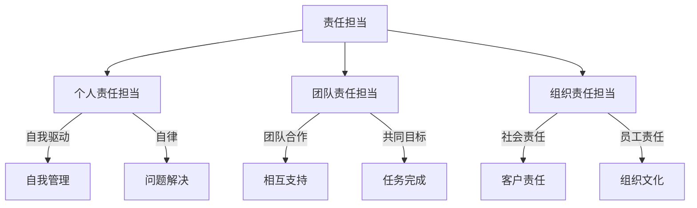
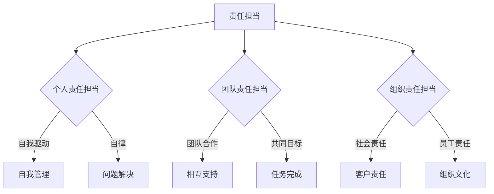

                 

### 引言

在当今快速变化的社会和商业环境中，领导力与责任担当成为了衡量组织和个人成功的关键因素。随着技术的不断进步和组织结构的复杂化，领导者不仅需要具备卓越的决策能力和沟通技巧，还必须勇于承担各种挑战和责任。这种勇于承担责任的品质，不仅体现在日常工作中，更是在应对危机、推动变革和实现组织目标的过程中发挥着至关重要的作用。

本文将围绕领导力与责任担当这一主题，深入探讨其在现代组织中的重要性，并系统地分析其理论基础和实践策略。文章将分为四个主要部分：

#### 第一部分：领导力概述
我们将首先定义领导力，探讨其在组织中的角色和核心原则。这一部分将帮助读者理解领导力的基本概念和其在组织中的实际应用。

#### 第二部分：责任担当的理论基础
接下来，我们将讨论责任担当的概念、类型和影响因素。通过这一部分，读者将能够了解责任担当在个体和团队中的作用，以及如何培养这种品质。

#### 第三部分：培养责任担当的实践方法
我们将提供一系列培养责任担当的具体策略，包括领导者、员工和团队层面的方法。这部分内容旨在为实际操作提供指导。

#### 第四部分：责任担当在领导力实践中的应用
最后，我们将探讨责任担当在项目管理和决策中的作用，以及其在危机管理中的具体应用。这一部分将为读者提供实际场景中的应用案例和策略。

通过逐步分析推理，我们将揭示领导力与责任担当之间的紧密联系，并探索如何在实际工作中培养和运用这种品质。这不仅有助于提升个人的领导能力，更为组织的成功和可持续发展提供了坚实的基础。

### 核心关键词

领导力、责任担当、组织管理、个人成长、危机应对、项目执行、团队协作。

### 摘要

本文旨在深入探讨领导力与责任担当在现代社会中的重要性。首先，我们将定义领导力，探讨其在组织中的角色和核心原则。接着，我们将分析责任担当的概念、类型及其影响因素，并提出具体的培养策略。通过实际案例和具体应用场景，我们将展示如何在实际工作中培养和运用责任担当。最终，本文将为读者提供系统化的理解和实践指导，帮助他们在个人和组织层面实现更高效的领导和管理。

### 第一部分：领导力概述

领导力是一个复杂且多层次的概念，其本质在于通过影响和激励他人，实现共同的目标。然而，要深入了解领导力，我们首先需要明确其定义、重要性以及在组织中的角色。

#### 1.1 领导力的基本概念

领导力（Leadership）通常被定义为一种激励和影响他人，使其为实现共同目标而努力的特有能力。这种能力不仅包括技术技能，如决策能力和沟通技巧，还涉及个人品质，如诚信、自信和同理心。领导力是一种动态的过程，其效果取决于领导者与团队成员之间的互动。

为了更好地理解领导力的定义，我们可以从以下几个角度进行分析：

- **权威型领导**：基于权力和地位的领导方式，领导者通过命令和控制来影响他人。
- **影响力型领导**：领导者通过建立信任和关系来影响他人，更注重软技能和情感智力。
- **服务型领导**：领导者将团队成员的需求放在首位，通过服务和支持来推动团队发展。

#### 1.2 领导力在组织中的角色

领导力在组织中的角色至关重要，它不仅影响组织的运作效率，还决定组织的长远发展。以下是领导力在组织中的一些关键角色：

- **战略制定者**：领导者需要制定组织的长远战略，确保组织在竞争中保持优势。
- **变革推动者**：在快速变化的环境中，领导者需要推动变革，适应外部环境的变化。
- **团队领导者**：领导者需要建立高效团队，激发团队成员的潜力，实现共同目标。
- **文化塑造者**：领导者通过自身的价值观和行为，塑造组织文化，影响员工的行为和态度。

#### 1.3 领导力的三大维度

领导力的成功实施不仅依赖于领导者的个人特质和行为，还受到情境因素的影响。我们将领导力分为三大维度：个人特质、行为方式和情境因素。

- **个人特质**：包括自我意识、情绪智能和决策能力。这些特质是领导者成功的基础。
- **行为方式**：包括沟通技巧、激励能力和团队合作能力。这些行为方式直接影响领导效果。
- **情境因素**：包括组织文化、外部环境和团队成员的影响。领导者需要根据不同情境调整领导策略。

通过以上分析，我们可以看到领导力是一个多层次、多维度的概念，其成功实施需要领导者具备全面的素质和能力。在接下来的章节中，我们将进一步探讨领导力的核心原则，以及责任担当在领导力中的重要性。

### 第一部分：领导力概述

#### 第1章：领导力的定义与重要性

##### 1.1 领导力的基本概念

领导力（Leadership）是一个广泛而复杂的概念，其核心在于通过影响和激励他人，实现共同的目标。领导力不仅仅是拥有权力或地位的人所具备的特质，更是一种能力，一种能够引导和推动团队向目标前进的技能。为了更好地理解领导力的本质，我们可以从以下几个方面进行分析。

首先，领导力与权威（Authority）密切相关。传统上，权威型领导依靠权力和地位来影响他人。这种领导方式在短期内可能有效，但长期来看，可能会导致团队士气下降，创造力受限。因此，现代领导力更强调基于信任和影响力的领导方式。

其次，领导力不仅仅是关于决策和执行，还涉及人际关系和沟通。一个成功的领导者需要具备出色的沟通技巧，能够清晰地传达愿景和目标，同时倾听团队成员的意见和反馈。这种双向沟通不仅有助于建立信任，还能激发团队成员的积极性和创造力。

最后，领导力是一种动态过程，其效果取决于领导者与团队成员之间的互动。在这个过程中，领导者不仅需要具备战略思维，还需要具备灵活应对变化的能力。领导力是一种综合能力，它包括个人特质、行为方式和情境因素，这些因素共同作用，决定了领导力的最终效果。

##### 1.2 领导力在组织中的角色

在组织中，领导力扮演着多重角色，这些角色对于组织的成功至关重要。以下是领导力在组织中的一些关键角色：

1. **战略制定者**：领导者需要制定组织的长期战略，确保组织在竞争中保持优势。这包括市场分析、资源分配和目标设定。领导者需要具备前瞻性思维，能够预见市场变化，并做出相应的调整。

2. **变革推动者**：随着外部环境的不断变化，组织需要不断进行变革以保持竞争力。领导者作为变革的推动者，需要具备勇气和决心，能够引导团队接受新的观念和方法，推动组织向更好的方向发展。

3. **团队领导者**：领导者需要建立高效团队，激发团队成员的潜力，实现共同目标。这包括明确团队目标、分配任务、建立团队文化和提供必要的资源和支持。

4. **文化塑造者**：领导者通过自身的价值观和行为，塑造组织文化。组织文化不仅影响员工的行为和态度，还影响组织的整体绩效。领导者需要积极塑造积极向上的组织文化，鼓励创新和团队合作。

##### 1.3 领导力的三大维度

领导力的成功实施需要领导者具备全面的素质和能力。我们将领导力分为三大维度：个人特质、行为方式和情境因素。

1. **个人特质**：

   - **自我意识**：领导者需要了解自己的优点和缺点，明确自己的价值观和目标。这种自我意识有助于领导者做出更明智的决策，并更好地与他人沟通。
   - **情绪智能**：领导者需要具备高水平的情绪智能，能够理解和管理自己的情绪，同时也能够理解和影响他人的情绪。这有助于建立信任和积极的人际关系。
   - **决策能力**：领导者需要具备良好的决策能力，能够在复杂和不确定的环境中进行有效的决策。这包括收集信息、分析风险和制定应对策略。

2. **行为方式**：

   - **沟通技巧**：领导者需要具备出色的沟通技巧，能够清晰地传达愿景和目标，同时也能够倾听团队成员的意见和反馈。这种有效的沟通有助于团队协作和共同目标的实现。
   - **激励能力**：领导者需要能够激励团队成员，提高他们的工作积极性和创造力。这可以通过设置挑战性的目标、提供积极的反馈和奖励来实现。
   - **团队合作**：领导者需要促进团队合作，确保团队成员能够相互支持，共同完成任务。这包括建立团队文化、提供必要的资源和支持，以及解决团队内部的冲突。

3. **情境因素**：

   - **组织文化**：领导者需要根据组织文化来调整领导策略。一个支持创新和团队合作的文化有助于领导者实现其目标。
   - **外部环境**：领导者需要关注外部环境的变化，如市场趋势、技术进步和政策调整。这有助于领导者制定适应外部变化的战略。
   - **团队成员**：领导者需要了解团队成员的能力、动机和需求，以制定更有效的领导策略。这包括提供个性化的指导和支持，以及鼓励团队成员的发展。

通过以上分析，我们可以看到领导力是一个多维度的概念，其成功实施需要领导者具备全面的素质和能力。在接下来的章节中，我们将进一步探讨领导力的核心原则，以及责任担当在领导力中的重要性。

### 第二部分：领导力与责任担当的联系

在探讨领导力与责任担当的联系之前，我们首先需要明确责任担当的含义。责任担当是指在面对任务和挑战时，个体或团队主动承担责任，并采取积极行动解决问题。责任担当不仅仅是一种行为，更是一种态度和价值观。

#### 2.1 责任担当的重要性

责任担当在组织和个体层面都具有重要意义。首先，在组织层面，责任担当能够提高组织的整体效能和效率。当团队成员都具备责任担当的品质时，他们更倾向于主动承担责任，减少推诿和依赖，从而提高团队协作的效果。此外，责任担当还能够增强组织的凝聚力，因为团队成员之间的信任和合作关系在责任担当的基础上得以建立。

其次，在个体层面，责任担当有助于个人的成长和发展。具备责任担当品质的个体通常更加自信和有成就感，因为他们能够面对挑战，解决问题，并在过程中积累经验。这种积极的体验不仅有助于提升个体的自尊和自我效能感，还能够促进其职业发展。

#### 2.2 领导力如何促进责任担当

领导力在促进责任担当方面发挥着关键作用。以下是领导力如何通过几种方式来促进责任担当：

1. **榜样作用**：领导者通过自己的行为和决策，为团队成员树立了责任担当的榜样。当领导者主动承担责任，勇于面对挑战时，团队成员也会受到鼓舞，更倾向于采取类似的行为。

2. **明确期望**：领导者通过明确任务目标和责任分配，帮助团队成员了解自己的职责和期望。这种明确的期望有助于团队成员更加专注于任务，减少模糊和不确定性的影响，从而提高责任担当的意识和行动。

3. **激励机制**：领导者可以采用各种激励措施，如奖励、认可和晋升，来激励团队成员承担责任。这种激励机制不仅能够提高团队成员的责任担当意识，还能够增强其工作积极性和满意度。

4. **培养信任**：信任是责任担当的重要基础。领导者通过建立透明、诚信的沟通机制，以及公平、公正的决策过程，培养团队成员之间的信任。这种信任有助于团队成员更愿意承担责任，并相互支持和合作。

#### 2.3 领导力与责任担当的相互作用

领导力与责任担当之间存在相互作用，两者相辅相成。一方面，领导力能够促进责任担当，通过榜样作用、明确期望和激励机制，激发团队成员的责任意识。另一方面，责任担当能够增强领导力，因为当团队成员都具备责任担当的品质时，领导者能够更轻松地推动团队达成目标，实现组织的战略目标。

此外，领导力与责任担当之间的相互作用还体现在以下几个方面：

1. **反馈循环**：领导者的行为和决策会影响团队成员的责任担当，而团队成员的责任担当又会反馈到领导者的行为和决策中。这种反馈循环有助于领导者不断调整和优化领导策略，提高团队的整体效能。

2. **共同成长**：领导者和团队成员在责任担当的过程中共同成长。领导者通过培养团队成员的责任担当，不仅提高了团队的整体素质，也为自己的领导能力提供了新的视角和实践经验。

3. **适应变化**：在快速变化的环境中，领导力与责任担当的相互作用有助于组织更快地适应变化。领导者通过灵活调整领导策略，激发团队成员的责任担当，使团队能够迅速应对外部环境的变化。

综上所述，领导力与责任担当之间的联系紧密且重要。通过有效运用领导力，领导者能够促进责任担当，提高团队的绩效和组织的整体竞争力。在接下来的章节中，我们将进一步探讨领导力的核心原则，以及如何在实际工作中培养和运用责任担当。

### 第三部分：领导力的核心原则

领导力的成功不仅依赖于领导者的个人能力和行为，还依赖于其遵循的一系列核心原则。这些原则为领导者提供了行动指南，帮助他们更有效地影响和激励团队成员，实现共同目标。以下是领导力的五大核心原则，以及每个原则的具体应用和实践策略。

#### 3.1 愿景引导

愿景引导是领导力的核心原则之一，它要求领导者清晰地描绘未来的愿景，并使团队成员理解并接受这个愿景。通过愿景引导，领导者能够为团队提供明确的方向，激发团队成员的积极性和创造力。

- **具体应用**：制定一个清晰、鼓舞人心的愿景，并将其传达给团队成员。领导者需要定期更新和沟通愿景，确保团队成员始终保持对目标的热情和关注。

- **实践策略**： 
  - **明确愿景陈述**：确保愿景陈述简洁、具体，能够激发团队成员的兴趣和动力。
  - **建立愿景地图**：通过图示或故事形式，将愿景分解成可执行的目标和步骤。
  - **定期沟通**：定期组织会议或培训，更新团队成员对愿景的理解，并收集他们的反馈和建议。

#### 3.2 信任建立

信任建立是领导力的关键要素，它要求领导者通过透明、诚信的行为，建立和维护与团队成员之间的信任。信任是团队协作和高效工作的基础，没有信任，团队无法有效运作。

- **具体应用**：领导者需要通过实际行动，展示对团队成员的信任，鼓励他们承担责任和风险。

- **实践策略**： 
  - **透明沟通**：在决策过程中保持透明，及时与团队成员分享信息，避免隐瞒或误导。
  - **公正决策**：在处理问题和分配资源时，保持公正，确保每个人都得到公平对待。
  - **信任培养活动**：定期组织团队建设活动，增强团队成员之间的相互了解和信任。

#### 3.3 激励与反馈

激励与反馈是领导力的一个重要方面，它要求领导者通过激励措施和及时反馈，激发团队成员的工作积极性和改进动力。有效的激励和反馈能够提高团队成员的满意度和绩效。

- **具体应用**：领导者需要根据团队成员的不同需求和特点，制定个性化的激励策略，并给予及时的反馈。

- **实践策略**： 
  - **个性化激励**：了解团队成员的兴趣和动机，制定个性化的奖励和认可计划。
  - **持续反馈**：定期与团队成员进行一对一的反馈会议，讨论工作进展、改进点和未来计划。
  - **公开认可**：在团队会议上公开表扬和认可团队成员的成就，增强其自信心和归属感。

#### 3.4 变革领导

变革领导要求领导者具备推动组织变革的能力，引领团队适应外部环境的变化。在快速变化的市场环境中，领导者需要具备前瞻性和创新思维，推动组织持续发展。

- **具体应用**：领导者需要识别和引导组织内的变革需求，制定相应的变革策略，并确保团队成员积极参与。

- **实践策略**： 
  - **预见变化**：密切关注市场趋势和技术发展，提前制定应对策略。
  - **激励变革**：通过沟通和教育，激发团队成员的变革意识和参与热情。
  - **支持变革**：提供必要的资源和支持，帮助团队成员适应变革，克服挑战。

#### 3.5 自我提升

自我提升是领导力的一个长期目标，它要求领导者不断学习和成长，以适应不断变化的领导环境和挑战。自我提升不仅有助于领导者提高个人能力，还能为团队和组织带来新的视角和活力。

- **具体应用**：领导者需要将自我提升视为一种习惯，通过不断学习、反思和改进，提高自己的领导能力和影响力。

- **实践策略**： 
  - **持续学习**：定期参加培训和学习课程，了解最新的领导理论和实践。
  - **自我反思**：定期进行自我评估和反思，识别自己的优点和不足，制定改进计划。
  - **建立学习社区**：与其他领导者建立学习社区，分享经验和教训，相互学习和成长。

通过以上五大核心原则，领导者不仅能够提高自己的领导能力，还能激发团队成员的责任担当，推动组织实现共同目标。在接下来的章节中，我们将进一步探讨责任担当的概念和类型，以及其在不同层面的影响。

### 第三部分：领导力的核心原则

#### 第3章：领导力的核心原则

领导力的成功不仅仅是个人能力的体现，更需要遵循一系列核心原则。这些原则不仅为领导者提供了行动指南，还帮助他们在复杂多变的环境中实现目标。以下是领导力的五大核心原则，以及每个原则的具体应用和实践策略。

##### 3.1 愿景引导

愿景引导是领导者引导团队朝着共同目标努力的核心原则。一个清晰的愿景可以激励团队成员，提供方向，并帮助团队在面对挑战时保持一致。

- **具体应用**：
  - **建立愿景**：领导者需要明确组织的愿景，并将其转化为可执行的目标。
  - **沟通愿景**：通过定期的会议和沟通，确保团队成员理解并认同愿景。
  - **愿景地图**：使用图示或故事形式，将愿景分解为具体的步骤和目标，使团队成员能够看到实现的路径。

- **实践策略**：
  - **愿景陈述**：制定简洁、鼓舞人心的愿景陈述，确保每个人都能记住并理解。
  - **愿景地图**：创建愿景地图，展示从当前状态到愿景实现的各个阶段，增强团队成员的参与感。
  - **持续更新**：随着环境的变化，定期更新愿景，确保其与组织的长期目标保持一致。

##### 3.2 信任建立

信任是团队协作和高效工作的基石。建立信任要求领导者通过透明、诚信的行为赢得团队成员的信任。

- **具体应用**：
  - **透明沟通**：在决策过程中保持透明，及时与团队成员分享信息。
  - **公平公正**：确保决策和资源分配的公平性，避免偏袒和歧视。
  - **信任关系**：通过积极的互动和合作，建立和维护信任关系。

- **实践策略**：
  - **透明会议**：定期召开透明会议，确保团队成员了解组织的现状和未来的计划。
  - **公开反馈**：鼓励团队成员公开反馈，并对其提出的问题给予及时的回应。
  - **信任活动**：组织团队建设活动，增强团队成员之间的信任和了解。

##### 3.3 激励与反馈

激励与反馈是领导者激发团队成员潜力和提高工作效率的重要手段。有效的激励和反馈能够提高团队成员的满意度和绩效。

- **具体应用**：
  - **个性化激励**：根据团队成员的不同需求和动机，制定个性化的激励计划。
  - **即时反馈**：及时给予团队成员反馈，指出他们的优点和需要改进的地方。
  - **认可奖励**：公开认可团队成员的成就，提供奖励以鼓励他们继续努力。

- **实践策略**：
  - **目标设置**：与团队成员共同制定清晰、可衡量的目标，并提供必要的资源和支持。
  - **反馈机制**：建立定期的反馈机制，确保团队成员能够及时获得反馈。
  - **公开表扬**：在团队会议上公开表扬团队成员的成就，增强他们的自信心和归属感。

##### 3.4 变革领导

在快速变化的环境中，领导者需要具备推动组织变革的能力。变革领导要求领导者能够预见变化，并引导团队适应新的环境。

- **具体应用**：
  - **预见变化**：密切关注市场趋势和技术进步，提前制定应对策略。
  - **变革管理**：通过沟通和教育，帮助团队成员理解变革的必要性和好处。
  - **支持变革**：提供必要的资源和支持，帮助团队成员克服变革过程中的困难和挑战。

- **实践策略**：
  - **预见性思维**：定期进行市场和技术分析，预测可能的变化，并制定相应的策略。
  - **变革沟通**：通过会议和培训，向团队成员传达变革的必要性和目标。
  - **变革支持**：提供培训和学习资源，帮助团队成员适应新的工作环境和要求。

##### 3.5 自我提升

自我提升是领导者持续成长和发展的关键。通过不断学习、反思和改进，领导者能够提高自己的领导能力，并为团队和组织带来新的视角和活力。

- **具体应用**：
  - **持续学习**：参加培训和学习课程，了解最新的领导理论和实践。
  - **自我反思**：定期进行自我评估和反思，识别自己的优点和不足，制定改进计划。
  - **建立学习社区**：与其他领导者建立学习社区，分享经验和教训，相互学习和成长。

- **实践策略**：
  - **学习计划**：制定个人学习计划，确保定期参加培训和阅读相关书籍。
  - **反思日志**：保持反思日志，记录自己的学习和成长经历。
  - **学习交流**：定期参与学习交流活动，与其他领导者分享经验和观点。

通过遵循这些核心原则，领导者不仅能够提高自己的领导能力，还能激发团队成员的责任担当，推动组织实现共同目标。在接下来的章节中，我们将进一步探讨责任担当的概念和类型，以及其在不同层面的影响。

### 第四部分：责任担当的理论基础

#### 第4章：责任担当的概念与类型

责任担当（Responsibility担当）是现代社会中不可或缺的品质，无论是在个人生活中还是在组织中，都扮演着至关重要的角色。责任担当不仅仅是履行工作职责，更是一种态度和价值观，它关乎个体在面对任务和挑战时的行为模式。为了深入理解责任担当，我们需要首先明确其基本概念，然后分析其不同类型和影响因素。

##### 4.1 责任担当的基本概念

责任担当是指个体在面对任务和挑战时，主动承担责任，并采取积极行动解决问题的态度和行为。它不仅包括对任务的完成，更涉及对任务过程中可能出现的问题和风险的预判与应对。责任担当是一种内在驱动力，它使个体在缺乏外部监督时仍能保持高效和自律。

- **定义**：责任担当是指个体在面对任务和挑战时，主动承担责任，并积极寻求解决问题的态度和行为。
- **特点**：主动性、使命感、问题解决性、持续行动。
- **核心要素**：责任感、自我驱动、问题解决能力。

责任担当不仅体现在工作职责的履行上，还体现在个人生活中的自我管理和社会责任中。例如，一个具有责任担当的员工会在工作中主动承担责任，提出改进建议，并在个人生活中对自己的行为负责，积极参与社区服务。

##### 4.2 责任担当的类型分析

责任担当的类型可以根据不同的标准进行分类，常见的分类方法包括个人责任担当、团队责任担当和组织责任担当。

- **个人责任担当**：这是责任担当最基本的形式，个体对自己的行为和结果承担责任。个人责任担当强调自我驱动和自我管理，是职业发展和个人成长的重要基础。
- **团队责任担当**：团队责任担当是指团队成员对团队目标和任务共同承担责任。它强调团队合作和相互支持，是团队高效运作的重要保障。
- **组织责任担当**：组织责任担当是指组织对其员工、客户和社会承担责任。这种责任担当涉及到组织的整体战略和文化，是组织长期可持续发展的关键。

在分析责任担当的类型时，我们可以使用以下流程图：

##### 4.3 责任担当的影响因素

责任担当不仅取决于个体的内在素质，还受到外部环境的影响。以下是影响责任担当的几个关键因素：

- **个人因素**：包括自我效能感、价值观和情绪状态。高自我效能感的个体更倾向于承担责任，而积极的价值观和情绪状态有助于维持责任担当。
- **团队因素**：团队文化、团队目标和团队支持对责任担当有重要影响。一个支持性强的团队文化能够激发成员的责任担当，明确的目标和团队支持有助于成员履行责任。
- **组织因素**：组织结构、组织政策和组织环境对责任担当也有显著影响。清晰的组织结构和公平的政策能够提供责任担当的保障，而积极的工作环境有助于成员保持责任担当。

在分析责任担当的影响因素时，我们可以使用以下公式：

$$
R = f(P, T, O)
$$

其中，\( R \) 代表责任担当程度，\( P \) 代表个人因素，\( T \) 代表团队因素，\( O \) 代表组织因素。

通过以上分析，我们可以看到责任担当是一个复杂且多层次的概念，其成功实施需要综合考虑个体、团队和组织多个层面的因素。在接下来的章节中，我们将进一步探讨责任担当的心理学基础和伦理学视角，以及如何在实践中培养和运用责任担当。

### 第四部分：责任担当的理论基础

#### 第4章：责任担当的概念与类型

责任担当是现代社会中不可或缺的重要品质，不仅影响个人成长与职业发展，也关系到组织效能与可持续发展。为了深入理解责任担当，我们需要首先明确其基本概念，然后分析其在不同类型中的体现，以及影响责任担当的关键因素。

##### 4.1 责任担当的基本概念

责任担当是指个体在面对任务和挑战时，主动承担责任，并采取积极行动解决问题的态度和行为。它不仅包括对任务的完成，更涉及对任务过程中可能出现的问题和风险的预判与应对。

- **定义**：责任担当是指个体在面对任务和挑战时，主动承担责任，并积极寻求解决问题的态度和行为。
- **特点**：主动性、使命感、问题解决性、持续行动。
- **核心要素**：责任感、自我驱动、问题解决能力。

责任担当不仅在职业生涯中发挥重要作用，也在个人生活中体现为对自己行为的负责。例如，一个具有责任担当的员工不仅能够高效完成工作任务，还会主动识别潜在问题，并提出解决方案。

##### 4.2 责任担当的类型分析

责任担当可以根据个体、团队和组织三个层面进行分类，每种类型都有其独特的表现形式和作用。

- **个人责任担当**：这是责任担当的最基本形式，个体对自己的行为和结果承担责任。个人责任担当强调自我驱动和自我管理，是职业发展和个人成长的重要基础。
  - **表现**：自我管理、自律、主动解决问题、勇于承担责任。
  - **作用**：提高自我效能感、增强职业竞争力、促进个人成长。

- **团队责任担当**：团队责任担当是指团队成员对团队目标和任务共同承担责任。它强调团队合作和相互支持，是团队高效运作的重要保障。
  - **表现**：团队合作、相互支持、共同面对挑战、共同承担责任。
  - **作用**：提高团队凝聚力、增强团队协作效率、推动团队目标实现。

- **组织责任担当**：组织责任担当是指组织对其员工、客户和社会承担责任。这种责任担当涉及到组织的整体战略和文化，是组织长期可持续发展的关键。
  - **表现**：社会责任、客户责任、员工福利、组织文化建设。
  - **作用**：提升组织声誉、增强客户忠诚度、促进员工满意度和组织效能。

在分析责任担当的类型时，我们可以使用以下流程图：

##### 4.3 责任担当的影响因素

责任担当不仅取决于个体的内在素质，还受到外部环境的影响。以下是影响责任担当的几个关键因素：

- **个人因素**：包括自我效能感、价值观和情绪状态。高自我效能感的个体更倾向于承担责任，而积极的价值观和情绪状态有助于维持责任担当。
  - **自我效能感**：个体对自己完成任务能力的信心。
  - **价值观**：个体的行为准则和道德标准。
  - **情绪状态**：个体在面临任务时的情绪反应。

- **团队因素**：团队文化、团队目标和团队支持对责任担当有重要影响。一个支持性强的团队文化能够激发成员的责任担当，明确的目标和团队支持有助于成员履行责任。
  - **团队文化**：组织的价值观和行为规范。
  - **团队目标**：团队共同追求的目标和愿景。
  - **团队支持**：团队成员之间的相互支持和鼓励。

- **组织因素**：组织结构、组织政策和组织环境对责任担当也有显著影响。清晰的组织结构和公平的政策能够提供责任担当的保障，而积极的工作环境有助于成员保持责任担当。
  - **组织结构**：组织的层级结构和职责分配。
  - **组织政策**：组织制定的管理规则和操作规范。
  - **组织环境**：组织的工作氛围和文化。

在分析责任担当的影响因素时，我们可以使用以下公式：

$$
R = f(P, T, O)
$$

其中，\( R \) 代表责任担当程度，\( P \) 代表个人因素，\( T \) 代表团队因素，\( O \) 代表组织因素。

通过以上分析，我们可以看到责任担当是一个复杂且多层次的概念，其成功实施需要综合考虑个体、团队和组织多个层面的因素。在接下来的章节中，我们将进一步探讨责任担当的心理学基础和伦理学视角，以及如何在实践中培养和运用责任担当。

### 第四部分：责任担当的理论基础

#### 第4章：责任担当的概念与类型

责任担当是现代社会中不可或缺的重要品质，不仅影响个人成长与职业发展，也关系到组织效能与可持续发展。为了深入理解责任担当，我们需要首先明确其基本概念，然后分析其在不同类型中的体现，以及影响责任担当的关键因素。

##### 4.1 责任担当的基本概念

责任担当是指个体在面对任务和挑战时，主动承担责任，并采取积极行动解决问题的态度和行为。它不仅包括对任务的完成，更涉及对任务过程中可能出现的问题和风险的预判与应对。

- **定义**：责任担当是指个体在面对任务和挑战时，主动承担责任，并积极寻求解决问题的态度和行为。
- **特点**：主动性、使命感、问题解决性、持续行动。
- **核心要素**：责任感、自我驱动、问题解决能力。

责任担当不仅在职业生涯中发挥重要作用，也在个人生活中体现为对自己行为的负责。例如，一个具有责任担当的员工不仅能够高效完成工作任务，还会主动识别潜在问题，并提出解决方案。

##### 4.2 责任担当的类型分析

责任担当可以根据个体、团队和组织三个层面进行分类，每种类型都有其独特的表现形式和作用。

- **个人责任担当**：这是责任担当的最基本形式，个体对自己的行为和结果承担责任。个人责任担当强调自我驱动和自我管理，是职业发展和个人成长的重要基础。
  - **表现**：自我管理、自律、主动解决问题、勇于承担责任。
  - **作用**：提高自我效能感、增强职业竞争力、促进个人成长。

- **团队责任担当**：团队责任担当是指团队成员对团队目标和任务共同承担责任。它强调团队合作和相互支持，是团队高效运作的重要保障。
  - **表现**：团队合作、相互支持、共同面对挑战、共同承担责任。
  - **作用**：提高团队凝聚力、增强团队协作效率、推动团队目标实现。

- **组织责任担当**：组织责任担当是指组织对其员工、客户和社会承担责任。这种责任担当涉及到组织的整体战略和文化，是组织长期可持续发展的关键。
  - **表现**：社会责任、客户责任、员工福利、组织文化建设。
  - **作用**：提升组织声誉、增强客户忠诚度、促进员工满意度和组织效能。

在分析责任担当的类型时，我们可以使用以下流程图：

##### 4.3 责任担当的影响因素

责任担当不仅取决于个体的内在素质，还受到外部环境的影响。以下是影响责任担当的几个关键因素：

- **个人因素**：包括自我效能感、价值观和情绪状态。高自我效能感的个体更倾向于承担责任，而积极的价值观和情绪状态有助于维持责任担当。
  - **自我效能感**：个体对自己完成任务能力的信心。
  - **价值观**：个体的行为准则和道德标准。
  - **情绪状态**：个体在面临任务时的情绪反应。

- **团队因素**：团队文化、团队目标和团队支持对责任担当有重要影响。一个支持性强的团队文化能够激发成员的责任担当，明确的目标和团队支持有助于成员履行责任。
  - **团队文化**：组织的价值观和行为规范。
  - **团队目标**：团队共同追求的目标和愿景。
  - **团队支持**：团队成员之间的相互支持和鼓励。

- **组织因素**：组织结构、组织政策和组织环境对责任担当也有显著影响。清晰的组织结构和公平的政策能够提供责任担当的保障，而积极的工作环境有助于成员保持责任担当。
  - **组织结构**：组织的层级结构和职责分配。
  - **组织政策**：组织制定的管理规则和操作规范。
  - **组织环境**：组织的工作氛围和文化。

在分析责任担当的影响因素时，我们可以使用以下公式：

$$
R = f(P, T, O)
$$

其中，\( R \) 代表责任担当程度，\( P \) 代表个人因素，\( T \) 代表团队因素，\( O \) 代表组织因素。

通过以上分析，我们可以看到责任担当是一个复杂且多层次的概念，其成功实施需要综合考虑个体、团队和组织多个层面的因素。在接下来的章节中，我们将进一步探讨责任担当的心理学基础和伦理学视角，以及如何在实践中培养和运用责任担当。

### 第四部分：责任担当的理论基础

#### 第5章：责任担当的心理学基础

责任担当不仅仅是一个行为表现，更是一个深植于个体内心的心理过程。心理学为我们提供了理解责任担当的多种视角，包括自我效能感、自我决定论和心理健康等因素。通过这些心理学概念，我们可以更深入地理解责任担当的本质及其在个体行为中的作用。

##### 5.1 自我效能感与责任担当

自我效能感（Self-Efficacy）是指个体对自己在特定情境下完成任务的能力的信念。高自我效能感的个体相信自己能够成功应对挑战和困难，因此在面对任务时，他们更倾向于承担责任，并采取行动去解决问题。以下是一些关键点：

- **定义**：自我效能感是个体对自身能力的信心，这种信心影响他们在面对挑战时的行为。
- **影响**：高自我效能感的个体更容易承担责任，因为他们相信自己有能力解决问题。反之，低自我效能感的个体可能回避责任，因为他们认为自己无法应对挑战。
- **提升方法**：
  - **成功经验**：通过过去的成功经验，个体可以增强自己的自我效能感。
  - **正面反馈**：他人的正面反馈和鼓励也能提高个体的自我效能感。
  - **模拟训练**：通过模拟训练和提前准备，个体可以在实际任务前提高自我效能感。

##### 5.2 自我决定论与责任担当

自我决定论（Self-Determination Theory）是心理学中的一个理论，它强调个体内在动机的重要性。自我决定论认为，当个体感到自主、胜任和归属时，他们会更有动力承担责任。以下是一些关键点：

- **定义**：自我决定论是指个体的内在动机来源于自主、胜任和归属感。
- **影响**：当个体感到自主（能够自己选择行动），胜任（能够成功完成任务），和归属（感到被团队接受和支持）时，他们更有可能承担责任。
- **实现方法**：
  - **自主选择**：提供个体自主选择的机会，让他们感到对任务有控制权。
  - **支持与反馈**：通过支持和反馈，增强个体在任务中的胜任感。
  - **团队互动**：建立支持性的团队环境，让个体感到归属和受到尊重。

##### 5.3 责任担当与心理健康关系

责任担当不仅影响行为，还与心理健康密切相关。研究表明，高责任担当水平与较好的心理健康状态相关联。以下是一些关键点：

- **积极关系**：责任担当有助于提高个体的自尊、自信和幸福感，这些都是心理健康的重要指标。
- **负面影响**：然而，过度责任担当可能导致压力和焦虑，影响心理健康。因此，需要适度平衡责任担当的水平。
- **平衡方法**：
  - **设置界限**：明确个人和工作责任，避免过度承担责任。
  - **寻求支持**：在需要时，寻求家人、朋友或专业人士的支持，以缓解压力。
  - **自我照顾**：保持健康的生活方式，包括适当的运动、良好的饮食和充足的睡眠。

通过理解责任担当的心理学基础，我们可以更有效地培养和促进这种品质。领导者和组织可以通过增强自我效能感、实现自我决定论和关注心理健康，来提高个体和团队的责任担当水平。在接下来的章节中，我们将进一步探讨责任担当的伦理学视角，以及如何在组织中培养和运用这种品质。

### 第四部分：责任担当的理论基础

#### 第5章：责任担当的心理学基础

##### 5.1 自我效能感与责任担当

自我效能感（Self-Efficacy）是心理学家班杜拉（Albert Bandura）提出的一个关键概念，它指的是个体对自己在特定情境下成功完成任务的信心和能力。高自我效能感的个体相信自己能够在面对挑战和困难时采取行动，解决问题，因此他们更倾向于承担责任。以下是自我效能感与责任担当之间的具体关系：

- **关系描述**：自我效能感直接影响个体的行为动机。一个具有高自我效能感的个体更可能主动承担责任，因为他们相信自己能够胜任并成功完成任务。
- **作用机制**：
  - **增强信心**：高自我效能感使个体在面对任务时更加自信，从而更有动力去承担责任。
  - **促进决策**：自我效能感有助于个体在面对复杂情境时做出更有效的决策，这种决策能力是承担责任的重要前提。
  - **减少拖延**：高自我效能感的个体更少拖延，因为他们相信自己的能力，能够迅速采取行动。

##### 5.2 自我决定论与责任担当

自我决定论（Self-Determination Theory）是另一个重要的心理学理论，由德西（Deci）和瑞安（Ryan）提出。自我决定论强调内在动机对于行为的重要性。该理论指出，当个体感到自主、胜任和归属时，他们的内在动机更高，因此更可能承担责任。以下是自我决定论与责任担当之间的具体关系：

- **关系描述**：自我决定论的三个基本要素（自主、胜任和归属）是影响责任担当的重要因素。一个感到自主的个体能够自由地选择是否承担责任，感到胜任的个体相信自己能够完成任务，感到归属的个体则会因为团队的支持而更愿意承担责任。
- **作用机制**：
  - **自主性**：给予个体自主权，让他们自己决定是否承担责任，这能够增强他们的内在动机。
  - **胜任感**：提供必要的资源和支持，帮助个体提高完成任务的能力，从而增强他们的责任担当。
  - **归属感**：建立一个支持性的团队环境，让个体感到被尊重和认可，这有助于他们承担更多的责任。

##### 5.3 责任担当与心理健康关系

责任担当不仅影响行为，还与心理健康密切相关。研究表明，适度的责任担当有助于提高个体的心理健康水平，但过度责任担当可能导致压力和焦虑，对心理健康产生负面影响。以下是责任担当与心理健康之间的具体关系：

- **积极关系**：适度的责任担当有助于提高个体的自尊、自信和幸福感。这些心理状态是心理健康的重要组成部分。
  - **自尊**：承担责任并成功完成任务能够增强个体的自尊，使他们感到自己的价值。
  - **自信**：通过承担责任，个体能够积累成功的经验，从而增强自信心。
  - **幸福感**：承担责任并实现目标能够带来成就感和满足感，提升幸福感。

- **负面影响**：过度责任担当可能导致压力和焦虑，影响心理健康。
  - **压力**：承担责任通常意味着需要投入时间和精力，这可能导致压力增加。
  - **焦虑**：过度担心任务的完成和质量可能导致焦虑，影响工作表现。

##### 责任担当的实践策略

为了在组织中培养和促进责任担当，领导者可以采取以下策略：

1. **增强自我效能感**：
   - **成功经验**：鼓励个体通过成功的经验来增强自我效能感。
   - **正面反馈**：给予积极的反馈，认可个体的努力和成就。
   - **模拟训练**：通过模拟训练，帮助个体在实际任务前增强自信。

2. **实现自我决定论**：
   - **自主选择**：提供个体自主决定的机会，让他们在承担责任时感到自主。
   - **支持与反馈**：提供必要的资源和支持，帮助个体提高胜任感。
   - **团队互动**：建立一个支持性的团队环境，增强个体的归属感。

3. **关注心理健康**：
   - **设置界限**：明确个人和工作责任，避免过度承担责任。
   - **寻求支持**：鼓励个体在需要时寻求家人、朋友或专业人士的支持。
   - **自我照顾**：鼓励个体保持健康的生活方式，如适当的运动、良好的饮食和充足的睡眠。

通过以上策略，领导者可以在组织中培养和促进责任担当，从而提高团队和组织的整体效能。

### 第四部分：责任担当的理论基础

#### 第6章：责任担当的伦理学视角

伦理学是关于道德原则和行为的学科，它在指导个体和组织在复杂环境中做出正确决策方面起着至关重要的作用。责任担当作为一种道德品质，不仅受到个体心理和行为因素的影响，还受到伦理原则的深刻影响。本章节将探讨责任担当在伦理学中的重要性，分析责任担当的伦理原则，并探讨伦理责任担当的实际案例。

##### 6.1 伦理学对责任担当的影响

伦理学对责任担当的影响主要体现在其提供的道德框架和行为准则上。伦理原则为个体和组织在面临责任问题时提供了决策依据，帮助他们在道德上做出正确选择。

- **影响描述**：伦理原则为责任担当提供了道德基础，指导个体在承担责任时如何权衡利益、公正和正义。
- **作用机制**：
  - **指导行为**：伦理原则帮助个体明确在什么情况下应该承担责任，以及在承担责任的过

