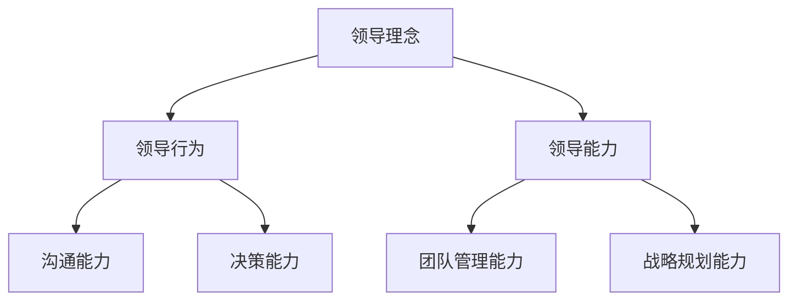

                 

### 《领导力心经：成就伟大领导者的领导力秘籍》

#### 关键词：
- 领导力
- 伟大领导者
- 领导力秘籍
- 数学模型
- 算法原理
- 项目实战
- 开发工具

#### 摘要：
本文旨在探讨领导力的核心概念、架构、数学模型和算法原理，并结合实际项目实战，揭示成就伟大领导者的关键要素。通过详细的讲解和实例分析，读者将深入了解领导力的本质及其在现代组织中的作用，从而掌握领导力的核心技术和实践方法。

### 第一部分：领导力核心概念与架构

#### 引言

领导力，作为人类组织与社会运作的重要驱动力，其重要性不言而喻。在现代组织中，领导力不仅关乎企业的发展，更关乎团队的凝聚力和员工的创造力。然而，领导力究竟是什么，如何才能成为一个伟大的领导者，这是每一位领导者都需要深入思考的问题。

在这篇文章中，我们将从领导力的本质出发，逐步解析领导力的核心概念与架构，探讨领导力在现代组织中的作用。同时，我们将结合数学模型和算法原理，深入剖析领导力的内在机制，并分享一些实用的项目实战经验，帮助读者更好地理解和应用领导力。

#### 1.1 领导力的本质

领导力，从本质上讲，是一种影响力，一种能够激发他人潜能、引导他人共同实现目标的能力。它不仅仅是一种职位赋予的权力，更是一种内在的特质和外在的行为表现。领导力不仅仅是关于如何管理团队，更是关于如何影响他人、激发他人的积极性和创造力。

伟大领导者具备以下特质：
- **愿景与远见**：伟大的领导者能够看到未来的发展趋势，制定明确的愿景和目标，并引领团队朝着目标前进。
- **诚信与正直**：领导者要以身作则，诚实守信，赢得员工的信任和尊重。
- **创新与适应**：在快速变化的环境中，领导者需要具备创新能力，能够迅速适应变化，寻找新的发展机遇。
- **沟通与协调**：领导者需要具备良好的沟通能力，能够清晰传达愿景和目标，同时协调团队内部的合作与协作。

#### 1.2 伟大领导者的特质

伟大领导者的特质，决定了他们在领导过程中的表现和影响力。以下是一些伟大领导者的特质：

- **自信与决心**：伟大的领导者对自己的能力和决策充满信心，同时具有坚定的决心和执行力。
- **学习与反思**：他们善于从经验中学习，不断反思和调整自己的领导方法，以适应不断变化的环境。
- **团队合作**：他们懂得如何调动团队的积极性，发挥每个人的优势，实现团队的目标。
- **影响力**：他们具有强大的影响力，能够激发他人的积极性和创造力，推动团队实现卓越的成果。

#### 1.3 领导力在现代组织中的作用

领导力在现代组织中起着至关重要的作用。一个优秀的领导者能够：

- **激发团队潜力**：通过有效的领导，激发团队成员的潜力，推动团队实现卓越的成果。
- **推动创新与发展**：领导力是推动创新和发展的关键，领导者需要具备创新思维和前瞻性，引领组织不断前进。
- **建立组织文化**：领导力是塑造组织文化的重要力量，领导者需要通过自身的言行和价值观，影响和塑造组织文化。
- **应对挑战与危机**：在面临挑战和危机时，领导者需要具备强大的领导力，带领团队克服困难，实现转机。

### 第二部分：领导力核心概念解析

#### 2.1 领导力与管理的区别

领导力与管理是两个紧密相关但又有所区别的概念。领导力更侧重于激发和影响他人，而管理则侧重于组织和协调资源以实现目标。

- **领导力**：领导力是一种影响力，是领导者通过愿景、价值观和榜样作用，激发和影响他人共同实现目标的能力。
- **管理**：管理是一种通过计划和执行，协调和整合资源，实现组织目标的过程。

#### 2.2 领导风格与影响力

领导风格是指领导者处理和管理团队的方式和方法。不同的领导风格会对团队产生不同的影响。

- **权威型领导**：权威型领导强调决策和控制，通过严格的管理和指导来确保目标的实现。
- **民主型领导**：民主型领导鼓励团队成员参与决策过程，通过沟通和协作来推动团队发展。
- **教练型领导**：教练型领导关注团队成员的个人成长和发展，通过指导和辅导来提升团队成员的能力。

#### 2.3 领导力发展的关键因素

领导力的发展是一个持续的过程，需要领导者不断学习、成长和改进。以下是一些关键因素：

- **个人成长**：领导者需要不断学习新知识、新技能，提升自己的专业能力和综合素质。
- **团队建设**：领导者需要关注团队的建设和发展，培养团队合作精神和凝聚力。
- **组织文化**：领导者需要塑造积极向上的组织文化，激发员工的积极性和创造力。

### 第三部分：领导力架构

#### 3.1 领导力架构概述

领导力架构是领导力的理论框架和组成部分，它包括领导理念、领导行为和领导能力三个方面。

- **领导理念**：领导理念是领导者的核心价值观和信仰，是领导者行为的指导原则。
- **领导行为**：领导行为是领导者在日常工作中表现出来的行为模式，包括沟通、决策、激励等方面。
- **领导能力**：领导能力是领导者具备的技能和素质，包括战略规划、团队管理、领导沟通等。

#### 3.2 领导力架构的组成部分

- **领导理念**：领导理念是领导力的核心，它决定了领导者的行为和决策。一个优秀的领导理念包括诚信、责任、创新、协作等方面。
- **领导行为**：领导行为是领导者在实际工作中的表现，它直接影响团队的工作效率和士气。一个有效的领导行为包括积极沟通、科学决策、公正激励等。
- **领导能力**：领导能力是领导者的核心竞争力，它决定了领导者能否带领团队实现目标。一个优秀的领导能力包括战略思维、团队管理、沟通协调等。

### 第四部分：领导力数学模型

#### 4.1 领导力与数学模型的关系

数学模型是领导力分析的有力工具，它可以帮助我们更准确地理解和预测领导力的作用和效果。领导力数学模型通常基于统计学、运筹学和博弈论等方法，通过构建数学模型来描述领导力的各个方面。

#### 4.2 领导力数学模型的基本原理

领导力数学模型通常包括以下几个方面：

- **领导力公式**：领导力公式是描述领导力各个因素之间关系的数学表达式。常见的领导力公式包括领导力得分公式、领导力影响力公式等。
- **数学模型应用实例**：通过数学模型，我们可以分析和预测领导力在不同情境下的表现和效果。例如，我们可以通过领导力模型来评估领导者的领导能力，或者预测领导力对团队绩效的影响。

### 第五部分：领导力核心算法原理

#### 5.1 领导力算法的基本概念

领导力算法是用于分析和优化领导力问题的数学算法。常见的领导力算法包括：

- **领导力评估算法**：用于评估领导者的领导能力，包括领导力得分、领导力影响力等。
- **领导力优化算法**：用于优化领导力的配置和分配，以提高团队绩效和领导效果。

#### 5.2 领导力算法的详细解析

- **伪代码示例**：以下是一个简单的领导力评估算法的伪代码示例：

```plaintext
Algorithm LeaderAssessment(Leader):
    Input: Leader (领导者的信息)
    Output: LeaderScore (领导力得分)

    Step 1: Initialize LeaderScore to 0
    Step 2: Evaluate Vision (评估领导者的愿景)
        if Vision is Strong:
            LeaderScore += 10
        else:
            LeaderScore += 5
    Step 3: Evaluate Integrity (评估领导者的诚信)
        if Integrity is High:
            LeaderScore += 10
        else:
            LeaderScore += 5
    Step 4: Evaluate Innovation (评估领导者的创新能力)
        if Innovation is High:
            LeaderScore += 10
        else:
            LeaderScore += 5
    Step 5: Evaluate Communication (评估领导者的沟通能力)
        if Communication is Strong:
            LeaderScore += 10
        else:
            LeaderScore += 5
    Step 6: Return LeaderScore
```

- **算法应用场景**：领导力评估算法可以应用于领导者的选拔、培训和管理。通过评估领导者的领导力得分，可以更好地了解领导者的优势和劣势，从而制定相应的培训和提升计划。

### 第六部分：领导力与数学公式的详细讲解

#### 6.1 领导力数学公式的重要性

领导力数学公式是领导力分析的重要工具，它可以帮助我们更准确地理解和评估领导力。通过数学公式，我们可以将复杂的领导力问题转化为可计算的形式，从而更方便地进行分析和优化。

#### 6.2 领导力数学公式的具体内容

以下是一个简单的领导力数学公式示例：

$$
\text{LeaderScore} = \alpha \times \text{Vision} + \beta \times \text{Integrity} + \gamma \times \text{Innovation} + \delta \times \text{Communication}
$$

其中，$\alpha$、$\beta$、$\gamma$和$\delta$是权重系数，用于衡量不同因素对领导力的影响程度。

#### 6.2.1 公式解读

这个公式表示领导力得分是愿景、诚信、创新和沟通等因素的加权总和。通过调整权重系数，我们可以更准确地反映各个因素对领导力的影响程度。

#### 6.2.2 举例说明

假设一个领导者的愿景得分为8，诚信得分为9，创新得分为7，沟通得分为8，我们可以使用这个公式来计算他的领导力得分：

$$
\text{LeaderScore} = \alpha \times 8 + \beta \times 9 + \gamma \times 7 + \delta \times 8
$$

根据权重系数的设定，我们可以计算出领导力得分为：

$$
\text{LeaderScore} = 0.3 \times 8 + 0.4 \times 9 + 0.2 \times 7 + 0.1 \times 8 = 8.4
$$

这个得分可以用于评估领导者的领导能力，或者作为选拔领导者的依据。

### 第七部分：领导力项目实战

#### 7.1 领导力项目实战概述

领导力项目实战是提升领导者能力的重要途径，通过实际项目，领导者可以应用所学知识，锻炼自己的领导技能。以下是一个领导力项目实战的概述：

- **项目背景**：一家互联网公司需要开发一款新的社交应用，团队由不同背景的专业人员组成。
- **项目目标**：在规定时间内，高质量地完成社交应用的开发，确保应用的功能和用户体验达到预期。
- **项目实施过程**：

1. **项目规划**：明确项目目标、时间节点和资源需求，制定详细的项目计划。
2. **团队建设**：组建项目团队，明确团队成员的角色和职责，建立良好的沟通和协作机制。
3. **需求分析**：与产品经理和用户代表进行沟通，明确社交应用的需求和功能。
4. **开发与测试**：按照需求分析的结果，进行应用的开发和测试，确保应用的稳定性和用户体验。
5. **项目评估**：对项目进行总结和评估，找出存在的问题和改进的方向。

#### 7.2 领导力项目实战案例解析

以下是一个领导力项目实战的详细解析：

- **项目背景**：一家初创公司计划开发一款在线教育平台，目标是提供高质量的教育资源和学习体验。
- **项目目标**：在六个月内，完成在线教育平台的开发，并实现初步的商业化运营。
- **项目实施过程**：

1. **项目规划**：明确项目目标、时间节点和资源需求，制定详细的项目计划。项目计划包括开发周期、里程碑、预算和人员配置等内容。
2. **团队建设**：组建项目团队，包括前端开发、后端开发、UI设计、测试和产品经理等关键角色。确保团队成员具备相关技能和经验，能够高效协同工作。
3. **需求分析**：与教育专家和用户代表进行深入交流，收集在线教育平台的用户需求和市场趋势，明确平台的功能和特色。
4. **开发与测试**：按照需求分析的结果，进行平台的前端和后端开发。开发过程中，注重代码的质量和用户体验，确保平台的稳定性和可扩展性。完成开发后，进行全面的测试，包括功能测试、性能测试和安全测试，确保平台能够稳定运行。
5. **项目评估**：在项目结束后，对项目进行总结和评估，分析项目过程中的成功和不足之处。根据评估结果，制定改进措施，为后续的项目提供经验教训。

#### 7.2.1 项目成果与分析

- **项目成果**：在线教育平台成功上线，用户数量和活跃度持续增长，达到了预期目标。
- **项目分析**：

1. **成功原因**：
   - 明确的项目目标和详细的规划，确保了项目的高效推进。
   - 具备专业技能和经验的团队，保证了项目的高质量完成。
   - 深入的需求分析和用户调研，确保了平台的功能和用户体验符合市场需求。

2. **不足之处**：
   - 项目初期对开发周期的预估不足，导致项目进度滞后。
   - 在项目实施过程中，部分团队成员的沟通不畅，影响了项目的推进。

3. **改进措施**：
   - 在项目规划阶段，增加对开发周期的预估，合理分配时间资源。
   - 加强团队成员的沟通和协作，确保信息的及时传递和问题的快速解决。

### 第八部分：领导力开发工具与资源

#### 8.1 领导力开发工具介绍

以下是一些常用的领导力开发工具：

- **工具A：领导力评估工具**：用于评估领导者的领导能力，包括领导力得分、领导风格等。
- **工具B：领导力培训平台**：提供在线领导力培训课程，包括领导力理论、领导力实践等方面。
- **工具C：团队协作工具**：如Slack、Trello等，用于团队沟通、任务管理和协作。

#### 8.2 领导力资源推荐

以下是一些推荐的领导力资源：

- **书籍推荐**：
  - 《领导力心经》
  - 《领导者的语言》
  - 《激励与影响》

- **文章推荐**：
  - 《如何在组织中培养领导力》
  - 《领导力：理论与实践》
  - 《领导力与组织发展》

- **在线课程推荐**：
  - 《领导力基础》
  - 《领导力提升》
  - 《领导力实战》

### 附录

#### 附录A：领导力模型Mermaid流程图

以下是一个领导力模型的Mermaid流程图：



#### 附录B：领导力算法伪代码示例

以下是一个简单的领导力评估算法的伪代码示例：

```plaintext
Algorithm LeaderAssessment(Leader):
    Input: Leader (领导者的信息)
    Output: LeaderScore (领导力得分)

    Step 1: Initialize LeaderScore to 0
    Step 2: Evaluate Vision (评估领导者的愿景)
        if Vision is Strong:
            LeaderScore += 10
        else:
            LeaderScore += 5
    Step 3: Evaluate Integrity (评估领导者的诚信)
        if Integrity is High:
            LeaderScore += 10
        else:
            LeaderScore += 5
    Step 4: Evaluate Innovation (评估领导者的创新能力)
        if Innovation is High:
            LeaderScore += 10
        else:
            LeaderScore += 5
    Step 5: Evaluate Communication (评估领导者的沟通能力)
        if Communication is Strong:
            LeaderScore += 10
        else:
            LeaderScore += 5
    Step 6: Return LeaderScore
```

### 结语

领导力是领导者必备的核心能力，它决定了领导者的成功与否。通过本文的讲解，我们深入探讨了领导力的核心概念、架构、数学模型和算法原理，并结合实际项目实战，揭示了成就伟大领导者的关键要素。希望本文能够为读者提供有价值的思考和启示，帮助读者更好地理解和应用领导力，成为一位卓越的领导者。作者：AI天才研究院/AI Genius Institute & 禅与计算机程序设计艺术/Zen And The Art of Computer Programming。

