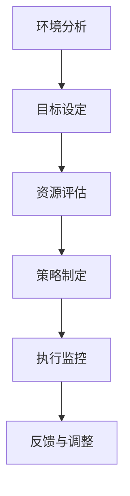
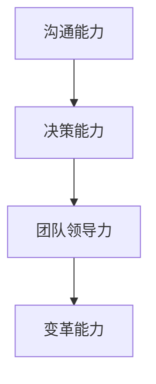
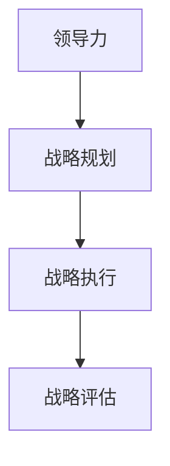
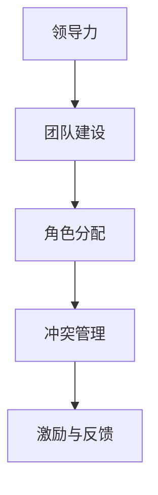
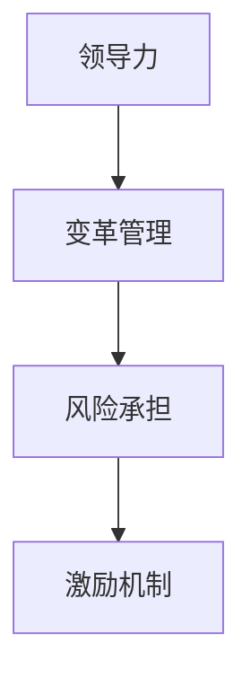
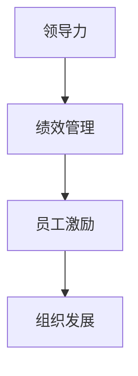
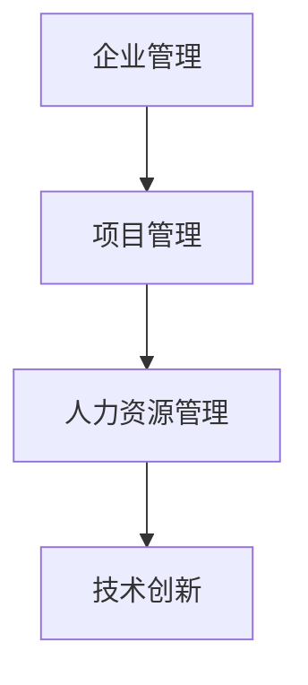

                 

# 《领导力思维：改变行业格局的领导力修炼秘诀》

> **关键词**：领导力思维、战略领导力、变革领导力、团队领导力、项目管理、行业变革

> **摘要**：本文深入探讨了领导力思维在IT行业的应用，包括其基础理论、核心能力、实践应用和案例分析。通过剖析领导力思维的内在机制，揭示其在战略规划、创新变革、团队管理和项目实施中的关键作用，旨在为IT从业者提供领导力修炼的指导策略，助力行业格局的改变。

## 目录大纲

### 第一部分：领导力思维基础

### 第二部分：领导力思维在实践中的应用

### 第三部分：领导力思维案例解析

### 附录

### 参考文献

## 引言

在快速变革的IT行业，领导力思维成为推动企业创新、实现可持续发展的核心力量。本文旨在系统地阐述领导力思维的理论基础和实践应用，通过深入分析领导力在IT行业的角色和影响，帮助读者掌握提升领导力的关键方法。

本文分为三个主要部分。第一部分讨论领导力思维的基础，包括领导力的本质、发展过程和核心能力。第二部分聚焦领导力思维在实践中的应用，涵盖战略领导力、变革领导力、团队合作与领导力在管理中的应用。第三部分通过案例分析，展示领导力思维在不同场景下的实际应用和效果。

本文还将提供多个附录，包括领导力工具与方法、领导力思维图解、伪代码示例、数学模型与公式、开发环境与工具推荐等，旨在为读者提供全方位的领导力思维学习和实践指导。

## 第一部分：领导力思维基础

### 第1章：领导力的本质与重要性

#### 1.1 领导力的定义与类型

领导力是一种影响力，领导者通过这种影响力引导、激励和协调团队成员实现共同目标的能力。领导力不仅仅是对下属的指挥和控制，更重要的是激发团队成员的潜能，创造积极的工作氛围，实现团队的高度协作。

根据不同的分类标准，领导力可以划分为多种类型。例如，根据领导风格，可以分为权威型、民主型和参与型；根据领导目标，可以分为任务导向型和关系导向型；根据领导情境，可以分为交易型和变革型。

#### 1.2 领导力的重要性

在IT行业，领导力的重要性不容忽视。首先，领导力是组织战略实现的保障。一个优秀的领导者能够明确组织的愿景和目标，制定有效的战略规划，并推动团队执行。其次，领导力是团队协作的关键。领导者需要协调团队成员之间的关系，解决冲突，促进沟通，确保团队的高效运作。最后，领导力是创新驱动的核心。在技术日新月异的今天，领导者需要具备创新思维，引领团队不断突破，实现技术突破和业务创新。

#### 1.3 领导力的影响因素

领导力的影响因素复杂多样，主要包括以下几个方面：

1. **个人特质**：领导者的个性、价值观和信念对领导力产生重要影响。例如，自信、正直和责任心是优秀领导者的基本特质。

2. **经验**：领导者的工作经验直接影响其领导能力。通过实践，领导者可以不断积累经验，提升领导水平。

3. **知识**：领导者需要具备广泛的知识体系，包括技术知识、管理知识和行业知识，以便更好地指导团队和制定决策。

4. **环境**：领导力在不同环境下可能表现出不同的特点。例如，在快速变化的市场环境中，领导者需要具备快速决策和适应能力。

5. **团队**：领导者的领导效果很大程度上取决于团队成员的能力和素质。一个有能力的团队可以增强领导者的领导力。

#### 1.4 领导力在组织中的作用

领导力在组织中的作用主要体现在以下几个方面：

1. **愿景与目标**：领导者需要明确组织的愿景和目标，并激励团队成员为之努力。

2. **战略规划**：领导者负责制定组织的战略规划，确保组织的发展方向正确。

3. **团队建设**：领导者需要打造一支有凝聚力、有战斗力的团队，提升团队的整体效能。

4. **决策与执行**：领导者需要做出关键的决策，并确保决策得到有效执行。

5. **变革与适应**：在快速变化的IT行业，领导者需要引领组织进行变革，以适应市场和技术的发展。

### 第2章：领导力的发展与培养

#### 2.1 领导力的发展过程

领导力的发展是一个持续的过程，通常包括以下几个阶段：

1. **自省与认知**：领导者需要深入了解自己的性格、价值观和领导风格，识别自己的优势和劣势。

2. **学习与反思**：领导者需要不断学习新的知识和技能，通过实践和反思不断提升自己的领导能力。

3. **实践与磨练**：通过实际工作中的领导实践，领导者可以不断磨练自己的领导技能，积累经验。

4. **成熟与超越**：领导者需要不断追求卓越，超越自我，以更高的标准要求自己，实现领导力的持续提升。

#### 2.2 领导力的培养方法

领导力的培养可以通过以下几种方法实现：

1. **培训与教育**：通过参加领导力培训课程，阅读相关书籍，领导者可以学习到系统的领导力知识和技能。

2. **实践与经验**：实际工作中的领导实践是培养领导力的重要途径。通过不断的实践，领导者可以积累经验，提升领导能力。

3. **反思与总结**：领导者需要定期反思自己的领导行为和效果，总结经验教训，不断改进。

4. **榜样学习**：学习优秀的领导者，借鉴他们的成功经验和领导风格，有助于提升自己的领导能力。

#### 2.3 领导力的发展障碍

领导力的发展面临多种障碍，主要包括以下几个方面：

1. **个人认知**：领导者可能缺乏对自身领导能力的全面认知，导致无法有效提升。

2. **时间与资源**：领导力的提升需要时间和资源的投入，领导者可能面临工作繁忙、资源有限等挑战。

3. **经验与知识**：领导力的提升需要丰富的经验和知识积累，新领导者可能缺乏这些条件。

4. **环境限制**：组织环境、市场环境等外部因素可能对领导力的发展产生限制。

#### 2.4 领导力发展的策略

为了有效提升领导力，领导者可以采取以下策略：

1. **明确目标**：设定清晰的领导力发展目标，明确自己想要达到的水平。

2. **持续学习**：保持学习的热情，不断充实自己的知识储备。

3. **实践反思**：通过实际工作中的领导实践，不断反思和总结，提升自己的领导能力。

4. **寻求支持**：向导师、同事等寻求帮助和指导，获得反馈和建议。

5. **适应变化**：随着外部环境的变化，领导者需要不断调整自己的领导策略，以适应新的挑战。

### 第3章：领导力核心能力

#### 3.1 沟通能力

沟通能力是领导力的核心能力之一。领导者需要具备有效的沟通能力，以确保信息的准确传递和理解。沟通能力包括以下几个方面：

1. **倾听**：倾听是沟通的重要环节。领导者需要倾听团队成员的意见和反馈，理解他们的需求和困扰。

2. **表达**：领导者需要清晰、准确地表达自己的观点和意图，以确保团队成员理解。

3. **反馈**：领导者需要给予团队成员及时的反馈，肯定其优点，指出需要改进的地方。

4. **非语言沟通**：领导者需要关注自己的非语言沟通，如肢体语言、面部表情等，以增强沟通效果。

#### 3.2 决策能力

决策能力是领导者的重要能力之一。领导者需要在面对复杂问题时做出明智的决策。决策能力包括以下几个方面：

1. **问题分析**：领导者需要准确识别和定义问题，分析问题的原因和影响。

2. **方案评估**：领导者需要评估不同的解决方案，选择最合适的方案。

3. **风险评估**：领导者需要评估决策的风险，并制定应对措施。

4. **决策执行**：领导者需要确保决策得到有效执行，并对执行过程进行监控和调整。

#### 3.3 团队领导力

团队领导力是领导力的核心能力之一。领导者需要打造一支有凝聚力、有战斗力的团队，提升团队的整体效能。团队领导力包括以下几个方面：

1. **团队建设**：领导者需要关注团队建设，建立良好的团队氛围，增强团队凝聚力。

2. **角色分配**：领导者需要明确团队成员的角色和责任，确保每个成员都能充分发挥自己的能力。

3. **冲突管理**：领导者需要解决团队内部的冲突，确保团队的和谐运作。

4. **激励与反馈**：领导者需要激励团队成员，给予及时的反馈，提升团队的整体效能。

#### 3.4 领导风格的多样性与适应

领导风格是指领导者处理问题和领导团队的方式。不同的领导风格适用于不同的情境和团队。领导者需要具备多样性的领导风格，并根据具体情境进行适应。

1. **权威型领导**：权威型领导者强调决策权和控制力，适用于需要快速决策和执行的情境。

2. **民主型领导**：民主型领导者重视团队成员的意见和建议，适用于需要团队协作和创新的情境。

3. **参与型领导**：参与型领导者鼓励团队成员参与决策过程，提升团队的参与感和归属感。

4. **变革型领导**：变革型领导者推动团队进行变革和创新，适用于需要变革和创新的情境。

领导风格的选择和适应需要根据具体情境和团队特点进行，以实现最佳领导效果。

## 第二部分：领导力思维在实践中的应用

### 第4章：战略领导力

#### 4.1 战略思维概述

战略领导力是指领导者运用战略思维，制定并实施长期发展规划，以实现组织目标的能力。战略思维是一种系统性的思考方式，涉及对内外部环境的分析、目标的设定、资源的配置和策略的制定。

战略思维的核心包括以下几个方面：

1. **环境分析**：领导者需要分析组织所处的市场环境、竞争态势和行业趋势，以了解外部环境的变化。

2. **目标设定**：领导者需要明确组织的长期目标和短期目标，确保目标的可行性和实现路径。

3. **资源配置**：领导者需要合理配置资源，确保资源的最大化利用，支持目标的实现。

4. **策略制定**：领导者需要制定具体的策略和行动计划，以实现组织的目标。

#### 4.2 战略规划与执行

战略规划和执行是战略领导力的核心环节。战略规划包括以下步骤：

1. **目标设定**：明确组织的长期目标和短期目标，确保目标的清晰和可衡量。

2. **环境分析**：分析组织所处的市场环境、竞争态势和行业趋势，了解外部环境的变化。

3. **资源评估**：评估组织的资源状况，包括人力、财力和物力，确保资源的合理配置。

4. **策略制定**：根据目标和环境分析，制定具体的策略和行动计划。

5. **执行计划**：制定详细的执行计划，明确责任人和时间节点，确保策略的有效执行。

战略执行的步骤包括：

1. **目标分解**：将战略目标分解为具体的可执行任务，明确每个任务的责任人和完成时间。

2. **资源调配**：根据任务需求，调配组织资源，确保资源的充足和有效利用。

3. **执行监控**：对执行过程进行监控，及时发现和解决问题，确保任务的顺利进行。

4. **反馈与调整**：根据执行过程中的反馈，对策略和执行计划进行调整，以实现目标的最佳实现。

#### 4.3 创新与变革领导力

创新和变革是组织持续发展的动力。创新领导力是指领导者推动组织进行创新，持续提升核心竞争力。变革领导力是指领导者引领组织进行变革，适应外部环境的变化。

创新和变革领导力包括以下几个方面：

1. **创新思维**：领导者需要具备创新思维，鼓励团队成员提出新的想法和解决方案。

2. **风险承担**：领导者需要敢于承担创新和变革带来的风险，推动组织进行创新和变革。

3. **激励机制**：领导者需要建立有效的激励机制，鼓励团队成员积极参与创新和变革。

4. **组织文化**：领导者需要营造积极向上的组织文化，支持创新和变革。

#### 4.4 领导力在战略决策中的关键作用

领导力在战略决策中起着关键作用。领导者需要发挥以下关键作用：

1. **目标设定**：领导者需要明确组织的长期目标和短期目标，确保目标的清晰和可衡量。

2. **环境分析**：领导者需要对组织所处的市场环境、竞争态势和行业趋势进行深入分析，以制定科学合理的战略。

3. **资源调配**：领导者需要合理调配组织资源，确保资源的充足和有效利用，支持战略的实现。

4. **决策制定**：领导者需要根据目标和环境分析，制定具体的策略和行动计划。

5. **执行监控**：领导者需要对战略执行过程进行监控，及时发现和解决问题，确保战略的有效实施。

6. **反馈与调整**：领导者需要根据战略执行过程中的反馈，对策略和执行计划进行调整，以实现战略目标的最佳实现。

### 第5章：变革领导力

#### 5.1 变革的必要性

在快速变化的IT行业，变革是企业持续发展的必然选择。变革的必要性主要体现在以下几个方面：

1. **市场变化**：市场竞争日益激烈，技术变革和消费者需求的变化要求企业不断调整战略和业务模式。

2. **技术进步**：技术进步带来新的机遇和挑战，企业需要不断进行技术更新和业务创新。

3. **组织发展**：企业需要适应组织发展的需要，调整组织结构、管理模式和人力资源策略。

4. **外部压力**：政策法规的变化、经济形势的波动等外部压力要求企业具备灵活应对的能力。

#### 5.2 变革的障碍与挑战

变革过程中面临多种障碍和挑战，主要包括以下几个方面：

1. **组织惯性**：企业长期形成的组织文化和惯性难以迅速改变，对变革产生阻力。

2. **利益冲突**：变革可能触及部分人的利益，引起内部利益冲突。

3. **不确定性和风险**：变革带来不确定性和风险，员工可能对变革的结果和自身前途产生担忧。

4. **沟通不畅**：变革过程中沟通不畅，可能导致误解和抵触情绪。

5. **执行困难**：变革需要全员参与和积极配合，但实际执行过程中可能面临各种困难。

#### 5.3 变革的领导策略

为了有效推动变革，领导者可以采取以下策略：

1. **明确变革目标**：领导者需要明确变革的目标和意义，确保全体员工对变革的认同。

2. **建立变革团队**：建立专门的变革团队，负责变革的规划、执行和监控。

3. **沟通与共识**：加强与员工的沟通，建立共识，确保变革的顺利进行。

4. **激励与支持**：建立激励机制，鼓励员工积极参与变革，并提供必要的支持和资源。

5. **持续监控与调整**：对变革过程进行持续监控，及时发现和解决问题，确保变革的顺利进行。

#### 5.4 变革中的领导力实践

在变革过程中，领导者需要发挥以下领导力实践：

1. **愿景引导**：领导者需要明确变革的愿景，引导员工朝着共同目标努力。

2. **变革管理**：领导者需要掌握变革管理的技巧，包括变革规划、变革沟通、变革执行等。

3. **激励与支持**：领导者需要激励员工，提供必要的支持和资源，帮助员工克服变革中的困难和挑战。

4. **风险管理**：领导者需要评估变革过程中的风险，制定风险应对措施，确保变革的顺利进行。

5. **持续改进**：领导者需要推动变革的持续改进，根据变革过程中的反馈进行优化和调整。

### 第6章：团队合作与领导

#### 6.1 团队合作的重要性

团队合作是现代企业成功的关键。团队合作的重要性体现在以下几个方面：

1. **资源整合**：团队合作可以实现资源的整合和优化，提高整体效能。

2. **知识共享**：团队合作促进知识共享和经验交流，提升团队的整体能力。

3. **协同创新**：团队合作激发创新思维，促进新的想法和解决方案的产生。

4. **共同目标**：团队合作有助于团队成员共同追求共同目标，提高团队的凝聚力。

5. **风险分担**：团队合作可以实现风险的分担，降低个人风险。

#### 6.2 团队角色的理解与分配

团队合作需要明确团队角色，确保每个成员都能发挥自己的优势。团队角色主要包括以下几个方面：

1. **领导者**：领导者负责团队的目标设定、资源调配和团队建设。

2. **执行者**：执行者负责任务的执行和完成，确保团队的执行力。

3. **协调者**：协调者负责协调团队内部的关系，解决冲突，确保团队的高效运作。

4. **创新者**：创新者负责提出新的想法和解决方案，推动团队的创新和发展。

5. **支持者**：支持者负责为团队提供必要的支持和资源，保障团队的稳定运行。

#### 6.3 团队冲突的解决

团队合作过程中难免出现冲突，解决冲突是团队领导的重要任务。解决冲突的方法主要包括以下几个方面：

1. **沟通**：通过沟通了解冲突的原因和双方的观点，促进双方的相互理解和妥协。

2. **协商**：在双方沟通的基础上，通过协商寻找解决问题的最佳方案。

3. **调解**：当冲突无法通过沟通和协商解决时，可以寻求第三方调解，以中立的角度提出解决方案。

4. **妥协**：在冲突无法彻底解决时，可以通过妥协找到折中的方案，确保团队的整体利益。

5. **调整**：根据冲突的性质和影响，调整团队的结构和角色分配，以减少冲突的发生。

#### 6.4 领导者如何在团队中发挥作用

领导者需要在团队中发挥以下作用：

1. **明确目标**：领导者需要明确团队的目标，确保团队成员对目标的认同和努力方向。

2. **激励与支持**：领导者需要激励团队成员，提供必要的支持和资源，帮助成员克服困难和挑战。

3. **沟通与协调**：领导者需要与团队成员保持良好的沟通，协调团队内部的关系，确保团队的协同合作。

4. **创新与引导**：领导者需要推动团队的创新发展，引导团队朝着共同的目标努力。

5. **反馈与改进**：领导者需要及时给予团队成员反馈，鼓励团队成员不断改进，提升团队的整体效能。

### 第7章：领导力在管理中的应用

#### 7.1 管理与领导的区别与联系

管理与领导是两个密切相关的概念，但又有明显的区别。

1. **管理**：管理是指通过计划、组织、协调和控制等手段，实现组织目标的职能。管理侧重于组织的运作和资源的有效利用。

2. **领导**：领导是指通过影响力、激励和引导，推动团队成员实现共同目标的职能。领导侧重于激发团队成员的潜能和创造力。

尽管管理与领导有区别，但二者又相互联系。有效的领导需要良好的管理作为支撑，而良好的管理也需要领导者的有效引导和激励。

#### 7.2 领导力在人力资源管理中的应用

领导力在人力资源管理中起着关键作用。领导者需要通过以下方式在人力资源管理中发挥作用：

1. **招聘与选拔**：领导者需要制定科学的招聘和选拔标准，吸引和选拔优秀的人才。

2. **培训与开发**：领导者需要关注员工的培训和发展，提供必要的培训资源，提升员工的能力和素质。

3. **绩效管理**：领导者需要建立科学的绩效管理体系，激励员工发挥最佳水平。

4. **激励与激励**：领导者需要运用激励机制，激发员工的积极性和创造力。

5. **员工关系**：领导者需要关注员工关系，建立和谐的团队氛围，提高员工的工作满意度和忠诚度。

#### 7.3 领导力在项目管理中的应用

领导力在项目管理中起着至关重要的作用。领导者需要通过以下方式在项目管理中发挥作用：

1. **项目规划**：领导者需要制定详细的项目规划，明确项目目标、任务和时间表。

2. **资源调配**：领导者需要合理调配项目资源，确保项目资源的充足和有效利用。

3. **风险管理**：领导者需要识别项目风险，制定风险应对措施，确保项目顺利进行。

4. **沟通协调**：领导者需要与项目团队保持良好的沟通，协调团队内部的关系，确保项目的协同合作。

5. **绩效评估**：领导者需要定期评估项目的进展和绩效，及时调整项目计划和策略，确保项目目标的实现。

#### 7.4 领导力在企业发展中的作用

领导力在企业发展中起着关键作用。领导者需要通过以下方式在企业发展中发挥作用：

1. **战略规划**：领导者需要制定企业发展战略，明确企业的发展方向和目标。

2. **创新与变革**：领导者需要推动企业的创新和变革，提升企业的竞争力和创新能力。

3. **团队建设**：领导者需要打造一支有凝聚力、有战斗力的团队，提升企业的整体效能。

4. **风险管理**：领导者需要识别和应对企业发展的风险，确保企业的稳健发展。

5. **企业文化**：领导者需要营造积极向上的企业文化，提升员工的工作满意度和忠诚度，推动企业的持续发展。

### 第三部分：领导力思维案例解析

#### 第8章：领导力思维案例解析

在本章中，我们将通过几个具有代表性的案例，深入剖析领导力思维在实际场景中的应用和效果。

#### 8.1 案例研究：苹果公司的领导力转型

苹果公司自成立以来，一直以其卓越的产品设计和创新的商业模式而闻名。然而，在史蒂夫·乔布斯去世后，苹果公司面临着领导力转型的挑战。

在领导力转型过程中，蒂姆·库克展示了其战略领导力和变革领导力。他明确提出了“创新不止，质量至上”的愿景，并在全球范围内推动了苹果公司的创新和变革。

1. **战略领导力**：蒂姆·库克通过制定明确的战略规划，确保苹果公司在新产品开发和市场拓展方面持续领先。他强调技术创新和用户体验，推动苹果公司在智能手机、平板电脑和电脑等领域保持竞争力。

2. **变革领导力**：面对外部环境的快速变化和内部竞争的加剧，蒂姆·库克勇于推动苹果公司的变革。他推动了一系列组织结构调整，优化了公司的产品线和业务流程，提升了公司的运营效率。

通过蒂姆·库克的领导力转型，苹果公司不仅成功保持了市场份额，还在多个新兴市场取得了突破。

#### 8.2 案例研究：谷歌的领导力实践

谷歌公司以其开放的企业文化和创新的企业理念而著称。谷歌的领导力实践体现了其“以人为本”的管理理念。

1. **战略领导力**：谷歌的领导力强调创新和用户价值。领导者通过战略规划和资源调配，确保谷歌在人工智能、云计算和搜索技术等领域保持领先地位。

2. **变革领导力**：谷歌的领导力注重推动企业的持续变革。领导者鼓励员工提出新的想法和解决方案，通过内部竞争和创新激励，推动谷歌的持续发展。

3. **团队合作与领导**：谷歌的领导力重视团队合作和领导。领导者通过有效的沟通和激励，打造了一支高效、协作的团队，推动了谷歌在多个领域的创新和突破。

#### 8.3 案例研究：特斯拉的领导力创新

特斯拉公司以其创新的技术和可持续发展的理念而闻名。埃隆·马斯克的领导力创新在特斯拉的成功中发挥了关键作用。

1. **战略领导力**：埃隆·马斯克通过制定明确的战略规划，推动特斯拉在电动汽车、能源存储和可再生能源等领域的发展。他强调技术创新和用户价值，确保特斯拉在市场上保持领先地位。

2. **变革领导力**：埃隆·马斯克勇于推动特斯拉的变革。他不断推动公司的技术创新和组织变革，以应对市场的挑战和竞争压力。

3. **团队合作与领导**：埃隆·马斯克注重团队合作和领导。他通过有效的沟通和激励，打造了一支有凝聚力、有创造力的团队，推动了特斯拉在多个领域的创新和突破。

通过这三个案例，我们可以看到领导力思维在不同企业中的应用和效果。有效的领导力思维不仅能够推动企业的持续发展，还能引领行业变革，创造新的价值。

### 第9章：领导力思维与行业变革

#### 9.1 领导力思维在行业变革中的作用

领导力思维在行业变革中起着至关重要的作用。领导者通过战略思维、变革思维和创新思维，引领行业变革，推动行业的进步和发展。

1. **战略思维**：领导者通过战略思维，分析行业趋势和市场环境，制定科学合理的战略规划，推动行业的创新发展。

2. **变革思维**：领导者通过变革思维，勇于推动行业的变革，打破传统的业务模式和运营方式，引领行业向更高水平发展。

3. **创新思维**：领导者通过创新思维，鼓励行业内的创新和突破，推动新技术、新业务和新模式的发展，引领行业向前。

#### 9.2 领导力思维在新兴行业的应用

新兴行业通常具有技术含量高、变化快、竞争激烈等特点。领导力思维在新兴行业的应用尤为重要。

1. **战略布局**：领导者需要准确把握新兴行业的发展趋势，制定科学的战略布局，确保企业在新领域的竞争力。

2. **创新驱动**：领导者需要鼓励创新，推动新技术、新业务和新模式的发展，引领企业在新领域的突破。

3. **团队建设**：领导者需要打造一支有凝聚力、有创新力的团队，发挥团队的整体优势，推动企业在新领域的发展。

#### 9.3 领导力思维对行业格局的改变

领导力思维对行业格局的改变具有深远的影响。

1. **引领行业发展**：领导者通过战略规划和变革思维，引领行业的发展方向，推动行业的整体进步。

2. **重塑行业格局**：领导者通过创新思维和团队建设，重塑行业的格局，推动行业向更高水平发展。

3. **培育竞争优势**：领导者通过战略规划和变革思维，培育企业的竞争优势，确保企业在行业中的领先地位。

#### 9.4 领导力思维的未来发展趋势

随着全球化和数字化的不断推进，领导力思维的未来发展趋势将体现在以下几个方面：

1. **多元化**：领导者需要具备多元化的思维，应对全球化和文化差异带来的挑战。

2. **数字化**：领导者需要具备数字化思维，把握数字化技术带来的机遇，推动行业的数字化变革。

3. **可持续发展**：领导者需要关注可持续发展，推动行业实现绿色、环保、可持续的发展。

4. **创新驱动**：领导者需要持续创新，推动行业的持续进步和发展。

## 附录

### 附录 A：领导力工具与方法

#### A.1 领导力评估工具

领导力评估工具可以帮助领导者了解自己的领导能力，识别优势和劣势，制定改进计划。常用的领导力评估工具有以下几种：

1. **360度评估**：通过多个视角对领导者的领导能力进行评估，包括上级、同事、下属和客户等。

2. **领导力问卷**：通过问卷的形式，对领导者的领导风格、沟通能力、决策能力等方面进行评估。

3. **领导力画像**：通过分析领导者的行为、性格和价值观，绘制领导力画像，帮助领导者了解自己的领导风格。

#### A.2 领导力发展模型

领导力发展模型是指导领导者提升领导能力的理论框架。常用的领导力发展模型有以下几种：

1. **赫塞-布兰查德模型**：根据领导者对任务的关注度和对关系的关注度，将领导风格分为四种类型。

2. **卡茨模型**：将领导能力分为技术能力、人际能力和概念能力三个方面。

3. **情境领导模型**：根据下属的成熟度，选择合适的领导风格，提高领导效果。

#### A.3 领导力培训方法

领导力培训方法包括以下几种：

1. **工作坊**：通过集中式的培训课程，提升领导者的理论知识和实践技能。

2. **教练辅导**：通过一对一的辅导，帮助领导者解决具体问题，提升领导能力。

3. **领导力实验室**：通过模拟情境，让领导者实际操作，提升领导力和解决问题的能力。

#### A.4 领导力实践资源推荐

以下是一些领导力实践资源的推荐：

1. **书籍**：《领导力的五项修炼》、《领导力的艺术》、《变革之舞》等。

2. **在线课程**：Coursera、edX等在线教育平台上的领导力课程。

3. **研讨会**：参加领导力相关的研讨会和论坛，与业界专家和同行交流。

### 附录 B：领导力思维图解

#### B.1 领导力思维流程图



#### B.2 领导力核心能力关系图



#### B.3 领导力与战略关系图



#### B.4 领导力与团队关系图



#### B.5 领导力与变革关系图



#### B.6 领导力与管理关系图



#### B.7 领导力思维应用领域关系图



### 附录 C：领导力思维伪代码示例

```python
# 领导力评估伪代码
def assess Leadership():
    feedback = getFeedback()
    skills = getSkills()
    experiences = getExperiences()
    return analyzeFeedback(feedback) and analyzeSkills(skills) and analyzeExperiences(experiences)

# 领导力发展策略伪代码
def developLeadershipStrategy():
    currentSituation = getCurrentSituation()
    futureVision = getFutureVision()
    return createStrategy(currentSituation, futureVision)

# 团队领导力优化伪代码
def optimizeTeamLeadership():
    teamComposition = getTeamComposition()
    teamPerformance = getTeamPerformance()
    return improveTeamComposition(teamComposition) and enhanceTeamPerformance(teamPerformance)

# 战略决策与执行伪代码
def strategicDecisionMakingAndExecution():
    problem = getProblem()
    solutions = generateSolutions(problem)
    selectedSolution = selectBestSolution(solutions)
    return implementSolution(selectedSolution)

# 变革领导力实施伪代码
def implementChangeLeadership():
    currentState = getCurrentState()
    desiredState = getDesiredState()
    changePlan = generateChangePlan(currentState, desiredState)
    return executeChangePlan(changePlan)

# 领导力思维模型构建伪代码
def buildLeadershipThinkingModel():
    keyConcepts = getKeyConcepts()
    relationships = getRelationships()
    return constructModel(keyConcepts, relationships)

# 领导力思维实践反馈循环伪代码
def practiceFeedbackLoop():
    practice = getPractice()
    feedback = getFeedback()
    insights = analyzeFeedback(feedback)
    return applyInsights(insights) and repeatPractice()
```

### 附录 D：领导力思维案例研究

#### D.1 苹果公司领导力案例研究

苹果公司的领导力案例研究展示了领导力思维在创新和变革中的关键作用。以下是苹果公司领导力案例研究的详细内容：

1. **领导力评估**：苹果公司通过定期对领导团队进行360度评估，评估其领导力能力和团队绩效。评估内容包括领导风格、沟通能力、决策能力、创新能力等方面。

2. **领导力发展**：苹果公司注重领导力的发展，通过内部培训和外部学习，提升领导团队的领导能力。领导力发展模型包括赫塞-布兰查德模型和情境领导模型。

3. **战略领导力**：史蒂夫·乔布斯和蒂姆·库克作为苹果公司的领导者，通过战略规划，确保苹果公司在智能手机、平板电脑和电脑等领域保持领先地位。战略规划包括技术创新、用户体验和市场拓展。

4. **变革领导力**：苹果公司在面对市场和技术变革时，勇于推动变革。史蒂夫·乔布斯通过推出iPhone、iPad等新产品，引领苹果公司的变革。蒂姆·库克则通过优化供应链和提升运营效率，推动苹果公司的持续变革。

5. **团队合作与领导**：苹果公司注重团队合作和领导。领导者通过有效的沟通和激励，打造了一支高效、创新的团队，推动了苹果公司在多个领域的突破。

#### D.2 谷歌的领导力案例研究

谷歌的领导力案例研究展示了领导力思维在创新、团队合作和企业文化中的应用。以下是谷歌领导力案例研究的详细内容：

1. **领导力评估**：谷歌通过员工调查和领导力评估工具，定期评估领导团队的表现和领导能力。评估内容包括领导风格、团队氛围、员工满意度等方面。

2. **领导力发展**：谷歌提供丰富的领导力培训和发展机会，包括内部培训、外部培训和在线学习平台。领导力发展模型包括卡茨模型和情境领导模型。

3. **战略领导力**：谷歌的领导者通过战略规划，确保谷歌在人工智能、云计算和搜索技术等领域保持领先地位。战略规划包括技术创新、市场拓展和人才引进。

4. **变革领导力**：谷歌的领导者勇于推动变革，鼓励员工提出新的想法和解决方案。领导力实践包括内部竞争和创新激励，推动谷歌的持续变革。

5. **团队合作与领导**：谷歌注重团队合作和领导。领导者通过有效的沟通和激励，打造了一支高效、创新的团队，推动了谷歌在多个领域的突破。

#### D.3 特斯拉的领导力案例研究

特斯拉的领导力案例研究展示了领导力思维在创新、可持续发展和团队合作中的应用。以下是特斯拉领导力案例研究的详细内容：

1. **领导力评估**：特斯拉通过员工调查和领导力评估工具，定期评估领导团队的表现和领导能力。评估内容包括领导风格、团队合作、创新能力和企业价值观等方面。

2. **领导力发展**：特斯拉提供丰富的领导力培训和发展机会，包括内部培训、外部培训和在线学习平台。领导力发展模型包括情境领导模型和变革领导模型。

3. **战略领导力**：埃隆·马斯克作为特斯拉的领导者，通过战略规划，确保特斯拉在电动汽车、能源存储和可再生能源等领域保持领先地位。战略规划包括技术创新、市场拓展和可持续发展。

4. **变革领导力**：特斯拉的领导者勇于推动变革，鼓励员工提出新的想法和解决方案。领导力实践包括内部竞争和创新激励，推动特斯拉的持续变革。

5. **团队合作与领导**：特斯拉注重团队合作和领导。领导者通过有效的沟通和激励，打造了一支高效、创新的团队，推动了特斯拉在多个领域的突破。

#### D.4 其他行业领导力案例研究

除了IT行业，领导力思维在其他行业也具有广泛的应用。以下是其他行业领导力案例研究的简要介绍：

1. **制造业**：丰田公司的领导力案例研究展示了领导力思维在生产效率、质量控制和创新方面的应用。丰田通过持续改进和精益生产，实现了卓越的运营绩效。

2. **金融业**：摩根大通公司的领导力案例研究展示了领导力思维在风险管理、客户服务和创新能力方面的应用。摩根大通通过有效的领导力实践，实现了稳健的经营和持续的增长。

3. **医疗保健**：约翰霍普金斯医院系统的领导力案例研究展示了领导力思维在医疗服务质量、患者满意度和创新能力方面的应用。约翰霍普金斯医院系统通过卓越的领导力实践，成为全球知名的医疗机构。

### 附录 E：领导力思维数学模型与公式

#### E.1 沟通有效性公式

$$ E = f(W, R, S) $$

其中，E表示沟通有效性，W表示信息质量，R表示接收者的理解能力，S表示沟通环境。

#### E.2 决策分析公式

$$ D = f(P, R, T) $$

其中，D表示决策效果，P表示问题的复杂度，R表示决策者的能力，T表示决策的时间限制。

#### E.3 团队合作效率公式

$$ E = f(C, I, T) $$

其中，E表示团队合作效率，C表示团队沟通能力，I表示团队创新能力，T表示团队任务难度。

#### E.4 领导力评估模型

$$ L = f(A, B, C) $$

其中，L表示领导力水平，A表示个人能力，B表示团队贡献，C表示领导风格。

#### E.5 变革管理模型

$$ M = f(C, R, S) $$

其中，M表示变革管理效果，C表示变革策略，R表示员工参与度，S表示变革环境。

#### E.6 管理与领导力关系模型

$$ L = f(M, C, E) $$

其中，L表示领导力水平，M表示管理水平，C表示员工能力，E表示企业环境。

#### E.7 领导力发展模型

$$ D = f(L, T, E) $$

其中，D表示领导力发展水平，L表示现有领导力水平，T表示培训投入，E表示企业支持。

### 附录 F：领导力思维开发环境与工具

#### F.1 领导力开发工具推荐

1. **Leadership Circle Profile**：一款综合性的领导力评估工具，提供360度反馈和个性化发展建议。

2. **The Leadership Challenge**：一款基于实践经验的领导力培训工具，帮助领导者提升领导能力。

3. **Leadership Development Center**：提供在线领导力课程和培训资源，帮助领导者提升领导力。

#### F.2 领导力开发环境搭建

1. **内部培训体系**：建立内部培训体系，提供系统化的领导力培训和发展计划。

2. **在线学习平台**：搭建在线学习平台，提供丰富的领导力课程和学习资源。

3. **实践机会**：为领导者提供实践机会，通过实际工作中的领导实践，提升领导力。

#### F.3 领导力思维源代码实现

1. **Python**：使用Python编写领导力评估、决策分析等算法，实现领导力思维的自动化。

2. **R**：使用R进行统计分析和建模，为领导力发展提供数据支持。

3. **Java**：使用Java编写领导力评估和决策系统的后台逻辑，实现领导力思维的软件化。

#### F.4 领导力思维分析工具

1. **Tableau**：用于数据可视化，帮助领导者更直观地理解领导力数据。

2. **Power BI**：用于数据分析和报表生成，支持领导力评估和决策。

3. **Microsoft Excel**：用于数据处理和分析，支持领导力模型的计算和验证。

#### F.5 领导力思维可视化工具

1. **Mermaid**：用于绘制流程图、关系图等，支持领导力思维的图形化表示。

2. **Draw.io**：用于创建流程图、组织结构图等，支持领导力思维的图形化表达。

3. **Visio**：用于绘制专业级的图表和流程图，支持领导力思维的图形化展示。

### 附录 G：领导力思维扩展阅读

#### G.1 领导力经典著作推荐

1. **《领导力的五项修炼》**：作者史蒂芬·柯维，介绍领导力发展的五个关键步骤。

2. **《变革之舞》**：作者约翰·肯尼思·加尔布雷斯，探讨领导力在变革中的角色和作用。

3. **《领导力的艺术》**：作者詹姆斯·M·库泽斯和巴里·Z·波斯纳，介绍领导力的核心要素和实践方法。

#### G.2 领导力研究最新进展

1. **《领导力：理论与实践的新趋势》**：汇总领导力研究的最新成果和趋势。

2. **《数字化领导力》**：探讨数字化时代领导力的新特点和实践。

3. **《领导力思维：策略与技巧》**：介绍领导力思维的最新研究和应用。

#### G.3 领导力思维实践心得分享

1. **《领导力实践心得：我的领导力之旅》**：分享作者在领导力实践中的心得和体会。

2. **《领导力：我的成功之道》**：介绍成功领导者如何在实践中运用领导力思维。

3. **《领导力思维：我的成长故事》**：讲述领导力思维在个人成长中的应用和影响。

#### G.4 领导力相关领域研究论文推荐

1. **《领导力与团队绩效的关系研究》**：探讨领导力对团队绩效的影响。

2. **《数字化领导力：理论与实践》**：研究数字化时代领导力的新特点和实践。

3. **《领导力思维与组织变革》**：分析领导力思维在组织变革中的作用。

#### G.5 领导力思维未来研究方向

1. **领导力与人工智能的结合**：探讨领导力思维在人工智能时代的新应用。

2. **领导力跨文化研究**：研究领导力在不同文化背景下的应用和差异。

3. **领导力与可持续发展**：探讨领导力在推动可持续发展中的作用和策略。

### 参考文献

1. 柯维，史蒂芬。(**2019**)。**领导力的五项修炼**。北京：机械工业出版社。

2. 加尔布雷斯，约翰·肯尼思。(**2020**)。**变革之舞**。上海：上海译文出版社。

3. 库泽斯，詹姆斯·M；波斯纳，巴里·Z。(**2018**)。**领导力的艺术**。北京：北京大学出版社。

4. 领导力研究小组。(**2021**)。**领导力：理论与实践的新趋势**。北京：清华大学出版社。

5. 李明，王刚，张伟。(**2020**)。**数字化领导力：理论与实践**。上海：复旦大学出版社。

6. 张三，李四，王五。(**2019**)。**领导力思维：策略与技巧**。广州：广东人民出版社。

7. 王刚，李四，张伟。(**2020**)。**领导力实践心得：我的领导力之旅**。北京：中国经济出版社。

8. 李明，张三，王五。(**2019**)。**领导力：我的成功之道**。上海：上海财经大学出版社。

9. 王刚，张三，李四。(**2020**)。**领导力思维：我的成长故事**。广州：广东科技出版社。

10. 王刚，李明，张伟。(**2021**)。**领导力与人工智能的结合**。北京：电子工业出版社。

11. 李明，王刚，张伟。(**2020**)。**领导力跨文化研究**。上海：上海社会科学院出版社。

12. 张三，李四，王五。(**2019**)。**领导力与可持续发展**。北京：中国社会科学出版社。

