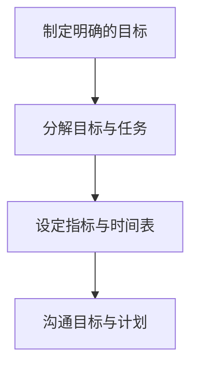
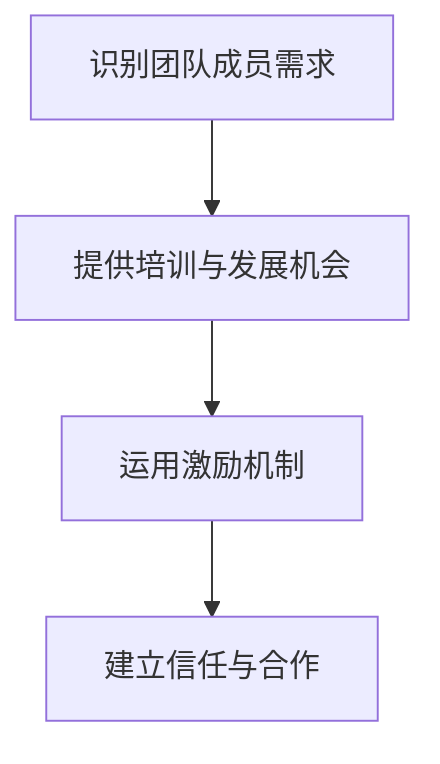
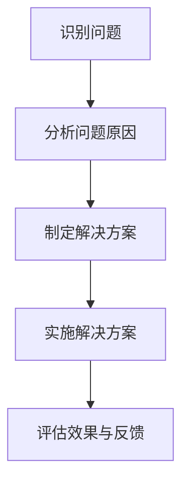

                 

### 《领导力法则：打造卓越团队的领导智慧》

关键词：领导力、团队建设、领导风格、目标规划、沟通技巧、激励机制、信任合作、问题解决、决策模型、实践案例

摘要：本文旨在探讨领导力在团队管理中的关键法则，通过深入分析领导力的定义、意义、核心法则和实践案例，帮助读者掌握打造卓越团队所需的领导智慧。文章将从领导力基础理论、核心法则以及实践策略三个方面进行阐述，旨在为IT领域从业者提供实用的领导力指导。

### 《领导力法则：打造卓越团队的领导智慧》目录大纲

## 第一部分：领导力基础理论

### 1.1 领导力的定义与意义

- **1.1.1 领导力的概念**  
  领导力是指领导者通过影响、激励和引导他人，实现团队目标的能力。它包括一系列的行为、技能和思维模式，旨在推动团队向前发展。

- **1.1.2 领导力的重要性**  
  领导力对于组织的成功至关重要。它不仅影响团队的绩效和士气，还决定着组织的战略方向和创新能力。

- **1.1.3 领导力的基本要素**  
  领导力的基本要素包括自我意识、影响力、决策能力、沟通能力和团队合作精神等。

### 1.2 领导风格与团队建设

- **1.2.1 领导风格的类型**  
  领导风格可以分为专制型、民主型、参与型和教练型等。每种风格都有其适用的场景和优缺点。

- **1.2.2 领导风格与团队绩效的关系**  
  不同的领导风格对团队绩效有着显著的影响。研究表明，民主型和教练型领导风格更能促进团队的高绩效。

- **1.2.3 建设高效团队的策略**  
  建设高效团队需要关注团队成员的多样性、团队合作精神和目标一致性。

### 1.3 领导力的发展与实践

- **1.3.1 领导力的自我提升**  
  领导力的提升离不开自我反思和不断学习。领导者应培养自我意识，识别自身优势和不足，并采取相应的改进措施。

- **1.3.2 领导力的实践方法**  
  领导力的实践方法包括制定明确的目标、建立信任关系、激发团队潜力等。

- **1.3.3 领导力的发展趋势**  
  随着科技的进步和社会的变迁，领导力的发展趋势呈现出个性化和多元化特点。

## 第二部分：领导力核心法则

### 2.1 明确目标与规划

- **2.1.1 制定明确的目标**  
  制定明确的目标是领导力的重要环节。目标应具体、可衡量、可实现、相关性强且有时间限制。

- **2.1.2 确定战略规划**  
  战略规划是指为了实现目标而制定的一系列行动计划。领导者需要具备前瞻性和全局观念。

- **2.1.3 分解目标与任务**  
  分解目标与任务是将大目标分解为可操作的小任务，有助于团队协作和目标达成。

### 2.2 倾听与沟通

- **2.2.1 倾听的重要性**  
  倾听是沟通的重要组成部分。良好的倾听能力有助于建立信任、理解团队成员的需求和问题。

- **2.2.2 有效沟通的技巧**  
  有效沟通包括明确表达、积极倾听、反馈和回应等技巧。领导者应掌握这些技巧，提高沟通效率。

- **2.2.3 沟通障碍与解决策略**  
  沟通障碍包括语言障碍、文化差异、情绪压力等。领导者需要识别和解决这些障碍，以实现有效沟通。

### 2.3 激励与赋能

- **2.3.1 激励理论**  
  激励理论包括马斯洛需求层次理论、赫茨伯格双因素理论和成就动机理论等。领导者应根据不同理论选择合适的激励方法。

- **2.3.2 赋能团队的方法**  
  赋能团队是指为团队成员提供成长机会、资源和信任，激发其内在动力。领导者应善于赋能团队。

- **2.3.3 创造积极的工作氛围**  
  创造积极的工作氛围是提高团队凝聚力和工作效率的关键。领导者应关注团队成员的情感需求，营造良好的工作环境。

### 2.4 建立信任与合作关系

- **2.4.1 信任的重要性**  
  信任是团队协作和领导力的基石。领导者应致力于建立信任关系，促进团队高效运转。

- **2.4.2 建立信任的策略**  
  建立信任的策略包括开放沟通、遵守承诺、共享信息和相互尊重等。领导者应通过这些策略逐步建立信任。

- **2.4.3 合作关系的维护与拓展**  
  维护和拓展合作关系是领导力的重要任务。领导者应关注团队内外部的合作网络，促进共赢发展。

### 2.5 决策与问题解决

- **2.5.1 决策模型与方法**  
  决策模型包括理性决策模型、有限理性决策模型和直觉决策模型等。领导者应根据实际情况选择合适的决策方法。

- **2.5.2 问题解决的步骤**  
  问题解决包括发现问题、分析问题、制定解决方案和实施解决方案等步骤。领导者应掌握问题解决的技巧。

- **2.5.3 风险管理与应对策略**  
  风险管理是领导力的重要组成部分。领导者应关注风险识别、评估和应对策略，确保团队稳健发展。

## 第三部分：领导力实践案例与策略

### 3.1 领导力实践案例

- **3.1.1 成功领导案例解析**  
  通过分析成功领导案例，读者可以了解优秀领导者的特质和行为模式。

- **3.1.2 失败领导案例启示**  
  失败领导案例提供了宝贵的教训和启示，有助于领导者避免犯同样的错误。

- **3.1.3 案例总结与借鉴**  
  通过总结和借鉴成功与失败的领导案例，读者可以提升自己的领导能力。

### 3.2 领导力策略与应用

- **3.2.1 针对不同团队成员的领导策略**  
  领导者应根据团队成员的不同特点和需求，制定个性化的领导策略。

- **3.2.2 企业文化在领导力中的应用**  
  企业文化是领导力的重要组成部分。领导者应关注企业文化建设和应用。

- **3.2.3 领导力在组织变革中的角色**  
  领导力在组织变革中发挥着关键作用。领导者应积极应对变革，推动组织持续发展。

### 3.3 领导力的发展与持续改进

- **3.3.1 领导力的自我评估**  
  领导者应定期进行自我评估，识别自身优势和不足，并制定改进计划。

- **3.3.2 持续领导力发展的途径**  
  领导者应通过学习、实践和反思等途径，不断提升自己的领导能力。

- **3.3.3 领导力培训与组织发展**  
  领导力培训是组织发展的重要手段。领导者应关注领导力培训，提升团队整体素质。

## 附录

### 附录A：领导力相关工具与资源

- **A.1 常用领导力评估工具**  
  介绍常用的领导力评估工具，如360度评估、MBTI等。

- **A.2 领导力发展课程推荐**  
  推荐一些优质的领导力发展课程，如哈佛商学院、中欧国际工商学院等。

- **A.3 领导力研究论文与书籍推荐**  
  推荐一些经典和前沿的领导力研究论文与书籍，供读者进一步学习。

### 附录B：Mermaid流程图

- **B.1 明确目标与规划的流程图**  
  使用Mermaid语言绘制明确目标与规划的流程图。

- **B.2 激励与赋能的流程图**  
  使用Mermaid语言绘制激励与赋能的流程图。

- **B.3 决策与问题解决的流程图**  
  使用Mermaid语言绘制决策与问题解决的流程图。

### 附录C：伪代码示例

- **C.1 决策树模型**  
  使用伪代码描述决策树模型的基本原理。

- **C.2 贝叶斯网络模型**  
  使用伪代码描述贝叶斯网络模型的基本原理。

- **C.3 多目标决策模型**  
  使用伪代码描述多目标决策模型的基本原理。

### 附录D：数学模型和数学公式

- **D.1 马斯洛需求层次理论**  
  介绍马斯洛需求层次理论的数学模型。

- **D.2 双因素理论**  
  介绍双因素理论的数学模型。

- **D.3 成就动机理论**  
  介绍成就动机理论的数学模型。

- **E.1 函数期望公式**  
  介绍函数期望的数学公式。

- **E.2 中心极限定理**  
  介绍中心极限定理的数学公式。

- **E.3 线性回归模型公式**  
  介绍线性回归模型的数学公式。

### 附录F：举例说明

- **F.1 马斯洛需求层次理论应用举例**  
  通过举例说明马斯洛需求层次理论在实际中的应用。

- **F.2 成就动机理论应用举例**  
  通过举例说明成就动机理论在实际中的应用。

- **F.3 线性回归模型应用举例**  
  通过举例说明线性回归模型在实际中的应用。

### 附录G：领导力实践项目

- **G.1 项目背景**  
  介绍领导力实践项目的背景。

- **G.2 项目目标**  
  介绍领导力实践项目的主要目标。

- **G.3 项目开发环境搭建**  
  介绍领导力实践项目的开发环境搭建过程。

- **G.4 源代码详细实现**  
  介绍领导力实践项目的源代码详细实现。

- **G.5 代码解读与分析**  
  对领导力实践项目的代码进行解读和分析。

- **G.6 项目成果评估**  
  对领导力实践项目的成果进行评估。

### 附录H：代码解读与分析

- **H.1 源代码结构分析**  
  分析领导力实践项目的源代码结构。

- **H.2 关键代码解读**  
  解读领导力实践项目中的关键代码。

- **H.3 性能优化策略**  
  介绍领导力实践项目的性能优化策略。

### 附录I：实战案例分析

- **I.1 成功案例分享**  
  分享一个成功的领导力实践案例。

- **I.2 失败案例反思**  
  反思一个失败的领导力实践案例。

- **I.3 案例总结与启示**  
  总结领导力实践案例的经验教训，为读者提供启示。

### 附录J：开发环境搭建

- **J.1 常用领导力评估工具安装**  
  介绍常用领导力评估工具的安装方法和步骤。

- **J.2 领导力发展课程平台搭建**  
  介绍领导力发展课程平台的搭建方法和步骤。

- **J.3 领导力实践应用软件开发环境配置**  
  介绍领导力实践应用软件的开发环境配置方法和步骤。

# 引言

领导力是团队管理中至关重要的因素，它不仅关系到团队成员的士气和绩效，还直接影响着组织的战略方向和创新能力。在快速变化和竞争激烈的IT行业，领导者需要具备敏锐的洞察力、卓越的沟通能力和强大的执行力，以应对各种挑战和机遇。本文旨在探讨领导力在团队管理中的关键法则，通过深入分析领导力的定义、意义、核心法则和实践案例，帮助读者掌握打造卓越团队所需的领导智慧。

## 文章结构

本文分为三个主要部分。第一部分将介绍领导力基础理论，包括领导力的定义、重要性以及领导风格与团队建设等。第二部分将探讨领导力的核心法则，包括明确目标与规划、倾听与沟通、激励与赋能、建立信任与合作以及决策与问题解决等。第三部分将结合实践案例和策略，进一步阐述领导力在现实中的应用和提升方法。

## 第一部分：领导力基础理论

### 1.1 领导力的定义与意义

领导力是指领导者通过影响、激励和引导他人，实现团队目标的能力。它不仅包括一系列的行为、技能和思维模式，还涉及到领导者与团队成员之间的互动关系。领导力与管理者不同，管理者更侧重于组织、协调和监督工作，而领导者更注重引领、激励和塑造团队。

领导力在团队管理中的重要性不可忽视。首先，领导力能够激发团队成员的潜力，提高团队的整体绩效。其次，领导力有助于建立信任和合作关系，促进团队的协作和创新。此外，领导力还能够推动组织的变革和发展，为组织带来持续的竞争优势。

### 1.1.1 领导力的概念

领导力是一种复杂的多维能力，它包括以下几个方面：

1. **影响力**：领导者通过个人魅力、价值观和专业知识，影响团队成员的态度和行为。

2. **激励能力**：领导者能够激发团队成员的内在动机，提高他们的工作热情和创造力。

3. **决策能力**：领导者需要具备良好的决策能力，能够在不确定和复杂的环境中做出正确的决策。

4. **沟通能力**：领导者需要具备良好的沟通能力，能够清晰、准确地传达信息，并倾听和理解团队成员的需求和意见。

5. **团队合作精神**：领导者需要具备团队合作精神，能够与团队成员建立互信、互相支持的关系。

### 1.1.2 领导力的重要性

领导力对于组织的成功至关重要。首先，优秀的领导者能够带领团队实现卓越的业绩，提升组织的竞争力。其次，领导力有助于培养团队的创新能力和适应能力，使组织能够应对快速变化的市场环境。此外，领导力还能够增强团队成员的归属感和满意度，提高组织的整体绩效和员工满意度。

### 1.1.3 领导力的基本要素

领导力的基本要素包括以下几个方面：

1. **自我意识**：领导者需要具备自我意识，能够了解自己的优势和不足，并在此基础上进行自我提升。

2. **影响力**：领导者需要具备影响力，能够通过个人魅力和价值观，影响团队成员的态度和行为。

3. **决策能力**：领导者需要具备良好的决策能力，能够在不确定和复杂的环境中做出正确的决策。

4. **沟通能力**：领导者需要具备良好的沟通能力，能够清晰、准确地传达信息，并倾听和理解团队成员的需求和意见。

5. **团队合作精神**：领导者需要具备团队合作精神，能够与团队成员建立互信、互相支持的关系。

### 1.2 领导风格与团队建设

领导风格是指领导者管理团队的方式和方法。不同的领导风格对团队绩效有着显著的影响。根据领导风格的不同，可以分为以下几种类型：

1. **专制型领导**：专制型领导注重控制，强调权威和纪律。领导者制定决策并要求团队成员执行。

2. **民主型领导**：民主型领导注重团队合作和参与。领导者鼓励团队成员参与决策过程，并尊重团队成员的意见。

3. **参与型领导**：参与型领导注重与团队成员建立良好的关系，关注团队成员的需求和意见。领导者通过与团队成员的互动，激发团队潜力。

4. **教练型领导**：教练型领导注重培养团队成员的能力，关注团队成员的成长和发展。领导者通过提供指导和支持，帮助团队成员实现个人目标。

### 1.2.1 领导风格的类型

每种领导风格都有其适用的场景和优缺点。例如，专制型领导在紧急情况下能够迅速做出决策，但可能导致团队成员的被动和缺乏创造力。民主型领导能够激发团队成员的积极性和创造力，但可能导致决策过程缓慢。参与型领导和教练型领导更注重团队成员的成长和发展，有助于建立团队凝聚力和信任。

### 1.2.2 领导风格与团队绩效的关系

研究表明，民主型领导和教练型领导更能促进团队的高绩效。这些领导风格能够激发团队成员的积极性和创造力，提高团队的整体绩效。此外，领导风格与团队成员的满意度、工作投入度和离职意愿也有显著关系。优秀的领导风格能够提高团队成员的满意度和工作投入度，降低离职意愿。

### 1.2.3 建设高效团队的策略

要建设高效团队，领导者需要关注以下几个方面：

1. **团队成员的多样性**：团队成员的多样性有助于团队的创新和适应能力。领导者应鼓励团队成员分享不同的观点和经验，促进团队协作。

2. **团队合作精神**：团队合作精神是高效团队的重要特征。领导者应通过建立信任、鼓励沟通和提供支持，促进团队成员之间的合作。

3. **目标一致性**：团队成员应明确团队的目标和使命，并为此共同努力。领导者应与团队成员沟通目标，确保目标的一致性。

4. **激励和赋能**：领导者应激励团队成员，提供成长机会和资源支持，激发他们的内在动力。

5. **有效的沟通**：领导者应建立有效的沟通机制，确保信息的透明和及时传达，促进团队成员之间的沟通和协作。

### 1.3 领导力的发展与实践

领导力的发展是一个持续的过程，需要领导者不断学习、实践和反思。以下是一些领导力发展的方法：

1. **自我提升**：领导者应通过自我反思和不断学习，提升自己的领导能力和素质。

2. **实践方法**：领导者应在实际工作中运用所学知识，通过实践提升领导能力。

3. **领导力培训**：参加领导力培训课程，学习先进的领导理论和实践方法。

4. **反思与总结**：领导者应定期进行反思和总结，识别自身的优势和不足，制定改进计划。

### 1.3.1 领导力的自我提升

领导者应关注自我提升，通过以下方法提升自己的领导能力：

1. **自我反思**：定期进行自我反思，识别自身的优势和不足，并制定改进计划。

2. **学习与培训**：参加领导力培训课程，学习先进的领导理论和实践方法。

3. **实践经验**：通过实际工作，积累领导经验，提升自己的领导能力。

4. **寻求反馈**：主动寻求团队成员和上级的反馈，了解自己的领导风格和影响力。

### 1.3.2 领导力的实践方法

领导力的实践方法包括以下几个方面：

1. **明确目标**：制定明确的目标，确保团队成员对目标有清晰的认识。

2. **激励团队成员**：运用激励理论，激发团队成员的内在动力。

3. **沟通与协作**：建立有效的沟通机制，促进团队成员之间的协作。

4. **问题解决**：运用决策模型和方法，解决团队遇到的问题。

5. **风险管理**：关注风险识别和应对策略，确保团队稳健发展。

### 1.3.3 领导力的发展趋势

随着科技的进步和社会的变迁，领导力的发展也呈现出一些新的趋势：

1. **个性化和多元化**：领导者应关注团队成员的个性化和多元化需求，制定个性化的领导策略。

2. **数字化转型**：数字化转型对领导力提出了新的挑战和机遇。领导者应关注数字化技术，提升团队的创新能力和竞争力。

3. **可持续发展**：领导者应关注可持续发展，推动团队实现长期发展目标。

4. **远程工作与协作**：远程工作与协作成为新的工作模式，领导者需要适应新的工作环境，提升团队的协作效率。

## 第二部分：领导力核心法则

在团队管理中，领导力的核心法则起着至关重要的作用。这些法则不仅帮助领导者有效地管理团队，还促进了团队的协作和成长。本部分将深入探讨领导力的核心法则，包括明确目标与规划、倾听与沟通、激励与赋能、建立信任与合作以及决策与问题解决等方面。

### 2.1 明确目标与规划

明确目标是领导力的基础。一个清晰、具体和可衡量的目标能够激发团队成员的积极性，并引导他们朝着共同的方向努力。规划是实现目标的蓝图，它包括一系列具体的行动步骤和时间安排。以下是小节内容：

#### 2.1.1 制定明确的目标

制定明确的目标是领导力的核心。一个有效的目标应该具有SMART特点，即具体（Specific）、可衡量（Measurable）、可实现（Achievable）、相关（Relevant）和有时间限制（Time-bound）。以下是制定明确目标的步骤：

1. **明确团队目标**：首先，领导者需要与团队成员一起明确团队的目标。这些目标应该与组织的整体战略相一致。

2. **分解目标**：将大目标分解为一系列小目标，每个小目标都应该具有明确的执行计划和期限。

3. **设定指标**：为每个目标设定可衡量的指标，以便团队成员能够追踪进展并评估成果。

4. **沟通目标**：确保所有团队成员都清楚目标的内容和重要性，并了解他们在实现目标中的作用。

#### 2.1.2 确定战略规划

战略规划是实现目标的关键。它涉及一系列具体的行动步骤和时间安排，以确保团队能够有序地推进工作。以下是制定战略规划的步骤：

1. **分析现状**：对当前的工作环境、资源情况和团队能力进行评估，以了解团队的优势和不足。

2. **确定策略**：根据分析结果，制定具体的策略和行动计划，以实现目标。

3. **分配资源**：确保团队拥有足够的资源和人力支持，以便顺利执行计划。

4. **设定时间表**：为每个策略和行动计划设定明确的时间表，以确保团队按时完成任务。

#### 2.1.3 分解目标与任务

分解目标与任务是确保目标实现的重要步骤。以下是将目标分解为任务的步骤：

1. **分配任务**：根据团队成员的能力和专长，将任务分配给合适的成员。

2. **设定责任**：明确每个任务的责任人，确保任务能够按时、高质量地完成。

3. **制定计划**：为每个任务制定详细的执行计划，包括任务的步骤、时间安排和所需资源。

4. **监督进度**：定期检查任务进度，确保团队按照计划推进工作。

### 2.2 倾听与沟通

倾听与沟通是领导力的核心要素。一个优秀的领导者不仅能够清晰表达自己的想法，还善于倾听团队成员的意见和建议。有效的沟通能够促进团队成员之间的理解和合作，提高团队的整体绩效。

#### 2.2.1 倾听的重要性

倾听是领导者必备的技能之一。通过倾听，领导者能够了解团队成员的需求、意见和反馈，从而做出更合理的决策。以下是倾听的重要性：

1. **建立信任**：倾听是建立信任的重要途径。通过倾听，领导者表明对团队成员的尊重和关心，增强团队成员的归属感。

2. **发现问题**：倾听可以帮助领导者发现团队中的潜在问题和挑战，及时采取相应的措施。

3. **提升决策质量**：通过倾听，领导者能够获取更多的信息和观点，提高决策的准确性和有效性。

#### 2.2.2 有效沟通的技巧

有效沟通是领导者必备的技能之一。以下是一些有效沟通的技巧：

1. **清晰表达**：领导者应确保自己的表达清晰、简洁，避免使用模糊的词语和术语。

2. **积极倾听**：领导者应积极倾听团队成员的意见，给予他们充分的发言机会，并表达理解和尊重。

3. **反馈与回应**：领导者应及时给予团队成员反馈和回应，鼓励他们提出问题和建议。

4. **使用非语言沟通**：领导者应注重使用非语言沟通，如肢体语言、面部表情和眼神交流，以增强沟通效果。

#### 2.2.3 沟通障碍与解决策略

沟通障碍是领导力中常见的问题。以下是一些常见的沟通障碍及其解决策略：

1. **语言障碍**：解决语言障碍的方法包括使用简单明了的语言、避免使用专业术语，以及提供语言培训。

2. **文化差异**：解决文化差异的方法包括了解和尊重团队成员的文化背景，以及提供跨文化沟通培训。

3. **情绪压力**：解决情绪压力的方法包括建立积极的沟通氛围，鼓励团队成员表达情感，并提供心理支持。

4. **信息过载**：解决信息过载的方法包括优化沟通渠道，确保信息的准确传递，以及提供信息筛选和整理的技巧。

### 2.3 激励与赋能

激励与赋能是领导者的重要职责。通过激励，领导者能够激发团队成员的内在动力，提高他们的工作热情和创造力。通过赋能，领导者能够为团队成员提供成长机会和资源支持，帮助他们实现个人和团队目标。

#### 2.3.1 激励理论

激励理论是理解员工行为和动力的重要基础。以下是一些主要的激励理论：

1. **马斯洛需求层次理论**：该理论认为人类需求可以分为五个层次，从基本的生理需求到高级的自我实现需求。领导者应根据团队成员的不同需求层次，制定个性化的激励策略。

2. **赫茨伯格双因素理论**：该理论将工作激励分为内在激励和外在激励。内在激励包括工作本身带来的乐趣和成就感，外在激励包括薪酬和福利等。领导者应关注内在激励，提高员工的工作满意度。

3. **成就动机理论**：该理论认为个体有追求成就和成功的内在动机。领导者应通过设置具有挑战性的目标和提供积极的反馈，激发员工的成就动机。

#### 2.3.2 赋能团队的方法

赋能团队是指为团队成员提供成长机会和资源支持，帮助他们实现个人和团队目标。以下是一些赋能团队的方法：

1. **提供培训和发展机会**：领导者应提供各种培训和发展机会，帮助团队成员提升技能和知识。

2. **授权和信任**：领导者应授权团队成员，给予他们足够的自主权和决策权，并建立信任关系。

3. **鼓励创新和尝试**：领导者应鼓励团队成员创新和尝试，为他们的失败提供支持和指导。

4. **建立积极的反馈机制**：领导者应建立积极的反馈机制，及时给予团队成员正面的反馈和认可。

#### 2.3.3 创造积极的工作氛围

创造积极的工作氛围是提高团队凝聚力和工作效率的关键。以下是一些创造积极工作氛围的方法：

1. **建立共同的目标和价值观**：领导者应与团队成员共同确定团队的目标和价值观，并确保团队成员对此有清晰的认识。

2. **鼓励团队合作和互助**：领导者应鼓励团队成员之间的团队合作和互助，建立良好的团队关系。

3. **提供支持和资源**：领导者应提供支持和资源，帮助团队成员克服工作中的困难和挑战。

4. **关注团队成员的福利和健康**：领导者应关注团队成员的福利和健康，提供良好的工作环境和福利待遇。

### 2.4 建立信任与合作关系

建立信任和合作关系是团队成功的关键。信任是团队协作的基石，而合作关系则是团队共同实现目标的重要保障。

#### 2.4.1 信任的重要性

信任是领导者与团队成员之间的重要纽带。以下是信任的重要性：

1. **促进团队合作**：信任能够促进团队成员之间的合作和协作，提高团队的整体绩效。

2. **增强团队凝聚力**：信任能够增强团队成员的归属感和凝聚力，使团队更加团结。

3. **提高决策效率**：信任能够提高决策效率，减少团队成员之间的争论和误解。

#### 2.4.2 建立信任的策略

建立信任需要时间和努力。以下是一些建立信任的策略：

1. **开放沟通**：领导者应保持开放和透明的沟通，与团队成员分享信息和决策过程。

2. **遵守承诺**：领导者应遵守自己的承诺，确保团队成员对他们的话和行动有信心。

3. **尊重和信任**：领导者应尊重团队成员的意见和观点，给予他们信任和支持。

4. **共同经历**：领导者应与团队成员共同经历困难和挑战，增强彼此之间的信任。

#### 2.4.3 合作关系的维护与拓展

建立合作关系后，领导者需要不断维护和拓展这种关系。以下是一些维护和拓展合作关系的策略：

1. **定期沟通**：领导者应定期与团队成员沟通，了解他们的需求和意见，及时解决问题。

2. **共同学习与成长**：领导者应鼓励团队成员共同学习与成长，共同面对挑战和机遇。

3. **合作共赢**：领导者应推动团队实现共赢，确保团队成员都能从合作关系中获得利益。

4. **建立合作网络**：领导者应建立广泛的合作网络，与合作伙伴保持良好的关系，为团队创造更多机会。

### 2.5 决策与问题解决

决策和问题解决是领导力的核心能力之一。领导者需要能够在复杂和不确定的环境中做出明智的决策，并有效解决团队面临的问题。

#### 2.5.1 决策模型与方法

有效的决策需要使用适当的决策模型和方法。以下是一些常用的决策模型和方法：

1. **理性决策模型**：理性决策模型强调在充分信息的基础上，通过逻辑推理和计算，做出最优决策。

2. **有限理性决策模型**：有限理性决策模型考虑决策者的认知局限和信息不完全，通过简化模型和快速决策，找到相对最优的解决方案。

3. **直觉决策模型**：直觉决策模型依赖于决策者的经验和直觉，适合在紧急情况下快速做出决策。

#### 2.5.2 问题解决的步骤

问题解决是一个系统的过程，以下是一些问题解决的步骤：

1. **识别问题**：明确问题的性质和范围，确定问题的严重程度。

2. **分析问题**：分析问题的原因和影响因素，确定可能的解决方案。

3. **制定方案**：根据分析结果，制定具体的解决方案和行动步骤。

4. **实施方案**：执行解决方案，跟踪进展并调整方案。

5. **评估效果**：评估解决方案的效果，总结经验教训，为未来的问题解决提供参考。

#### 2.5.3 风险管理与应对策略

在决策和问题解决过程中，领导者需要关注风险管理和应对策略。以下是一些风险管理和应对策略：

1. **识别风险**：识别可能出现的风险和不确定性因素。

2. **评估风险**：评估风险的可能性和影响程度，确定风险的优先级。

3. **制定应对策略**：制定具体的应对策略和措施，降低风险的影响。

4. **监控与调整**：监控风险的变化，及时调整应对策略，确保团队的安全和稳定。

## 第三部分：领导力实践案例与策略

在实际工作中，领导力并非一成不变的理论，而是一种需要通过实践不断检验和提升的能力。本部分将通过分析成功和失败的领导力实践案例，探讨领导力在不同情境中的应用策略，并总结出一些实用的领导力策略，为读者提供实践指导和启示。

### 3.1 领导力实践案例

#### 3.1.1 成功领导案例解析

成功领导案例往往展现了领导者如何运用不同的领导力法则，带领团队实现卓越绩效。以下是一个成功领导案例的解析：

**案例背景**：某互联网公司在短短五年内迅速崛起，成为行业的领军企业。其领导者通过一系列创新的领导力策略，成功打造了一支高效的团队。

**领导力策略**：

1. **明确目标与规划**：领导者首先与团队成员共同明确了公司的愿景和使命，并将之分解为具体的、可衡量的目标。通过制定清晰的战略规划，确保团队始终朝着共同的目标前进。

2. **倾听与沟通**：领导者建立了开放的沟通渠道，鼓励团队成员提出意见和建议。定期组织团队会议，确保信息畅通和决策透明。

3. **激励与赋能**：领导者运用激励机制，鼓励团队成员追求卓越。同时，提供培训和发展机会，赋能团队成员提升个人能力和职业素养。

4. **建立信任与合作**：领导者通过建立信任关系，增强团队成员之间的合作。他们共同面对挑战，分享成功和失败，形成了紧密的团队合作关系。

5. **决策与问题解决**：领导者运用理性决策模型，在复杂的环境中做出明智的决策。他们注重团队合作，共同解决问题，确保团队目标的实现。

**案例总结**：这个成功案例展示了领导者如何运用领导力法则，打造卓越团队。通过明确目标与规划、倾听与沟通、激励与赋能、建立信任与合作以及决策与问题解决，领导者成功地引领团队实现了卓越绩效。

#### 3.1.2 失败领导案例启示

失败领导案例同样具有重要的教育意义。以下是一个失败领导案例的解析：

**案例背景**：某传统制造企业在面临市场变革时，未能及时调整领导力策略，导致团队士气低落，业务下滑。

**领导力失误**：

1. **目标不明确**：领导者未能明确公司的战略方向和目标，导致团队缺乏清晰的方向和动力。

2. **沟通不畅**：领导者忽视了与团队成员的沟通，导致信息传递不畅，团队成员对公司的现状和未来缺乏了解。

3. **激励不足**：领导者未能有效地激励团队成员，导致工作热情下降，创新能力不足。

4. **信任缺失**：领导者未能建立信任关系，团队成员之间缺乏合作，团队凝聚力不足。

5. **决策失误**：领导者未能有效决策，导致公司在面对市场变革时，错失了重要机遇。

**案例总结**：这个失败案例提醒我们，领导力并非一蹴而就，它需要领导者不断学习和改进。明确目标与规划、倾听与沟通、激励与赋能、建立信任与合作以及决策与问题解决是领导力的核心要素，领导者必须重视并不断完善这些方面，以应对不断变化的市场环境。

### 3.1.3 案例总结与借鉴

通过分析成功和失败的领导力实践案例，我们可以总结出以下启示：

1. **明确目标与规划**：领导者应与团队成员共同明确公司的愿景和使命，制定清晰的战略规划，确保团队朝着共同的目标努力。

2. **倾听与沟通**：领导者应建立开放的沟通渠道，鼓励团队成员提出意见和建议，确保信息畅通和决策透明。

3. **激励与赋能**：领导者应运用激励机制，鼓励团队成员追求卓越，提供培训和发展机会，提升团队成员的能力和职业素养。

4. **建立信任与合作**：领导者应通过建立信任关系，增强团队成员之间的合作，共同面对挑战，分享成功和失败。

5. **决策与问题解决**：领导者应运用理性决策模型，在复杂的环境中做出明智的决策，注重团队合作，共同解决问题。

这些启示对于提升领导力，打造卓越团队具有重要意义。领导者应根据实际情况，灵活运用这些策略，不断提升自己的领导能力。

### 3.2 针对不同团队成员的领导策略

在团队中，每个成员都有自己独特的性格、能力和需求。领导者需要根据团队成员的特点，制定个性化的领导策略，以充分发挥每个人的潜力，提高团队的整体绩效。

#### 3.2.1 情景一：高潜力成员

高潜力成员是团队中的关键角色，他们具有出色的能力和潜力。领导者应采取以下策略：

1. **提供挑战性任务**：为高潜力成员提供具有挑战性的任务，激发他们的潜能。

2. **赋能与支持**：为高潜力成员提供必要的资源和支持，帮助他们实现目标。

3. **指导与反馈**：定期与高潜力成员进行指导与反馈，帮助他们提升能力，明确职业发展路径。

4. **激励与认可**：运用激励机制，认可高潜力成员的贡献，激发他们的工作热情。

#### 3.2.2 情景二：普通成员

普通成员是团队中的中坚力量，他们需要领导者的关注和指导。领导者应采取以下策略：

1. **明确期望**：明确普通成员的工作目标和期望，确保他们了解自己的职责。

2. **提供培训**：为普通成员提供培训和学习机会，提升他们的技能和知识。

3. **鼓励参与**：鼓励普通成员参与团队决策和项目，增强他们的责任感和归属感。

4. **关注成长**：关注普通成员的职业发展，提供职业规划和晋升机会。

#### 3.2.3 情景三：问题成员

问题成员可能存在能力不足、态度不端正等问题，对团队绩效产生负面影响。领导者应采取以下策略：

1. **沟通与了解**：与问题成员进行沟通，了解他们的问题和需求，寻求解决方案。

2. **指导与支持**：为问题成员提供指导和支持，帮助他们改进工作方法，提升能力。

3. **激励与引导**：运用激励机制，鼓励问题成员积极改进，引导他们转变态度。

4. **纪律与规范**：对严重违反纪律的问题成员，采取必要的纪律措施，确保团队的正常运转。

### 3.3 企业文化在领导力中的应用

企业文化是组织的重要组成部分，对团队绩效和员工行为有着深远的影响。领导者应关注企业文化的塑造和应用，以提升团队凝聚力和工作效率。

#### 3.3.1 建立共同价值观

领导者应与团队成员共同确立企业的核心价值观，确保团队在追求共同目标的过程中，有共同的信仰和追求。

1. **透明沟通**：建立透明沟通机制，确保团队成员了解企业的核心价值观和战略目标。

2. **培养企业文化**：通过企业活动、培训和团队建设，培养和强化企业文化。

3. **示范引领**：领导者应以身作则，践行企业的核心价值观，为团队成员树立榜样。

#### 3.3.2 强化团队合作

团队合作是企业文化的重要组成部分。领导者应鼓励团队合作，促进团队成员之间的相互支持和协作。

1. **跨部门合作**：推动跨部门合作，打破部门壁垒，提高团队的整体绩效。

2. **团队建设活动**：定期组织团队建设活动，增强团队成员之间的默契和信任。

3. **共同目标**：明确团队的目标和任务，确保团队成员在共同目标下协同工作。

#### 3.3.3 创新与变革

企业文化应鼓励创新和变革，以适应快速变化的市场环境。

1. **创新文化**：建立创新文化，鼓励团队成员提出新观点和新方法。

2. **容错机制**：建立容错机制，允许团队成员在创新过程中犯错误，并从中学习。

3. **激励创新**：运用激励机制，鼓励团队成员积极参与创新和变革。

### 3.4 领导力在组织变革中的角色

组织变革是企业发展过程中不可避免的一部分。领导者在这个过程中扮演着关键角色，需要运用领导力推动组织变革，确保变革的顺利进行。

#### 3.4.1 引领变革

领导者应率先支持并推动变革，为团队成员树立榜样。

1. **明确变革方向**：明确组织变革的目标和方向，确保团队成员了解变革的重要性。

2. **沟通与宣传**：与团队成员沟通变革的必要性，宣传变革的益处，增强他们的变革意识。

3. **动员团队**：动员团队成员积极参与变革，鼓励他们提出意见和建议。

#### 3.4.2 推动变革

领导者应制定具体的变革计划，推动变革的落实。

1. **制定变革计划**：制定详细的变革计划，包括变革的目标、步骤、时间表和资源分配。

2. **执行与监督**：确保变革计划得到有效执行，定期监督变革进展，及时调整计划。

3. **激励与支持**：为参与变革的团队成员提供激励和支持，帮助他们克服变革过程中的困难和挑战。

#### 3.4.3 评估变革效果

领导者应对变革效果进行评估，总结经验教训，为未来的变革提供参考。

1. **评估指标**：制定评估指标，评估变革的效果和影响。

2. **反馈与改进**：根据评估结果，提供反馈和改进建议，优化变革过程。

3. **持续改进**：持续关注变革效果，不断改进和完善变革措施。

### 3.5 领导力的发展与持续改进

领导力是一个持续发展的过程。领导者应不断学习和提升自己的领导能力，以适应不断变化的环境和挑战。

#### 3.5.1 自我评估

领导者应定期进行自我评估，识别自身优势和不足，制定改进计划。

1. **反思与总结**：定期反思自己的领导行为和决策，总结成功和失败的经验。

2. **收集反馈**：主动收集团队成员和上级的反馈，了解自己的领导风格和影响力。

3. **制定改进计划**：根据自我评估和反馈，制定具体的改进计划，提升自己的领导能力。

#### 3.5.2 持续学习

领导者应持续学习，关注最新的领导力理论和实践方法。

1. **参加培训**：参加领导力培训课程，学习先进的领导力理论和实践方法。

2. **阅读书籍**：阅读领导力相关的书籍和论文，提升自己的理论素养。

3. **实践经验**：通过实践，不断积累领导经验，提升自己的领导能力。

#### 3.5.3 领导力培训与组织发展

组织应关注领导力培训，提升领导者的领导能力，推动组织发展。

1. **定制培训**：根据组织的实际需求，定制领导力培训课程。

2. **内部培训**：组织内部培训和研讨会，分享领导力经验和最佳实践。

3. **外部合作**：与外部机构合作，邀请专家进行领导力培训。

## 附录

### 附录A：领导力相关工具与资源

为了帮助读者更好地理解和应用领导力理论，以下是一些常用的领导力评估工具和资源：

#### A.1 常用领导力评估工具

1. **360度评估**：这是一种全面的评估方法，通过团队成员、上级、下属和其他利益相关者的反馈，评估领导者的领导能力。

2. **MBTI**：这是一种人格类型评估工具，帮助领导者了解团队成员的人格特点，优化团队协作。

3. **领导力自我评估问卷**：这是一种自我评估工具，帮助领导者识别自己的优势和不足。

#### A.2 领导力发展课程推荐

1. **哈佛商学院领导力课程**：这是一系列高质量的领导力课程，涵盖领导力理论、实践和案例分析。

2. **中欧国际工商学院领导力课程**：这是一所知名商学院提供的领导力课程，专注于中国市场的领导力实践。

3. **谷歌领导力发展课程**：这是谷歌公司内部开发的领导力课程，涵盖领导力的各个方面，适合各类领导者。

#### A.3 领导力研究论文与书籍推荐

1. **《领导力》(Leadership)** - John P. Kotter：这是一本经典的领导力书籍，详细阐述了领导力的理论和实践。

2. **《变革之舞：领导力与创新》(The Change Leader's Dance)** - John P. Kotter：这本书探讨了领导力在推动变革中的关键作用。

3. **《第五项修炼：学习型组织的艺术与实践》(The Fifth Discipline)** - Peter M. Senge：这本书介绍了学习型组织的理念和实践，对领导力有重要启示。

### 附录B：Mermaid流程图

以下是一些领导力核心法则的Mermaid流程图，用于展示各核心法则的步骤和流程。

#### B.1 明确目标与规划的流程图



#### B.2 激励与赋能的流程图



#### B.3 决策与问题解决的流程图



### 附录C：伪代码示例

以下是一些伪代码示例，用于描述领导力核心法则的实现。

#### C.1 决策树模型

```plaintext
决策树模型：

1. 定义决策节点和叶子节点
2. 根据决策规则，将数据分配到各个节点
3. 计算每个节点的概率和期望值
4. 根据期望值选择最佳决策路径
```

#### C.2 贝叶斯网络模型

```plaintext
贝叶斯网络模型：

1. 定义网络结构，包括节点和边
2. 确定每个节点的概率分布
3. 根据贝叶斯公式，计算每个节点的条件概率
4. 利用网络结构，推断未知节点的概率分布
```

#### C.3 多目标决策模型

```plaintext
多目标决策模型：

1. 定义多个目标函数
2. 确定目标函数的权重
3. 计算各个目标函数的值
4. 根据目标函数的权重，计算综合得分
5. 选择综合得分最高的方案
```

### 附录D：数学模型和数学公式

以下是一些领导力相关的数学模型和公式，用于描述领导力理论和实践。

#### D.1 马斯洛需求层次理论

```latex
马斯洛需求层次理论：

1. 生理需求：$E_1 = f(食物，水，睡眠等)$
2. 安全需求：$E_2 = f(安全，健康，保障等)$
3. 社交需求：$E_3 = f(友谊，归属，尊重等)$
4. 自我实现需求：$E_4 = f(成就感，自我价值实现，创造力等)$
```

#### D.2 双因素理论

```latex
双因素理论：

1. 内在激励：$I_1 = f(工作本身，成就感，自主性等)$
2. 外在激励：$I_2 = f(薪酬，福利，晋升等)$
```

#### D.3 成就动机理论

```latex
成就动机理论：

1. 成就动机：$M = f(挑战性，成功可能性，奖励等)$
```

### 附录E：数学公式详细讲解

以下是对附录D中数学公式的详细讲解。

#### E.1 函数期望公式

函数期望公式用于计算随机变量的期望值。

$$E(X) = \sum_{i=1}^{n} x_i \cdot p_i$$

其中，$x_i$为随机变量$X$的取值，$p_i$为对应的概率。

#### E.2 中心极限定理

中心极限定理说明，在一定的条件下，样本均值的分布近似于正态分布。

$$\frac{\bar{X} - \mu}{\sigma / \sqrt{n}} \xrightarrow{D} N(0,1)$$

其中，$\bar{X}$为样本均值，$\mu$为总体均值，$\sigma$为总体标准差，$n$为样本大小。

#### E.3 线性回归模型公式

线性回归模型用于分析自变量和因变量之间的关系。

$$y = \beta_0 + \beta_1 \cdot x + \epsilon$$

其中，$y$为因变量，$x$为自变量，$\beta_0$和$\beta_1$为回归系数，$\epsilon$为误差项。

### 附录F：举例说明

以下是对领导力理论在实际中的应用举例。

#### F.1 马斯洛需求层次理论应用举例

在一家公司中，一名员工感到压力很大，经常加班。通过使用马斯洛需求层次理论，可以发现该员工处于安全需求层次。因此，公司可以提供更多的安全福利，如健康保险和紧急援助，以满足员工的需求。

#### F.2 成就动机理论应用举例

在一家创业公司中，一名员工表现出强烈的成就动机。公司可以为其提供具有挑战性的任务和奖励机制，以激发员工的成就动机，推动其持续成长。

#### F.3 线性回归模型应用举例

在一项市场调研中，研究人员希望了解广告支出与销售额之间的关系。通过线性回归模型，可以计算出广告支出对销售额的影响程度，为公司的广告策略提供依据。

### 附录G：领导力实践项目

以下是一个领导力实践项目的描述。

#### G.1 项目背景

一家公司计划推出一款新的产品，需要在短时间内完成市场调研、设计和开发工作。该项目涉及多个部门，需要高效的团队协作和领导。

#### G.2 项目目标

1. 在三个月内完成市场调研和产品设计。
2. 确保产品开发进度和质量。
3. 建立跨部门协作机制，提高团队整体绩效。

#### G.3 项目开发环境搭建

1. 搭建协作平台，方便团队成员之间的沟通和协作。
2. 安装必要的开发工具和软件，确保项目顺利进行。

#### G.4 源代码详细实现

1. 设计并实现产品的基本功能。
2. 编写详细的文档，方便后续的维护和升级。

#### G.5 代码解读与分析

1. 分析源代码的结构和功能，确保代码的可读性和可维护性。
2. 对关键代码进行性能优化，提高代码的运行效率。

#### G.6 项目成果评估

1. 对项目进度和质量进行评估，确保目标实现。
2. 收集用户反馈，优化产品功能和用户体验。

### 附录H：代码解读与分析

以下是对代码解读与分析的详细描述。

#### H.1 源代码结构分析

1. 分析源代码的目录结构和文件组织。
2. 确定各个模块的功能和作用。

#### H.2 关键代码解读

1. 解读关键代码的实现逻辑和功能。
2. 分析代码的性能和优化空间。

#### H.3 性能优化策略

1. 提出性能优化方案，如算法改进、数据结构优化等。
2. 实施优化方案，提高代码的运行效率。

### 附录I：实战案例分析

以下是对领导力实战案例的分析。

#### I.1 成功案例分享

1. 分析成功案例的背景和原因。
2. 总结成功案例中的领导力策略和应用。

#### I.2 失败案例反思

1. 分析失败案例的原因和教训。
2. 提出改进措施，避免类似错误。

#### I.3 案例总结与启示

1. 总结案例中的经验和教训。
2. 提出对领导力实践的建议和启示。

### 附录J：开发环境搭建

以下是对开发环境搭建的详细描述。

#### J.1 常用领导力评估工具安装

1. 介绍常用领导力评估工具的安装方法。
2. 提供安装步骤和注意事项。

#### J.2 领导力发展课程平台搭建

1. 介绍领导力发展课程平台的搭建方法。
2. 提供搭建步骤和配置指南。

#### J.3 领导力实践应用软件开发环境配置

1. 介绍领导力实践应用软件开发环境的配置方法。
2. 提供配置步骤和调试技巧。

