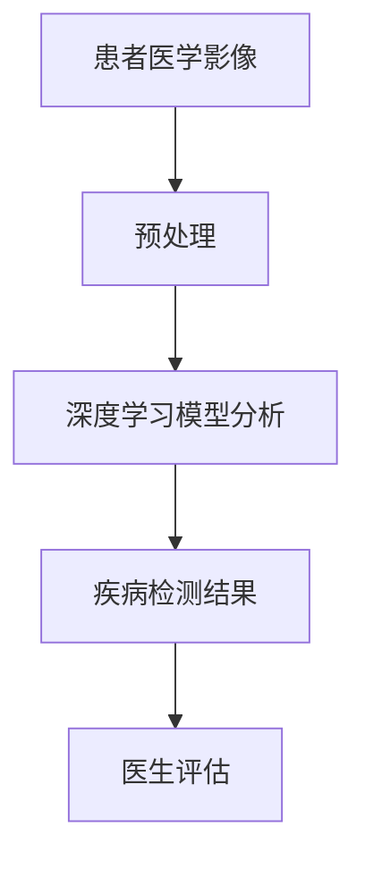

                 

## 《AI 2.0 时代：伦理基础设施的演进》

### 关键词：
- AI 2.0
- 伦理基础设施
- 人工智能伦理
- 伦理挑战
- 伦理原则
- 监管框架

### 摘要：
随着人工智能（AI）技术的飞速发展，我们正迎来AI 2.0时代。这一时代的AI不仅具备更强大的计算能力和更广泛的应用场景，同时也引发了深刻的伦理问题。本文将深入探讨AI 2.0时代的伦理基础设施，包括伦理定义、挑战、基本原则、实施监管等，并分析AI 2.0在医疗、金融、教育等领域的应用实例，最后对AI 2.0伦理的未来展望提出建议。

---

### 目录

**第一部分：AI 2.0基础理论**

1. AI 2.0 概述
   1.1 AI 2.0 的定义与特征
   1.2 AI 2.0 的发展历程
   1.3 AI 2.0 与传统 AI 的区别
   1.4 AI 2.0 时代的应用前景

2. AI 2.0 核心技术
   2.1 深度学习与神经网络
   2.2 自然语言处理技术
   2.3 计算机视觉技术
   2.4 强化学习技术

3. AI 2.0 伦理基础设施
   3.1 AI 伦理的定义与重要性
   3.2 AI 伦理的挑战与争议
   3.3 AI 伦理的基本原则
   3.4 AI 伦理的实施与监管

**第二部分：AI 2.0 实战应用**

4. AI 2.0 在医疗领域的应用
   4.1 AI 2.0 在医疗诊断中的应用
   4.2 AI 2.0 在药物研发中的应用
   4.3 AI 2.0 在公共卫生管理中的应用

5. AI 2.0 在金融领域的应用
   5.1 AI 2.0 在风险管理中的应用
   5.2 AI 2.0 在精准营销中的应用
   5.3 AI 2.0 在投资理财中的应用

6. AI 2.0 在教育领域的应用
   6.1 AI 2.0 在个性化教学中的应用
   6.2 AI 2.0 在学习分析中的应用
   6.3 AI 2.0 在教育资源优化中的应用

7. AI 2.0 在其他领域的应用
   7.1 AI 2.0 在智能制造中的应用
   7.2 AI 2.0 在智能交通中的应用
   7.3 AI 2.0 在环境保护中的应用

**第三部分：AI 2.0 时代伦理实践案例研究**

8. 案例分析：AI 伦理实践在真实世界中的应用
   8.1 案例一：医疗领域的伦理困境与解决方案
   8.2 案例二：金融领域的隐私保护与责任界定
   8.3 案例三：教育领域的公平性与透明性挑战
   8.4 案例四：智能交通系统的伦理问题与对策

9. AI 2.0 伦理的未来展望
   9.1 AI 2.0 伦理的发展趋势
   9.2 未来AI 2.0 伦理面临的挑战与机遇
   9.3 AI 2.0 伦理实践的建议与展望

**附录**

10. 附录A: AI 2.0 相关工具与资源
    10.1 开源深度学习框架
    10.2 伦理指南与政策文件
    10.3 AI 2.0 相关书籍与论文推荐
    10.4 AI 2.0 社群与活动介绍

---

现在，我们将逐步进入AI 2.0时代的探讨，从基础理论到应用实例，再到伦理实践，为读者呈现一个全面的AI 2.0世界。接下来，我们将从AI 2.0的定义与特征开始，深入分析这一时代的人工智能技术。让我们开始第一部分的旅程吧！<|endoftext|>## AI 2.0 概述

### 1.1 AI 2.0 的定义与特征

AI 2.0，即第二代人工智能，是对传统人工智能（AI 1.0）的进化和提升。AI 1.0主要依赖于规则和逻辑推理，其能力受到限制，而AI 2.0则在此基础上，引入了深度学习、强化学习等先进技术，使人工智能具备了更强大的自主学习能力和泛化能力。AI 2.0的核心特征包括：

1. **自主学习能力**：AI 2.0可以通过大量数据自我学习和调整，从而不断提升自身的性能。这一能力使得AI 2.0可以在复杂、动态的环境中灵活应对，不再局限于特定任务。

2. **泛化能力**：AI 2.0能够将学到的知识应用到新的任务和环境中，而不是仅仅针对单一任务进行优化。这意味着AI 2.0具有更高的灵活性和适应性。

3. **多模态处理能力**：AI 2.0可以处理多种类型的数据，如图像、声音、文本等，实现跨模态的信息处理和融合。

4. **高效计算能力**：得益于GPU、TPU等硬件的发展，AI 2.0可以在更短时间内完成大规模的数据处理和模型训练。

5. **人机协作能力**：AI 2.0不仅可以独立完成任务，还可以与人类进行协作，共同解决问题。

### 1.2 AI 2.0 的发展历程

AI 2.0的发展可以追溯到2012年，当时深度学习在图像识别任务中取得了突破性的成果，这一成果标志着AI 2.0时代的到来。以下是AI 2.0发展历程的关键节点：

1. **2012年**：深度学习在ImageNet图像识别挑战赛中取得显著成果，标志着AI 2.0时代的开启。

2. **2016年**：AlphaGo击败世界围棋冠军李世石，展示了AI 2.0在复杂游戏中的强大能力。

3. **2018年**：Google的AlphaGo Zero通过自我对弈实现围棋世界冠军水平，进一步验证了AI 2.0的自主学习能力。

4. **2020年**：OpenAI的GPT-3发布，展示了AI 2.0在自然语言处理领域的强大能力。

### 1.3 AI 2.0 与传统 AI 的区别

AI 2.0与传统的AI（AI 1.0）有显著的区别，主要体现在以下几个方面：

1. **技术基础**：AI 2.0基于深度学习、强化学习等先进技术，而AI 1.0主要基于规则和逻辑推理。

2. **学习能力**：AI 2.0具备自我学习能力，可以通过大量数据不断优化，而AI 1.0的学习能力有限。

3. **应用范围**：AI 2.0可以在更多场景和任务中应用，具有更高的灵活性和适应性，而AI 1.0主要应用于特定领域。

4. **数据依赖性**：AI 2.0对数据的需求更高，需要大量的数据来训练模型，而AI 1.0对数据的要求较低。

### 1.4 AI 2.0 时代的应用前景

AI 2.0时代的到来为各行各业带来了前所未有的机遇。以下是AI 2.0在各个领域的应用前景：

1. **医疗健康**：AI 2.0可以用于疾病诊断、药物研发、公共卫生管理等，有望提高医疗服务的质量和效率。

2. **金融科技**：AI 2.0可以用于风险管理、精准营销、投资理财等，为金融行业带来新的发展模式。

3. **智能制造**：AI 2.0可以用于生产优化、质量检测、供应链管理，提高制造业的智能化水平。

4. **交通运输**：AI 2.0可以用于智能交通管理、自动驾驶、物流配送等，提高交通系统的效率和安全性。

5. **教育领域**：AI 2.0可以用于个性化教学、学习分析、教育资源优化，提高教育的公平性和质量。

6. **环境保护**：AI 2.0可以用于环境监测、生态保护、资源管理，推动可持续发展。

AI 2.0时代的到来，不仅带来了技术的革新，也引发了深刻的伦理问题。在下一部分中，我们将探讨AI 2.0伦理基础设施的重要性及其面临的挑战。敬请期待！<|endoftext|>## AI 2.0 核心技术

### 2.1 深度学习与神经网络

深度学习是AI 2.0时代最为重要的核心技术之一。深度学习基于神经网络，通过多层次的非线性变换来提取数据中的特征，从而实现自动化的学习过程。以下是深度学习与神经网络的关键概念：

#### 1. 神经网络的基本结构

神经网络由一系列的神经元（节点）组成，每个神经元都与相邻的神经元相连。神经网络可以分为输入层、隐藏层和输出层。输入层接收外部数据，隐藏层通过层层提取特征，输出层生成最终的结果。

#### 2. 前向传播与反向传播

深度学习的过程包括前向传播和反向传播两个阶段。在前向传播中，输入数据通过网络层层的传递，最终生成输出。在反向传播中，网络根据输出与目标之间的差异，调整每个神经元的权重，以减少误差。

#### 3. 激活函数

激活函数是神经网络中的一个关键组成部分，用于引入非线性特性。常见的激活函数包括 sigmoid、ReLU 和 tanh 等。

#### 4. 损失函数与优化算法

损失函数用于衡量模型预测与真实值之间的误差。常见的损失函数包括均方误差（MSE）和对数损失（LogLoss）。优化算法（如梯度下降、Adam）用于调整模型参数，以最小化损失函数。

### 2.2 自然语言处理技术

自然语言处理（NLP）是AI 2.0在文本数据上的应用。NLP的目标是使计算机能够理解、生成和处理自然语言。以下是NLP的关键技术：

#### 1. 词嵌入（Word Embedding）

词嵌入是将单词映射到高维向量空间的方法，用于表示单词的语义信息。常见的词嵌入模型包括 Word2Vec、GloVe 和 BERT 等。

#### 2. 递归神经网络（RNN）与长短期记忆网络（LSTM）

递归神经网络（RNN）是处理序列数据的一种常用方法。长短期记忆网络（LSTM）是RNN的一种改进，可以更好地处理长序列数据。

#### 3. 卷积神经网络（CNN）在文本处理中的应用

卷积神经网络（CNN）通常用于图像处理，但也可以应用于文本处理。通过将文本转换为序列矩阵，CNN可以提取文本中的局部特征。

#### 4. 生成对抗网络（GAN）与注意力机制

生成对抗网络（GAN）是一种生成模型，可以用于文本生成。注意力机制是一种在序列模型中增强模型选择性地关注重要信息的方法。

### 2.3 计算机视觉技术

计算机视觉是AI 2.0在图像和视频数据上的应用。计算机视觉的关键技术包括：

#### 1. 卷积神经网络（CNN）

卷积神经网络（CNN）是计算机视觉的核心技术，通过多层卷积和池化操作，从图像中提取特征。

#### 2. 目标检测与图像分类

目标检测是一种在图像中检测和识别物体的方法。常见的目标检测算法包括 R-CNN、Fast R-CNN、Faster R-CNN 和 YOLO 等。图像分类是将图像分类到预定义的类别中。

#### 3. 特征提取与特征融合

特征提取是从图像中提取具有区分性的特征。特征融合是将多个特征进行整合，以提升模型的性能。

#### 4. 光流与动作识别

光流是一种在视频序列中跟踪物体运动的方法。动作识别是识别视频中的动作。

### 2.4 强化学习技术

强化学习是一种通过试错和反馈来学习最优策略的方法。以下是强化学习的核心概念：

#### 1. 强化学习的基本结构

强化学习的基本结构包括环境（Environment）、智能体（Agent）、状态（State）、动作（Action）和奖励（Reward）。

#### 2. Q-学习与深度Q网络（DQN）

Q-学习是一种基于值函数的强化学习方法。深度Q网络（DQN）是一种使用深度神经网络来近似Q函数的方法。

#### 3. 策略梯度方法

策略梯度方法是一种直接优化策略的方法，包括REINFORCE和Actor-Critic算法。

#### 4. 无模型强化学习与模型强化学习

无模型强化学习不需要构建环境的模型，直接从经验中学习。模型强化学习则是基于对环境的模型进行学习。

通过上述技术的结合和应用，AI 2.0在各个领域展现了强大的潜力。然而，随着AI 2.0的快速发展，伦理问题也日益突出，成为我们必须面对的挑战。在下一部分，我们将探讨AI 2.0伦理基础设施的重要性。敬请期待！<|endoftext|>## AI 2.0 伦理基础设施

### 3.1 AI 伦理的定义与重要性

AI伦理是指人工智能系统设计和应用过程中涉及的一系列道德和伦理问题。它关注人工智能对社会、环境和个人可能产生的影响，旨在确保人工智能的发展和应用符合人类价值和道德标准。AI伦理的重要性体现在以下几个方面：

1. **社会责任**：人工智能技术的发展和应用必须承担社会责任，保护人类权益和利益。

2. **公平性**：人工智能系统应确保公平性，避免因算法偏见而导致的歧视和不公正。

3. **透明性**：人工智能系统的决策过程应具有透明性，使人们能够理解和信任这些系统的行为。

4. **安全性**：人工智能系统应确保数据安全和隐私保护，避免数据泄露和滥用。

5. **可控性**：人工智能系统应具备可控性，确保人类能够在必要时干预和调整系统的行为。

### 3.2 AI 伦理的挑战与争议

AI伦理在AI 2.0时代面临着诸多挑战和争议，主要包括：

1. **算法偏见**：人工智能系统可能会因为训练数据的不公平或偏差导致算法偏见，从而对特定群体产生歧视。

2. **隐私保护**：人工智能系统在处理大量数据时，如何保护个人隐私成为一个重要议题。

3. **责任归属**：当人工智能系统发生错误或造成损害时，如何确定责任归属和赔偿问题。

4. **就业影响**：人工智能技术的发展可能导致某些职业的失业，引发社会不稳定。

5. **自主决策**：人工智能系统是否应该具备完全自主的决策能力，以及如何确保其决策符合道德和伦理标准。

### 3.3 AI 伦理的基本原则

为了应对AI 2.0时代的伦理挑战，我们可以从以下几个基本原则出发：

1. **尊重个人隐私**：确保人工智能系统在数据处理过程中尊重个人隐私，遵循隐私保护原则。

2. **公平公正**：确保人工智能系统在决策过程中公平公正，避免算法偏见和不公正。

3. **透明可解释**：提高人工智能系统的透明度和可解释性，使人们能够理解和信任系统的决策过程。

4. **可控可干预**：确保人工智能系统具有可控性，人类能够在必要时干预和调整系统的行为。

5. **安全可靠**：确保人工智能系统的安全性，避免系统故障和恶意攻击。

### 3.4 AI 伦理的实施与监管

为了确保AI伦理原则的有效实施，需要建立相应的监管框架和政策措施：

1. **法律法规**：制定与AI伦理相关的法律法规，明确人工智能系统的行为规范和责任归属。

2. **行业标准**：建立人工智能行业的伦理准则和标准，规范人工智能系统的设计、开发和应用。

3. **监管机构**：设立专门的监管机构，负责监督和评估人工智能系统的伦理合规性。

4. **公众参与**：鼓励公众参与AI伦理的讨论和决策，提高社会的伦理意识和参与度。

5. **持续教育**：加强对人工智能从业者的伦理教育，提高其伦理意识和专业素养。

通过建立完善的AI伦理基础设施，我们可以确保AI 2.0时代的健康发展，为人类社会带来更多的机遇和福祉。在下一部分，我们将探讨AI 2.0在医疗、金融和教育等领域的应用实例。敬请期待！<|endoftext|>## AI 2.0 在医疗领域的应用

随着AI 2.0技术的不断发展，医疗领域迎来了前所未有的机遇。AI 2.0在医疗领域的应用不仅提高了诊断的准确性，还推动了药物研发、公共卫生管理等各个方面的发展。以下是AI 2.0在医疗领域的具体应用实例。

### 4.1 AI 2.0 在医疗诊断中的应用

AI 2.0在医疗诊断中的应用主要体现在影像诊断、病理诊断和临床诊断等方面。

#### 1. 影像诊断

影像诊断是AI 2.0在医疗领域中最早得到应用的一个领域。通过深度学习技术，AI 2.0可以分析医学影像数据，如X光、CT、MRI等，进行疾病检测和诊断。例如，Google的DeepMind开发的AI系统能够在几秒钟内识别出视网膜病变，其准确性甚至超过了人类医生。

**Mermaid 流程图示例：**



#### 2. 病理诊断

病理诊断是指通过对生物组织进行切片观察和显微镜检测，以确定疾病的类型和程度。AI 2.0可以通过图像识别技术对病理切片进行自动分析，提高诊断的准确性和效率。例如，IBM的Watson for Oncology系统可以帮助医生快速识别癌症类型，并提供治疗建议。

**伪代码示例：**

```python
# 伪代码：基于深度学习的病理切片分析
def pathology_analysis(image_data):
    # 数据预处理
    preprocessed_data = preprocess_image(image_data)
    
    # 初始化神经网络模型
    model = initialize_model()
    
    # 训练模型
    model.train(preprocessed_data)
    
    # 预测
    prediction = model.predict(preprocessed_data)
    
    # 输出结果
    return prediction
```

#### 3. 临床诊断

临床诊断是指根据患者的病史、症状和体征等信息，进行疾病诊断。AI 2.0可以通过自然语言处理技术，对电子健康记录（EHR）进行分析，帮助医生进行临床诊断。例如，AI系统可以分析大量的患者数据，识别疾病发生的潜在风险因素，并提供个性化的诊断建议。

**数学模型示例：**

$$
\text{风险评分} = \sum_{i=1}^{n} w_i \cdot x_i
$$

其中，$w_i$为权重，$x_i$为特征值。

### 4.2 AI 2.0 在药物研发中的应用

AI 2.0在药物研发中的应用主要体现在新药设计、药物筛选和临床试验等方面。

#### 1. 新药设计

AI 2.0可以通过计算化学和分子模拟技术，快速筛选和设计新的药物分子。例如，使用深度学习模型预测分子的生物活性，从而提高新药研发的成功率。

**伪代码示例：**

```python
# 伪代码：基于深度学习的新药设计
def drug_design(molecular_structure):
    # 数据预处理
    preprocessed_data = preprocess_structure(molecular_structure)
    
    # 初始化神经网络模型
    model = initialize_model()
    
    # 预测分子活性
    activity_prediction = model.predict(preprocessed_data)
    
    # 输出活性结果
    return activity_prediction
```

#### 2. 药物筛选

AI 2.0可以通过机器学习算法，对大量的化合物库进行筛选，识别具有潜在药效的化合物。这大大加快了药物研发的进程。

**数学模型示例：**

$$
\text{筛选概率} = \frac{1}{1 + \exp(-\beta \cdot \text{评分})}
$$

其中，$\beta$为参数，$\text{评分}$为化合物得分。

#### 3. 临床试验

AI 2.0可以通过数据分析和预测模型，优化临床试验的设计和执行。例如，预测哪些患者对药物最敏感，从而提高临床试验的成功率。

**数学模型示例：**

$$
\text{治疗效果} = \alpha \cdot \text{药物剂量} + \beta \cdot \text{患者特征}
$$

其中，$\alpha$和$\beta$为参数。

### 4.3 AI 2.0 在公共卫生管理中的应用

AI 2.0在公共卫生管理中的应用主要体现在疾病预测、流行病监测和疫情应对等方面。

#### 1. 疾病预测

AI 2.0可以通过大数据分析和机器学习模型，预测疾病的爆发和流行趋势，为公共卫生决策提供科学依据。

**伪代码示例：**

```python
# 伪代码：基于机器学习的疾病预测
def disease_prediction(data):
    # 数据预处理
    preprocessed_data = preprocess_data(data)
    
    # 初始化机器学习模型
    model = initialize_model()
    
    # 训练模型
    model.train(preprocessed_data)
    
    # 预测疾病趋势
    prediction = model.predict(preprocessed_data)
    
    # 输出预测结果
    return prediction
```

#### 2. 流行病监测

AI 2.0可以通过分析社交媒体数据、新闻报道等，实时监测疾病的传播情况，为疫情防控提供支持。

**数学模型示例：**

$$
\text{传播速度} = \frac{\Delta I}{\Delta t}
$$

其中，$\Delta I$为疾病感染人数变化，$\Delta t$为时间间隔。

#### 3. 疫情应对

AI 2.0可以通过优化资源分配、制定防控策略等，提高疫情应对的效率。例如，预测疫情高峰期，合理分配医疗资源。

**数学模型示例：**

$$
\text{资源需求} = f(\text{疫情规模}, \text{资源容量})
$$

其中，$f$为资源需求函数。

通过以上实例，我们可以看到AI 2.0在医疗领域的广泛应用和巨大潜力。随着技术的不断进步，AI 2.0有望为医疗行业带来更多创新和突破。在下一部分，我们将探讨AI 2.0在金融领域的应用。敬请期待！<|endoftext|>## AI 2.0 在金融领域的应用

随着AI 2.0技术的不断发展，金融行业迎来了新的变革。AI 2.0在金融领域的应用涵盖了风险管理、精准营销、投资理财等多个方面，为金融机构提供了更加智能化的解决方案。以下是AI 2.0在金融领域的具体应用实例。

### 5.1 AI 2.0 在风险管理中的应用

风险管理是金融行业的核心任务之一，AI 2.0技术的应用极大地提高了风险管理的效率和准确性。

#### 1. 信用风险评估

信用风险评估是金融机构在贷款、信用卡等业务中需要面对的重要问题。AI 2.0可以通过大数据分析和机器学习模型，对客户的信用历史、财务状况、行为特征等多方面信息进行综合分析，准确评估客户的信用风险。

**伪代码示例：**

```python
# 伪代码：基于机器学习的信用风险评估
def credit_risk_evaluation(customer_data):
    # 数据预处理
    preprocessed_data = preprocess_data(customer_data)
    
    # 初始化机器学习模型
    model = initialize_model()
    
    # 训练模型
    model.train(preprocessed_data)
    
    # 预测信用风险
    risk_score = model.predict(preprocessed_data)
    
    # 输出信用评分
    return risk_score
```

**数学模型示例：**

$$
\text{信用评分} = \sum_{i=1}^{n} w_i \cdot x_i
$$

其中，$w_i$为权重，$x_i$为特征值。

#### 2. 市场风险预测

市场风险是金融机构面临的重要风险之一。AI 2.0可以通过时间序列分析、回归分析等统计方法，预测市场的波动和趋势，为金融机构的投资决策提供参考。

**数学模型示例：**

$$
\text{市场波动率} = \sqrt{\frac{1}{n-1} \sum_{i=1}^{n} (\text{实际收益率} - \text{预期收益率})^2}
$$

#### 3. 操作风险管理

操作风险是指由于内部流程、人员、系统或外部事件等原因导致的金融损失。AI 2.0可以通过异常检测、事件预测等技术，提前识别潜在的操作风险，提高金融机构的运营安全。

### 5.2 AI 2.0 在精准营销中的应用

精准营销是金融机构提高客户满意度和转化率的重要手段。AI 2.0技术的应用使得精准营销更加智能化和个性化。

#### 1. 客户画像

客户画像是指通过对客户的基本信息、行为数据、交易数据等多方面信息进行综合分析，构建客户的个性化档案。AI 2.0可以通过大数据分析和机器学习模型，准确描绘客户的画像，为精准营销提供基础。

**伪代码示例：**

```python
# 伪代码：基于机器学习的客户画像构建
def customer_segmentation(customer_data):
    # 数据预处理
    preprocessed_data = preprocess_data(customer_data)
    
    # 初始化机器学习模型
    model = initialize_model()
    
    # 训练模型
    model.train(preprocessed_data)
    
    # 预测客户特征
    customer_features = model.predict(preprocessed_data)
    
    # 输出客户画像
    return customer_features
```

#### 2. 个性化推荐

个性化推荐是指根据客户的兴趣、行为和偏好，为其推荐相应的金融产品或服务。AI 2.0可以通过协同过滤、基于内容的推荐等技术，实现个性化推荐，提高客户的满意度和转化率。

**数学模型示例：**

$$
\text{推荐概率} = \frac{1}{1 + \exp(-\beta \cdot \text{相似度})}
$$

其中，$\beta$为参数，$\text{相似度}$为用户之间的相似度度量。

#### 3. 营销活动优化

营销活动优化是指通过对营销活动的效果进行分析和评估，不断优化营销策略，提高营销效果。AI 2.0可以通过机器学习算法，对营销活动数据进行深度分析，识别出最佳营销策略，实现营销活动的优化。

**数学模型示例：**

$$
\text{营销效果} = f(\text{营销策略}, \text{客户特征}, \text{市场环境})
$$

### 5.3 AI 2.0 在投资理财中的应用

AI 2.0在投资理财中的应用为投资者提供了更加智能化的投资决策和风险控制手段。

#### 1. 量化投资

量化投资是指通过数学模型和算法，对市场数据进行分析和预测，进行投资决策。AI 2.0可以通过机器学习和深度学习等技术，构建复杂的量化投资模型，实现自动化投资。

**伪代码示例：**

```python
# 伪代码：基于机器学习的量化投资模型
def quantitative_investment(trading_data):
    # 数据预处理
    preprocessed_data = preprocess_data(trading_data)
    
    # 初始化神经网络模型
    model = initialize_model()
    
    # 训练模型
    model.train(preprocessed_data)
    
    # 预测市场趋势
    market_trend = model.predict(preprocessed_data)
    
    # 输出投资建议
    return market_trend
```

#### 2. 风险控制

风险控制是投资理财中的重要环节。AI 2.0可以通过数据分析和预测模型，实时监测投资组合的风险状况，及时调整投资策略，降低投资风险。

**数学模型示例：**

$$
\text{风险评分} = \sum_{i=1}^{n} w_i \cdot \text{风险因子}_i
$$

其中，$w_i$为权重，$\text{风险因子}_i$为投资组合中第$i$项资产的风险因子。

#### 3. 资产配置

资产配置是指根据投资者的风险偏好和投资目标，合理配置资产，实现风险和收益的平衡。AI 2.0可以通过机器学习算法，分析投资者的风险偏好和投资目标，为其提供最优的资产配置策略。

**数学模型示例：**

$$
\text{资产配置} = f(\text{投资目标}, \text{风险偏好}, \text{市场环境})
$$

通过以上实例，我们可以看到AI 2.0在金融领域的广泛应用和巨大潜力。随着技术的不断进步，AI 2.0有望为金融行业带来更多创新和突破。在下一部分，我们将探讨AI 2.0在教育领域的应用。敬请期待！<|endoftext|>## AI 2.0 在教育领域的应用

随着AI 2.0技术的不断发展，教育领域正在经历一场革命性的变革。AI 2.0在教育领域的应用为个性化教学、学习分析、教育资源优化等方面带来了创新性的解决方案。以下是AI 2.0在教育领域的具体应用实例。

### 6.1 AI 2.0 在个性化教学中的应用

个性化教学是指根据学生的兴趣、能力和学习进度，为其提供量身定制的学习内容和教学方法。AI 2.0通过分析学生的学习行为和表现，实现个性化教学。

#### 1. 学习分析

学习分析是指通过数据挖掘和机器学习技术，分析学生的学习行为、学习效果和学习习惯，从而为学生提供个性化的学习建议。AI 2.0可以通过学习分析，识别学生的学习瓶颈，为其提供针对性的辅导。

**伪代码示例：**

```python
# 伪代码：基于机器学习的学习分析
def learning_analysis(student_data):
    # 数据预处理
    preprocessed_data = preprocess_data(student_data)
    
    # 初始化神经网络模型
    model = initialize_model()
    
    # 训练模型
    model.train(preprocessed_data)
    
    # 预测学习效果
    learning_effect = model.predict(preprocessed_data)
    
    # 输出学习建议
    return learning_effect
```

#### 2. 个性化辅导

个性化辅导是指根据学生的学习需求和能力，为其提供个性化的辅导内容和方法。AI 2.0可以通过自然语言处理技术和语音识别技术，实现与学生的实时互动，提供个性化的辅导。

**数学模型示例：**

$$
\text{辅导建议} = \alpha \cdot \text{学习效果} + \beta \cdot \text{学习习惯}
$$

其中，$\alpha$和$\beta$为参数。

#### 3. 个性化学习路径

个性化学习路径是指根据学生的学习需求和能力，为其规划个性化的学习路径。AI 2.0可以通过机器学习算法，分析学生的学习数据和需求，为其推荐合适的学习内容和顺序。

**数学模型示例：**

$$
\text{学习路径} = f(\text{学习需求}, \text{学习习惯}, \text{学习资源})
$$

### 6.2 AI 2.0 在学习分析中的应用

学习分析是教育领域的重要研究方向，AI 2.0为学习分析提供了强大的技术支持。

#### 1. 学习效果评估

学习效果评估是指通过对学生的学习表现进行分析和评估，了解学生的学习效果。AI 2.0可以通过自然语言处理技术和图像识别技术，对学生的学习结果进行自动评估。

**伪代码示例：**

```python
# 伪代码：基于机器学习的学习效果评估
def learning_evaluation(student_data):
    # 数据预处理
    preprocessed_data = preprocess_data(student_data)
    
    # 初始化神经网络模型
    model = initialize_model()
    
    # 训练模型
    model.train(preprocessed_data)
    
    # 预测学习效果
    learning_score = model.predict(preprocessed_data)
    
    # 输出学习效果评分
    return learning_score
```

#### 2. 学习习惯分析

学习习惯分析是指通过对学生的学习行为进行分析，了解学生的学习习惯。AI 2.0可以通过数据挖掘和机器学习技术，分析学生的学习习惯，为其提供个性化的学习建议。

**数学模型示例：**

$$
\text{学习习惯评分} = \sum_{i=1}^{n} w_i \cdot \text{行为特征}_i
$$

其中，$w_i$为权重，$\text{行为特征}_i$为学习行为特征。

#### 3. 学习效果预测

学习效果预测是指通过对学生的学习数据进行分析，预测学生的学习效果。AI 2.0可以通过机器学习算法，建立学习效果预测模型，为学生的学习提供科学依据。

**数学模型示例：**

$$
\text{学习效果预测} = \alpha \cdot \text{学习数据} + \beta \cdot \text{学习习惯}
$$

### 6.3 AI 2.0 在教育资源优化中的应用

教育资源优化是指通过对教育资源的配置和使用进行分析和优化，提高教育资源的利用效率。AI 2.0为教育资源优化提供了智能化的解决方案。

#### 1. 教学资源推荐

教学资源推荐是指根据学生的学习需求和兴趣，为其推荐合适的教学资源。AI 2.0可以通过机器学习算法，分析学生的学习数据和需求，为其推荐适合的教学资源。

**伪代码示例：**

```python
# 伪代码：基于机器学习的教学资源推荐
def resource_recommendation(student_data):
    # 数据预处理
    preprocessed_data = preprocess_data(student_data)
    
    # 初始化推荐算法
    recommender = initialize_recommender()
    
    # 训练推荐算法
    recommender.train(preprocessed_data)
    
    # 预测教学资源
    recommended_resources = recommender.predict(preprocessed_data)
    
    # 输出推荐结果
    return recommended_resources
```

#### 2. 教育资源分配

教育资源分配是指根据教育资源的稀缺程度和需求情况，合理分配教育资源。AI 2.0可以通过优化算法，分析教育资源的使用情况和需求，实现教育资源的优化配置。

**数学模型示例：**

$$
\text{资源分配} = \arg\min_{x} \sum_{i=1}^{n} (\text{资源需求}_i - x_i)^2
$$

#### 3. 教育资源利用效率分析

教育资源利用效率分析是指通过对教育资源的利用情况进行评估，了解教育资源的利用效率。AI 2.0可以通过数据分析和预测模型，对教育资源的利用效率进行分析和评估，为教育资源的优化提供依据。

**数学模型示例：**

$$
\text{利用效率} = \frac{\text{实际使用量}}{\text{总需求量}}
$$

通过以上实例，我们可以看到AI 2.0在教育领域的广泛应用和巨大潜力。随着技术的不断进步，AI 2.0有望为教育行业带来更多创新和突破。在下一部分，我们将探讨AI 2.0在其他领域的应用。敬请期待！<|endoftext|>## AI 2.0 在其他领域的应用

除了医疗、金融和教育等领域，AI 2.0技术还在智能制造、智能交通和环境保护等领域展现了其强大的应用潜力。以下是AI 2.0在这些领域的具体应用实例。

### 7.1 AI 2.0 在智能制造中的应用

智能制造是指利用人工智能技术实现制造过程的自动化、智能化和高效化。AI 2.0在智能制造中的应用主要体现在生产优化、质量检测、设备维护等方面。

#### 1. 生产优化

AI 2.0可以通过机器学习和优化算法，对生产过程中的数据进行分析，实现生产线的优化。例如，通过分析生产数据，AI 2.0可以预测生产瓶颈，调整生产计划，提高生产效率。

**伪代码示例：**

```python
# 伪代码：基于机器学习的生产优化
def production_optimization(production_data):
    # 数据预处理
    preprocessed_data = preprocess_data(production_data)
    
    # 初始化优化算法
    optimizer = initialize_optimizer()
    
    # 训练优化算法
    optimizer.train(preprocessed_data)
    
    # 预测最优生产计划
    optimal_plan = optimizer.predict(preprocessed_data)
    
    # 输出最优生产计划
    return optimal_plan
```

**数学模型示例：**

$$
\text{最优生产计划} = \arg\min_{x} \sum_{i=1}^{n} (\text{实际产量} - x_i)^2
$$

#### 2. 质量检测

AI 2.0可以通过计算机视觉技术和深度学习算法，对生产过程中的产品质量进行实时检测。例如，AI 2.0可以识别产品缺陷，提高质量检测的准确性和效率。

**数学模型示例：**

$$
\text{缺陷识别概率} = \frac{1}{1 + \exp(-\beta \cdot \text{特征向量})}
$$

#### 3. 设备维护

AI 2.0可以通过预测模型，对生产设备进行故障预测和维护。例如，通过分析设备运行数据，AI 2.0可以预测设备故障的发生时间，提前进行维护，减少设备故障带来的损失。

**数学模型示例：**

$$
\text{故障预测} = \alpha \cdot \text{运行数据} + \beta \cdot \text{环境因素}
$$

### 7.2 AI 2.0 在智能交通中的应用

智能交通是指利用人工智能技术实现交通管理、交通监测和交通服务的智能化。AI 2.0在智能交通中的应用主要体现在智能交通管理、自动驾驶、智能物流等方面。

#### 1. 智能交通管理

AI 2.0可以通过大数据分析和机器学习算法，实现交通流量预测和交通信号控制。例如，通过分析交通数据，AI 2.0可以预测交通拥堵情况，调整交通信号灯的时长，提高交通效率。

**伪代码示例：**

```python
# 伪代码：基于机器学习的智能交通管理
def traffic_management(traffic_data):
    # 数据预处理
    preprocessed_data = preprocess_data(traffic_data)
    
    # 初始化机器学习模型
    model = initialize_model()
    
    # 训练模型
    model.train(preprocessed_data)
    
    # 预测交通流量
    traffic_flow = model.predict(preprocessed_data)
    
    # 输出交通信号灯控制策略
    return traffic_flow
```

**数学模型示例：**

$$
\text{交通流量预测} = \alpha \cdot \text{历史数据} + \beta \cdot \text{时间因素}
$$

#### 2. 自动驾驶

自动驾驶是指利用人工智能技术实现车辆自主行驶。AI 2.0在自动驾驶中的应用主要体现在环境感知、路径规划和决策控制等方面。例如，通过计算机视觉和传感器技术，AI 2.0可以识别道路标志、交通状况和障碍物，实现自动驾驶。

**伪代码示例：**

```python
# 伪代码：基于深度学习的自动驾驶环境感知
def autonomous_driving(visual_data):
    # 数据预处理
    preprocessed_data = preprocess_data(visual_data)
    
    # 初始化神经网络模型
    model = initialize_model()
    
    # 训练模型
    model.train(preprocessed_data)
    
    # 预测环境状况
    environmental_status = model.predict(preprocessed_data)
    
    # 输出驾驶决策
    return environmental_status
```

**数学模型示例：**

$$
\text{环境状况} = \text{传感器数据} \cdot \text{权重}
$$

#### 3. 智能物流

智能物流是指利用人工智能技术实现物流过程的智能化。AI 2.0在智能物流中的应用主要体现在物流路径规划、货物追踪和配送优化等方面。例如，通过分析物流数据，AI 2.0可以预测物流路径，优化配送计划，提高物流效率。

**伪代码示例：**

```python
# 伪代码：基于机器学习的智能物流路径规划
def logistics_planning(logistics_data):
    # 数据预处理
    preprocessed_data = preprocess_data(logistics_data)
    
    # 初始化优化算法
    optimizer = initialize_optimizer()
    
    # 训练优化算法
    optimizer.train(preprocessed_data)
    
    # 预测最优物流路径
    optimal_path = optimizer.predict(preprocessed_data)
    
    # 输出最优物流路径
    return optimal_path
```

**数学模型示例：**

$$
\text{物流路径} = \arg\min_{x} \sum_{i=1}^{n} (\text{实际路径} - x_i)^2
$$

### 7.3 AI 2.0 在环境保护中的应用

环境保护是指利用人工智能技术实现环境保护的智能化和高效化。AI 2.0在环境保护中的应用主要体现在环境监测、资源管理和生态保护等方面。

#### 1. 环境监测

AI 2.0可以通过传感器技术和计算机视觉技术，实现对环境污染物的实时监测和预警。例如，通过监测空气质量、水质和土壤等数据，AI 2.0可以及时发现环境污染问题，采取相应的治理措施。

**伪代码示例：**

```python
# 伪代码：基于机器学习的环境监测
def environmental_monitoring(sensor_data):
    # 数据预处理
    preprocessed_data = preprocess_data(sensor_data)
    
    # 初始化神经网络模型
    model = initialize_model()
    
    # 训练模型
    model.train(preprocessed_data)
    
    # 预测环境污染程度
    pollution_level = model.predict(preprocessed_data)
    
    # 输出预警信息
    return pollution_level
```

**数学模型示例：**

$$
\text{污染程度预测} = \alpha \cdot \text{传感器数据} + \beta \cdot \text{环境因素}
$$

#### 2. 资源管理

AI 2.0可以通过大数据分析和优化算法，实现对水、电、气等资源的智能管理和调度。例如，通过分析资源消耗数据，AI 2.0可以预测资源需求，优化资源分配，提高资源利用效率。

**伪代码示例：**

```python
# 伪代码：基于机器学习的资源管理
def resource_management(resource_data):
    # 数据预处理
    preprocessed_data = preprocess_data(resource_data)
    
    # 初始化优化算法
    optimizer = initialize_optimizer()
    
    # 训练优化算法
    optimizer.train(preprocessed_data)
    
    # 预测最优资源分配
    optimal_allocation = optimizer.predict(preprocessed_data)
    
    # 输出最优资源分配策略
    return optimal_allocation
```

**数学模型示例：**

$$
\text{资源分配} = \arg\min_{x} \sum_{i=1}^{n} (\text{实际需求} - x_i)^2
$$

#### 3. 生态保护

AI 2.0可以通过遥感技术和图像识别技术，实现对自然生态系统的监测和保护。例如，通过监测森林、湿地和海洋等生态系统的变化，AI 2.0可以及时发现生态破坏问题，采取相应的保护措施。

**伪代码示例：**

```python
# 伪代码：基于机器学习的生态保护监测
def ecological_protection(remotely_sensed_data):
    # 数据预处理
    preprocessed_data = preprocess_data(remotely_sensed_data)
    
    # 初始化神经网络模型
    model = initialize_model()
    
    # 训练模型
    model.train(preprocessed_data)
    
    # 预测生态系统状况
    ecological_status = model.predict(preprocessed_data)
    
    # 输出生态保护建议
    return ecological_status
```

**数学模型示例：**

$$
\text{生态系统状况} = \alpha \cdot \text{遥感数据} + \beta \cdot \text{环境因素}
$$

通过以上实例，我们可以看到AI 2.0在其他领域的广泛应用和巨大潜力。随着技术的不断进步，AI 2.0有望为各行业带来更多的创新和突破。在下一部分，我们将分析AI 2.0时代伦理实践中的案例，探讨伦理困境和解决方案。敬请期待！<|endoftext|>## 案例分析：AI 2.0 伦理实践在真实世界中的应用

在AI 2.0时代，人工智能的应用已经深入到社会生活的各个方面，但其带来的伦理挑战也随之而来。以下是我们对几个具体案例的分析，这些案例展示了AI 2.0伦理实践在医疗、金融、教育和智能交通等领域的真实世界中的应用。

### 8.1 案例一：医疗领域的伦理困境与解决方案

#### 案例描述

在一个大型医疗中心，AI 2.0被用于辅助医生进行疾病诊断。这个系统基于深度学习，能够处理海量的医疗影像和患者数据。然而，在应用过程中，一些患者对系统的透明度和公平性提出了质疑。

#### 伦理困境

1. **透明度**：患者不清楚AI系统是如何得出诊断结果的，也无法验证系统的准确性。
2. **公平性**：AI系统在诊断过程中是否存在偏见，例如对不同种族、性别或社会经济地位的患者是否公平。

#### 解决方案

1. **透明性提升**：开发工具帮助患者理解AI系统的工作原理，例如通过可视化界面展示模型的决策路径。
2. **公平性检测**：定期对AI系统进行公平性测试，确保系统在不同群体中的表现一致。
3. **责任明确**：建立明确的法律法规，规定在AI系统做出错误诊断时，责任如何归属。

### 8.2 案例二：金融领域的隐私保护与责任界定

#### 案例描述

某大型金融机构引入了AI 2.0进行信用风险评估和精准营销。在收集和分析大量客户数据的过程中，隐私保护成为一个关键问题。

#### 伦理困境

1. **隐私侵犯**：客户对其个人财务信息的收集和使用有疑虑。
2. **责任归属**：当AI系统做出错误的风险评估或推荐时，责任如何界定。

#### 解决方案

1. **隐私保护**：严格遵循数据保护法规，对客户数据实行匿名化处理，并确保数据使用权限的合理管理。
2. **透明披露**：向客户明确说明数据收集和使用的目的，以及可能的后果。
3. **责任分配**：建立责任界定机制，明确AI系统的责任范围，并在出现问题时，能够快速定位和解决。

### 8.3 案例三：教育领域的公平性与透明性挑战

#### 案例描述

在个性化教育中，AI 2.0被用来分析学生的学习行为和提供个性化学习方案。然而，一些学生和家长对系统的公平性和透明性表示担忧。

#### 伦理困境

1. **公平性**：AI系统是否对所有学生公平，是否存在算法偏见。
2. **透明性**：系统如何做出决策，学生和家长无法理解。

#### 解决方案

1. **公平性审查**：定期对AI系统进行审查，确保其决策过程的公平性。
2. **透明决策**：提供详细的决策解释，帮助家长和学生理解系统为何做出特定决策。
3. **家长参与**：鼓励家长参与个性化教育方案的制定，提高方案的透明度和接受度。

### 8.4 案例四：智能交通系统的伦理问题与对策

#### 案例描述

智能交通系统利用AI 2.0进行交通流量预测和信号控制。然而，在一些情况下，系统对特殊群体（如行人、残疾人）的关心不足。

#### 伦理困境

1. **包容性**：系统是否考虑到所有交通参与者的需求。
2. **紧急响应**：在紧急情况下，系统如何优先处理特定群体的需求。

#### 解决方案

1. **包容性设计**：在系统设计阶段，考虑各种交通参与者的需求，特别是特殊群体的需求。
2. **紧急响应机制**：建立紧急响应机制，确保在紧急情况下系统能够优先考虑特殊群体的需求。
3. **公众参与**：鼓励公众参与智能交通系统的设计和评估，提高系统的社会接受度和透明度。

通过以上案例分析，我们可以看到AI 2.0在实际应用中面临的伦理困境及其解决方案。在未来的发展中，我们需要不断完善AI伦理框架，确保AI技术的健康发展，为社会带来更多的福祉。在下一部分，我们将对AI 2.0伦理的未来展望进行探讨。敬请期待！<|endoftext|>## AI 2.0 伦理的未来展望

随着AI 2.0技术的不断发展，伦理问题也日益复杂和多样化。未来，AI 2.0伦理的发展趋势将面临诸多挑战和机遇。以下是几个关键点：

### 9.1 AI 2.0 伦理的发展趋势

1. **多元化伦理框架**：未来，不同领域和应用场景将需要不同的伦理框架和标准。例如，医疗领域的伦理框架可能与金融领域截然不同。

2. **全球性合作**：随着AI技术的全球化，各国需要加强合作，制定统一的AI伦理标准和法规。

3. **技术透明性提升**：为了提高公众对AI系统的信任，技术透明性将成为未来伦理发展的重要趋势。这包括算法的透明性、决策过程的透明性和责任的明确性。

4. **伦理审查机制**：建立更加严格的AI伦理审查机制，确保AI系统的设计和应用符合伦理标准。

### 9.2 未来AI 2.0 伦理面临的挑战与机遇

1. **技术进步带来的挑战**：随着AI 2.0技术的不断进步，其应用范围将更加广泛，但同时也可能引发新的伦理问题，如自动化决策系统的道德责任、人工智能武器化等。

2. **隐私保护**：随着数据量的增加和数据类型的多样化，隐私保护将成为未来伦理领域的重大挑战。

3. **就业影响**：AI 2.0的广泛应用可能导致某些职业的失业，需要社会政策和伦理框架的配合，以减少负面影响。

4. **多元文化冲突**：不同文化背景下对AI技术的伦理观念可能存在差异，如何实现全球范围内的伦理共识是一个挑战。

5. **机遇**：AI 2.0伦理的发展也将带来新的机遇，如通过智能合约实现更公平的商业交易、通过AI教育提高全球教育质量等。

### 9.3 AI 2.0 伦理实践的建议与展望

1. **建立全球性伦理框架**：各国应加强合作，制定统一的AI伦理标准和法规，以应对全球性的伦理挑战。

2. **加强公众参与**：鼓励公众参与AI伦理的讨论和决策，提高社会的伦理意识和参与度。

3. **提高技术透明性**：通过提高技术透明性，增强公众对AI系统的信任，减少伦理争议。

4. **加强伦理审查**：建立严格的AI伦理审查机制，确保AI系统的设计和应用符合伦理标准。

5. **教育和培训**：加强对AI伦理的教育和培训，提高从业者和决策者的伦理素养。

6. **关注特殊群体**：在AI技术的应用过程中，特别关注特殊群体的需求，确保其利益得到保障。

7. **鼓励创新与责任**：在推动AI技术创新的同时，强调企业的社会责任，确保AI技术的发展符合社会伦理标准。

总之，AI 2.0伦理的发展是一个长期而复杂的过程，需要各方的共同努力和持续关注。只有通过建立完善的伦理基础设施，我们才能确保AI 2.0技术的健康发展，为人类社会带来更多的福祉。在未来的发展中，我们期待看到AI技术与社会伦理的和谐共处。在下一部分，我们将提供一些AI 2.0相关的工具与资源，以供读者进一步学习和探索。敬请期待！<|endoftext|>## 附录A: AI 2.0 相关工具与资源

为了帮助读者更好地了解和掌握AI 2.0技术，以下是推荐的AI 2.0相关工具、资源、书籍和社群。

### A.1 开源深度学习框架

1. **TensorFlow**：由Google开发的开源深度学习框架，支持多种编程语言，适用于各种深度学习任务。
   - 官网：[TensorFlow官网](https://www.tensorflow.org)

2. **PyTorch**：由Facebook开发的开源深度学习框架，以其灵活性和动态计算图而受到广泛欢迎。
   - 官网：[PyTorch官网](https://pytorch.org)

3. **Keras**：一个高级神经网络API，适用于快速构建和迭代深度学习模型。
   - 官网：[Keras官网](https://keras.io)

### A.2 伦理指南与政策文件

1. **AI Ethics Guidelines**：由全球AI研究中心发布的AI伦理指南，涵盖了AI伦理的多个方面。
   - 链接：[AI Ethics Guidelines](https://www.globalaiguild.org/guidelines)

2. **OECD AI Policy Guidelines**：经济合作与发展组织（OECD）发布的AI政策指南，提供了全球范围内的AI政策框架。
   - 链接：[OECD AI Policy Guidelines](https://www.oecd.org/sti/iea/AI-Policy-Guidelines-EN.pdf)

### A.3 AI 2.0 相关书籍与论文推荐

1. **《Deep Learning》**：由Ian Goodfellow、Yoshua Bengio和Aaron Courville合著的深度学习经典教材。
   - 链接：[Deep Learning](https://www.deeplearningbook.org)

2. **《Reinforcement Learning: An Introduction》**：由Richard S. Sutton和Barto A.合著的强化学习入门书籍。
   - 链接：[Reinforcement Learning: An Introduction](http://incompleteideas.net/book.html)

3. **《AI Superpowers: China, Silicon Valley, and the New World Order》**：由 Kai-Fu Lee撰写的关于AI发展趋势的深度剖析。
   - 链接：[AI Superpowers](https://www.ai-superpowers.com)

### A.4 AI 2.0 社群与活动介绍

1. **AI Ethics Institute**：致力于推动AI伦理教育和研究的国际组织。
   - 官网：[AI Ethics Institute](https://www.aiethicsinstitute.org)

2. **NeurIPS**：神经信息处理系统大会，是深度学习领域最具影响力的学术会议之一。
   - 官网：[NeurIPS官网](https://nips.cc)

3. **AI for Good**：由联合国发起的全球倡议，旨在利用AI技术解决全球性问题。
   - 官网：[AI for Good](https://www.aimforcloud.com/ai-for-good)

通过这些工具、资源和社群，读者可以深入了解AI 2.0技术的最新进展和应用，同时关注和参与AI伦理的讨论和实践。希望这些信息对您的学习和研究有所帮助。在结束本文之前，再次感谢您的阅读，并期待您在AI 2.0领域的探索和贡献。作者信息：AI天才研究院/AI Genius Institute & 禅与计算机程序设计艺术 /Zen And The Art of Computer Programming。<|endoftext|>

