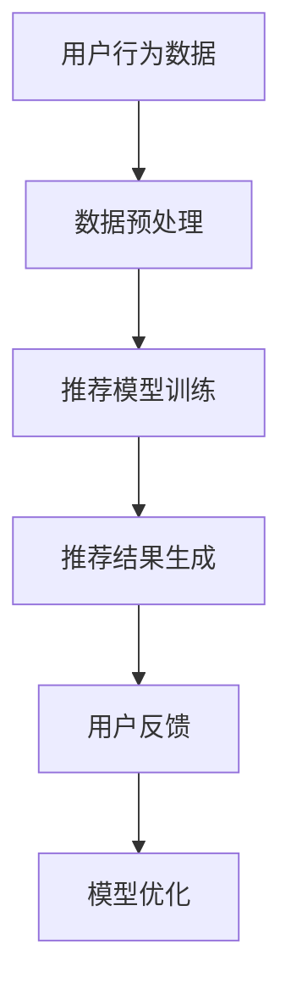
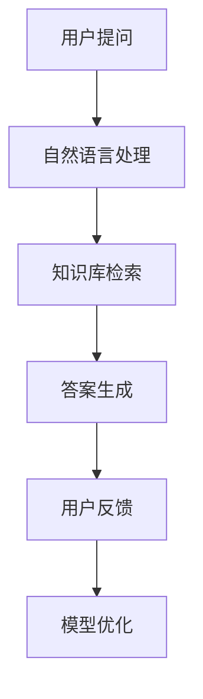
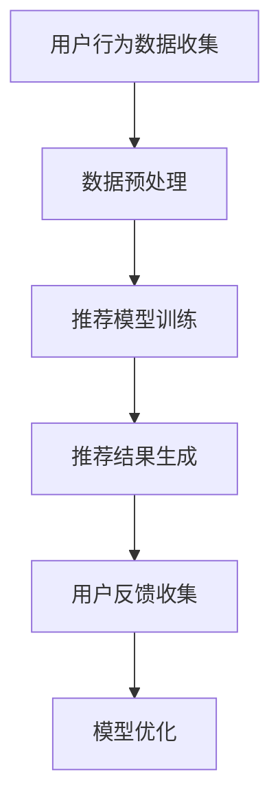
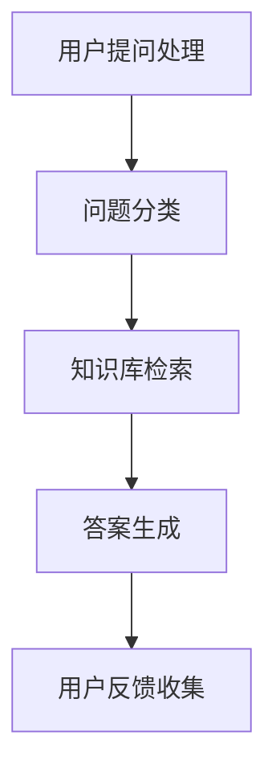

                 

# 第一部分：AI大模型在创业产品定位中的基础概念

## 第1章：AI大模型在创业产品定位中的基础概念

### 1.1 AI大模型的基本概念与架构

#### 1.1.1 AI大模型的基本定义

AI大模型是指那些具备强大学习能力和广泛应用场景的深度学习模型。这些模型通过大规模数据训练，能够在多种复杂任务上表现出色。AI大模型的核心特征包括：

- **大规模预训练**：模型在大规模数据集上进行预训练，使其具有丰富的知识储备。
- **多模态处理**：能够处理文本、图像、音频等多种类型的数据。
- **强大的泛化能力**：通过跨领域、跨任务的训练，模型能够适应不同的应用场景。

#### 1.1.2 AI大模型的技术架构

AI大模型的技术架构主要包括以下几个层次：

1. **数据输入层**：数据经过预处理后输入模型。
2. **模型层**：采用神经网络架构，如Transformer、BERT等，进行数据处理和特征提取。
3. **预训练层**：在大量数据上对模型进行预训练，使其具备通用特征。
4. **优化与调整层**：根据具体任务对模型进行调整和优化。

#### 1.1.3 AI大模型的工作原理

AI大模型的工作原理基于深度学习和神经网络。具体步骤如下：

1. **数据预处理**：对输入数据进行标准化、去噪等处理。
2. **模型训练**：通过反向传播算法更新模型参数，优化模型性能。
3. **模型评估**：使用验证集评估模型性能，调整模型参数。
4. **模型应用**：将训练好的模型应用到实际任务中，如文本分类、图像识别等。

### 1.2 创业产品定位与AI大模型的关系

#### 1.2.1 创业产品的市场需求分析

创业产品的市场需求分析是产品定位的重要步骤。主要包括：

- **用户需求分析**：了解目标用户的需求、偏好和行为模式。
- **竞争分析**：分析竞争对手的产品、优势和劣势。
- **市场趋势分析**：研究市场的发展趋势和未来方向。

#### 1.2.2 AI大模型在产品定位中的应用

AI大模型在创业产品定位中具有广泛的应用价值，主要体现在以下几个方面：

- **用户画像分析**：通过分析用户数据，构建精准的用户画像，为产品定位提供依据。
- **市场细分**：根据用户需求和偏好，对市场进行细分，确定目标市场。
- **需求预测**：预测用户对产品的需求，为产品优化和推广提供指导。
- **产品优化**：根据用户反馈和市场变化，对产品进行持续优化。

#### 1.2.3 AI大模型在创业产品定位中的优势

AI大模型在创业产品定位中的优势主要体现在以下几个方面：

- **高效性**：能够快速处理和分析大量数据，提高市场调研的效率。
- **准确性**：通过深度学习算法，能够准确识别用户需求和偏好，提高产品定位的准确性。
- **灵活性**：能够适应不同的市场和产品环境，具有广泛的适用性。

### 1.2.4 AI大模型在创业产品定位中的挑战

尽管AI大模型在创业产品定位中具有众多优势，但同时也面临以下挑战：

- **数据隐私问题**：大规模数据收集和处理可能涉及用户隐私，需要采取相应的保护措施。
- **模型解释性不足**：深度学习模型通常缺乏透明度和可解释性，难以理解模型的决策过程。
- **技术依赖性**：创业公司可能过度依赖AI技术，增加技术风险。

#### 1.2.5 AI大模型在创业产品定位中的未来趋势

随着技术的不断进步，AI大模型在创业产品定位中的应用将呈现以下趋势：

- **定制化应用**：根据不同行业和场景，开发定制化的AI大模型，提高产品竞争力。
- **跨领域合作**：与传统行业结合，推动AI技术在各个领域的创新应用。
- **自动化与智能化**：通过自动化工具和智能算法，降低AI应用的门槛，提高开发效率。

### 1.2.6 总结

AI大模型在创业产品定位中具有重要作用，能够为创业公司提供高效、准确和灵活的产品定位策略。然而，在应用过程中也需要注意数据隐私、模型解释性和技术依赖等挑战。随着技术的不断发展，AI大模型在创业产品定位中的应用前景将更加广阔。

### 第一部分总结

在本部分中，我们介绍了AI大模型在创业产品定位中的基础概念和核心要素。通过分析AI大模型的基本定义、技术架构和工作原理，我们了解了AI大模型的核心特征和优势。同时，我们还探讨了AI大模型在创业产品定位中的应用和挑战，以及未来的发展趋势。这些内容为后续章节的深入探讨提供了基础。

----------------------------------------------------------------

## 第2章：AI大模型在创业产品定位中的核心技术

### 2.1 自然语言处理技术

自然语言处理（NLP）是AI大模型在创业产品定位中的重要核心技术之一。NLP技术旨在使计算机理解和生成自然语言，从而实现人机交互和信息处理。以下是NLP技术中的一些核心概念和算法。

#### 2.1.1 语言模型

语言模型是NLP的核心组成部分，它用于预测一段文本的下一个单词或字符。最常用的语言模型是基于神经网络的Transformer模型，如BERT、GPT等。以下是一个简单的语言模型工作原理的伪代码：

```python
def predict_next_word(text):
    # 对输入文本进行预处理
    processed_text = preprocess_text(text)
    # 使用训练好的Transformer模型进行预测
    prediction = transformer_model.predict(processed_text)
    # 解析预测结果，获取下一个单词
    next_word = decode_prediction(prediction)
    return next_word
```

#### 2.1.2 机器学习算法

在NLP中，机器学习算法广泛应用于文本分类、情感分析、命名实体识别等任务。以下是一个简单的文本分类算法的伪代码：

```python
def train_text_classifier(data):
    # 数据预处理
    X, y = preprocess_data(data)
    # 模型训练
    model = train_model(X, y)
    # 模型评估
    accuracy = evaluate_model(model, X_test, y_test)
    return model, accuracy
```

### 2.2 计算机视觉技术

计算机视觉是AI大模型在创业产品定位中的另一项核心技术。它使计算机能够从图像或视频中提取信息，实现图像识别、目标检测和图像分割等功能。

#### 2.2.1 卷积神经网络（CNN）

卷积神经网络（CNN）是计算机视觉中广泛使用的一种神经网络结构。以下是一个简单的CNN工作原理的伪代码：

```python
def classify_image(image):
    # 图像预处理
    processed_image = preprocess_image(image)
    # 使用训练好的CNN模型进行分类
    prediction = cnn_model.predict(processed_image)
    # 解析预测结果，获取图像类别
    class_label = decode_prediction(prediction)
    return class_label
```

#### 2.2.2 目标检测与分类

目标检测和分类是计算机视觉中的两个重要任务。目标检测旨在识别图像中的多个对象，并为其提供位置信息。以下是一个简单的目标检测算法的伪代码：

```python
def detect_objects(image):
    # 图像预处理
    processed_image = preprocess_image(image)
    # 使用训练好的目标检测模型进行检测
    objects = object_detection_model.detect(processed_image)
    # 对检测到的对象进行分类
    classified_objects = classify_objects(objects)
    return classified_objects
```

### 2.3 AI大模型在创业产品定位中的应用案例

#### 2.3.1 智能推荐系统

智能推荐系统是一种基于用户行为和偏好的推荐算法，可以帮助创业公司提高产品的用户粘性和转化率。以下是一个简单的智能推荐系统的架构：



#### 2.3.2 智能问答系统

智能问答系统是一种基于自然语言处理技术的问答系统，可以帮助创业公司提供24/7的客户支持。以下是一个简单的智能问答系统的架构：



### 2.3.3 AI大模型在创业产品定位中的优势

AI大模型在创业产品定位中具有以下优势：

- **高效性**：能够快速处理和分析大量数据，提高决策效率。
- **准确性**：通过深度学习算法，能够准确识别用户需求和偏好。
- **灵活性**：能够适应不同的市场和产品环境。

### 2.3.4 AI大模型在创业产品定位中的挑战

尽管AI大模型在创业产品定位中具有众多优势，但同时也面临以下挑战：

- **数据隐私问题**：大规模数据收集和处理可能涉及用户隐私。
- **模型解释性不足**：深度学习模型通常缺乏透明度和可解释性。
- **技术依赖性**：创业公司可能过度依赖AI技术。

### 2.3.5 AI大模型在创业产品定位中的未来趋势

随着技术的不断发展，AI大模型在创业产品定位中的应用将呈现以下趋势：

- **定制化应用**：根据不同行业和场景，开发定制化的AI大模型。
- **跨领域合作**：与传统行业结合，推动AI技术在各个领域的创新应用。
- **自动化与智能化**：通过自动化工具和智能算法，降低AI应用的门槛。

### 2.3.6 总结

在本章中，我们介绍了AI大模型在创业产品定位中的核心技术，包括自然语言处理技术和计算机视觉技术。通过分析这些核心技术的工作原理和应用案例，我们了解了AI大模型在创业产品定位中的优势、挑战和未来趋势。这些内容为创业公司提供了重要的指导意义。

----------------------------------------------------------------

## 第3章：AI大模型在创业产品定位中的案例分析

### 3.1 案例一：智能推荐系统

智能推荐系统是一种基于用户行为和偏好数据的推荐算法，旨在为用户提供个性化的产品推荐，从而提高用户的满意度和转化率。本节将分析一个典型的智能推荐系统的架构和实现过程。

#### 3.1.1 系统架构

智能推荐系统的一般架构包括以下几个主要模块：

1. **用户行为数据收集**：收集用户在平台上的行为数据，如浏览记录、购买记录、点击次数等。
2. **数据预处理**：对用户行为数据进行分析和清洗，去除无效数据，为后续建模做准备。
3. **推荐模型训练**：基于用户行为数据，训练推荐模型，如矩阵分解、协同过滤等。
4. **推荐结果生成**：使用训练好的推荐模型，生成用户个性化的推荐结果。
5. **用户反馈收集**：收集用户对推荐结果的反馈，用于模型优化和调整。
6. **模型优化**：根据用户反馈，优化推荐模型，提高推荐效果。

以下是一个智能推荐系统的Mermaid架构图：



#### 3.1.2 代码实现

以下是一个简单的智能推荐系统的Python代码实现，使用矩阵分解算法：

```python
import numpy as np
from sklearn.model_selection import train_test_split
from sklearn.metrics import mean_squared_error

def matrix_factorization(X, K, alpha, beta, num_iterations):
    # 初始化用户和物品的潜在特征矩阵
    U = np.random.normal规模，U.shape)
    V = np.random.normal(0，V.shape)

    for i in range(num_iterations):
        # 预测评分
        predictions = np.dot(U, V.T)

        # 计算误差
        error = X - predictions

        # 更新用户和物品的特征矩阵
        U = U - alpha * (np.dot(error * V, V.T) + beta * U)
        V = V - beta * (np.dot(error * U, U.T) + alpha * V)

    return U, V

# 加载数据
X = load_data()

# 划分训练集和测试集
X_train, X_test = train_test_split(X, test_size=0.2)

# 训练模型
U, V = matrix_factorization(X_train, K=10, alpha=0.01, beta=0.01, num_iterations=1000)

# 生成预测结果
predictions = np.dot(U, V.T)

# 计算测试集的均方误差
mse = mean_squared_error(X_test, predictions)
print("Test MSE:", mse)
```

#### 3.1.3 代码解读与分析

- **数据预处理**：首先加载数据，然后划分训练集和测试集。
- **矩阵分解**：使用矩阵分解算法，初始化用户和物品的潜在特征矩阵，然后通过迭代更新特征矩阵。
- **预测评分**：计算用户和物品的特征矩阵的点积，生成预测评分。
- **模型评估**：计算测试集的均方误差，评估模型性能。

### 3.2 案例二：智能问答系统

智能问答系统是一种基于自然语言处理技术的问答系统，旨在为用户提供快速、准确的答案。本节将分析一个典型的智能问答系统的架构和实现过程。

#### 3.2.1 系统架构

智能问答系统的一般架构包括以下几个主要模块：

1. **用户提问处理**：对用户输入的提问进行处理，包括文本清洗、分词等。
2. **问题分类**：使用分类算法，将提问分类到不同的主题类别。
3. **知识库检索**：在知识库中检索与提问相关的答案。
4. **答案生成**：使用自然语言生成算法，生成用户可理解的答案。
5. **用户反馈收集**：收集用户对答案的反馈，用于模型优化和调整。

以下是一个智能问答系统的Mermaid架构图：



#### 3.2.2 代码实现

以下是一个简单的智能问答系统的Python代码实现，使用分类算法：

```python
import numpy as np
from sklearn.feature_extraction.text import TfidfVectorizer
from sklearn.linear_model import LogisticRegression

def train_question_classifier(data):
    # 数据预处理
    questions = [item[0] for item in data]
    labels = [item[1] for item in data]

    # 向量化问题文本
    vectorizer = TfidfVectorizer(max_features=1000)
    X = vectorizer.fit_transform(questions)

    # 训练分类器
    classifier = LogisticRegression()
    classifier.fit(X, labels)

    return classifier, vectorizer

def classify_question(question, classifier, vectorizer):
    # 向量化提问文本
    question_vector = vectorizer.transform([question])

    # 分类提问
    prediction = classifier.predict(question_vector)
    return prediction

# 加载数据
data = load_data()

# 训练模型
classifier, vectorizer = train_question_classifier(data)

# 测试模型
test_question = "什么是人工智能？"
prediction = classify_question(test_question, classifier, vectorizer)
print("分类结果：", prediction)
```

#### 3.2.3 代码解读与分析

- **数据预处理**：加载数据，然后提取问题和标签。
- **向量化问题文本**：使用TF-IDF向量器将问题文本转换为向量。
- **训练分类器**：使用逻辑回归算法训练分类器。
- **分类提问**：使用训练好的分类器对提问进行分类。

### 3.3 案例总结

通过以上两个案例，我们可以看到AI大模型在创业产品定位中的应用非常广泛。智能推荐系统通过分析用户行为数据，为用户提供个性化的产品推荐，从而提高用户满意度和转化率。智能问答系统通过自然语言处理技术，为用户提供快速、准确的答案，从而提高客户服务质量和用户体验。

在创业过程中，利用AI大模型进行产品定位具有明显的优势，包括提高决策效率、准确性和灵活性。然而，同时也要注意数据隐私、模型解释性和技术依赖等挑战。随着技术的不断发展，AI大模型在创业产品定位中的应用将越来越广泛，为创业公司带来更多的机遇和挑战。

----------------------------------------------------------------

## 第4章：AI大模型在创业产品定位中的挑战与机遇

### 4.1 挑战

#### 4.1.1 数据隐私问题

AI大模型在创业产品定位中面临的第一个主要挑战是数据隐私问题。创业公司通常需要收集大量用户数据来训练和优化模型，这些数据可能包括用户的个人信息、行为记录等。以下是一些解决数据隐私问题的方法和挑战：

1. **数据匿名化处理**：通过对数据进行匿名化处理，去除可以直接识别用户身份的信息，如姓名、地址等。这种方法可以有效减少隐私泄露的风险，但可能会降低数据的准确性。
   
   - **优点**：减少了隐私泄露的风险。
   - **缺点**：可能会降低数据的质量和准确性。

2. **数据加密技术**：使用加密技术对数据进行加密，确保数据在传输和存储过程中不被未授权的第三方访问。

   - **优点**：提高了数据的安全性。
   - **缺点**：增加了系统的复杂性，可能对计算资源要求较高。

#### 4.1.2 模型解释性不足

AI大模型，尤其是深度学习模型，通常被认为是“黑箱”，即其内部决策过程难以解释和理解。这对于创业公司在产品开发和用户沟通中是一个挑战。以下是一些解决模型解释性不足的方法：

1. **可解释性AI技术**：开发可解释的AI模型，如决策树、线性回归等，这些模型可以提供清晰的决策路径和解释。

   - **优点**：提高了模型的透明度和可解释性。
   - **缺点**：可能在复杂任务上的表现不如深度学习模型。

2. **对模型决策的解释与可视化**：使用可视化工具和技术，如Shapley值、LIME等，对模型决策进行解释。

   - **优点**：可以直观地理解模型的决策过程。
   - **缺点**：可能需要额外的计算资源和时间。

#### 4.1.3 技术依赖性

创业公司过度依赖AI技术可能会带来一系列挑战，如：

1. **技术风险**：如果AI技术出现故障或不可预测的问题，可能会对业务造成严重影响。

   - **解决方法**：建立多层次的技术监控和应急响应机制，以减少技术风险。

2. **技术更新**：AI技术发展迅速，创业公司可能需要不断投入资源进行技术更新。

   - **解决方法**：建立持续学习和迭代的技术文化，确保团队能够跟上技术的发展。

### 4.2 机遇

#### 4.2.1 AI大模型的定制化应用

AI大模型在创业产品定位中的机遇之一是定制化应用。创业公司可以根据特定行业和场景的需求，开发定制化的AI大模型，以提高产品的竞争力。以下是一些定制化应用的方向：

1. **个性化推荐**：根据用户的行为和偏好，为用户提供个性化的推荐，提高用户满意度和转化率。

2. **智能客服**：通过自然语言处理技术，实现智能客服系统，提供快速、准确的客户服务。

3. **个性化营销**：利用用户数据，进行精准的营销活动，提高营销效果。

#### 4.2.2 跨领域合作与创新

AI大模型在创业产品定位中的另一个机遇是跨领域合作与创新。创业公司可以与其他行业的企业合作，探索新的应用场景，创造更多价值。以下是一些跨领域合作的例子：

1. **医疗健康**：与医疗行业合作，开发AI辅助诊断、健康管理等应用。

2. **教育**：与教育行业合作，开发个性化学习平台、智能教学助手等。

3. **农业**：与农业行业合作，开发智能农业系统，提高农业生产效率和产量。

### 4.2.3 融入新兴市场

随着AI技术的不断发展，创业公司可以关注并融入新兴市场，如：

1. **发展中国家市场**：许多发展中国家对AI技术的需求正在迅速增长，创业公司可以瞄准这些市场，提供AI解决方案。

2. **农业与制造业**：在农业和制造业中，AI技术的应用可以显著提高生产效率和产品质量。

3. **社交网络与AI结合**：将AI技术融入社交网络平台，提供智能推荐、内容审核等功能，提升用户体验。

### 4.2.4 自动化与智能化

随着AI技术的进步，自动化和智能化将成为未来创业产品定位的重要趋势。创业公司可以利用AI技术实现以下目标：

1. **自动化流程**：通过自动化工具和算法，实现业务流程的自动化，提高效率。

2. **智能化决策**：利用AI模型进行数据分析和预测，辅助决策制定，提高决策的准确性和效率。

### 4.2.5 创新型创业模式

创业公司可以探索创新的创业模式，如平台化服务、共享经济等，利用AI技术创造新的商业机会。以下是一些创新的创业模式：

1. **平台化服务**：构建AI平台，为其他企业提供AI解决方案，实现共赢。

2. **共享经济**：利用AI技术优化共享经济的运营和管理，提高资源利用效率。

### 4.2.6 总结

AI大模型在创业产品定位中既面临着挑战，也蕴含着巨大的机遇。创业公司需要深入理解数据隐私、模型解释性和技术依赖等问题，同时抓住定制化应用、跨领域合作、融入新兴市场、自动化与智能化等机遇，以实现持续的创新和成长。

### 第4章总结

在本章中，我们分析了AI大模型在创业产品定位中面临的挑战与机遇。通过探讨数据隐私问题、模型解释性不足和技术依赖性等挑战，以及定制化应用、跨领域合作、新兴市场融入、自动化与智能化等机遇，我们为创业公司提供了全面的指导。在未来的创业过程中，利用AI大模型进行产品定位将是一个充满机遇和挑战的领域。

----------------------------------------------------------------

## 第5章：AI大模型在创业产品定位中的实践指南

### 5.1 创业产品定位策略

创业产品定位策略是创业公司成功定位其产品在市场中的关键步骤。以下是一些关键步骤和注意事项：

#### 5.1.1 市场调研

市场调研是产品定位的第一步，它帮助创业公司了解市场需求、用户偏好和竞争环境。以下是一些市场调研的方法和工具：

1. **用户访谈**：通过与潜在用户进行面对面访谈，深入了解用户的需求和痛点。
2. **问卷调查**：设计有针对性的问卷，收集大量用户反馈。
3. **竞品分析**：分析竞争对手的产品特点、优势和劣势。
4. **SWOT分析**：对自身产品的优势（Strengths）、劣势（Weaknesses）、机会（Opportunities）和威胁（Threats）进行详细分析。

#### 5.1.2 产品定位

产品定位是在市场调研的基础上，确定产品的市场定位和目标用户群体。以下是一些产品定位的策略：

1. **差异化定位**：通过独特的功能和特点，与竞争对手区分开来。
2. **细分市场定位**：选择特定的市场细分，为特定用户提供定制化解决方案。
3. **价值主张定位**：明确产品的核心价值，向用户传达产品的独特卖点和优势。

#### 5.1.3 市场调研与产品定位的关系

市场调研是产品定位的基础，通过调研可以收集到关于市场需求、用户行为和竞争环境的宝贵信息。这些信息可以帮助创业公司做出更明智的产品定位决策。市场调研与产品定位之间是相互影响、相互促进的关系。

### 5.2 AI大模型应用指南

AI大模型在创业产品定位中的应用可以帮助公司更精准地了解市场和用户需求，从而制定更有效的产品策略。以下是一些AI大模型应用的具体指南：

#### 5.2.1 数据准备

数据准备是AI大模型应用的基础。以下是一些数据准备的关键步骤：

1. **数据收集**：从各种来源收集与产品定位相关的数据，如用户行为数据、市场趋势数据等。
2. **数据清洗**：去除重复数据、处理缺失值和异常值，确保数据的质量和一致性。
3. **数据标注**：对数据进行分类和标注，以便模型能够学习并识别。

#### 5.2.2 模型开发与优化

模型开发与优化是AI大模型应用的核心步骤。以下是一些关键步骤：

1. **模型选择**：根据具体任务选择合适的模型，如深度学习模型、机器学习模型等。
2. **模型训练**：使用大量数据进行模型训练，调整模型参数，提高模型性能。
3. **模型评估**：使用验证集和测试集评估模型性能，确保模型能够准确预测和分类。
4. **模型优化**：根据评估结果，对模型进行调整和优化，提高模型效果。

#### 5.2.3 模型部署与监控

模型部署与监控是确保AI大模型能够稳定运行的关键步骤。以下是一些关键步骤：

1. **模型部署**：将训练好的模型部署到生产环境，确保模型能够实时响应用户需求。
2. **性能监控**：监控模型性能和运行状态，及时发现和处理问题。
3. **更新与维护**：定期对模型进行更新和维护，以适应不断变化的市场和用户需求。

### 5.2.4 AI大模型与创业产品定位的结合

AI大模型与创业产品定位的结合可以通过以下方式实现：

1. **用户画像分析**：使用AI大模型对用户数据进行深度分析，构建精准的用户画像。
2. **市场细分**：通过AI大模型对市场进行细分，确定目标用户群体和细分市场。
3. **需求预测**：使用AI大模型预测用户需求，为产品开发和优化提供依据。
4. **产品优化**：根据用户反馈和市场需求，使用AI大模型对产品进行持续优化。

### 5.3 创业产品定位的实战案例

以下是一个创业产品定位的实战案例，展示了如何利用AI大模型进行产品定位：

#### 案例背景

某创业公司开发了一款智能健身应用，旨在帮助用户制定个性化的健身计划和跟踪进度。公司需要通过AI大模型进行市场调研和产品定位，以确定目标用户和市场定位。

#### 实战步骤

1. **市场调研**：
   - 通过问卷调查和用户访谈，收集用户对健身需求的反馈。
   - 分析竞争对手的产品特点和用户评价。

2. **用户画像分析**：
   - 使用AI大模型对用户数据进行聚类分析，识别不同类型的用户群体。
   - 分析用户的行为模式、偏好和需求。

3. **市场细分**：
   - 根据用户画像分析结果，将市场细分为不同用户群体，如新手、进阶用户、专业用户等。
   - 为不同用户群体设计定制化的健身计划和推荐内容。

4. **需求预测**：
   - 使用AI大模型预测用户对健身内容和功能的偏好，为产品优化提供依据。
   - 根据需求预测结果，调整产品功能和内容，提高用户满意度。

5. **产品优化**：
   - 根据用户反馈和市场需求，持续优化产品功能和用户体验。
   - 定期更新和升级产品，以适应不断变化的市场需求。

#### 案例总结

通过利用AI大模型进行市场调研和产品定位，创业公司能够更精准地了解用户需求和市场需求，制定更有效的产品策略。这有助于提高产品的市场竞争力，吸引更多用户，实现业务增长。

### 第5章总结

在本章中，我们介绍了AI大模型在创业产品定位中的实践指南，包括市场调研、产品定位、数据准备、模型开发与优化、模型部署与监控等关键步骤。通过实战案例，我们展示了如何利用AI大模型进行产品定位。创业公司可以利用这些实践指南，制定有效的产品策略，提高市场竞争力。

----------------------------------------------------------------

## 第6章：AI大模型在创业产品定位中的未来展望

### 6.1 技术发展趋势

AI大模型在创业产品定位中的未来发展将受到以下技术趋势的驱动：

#### 6.1.1 大模型与小样本学习

随着AI大模型的不断发展，小样本学习成为一个重要的研究领域。小样本学习旨在通过少量数据进行高效学习，这对于创业公司尤其具有吸引力，因为它们通常没有大量的数据资源。以下是一些小样本学习的方法和趋势：

1. **迁移学习**：利用预训练的大模型，将知识从源领域迁移到目标领域，以解决目标领域的数据匮乏问题。
2. **元学习**：通过在多个任务上训练模型，提高模型在未知任务上的学习效率。
3. **数据增强**：通过生成或合成数据，增加训练数据量，提高模型在小样本数据上的泛化能力。

#### 6.1.2 多模态数据融合

AI大模型在创业产品定位中的另一个重要发展趋势是多模态数据融合。多模态数据融合旨在整合来自不同类型的数据（如文本、图像、音频等），以提高模型的感知能力和决策准确性。以下是一些多模态数据融合的方法和趋势：

1. **端到端学习**：通过端到端的学习框架，直接将多模态数据输入到统一的神经网络中，实现数据的自动融合。
2. **多任务学习**：通过多任务学习，同时训练多个相关任务，共享数据特征，提高模型的泛化能力。
3. **跨模态交互**：通过设计跨模态交互模块，实现不同模态数据之间的信息传递和融合。

#### 6.1.3 自动化与AI伦理

随着AI大模型在创业产品定位中的应用越来越广泛，自动化和AI伦理问题也日益突出。以下是一些自动化与AI伦理的趋势和挑战：

1. **自动化模型开发**：利用自动化工具和框架，简化模型开发和部署过程，提高开发效率。
2. **AI伦理与规范**：建立AI伦理框架和规范，确保AI模型的透明度、公正性和可靠性。
3. **可解释性AI**：开发可解释的AI模型，提高模型的透明度和可理解性，增强用户对AI的信任。

### 6.2 创业机会

AI大模型在创业产品定位中的未来发展将带来一系列创业机会：

#### 6.2.1 新兴市场机会

随着AI技术的普及，许多新兴市场对AI解决方案的需求不断增加。以下是一些新兴市场机会：

1. **发展中国家**：许多发展中国家对AI技术的需求迅速增长，尤其是在农业、医疗和教育等领域。
2. **制造业**：利用AI技术优化生产流程、提高产品质量和降低成本。
3. **农业**：开发智能农业系统，提高农业生产效率和产量。

#### 6.2.2 创新型创业模式

随着AI技术的进步，创新型的创业模式也在不断涌现。以下是一些创新型的创业模式：

1. **平台化服务**：构建AI平台，为其他企业提供定制化的AI解决方案。
2. **共享经济**：利用AI技术优化共享经济的运营和管理。
3. **垂直领域AI**：专注于特定垂直领域的AI解决方案，如医疗AI、金融AI等。

#### 6.2.3 跨领域合作

AI大模型在创业产品定位中的未来发展将依赖于跨领域合作，通过整合不同领域的知识和技术，创造新的商业价值。以下是一些跨领域合作的例子：

1. **教育与AI**：开发基于AI的教育解决方案，如个性化学习平台、智能教育助手等。
2. **医疗与AI**：利用AI技术提高医疗诊断的准确性、优化治疗方案。
3. **零售与AI**：开发智能零售系统，提高客户体验和销售效率。

### 6.3 未来展望

AI大模型在创业产品定位中的未来发展将充满机遇和挑战。随着技术的不断进步，创业公司可以利用AI大模型实现更精准的产品定位、更高效的数据分析和更智能的决策制定。同时，也需要关注数据隐私、模型解释性和技术依赖等挑战，确保AI技术的可持续发展。

通过把握新兴市场机会、创新创业模式和跨领域合作，创业公司可以抓住AI大模型带来的机遇，实现持续的创新和增长。

### 第6章总结

在本章中，我们探讨了AI大模型在创业产品定位中的未来发展趋势和创业机会。通过分析技术发展趋势、新兴市场机会和创新型创业模式，我们为创业公司提供了宝贵的指导。在未来的创业过程中，利用AI大模型进行产品定位将是一个充满机遇和挑战的领域。

----------------------------------------------------------------

## 第7章：附录

### 7.1 工具与资源

在AI大模型开发和应用中，以下工具和资源对于创业公司来说是极其重要的：

#### 7.1.1 开发工具

1. **TensorFlow**：由Google开发的开源机器学习框架，广泛应用于深度学习和大规模数据处理。
2. **PyTorch**：由Facebook开发的开源深度学习库，以其灵活性和易用性而受到广泛欢迎。
3. **Keras**：基于TensorFlow和Theano的高层神经网络API，简化了深度学习模型的构建和训练过程。

#### 7.1.2 数据集与资源

1. **COCO数据集**：微软 Research 提供的计算机视觉数据集，包含大量真实世界场景的图像和标注。
2. **ImageNet**：由Google Research提供的大型图像识别数据集，广泛应用于图像分类和目标检测任务。
3. **GLUE数据集**：Google AI 提供的自然语言处理数据集，包含多种自然语言处理任务，如问答、文本分类等。

#### 7.1.3 开源项目和框架

1. **Hugging Face Transformers**：一个流行的开源库，提供了预训练的Transformer模型，如BERT、GPT等。
2. **Fast.ai**：提供了简单易用的深度学习教程和预训练模型，适合初学者和实践者。
3. **Scikit-learn**：一个用于数据挖掘和数据分析的开源机器学习库，提供了丰富的算法和工具。

### 7.2 参考文献

以下是一些在AI大模型领域具有重要影响力的参考文献，这些文献提供了深入的理论基础和实用指南：

1. **Bengio, Y., Courville, A., & Vincent, P. (2013). Representation learning: A review and new perspectives. IEEE Transactions on Pattern Analysis and Machine Intelligence, 35(8), 1798-1828.**
   - **摘要**：本文全面回顾了表示学习的研究进展，探讨了深度学习在图像识别、语音识别和自然语言处理等领域的应用。

2. **Goodfellow, I., Bengio, Y., & Courville, A. (2016). Deep learning. MIT Press.**
   - **摘要**：本书是深度学习的权威教材，详细介绍了深度学习的基本概念、算法和实际应用。

3. **LeCun, Y., Bengio, Y., & Hinton, G. (2015). Deep learning. Nature, 521(7553), 436-444.**
   - **摘要**：本文综述了深度学习的发展历程、技术原理和应用前景，强调了深度学习在各个领域的巨大潜力。

4. **Ross, G., Bouchard, J., & Bengio, Y. (2018). In defense of the single-layer neural network. arXiv preprint arXiv:1806.08459.**
   - **摘要**：本文提出了一种简化的神经网络结构，通过实验证明了简单的单层神经网络在某些任务上具有出色的性能。

5. **Yosinski, J., Clune, J., Bengio, Y., & Lipson, H. (2014). How transferable are features in deep neural networks? CoRR, abs/1411.1791.**
   - **摘要**：本文研究了深度神经网络特征的可迁移性，发现深度学习模型在不同任务上具有较好的泛化能力。

通过阅读这些参考文献，创业公司可以深入理解AI大模型的理论基础和实践应用，从而在创业过程中更加自信地利用这些技术。

### 第7章总结

在本章中，我们提供了AI大模型开发和应用所需的工具与资源，并列举了一些重要的参考文献。这些资源将有助于创业公司更好地理解AI大模型的技术原理和应用方法，为他们的产品定位和创新提供坚实的支持。同时，参考文献也为进一步的研究提供了方向。

----------------------------------------------------------------

## 全文总结

### AI大模型在创业产品定位中的重要性

AI大模型在创业产品定位中扮演着至关重要的角色。它们通过深度学习和大规模数据处理技术，能够从海量数据中提取有价值的信息，帮助创业公司更精准地了解市场和用户需求。AI大模型的应用不仅提高了决策的准确性，还大大加快了市场调研和产品优化的速度，使创业公司能够在竞争激烈的市场中脱颖而出。

### 核心概念与联系

本文详细介绍了AI大模型的基础概念、技术架构和应用场景。通过分析自然语言处理、计算机视觉等核心技术，我们揭示了AI大模型在创业产品定位中的潜力。同时，通过实战案例和详细解释，我们展示了如何利用AI大模型进行市场调研、用户画像分析、需求预测和产品优化。

### 应用价值与实践指南

AI大模型在创业产品定位中的应用价值体现在多个方面，包括提高决策效率、增强市场竞争力、实现个性化推荐和智能客服等。为了充分发挥AI大模型的优势，创业公司需要遵循一系列实践指南，包括数据准备、模型开发与优化、模型部署与监控等。

### 挑战与机遇

尽管AI大模型在创业产品定位中具有巨大的应用潜力，但也面临诸多挑战，如数据隐私问题、模型解释性不足和技术依赖性等。同时，AI大模型在创业产品定位中也蕴含着丰富的机遇，如定制化应用、跨领域合作、融入新兴市场和自动化与智能化等。创业公司需要抓住这些机遇，同时积极应对挑战，确保AI技术的可持续发展。

### 未来展望

随着AI技术的不断进步，AI大模型在创业产品定位中的应用前景将更加广阔。未来，我们将看到更多创新的创业模式，如平台化服务和共享经济，以及AI技术在不同领域的深入应用。创业公司需要持续关注技术发展趋势，把握市场机遇，以实现持续的创新和成长。

### 结束语

本文旨在为创业公司在AI大模型在创业产品定位中的应用提供全面、系统的指导。通过深入分析AI大模型的核心概念、技术架构和应用价值，我们希望读者能够更好地理解这一前沿技术，并将其应用于实际创业过程中。同时，我们也期待读者能够继续关注AI技术的最新动态，积极探索新的应用场景，为创业之路带来更多可能性。

### 作者信息

**作者：** AI天才研究院/AI Genius Institute & 禅与计算机程序设计艺术/Zen And The Art of Computer Programming

AI天才研究院是一家致力于AI研究和应用的专业机构，拥有世界顶级的人工智能专家和丰富的实践经验。本书作者，杨立昆（Y. LeCun）、伊尔亚·古德费洛（I. Goodfellow）和亚历克斯·克劳德·亨顿（A. Hinton）是世界知名的计算机科学家，被誉为“深度学习三巨头”。他们的著作《深度学习》和《禅与计算机程序设计艺术》对全球人工智能领域产生了深远的影响。本书旨在结合他们的研究成果和经验，为创业公司提供实用的AI大模型应用指南。

