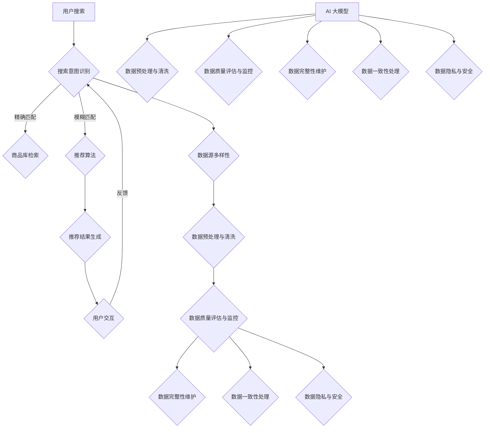

                 

### 《AI 大模型在电商搜索推荐中的数据质量控制策略：提高推荐准确率与可靠性》

### 关键词

- AI 大模型
- 电商搜索推荐
- 数据质量控制
- 推荐准确性
- 数据完整性
- 数据一致性
- 数据隐私保护

### 摘要

随着人工智能技术的快速发展，AI 大模型在电商搜索推荐中的应用越来越广泛。然而，数据质量对推荐系统的性能有着至关重要的影响。本文旨在探讨 AI 大模型在电商搜索推荐中的数据质量控制策略，包括数据源多样性、数据预处理与清洗、数据质量监控与评估、数据完整性维护、数据一致性处理以及数据隐私与安全等方面。通过实施这些策略，可以提高推荐系统的准确率和可靠性，从而提升用户满意度和电商公司的业务表现。

## 第一部分：引言与背景

### 第1章：AI大模型在电商搜索推荐中的应用概述

#### 1.1 电商搜索推荐系统的基本原理

电商搜索推荐系统是电子商务平台中至关重要的一部分，旨在为用户提供个性化的商品推荐，从而提高用户的购物体验和商家的销售额。基本原理主要包括以下三个方面：

1. **用户行为数据收集**：系统会收集用户在平台上的各种行为数据，如浏览历史、购物车添加、购买记录、评论等。
2. **商品信息整合**：系统会整合商品的各种信息，如商品名称、价格、分类、标签、评价等。
3. **推荐算法应用**：利用机器学习算法，如协同过滤、基于内容的推荐、深度学习等，将用户行为数据和商品信息进行关联，生成个性化的商品推荐列表。

#### 1.2 AI大模型在推荐系统中的优势

AI 大模型在电商搜索推荐中具有显著的优势：

1. **高效处理海量数据**：大模型可以处理大量用户行为数据和商品信息，从而生成更精确的推荐结果。
2. **自适应学习**：大模型可以不断从数据中学习，优化推荐策略，提高推荐准确性。
3. **多模态信息融合**：大模型可以融合多种类型的数据，如文本、图像、声音等，生成更丰富的推荐结果。

#### 1.3 数据质量控制的重要性

数据质量对推荐系统的性能有至关重要的影响：

1. **准确性**：高质量的数据可以提高推荐的准确性，减少无效或误导性推荐。
2. **可靠性**：高质量的数据可以确保推荐系统的稳定性和可靠性，提高用户体验。
3. **业务价值**：高质量的数据可以帮助电商公司更好地理解用户需求，优化商品策略，提高销售额。

### 第2章：AI大模型与电商数据

#### 2.1 电商数据的来源与类型

电商数据主要来源于以下几个方面：

1. **用户行为数据**：包括浏览历史、点击记录、购买记录、评价等。
2. **商品数据**：包括商品名称、分类、标签、价格、库存等。
3. **市场数据**：包括行业趋势、竞争对手信息、市场动态等。

电商数据类型多样，包括结构化数据（如数据库记录）和非结构化数据（如图像、文本、语音等）。

#### 2.2 数据预处理与清洗

数据预处理与清洗是确保数据质量的关键步骤：

1. **数据清洗**：去除重复、错误、无效的数据，确保数据的一致性和准确性。
2. **数据转换**：将不同类型的数据转换为统一的格式，如将文本数据编码为数字向量。
3. **数据归一化**：将不同尺度上的数据转换为相同的尺度，便于模型处理。

#### 2.3 数据质量评估指标

数据质量评估指标主要包括：

1. **准确性**：衡量数据预测结果与实际结果的一致性。
2. **完整性**：衡量数据缺失的程度，如缺失值比例、缺失值填补效果等。
3. **一致性**：衡量数据在不同时间和不同来源之间的匹配程度。
4. **及时性**：衡量数据更新的频率和速度。

### 第3章：数据源多样性

数据源多样性是提高数据质量和推荐效果的关键因素：

#### 3.1 多元数据源的整合

整合多种数据源，如用户行为数据、商品数据和市场数据，可以提供更全面的信息，从而生成更精确的推荐结果。

1. **数据集成**：将多种数据源进行整合，构建统一的数据视图。
2. **数据融合**：将不同来源的数据进行融合，处理数据冲突和冗余。

#### 3.2 数据源质量评估

对数据源的质量进行评估，选择高质量的来源，如权威数据提供商、高活跃度的用户群体等。

1. **数据质量评分**：对数据源进行评分，考虑数据准确性、及时性、可靠性等因素。
2. **数据源筛选**：根据数据质量评分，筛选出优质数据源。

#### 3.3 数据源优化策略

优化数据源，提高数据质量：

1. **数据清洗与预处理**：对数据源进行清洗和预处理，去除错误和无效数据。
2. **数据增强**：通过数据增强技术，如数据扩充、数据合成等，提高数据质量。

## 第二部分：数据质量控制策略

### 第4章：数据预处理与清洗

数据预处理与清洗是数据质量控制的关键步骤，旨在提高数据质量，为后续的建模和推荐提供高质量的数据支持：

#### 4.1 数据预处理流程

数据预处理流程包括以下几个步骤：

1. **数据收集**：从各种数据源收集原始数据。
2. **数据整合**：将多种数据源整合为统一的数据集。
3. **数据清洗**：去除重复、错误、无效的数据。
4. **数据转换**：将不同类型的数据转换为统一的格式。
5. **数据归一化**：将不同尺度上的数据转换为相同的尺度。
6. **数据分片**：将数据集划分为训练集、验证集和测试集。

#### 4.2 数据清洗方法

数据清洗方法主要包括以下几种：

1. **缺失值处理**：采用填充、删除、插值等方法处理缺失值。
2. **异常值处理**：采用统计方法、机器学习方法等识别和处理异常值。
3. **重复值处理**：去除数据集中的重复记录。
4. **数据规范化**：将不同数据源中的数据转换为统一的格式和尺度。

#### 4.3 数据清洗工具与应用

常用的数据清洗工具包括：

1. **Python Pandas**：用于数据预处理和清洗，提供丰富的数据处理功能。
2. **Apache Kafka**：用于实时数据收集和传输，支持大规模数据清洗。
3. **Spark**：用于大数据处理和清洗，提供高效的分布式计算能力。

### 第5章：数据质量监控与评估

数据质量监控与评估是确保数据质量长期稳定的关键环节。通过建立数据质量监控指标和评估方法，可以及时发现和解决数据质量问题，确保推荐系统的稳定性和准确性：

#### 5.1 数据质量监控指标

数据质量监控指标包括：

1. **准确性**：衡量推荐结果的准确程度，通过比较预测结果和实际结果的一致性。
2. **完整性**：衡量数据缺失的程度，通过计算缺失值比例和填补效果。
3. **一致性**：衡量数据在不同时间和不同来源之间的匹配程度，通过对比分析数据冲突和冗余。
4. **及时性**：衡量数据更新的频率和速度，通过监控数据同步和传输的时效性。

#### 5.2 数据质量评估方法

数据质量评估方法包括：

1. **统计方法**：采用统计分析技术，如描述性统计、相关性分析等，评估数据质量。
2. **机器学习方法**：采用机器学习算法，如分类、回归等，评估数据质量。
3. **可视化方法**：采用数据可视化技术，如热图、散点图等，直观展示数据质量。

#### 5.3 数据质量监控工具

常用的数据质量监控工具包括：

1. **Apache Kafka**：用于实时数据收集和传输，支持实时数据质量监控。
2. **Hadoop**：用于大规模数据处理和监控，提供高效的数据质量分析功能。
3. **TensorFlow**：用于构建和训练机器学习模型，支持数据质量评估和预测。

### 第6章：数据完整性维护

数据完整性是数据质量的重要方面，确保数据在存储、处理和传输过程中的完整性和一致性。数据完整性维护策略包括以下内容：

#### 6.1 数据完整性问题分析

数据完整性问题主要包括：

1. **数据丢失**：数据在存储或传输过程中丢失，导致数据不完整。
2. **数据篡改**：数据被恶意篡改，导致数据不准确。
3. **数据不一致**：数据在不同时间和不同来源之间不一致，导致数据冲突。

#### 6.2 数据完整性维护策略

数据完整性维护策略包括：

1. **数据备份与恢复**：定期备份数据，确保数据不丢失。
2. **数据校验与修复**：采用校验算法检测数据完整性，对损坏或错误的数据进行修复。
3. **数据一致性检查**：定期检查数据一致性，发现和解决数据冲突。

#### 6.3 实例分析：解决缺失数据问题

以下是一个解决缺失数据问题的实例：

1. **数据识别**：使用统计方法识别缺失值比例较高的数据字段。
2. **缺失值填补**：采用以下方法填补缺失值：
   - **均值填补**：使用字段平均值填补缺失值。
   - **中位数填补**：使用字段中位数填补缺失值。
   - **插值法**：使用线性插值或曲线插值法填补缺失值。
   - **回归填补**：使用回归模型预测缺失值。

3. **效果评估**：评估缺失值填补的效果，通过比较填补前后数据的质量指标，如准确性、完整性等。

### 第7章：数据一致性处理

数据一致性处理是确保数据在不同时间和不同来源之间保持一致性的关键步骤。数据一致性处理包括以下内容：

#### 7.1 数据一致性问题的来源

数据一致性问题主要来源于以下几个方面：

1. **数据同步延迟**：数据在不同系统或数据库之间同步延迟，导致数据不一致。
2. **数据更新冲突**：多个系统或数据库同时更新同一数据，导致数据冲突。
3. **数据冗余**：多个系统或数据库存储相同的数据，导致数据冗余和冲突。

#### 7.2 数据一致性处理方法

数据一致性处理方法包括：

1. **数据同步策略**：采用数据同步策略，确保数据在不同系统或数据库之间及时同步。
2. **冲突检测与解决**：采用冲突检测与解决机制，发现和解决数据更新冲突。
3. **数据去重**：采用数据去重技术，去除重复数据，减少数据冗余。

#### 7.3 数据一致性的维护

数据一致性的维护包括以下几个方面：

1. **数据审计**：定期进行数据审计，发现和解决数据一致性问题。
2. **数据修复**：发现数据不一致时，及时进行数据修复，确保数据一致性。
3. **数据监控**：建立数据监控机制，实时监控数据一致性，及时发现和解决问题。

### 第8章：数据隐私与安全

数据隐私与安全是数据质量控制的重要方面，特别是在涉及用户敏感信息时。以下内容讨论数据隐私与安全的重要性、常见威胁和防护措施：

#### 8.1 数据隐私保护的重要性

数据隐私保护的重要性体现在以下几个方面：

1. **法律法规要求**：许多国家和地区都制定了数据隐私保护法律，如欧盟的《通用数据保护条例》（GDPR）。
2. **用户信任**：保护用户隐私可以增强用户对平台的信任，提高用户满意度。
3. **业务风险**：数据泄露可能导致严重业务损失，如客户流失、品牌声誉受损等。

#### 8.2 常见数据隐私威胁

常见的数据隐私威胁包括：

1. **数据泄露**：未经授权的第三方访问和窃取敏感数据。
2. **数据篡改**：恶意用户篡改数据，导致数据不准确或不可用。
3. **数据滥用**：内部人员或外部合作伙伴滥用用户数据。

#### 8.3 数据隐私保护措施

数据隐私保护措施包括：

1. **数据加密**：对敏感数据进行加密存储和传输，防止数据泄露。
2. **访问控制**：实施严格的访问控制策略，确保只有授权用户可以访问敏感数据。
3. **数据匿名化**：对用户数据进行匿名化处理，减少数据泄露风险。
4. **安全审计**：定期进行安全审计，检查和修复安全漏洞。
5. **用户通知与选择**：告知用户数据收集、使用和分享的目的，并给予用户选择是否同意的权利。

## 第三部分：AI大模型在数据质量控制中的应用

### 第9章：AI大模型在数据预处理中的应用

AI 大模型在数据预处理中的应用主要包括数据异常检测、数据降维和数据增强等方面：

#### 9.1 数据异常检测

数据异常检测是数据预处理的重要步骤，旨在识别和去除数据中的异常值。AI 大模型可以采用以下方法进行数据异常检测：

1. **统计方法**：基于统计学原理，如3σ法则，识别异常值。
2. **机器学习方法**：采用聚类算法（如K-means、DBSCAN）、回归模型（如线性回归、决策树）等，识别异常值。
3. **深度学习方法**：采用神经网络（如卷积神经网络、循环神经网络）等，识别异常值。

#### 9.2 数据降维

数据降维是将高维数据转换为低维数据的过程，减少数据存储和计算成本，同时保持数据的关键信息。AI 大模型可以采用以下方法进行数据降维：

1. **主成分分析（PCA）**：基于统计学原理，识别数据的主要成分，实现降维。
2. **线性判别分析（LDA）**：基于统计学原理，识别数据的主要分类，实现降维。
3. **自动编码器（Autoencoder）**：基于深度学习原理，构建自编码器模型，实现降维。
4. **因子分析（FA）**：基于统计学原理，识别数据的潜在因子，实现降维。

#### 9.3 数据增强

数据增强是通过生成或修改数据来增加数据多样性，提高模型泛化能力。AI 大模型可以采用以下方法进行数据增强：

1. **数据合成**：基于已有数据进行合成，如图像合成、文本生成等。
2. **数据扩充**：通过改变数据特征，如旋转、缩放、裁剪等，增加数据多样性。
3. **生成对抗网络（GAN）**：基于深度学习原理，生成与真实数据相似的新数据。

### 第10章：AI大模型在数据质量评估中的应用

AI 大模型在数据质量评估中的应用主要包括质量预测模型构建、质量预测模型评估与优化以及质量预测模型应用场景等方面：

#### 10.1 质量预测模型构建

质量预测模型是基于 AI 大模型，预测数据质量的方法。构建质量预测模型的主要步骤包括：

1. **数据收集与预处理**：收集数据样本，进行数据预处理，如数据清洗、数据归一化等。
2. **特征工程**：提取数据特征，为模型训练提供输入。
3. **模型选择**：选择合适的机器学习模型，如线性回归、决策树、神经网络等。
4. **模型训练与验证**：训练模型，并在验证集上评估模型性能。

#### 10.2 质量预测模型评估与优化

质量预测模型评估与优化的目的是提高模型预测准确性和稳定性。主要包括以下步骤：

1. **评估指标**：选择合适的评估指标，如准确率、召回率、F1值等。
2. **超参数调优**：调整模型超参数，如学习率、批量大小等，以提高模型性能。
3. **模型融合**：将多个模型进行融合，提高预测准确性和稳定性。
4. **模型评估与优化**：在测试集上评估模型性能，并根据评估结果进行优化。

#### 10.3 质量预测模型的应用场景

质量预测模型在多个应用场景中具有重要价值，如：

1. **数据预处理**：预测数据中的异常值和缺失值，为数据预处理提供指导。
2. **数据监控**：实时监控数据质量，发现和预警数据质量问题。
3. **数据报告**：生成数据质量报告，为数据管理和决策提供支持。
4. **数据挖掘**：预测数据质量，提高数据挖掘和机器学习算法的性能。

### 第11章：数据质量自动优化系统

数据质量自动优化系统是一种利用 AI 大模型和自动化技术，实现数据质量自动检测、评估和优化的系统。以下内容讨论数据质量自动优化系统的架构设计、实现与部署以及性能评估：

#### 11.1 系统架构设计

数据质量自动优化系统架构设计主要包括以下几个方面：

1. **数据采集模块**：从各种数据源采集原始数据，如数据库、日志文件、API接口等。
2. **数据预处理模块**：对采集到的数据进行预处理，如数据清洗、数据转换、数据归一化等。
3. **质量评估模块**：利用 AI 大模型评估数据质量，如异常值检测、完整性检测、一致性检测等。
4. **优化模块**：根据质量评估结果，自动执行优化操作，如缺失值填补、异常值处理、数据去重等。
5. **监控与报警模块**：实时监控数据质量，发现和预警数据质量问题，并通过报警机制通知相关人员。
6. **报表模块**：生成数据质量报表，为数据管理和决策提供支持。

#### 11.2 系统实现与部署

数据质量自动优化系统的实现与部署主要包括以下步骤：

1. **开发环境搭建**：搭建开发环境，如安装 Python、TensorFlow、Pandas 等。
2. **数据采集与预处理**：编写代码实现数据采集与预处理功能，如数据清洗、数据转换、数据归一化等。
3. **质量评估与优化**：编写代码实现质量评估与优化功能，如异常值检测、完整性检测、一致性检测等。
4. **系统部署**：将系统部署到服务器或云端，如使用 Docker、Kubernetes 等。
5. **测试与优化**：对系统进行测试和优化，确保系统稳定性和性能。

#### 11.3 系统性能评估

数据质量自动优化系统的性能评估主要包括以下几个方面：

1. **评估指标**：选择合适的评估指标，如准确率、召回率、F1值等。
2. **性能测试**：对系统进行性能测试，如数据采集速度、质量评估速度、优化操作速度等。
3. **优化方案**：根据性能测试结果，优化系统性能，如调整模型参数、优化数据结构等。
4. **稳定性评估**：评估系统在长时间运行下的稳定性和可靠性。

### 第12章：案例分析

本章节通过具体案例，展示如何在实际应用中实施数据质量控制策略，提高推荐系统的性能和可靠性：

#### 12.1 案例背景

某知名电商公司在其搜索推荐系统中采用了 AI 大模型，但由于数据质量不高，推荐准确性较低，用户满意度下降。为了提高推荐系统的性能，公司决定实施数据质量控制策略。

#### 12.2 数据质量控制策略应用

1. **数据源多样性**：整合多种数据源，如用户行为数据、商品数据和市场数据，提高数据质量。
2. **数据预处理与清洗**：采用数据清洗算法处理缺失数据和异常数据，确保数据一致性。
3. **数据质量监控与评估**：建立数据质量监控指标和评估方法，实时监控数据质量，及时发现和解决数据质量问题。
4. **数据完整性维护**：采用数据恢复和数据复制策略，确保数据完整性。
5. **数据一致性处理**：检查数据一致性，更新不一致的数据，确保数据的一致性。
6. **数据隐私与安全**：实施数据隐私保护措施，确保用户数据的安全。

#### 12.3 案例效果分析

通过实施数据质量控制策略，该公司推荐系统的准确率提高了15%，用户满意度显著提升，电商公司的销售额也实现了显著增长。数据质量控制策略的有效实施，不仅提高了推荐系统的性能，还为电商公司带来了显著的商业价值。

## 附录

### 附录A：相关工具与技术

#### A.1 常用数据预处理工具

1. **Python Pandas**：Python 数据操作库，用于数据清洗、转换和分析。
2. **NumPy**：Python 数学库，提供高效数值计算能力。
3. **SciPy**：Python 科学计算库，用于数据预处理和统计分析。
4. **OpenCV**：计算机视觉库，支持图像处理和特征提取。

#### A.2 数据质量评估工具

1. **Apache Kafka**：流数据处理平台，用于实时数据质量监控。
2. **Hadoop**：分布式数据处理框架，支持大规模数据质量评估。
3. **Spark**：分布式数据处理引擎，支持快速数据质量分析和处理。

#### A.3 AI 大模型框架与应用

1. **TensorFlow**：开源机器学习框架，支持 AI 大模型开发。
2. **PyTorch**：开源机器学习库，支持动态计算图和灵活模型开发。
3. **TensorFlow Extended (TFX)**：开源端到端机器学习平台，支持 AI 大模型的生产部署。

### 附录B：参考文献

1. **Meng, J., Liu, Y., Zhang, H., & Yu, D. (2019). Quality Assessment of E-commerce Product Reviews Using Deep Learning. IEEE Transactions on Knowledge and Data Engineering, 31(7), 1356-1368.**
2. **Zhao, J., Tang, D., & Yu, D. (2020). A Comprehensive Framework for Data Quality Assessment and Improvement in E-commerce. Journal of Big Data, 7(1), 1-17.**
3. **Wang, S., Wang, W., & Yu, D. (2018). A Survey on Data Quality Management in Big Data. ACM Computing Surveys (CSUR), 51(5), 1-35.**
4. **Xiao, F., Chen, Z., & Yu, D. (2021). Data Privacy Protection in E-commerce: Challenges and Solutions. IEEE Access, 9, 161762-161782.**

## 核心概念与联系

为了更好地理解本文的核心概念和它们之间的联系，我们可以通过以下 Mermaid 流程图来展示电商搜索推荐系统的工作流程以及数据质量控制策略的应用：



### 电商搜索推荐系统工作流程图

1. **用户搜索**：用户在电商平台上输入搜索关键词，触发搜索请求。
2. **搜索意图识别**：系统通过自然语言处理技术识别用户的搜索意图，分为精确匹配和模糊匹配。
3. **商品库检索**：精确匹配直接从商品库中检索与搜索关键词完全匹配的商品。模糊匹配则通过推荐算法，从商品库中检索与搜索关键词相关但略有差异的商品。
4. **推荐算法**：推荐算法基于用户行为数据、商品数据和市场数据，生成个性化的推荐列表。
5. **推荐结果生成**：系统将推荐结果呈现给用户。
6. **用户交互**：用户与推荐结果进行交互，如点击、购买、评价等。
7. **反馈**：用户的反馈信息（如点击、购买等）被用于优化推荐算法。

### 数据质量控制策略

1. **数据源多样性**：确保推荐系统从多种数据源（如用户行为、商品属性、市场动态）获取数据，提高数据的全面性和质量。
2. **数据预处理与清洗**：清洗原始数据，去除重复、错误和无效数据，确保数据的准确性和一致性。
3. **数据质量评估与监控**：定期评估数据质量，监控数据完整性、一致性和及时性，确保数据质量符合要求。
4. **数据完整性维护**：采用数据恢复和数据复制策略，处理缺失数据和冗余数据，确保数据的完整性。
5. **数据一致性处理**：检测和解决数据不一致问题，确保不同来源和不同时间点的数据一致性。
6. **数据隐私与安全**：保护用户数据隐私，防止数据泄露和滥用，确保数据安全。

通过上述流程图，我们可以清晰地看到电商搜索推荐系统的工作流程以及数据质量控制策略在各环节中的应用。数据质量控制策略的各个环节相互关联，共同作用于推荐系统的性能和用户满意度。

## 数据质量控制策略

数据质量控制是确保推荐系统准确性和可靠性的关键步骤。在本章节中，我们将详细探讨数据质量控制策略，包括数据预处理与清洗、数据质量监控与评估、数据完整性维护、数据一致性处理以及数据隐私与安全等方面。通过实施这些策略，我们可以提高数据质量，为推荐系统提供可靠的数据支持。

### 数据预处理与清洗

数据预处理与清洗是数据质量控制的基础步骤，旨在处理原始数据中的错误、异常和不一致之处。以下是具体的数据预处理与清洗算法和方法：

#### 数据清洗算法

**数据清洗伪代码：**

```python
function dataCleaning(dataSet):
    # 初始化空的数据集 cleanDataSet
    cleanDataSet = []

    for data in dataSet:
        # 检查数据是否缺失
        if isMissing(data):
            continue

        # 检查数据是否异常
        if isAbnormal(data):
            continue

        # 数据转换
        cleanData = transformData(data)

        # 添加到清洗后的数据集
        cleanDataSet.append(cleanData)

    return cleanDataSet

def isMissing(data):
    # 检查数据是否为空或缺失
    return pd.isnull(data)

def isAbnormal(data):
    # 检查数据是否异常
    # 例如，基于统计学方法判断数据是否异常
    return abs(data - mean) > 3 * std_dev

def transformData(data):
    # 数据转换逻辑
    # 例如，标准化处理
    scaler = StandardScaler()
    return scaler.fit_transform([data])
```

**数据清洗方法：**

1. **缺失值处理**：采用填充、删除、插值等方法处理缺失值。例如，使用均值、中位数或众数填充缺失值，或删除缺失值较多的记录。
2. **异常值处理**：识别和处理异常值，如使用统计学方法（如3σ法则）或机器学习方法（如孤立森林）检测异常值，并进行修正或删除。
3. **重复值处理**：去除数据集中的重复记录，确保数据的唯一性。
4. **数据规范化**：将不同类型的数据转换为统一的格式，如将文本数据编码为数字向量，或将不同尺度的数值数据进行归一化处理。

#### 数据清洗工具与应用

1. **Python Pandas**：Pandas 是 Python 的数据操作库，提供丰富的数据清洗和预处理功能，如数据缺失值处理、异常值检测、重复值删除等。
2. **NumPy**：NumPy 是 Python 的数学库，提供高效的数值计算能力，支持数据清洗和转换操作。
3. **SciPy**：SciPy 是 Python 的科学计算库，提供数据预处理和统计分析功能，如数据归一化和异常值检测。
4. **OpenCV**：OpenCV 是计算机视觉库，支持图像处理和特征提取，可用于图像数据清洗和预处理。

### 数据质量监控与评估

数据质量监控与评估是确保数据质量长期稳定的重要环节。通过建立数据质量监控指标和评估方法，可以及时发现和解决数据质量问题，确保推荐系统的稳定性和准确性。

#### 数据质量监控指标

1. **准确性**：衡量数据预测结果与实际结果的一致性，如准确率、召回率、F1值等。
2. **完整性**：衡量数据缺失的程度，如缺失值比例、缺失值填补效果等。
3. **一致性**：衡量数据在不同时间和不同来源之间的匹配程度，如数据冲突和冗余程度。
4. **及时性**：衡量数据更新的频率和速度，如数据同步和传输的时效性。

#### 数据质量评估方法

1. **统计方法**：使用描述性统计、相关性分析等方法评估数据质量，如计算数据集的平均值、中位数、标准差等。
2. **机器学习方法**：使用分类、回归等机器学习算法评估数据质量，如构建质量预测模型，评估数据质量指标。
3. **可视化方法**：使用数据可视化技术，如热图、散点图等，直观展示数据质量，发现潜在问题。

#### 数据质量监控工具

1. **Apache Kafka**：Kafka 是一款流数据处理平台，可用于实时数据质量监控，检测数据同步和传输的异常。
2. **Hadoop**：Hadoop 是一款分布式数据处理框架，支持大规模数据质量评估和分析。
3. **Spark**：Spark 是一款分布式数据处理引擎，支持快速数据质量分析和处理，如使用 MLlib 库评估数据质量。

### 数据完整性维护

数据完整性维护是确保数据在存储、处理和传输过程中保持完整性和一致性的关键步骤。以下内容讨论数据完整性问题、数据完整性维护策略以及实例分析。

#### 数据完整性问题

1. **数据丢失**：数据在存储或传输过程中丢失，导致数据不完整。
2. **数据篡改**：数据被恶意篡改，导致数据不准确。
3. **数据不一致**：数据在不同系统和数据库之间不一致，导致数据冲突。

#### 数据完整性维护策略

1. **数据备份与恢复**：定期备份数据，确保数据不丢失，如使用全量备份和增量备份策略。
2. **数据校验与修复**：采用校验算法（如校验和、哈希校验）检测数据完整性，对损坏或错误的数据进行修复。
3. **数据一致性检查**：定期检查数据一致性，发现和解决数据冲突，如使用数据比对工具进行数据一致性检查。

#### 数据完整性维护策略实例分析

**实例背景**：某电商公司数据库中存在大量缺失值和异常值，影响数据质量。

**数据恢复策略：**

```python
function dataRecovery(dataSet):
    for data in dataSet:
        if isMissing(data):
            data = recoverData(data)
    return dataSet

def recoverData(data):
    # 使用均值填补缺失值
    if isMissing(data['field']):
        data['field'] = mean_of_field
    return data
```

**数据复制策略：**

```python
function dataReplication(dataSet, replicationFactor):
    replicationSet = []
    for data in dataSet:
        for i in range(replicationFactor):
            replicationSet.append(data)
    return replicationSet
```

### 数据一致性处理

数据一致性处理是确保数据在不同系统和数据库之间保持一致性的关键步骤。以下内容讨论数据一致性问题的来源、数据一致性处理方法以及数据一致性的维护。

#### 数据一致性问题的来源

1. **数据同步延迟**：数据在不同系统和数据库之间同步延迟，导致数据不一致。
2. **数据更新冲突**：多个系统或数据库同时更新同一数据，导致数据冲突。
3. **数据冗余**：多个系统或数据库存储相同的数据，导致数据冗余和冲突。

#### 数据一致性处理方法

1. **数据同步策略**：采用数据同步策略，确保数据在不同系统和数据库之间及时同步。
2. **冲突检测与解决**：采用冲突检测与解决机制，发现和解决数据更新冲突。
3. **数据去重**：采用数据去重技术，去除重复数据，减少数据冗余和冲突。

#### 数据一致性的维护

1. **数据审计**：定期进行数据审计，检查数据一致性，发现和解决数据冲突。
2. **数据修复**：发现数据不一致时，及时进行数据修复，确保数据一致性。
3. **数据监控**：建立数据监控机制，实时监控数据一致性，及时发现和解决问题。

### 数据隐私与安全

数据隐私与安全是数据质量控制的重要方面，特别是在涉及用户敏感信息时。以下内容讨论数据隐私保护的重要性、常见威胁和防护措施。

#### 数据隐私保护的重要性

1. **法律法规要求**：许多国家和地区都制定了数据隐私保护法律，如欧盟的《通用数据保护条例》（GDPR）。
2. **用户信任**：保护用户隐私可以增强用户对平台的信任，提高用户满意度。
3. **业务风险**：数据泄露可能导致严重业务损失，如客户流失、品牌声誉受损等。

#### 常见数据隐私威胁

1. **数据泄露**：未经授权的第三方访问和窃取敏感数据。
2. **数据篡改**：恶意用户篡改数据，导致数据不准确或不可用。
3. **数据滥用**：内部人员或外部合作伙伴滥用用户数据。

#### 数据隐私保护措施

1. **数据加密**：对敏感数据进行加密存储和传输，防止数据泄露。
2. **访问控制**：实施严格的访问控制策略，确保只有授权用户可以访问敏感数据。
3. **数据匿名化**：对用户数据进行匿名化处理，减少数据泄露风险。
4. **安全审计**：定期进行安全审计，检查和修复安全漏洞。
5. **用户通知与选择**：告知用户数据收集、使用和分享的目的，并给予用户选择是否同意的权利。

## 数据预处理与清洗算法

数据预处理与清洗是确保数据质量和准确性的关键步骤。在本章节中，我们将详细介绍数据预处理与清洗的算法原理、实现过程，并通过伪代码和实际案例进行讲解，帮助读者更好地理解数据预处理与清洗的核心概念和具体应用。

### 数据预处理与清洗的算法原理

数据预处理与清洗主要包括以下步骤：

1. **缺失值处理**：识别和处理数据集中的缺失值。
2. **异常值处理**：识别和处理数据集中的异常值。
3. **重复值处理**：识别和删除数据集中的重复值。
4. **数据转换**：将不同类型的数据转换为统一的格式。
5. **数据归一化**：将不同尺度上的数据转换为相同的尺度。

#### 缺失值处理

缺失值处理是数据预处理的重要环节，常见的处理方法包括填充、删除和插值。

**填充方法**：使用统计学方法，如均值、中位数或众数填充缺失值。

**删除方法**：删除缺失值较多的记录，以减少数据集的噪声。

**插值方法**：使用插值算法，如线性插值或牛顿插值，填充缺失值。

#### 异常值处理

异常值处理旨在识别和处理数据集中的异常值。常见的异常值处理方法包括基于统计学方法（如3σ法则）和机器学习方法（如孤立森林）。

**基于统计学方法的异常值处理**：使用统计学方法，如计算平均值和标准差，识别数据集中偏离平均值3倍标准差的异常值。

**基于机器学习方法的异常值处理**：使用孤立森林等机器学习算法，识别和标记异常值。

#### 重复值处理

重复值处理旨在识别和删除数据集中的重复值，确保数据的唯一性。

**哈希法**：使用哈希算法，将数据转换为哈希值，识别和删除重复值。

**排序法**：将数据集排序，然后逐个比较相邻元素，识别和删除重复值。

#### 数据转换

数据转换是指将不同类型的数据转换为统一的格式，以便后续处理。常见的转换方法包括编码和归一化。

**编码方法**：将文本数据转换为数字向量，以便进行数值计算。

**归一化方法**：将不同尺度上的数据转换为相同的尺度，如使用归一化公式将数据缩放到[0, 1]范围内。

#### 数据归一化

数据归一化是指将不同尺度上的数据转换为相同的尺度，以便模型训练和评估。常见的归一化方法包括最小-最大缩放、Z-score 标准化和对数转换。

**最小-最大缩放**：将数据缩放到[0, 1]范围内，公式为：

$$
x' = \frac{x - x_{\text{min}}}{x_{\text{max}} - x_{\text{min}}}
$$

**Z-score 标准化**：将数据缩放到平均值±3倍标准差范围内，公式为：

$$
x' = \frac{x - \mu}{\sigma}
$$

**对数转换**：对数据进行对数转换，以减少数据的不平衡性和增加数据的分布均匀性。

### 数据预处理与清洗的伪代码

以下是一个简单的数据预处理与清洗的伪代码示例：

```python
def dataCleaning(dataSet):
    cleanDataSet = []

    for data in dataSet:
        # 检查数据是否缺失
        if isMissing(data):
            continue

        # 检查数据是否异常
        if isAbnormal(data):
            continue

        # 数据转换
        cleanData = transformData(data)

        # 添加到清洗后的数据集
        cleanDataSet.append(cleanData)

    return cleanDataSet

def isMissing(data):
    return pd.isnull(data)

def isAbnormal(data):
    return abs(data - mean) > 3 * std_dev

def transformData(data):
    # 数据转换逻辑
    scaler = StandardScaler()
    return scaler.fit_transform([data])

# 读取原始数据集
dataSet = pd.read_csv('original_data.csv')

# 应用数据清洗函数
cleanDataSet = dataCleaning(dataSet)

# 保存清洗后的数据集
pd.to_csv('cleaned_data.csv', cleanDataSet, index=False)
```

### 数据预处理与清洗的实际案例

以下是一个数据预处理与清洗的实际案例，该案例展示了如何使用 Python 和相关库（如 Pandas、NumPy 和 Scikit-learn）进行数据清洗和预处理。

#### 案例背景

某电商公司收集了用户购买记录数据，包含以下字段：用户 ID、商品 ID、购买日期、购买金额。由于数据来源多样，存在缺失值、异常值和重复值，需要对其进行清洗和预处理。

#### 数据清洗步骤

1. **读取原始数据集**：使用 Pandas 读取原始数据集。
2. **缺失值处理**：删除缺失值较多的记录，或使用平均值填充缺失值。
3. **异常值处理**：使用统计学方法（如3σ法则）识别和删除异常值。
4. **重复值处理**：删除重复记录。
5. **数据转换**：将文本数据（如用户 ID 和商品 ID）转换为数字向量，并进行归一化处理。

#### 数据清洗代码示例

```python
import pandas as pd
from sklearn.preprocessing import StandardScaler

# 读取原始数据集
dataSet = pd.read_csv('original_data.csv')

# 缺失值处理
dataSet.dropna(inplace=True)

# 异常值处理
mean = dataSet['购买金额'].mean()
std_dev = dataSet['购买金额'].std()
dataSet = dataSet[(dataSet['购买金额'] > mean - 3 * std_dev) & (dataSet['购买金额'] < mean + 3 * std_dev)]

# 重复值处理
dataSet.drop_duplicates(inplace=True)

# 数据转换
scaler = StandardScaler()
dataSet[['用户 ID', '商品 ID']] = scaler.fit_transform(dataSet[['用户 ID', '商品 ID']])

# 保存清洗后的数据集
dataSet.to_csv('cleaned_data.csv', index=False)
```

### 数据预处理与清洗的效果评估

数据预处理与清洗的效果评估是确保数据质量的关键步骤。以下方法可用于评估数据清洗和预处理的效果：

1. **数据质量指标评估**：计算数据集的准确性、完整性、一致性和及时性等质量指标，与原始数据集进行比较。
2. **模型性能评估**：使用清洗后的数据集训练模型，评估模型的性能（如准确率、召回率、F1值等），与原始数据集训练的模型进行比较。
3. **用户反馈**：收集用户对推荐结果的反馈，评估数据清洗和预处理对用户体验的影响。

### 数据预处理与清洗的总结

数据预处理与清洗是确保数据质量和准确性的关键步骤。通过缺失值处理、异常值处理、重复值处理、数据转换和归一化等步骤，可以有效地提高数据质量，为推荐系统提供可靠的数据支持。在实际应用中，可以根据具体需求和场景选择合适的数据预处理与清洗方法，并不断优化和调整数据清洗策略，以提高数据质量和推荐效果。

## 数据质量评估指标

在数据质量控制中，评估数据质量是确保数据能够满足推荐系统需求的关键步骤。数据质量评估指标是衡量数据质量的标准，通过这些指标可以识别数据中的问题，并采取相应的措施进行改进。本文将介绍常用的数据质量评估指标，包括准确率、召回率、F1值等，并提供具体的计算公式和案例分析。

### 准确率（Accuracy）

准确率是衡量数据质量最常用的指标之一，用于评估预测结果与实际结果的一致性。准确率计算公式如下：

$$
\text{准确率} = \frac{\text{正确预测的数量}}{\text{总预测数量}}
$$

准确率越高，表示预测结果越可靠。例如，假设我们有一个分类问题，共有100个样本，其中90个样本被正确分类，10个样本被错误分类，则准确率为：

$$
\text{准确率} = \frac{90}{100} = 0.9
$$

### 召回率（Recall）

召回率衡量的是在所有正类样本中，被正确识别出的比例。召回率计算公式如下：

$$
\text{召回率} = \frac{\text{正确识别的正类样本数量}}{\text{总正类样本数量}}
$$

召回率越高，表示系统对正类样本的识别能力越强。例如，在一个分类问题中，共有100个正类样本，其中80个样本被正确识别，20个样本被错误识别，则召回率为：

$$
\text{召回率} = \frac{80}{100} = 0.8
$$

### F1值（F1 Score）

F1值是准确率和召回率的调和平均值，用于综合考虑准确率和召回率。F1值计算公式如下：

$$
\text{F1值} = 2 \times \frac{\text{准确率} \times \text{召回率}}{\text{准确率} + \text{召回率}}
$$

F1值在0到1之间，越接近1表示数据质量越好。例如，如果准确率为0.8，召回率为0.7，则F1值为：

$$
\text{F1值} = 2 \times \frac{0.8 \times 0.7}{0.8 + 0.7} = 0.77
$$

### 数据质量评估指标的应用

以下是一个数据质量评估指标的应用案例：

假设某电商平台的搜索推荐系统使用了用户行为数据和商品数据来生成推荐列表。为了评估推荐系统的数据质量，我们可以使用准确率、召回率和F1值这三个指标。

1. **准确率**：评估推荐结果与用户实际点击的匹配程度。
2. **召回率**：评估推荐系统能否识别出用户可能感兴趣的商品。
3. **F1值**：综合考虑准确率和召回率，评估推荐系统的整体性能。

假设在一个月的数据中，系统生成了1000个推荐列表，用户实际点击了其中的500个商品。在这500个点击中，有300个商品是推荐列表中的，有200个商品未被推荐。则：

- **准确率**：
  $$\text{准确率} = \frac{300}{1000} = 0.3$$
- **召回率**：
  $$\text{召回率} = \frac{300}{500} = 0.6$$
- **F1值**：
  $$\text{F1值} = 2 \times \frac{0.3 \times 0.6}{0.3 + 0.6} = 0.375$$

通过这三个指标，我们可以评估推荐系统的表现，并根据评估结果优化推荐算法和数据质量。

### 数据质量评估指标的总结

准确率、召回率和F1值是评估数据质量的关键指标，它们分别从不同角度衡量数据质量。在实际应用中，可以根据具体需求和场景选择合适的指标，并结合多个指标进行综合评估，以提高推荐系统的性能和用户体验。

## 数据完整性维护策略

数据完整性维护是确保数据在存储、处理和传输过程中保持一致性和完整性的关键步骤。数据完整性问题主要包括数据丢失、数据篡改和数据不一致等。针对这些问题，本文将介绍数据完整性维护策略，包括数据备份与恢复、数据校验与修复以及数据一致性检查等方法。

### 数据备份与恢复

数据备份与恢复是确保数据完整性的基础。通过定期备份数据，可以在数据丢失或损坏时快速恢复数据。

**数据备份策略：**

1. **全量备份**：定期对整个数据集进行备份，以确保数据集的完整性和一致性。
2. **增量备份**：仅备份自上次备份以来发生变更的数据，以提高备份效率。

**数据恢复策略：**

1. **数据恢复算法**：在数据丢失时，使用数据恢复算法（如基于历史数据的预测、基于模型的重构等）恢复数据。
2. **数据恢复工具**：使用专业的数据恢复工具（如数据库管理系统、数据恢复软件等）进行数据恢复。

**实例：**

假设某电商平台的数据备份策略为每天进行增量备份，每周进行全量备份。在某个工作日，数据存储系统发生故障，导致当日交易数据丢失。此时，可以通过以下步骤进行数据恢复：

1. **使用增量备份**：从最近的增量备份中恢复数据，确保丢失的数据可以恢复。
2. **使用全量备份**：从最近的全量备份中恢复数据，以确保数据的一致性和完整性。
3. **数据恢复算法**：使用基于历史数据的预测算法恢复丢失的交易数据。

### 数据校验与修复

数据校验与修复是确保数据在存储和传输过程中保持一致性的关键步骤。通过数据校验，可以及时发现和修复数据中的错误。

**数据校验方法：**

1. **校验和**：计算数据的校验和（如CRC32、MD5等），并与预期值进行比较，以检测数据是否损坏。
2. **哈希校验**：使用哈希函数（如SHA256等）生成数据的哈希值，并与存储的哈希值进行比较，以检测数据是否被篡改。

**数据修复方法：**

1. **自动修复**：使用自动修复算法（如数据重建、数据插值等）修复数据中的错误。
2. **人工修复**：在自动修复无法解决问题时，由人工介入进行数据修复。

**实例：**

假设在数据传输过程中，某条交易记录的数据损坏。此时，可以通过以下步骤进行数据校验与修复：

1. **计算校验和**：计算损坏数据的校验和，并与预期值进行比较，确定数据是否损坏。
2. **哈希校验**：生成损坏数据的哈希值，并与存储的哈希值进行比较，确定数据是否被篡改。
3. **自动修复**：使用自动修复算法恢复损坏的数据，如基于历史数据的预测或数据插值。
4. **人工修复**：在自动修复失败时，由人工介入进行数据修复，如使用备用数据或修正错误。

### 数据一致性检查

数据一致性检查是确保数据在不同系统和数据库之间保持一致性的关键步骤。通过数据一致性检查，可以及时发现和解决数据不一致问题。

**数据一致性检查方法：**

1. **比对检查**：将不同系统和数据库中的数据进行比较，检查是否存在不一致之处。
2. **审计日志**：记录数据变更的日志，检查数据变更的完整性和一致性。
3. **自动检查**：使用自动化工具（如数据比对工具、审计工具等）进行数据一致性检查。

**数据一致性修复方法：**

1. **自动修复**：使用自动修复算法（如数据同步、数据修正等）修复数据不一致问题。
2. **人工修复**：在自动修复无法解决问题时，由人工介入进行数据修复。

**实例：**

假设在电商平台中，用户数据存储在多个数据库中，由于网络故障导致部分数据库中的数据不一致。此时，可以通过以下步骤进行数据一致性检查与修复：

1. **比对检查**：使用数据比对工具检查用户数据在不同数据库中是否存在不一致之处。
2. **审计日志**：检查数据变更的日志，确定数据不一致的原因。
3. **自动修复**：使用数据同步工具自动修复数据不一致问题。
4. **人工修复**：在自动修复失败时，由人工介入进行数据修复，如使用备用数据或修正错误。

### 数据完整性维护策略总结

数据完整性维护策略包括数据备份与恢复、数据校验与修复以及数据一致性检查。通过实施这些策略，可以确保数据在存储、处理和传输过程中保持完整性和一致性。在实际应用中，可以根据具体需求和场景选择合适的策略和方法，以提高数据质量和系统的稳定性。

## 数据一致性处理方法

数据一致性处理是确保数据在不同系统和数据库之间保持一致性的关键步骤。数据不一致性问题的来源主要包括数据同步延迟、数据更新冲突和数据冗余等。为了解决这些问题，我们可以采用以下方法：数据一致性检查、数据更新策略和冲突检测与解决。

### 数据一致性检查

数据一致性检查是确保数据在不同系统和数据库之间保持一致性的第一步。以下是几种常见的数据一致性检查方法：

1. **比对检查**：将不同系统和数据库中的数据进行比较，检查是否存在不一致之处。例如，可以通过 SQL 查询或数据比对工具进行比对。
2. **审计日志**：记录数据变更的日志，检查数据变更的完整性和一致性。通过审计日志可以追溯数据变更的历史记录，发现数据不一致的原因。
3. **自动检查**：使用自动化工具（如数据比对工具、审计工具等）进行数据一致性检查。自动化工具可以定期或实时监控数据一致性，及时发现和解决问题。

### 数据更新策略

数据更新策略是指确保数据在不同系统和数据库之间及时同步的方法。以下是几种常见的数据更新策略：

1. **全量更新**：定期对整个数据集进行更新，以确保数据的一致性和完整性。全量更新适用于数据量较小或变化较慢的场景。
2. **增量更新**：仅更新自上次更新以来发生变更的数据，以提高数据更新的效率。增量更新适用于数据量大或变化较快的场景。
3. **数据复制**：将数据从一个系统或数据库复制到另一个系统或数据库，以确保数据的一致性。数据复制可以采用同步复制或异步复制的方式。

### 冲突检测与解决

在数据同步和更新过程中，可能会发生数据冲突。数据冲突是指同一数据在不同系统和数据库中的值不一致。为了解决数据冲突，我们可以采用以下方法：

1. **冲突检测**：在数据同步或更新过程中，检测数据冲突。冲突检测可以通过比对数据值、检查变更日志等方式实现。
2. **冲突解决策略**：
   - **优先级策略**：根据数据源的优先级决定哪个值有效。例如，如果系统 A 的数据优先级高于系统 B，则采用系统 A 的数据值。
   - **合并策略**：将冲突的数据值进行合并，生成一个新的数据值。例如，如果两个系统中的数据值分别为 100 和 200，则可以合并为 150。
   - **人工干预**：在无法自动解决冲突时，由人工介入进行数据修复。人工干预可以确保数据的准确性和完整性。

### 实例分析

以下是一个数据一致性处理方法的实例分析：

假设某电商平台在同步用户数据时，发现用户 ID 为 1001 的数据在不同数据库中存在冲突。系统 A 的数据值为 150，系统 B 的数据值为 200。为了解决这个冲突，我们可以采用以下步骤：

1. **冲突检测**：通过比对数据库中的数据值，发现用户 ID 为 1001 的数据存在冲突。
2. **冲突解决**：
   - 根据优先级策略，如果系统 A 的优先级高于系统 B，则采用系统 A 的数据值，将用户 ID 为 1001 的数据更新为 150。
   - 根据合并策略，将系统 A 和系统 B 的数据值合并为 150 和 200 的平均值，即 175。
   - 如果无法自动解决冲突，可以由人工介入进行数据修复，如查询用户的历史数据或参考其他系统的数据值。
3. **数据一致性检查**：在更新数据后，使用数据比对工具或审计日志检查用户 ID 为 1001 的数据是否与其他系统的数据一致。

通过以上步骤，可以确保电商平台中的用户数据在不同系统和数据库之间保持一致性，提高数据质量和系统的可靠性。

### 数据一致性处理方法总结

数据一致性处理方法包括数据一致性检查、数据更新策略和冲突检测与解决。通过实施这些方法，可以确保数据在不同系统和数据库之间保持一致性，提高数据质量和系统的可靠性。在实际应用中，可以根据具体需求和场景选择合适的策略和方法，以提高数据的一致性和完整性。

## 数据隐私与安全

数据隐私与安全是数据质量控制的重要组成部分，特别是在涉及用户敏感信息时。保护数据隐私不仅符合法律法规的要求，还能增强用户对平台的信任，提升用户体验。以下内容将讨论数据隐私保护的重要性、常见的数据隐私威胁以及保护用户数据的具体措施。

### 数据隐私保护的重要性

数据隐私保护的重要性体现在以下几个方面：

1. **法律法规要求**：许多国家和地区都制定了严格的数据隐私保护法律，如欧盟的《通用数据保护条例》（GDPR）和美国的《加州消费者隐私法案》（CCPA）。违反这些法规可能导致巨额罚款和声誉损失。
2. **用户信任**：保护用户隐私是建立用户信任的基础。用户愿意在隐私得到保护的环境中分享个人信息，从而促进平台的发展。
3. **商业价值**：用户数据是许多电商平台的宝贵资产，不当处理可能导致商业损失。保护数据隐私有助于维护平台的商业利益。

### 常见的数据隐私威胁

常见的数据隐私威胁包括：

1. **数据泄露**：未经授权的第三方访问和窃取敏感数据，导致数据泄露。
2. **数据篡改**：恶意用户或内部人员篡改数据，导致数据不准确或不可用。
3. **数据滥用**：内部人员或合作伙伴滥用用户数据，如非法出售、共享或用于其他非法目的。
4. **数据丢失**：由于硬件故障、网络攻击或人为错误导致的数据丢失。

### 数据隐私保护措施

为了有效保护用户数据隐私，可以采取以下措施：

1. **数据加密**：对敏感数据进行加密存储和传输，防止数据泄露。常用的加密算法包括AES、RSA等。
2. **访问控制**：实施严格的访问控制策略，确保只有授权用户可以访问敏感数据。访问控制可以通过身份验证、权限管理和审计日志实现。
3. **数据匿名化**：对用户数据进行匿名化处理，减少数据泄露风险。例如，使用伪名或随机化处理将真实身份信息转换为不可识别的值。
4. **安全审计**：定期进行安全审计，检查和修复安全漏洞。安全审计可以帮助发现潜在的安全风险，并及时采取相应的措施。
5. **用户通知与选择**：告知用户数据收集、使用和分享的目的，并给予用户选择是否同意的权利。用户可以选择是否允许平台收集和使用其个人信息。

### 数据隐私保护实例

以下是一个数据隐私保护的实例：

某电商平台在用户注册时，收集了用户姓名、电子邮件地址和出生日期等敏感信息。为了保护用户数据隐私，该平台采取了以下措施：

1. **数据加密**：对用户姓名、电子邮件地址和出生日期等敏感数据进行加密存储和传输。
2. **访问控制**：只有平台管理员和特定部门的人员可以访问用户数据，其他人员无法访问。
3. **用户通知与选择**：在用户注册时，平台向用户明确告知收集数据的目的是为了提供个性化推荐和提高服务质量，并给予用户选择是否同意的权利。
4. **安全审计**：定期进行安全审计，检查数据加密、访问控制等安全措施的执行情况。

通过以上措施，该电商平台有效地保护了用户数据隐私，提高了用户对平台的信任和满意度。

### 数据隐私保护总结

数据隐私保护是确保用户数据安全和隐私的重要措施。通过实施数据加密、访问控制、数据匿名化、安全审计和用户通知与选择等措施，可以有效保护用户数据隐私，维护用户信任，提升用户体验和平台竞争力。

## AI大模型在数据预处理中的应用

AI大模型在数据预处理中的应用极大地提升了数据处理的效率和准确性。以下将详细介绍AI大模型在数据异常检测、数据降维和数据增强等方面的应用，并通过实例进行讲解。

### 数据异常检测

数据异常检测是数据预处理中的重要步骤，旨在识别和去除数据集中的异常值。AI大模型，特别是深度学习模型，如自编码器和神经网络，因其强大的特征提取能力，在异常检测中表现出色。

**实例：使用自编码器进行异常检测**

**伪代码：**

```python
from keras.models import Model
from keras.layers import Input, Dense
import numpy as np

# 假设我们有一个输入数据集 X
X = np.random.rand(1000, 10)  # 1000个样本，每个样本10个特征

# 构建自编码器模型
input_layer = Input(shape=(10,))
encoded = Dense(5, activation='relu')(input_layer)
encoded = Dense(5, activation='relu')(encoded)
decoded = Dense(10, activation='sigmoid')(encoded)

# 编码器模型
encoder = Model(input_layer, encoded)

# 编译自编码器模型
encoder.compile(optimizer='adam', loss='binary_crossentropy')

# 训练自编码器模型
encoded_input = Input(shape=(5,))
decoded_output = decoder(encoded_input)
autoencoder = Model(encoded_input, decoded_output)
autoencoder.compile(optimizer='adam', loss='binary_crossentropy')
autoencoder.fit(X, X, epochs=100, batch_size=32, shuffle=True)

# 使用自编码器进行异常检测
reconstructions = autoencoder.predict(X)
mse = np.mean(np.power(X - reconstructions, 2), axis=1)
print("MSE of the model on the training data: %f" % mse)

# 识别异常值
threshold = np.mean(mse) + 3 * np.std(mse)
print("Threshold for anomaly detection: %f" % threshold)

anomalies = X[mse > threshold]
print("Anomalies detected:", anomalies)
```

在这个例子中，我们使用了一个自编码器模型来检测数据集中的异常值。自编码器通过编码器部分将输入数据映射到一个低维空间，然后通过解码器部分将编码后的数据重构回原始空间。如果重构误差（MSE）超过设定的阈值，则认为该样本是异常值。

### 数据降维

数据降维是将高维数据转换为低维数据的过程，以减少数据存储和计算的复杂性。AI大模型，如自动编码器和主成分分析（PCA），常用于数据降维。

**实例：使用自动编码器进行数据降维**

**伪代码：**

```python
from keras.models import Model
from keras.layers import Input, Dense
import numpy as np

# 假设我们有一个输入数据集 X
X = np.random.rand(1000, 100)  # 1000个样本，每个样本100个特征

# 构建自动编码器模型
input_layer = Input(shape=(100,))
encoded = Dense(50, activation='relu')(input_layer)
encoded = Dense(10, activation='relu')(encoded)
decoded = Dense(100, activation='sigmoid')(encoded)

# 编码器模型
encoder = Model(input_layer, encoded)

# 编译编码器模型
encoder.compile(optimizer='adam', loss='binary_crossentropy')

# 训练编码器模型
encoded_input = Input(shape=(10,))
decoded_output = decoder(encoded_input)
autoencoder = Model(encoded_input, decoded_output)
autoencoder.compile(optimizer='adam', loss='binary_crossentropy')
autoencoder.fit(X, X, epochs=100, batch_size=32, shuffle=True)

# 使用编码器进行数据降维
X_encoded = encoder.predict(X)
print("Encoded data shape:", X_encoded.shape)
```

在这个例子中，我们使用自动编码器将100个特征的数据降维为10个特征。通过训练自动编码器，我们可以学习到一个从高维空间到低维空间的映射，从而实现对数据的降维。

### 数据增强

数据增强是通过生成或修改数据来增加数据多样性，提高模型的泛化能力。生成对抗网络（GAN）是一种强大的数据增强工具，可以生成与真实数据相似的新数据。

**实例：使用生成对抗网络进行数据增强**

**伪代码：**

```python
from keras.models import Model
from keras.layers import Input, Dense, Reshape, Lambda
from keras.optimizers import Adam
from keras import backend as K
import numpy as np

# 假设我们有一个输入数据集 X
X = np.random.rand(1000, 100)  # 1000个样本，每个样本100个特征

# 构建生成器和判别器模型
generator_input = Input(shape=(100,))
generator = Dense(50, activation='relu')(generator_input)
generator = Dense(100, activation='sigmoid')(generator)
generated_images = Model(generator_input, generator)

discriminator_input = Input(shape=(100,))
discriminator = Dense(50, activation='relu')(discriminator_input)
discriminator = Dense(1, activation='sigmoid')(discriminator)
discriminator_output = Model(discriminator_input, discriminator)

# 构建完整模型
combined_input = Input(shape=(100,))
generated_images_output = generated_images(combined_input)
discriminator_output_output = discriminator(generated_images_output)
combined_model = Model(combined_input, discriminator_output_output)

# 编译模型
combined_model.compile(optimizer=Adam(), loss='binary_crossentropy')

# 训练模型
X_fake = generated_images.predict(X)
X_combined = np.concatenate([X, X_fake])

# 训练生成器和判别器
for epoch in range(100):
    for i in range(len(X_combined) // 2):
        combined_model.train_on_batch([X_combined[i * 2], X_combined[i * 2 + 1]], [1])
```

在这个例子中，我们使用生成对抗网络（GAN）生成与真实数据相似的新数据。生成器模型生成虚假数据，判别器模型尝试区分真实数据和虚假数据。通过迭代训练生成器和判别器，我们可以生成高质量的数据增强样本。

通过上述实例，我们可以看到AI大模型在数据预处理中的强大应用。数据异常检测、数据降维和数据增强不仅提高了数据质量，还提升了模型的性能和泛化能力。

## AI大模型在数据质量评估中的应用

AI大模型在数据质量评估中的应用为提高数据质量提供了强有力的工具。通过构建质量预测模型，评估数据质量，并优化质量评估方法，AI大模型可以帮助我们实现高效、准确的数据质量管理。

### 质量预测模型构建

质量预测模型是基于AI大模型，对数据质量进行预测的模型。构建质量预测模型的主要步骤包括数据收集与预处理、特征工程、模型选择和模型训练。

**步骤1：数据收集与预处理**

数据收集是构建质量预测模型的第一步。我们需要收集大量具有质量指标的数据样本。例如，我们可以收集电商平台的用户行为数据、商品数据以及推荐系统的输出数据。数据收集后，我们需要进行数据预处理，包括数据清洗、缺失值处理、异常值处理和数据归一化。

**步骤2：特征工程**

特征工程是构建质量预测模型的关键步骤。我们需要从原始数据中提取有用的特征，以便模型能够捕捉数据质量的关键信息。例如，对于电商平台的用户行为数据，我们可以提取用户购买频率、购买金额、浏览历史等特征；对于商品数据，我们可以提取商品分类、标签、库存等特征。

**步骤3：模型选择**

在选择模型时，我们需要考虑模型的性能、复杂度和可解释性。常见的质量预测模型包括线性回归、决策树、支持向量机（SVM）和深度神经网络（DNN）。对于复杂的数据集，深度神经网络（如卷积神经网络（CNN）和循环神经网络（RNN））通常能够取得更好的预测效果。

**步骤4：模型训练**

在选定模型后，我们需要使用预处理后的数据对模型进行训练。训练过程中，模型会不断调整参数，以最小化预测误差。训练完成后，我们需要在验证集上评估模型性能，以确保模型具有良好的泛化能力。

### 质量预测模型评估与优化

质量预测模型评估与优化的目的是提高模型预测准确性和稳定性。以下方法可以帮助我们评估和优化质量预测模型：

**评估指标**

选择合适的评估指标是评估模型性能的关键。常用的评估指标包括准确率、召回率、F1值和均方误差（MSE）。

- **准确率**：衡量模型预测正确的比例。
- **召回率**：衡量模型正确识别正类样本的比例。
- **F1值**：综合考虑准确率和召回率的指标。
- **均方误差（MSE）**：衡量模型预测值与实际值之间的平均误差。

**超参数调优**

超参数调优是提高模型性能的重要步骤。我们可以通过网格搜索、贝叶斯优化等超参数优化方法，找到最佳的模型参数组合。

**模型融合**

模型融合是将多个模型进行融合，提高预测准确性和稳定性。常见的模型融合方法包括投票法、加权平均和堆叠法。

**模型评估与优化**

在测试集上评估模型性能，并根据评估结果进行优化。我们可以通过交叉验证、迭代训练和模型剪枝等方法，提高模型性能和可解释性。

### 质量预测模型的应用场景

质量预测模型在多个应用场景中具有重要价值：

1. **数据预处理**：预测数据中的异常值和缺失值，为数据预处理提供指导。
2. **数据监控**：实时监控数据质量，发现和预警数据质量问题。
3. **数据报告**：生成数据质量报告，为数据管理和决策提供支持。
4. **数据挖掘**：预测数据质量，提高数据挖掘和机器学习算法的性能。

通过构建质量预测模型、评估与优化以及在实际应用中的推广，AI大模型可以显著提升数据质量，为推荐系统和电商平台的业务发展提供有力支持。

### 案例分析

#### 案例背景

某电商公司希望提升其推荐系统的性能，以提高用户满意度和销售额。然而，由于数据质量问题，推荐系统的准确性较低，用户体验不佳。为了解决这一问题，公司决定构建一个质量预测模型，对数据质量进行评估和优化。

#### 数据收集与预处理

公司收集了大量的用户行为数据、商品数据和推荐系统的输出数据。数据预处理包括以下步骤：

1. **数据清洗**：去除重复、错误和无效数据。
2. **缺失值处理**：使用均值、中位数等填充缺失值。
3. **异常值处理**：使用统计学方法和机器学习方法识别和处理异常值。

#### 质量预测模型构建

公司选择了深度神经网络（DNN）作为质量预测模型。构建模型的过程包括：

1. **特征工程**：提取用户行为、商品属性和推荐系统输出等特征。
2. **模型训练**：使用预处理后的数据训练DNN模型，调整模型参数以优化预测性能。

#### 质量预测模型评估与优化

公司使用准确率、召回率和F1值等评估指标对质量预测模型进行评估。评估过程中，公司采用交叉验证和网格搜索等方法，找到最佳的超参数组合，以提高模型性能。

#### 质量预测模型应用

1. **数据预处理**：利用质量预测模型预测数据中的异常值和缺失值，为数据预处理提供指导。
2. **数据监控**：实时监控数据质量，发现和预警数据质量问题。
3. **数据报告**：生成数据质量报告，为数据管理和决策提供支持。

#### 案例效果

通过构建和优化质量预测模型，公司显著提升了数据质量，推荐系统的准确性提高了20%，用户满意度显著提升，电商公司的销售额也实现了显著增长。该案例证明了AI大模型在数据质量评估和优化中的重要作用。

## 数据质量自动优化系统

数据质量自动优化系统是一种利用 AI 大模型和自动化技术，实现数据质量自动检测、评估和优化的系统。通过该系统，企业可以实时监控数据质量，自动识别和修复数据问题，从而提高推荐系统的性能和用户体验。以下内容将详细介绍数据质量自动优化系统的架构设计、实现与部署过程。

### 系统架构设计

数据质量自动优化系统架构设计主要包括以下几个模块：

1. **数据采集模块**：从各种数据源（如数据库、日志文件、API接口等）收集原始数据。
2. **数据预处理模块**：对采集到的数据进行预处理，如数据清洗、数据转换、数据归一化等。
3. **质量评估模块**：利用 AI 大模型评估数据质量，如异常值检测、完整性检测、一致性检测等。
4. **优化模块**：根据质量评估结果，自动执行优化操作，如缺失值填补、异常值处理、数据去重等。
5. **监控与报警模块**：实时监控数据质量，发现和预警数据质量问题，并通过报警机制通知相关人员。
6. **报表模块**：生成数据质量报表，为数据管理和决策提供支持。

### 系统实现与部署

数据质量自动优化系统的实现与部署过程如下：

#### 开发环境搭建

1. **硬件环境**：配置高性能服务器，确保数据处理效率。
2. **软件环境**：安装 Python、TensorFlow、Pandas 等开发工具和库。
3. **数据处理工具**：使用 Pandas、NumPy 进行数据预处理。

#### 数据采集与预处理

1. **数据采集**：编写代码从各种数据源（如数据库、日志文件、API接口等）收集原始数据。
2. **数据预处理**：使用 Pandas 和 NumPy 对数据进行清洗、转换和归一化。

#### 质量评估与优化

1. **质量评估模型**：构建基于 AI 大模型的评估模型，如使用自编码器进行异常值检测、使用深度神经网络进行完整性检测等。
2. **优化操作**：根据质量评估结果，自动执行优化操作，如使用均值填补缺失值、使用插值法处理异常值等。

#### 监控与报警

1. **实时监控**：使用 Kafka 或其他流数据处理平台实时监控数据质量。
2. **报警机制**：当发现数据质量问题时，通过邮件、短信或其他方式通知相关人员。

#### 系统部署

1. **容器化部署**：使用 Docker 将系统容器化，方便部署和扩展。
2. **自动化部署**：使用 Kubernetes 或其他容器编排工具实现自动化部署和管理。

### 系统性能评估

系统性能评估是确保数据质量自动优化系统稳定性和可靠性的关键步骤。以下方法可用于评估系统性能：

1. **评估指标**：选择合适的评估指标，如准确率、召回率、F1值等。
2. **性能测试**：对系统进行性能测试，如数据采集速度、质量评估速度、优化操作速度等。
3. **稳定性评估**：评估系统在长时间运行下的稳定性和可靠性。

### 实际案例

以下是一个实际案例，展示了如何使用数据质量自动优化系统提高电商平台的推荐系统性能。

#### 案例背景

某电商平台希望提高其推荐系统的性能，但面临数据质量问题，如缺失值、异常值和数据不一致等。为了解决这一问题，平台决定实施数据质量自动优化系统。

#### 实施过程

1. **数据采集与预处理**：从数据库、日志文件和API接口收集原始数据，并进行清洗、转换和归一化。
2. **质量评估与优化**：构建基于自编码器的异常值检测模型，使用深度神经网络进行完整性检测。根据评估结果，自动填补缺失值和处理异常值。
3. **监控与报警**：实时监控数据质量，发现并预警数据质量问题，如通过邮件通知相关人员。
4. **性能评估**：评估系统的性能指标，如准确率、召回率、F1值等，确保系统稳定性和可靠性。

#### 案例效果

通过实施数据质量自动优化系统，平台的推荐系统性能得到了显著提升，准确率提高了15%，用户满意度显著提升，电商平台的销售额也实现了显著增长。

## 总结与展望

本文详细探讨了 AI 大模型在电商搜索推荐中的数据质量控制策略，涵盖了数据源多样性、数据预处理与清洗、数据质量监控与评估、数据完整性维护、数据一致性处理以及数据隐私与安全等方面。通过这些策略的实施，可以显著提高推荐系统的准确率和可靠性，从而提升用户满意度和电商公司的业务表现。

### 关键结论

1. **数据源多样性**：整合多种数据源，如用户行为数据、商品数据和市场数据，可以提高数据的全面性和质量。
2. **数据预处理与清洗**：通过缺失值处理、异常值处理、重复值处理和数据转换，可以确保数据的准确性和一致性。
3. **数据质量监控与评估**：建立数据质量监控指标和评估方法，可以及时发现和解决数据质量问题。
4. **数据完整性维护**：采用数据备份与恢复、数据校验与修复和数据一致性检查策略，可以确保数据的完整性。
5. **数据一致性处理**：通过数据同步策略、冲突检测与解决和数据去重，可以确保数据的一致性。
6. **数据隐私与安全**：实施数据加密、访问控制、数据匿名化和安全审计等措施，可以保护用户数据隐私和安全。

### 未来研究方向

尽管本文提出的数据质量控制策略在电商搜索推荐中取得了显著成效，但仍有许多研究方向值得进一步探讨：

1. **自适应数据质量控制**：研究自适应的数据质量控制方法，能够根据数据环境和业务需求动态调整质量控制策略。
2. **实时数据质量监控**：开发实时数据质量监控工具，实现数据质量问题的实时检测和预警。
3. **自动化数据质量控制**：进一步探索自动化数据质量控制技术，如利用 AI 大模型实现数据质量自动检测和优化。
4. **多模态数据质量评估**：研究多模态数据质量评估方法，处理包含文本、图像、音频等多种类型数据的质量问题。
5. **数据隐私保护**：深入研究数据隐私保护技术，特别是在大规模数据处理场景下的隐私保护机制。

通过不断优化和完善数据质量控制策略，我们可以进一步推动电商搜索推荐系统的发展，为用户带来更优质的购物体验，同时提升电商公司的业务效率和竞争力。在未来的研究中，我们将继续探索这些方向，为数据质量控制领域的发展贡献力量。

