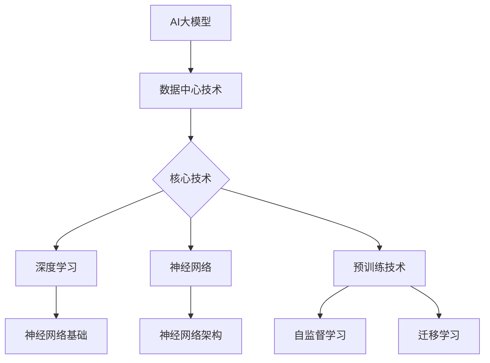

                 

# 《AI大模型应用数据中心建设：数据中心技术创新》

## 关键词
AI大模型、数据中心、技术创新、深度学习、神经网络、数据中心建设、绿色数据中心、边缘计算、云计算、智能故障诊断。

## 摘要
本文深入探讨了AI大模型应用数据中心建设中的关键技术、数据中心技术原理以及AI大模型与数据中心的技术融合。通过详细讲解核心概念、算法原理、数学模型、项目实战以及代码解读，为读者呈现了一幅数据中心技术创新的宏伟蓝图。文章涵盖了数据中心选址与布局、基础设施建设、网络规划与实施、数据存储与管理、数据中心运维与管理等方面，旨在为数据中心建设提供实用的指导与建议。

### 《AI大模型应用数据中心建设：数据中心技术创新》目录大纲

#### 第一部分：AI大模型基础

#### 第1章：AI大模型概述

##### 1.1 AI大模型的基本概念
- **AI大模型的定义与特点**
- **AI大模型的发展历程**

##### 1.2 AI大模型的核心技术
- **深度学习与神经网络基础**
- **主流AI大模型简介**
- **AI大模型的计算需求与优化**

#### 第2章：数据中心技术原理

##### 2.1 数据中心基础
- **数据中心的定义与分类**
- **数据中心的基本架构**

##### 2.2 数据中心网络技术
- **网络拓扑结构**
- **网络优化与调度策略**
- **数据中心互联技术**

##### 2.3 数据存储与管理
- **数据存储技术**
- **数据管理策略**
- **数据备份与恢复**

#### 第3章：AI大模型与数据中心的技术融合

##### 3.1 AI大模型在数据中心的应用场景
- **人工智能与数据中心融合的优势**
- **数据中心中的AI应用案例分析**

##### 3.2 数据中心技术创新
- **云计算与数据中心的关系**
- **边缘计算与数据中心**
- **绿色数据中心**

#### 第二部分：数据中心建设实践

#### 第4章：数据中心规划设计

##### 4.1 数据中心选址与布局
- **数据中心选址原则**
- **数据中心布局规划**

##### 4.2 数据中心基础设施建设
- **基础设施架构设计**
- **机房环境控制**
- **安全与可靠性设计**

##### 4.3 数据中心网络规划与实施
- **网络架构设计**
- **网络设备配置**
- **网络优化策略**

#### 第5章：AI大模型应用实践

##### 5.1 AI大模型应用案例分析
- **案例1：智能数据分析和预测**
- **案例2：智能故障诊断与维护**

##### 5.2 AI大模型在数据中心的建设实践
- **AI大模型应用流程**
- **AI大模型数据处理与优化**

##### 5.3 AI大模型性能调优与优化
- **性能调优策略**
- **优化技术实现**

#### 第6章：数据中心运维与管理

##### 6.1 数据中心运维体系
- **运维团队组织结构**
- **运维流程与规范**

##### 6.2 数据中心安全管理
- **安全风险识别与评估**
- **安全措施与策略**

##### 6.3 数据中心能耗管理
- **能耗监控与优化**
- **绿色数据中心实践**

#### 第7章：未来发展趋势与挑战

##### 7.1 数据中心与AI大模型的未来趋势
- **技术发展趋势**
- **市场需求与变化**

##### 7.2 数据中心建设中的挑战与应对
- **技术挑战**
- **管理挑战**
- **未来展望与规划**

## 附录

### 附录A：技术术语解释

#### A.1 数据中心相关术语
- **数据中心**
- **云计算**
- **边缘计算**

#### A.2 AI大模型相关术语
- **深度学习**
- **神经网络**
- **预训练**

### 附录B：参考资源

#### B.1 相关书籍与文献
- **《数据中心设计原则》**
- **《深度学习》**

#### B.2 技术博客与论坛
- **DatacenterDynamics**
- **AI博客**

## Mermaid 流程图



## 伪代码讲解

```plaintext
// 伪代码：AI大模型训练流程
Initialize_Model();
for (epoch in 1 to num_epochs) {
    for (batch in 1 to num_batches) {
        inputs, labels = get_batch_data(batch);
        predictions = Model(inputs);
        loss = calculate_loss(predictions, labels);
        update_model_weights(loss);
    }
    print("Epoch ", epoch, ": Loss = ", loss);
}
save_model(Model);
```

## 数学公式与详细讲解

$$
\text{Loss} = \frac{1}{n} \sum_{i=1}^{n} (\text{预测值} - \text{真实值})^2
$$

**详细讲解：** 该公式表示均方误差（MSE），用于衡量预测值与真实值之间的差异。其中，$n$ 为样本数量，$\text{预测值}$ 和 $\text{真实值}$ 分别为模型的预测结果和实际结果。

## 项目实战

### 案例背景

随着人工智能（AI）技术的快速发展，AI大模型在各个领域的应用越来越广泛。数据中心作为AI大模型运行的重要基础设施，其建设与优化成为了一个关键问题。本文将结合一个实际案例，介绍如何构建一个高效、可靠的AI大模型应用数据中心。

### 案例描述

某知名互联网公司希望建设一个AI大模型应用数据中心，用于支持其业务线中的图像识别和自然语言处理任务。该数据中心需要满足高计算性能、高可靠性、高可用性和低延迟等需求。

### 实践步骤

**步骤1：需求分析**

在建设AI大模型应用数据中心之前，需要对业务需求进行详细分析，确定数据中心的规模、性能和可靠性要求。例如，公司需要处理的海量图像数据、语音数据等，以及模型训练和推理的计算需求。

**步骤2：数据中心选址**

选择一个合适的地理位置是数据中心建设的关键。选址需要考虑以下几个方面：

- **地理位置**：数据中心应选择在交通便利、电力供应稳定、自然灾害较少的地区。
- **基础设施**：数据中心需要依赖可靠的基础设施，如电力、网络和冷却系统。
- **成本**：合理控制建设成本，确保投资回报。

**步骤3：数据中心规划设计**

数据中心规划设计主要包括以下几个方面：

- **基础设施设计**：包括机房环境控制、安全与可靠性设计、电源和冷却系统设计等。
- **网络规划**：设计数据中心内部网络和外部网络连接，确保数据传输的高效性。
- **存储规划**：选择合适的存储技术，满足数据存储和管理的需求。

**步骤4：数据中心基础设施建设**

数据中心基础设施建设主要包括以下几个方面：

- **机房环境控制**：确保机房温度和湿度在合理范围内，防止设备过热或受潮。
- **安全与可靠性设计**：加强数据中心的安全防护，包括物理安全、网络安全和数据备份与恢复等。
- **电源和冷却系统**：确保数据中心有稳定的电力供应和良好的冷却系统，以保证设备的正常运行。

**步骤5：AI大模型应用部署**

AI大模型应用部署主要包括以下几个方面：

- **模型训练**：在数据中心搭建AI大模型训练环境，包括硬件设施、软件环境等。
- **模型推理**：部署AI大模型推理服务，满足业务线中的实时处理需求。
- **性能优化**：根据实际运行情况，对AI大模型进行性能优化，提高处理效率和准确性。

**步骤6：数据中心运维与管理**

数据中心运维与管理主要包括以下几个方面：

- **运维团队组织结构**：建立专业的运维团队，明确各成员的职责和任务。
- **运维流程与规范**：制定数据中心运维的流程和规范，确保运维工作的有序进行。
- **安全管理**：加强数据中心的安全管理，包括安全风险识别与评估、安全措施与策略等。
- **能耗管理**：监控数据中心的能耗情况，采取节能措施，实现绿色数据中心。

### 代码实现

以下是一个简化的Python代码实现，用于展示数据中心基础设施建设的基本步骤：

```python
# Python代码：数据中心基础设施建设

# 步骤1：安装基础设施
install基础设施()

# 步骤2：配置机房环境控制
configure_room_temperature()

# 步骤3：配置安全与可靠性设计
configure_safety_and_reliability()

# 步骤4：配置电源和冷却系统
configure_power_and_cooling_system()

# 步骤5：部署AI大模型训练环境
deploy_ai_model_training_environment()

# 步骤6：部署AI大模型推理服务
deploy_ai_model_inference_service()

# 步骤7：进行性能优化
optimize_performance()
```

### 代码解读与分析

**代码解读：** 该代码实现了一个数据中心基础设施建设的基本流程，包括基础设施安装、机房环境控制、安全与可靠性设计、电源和冷却系统配置、AI大模型训练环境部署、AI大模型推理服务部署以及性能优化等步骤。

**分析：** 该代码示例为数据中心基础设施建设提供了一个基本的框架，实际应用中需要根据具体需求进行调整和优化。此外，代码中的各个步骤都需要严格按照规范和标准进行，以确保数据中心的高效、可靠运行。

---

通过本文的探讨，我们可以看到AI大模型应用数据中心建设的重要性。数据中心技术创新在AI大模型应用中发挥着关键作用，影响着模型性能、可靠性、效率和可持续性。在未来的发展中，我们需要不断探索和优化数据中心技术，以满足不断增长的AI大模型应用需求。同时，数据中心建设中的挑战也需要我们认真应对，确保数据中心的稳定运行和可持续发展。

---

**作者信息：**

作者：AI天才研究院/AI Genius Institute & 禅与计算机程序设计艺术 /Zen And The Art of Computer Programming

---

本文从AI大模型的基本概念、数据中心技术原理、AI大模型与数据中心的技术融合、数据中心建设实践、数据中心运维与管理以及未来发展趋势与挑战等方面，全面探讨了AI大模型应用数据中心建设的技术创新。通过对核心概念、算法原理、数学模型、项目实战以及代码解读的详细讲解，为读者呈现了一幅数据中心技术创新的宏伟蓝图。

---

在第一部分，我们首先介绍了AI大模型的基本概念，包括其定义、特点和发展历程。随后，我们探讨了深度学习与神经网络的基础知识，以及主流AI大模型的技术特点。最后，我们分析了AI大模型的计算需求，并提出了优化策略。

在第二部分，我们深入讲解了数据中心技术原理，包括数据中心的定义与分类、数据中心的基本架构、数据中心网络技术、数据存储与管理等方面。通过这一部分的介绍，读者可以全面了解数据中心的技术框架。

在第三部分，我们探讨了AI大模型与数据中心的技术融合，介绍了AI大模型在数据中心的应用场景，以及数据中心的技术创新。这一部分内容有助于读者理解AI大模型与数据中心之间的紧密联系，以及如何通过技术创新提高数据中心性能。

在第四部分，我们通过具体案例和实践步骤，介绍了数据中心建设实践。这一部分内容涵盖了数据中心选址与布局、基础设施建设、网络规划与实施、数据存储与管理等方面，为读者提供了实用的指导与建议。

在第五部分，我们通过项目实战，详细讲解了AI大模型在数据中心的应用案例，包括智能数据分析和预测、智能故障诊断与维护等。这一部分内容有助于读者了解AI大模型在实际业务中的应用效果。

在第六部分，我们探讨了数据中心运维与管理，包括运维体系、安全管理、能耗管理等。这一部分内容为读者提供了数据中心运维的实践经验和优化建议。

在第七部分，我们分析了数据中心与AI大模型的未来发展趋势与挑战，探讨了技术发展趋势、市场需求与变化，以及数据中心建设中的挑战与应对策略。

通过本文的探讨，读者可以全面了解AI大模型应用数据中心建设的技术创新，为实际项目提供指导。同时，本文也为未来的研究提供了方向，期望读者能够在实践中不断探索和创新，为数据中心技术的发展贡献力量。

