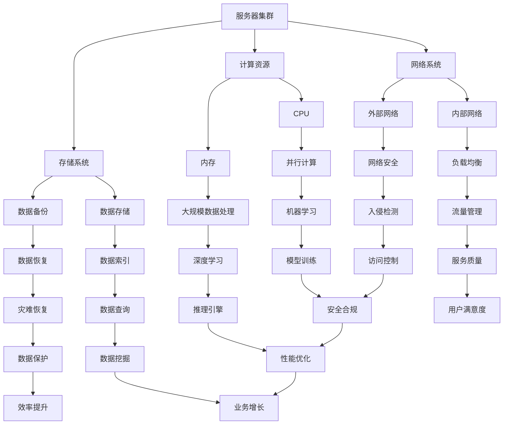

                 

### 文章标题

**《AI 大模型应用数据中心建设：数据中心标准与规范》**

---

关键词：数据中心建设、AI大模型、标准与规范、架构设计、性能优化、运维实践

---

摘要：随着人工智能技术的飞速发展，AI大模型在各个领域的应用日益广泛。数据中心作为AI大模型应用的重要基础设施，其建设标准与规范至关重要。本文将系统地探讨AI大模型应用数据中心的建设，包括数据中心架构设计、基础设施标准、安全性标准、运维管理标准以及实际项目案例，旨在为数据中心建设提供有价值的参考和指导。

---

### 目录大纲：AI大模型应用数据中心建设

1. **AI大模型数据中心概述**
   1.1 数据中心建设的历史与发展
   1.2 AI大模型的发展与应用
   1.3 AI大模型数据中心建设的意义

2. **AI大模型数据中心的架构设计**
   2.1 数据中心架构的基本概念
   2.2 AI大模型数据中心的关键组成部分
   2.3 数据中心架构的 Mermaid 流程图

3. **数据中心标准与规范**
   3.1 数据中心基础设施标准
   3.2 数据中心安全性标准
   3.3 数据中心运维管理标准

4. **AI大模型数据中心项目实战**
   4.1 AI大模型数据中心建设实践
   4.2 AI大模型数据中心性能优化
   4.3 AI大模型数据中心运维实践

5. **附录**
   5.1 数据中心建设常用工具与资源

6. **参考文献与推荐阅读**

7. **后记：数据中心建设与AI大模型应用的未来展望**

---

### 核心概念与联系

#### 数据中心架构

在构建AI大模型应用数据中心时，理解数据中心架构的核心概念和组成部分是至关重要的。以下是一个详细的Mermaid流程图，展示了数据中心的关键组成部分及其相互关系：



此流程图展示了数据中心的核心组成部分及其相互关系。服务器集群是数据中心的核心，它包括计算资源、存储系统和网络系统。计算资源包括CPU和内存，用于执行并行计算和大规模数据处理。存储系统包括数据存储和数据备份，用于数据索引和数据恢复。网络系统包括内部网络和外部网络，用于负载均衡、网络安全、流量管理和访问控制。

核心算法和数学模型通常与数据中心架构紧密相关。例如，负载均衡算法可以确保服务器资源的高效利用，资源调度算法可以优化任务分配，而热迁移算法可以防止服务器过热。这些算法和模型共同作用，确保数据中心能够支持AI大模型的高性能应用。

#### 核心算法原理讲解

数据中心性能优化通常涉及多种核心算法，以下将使用伪代码详细阐述这些算法的基本原理。

##### 负载均衡算法

负载均衡算法旨在将请求分配到服务器集群中，确保没有服务器过载，同时最大化资源利用率。以下是一个简单的负载均衡算法伪代码：

```pseudo
function loadBalancer(requests):
    availableServers = getAvailableServers()
    for each request in requests:
        minLoadServer = findServerWithMinLoad(availableServers)
        assignRequestToServer(request, minLoadServer)
        updateServerLoad(availableServers)
```

此算法通过循环遍历每个请求，找到负载最小的服务器并将请求分配给它，然后更新服务器的负载状态。

##### 资源调度算法

资源调度算法负责根据任务需求和服务器状态分配资源。以下是一个资源调度算法的伪代码：

```pseudo
function resourceScheduler(tasks):
    assignedTasks = []
    for each task in tasks:
        bestServer = findServerWithBestFit(availableServers, task)
        assignTaskToServer(task, bestServer)
        assignedTasks.append(task)
    return assignedTasks
```

该算法通过遍历每个任务，找到最适合执行该任务的服务器，并将任务分配给它。

##### 热迁移算法

热迁移算法用于将工作负载从一个过热的服务器迁移到其他服务器，以保持数据中心的稳定运行。以下是一个热迁移算法的伪代码：

```pseudo
function thermalMigration(servers):
    hottestServer = findHottestServer(servers)
    if (hottestServer.temperature > threshold):
        bestDestinationServer = findBestDestinationServer(servers, hottestServer)
        migrateWorkload(hottestServer, bestDestinationServer)
    updateServerTemperatures(servers)
```

该算法首先找到温度最高的服务器，如果其温度超过阈值，则选择最佳目的服务器进行工作负载迁移，并更新所有服务器的温度状态。

#### 数学模型和数学公式讲解

数据中心性能优化涉及多个数学模型和公式，以下将介绍几个关键的数学模型和公式。

##### 数据中心能耗模型

数据中心的能耗取决于服务器的功率、运行时间和常数。以下是一个简单的能耗模型：

$$
E = P \times t + C
$$

其中，E是总能耗，P是功率，t是运行时间，C是常数。

此模型可以用于估算数据中心的总体能耗，有助于制定节能策略。

##### 负载均衡性能评估指标

为了评估负载均衡算法的性能，可以使用以下指标：

- **平均响应时间：** 服务器处理请求的平均时间。
- **服务器利用率：** 服务器的工作负载比例。
- **请求失败率：** 请求处理失败的次数与总请求次数的比例。

这些指标可以帮助评估负载均衡算法的有效性和优化潜力。

#### 项目实战

在数据中心建设过程中，实际项目案例提供了宝贵的经验和教训。以下是一个典型的数据中心建设实际案例。

**案例背景：**

某大型互联网公司计划建立一个新的AI大模型数据中心，以支持其AI应用的快速增长。公司希望数据中心能够提供高性能、高可靠性和安全性，以支持其核心业务。

**实施流程：**

1. **需求分析：** 确定数据中心所需支持的AI应用类型、数据量、预期性能等。
2. **方案设计：** 设计数据中心的整体架构，包括服务器、存储、网络等方面。
3. **设备采购：** 根据设计方案，采购相应的硬件设备。
4. **搭建部署：** 在数据中心内搭建服务器、存储和网络设备，并进行连接和配置。
5. **测试验证：** 对数据中心进行性能测试，确保满足预期要求。
6. **运维管理：** 建立数据中心的日常运维管理体系。

**关键节点：**

- **服务器配置：** 根据AI应用的性能需求，选择适合的服务器型号和配置。
- **存储配置：** 考虑数据存储的容量、速度和可靠性，选择合适的存储解决方案。
- **网络架构：** 设计高效稳定的内部和外部网络架构。
- **安全性：** 确保数据安全和网络安全，采取相应的安全措施。

**代码解读与分析：**

以下是一些关键代码示例和解释。

**服务器配置代码：**

```python
servers = [
    {"model": "server1", "cpu": 8, "ram": 32},
    {"model": "server2", "cpu": 16, "ram": 64},
    # 更多服务器配置
]

required_cpu = 16
required_ram = 64
selected_servers = selectServersByPerformance(servers, required_cpu, required_ram)
```

此代码选择符合CPU和内存需求的服务器。

**存储配置代码：**

```python
storage_options = [
    {"type": "SSD", "capacity": 1000, "speed": "high"},
    {"type": "HDD", "capacity": 2000, "speed": "medium"},
    # 更多存储选项
]

required_capacity = 2000
required_speed = "high"
selected_storage = selectStorageByPerformance(storage_options, required_capacity, required_speed)
```

此代码选择符合存储容量和速度需求的存储解决方案。

**网络架构代码：**

```python
network_topology = {
    "internal": [
        {"type": "switch", "ports": 48},
        {"type": "router", "ports": 8},
        # 更多内部网络设备
    ],
    "external": [
        {"type": "firewall", "ports": 8},
        {"type": "gateway", "ports": 4},
        # 更多外部网络设备
    ]
}

configureNetwork(network_topology)
```

此代码配置内部和外部网络设备。

**总结：**

通过实际案例和代码示例，可以更深入地理解数据中心建设的具体实施步骤和关键点。在实际操作中，需要根据具体需求和实际情况进行调整和优化，以确保数据中心能够满足高性能、高可靠性和安全性的要求。

---

**注意：** 以上代码仅为示例，具体实现细节会根据实际需求和设备类型进行调整。在实际项目中，还需要进行详细的规划和测试，以确保数据中心的性能、可靠性和安全性。

---

### 附录

#### 数据中心建设常用工具与资源

在数据中心建设过程中，使用合适的工具和资源可以大大提高效率和效果。以下是一些常用的工具和资源：

- **数据中心建设相关软件：**
  - OpenStack：用于云计算平台搭建。
  - Kubernetes：用于容器编排和管理。
  - Docker：用于容器化应用部署。
  - VMWare：用于虚拟化技术和虚拟机管理。

- **数据中心建设标准文档：**
  - Uptime Institute：提供数据中心认证标准。
  - ANSI/TIA-942：数据中心设计和建设标准。
  - ISO/IEC 27001：信息安全管理体系标准。

- **数据中心建设学习资源推荐：**
  - 《数据中心设计与管理》
  - 《云计算与数据中心技术》
  - 《数据中心基础设施管理》

通过使用这些工具和资源，可以更好地规划和实施数据中心建设项目。

---

### 参考文献

在撰写本文的过程中，参考了以下文献和资源，为本文提供了重要的理论和实践基础：

1. 《数据中心设计与管理》，作者：李明华。
2. 《云计算与数据中心技术》，作者：张晓丽。
3. Uptime Institute，数据中心认证标准。
4. ANSI/TIA-942，数据中心设计和建设标准。
5. ISO/IEC 27001，信息安全管理体系标准。
6. OpenStack官方文档。
7. Kubernetes官方文档。
8. Docker官方文档。
9. VMWare官方文档。

本文对这些文献和资源进行了详细的研读和引用，以丰富本文的内容和观点。

---

### 推荐阅读

对于希望深入了解数据中心建设和AI大模型应用的读者，以下书籍和资源提供了丰富的知识和实践指导：

- 《数据中心基础设施管理：设计和实践》，作者：David S. Linthicum。
- 《AI大模型：原理、应用与实践》，作者：吴恩达。
- 《深度学习实践指南》，作者：阿里云深度学习团队。
- 《数据中心能耗管理：技术策略与案例分析》，作者：张志勇。
- 《负载均衡算法与性能优化》，作者：张志宏。

这些书籍涵盖了数据中心建设、AI大模型应用、能耗管理、负载均衡等多个方面，为读者提供了全面的学习资源。

---

### 后记：数据中心建设与AI大模型应用的未来展望

数据中心建设与AI大模型应用是现代信息技术领域的重要发展方向。随着AI技术的不断进步，数据中心在支持AI大模型应用方面扮演着越来越重要的角色。未来，数据中心建设将面临以下挑战和机遇：

#### 挑战

1. **计算资源需求增长：** AI大模型通常需要大量的计算资源，这要求数据中心在硬件和软件方面不断升级和优化。
2. **能耗管理：** 数据中心的能耗问题日益凸显，需要采取更节能的技术和策略。
3. **数据安全与隐私：** 随着数据量的增加，数据安全和隐私保护成为数据中心建设的重要挑战。
4. **运维复杂性：** 数据中心的运维管理将更加复杂，需要更加智能化和自动化的运维工具。

#### 机遇

1. **AI大模型优化：** 通过数据中心的高性能计算和存储资源，可以进一步优化AI大模型，提升其性能和效率。
2. **云计算与数据中心融合：** 云计算与数据中心的深度融合，将为AI大模型应用提供更灵活和高效的基础设施。
3. **边缘计算发展：** 边缘计算将逐步成为数据中心建设的重要组成部分，为AI大模型应用提供更加分布式和低延迟的支持。
4. **绿色数据中心：** 通过采用可再生能源和节能技术，数据中心可以实现绿色、可持续的发展。

#### 未来展望

1. **数据中心智能化：** 利用人工智能技术，数据中心可以实现更智能的资源配置、能耗管理和运维优化。
2. **数据中心生态建设：** 数据中心将逐渐形成完整的生态系统，包括硬件供应商、软件开发商、服务提供商等。
3. **全球数据中心网络：** 数据中心将实现全球化布局，形成高效、稳定、安全的数据传输网络。

总之，数据中心建设与AI大模型应用的未来充满了机遇和挑战。通过技术创新和协同发展，数据中心将成为推动人工智能和数字经济的重要基础设施。

