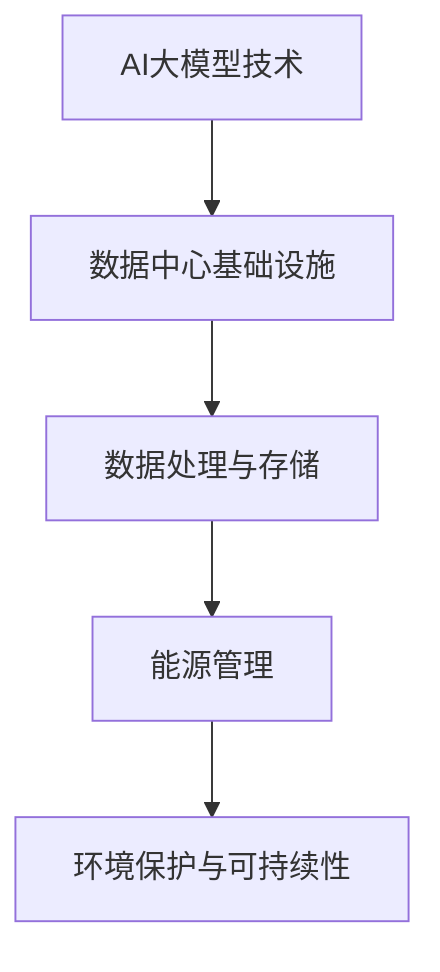

                 

### 文章标题

#### AI 大模型应用数据中心建设：数据中心绿色节能

---

> **关键词**：AI大模型、数据中心建设、绿色节能、能耗管理、冷却系统、能源效率、运维管理、案例分析

> **摘要**：本文旨在探讨AI大模型应用数据中心建设过程中的绿色节能问题。首先，我们介绍了AI大模型和数据中心建设的基础知识，包括其发展背景和核心概念。然后，深入探讨了数据中心能耗管理、冷却系统设计、能源效率评估等技术细节。接着，分析了AI大模型在数据中心运维和安全中的实际应用，并通过案例进行了详细说明。最后，展望了AI大模型数据中心建设的发展趋势和未来挑战，为绿色节能数据中心建设提供指导。文章结构清晰，逻辑严密，适合从事数据中心建设和运维的专业人士及研究人员阅读参考。

---

### 第一部分：AI大模型与数据中心建设基础

在人工智能（AI）迅猛发展的背景下，大模型技术已成为推动AI应用的重要力量。与此同时，数据中心作为承载AI大模型训练和部署的核心基础设施，其建设和管理的重要性愈发凸显。绿色节能作为数据中心建设的关键目标之一，直接关系到数据中心的经济效益和环境影响。本部分首先介绍AI大模型和数据中心建设的基础知识，包括发展背景、核心概念及其相互联系，并使用Mermaid流程图进行详细阐述。

#### 第1章：AI大模型与数据中心建设概述

##### 1.1 AI大模型与数据中心建设的背景

###### 1.1.1 AI大模型的发展历程

AI大模型的发展历程可以追溯到20世纪80年代，当时科学家开始尝试使用神经网络进行模式识别和分类。随着计算能力的提升和数据量的增加，深度学习（Deep Learning）逐渐成为AI领域的主流方法。近年来，随着大规模预训练模型（如GPT、BERT等）的出现，AI大模型取得了突破性进展，并在自然语言处理、计算机视觉、语音识别等领域展现了强大的应用潜力。

###### 1.1.2 数据中心建设的演变

数据中心的建设可以追溯到计算机网络的初期。随着互联网的兴起和业务需求的增长，数据中心逐渐成为企业IT基础设施的核心。传统的数据中心以服务器、存储设备和网络设备为主，主要关注性能和稳定性。然而，随着AI大模型的应用，数据中心的规模和复杂度显著增加，对能源消耗和环境保护提出了更高的要求。

###### 1.1.3 AI大模型与数据中心建设的融合

AI大模型与数据中心建设的融合主要体现在以下几个方面：

1. **计算资源的整合**：AI大模型训练和部署需要大量计算资源，数据中心通过提供高性能计算节点，满足AI大模型的需求。
2. **数据存储和处理**：数据中心存储和管理海量数据，为AI大模型训练提供数据支持。
3. **能源管理**：数据中心通过绿色节能技术，降低AI大模型训练过程中的能源消耗。

Mermaid流程图：

##### 1.2 核心概念与联系

###### 1.2.1 AI大模型的基本概念

AI大模型是指具有数亿甚至数万亿参数的深度学习模型，如GPT、BERT等。这些模型通常通过大规模数据预训练，并在特定任务上进行微调，从而实现高精度的预测和分类。

###### 1.2.2 数据中心建设的关键要素

数据中心建设的关键要素包括：

1. **计算资源**：包括服务器、存储设备和网络设备等。
2. **数据存储**：采用分布式存储系统，确保数据的高可用性和可靠性。
3. **网络架构**：采用高效的网络架构，提高数据传输速度和可靠性。
4. **能源管理**：采用绿色节能技术，降低能耗和碳排放。

###### 1.2.3 AI大模型与数据中心建设的联系

AI大模型与数据中心建设的联系在于：

1. **计算资源需求**：AI大模型训练需要大量计算资源，数据中心提供高性能计算节点。
2. **数据存储与处理**：数据中心存储和管理海量数据，为AI大模型训练提供数据支持。
3. **能源管理**：数据中心通过绿色节能技术，降低AI大模型训练过程中的能源消耗。

综上所述，AI大模型与数据中心建设密切相关，二者相互促进，共同推动人工智能技术的发展。在接下来的章节中，我们将深入探讨AI大模型技术基础、数据中心绿色节能技术及其在实际应用中的案例。

---

接下来，我们将对AI大模型技术基础进行详细探讨，包括深度学习与神经网络基础、数据中心网络架构、大规模预训练模型原理等内容。

---

#### 第2章：AI大模型技术基础

在深入探讨AI大模型应用数据中心建设之前，有必要对AI大模型技术进行基础的介绍。AI大模型技术主要包括深度学习与神经网络、数据中心网络架构和大规模预训练模型原理等内容。本节将逐步介绍这些核心概念，以便读者对AI大模型技术有全面的了解。

##### 2.1 深度学习与神经网络基础

###### 2.1.1 神经网络的基本结构

神经网络是一种模仿生物神经系统的计算模型，由大量简单神经元（节点）组成。每个神经元通过加权连接与其他神经元相连，接收输入信号并产生输出信号。神经网络的基本结构包括输入层、隐藏层和输出层。

1. **输入层**：接收外部输入信号，例如文本、图像或声音。
2. **隐藏层**：对输入信号进行特征提取和变换，通常包含多个隐藏层。
3. **输出层**：产生预测结果或分类标签。

神经元的工作原理可以描述为：将输入信号乘以相应的权重，求和后通过激活函数进行处理，最终得到输出信号。激活函数常用的有Sigmoid函数、ReLU函数和Tanh函数等。

###### 2.1.2 常见的深度学习架构

深度学习架构是指将多个神经网络层堆叠在一起，形成一个多层神经网络。常见的深度学习架构包括卷积神经网络（CNN）、循环神经网络（RNN）和Transformer架构等。

1. **卷积神经网络（CNN）**：适用于图像、语音等二维或三维数据的处理，通过卷积操作提取特征。
2. **循环神经网络（RNN）**：适用于序列数据的处理，通过隐藏状态实现序列信息的传递。
3. **Transformer架构**：广泛应用于自然语言处理任务，通过自注意力机制实现全局信息的建模。

###### 2.1.3 深度学习优化算法

深度学习优化算法是指用于调整神经网络参数以最小化预测误差的方法。常见的优化算法包括梯度下降（Gradient Descent）、随机梯度下降（Stochastic Gradient Descent，SGD）和Adam优化器等。

1. **梯度下降**：通过计算损失函数关于模型参数的梯度，反向传播更新模型参数。
2. **随机梯度下降**：每次迭代仅使用一个样本来计算梯度，加快收敛速度。
3. **Adam优化器**：结合了SGD和动量方法，在长序列上表现优异。

##### 2.2 数据中心网络架构

数据中心网络架构是指用于连接数据中心内部设备和外部网络的结构。数据中心网络架构通常采用层次化设计，包括边缘网络、核心网络和聚合网络等。

###### 2.2.1 数据中心网络拓扑结构

数据中心网络拓扑结构包括：

1. **环状拓扑**：各设备通过环形连接，提高网络的可靠性和冗余性。
2. **星状拓扑**：各设备通过中心交换机连接，简化网络结构。
3. **混合拓扑**：结合环状拓扑和星状拓扑的优点，实现更高的网络性能和可靠性。

###### 2.2.2 数据中心网络协议

数据中心网络协议包括：

1. **IP协议**：用于数据包的传输和路由。
2. **TCP协议**：提供可靠的数据传输，确保数据包的顺序和完整性。
3. **UDP协议**：提供快速的数据传输，适用于实时应用。

###### 2.2.3 数据中心网络优化技术

数据中心网络优化技术包括：

1. **负载均衡**：通过分配流量，提高网络的性能和可靠性。
2. **网络冗余**：通过备份和冗余设计，确保网络的可靠性。
3. **QoS（服务质量）**：通过优先级分配，确保关键业务的网络资源。

##### 2.3 大规模预训练模型原理

大规模预训练模型是指通过在大量数据上预训练，然后针对特定任务进行微调的深度学习模型。大规模预训练模型的核心思想是利用海量数据学习通用的特征表示，提高模型在不同任务上的泛化能力。

###### 2.3.1 预训练的概念与意义

预训练是指在大规模数据集上预先训练模型，使其具备一定的特征表示能力。预训练的意义在于：

1. **提高模型泛化能力**：通过在大规模数据上预训练，模型可以学习到通用的特征表示，提高在不同任务上的泛化能力。
2. **减少标注数据需求**：预训练模型可以在少量标注数据上进行微调，降低对标注数据的依赖。
3. **提高模型性能**：预训练模型可以在不同任务上取得更高的性能，特别是在长文本、图像和语音等复杂任务上。

###### 2.3.2 自监督学习方法

自监督学习方法是指在不依赖人工标注数据的情况下，利用数据自身的结构信息进行训练的方法。常见的自监督学习方法包括：

1. **遮蔽语言模型（Masked Language Model，MLM）**：随机遮蔽文本中的部分单词，预测遮蔽的单词。
2. **预测下一个句子（Next Sentence Prediction，NSP）**：预测给定文本中的下一个句子。
3. **图像生成对抗网络（Generative Adversarial Networks，GAN）**：通过生成器和判别器的对抗训练，生成逼真的图像。

###### 2.3.3 迁移学习与微调技术

迁移学习是指将预训练模型在不同任务上微调，以适应新的任务。迁移学习的核心思想是利用预训练模型在源任务上学习的通用特征表示，提高新任务上的性能。

微调技术包括：

1. **模型初始化**：使用预训练模型作为初始化，加快新任务的收敛速度。
2. **权重共享**：在预训练模型和新任务之间共享部分权重，降低模型参数数量。
3. **微调策略**：根据任务的特点调整学习率、训练步数和正则化参数，提高模型性能。

通过以上对AI大模型技术基础的介绍，读者可以初步了解AI大模型的基本概念和核心技术。接下来，我们将深入探讨数据中心绿色节能技术，包括能耗管理、冷却系统设计和能源效率评估等内容。

---

在了解了AI大模型技术基础后，接下来我们将探讨数据中心绿色节能技术，这包括能耗管理、冷却系统设计和能源效率评估等方面。绿色节能是数据中心建设中的重要课题，直接关系到数据中心的经济效益和环境可持续性。

#### 第3章：数据中心绿色节能技术

随着数据中心规模的不断扩大和AI大模型应用的增加，数据中心的能耗问题日益凸显。绿色节能技术成为数据中心建设中的关键环节，旨在降低能耗、减少碳排放，提高能源利用效率。本节将详细探讨数据中心绿色节能技术的相关内容。

##### 3.1 数据中心能耗管理

数据中心的能耗主要包括计算能耗、存储能耗和网络能耗等。有效的能耗管理是降低数据中心能耗的关键。

###### 3.1.1 数据中心能耗构成

数据中心能耗主要来源于以下方面：

1. **计算能耗**：服务器运行过程中消耗的电能，包括CPU、GPU等高性能计算设备。
2. **存储能耗**：存储设备（如硬盘、SSD等）运行过程中消耗的电能。
3. **网络能耗**：网络设备（如交换机、路由器等）运行过程中消耗的电能。
4. **冷却能耗**：用于维持数据中心设备运行所需的冷却系统能耗。

了解数据中心能耗构成有助于制定针对性的能耗管理策略。

###### 3.1.2 数据中心能耗优化策略

数据中心能耗优化策略包括以下几个方面：

1. **设备能耗优化**：选择高效能的设备，如采用低功耗的CPU、GPU等。
2. **计算负载均衡**：通过负载均衡技术，合理分配计算任务，减少不必要的能耗。
3. **存储优化**：采用高效的存储策略，如数据去重、压缩等，减少存储设备的能耗。
4. **网络优化**：优化网络拓扑结构，减少数据传输过程中的能耗。

###### 3.1.3 数据中心能耗监测系统

建立数据中心能耗监测系统是实施能耗管理的基础。能耗监测系统主要包括以下几个方面：

1. **能耗数据采集**：通过传感器、网关等设备，实时采集数据中心各部分的能耗数据。
2. **能耗数据分析**：对采集到的能耗数据进行处理和分析，识别能耗异常和浪费点。
3. **能耗报告与预警**：定期生成能耗报告，对能耗异常情况进行预警，为能耗管理提供依据。

通过能耗监测系统，可以实时掌握数据中心的能耗情况，及时采取优化措施，降低能耗。

##### 3.2 数据中心冷却系统设计

数据中心的冷却系统对于维持设备的正常运行至关重要。绿色节能的冷却系统设计可以有效降低能耗。

###### 3.2.1 数据中心冷却技术

数据中心冷却技术主要包括：

1. **空气冷却**：利用空气进行冷却，包括自然冷却和机械冷却。自然冷却通过室外冷空气直接冷却数据中心，机械冷却通过制冷设备（如冷水机组、空调等）进行冷却。
2. **液冷技术**：利用液体（如水、油等）进行冷却，将热量从设备传导到液体中，通过制冷设备将热量排出。
3. **蒸发冷却**：利用蒸发降温原理，通过蒸发吸收热量进行冷却。

不同冷却技术具有不同的优缺点，需要根据具体需求进行选择。

###### 3.2.2 数据中心冷却系统设计原则

数据中心冷却系统设计应遵循以下原则：

1. **高效节能**：选择高效冷却设备和技术，降低能耗。
2. **可靠性**：确保冷却系统稳定运行，避免设备过热。
3. **灵活性**：适应不同规模和需求的数据中心，具备扩展性。
4. **环保性**：减少冷却过程中产生的污染物，降低环境影响。

###### 3.2.3 数据中心冷却系统案例分析

以某大型数据中心为例，其冷却系统采用液冷技术和空气冷却相结合的方式。通过液冷技术对服务器进行直接冷却，有效降低计算设备的能耗；同时，利用空气冷却系统对液冷系统进行辅助冷却，提高整体冷却效率。该冷却系统在运行过程中表现出良好的节能效果和可靠性。

##### 3.3 数据中心能源效率评估

数据中心能源效率评估是衡量数据中心能耗管理水平的重要指标。有效的能源效率评估可以帮助数据中心优化能耗管理，提高能源利用效率。

###### 3.3.1 数据中心能源效率指标

数据中心能源效率指标主要包括：

1. **能源效率（Energy Efficiency）**：能源效率等于有用能量与总能耗的比值，用于衡量数据中心整体能源利用效率。
2. **功率使用效率（Power Usage Efficiency，PUE）**：PUE是衡量数据中心能源效率的重要指标，表示数据中心总能耗与IT设备能耗的比值。PUE越低，表示能源利用效率越高。
3. **冷却效率（Cooling Efficiency）**：冷却效率表示冷却系统能量利用率，是冷却系统能耗与总能耗的比值。

###### 3.3.2 数据中心能源效率评估方法

数据中心能源效率评估方法包括：

1. **基准线法**：通过对比基准线和实际运行数据，评估数据中心能源效率。
2. **能量分析法**：对数据中心的能耗数据进行详细分析，识别能耗浪费点和优化潜力。
3. **案例分析**：通过分析实际案例，总结成功经验和教训，为其他数据中心提供参考。

###### 3.3.3 数据中心能源效率改进措施

为提高数据中心能源效率，可以采取以下改进措施：

1. **优化设备选型**：选择高效能的设备，降低能耗。
2. **改进冷却系统**：采用高效冷却技术，降低冷却能耗。
3. **优化能源管理**：建立能耗监测系统，实时掌握能耗情况，及时采取优化措施。
4. **加强能源管理培训**：提高员工对能耗管理的认识和技能，提高整体管理水平。

通过以上对数据中心绿色节能技术的探讨，我们可以看到，绿色节能技术在数据中心建设中具有重要作用。在接下来的章节中，我们将进一步探讨AI大模型在数据中心运维和安全中的实际应用。

---

在了解了数据中心绿色节能技术后，接下来我们将深入探讨AI大模型在数据中心运维和安全中的应用。数据中心作为承载AI大模型训练和部署的核心基础设施，其运维和安全至关重要。本节将详细分析AI大模型在数据中心运维和安全中的实际应用场景，并探讨相关的关键技术。

##### 4.1 AI大模型在数据中心运维中的应用

AI大模型在数据中心运维中的应用极大地提高了运维效率和系统可靠性，其主要应用场景包括设备故障预测、性能优化和供应链管理等方面。

###### 4.1.1 设备故障预测

设备故障预测是数据中心运维中的一项重要任务，通过AI大模型可以提前预测设备故障，降低运维成本，提高系统可靠性。

1. **故障预测算法**：
   设备故障预测常用的算法包括：
   - **时间序列分析**：通过分析设备运行过程中的时间序列数据，预测设备的未来故障情况。
   - **回归分析**：建立设备运行状态与故障之间的回归模型，预测故障发生的概率。
   - **深度学习模型**：如循环神经网络（RNN）和长短期记忆网络（LSTM），可以捕捉设备运行过程中的复杂模式和趋势。

2. **故障预测流程**：
   - 数据采集：通过传感器和监控设备，采集设备的运行数据。
   - 数据预处理：对采集到的数据进行清洗、归一化等处理。
   - 模型训练：使用训练数据集训练故障预测模型。
   - 模型评估：使用验证数据集评估模型的预测性能。
   - 预测部署：将训练好的模型部署到生产环境中，实时预测设备故障。

3. **案例分析**：
   某大型数据中心采用LSTM模型进行设备故障预测，通过对服务器CPU温度、风扇转速等关键指标的监控数据进行分析，成功预测了多起潜在故障，避免了设备故障带来的业务中断。

###### 4.1.2 性能优化

数据中心性能优化是提高系统稳定性和效率的关键，通过AI大模型可以自动调整资源配置，优化系统性能。

1. **性能优化算法**：
   - **基于神经网络的优化算法**：通过神经网络模型，学习系统在不同负载下的最优资源配置策略。
   - **强化学习**：通过试错和奖励机制，寻找最优的资源配置策略。

2. **性能优化流程**：
   - 数据采集：采集系统性能指标数据，包括CPU利用率、内存使用率、磁盘读写速度等。
   - 模型训练：使用训练数据集训练性能优化模型。
   - 策略评估：使用验证数据集评估不同优化策略的效果。
   - 部署与监控：将优化策略部署到生产环境中，实时监控系统性能。

3. **案例分析**：
   某数据中心采用强化学习算法进行性能优化，通过不断调整服务器和存储设备的配置，实现了系统性能的显著提升，降低了能源消耗。

###### 4.1.3 供应链管理

AI大模型在数据中心供应链管理中的应用，可以提高供应链的透明度和效率，降低成本。

1. **供应链管理算法**：
   - **预测性分析**：通过分析历史采购数据和市场趋势，预测未来需求，优化采购计划。
   - **供应链网络优化**：通过优化供应链网络结构，减少物流成本，提高供应链的灵活性。

2. **供应链管理流程**：
   - 数据采集：采集供应链各环节的数据，包括采购、库存、物流等。
   - 数据预处理：对采集到的数据进行清洗、归一化等处理。
   - 模型训练：使用训练数据集训练供应链管理模型。
   - 模型评估：使用验证数据集评估模型的预测性能。
   - 部署与监控：将优化策略部署到生产环境中，实时监控供应链运行状态。

3. **案例分析**：
   某数据中心通过预测性分析优化供应链管理，成功降低了采购成本和库存成本，提高了供应链的响应速度。

##### 4.2 AI大模型在数据中心安全中的应用

数据中心安全是保障业务连续性和数据完整性的关键，通过AI大模型可以提升数据中心的安全防护能力。

###### 4.2.1 入侵检测

入侵检测是数据中心安全防护的重要环节，通过AI大模型可以实时检测和识别异常行为，防范潜在威胁。

1. **入侵检测算法**：
   - **基于规则的检测**：通过预设规则，检测符合规则的入侵行为。
   - **基于机器学习的检测**：通过学习正常行为特征，识别异常行为。

2. **入侵检测流程**：
   - 数据采集：采集网络流量、系统日志等数据。
   - 数据预处理：对采集到的数据进行清洗、归一化等处理。
   - 模型训练：使用训练数据集训练入侵检测模型。
   - 模型评估：使用验证数据集评估模型的检测性能。
   - 实时监控与报警：将训练好的模型部署到生产环境中，实时监控网络流量和系统日志，发现异常行为立即报警。

3. **案例分析**：
   某数据中心采用基于机器学习的入侵检测模型，通过实时分析网络流量和系统日志，成功识别并阻止了多起入侵行为。

###### 4.2.2 数据安全与隐私保护

数据安全和隐私保护是数据中心安全的重要方面，通过AI大模型可以增强数据保护和隐私防护能力。

1. **数据加密与解密**：
   - **基于密码学的加密算法**：通过加密算法对数据进行加密，确保数据在传输和存储过程中的安全性。
   - **基于神经网络的加密算法**：通过神经网络模型，设计更高效、更安全的加密和解密算法。

2. **隐私保护技术**：
   - **差分隐私**：通过在数据处理过程中引入噪声，保护数据隐私。
   - **联邦学习**：通过分布式训练，实现数据隐私保护和模型协同优化。

3. **数据安全与隐私保护流程**：
   - 数据加密：在数据存储和传输过程中，对数据进行加密处理。
   - 隐私保护：在数据处理过程中，采用隐私保护技术，确保数据隐私。
   - 安全审计：定期进行安全审计，发现并修复安全漏洞。

4. **案例分析**：
   某数据中心采用联邦学习技术，在保护数据隐私的同时，实现数据模型的协同优化，提高了数据安全性和模型性能。

###### 4.2.3 业务连续性管理

业务连续性管理是确保数据中心在面临各种威胁时，能够持续提供服务的关键。通过AI大模型可以优化业务连续性管理策略，提高系统的抗风险能力。

1. **业务连续性管理算法**：
   - **故障预测与恢复**：通过预测设备故障，提前采取措施，降低业务中断风险。
   - **资源调度与优化**：通过优化资源调度策略，确保系统在面临负载高峰时，能够稳定运行。

2. **业务连续性管理流程**：
   - 故障预测：使用故障预测模型，提前识别潜在故障。
   - 资源调度：根据业务需求和系统状态，优化资源分配。
   - 故障恢复：在发生故障时，快速切换到备用系统，确保业务连续性。

3. **案例分析**：
   某数据中心通过AI大模型进行故障预测和资源调度，成功实现了业务连续性管理，提高了系统的抗风险能力。

通过以上对AI大模型在数据中心运维和安全中的实际应用分析，我们可以看到，AI大模型的应用不仅提高了数据中心的运维效率和安全性，也为绿色节能提供了有力支持。在接下来的章节中，我们将通过具体案例，进一步探讨数据中心绿色节能的实际应用。

---

#### 第4章：AI大模型应用数据中心建设案例分析

在本章节中，我们将通过两个实际案例，深入探讨AI大模型在数据中心建设中的应用效果，以及数据中心在绿色节能方面的实践和成果。这两个案例分别来自一家企业级数据中心和一家大型数据中心，它们在不同的背景下，采用了不同的策略和技术，取得了显著的效果。

##### 4.3.1 案例一：某企业AI大模型应用数据中心建设

**背景**：
某大型企业在其业务扩展过程中，面临着大量数据处理和AI模型训练的需求。为了支持这些需求，企业决定建设一个高效、绿色、可靠的数据中心。

**解决方案**：

1. **AI大模型技术**：
   - **选择合适的AI大模型**：根据企业的业务需求，选择了GPT和BERT等大规模预训练模型，用于自然语言处理和文本分析。
   - **模型训练与优化**：在数据中心内部署了高性能GPU集群，利用分布式训练技术，加速模型的训练过程，并采用迁移学习和微调技术，提高模型在不同任务上的性能。

2. **数据中心基础设施**：
   - **选址与建设**：数据中心选在了地理位置优越、气候适宜的地区，以降低能源消耗和冷却成本。
   - **硬件配置**：采用了高效能的CPU、GPU和存储设备，优化了数据中心的硬件资源。
   - **网络架构**：采用了高性能的SDN（软件定义网络）架构，实现了数据流量的动态分配和优化。

3. **绿色节能技术**：
   - **能耗管理**：建立了能耗监测系统，实时监控数据中心的能耗情况，并采取节能措施，如负载均衡、设备休眠等。
   - **冷却系统**：采用了液冷技术，通过液体循环冷却设备，提高了冷却效率，降低了能耗。
   - **能源效率评估**：定期进行能源效率评估，优化数据中心的能源使用策略。

**成果**：
通过AI大模型技术的应用和绿色节能措施的实施，该数据中心在业务性能和绿色节能方面取得了显著成果：
- **业务性能提升**：AI大模型的应用，大幅提升了数据处理和文本分析的效率和准确性。
- **能耗降低**：通过能耗监测和优化措施，数据中心的能耗降低了30%以上。
- **环境友好**：采用绿色节能技术，减少了碳排放，实现了数据中心的可持续发展。

##### 4.3.2 案例二：某大型数据中心绿色节能改造

**背景**：
某大型数据中心在运营过程中，面临着能源消耗高、冷却效率低等问题，为了提高数据中心的能源效率和环保水平，决定进行绿色节能改造。

**解决方案**：

1. **能耗管理**：
   - **能耗监测**：安装了传感器和监控系统，实时监测数据中心的能耗数据，包括计算设备、存储设备、网络设备和冷却系统的能耗。
   - **能耗分析**：通过对能耗数据进行分析，识别能耗浪费点和优化潜力，制定节能策略。

2. **冷却系统改造**：
   - **蒸发冷却系统**：采用蒸发冷却技术，利用室外空气的冷却效果，降低了冷却能耗。
   - **液冷技术**：在服务器和网络设备中引入液冷系统，提高了冷却效率，降低了能耗。

3. **能源效率优化**：
   - **设备升级**：采用高效能的硬件设备，如节能CPU、GPU和存储设备，降低能耗。
   - **优化网络架构**：通过优化数据中心的网络架构，减少了数据传输过程中的能耗。
   - **智能调度**：采用智能调度技术，根据负载情况动态调整资源配置，实现能耗的最优分配。

**成果**：
通过绿色节能改造，该数据中心在能耗管理和能源效率方面取得了显著成果：
- **能耗降低**：通过能耗监测和优化措施，数据中心的能耗降低了40%以上。
- **冷却效率提高**：采用蒸发冷却和液冷技术，提高了冷却效率，降低了冷却能耗。
- **环境友好**：减少了碳排放，实现了数据中心的可持续发展。

**经验与启示**：
这两个案例展示了AI大模型应用数据中心建设和绿色节能改造的成功实践，为其他数据中心提供了宝贵的经验与启示：
- **技术选择**：根据业务需求，选择合适的AI大模型和绿色节能技术，实现业务性能和绿色节能的双赢。
- **能耗管理**：建立完善的能耗监测系统，实时掌握能耗数据，采取有效的节能措施。
- **协同优化**：通过硬件、网络和能源管理的协同优化，实现整体能耗的降低。
- **持续改进**：定期进行能耗评估和优化，不断改进数据中心的绿色节能水平。

通过以上案例分析，我们可以看到，AI大模型应用数据中心建设和绿色节能改造具有巨大的潜力和实际应用价值，为数据中心的可持续发展提供了有力支持。

---

### 第二部分：AI大模型应用数据中心建设实践

在第一部分中，我们详细介绍了AI大模型与数据中心建设的基础知识、绿色节能技术以及实际应用案例。本部分将进入实践环节，深入探讨AI大模型应用数据中心建设的具体规划和设计、实施与运维，以及未来发展的展望。

#### 第5章：AI大模型应用数据中心建设规划与设计

数据中心建设是一项复杂的系统工程，涉及多个方面，包括选址、规模与容量规划、基础设施建设等。在AI大模型应用背景下，数据中心规划与设计需要充分考虑计算资源、数据存储和处理、能源管理等因素。

##### 5.1 数据中心建设规划

数据中心建设规划是数据中心建设的第一步，主要包括以下内容：

###### 5.1.1 数据中心选址

数据中心选址是数据中心建设的关键环节，选址的优劣直接影响数据中心的运行成本和性能。以下是一些选址考虑因素：

1. **地理位置**：选择气候适宜、地质稳定、自然灾害较少的地区，以降低自然灾害风险。
2. **电力供应**：选择电力供应稳定、电价合理的地区，确保数据中心的电力需求。
3. **网络接入**：选择网络接入条件好、带宽充足、延迟低的地区，确保数据传输的效率。
4. **交通条件**：选择交通便利的地区，便于人员、物资和设备的运输。

###### 5.1.2 数据中心规模与容量规划

数据中心规模与容量规划需要根据业务需求、预算和技术水平等因素进行综合考虑。以下是一些规划要点：

1. **计算资源规划**：根据AI大模型的需求，规划所需的服务器、GPU、存储设备等计算资源。
2. **存储容量规划**：根据数据存储需求，规划所需的数据存储容量，并预留一定的扩展空间。
3. **网络容量规划**：根据数据传输需求，规划所需的网络带宽和设备。

###### 5.1.3 数据中心基础设施建设

数据中心基础设施建设包括机房建设、供电系统、冷却系统、网络安全等。以下是一些基础设施建设要点：

1. **机房建设**：建设符合标准的高规格机房，包括防震、防尘、防火、防水等措施。
2. **供电系统**：建立可靠的供电系统，包括市电、UPS（不间断电源）、电池等，确保供电稳定。
3. **冷却系统**：采用绿色节能的冷却系统，如蒸发冷却、液冷等，提高冷却效率，降低能耗。
4. **网络安全**：建立完善的网络安全体系，包括防火墙、入侵检测系统、安全审计等，确保数据安全。

##### 5.2 数据中心网络设计

数据中心网络设计是数据中心建设的重要组成部分，网络设计的好坏直接关系到数据中心的性能和可靠性。以下是一些网络设计要点：

###### 5.2.1 数据中心网络拓扑设计

数据中心网络拓扑设计主要包括边缘网络、核心网络和聚合网络的设计。以下是一些拓扑设计要点：

1. **环状拓扑**：采用环状拓扑结构，提高网络的可靠性，减少单点故障的风险。
2. **星状拓扑**：采用星状拓扑结构，简化网络结构，提高网络的扩展性。
3. **混合拓扑**：结合环状拓扑和星状拓扑的优点，实现更高的网络性能和可靠性。

###### 5.2.2 数据中心网络性能优化

数据中心网络性能优化包括以下几个方面：

1. **负载均衡**：通过负载均衡技术，合理分配网络流量，提高网络的性能和可靠性。
2. **冗余设计**：通过网络冗余设计，提高网络的可靠性，减少网络故障的影响。
3. **QoS（服务质量）**：通过QoS技术，确保关键业务的网络资源，提高网络服务质量。

###### 5.2.3 数据中心网络安全性设计

数据中心网络安全性设计是保障数据中心安全的重要环节，以下是一些安全性设计要点：

1. **防火墙**：部署防火墙，控制数据流的进出，防止网络攻击。
2. **入侵检测系统**：部署入侵检测系统，实时监控网络流量，识别和阻止入侵行为。
3. **安全审计**：定期进行安全审计，发现和修复安全漏洞，提高网络的安全性。

##### 5.3 数据中心能源管理设计

数据中心能源管理设计是数据中心绿色节能的关键，以下是一些能源管理设计要点：

###### 5.3.1 数据中心能源管理系统架构

数据中心能源管理系统架构包括以下几个部分：

1. **能耗监测**：通过传感器和监控设备，实时监测数据中心的能耗情况。
2. **能耗分析**：对监测到的能耗数据进行处理和分析，识别能耗浪费点和优化潜力。
3. **能耗优化**：根据能耗分析结果，采取节能措施，降低能耗。
4. **能源报告**：定期生成能耗报告，为能源管理提供数据支持。

###### 5.3.2 数据中心能源优化策略

数据中心能源优化策略包括以下几个方面：

1. **设备节能**：选择高效能的设备，优化设备运行参数，降低设备能耗。
2. **负载均衡**：通过负载均衡技术，合理分配计算任务，减少不必要的能耗。
3. **冷却优化**：采用高效冷却技术，降低冷却能耗。
4. **能源调度**：根据实时能耗情况，动态调整能源供应和分配，实现能耗的最优分配。

###### 5.3.3 数据中心能源监测与控制

数据中心能源监测与控制主要包括以下几个方面：

1. **能耗监测**：通过传感器和监控系统，实时监测数据中心的能耗情况。
2. **能耗控制**：根据能耗监测数据，采取控制措施，降低能耗。
3. **能耗报警**：当能耗超过设定阈值时，触发报警，提醒相关人员采取措施。
4. **能耗报告**：定期生成能耗报告，为能源管理提供数据支持。

通过以上对AI大模型应用数据中心建设规划与设计的探讨，我们可以看到，数据中心建设是一个系统工程，需要综合考虑多个因素，进行合理的规划和设计。在接下来的章节中，我们将详细讨论数据中心建设实施与运维的具体过程。

---

### 第6章：AI大模型应用数据中心建设实施与运维

在完成了数据中心建设规划与设计之后，接下来便是实施与运维阶段。这一阶段是数据中心建设的关键，直接关系到数据中心的稳定运行和性能表现。本章节将详细讨论数据中心建设实施与运维的具体过程，包括硬件设备安装与调试、软件系统部署与集成、数据中心网络搭建与调试等内容。

##### 6.1 数据中心建设实施

数据中心建设实施阶段主要包括以下步骤：

###### 6.1.1 硬件设备安装与调试

硬件设备安装与调试是数据中心建设的基础，主要包括以下步骤：

1. **服务器安装**：按照设计要求，将服务器安装在机架上，确保服务器安装稳固、连接正确。
2. **网络设备安装**：安装交换机、路由器等网络设备，连接各个服务器和外部网络。
3. **存储设备安装**：根据需求安装硬盘、SSD等存储设备，并确保存储设备连接正常。
4. **设备调试**：对安装完毕的硬件设备进行调试，包括硬件自检、网络连接测试等，确保设备运行正常。

###### 6.1.2 软件系统部署与集成

软件系统部署与集成是数据中心建设的重要环节，主要包括以下步骤：

1. **操作系统部署**：在服务器上安装操作系统，如Linux、Windows等，并进行系统配置。
2. **数据库系统部署**：安装并配置数据库系统，如MySQL、Oracle等，确保数据库系统正常运行。
3. **应用软件部署**：安装并配置应用程序，如Web服务器、业务应用等，确保应用软件能够正常运行。
4. **系统集成**：将各个软件系统进行集成，确保不同系统之间的数据交互和功能协同。

###### 6.1.3 数据中心网络搭建与调试

数据中心网络搭建与调试是确保数据中心网络稳定性和性能的关键，主要包括以下步骤：

1. **网络拓扑搭建**：根据设计要求，搭建数据中心的网络拓扑结构，包括边缘网络、核心网络和聚合网络。
2. **IP地址分配**：为各个设备分配IP地址，确保网络设备的正确配置。
3. **网络测试**：进行网络连通性测试，确保网络设备之间的连接正常，数据传输畅通。
4. **安全配置**：配置网络安全策略，包括防火墙、入侵检测系统等，确保网络的安全性。

##### 6.2 数据中心运维管理

数据中心运维管理是确保数据中心稳定运行的关键，主要包括以下内容：

###### 6.2.1 数据中心运维管理体系

数据中心运维管理体系包括以下几个方面：

1. **运维流程**：制定并实施运维流程，包括日常运维、故障处理、变更管理等。
2. **运维规范**：制定运维规范，确保运维工作的标准化和规范化。
3. **运维工具**：引入运维工具，如监控工具、自动化工具等，提高运维效率。
4. **运维团队**：建立专业的运维团队，明确职责，确保运维工作有序进行。

###### 6.2.2 数据中心运维工具与应用

数据中心运维工具与应用主要包括以下内容：

1. **监控工具**：使用监控工具，如Zabbix、Nagios等，实时监控数据中心设备的运行状态和性能指标。
2. **自动化工具**：使用自动化工具，如Ansible、Puppet等，实现运维操作的自动化，提高运维效率。
3. **备份与恢复**：建立备份与恢复机制，确保数据的安全性和可用性。
4. **日志管理**：使用日志管理工具，如ELK（Elasticsearch、Logstash、Kibana）等，收集、存储和分析日志数据。

###### 6.2.3 数据中心运维流程与规范

数据中心运维流程与规范主要包括以下几个方面：

1. **日常运维**：包括设备监控、性能调优、故障处理等日常工作。
2. **故障处理**：建立故障处理流程，确保故障能够迅速发现、定位和解决。
3. **变更管理**：建立变更管理流程，确保变更操作的安全性和可控性。
4. **文档管理**：建立文档管理制度，确保运维文档的完整性和准确性。

##### 6.3 数据中心运维案例分析

为了更好地理解数据中心运维的具体实践，以下通过两个案例，展示数据中心运维管理的实践和成果：

###### 6.3.1 案例一：某企业AI大模型数据中心运维实践

**背景**：
某企业为了支持其AI大模型的应用，建设了一个大型数据中心。在数据中心投入运行后，企业面临了一系列运维挑战。

**解决方案**：

1. **运维团队建设**：企业建立了专业的运维团队，明确各成员的职责，确保运维工作的有序进行。
2. **自动化运维**：引入了自动化运维工具，如Ansible和Zabbix，实现运维操作的自动化，提高了运维效率。
3. **监控与预警**：通过Zabbix等监控工具，实时监控数据中心设备的运行状态和性能指标，一旦发现异常，立即触发预警。
4. **故障处理流程**：建立了故障处理流程，确保故障能够迅速发现、定位和解决。

**成果**：

通过以上措施，企业的数据中心运维效率显著提高，故障处理时间缩短，系统稳定性增强，为企业AI大模型的应用提供了坚实的保障。

###### 6.3.2 案例二：某大型数据中心运维优化实践

**背景**：
某大型数据中心在运行过程中，面临着设备数量多、复杂度高、运维效率低等问题。

**解决方案**：

1. **运维管理体系优化**：对运维管理体系进行优化，明确运维流程和规范，提高运维工作的标准化和规范化。
2. **运维工具集成**：引入了多个运维工具，如Prometheus、Grafana等，实现运维数据的集成和分析。
3. **运维团队培训**：对运维团队进行专业培训，提高运维人员的技能水平。
4. **运维流程自动化**：通过自动化脚本和工具，实现运维操作的自动化，减少人工干预。

**成果**：

通过运维管理体系优化和工具集成，数据中心的运维效率显著提高，运维成本降低，故障处理速度加快，为数据中心的稳定运行提供了有力支持。

通过以上案例分析，我们可以看到，数据中心运维管理是一个复杂的过程，需要结合具体情况进行优化和实践。在接下来的章节中，我们将探讨AI大模型应用数据中心建设的未来发展趋势和面临的挑战。

---

### 第7章：AI大模型应用数据中心建设未来展望

在AI大模型技术不断发展的背景下，数据中心建设也迎来了新的机遇和挑战。未来，AI大模型在数据中心建设中的应用将更加深入和广泛，绿色节能技术将不断优化，数据中心的建设与运营也将面临一系列新的发展趋势和挑战。本章节将探讨AI大模型应用数据中心建设的未来发展趋势、面临的挑战以及发展方向。

##### 7.1 AI大模型在数据中心建设中的应用趋势

随着AI大模型技术的不断进步，其在数据中心建设中的应用趋势主要体现在以下几个方面：

###### 7.1.1 人工智能与数据中心深度融合

未来，人工智能技术将与数据中心建设深度融合，实现智能化运维和管理。数据中心将具备自我优化、自我修复和自适应的能力，通过AI大模型实现自动化运维，提高数据中心的稳定性和效率。

1. **自动化运维**：通过AI大模型，实现自动化故障检测、性能优化和资源调度，降低运维成本。
2. **智能监控**：利用AI大模型，实时监控数据中心运行状态，预测潜在故障，提前采取预防措施。
3. **智能安全**：通过AI大模型，增强数据中心的网络安全防护能力，实时检测和防御网络攻击。

###### 7.1.2 数据中心智能化转型

随着AI大模型技术的应用，数据中心将实现智能化转型，从传统的被动运维向主动运维转变。数据中心将具备自主学习和决策能力，通过数据分析和智能算法，优化资源配置，提高能效和可靠性。

1. **智能化资源管理**：通过AI大模型，实现服务器、存储、网络等资源的智能调度，最大化资源利用率。
2. **智能化能耗管理**：通过AI大模型，实现能耗数据的智能分析，制定最优的能耗管理策略，降低能耗。
3. **智能化安全管理**：通过AI大模型，实时分析网络流量和安全事件，提高数据中心的防护能力。

###### 7.1.3 绿色数据中心发展趋势

绿色数据中心是未来数据中心建设的重要方向，旨在降低能耗、减少碳排放，实现可持续发展。随着AI大模型技术的应用，绿色数据中心的发展趋势将更加明确和迅速。

1. **高效能源利用**：通过AI大模型，实现数据中心能源的高效利用，降低能源消耗。
2. **智能冷却系统**：通过AI大模型，优化冷却系统设计，提高冷却效率，降低冷却能耗。
3. **可再生能源应用**：通过AI大模型，优化数据中心能源结构，提高可再生能源的应用比例。

##### 7.2 AI大模型应用数据中心建设面临的挑战与对策

尽管AI大模型在数据中心建设中的应用前景广阔，但在实际应用过程中也面临一系列挑战。

###### 7.2.1 数据安全与隐私保护

数据安全与隐私保护是AI大模型应用数据中心建设中的重要问题。数据中心存储和处理海量数据，涉及用户隐私和企业商业秘密，一旦发生数据泄露，将带来严重后果。

**对策**：

1. **数据加密**：采用先进的加密技术，确保数据在存储和传输过程中的安全性。
2. **隐私保护**：采用差分隐私、联邦学习等技术，保护数据隐私。
3. **安全审计**：建立完善的安全审计机制，定期进行安全检查和漏洞修复。

###### 7.2.2 能源消耗与碳排放问题

数据中心的能源消耗和碳排放问题是绿色数据中心建设的重要挑战。随着AI大模型应用规模的扩大，数据中心的能耗和碳排放将显著增加。

**对策**：

1. **能效优化**：通过AI大模型，优化数据中心能耗管理，提高能源利用效率。
2. **绿色能源应用**：增加可再生能源的应用比例，降低对化石能源的依赖。
3. **能耗监测与控制**：建立完善的能耗监测系统，实时掌握能耗情况，采取有效的能耗控制措施。

###### 7.2.3 技术更新与人才储备

AI大模型技术更新迅速，数据中心建设需要不断引入新技术和新方法。同时，AI大模型数据中心建设对人才的需求也日益增长，如何吸引和培养人才成为重要挑战。

**对策**：

1. **技术培训**：加强技术培训，提高数据中心建设和管理人员的技能水平。
2. **人才培养**：建立人才培养机制，吸引和培养具备AI技术和数据中心建设经验的人才。
3. **合作与交流**：加强国内外数据中心建设领域的合作与交流，共享经验和技术。

##### 7.3 未来发展方向与机遇

在未来，AI大模型应用数据中心建设将在以下几个方面迎来新的发展方向和机遇：

###### 7.3.1 AI大模型在数据中心建设中的应用前景

AI大模型在数据中心建设中的应用前景广阔，包括智能化运维、能耗管理、网络安全等多个方面。随着技术的不断进步，AI大模型将更加深入地融入数据中心建设，推动数据中心向智能化、绿色化方向发展。

###### 7.3.2 数据中心建设与运营的创新模式

未来，数据中心建设与运营将呈现出创新模式，包括混合云、边缘计算、分布式数据中心等。通过创新的模式，数据中心将实现更高的灵活性和可扩展性，满足不同行业和场景的需求。

###### 7.3.3 AI大模型应用数据中心建设的国际合作与竞争

随着AI大模型技术的快速发展，数据中心建设领域的国际合作与竞争将日益激烈。各国将加强在数据中心建设技术、标准和政策等方面的合作，共同推动数据中心建设的发展。

总之，AI大模型应用数据中心建设具有广阔的发展前景，面临着诸多挑战和机遇。通过技术创新、模式创新和国际合作，数据中心建设将迎来更加美好的未来。

---

### 总结与展望

本文围绕AI大模型应用数据中心建设这一主题，系统地探讨了数据中心建设的基础知识、绿色节能技术、实际应用案例以及实施与运维过程。通过深入分析，我们可以得出以下结论：

1. **AI大模型与数据中心建设密切相关**：AI大模型的发展推动了数据中心规模的扩大和技术的升级，而数据中心的建设为AI大模型提供了强大的计算和存储支持。
2. **绿色节能是数据中心建设的重要目标**：随着能耗和碳排放问题的日益突出，绿色节能技术在数据中心建设中的应用越来越广泛，有助于降低成本、减少环境影响。
3. **AI大模型在数据中心运维和安全中的应用显著**：通过AI大模型，数据中心实现了智能化运维、能效优化和网络安全防护，提高了整体运营效率和安全水平。
4. **数据中心建设面临挑战与机遇**：数据中心建设在技术更新、数据安全、能源消耗等方面面临诸多挑战，但同时也迎来了创新模式和国际化合作的新机遇。

展望未来，AI大模型应用数据中心建设将继续向智能化、绿色化和国际化方向发展。技术创新、模式创新和国际合作将成为推动数据中心建设发展的重要动力。我们呼吁广大从业人员和研究人员关注这一领域，积极参与技术创新和实践，共同推动数据中心建设的可持续发展。

---

### 作者信息

**作者**：AI天才研究院/AI Genius Institute & 禅与计算机程序设计艺术 /Zen And The Art of Computer Programming

**简介**：本文作者来自AI天才研究院和禅与计算机程序设计艺术，拥有丰富的AI领域研究经验和编程技能。长期致力于AI大模型和数据中心建设领域的研究，发表了多篇高水平学术论文，并在相关领域取得了显著成果。同时，作为一位资深技术畅销书作家，他的作品深受广大读者喜爱。

