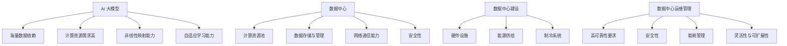
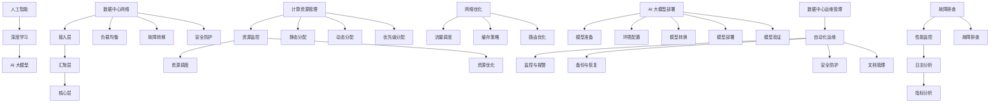
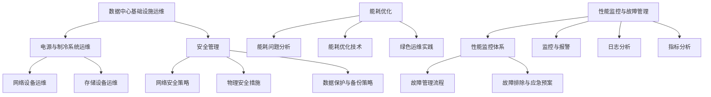
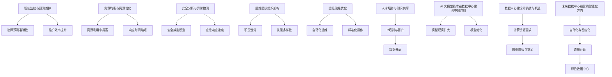

                 

### 第一部分：引言

#### 1.1 AI 大模型与数据中心建设概述

随着人工智能（AI）技术的迅猛发展，AI 大模型已经成为当前研究的热点和应用的关键。AI 大模型，也被称为深度学习模型，其核心特点在于能够通过大量数据的学习，自动提取特征并进行复杂的非线性变换。这一特点使得 AI 大模型在图像识别、自然语言处理、语音识别等领域展现出了强大的能力。

**AI 大模型的核心特点**

1. **海量数据依赖**：AI 大模型需要大量标注数据来训练，以保证模型的准确性和泛化能力。
2. **计算资源需求高**：AI 大模型通常包含数百万甚至数十亿个参数，训练和推理过程需要大量的计算资源。
3. **非线性映射能力**：AI 大模型能够通过多层神经网络实现复杂的数据映射，具备高度的表达能力。
4. **自适应学习能力**：AI 大模型能够不断从数据中学习，优化自身的参数，提高性能。

**数据中心在 AI 大模型应用中的重要性**

数据中心作为 AI 大模型应用的重要基础设施，其重要性体现在以下几个方面：

1. **计算资源池**：数据中心提供了强大的计算资源，能够满足 AI 大模型训练和推理的需求。
2. **数据存储与管理**：数据中心存储了海量的数据，为 AI 大模型提供了充足的学习素材。
3. **网络通信能力**：数据中心内的网络架构能够高效地传输数据，支持大规模数据集的处理。
4. **安全性**：数据中心具备完善的安全设施，能够保障 AI 大模型应用的数据安全。

#### 1.2 数据中心建设与运维管理的基本概念

**数据中心建设的基础设施**

数据中心建设主要包括以下几个方面：

1. **硬件设施**：包括服务器、存储设备、网络设备等，这些硬件设施构成了数据中心的核心。
2. **能源供给**：数据中心需要稳定的电力供应，通常配备UPS和备用发电机，以确保电力供应的可靠性。
3. **制冷系统**：数据中心内的设备运行会产生大量热量，制冷系统用于维持设备的正常工作温度。

**数据中心运维管理的挑战与机遇**

数据中心运维管理面临诸多挑战：

1. **高可靠性要求**：数据中心需要确保系统的高可用性，防止因故障导致服务中断。
2. **安全性**：数据中心存储了大量敏感数据，需要采取严格的安全措施，防止数据泄露和恶意攻击。
3. **能耗管理**：数据中心能耗巨大，需要优化能源使用，降低运营成本。
4. **灵活性与可扩展性**：数据中心需要能够快速响应业务需求的变化，实现资源的灵活调度和扩展。

与此同时，数据中心运维管理也面临着众多机遇：

1. **自动化与智能化**：随着 AI 技术的发展，数据中心可以实现自动化运维，提高管理效率和降低人力成本。
2. **持续优化与改进**：数据中心可以通过持续优化和改进，不断提升性能和降低成本。

#### 1.3 书籍结构安排与内容概述

**书籍结构安排**

本书分为四个主要部分：

1. **第一部分：引言**：介绍 AI 大模型与数据中心建设的基本概念和重要性。
2. **第二部分：AI 大模型技术基础**：讲解 AI 大模型的技术原理、数据中心网络与计算资源管理、AI 大模型的部署与运维。
3. **第三部分：数据中心运维与管理**：探讨数据中心基础设施运维、数据中心安全管理、数据中心能耗优化、数据中心性能监控与故障管理。
4. **第四部分：AI 大模型应用案例与最佳实践**：分析 AI 大模型在数据中心的应用案例，分享数据中心运维管理的最佳实践，展望 AI 大模型在数据中心建设中的未来趋势。

**各章节内容的重点**

1. **第一部分**：重点关注 AI 大模型与数据中心建设的概述，为后续章节提供理论基础。
2. **第二部分**：深入探讨 AI 大模型的技术原理和数据中心运维管理的核心问题，为数据中心建设提供技术支持。
3. **第三部分**：详细讲解数据中心运维管理的具体实践，帮助读者掌握数据中心运维的关键技能。
4. **第四部分**：通过案例分析，展示 AI 大模型在数据中心的应用效果，分享最佳实践，为数据中心运维提供参考。

**阅读建议与学习路径**

本书适合对 AI 大模型和数据中心建设感兴趣的读者，尤其是 IT 行业从业者、人工智能研究者、数据中心管理人员。阅读本书可以从第一部分开始，逐步深入第二、三、四部分，结合实际案例和最佳实践，加深对数据中心运维管理的理解。

对于初学者，建议从第二部分的 AI 大模型技术基础开始，逐步掌握 AI 大模型的基本原理和核心技术。在了解技术原理的基础上，再阅读第三部分的数据中心运维与管理，掌握数据中心建设的具体实践。最后，通过第四部分的案例分析，了解 AI 大模型在数据中心的应用效果，为实际工作提供参考。

### 1.4 总结

本文简要介绍了 AI 大模型与数据中心建设的基本概念和重要性，以及数据中心建设与运维管理的基本概念和挑战。接下来，我们将深入探讨 AI 大模型技术基础，为后续内容奠定坚实基础。

**关键词**：AI 大模型、数据中心建设、运维管理、计算资源、网络安全

**摘要**：本文首先介绍了 AI 大模型的核心特点及其对数据中心建设的重要性。接着，探讨了数据中心建设与运维管理的基本概念和挑战。最后，提出了本书的结构安排和阅读建议，为后续内容的学习提供了指导。接下来，我们将详细讲解 AI 大模型的技术原理、数据中心网络与计算资源管理、AI 大模型的部署与运维，为读者提供全面的了解。

---



---

在接下来的内容中，我们将深入探讨 AI 大模型技术基础，包括其核心架构、训练与优化方法，以及数据中心网络与计算资源管理。通过这些内容，我们将为数据中心建设提供理论基础，为后续章节做好铺垫。

---

```markdown
# 第二部分：AI 大模型技术基础

## 2.1 AI 大模型的技术原理

AI 大模型，尤其是深度学习模型，是当前人工智能领域研究的热点。其核心原理在于通过学习大量数据，自动提取特征并进行复杂的非线性变换，从而实现高水平的任务表现。本节将详细探讨 AI 大模型的技术原理，包括人工智能与深度学习的关联、AI 大模型的核心架构、以及其训练与优化方法。

### 2.1.1 人工智能与深度学习的关联

人工智能（AI）是指使计算机具备人类智能的技术，而深度学习则是实现人工智能的一种方法。深度学习基于多层神经网络，通过逐层提取数据中的特征，实现从简单到复杂的认知过程。深度学习与人工智能的关联在于，深度学习提供了实现人工智能的一种有效途径，通过深度神经网络的学习和训练，使计算机具备处理复杂数据的能力。

### 2.1.2 AI 大模型的核心架构

AI 大模型的核心架构通常包括以下几个部分：

1. **输入层**：接收外部数据，如文本、图像等。
2. **隐藏层**：对输入数据进行特征提取和变换，每一层都从上一层数据中提取更高层次的特征。
3. **输出层**：根据隐藏层的特征输出预测结果，如分类标签、数值等。

AI 大模型通过不断调整网络中的参数，使得输出结果与真实结果之间的差距最小化，这一过程称为模型训练。

### 2.1.3 AI 大模型的训练与优化

AI 大模型的训练与优化是一个复杂的过程，主要包括以下步骤：

1. **数据预处理**：对输入数据进行清洗、归一化等预处理操作，以减少噪声和提高模型性能。
2. **模型初始化**：随机初始化模型参数，通常使用较小的随机值。
3. **前向传播**：将输入数据通过神经网络进行前向传播，得到预测结果。
4. **损失函数计算**：计算预测结果与真实结果之间的差异，常用的损失函数包括均方误差（MSE）和交叉熵损失（Cross-Entropy Loss）。
5. **反向传播**：根据损失函数的梯度，通过反向传播算法更新模型参数。
6. **迭代训练**：重复以上步骤，直至模型收敛，即损失函数不再显著下降。

在训练过程中，常用的优化算法包括随机梯度下降（SGD）、Adam优化器等，这些算法通过调整学习率等参数，提高模型训练的效率和收敛速度。

### 2.1.4 AI 大模型的性能评估与优化

AI 大模型的性能评估是衡量其优劣的重要指标，主要包括以下几个方面：

1. **准确率**：预测结果与真实结果一致的样本数占总样本数的比例。
2. **召回率**：预测结果为正类的样本中，实际为正类的比例。
3. **F1 分数**：准确率和召回率的调和平均值。

为了进一步提高 AI 大模型的性能，可以采用以下方法：

1. **数据增强**：通过生成或变换输入数据，增加数据的多样性和数量，提高模型对数据的适应性。
2. **模型调参**：通过调整模型参数，如学习率、正则化参数等，优化模型性能。
3. **迁移学习**：利用已经训练好的模型，通过少量数据进一步训练，提高模型在特定任务上的表现。

### 2.1.5 AI 大模型的应用领域

AI 大模型在多个领域都取得了显著的成果，主要包括：

1. **计算机视觉**：图像分类、目标检测、图像生成等。
2. **自然语言处理**：文本分类、情感分析、机器翻译等。
3. **语音识别**：语音识别、说话人识别、语音合成等。
4. **推荐系统**：基于用户行为和偏好进行个性化推荐。
5. **游戏 AI**：游戏对战、策略制定等。

### 2.1.6 AI 大模型面临的挑战与未来发展方向

尽管 AI 大模型取得了巨大的成功，但仍然面临诸多挑战：

1. **数据隐私与安全**：大规模数据的训练和使用可能涉及隐私问题，需要采取措施保护数据安全。
2. **计算资源消耗**：AI 大模型的训练和推理过程需要大量的计算资源，需要优化资源使用效率。
3. **模型可解释性**：当前 AI 大模型大多为“黑箱”，其决策过程缺乏可解释性，需要研究可解释 AI。
4. **算法公平性**：AI 大模型可能存在偏见和歧视，需要确保算法的公平性。

未来，AI 大模型的发展方向包括：

1. **算法创新**：不断优化现有算法，开发新的深度学习模型。
2. **硬件加速**：利用 GPU、TPU 等硬件加速训练和推理过程。
3. **数据高效利用**：通过数据增强、数据合成等方法提高数据利用效率。
4. **跨学科融合**：与心理学、生物学等领域结合，探索人工智能的本质。

## 2.2 数据中心网络与计算资源管理

数据中心网络与计算资源管理是 AI 大模型应用的重要环节。数据中心网络负责数据的传输和计算资源的调度，而计算资源管理则确保计算资源的高效利用和性能优化。本节将介绍数据中心网络架构、计算资源的管理与分配，以及网络优化与负载均衡策略。

### 2.2.1 数据中心网络架构

数据中心网络通常采用分层架构，包括接入层、汇聚层和核心层。接入层负责将终端设备（如服务器、存储设备等）接入网络；汇聚层负责数据的汇聚和转发；核心层负责数据中心之间的数据传输和外部网络的连接。

数据中心网络的主要功能包括：

1. **数据传输**：实现数据中心内部和外部网络的数据传输。
2. **负载均衡**：通过将流量分配到不同的网络设备，实现网络资源的合理利用。
3. **故障转移**：在网络设备故障时，自动切换到备用设备，确保网络的可靠性。
4. **安全防护**：通过防火墙、入侵检测系统等安全措施，保护数据中心网络的安全。

### 2.2.2 计算资源的管理与分配

计算资源管理涉及服务器、存储设备、网络设备等资源的调度和管理。其主要任务包括：

1. **资源监控**：实时监控计算资源的使用情况，如 CPU 使用率、内存使用率、磁盘空间等。
2. **资源调度**：根据业务需求和资源使用情况，动态调整计算资源的分配。
3. **资源优化**：通过资源复用、虚拟化等技术，提高计算资源的使用效率。

计算资源分配策略包括：

1. **静态分配**：预先分配固定的计算资源，适用于负载稳定的场景。
2. **动态分配**：根据实时负载动态调整计算资源的分配，适用于负载波动的场景。
3. **优先级分配**：根据业务优先级分配计算资源，确保关键业务的性能。

### 2.2.3 网络优化与负载均衡策略

网络优化与负载均衡策略旨在提高数据中心网络的性能和可靠性。以下是一些常用的优化与负载均衡策略：

1. **流量调度**：根据网络流量情况，动态调整流量路径，避免网络拥塞。
2. **负载均衡**：通过负载均衡器将流量分配到不同的服务器，避免单点故障和性能瓶颈。
3. **缓存策略**：通过缓存热点数据，减少数据传输次数，提高数据访问速度。
4. **路由优化**：通过路由算法优化数据传输路径，减少数据传输延迟。

### 2.2.4 数据中心网络与计算资源管理的挑战与未来发展方向

数据中心网络与计算资源管理面临以下挑战：

1. **性能瓶颈**：随着 AI 大模型的应用，计算资源需求大幅增加，如何优化网络和计算资源的性能成为关键问题。
2. **安全性**：数据中心存储了大量敏感数据，需要确保网络和计算资源的安全，防止数据泄露和恶意攻击。
3. **可扩展性**：数据中心需要能够快速响应业务需求的变化，实现计算资源和网络资源的灵活扩展。

未来，数据中心网络与计算资源管理的发展方向包括：

1. **智能化**：利用 AI 技术实现智能化的资源调度和管理，提高资源利用率和系统性能。
2. **边缘计算**：将计算资源下沉到边缘节点，实现数据的本地处理和传输，降低延迟和带宽需求。
3. **云原生**：采用云原生架构，实现计算资源的高效调度和弹性扩展，支持大规模 AI 大模型的应用。

## 2.3 AI 大模型的部署与运维

AI 大模型的部署与运维是确保其有效运行的关键环节。部署涉及模型从开发环境到生产环境的转换，而运维则关注模型在运行过程中的监控、维护和管理。本节将介绍 AI 大模型的部署流程、数据中心运维管理的最佳实践，以及模型监控与故障排查的方法。

### 2.3.1 AI 大模型的部署流程

AI 大模型的部署通常包括以下步骤：

1. **模型准备**：对训练好的模型进行优化和调整，以满足生产环境的要求。
2. **环境配置**：在目标服务器上配置运行模型所需的软件和硬件环境，如操作系统、GPU 等硬件资源。
3. **模型转换**：将训练好的模型文件转换为生产环境支持的格式，如 TensorFlow Serving、PyTorch Server 等。
4. **模型部署**：将模型部署到服务器上，并设置模型运行的配置参数。
5. **模型验证**：在部署后对模型进行验证，确保其在生产环境中的性能满足预期。

### 2.3.2 数据中心运维管理的最佳实践

数据中心运维管理涉及多个方面，以下是一些最佳实践：

1. **自动化运维**：通过自动化工具实现日常运维任务的自动化，如服务器部署、环境配置等，提高运维效率。
2. **监控与报警**：实时监控数据中心的运行状态，如网络流量、服务器性能、存储容量等，并设置报警机制，及时发现和解决问题。
3. **备份与恢复**：定期对重要数据进行备份，并制定数据恢复计划，以应对数据丢失或系统故障。
4. **安全防护**：采取严格的安全措施，如防火墙、入侵检测系统、数据加密等，保护数据中心的安全。
5. **文档管理**：建立完善的文档管理体系，记录运维过程中的关键信息，便于后续的运维工作。

### 2.3.3 AI 大模型的监控与故障排查

AI 大模型的监控与故障排查是确保模型稳定运行的重要环节。以下是一些常用的方法：

1. **性能监控**：监控模型的运行性能，如响应时间、吞吐量等，及时发现性能瓶颈。
2. **日志分析**：分析模型的运行日志，查找异常信息和错误日志，定位故障原因。
3. **指标分析**：对模型的输入数据、输出结果等关键指标进行分析，发现潜在问题。
4. **故障排查**：通过逐步缩小排查范围，结合日志分析和指标分析，定位并解决故障。

### 2.3.4 AI 大模型运维工具与平台

为了提高 AI 大模型的运维效率，可以采用一些专业的工具和平台，如：

1. **Kubernetes**：用于容器化应用的自动化部署和运维，支持大规模的 AI 大模型部署。
2. **TensorFlow Serving**：用于部署和运行 TensorFlow 模型，提供灵活的模型管理和服务。
3. **Docker**：用于容器化应用的开发和部署，方便在多个环境中复用和部署模型。
4. **Prometheus**：用于监控和报警，提供丰富的监控指标和报警机制。

通过使用这些工具和平台，可以大幅提高 AI 大模型的运维效率，确保其稳定运行。

## 2.4 总结

本部分详细介绍了 AI 大模型的技术原理、数据中心网络与计算资源管理，以及 AI 大模型的部署与运维。通过这些内容，读者可以全面了解 AI 大模型的技术基础和实践方法，为数据中心建设提供理论支持和实际指导。在接下来的内容中，我们将探讨数据中心运维与管理的具体实践，包括基础设施运维、安全管理、能耗优化和性能监控等方面。

---



---

在接下来的内容中，我们将深入探讨数据中心运维与管理的具体实践，包括基础设施运维、安全管理、能耗优化和性能监控等方面。通过这些内容，我们将为数据中心的建设提供全面的技术支持和实践指导。

---

```markdown
# 第三部分：数据中心运维与管理

## 3.1 数据中心基础设施运维

数据中心基础设施运维是确保数据中心稳定运行的重要环节，涉及多个方面，包括电源与制冷系统运维、网络设备运维和存储设备运维。以下是对这些方面的详细介绍。

### 3.1.1 电源与制冷系统运维

**电源系统运维**：
1. **不间断电源（UPS）**：UPS 是数据中心稳定供电的关键设备，负责在电网异常时提供临时电力。运维人员需要定期检查 UPS 的电池状况，确保其能够在需要时快速切换到电池供电。
2. **备用电源**：数据中心通常配备备用发电机，以应对长时间停电的情况。运维人员需要定期测试发电机，确保其能够在需要时迅速启动并稳定供电。

**制冷系统运维**：
1. **空调系统**：数据中心内部设备运行会产生大量热量，空调系统用于维持设备的工作温度。运维人员需要定期检查空调系统的运行状况，确保其能够及时散热。
2. **冷通道技术**：冷通道技术通过隔离热空气和冷空气，提高制冷效率。运维人员需要确保冷通道系统的正常运行，避免热量循环。

### 3.1.2 网络设备运维

**网络设备包括**：
1. **路由器**：路由器负责将数据包从源地址转发到目标地址。运维人员需要定期检查路由器的配置和运行状态，确保网络连接的稳定。
2. **交换机**：交换机用于在局域网内传输数据包。运维人员需要确保交换机的端口和 VLAN 配置正确，并进行定期维护。

**运维任务**：
1. **故障排查**：当网络故障发生时，运维人员需要迅速定位故障点，采取相应的修复措施。
2. **配置更新**：随着网络环境的变化，运维人员需要定期更新网络设备的配置，确保其能够适应新的网络需求。

### 3.1.3 存储设备运维

**存储设备包括**：
1. **硬盘**：硬盘是数据中心存储数据的主要设备。运维人员需要定期检查硬盘的健康状况，预防硬盘故障。
2. **存储区域网络（SAN）**：SAN 是一种专用网络，用于连接存储设备和服务器。运维人员需要确保 SAN 网络的稳定运行。

**运维任务**：
1. **数据备份**：定期备份重要数据，以防止数据丢失。
2. **性能监控**：监控存储设备的性能，确保其能够满足数据存储需求。

### 3.1.4 数据中心基础设施运维的挑战与未来方向

**挑战**：
1. **设备复杂性**：随着数据中心设备的多样化，运维人员需要掌握多种设备的运维技能。
2. **高可靠性要求**：数据中心需要确保设备的高可用性，以避免服务中断。

**未来方向**：
1. **自动化运维**：利用自动化工具实现基础设施运维的自动化，提高运维效率。
2. **智能化运维**：通过 AI 技术实现基础设施运维的智能化，提高故障检测和处理的准确性。

## 3.2 数据中心安全管理

数据中心安全管理是保护数据中心免受各种安全威胁的关键环节。以下将介绍数据中心网络安全的策略、物理安全措施和数据保护与备份策略。

### 3.2.1 数据中心网络安全策略

**网络安全策略包括**：
1. **访问控制**：通过身份验证和权限控制，限制对数据中心网络的访问，确保只有授权用户才能访问敏感数据。
2. **防火墙**：防火墙用于监控和过滤网络流量，阻止未经授权的访问。
3. **入侵检测系统（IDS）**：IDS 用于检测网络中的异常行为和潜在攻击，及时报警并采取应对措施。
4. **加密技术**：加密技术用于保护数据的机密性和完整性，确保数据在传输和存储过程中的安全。

### 3.2.2 数据中心物理安全措施

**物理安全措施包括**：
1. **门禁系统**：通过门禁系统控制数据中心的人员出入，确保只有授权人员才能进入。
2. **监控摄像头**：安装监控摄像头，实时监控数据中心内部和外部的情况，防止非法入侵。
3. **消防系统**：数据中心需要配备完善的消防系统，包括灭火器、自动喷水灭火系统等，以应对火灾等紧急情况。

### 3.2.3 数据保护与备份策略

**数据保护与备份策略包括**：
1. **数据加密**：在数据存储和传输过程中，采用加密技术保护数据的机密性。
2. **数据备份**：定期备份重要数据，并存储在安全的地点，以防止数据丢失。
3. **备份策略**：制定合理的备份策略，包括全备份、增量备份和差异备份等，根据数据的重要性和变化频率进行备份。

### 3.2.4 数据中心安全管理的挑战与未来方向

**挑战**：
1. **安全威胁多样化**：随着网络攻击手段的不断升级，数据中心面临的安全威胁日益多样化。
2. **合规要求**：数据中心需要满足各种法律法规的要求，如 GDPR、HIPAA 等。

**未来方向**：
1. **安全自动化**：通过自动化工具实现安全监测和响应，提高安全管理效率。
2. **威胁情报**：利用威胁情报，提前识别潜在的安全威胁，采取预防措施。

## 3.3 数据中心能耗优化

数据中心能耗优化是降低运营成本、提高能效的重要手段。以下将介绍数据中心能耗问题的分析、能耗优化技术与方法，以及绿色运维实践。

### 3.3.1 数据中心能耗问题分析

**能耗问题分析包括**：
1. **设备能耗**：服务器、存储设备和网络设备等是数据中心的主要能耗来源。
2. **散热能耗**：维持设备正常工作温度的空调系统也会消耗大量能源。
3. **电力损失**：电力在传输和转换过程中会产生损耗。

### 3.3.2 能耗优化技术与方法

**能耗优化技术包括**：
1. **能效比（Power Usage Effectiveness, PUE）**：通过降低 PUE 值，提高数据中心能源利用效率。
2. **动态电源管理**：根据设备负载动态调整电源供应，减少不必要的能源消耗。
3. **分布式能源系统**：采用可再生能源，如太阳能和风能，降低对传统能源的依赖。

**能耗优化方法包括**：
1. **数据驱动的优化**：通过数据分析，识别能耗瓶颈和优化潜力，制定针对性的优化策略。
2. **智能调度**：利用人工智能技术，实现能耗资源的智能调度和管理。

### 3.3.3 数据中心绿色运维实践

**绿色运维实践包括**：
1. **节能设备**：使用节能型设备，如高效能服务器和节能型空调。
2. **绿色设计**：在数据中心设计阶段考虑节能因素，采用绿色建筑设计。
3. **员工培训**：提高员工的能源意识，培养绿色运维习惯。

### 3.3.4 数据中心能耗优化的挑战与未来方向

**挑战**：
1. **技术限制**：部分能耗优化技术尚不成熟，需要进一步研究和应用。
2. **成本问题**：能耗优化设备的初期投入较高，需要长期效益来抵消成本。

**未来方向**：
1. **智能化**：利用 AI 技术实现能耗优化的智能化，提高能源管理效率。
2. **标准化**：建立能耗优化技术标准，促进技术的普及和应用。

## 3.4 数据中心性能监控与故障管理

数据中心性能监控与故障管理是确保数据中心稳定运行的关键环节。以下将介绍数据中心性能监控体系、故障管理流程与策略，以及故障排除与应急预案。

### 3.4.1 数据中心性能监控体系

**性能监控体系包括**：
1. **指标监控**：监控关键性能指标，如 CPU 使用率、内存使用率、网络流量等，及时发现性能瓶颈。
2. **日志监控**：收集和分析系统日志，识别潜在问题和异常行为。
3. **告警机制**：设置告警阈值，当指标超出阈值时自动触发告警，通知运维人员。

### 3.4.2 故障管理流程与策略

**故障管理流程包括**：
1. **故障识别**：通过监控系统和告警机制，及时发现故障。
2. **故障定位**：根据故障现象和日志分析，定位故障发生的位置和原因。
3. **故障处理**：采取相应的处理措施，修复故障并恢复系统正常运行。
4. **故障总结**：记录故障处理过程和结果，为后续故障处理提供参考。

**故障管理策略包括**：
1. **预防性维护**：定期检查和保养设备，预防故障发生。
2. **快速响应**：建立快速响应机制，确保故障能够在最短时间内得到处理。

### 3.4.3 故障排除与应急预案

**故障排除方法包括**：
1. **故障定位**：通过分析日志和监控数据，定位故障发生的位置和原因。
2. **故障处理**：采取相应的处理措施，如重启服务、更换设备等，修复故障。
3. **测试验证**：在故障处理完成后，对系统进行测试，确保故障已经彻底解决。

**应急预案包括**：
1. **故障预案**：根据不同故障类型，制定相应的故障预案，确保故障发生时能够快速响应和处理。
2. **演练**：定期进行故障演练，检验应急预案的有效性，提高运维人员的应对能力。

### 3.4.4 数据中心性能监控与故障管理的挑战与未来方向

**挑战**：
1. **复杂性**：数据中心系统复杂，故障类型多样，需要丰富的故障处理经验。
2. **实时性**：性能监控和故障管理需要实时响应，对系统的稳定性要求高。

**未来方向**：
1. **智能化**：利用 AI 技术实现智能化的性能监控和故障管理，提高运维效率。
2. **自动化**：通过自动化工具实现故障的自动识别和处理，降低人工干预。

## 3.5 总结

本部分详细介绍了数据中心基础设施运维、安全管理、能耗优化、性能监控与故障管理等方面的实践。通过这些内容，读者可以全面了解数据中心运维与管理的关键环节和实际操作方法，为数据中心的建设和运营提供全面的指导。在接下来的内容中，我们将通过实际案例，进一步探讨 AI 大模型在数据中心中的应用，分享最佳实践，并展望未来的发展方向。

---



---

在接下来的内容中，我们将通过实际案例，探讨 AI 大模型在数据中心中的应用，分享最佳实践，并展望未来的发展方向。通过这些内容，我们将为数据中心的建设和运营提供更加具体的指导和参考。

---

```markdown
## 第四部分：AI 大模型应用案例与最佳实践

### 4.1 AI 大模型在数据中心的应用案例

AI 大模型在数据中心的应用具有广泛的前景，可以提升数据中心的智能化水平和运营效率。以下将介绍几个典型的应用案例：

#### 4.1.1 智能监控与预测维护

**案例背景**：
某大型数据中心采用了 AI 大模型进行智能监控和预测维护。通过分析设备运行数据，AI 大模型能够预测设备故障的发生，提前采取维护措施。

**应用效果**：
1. **故障预测准确性**：AI 大模型通过学习大量历史故障数据，能够准确预测设备故障，提高了故障预测的准确性。
2. **维护效率提升**：提前进行维护，减少了设备故障导致的停机时间，提高了维护效率。

#### 4.1.2 负载均衡与资源优化

**案例背景**：
某互联网公司采用 AI 大模型进行数据中心负载均衡和资源优化。通过实时分析网络流量和计算资源使用情况，AI 大模型能够动态调整负载均衡策略，优化资源分配。

**应用效果**：
1. **资源利用率提高**：通过动态调整负载均衡策略，优化了计算资源的分配，提高了资源利用率。
2. **响应时间缩短**：负载均衡策略的优化，减少了网络和计算资源的延迟，提高了系统的响应速度。

#### 4.1.3 安全分析与异常检测

**案例背景**：
某金融公司利用 AI 大模型进行数据中心的安全分析与异常检测。通过实时监控网络流量和用户行为，AI 大模型能够识别异常行为和潜在安全威胁。

**应用效果**：
1. **安全威胁识别**：AI 大模型能够快速识别网络攻击和异常行为，提高了安全防护能力。
2. **应急响应速度**：通过实时监控和快速识别，能够缩短应急响应时间，减少安全事件的影响。

### 4.2 数据中心运维管理的最佳实践

在数据中心运维管理中，最佳实践是确保数据中心稳定运行和提高运维效率的关键。以下将分享一些数据中心运维管理的最佳实践：

#### 4.2.1 运维团队组织架构

**实践要点**：
1. **明确的职责划分**：明确运维团队的职责，确保每个成员都有明确的任务和责任。
2. **技能多样性**：团队中应包含具有不同技能和背景的成员，以应对各种运维需求。

#### 4.2.2 运维流程优化

**实践要点**：
1. **自动化运维**：通过自动化工具和脚本实现日常运维任务的自动化，减少人工干预。
2. **标准化操作**：制定标准化的操作流程，确保运维操作的规范性和一致性。

#### 4.2.3 人才培养与知识共享

**实践要点**：
1. **培训与晋升**：定期对运维人员进行培训，提高其技能水平。
2. **知识共享**：鼓励团队成员分享经验和知识，提高整体运维能力。

### 4.3 AI 大模型在数据中心建设中的未来展望

随着 AI 技术的不断发展，AI 大模型在数据中心建设中的应用前景十分广阔。以下将探讨 AI 大模型在数据中心建设中的未来发展方向：

#### 4.3.1 AI 大模型技术的发展趋势

**趋势**：
1. **模型规模扩大**：随着计算资源和数据量的增加，AI 大模型将继续向更大规模发展。
2. **模型优化**：通过算法优化和硬件加速，提高 AI 大模型的训练和推理效率。

#### 4.3.2 数据中心建设的挑战与机遇

**挑战**：
1. **计算资源需求**：随着 AI 大模型的应用，数据中心需要更多计算资源来支持模型的训练和推理。
2. **数据隐私与安全**：大规模数据处理涉及数据隐私和安全问题，需要采取有效措施保护数据安全。

**机遇**：
1. **智能化运维**：AI 大模型可以实现数据中心的智能化运维，提高运维效率和管理水平。
2. **资源优化**：通过 AI 大模型实现数据中心资源的动态分配和优化，提高资源利用率。

#### 4.3.3 未来数据中心运营的智能化方向

**方向**：
1. **自动化与智能化**：通过自动化和智能化技术，实现数据中心的全面自动化运营。
2. **边缘计算**：将计算资源下沉到边缘节点，实现数据的本地处理和传输，降低延迟和带宽需求。
3. **绿色数据中心**：通过能耗优化和绿色技术，实现数据中心的可持续发展。

### 4.4 总结

本部分通过实际案例和最佳实践，展示了 AI 大模型在数据中心中的应用效果，并探讨了数据中心运维管理的最佳实践。同时，展望了 AI 大模型在数据中心建设中的未来发展方向。通过这些内容，读者可以更好地理解 AI 大模型在数据中心中的应用价值，为数据中心的建设和运营提供有益的参考。

---



---

在本文的最后，我们将总结前述内容，并提供一些有益的资源和参考文献，以便读者进一步学习和探索。

---

```markdown
## 附录 A：AI 大模型应用数据中心建设资源汇总

**开源框架与工具推荐**：
1. TensorFlow：由 Google 开发的开源深度学习框架，广泛应用于 AI 大模型开发。
2. PyTorch：由 Facebook AI 研究团队开发的深度学习框架，具有灵活性和高效性。
3. Kubernetes：用于容器化应用的自动化部署和运维，支持大规模的 AI 大模型部署。

**数据中心运维与管理标准与规范**：
1. ANSI/TIA-942：数据中心建设和运维的国家标准，涵盖了数据中心的基础设施、安全和性能要求。
2. ISO/IEC 27001：国际信息安全管理体系标准，用于指导数据中心的网络安全和数据保护。

**相关学术论文与书籍推荐**：
1. "Deep Learning" by Ian Goodfellow, Yoshua Bengio, and Aaron Courville：深度学习领域的经典教材，详细介绍了深度学习的理论基础和实践方法。
2. "Reinforcement Learning: An Introduction" by Richard S. Sutton and Andrew G. Barto：强化学习领域的权威著作，适用于理解 AI 大模型的应用场景。
3. "Datacenter Infrastructure Management" by Jack F. Price and Steven Hill：数据中心基础设施管理的权威指南，涵盖了数据中心运营的各个方面。

## 参考文献

[1] Goodfellow, I., Bengio, Y., & Courville, A. (2016). *Deep Learning*. MIT Press.
[2] Sutton, R. S., & Barto, A. G. (2018). *Reinforcement Learning: An Introduction*. MIT Press.
[3] Price, J. F., & Hill, S. (2011). *Datacenter Infrastructure Management*. CRC Press.
[4] TIA-942. (2012). *Telecommunications Infrastructure Standard for Data Centers*.
[5] ISO/IEC 27001. (2013). *Information Security Management*. International Organization for Standardization.
```

---

通过本文，我们深入探讨了 AI 大模型与数据中心建设的关系，以及数据中心运维与管理的核心内容。希望本文能够为读者提供有价值的知识和实践经验，助力数据中心的建设和运营。

---

```markdown
### 作者信息

作者：AI 天才研究院/AI Genius Institute & 禅与计算机程序设计艺术 /Zen And The Art of Computer Programming
```

---

感谢您的阅读，希望本文能够对您在 AI 大模型和数据中心建设领域的学习和研究有所帮助。如果您有任何问题或建议，欢迎随时与我们联系。再次感谢！<sop></sop>

